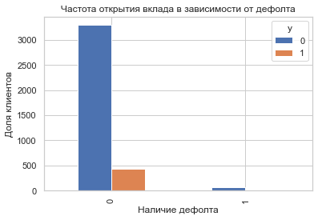
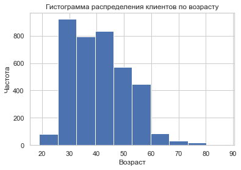
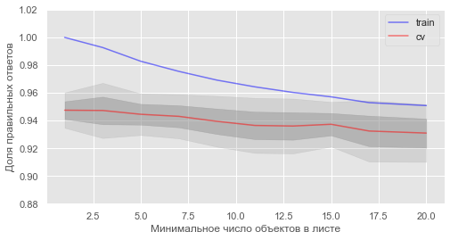

## Моделирование склонности клиентов банка к открытию депозита

### В работе были реализованы следующие методы: линейная и логистическая регрессия, метод ближайших соседей, деревья решений, метод опорных векторов, случайный лес, бустинг, градиентный бустинг, stacking. 
### Для оценки качества для каждой модели были высчитаны показатели: accuracy, recall, support, F-бета, а также матрица сопряженности, были построены ROC-кривые со значением AUC. 
### С помощью анализа всех этих параметров было выявлено, что для нашего набора данных лучше всего подходит метод бустинг.


```python
import pandas as pd
import numpy as np
from sklearn import preprocessing
import matplotlib.pyplot as plt 
plt.rc("font", size=14)
from sklearn.linear_model import LogisticRegression
from sklearn.model_selection import train_test_split
import seaborn as sns
sns.set(style="white")
sns.set(style="whitegrid", color_codes=True)
```


```python
data = pd.read_csv('bank_term_deposit.csv',sep=',')
data
```


<div>
<style scoped>
    .dataframe tbody tr th:only-of-type {
        vertical-align: middle;
    }

    .dataframe tbody tr th {
        vertical-align: top;
    }

    .dataframe thead th {
        text-align: right;
    }
</style>
<table border="1" class="dataframe">
  <thead>
    <tr style="text-align: right;">
      <th></th>
      <th>age</th>
      <th>job</th>
      <th>marital</th>
      <th>education</th>
      <th>default</th>
      <th>balance</th>
      <th>housing</th>
      <th>loan</th>
      <th>day</th>
      <th>month</th>
      <th>duration</th>
      <th>campaign</th>
      <th>pdays</th>
      <th>previous</th>
      <th>poutcome</th>
      <th>y</th>
    </tr>
  </thead>
  <tbody>
    <tr>
      <th>0</th>
      <td>30.0</td>
      <td>unemployed</td>
      <td>married</td>
      <td>primary</td>
      <td>no</td>
      <td>1787.0</td>
      <td>no</td>
      <td>no</td>
      <td>19</td>
      <td>oct</td>
      <td>79</td>
      <td>1</td>
      <td>-1</td>
      <td>0</td>
      <td>unknown</td>
      <td>no</td>
    </tr>
    <tr>
      <th>1</th>
      <td>33.0</td>
      <td>services</td>
      <td>married</td>
      <td>secondary</td>
      <td>no</td>
      <td>4789.0</td>
      <td>yes</td>
      <td>yes</td>
      <td>11</td>
      <td>may</td>
      <td>220</td>
      <td>1</td>
      <td>339</td>
      <td>4</td>
      <td>failure</td>
      <td>no</td>
    </tr>
    <tr>
      <th>2</th>
      <td>NaN</td>
      <td>management</td>
      <td>single</td>
      <td>tertiary</td>
      <td>no</td>
      <td>135.0</td>
      <td>yes</td>
      <td>no</td>
      <td>16</td>
      <td>apr</td>
      <td>185</td>
      <td>1</td>
      <td>330</td>
      <td>1</td>
      <td>failure</td>
      <td>no</td>
    </tr>
    <tr>
      <th>3</th>
      <td>30.0</td>
      <td>management</td>
      <td>married</td>
      <td>tertiary</td>
      <td>no</td>
      <td>1476.0</td>
      <td>yes</td>
      <td>yes</td>
      <td>3</td>
      <td>jun</td>
      <td>199</td>
      <td>4</td>
      <td>-1</td>
      <td>0</td>
      <td>unknown</td>
      <td>no</td>
    </tr>
    <tr>
      <th>4</th>
      <td>59.0</td>
      <td>blue-collar</td>
      <td>married</td>
      <td>secondary</td>
      <td>no</td>
      <td>NaN</td>
      <td>yes</td>
      <td>no</td>
      <td>5</td>
      <td>may</td>
      <td>226</td>
      <td>1</td>
      <td>-1</td>
      <td>0</td>
      <td>unknown</td>
      <td>no</td>
    </tr>
    <tr>
      <th>...</th>
      <td>...</td>
      <td>...</td>
      <td>...</td>
      <td>...</td>
      <td>...</td>
      <td>...</td>
      <td>...</td>
      <td>...</td>
      <td>...</td>
      <td>...</td>
      <td>...</td>
      <td>...</td>
      <td>...</td>
      <td>...</td>
      <td>...</td>
      <td>...</td>
    </tr>
    <tr>
      <th>4516</th>
      <td>33.0</td>
      <td>services</td>
      <td>married</td>
      <td>secondary</td>
      <td>no</td>
      <td>-333.0</td>
      <td>yes</td>
      <td>no</td>
      <td>30</td>
      <td>jul</td>
      <td>329</td>
      <td>5</td>
      <td>-1</td>
      <td>0</td>
      <td>unknown</td>
      <td>no</td>
    </tr>
    <tr>
      <th>4517</th>
      <td>57.0</td>
      <td>self-employed</td>
      <td>married</td>
      <td>tertiary</td>
      <td>yes</td>
      <td>-3313.0</td>
      <td>yes</td>
      <td>yes</td>
      <td>9</td>
      <td>may</td>
      <td>153</td>
      <td>1</td>
      <td>-1</td>
      <td>0</td>
      <td>unknown</td>
      <td>no</td>
    </tr>
    <tr>
      <th>4518</th>
      <td>57.0</td>
      <td>technician</td>
      <td>married</td>
      <td>secondary</td>
      <td>no</td>
      <td>295.0</td>
      <td>no</td>
      <td>no</td>
      <td>19</td>
      <td>aug</td>
      <td>151</td>
      <td>11</td>
      <td>-1</td>
      <td>0</td>
      <td>unknown</td>
      <td>no</td>
    </tr>
    <tr>
      <th>4519</th>
      <td>28.0</td>
      <td>blue-collar</td>
      <td>married</td>
      <td>secondary</td>
      <td>no</td>
      <td>1137.0</td>
      <td>no</td>
      <td>no</td>
      <td>6</td>
      <td>feb</td>
      <td>129</td>
      <td>4</td>
      <td>211</td>
      <td>3</td>
      <td>other</td>
      <td>no</td>
    </tr>
    <tr>
      <th>4520</th>
      <td>44.0</td>
      <td>entrepreneur</td>
      <td>single</td>
      <td>tertiary</td>
      <td>no</td>
      <td>1136.0</td>
      <td>yes</td>
      <td>yes</td>
      <td>3</td>
      <td>apr</td>
      <td>345</td>
      <td>2</td>
      <td>249</td>
      <td>7</td>
      <td>other</td>
      <td>no</td>
    </tr>
  </tbody>
</table>
<p>4521 rows × 16 columns</p>
</div>


```python
data.info()
```

    <class 'pandas.core.frame.DataFrame'>
    RangeIndex: 4521 entries, 0 to 4520
    Data columns (total 16 columns):
     #   Column     Non-Null Count  Dtype  
    ---  ------     --------------  -----  
     0   age        3984 non-null   float64
     1   job        4521 non-null   object 
     2   marital    4521 non-null   object 
     3   education  4521 non-null   object 
     4   default    4521 non-null   object 
     5   balance    4164 non-null   float64
     6   housing    4521 non-null   object 
     7   loan       4521 non-null   object 
     8   day        4521 non-null   int64  
     9   month      4521 non-null   object 
     10  duration   4521 non-null   int64  
     11  campaign   4521 non-null   int64  
     12  pdays      4521 non-null   int64  
     13  previous   4521 non-null   int64  
     14  poutcome   4521 non-null   object 
     15  y          4521 non-null   object 
    dtypes: float64(2), int64(5), object(9)
    memory usage: 565.2+ KB
    

Информация о данных:

* age: возраст клиента
* job :тип работы
* marital :семейное положение
* balance: средний годовой баланс в евро
* education: уровень образования
* default: есть кредит по умолчанию?
* housing: есть жилищный кредит?
* loan: есть личный кредит?
* month: месяц последнего контакта в году
* day: день последнего контакта недели
* duration: продолжительность последнего контакта в секундах
* campaign: количество контактов, выполненных во время этой кампании и для этой клиент
* pdays: количество дней, прошедших с момента последнего контакта с клиентом из предыдущей кампании
* previous: количество контактов, выполненных до этой кампании и для этого клиента
* poutcome: итог предыдущей маркетинговой кампании сотрудников -квартальный показатель (числовой)
* у -оформил ли клиент срочный вклад? (двоичный: «да», «нет»)

Первый взгляд позволяет сделать выводы:

    * в наборе данных представлены данные по 4521 клиенту банка
    * есть пропуски в столбцах age и balance
    * данные разных типов - строковые, числовые


```python
data.duplicated().sum()
```


    0


Следовательно, повторяющихся строк в данных нет.


```python
# поиск дубликатов в education
lst = data.columns.tolist()
for i in lst:
    print(i)
    print(data[f'{i}'].value_counts())
    print('-'*50)
```

    age
    32.0    224
    31.0    199
    36.0    188
    33.0    186
    37.0    161
           ... 
    68.0      2
    87.0      1
    81.0      1
    86.0      1
    84.0      1
    Name: age, Length: 61, dtype: int64
    --------------------------------------------------
    job
    management       969
    blue-collar      946
    technician       768
    admin.           478
    services         417
    retired          230
    self-employed    183
    entrepreneur     168
    unemployed       128
    housemaid        112
    student           84
    unknown           38
    Name: job, dtype: int64
    --------------------------------------------------
    marital
    married     2797
    single      1196
    divorced     528
    Name: marital, dtype: int64
    --------------------------------------------------
    education
    secondary    2306
    tertiary     1350
    primary       678
    unknown       187
    Name: education, dtype: int64
    --------------------------------------------------
    default
    no     4445
    yes      76
    Name: default, dtype: int64
    --------------------------------------------------
    balance
    2.0       32
    1.0       28
    23.0      23
    5.0       23
    15.0      20
              ..
    2558.0     1
    464.0      1
    2418.0     1
    728.0      1
    1137.0     1
    Name: balance, Length: 1816, dtype: int64
    --------------------------------------------------
    housing
    yes    2559
    no     1962
    Name: housing, dtype: int64
    --------------------------------------------------
    loan
    no     3830
    yes     691
    Name: loan, dtype: int64
    --------------------------------------------------
    day
    20    257
    18    226
    19    201
    21    198
    14    195
    17    191
    7     190
    6     187
    28    181
    5     181
    8     180
    29    175
    15    174
    30    168
    13    166
    16    164
    9     163
    11    152
    12    151
    4     139
    2     114
    27    113
    26    110
    3     105
    23    102
    22     86
    25     80
    31     59
    10     50
    24     36
    1      27
    Name: day, dtype: int64
    --------------------------------------------------
    month
    may    1398
    jul     706
    aug     633
    jun     531
    nov     389
    apr     293
    feb     222
    jan     148
    oct      80
    sep      52
    mar      49
    dec      20
    Name: month, dtype: int64
    --------------------------------------------------
    duration
    123     27
    104     25
    119     23
    77      22
    58      22
            ..
    762      1
    602      1
    923      1
    1032     1
    660      1
    Name: duration, Length: 875, dtype: int64
    --------------------------------------------------
    campaign
    1     1734
    2     1264
    3      558
    4      325
    5      167
    6      155
    7       75
    8       56
    9       30
    10      27
    11      22
    12      21
    13      17
    14      10
    15       9
    16       8
    17       7
    18       7
    25       4
    19       3
    20       3
    28       3
    24       3
    32       2
    21       2
    23       2
    22       2
    31       1
    29       1
    50       1
    30       1
    44       1
    Name: campaign, dtype: int64
    --------------------------------------------------
    pdays
    -1      3705
     182      23
     183      20
     363      12
     92       12
            ... 
     118       1
     386       1
     63        1
     81        1
     234       1
    Name: pdays, Length: 292, dtype: int64
    --------------------------------------------------
    previous
    0     3705
    1      286
    2      193
    3      113
    4       78
    5       47
    6       25
    7       22
    8       18
    9       10
    12       5
    10       4
    11       3
    14       2
    24       1
    22       1
    23       1
    17       1
    18       1
    15       1
    13       1
    19       1
    20       1
    25       1
    Name: previous, dtype: int64
    --------------------------------------------------
    poutcome
    unknown    3705
    failure     490
    other       197
    success     129
    Name: poutcome, dtype: int64
    --------------------------------------------------
    y
    no     4000
    yes     521
    Name: y, dtype: int64
    --------------------------------------------------
    

Значение unknown встречается:
    * в столбце job  38 раз
    * в столбце education  187 раз
Они составляют 0.8 и  4% от общего количестваа данных соответственно. 
Удалим строки, где были значения unknown в столбцах job, education. 
Так как по другим столбцам их не восстановить и чтобы исключить влияние смещения данных. 


```python

```


```python
data = data.drop(data[data['job'] == 'unknown'].index).reset_index(drop=True)
data = data.drop(data[data['education'] == 'unknown'].index).reset_index(drop=True)
data
```


<div>
<style scoped>
    .dataframe tbody tr th:only-of-type {
        vertical-align: middle;
    }

    .dataframe tbody tr th {
        vertical-align: top;
    }

    .dataframe thead th {
        text-align: right;
    }
</style>
<table border="1" class="dataframe">
  <thead>
    <tr style="text-align: right;">
      <th></th>
      <th>age</th>
      <th>job</th>
      <th>marital</th>
      <th>education</th>
      <th>default</th>
      <th>balance</th>
      <th>housing</th>
      <th>loan</th>
      <th>day</th>
      <th>month</th>
      <th>duration</th>
      <th>campaign</th>
      <th>pdays</th>
      <th>previous</th>
      <th>poutcome</th>
      <th>y</th>
    </tr>
  </thead>
  <tbody>
    <tr>
      <th>0</th>
      <td>30.0</td>
      <td>unemployed</td>
      <td>married</td>
      <td>primary</td>
      <td>no</td>
      <td>1787.0</td>
      <td>no</td>
      <td>no</td>
      <td>19</td>
      <td>oct</td>
      <td>79</td>
      <td>1</td>
      <td>-1</td>
      <td>0</td>
      <td>unknown</td>
      <td>no</td>
    </tr>
    <tr>
      <th>1</th>
      <td>33.0</td>
      <td>services</td>
      <td>married</td>
      <td>secondary</td>
      <td>no</td>
      <td>4789.0</td>
      <td>yes</td>
      <td>yes</td>
      <td>11</td>
      <td>may</td>
      <td>220</td>
      <td>1</td>
      <td>339</td>
      <td>4</td>
      <td>failure</td>
      <td>no</td>
    </tr>
    <tr>
      <th>2</th>
      <td>NaN</td>
      <td>management</td>
      <td>single</td>
      <td>tertiary</td>
      <td>no</td>
      <td>135.0</td>
      <td>yes</td>
      <td>no</td>
      <td>16</td>
      <td>apr</td>
      <td>185</td>
      <td>1</td>
      <td>330</td>
      <td>1</td>
      <td>failure</td>
      <td>no</td>
    </tr>
    <tr>
      <th>3</th>
      <td>30.0</td>
      <td>management</td>
      <td>married</td>
      <td>tertiary</td>
      <td>no</td>
      <td>1476.0</td>
      <td>yes</td>
      <td>yes</td>
      <td>3</td>
      <td>jun</td>
      <td>199</td>
      <td>4</td>
      <td>-1</td>
      <td>0</td>
      <td>unknown</td>
      <td>no</td>
    </tr>
    <tr>
      <th>4</th>
      <td>59.0</td>
      <td>blue-collar</td>
      <td>married</td>
      <td>secondary</td>
      <td>no</td>
      <td>NaN</td>
      <td>yes</td>
      <td>no</td>
      <td>5</td>
      <td>may</td>
      <td>226</td>
      <td>1</td>
      <td>-1</td>
      <td>0</td>
      <td>unknown</td>
      <td>no</td>
    </tr>
    <tr>
      <th>...</th>
      <td>...</td>
      <td>...</td>
      <td>...</td>
      <td>...</td>
      <td>...</td>
      <td>...</td>
      <td>...</td>
      <td>...</td>
      <td>...</td>
      <td>...</td>
      <td>...</td>
      <td>...</td>
      <td>...</td>
      <td>...</td>
      <td>...</td>
      <td>...</td>
    </tr>
    <tr>
      <th>4306</th>
      <td>33.0</td>
      <td>services</td>
      <td>married</td>
      <td>secondary</td>
      <td>no</td>
      <td>-333.0</td>
      <td>yes</td>
      <td>no</td>
      <td>30</td>
      <td>jul</td>
      <td>329</td>
      <td>5</td>
      <td>-1</td>
      <td>0</td>
      <td>unknown</td>
      <td>no</td>
    </tr>
    <tr>
      <th>4307</th>
      <td>57.0</td>
      <td>self-employed</td>
      <td>married</td>
      <td>tertiary</td>
      <td>yes</td>
      <td>-3313.0</td>
      <td>yes</td>
      <td>yes</td>
      <td>9</td>
      <td>may</td>
      <td>153</td>
      <td>1</td>
      <td>-1</td>
      <td>0</td>
      <td>unknown</td>
      <td>no</td>
    </tr>
    <tr>
      <th>4308</th>
      <td>57.0</td>
      <td>technician</td>
      <td>married</td>
      <td>secondary</td>
      <td>no</td>
      <td>295.0</td>
      <td>no</td>
      <td>no</td>
      <td>19</td>
      <td>aug</td>
      <td>151</td>
      <td>11</td>
      <td>-1</td>
      <td>0</td>
      <td>unknown</td>
      <td>no</td>
    </tr>
    <tr>
      <th>4309</th>
      <td>28.0</td>
      <td>blue-collar</td>
      <td>married</td>
      <td>secondary</td>
      <td>no</td>
      <td>1137.0</td>
      <td>no</td>
      <td>no</td>
      <td>6</td>
      <td>feb</td>
      <td>129</td>
      <td>4</td>
      <td>211</td>
      <td>3</td>
      <td>other</td>
      <td>no</td>
    </tr>
    <tr>
      <th>4310</th>
      <td>44.0</td>
      <td>entrepreneur</td>
      <td>single</td>
      <td>tertiary</td>
      <td>no</td>
      <td>1136.0</td>
      <td>yes</td>
      <td>yes</td>
      <td>3</td>
      <td>apr</td>
      <td>345</td>
      <td>2</td>
      <td>249</td>
      <td>7</td>
      <td>other</td>
      <td>no</td>
    </tr>
  </tbody>
</table>
<p>4311 rows × 16 columns</p>
</div>


```python
data.duplicated().sum()
```


    0


**Вывод**

Проверили новую таблицу на дубликаты.
В таблице удалены все явные и неявные дубликаты датасета.


```python
data.isna().sum()
```


    age          517
    job            0
    marital        0
    education      0
    default        0
    balance      339
    housing        0
    loan           0
    day            0
    month          0
    duration       0
    campaign       0
    pdays          0
    previous       0
    poutcome       0
    y              0
    dtype: int64


Заполним пропуски в столбце баланса медианным значением, чтобы исключить влияние смещения данных и удостоверимся, что пропуски устранены


```python
data['balance'] = data['balance'].fillna(data['balance'].median()) 
data.isna().sum()
```


    age          517
    job            0
    marital        0
    education      0
    default        0
    balance        0
    housing        0
    loan           0
    day            0
    month          0
    duration       0
    campaign       0
    pdays          0
    previous       0
    poutcome       0
    y              0
    dtype: int64


Удалим строки, где клиенты не указали возраст.


```python
data = data.loc[data['age'].isna()!=1].reset_index(drop=True)
data
```


<div>
<style scoped>
    .dataframe tbody tr th:only-of-type {
        vertical-align: middle;
    }

    .dataframe tbody tr th {
        vertical-align: top;
    }

    .dataframe thead th {
        text-align: right;
    }
</style>
<table border="1" class="dataframe">
  <thead>
    <tr style="text-align: right;">
      <th></th>
      <th>age</th>
      <th>job</th>
      <th>marital</th>
      <th>education</th>
      <th>default</th>
      <th>balance</th>
      <th>housing</th>
      <th>loan</th>
      <th>day</th>
      <th>month</th>
      <th>duration</th>
      <th>campaign</th>
      <th>pdays</th>
      <th>previous</th>
      <th>poutcome</th>
      <th>y</th>
    </tr>
  </thead>
  <tbody>
    <tr>
      <th>0</th>
      <td>30.0</td>
      <td>unemployed</td>
      <td>married</td>
      <td>primary</td>
      <td>no</td>
      <td>1787.0</td>
      <td>no</td>
      <td>no</td>
      <td>19</td>
      <td>oct</td>
      <td>79</td>
      <td>1</td>
      <td>-1</td>
      <td>0</td>
      <td>unknown</td>
      <td>no</td>
    </tr>
    <tr>
      <th>1</th>
      <td>33.0</td>
      <td>services</td>
      <td>married</td>
      <td>secondary</td>
      <td>no</td>
      <td>4789.0</td>
      <td>yes</td>
      <td>yes</td>
      <td>11</td>
      <td>may</td>
      <td>220</td>
      <td>1</td>
      <td>339</td>
      <td>4</td>
      <td>failure</td>
      <td>no</td>
    </tr>
    <tr>
      <th>2</th>
      <td>30.0</td>
      <td>management</td>
      <td>married</td>
      <td>tertiary</td>
      <td>no</td>
      <td>1476.0</td>
      <td>yes</td>
      <td>yes</td>
      <td>3</td>
      <td>jun</td>
      <td>199</td>
      <td>4</td>
      <td>-1</td>
      <td>0</td>
      <td>unknown</td>
      <td>no</td>
    </tr>
    <tr>
      <th>3</th>
      <td>59.0</td>
      <td>blue-collar</td>
      <td>married</td>
      <td>secondary</td>
      <td>no</td>
      <td>298.0</td>
      <td>yes</td>
      <td>no</td>
      <td>5</td>
      <td>may</td>
      <td>226</td>
      <td>1</td>
      <td>-1</td>
      <td>0</td>
      <td>unknown</td>
      <td>no</td>
    </tr>
    <tr>
      <th>4</th>
      <td>36.0</td>
      <td>self-employed</td>
      <td>married</td>
      <td>tertiary</td>
      <td>no</td>
      <td>37.0</td>
      <td>yes</td>
      <td>no</td>
      <td>14</td>
      <td>may</td>
      <td>341</td>
      <td>1</td>
      <td>330</td>
      <td>2</td>
      <td>other</td>
      <td>no</td>
    </tr>
    <tr>
      <th>...</th>
      <td>...</td>
      <td>...</td>
      <td>...</td>
      <td>...</td>
      <td>...</td>
      <td>...</td>
      <td>...</td>
      <td>...</td>
      <td>...</td>
      <td>...</td>
      <td>...</td>
      <td>...</td>
      <td>...</td>
      <td>...</td>
      <td>...</td>
      <td>...</td>
    </tr>
    <tr>
      <th>3789</th>
      <td>33.0</td>
      <td>services</td>
      <td>married</td>
      <td>secondary</td>
      <td>no</td>
      <td>-333.0</td>
      <td>yes</td>
      <td>no</td>
      <td>30</td>
      <td>jul</td>
      <td>329</td>
      <td>5</td>
      <td>-1</td>
      <td>0</td>
      <td>unknown</td>
      <td>no</td>
    </tr>
    <tr>
      <th>3790</th>
      <td>57.0</td>
      <td>self-employed</td>
      <td>married</td>
      <td>tertiary</td>
      <td>yes</td>
      <td>-3313.0</td>
      <td>yes</td>
      <td>yes</td>
      <td>9</td>
      <td>may</td>
      <td>153</td>
      <td>1</td>
      <td>-1</td>
      <td>0</td>
      <td>unknown</td>
      <td>no</td>
    </tr>
    <tr>
      <th>3791</th>
      <td>57.0</td>
      <td>technician</td>
      <td>married</td>
      <td>secondary</td>
      <td>no</td>
      <td>295.0</td>
      <td>no</td>
      <td>no</td>
      <td>19</td>
      <td>aug</td>
      <td>151</td>
      <td>11</td>
      <td>-1</td>
      <td>0</td>
      <td>unknown</td>
      <td>no</td>
    </tr>
    <tr>
      <th>3792</th>
      <td>28.0</td>
      <td>blue-collar</td>
      <td>married</td>
      <td>secondary</td>
      <td>no</td>
      <td>1137.0</td>
      <td>no</td>
      <td>no</td>
      <td>6</td>
      <td>feb</td>
      <td>129</td>
      <td>4</td>
      <td>211</td>
      <td>3</td>
      <td>other</td>
      <td>no</td>
    </tr>
    <tr>
      <th>3793</th>
      <td>44.0</td>
      <td>entrepreneur</td>
      <td>single</td>
      <td>tertiary</td>
      <td>no</td>
      <td>1136.0</td>
      <td>yes</td>
      <td>yes</td>
      <td>3</td>
      <td>apr</td>
      <td>345</td>
      <td>2</td>
      <td>249</td>
      <td>7</td>
      <td>other</td>
      <td>no</td>
    </tr>
  </tbody>
</table>
<p>3794 rows × 16 columns</p>
</div>


Проверим, для всех ли строк возраст указан корректно - не обращаются ли за кредитом дети до 16 лет


```python
data['age'] = data['age'].astype('int')
print(data['age'].min(),data['age'].max())
print(data.isna().sum())
```

    19 87
    age          0
    job          0
    marital      0
    education    0
    default      0
    balance      0
    housing      0
    loan         0
    day          0
    month        0
    duration     0
    campaign     0
    pdays        0
    previous     0
    poutcome     0
    y            0
    dtype: int64
    


```python
data = data.replace({'yes' : 1, 'no' : 0})
```


```python
data.head()
```


<div>
<style scoped>
    .dataframe tbody tr th:only-of-type {
        vertical-align: middle;
    }

    .dataframe tbody tr th {
        vertical-align: top;
    }

    .dataframe thead th {
        text-align: right;
    }
</style>
<table border="1" class="dataframe">
  <thead>
    <tr style="text-align: right;">
      <th></th>
      <th>age</th>
      <th>job</th>
      <th>marital</th>
      <th>education</th>
      <th>default</th>
      <th>balance</th>
      <th>housing</th>
      <th>loan</th>
      <th>day</th>
      <th>month</th>
      <th>duration</th>
      <th>campaign</th>
      <th>pdays</th>
      <th>previous</th>
      <th>poutcome</th>
      <th>y</th>
    </tr>
  </thead>
  <tbody>
    <tr>
      <th>0</th>
      <td>30</td>
      <td>unemployed</td>
      <td>married</td>
      <td>primary</td>
      <td>0</td>
      <td>1787.0</td>
      <td>0</td>
      <td>0</td>
      <td>19</td>
      <td>oct</td>
      <td>79</td>
      <td>1</td>
      <td>-1</td>
      <td>0</td>
      <td>unknown</td>
      <td>0</td>
    </tr>
    <tr>
      <th>1</th>
      <td>33</td>
      <td>services</td>
      <td>married</td>
      <td>secondary</td>
      <td>0</td>
      <td>4789.0</td>
      <td>1</td>
      <td>1</td>
      <td>11</td>
      <td>may</td>
      <td>220</td>
      <td>1</td>
      <td>339</td>
      <td>4</td>
      <td>failure</td>
      <td>0</td>
    </tr>
    <tr>
      <th>2</th>
      <td>30</td>
      <td>management</td>
      <td>married</td>
      <td>tertiary</td>
      <td>0</td>
      <td>1476.0</td>
      <td>1</td>
      <td>1</td>
      <td>3</td>
      <td>jun</td>
      <td>199</td>
      <td>4</td>
      <td>-1</td>
      <td>0</td>
      <td>unknown</td>
      <td>0</td>
    </tr>
    <tr>
      <th>3</th>
      <td>59</td>
      <td>blue-collar</td>
      <td>married</td>
      <td>secondary</td>
      <td>0</td>
      <td>298.0</td>
      <td>1</td>
      <td>0</td>
      <td>5</td>
      <td>may</td>
      <td>226</td>
      <td>1</td>
      <td>-1</td>
      <td>0</td>
      <td>unknown</td>
      <td>0</td>
    </tr>
    <tr>
      <th>4</th>
      <td>36</td>
      <td>self-employed</td>
      <td>married</td>
      <td>tertiary</td>
      <td>0</td>
      <td>37.0</td>
      <td>1</td>
      <td>0</td>
      <td>14</td>
      <td>may</td>
      <td>341</td>
      <td>1</td>
      <td>330</td>
      <td>2</td>
      <td>other</td>
      <td>0</td>
    </tr>
  </tbody>
</table>
</div>


```python
data2 = data.copy(deep=True)
data2
```


<div>
<style scoped>
    .dataframe tbody tr th:only-of-type {
        vertical-align: middle;
    }

    .dataframe tbody tr th {
        vertical-align: top;
    }

    .dataframe thead th {
        text-align: right;
    }
</style>
<table border="1" class="dataframe">
  <thead>
    <tr style="text-align: right;">
      <th></th>
      <th>age</th>
      <th>job</th>
      <th>marital</th>
      <th>education</th>
      <th>default</th>
      <th>balance</th>
      <th>housing</th>
      <th>loan</th>
      <th>day</th>
      <th>month</th>
      <th>duration</th>
      <th>campaign</th>
      <th>pdays</th>
      <th>previous</th>
      <th>poutcome</th>
      <th>y</th>
    </tr>
  </thead>
  <tbody>
    <tr>
      <th>0</th>
      <td>30</td>
      <td>unemployed</td>
      <td>married</td>
      <td>primary</td>
      <td>0</td>
      <td>1787.0</td>
      <td>0</td>
      <td>0</td>
      <td>19</td>
      <td>oct</td>
      <td>79</td>
      <td>1</td>
      <td>-1</td>
      <td>0</td>
      <td>unknown</td>
      <td>0</td>
    </tr>
    <tr>
      <th>1</th>
      <td>33</td>
      <td>services</td>
      <td>married</td>
      <td>secondary</td>
      <td>0</td>
      <td>4789.0</td>
      <td>1</td>
      <td>1</td>
      <td>11</td>
      <td>may</td>
      <td>220</td>
      <td>1</td>
      <td>339</td>
      <td>4</td>
      <td>failure</td>
      <td>0</td>
    </tr>
    <tr>
      <th>2</th>
      <td>30</td>
      <td>management</td>
      <td>married</td>
      <td>tertiary</td>
      <td>0</td>
      <td>1476.0</td>
      <td>1</td>
      <td>1</td>
      <td>3</td>
      <td>jun</td>
      <td>199</td>
      <td>4</td>
      <td>-1</td>
      <td>0</td>
      <td>unknown</td>
      <td>0</td>
    </tr>
    <tr>
      <th>3</th>
      <td>59</td>
      <td>blue-collar</td>
      <td>married</td>
      <td>secondary</td>
      <td>0</td>
      <td>298.0</td>
      <td>1</td>
      <td>0</td>
      <td>5</td>
      <td>may</td>
      <td>226</td>
      <td>1</td>
      <td>-1</td>
      <td>0</td>
      <td>unknown</td>
      <td>0</td>
    </tr>
    <tr>
      <th>4</th>
      <td>36</td>
      <td>self-employed</td>
      <td>married</td>
      <td>tertiary</td>
      <td>0</td>
      <td>37.0</td>
      <td>1</td>
      <td>0</td>
      <td>14</td>
      <td>may</td>
      <td>341</td>
      <td>1</td>
      <td>330</td>
      <td>2</td>
      <td>other</td>
      <td>0</td>
    </tr>
    <tr>
      <th>...</th>
      <td>...</td>
      <td>...</td>
      <td>...</td>
      <td>...</td>
      <td>...</td>
      <td>...</td>
      <td>...</td>
      <td>...</td>
      <td>...</td>
      <td>...</td>
      <td>...</td>
      <td>...</td>
      <td>...</td>
      <td>...</td>
      <td>...</td>
      <td>...</td>
    </tr>
    <tr>
      <th>3789</th>
      <td>33</td>
      <td>services</td>
      <td>married</td>
      <td>secondary</td>
      <td>0</td>
      <td>-333.0</td>
      <td>1</td>
      <td>0</td>
      <td>30</td>
      <td>jul</td>
      <td>329</td>
      <td>5</td>
      <td>-1</td>
      <td>0</td>
      <td>unknown</td>
      <td>0</td>
    </tr>
    <tr>
      <th>3790</th>
      <td>57</td>
      <td>self-employed</td>
      <td>married</td>
      <td>tertiary</td>
      <td>1</td>
      <td>-3313.0</td>
      <td>1</td>
      <td>1</td>
      <td>9</td>
      <td>may</td>
      <td>153</td>
      <td>1</td>
      <td>-1</td>
      <td>0</td>
      <td>unknown</td>
      <td>0</td>
    </tr>
    <tr>
      <th>3791</th>
      <td>57</td>
      <td>technician</td>
      <td>married</td>
      <td>secondary</td>
      <td>0</td>
      <td>295.0</td>
      <td>0</td>
      <td>0</td>
      <td>19</td>
      <td>aug</td>
      <td>151</td>
      <td>11</td>
      <td>-1</td>
      <td>0</td>
      <td>unknown</td>
      <td>0</td>
    </tr>
    <tr>
      <th>3792</th>
      <td>28</td>
      <td>blue-collar</td>
      <td>married</td>
      <td>secondary</td>
      <td>0</td>
      <td>1137.0</td>
      <td>0</td>
      <td>0</td>
      <td>6</td>
      <td>feb</td>
      <td>129</td>
      <td>4</td>
      <td>211</td>
      <td>3</td>
      <td>other</td>
      <td>0</td>
    </tr>
    <tr>
      <th>3793</th>
      <td>44</td>
      <td>entrepreneur</td>
      <td>single</td>
      <td>tertiary</td>
      <td>0</td>
      <td>1136.0</td>
      <td>1</td>
      <td>1</td>
      <td>3</td>
      <td>apr</td>
      <td>345</td>
      <td>2</td>
      <td>249</td>
      <td>7</td>
      <td>other</td>
      <td>0</td>
    </tr>
  </tbody>
</table>
<p>3794 rows × 16 columns</p>
</div>


**Вывод**

Для подготовки данных были применены такие функции, как: очистка от незаполненных ячеек/строк, заполнение медианным значением пропуски в столбце баланса, проверка на дубликаты.

## Предварительный анализ - проверка зависимости целевой переменной Y от отдельных категориальных признаков


```python
lst = ['job','marital','education','default','housing','loan','month']
for i in lst:
    
    print(data.groupby(f'{i}')['y'].mean())
    print('-'*50)
```

    job
    admin.           0.113350
    blue-collar      0.075094
    entrepreneur     0.083333
    housemaid        0.103093
    management       0.139733
    retired          0.235000
    self-employed    0.100000
    services         0.084469
    student          0.276923
    technician       0.111285
    unemployed       0.086207
    Name: y, dtype: float64
    --------------------------------------------------
    marital
    divorced    0.142222
    married     0.095667
    single      0.145114
    Name: y, dtype: float64
    --------------------------------------------------
    education
    primary      0.090762
    secondary    0.106309
    tertiary     0.140893
    Name: y, dtype: float64
    --------------------------------------------------
    default
    0    0.114362
    1    0.115942
    Name: y, dtype: float64
    --------------------------------------------------
    housing
    0    0.153799
    1    0.084225
    Name: y, dtype: float64
    --------------------------------------------------
    loan
    0    0.123637
    1    0.063465
    Name: y, dtype: float64
    --------------------------------------------------
    month
    apr    0.189655
    aug    0.122371
    dec    0.500000
    feb    0.183673
    jan    0.122951
    jul    0.087102
    jun    0.101512
    mar    0.400000
    may    0.067969
    nov    0.100304
    oct    0.406250
    sep    0.384615
    Name: y, dtype: float64
    --------------------------------------------------
    

Пока наблюдаются зависимость целевой переменной от следующих признаков:
* в осовном срочные депозиты открывают студенты и люди на пенсии
* люди в разводе
* люди с высшим образованием
* у кого нет квартиры
* у кого нет заимствований 
* в март, сентябрь, октябрь, декабрь.


### Проверяем сбалансированность классов


```python
sns.countplot(x='y', data = data, palette = 'hls')
plt.show()
```


Классы не сбалансированы, не оформивших срочный вклад (0) значительно больше тех, кто оформил срочный вклад (1)

## Визуализации и предварительный отбор признаков


```python
%matplotlib inline
table=pd.crosstab(data['marital'], data['y'])
table.div(table.sum(1).astype(float), axis=0).plot(kind='bar', stacked=True)
plt.title('Столбчатая диаграмма с накоплением для открытия вкладов клиентами в зависимости от семейного положения')
plt.xlabel('Семейное положение')
plt.ylabel('Доля клиентов')
```


    Text(0, 0.5, 'Доля клиентов')


Семейное положение не очень хороший фактор для предсказания вероятности открытия вклада клиентом


```python
table = pd.crosstab(data['education'], data['y'])
table.div(table.sum(1).astype(float), axis=0).plot(kind='bar', stacked=True)
plt.title('Столбчатая диаграмма с накоплением для открытия вкладов клиентами в зависимости от уровня образования')
plt.xlabel('Уровень образования')
plt.ylabel('Доля клиентов')
```


    Text(0, 0.5, 'Доля клиентов')


Уровень образование также не очень сильно влияет на вероятность открытия вклада клиентом


```python
pd.crosstab(data['housing'], data['y']).plot(kind='bar')
plt.title('Частота открытия вклада в зависимости от наличия квартиры')
plt.xlabel('Наличие квартиры')
plt.ylabel('Доля клиентов')
```


    Text(0, 0.5, 'Доля клиентов')


Наличие квартиры может повлиять на вероятность открытия вклада клиентом


```python
pd.crosstab(data['default'], data['y']).plot(kind='bar')
plt.title('Частота открытия вклада в зависимости от дефолта')
plt.xlabel('Наличие дефолта')
plt.ylabel('Доля клиентов')
```


    Text(0, 0.5, 'Доля клиентов')





```python
data.groupby('default')['y'].mean()
```


    default
    0    0.114362
    1    0.115942
    Name: y, dtype: float64


Срочные вклады оформляют в основном финансово состоятельные люди


```python
pd.crosstab(data['loan'], data['y']).plot(kind='bar')
plt.title('Частота открытия вклада в зависимости от займа')
plt.xlabel('Наличие займа')
plt.ylabel('Доля клиентов')
```


    Text(0, 0.5, 'Доля клиентов')


```python
data.groupby('loan')['y'].mean()
```


    loan
    0    0.123637
    1    0.063465
    Name: y, dtype: float64


Можно сказать, что при отсутствии займов люди чаще оформляют срочные вклады


```python
pd.crosstab(data['job'], data['y']).plot(kind='bar')
plt.title('Частота открытия вклада в зависимости от работы')
plt.xlabel('Вид работы')
plt.ylabel('Доля клиентов')
```


    Text(0, 0.5, 'Доля клиентов')


```python
data.groupby('job')['y'].mean()
```


    job
    admin.           0.113350
    blue-collar      0.075094
    entrepreneur     0.083333
    housemaid        0.103093
    management       0.139733
    retired          0.235000
    self-employed    0.100000
    services         0.084469
    student          0.276923
    technician       0.111285
    unemployed       0.086207
    Name: y, dtype: float64


Заметны различия в долях, job может являться признаком для прогнозирования.


```python
pd.crosstab(data['month'], data['y']).plot(kind='bar')
plt.title('Частота открытия вклада в зависимости от месяца года')
plt.xlabel('Месяц')
plt.ylabel('Доля клиентов')
```


    Text(0, 0.5, 'Доля клиентов')


```python
data.groupby('month')['y'].mean()
```


    month
    apr    0.189655
    aug    0.122371
    dec    0.500000
    feb    0.183673
    jan    0.122951
    jul    0.087102
    jun    0.101512
    mar    0.400000
    may    0.067969
    nov    0.100304
    oct    0.406250
    sep    0.384615
    Name: y, dtype: float64


Заметны различия в долях, month может являться признаком для прогнозирования.


```python
data['age'].hist()
plt.title('Гистограмма распределения клиентов по возрасту')
plt.xlabel('Возраст')
plt.ylabel('Частота')
```


    Text(0, 0.5, 'Частота')





Преобладают люди среднего возраста 30-60 лет

**Вывод:**

Выявлено, что целевая переменная зависит вида деятельности (студенты, пенсионеры), образования (высшее), отсутствия заимствований, семейного положения (люди в разводе).

### Создание индикаторных переменных-признаков


```python
cat_vars=['job', 'education','marital', 'month']
for var in cat_vars:
    cat_list='var'+'_'+var
    cat_list = pd.get_dummies(data[var], prefix=var)
    data1=data.join(cat_list)
    data=data1
```


```python
print(data.columns.tolist())
```

    ['age', 'job', 'marital', 'education', 'default', 'balance', 'housing', 'loan', 'day', 'month', 'duration', 'campaign', 'pdays', 'previous', 'poutcome', 'y', 'job_admin.', 'job_blue-collar', 'job_entrepreneur', 'job_housemaid', 'job_management', 'job_retired', 'job_self-employed', 'job_services', 'job_student', 'job_technician', 'job_unemployed', 'education_primary', 'education_secondary', 'education_tertiary', 'marital_divorced', 'marital_married', 'marital_single', 'month_apr', 'month_aug', 'month_dec', 'month_feb', 'month_jan', 'month_jul', 'month_jun', 'month_mar', 'month_may', 'month_nov', 'month_oct', 'month_sep']
    


```python
data.info()
```

    <class 'pandas.core.frame.DataFrame'>
    RangeIndex: 3794 entries, 0 to 3793
    Data columns (total 45 columns):
     #   Column               Non-Null Count  Dtype  
    ---  ------               --------------  -----  
     0   age                  3794 non-null   int32  
     1   job                  3794 non-null   object 
     2   marital              3794 non-null   object 
     3   education            3794 non-null   object 
     4   default              3794 non-null   int64  
     5   balance              3794 non-null   float64
     6   housing              3794 non-null   int64  
     7   loan                 3794 non-null   int64  
     8   day                  3794 non-null   int64  
     9   month                3794 non-null   object 
     10  duration             3794 non-null   int64  
     11  campaign             3794 non-null   int64  
     12  pdays                3794 non-null   int64  
     13  previous             3794 non-null   int64  
     14  poutcome             3794 non-null   object 
     15  y                    3794 non-null   int64  
     16  job_admin.           3794 non-null   uint8  
     17  job_blue-collar      3794 non-null   uint8  
     18  job_entrepreneur     3794 non-null   uint8  
     19  job_housemaid        3794 non-null   uint8  
     20  job_management       3794 non-null   uint8  
     21  job_retired          3794 non-null   uint8  
     22  job_self-employed    3794 non-null   uint8  
     23  job_services         3794 non-null   uint8  
     24  job_student          3794 non-null   uint8  
     25  job_technician       3794 non-null   uint8  
     26  job_unemployed       3794 non-null   uint8  
     27  education_primary    3794 non-null   uint8  
     28  education_secondary  3794 non-null   uint8  
     29  education_tertiary   3794 non-null   uint8  
     30  marital_divorced     3794 non-null   uint8  
     31  marital_married      3794 non-null   uint8  
     32  marital_single       3794 non-null   uint8  
     33  month_apr            3794 non-null   uint8  
     34  month_aug            3794 non-null   uint8  
     35  month_dec            3794 non-null   uint8  
     36  month_feb            3794 non-null   uint8  
     37  month_jan            3794 non-null   uint8  
     38  month_jul            3794 non-null   uint8  
     39  month_jun            3794 non-null   uint8  
     40  month_mar            3794 non-null   uint8  
     41  month_may            3794 non-null   uint8  
     42  month_nov            3794 non-null   uint8  
     43  month_oct            3794 non-null   uint8  
     44  month_sep            3794 non-null   uint8  
    dtypes: float64(1), int32(1), int64(9), object(5), uint8(29)
    memory usage: 567.0+ KB
    

Удаляем столбцы 'job', 'education','marital', 'month', из которых создавали новые, получаем итоговый набор данных


```python
data_vars=data.columns.values.tolist()
to_keep=[i for i in data_vars if i not in cat_vars]
data = data[to_keep]
data.drop(columns=['poutcome'], inplace=True) 

```

    <ipython-input-32-5b14254e6beb>:4: SettingWithCopyWarning: 
    A value is trying to be set on a copy of a slice from a DataFrame
    
    See the caveats in the documentation: https://pandas.pydata.org/pandas-docs/stable/user_guide/indexing.html#returning-a-view-versus-a-copy
      data.drop(columns=['poutcome'], inplace=True)
    

Финальный набор переменных (признаков)


```python
data.columns.values
```


    array(['age', 'default', 'balance', 'housing', 'loan', 'day', 'duration',
           'campaign', 'pdays', 'previous', 'y', 'job_admin.',
           'job_blue-collar', 'job_entrepreneur', 'job_housemaid',
           'job_management', 'job_retired', 'job_self-employed',
           'job_services', 'job_student', 'job_technician', 'job_unemployed',
           'education_primary', 'education_secondary', 'education_tertiary',
           'marital_divorced', 'marital_married', 'marital_single',
           'month_apr', 'month_aug', 'month_dec', 'month_feb', 'month_jan',
           'month_jul', 'month_jun', 'month_mar', 'month_may', 'month_nov',
           'month_oct', 'month_sep'], dtype=object)


```python
data.info()
```

    <class 'pandas.core.frame.DataFrame'>
    RangeIndex: 3794 entries, 0 to 3793
    Data columns (total 40 columns):
     #   Column               Non-Null Count  Dtype  
    ---  ------               --------------  -----  
     0   age                  3794 non-null   int32  
     1   default              3794 non-null   int64  
     2   balance              3794 non-null   float64
     3   housing              3794 non-null   int64  
     4   loan                 3794 non-null   int64  
     5   day                  3794 non-null   int64  
     6   duration             3794 non-null   int64  
     7   campaign             3794 non-null   int64  
     8   pdays                3794 non-null   int64  
     9   previous             3794 non-null   int64  
     10  y                    3794 non-null   int64  
     11  job_admin.           3794 non-null   uint8  
     12  job_blue-collar      3794 non-null   uint8  
     13  job_entrepreneur     3794 non-null   uint8  
     14  job_housemaid        3794 non-null   uint8  
     15  job_management       3794 non-null   uint8  
     16  job_retired          3794 non-null   uint8  
     17  job_self-employed    3794 non-null   uint8  
     18  job_services         3794 non-null   uint8  
     19  job_student          3794 non-null   uint8  
     20  job_technician       3794 non-null   uint8  
     21  job_unemployed       3794 non-null   uint8  
     22  education_primary    3794 non-null   uint8  
     23  education_secondary  3794 non-null   uint8  
     24  education_tertiary   3794 non-null   uint8  
     25  marital_divorced     3794 non-null   uint8  
     26  marital_married      3794 non-null   uint8  
     27  marital_single       3794 non-null   uint8  
     28  month_apr            3794 non-null   uint8  
     29  month_aug            3794 non-null   uint8  
     30  month_dec            3794 non-null   uint8  
     31  month_feb            3794 non-null   uint8  
     32  month_jan            3794 non-null   uint8  
     33  month_jul            3794 non-null   uint8  
     34  month_jun            3794 non-null   uint8  
     35  month_mar            3794 non-null   uint8  
     36  month_may            3794 non-null   uint8  
     37  month_nov            3794 non-null   uint8  
     38  month_oct            3794 non-null   uint8  
     39  month_sep            3794 non-null   uint8  
    dtypes: float64(1), int32(1), int64(9), uint8(29)
    memory usage: 418.8 KB
    


```python
data.to_csv('bank_term_deposit_Encoded.csv')
```


```python
data.groupby('y').count()
```


<div>
<style scoped>
    .dataframe tbody tr th:only-of-type {
        vertical-align: middle;
    }

    .dataframe tbody tr th {
        vertical-align: top;
    }

    .dataframe thead th {
        text-align: right;
    }
</style>
<table border="1" class="dataframe">
  <thead>
    <tr style="text-align: right;">
      <th></th>
      <th>age</th>
      <th>default</th>
      <th>balance</th>
      <th>housing</th>
      <th>loan</th>
      <th>day</th>
      <th>duration</th>
      <th>campaign</th>
      <th>pdays</th>
      <th>previous</th>
      <th>...</th>
      <th>month_dec</th>
      <th>month_feb</th>
      <th>month_jan</th>
      <th>month_jul</th>
      <th>month_jun</th>
      <th>month_mar</th>
      <th>month_may</th>
      <th>month_nov</th>
      <th>month_oct</th>
      <th>month_sep</th>
    </tr>
    <tr>
      <th>y</th>
      <th></th>
      <th></th>
      <th></th>
      <th></th>
      <th></th>
      <th></th>
      <th></th>
      <th></th>
      <th></th>
      <th></th>
      <th></th>
      <th></th>
      <th></th>
      <th></th>
      <th></th>
      <th></th>
      <th></th>
      <th></th>
      <th></th>
      <th></th>
      <th></th>
    </tr>
  </thead>
  <tbody>
    <tr>
      <th>0</th>
      <td>3360</td>
      <td>3360</td>
      <td>3360</td>
      <td>3360</td>
      <td>3360</td>
      <td>3360</td>
      <td>3360</td>
      <td>3360</td>
      <td>3360</td>
      <td>3360</td>
      <td>...</td>
      <td>3360</td>
      <td>3360</td>
      <td>3360</td>
      <td>3360</td>
      <td>3360</td>
      <td>3360</td>
      <td>3360</td>
      <td>3360</td>
      <td>3360</td>
      <td>3360</td>
    </tr>
    <tr>
      <th>1</th>
      <td>434</td>
      <td>434</td>
      <td>434</td>
      <td>434</td>
      <td>434</td>
      <td>434</td>
      <td>434</td>
      <td>434</td>
      <td>434</td>
      <td>434</td>
      <td>...</td>
      <td>434</td>
      <td>434</td>
      <td>434</td>
      <td>434</td>
      <td>434</td>
      <td>434</td>
      <td>434</td>
      <td>434</td>
      <td>434</td>
      <td>434</td>
    </tr>
  </tbody>
</table>
<p>2 rows × 39 columns</p>
</div>


```python

```


```python
X = data.loc[:, data.columns != 'y']
y = data.loc[:, data.columns == 'y']
import imblearn
from imblearn.over_sampling import SMOTE
os = SMOTE(random_state=0)
X_train, X_test, y_train, y_test = train_test_split(X, y, test_size=0.3, random_state=0)
columns = X_train.columns
os_data_X, os_data_y=os.fit_resample(X_train, y_train)
```


```python
os_data_X = pd.DataFrame(data=os_data_X, columns=columns)
os_data_y= pd.DataFrame(data=os_data_y, columns=['y'])
# Мы можем проверить числа наших данных
print("Объем восстановленной (oversampled) выборки: ",len(os_data_X))
print("Число не оформивших клиентов ",len(os_data_y[os_data_y['y']==0]))
print("Число оформивших клиентов ",len(os_data_y[os_data_y['y']==1]))
print("Доля не оформивших клиентов ",len(os_data_y[os_data_y['y']==0])/len(os_data_X))
print("Доля оформивших клиентов ",len(os_data_y[os_data_y['y']==1])/len(os_data_X))
```

    Объем восстановленной (oversampled) выборки:  4722
    Число не оформивших клиентов  2361
    Число оформивших клиентов  2361
    Доля не оформивших клиентов  0.5
    Доля оформивших клиентов  0.5
    


```python
os_data_X.sample(10)
```


<div>
<style scoped>
    .dataframe tbody tr th:only-of-type {
        vertical-align: middle;
    }

    .dataframe tbody tr th {
        vertical-align: top;
    }

    .dataframe thead th {
        text-align: right;
    }
</style>
<table border="1" class="dataframe">
  <thead>
    <tr style="text-align: right;">
      <th></th>
      <th>age</th>
      <th>default</th>
      <th>balance</th>
      <th>housing</th>
      <th>loan</th>
      <th>day</th>
      <th>duration</th>
      <th>campaign</th>
      <th>pdays</th>
      <th>previous</th>
      <th>...</th>
      <th>month_dec</th>
      <th>month_feb</th>
      <th>month_jan</th>
      <th>month_jul</th>
      <th>month_jun</th>
      <th>month_mar</th>
      <th>month_may</th>
      <th>month_nov</th>
      <th>month_oct</th>
      <th>month_sep</th>
    </tr>
  </thead>
  <tbody>
    <tr>
      <th>3412</th>
      <td>46</td>
      <td>0</td>
      <td>3348.940831</td>
      <td>0</td>
      <td>0</td>
      <td>13</td>
      <td>248</td>
      <td>1</td>
      <td>27</td>
      <td>0</td>
      <td>...</td>
      <td>0</td>
      <td>0</td>
      <td>0</td>
      <td>0</td>
      <td>0</td>
      <td>0</td>
      <td>0</td>
      <td>0</td>
      <td>0</td>
      <td>0</td>
    </tr>
    <tr>
      <th>473</th>
      <td>57</td>
      <td>0</td>
      <td>1592.000000</td>
      <td>0</td>
      <td>1</td>
      <td>20</td>
      <td>78</td>
      <td>4</td>
      <td>-1</td>
      <td>0</td>
      <td>...</td>
      <td>0</td>
      <td>0</td>
      <td>0</td>
      <td>0</td>
      <td>1</td>
      <td>0</td>
      <td>0</td>
      <td>0</td>
      <td>0</td>
      <td>0</td>
    </tr>
    <tr>
      <th>3655</th>
      <td>36</td>
      <td>0</td>
      <td>167.792793</td>
      <td>0</td>
      <td>0</td>
      <td>10</td>
      <td>103</td>
      <td>2</td>
      <td>-1</td>
      <td>0</td>
      <td>...</td>
      <td>0</td>
      <td>0</td>
      <td>0</td>
      <td>0</td>
      <td>0</td>
      <td>0</td>
      <td>0</td>
      <td>0</td>
      <td>0</td>
      <td>0</td>
    </tr>
    <tr>
      <th>2459</th>
      <td>41</td>
      <td>0</td>
      <td>748.000000</td>
      <td>0</td>
      <td>0</td>
      <td>21</td>
      <td>94</td>
      <td>7</td>
      <td>130</td>
      <td>3</td>
      <td>...</td>
      <td>0</td>
      <td>0</td>
      <td>0</td>
      <td>0</td>
      <td>0</td>
      <td>0</td>
      <td>0</td>
      <td>1</td>
      <td>0</td>
      <td>0</td>
    </tr>
    <tr>
      <th>664</th>
      <td>57</td>
      <td>0</td>
      <td>6164.000000</td>
      <td>0</td>
      <td>0</td>
      <td>19</td>
      <td>161</td>
      <td>2</td>
      <td>-1</td>
      <td>0</td>
      <td>...</td>
      <td>0</td>
      <td>0</td>
      <td>0</td>
      <td>0</td>
      <td>0</td>
      <td>0</td>
      <td>0</td>
      <td>1</td>
      <td>0</td>
      <td>0</td>
    </tr>
    <tr>
      <th>654</th>
      <td>51</td>
      <td>0</td>
      <td>5.000000</td>
      <td>1</td>
      <td>0</td>
      <td>20</td>
      <td>26</td>
      <td>6</td>
      <td>-1</td>
      <td>0</td>
      <td>...</td>
      <td>0</td>
      <td>0</td>
      <td>0</td>
      <td>0</td>
      <td>0</td>
      <td>0</td>
      <td>0</td>
      <td>1</td>
      <td>0</td>
      <td>0</td>
    </tr>
    <tr>
      <th>4178</th>
      <td>40</td>
      <td>0</td>
      <td>496.269676</td>
      <td>0</td>
      <td>0</td>
      <td>17</td>
      <td>998</td>
      <td>1</td>
      <td>-1</td>
      <td>0</td>
      <td>...</td>
      <td>0</td>
      <td>0</td>
      <td>0</td>
      <td>0</td>
      <td>0</td>
      <td>0</td>
      <td>0</td>
      <td>0</td>
      <td>0</td>
      <td>0</td>
    </tr>
    <tr>
      <th>4504</th>
      <td>60</td>
      <td>0</td>
      <td>496.266838</td>
      <td>0</td>
      <td>0</td>
      <td>18</td>
      <td>398</td>
      <td>1</td>
      <td>-1</td>
      <td>0</td>
      <td>...</td>
      <td>0</td>
      <td>0</td>
      <td>0</td>
      <td>0</td>
      <td>0</td>
      <td>0</td>
      <td>0</td>
      <td>0</td>
      <td>0</td>
      <td>0</td>
    </tr>
    <tr>
      <th>1719</th>
      <td>27</td>
      <td>0</td>
      <td>3672.000000</td>
      <td>1</td>
      <td>0</td>
      <td>15</td>
      <td>157</td>
      <td>2</td>
      <td>351</td>
      <td>5</td>
      <td>...</td>
      <td>0</td>
      <td>0</td>
      <td>0</td>
      <td>0</td>
      <td>0</td>
      <td>0</td>
      <td>1</td>
      <td>0</td>
      <td>0</td>
      <td>0</td>
    </tr>
    <tr>
      <th>4276</th>
      <td>27</td>
      <td>0</td>
      <td>3734.406421</td>
      <td>1</td>
      <td>0</td>
      <td>22</td>
      <td>197</td>
      <td>1</td>
      <td>97</td>
      <td>5</td>
      <td>...</td>
      <td>0</td>
      <td>0</td>
      <td>0</td>
      <td>0</td>
      <td>0</td>
      <td>0</td>
      <td>0</td>
      <td>0</td>
      <td>0</td>
      <td>0</td>
    </tr>
  </tbody>
</table>
<p>10 rows × 39 columns</p>
</div>


**Вывод:**

Данные были сбалансированы с помощью метода smote с созданием индикаторных переменных-признаков по классам: вид деятельности, образование, семейное положение, месяц открытия вклада.

**Реализация модели логистической регрессии**


```python

```


```python
import statsmodels.api as sm
logit_model=sm.Logit(os_data_y.values.ravel(), os_data_X)
result=logit_model.fit()
print(result.summary2())
#print(classification_report(y, model.predict(x)))
```

    Optimization terminated successfully.
             Current function value: 0.179326
             Iterations 9
                               Results: Logit
    ====================================================================
    Model:                Logit             Pseudo R-squared:  0.741    
    Dependent Variable:   y                 AIC:               1771.5513
    Date:                 2022-12-28 21:12  BIC:               2023.4908
    No. Observations:     4722              Log-Likelihood:    -846.78  
    Df Model:             38                LL-Null:           -3273.0  
    Df Residuals:         4683              LLR p-value:       0.0000   
    Converged:            1.0000            Scale:             1.0000   
    No. Iterations:       9.0000                                        
    --------------------------------------------------------------------
                         Coef.  Std.Err.    z     P>|z|   [0.025  0.975]
    --------------------------------------------------------------------
    age                  0.0774   0.0061  12.6004 0.0000  0.0654  0.0895
    default             -0.3018   0.6907  -0.4370 0.6621 -1.6556  1.0519
    balance              0.0000   0.0000   0.4552 0.6490 -0.0000  0.0001
    housing             -0.5714   0.1636  -3.4921 0.0005 -0.8921 -0.2507
    loan                -0.8821   0.2508  -3.5168 0.0004 -1.3737 -0.3905
    day                  0.0579   0.0088   6.5737 0.0000  0.0406  0.0752
    duration             0.0050   0.0002  20.3181 0.0000  0.0045  0.0055
    campaign            -0.0804   0.0328  -2.4486 0.0143 -0.1447 -0.0160
    pdays                0.0034   0.0007   5.0262 0.0000  0.0021  0.0048
    previous             0.1008   0.0420   2.4019 0.0163  0.0185  0.1830
    job_admin.          -2.5401   0.3589  -7.0777 0.0000 -3.2435 -1.8367
    job_blue-collar     -2.8393   0.3411  -8.3227 0.0000 -3.5079 -2.1706
    job_entrepreneur    -3.0778   0.5448  -5.6496 0.0000 -4.1456 -2.0101
    job_housemaid       -3.2663   0.6140  -5.3201 0.0000 -4.4696 -2.0630
    job_management      -2.2614   0.3308  -6.8367 0.0000 -2.9097 -1.6131
    job_retired         -3.0624   0.3992  -7.6712 0.0000 -3.8448 -2.2800
    job_self-employed   -3.1091   0.5094  -6.1037 0.0000 -4.1075 -2.1107
    job_services        -2.6641   0.3836  -6.9445 0.0000 -3.4160 -1.9122
    job_student         -1.0836   0.4478  -2.4195 0.0155 -1.9613 -0.2058
    job_technician      -2.5686   0.3218  -7.9808 0.0000 -3.1994 -1.9378
    job_unemployed      -3.6798   0.6172  -5.9618 0.0000 -4.8895 -2.4700
    education_primary   -1.1522   0.3624  -3.1794 0.0015 -1.8625 -0.4419
    education_secondary -0.7489   0.2829  -2.6467 0.0081 -1.3034 -0.1943
    education_tertiary  -0.5039   0.3125  -1.6123 0.1069 -1.1165  0.1087
    marital_divorced    -1.1825   0.3281  -3.6037 0.0003 -1.8256 -0.5393
    marital_married     -1.2390   0.2632  -4.7083 0.0000 -1.7548 -0.7233
    marital_single      -0.3090   0.2695  -1.1464 0.2516 -0.8372  0.2192
    month_apr           -2.9683   0.3280  -9.0508 0.0000 -3.6111 -2.3255
    month_aug           -3.2798   0.2901 -11.3069 0.0000 -3.8483 -2.7112
    month_dec           -2.4585   0.9923  -2.4776 0.0132 -4.4034 -0.5137
    month_feb           -2.5113   0.3782  -6.6405 0.0000 -3.2526 -1.7701
    month_jan           -4.3670   0.4682  -9.3270 0.0000 -5.2847 -3.4493
    month_jul           -3.5920   0.3170 -11.3302 0.0000 -4.2134 -2.9706
    month_jun           -2.8730   0.2997  -9.5859 0.0000 -3.4605 -2.2856
    month_mar           -1.2975   0.5462  -2.3754 0.0175 -2.3680 -0.2269
    month_may           -3.5314   0.2738 -12.8967 0.0000 -4.0681 -2.9947
    month_nov           -4.0913   0.3409 -12.0028 0.0000 -4.7594 -3.4232
    month_oct           -2.7213   0.4537  -5.9979 0.0000 -3.6105 -1.8320
    month_sep           -1.5109   0.5363  -2.8174 0.0048 -2.5620 -0.4598
    ====================================================================
    
    

### Подгонка модели логистической регрессии


```python
from sklearn.linear_model import LogisticRegression
from sklearn import metrics
X_train, X_test, y_train, y_test = train_test_split(os_data_X, os_data_y, test_size=0.1, random_state=0)
logreg = LogisticRegression(C = 1e-2)
logreg.fit(X_train, y_train.values.ravel())
```

    C:\Users\ZuZu\anaconda3\lib\site-packages\sklearn\linear_model\_logistic.py:814: ConvergenceWarning: lbfgs failed to converge (status=1):
    STOP: TOTAL NO. of ITERATIONS REACHED LIMIT.
    
    Increase the number of iterations (max_iter) or scale the data as shown in:
        https://scikit-learn.org/stable/modules/preprocessing.html
    Please also refer to the documentation for alternative solver options:
        https://scikit-learn.org/stable/modules/linear_model.html#logistic-regression
      n_iter_i = _check_optimize_result(
    


    LogisticRegression(C=0.01)


Прогнозирование результатов тестового набора и вычисление точности.


```python
y_pred = logreg.predict(X_test)
print('Классификационная точность (аккуратность) на тестовой выборке: {:.2f}'.format(logreg.score(X_test, y_test)))
```

    Классификационная точность (аккуратность) на тестовой выборке: 0.88
    

### Матрица сопряженности


```python
from sklearn.metrics import confusion_matrix
confusion_matrix = confusion_matrix(y_test, y_pred)
print(confusion_matrix)
```

    [[206  30]
     [ 27 210]]
    


```python
y_pred
```


    array([0, 0, 1, 0, 1, 0, 0, 1, 1, 0, 0, 0, 0, 1, 1, 0, 0, 0, 1, 0, 0, 0,
           0, 0, 0, 1, 0, 1, 1, 1, 0, 0, 1, 1, 0, 0, 1, 0, 0, 0, 0, 0, 0, 1,
           1, 0, 0, 1, 0, 1, 1, 1, 1, 1, 0, 1, 0, 0, 0, 1, 1, 1, 1, 1, 0, 0,
           0, 0, 0, 1, 1, 1, 0, 1, 1, 0, 1, 1, 0, 1, 1, 1, 0, 0, 0, 0, 1, 1,
           0, 0, 1, 0, 0, 0, 1, 0, 0, 0, 0, 0, 0, 0, 0, 0, 0, 1, 0, 0, 0, 1,
           1, 1, 0, 0, 1, 1, 1, 1, 0, 1, 1, 0, 0, 0, 1, 0, 0, 0, 1, 0, 1, 0,
           0, 0, 1, 0, 0, 1, 0, 1, 1, 0, 0, 0, 1, 1, 1, 0, 0, 1, 0, 0, 0, 1,
           0, 1, 0, 1, 1, 0, 0, 1, 1, 1, 1, 0, 1, 0, 1, 0, 0, 1, 1, 0, 0, 1,
           1, 0, 0, 1, 1, 0, 1, 1, 1, 0, 0, 1, 1, 0, 1, 1, 0, 1, 0, 1, 0, 0,
           0, 0, 0, 0, 1, 1, 0, 1, 0, 1, 1, 0, 0, 1, 1, 1, 0, 1, 1, 0, 1, 0,
           0, 1, 0, 0, 1, 1, 1, 0, 1, 0, 0, 1, 1, 1, 1, 0, 0, 0, 1, 0, 1, 0,
           0, 1, 1, 0, 1, 1, 1, 0, 1, 0, 1, 1, 1, 0, 1, 1, 1, 0, 1, 1, 0, 1,
           1, 0, 1, 1, 1, 0, 1, 0, 1, 1, 1, 0, 1, 0, 1, 0, 1, 0, 1, 1, 1, 1,
           0, 0, 0, 1, 0, 0, 0, 1, 0, 0, 1, 1, 0, 1, 0, 1, 1, 0, 1, 0, 0, 1,
           1, 1, 1, 0, 0, 1, 1, 1, 0, 1, 0, 1, 0, 1, 1, 1, 1, 1, 0, 0, 1, 1,
           0, 0, 0, 1, 0, 1, 1, 0, 0, 1, 1, 0, 1, 1, 1, 1, 0, 1, 0, 0, 0, 0,
           0, 1, 1, 1, 0, 0, 1, 1, 1, 1, 1, 1, 0, 1, 0, 0, 0, 0, 0, 0, 1, 0,
           1, 1, 1, 0, 0, 1, 1, 1, 1, 1, 1, 1, 1, 0, 0, 1, 0, 0, 0, 1, 1, 1,
           0, 1, 1, 0, 0, 1, 0, 1, 1, 0, 0, 0, 0, 1, 0, 0, 0, 1, 0, 1, 1, 0,
           1, 0, 0, 0, 0, 1, 1, 0, 1, 1, 1, 1, 0, 1, 0, 1, 1, 0, 0, 1, 1, 1,
           1, 1, 0, 1, 1, 1, 0, 1, 0, 1, 0, 0, 1, 1, 0, 1, 0, 0, 0, 0, 0, 0,
           1, 1, 0, 0, 1, 1, 1, 1, 1, 0, 1], dtype=int64)


## Вычисление точности, полноты, F-меры и поддержки


```python
from sklearn.metrics import classification_report
print(classification_report(y_test, y_pred))
```

                  precision    recall  f1-score   support
    
               0       0.88      0.87      0.88       236
               1       0.88      0.89      0.88       237
    
        accuracy                           0.88       473
       macro avg       0.88      0.88      0.88       473
    weighted avg       0.88      0.88      0.88       473
    
    

Интерпретация на тестовом наборе для средних показателей (avg):

    1) precision (точность): среди всех клиентов, для которых модель предсказала, что они не оформят депозит в банке 88% клиентов действительно не оформили депозит в этом банке
    2) recall (полнота): среди тех клиентов, которые действительно не оформили депозит, модель верно предсказала это событие для 88% клиентов.

## ROC-кривая
Построим ROC-кривую на тестовой выборке


```python
from sklearn.metrics import roc_auc_score
from sklearn.metrics import roc_curve
logit_roc_auc = roc_auc_score(y_test, logreg.predict(X_test))
fpr, tpr, thresholds = roc_curve(y_test, logreg.predict_proba(X_test)[:,1])
plt.figure()
plt.plot(fpr, tpr, label='Логистическая модель (AUC = %0.2f)' % logit_roc_auc)
plt.plot([0, 1], [0, 1],'r--')
plt.xlim([0.0, 1.0])
plt.ylim([0.0, 1.05])
plt.xlabel('FPR')
plt.ylabel('TPR')
plt.title('ROC-кривая на тестовой выборке')
plt.legend(loc="lower right")
plt.show()
```


На тестовой выборке AUC составляет 0.88. Проверим на обучающей выборке. Если они примерно равны, то то признак того, что модель хорошо обучена


```python
logit_roc_auc = roc_auc_score(y_train, logreg.predict(X_train))
fpr, tpr, thresholds = roc_curve(y_train, logreg.predict_proba(X_train)[:,1])
plt.figure()
plt.plot(fpr, tpr, label='Логистическая модель (AUC = %0.2f)' % logit_roc_auc)
plt.plot([0, 1], [0, 1],'r--')
plt.xlim([0.0, 1.0])
plt.ylim([0.0, 1.05])
plt.xlabel('FPR')
plt.ylabel('TPR')
plt.title('ROC-кривая на обучающей выборке')
plt.legend(loc="lower right")
plt.show()
```


```python
from sklearn.metrics import confusion_matrix, ConfusionMatrixDisplay

# проверяем на тестовых данных
X_test = pd.read_csv('my_X_test.csv')
y_test = pd.read_csv('my_y_test.csv').values.ravel()
```


```python
pred = logreg.predict(X_test)

# считаем метрики
from sklearn.metrics import accuracy_score, precision_score, recall_score, f1_score, plot_confusion_matrix

accuracy = accuracy_score(y_test, pred)
f1 = f1_score(y_test, pred, average='weighted', labels=np.unique(pred))
precision = precision_score(y_test, pred, average='weighted', labels=np.unique(pred))
recall=recall_score(y_test, pred, average='weighted', labels=np.unique(pred))

print('Доля правильных ответов Accuracy=',accuracy)
print('Мера F1=',f1)
print('Точность Precision=',precision)
print('Полнота Recall=',recall)

ConfusionMatrixDisplay.from_estimator(logreg, X_test, y_test)
```

    Доля правильных ответов Accuracy= 0.8525021949078139
    Мера F1= 0.8635100856284552
    Точность Precision= 0.8804127240297507
    Полнота Recall= 0.8525021949078139
    


    <sklearn.metrics._plot.confusion_matrix.ConfusionMatrixDisplay at 0x14eb5715d30>


Доля правильных ответов (классификационная точность) - 85.3% на тестовой выборке

На обучающей выборке AUC = 0.89. Формы ROC-кривых для обучающего и тестового набора также достаточно похожи. Это свидетельствует о том, что модель не переобучилась.

На основе значения AUC следует признать качество логистической модели классификации на тестовых данных как хорошее.


```python
from sklearn import tree
X_train, X_test, y_train, y_test = train_test_split(os_data_X, os_data_y, test_size=0.1, random_state=0)

clf = tree.DecisionTreeClassifier()
clf = clf.fit(X_train, y_train)
# tree.plot_tree(clf) 
```


```python
# import graphviz 
# dot_data = tree.export_graphviz(clf, out_file=None) 
# graph = graphviz.Source(dot_data) 
# graph.render('bb'
```


```python
# from sklearn.tree import export_text # подключаем функцию
# r = export_text(clf, feature_names=X_train.columns.tolist()) # переводим дерево в текстовую строку
# print(r) # печатаем
```

## Разделяющая поверхность


```python
import numpy as np #
import matplotlib.pyplot as plt #
from sklearn.tree import DecisionTreeClassifier, plot_tree #
import itertools

# # 10 задание_админ.
# # 11 рабочий
# # 12 предприниматель
# # 13 работа_домработница
# # 14 управление
# # 15 пенсионеров
# # 16 работа_самозанятый

# # 18 работа_студент
# # 19 техник
# # 20 безработных


# a = [3]# [i for i in range(10,21)]
# b = [18,19,20]
# pairs =list(itertools.product(a,b))
# # Parameters
# n_classes = 2 # число классов
# plot_colors = "gy" # цвета
# plot_step = 0.001 # шаг для симуляции на плоскости

# # Load data
# #iris = load_iris() # загружаем данные

# # в цикле по числу пар атрибутов 
# x = X_train.to_numpy()
# for pairidx, pair in enumerate(pairs):
    
#     print(pair)
    
#     X = x[:, pair] # Выбираем заданные пары атрибутов
#     y = y_train # метки

#     # Обучение
#     clf = DecisionTreeClassifier().fit(X, y) # обучаем дерево на текущей паре атрибутов

#     # Строим графики
#     plt.subplot(3, 3, pairidx + 1) # подграфик для текущей пары

#     x_min, x_max = X[:, 0].min() - 1, X[:, 0].max() + 1 # немного измененные минимальное и максимальые значения превого атрибута 
#     y_min, y_max = X[:, 1].min() - 1, X[:, 1].max() + 1 # немного измененные минимальное и максимальые значения второго атрибута 
#     # считаем прямоугольную сетку возможных значений этих атрибутов
#     xx, yy = np.meshgrid(np.arange(x_min, x_max, plot_step), #
#                          np.arange(y_min, y_max, plot_step)) #
#     plt.tight_layout(h_pad=0.5, w_pad=0.5, pad=2.5) # более компактный график
    
#     # считаем выход классификатора для всех примеров сетки
#     # не забыв что массивы данных нужно привести к требуемому размеру.
#     Z = clf.predict(np.c_[xx.ravel(), yy.ravel()]) 
#     Z = Z.reshape(xx.shape) # и преобразуем обратно к исходному размеру
#     cs = plt.contourf(xx, yy, Z, cmap=plt.cm.RdYlBu) # рисуем контурную карту
    
#     print(X)
#     plt.xlabel(X_train.columns.tolist()[pair[0]]) # добавляем подписи осей
#     plt.ylabel(X_train.columns.tolist()[pair[1]]) #
    
   

#     # Отображаем обучающие примеры своим цветом
#     for i, color in zip(range(n_classes), plot_colors): # в цикле по количеству классов
#         idx = np.where(y == i) # отбираем все точки текущего класса 
#         # отображаем их своим цветом
       
#         plt.scatter(X[idx, 0], X[idx, 1], c=color, label=[0,1][i], #
#                     cmap=plt.cm.RdYlBu, edgecolor='black', s=30) #

# plt.suptitle("Разделяющая поверхность, для каждой пары признаков") # подписываем график
# plt.legend(loc='best',bbox_to_anchor=(2, 0.)) # легенда
# plt.axis("tight"); # отображение осей
```


```python
for i in range(len(X_train.columns)):
    print(i,X_train.columns[i])
[0,10,11,12,13,14,15,16,17,18,19,20,21,22,23]
```

    0 age
    1 default
    2 balance
    3 housing
    4 loan
    5 day
    6 duration
    7 campaign
    8 pdays
    9 previous
    10 job_admin.
    11 job_blue-collar
    12 job_entrepreneur
    13 job_housemaid
    14 job_management
    15 job_retired
    16 job_self-employed
    17 job_services
    18 job_student
    19 job_technician
    20 job_unemployed
    21 education_primary
    22 education_secondary
    23 education_tertiary
    24 marital_divorced
    25 marital_married
    26 marital_single
    27 month_apr
    28 month_aug
    29 month_dec
    30 month_feb
    31 month_jan
    32 month_jul
    33 month_jun
    34 month_mar
    35 month_may
    36 month_nov
    37 month_oct
    38 month_sep
    


    [0, 10, 11, 12, 13, 14, 15, 16, 17, 18, 19, 20, 21, 22, 23]


```python
import itertools
a = [24,25,26]
b = [21,22,23]
pairs =list(itertools.product(a,b))
print(pairs)
len(pairs)
```

    [(24, 21), (24, 22), (24, 23), (25, 21), (25, 22), (25, 23), (26, 21), (26, 22), (26, 23)]
    


    9


```python
# построим и отобразим дерево для всех 2 классов.
# plt.figure() #
X_train, X_test, y_train, y_test = train_test_split(os_data_X, os_data_y, test_size=0.1, random_state=0)

# clf = DecisionTreeClassifier().fit(X_train, y_train) #
# plot_tree(clf, filled=True) #
# plt.show() #
```

# Метод ближайших соседей (k Nearest Neighbors, или kNN)


```python
data.head()
```


<div>
<style scoped>
    .dataframe tbody tr th:only-of-type {
        vertical-align: middle;
    }

    .dataframe tbody tr th {
        vertical-align: top;
    }

    .dataframe thead th {
        text-align: right;
    }
</style>
<table border="1" class="dataframe">
  <thead>
    <tr style="text-align: right;">
      <th></th>
      <th>age</th>
      <th>default</th>
      <th>balance</th>
      <th>housing</th>
      <th>loan</th>
      <th>day</th>
      <th>duration</th>
      <th>campaign</th>
      <th>pdays</th>
      <th>previous</th>
      <th>...</th>
      <th>month_dec</th>
      <th>month_feb</th>
      <th>month_jan</th>
      <th>month_jul</th>
      <th>month_jun</th>
      <th>month_mar</th>
      <th>month_may</th>
      <th>month_nov</th>
      <th>month_oct</th>
      <th>month_sep</th>
    </tr>
  </thead>
  <tbody>
    <tr>
      <th>0</th>
      <td>30</td>
      <td>0</td>
      <td>1787.0</td>
      <td>0</td>
      <td>0</td>
      <td>19</td>
      <td>79</td>
      <td>1</td>
      <td>-1</td>
      <td>0</td>
      <td>...</td>
      <td>0</td>
      <td>0</td>
      <td>0</td>
      <td>0</td>
      <td>0</td>
      <td>0</td>
      <td>0</td>
      <td>0</td>
      <td>1</td>
      <td>0</td>
    </tr>
    <tr>
      <th>1</th>
      <td>33</td>
      <td>0</td>
      <td>4789.0</td>
      <td>1</td>
      <td>1</td>
      <td>11</td>
      <td>220</td>
      <td>1</td>
      <td>339</td>
      <td>4</td>
      <td>...</td>
      <td>0</td>
      <td>0</td>
      <td>0</td>
      <td>0</td>
      <td>0</td>
      <td>0</td>
      <td>1</td>
      <td>0</td>
      <td>0</td>
      <td>0</td>
    </tr>
    <tr>
      <th>2</th>
      <td>30</td>
      <td>0</td>
      <td>1476.0</td>
      <td>1</td>
      <td>1</td>
      <td>3</td>
      <td>199</td>
      <td>4</td>
      <td>-1</td>
      <td>0</td>
      <td>...</td>
      <td>0</td>
      <td>0</td>
      <td>0</td>
      <td>0</td>
      <td>1</td>
      <td>0</td>
      <td>0</td>
      <td>0</td>
      <td>0</td>
      <td>0</td>
    </tr>
    <tr>
      <th>3</th>
      <td>59</td>
      <td>0</td>
      <td>298.0</td>
      <td>1</td>
      <td>0</td>
      <td>5</td>
      <td>226</td>
      <td>1</td>
      <td>-1</td>
      <td>0</td>
      <td>...</td>
      <td>0</td>
      <td>0</td>
      <td>0</td>
      <td>0</td>
      <td>0</td>
      <td>0</td>
      <td>1</td>
      <td>0</td>
      <td>0</td>
      <td>0</td>
    </tr>
    <tr>
      <th>4</th>
      <td>36</td>
      <td>0</td>
      <td>37.0</td>
      <td>1</td>
      <td>0</td>
      <td>14</td>
      <td>341</td>
      <td>1</td>
      <td>330</td>
      <td>2</td>
      <td>...</td>
      <td>0</td>
      <td>0</td>
      <td>0</td>
      <td>0</td>
      <td>0</td>
      <td>0</td>
      <td>1</td>
      <td>0</td>
      <td>0</td>
      <td>0</td>
    </tr>
  </tbody>
</table>
<p>5 rows × 40 columns</p>
</div>


```python

X = data.loc[:, data.columns != 'y']
y = data.loc[:, data.columns == 'y']
from imblearn.over_sampling import SMOTE
from sklearn.model_selection import train_test_split # подключаем функцию для разделения данных

os = SMOTE(random_state=0)
X_train, X_test, y_train, y_test = train_test_split(X, y, test_size=0.3, random_state=0)
columns = X_train.columns
os_data_X, os_data_y=os.fit_resample(X_train, y_train)
```


```python
os_data_X = pd.DataFrame(data=os_data_X, columns=columns)
os_data_y= pd.DataFrame(data=os_data_y, columns=['y'])
# Мы можем проверить числа наших данных
print("Объем восстановленной (oversampled) выборки: ",len(os_data_X))
print("Число не оформивших клиентов ",len(os_data_y[os_data_y['y']==0]))
print("Число оформивших клиентов ",len(os_data_y[os_data_y['y']==1]))
print("Доля не оформивших клиентов ",len(os_data_y[os_data_y['y']==0])/len(os_data_X))
print("Доля оформивших клиентов ",len(os_data_y[os_data_y['y']==1])/len(os_data_X))
```

    Объем восстановленной (oversampled) выборки:  4722
    Число не оформивших клиентов  2361
    Число оформивших клиентов  2361
    Доля не оформивших клиентов  0.5
    Доля оформивших клиентов  0.5
    


```python
os_data_X.to_csv('my_os_data_X.csv', index=False)
os_data_y.to_csv('my_os_data_y.csv', index=False)
X_test.to_csv('my_X_test.csv', index=False)
y_test.to_csv('my_y_test.csv', index=False)
```


```python
from sklearn.model_selection import StratifiedKFold
from sklearn.neighbors import KNeighborsClassifier

tree = DecisionTreeClassifier(max_depth=7, random_state=17)
knn = KNeighborsClassifier(n_neighbors=10)

tree.fit(os_data_X, os_data_y.values.ravel())
knn.fit(os_data_X, os_data_y.values.ravel())
```


    KNeighborsClassifier(n_neighbors=10)


```python

```


```python
pred = logreg.predict(X_test)

# считаем метрики
from sklearn.metrics import accuracy_score, precision_score, recall_score, f1_score, plot_confusion_matrix

accuracy = accuracy_score(y_test, pred)
f1 = f1_score(y_test, pred, average='weighted', labels=np.unique(pred))
precision = precision_score(y_test, pred, average='weighted', labels=np.unique(pred))
recall=recall_score(y_test, pred, average='weighted', labels=np.unique(pred))

print('Доля правильных ответов Accuracy=',accuracy)
print('Мера F1=',f1)
print('Точность Precision=',precision)
print('Полнота Recall=',recall)

ConfusionMatrixDisplay.from_estimator(logreg, X_test, y_test)
```

    Доля правильных ответов Accuracy= 0.8525021949078139
    Мера F1= 0.8635100856284552
    Точность Precision= 0.8804127240297507
    Полнота Recall= 0.8525021949078139
    


    <sklearn.metrics._plot.confusion_matrix.ConfusionMatrixDisplay at 0x14eaaa0eb80>


```python
from sklearn.metrics import accuracy_score

tree_pred = tree.predict(X_test)
accuracy_score(y_test, tree_pred) 
```


    0.8402107111501317


```python
# построим и отобразим дерево для классов.
# plt.figure() #
# plot_tree(tree, filled=True) #
# plt.show() #
```


```python
# from sklearn.tree import export_text # подключаем функцию
# r = export_text(tree, feature_names=list(X_test.columns.values)) # переводим дерево в текстовую строку
# print(r) # печатаем
```


```python
knn_pred = knn.predict(X_test)
accuracy_score(y_test, knn_pred) # 0.78
```

    C:\Users\ZuZu\anaconda3\lib\site-packages\sklearn\base.py:441: UserWarning: X does not have valid feature names, but KNeighborsClassifier was fitted with feature names
      warnings.warn(
    


    0.7848990342405618


#### Кросс-валидация


```python
X_train.shape
```


    (2655, 39)


```python
from sklearn.model_selection import GridSearchCV, cross_val_score
tree_params = {'max_depth': range(1,11), 'max_features': range(4, 28)}

tree_grid = GridSearchCV(tree, tree_params, cv=5, n_jobs=-1, verbose=True)
tree_grid.fit(X_train, y_train) # ищем по обучающим данным, чтобы не было "утечки"
```

    Fitting 5 folds for each of 240 candidates, totalling 1200 fits
    


    GridSearchCV(cv=5,
                 estimator=DecisionTreeClassifier(max_depth=7, random_state=17),
                 n_jobs=-1,
                 param_grid={'max_depth': range(1, 11),
                             'max_features': range(4, 28)},
                 verbose=True)


```python
tree_grid.best_params_
```


    {'max_depth': 3, 'max_features': 17}


```python
tree_grid.best_score_
```


    0.8960451977401129


Доля правильных ответов для дерева решений


```python
accuracy_score(y_test, tree_grid.predict(X_test))
```


    0.887620719929763


Матрица ошибок


```python
ConfusionMatrixDisplay.from_estimator(tree_grid, X_test, y_test)
```


    <sklearn.metrics._plot.confusion_matrix.ConfusionMatrixDisplay at 0x14eb7a28eb0>


```python
pred = tree_grid.predict(X_test)

# считаем метрики
from sklearn.metrics import accuracy_score, precision_score, recall_score, f1_score, plot_confusion_matrix

accuracy = accuracy_score(y_test, pred)
f1 = f1_score(y_test, pred, average='weighted', labels=np.unique(pred))
precision = precision_score(y_test, pred, average='weighted', labels=np.unique(pred))
recall=recall_score(y_test, pred, average='weighted', labels=np.unique(pred))

print('Доля правильных ответов Accuracy=',accuracy)
print('Мера F1=',f1)
print('Точность Precision=',precision)
print('Полнота Recall=',recall)

ConfusionMatrixDisplay.from_estimator(tree_grid, X_test, y_test)
```

    Доля правильных ответов Accuracy= 0.887620719929763
    Мера F1= 0.8562210964474399
    Точность Precision= 0.8673655941744565
    Полнота Recall= 0.887620719929763
    


    <sklearn.metrics._plot.confusion_matrix.ConfusionMatrixDisplay at 0x14eaa9047c0>


```python
logit_roc_auc = roc_auc_score(y_train, tree_grid.predict(X_train))
fpr, tpr, thresholds = roc_curve(y_train, tree_grid.predict_proba(X_train)[:,1])
plt.figure()
plt.plot(fpr, tpr, label='модель дерево решений (AUC = %0.2f)' % logit_roc_auc)
plt.plot([0, 1], [0, 1],'r--')
plt.xlim([0.0, 1.0])
plt.ylim([0.0, 1.05])
plt.xlabel('FPR')
plt.ylabel('TPR')
plt.title('ROC-кривая на обучающей выборке')
plt.legend(loc="lower right")
plt.show()
```


```python
from sklearn.metrics import roc_auc_score
from sklearn.metrics import roc_curve
logit_roc_auc = roc_auc_score(y_test, tree_grid.predict(X_test))
fpr, tpr, thresholds = roc_curve(y_test, tree_grid.predict_proba(X_test)[:,1])
plt.figure()
plt.plot(fpr, tpr, label='модель дерево решений (AUC = %0.2f)' % logit_roc_auc)
plt.plot([0, 1], [0, 1],'r--')
plt.xlim([0.0, 1.0])
plt.ylim([0.0, 1.05])
plt.xlabel('FPR')
plt.ylabel('TPR')
plt.title('ROC-кривая на тестовой выборке')
plt.legend(loc="lower right")
plt.show()
```


#### Кросс-валидация для kNN


```python
from sklearn.pipeline import Pipeline
from sklearn.preprocessing import StandardScaler

knn_pipe = Pipeline([('scaler', StandardScaler()), ('knn', KNeighborsClassifier(n_jobs=-1))])

knn_params = {'knn__n_neighbors': range(1, 10)}

knn_grid = GridSearchCV(knn_pipe, knn_params, cv=5, n_jobs=-1, verbose=True)

knn_grid.fit(X_train, y_train.values.ravel())
```

    Fitting 5 folds for each of 9 candidates, totalling 45 fits
    


    GridSearchCV(cv=5,
                 estimator=Pipeline(steps=[('scaler', StandardScaler()),
                                           ('knn',
                                            KNeighborsClassifier(n_jobs=-1))]),
                 n_jobs=-1, param_grid={'knn__n_neighbors': range(1, 10)},
                 verbose=True)


```python
knn_grid.best_params_, knn_grid.best_score_
```


    ({'knn__n_neighbors': 2}, 0.8896421845574387)


На тестовой выборке


```python
accuracy_score(y_test, knn_grid.predict(X_test))
```


    0.8779631255487269


Доля правильных ответов


```python
ConfusionMatrixDisplay.from_estimator(knn_grid, X_test, y_test)
```


    <sklearn.metrics._plot.confusion_matrix.ConfusionMatrixDisplay at 0x14eb7a22a00>


#### Оценка качества модели kNN и ROC-кривая


```python
pred = knn_grid.predict(X_test)

# считаем метрики
from sklearn.metrics import accuracy_score, precision_score, recall_score, f1_score, plot_confusion_matrix

accuracy = accuracy_score(y_test, pred)
f1 = f1_score(y_test, pred, average='weighted', labels=np.unique(pred))
precision = precision_score(y_test, pred, average='weighted', labels=np.unique(pred))
recall=recall_score(y_test, pred, average='weighted', labels=np.unique(pred))

print('Доля правильных ответов Accuracy=',accuracy)
print('Мера F1=',f1)
print('Точность Precision=',precision)
print('Полнота Recall=',recall)

ConfusionMatrixDisplay.from_estimator(knn_grid, X_test, y_test)
```

    Доля правильных ответов Accuracy= 0.8779631255487269
    Мера F1= 0.8375401034096391
    Точность Precision= 0.8406170615448457
    Полнота Recall= 0.8779631255487269
    


    <sklearn.metrics._plot.confusion_matrix.ConfusionMatrixDisplay at 0x14eb61553d0>


```python
logit_roc_auc = roc_auc_score(y_train, knn_grid.predict(X_train))
fpr, tpr, thresholds = roc_curve(y_train, knn_grid.predict_proba(X_train)[:,1])
plt.figure()
plt.plot(fpr, tpr, label='модель ближайших соседей (AUC = %0.2f)' % logit_roc_auc)
plt.plot([0, 1], [0, 1],'r--')
plt.xlim([0.0, 1.0])
plt.ylim([0.0, 1.05])
plt.xlabel('FPR')
plt.ylabel('TPR')
plt.title('ROC-кривая на обучающей выборке')
plt.legend(loc="lower right")
plt.show()
```


```python
logit_roc_auc = roc_auc_score(y_test, knn_grid.predict(X_test))
fpr, tpr, thresholds = roc_curve(y_test, knn_grid.predict_proba(X_test)[:,1])
plt.figure()
plt.plot(fpr, tpr, label='модель дерево решений (AUC = %0.2f)' % logit_roc_auc)
plt.plot([0, 1], [0, 1],'r--')
plt.xlim([0.0, 1.0])
plt.ylim([0.0, 1.05])
plt.xlabel('FPR')
plt.ylabel('TPR')
plt.title('ROC-кривая на тестовой выборке')
plt.legend(loc="lower right")
plt.show()
```


**Вывод:**

на данном наборе данных дерево решений дает лучшую долю правильных ответов, в сравнении с kNN, как на кросс-валидации, так и на тестовой выборке (89.6% против 87.8% для kNN), также он лучше линейной модели, где доля правильных ответов 85.3%

# Метод опорных векторов


```python

```


```python
from sklearn import svm
from sklearn.metrics import recall_score
from sklearn.metrics import precision_score
from sklearn.model_selection import train_test_split # разделение на обучение и тест
from sklearn import metrics # метрики
from sklearn.preprocessing import MinMaxScaler
from sklearnex import patch_sklearn 
from time import time
# функции для расчета метрик
from sklearn.metrics import accuracy_score, precision_score, recall_score, f1_score, plot_confusion_matrix
from sklearn.metrics import confusion_matrix, ConfusionMatrixDisplay
from sklearn.metrics import classification_report
```


```python
os_data_X = pd.read_csv('my_os_data_X.csv').values
os_data_y = pd.read_csv('my_os_data_y.csv').values.ravel()
```


```python
C = 1.0  # = self._alpha in our algorithm
svm_lin1 = svm.SVC(kernel='linear', C=C,probability=True)
svm_lin2 = svm.LinearSVC(C=C, max_iter=10000)

```


```python
scaler = MinMaxScaler()  # Default behavior is to scale to [0,1]
os_data_X = scaler.fit_transform(os_data_X)

# разделим данные на обучающие и тестовые после нормирования
X_train, X_test, y_train, y_test = train_test_split(os_data_X, os_data_y, test_size=0.3, random_state=17)
```


```python
patch_sklearn()

start = time()
svm_lin1.fit(X_train, y_train)
print("Linear SVC Kernel Normalized Fit Time: {} s".format(time() - start))

start = time()
svm_lin2.fit(X_train, y_train)
print("Linear LinearSVC Kernel Normalized Fit Time: {} s".format(time() - start))
```

    Intel(R) Extension for Scikit-learn* enabled (https://github.com/intel/scikit-learn-intelex)
    

    Linear SVC Kernel Normalized Fit Time: 11.470225811004639 s
    Linear LinearSVC Kernel Normalized Fit Time: 0.03125333786010742 s
    


```python
pred = svm_lin1.predict(X_test)
print('Полнота для каждого класса на тестовой выборке')
print(recall_score(y_test, pred, average=None))
print('Точность для каждого класса на тестовой выборке')
print(precision_score(y_test, pred, average=None))
# average=None - означает, что score будет выводиться для каждого класса отдельно, а не усредняться
```

    Полнота для каждого класса на тестовой выборке
    [0.99444444 0.88235294]
    Точность для каждого класса на тестовой выборке
    [0.89724311 0.99353796]
    

Для класса LinearSVC


```python
pred_lin2 = svm_lin2.predict(X_test)
print('Полнота для каждого класса на тестовой выборке')
print(recall_score(y_test, pred_lin2, average=None))
print('Точность для каждого класса на тестовой выборке')
print(precision_score(y_test, pred_lin2, average=None))
# average=None - означает, что score будет выводиться для каждого класса отдельно, а не усредняться
```

    Полнота для каждого класса на тестовой выборке
    [0.9875     0.89813486]
    Точность для каждого класса на тестовой выборке
    [0.90920716 0.98582677]
    


```python
print('Множители', svm_lin1.coef_.shape)
print('Смещения', svm_lin1.intercept_.shape)
pred = svm_lin1.predict(X_test)# считаем классы для тестовых данных 

accuracy = accuracy_score(y_test, pred) # средняя точночть
f1 = f1_score(y_test, pred, average='weighted', labels=np.unique(pred)) 
precision = precision_score(y_test, pred, average='weighted', labels=np.unique(pred))
recall = recall_score(y_test, pred, average='weighted', labels=np.unique(pred))

print('Доля правильных ответов Accuracy=',accuracy)
print('Мера F1=', f1)
print('Точность Precision=',precision)
print('Полнота Recall=',recall)
ConfusionMatrixDisplay.from_estimator(svm_lin1, X_test, y_test)
```

    Множители (1, 39)
    Смещения (1,)
    Доля правильных ответов Accuracy= 0.9393083980239944
    Мера F1= 0.9390690571257324
    Точность Precision= 0.9446090323371714
    Полнота Recall= 0.9393083980239944
    


    <sklearn.metrics._plot.confusion_matrix.ConfusionMatrixDisplay at 0x14ebda6be80>


```python
svm_lin1
logit_roc_auc = roc_auc_score(y_test, svm_lin1.predict(X_test))
fpr, tpr, thresholds = roc_curve(y_test, svm_lin1.predict_proba(X_test)[:,1])
plt.figure()
plt.plot(fpr, tpr, label='Модель опорных векторов (AUC = %0.2f)' % logit_roc_auc)
plt.plot([0, 1], [0, 1],'r--')
plt.xlim([0.0, 1.0])
plt.ylim([0.0, 1.05])
plt.xlabel('FPR')
plt.ylabel('TPR')
plt.title('ROC-кривая на тестовой выборке')
plt.legend(loc="lower right")
plt.show()
```


```python
svm_lin1
logit_roc_auc = roc_auc_score(y_train, svm_lin1.predict(X_train))
fpr, tpr, thresholds = roc_curve(y_train, svm_lin1.predict_proba(X_train)[:,1])
plt.figure()
plt.plot(fpr, tpr, label='Модель опорных векторов (AUC = %0.2f)' % logit_roc_auc)
plt.plot([0, 1], [0, 1],'r--')
plt.xlim([0.0, 1.0])
plt.ylim([0.0, 1.05])
plt.xlabel('FPR')
plt.ylabel('TPR')
plt.title('ROC-кривая на обучающей выборке')
plt.legend(loc="lower right")
plt.show()
```


```python
print(classification_report(y_test, pred))
```

                  precision    recall  f1-score   support
    
               0       0.90      0.99      0.94       720
               1       0.99      0.88      0.93       697
    
        accuracy                           0.94      1417
       macro avg       0.95      0.94      0.94      1417
    weighted avg       0.94      0.94      0.94      1417
    
    


```python
scaler = MinMaxScaler()  # Default behavior is to scale to [0,1]
os_data_X = scaler.fit_transform(os_data_X)


# разделим данные на обучающие и тестовые после нормирования
X_train, X_test, y_train, y_test = train_test_split(os_data_X, os_data_y, test_size=0.3, random_state=17)
```


```python
svm_rbf = svm.SVC(kernel='rbf', gamma=0.7, C=C,probability=True)
svm_poly = svm.SVC(kernel='poly', degree=3, gamma='auto', C=C,probability=True)
```


```python
patch_sklearn()

start = time()
svm_rbf.fit(X_train, y_train)
print("SVC RBF kernel Kernel Normalized Fit Time: {} s".format(time() - start))

start = time()
svm_poly.fit(X_train, y_train)
print("SVC Poly Kernel Normalized Fit Time: {} s".format(time() - start))
```

    Intel(R) Extension for Scikit-learn* enabled (https://github.com/intel/scikit-learn-intelex)
    

    SVC RBF kernel Kernel Normalized Fit Time: 11.424731254577637 s
    SVC Poly Kernel Normalized Fit Time: 2.7457056045532227 s
    

Для ядра RBF


```python
pred = svm_rbf.predict(X_test)# считаем классы для тестовых данных 
accuracy = accuracy_score(y_test, pred) # средняя точночть
f1 = f1_score(y_test, pred, average='weighted', labels=np.unique(pred)) # средняя f1 мера
# усредняем меру по классам с по всем объектам каждого класса
precision = precision_score(y_test, pred, average='weighted', labels=np.unique(pred))
recall=recall_score(y_test, pred, average='weighted', labels=np.unique(pred))

print('Доля правильных ответов Accuracy=',accuracy)
print('Мера F1=',f1)
print('Точность Precision=',precision)
print('Полнота Recall=',recall)
ConfusionMatrixDisplay.from_estimator(svm_rbf, X_test, y_test)
```

    Доля правильных ответов Accuracy= 0.9336626676076217
    Мера F1= 0.9334466575068462
    Точность Precision= 0.9378448199478827
    Полнота Recall= 0.9336626676076217
    


    <sklearn.metrics._plot.confusion_matrix.ConfusionMatrixDisplay at 0x14ebf05c1c0>


**Сводный отчет**


```python
print(classification_report(y_test, pred))
```

                  precision    recall  f1-score   support
    
               0       0.90      0.98      0.94       720
               1       0.98      0.88      0.93       697
    
        accuracy                           0.93      1417
       macro avg       0.94      0.93      0.93      1417
    weighted avg       0.94      0.93      0.93      1417
    
    

#### Для полиномиального ядра


```python
pred = svm_poly.predict(X_test)# считаем классы для тестовых данных 
accuracy = accuracy_score(y_test, pred) # средняя точночть
f1 = f1_score(y_test, pred, average='weighted', labels=np.unique(pred)) 
# усредняем меру по классам с по всем объектам каждого класса
precision = precision_score(y_test, pred, average='weighted', labels=np.unique(pred))
recall=recall_score(y_test, pred, average='weighted', labels=np.unique(pred))

print('Доля правильных ответов Accuracy=',accuracy)
print('Мера F1=',f1)
print('Точность Precision=',precision)
print('Полнота Recall=',recall)
ConfusionMatrixDisplay.from_estimator(svm_poly, X_test, y_test)
```

    Доля правильных ответов Accuracy= 0.49258997882851097
    Мера F1= 0.3259180703439358
    Точность Precision= 0.7502367339290057
    Полнота Recall= 0.49258997882851097
    


    <sklearn.metrics._plot.confusion_matrix.ConfusionMatrixDisplay at 0x14ebf01f790>


```python
# проверяем на тестовых данных
X_test = pd.read_csv('my_X_test.csv').values
y_test = pd.read_csv('my_y_test.csv').values.ravel()
```


```python
# svm_lin1 - модель SVM с линейным ядром
pred = svm_lin1.predict(X_test)
accuracy = accuracy_score(y_test, pred)
f1 = f1_score(y_test, pred, average='weighted', labels=np.unique(pred))
precision = precision_score(y_test, pred, average='weighted', labels=np.unique(pred))
recall=recall_score(y_test, pred, average='weighted', labels=np.unique(pred))

print('Доля правильных ответов Accuracy=',accuracy)
print('Мера F1=',f1)
print('Точность Precision=',precision)
print('Полнота Recall=',recall)

ConfusionMatrixDisplay.from_estimator(svm_lin1, X_test, y_test)


```

    Доля правильных ответов Accuracy= 0.23529411764705882
    Мера F1= 0.23630443808713084
    Точность Precision= 0.8502454338990459
    Полнота Recall= 0.23529411764705882
    


    <sklearn.metrics._plot.confusion_matrix.ConfusionMatrixDisplay at 0x14ec0375070>


Как видим, метод SVM с линейным ядром переобучается и плохо предсказывает нашу модель. 

Для ядра RBF


```python
# svm_rbf - модель SVM с ядром RBF
pred = svm_rbf.predict(X_test)

accuracy = accuracy_score(y_test, pred)
f1 = f1_score(y_test, pred, average='weighted', labels=np.unique(pred))
precision = precision_score(y_test, pred, average='weighted', labels=np.unique(pred))
recall=recall_score(y_test, pred, average='weighted', labels=np.unique(pred))

print('Доля правильных ответов Accuracy=',accuracy)
print('Мера F1=',f1)
print('Точность Precision=',precision)
print('Полнота Recall=',recall)

ConfusionMatrixDisplay.from_estimator(svm_rbf, X_test, y_test)
```

    Доля правильных ответов Accuracy= 0.8770851624231782
    Мера F1= 0.9345182413470534
    Точность Precision= 0.8770851624231782
    Полнота Recall= 1.0
    


    <sklearn.metrics._plot.confusion_matrix.ConfusionMatrixDisplay at 0x14eb7adfdc0>


доля правильных ответов на отложенной выборке составляет около 87.70%


```python
logit_roc_auc = roc_auc_score(y_test, svm_rbf.predict(X_test))
fpr, tpr, thresholds = roc_curve(y_test, svm_rbf.predict_proba(X_test)[:,1])
plt.figure()
plt.plot(fpr, tpr, label='RBF модель (AUC = %0.2f)' % logit_roc_auc)
plt.plot([0, 1], [0, 1],'r--')
plt.xlim([0.0, 1.0])
plt.ylim([0.0, 1.05])
plt.xlabel('FPR')
plt.ylabel('TPR')
plt.title('ROC-кривая на тестовой выборке')
plt.legend(loc="lower right")
plt.show()
```


```python

logit_roc_auc = roc_auc_score(y_test, svm_poly.predict(X_test))
fpr, tpr, thresholds = roc_curve(y_test, svm_poly.predict_proba(X_test)[:,1])
plt.figure()
plt.plot(fpr, tpr, label='Полиномиальная модель (AUC = %0.2f)' % logit_roc_auc)
plt.plot([0, 1], [0, 1],'r--')
plt.xlim([0.0, 1.0])
plt.ylim([0.0, 1.05])
plt.xlabel('FPR')
plt.ylabel('TPR')
plt.title('ROC-кривая на тестовой выборке')
plt.legend(loc="lower right")
plt.show()
```


На полинимиальном ядре результат не очень хороший, AUC = 0.53

**Вывод**

Среди различных типов функций ядра (kernel) наилучшее значение метрики accuracy - 87,70% было достигнуто для SVM на базе ядра RBF для кроссвалидационной выборки.

# Случайный лес


```python
from sklearn.model_selection import cross_val_score, StratifiedKFold, GridSearchCV
from sklearn.metrics import accuracy_score

from sklearn.datasets import make_classification # для генерации данных
from sklearn.model_selection import train_test_split # для разделения на обучение и тест
from sklearn.ensemble import RandomForestClassifier # случайный лес

os_data_X = pd.read_csv('my_os_data_X.csv')
os_data_y = pd.read_csv('my_os_data_y.csv')
os_data_y = os_data_y.values.ravel()
```


```python
# Инициализируем стратифицированную разбивку нашего датасета для валидации
skf = StratifiedKFold(n_splits=5, shuffle=True, random_state=17)

# Инициализируем наш классификатор с дефолтными параметрами
rfc = RandomForestClassifier(random_state=17, n_jobs=-1, oob_score=True)

# Обучаем на тренировочном датасете
results = cross_val_score(rfc, os_data_X, os_data_y, cv=skf)

# Оцениваем долю верных ответов на тестовом датасете
print("Доля правильных ответов на кросс-валидации: {:.2f}%".format(results.mean()*100))
```

    Доля правильных ответов на кросс-валидации: 94.90%
    

Доля правильных ответов на кросс-валидации с использованием алгоритма случайного леса при дефолтных (по умолчанию) значениях параметров - составляет 94.88%


```python
# Инициализируем валидацию
skf = StratifiedKFold(n_splits=5, shuffle=True, random_state=17)

# Создаем списки для сохранения точности на тренировочном и тестовом датасете
train_acc = []
test_acc = []
temp_train_acc = []
temp_test_acc = []
trees_grid = [20, 30, 50, 75, 100]

# Обучаем на обучающей
for ntrees in trees_grid:
    rfc = RandomForestClassifier(n_estimators=ntrees, random_state=17, n_jobs=-1, oob_score=True)
    temp_train_acc = []
    temp_test_acc = []
    
    for train_index, test_index in skf.split(os_data_X, os_data_y):
        X_train, X_test = os_data_X.iloc[train_index], os_data_X.iloc[test_index]
        y_train, y_test = os_data_y[train_index], os_data_y[test_index]
        rfc.fit(X_train, y_train)
        temp_train_acc.append(rfc.score(X_train, y_train))
        temp_test_acc.append(rfc.score(X_test, y_test))
    train_acc.append(temp_train_acc)
    test_acc.append(temp_test_acc)
```


```python
train_acc, test_acc = np.asarray(train_acc), np.asarray(test_acc)
print("Наилучшая доля правильных ответов на кросс-валидации {:.2f}% достигается для {} деревьев".format(max(test_acc.mean(axis=1))*100, 
                                                        trees_grid[np.argmax(test_acc.mean(axis=1))]))
```

    Наилучшая доля правильных ответов на кросс-валидации 94.90% достигается для 100 деревьев
    


```python
plt.style.use('ggplot')
%matplotlib inline

fig, ax = plt.subplots(figsize=(8, 4))
ax.plot(trees_grid, train_acc.mean(axis=1), alpha=0.5, color='blue', label='Обучение')
ax.plot(trees_grid, test_acc.mean(axis=1), alpha=0.5, color='red', label='Кросс-валидация')
ax.fill_between(trees_grid, test_acc.mean(axis=1) - test_acc.std(axis=1), test_acc.mean(axis=1) + test_acc.std(axis=1), color='#888888', alpha=0.4)
ax.fill_between(trees_grid, test_acc.mean(axis=1) - 2*test_acc.std(axis=1), test_acc.mean(axis=1) + 2*test_acc.std(axis=1), color='#888888', alpha=0.2)
ax.legend(loc='best')
ax.set_ylim([0.88,1.02])
ax.set_ylabel("Доля правильных ответов (accuracy)")
ax.set_xlabel("Число деревьев")
```


    Text(0.5, 0, 'Число деревьев')


Как видно, при достижении определенного числа деревьев наша доля верных ответов на тесте выходит на асимптоту.

1. добавление параметра максимальной глубины – max_depth. 


```python
# Создаем списки для сохранения accuracy на обучающей и тестовой выборке
train_acc = []
test_acc = []
temp_train_acc = []
temp_test_acc = []
max_depth_grid = [3, 5, 7, 9, 11, 13, 15, 17, 20]

# Обучаем
for max_depth in max_depth_grid:
    rfc = RandomForestClassifier(n_estimators=75, random_state=17, n_jobs=-1, oob_score=True, max_depth=max_depth)
    temp_train_acc = []
    temp_test_acc = []
    for train_index, test_index in skf.split(os_data_X, os_data_y):
        X_train, X_test = os_data_X.iloc[train_index], os_data_X.iloc[test_index]
        y_train, y_test = os_data_y[train_index], os_data_y[test_index]
        rfc.fit(X_train, y_train)
        temp_train_acc.append(rfc.score(X_train, y_train))
        temp_test_acc.append(rfc.score(X_test, y_test))
    train_acc.append(temp_train_acc)
    test_acc.append(temp_test_acc)

train_acc, test_acc = np.asarray(train_acc), np.asarray(test_acc)
print("Наилучшая доля правильных ответов на кросс-валидации {:.2f}% достигается при глубине {} уровней".format(max(test_acc.mean(axis=1))*100, 
                                                        max_depth_grid[np.argmax(test_acc.mean(axis=1))]))
```

    Наилучшая доля правильных ответов на кросс-валидации 94.83% достигается при глубине 17 уровней
    


```python
fig, ax = plt.subplots(figsize=(8, 4))
ax.plot(max_depth_grid, train_acc.mean(axis=1), alpha=0.5, color='blue', label='train')
ax.plot(max_depth_grid, test_acc.mean(axis=1), alpha=0.5, color='red', label='cv')
ax.fill_between(max_depth_grid, test_acc.mean(axis=1) - test_acc.std(axis=1), test_acc.mean(axis=1) + test_acc.std(axis=1), color='#888888', alpha=0.4)
ax.fill_between(max_depth_grid, test_acc.mean(axis=1) - 2*test_acc.std(axis=1), test_acc.mean(axis=1) + 2*test_acc.std(axis=1), color='#888888', alpha=0.2)
ax.legend(loc='best')
ax.set_ylim([0.88,1.02])
ax.set_ylabel("Доля правильных ответов")
ax.set_xlabel("Максимальная глубина дерева")
```


    Text(0.5, 0, 'Максимальная глубина дерева')


Параметр max_depth хорошо справляется с регуляризацией модели, и мы уже не так сильно переобучаемся.

2. Параметр min_samples_leaf


```python
# Создаем списки для сохранения accuracy на обучающей и тестовой выборках
train_acc = []
test_acc = []
temp_train_acc = []
temp_test_acc = []
min_samples_leaf_grid = [1, 3, 5, 7, 9, 11, 13, 15, 17, 20]

# Обучаем 
for min_samples_leaf in min_samples_leaf_grid:
    rfc = RandomForestClassifier(n_estimators=75, random_state=17, n_jobs=-1, 
                                 oob_score=True, min_samples_leaf=min_samples_leaf)
    temp_train_acc = []
    temp_test_acc = []
    for train_index, test_index in skf.split(os_data_X, os_data_y):
        X_train, X_test = os_data_X.iloc[train_index], os_data_X.iloc[test_index]
        y_train, y_test = os_data_y[train_index], os_data_y[test_index]
        rfc.fit(X_train, y_train)
        temp_train_acc.append(rfc.score(X_train, y_train))
        temp_test_acc.append(rfc.score(X_test, y_test))
    train_acc.append(temp_train_acc)
    test_acc.append(temp_test_acc)

train_acc, test_acc = np.asarray(train_acc), np.asarray(test_acc)
print("Наилучшая доля правильных ответов на кросс-валидации {:.2f}% достигается при минимальном числе объектов в листе: {} ".format(max(test_acc.mean(axis=1))*100, 
                                                        min_samples_leaf_grid[np.argmax(test_acc.mean(axis=1))]))
```

    Наилучшая доля правильных ответов на кросс-валидации 94.75% достигается при минимальном числе объектов в листе: 1 
    


```python
fig, ax = plt.subplots(figsize=(8, 4))
ax.plot(min_samples_leaf_grid, train_acc.mean(axis=1), alpha=0.5, color='blue', label='train')
ax.plot(min_samples_leaf_grid, test_acc.mean(axis=1), alpha=0.5, color='red', label='cv')
ax.fill_between(min_samples_leaf_grid, test_acc.mean(axis=1) - test_acc.std(axis=1), test_acc.mean(axis=1) + test_acc.std(axis=1), color='#888888', alpha=0.4)
ax.fill_between(min_samples_leaf_grid, test_acc.mean(axis=1) - 2*test_acc.std(axis=1), test_acc.mean(axis=1) + 2*test_acc.std(axis=1), color='#888888', alpha=0.2)
ax.legend(loc='best')
ax.set_ylim([0.88,1.02])
ax.set_ylabel("Доля правильных ответов")
ax.set_xlabel("Минимальное число объектов в листе")
```


    Text(0.5, 0, 'Минимальное число объектов в листе')





При увеличении минимального числа объектов в листе доля правильных ответов будет падать (наша метрика), но зато мы значительно снижаем уровень переобучения

3. Параметр max_features (число признаков из признакового пространства, которое учитывается для лучшего разбиения)


```python
# Создаем списки для сохранения accuracy на обучающей и тестовой выборке
train_acc = []
test_acc = []
temp_train_acc = []
temp_test_acc = []
max_features_grid = [2, 4, 6, 8, 10, 12, 14, 16]

# Обучаем
for max_features in max_features_grid:
    rfc = RandomForestClassifier(n_estimators=75, random_state=17, n_jobs=-1, 
                                 oob_score=True, max_features=max_features)
    temp_train_acc = []
    temp_test_acc = []
    for train_index, test_index in skf.split(os_data_X, os_data_y):
        X_train, X_test = os_data_X.iloc[train_index], os_data_X.iloc[test_index]
        y_train, y_test = os_data_y[train_index], os_data_y[test_index]
        rfc.fit(X_train, y_train)
        temp_train_acc.append(rfc.score(X_train, y_train))
        temp_test_acc.append(rfc.score(X_test, y_test))
    train_acc.append(temp_train_acc)
    test_acc.append(temp_test_acc)

train_acc, test_acc = np.asarray(train_acc), np.asarray(test_acc)
print("Наилучшая доля правильных ответов на кросс-валидации {:.2f}% достигается при числе признаков: {}".format(max(test_acc.mean(axis=1))*100, 
                                                        max_features_grid[np.argmax(test_acc.mean(axis=1))]))
```

    Наилучшая доля правильных ответов на кросс-валидации 95.07% достигается при числе признаков: 8
    


```python
fig, ax = plt.subplots(figsize=(8, 4))
ax.plot(max_features_grid, train_acc.mean(axis=1), alpha=0.5, color='blue', label='train')
ax.plot(max_features_grid, test_acc.mean(axis=1), alpha=0.5, color='red', label='cv')
ax.fill_between(max_features_grid, test_acc.mean(axis=1) - test_acc.std(axis=1), test_acc.mean(axis=1) + test_acc.std(axis=1), color='#888888', alpha=0.4)
ax.fill_between(max_features_grid, test_acc.mean(axis=1) - 2*test_acc.std(axis=1), test_acc.mean(axis=1) + 2*test_acc.std(axis=1), color='#888888', alpha=0.2)
ax.legend(loc='best')
ax.set_ylim([0.88,1.02])
ax.set_ylabel("Доля правильных ответов")
ax.set_xlabel("Максимальное число признаков")
```


    Text(0.5, 0, 'Максимальное число признаков')


Найдем оптимальные параметры для нашего набора данных


```python
# Сделаем инициализацию параметров, по которым хотим сделать полный перебор
parameters = {'max_features': [4, 6, 8, 10], 'min_samples_leaf': [1, 2, 3], 'max_depth': [15, 20, 24, 26]}
rfc = RandomForestClassifier(n_estimators=75, random_state=17, 
                             n_jobs=-1, oob_score=True)
gcv = GridSearchCV(rfc, parameters, n_jobs=-1, cv=skf, verbose=1)
gcv.fit(os_data_X, os_data_y)
```

    Fitting 5 folds for each of 48 candidates, totalling 240 fits
    


    GridSearchCV(cv=StratifiedKFold(n_splits=5, random_state=17, shuffle=True),
                 estimator=RandomForestClassifier(n_estimators=75, n_jobs=-1,
                                                  oob_score=True, random_state=17),
                 n_jobs=-1,
                 param_grid={'max_depth': [15, 20, 24, 26],
                             'max_features': [4, 6, 8, 10],
                             'min_samples_leaf': [1, 2, 3]},
                 verbose=1)


Сырые результаты поиска по сетке полным перебором


```python
gcv.cv_results_
```


    {'mean_fit_time': array([0.63890519, 0.61690655, 0.60298328, 0.62172909, 0.64047518,
            0.64047546, 0.65921707, 0.66546969, 0.66211648, 0.69602485,
            0.69671268, 0.66859422, 0.64047494, 0.63422675, 0.62797766,
            0.63109822, 0.6717186 , 0.64047523, 0.67171631, 0.67796693,
            0.66546869, 0.70920959, 0.68874102, 0.67936702, 0.63734951,
            0.61548362, 0.63110161, 0.65297241, 0.63110142, 0.63735065,
            0.6654685 , 0.65609622, 0.67796631, 0.70608511, 0.69984164,
            0.67171812, 0.62797832, 0.61860709, 0.61860332, 0.64359908,
            0.6279779 , 0.63110323, 0.67796559, 0.65297294, 0.64984813,
            0.70295987, 0.6904633 , 0.68421407]),
     'std_fit_time': array([0.01007424, 0.00754672, 0.01593024, 0.0182178 , 0.01397233,
            0.03422424, 0.02863159, 0.01874619, 0.03019116, 0.01216303,
            0.01593109, 0.02295922, 0.00988008, 0.00765333, 0.01530566,
            0.02723197, 0.00987986, 0.01711224, 0.01711293, 0.02118951,
            0.01874614, 0.02119087, 0.01782397, 0.03343239, 0.0268745 ,
            0.01593308, 0.03643418, 0.03029052, 0.02723793, 0.01821705,
            0.02538234, 0.02419993, 0.05977073, 0.03335829, 0.03029079,
            0.02794467, 0.03479029, 0.01593127, 0.01593269, 0.02687539,
            0.02863462, 0.02118962, 0.02118937, 0.02295817, 0.01249678,
            0.01711246, 0.00624847, 0.0153059 ]),
     'mean_score_time': array([0.01874337, 0.01562099, 0.02499409, 0.01562142, 0.02186971,
            0.01874804, 0.01874561, 0.01874523, 0.01562033, 0.01874557,
            0.02499332, 0.01562057, 0.02186937, 0.02186933, 0.01562071,
            0.02811809, 0.01874452, 0.01874704, 0.02187157, 0.01562099,
            0.0249939 , 0.01874523, 0.01562037, 0.0156219 , 0.0312429 ,
            0.02186623, 0.01874523, 0.02811832, 0.02499452, 0.01562076,
            0.01562166, 0.02811823, 0.03749099, 0.01874499, 0.02186322,
            0.03124251, 0.02186985, 0.02186766, 0.01874619, 0.01562257,
            0.01874514, 0.01874437, 0.01562114, 0.01874542, 0.03436708,
            0.02186947, 0.01562095, 0.01249909]),
     'std_score_time': array([6.24890349e-03, 6.46813391e-07, 1.87454462e-02, 8.66217715e-07,
            7.65372110e-03, 6.25419620e-03, 6.24802115e-03, 6.24880803e-03,
            7.62939453e-07, 6.24887960e-03, 1.87453509e-02, 1.59295016e-06,
            7.65263091e-03, 1.24973536e-02, 7.83523403e-07, 1.53060989e-02,
            6.24773511e-03, 6.25159742e-03, 7.65200839e-03, 1.25617408e-06,
            7.65268935e-03, 6.24773509e-03, 6.50319180e-07, 8.12024420e-07,
            1.97596740e-02, 7.65598072e-03, 6.24904635e-03, 1.82174314e-02,
            1.87458277e-02, 6.10649513e-07, 6.03156597e-07, 1.82168426e-02,
            2.72368447e-02, 6.24880792e-03, 1.25000483e-02, 1.71124559e-02,
            7.65272826e-03, 7.65023711e-03, 6.24761647e-03, 3.56641044e-06,
            6.24778276e-03, 6.24840262e-03, 6.97552626e-07, 6.24811650e-03,
            1.82175622e-02, 7.65333176e-03, 5.00111031e-07, 6.24954848e-03]),
     'param_max_depth': masked_array(data=[15, 15, 15, 15, 15, 15, 15, 15, 15, 15, 15, 15, 20, 20,
                        20, 20, 20, 20, 20, 20, 20, 20, 20, 20, 24, 24, 24, 24,
                        24, 24, 24, 24, 24, 24, 24, 24, 26, 26, 26, 26, 26, 26,
                        26, 26, 26, 26, 26, 26],
                  mask=[False, False, False, False, False, False, False, False,
                        False, False, False, False, False, False, False, False,
                        False, False, False, False, False, False, False, False,
                        False, False, False, False, False, False, False, False,
                        False, False, False, False, False, False, False, False,
                        False, False, False, False, False, False, False, False],
            fill_value='?',
                 dtype=object),
     'param_max_features': masked_array(data=[4, 4, 4, 6, 6, 6, 8, 8, 8, 10, 10, 10, 4, 4, 4, 6, 6,
                        6, 8, 8, 8, 10, 10, 10, 4, 4, 4, 6, 6, 6, 8, 8, 8, 10,
                        10, 10, 4, 4, 4, 6, 6, 6, 8, 8, 8, 10, 10, 10],
                  mask=[False, False, False, False, False, False, False, False,
                        False, False, False, False, False, False, False, False,
                        False, False, False, False, False, False, False, False,
                        False, False, False, False, False, False, False, False,
                        False, False, False, False, False, False, False, False,
                        False, False, False, False, False, False, False, False],
            fill_value='?',
                 dtype=object),
     'param_min_samples_leaf': masked_array(data=[1, 2, 3, 1, 2, 3, 1, 2, 3, 1, 2, 3, 1, 2, 3, 1, 2, 3,
                        1, 2, 3, 1, 2, 3, 1, 2, 3, 1, 2, 3, 1, 2, 3, 1, 2, 3,
                        1, 2, 3, 1, 2, 3, 1, 2, 3, 1, 2, 3],
                  mask=[False, False, False, False, False, False, False, False,
                        False, False, False, False, False, False, False, False,
                        False, False, False, False, False, False, False, False,
                        False, False, False, False, False, False, False, False,
                        False, False, False, False, False, False, False, False,
                        False, False, False, False, False, False, False, False],
            fill_value='?',
                 dtype=object),
     'params': [{'max_depth': 15, 'max_features': 4, 'min_samples_leaf': 1},
      {'max_depth': 15, 'max_features': 4, 'min_samples_leaf': 2},
      {'max_depth': 15, 'max_features': 4, 'min_samples_leaf': 3},
      {'max_depth': 15, 'max_features': 6, 'min_samples_leaf': 1},
      {'max_depth': 15, 'max_features': 6, 'min_samples_leaf': 2},
      {'max_depth': 15, 'max_features': 6, 'min_samples_leaf': 3},
      {'max_depth': 15, 'max_features': 8, 'min_samples_leaf': 1},
      {'max_depth': 15, 'max_features': 8, 'min_samples_leaf': 2},
      {'max_depth': 15, 'max_features': 8, 'min_samples_leaf': 3},
      {'max_depth': 15, 'max_features': 10, 'min_samples_leaf': 1},
      {'max_depth': 15, 'max_features': 10, 'min_samples_leaf': 2},
      {'max_depth': 15, 'max_features': 10, 'min_samples_leaf': 3},
      {'max_depth': 20, 'max_features': 4, 'min_samples_leaf': 1},
      {'max_depth': 20, 'max_features': 4, 'min_samples_leaf': 2},
      {'max_depth': 20, 'max_features': 4, 'min_samples_leaf': 3},
      {'max_depth': 20, 'max_features': 6, 'min_samples_leaf': 1},
      {'max_depth': 20, 'max_features': 6, 'min_samples_leaf': 2},
      {'max_depth': 20, 'max_features': 6, 'min_samples_leaf': 3},
      {'max_depth': 20, 'max_features': 8, 'min_samples_leaf': 1},
      {'max_depth': 20, 'max_features': 8, 'min_samples_leaf': 2},
      {'max_depth': 20, 'max_features': 8, 'min_samples_leaf': 3},
      {'max_depth': 20, 'max_features': 10, 'min_samples_leaf': 1},
      {'max_depth': 20, 'max_features': 10, 'min_samples_leaf': 2},
      {'max_depth': 20, 'max_features': 10, 'min_samples_leaf': 3},
      {'max_depth': 24, 'max_features': 4, 'min_samples_leaf': 1},
      {'max_depth': 24, 'max_features': 4, 'min_samples_leaf': 2},
      {'max_depth': 24, 'max_features': 4, 'min_samples_leaf': 3},
      {'max_depth': 24, 'max_features': 6, 'min_samples_leaf': 1},
      {'max_depth': 24, 'max_features': 6, 'min_samples_leaf': 2},
      {'max_depth': 24, 'max_features': 6, 'min_samples_leaf': 3},
      {'max_depth': 24, 'max_features': 8, 'min_samples_leaf': 1},
      {'max_depth': 24, 'max_features': 8, 'min_samples_leaf': 2},
      {'max_depth': 24, 'max_features': 8, 'min_samples_leaf': 3},
      {'max_depth': 24, 'max_features': 10, 'min_samples_leaf': 1},
      {'max_depth': 24, 'max_features': 10, 'min_samples_leaf': 2},
      {'max_depth': 24, 'max_features': 10, 'min_samples_leaf': 3},
      {'max_depth': 26, 'max_features': 4, 'min_samples_leaf': 1},
      {'max_depth': 26, 'max_features': 4, 'min_samples_leaf': 2},
      {'max_depth': 26, 'max_features': 4, 'min_samples_leaf': 3},
      {'max_depth': 26, 'max_features': 6, 'min_samples_leaf': 1},
      {'max_depth': 26, 'max_features': 6, 'min_samples_leaf': 2},
      {'max_depth': 26, 'max_features': 6, 'min_samples_leaf': 3},
      {'max_depth': 26, 'max_features': 8, 'min_samples_leaf': 1},
      {'max_depth': 26, 'max_features': 8, 'min_samples_leaf': 2},
      {'max_depth': 26, 'max_features': 8, 'min_samples_leaf': 3},
      {'max_depth': 26, 'max_features': 10, 'min_samples_leaf': 1},
      {'max_depth': 26, 'max_features': 10, 'min_samples_leaf': 2},
      {'max_depth': 26, 'max_features': 10, 'min_samples_leaf': 3}],
     'split0_test_score': array([0.95026455, 0.95767196, 0.95343915, 0.94814815, 0.95238095,
            0.94920635, 0.94814815, 0.94708995, 0.94814815, 0.94920635,
            0.94708995, 0.94497354, 0.95026455, 0.95449735, 0.95661376,
            0.94920635, 0.94814815, 0.95343915, 0.95026455, 0.94603175,
            0.94497354, 0.95026455, 0.94920635, 0.94603175, 0.94920635,
            0.95343915, 0.95343915, 0.95132275, 0.95132275, 0.95343915,
            0.95238095, 0.94708995, 0.94497354, 0.95132275, 0.95238095,
            0.94708995, 0.94920635, 0.95343915, 0.95343915, 0.95132275,
            0.95132275, 0.95343915, 0.95238095, 0.94708995, 0.94497354,
            0.95132275, 0.95238095, 0.94708995]),
     'split1_test_score': array([0.94074074, 0.93544974, 0.94179894, 0.93968254, 0.94285714,
            0.92910053, 0.94285714, 0.94179894, 0.93968254, 0.94391534,
            0.94285714, 0.93968254, 0.94179894, 0.93862434, 0.93968254,
            0.94179894, 0.93650794, 0.94074074, 0.94708995, 0.94179894,
            0.94285714, 0.94074074, 0.94074074, 0.93862434, 0.94285714,
            0.93650794, 0.94285714, 0.94285714, 0.93756614, 0.94074074,
            0.95132275, 0.94179894, 0.94179894, 0.94285714, 0.94179894,
            0.93862434, 0.94391534, 0.93650794, 0.94285714, 0.94285714,
            0.93756614, 0.94074074, 0.95132275, 0.94179894, 0.94179894,
            0.94285714, 0.94179894, 0.93862434]),
     'split2_test_score': array([0.95974576, 0.96610169, 0.95974576, 0.95762712, 0.96080508,
            0.96610169, 0.96292373, 0.95762712, 0.96080508, 0.9565678 ,
            0.95974576, 0.95762712, 0.96080508, 0.96504237, 0.96186441,
            0.95868644, 0.96292373, 0.96398305, 0.95444915, 0.95868644,
            0.96080508, 0.95550847, 0.95974576, 0.9565678 , 0.95868644,
            0.96186441, 0.96292373, 0.95868644, 0.96292373, 0.96398305,
            0.95868644, 0.95974576, 0.96398305, 0.95444915, 0.95762712,
            0.9565678 , 0.96080508, 0.96186441, 0.96292373, 0.9565678 ,
            0.96292373, 0.96398305, 0.95868644, 0.95974576, 0.96398305,
            0.95444915, 0.95762712, 0.9565678 ]),
     'split3_test_score': array([0.94067797, 0.94173729, 0.94491525, 0.94597458, 0.94279661,
            0.93961864, 0.94385593, 0.94173729, 0.94279661, 0.94173729,
            0.94597458, 0.94067797, 0.94385593, 0.94385593, 0.94491525,
            0.94491525, 0.94385593, 0.94067797, 0.9470339 , 0.94279661,
            0.93855932, 0.94597458, 0.94279661, 0.94067797, 0.94597458,
            0.9470339 , 0.94173729, 0.94491525, 0.94385593, 0.93961864,
            0.94915254, 0.94491525, 0.94067797, 0.9470339 , 0.94385593,
            0.94173729, 0.94491525, 0.9470339 , 0.93961864, 0.94597458,
            0.94385593, 0.93961864, 0.94915254, 0.94491525, 0.94067797,
            0.9470339 , 0.94385593, 0.94173729]),
     'split4_test_score': array([0.94173729, 0.94385593, 0.94173729, 0.93855932, 0.93644068,
            0.93961864, 0.93538136, 0.9375    , 0.93538136, 0.93855932,
            0.93644068, 0.93961864, 0.9470339 , 0.94491525, 0.94385593,
            0.93855932, 0.94491525, 0.94279661, 0.94067797, 0.94173729,
            0.94067797, 0.9375    , 0.93961864, 0.94067797, 0.94597458,
            0.95021186, 0.94173729, 0.93961864, 0.94597458, 0.93855932,
            0.94173729, 0.94385593, 0.93961864, 0.93855932, 0.93855932,
            0.94067797, 0.9470339 , 0.95021186, 0.94173729, 0.93961864,
            0.94597458, 0.93855932, 0.94173729, 0.94385593, 0.93961864,
            0.93855932, 0.93855932, 0.94067797]),
     'mean_test_score': array([0.94663326, 0.94896332, 0.94832728, 0.94599834, 0.94705609,
            0.94472917, 0.94663326, 0.94515066, 0.94536275, 0.94599722,
            0.94642162, 0.94451596, 0.94875168, 0.94938705, 0.94938638,
            0.94663326, 0.9472702 , 0.9483275 , 0.9479031 , 0.94621021,
            0.94557461, 0.94599767, 0.94642162, 0.94451596, 0.94853982,
            0.94981145, 0.94853892, 0.94748005, 0.94832863, 0.94726818,
            0.95065599, 0.94748117, 0.94621043, 0.94684445, 0.94684445,
            0.94493947, 0.94917519, 0.94981145, 0.94811519, 0.94726818,
            0.94832863, 0.94726818, 0.95065599, 0.94748117, 0.94621043,
            0.94684445, 0.94684445, 0.94493947]),
     'std_test_score': array([0.00747371, 0.01122927, 0.00713025, 0.00685681, 0.00855395,
            0.01243639, 0.00912417, 0.00694033, 0.00877157, 0.00632201,
            0.00762239, 0.0068438 , 0.00667582, 0.00935554, 0.00839854,
            0.00697726, 0.0087044 , 0.0091421 , 0.00451767, 0.00643129,
            0.00791081, 0.00645768, 0.00744286, 0.00650716, 0.00545622,
            0.00828604, 0.00843495, 0.00678381, 0.00852478, 0.00994419,
            0.00547196, 0.00636533, 0.00906551, 0.00570026, 0.00707037,
            0.00645194, 0.0060935 , 0.00828604, 0.00881083, 0.00604266,
            0.00852478, 0.00994419, 0.00547196, 0.00636533, 0.00906551,
            0.00570026, 0.00707037, 0.00645194]),
     'rank_test_score': array([30,  8, 15, 38, 25, 46, 30, 43, 42, 40, 33, 47,  9,  5,  6, 32, 21,
            14, 17, 37, 41, 39, 33, 47, 10,  3, 11, 20, 12, 22,  1, 18, 35, 26,
            26, 44,  7,  3, 16, 22, 12, 22,  1, 18, 35, 26, 26, 44])}


```python
gcv.best_estimator_
```


    RandomForestClassifier(max_depth=24, max_features=8, n_estimators=75, n_jobs=-1,
                           oob_score=True, random_state=17)


```python
print('Наилучшие значения параметров: ')
print(gcv.best_params_)
print('Обеспечивают среднюю долю правильных ответов методом кросс-валидации, равную:')
print(gcv.best_score_)
```

    Наилучшие значения параметров: 
    {'max_depth': 24, 'max_features': 8, 'min_samples_leaf': 1}
    Обеспечивают среднюю долю правильных ответов методом кросс-валидации, равную:
    0.9506559949780289
    

### Оценка важности признаков


```python
# Инициализируем стратифицированную разбивку нашего датасета для валидации
skf = StratifiedKFold(n_splits=5, shuffle=True, random_state=17)

rfc = RandomForestClassifier(n_estimators=75, random_state=17, n_jobs=-1, 
                                 oob_score=True, max_features=6, max_depth=24, min_samples_leaf=1)

# Обучаем на обучающей выборке
rfc.fit(os_data_X, os_data_y)

# Оцениваем долю верных ответов на тестовом датасете
print("Доля правильных ответов на кросс-валидации: {:.2f}%".format(results.mean()*100))
```

    Доля правильных ответов на кросс-валидации: 94.90%
    

Значения важности признаков по средним значениям уменьшениния неопределенности Джини


```python
for name, importance in zip(os_data_X.columns.tolist(), rfc.feature_importances_):
    print(name, "=", importance)
```

    age = 0.03495757149562902
    default = 0.0007307513095726516
    balance = 0.05583496697496898
    housing = 0.06268476541727855
    loan = 0.022821310992693456
    day = 0.03850307168105462
    duration = 0.2826444542367742
    campaign = 0.021111853189388727
    pdays = 0.04835646286633788
    previous = 0.01657991681574118
    job_admin. = 0.009053070315270558
    job_blue-collar = 0.024418749946839638
    job_entrepreneur = 0.003477157628090853
    job_housemaid = 0.0016812198390026053
    job_management = 0.011196138894324996
    job_retired = 0.0033857814872621035
    job_self-employed = 0.0037827302804832983
    job_services = 0.008075031105363985
    job_student = 0.0019662399350816088
    job_technician = 0.01621667525063474
    job_unemployed = 0.003366846370271308
    education_primary = 0.017474347419358587
    education_secondary = 0.02384759536517443
    education_tertiary = 0.024400703139421612
    marital_divorced = 0.01832443801396903
    marital_married = 0.060577906664597725
    marital_single = 0.02092366375284175
    month_apr = 0.008859756572107328
    month_aug = 0.0210247709546481
    month_dec = 0.0004527681766731026
    month_feb = 0.011748482527800185
    month_jan = 0.005469372184525275
    month_jul = 0.02808906669056014
    month_jun = 0.01908686257091513
    month_mar = 0.0029600471862421956
    month_may = 0.043250576249133435
    month_nov = 0.01805680012130491
    month_oct = 0.002609960432688354
    month_sep = 0.001998115945973797
    


```python
features = os_data_X.columns.tolist()
importances = rfc.feature_importances_
indices = np.argsort(importances)

plt.title('Относительная важность признаков')
plt.barh(range(len(indices)), importances[indices], color='b', align='center')
plt.yticks(range(len(indices)), [features[i] for i in indices])
plt.xlabel('Относительная важность')
plt.show()
```


Наиболее "информативные признаки" для выявления лояльности - это длительность звонков, семейное положение, баланс, месяц и некоторые другие.

### На тестовой выборке, заранее отложенной


```python
# проверяем на тестовых данных
X_test = pd.read_csv('my_X_test.csv')
y_test = pd.read_csv('my_y_test.csv')

pred = rfc.predict(X_test)

accuracy = accuracy_score(y_test, pred)
f1 = f1_score(y_test, pred, average='weighted', labels=np.unique(pred))
precision = precision_score(y_test, pred, average='weighted', labels=np.unique(pred))
recall=recall_score(y_test, pred, average='weighted', labels=np.unique(pred))

print('Доля правильных ответов Accuracy=',accuracy)
print('Мера F1=',f1)
print('Точность Precision=',precision)
print('Полнота Recall=',recall)

ConfusionMatrixDisplay.from_estimator(rfc, X_test, y_test)
```

    Доля правильных ответов Accuracy= 0.8709394205443372
    Мера F1= 0.8568941202699718
    Точность Precision= 0.8494343218609486
    Полнота Recall= 0.8709394205443372
    


    <sklearn.metrics._plot.confusion_matrix.ConfusionMatrixDisplay at 0x14ebdbffb50>


**Вывод:**
На отложенной выборке доля правильных ответов случайного леса составляет 87.1%

# Boosting


```python
from sklearn.ensemble import AdaBoostClassifier # подключим модуль Adaboost
from sklearn import datasets # наборы данных
from sklearn.model_selection import train_test_split # разделение на обучение и тест
from sklearn import metrics # метрики
from sklearn.svm import SVC

os_data_X = pd.read_csv('my_os_data_X.csv')
os_data_y = pd.read_csv('my_os_data_y.csv').values.ravel()

```


```python
# разделим данные на обучающие и тестовые
X_train, X_test, y_train, y_test = train_test_split(os_data_X, os_data_y, test_size=0.3, random_state=17)

# создадим Adaboost классификатор, по умолчанию - на основе деревьев, 50 деревьев, скорость обучения = 1
abc = AdaBoostClassifier(n_estimators=100, learning_rate=1)
# обучим его
model = abc.fit(X_train, y_train)
# проверим на тесте
y_pred = model.predict(X_test)
# посчитаем метрики
print("Доля правильных ответов (Accuracy):", metrics.accuracy_score(y_test, y_pred))
```

    Доля правильных ответов (Accuracy): 0.9435426958362738
    

    C:\Users\ZuZu\anaconda3\lib\site-packages\sklearn\base.py:441: UserWarning: X does not have valid feature names, but AdaBoostClassifier was fitted with feature names
      warnings.warn(
    


```python
from sklearn.model_selection import StratifiedKFold, GridSearchCV
from sklearn import tree # модуль для деревьев
# Инициализируем стратифицированную разбивку нашего датасета для валидации
skf = StratifiedKFold(n_splits=5, shuffle=True, random_state=17)

# базовый алгоритм для adaboost - деревья решений, 
# параметры возьмем наилучшими, которые определили ранее max_features=6, min_samples_leaf=1,
# а max_depth=1, глубокие деревья не нужны

Tree = tree.DecisionTreeClassifier(max_depth=1, max_features=6, min_samples_leaf=1)

ada = AdaBoostClassifier(base_estimator = Tree)

# Сделаем инициализацию параметров, по которым хотим сделать полный перебор
parameters = {'n_estimators': [75, 100, 125], 'learning_rate': [0.5, 1, 1.5]}

adacv = GridSearchCV(ada, parameters, n_jobs=-1, cv=skf, verbose=1)
adacv.fit(os_data_X, os_data_y)
```

    Fitting 5 folds for each of 9 candidates, totalling 45 fits
    


    GridSearchCV(cv=StratifiedKFold(n_splits=5, random_state=17, shuffle=True),
                 estimator=AdaBoostClassifier(base_estimator=DecisionTreeClassifier(max_depth=1,
                                                                                    max_features=6)),
                 n_jobs=-1,
                 param_grid={'learning_rate': [0.5, 1, 1.5],
                             'n_estimators': [75, 100, 125]},
                 verbose=1)


Наилучшие параметры


```python
adacv.best_estimator_
```


    AdaBoostClassifier(base_estimator=DecisionTreeClassifier(max_depth=1,
                                                             max_features=6),
                       learning_rate=1, n_estimators=100)


Для adaboost: learning_rate=1, n_estimators=100.


```python
print('Средняя доля правильных ответов по кросс-валидации для параметров: ')
print(adacv.best_params_)
```

    Средняя доля правильных ответов по кросс-валидации для параметров: 
    {'learning_rate': 1, 'n_estimators': 100}
    


```python
print('Соответствует ранее определенной accuracy на тестовой выборке для adaboost со значениями параметров по умолчанию:')
print('learning_rate = ',adacv.best_score_)
```

    Соответствует ранее определенной accuracy на тестовой выборке для adaboost со значениями параметров по умолчанию:
    learning_rate =  0.937526455026455
    


```python
# проверяем на тестовых заранее отложенных данных
X_test = pd.read_csv('my_X_test.csv')
y_test = pd.read_csv('my_y_test.csv')

pred = adacv.predict(X_test)

accuracy = accuracy_score(y_test, pred)
f1 = f1_score(y_test, pred, average='weighted', labels=np.unique(pred))
precision = precision_score(y_test, pred, average='weighted', labels=np.unique(pred))
recall=recall_score(y_test, pred, average='weighted', labels=np.unique(pred))

print('Доля правильных ответов Accuracy=',accuracy)
print('Мера F1=',f1)
print('Точность Precision=',precision)
print('Полнота Recall=',recall)
ConfusionMatrixDisplay.from_estimator(adacv, X_test, y_test)
```

    Доля правильных ответов Accuracy= 0.8849868305531168
    Мера F1= 0.8752415962125054
    Точность Precision= 0.8704343129022337
    Полнота Recall= 0.8849868305531168
    

    C:\Users\ZuZu\anaconda3\lib\site-packages\sklearn\base.py:441: UserWarning: X does not have valid feature names, but AdaBoostClassifier was fitted with feature names
      warnings.warn(
    C:\Users\ZuZu\anaconda3\lib\site-packages\sklearn\base.py:441: UserWarning: X does not have valid feature names, but AdaBoostClassifier was fitted with feature names
      warnings.warn(
    


    <sklearn.metrics._plot.confusion_matrix.ConfusionMatrixDisplay at 0x14ec0689460>


```python
from sklearn.metrics import roc_auc_score
from sklearn.metrics import roc_curve

logit_roc_auc = roc_auc_score(y_test, adacv.predict(X_test))
fpr, tpr, thresholds = roc_curve(y_test, adacv.predict_proba(X_test)[:,1])
plt.figure()
plt.plot(fpr, tpr, label='модель бустинг (AUC = %0.2f)' % logit_roc_auc)
plt.plot([0, 1], [0, 1],'r--')
plt.xlim([0.0, 1.0])
plt.ylim([0.0, 1.05])
plt.xlabel('FPR')
plt.ylabel('TPR')
plt.title('ROC-кривая на тестовой выборке')
plt.legend(loc="lower right")
plt.show()
```

    C:\Users\ZuZu\anaconda3\lib\site-packages\sklearn\base.py:441: UserWarning: X does not have valid feature names, but AdaBoostClassifier was fitted with feature names
      warnings.warn(
    C:\Users\ZuZu\anaconda3\lib\site-packages\sklearn\base.py:441: UserWarning: X does not have valid feature names, but AdaBoostClassifier was fitted with feature names
      warnings.warn(
    


```python
from sklearn.metrics import roc_auc_score
from sklearn.metrics import roc_curve

logit_roc_auc = roc_auc_score(y_train, adacv.predict(X_train))
fpr, tpr, thresholds = roc_curve(y_train, adacv.predict_proba(X_train)[:,1])
plt.figure()
plt.plot(fpr, tpr, label='модель бустинг (AUC = %0.2f)' % logit_roc_auc)
plt.plot([0, 1], [0, 1],'r--')
plt.xlim([0.0, 1.0])
plt.ylim([0.0, 1.05])
plt.xlabel('FPR')
plt.ylabel('TPR')
plt.title('ROC-кривая на обучающей выборке')
plt.legend(loc="lower right")
plt.show()
```

    C:\Users\ZuZu\anaconda3\lib\site-packages\sklearn\base.py:441: UserWarning: X does not have valid feature names, but AdaBoostClassifier was fitted with feature names
      warnings.warn(
    C:\Users\ZuZu\anaconda3\lib\site-packages\sklearn\base.py:441: UserWarning: X does not have valid feature names, but AdaBoostClassifier was fitted with feature names
      warnings.warn(
    


## Градиентный бустинг. Xgboost


```python
import xgboost # подключим библиотеку XGboost
from sklearn.metrics import accuracy_score #
from sklearn.model_selection import train_test_split #
os_data_X = pd.read_csv('my_os_data_X.csv')
os_data_y = pd.read_csv('my_os_data_y.csv')
```


```python
X_train, X_test, y_train, y_test = train_test_split(os_data_X, os_data_y, test_size=0.3, random_state=17)

# обучаем градиентный бустинг деревьев (по умолчанию)
xgb = xgboost.XGBClassifier() # создаем объект
xgb.fit(X_train, y_train) # обучаем его

# вычисляем выход на тесте
predictions = xgb.predict(X_test) #

# считаем точность
accuracy = accuracy_score(y_test, predictions) #
print("Доля правильных ответов (Accuracy): %.2f%%" % (accuracy * 100.0))
```

    Доля правильных ответов (Accuracy): 94.71%
    


```python
from sklearn.model_selection import GridSearchCV
    
params = { 'learning_rate': [0.01, 0.05, 0.1, 0.2], # скорость обучения
           'colsample_bytree': [0.3, 0.7], # доля признаков (столбцов), случайным образом выбираемых в качестве потенциальных признаков для каждого нового дерева
           'subsample': [0.5, 0.7, 1], # доля примеров для выбора при построении каждого нового дерева
           'reg_alpha': [0, 1, 3], # параметр регуляризации L1
           'reg_lambda': [1, 3, 5]} # параметр регуляризации L2
xgb = xgboost.XGBClassifier(max_depth=6, n_estimators=75, seed = 17)

clf = GridSearchCV(estimator=xgb, 
                   param_grid=params,
                   scoring='accuracy', # метрика - доля правильных ответов
                   verbose=1)
clf.fit(X_train, y_train)
print("Best parameters:", clf.best_params_)
print("Highest accuracy: ", clf.best_score_)
```

    Fitting 5 folds for each of 216 candidates, totalling 1080 fits
    Best parameters: {'colsample_bytree': 0.7, 'learning_rate': 0.2, 'reg_alpha': 1, 'reg_lambda': 1, 'subsample': 1}
    Highest accuracy:  0.9485627836611196
    

Наилучшие значения параметров по сетке:

Best parameters:  {'colsample_bytree': 0.7, 'learning_rate': 0.2, 'reg_alpha': 1, 'reg_lambda': 1, 'subsample': 1}

Наивысшая доля правильных ответов - 94.85%, что почти совпадает с xbm бустинг без подбора гиперпараметров (94.71%)

### Оценка качества моделей классификации


```python
# проверяем на тестовых заранее отложенных данных
X_test = pd.read_csv('my_X_test.csv')
y_test = pd.read_csv('my_y_test.csv')

pred = clf.predict(X_test)

accuracy = accuracy_score(y_test, pred)
f1 = f1_score(y_test, pred, average='weighted', labels=np.unique(pred))
precision = precision_score(y_test, pred, average='weighted', labels=np.unique(pred))
recall=recall_score(y_test, pred, average='weighted', labels=np.unique(pred))

print('Доля правильных ответов Accuracy=',accuracy)
print('Мера F1=',f1)
print('Точность Precision=',precision)
print('Полнота Recall=',recall)
ConfusionMatrixDisplay.from_estimator(clf, X_test, y_test)
```

    Доля правильных ответов Accuracy= 0.8700614574187884
    Мера F1= 0.8616257258352846
    Точность Precision= 0.8558519619099074
    Полнота Recall= 0.8700614574187884
    


    <sklearn.metrics._plot.confusion_matrix.ConfusionMatrixDisplay at 0x14eb786d4f0>


Доля правильных ответов составляет 87%, Доля правильных ответов случайном лесе на тестовой выборке обеспечил accuracy 87.7%

# Catboost


```python
from catboost import CatBoostRegressor, Pool # регрессор

from sklearn.datasets import load_boston # данные
from sklearn.model_selection import train_test_split
from sklearn.metrics import mean_squared_error
from sklearn.metrics import r2_score
from sklearn.inspection import permutation_importance # для оценки важности признаков

os_data_X = pd.read_csv('my_os_data_X.csv').values
os_data_y = pd.read_csv('my_os_data_y.csv').values.ravel()
X_train, X_test, y_train, y_test = train_test_split(os_data_X, os_data_y, test_size=0.1, random_state=0)


```


```python
train_dataset = Pool(X_train, y_train) # создаем пул обучающих данных
test_dataset = Pool(X_test, y_test) # создаем пул тестовых данных
```


```python
model = CatBoostRegressor(loss_function='RMSE') # создаем модель для регрессии
```


```python
# задаем "сетку" параметров, варианты, которые нужно проверить
grid = {'iterations': [100, 150, 200],
        'learning_rate': [0.03, 0.1],
        'depth': [2, 4, 6, 8],
        'l2_leaf_reg': [0.2, 0.5, 1, 3]}
model.grid_search(grid, train_dataset) # и обучаем модели со всеми вариантами параметров, будет отобрана наилучшая
```

    0:	learn: 0.6919009	test: 0.6972306	best: 0.6972306 (0)	total: 179ms	remaining: 17.7s
    1:	learn: 0.6781647	test: 0.6834929	best: 0.6834929 (1)	total: 181ms	remaining: 8.85s
    2:	learn: 0.6649510	test: 0.6702854	best: 0.6702854 (2)	total: 182ms	remaining: 5.89s
    3:	learn: 0.6528278	test: 0.6583526	best: 0.6583526 (3)	total: 184ms	remaining: 4.41s
    4:	learn: 0.6409693	test: 0.6465943	best: 0.6465943 (4)	total: 185ms	remaining: 3.52s
    5:	learn: 0.6293103	test: 0.6351525	best: 0.6351525 (5)	total: 186ms	remaining: 2.92s
    6:	learn: 0.6183881	test: 0.6241915	best: 0.6241915 (6)	total: 188ms	remaining: 2.49s
    7:	learn: 0.6083540	test: 0.6142753	best: 0.6142753 (7)	total: 189ms	remaining: 2.17s
    8:	learn: 0.5981448	test: 0.6042283	best: 0.6042283 (8)	total: 190ms	remaining: 1.92s
    9:	learn: 0.5881803	test: 0.5944901	best: 0.5944901 (9)	total: 191ms	remaining: 1.72s
    10:	learn: 0.5784698	test: 0.5848212	best: 0.5848212 (10)	total: 192ms	remaining: 1.56s
    11:	learn: 0.5698405	test: 0.5763797	best: 0.5763797 (11)	total: 194ms	remaining: 1.42s
    12:	learn: 0.5611541	test: 0.5676822	best: 0.5676822 (12)	total: 195ms	remaining: 1.3s
    13:	learn: 0.5534944	test: 0.5600806	best: 0.5600806 (13)	total: 196ms	remaining: 1.2s
    14:	learn: 0.5456950	test: 0.5522879	best: 0.5522879 (14)	total: 197ms	remaining: 1.12s
    15:	learn: 0.5381779	test: 0.5449374	best: 0.5449374 (15)	total: 198ms	remaining: 1.04s
    16:	learn: 0.5303783	test: 0.5373248	best: 0.5373248 (16)	total: 200ms	remaining: 974ms
    17:	learn: 0.5230850	test: 0.5302171	best: 0.5302171 (17)	total: 201ms	remaining: 914ms
    18:	learn: 0.5162111	test: 0.5235900	best: 0.5235900 (18)	total: 202ms	remaining: 861ms
    19:	learn: 0.5097383	test: 0.5169440	best: 0.5169440 (19)	total: 205ms	remaining: 820ms
    20:	learn: 0.5035704	test: 0.5107151	best: 0.5107151 (20)	total: 206ms	remaining: 775ms
    21:	learn: 0.4978122	test: 0.5049567	best: 0.5049567 (21)	total: 207ms	remaining: 735ms
    22:	learn: 0.4923159	test: 0.4995149	best: 0.4995149 (22)	total: 208ms	remaining: 698ms
    23:	learn: 0.4869953	test: 0.4943142	best: 0.4943142 (23)	total: 210ms	remaining: 664ms
    24:	learn: 0.4813141	test: 0.4887627	best: 0.4887627 (24)	total: 211ms	remaining: 633ms
    25:	learn: 0.4754906	test: 0.4831940	best: 0.4831940 (25)	total: 212ms	remaining: 604ms
    26:	learn: 0.4702108	test: 0.4780090	best: 0.4780090 (26)	total: 213ms	remaining: 577ms
    27:	learn: 0.4651145	test: 0.4730798	best: 0.4730798 (27)	total: 214ms	remaining: 551ms
    28:	learn: 0.4602180	test: 0.4682745	best: 0.4682745 (28)	total: 216ms	remaining: 528ms
    29:	learn: 0.4552804	test: 0.4636286	best: 0.4636286 (29)	total: 217ms	remaining: 506ms
    30:	learn: 0.4509234	test: 0.4593699	best: 0.4593699 (30)	total: 218ms	remaining: 485ms
    31:	learn: 0.4464146	test: 0.4551752	best: 0.4551752 (31)	total: 219ms	remaining: 466ms
    32:	learn: 0.4424257	test: 0.4514527	best: 0.4514527 (32)	total: 221ms	remaining: 448ms
    33:	learn: 0.4386028	test: 0.4476558	best: 0.4476558 (33)	total: 222ms	remaining: 430ms
    34:	learn: 0.4348848	test: 0.4440423	best: 0.4440423 (34)	total: 223ms	remaining: 414ms
    35:	learn: 0.4311939	test: 0.4404834	best: 0.4404834 (35)	total: 224ms	remaining: 399ms
    36:	learn: 0.4277270	test: 0.4372368	best: 0.4372368 (36)	total: 226ms	remaining: 384ms
    37:	learn: 0.4241130	test: 0.4337843	best: 0.4337843 (37)	total: 227ms	remaining: 370ms
    38:	learn: 0.4210619	test: 0.4308580	best: 0.4308580 (38)	total: 228ms	remaining: 357ms
    39:	learn: 0.4177408	test: 0.4276928	best: 0.4276928 (39)	total: 229ms	remaining: 344ms
    40:	learn: 0.4152847	test: 0.4254441	best: 0.4254441 (40)	total: 230ms	remaining: 332ms
    41:	learn: 0.4125033	test: 0.4228330	best: 0.4228330 (41)	total: 232ms	remaining: 320ms
    42:	learn: 0.4095567	test: 0.4201257	best: 0.4201257 (42)	total: 233ms	remaining: 309ms
    43:	learn: 0.4067037	test: 0.4174250	best: 0.4174250 (43)	total: 236ms	remaining: 300ms
    44:	learn: 0.4041116	test: 0.4148063	best: 0.4148063 (44)	total: 237ms	remaining: 290ms
    45:	learn: 0.4016711	test: 0.4123509	best: 0.4123509 (45)	total: 238ms	remaining: 280ms
    46:	learn: 0.3993057	test: 0.4098981	best: 0.4098981 (46)	total: 240ms	remaining: 270ms
    47:	learn: 0.3970682	test: 0.4078544	best: 0.4078544 (47)	total: 241ms	remaining: 261ms
    48:	learn: 0.3946584	test: 0.4055349	best: 0.4055349 (48)	total: 242ms	remaining: 252ms
    49:	learn: 0.3925660	test: 0.4035977	best: 0.4035977 (49)	total: 243ms	remaining: 243ms
    50:	learn: 0.3907393	test: 0.4017071	best: 0.4017071 (50)	total: 245ms	remaining: 235ms
    51:	learn: 0.3886094	test: 0.3996410	best: 0.3996410 (51)	total: 246ms	remaining: 227ms
    52:	learn: 0.3866013	test: 0.3976919	best: 0.3976919 (52)	total: 247ms	remaining: 219ms
    53:	learn: 0.3845135	test: 0.3957064	best: 0.3957064 (53)	total: 248ms	remaining: 211ms
    54:	learn: 0.3827152	test: 0.3938696	best: 0.3938696 (54)	total: 250ms	remaining: 204ms
    55:	learn: 0.3810842	test: 0.3921336	best: 0.3921336 (55)	total: 251ms	remaining: 197ms
    56:	learn: 0.3795112	test: 0.3907275	best: 0.3907275 (56)	total: 252ms	remaining: 190ms
    57:	learn: 0.3776966	test: 0.3891302	best: 0.3891302 (57)	total: 253ms	remaining: 183ms
    58:	learn: 0.3759550	test: 0.3874927	best: 0.3874927 (58)	total: 255ms	remaining: 177ms
    59:	learn: 0.3743496	test: 0.3859105	best: 0.3859105 (59)	total: 256ms	remaining: 170ms
    60:	learn: 0.3728831	test: 0.3845990	best: 0.3845990 (60)	total: 257ms	remaining: 164ms
    61:	learn: 0.3711894	test: 0.3830398	best: 0.3830398 (61)	total: 258ms	remaining: 158ms
    62:	learn: 0.3697633	test: 0.3816314	best: 0.3816314 (62)	total: 259ms	remaining: 152ms
    63:	learn: 0.3685053	test: 0.3805235	best: 0.3805235 (63)	total: 261ms	remaining: 147ms
    64:	learn: 0.3671571	test: 0.3792165	best: 0.3792165 (64)	total: 262ms	remaining: 141ms
    65:	learn: 0.3657124	test: 0.3779271	best: 0.3779271 (65)	total: 263ms	remaining: 136ms
    66:	learn: 0.3643002	test: 0.3768027	best: 0.3768027 (66)	total: 265ms	remaining: 130ms
    67:	learn: 0.3626667	test: 0.3754152	best: 0.3754152 (67)	total: 266ms	remaining: 125ms
    68:	learn: 0.3612663	test: 0.3741444	best: 0.3741444 (68)	total: 267ms	remaining: 120ms
    69:	learn: 0.3602170	test: 0.3730454	best: 0.3730454 (69)	total: 268ms	remaining: 115ms
    70:	learn: 0.3590913	test: 0.3719736	best: 0.3719736 (70)	total: 270ms	remaining: 110ms
    71:	learn: 0.3582928	test: 0.3710496	best: 0.3710496 (71)	total: 271ms	remaining: 105ms
    72:	learn: 0.3572532	test: 0.3699841	best: 0.3699841 (72)	total: 272ms	remaining: 101ms
    73:	learn: 0.3561020	test: 0.3689814	best: 0.3689814 (73)	total: 273ms	remaining: 96.1ms
    74:	learn: 0.3550098	test: 0.3679271	best: 0.3679271 (74)	total: 275ms	remaining: 91.5ms
    75:	learn: 0.3541359	test: 0.3670423	best: 0.3670423 (75)	total: 276ms	remaining: 87.1ms
    76:	learn: 0.3530307	test: 0.3660410	best: 0.3660410 (76)	total: 277ms	remaining: 82.8ms
    77:	learn: 0.3519934	test: 0.3651996	best: 0.3651996 (77)	total: 278ms	remaining: 78.5ms
    78:	learn: 0.3507764	test: 0.3640591	best: 0.3640591 (78)	total: 280ms	remaining: 74.3ms
    79:	learn: 0.3498159	test: 0.3632876	best: 0.3632876 (79)	total: 281ms	remaining: 70.2ms
    80:	learn: 0.3489205	test: 0.3625655	best: 0.3625655 (80)	total: 282ms	remaining: 66.2ms
    81:	learn: 0.3480290	test: 0.3617236	best: 0.3617236 (81)	total: 283ms	remaining: 62.2ms
    82:	learn: 0.3471438	test: 0.3610199	best: 0.3610199 (82)	total: 285ms	remaining: 58.3ms
    83:	learn: 0.3458776	test: 0.3599870	best: 0.3599870 (83)	total: 286ms	remaining: 54.5ms
    84:	learn: 0.3450227	test: 0.3592274	best: 0.3592274 (84)	total: 287ms	remaining: 50.7ms
    85:	learn: 0.3442454	test: 0.3585244	best: 0.3585244 (85)	total: 288ms	remaining: 47ms
    86:	learn: 0.3430785	test: 0.3575835	best: 0.3575835 (86)	total: 290ms	remaining: 43.3ms
    87:	learn: 0.3422989	test: 0.3568945	best: 0.3568945 (87)	total: 291ms	remaining: 39.7ms
    88:	learn: 0.3416037	test: 0.3561534	best: 0.3561534 (88)	total: 292ms	remaining: 36.1ms
    89:	learn: 0.3409572	test: 0.3556464	best: 0.3556464 (89)	total: 294ms	remaining: 32.6ms
    90:	learn: 0.3399632	test: 0.3547255	best: 0.3547255 (90)	total: 296ms	remaining: 29.3ms
    91:	learn: 0.3390252	test: 0.3538579	best: 0.3538579 (91)	total: 298ms	remaining: 25.9ms
    92:	learn: 0.3383348	test: 0.3532179	best: 0.3532179 (92)	total: 299ms	remaining: 22.5ms
    93:	learn: 0.3376688	test: 0.3526306	best: 0.3526306 (93)	total: 300ms	remaining: 19.2ms
    94:	learn: 0.3369841	test: 0.3519315	best: 0.3519315 (94)	total: 301ms	remaining: 15.9ms
    95:	learn: 0.3359681	test: 0.3511312	best: 0.3511312 (95)	total: 303ms	remaining: 12.6ms
    96:	learn: 0.3351257	test: 0.3503538	best: 0.3503538 (96)	total: 304ms	remaining: 9.4ms
    97:	learn: 0.3344628	test: 0.3497332	best: 0.3497332 (97)	total: 305ms	remaining: 6.23ms
    98:	learn: 0.3338332	test: 0.3492659	best: 0.3492659 (98)	total: 306ms	remaining: 3.1ms
    99:	learn: 0.3330021	test: 0.3485306	best: 0.3485306 (99)	total: 308ms	remaining: 0us
    
    bestTest = 0.3485305564
    bestIteration = 99
    
    0:	loss: 0.3485306	best: 0.3485306 (0)	total: 392ms	remaining: 37.2s
    0:	learn: 0.6596915	test: 0.6651291	best: 0.6651291 (0)	total: 1.29ms	remaining: 128ms
    1:	learn: 0.6186037	test: 0.6241456	best: 0.6241456 (1)	total: 2.55ms	remaining: 125ms
    2:	learn: 0.5831093	test: 0.5888399	best: 0.5888399 (2)	total: 3.75ms	remaining: 121ms
    3:	learn: 0.5524139	test: 0.5587552	best: 0.5587552 (3)	total: 4.96ms	remaining: 119ms
    4:	learn: 0.5264402	test: 0.5332242	best: 0.5332242 (4)	total: 6.17ms	remaining: 117ms
    5:	learn: 0.5035957	test: 0.5113462	best: 0.5113462 (5)	total: 7.39ms	remaining: 116ms
    6:	learn: 0.4833105	test: 0.4911331	best: 0.4911331 (6)	total: 8.63ms	remaining: 115ms
    7:	learn: 0.4654396	test: 0.4732058	best: 0.4732058 (7)	total: 9.84ms	remaining: 113ms
    8:	learn: 0.4505285	test: 0.4587054	best: 0.4587054 (8)	total: 11.1ms	remaining: 112ms
    9:	learn: 0.4377874	test: 0.4459264	best: 0.4459264 (9)	total: 13ms	remaining: 117ms
    10:	learn: 0.4246727	test: 0.4337204	best: 0.4337204 (10)	total: 14.5ms	remaining: 117ms
    11:	learn: 0.4142665	test: 0.4235936	best: 0.4235936 (11)	total: 16ms	remaining: 118ms
    12:	learn: 0.4053587	test: 0.4147425	best: 0.4147425 (12)	total: 17.8ms	remaining: 119ms
    13:	learn: 0.3990278	test: 0.4084277	best: 0.4084277 (13)	total: 19.5ms	remaining: 120ms
    14:	learn: 0.3906809	test: 0.4005224	best: 0.4005224 (14)	total: 21.2ms	remaining: 120ms
    15:	learn: 0.3848244	test: 0.3952446	best: 0.3952446 (15)	total: 22.9ms	remaining: 120ms
    16:	learn: 0.3781594	test: 0.3894519	best: 0.3894519 (16)	total: 24.6ms	remaining: 120ms
    17:	learn: 0.3725172	test: 0.3847808	best: 0.3847808 (17)	total: 26.6ms	remaining: 121ms
    18:	learn: 0.3681179	test: 0.3804611	best: 0.3804611 (18)	total: 28.3ms	remaining: 120ms
    19:	learn: 0.3645269	test: 0.3766479	best: 0.3766479 (19)	total: 30ms	remaining: 120ms
    20:	learn: 0.3609200	test: 0.3730027	best: 0.3730027 (20)	total: 31.6ms	remaining: 119ms
    21:	learn: 0.3570958	test: 0.3695210	best: 0.3695210 (21)	total: 33.4ms	remaining: 118ms
    22:	learn: 0.3542529	test: 0.3671022	best: 0.3671022 (22)	total: 35.1ms	remaining: 118ms
    23:	learn: 0.3514664	test: 0.3643161	best: 0.3643161 (23)	total: 36.7ms	remaining: 116ms
    24:	learn: 0.3487935	test: 0.3619963	best: 0.3619963 (24)	total: 38.3ms	remaining: 115ms
    25:	learn: 0.3454302	test: 0.3588642	best: 0.3588642 (25)	total: 40.1ms	remaining: 114ms
    26:	learn: 0.3434887	test: 0.3573070	best: 0.3573070 (26)	total: 41.7ms	remaining: 113ms
    27:	learn: 0.3411740	test: 0.3549429	best: 0.3549429 (27)	total: 43.1ms	remaining: 111ms
    28:	learn: 0.3392426	test: 0.3535387	best: 0.3535387 (28)	total: 44.6ms	remaining: 109ms
    29:	learn: 0.3355248	test: 0.3505618	best: 0.3505618 (29)	total: 46.6ms	remaining: 109ms
    30:	learn: 0.3333499	test: 0.3482764	best: 0.3482764 (30)	total: 48.6ms	remaining: 108ms
    31:	learn: 0.3305396	test: 0.3457321	best: 0.3457321 (31)	total: 49.9ms	remaining: 106ms
    32:	learn: 0.3290904	test: 0.3446264	best: 0.3446264 (32)	total: 52.8ms	remaining: 107ms
    33:	learn: 0.3269307	test: 0.3426041	best: 0.3426041 (33)	total: 55.6ms	remaining: 108ms
    34:	learn: 0.3251709	test: 0.3408538	best: 0.3408538 (34)	total: 57ms	remaining: 106ms
    35:	learn: 0.3237999	test: 0.3395706	best: 0.3395706 (35)	total: 58.3ms	remaining: 104ms
    36:	learn: 0.3223357	test: 0.3379089	best: 0.3379089 (36)	total: 59.6ms	remaining: 101ms
    37:	learn: 0.3206268	test: 0.3363237	best: 0.3363237 (37)	total: 60.8ms	remaining: 99.2ms
    38:	learn: 0.3192147	test: 0.3347903	best: 0.3347903 (38)	total: 62.1ms	remaining: 97.1ms
    39:	learn: 0.3177977	test: 0.3332034	best: 0.3332034 (39)	total: 63.5ms	remaining: 95.3ms
    40:	learn: 0.3168533	test: 0.3323226	best: 0.3323226 (40)	total: 64.9ms	remaining: 93.5ms
    41:	learn: 0.3153560	test: 0.3309462	best: 0.3309462 (41)	total: 66.2ms	remaining: 91.4ms
    42:	learn: 0.3129329	test: 0.3291470	best: 0.3291470 (42)	total: 67.4ms	remaining: 89.4ms
    43:	learn: 0.3109563	test: 0.3277320	best: 0.3277320 (43)	total: 68.7ms	remaining: 87.5ms
    44:	learn: 0.3096344	test: 0.3262654	best: 0.3262654 (44)	total: 70ms	remaining: 85.6ms
    45:	learn: 0.3082462	test: 0.3250768	best: 0.3250768 (45)	total: 71.3ms	remaining: 83.7ms
    46:	learn: 0.3068420	test: 0.3241657	best: 0.3241657 (46)	total: 72.6ms	remaining: 81.9ms
    47:	learn: 0.3057326	test: 0.3230140	best: 0.3230140 (47)	total: 73.8ms	remaining: 80ms
    48:	learn: 0.3048105	test: 0.3220390	best: 0.3220390 (48)	total: 75.2ms	remaining: 78.3ms
    49:	learn: 0.3035416	test: 0.3208976	best: 0.3208976 (49)	total: 76.4ms	remaining: 76.4ms
    50:	learn: 0.3024988	test: 0.3197139	best: 0.3197139 (50)	total: 77.6ms	remaining: 74.6ms
    51:	learn: 0.3013202	test: 0.3186437	best: 0.3186437 (51)	total: 78.8ms	remaining: 72.8ms
    52:	learn: 0.3004925	test: 0.3178629	best: 0.3178629 (52)	total: 80.1ms	remaining: 71ms
    53:	learn: 0.2995368	test: 0.3166931	best: 0.3166931 (53)	total: 81.5ms	remaining: 69.4ms
    54:	learn: 0.2984984	test: 0.3156968	best: 0.3156968 (54)	total: 82.8ms	remaining: 67.8ms
    55:	learn: 0.2975780	test: 0.3147060	best: 0.3147060 (55)	total: 84.2ms	remaining: 66.1ms
    56:	learn: 0.2967866	test: 0.3139834	best: 0.3139834 (56)	total: 85.4ms	remaining: 64.4ms
    57:	learn: 0.2957140	test: 0.3130039	best: 0.3130039 (57)	total: 86.7ms	remaining: 62.7ms
    58:	learn: 0.2948677	test: 0.3120686	best: 0.3120686 (58)	total: 88ms	remaining: 61.1ms
    59:	learn: 0.2938743	test: 0.3111875	best: 0.3111875 (59)	total: 89.2ms	remaining: 59.5ms
    60:	learn: 0.2932181	test: 0.3105675	best: 0.3105675 (60)	total: 90.5ms	remaining: 57.8ms
    61:	learn: 0.2926832	test: 0.3101130	best: 0.3101130 (61)	total: 91.8ms	remaining: 56.3ms
    62:	learn: 0.2914095	test: 0.3092680	best: 0.3092680 (62)	total: 93.1ms	remaining: 54.7ms
    63:	learn: 0.2905445	test: 0.3083481	best: 0.3083481 (63)	total: 94.6ms	remaining: 53.2ms
    64:	learn: 0.2897823	test: 0.3077472	best: 0.3077472 (64)	total: 96ms	remaining: 51.7ms
    65:	learn: 0.2890584	test: 0.3066743	best: 0.3066743 (65)	total: 97.2ms	remaining: 50.1ms
    66:	learn: 0.2883196	test: 0.3059008	best: 0.3059008 (66)	total: 98.5ms	remaining: 48.5ms
    67:	learn: 0.2873497	test: 0.3055574	best: 0.3055574 (67)	total: 99.7ms	remaining: 46.9ms
    68:	learn: 0.2867957	test: 0.3047980	best: 0.3047980 (68)	total: 101ms	remaining: 45.3ms
    69:	learn: 0.2861126	test: 0.3042440	best: 0.3042440 (69)	total: 102ms	remaining: 43.8ms
    70:	learn: 0.2853851	test: 0.3040118	best: 0.3040118 (70)	total: 104ms	remaining: 42.3ms
    71:	learn: 0.2850266	test: 0.3036438	best: 0.3036438 (71)	total: 105ms	remaining: 40.7ms
    72:	learn: 0.2844271	test: 0.3032285	best: 0.3032285 (72)	total: 106ms	remaining: 39.2ms
    73:	learn: 0.2837782	test: 0.3027032	best: 0.3027032 (73)	total: 107ms	remaining: 37.7ms
    74:	learn: 0.2832195	test: 0.3021350	best: 0.3021350 (74)	total: 109ms	remaining: 36.2ms
    75:	learn: 0.2825409	test: 0.3014054	best: 0.3014054 (75)	total: 110ms	remaining: 34.7ms
    76:	learn: 0.2818863	test: 0.3009245	best: 0.3009245 (76)	total: 111ms	remaining: 33.3ms
    77:	learn: 0.2812605	test: 0.3001847	best: 0.3001847 (77)	total: 113ms	remaining: 31.8ms
    78:	learn: 0.2807071	test: 0.2995450	best: 0.2995450 (78)	total: 114ms	remaining: 30.3ms
    79:	learn: 0.2800098	test: 0.2990552	best: 0.2990552 (79)	total: 115ms	remaining: 28.8ms
    80:	learn: 0.2794143	test: 0.2986053	best: 0.2986053 (80)	total: 117ms	remaining: 27.3ms
    81:	learn: 0.2788188	test: 0.2980524	best: 0.2980524 (81)	total: 118ms	remaining: 25.9ms
    82:	learn: 0.2782160	test: 0.2975619	best: 0.2975619 (82)	total: 119ms	remaining: 24.4ms
    83:	learn: 0.2776979	test: 0.2971816	best: 0.2971816 (83)	total: 121ms	remaining: 23ms
    84:	learn: 0.2771449	test: 0.2965566	best: 0.2965566 (84)	total: 123ms	remaining: 21.7ms
    85:	learn: 0.2765555	test: 0.2959883	best: 0.2959883 (85)	total: 124ms	remaining: 20.2ms
    86:	learn: 0.2760272	test: 0.2957573	best: 0.2957573 (86)	total: 126ms	remaining: 18.8ms
    87:	learn: 0.2755162	test: 0.2953007	best: 0.2953007 (87)	total: 128ms	remaining: 17.4ms
    88:	learn: 0.2749233	test: 0.2947896	best: 0.2947896 (88)	total: 129ms	remaining: 16ms
    89:	learn: 0.2742340	test: 0.2944137	best: 0.2944137 (89)	total: 130ms	remaining: 14.5ms
    90:	learn: 0.2736992	test: 0.2939168	best: 0.2939168 (90)	total: 132ms	remaining: 13ms
    91:	learn: 0.2732696	test: 0.2935677	best: 0.2935677 (91)	total: 133ms	remaining: 11.6ms
    92:	learn: 0.2728585	test: 0.2931065	best: 0.2931065 (92)	total: 134ms	remaining: 10.1ms
    93:	learn: 0.2723731	test: 0.2926418	best: 0.2926418 (93)	total: 136ms	remaining: 8.69ms
    94:	learn: 0.2716881	test: 0.2923385	best: 0.2923385 (94)	total: 137ms	remaining: 7.23ms
    95:	learn: 0.2711963	test: 0.2918972	best: 0.2918972 (95)	total: 139ms	remaining: 5.78ms
    96:	learn: 0.2706397	test: 0.2916723	best: 0.2916723 (96)	total: 140ms	remaining: 4.32ms
    97:	learn: 0.2701841	test: 0.2911746	best: 0.2911746 (97)	total: 143ms	remaining: 2.91ms
    98:	learn: 0.2696728	test: 0.2907366	best: 0.2907366 (98)	total: 144ms	remaining: 1.45ms
    99:	learn: 0.2692192	test: 0.2902508	best: 0.2902508 (99)	total: 145ms	remaining: 0us
    
    bestTest = 0.2902508034
    bestIteration = 99
    
    1:	loss: 0.2902508	best: 0.2902508 (1)	total: 572ms	remaining: 26.9s
    0:	learn: 0.6919039	test: 0.6972335	best: 0.6972335 (0)	total: 1.73ms	remaining: 171ms
    1:	learn: 0.6781715	test: 0.6834996	best: 0.6834996 (1)	total: 3ms	remaining: 147ms
    2:	learn: 0.6649612	test: 0.6702955	best: 0.6702955 (2)	total: 4.21ms	remaining: 136ms
    3:	learn: 0.6528417	test: 0.6583663	best: 0.6583663 (3)	total: 5.41ms	remaining: 130ms
    4:	learn: 0.6409851	test: 0.6466099	best: 0.6466099 (4)	total: 6.63ms	remaining: 126ms
    5:	learn: 0.6293285	test: 0.6351706	best: 0.6351706 (5)	total: 7.84ms	remaining: 123ms
    6:	learn: 0.6184106	test: 0.6242140	best: 0.6242140 (6)	total: 9.05ms	remaining: 120ms
    7:	learn: 0.6083783	test: 0.6142996	best: 0.6142996 (7)	total: 10.2ms	remaining: 118ms
    8:	learn: 0.5981698	test: 0.6042532	best: 0.6042532 (8)	total: 11.5ms	remaining: 116ms
    9:	learn: 0.5882069	test: 0.5945167	best: 0.5945167 (9)	total: 12.7ms	remaining: 114ms
    10:	learn: 0.5784980	test: 0.5848493	best: 0.5848493 (10)	total: 13.9ms	remaining: 112ms
    11:	learn: 0.5698702	test: 0.5764092	best: 0.5764092 (11)	total: 15.2ms	remaining: 111ms
    12:	learn: 0.5611848	test: 0.5677126	best: 0.5677126 (12)	total: 16.5ms	remaining: 110ms
    13:	learn: 0.5535256	test: 0.5601115	best: 0.5601115 (13)	total: 17.6ms	remaining: 108ms
    14:	learn: 0.5457261	test: 0.5523186	best: 0.5523186 (14)	total: 18.8ms	remaining: 107ms
    15:	learn: 0.5382089	test: 0.5449680	best: 0.5449680 (15)	total: 20ms	remaining: 105ms
    16:	learn: 0.5304124	test: 0.5373582	best: 0.5373582 (16)	total: 21.3ms	remaining: 104ms
    17:	learn: 0.5231196	test: 0.5302508	best: 0.5302508 (17)	total: 23.4ms	remaining: 107ms
    18:	learn: 0.5162461	test: 0.5236241	best: 0.5236241 (18)	total: 26.3ms	remaining: 112ms
    19:	learn: 0.5097748	test: 0.5169797	best: 0.5169797 (19)	total: 27.6ms	remaining: 110ms
    20:	learn: 0.5036099	test: 0.5107535	best: 0.5107535 (20)	total: 29ms	remaining: 109ms
    21:	learn: 0.4978509	test: 0.5049943	best: 0.5049943 (21)	total: 30.6ms	remaining: 108ms
    22:	learn: 0.4923539	test: 0.4995518	best: 0.4995518 (22)	total: 31.8ms	remaining: 107ms
    23:	learn: 0.4870351	test: 0.4943527	best: 0.4943527 (23)	total: 33.1ms	remaining: 105ms
    24:	learn: 0.4813540	test: 0.4888013	best: 0.4888013 (24)	total: 34.4ms	remaining: 103ms
    25:	learn: 0.4755318	test: 0.4832336	best: 0.4832336 (25)	total: 35.7ms	remaining: 102ms
    26:	learn: 0.4702516	test: 0.4780482	best: 0.4780482 (26)	total: 36.9ms	remaining: 99.9ms
    27:	learn: 0.4651567	test: 0.4731202	best: 0.4731202 (27)	total: 38.2ms	remaining: 98.2ms
    28:	learn: 0.4602609	test: 0.4683156	best: 0.4683156 (28)	total: 39.6ms	remaining: 96.8ms
    29:	learn: 0.4553241	test: 0.4636702	best: 0.4636702 (29)	total: 40.9ms	remaining: 95.4ms
    30:	learn: 0.4509665	test: 0.4594109	best: 0.4594109 (30)	total: 42.3ms	remaining: 94.2ms
    31:	learn: 0.4464582	test: 0.4552165	best: 0.4552165 (31)	total: 43.7ms	remaining: 92.8ms
    32:	learn: 0.4424686	test: 0.4514932	best: 0.4514932 (32)	total: 45.5ms	remaining: 92.3ms
    33:	learn: 0.4385712	test: 0.4476440	best: 0.4476440 (33)	total: 47.4ms	remaining: 92ms
    34:	learn: 0.4348781	test: 0.4440560	best: 0.4440560 (34)	total: 49.2ms	remaining: 91.4ms
    35:	learn: 0.4311666	test: 0.4404776	best: 0.4404776 (35)	total: 50.6ms	remaining: 89.9ms
    36:	learn: 0.4276973	test: 0.4372300	best: 0.4372300 (36)	total: 51.9ms	remaining: 88.3ms
    37:	learn: 0.4240816	test: 0.4337752	best: 0.4337752 (37)	total: 53.2ms	remaining: 86.8ms
    38:	learn: 0.4210290	test: 0.4308498	best: 0.4308498 (38)	total: 54.6ms	remaining: 85.4ms
    39:	learn: 0.4177062	test: 0.4276823	best: 0.4276823 (39)	total: 55.9ms	remaining: 83.9ms
    40:	learn: 0.4148285	test: 0.4249760	best: 0.4249760 (40)	total: 57.2ms	remaining: 82.3ms
    41:	learn: 0.4120622	test: 0.4223812	best: 0.4223812 (41)	total: 58.5ms	remaining: 80.8ms
    42:	learn: 0.4091192	test: 0.4196772	best: 0.4196772 (42)	total: 59.8ms	remaining: 79.3ms
    43:	learn: 0.4062684	test: 0.4169804	best: 0.4169804 (43)	total: 61.2ms	remaining: 77.9ms
    44:	learn: 0.4037113	test: 0.4143965	best: 0.4143965 (44)	total: 62.6ms	remaining: 76.5ms
    45:	learn: 0.4012586	test: 0.4121612	best: 0.4121612 (45)	total: 63.9ms	remaining: 75ms
    46:	learn: 0.3988878	test: 0.4097035	best: 0.4097035 (46)	total: 65.2ms	remaining: 73.6ms
    47:	learn: 0.3966487	test: 0.4076632	best: 0.4076632 (47)	total: 66.6ms	remaining: 72.2ms
    48:	learn: 0.3945065	test: 0.4055348	best: 0.4055348 (48)	total: 68.1ms	remaining: 70.8ms
    49:	learn: 0.3924029	test: 0.4035898	best: 0.4035898 (49)	total: 69.4ms	remaining: 69.4ms
    50:	learn: 0.3905972	test: 0.4017242	best: 0.4017242 (50)	total: 70.8ms	remaining: 68ms
    51:	learn: 0.3884660	test: 0.3996598	best: 0.3996598 (51)	total: 72.1ms	remaining: 66.6ms
    52:	learn: 0.3864567	test: 0.3977125	best: 0.3977125 (52)	total: 73.5ms	remaining: 65.2ms
    53:	learn: 0.3844775	test: 0.3958002	best: 0.3958002 (53)	total: 74.8ms	remaining: 63.8ms
    54:	learn: 0.3827213	test: 0.3940034	best: 0.3940034 (54)	total: 76.2ms	remaining: 62.4ms
    55:	learn: 0.3808922	test: 0.3922471	best: 0.3922471 (55)	total: 78.1ms	remaining: 61.3ms
    56:	learn: 0.3793224	test: 0.3908504	best: 0.3908504 (56)	total: 79.4ms	remaining: 59.9ms
    57:	learn: 0.3775363	test: 0.3892832	best: 0.3892832 (57)	total: 80.8ms	remaining: 58.5ms
    58:	learn: 0.3759847	test: 0.3879237	best: 0.3879237 (58)	total: 82.1ms	remaining: 57.1ms
    59:	learn: 0.3745635	test: 0.3865506	best: 0.3865506 (59)	total: 83.5ms	remaining: 55.6ms
    60:	learn: 0.3731092	test: 0.3852516	best: 0.3852516 (60)	total: 85.1ms	remaining: 54.4ms
    61:	learn: 0.3716861	test: 0.3838925	best: 0.3838925 (61)	total: 86.4ms	remaining: 53ms
    62:	learn: 0.3702638	test: 0.3824859	best: 0.3824859 (62)	total: 87.8ms	remaining: 51.6ms
    63:	learn: 0.3690345	test: 0.3814028	best: 0.3814028 (63)	total: 89.2ms	remaining: 50.2ms
    64:	learn: 0.3676978	test: 0.3801076	best: 0.3801076 (64)	total: 91ms	remaining: 49ms
    65:	learn: 0.3662480	test: 0.3786579	best: 0.3786579 (65)	total: 92.7ms	remaining: 47.7ms
    66:	learn: 0.3648354	test: 0.3775313	best: 0.3775313 (66)	total: 94.1ms	remaining: 46.3ms
    67:	learn: 0.3635646	test: 0.3763380	best: 0.3763380 (67)	total: 95.5ms	remaining: 44.9ms
    68:	learn: 0.3621320	test: 0.3750322	best: 0.3750322 (68)	total: 96.9ms	remaining: 43.5ms
    69:	learn: 0.3610815	test: 0.3739315	best: 0.3739315 (69)	total: 99ms	remaining: 42.4ms
    70:	learn: 0.3599542	test: 0.3728612	best: 0.3728612 (70)	total: 101ms	remaining: 41.3ms
    71:	learn: 0.3591755	test: 0.3719597	best: 0.3719597 (71)	total: 102ms	remaining: 39.9ms
    72:	learn: 0.3581580	test: 0.3709159	best: 0.3709159 (72)	total: 104ms	remaining: 38.4ms
    73:	learn: 0.3569925	test: 0.3699548	best: 0.3699548 (73)	total: 105ms	remaining: 36.9ms
    74:	learn: 0.3559342	test: 0.3689355	best: 0.3689355 (74)	total: 106ms	remaining: 35.5ms
    75:	learn: 0.3550651	test: 0.3680566	best: 0.3680566 (75)	total: 108ms	remaining: 34ms
    76:	learn: 0.3539594	test: 0.3670566	best: 0.3670566 (76)	total: 109ms	remaining: 32.6ms
    77:	learn: 0.3529326	test: 0.3662235	best: 0.3662235 (77)	total: 111ms	remaining: 31.2ms
    78:	learn: 0.3517376	test: 0.3651049	best: 0.3651049 (78)	total: 112ms	remaining: 29.8ms
    79:	learn: 0.3507869	test: 0.3643412	best: 0.3643412 (79)	total: 113ms	remaining: 28.3ms
    80:	learn: 0.3498914	test: 0.3636169	best: 0.3636169 (80)	total: 115ms	remaining: 26.9ms
    81:	learn: 0.3489907	test: 0.3627693	best: 0.3627693 (81)	total: 116ms	remaining: 25.5ms
    82:	learn: 0.3481149	test: 0.3620730	best: 0.3620730 (82)	total: 117ms	remaining: 24ms
    83:	learn: 0.3472152	test: 0.3613842	best: 0.3613842 (83)	total: 119ms	remaining: 22.6ms
    84:	learn: 0.3463636	test: 0.3606304	best: 0.3606304 (84)	total: 120ms	remaining: 21.2ms
    85:	learn: 0.3456212	test: 0.3599579	best: 0.3599579 (85)	total: 121ms	remaining: 19.8ms
    86:	learn: 0.3443515	test: 0.3589211	best: 0.3589211 (86)	total: 123ms	remaining: 18.4ms
    87:	learn: 0.3435750	test: 0.3582376	best: 0.3582376 (87)	total: 124ms	remaining: 16.9ms
    88:	learn: 0.3428883	test: 0.3575079	best: 0.3575079 (88)	total: 126ms	remaining: 15.5ms
    89:	learn: 0.3422381	test: 0.3569953	best: 0.3569953 (89)	total: 127ms	remaining: 14.1ms
    90:	learn: 0.3412698	test: 0.3560991	best: 0.3560991 (90)	total: 128ms	remaining: 12.7ms
    91:	learn: 0.3403563	test: 0.3552548	best: 0.3552548 (91)	total: 130ms	remaining: 11.3ms
    92:	learn: 0.3396983	test: 0.3546431	best: 0.3546431 (92)	total: 131ms	remaining: 9.86ms
    93:	learn: 0.3389849	test: 0.3540441	best: 0.3540441 (93)	total: 132ms	remaining: 8.44ms
    94:	learn: 0.3381677	test: 0.3532285	best: 0.3532285 (94)	total: 134ms	remaining: 7.03ms
    95:	learn: 0.3370606	test: 0.3523462	best: 0.3523462 (95)	total: 135ms	remaining: 5.63ms
    96:	learn: 0.3362419	test: 0.3515928	best: 0.3515928 (96)	total: 136ms	remaining: 4.22ms
    97:	learn: 0.3355667	test: 0.3509647	best: 0.3509647 (97)	total: 138ms	remaining: 2.81ms
    98:	learn: 0.3349601	test: 0.3503646	best: 0.3503646 (98)	total: 139ms	remaining: 1.41ms
    99:	learn: 0.3340995	test: 0.3495947	best: 0.3495947 (99)	total: 141ms	remaining: 0us
    
    bestTest = 0.3495946792
    bestIteration = 99
    
    2:	loss: 0.3495947	best: 0.2902508 (1)	total: 785ms	remaining: 24.3s
    0:	learn: 0.6597013	test: 0.6651386	best: 0.6651386 (0)	total: 1.27ms	remaining: 126ms
    1:	learn: 0.6186235	test: 0.6241651	best: 0.6241651 (1)	total: 2.5ms	remaining: 123ms
    2:	learn: 0.5831359	test: 0.5888661	best: 0.5888661 (2)	total: 3.77ms	remaining: 122ms
    3:	learn: 0.5524455	test: 0.5587861	best: 0.5587861 (3)	total: 5.38ms	remaining: 129ms
    4:	learn: 0.5264719	test: 0.5332554	best: 0.5332554 (4)	total: 7.1ms	remaining: 135ms
    5:	learn: 0.5036340	test: 0.5113832	best: 0.5113832 (5)	total: 8.46ms	remaining: 133ms
    6:	learn: 0.4833530	test: 0.4911747	best: 0.4911747 (6)	total: 9.73ms	remaining: 129ms
    7:	learn: 0.4654800	test: 0.4732452	best: 0.4732452 (7)	total: 11ms	remaining: 126ms
    8:	learn: 0.4505655	test: 0.4587416	best: 0.4587416 (8)	total: 12.2ms	remaining: 124ms
    9:	learn: 0.4378253	test: 0.4459639	best: 0.4459639 (9)	total: 13.5ms	remaining: 121ms
    10:	learn: 0.4247116	test: 0.4337582	best: 0.4337582 (10)	total: 14.8ms	remaining: 120ms
    11:	learn: 0.4143056	test: 0.4236315	best: 0.4236315 (11)	total: 16.1ms	remaining: 118ms
    12:	learn: 0.4053944	test: 0.4147769	best: 0.4147769 (12)	total: 17.5ms	remaining: 117ms
    13:	learn: 0.3990624	test: 0.4084608	best: 0.4084608 (13)	total: 18.8ms	remaining: 116ms
    14:	learn: 0.3907140	test: 0.4005540	best: 0.4005540 (14)	total: 20.4ms	remaining: 116ms
    15:	learn: 0.3848571	test: 0.3952755	best: 0.3952755 (15)	total: 21.8ms	remaining: 114ms
    16:	learn: 0.3781924	test: 0.3894826	best: 0.3894826 (16)	total: 23.1ms	remaining: 113ms
    17:	learn: 0.3725491	test: 0.3848101	best: 0.3848101 (17)	total: 24.8ms	remaining: 113ms
    18:	learn: 0.3681488	test: 0.3804895	best: 0.3804895 (18)	total: 28.1ms	remaining: 120ms
    19:	learn: 0.3645568	test: 0.3766753	best: 0.3766753 (19)	total: 31.7ms	remaining: 127ms
    20:	learn: 0.3609490	test: 0.3730289	best: 0.3730289 (20)	total: 33ms	remaining: 124ms
    21:	learn: 0.3571237	test: 0.3695460	best: 0.3695460 (21)	total: 34.4ms	remaining: 122ms
    22:	learn: 0.3542792	test: 0.3671255	best: 0.3671255 (22)	total: 36.9ms	remaining: 124ms
    23:	learn: 0.3514895	test: 0.3650587	best: 0.3650587 (23)	total: 38.4ms	remaining: 122ms
    24:	learn: 0.3487945	test: 0.3627273	best: 0.3627273 (24)	total: 41.2ms	remaining: 124ms
    25:	learn: 0.3454496	test: 0.3596094	best: 0.3596094 (25)	total: 42.5ms	remaining: 121ms
    26:	learn: 0.3434375	test: 0.3578217	best: 0.3578217 (26)	total: 43.8ms	remaining: 118ms
    27:	learn: 0.3411415	test: 0.3554764	best: 0.3554764 (27)	total: 45.6ms	remaining: 117ms
    28:	learn: 0.3392938	test: 0.3541223	best: 0.3541223 (28)	total: 46.9ms	remaining: 115ms
    29:	learn: 0.3355809	test: 0.3511514	best: 0.3511514 (29)	total: 48.2ms	remaining: 112ms
    30:	learn: 0.3333852	test: 0.3488556	best: 0.3488556 (30)	total: 49.5ms	remaining: 110ms
    31:	learn: 0.3306128	test: 0.3463372	best: 0.3463372 (31)	total: 50.8ms	remaining: 108ms
    32:	learn: 0.3291734	test: 0.3452309	best: 0.3452309 (32)	total: 52.1ms	remaining: 106ms
    33:	learn: 0.3270355	test: 0.3432334	best: 0.3432334 (33)	total: 53.3ms	remaining: 103ms
    34:	learn: 0.3252611	test: 0.3414711	best: 0.3414711 (34)	total: 54.5ms	remaining: 101ms
    35:	learn: 0.3239312	test: 0.3402001	best: 0.3402001 (35)	total: 55.7ms	remaining: 99ms
    36:	learn: 0.3225638	test: 0.3386144	best: 0.3386144 (36)	total: 56.9ms	remaining: 96.8ms
    37:	learn: 0.3208775	test: 0.3370536	best: 0.3370536 (37)	total: 58.1ms	remaining: 94.8ms
    38:	learn: 0.3194662	test: 0.3355132	best: 0.3355132 (38)	total: 59.4ms	remaining: 92.8ms
    39:	learn: 0.3180434	test: 0.3339129	best: 0.3339129 (39)	total: 60.6ms	remaining: 90.9ms
    40:	learn: 0.3170805	test: 0.3330144	best: 0.3330144 (40)	total: 61.8ms	remaining: 88.9ms
    41:	learn: 0.3156039	test: 0.3316598	best: 0.3316598 (41)	total: 63ms	remaining: 87ms
    42:	learn: 0.3131541	test: 0.3298295	best: 0.3298295 (42)	total: 64.2ms	remaining: 85.1ms
    43:	learn: 0.3111554	test: 0.3283881	best: 0.3283881 (43)	total: 65.4ms	remaining: 83.2ms
    44:	learn: 0.3098404	test: 0.3269307	best: 0.3269307 (44)	total: 66.6ms	remaining: 81.4ms
    45:	learn: 0.3084510	test: 0.3257424	best: 0.3257424 (45)	total: 67.8ms	remaining: 79.6ms
    46:	learn: 0.3070557	test: 0.3248440	best: 0.3248440 (46)	total: 69ms	remaining: 77.8ms
    47:	learn: 0.3059597	test: 0.3237025	best: 0.3237025 (47)	total: 70.2ms	remaining: 76ms
    48:	learn: 0.3050504	test: 0.3227302	best: 0.3227302 (48)	total: 71.4ms	remaining: 74.3ms
    49:	learn: 0.3038427	test: 0.3216361	best: 0.3216361 (49)	total: 72.6ms	remaining: 72.6ms
    50:	learn: 0.3028548	test: 0.3205756	best: 0.3205756 (50)	total: 73.8ms	remaining: 70.9ms
    51:	learn: 0.3017538	test: 0.3193397	best: 0.3193397 (51)	total: 75ms	remaining: 69.2ms
    52:	learn: 0.3006888	test: 0.3183762	best: 0.3183762 (52)	total: 76.2ms	remaining: 67.5ms
    53:	learn: 0.2997450	test: 0.3172223	best: 0.3172223 (53)	total: 77.4ms	remaining: 65.9ms
    54:	learn: 0.2987355	test: 0.3162539	best: 0.3162539 (54)	total: 78.6ms	remaining: 64.3ms
    55:	learn: 0.2972327	test: 0.3152227	best: 0.3152227 (55)	total: 79.8ms	remaining: 62.7ms
    56:	learn: 0.2964694	test: 0.3145150	best: 0.3145150 (56)	total: 81ms	remaining: 61.1ms
    57:	learn: 0.2954290	test: 0.3135592	best: 0.3135592 (57)	total: 82.3ms	remaining: 59.6ms
    58:	learn: 0.2946154	test: 0.3126478	best: 0.3126478 (58)	total: 83.5ms	remaining: 58ms
    59:	learn: 0.2939618	test: 0.3118958	best: 0.3118958 (59)	total: 84.7ms	remaining: 56.5ms
    60:	learn: 0.2933029	test: 0.3112807	best: 0.3112807 (60)	total: 86ms	remaining: 55ms
    61:	learn: 0.2927627	test: 0.3108231	best: 0.3108231 (61)	total: 87.2ms	remaining: 53.5ms
    62:	learn: 0.2922098	test: 0.3103096	best: 0.3103096 (62)	total: 88.4ms	remaining: 51.9ms
    63:	learn: 0.2913400	test: 0.3093730	best: 0.3093730 (63)	total: 91.4ms	remaining: 51.4ms
    64:	learn: 0.2907251	test: 0.3089361	best: 0.3089361 (64)	total: 92.6ms	remaining: 49.9ms
    65:	learn: 0.2900390	test: 0.3078942	best: 0.3078942 (65)	total: 93.8ms	remaining: 48.3ms
    66:	learn: 0.2892564	test: 0.3070715	best: 0.3070715 (66)	total: 95.1ms	remaining: 46.8ms
    67:	learn: 0.2884393	test: 0.3067620	best: 0.3067620 (67)	total: 96.3ms	remaining: 45.3ms
    68:	learn: 0.2879463	test: 0.3063883	best: 0.3063883 (68)	total: 97.4ms	remaining: 43.8ms
    69:	learn: 0.2871771	test: 0.3056946	best: 0.3056946 (69)	total: 98.7ms	remaining: 42.3ms
    70:	learn: 0.2864064	test: 0.3050973	best: 0.3050973 (70)	total: 100ms	remaining: 40.8ms
    71:	learn: 0.2860565	test: 0.3047588	best: 0.3047588 (71)	total: 101ms	remaining: 39.3ms
    72:	learn: 0.2854661	test: 0.3043432	best: 0.3043432 (72)	total: 102ms	remaining: 37.9ms
    73:	learn: 0.2849549	test: 0.3037388	best: 0.3037388 (73)	total: 104ms	remaining: 36.4ms
    74:	learn: 0.2843107	test: 0.3033637	best: 0.3033637 (74)	total: 105ms	remaining: 35ms
    75:	learn: 0.2835788	test: 0.3024074	best: 0.3024074 (75)	total: 106ms	remaining: 33.5ms
    76:	learn: 0.2829489	test: 0.3019491	best: 0.3019491 (76)	total: 107ms	remaining: 32.1ms
    77:	learn: 0.2822793	test: 0.3012036	best: 0.3012036 (77)	total: 109ms	remaining: 30.6ms
    78:	learn: 0.2815966	test: 0.3005891	best: 0.3005891 (78)	total: 110ms	remaining: 29.2ms
    79:	learn: 0.2807315	test: 0.3000731	best: 0.3000731 (79)	total: 111ms	remaining: 27.8ms
    80:	learn: 0.2800990	test: 0.2993717	best: 0.2993717 (80)	total: 112ms	remaining: 26.4ms
    81:	learn: 0.2794426	test: 0.2988407	best: 0.2988407 (81)	total: 114ms	remaining: 24.9ms
    82:	learn: 0.2788694	test: 0.2983392	best: 0.2983392 (82)	total: 115ms	remaining: 23.5ms
    83:	learn: 0.2783430	test: 0.2978198	best: 0.2978198 (83)	total: 116ms	remaining: 22.1ms
    84:	learn: 0.2778278	test: 0.2974361	best: 0.2974361 (84)	total: 117ms	remaining: 20.7ms
    85:	learn: 0.2772262	test: 0.2967852	best: 0.2967852 (85)	total: 119ms	remaining: 19.3ms
    86:	learn: 0.2766143	test: 0.2963688	best: 0.2963688 (86)	total: 120ms	remaining: 17.9ms
    87:	learn: 0.2760340	test: 0.2959381	best: 0.2959381 (87)	total: 121ms	remaining: 16.5ms
    88:	learn: 0.2754978	test: 0.2953503	best: 0.2953503 (88)	total: 122ms	remaining: 15.1ms
    89:	learn: 0.2750307	test: 0.2949548	best: 0.2949548 (89)	total: 124ms	remaining: 13.7ms
    90:	learn: 0.2745485	test: 0.2945287	best: 0.2945287 (90)	total: 125ms	remaining: 12.3ms
    91:	learn: 0.2741347	test: 0.2941124	best: 0.2941124 (91)	total: 126ms	remaining: 11ms
    92:	learn: 0.2737269	test: 0.2936565	best: 0.2936565 (92)	total: 127ms	remaining: 9.58ms
    93:	learn: 0.2732755	test: 0.2930152	best: 0.2930152 (93)	total: 129ms	remaining: 8.21ms
    94:	learn: 0.2728179	test: 0.2926070	best: 0.2926070 (94)	total: 130ms	remaining: 6.83ms
    95:	learn: 0.2723905	test: 0.2923179	best: 0.2923179 (95)	total: 131ms	remaining: 5.46ms
    96:	learn: 0.2720136	test: 0.2920937	best: 0.2920937 (96)	total: 132ms	remaining: 4.09ms
    97:	learn: 0.2714434	test: 0.2916003	best: 0.2916003 (97)	total: 134ms	remaining: 2.73ms
    98:	learn: 0.2707967	test: 0.2913275	best: 0.2913275 (98)	total: 135ms	remaining: 1.36ms
    99:	learn: 0.2703820	test: 0.2910294	best: 0.2910294 (99)	total: 136ms	remaining: 0us
    
    bestTest = 0.2910294444
    bestIteration = 99
    
    3:	loss: 0.2910294	best: 0.2902508 (1)	total: 951ms	remaining: 21.9s
    0:	learn: 0.6919089	test: 0.6972384	best: 0.6972384 (0)	total: 1.26ms	remaining: 125ms
    1:	learn: 0.6781828	test: 0.6835107	best: 0.6835107 (1)	total: 2.49ms	remaining: 122ms
    2:	learn: 0.6649782	test: 0.6703123	best: 0.6703123 (2)	total: 3.7ms	remaining: 120ms
    3:	learn: 0.6528650	test: 0.6583892	best: 0.6583892 (3)	total: 4.91ms	remaining: 118ms
    4:	learn: 0.6410114	test: 0.6466360	best: 0.6466360 (4)	total: 6.13ms	remaining: 116ms
    5:	learn: 0.6293589	test: 0.6352007	best: 0.6352007 (5)	total: 7.33ms	remaining: 115ms
    6:	learn: 0.6184481	test: 0.6242515	best: 0.6242515 (6)	total: 8.56ms	remaining: 114ms
    7:	learn: 0.6084187	test: 0.6143400	best: 0.6143400 (7)	total: 9.77ms	remaining: 112ms
    8:	learn: 0.5982115	test: 0.6042949	best: 0.6042949 (8)	total: 11ms	remaining: 111ms
    9:	learn: 0.5882511	test: 0.5945608	best: 0.5945608 (9)	total: 14ms	remaining: 126ms
    10:	learn: 0.5785448	test: 0.5848960	best: 0.5848960 (10)	total: 15.2ms	remaining: 123ms
    11:	learn: 0.5699196	test: 0.5764584	best: 0.5764584 (11)	total: 16.4ms	remaining: 120ms
    12:	learn: 0.5612359	test: 0.5677634	best: 0.5677634 (12)	total: 17.6ms	remaining: 118ms
    13:	learn: 0.5535776	test: 0.5601628	best: 0.5601628 (13)	total: 18.8ms	remaining: 115ms
    14:	learn: 0.5457777	test: 0.5523695	best: 0.5523695 (14)	total: 20ms	remaining: 113ms
    15:	learn: 0.5382605	test: 0.5450188	best: 0.5450188 (15)	total: 21.2ms	remaining: 111ms
    16:	learn: 0.5304692	test: 0.5374137	best: 0.5374137 (16)	total: 22.4ms	remaining: 109ms
    17:	learn: 0.5231770	test: 0.5303068	best: 0.5303068 (17)	total: 23.6ms	remaining: 108ms
    18:	learn: 0.5163044	test: 0.5236808	best: 0.5236808 (18)	total: 24.8ms	remaining: 106ms
    19:	learn: 0.5098355	test: 0.5170390	best: 0.5170390 (19)	total: 26.3ms	remaining: 105ms
    20:	learn: 0.5036756	test: 0.5108174	best: 0.5108174 (20)	total: 28ms	remaining: 105ms
    21:	learn: 0.4979154	test: 0.5050569	best: 0.5050569 (21)	total: 29.3ms	remaining: 104ms
    22:	learn: 0.4924172	test: 0.4996131	best: 0.4996131 (22)	total: 30.5ms	remaining: 102ms
    23:	learn: 0.4871013	test: 0.4944169	best: 0.4944169 (23)	total: 31.9ms	remaining: 101ms
    24:	learn: 0.4814203	test: 0.4888655	best: 0.4888655 (24)	total: 33.1ms	remaining: 99.4ms
    25:	learn: 0.4756003	test: 0.4832996	best: 0.4832996 (25)	total: 34.4ms	remaining: 97.8ms
    26:	learn: 0.4703194	test: 0.4781135	best: 0.4781135 (26)	total: 35.6ms	remaining: 96.2ms
    27:	learn: 0.4652270	test: 0.4731874	best: 0.4731874 (27)	total: 36.8ms	remaining: 94.5ms
    28:	learn: 0.4603323	test: 0.4683840	best: 0.4683840 (28)	total: 38ms	remaining: 93ms
    29:	learn: 0.4553968	test: 0.4637396	best: 0.4637396 (29)	total: 39.3ms	remaining: 91.6ms
    30:	learn: 0.4510382	test: 0.4594791	best: 0.4594791 (30)	total: 40.5ms	remaining: 90.1ms
    31:	learn: 0.4465308	test: 0.4552852	best: 0.4552852 (31)	total: 41.8ms	remaining: 88.8ms
    32:	learn: 0.4425400	test: 0.4515606	best: 0.4515606 (32)	total: 43.1ms	remaining: 87.5ms
    33:	learn: 0.4386414	test: 0.4477101	best: 0.4477101 (33)	total: 44.4ms	remaining: 86.3ms
    34:	learn: 0.4349472	test: 0.4441208	best: 0.4441208 (34)	total: 45.8ms	remaining: 85ms
    35:	learn: 0.4312353	test: 0.4405418	best: 0.4405418 (35)	total: 47.1ms	remaining: 83.7ms
    36:	learn: 0.4277645	test: 0.4372927	best: 0.4372927 (36)	total: 48.5ms	remaining: 82.5ms
    37:	learn: 0.4241481	test: 0.4338371	best: 0.4338371 (37)	total: 49.8ms	remaining: 81.2ms
    38:	learn: 0.4210940	test: 0.4309103	best: 0.4309103 (38)	total: 51.1ms	remaining: 79.9ms
    39:	learn: 0.4177704	test: 0.4277419	best: 0.4277419 (39)	total: 52.8ms	remaining: 79.2ms
    40:	learn: 0.4148916	test: 0.4250344	best: 0.4250344 (40)	total: 54.3ms	remaining: 78.1ms
    41:	learn: 0.4121244	test: 0.4224385	best: 0.4224385 (41)	total: 55.6ms	remaining: 76.8ms
    42:	learn: 0.4091808	test: 0.4197339	best: 0.4197339 (42)	total: 56.9ms	remaining: 75.5ms
    43:	learn: 0.4063292	test: 0.4170362	best: 0.4170362 (43)	total: 58.6ms	remaining: 74.6ms
    44:	learn: 0.4037708	test: 0.4144509	best: 0.4144509 (44)	total: 59.9ms	remaining: 73.2ms
    45:	learn: 0.4013173	test: 0.4122146	best: 0.4122146 (45)	total: 61.1ms	remaining: 71.8ms
    46:	learn: 0.3989465	test: 0.4097570	best: 0.4097570 (46)	total: 62.3ms	remaining: 70.3ms
    47:	learn: 0.3967067	test: 0.4077158	best: 0.4077158 (47)	total: 63.6ms	remaining: 68.9ms
    48:	learn: 0.3945638	test: 0.4055869	best: 0.4055869 (48)	total: 64.9ms	remaining: 67.5ms
    49:	learn: 0.3924604	test: 0.4036420	best: 0.4036420 (49)	total: 66.1ms	remaining: 66.1ms
    50:	learn: 0.3906535	test: 0.4017753	best: 0.4017753 (50)	total: 67.3ms	remaining: 64.7ms
    51:	learn: 0.3885221	test: 0.3997107	best: 0.3997107 (51)	total: 68.5ms	remaining: 63.3ms
    52:	learn: 0.3865125	test: 0.3977632	best: 0.3977632 (52)	total: 69.8ms	remaining: 61.9ms
    53:	learn: 0.3845328	test: 0.3958504	best: 0.3958504 (53)	total: 71ms	remaining: 60.5ms
    54:	learn: 0.3827757	test: 0.3940526	best: 0.3940526 (54)	total: 74.3ms	remaining: 60.8ms
    55:	learn: 0.3809464	test: 0.3922961	best: 0.3922961 (55)	total: 75.5ms	remaining: 59.3ms
    56:	learn: 0.3793758	test: 0.3908983	best: 0.3908983 (56)	total: 76.8ms	remaining: 57.9ms
    57:	learn: 0.3775893	test: 0.3893305	best: 0.3893305 (57)	total: 78ms	remaining: 56.5ms
    58:	learn: 0.3760370	test: 0.3879704	best: 0.3879704 (58)	total: 79.3ms	remaining: 55.1ms
    59:	learn: 0.3746155	test: 0.3865969	best: 0.3865969 (59)	total: 80.5ms	remaining: 53.7ms
    60:	learn: 0.3731602	test: 0.3852969	best: 0.3852969 (60)	total: 81.8ms	remaining: 52.3ms
    61:	learn: 0.3717369	test: 0.3839375	best: 0.3839375 (61)	total: 83ms	remaining: 50.9ms
    62:	learn: 0.3703140	test: 0.3825303	best: 0.3825303 (62)	total: 84.3ms	remaining: 49.5ms
    63:	learn: 0.3690845	test: 0.3814471	best: 0.3814471 (63)	total: 85.6ms	remaining: 48.1ms
    64:	learn: 0.3677471	test: 0.3801512	best: 0.3801512 (64)	total: 86.8ms	remaining: 46.8ms
    65:	learn: 0.3662971	test: 0.3787014	best: 0.3787014 (65)	total: 88.2ms	remaining: 45.4ms
    66:	learn: 0.3648839	test: 0.3775741	best: 0.3775741 (66)	total: 89.4ms	remaining: 44ms
    67:	learn: 0.3636124	test: 0.3763801	best: 0.3763801 (67)	total: 90.6ms	remaining: 42.7ms
    68:	learn: 0.3621792	test: 0.3750738	best: 0.3750738 (68)	total: 92ms	remaining: 41.3ms
    69:	learn: 0.3611287	test: 0.3739735	best: 0.3739735 (69)	total: 93.2ms	remaining: 40ms
    70:	learn: 0.3600012	test: 0.3729028	best: 0.3729028 (70)	total: 94.5ms	remaining: 38.6ms
    71:	learn: 0.3592222	test: 0.3720012	best: 0.3720012 (71)	total: 95.8ms	remaining: 37.2ms
    72:	learn: 0.3582041	test: 0.3709568	best: 0.3709568 (72)	total: 97ms	remaining: 35.9ms
    73:	learn: 0.3570385	test: 0.3699955	best: 0.3699955 (73)	total: 98.2ms	remaining: 34.5ms
    74:	learn: 0.3559796	test: 0.3689756	best: 0.3689756 (74)	total: 99.5ms	remaining: 33.2ms
    75:	learn: 0.3551104	test: 0.3680969	best: 0.3680969 (75)	total: 101ms	remaining: 31.8ms
    76:	learn: 0.3540044	test: 0.3670966	best: 0.3670966 (76)	total: 102ms	remaining: 30.5ms
    77:	learn: 0.3529775	test: 0.3662633	best: 0.3662633 (77)	total: 103ms	remaining: 29.1ms
    78:	learn: 0.3517823	test: 0.3651446	best: 0.3651446 (78)	total: 107ms	remaining: 28.5ms
    79:	learn: 0.3508315	test: 0.3643807	best: 0.3643807 (79)	total: 108ms	remaining: 27.1ms
    80:	learn: 0.3499356	test: 0.3636561	best: 0.3636561 (80)	total: 110ms	remaining: 25.8ms
    81:	learn: 0.3490350	test: 0.3628085	best: 0.3628085 (81)	total: 112ms	remaining: 24.5ms
    82:	learn: 0.3481590	test: 0.3621120	best: 0.3621120 (82)	total: 113ms	remaining: 23.2ms
    83:	learn: 0.3472589	test: 0.3614228	best: 0.3614228 (83)	total: 114ms	remaining: 21.8ms
    84:	learn: 0.3464071	test: 0.3606686	best: 0.3606686 (84)	total: 116ms	remaining: 20.4ms
    85:	learn: 0.3456640	test: 0.3599955	best: 0.3599955 (85)	total: 117ms	remaining: 19.1ms
    86:	learn: 0.3443943	test: 0.3589586	best: 0.3589586 (86)	total: 118ms	remaining: 17.7ms
    87:	learn: 0.3436175	test: 0.3582748	best: 0.3582748 (87)	total: 120ms	remaining: 16.3ms
    88:	learn: 0.3429315	test: 0.3575457	best: 0.3575457 (88)	total: 121ms	remaining: 15ms
    89:	learn: 0.3422815	test: 0.3570334	best: 0.3570334 (89)	total: 123ms	remaining: 13.6ms
    90:	learn: 0.3413131	test: 0.3561371	best: 0.3561371 (90)	total: 124ms	remaining: 12.3ms
    91:	learn: 0.3403993	test: 0.3552928	best: 0.3552928 (91)	total: 125ms	remaining: 10.9ms
    92:	learn: 0.3397407	test: 0.3546804	best: 0.3546804 (92)	total: 126ms	remaining: 9.52ms
    93:	learn: 0.3390276	test: 0.3540816	best: 0.3540816 (93)	total: 128ms	remaining: 8.16ms
    94:	learn: 0.3382106	test: 0.3532662	best: 0.3532662 (94)	total: 129ms	remaining: 6.8ms
    95:	learn: 0.3371034	test: 0.3523838	best: 0.3523838 (95)	total: 130ms	remaining: 5.43ms
    96:	learn: 0.3362846	test: 0.3516303	best: 0.3516303 (96)	total: 132ms	remaining: 4.07ms
    97:	learn: 0.3356094	test: 0.3510023	best: 0.3510023 (97)	total: 133ms	remaining: 2.71ms
    98:	learn: 0.3350032	test: 0.3504026	best: 0.3504026 (98)	total: 136ms	remaining: 1.37ms
    99:	learn: 0.3341423	test: 0.3496325	best: 0.3496325 (99)	total: 137ms	remaining: 0us
    
    bestTest = 0.3496324821
    bestIteration = 99
    
    4:	loss: 0.3496325	best: 0.2902508 (1)	total: 1.12s	remaining: 20.4s
    0:	learn: 0.6597175	test: 0.6651544	best: 0.6651544 (0)	total: 1.3ms	remaining: 129ms
    1:	learn: 0.6186565	test: 0.6241976	best: 0.6241976 (1)	total: 2.71ms	remaining: 133ms
    2:	learn: 0.5831802	test: 0.5889099	best: 0.5889099 (2)	total: 3.93ms	remaining: 127ms
    3:	learn: 0.5524980	test: 0.5588378	best: 0.5588378 (3)	total: 5.13ms	remaining: 123ms
    4:	learn: 0.5265249	test: 0.5333074	best: 0.5333074 (4)	total: 6.35ms	remaining: 121ms
    5:	learn: 0.5036976	test: 0.5114448	best: 0.5114448 (5)	total: 7.57ms	remaining: 119ms
    6:	learn: 0.4834236	test: 0.4912440	best: 0.4912440 (6)	total: 8.78ms	remaining: 117ms
    7:	learn: 0.4655472	test: 0.4733110	best: 0.4733110 (7)	total: 10ms	remaining: 115ms
    8:	learn: 0.4506272	test: 0.4588020	best: 0.4588020 (8)	total: 11.2ms	remaining: 114ms
    9:	learn: 0.4378884	test: 0.4460263	best: 0.4460263 (9)	total: 12.5ms	remaining: 112ms
    10:	learn: 0.4247764	test: 0.4338210	best: 0.4338210 (10)	total: 13.7ms	remaining: 111ms
    11:	learn: 0.4143706	test: 0.4236946	best: 0.4236946 (11)	total: 14.9ms	remaining: 109ms
    12:	learn: 0.4054538	test: 0.4148343	best: 0.4148343 (12)	total: 16.2ms	remaining: 108ms
    13:	learn: 0.3991199	test: 0.4085160	best: 0.4085160 (13)	total: 17.4ms	remaining: 107ms
    14:	learn: 0.3907691	test: 0.4006066	best: 0.4006066 (14)	total: 18.7ms	remaining: 106ms
    15:	learn: 0.3849114	test: 0.3953270	best: 0.3953270 (15)	total: 19.9ms	remaining: 105ms
    16:	learn: 0.3782474	test: 0.3895338	best: 0.3895338 (16)	total: 21.2ms	remaining: 103ms
    17:	learn: 0.3726023	test: 0.3848588	best: 0.3848588 (17)	total: 22.4ms	remaining: 102ms
    18:	learn: 0.3682004	test: 0.3805368	best: 0.3805368 (18)	total: 23.7ms	remaining: 101ms
    19:	learn: 0.3646066	test: 0.3767210	best: 0.3767210 (19)	total: 24.9ms	remaining: 99.7ms
    20:	learn: 0.3609974	test: 0.3730727	best: 0.3730727 (20)	total: 27.9ms	remaining: 105ms
    21:	learn: 0.3571700	test: 0.3695875	best: 0.3695875 (21)	total: 29.2ms	remaining: 104ms
    22:	learn: 0.3543229	test: 0.3671642	best: 0.3671642 (22)	total: 30.5ms	remaining: 102ms
    23:	learn: 0.3515314	test: 0.3650951	best: 0.3650951 (23)	total: 31.7ms	remaining: 100ms
    24:	learn: 0.3488374	test: 0.3627649	best: 0.3627649 (24)	total: 33ms	remaining: 98.9ms
    25:	learn: 0.3454918	test: 0.3596468	best: 0.3596468 (25)	total: 34.2ms	remaining: 97.4ms
    26:	learn: 0.3434797	test: 0.3578593	best: 0.3578593 (26)	total: 35.5ms	remaining: 95.9ms
    27:	learn: 0.3411854	test: 0.3555161	best: 0.3555161 (27)	total: 36.7ms	remaining: 94.4ms
    28:	learn: 0.3393363	test: 0.3541607	best: 0.3541607 (28)	total: 38ms	remaining: 93ms
    29:	learn: 0.3356232	test: 0.3511894	best: 0.3511894 (29)	total: 39.2ms	remaining: 91.5ms
    30:	learn: 0.3334304	test: 0.3488967	best: 0.3488967 (30)	total: 40.5ms	remaining: 90.2ms
    31:	learn: 0.3306571	test: 0.3463777	best: 0.3463777 (31)	total: 42ms	remaining: 89.3ms
    32:	learn: 0.3292229	test: 0.3452754	best: 0.3452754 (32)	total: 43.6ms	remaining: 88.6ms
    33:	learn: 0.3270844	test: 0.3432780	best: 0.3432780 (33)	total: 45.4ms	remaining: 88.1ms
    34:	learn: 0.3253109	test: 0.3415167	best: 0.3415167 (34)	total: 46.8ms	remaining: 86.8ms
    35:	learn: 0.3239803	test: 0.3402452	best: 0.3402452 (35)	total: 48ms	remaining: 85.3ms
    36:	learn: 0.3226137	test: 0.3386607	best: 0.3386607 (36)	total: 49.2ms	remaining: 83.7ms
    37:	learn: 0.3209267	test: 0.3370997	best: 0.3370997 (37)	total: 50.4ms	remaining: 82.2ms
    38:	learn: 0.3195192	test: 0.3355652	best: 0.3355652 (38)	total: 51.7ms	remaining: 80.8ms
    39:	learn: 0.3180988	test: 0.3339670	best: 0.3339670 (39)	total: 53ms	remaining: 79.4ms
    40:	learn: 0.3171356	test: 0.3330680	best: 0.3330680 (40)	total: 54.3ms	remaining: 78.2ms
    41:	learn: 0.3156583	test: 0.3317132	best: 0.3317132 (41)	total: 55.6ms	remaining: 76.8ms
    42:	learn: 0.3132078	test: 0.3298822	best: 0.3298822 (42)	total: 56.9ms	remaining: 75.4ms
    43:	learn: 0.3112083	test: 0.3284401	best: 0.3284401 (43)	total: 62.3ms	remaining: 79.3ms
    44:	learn: 0.3098979	test: 0.3269840	best: 0.3269840 (44)	total: 67.6ms	remaining: 82.7ms
    45:	learn: 0.3085089	test: 0.3257958	best: 0.3257958 (45)	total: 71.2ms	remaining: 83.6ms
    46:	learn: 0.3071137	test: 0.3248973	best: 0.3248973 (46)	total: 72.6ms	remaining: 81.8ms
    47:	learn: 0.3060181	test: 0.3237568	best: 0.3237568 (47)	total: 73.9ms	remaining: 80.1ms
    48:	learn: 0.3051090	test: 0.3227855	best: 0.3227855 (48)	total: 75.1ms	remaining: 78.2ms
    49:	learn: 0.3039000	test: 0.3216902	best: 0.3216902 (49)	total: 76.3ms	remaining: 76.3ms
    50:	learn: 0.3029126	test: 0.3206303	best: 0.3206303 (50)	total: 77.5ms	remaining: 74.4ms
    51:	learn: 0.3018131	test: 0.3193960	best: 0.3193960 (51)	total: 78.7ms	remaining: 72.6ms
    52:	learn: 0.3007603	test: 0.3184431	best: 0.3184431 (52)	total: 79.9ms	remaining: 70.8ms
    53:	learn: 0.2998169	test: 0.3172912	best: 0.3172912 (53)	total: 81.1ms	remaining: 69.1ms
    54:	learn: 0.2988109	test: 0.3163277	best: 0.3163277 (54)	total: 82.3ms	remaining: 67.4ms
    55:	learn: 0.2973075	test: 0.3152958	best: 0.3152958 (55)	total: 83.6ms	remaining: 65.7ms
    56:	learn: 0.2965453	test: 0.3145881	best: 0.3145881 (56)	total: 84.8ms	remaining: 63.9ms
    57:	learn: 0.2955036	test: 0.3136314	best: 0.3136314 (57)	total: 86ms	remaining: 62.3ms
    58:	learn: 0.2946906	test: 0.3127210	best: 0.3127210 (58)	total: 87.3ms	remaining: 60.7ms
    59:	learn: 0.2940423	test: 0.3119717	best: 0.3119717 (59)	total: 88.5ms	remaining: 59ms
    60:	learn: 0.2933861	test: 0.3113588	best: 0.3113588 (60)	total: 89.8ms	remaining: 57.4ms
    61:	learn: 0.2928483	test: 0.3109010	best: 0.3109010 (61)	total: 91ms	remaining: 55.8ms
    62:	learn: 0.2922958	test: 0.3103858	best: 0.3103858 (62)	total: 92.2ms	remaining: 54.2ms
    63:	learn: 0.2914289	test: 0.3094522	best: 0.3094522 (63)	total: 93.5ms	remaining: 52.6ms
    64:	learn: 0.2908152	test: 0.3090157	best: 0.3090157 (64)	total: 94.7ms	remaining: 51ms
    65:	learn: 0.2901283	test: 0.3079728	best: 0.3079728 (65)	total: 95.9ms	remaining: 49.4ms
    66:	learn: 0.2893464	test: 0.3071507	best: 0.3071507 (66)	total: 97.2ms	remaining: 47.9ms
    67:	learn: 0.2885293	test: 0.3068408	best: 0.3068408 (67)	total: 100ms	remaining: 47.3ms
    68:	learn: 0.2880369	test: 0.3064673	best: 0.3064673 (68)	total: 102ms	remaining: 45.7ms
    69:	learn: 0.2872681	test: 0.3057741	best: 0.3057741 (69)	total: 103ms	remaining: 44.1ms
    70:	learn: 0.2864977	test: 0.3051768	best: 0.3051768 (70)	total: 104ms	remaining: 42.6ms
    71:	learn: 0.2861502	test: 0.3048386	best: 0.3048386 (71)	total: 105ms	remaining: 41ms
    72:	learn: 0.2855607	test: 0.3044240	best: 0.3044240 (72)	total: 107ms	remaining: 39.4ms
    73:	learn: 0.2850500	test: 0.3038214	best: 0.3038214 (73)	total: 108ms	remaining: 37.9ms
    74:	learn: 0.2844075	test: 0.3034469	best: 0.3034469 (74)	total: 109ms	remaining: 36.4ms
    75:	learn: 0.2836759	test: 0.3024913	best: 0.3024913 (75)	total: 110ms	remaining: 34.8ms
    76:	learn: 0.2830468	test: 0.3020332	best: 0.3020332 (76)	total: 112ms	remaining: 33.3ms
    77:	learn: 0.2823794	test: 0.3012902	best: 0.3012902 (77)	total: 113ms	remaining: 31.8ms
    78:	learn: 0.2816968	test: 0.3006759	best: 0.3006759 (78)	total: 114ms	remaining: 30.3ms
    79:	learn: 0.2808305	test: 0.3001588	best: 0.3001588 (79)	total: 115ms	remaining: 28.8ms
    80:	learn: 0.2801988	test: 0.2994584	best: 0.2994584 (80)	total: 117ms	remaining: 27.3ms
    81:	learn: 0.2795422	test: 0.2989269	best: 0.2989269 (81)	total: 118ms	remaining: 25.8ms
    82:	learn: 0.2789684	test: 0.2984247	best: 0.2984247 (82)	total: 119ms	remaining: 24.4ms
    83:	learn: 0.2784407	test: 0.2979037	best: 0.2979037 (83)	total: 120ms	remaining: 22.9ms
    84:	learn: 0.2779265	test: 0.2975208	best: 0.2975208 (84)	total: 121ms	remaining: 21.4ms
    85:	learn: 0.2773248	test: 0.2968697	best: 0.2968697 (85)	total: 123ms	remaining: 20ms
    86:	learn: 0.2767160	test: 0.2964534	best: 0.2964534 (86)	total: 124ms	remaining: 18.5ms
    87:	learn: 0.2761354	test: 0.2960223	best: 0.2960223 (87)	total: 125ms	remaining: 17.1ms
    88:	learn: 0.2755292	test: 0.2954946	best: 0.2954946 (88)	total: 126ms	remaining: 15.6ms
    89:	learn: 0.2750228	test: 0.2949272	best: 0.2949272 (89)	total: 128ms	remaining: 14.2ms
    90:	learn: 0.2745389	test: 0.2944957	best: 0.2944957 (90)	total: 129ms	remaining: 12.7ms
    91:	learn: 0.2740934	test: 0.2939654	best: 0.2939654 (91)	total: 130ms	remaining: 11.3ms
    92:	learn: 0.2736538	test: 0.2935970	best: 0.2935970 (92)	total: 131ms	remaining: 9.89ms
    93:	learn: 0.2731357	test: 0.2930758	best: 0.2930758 (93)	total: 133ms	remaining: 8.47ms
    94:	learn: 0.2726553	test: 0.2927247	best: 0.2927247 (94)	total: 134ms	remaining: 7.05ms
    95:	learn: 0.2722198	test: 0.2924222	best: 0.2924222 (95)	total: 135ms	remaining: 5.63ms
    96:	learn: 0.2717695	test: 0.2920425	best: 0.2920425 (96)	total: 136ms	remaining: 4.22ms
    97:	learn: 0.2713842	test: 0.2917725	best: 0.2917725 (97)	total: 138ms	remaining: 2.81ms
    98:	learn: 0.2709453	test: 0.2911871	best: 0.2911871 (98)	total: 139ms	remaining: 1.4ms
    99:	learn: 0.2704746	test: 0.2907846	best: 0.2907846 (99)	total: 140ms	remaining: 0us
    
    bestTest = 0.2907846396
    bestIteration = 99
    
    5:	loss: 0.2907846	best: 0.2902508 (1)	total: 1.29s	remaining: 19.3s
    0:	learn: 0.6919289	test: 0.6972578	best: 0.6972578 (0)	total: 1.28ms	remaining: 126ms
    1:	learn: 0.6782279	test: 0.6835553	best: 0.6835553 (1)	total: 2.55ms	remaining: 125ms
    2:	learn: 0.6650457	test: 0.6703794	best: 0.6703794 (2)	total: 3.82ms	remaining: 124ms
    3:	learn: 0.6529577	test: 0.6584806	best: 0.6584806 (3)	total: 5.03ms	remaining: 121ms
    4:	learn: 0.6411162	test: 0.6467398	best: 0.6467398 (4)	total: 6.28ms	remaining: 119ms
    5:	learn: 0.6294802	test: 0.6353207	best: 0.6353207 (5)	total: 7.5ms	remaining: 117ms
    6:	learn: 0.6185978	test: 0.6244011	best: 0.6244011 (6)	total: 8.74ms	remaining: 116ms
    7:	learn: 0.6085800	test: 0.6145010	best: 0.6145010 (7)	total: 9.96ms	remaining: 115ms
    8:	learn: 0.5983776	test: 0.6044609	best: 0.6044609 (8)	total: 11.2ms	remaining: 113ms
    9:	learn: 0.5884278	test: 0.5947370	best: 0.5947370 (9)	total: 12.4ms	remaining: 111ms
    10:	learn: 0.5787319	test: 0.5850826	best: 0.5850826 (10)	total: 13.5ms	remaining: 110ms
    11:	learn: 0.5701167	test: 0.5766544	best: 0.5766544 (11)	total: 14.7ms	remaining: 108ms
    12:	learn: 0.5614401	test: 0.5679659	best: 0.5679659 (12)	total: 18.5ms	remaining: 124ms
    13:	learn: 0.5537836	test: 0.5603666	best: 0.5603666 (13)	total: 21.9ms	remaining: 135ms
    14:	learn: 0.5459826	test: 0.5525720	best: 0.5525720 (14)	total: 23.1ms	remaining: 131ms
    15:	learn: 0.5384653	test: 0.5452208	best: 0.5452208 (15)	total: 24.3ms	remaining: 128ms
    16:	learn: 0.5306947	test: 0.5376344	best: 0.5376344 (16)	total: 25.6ms	remaining: 125ms
    17:	learn: 0.5234050	test: 0.5305296	best: 0.5305296 (17)	total: 26.7ms	remaining: 122ms
    18:	learn: 0.5165359	test: 0.5239066	best: 0.5239066 (18)	total: 28.6ms	remaining: 122ms
    19:	learn: 0.5100768	test: 0.5172752	best: 0.5172752 (19)	total: 29.8ms	remaining: 119ms
    20:	learn: 0.5039366	test: 0.5110716	best: 0.5110716 (20)	total: 31ms	remaining: 116ms
    21:	learn: 0.4981715	test: 0.5053061	best: 0.5053061 (21)	total: 32.2ms	remaining: 114ms
    22:	learn: 0.4926686	test: 0.4998575	best: 0.4998575 (22)	total: 33.4ms	remaining: 112ms
    23:	learn: 0.4873643	test: 0.4946724	best: 0.4946724 (23)	total: 34.6ms	remaining: 109ms
    24:	learn: 0.4816840	test: 0.4891212	best: 0.4891212 (24)	total: 35.8ms	remaining: 107ms
    25:	learn: 0.4758728	test: 0.4835625	best: 0.4835625 (25)	total: 37ms	remaining: 105ms
    26:	learn: 0.4705894	test: 0.4783736	best: 0.4783736 (26)	total: 38.1ms	remaining: 103ms
    27:	learn: 0.4655065	test: 0.4734553	best: 0.4734553 (27)	total: 39.3ms	remaining: 101ms
    28:	learn: 0.4606164	test: 0.4686569	best: 0.4686569 (28)	total: 40.5ms	remaining: 99.2ms
    29:	learn: 0.4556864	test: 0.4640162	best: 0.4640162 (29)	total: 42.2ms	remaining: 98.4ms
    30:	learn: 0.4513237	test: 0.4597514	best: 0.4597514 (30)	total: 43.4ms	remaining: 96.5ms
    31:	learn: 0.4468201	test: 0.4555594	best: 0.4555594 (31)	total: 44.6ms	remaining: 94.7ms
    32:	learn: 0.4428247	test: 0.4518297	best: 0.4518297 (32)	total: 45.8ms	remaining: 92.9ms
    33:	learn: 0.4389210	test: 0.4479738	best: 0.4479738 (33)	total: 47ms	remaining: 91.3ms
    34:	learn: 0.4352229	test: 0.4443799	best: 0.4443799 (34)	total: 48.3ms	remaining: 89.7ms
    35:	learn: 0.4315091	test: 0.4407985	best: 0.4407985 (35)	total: 49.8ms	remaining: 88.5ms
    36:	learn: 0.4280327	test: 0.4375433	best: 0.4375433 (36)	total: 51.4ms	remaining: 87.6ms
    37:	learn: 0.4244133	test: 0.4340844	best: 0.4340844 (37)	total: 52.8ms	remaining: 86.1ms
    38:	learn: 0.4213532	test: 0.4311518	best: 0.4311518 (38)	total: 54.1ms	remaining: 84.6ms
    39:	learn: 0.4180266	test: 0.4279801	best: 0.4279801 (39)	total: 55.5ms	remaining: 83.3ms
    40:	learn: 0.4151430	test: 0.4252676	best: 0.4252676 (40)	total: 56.9ms	remaining: 81.8ms
    41:	learn: 0.4123725	test: 0.4226680	best: 0.4226680 (41)	total: 58.1ms	remaining: 80.2ms
    42:	learn: 0.4094269	test: 0.4199605	best: 0.4199605 (42)	total: 59.4ms	remaining: 78.8ms
    43:	learn: 0.4065720	test: 0.4172594	best: 0.4172594 (43)	total: 60.8ms	remaining: 77.4ms
    44:	learn: 0.4040083	test: 0.4146684	best: 0.4146684 (44)	total: 62.1ms	remaining: 75.9ms
    45:	learn: 0.4015519	test: 0.4124283	best: 0.4124283 (45)	total: 63.4ms	remaining: 74.5ms
    46:	learn: 0.3991811	test: 0.4099711	best: 0.4099711 (46)	total: 64.8ms	remaining: 73.1ms
    47:	learn: 0.3969381	test: 0.4079264	best: 0.4079264 (47)	total: 66.2ms	remaining: 71.7ms
    48:	learn: 0.3947927	test: 0.4057955	best: 0.4057955 (48)	total: 67.5ms	remaining: 70.3ms
    49:	learn: 0.3926899	test: 0.4038509	best: 0.4038509 (49)	total: 69ms	remaining: 69ms
    50:	learn: 0.3908781	test: 0.4019798	best: 0.4019798 (50)	total: 70.7ms	remaining: 68ms
    51:	learn: 0.3887462	test: 0.3999145	best: 0.3999145 (51)	total: 72.4ms	remaining: 66.8ms
    52:	learn: 0.3867355	test: 0.3979659	best: 0.3979659 (52)	total: 73.7ms	remaining: 65.3ms
    53:	learn: 0.3847540	test: 0.3960510	best: 0.3960510 (53)	total: 74.9ms	remaining: 63.8ms
    54:	learn: 0.3829932	test: 0.3942495	best: 0.3942495 (54)	total: 76.2ms	remaining: 62.3ms
    55:	learn: 0.3811630	test: 0.3924919	best: 0.3924919 (55)	total: 77.4ms	remaining: 60.8ms
    56:	learn: 0.3795890	test: 0.3910904	best: 0.3910904 (56)	total: 78.6ms	remaining: 59.3ms
    57:	learn: 0.3778009	test: 0.3895200	best: 0.3895200 (57)	total: 81.6ms	remaining: 59.1ms
    58:	learn: 0.3762462	test: 0.3881573	best: 0.3881573 (58)	total: 83.2ms	remaining: 57.8ms
    59:	learn: 0.3748233	test: 0.3867823	best: 0.3867823 (59)	total: 84.5ms	remaining: 56.3ms
    60:	learn: 0.3733642	test: 0.3854783	best: 0.3854783 (60)	total: 85.7ms	remaining: 54.8ms
    61:	learn: 0.3719399	test: 0.3841177	best: 0.3841177 (61)	total: 87ms	remaining: 53.3ms
    62:	learn: 0.3705144	test: 0.3827081	best: 0.3827081 (62)	total: 88.2ms	remaining: 51.8ms
    63:	learn: 0.3692843	test: 0.3816246	best: 0.3816246 (63)	total: 89.5ms	remaining: 50.4ms
    64:	learn: 0.3679437	test: 0.3803260	best: 0.3803260 (64)	total: 90.8ms	remaining: 48.9ms
    65:	learn: 0.3664931	test: 0.3788755	best: 0.3788755 (65)	total: 92ms	remaining: 47.4ms
    66:	learn: 0.3650776	test: 0.3777455	best: 0.3777455 (66)	total: 93.3ms	remaining: 45.9ms
    67:	learn: 0.3638031	test: 0.3765489	best: 0.3765489 (67)	total: 94.5ms	remaining: 44.5ms
    68:	learn: 0.3623677	test: 0.3752403	best: 0.3752403 (68)	total: 96.1ms	remaining: 43.2ms
    69:	learn: 0.3613172	test: 0.3741414	best: 0.3741414 (69)	total: 97.3ms	remaining: 41.7ms
    70:	learn: 0.3601886	test: 0.3730694	best: 0.3730694 (70)	total: 98.6ms	remaining: 40.3ms
    71:	learn: 0.3594087	test: 0.3721673	best: 0.3721673 (71)	total: 99.9ms	remaining: 38.8ms
    72:	learn: 0.3583880	test: 0.3711207	best: 0.3711207 (72)	total: 101ms	remaining: 37.4ms
    73:	learn: 0.3572221	test: 0.3701583	best: 0.3701583 (73)	total: 102ms	remaining: 36ms
    74:	learn: 0.3561606	test: 0.3691361	best: 0.3691361 (74)	total: 104ms	remaining: 34.5ms
    75:	learn: 0.3552915	test: 0.3682584	best: 0.3682584 (75)	total: 105ms	remaining: 33.1ms
    76:	learn: 0.3541842	test: 0.3672566	best: 0.3672566 (76)	total: 106ms	remaining: 31.7ms
    77:	learn: 0.3531571	test: 0.3664225	best: 0.3664225 (77)	total: 107ms	remaining: 30.3ms
    78:	learn: 0.3519609	test: 0.3653034	best: 0.3653034 (78)	total: 109ms	remaining: 28.9ms
    79:	learn: 0.3510097	test: 0.3645386	best: 0.3645386 (79)	total: 110ms	remaining: 27.5ms
    80:	learn: 0.3501122	test: 0.3638128	best: 0.3638128 (80)	total: 111ms	remaining: 26.1ms
    81:	learn: 0.3492116	test: 0.3629651	best: 0.3629651 (81)	total: 113ms	remaining: 24.7ms
    82:	learn: 0.3483352	test: 0.3622678	best: 0.3622678 (82)	total: 114ms	remaining: 23.3ms
    83:	learn: 0.3474335	test: 0.3615768	best: 0.3615768 (83)	total: 115ms	remaining: 21.9ms
    84:	learn: 0.3465805	test: 0.3608214	best: 0.3608214 (84)	total: 116ms	remaining: 20.5ms
    85:	learn: 0.3458349	test: 0.3601460	best: 0.3601460 (85)	total: 118ms	remaining: 19.1ms
    86:	learn: 0.3445651	test: 0.3591087	best: 0.3591087 (86)	total: 119ms	remaining: 17.7ms
    87:	learn: 0.3437871	test: 0.3584236	best: 0.3584236 (87)	total: 120ms	remaining: 16.4ms
    88:	learn: 0.3431038	test: 0.3576969	best: 0.3576969 (88)	total: 121ms	remaining: 15ms
    89:	learn: 0.3424547	test: 0.3571853	best: 0.3571853 (89)	total: 123ms	remaining: 13.6ms
    90:	learn: 0.3414856	test: 0.3562889	best: 0.3562889 (90)	total: 124ms	remaining: 12.3ms
    91:	learn: 0.3405711	test: 0.3554444	best: 0.3554444 (91)	total: 125ms	remaining: 10.9ms
    92:	learn: 0.3399097	test: 0.3548296	best: 0.3548296 (92)	total: 126ms	remaining: 9.51ms
    93:	learn: 0.3390750	test: 0.3539972	best: 0.3539972 (93)	total: 128ms	remaining: 8.14ms
    94:	learn: 0.3383696	test: 0.3532803	best: 0.3532803 (94)	total: 129ms	remaining: 6.79ms
    95:	learn: 0.3372589	test: 0.3523927	best: 0.3523927 (95)	total: 130ms	remaining: 5.42ms
    96:	learn: 0.3364377	test: 0.3516375	best: 0.3516375 (96)	total: 131ms	remaining: 4.07ms
    97:	learn: 0.3357723	test: 0.3510177	best: 0.3510177 (97)	total: 133ms	remaining: 2.71ms
    98:	learn: 0.3351873	test: 0.3504819	best: 0.3504819 (98)	total: 134ms	remaining: 1.35ms
    99:	learn: 0.3343250	test: 0.3497097	best: 0.3497097 (99)	total: 135ms	remaining: 0us
    
    bestTest = 0.3497097373
    bestIteration = 99
    
    6:	loss: 0.3497097	best: 0.2902508 (1)	total: 1.45s	remaining: 18.5s
    0:	learn: 0.6597821	test: 0.6652173	best: 0.6652173 (0)	total: 1.27ms	remaining: 126ms
    1:	learn: 0.6187882	test: 0.6243273	best: 0.6243273 (1)	total: 2.5ms	remaining: 123ms
    2:	learn: 0.5833570	test: 0.5890845	best: 0.5890845 (2)	total: 3.7ms	remaining: 120ms
    3:	learn: 0.5527076	test: 0.5590439	best: 0.5590439 (3)	total: 4.91ms	remaining: 118ms
    4:	learn: 0.5267362	test: 0.5335152	best: 0.5335152 (4)	total: 6.15ms	remaining: 117ms
    5:	learn: 0.5039519	test: 0.5116905	best: 0.5116905 (5)	total: 7.35ms	remaining: 115ms
    6:	learn: 0.4837056	test: 0.4915205	best: 0.4915205 (6)	total: 8.56ms	remaining: 114ms
    7:	learn: 0.4658156	test: 0.4735734	best: 0.4735734 (7)	total: 9.78ms	remaining: 112ms
    8:	learn: 0.4508737	test: 0.4590431	best: 0.4590431 (8)	total: 11ms	remaining: 111ms
    9:	learn: 0.4381404	test: 0.4462755	best: 0.4462755 (9)	total: 12.3ms	remaining: 110ms
    10:	learn: 0.4250351	test: 0.4340722	best: 0.4340722 (10)	total: 13.4ms	remaining: 109ms
    11:	learn: 0.4146304	test: 0.4239468	best: 0.4239468 (11)	total: 14.7ms	remaining: 108ms
    12:	learn: 0.4056912	test: 0.4150636	best: 0.4150636 (12)	total: 15.9ms	remaining: 106ms
    13:	learn: 0.3993494	test: 0.4087362	best: 0.4087362 (13)	total: 17.2ms	remaining: 106ms
    14:	learn: 0.3909890	test: 0.4008169	best: 0.4008169 (14)	total: 18.6ms	remaining: 105ms
    15:	learn: 0.3851279	test: 0.3955320	best: 0.3955320 (15)	total: 19.8ms	remaining: 104ms
    16:	learn: 0.3784665	test: 0.3897379	best: 0.3897379 (16)	total: 21.1ms	remaining: 103ms
    17:	learn: 0.3728142	test: 0.3850531	best: 0.3850531 (17)	total: 22.4ms	remaining: 102ms
    18:	learn: 0.3684059	test: 0.3807252	best: 0.3807252 (18)	total: 23.6ms	remaining: 101ms
    19:	learn: 0.3648051	test: 0.3769028	best: 0.3769028 (19)	total: 24.9ms	remaining: 99.4ms
    20:	learn: 0.3611904	test: 0.3732472	best: 0.3732472 (20)	total: 26.1ms	remaining: 98.1ms
    21:	learn: 0.3573550	test: 0.3697533	best: 0.3697533 (21)	total: 27.4ms	remaining: 97ms
    22:	learn: 0.3544973	test: 0.3673185	best: 0.3673185 (22)	total: 28.6ms	remaining: 95.7ms
    23:	learn: 0.3516984	test: 0.3652401	best: 0.3652401 (23)	total: 29.8ms	remaining: 94.4ms
    24:	learn: 0.3490079	test: 0.3629144	best: 0.3629144 (24)	total: 31.1ms	remaining: 93.4ms
    25:	learn: 0.3456594	test: 0.3597957	best: 0.3597957 (25)	total: 32.5ms	remaining: 92.4ms
    26:	learn: 0.3436477	test: 0.3580084	best: 0.3580084 (26)	total: 33.7ms	remaining: 91.2ms
    27:	learn: 0.3413594	test: 0.3556732	best: 0.3556732 (27)	total: 35ms	remaining: 90ms
    28:	learn: 0.3395051	test: 0.3543128	best: 0.3543128 (28)	total: 36.3ms	remaining: 88.8ms
    29:	learn: 0.3357908	test: 0.3513398	best: 0.3513398 (29)	total: 37.5ms	remaining: 87.6ms
    30:	learn: 0.3336094	test: 0.3490593	best: 0.3490593 (30)	total: 38.8ms	remaining: 86.4ms
    31:	learn: 0.3308324	test: 0.3465375	best: 0.3465375 (31)	total: 40.1ms	remaining: 85.2ms
    32:	learn: 0.3294173	test: 0.3454496	best: 0.3454496 (32)	total: 41.3ms	remaining: 83.9ms
    33:	learn: 0.3272770	test: 0.3434526	best: 0.3434526 (33)	total: 42.5ms	remaining: 82.6ms
    34:	learn: 0.3255066	test: 0.3416950	best: 0.3416950 (34)	total: 43.8ms	remaining: 81.4ms
    35:	learn: 0.3241732	test: 0.3404217	best: 0.3404217 (35)	total: 45ms	remaining: 80ms
    36:	learn: 0.3228100	test: 0.3388420	best: 0.3388420 (36)	total: 46.2ms	remaining: 78.7ms
    37:	learn: 0.3211201	test: 0.3372802	best: 0.3372802 (37)	total: 47.4ms	remaining: 77.4ms
    38:	learn: 0.3197272	test: 0.3357681	best: 0.3357681 (38)	total: 48.7ms	remaining: 76.1ms
    39:	learn: 0.3183163	test: 0.3341782	best: 0.3341782 (39)	total: 49.9ms	remaining: 74.8ms
    40:	learn: 0.3173518	test: 0.3332773	best: 0.3332773 (40)	total: 51.1ms	remaining: 73.5ms
    41:	learn: 0.3158718	test: 0.3319216	best: 0.3319216 (41)	total: 52.3ms	remaining: 72.2ms
    42:	learn: 0.3134183	test: 0.3300879	best: 0.3300879 (42)	total: 53.5ms	remaining: 70.9ms
    43:	learn: 0.3114156	test: 0.3286429	best: 0.3286429 (43)	total: 54.6ms	remaining: 69.5ms
    44:	learn: 0.3101218	test: 0.3271921	best: 0.3271921 (44)	total: 55.8ms	remaining: 68.2ms
    45:	learn: 0.3087347	test: 0.3260045	best: 0.3260045 (45)	total: 57.1ms	remaining: 67ms
    46:	learn: 0.3073397	test: 0.3251053	best: 0.3251053 (46)	total: 58.3ms	remaining: 65.7ms
    47:	learn: 0.3062462	test: 0.3239691	best: 0.3239691 (47)	total: 59.5ms	remaining: 64.4ms
    48:	learn: 0.3053378	test: 0.3230015	best: 0.3230015 (48)	total: 60.7ms	remaining: 63.1ms
    49:	learn: 0.3041236	test: 0.3219017	best: 0.3219017 (49)	total: 61.8ms	remaining: 61.8ms
    50:	learn: 0.3030318	test: 0.3206745	best: 0.3206745 (50)	total: 63ms	remaining: 60.6ms
    51:	learn: 0.3019115	test: 0.3196515	best: 0.3196515 (51)	total: 64.2ms	remaining: 59.3ms
    52:	learn: 0.3010916	test: 0.3188751	best: 0.3188751 (52)	total: 65.4ms	remaining: 58ms
    53:	learn: 0.3001347	test: 0.3177157	best: 0.3177157 (53)	total: 66.6ms	remaining: 56.8ms
    54:	learn: 0.2991493	test: 0.3167749	best: 0.3167749 (54)	total: 67.9ms	remaining: 55.5ms
    55:	learn: 0.2982026	test: 0.3157550	best: 0.3157550 (55)	total: 69.1ms	remaining: 54.3ms
    56:	learn: 0.2974453	test: 0.3150521	best: 0.3150521 (56)	total: 70.3ms	remaining: 53.1ms
    57:	learn: 0.2963678	test: 0.3140656	best: 0.3140656 (57)	total: 71.9ms	remaining: 52.1ms
    58:	learn: 0.2955345	test: 0.3131406	best: 0.3131406 (58)	total: 73.6ms	remaining: 51.1ms
    59:	learn: 0.2945548	test: 0.3122595	best: 0.3122595 (59)	total: 75ms	remaining: 50ms
    60:	learn: 0.2939138	test: 0.3116636	best: 0.3116636 (60)	total: 76.3ms	remaining: 48.8ms
    61:	learn: 0.2933854	test: 0.3112063	best: 0.3112063 (61)	total: 77.5ms	remaining: 47.5ms
    62:	learn: 0.2920954	test: 0.3103417	best: 0.3103417 (62)	total: 78.7ms	remaining: 46.2ms
    63:	learn: 0.2912446	test: 0.3094306	best: 0.3094306 (63)	total: 80ms	remaining: 45ms
    64:	learn: 0.2906342	test: 0.3089983	best: 0.3089983 (64)	total: 81.3ms	remaining: 43.8ms
    65:	learn: 0.2899075	test: 0.3079136	best: 0.3079136 (65)	total: 82.6ms	remaining: 42.5ms
    66:	learn: 0.2891968	test: 0.3071662	best: 0.3071662 (66)	total: 84.3ms	remaining: 41.5ms
    67:	learn: 0.2884129	test: 0.3068682	best: 0.3068682 (67)	total: 86ms	remaining: 40.5ms
    68:	learn: 0.2878413	test: 0.3062705	best: 0.3062705 (68)	total: 87.6ms	remaining: 39.4ms
    69:	learn: 0.2871407	test: 0.3056413	best: 0.3056413 (69)	total: 89.3ms	remaining: 38.3ms
    70:	learn: 0.2864080	test: 0.3050691	best: 0.3050691 (70)	total: 93ms	remaining: 38ms
    71:	learn: 0.2860300	test: 0.3046853	best: 0.3046853 (71)	total: 98.4ms	remaining: 38.3ms
    72:	learn: 0.2854320	test: 0.3042700	best: 0.3042700 (72)	total: 99.9ms	remaining: 37ms
    73:	learn: 0.2848386	test: 0.3035925	best: 0.3035925 (73)	total: 101ms	remaining: 35.6ms
    74:	learn: 0.2842971	test: 0.3032381	best: 0.3032381 (74)	total: 103ms	remaining: 34.2ms
    75:	learn: 0.2835940	test: 0.3023162	best: 0.3023162 (75)	total: 104ms	remaining: 32.8ms
    76:	learn: 0.2829389	test: 0.3018383	best: 0.3018383 (76)	total: 105ms	remaining: 31.4ms
    77:	learn: 0.2823368	test: 0.3011078	best: 0.3011078 (77)	total: 106ms	remaining: 30ms
    78:	learn: 0.2818352	test: 0.3005461	best: 0.3005461 (78)	total: 108ms	remaining: 28.6ms
    79:	learn: 0.2812799	test: 0.2999094	best: 0.2999094 (79)	total: 109ms	remaining: 27.2ms
    80:	learn: 0.2806048	test: 0.2996027	best: 0.2996027 (80)	total: 110ms	remaining: 25.8ms
    81:	learn: 0.2799784	test: 0.2991609	best: 0.2991609 (81)	total: 111ms	remaining: 24.4ms
    82:	learn: 0.2793093	test: 0.2988113	best: 0.2988113 (82)	total: 113ms	remaining: 23.1ms
    83:	learn: 0.2787660	test: 0.2983947	best: 0.2983947 (83)	total: 114ms	remaining: 21.7ms
    84:	learn: 0.2782444	test: 0.2980077	best: 0.2980077 (84)	total: 115ms	remaining: 20.3ms
    85:	learn: 0.2776401	test: 0.2973489	best: 0.2973489 (85)	total: 116ms	remaining: 19ms
    86:	learn: 0.2771175	test: 0.2968671	best: 0.2968671 (86)	total: 118ms	remaining: 17.6ms
    87:	learn: 0.2766383	test: 0.2964383	best: 0.2964383 (87)	total: 119ms	remaining: 16.2ms
    88:	learn: 0.2761287	test: 0.2961471	best: 0.2961471 (88)	total: 120ms	remaining: 14.9ms
    89:	learn: 0.2754577	test: 0.2957683	best: 0.2957683 (89)	total: 121ms	remaining: 13.5ms
    90:	learn: 0.2750036	test: 0.2952517	best: 0.2952517 (90)	total: 123ms	remaining: 12.1ms
    91:	learn: 0.2744962	test: 0.2947230	best: 0.2947230 (91)	total: 124ms	remaining: 10.8ms
    92:	learn: 0.2740486	test: 0.2943438	best: 0.2943438 (92)	total: 125ms	remaining: 9.43ms
    93:	learn: 0.2735779	test: 0.2939218	best: 0.2939218 (93)	total: 127ms	remaining: 8.08ms
    94:	learn: 0.2730919	test: 0.2934733	best: 0.2934733 (94)	total: 128ms	remaining: 6.73ms
    95:	learn: 0.2726494	test: 0.2930538	best: 0.2930538 (95)	total: 129ms	remaining: 5.38ms
    96:	learn: 0.2722207	test: 0.2926913	best: 0.2926913 (96)	total: 130ms	remaining: 4.03ms
    97:	learn: 0.2718091	test: 0.2923530	best: 0.2923530 (97)	total: 132ms	remaining: 2.69ms
    98:	learn: 0.2712715	test: 0.2921334	best: 0.2921334 (98)	total: 133ms	remaining: 1.34ms
    99:	learn: 0.2708196	test: 0.2917462	best: 0.2917462 (99)	total: 134ms	remaining: 0us
    
    bestTest = 0.2917462047
    bestIteration = 99
    
    7:	loss: 0.2917462	best: 0.2902508 (1)	total: 1.62s	remaining: 17.8s
    0:	learn: 0.6919009	test: 0.6972306	best: 0.6972306 (0)	total: 1.27ms	remaining: 189ms
    1:	learn: 0.6781647	test: 0.6834929	best: 0.6834929 (1)	total: 2.51ms	remaining: 186ms
    2:	learn: 0.6649510	test: 0.6702854	best: 0.6702854 (2)	total: 3.71ms	remaining: 182ms
    3:	learn: 0.6528278	test: 0.6583526	best: 0.6583526 (3)	total: 4.91ms	remaining: 179ms
    4:	learn: 0.6409693	test: 0.6465943	best: 0.6465943 (4)	total: 6.14ms	remaining: 178ms
    5:	learn: 0.6293103	test: 0.6351525	best: 0.6351525 (5)	total: 7.34ms	remaining: 176ms
    6:	learn: 0.6183881	test: 0.6241915	best: 0.6241915 (6)	total: 8.61ms	remaining: 176ms
    7:	learn: 0.6083540	test: 0.6142753	best: 0.6142753 (7)	total: 9.82ms	remaining: 174ms
    8:	learn: 0.5981448	test: 0.6042283	best: 0.6042283 (8)	total: 11ms	remaining: 173ms
    9:	learn: 0.5881803	test: 0.5944901	best: 0.5944901 (9)	total: 12.2ms	remaining: 171ms
    10:	learn: 0.5784698	test: 0.5848212	best: 0.5848212 (10)	total: 13.4ms	remaining: 169ms
    11:	learn: 0.5698405	test: 0.5763797	best: 0.5763797 (11)	total: 14.6ms	remaining: 168ms
    12:	learn: 0.5611541	test: 0.5676822	best: 0.5676822 (12)	total: 15.8ms	remaining: 167ms
    13:	learn: 0.5534944	test: 0.5600806	best: 0.5600806 (13)	total: 17ms	remaining: 165ms
    14:	learn: 0.5456950	test: 0.5522879	best: 0.5522879 (14)	total: 18.2ms	remaining: 163ms
    15:	learn: 0.5381779	test: 0.5449374	best: 0.5449374 (15)	total: 19.4ms	remaining: 162ms
    16:	learn: 0.5303783	test: 0.5373248	best: 0.5373248 (16)	total: 22.4ms	remaining: 176ms
    17:	learn: 0.5230850	test: 0.5302171	best: 0.5302171 (17)	total: 23.7ms	remaining: 174ms
    18:	learn: 0.5162111	test: 0.5235900	best: 0.5235900 (18)	total: 25ms	remaining: 172ms
    19:	learn: 0.5097383	test: 0.5169440	best: 0.5169440 (19)	total: 26.2ms	remaining: 170ms
    20:	learn: 0.5035704	test: 0.5107151	best: 0.5107151 (20)	total: 27.4ms	remaining: 168ms
    21:	learn: 0.4978122	test: 0.5049567	best: 0.5049567 (21)	total: 28.6ms	remaining: 166ms
    22:	learn: 0.4923159	test: 0.4995149	best: 0.4995149 (22)	total: 29.8ms	remaining: 164ms
    23:	learn: 0.4869953	test: 0.4943142	best: 0.4943142 (23)	total: 30.9ms	remaining: 162ms
    24:	learn: 0.4813141	test: 0.4887627	best: 0.4887627 (24)	total: 32.1ms	remaining: 161ms
    25:	learn: 0.4754906	test: 0.4831940	best: 0.4831940 (25)	total: 33.3ms	remaining: 159ms
    26:	learn: 0.4702108	test: 0.4780090	best: 0.4780090 (26)	total: 34.5ms	remaining: 157ms
    27:	learn: 0.4651145	test: 0.4730798	best: 0.4730798 (27)	total: 35.7ms	remaining: 156ms
    28:	learn: 0.4602180	test: 0.4682745	best: 0.4682745 (28)	total: 37ms	remaining: 154ms
    29:	learn: 0.4552804	test: 0.4636286	best: 0.4636286 (29)	total: 38.2ms	remaining: 153ms
    30:	learn: 0.4509234	test: 0.4593699	best: 0.4593699 (30)	total: 39.4ms	remaining: 151ms
    31:	learn: 0.4464146	test: 0.4551752	best: 0.4551752 (31)	total: 40.6ms	remaining: 150ms
    32:	learn: 0.4424257	test: 0.4514527	best: 0.4514527 (32)	total: 41.8ms	remaining: 148ms
    33:	learn: 0.4386028	test: 0.4476558	best: 0.4476558 (33)	total: 43.1ms	remaining: 147ms
    34:	learn: 0.4348848	test: 0.4440423	best: 0.4440423 (34)	total: 44.3ms	remaining: 146ms
    35:	learn: 0.4311939	test: 0.4404834	best: 0.4404834 (35)	total: 45.5ms	remaining: 144ms
    36:	learn: 0.4277270	test: 0.4372368	best: 0.4372368 (36)	total: 46.8ms	remaining: 143ms
    37:	learn: 0.4241130	test: 0.4337843	best: 0.4337843 (37)	total: 48ms	remaining: 142ms
    38:	learn: 0.4210619	test: 0.4308580	best: 0.4308580 (38)	total: 49.3ms	remaining: 140ms
    39:	learn: 0.4177408	test: 0.4276928	best: 0.4276928 (39)	total: 50.5ms	remaining: 139ms
    40:	learn: 0.4152847	test: 0.4254441	best: 0.4254441 (40)	total: 53.5ms	remaining: 142ms
    41:	learn: 0.4125033	test: 0.4228330	best: 0.4228330 (41)	total: 54.8ms	remaining: 141ms
    42:	learn: 0.4095567	test: 0.4201257	best: 0.4201257 (42)	total: 56ms	remaining: 139ms
    43:	learn: 0.4067037	test: 0.4174250	best: 0.4174250 (43)	total: 57.2ms	remaining: 138ms
    44:	learn: 0.4041116	test: 0.4148063	best: 0.4148063 (44)	total: 58.5ms	remaining: 136ms
    45:	learn: 0.4016711	test: 0.4123509	best: 0.4123509 (45)	total: 59.7ms	remaining: 135ms
    46:	learn: 0.3993057	test: 0.4098981	best: 0.4098981 (46)	total: 60.9ms	remaining: 134ms
    47:	learn: 0.3970682	test: 0.4078544	best: 0.4078544 (47)	total: 62.2ms	remaining: 132ms
    48:	learn: 0.3946584	test: 0.4055349	best: 0.4055349 (48)	total: 63.4ms	remaining: 131ms
    49:	learn: 0.3925660	test: 0.4035977	best: 0.4035977 (49)	total: 64.7ms	remaining: 129ms
    50:	learn: 0.3907393	test: 0.4017071	best: 0.4017071 (50)	total: 65.9ms	remaining: 128ms
    51:	learn: 0.3886094	test: 0.3996410	best: 0.3996410 (51)	total: 67.1ms	remaining: 126ms
    52:	learn: 0.3866013	test: 0.3976919	best: 0.3976919 (52)	total: 68.3ms	remaining: 125ms
    53:	learn: 0.3845135	test: 0.3957064	best: 0.3957064 (53)	total: 69.6ms	remaining: 124ms
    54:	learn: 0.3827152	test: 0.3938696	best: 0.3938696 (54)	total: 70.9ms	remaining: 122ms
    55:	learn: 0.3810842	test: 0.3921336	best: 0.3921336 (55)	total: 72.1ms	remaining: 121ms
    56:	learn: 0.3795112	test: 0.3907275	best: 0.3907275 (56)	total: 73.4ms	remaining: 120ms
    57:	learn: 0.3776966	test: 0.3891302	best: 0.3891302 (57)	total: 74.6ms	remaining: 118ms
    58:	learn: 0.3759550	test: 0.3874927	best: 0.3874927 (58)	total: 75.9ms	remaining: 117ms
    59:	learn: 0.3743496	test: 0.3859105	best: 0.3859105 (59)	total: 77.1ms	remaining: 116ms
    60:	learn: 0.3728831	test: 0.3845990	best: 0.3845990 (60)	total: 78.4ms	remaining: 114ms
    61:	learn: 0.3711894	test: 0.3830398	best: 0.3830398 (61)	total: 79.6ms	remaining: 113ms
    62:	learn: 0.3697633	test: 0.3816314	best: 0.3816314 (62)	total: 80.8ms	remaining: 112ms
    63:	learn: 0.3685053	test: 0.3805235	best: 0.3805235 (63)	total: 82.1ms	remaining: 110ms
    64:	learn: 0.3671571	test: 0.3792165	best: 0.3792165 (64)	total: 83.3ms	remaining: 109ms
    65:	learn: 0.3657124	test: 0.3779271	best: 0.3779271 (65)	total: 84.6ms	remaining: 108ms
    66:	learn: 0.3643002	test: 0.3768027	best: 0.3768027 (66)	total: 85.8ms	remaining: 106ms
    67:	learn: 0.3626667	test: 0.3754152	best: 0.3754152 (67)	total: 87.1ms	remaining: 105ms
    68:	learn: 0.3612663	test: 0.3741444	best: 0.3741444 (68)	total: 88.7ms	remaining: 104ms
    69:	learn: 0.3602170	test: 0.3730454	best: 0.3730454 (69)	total: 90.5ms	remaining: 103ms
    70:	learn: 0.3590913	test: 0.3719736	best: 0.3719736 (70)	total: 91.9ms	remaining: 102ms
    71:	learn: 0.3582928	test: 0.3710496	best: 0.3710496 (71)	total: 93.2ms	remaining: 101ms
    72:	learn: 0.3572532	test: 0.3699841	best: 0.3699841 (72)	total: 94.4ms	remaining: 99.6ms
    73:	learn: 0.3561020	test: 0.3689814	best: 0.3689814 (73)	total: 95.7ms	remaining: 98.3ms
    74:	learn: 0.3550098	test: 0.3679271	best: 0.3679271 (74)	total: 96.9ms	remaining: 96.9ms
    75:	learn: 0.3541359	test: 0.3670423	best: 0.3670423 (75)	total: 98.3ms	remaining: 95.7ms
    76:	learn: 0.3530307	test: 0.3660410	best: 0.3660410 (76)	total: 99.7ms	remaining: 94.5ms
    77:	learn: 0.3519934	test: 0.3651996	best: 0.3651996 (77)	total: 101ms	remaining: 93.6ms
    78:	learn: 0.3507764	test: 0.3640591	best: 0.3640591 (78)	total: 103ms	remaining: 92.7ms
    79:	learn: 0.3498159	test: 0.3632876	best: 0.3632876 (79)	total: 105ms	remaining: 91.7ms
    80:	learn: 0.3489205	test: 0.3625655	best: 0.3625655 (80)	total: 106ms	remaining: 90.7ms
    81:	learn: 0.3480290	test: 0.3617236	best: 0.3617236 (81)	total: 108ms	remaining: 89.8ms
    82:	learn: 0.3471438	test: 0.3610199	best: 0.3610199 (82)	total: 110ms	remaining: 88.8ms
    83:	learn: 0.3458776	test: 0.3599870	best: 0.3599870 (83)	total: 112ms	remaining: 88.2ms
    84:	learn: 0.3450227	test: 0.3592274	best: 0.3592274 (84)	total: 114ms	remaining: 87.2ms
    85:	learn: 0.3442454	test: 0.3585244	best: 0.3585244 (85)	total: 116ms	remaining: 86.1ms
    86:	learn: 0.3430785	test: 0.3575835	best: 0.3575835 (86)	total: 117ms	remaining: 84.7ms
    87:	learn: 0.3422989	test: 0.3568945	best: 0.3568945 (87)	total: 118ms	remaining: 83.3ms
    88:	learn: 0.3416037	test: 0.3561534	best: 0.3561534 (88)	total: 119ms	remaining: 81.9ms
    89:	learn: 0.3409572	test: 0.3556464	best: 0.3556464 (89)	total: 121ms	remaining: 80.5ms
    90:	learn: 0.3399632	test: 0.3547255	best: 0.3547255 (90)	total: 122ms	remaining: 79.1ms
    91:	learn: 0.3390252	test: 0.3538579	best: 0.3538579 (91)	total: 123ms	remaining: 77.7ms
    92:	learn: 0.3383348	test: 0.3532179	best: 0.3532179 (92)	total: 124ms	remaining: 76.3ms
    93:	learn: 0.3376688	test: 0.3526306	best: 0.3526306 (93)	total: 126ms	remaining: 74.8ms
    94:	learn: 0.3369841	test: 0.3519315	best: 0.3519315 (94)	total: 127ms	remaining: 73.5ms
    95:	learn: 0.3359681	test: 0.3511312	best: 0.3511312 (95)	total: 129ms	remaining: 72.4ms
    96:	learn: 0.3351257	test: 0.3503538	best: 0.3503538 (96)	total: 130ms	remaining: 71ms
    97:	learn: 0.3344628	test: 0.3497332	best: 0.3497332 (97)	total: 131ms	remaining: 69.6ms
    98:	learn: 0.3338332	test: 0.3492659	best: 0.3492659 (98)	total: 132ms	remaining: 68.2ms
    99:	learn: 0.3330021	test: 0.3485306	best: 0.3485306 (99)	total: 134ms	remaining: 66.8ms
    100:	learn: 0.3323402	test: 0.3478435	best: 0.3478435 (100)	total: 135ms	remaining: 65.5ms
    101:	learn: 0.3317921	test: 0.3473090	best: 0.3473090 (101)	total: 136ms	remaining: 64.1ms
    102:	learn: 0.3311679	test: 0.3466596	best: 0.3466596 (102)	total: 137ms	remaining: 62.7ms
    103:	learn: 0.3305563	test: 0.3459848	best: 0.3459848 (103)	total: 139ms	remaining: 61.4ms
    104:	learn: 0.3298352	test: 0.3452664	best: 0.3452664 (104)	total: 140ms	remaining: 60ms
    105:	learn: 0.3292928	test: 0.3447230	best: 0.3447230 (105)	total: 141ms	remaining: 58.7ms
    106:	learn: 0.3288155	test: 0.3440977	best: 0.3440977 (106)	total: 143ms	remaining: 57.3ms
    107:	learn: 0.3283023	test: 0.3436844	best: 0.3436844 (107)	total: 144ms	remaining: 55.9ms
    108:	learn: 0.3275680	test: 0.3430345	best: 0.3430345 (108)	total: 145ms	remaining: 54.6ms
    109:	learn: 0.3271154	test: 0.3424425	best: 0.3424425 (109)	total: 146ms	remaining: 53.2ms
    110:	learn: 0.3266219	test: 0.3419910	best: 0.3419910 (110)	total: 147ms	remaining: 51.8ms
    111:	learn: 0.3261220	test: 0.3415850	best: 0.3415850 (111)	total: 149ms	remaining: 50.5ms
    112:	learn: 0.3256128	test: 0.3410649	best: 0.3410649 (112)	total: 150ms	remaining: 49.1ms
    113:	learn: 0.3249557	test: 0.3404673	best: 0.3404673 (113)	total: 151ms	remaining: 47.7ms
    114:	learn: 0.3244657	test: 0.3400085	best: 0.3400085 (114)	total: 152ms	remaining: 46.4ms
    115:	learn: 0.3240383	test: 0.3397592	best: 0.3397592 (115)	total: 154ms	remaining: 45ms
    116:	learn: 0.3236494	test: 0.3393591	best: 0.3393591 (116)	total: 155ms	remaining: 43.7ms
    117:	learn: 0.3231311	test: 0.3388875	best: 0.3388875 (117)	total: 156ms	remaining: 42.3ms
    118:	learn: 0.3226368	test: 0.3384182	best: 0.3384182 (118)	total: 157ms	remaining: 41ms
    119:	learn: 0.3220405	test: 0.3378256	best: 0.3378256 (119)	total: 159ms	remaining: 39.7ms
    120:	learn: 0.3214570	test: 0.3372897	best: 0.3372897 (120)	total: 160ms	remaining: 38.3ms
    121:	learn: 0.3210184	test: 0.3369508	best: 0.3369508 (121)	total: 161ms	remaining: 36.9ms
    122:	learn: 0.3205600	test: 0.3365748	best: 0.3365748 (122)	total: 162ms	remaining: 35.6ms
    123:	learn: 0.3201602	test: 0.3361408	best: 0.3361408 (123)	total: 163ms	remaining: 34.3ms
    124:	learn: 0.3197024	test: 0.3356312	best: 0.3356312 (124)	total: 165ms	remaining: 32.9ms
    125:	learn: 0.3193864	test: 0.3352004	best: 0.3352004 (125)	total: 166ms	remaining: 31.6ms
    126:	learn: 0.3186226	test: 0.3346277	best: 0.3346277 (126)	total: 167ms	remaining: 30.3ms
    127:	learn: 0.3180704	test: 0.3341230	best: 0.3341230 (127)	total: 168ms	remaining: 28.9ms
    128:	learn: 0.3175616	test: 0.3335735	best: 0.3335735 (128)	total: 170ms	remaining: 27.6ms
    129:	learn: 0.3170946	test: 0.3331477	best: 0.3331477 (129)	total: 173ms	remaining: 26.6ms
    130:	learn: 0.3166966	test: 0.3326998	best: 0.3326998 (130)	total: 174ms	remaining: 25.3ms
    131:	learn: 0.3164172	test: 0.3324565	best: 0.3324565 (131)	total: 175ms	remaining: 23.9ms
    132:	learn: 0.3161288	test: 0.3320727	best: 0.3320727 (132)	total: 177ms	remaining: 22.6ms
    133:	learn: 0.3156660	test: 0.3318014	best: 0.3318014 (133)	total: 178ms	remaining: 21.2ms
    134:	learn: 0.3149532	test: 0.3312701	best: 0.3312701 (134)	total: 179ms	remaining: 19.9ms
    135:	learn: 0.3142811	test: 0.3307740	best: 0.3307740 (135)	total: 180ms	remaining: 18.6ms
    136:	learn: 0.3139484	test: 0.3303969	best: 0.3303969 (136)	total: 181ms	remaining: 17.2ms
    137:	learn: 0.3135732	test: 0.3300482	best: 0.3300482 (137)	total: 183ms	remaining: 15.9ms
    138:	learn: 0.3131187	test: 0.3295580	best: 0.3295580 (138)	total: 184ms	remaining: 14.6ms
    139:	learn: 0.3126348	test: 0.3291209	best: 0.3291209 (139)	total: 185ms	remaining: 13.2ms
    140:	learn: 0.3122651	test: 0.3287022	best: 0.3287022 (140)	total: 186ms	remaining: 11.9ms
    141:	learn: 0.3119326	test: 0.3284166	best: 0.3284166 (141)	total: 188ms	remaining: 10.6ms
    142:	learn: 0.3115259	test: 0.3280125	best: 0.3280125 (142)	total: 189ms	remaining: 9.24ms
    143:	learn: 0.3111927	test: 0.3276448	best: 0.3276448 (143)	total: 190ms	remaining: 7.92ms
    144:	learn: 0.3108931	test: 0.3272463	best: 0.3272463 (144)	total: 191ms	remaining: 6.59ms
    145:	learn: 0.3105119	test: 0.3268688	best: 0.3268688 (145)	total: 192ms	remaining: 5.27ms
    146:	learn: 0.3100713	test: 0.3264742	best: 0.3264742 (146)	total: 194ms	remaining: 3.95ms
    147:	learn: 0.3096575	test: 0.3260418	best: 0.3260418 (147)	total: 195ms	remaining: 2.63ms
    148:	learn: 0.3091556	test: 0.3256034	best: 0.3256034 (148)	total: 196ms	remaining: 1.31ms
    149:	learn: 0.3088133	test: 0.3252062	best: 0.3252062 (149)	total: 197ms	remaining: 0us
    
    bestTest = 0.3252062409
    bestIteration = 149
    
    8:	loss: 0.3252062	best: 0.2902508 (1)	total: 1.85s	remaining: 17.9s
    0:	learn: 0.6596915	test: 0.6651291	best: 0.6651291 (0)	total: 1.29ms	remaining: 192ms
    1:	learn: 0.6186037	test: 0.6241456	best: 0.6241456 (1)	total: 2.51ms	remaining: 186ms
    2:	learn: 0.5831093	test: 0.5888399	best: 0.5888399 (2)	total: 3.71ms	remaining: 182ms
    3:	learn: 0.5524139	test: 0.5587552	best: 0.5587552 (3)	total: 4.91ms	remaining: 179ms
    4:	learn: 0.5264402	test: 0.5332242	best: 0.5332242 (4)	total: 6.13ms	remaining: 178ms
    5:	learn: 0.5035957	test: 0.5113462	best: 0.5113462 (5)	total: 7.39ms	remaining: 177ms
    6:	learn: 0.4833105	test: 0.4911331	best: 0.4911331 (6)	total: 8.63ms	remaining: 176ms
    7:	learn: 0.4654396	test: 0.4732058	best: 0.4732058 (7)	total: 9.84ms	remaining: 175ms
    8:	learn: 0.4505285	test: 0.4587054	best: 0.4587054 (8)	total: 11.1ms	remaining: 173ms
    9:	learn: 0.4377874	test: 0.4459264	best: 0.4459264 (9)	total: 12.3ms	remaining: 172ms
    10:	learn: 0.4246727	test: 0.4337204	best: 0.4337204 (10)	total: 13.5ms	remaining: 170ms
    11:	learn: 0.4142665	test: 0.4235936	best: 0.4235936 (11)	total: 14.7ms	remaining: 169ms
    12:	learn: 0.4053587	test: 0.4147425	best: 0.4147425 (12)	total: 15.9ms	remaining: 168ms
    13:	learn: 0.3990278	test: 0.4084277	best: 0.4084277 (13)	total: 17.2ms	remaining: 167ms
    14:	learn: 0.3906809	test: 0.4005224	best: 0.4005224 (14)	total: 18.4ms	remaining: 166ms
    15:	learn: 0.3848244	test: 0.3952446	best: 0.3952446 (15)	total: 19.7ms	remaining: 165ms
    16:	learn: 0.3781594	test: 0.3894519	best: 0.3894519 (16)	total: 20.9ms	remaining: 164ms
    17:	learn: 0.3725172	test: 0.3847808	best: 0.3847808 (17)	total: 22.2ms	remaining: 163ms
    18:	learn: 0.3681179	test: 0.3804611	best: 0.3804611 (18)	total: 23.4ms	remaining: 161ms
    19:	learn: 0.3645269	test: 0.3766479	best: 0.3766479 (19)	total: 24.7ms	remaining: 160ms
    20:	learn: 0.3609200	test: 0.3730027	best: 0.3730027 (20)	total: 25.9ms	remaining: 159ms
    21:	learn: 0.3570958	test: 0.3695210	best: 0.3695210 (21)	total: 27.2ms	remaining: 158ms
    22:	learn: 0.3542529	test: 0.3671022	best: 0.3671022 (22)	total: 28.4ms	remaining: 157ms
    23:	learn: 0.3514664	test: 0.3643161	best: 0.3643161 (23)	total: 29.6ms	remaining: 156ms
    24:	learn: 0.3487935	test: 0.3619963	best: 0.3619963 (24)	total: 30.9ms	remaining: 154ms
    25:	learn: 0.3454302	test: 0.3588642	best: 0.3588642 (25)	total: 32.1ms	remaining: 153ms
    26:	learn: 0.3434887	test: 0.3573070	best: 0.3573070 (26)	total: 33.4ms	remaining: 152ms
    27:	learn: 0.3411740	test: 0.3549429	best: 0.3549429 (27)	total: 34.7ms	remaining: 151ms
    28:	learn: 0.3392426	test: 0.3535387	best: 0.3535387 (28)	total: 36ms	remaining: 150ms
    29:	learn: 0.3355248	test: 0.3505618	best: 0.3505618 (29)	total: 37.2ms	remaining: 149ms
    30:	learn: 0.3333499	test: 0.3482764	best: 0.3482764 (30)	total: 38.5ms	remaining: 148ms
    31:	learn: 0.3305396	test: 0.3457321	best: 0.3457321 (31)	total: 39.7ms	remaining: 146ms
    32:	learn: 0.3290904	test: 0.3446264	best: 0.3446264 (32)	total: 41ms	remaining: 145ms
    33:	learn: 0.3269307	test: 0.3426041	best: 0.3426041 (33)	total: 42.2ms	remaining: 144ms
    34:	learn: 0.3251709	test: 0.3408538	best: 0.3408538 (34)	total: 43.4ms	remaining: 143ms
    35:	learn: 0.3237999	test: 0.3395706	best: 0.3395706 (35)	total: 44.6ms	remaining: 141ms
    36:	learn: 0.3223357	test: 0.3379089	best: 0.3379089 (36)	total: 45.8ms	remaining: 140ms
    37:	learn: 0.3206268	test: 0.3363237	best: 0.3363237 (37)	total: 47ms	remaining: 139ms
    38:	learn: 0.3192147	test: 0.3347903	best: 0.3347903 (38)	total: 48.5ms	remaining: 138ms
    39:	learn: 0.3177977	test: 0.3332034	best: 0.3332034 (39)	total: 50.2ms	remaining: 138ms
    40:	learn: 0.3168533	test: 0.3323226	best: 0.3323226 (40)	total: 51.5ms	remaining: 137ms
    41:	learn: 0.3153560	test: 0.3309462	best: 0.3309462 (41)	total: 52.9ms	remaining: 136ms
    42:	learn: 0.3129329	test: 0.3291470	best: 0.3291470 (42)	total: 54.1ms	remaining: 135ms
    43:	learn: 0.3109563	test: 0.3277320	best: 0.3277320 (43)	total: 55.4ms	remaining: 133ms
    44:	learn: 0.3096344	test: 0.3262654	best: 0.3262654 (44)	total: 56.6ms	remaining: 132ms
    45:	learn: 0.3082462	test: 0.3250768	best: 0.3250768 (45)	total: 57.9ms	remaining: 131ms
    46:	learn: 0.3068420	test: 0.3241657	best: 0.3241657 (46)	total: 59.2ms	remaining: 130ms
    47:	learn: 0.3057326	test: 0.3230140	best: 0.3230140 (47)	total: 60.5ms	remaining: 129ms
    48:	learn: 0.3048105	test: 0.3220390	best: 0.3220390 (48)	total: 61.8ms	remaining: 127ms
    49:	learn: 0.3035416	test: 0.3208976	best: 0.3208976 (49)	total: 63.1ms	remaining: 126ms
    50:	learn: 0.3024988	test: 0.3197139	best: 0.3197139 (50)	total: 64.4ms	remaining: 125ms
    51:	learn: 0.3013202	test: 0.3186437	best: 0.3186437 (51)	total: 65.6ms	remaining: 124ms
    52:	learn: 0.3004925	test: 0.3178629	best: 0.3178629 (52)	total: 67ms	remaining: 123ms
    53:	learn: 0.2995368	test: 0.3166931	best: 0.3166931 (53)	total: 68.3ms	remaining: 121ms
    54:	learn: 0.2984984	test: 0.3156968	best: 0.3156968 (54)	total: 70.3ms	remaining: 121ms
    55:	learn: 0.2975780	test: 0.3147060	best: 0.3147060 (55)	total: 72ms	remaining: 121ms
    56:	learn: 0.2967866	test: 0.3139834	best: 0.3139834 (56)	total: 73.3ms	remaining: 120ms
    57:	learn: 0.2957140	test: 0.3130039	best: 0.3130039 (57)	total: 74.6ms	remaining: 118ms
    58:	learn: 0.2948677	test: 0.3120686	best: 0.3120686 (58)	total: 75.8ms	remaining: 117ms
    59:	learn: 0.2938743	test: 0.3111875	best: 0.3111875 (59)	total: 77ms	remaining: 116ms
    60:	learn: 0.2932181	test: 0.3105675	best: 0.3105675 (60)	total: 78.3ms	remaining: 114ms
    61:	learn: 0.2926832	test: 0.3101130	best: 0.3101130 (61)	total: 79.5ms	remaining: 113ms
    62:	learn: 0.2914095	test: 0.3092680	best: 0.3092680 (62)	total: 80.9ms	remaining: 112ms
    63:	learn: 0.2905445	test: 0.3083481	best: 0.3083481 (63)	total: 82.2ms	remaining: 110ms
    64:	learn: 0.2897823	test: 0.3077472	best: 0.3077472 (64)	total: 83.4ms	remaining: 109ms
    65:	learn: 0.2890584	test: 0.3066743	best: 0.3066743 (65)	total: 84.6ms	remaining: 108ms
    66:	learn: 0.2883196	test: 0.3059008	best: 0.3059008 (66)	total: 85.9ms	remaining: 106ms
    67:	learn: 0.2873497	test: 0.3055574	best: 0.3055574 (67)	total: 87.1ms	remaining: 105ms
    68:	learn: 0.2867957	test: 0.3047980	best: 0.3047980 (68)	total: 88.3ms	remaining: 104ms
    69:	learn: 0.2861126	test: 0.3042440	best: 0.3042440 (69)	total: 89.5ms	remaining: 102ms
    70:	learn: 0.2853851	test: 0.3040118	best: 0.3040118 (70)	total: 92.5ms	remaining: 103ms
    71:	learn: 0.2850266	test: 0.3036438	best: 0.3036438 (71)	total: 93.9ms	remaining: 102ms
    72:	learn: 0.2844271	test: 0.3032285	best: 0.3032285 (72)	total: 95.2ms	remaining: 100ms
    73:	learn: 0.2837782	test: 0.3027032	best: 0.3027032 (73)	total: 96.4ms	remaining: 99ms
    74:	learn: 0.2832195	test: 0.3021350	best: 0.3021350 (74)	total: 97.6ms	remaining: 97.6ms
    75:	learn: 0.2825409	test: 0.3014054	best: 0.3014054 (75)	total: 98.9ms	remaining: 96.3ms
    76:	learn: 0.2818863	test: 0.3009245	best: 0.3009245 (76)	total: 100ms	remaining: 95ms
    77:	learn: 0.2812605	test: 0.3001847	best: 0.3001847 (77)	total: 101ms	remaining: 93.6ms
    78:	learn: 0.2807071	test: 0.2995450	best: 0.2995450 (78)	total: 103ms	remaining: 92.2ms
    79:	learn: 0.2800098	test: 0.2990552	best: 0.2990552 (79)	total: 104ms	remaining: 90.9ms
    80:	learn: 0.2794143	test: 0.2986053	best: 0.2986053 (80)	total: 105ms	remaining: 89.5ms
    81:	learn: 0.2788188	test: 0.2980524	best: 0.2980524 (81)	total: 106ms	remaining: 88.2ms
    82:	learn: 0.2782160	test: 0.2975619	best: 0.2975619 (82)	total: 108ms	remaining: 86.9ms
    83:	learn: 0.2776979	test: 0.2971816	best: 0.2971816 (83)	total: 109ms	remaining: 85.5ms
    84:	learn: 0.2771449	test: 0.2965566	best: 0.2965566 (84)	total: 110ms	remaining: 84.2ms
    85:	learn: 0.2765555	test: 0.2959883	best: 0.2959883 (85)	total: 111ms	remaining: 82.9ms
    86:	learn: 0.2760272	test: 0.2957573	best: 0.2957573 (86)	total: 113ms	remaining: 81.5ms
    87:	learn: 0.2755162	test: 0.2953007	best: 0.2953007 (87)	total: 114ms	remaining: 80.2ms
    88:	learn: 0.2749233	test: 0.2947896	best: 0.2947896 (88)	total: 115ms	remaining: 78.8ms
    89:	learn: 0.2742340	test: 0.2944137	best: 0.2944137 (89)	total: 116ms	remaining: 77.5ms
    90:	learn: 0.2736992	test: 0.2939168	best: 0.2939168 (90)	total: 118ms	remaining: 76.2ms
    91:	learn: 0.2732696	test: 0.2935677	best: 0.2935677 (91)	total: 119ms	remaining: 74.9ms
    92:	learn: 0.2728585	test: 0.2931065	best: 0.2931065 (92)	total: 120ms	remaining: 73.6ms
    93:	learn: 0.2723731	test: 0.2926418	best: 0.2926418 (93)	total: 121ms	remaining: 72.2ms
    94:	learn: 0.2716881	test: 0.2923385	best: 0.2923385 (94)	total: 122ms	remaining: 70.9ms
    95:	learn: 0.2711963	test: 0.2918972	best: 0.2918972 (95)	total: 124ms	remaining: 69.6ms
    96:	learn: 0.2706397	test: 0.2916723	best: 0.2916723 (96)	total: 125ms	remaining: 68.2ms
    97:	learn: 0.2701841	test: 0.2911746	best: 0.2911746 (97)	total: 126ms	remaining: 66.9ms
    98:	learn: 0.2696728	test: 0.2907366	best: 0.2907366 (98)	total: 127ms	remaining: 65.6ms
    99:	learn: 0.2692192	test: 0.2902508	best: 0.2902508 (99)	total: 129ms	remaining: 64.3ms
    100:	learn: 0.2688611	test: 0.2898439	best: 0.2898439 (100)	total: 130ms	remaining: 63ms
    101:	learn: 0.2684749	test: 0.2895115	best: 0.2895115 (101)	total: 131ms	remaining: 61.6ms
    102:	learn: 0.2679685	test: 0.2891674	best: 0.2891674 (102)	total: 132ms	remaining: 60.3ms
    103:	learn: 0.2675936	test: 0.2889720	best: 0.2889720 (103)	total: 133ms	remaining: 59ms
    104:	learn: 0.2669183	test: 0.2887604	best: 0.2887604 (104)	total: 135ms	remaining: 57.7ms
    105:	learn: 0.2665114	test: 0.2884960	best: 0.2884960 (105)	total: 136ms	remaining: 56.4ms
    106:	learn: 0.2660325	test: 0.2883179	best: 0.2883179 (106)	total: 137ms	remaining: 55.1ms
    107:	learn: 0.2654725	test: 0.2881678	best: 0.2881678 (107)	total: 138ms	remaining: 53.8ms
    108:	learn: 0.2650358	test: 0.2876871	best: 0.2876871 (108)	total: 139ms	remaining: 52.5ms
    109:	learn: 0.2645853	test: 0.2871594	best: 0.2871594 (109)	total: 141ms	remaining: 51.2ms
    110:	learn: 0.2642307	test: 0.2869234	best: 0.2869234 (110)	total: 142ms	remaining: 49.9ms
    111:	learn: 0.2638080	test: 0.2864637	best: 0.2864637 (111)	total: 143ms	remaining: 48.6ms
    112:	learn: 0.2634128	test: 0.2857798	best: 0.2857798 (112)	total: 144ms	remaining: 47.3ms
    113:	learn: 0.2630069	test: 0.2856472	best: 0.2856472 (113)	total: 146ms	remaining: 46ms
    114:	learn: 0.2626275	test: 0.2851960	best: 0.2851960 (114)	total: 147ms	remaining: 44.7ms
    115:	learn: 0.2622211	test: 0.2849238	best: 0.2849238 (115)	total: 148ms	remaining: 43.4ms
    116:	learn: 0.2618201	test: 0.2845888	best: 0.2845888 (116)	total: 149ms	remaining: 42.1ms
    117:	learn: 0.2614440	test: 0.2842343	best: 0.2842343 (117)	total: 150ms	remaining: 40.8ms
    118:	learn: 0.2610335	test: 0.2837686	best: 0.2837686 (118)	total: 152ms	remaining: 39.5ms
    119:	learn: 0.2606538	test: 0.2835211	best: 0.2835211 (119)	total: 153ms	remaining: 38.2ms
    120:	learn: 0.2603162	test: 0.2830849	best: 0.2830849 (120)	total: 154ms	remaining: 36.9ms
    121:	learn: 0.2599391	test: 0.2826198	best: 0.2826198 (121)	total: 155ms	remaining: 35.6ms
    122:	learn: 0.2595551	test: 0.2825036	best: 0.2825036 (122)	total: 157ms	remaining: 34.4ms
    123:	learn: 0.2592047	test: 0.2820894	best: 0.2820894 (123)	total: 158ms	remaining: 33.1ms
    124:	learn: 0.2588515	test: 0.2817655	best: 0.2817655 (124)	total: 159ms	remaining: 31.8ms
    125:	learn: 0.2585400	test: 0.2815852	best: 0.2815852 (125)	total: 160ms	remaining: 30.5ms
    126:	learn: 0.2582051	test: 0.2813619	best: 0.2813619 (126)	total: 161ms	remaining: 29.2ms
    127:	learn: 0.2578444	test: 0.2810185	best: 0.2810185 (127)	total: 163ms	remaining: 28ms
    128:	learn: 0.2575021	test: 0.2807850	best: 0.2807850 (128)	total: 164ms	remaining: 26.7ms
    129:	learn: 0.2571610	test: 0.2804564	best: 0.2804564 (129)	total: 165ms	remaining: 25.4ms
    130:	learn: 0.2568342	test: 0.2803643	best: 0.2803643 (130)	total: 166ms	remaining: 24.1ms
    131:	learn: 0.2565299	test: 0.2799927	best: 0.2799927 (131)	total: 168ms	remaining: 22.8ms
    132:	learn: 0.2562271	test: 0.2795557	best: 0.2795557 (132)	total: 169ms	remaining: 21.6ms
    133:	learn: 0.2559203	test: 0.2792695	best: 0.2792695 (133)	total: 170ms	remaining: 20.3ms
    134:	learn: 0.2556114	test: 0.2788997	best: 0.2788997 (134)	total: 171ms	remaining: 19ms
    135:	learn: 0.2552730	test: 0.2787978	best: 0.2787978 (135)	total: 172ms	remaining: 17.7ms
    136:	learn: 0.2549662	test: 0.2785895	best: 0.2785895 (136)	total: 174ms	remaining: 16.5ms
    137:	learn: 0.2546661	test: 0.2784364	best: 0.2784364 (137)	total: 175ms	remaining: 15.2ms
    138:	learn: 0.2543702	test: 0.2782066	best: 0.2782066 (138)	total: 176ms	remaining: 13.9ms
    139:	learn: 0.2540940	test: 0.2779971	best: 0.2779971 (139)	total: 177ms	remaining: 12.7ms
    140:	learn: 0.2537795	test: 0.2777959	best: 0.2777959 (140)	total: 178ms	remaining: 11.4ms
    141:	learn: 0.2535141	test: 0.2775771	best: 0.2775771 (141)	total: 180ms	remaining: 10.1ms
    142:	learn: 0.2531833	test: 0.2773064	best: 0.2773064 (142)	total: 183ms	remaining: 8.94ms
    143:	learn: 0.2529214	test: 0.2770726	best: 0.2770726 (143)	total: 184ms	remaining: 7.66ms
    144:	learn: 0.2526467	test: 0.2767176	best: 0.2767176 (144)	total: 185ms	remaining: 6.38ms
    145:	learn: 0.2523797	test: 0.2765217	best: 0.2765217 (145)	total: 186ms	remaining: 5.1ms
    146:	learn: 0.2521017	test: 0.2763509	best: 0.2763509 (146)	total: 187ms	remaining: 3.82ms
    147:	learn: 0.2518321	test: 0.2759456	best: 0.2759456 (147)	total: 189ms	remaining: 2.55ms
    148:	learn: 0.2515619	test: 0.2755808	best: 0.2755808 (148)	total: 190ms	remaining: 1.27ms
    149:	learn: 0.2509975	test: 0.2754285	best: 0.2754285 (149)	total: 191ms	remaining: 0us
    
    bestTest = 0.2754284723
    bestIteration = 149
    
    9:	loss: 0.2754285	best: 0.2754285 (9)	total: 2.09s	remaining: 18s
    0:	learn: 0.6919039	test: 0.6972335	best: 0.6972335 (0)	total: 1.43ms	remaining: 213ms
    1:	learn: 0.6781715	test: 0.6834996	best: 0.6834996 (1)	total: 2.69ms	remaining: 199ms
    2:	learn: 0.6649612	test: 0.6702955	best: 0.6702955 (2)	total: 3.89ms	remaining: 191ms
    3:	learn: 0.6528417	test: 0.6583663	best: 0.6583663 (3)	total: 5.09ms	remaining: 186ms
    4:	learn: 0.6409851	test: 0.6466099	best: 0.6466099 (4)	total: 6.31ms	remaining: 183ms
    5:	learn: 0.6293285	test: 0.6351706	best: 0.6351706 (5)	total: 7.51ms	remaining: 180ms
    6:	learn: 0.6184106	test: 0.6242140	best: 0.6242140 (6)	total: 8.77ms	remaining: 179ms
    7:	learn: 0.6083783	test: 0.6142996	best: 0.6142996 (7)	total: 10.2ms	remaining: 182ms
    8:	learn: 0.5981698	test: 0.6042532	best: 0.6042532 (8)	total: 12ms	remaining: 188ms
    9:	learn: 0.5882069	test: 0.5945167	best: 0.5945167 (9)	total: 13.3ms	remaining: 187ms
    10:	learn: 0.5784980	test: 0.5848493	best: 0.5848493 (10)	total: 14.6ms	remaining: 184ms
    11:	learn: 0.5698702	test: 0.5764092	best: 0.5764092 (11)	total: 15.7ms	remaining: 181ms
    12:	learn: 0.5611848	test: 0.5677126	best: 0.5677126 (12)	total: 17ms	remaining: 179ms
    13:	learn: 0.5535256	test: 0.5601115	best: 0.5601115 (13)	total: 18.1ms	remaining: 176ms
    14:	learn: 0.5457261	test: 0.5523186	best: 0.5523186 (14)	total: 19.4ms	remaining: 174ms
    15:	learn: 0.5382089	test: 0.5449680	best: 0.5449680 (15)	total: 20.7ms	remaining: 173ms
    16:	learn: 0.5304124	test: 0.5373582	best: 0.5373582 (16)	total: 22ms	remaining: 172ms
    17:	learn: 0.5231196	test: 0.5302508	best: 0.5302508 (17)	total: 23.3ms	remaining: 171ms
    18:	learn: 0.5162461	test: 0.5236241	best: 0.5236241 (18)	total: 24.6ms	remaining: 169ms
    19:	learn: 0.5097748	test: 0.5169797	best: 0.5169797 (19)	total: 25.9ms	remaining: 168ms
    20:	learn: 0.5036099	test: 0.5107535	best: 0.5107535 (20)	total: 27.2ms	remaining: 167ms
    21:	learn: 0.4978509	test: 0.5049943	best: 0.5049943 (21)	total: 28.5ms	remaining: 166ms
    22:	learn: 0.4923539	test: 0.4995518	best: 0.4995518 (22)	total: 29.8ms	remaining: 164ms
    23:	learn: 0.4870351	test: 0.4943527	best: 0.4943527 (23)	total: 31.6ms	remaining: 166ms
    24:	learn: 0.4813540	test: 0.4888013	best: 0.4888013 (24)	total: 33.2ms	remaining: 166ms
    25:	learn: 0.4755318	test: 0.4832336	best: 0.4832336 (25)	total: 34.7ms	remaining: 166ms
    26:	learn: 0.4702516	test: 0.4780482	best: 0.4780482 (26)	total: 36.3ms	remaining: 166ms
    27:	learn: 0.4651567	test: 0.4731202	best: 0.4731202 (27)	total: 37.5ms	remaining: 164ms
    28:	learn: 0.4602609	test: 0.4683156	best: 0.4683156 (28)	total: 38.8ms	remaining: 162ms
    29:	learn: 0.4553241	test: 0.4636702	best: 0.4636702 (29)	total: 40ms	remaining: 160ms
    30:	learn: 0.4509665	test: 0.4594109	best: 0.4594109 (30)	total: 41.2ms	remaining: 158ms
    31:	learn: 0.4464582	test: 0.4552165	best: 0.4552165 (31)	total: 42.5ms	remaining: 157ms
    32:	learn: 0.4424686	test: 0.4514932	best: 0.4514932 (32)	total: 43.7ms	remaining: 155ms
    33:	learn: 0.4385712	test: 0.4476440	best: 0.4476440 (33)	total: 44.9ms	remaining: 153ms
    34:	learn: 0.4348781	test: 0.4440560	best: 0.4440560 (34)	total: 46.2ms	remaining: 152ms
    35:	learn: 0.4311666	test: 0.4404776	best: 0.4404776 (35)	total: 47.4ms	remaining: 150ms
    36:	learn: 0.4276973	test: 0.4372300	best: 0.4372300 (36)	total: 48.6ms	remaining: 149ms
    37:	learn: 0.4240816	test: 0.4337752	best: 0.4337752 (37)	total: 50.2ms	remaining: 148ms
    38:	learn: 0.4210290	test: 0.4308498	best: 0.4308498 (38)	total: 51.5ms	remaining: 146ms
    39:	learn: 0.4177062	test: 0.4276823	best: 0.4276823 (39)	total: 52.7ms	remaining: 145ms
    40:	learn: 0.4148285	test: 0.4249760	best: 0.4249760 (40)	total: 53.9ms	remaining: 143ms
    41:	learn: 0.4120622	test: 0.4223812	best: 0.4223812 (41)	total: 55.2ms	remaining: 142ms
    42:	learn: 0.4091192	test: 0.4196772	best: 0.4196772 (42)	total: 56.5ms	remaining: 141ms
    43:	learn: 0.4062684	test: 0.4169804	best: 0.4169804 (43)	total: 57.8ms	remaining: 139ms
    44:	learn: 0.4037113	test: 0.4143965	best: 0.4143965 (44)	total: 59.1ms	remaining: 138ms
    45:	learn: 0.4012586	test: 0.4121612	best: 0.4121612 (45)	total: 60.5ms	remaining: 137ms
    46:	learn: 0.3988878	test: 0.4097035	best: 0.4097035 (46)	total: 61.8ms	remaining: 135ms
    47:	learn: 0.3966487	test: 0.4076632	best: 0.4076632 (47)	total: 63.2ms	remaining: 134ms
    48:	learn: 0.3945065	test: 0.4055348	best: 0.4055348 (48)	total: 64.5ms	remaining: 133ms
    49:	learn: 0.3924029	test: 0.4035898	best: 0.4035898 (49)	total: 65.8ms	remaining: 132ms
    50:	learn: 0.3905972	test: 0.4017242	best: 0.4017242 (50)	total: 67.1ms	remaining: 130ms
    51:	learn: 0.3884660	test: 0.3996598	best: 0.3996598 (51)	total: 68.3ms	remaining: 129ms
    52:	learn: 0.3864567	test: 0.3977125	best: 0.3977125 (52)	total: 69.5ms	remaining: 127ms
    53:	learn: 0.3844775	test: 0.3958002	best: 0.3958002 (53)	total: 70.8ms	remaining: 126ms
    54:	learn: 0.3827213	test: 0.3940034	best: 0.3940034 (54)	total: 72ms	remaining: 124ms
    55:	learn: 0.3808922	test: 0.3922471	best: 0.3922471 (55)	total: 73.2ms	remaining: 123ms
    56:	learn: 0.3793224	test: 0.3908504	best: 0.3908504 (56)	total: 74.5ms	remaining: 122ms
    57:	learn: 0.3775363	test: 0.3892832	best: 0.3892832 (57)	total: 75.7ms	remaining: 120ms
    58:	learn: 0.3759847	test: 0.3879237	best: 0.3879237 (58)	total: 78.7ms	remaining: 121ms
    59:	learn: 0.3745635	test: 0.3865506	best: 0.3865506 (59)	total: 79.9ms	remaining: 120ms
    60:	learn: 0.3731092	test: 0.3852516	best: 0.3852516 (60)	total: 81.2ms	remaining: 118ms
    61:	learn: 0.3716861	test: 0.3838925	best: 0.3838925 (61)	total: 82.5ms	remaining: 117ms
    62:	learn: 0.3702638	test: 0.3824859	best: 0.3824859 (62)	total: 83.8ms	remaining: 116ms
    63:	learn: 0.3690345	test: 0.3814028	best: 0.3814028 (63)	total: 85ms	remaining: 114ms
    64:	learn: 0.3676978	test: 0.3801076	best: 0.3801076 (64)	total: 86.2ms	remaining: 113ms
    65:	learn: 0.3662480	test: 0.3786579	best: 0.3786579 (65)	total: 87.5ms	remaining: 111ms
    66:	learn: 0.3648354	test: 0.3775313	best: 0.3775313 (66)	total: 88.8ms	remaining: 110ms
    67:	learn: 0.3635646	test: 0.3763380	best: 0.3763380 (67)	total: 90ms	remaining: 108ms
    68:	learn: 0.3621320	test: 0.3750322	best: 0.3750322 (68)	total: 91.2ms	remaining: 107ms
    69:	learn: 0.3610815	test: 0.3739315	best: 0.3739315 (69)	total: 92.4ms	remaining: 106ms
    70:	learn: 0.3599542	test: 0.3728612	best: 0.3728612 (70)	total: 93.7ms	remaining: 104ms
    71:	learn: 0.3591755	test: 0.3719597	best: 0.3719597 (71)	total: 95ms	remaining: 103ms
    72:	learn: 0.3581580	test: 0.3709159	best: 0.3709159 (72)	total: 96.2ms	remaining: 101ms
    73:	learn: 0.3569925	test: 0.3699548	best: 0.3699548 (73)	total: 97.4ms	remaining: 100ms
    74:	learn: 0.3559342	test: 0.3689355	best: 0.3689355 (74)	total: 98.6ms	remaining: 98.6ms
    75:	learn: 0.3550651	test: 0.3680566	best: 0.3680566 (75)	total: 99.9ms	remaining: 97.3ms
    76:	learn: 0.3539594	test: 0.3670566	best: 0.3670566 (76)	total: 101ms	remaining: 95.9ms
    77:	learn: 0.3529326	test: 0.3662235	best: 0.3662235 (77)	total: 102ms	remaining: 94.5ms
    78:	learn: 0.3517376	test: 0.3651049	best: 0.3651049 (78)	total: 104ms	remaining: 93.2ms
    79:	learn: 0.3507869	test: 0.3643412	best: 0.3643412 (79)	total: 105ms	remaining: 91.8ms
    80:	learn: 0.3498914	test: 0.3636169	best: 0.3636169 (80)	total: 106ms	remaining: 90.4ms
    81:	learn: 0.3489907	test: 0.3627693	best: 0.3627693 (81)	total: 107ms	remaining: 89.1ms
    82:	learn: 0.3481149	test: 0.3620730	best: 0.3620730 (82)	total: 111ms	remaining: 89.3ms
    83:	learn: 0.3472152	test: 0.3613842	best: 0.3613842 (83)	total: 112ms	remaining: 87.9ms
    84:	learn: 0.3463636	test: 0.3606304	best: 0.3606304 (84)	total: 113ms	remaining: 86.5ms
    85:	learn: 0.3456212	test: 0.3599579	best: 0.3599579 (85)	total: 114ms	remaining: 85.1ms
    86:	learn: 0.3443515	test: 0.3589211	best: 0.3589211 (86)	total: 116ms	remaining: 83.8ms
    87:	learn: 0.3435750	test: 0.3582376	best: 0.3582376 (87)	total: 117ms	remaining: 82.4ms
    88:	learn: 0.3428883	test: 0.3575079	best: 0.3575079 (88)	total: 118ms	remaining: 81ms
    89:	learn: 0.3422381	test: 0.3569953	best: 0.3569953 (89)	total: 119ms	remaining: 79.6ms
    90:	learn: 0.3412698	test: 0.3560991	best: 0.3560991 (90)	total: 121ms	remaining: 78.3ms
    91:	learn: 0.3403563	test: 0.3552548	best: 0.3552548 (91)	total: 122ms	remaining: 76.9ms
    92:	learn: 0.3396983	test: 0.3546431	best: 0.3546431 (92)	total: 123ms	remaining: 75.5ms
    93:	learn: 0.3389849	test: 0.3540441	best: 0.3540441 (93)	total: 124ms	remaining: 74.1ms
    94:	learn: 0.3381677	test: 0.3532285	best: 0.3532285 (94)	total: 126ms	remaining: 72.8ms
    95:	learn: 0.3370606	test: 0.3523462	best: 0.3523462 (95)	total: 127ms	remaining: 71.4ms
    96:	learn: 0.3362419	test: 0.3515928	best: 0.3515928 (96)	total: 128ms	remaining: 70ms
    97:	learn: 0.3355667	test: 0.3509647	best: 0.3509647 (97)	total: 129ms	remaining: 68.7ms
    98:	learn: 0.3349601	test: 0.3503646	best: 0.3503646 (98)	total: 131ms	remaining: 67.3ms
    99:	learn: 0.3340995	test: 0.3495947	best: 0.3495947 (99)	total: 132ms	remaining: 66ms
    100:	learn: 0.3334336	test: 0.3489044	best: 0.3489044 (100)	total: 133ms	remaining: 64.6ms
    101:	learn: 0.3328533	test: 0.3484801	best: 0.3484801 (101)	total: 135ms	remaining: 63.3ms
    102:	learn: 0.3322249	test: 0.3478273	best: 0.3478273 (102)	total: 136ms	remaining: 62ms
    103:	learn: 0.3316290	test: 0.3472206	best: 0.3472206 (103)	total: 137ms	remaining: 60.7ms
    104:	learn: 0.3311390	test: 0.3468031	best: 0.3468031 (104)	total: 138ms	remaining: 59.3ms
    105:	learn: 0.3306210	test: 0.3462813	best: 0.3462813 (105)	total: 140ms	remaining: 58ms
    106:	learn: 0.3301490	test: 0.3456623	best: 0.3456623 (106)	total: 141ms	remaining: 56.6ms
    107:	learn: 0.3296451	test: 0.3452559	best: 0.3452559 (107)	total: 142ms	remaining: 55.2ms
    108:	learn: 0.3288896	test: 0.3445796	best: 0.3445796 (108)	total: 143ms	remaining: 53.9ms
    109:	learn: 0.3284458	test: 0.3440013	best: 0.3440013 (109)	total: 144ms	remaining: 52.5ms
    110:	learn: 0.3279616	test: 0.3435564	best: 0.3435564 (110)	total: 146ms	remaining: 51.2ms
    111:	learn: 0.3273098	test: 0.3429092	best: 0.3429092 (111)	total: 147ms	remaining: 49.9ms
    112:	learn: 0.3268098	test: 0.3423956	best: 0.3423956 (112)	total: 148ms	remaining: 48.5ms
    113:	learn: 0.3261662	test: 0.3418134	best: 0.3418134 (113)	total: 149ms	remaining: 47.2ms
    114:	learn: 0.3256716	test: 0.3413578	best: 0.3413578 (114)	total: 151ms	remaining: 45.8ms
    115:	learn: 0.3252449	test: 0.3411073	best: 0.3411073 (115)	total: 152ms	remaining: 44.5ms
    116:	learn: 0.3248664	test: 0.3407192	best: 0.3407192 (116)	total: 153ms	remaining: 43.2ms
    117:	learn: 0.3239840	test: 0.3400424	best: 0.3400424 (117)	total: 154ms	remaining: 41.8ms
    118:	learn: 0.3234732	test: 0.3396055	best: 0.3396055 (118)	total: 156ms	remaining: 40.5ms
    119:	learn: 0.3230017	test: 0.3392401	best: 0.3392401 (119)	total: 157ms	remaining: 39.2ms
    120:	learn: 0.3225117	test: 0.3387928	best: 0.3387928 (120)	total: 158ms	remaining: 37.9ms
    121:	learn: 0.3220626	test: 0.3384370	best: 0.3384370 (121)	total: 159ms	remaining: 36.5ms
    122:	learn: 0.3215922	test: 0.3379276	best: 0.3379276 (122)	total: 160ms	remaining: 35.2ms
    123:	learn: 0.3211809	test: 0.3374844	best: 0.3374844 (123)	total: 162ms	remaining: 34ms
    124:	learn: 0.3208192	test: 0.3369922	best: 0.3369922 (124)	total: 163ms	remaining: 32.7ms
    125:	learn: 0.3205124	test: 0.3365743	best: 0.3365743 (125)	total: 165ms	remaining: 31.4ms
    126:	learn: 0.3197226	test: 0.3359790	best: 0.3359790 (126)	total: 166ms	remaining: 30.1ms
    127:	learn: 0.3193056	test: 0.3354709	best: 0.3354709 (127)	total: 167ms	remaining: 28.8ms
    128:	learn: 0.3186994	test: 0.3349374	best: 0.3349374 (128)	total: 169ms	remaining: 27.5ms
    129:	learn: 0.3182135	test: 0.3344940	best: 0.3344940 (129)	total: 170ms	remaining: 26.1ms
    130:	learn: 0.3178115	test: 0.3341245	best: 0.3341245 (130)	total: 171ms	remaining: 24.8ms
    131:	learn: 0.3174421	test: 0.3338228	best: 0.3338228 (131)	total: 173ms	remaining: 23.5ms
    132:	learn: 0.3171413	test: 0.3334913	best: 0.3334913 (132)	total: 174ms	remaining: 22.3ms
    133:	learn: 0.3166409	test: 0.3329942	best: 0.3329942 (133)	total: 175ms	remaining: 20.9ms
    134:	learn: 0.3159151	test: 0.3324547	best: 0.3324547 (134)	total: 177ms	remaining: 19.6ms
    135:	learn: 0.3152306	test: 0.3319509	best: 0.3319509 (135)	total: 178ms	remaining: 18.3ms
    136:	learn: 0.3148995	test: 0.3315786	best: 0.3315786 (136)	total: 179ms	remaining: 17ms
    137:	learn: 0.3144788	test: 0.3312332	best: 0.3312332 (137)	total: 181ms	remaining: 15.7ms
    138:	learn: 0.3140262	test: 0.3307474	best: 0.3307474 (138)	total: 182ms	remaining: 14.4ms
    139:	learn: 0.3135150	test: 0.3302804	best: 0.3302804 (139)	total: 184ms	remaining: 13.1ms
    140:	learn: 0.3130315	test: 0.3297555	best: 0.3297555 (140)	total: 186ms	remaining: 11.8ms
    141:	learn: 0.3126417	test: 0.3293253	best: 0.3293253 (141)	total: 187ms	remaining: 10.5ms
    142:	learn: 0.3122308	test: 0.3289153	best: 0.3289153 (142)	total: 188ms	remaining: 9.22ms
    143:	learn: 0.3119090	test: 0.3285605	best: 0.3285605 (143)	total: 189ms	remaining: 7.89ms
    144:	learn: 0.3115879	test: 0.3281394	best: 0.3281394 (144)	total: 191ms	remaining: 6.58ms
    145:	learn: 0.3112029	test: 0.3277563	best: 0.3277563 (145)	total: 192ms	remaining: 5.26ms
    146:	learn: 0.3107603	test: 0.3273586	best: 0.3273586 (146)	total: 193ms	remaining: 3.94ms
    147:	learn: 0.3104358	test: 0.3269357	best: 0.3269357 (147)	total: 194ms	remaining: 2.63ms
    148:	learn: 0.3099523	test: 0.3265153	best: 0.3265153 (148)	total: 196ms	remaining: 1.31ms
    149:	learn: 0.3095828	test: 0.3260850	best: 0.3260850 (149)	total: 197ms	remaining: 0us
    
    bestTest = 0.3260850215
    bestIteration = 149
    
    10:	loss: 0.3260850	best: 0.2754285 (9)	total: 2.33s	remaining: 18s
    0:	learn: 0.6597013	test: 0.6651386	best: 0.6651386 (0)	total: 1.3ms	remaining: 194ms
    1:	learn: 0.6186235	test: 0.6241651	best: 0.6241651 (1)	total: 2.64ms	remaining: 195ms
    2:	learn: 0.5831359	test: 0.5888661	best: 0.5888661 (2)	total: 3.86ms	remaining: 189ms
    3:	learn: 0.5524455	test: 0.5587861	best: 0.5587861 (3)	total: 5.06ms	remaining: 185ms
    4:	learn: 0.5264719	test: 0.5332554	best: 0.5332554 (4)	total: 6.29ms	remaining: 182ms
    5:	learn: 0.5036340	test: 0.5113832	best: 0.5113832 (5)	total: 7.5ms	remaining: 180ms
    6:	learn: 0.4833530	test: 0.4911747	best: 0.4911747 (6)	total: 8.73ms	remaining: 178ms
    7:	learn: 0.4654800	test: 0.4732452	best: 0.4732452 (7)	total: 9.94ms	remaining: 176ms
    8:	learn: 0.4505655	test: 0.4587416	best: 0.4587416 (8)	total: 11.2ms	remaining: 175ms
    9:	learn: 0.4378253	test: 0.4459639	best: 0.4459639 (9)	total: 12.4ms	remaining: 174ms
    10:	learn: 0.4247116	test: 0.4337582	best: 0.4337582 (10)	total: 13.6ms	remaining: 172ms
    11:	learn: 0.4143056	test: 0.4236315	best: 0.4236315 (11)	total: 14.8ms	remaining: 171ms
    12:	learn: 0.4053944	test: 0.4147769	best: 0.4147769 (12)	total: 16.1ms	remaining: 170ms
    13:	learn: 0.3990624	test: 0.4084608	best: 0.4084608 (13)	total: 17.3ms	remaining: 168ms
    14:	learn: 0.3907140	test: 0.4005540	best: 0.4005540 (14)	total: 18.6ms	remaining: 167ms
    15:	learn: 0.3848571	test: 0.3952755	best: 0.3952755 (15)	total: 19.9ms	remaining: 166ms
    16:	learn: 0.3781924	test: 0.3894826	best: 0.3894826 (16)	total: 21.2ms	remaining: 166ms
    17:	learn: 0.3725491	test: 0.3848101	best: 0.3848101 (17)	total: 22.4ms	remaining: 164ms
    18:	learn: 0.3681488	test: 0.3804895	best: 0.3804895 (18)	total: 23.7ms	remaining: 163ms
    19:	learn: 0.3645568	test: 0.3766753	best: 0.3766753 (19)	total: 24.9ms	remaining: 162ms
    20:	learn: 0.3609490	test: 0.3730289	best: 0.3730289 (20)	total: 26.1ms	remaining: 161ms
    21:	learn: 0.3571237	test: 0.3695460	best: 0.3695460 (21)	total: 27.4ms	remaining: 159ms
    22:	learn: 0.3542792	test: 0.3671255	best: 0.3671255 (22)	total: 30.5ms	remaining: 168ms
    23:	learn: 0.3514895	test: 0.3650587	best: 0.3650587 (23)	total: 31.8ms	remaining: 167ms
    24:	learn: 0.3487945	test: 0.3627273	best: 0.3627273 (24)	total: 33ms	remaining: 165ms
    25:	learn: 0.3454496	test: 0.3596094	best: 0.3596094 (25)	total: 34.3ms	remaining: 163ms
    26:	learn: 0.3434375	test: 0.3578217	best: 0.3578217 (26)	total: 35.5ms	remaining: 162ms
    27:	learn: 0.3411415	test: 0.3554764	best: 0.3554764 (27)	total: 36.8ms	remaining: 160ms
    28:	learn: 0.3392938	test: 0.3541223	best: 0.3541223 (28)	total: 38.1ms	remaining: 159ms
    29:	learn: 0.3355809	test: 0.3511514	best: 0.3511514 (29)	total: 39.3ms	remaining: 157ms
    30:	learn: 0.3333852	test: 0.3488556	best: 0.3488556 (30)	total: 40.6ms	remaining: 156ms
    31:	learn: 0.3306128	test: 0.3463372	best: 0.3463372 (31)	total: 41.9ms	remaining: 154ms
    32:	learn: 0.3291734	test: 0.3452309	best: 0.3452309 (32)	total: 43.1ms	remaining: 153ms
    33:	learn: 0.3270355	test: 0.3432334	best: 0.3432334 (33)	total: 44.3ms	remaining: 151ms
    34:	learn: 0.3252611	test: 0.3414711	best: 0.3414711 (34)	total: 45.6ms	remaining: 150ms
    35:	learn: 0.3239312	test: 0.3402001	best: 0.3402001 (35)	total: 46.8ms	remaining: 148ms
    36:	learn: 0.3225638	test: 0.3386144	best: 0.3386144 (36)	total: 48.2ms	remaining: 147ms
    37:	learn: 0.3208775	test: 0.3370536	best: 0.3370536 (37)	total: 49.4ms	remaining: 146ms
    38:	learn: 0.3194662	test: 0.3355132	best: 0.3355132 (38)	total: 50.6ms	remaining: 144ms
    39:	learn: 0.3180434	test: 0.3339129	best: 0.3339129 (39)	total: 51.9ms	remaining: 143ms
    40:	learn: 0.3170805	test: 0.3330144	best: 0.3330144 (40)	total: 53.1ms	remaining: 141ms
    41:	learn: 0.3156039	test: 0.3316598	best: 0.3316598 (41)	total: 54.3ms	remaining: 140ms
    42:	learn: 0.3131541	test: 0.3298295	best: 0.3298295 (42)	total: 55.4ms	remaining: 138ms
    43:	learn: 0.3111554	test: 0.3283881	best: 0.3283881 (43)	total: 56.7ms	remaining: 137ms
    44:	learn: 0.3098404	test: 0.3269307	best: 0.3269307 (44)	total: 57.9ms	remaining: 135ms
    45:	learn: 0.3084510	test: 0.3257424	best: 0.3257424 (45)	total: 59.1ms	remaining: 134ms
    46:	learn: 0.3070557	test: 0.3248440	best: 0.3248440 (46)	total: 62.1ms	remaining: 136ms
    47:	learn: 0.3059597	test: 0.3237025	best: 0.3237025 (47)	total: 63.3ms	remaining: 135ms
    48:	learn: 0.3050504	test: 0.3227302	best: 0.3227302 (48)	total: 64.5ms	remaining: 133ms
    49:	learn: 0.3038427	test: 0.3216361	best: 0.3216361 (49)	total: 65.7ms	remaining: 131ms
    50:	learn: 0.3028548	test: 0.3205756	best: 0.3205756 (50)	total: 66.9ms	remaining: 130ms
    51:	learn: 0.3017538	test: 0.3193397	best: 0.3193397 (51)	total: 68.1ms	remaining: 128ms
    52:	learn: 0.3006888	test: 0.3183762	best: 0.3183762 (52)	total: 69.3ms	remaining: 127ms
    53:	learn: 0.2997450	test: 0.3172223	best: 0.3172223 (53)	total: 70.5ms	remaining: 125ms
    54:	learn: 0.2987355	test: 0.3162539	best: 0.3162539 (54)	total: 71.7ms	remaining: 124ms
    55:	learn: 0.2972327	test: 0.3152227	best: 0.3152227 (55)	total: 72.9ms	remaining: 122ms
    56:	learn: 0.2964694	test: 0.3145150	best: 0.3145150 (56)	total: 74.1ms	remaining: 121ms
    57:	learn: 0.2954290	test: 0.3135592	best: 0.3135592 (57)	total: 75.4ms	remaining: 120ms
    58:	learn: 0.2946154	test: 0.3126478	best: 0.3126478 (58)	total: 76.6ms	remaining: 118ms
    59:	learn: 0.2939618	test: 0.3118958	best: 0.3118958 (59)	total: 77.8ms	remaining: 117ms
    60:	learn: 0.2933029	test: 0.3112807	best: 0.3112807 (60)	total: 79ms	remaining: 115ms
    61:	learn: 0.2927627	test: 0.3108231	best: 0.3108231 (61)	total: 80.3ms	remaining: 114ms
    62:	learn: 0.2922098	test: 0.3103096	best: 0.3103096 (62)	total: 81.4ms	remaining: 112ms
    63:	learn: 0.2913400	test: 0.3093730	best: 0.3093730 (63)	total: 82.7ms	remaining: 111ms
    64:	learn: 0.2907251	test: 0.3089361	best: 0.3089361 (64)	total: 83.9ms	remaining: 110ms
    65:	learn: 0.2900390	test: 0.3078942	best: 0.3078942 (65)	total: 85.1ms	remaining: 108ms
    66:	learn: 0.2892564	test: 0.3070715	best: 0.3070715 (66)	total: 86.3ms	remaining: 107ms
    67:	learn: 0.2884393	test: 0.3067620	best: 0.3067620 (67)	total: 87.6ms	remaining: 106ms
    68:	learn: 0.2879463	test: 0.3063883	best: 0.3063883 (68)	total: 88.8ms	remaining: 104ms
    69:	learn: 0.2871771	test: 0.3056946	best: 0.3056946 (69)	total: 90ms	remaining: 103ms
    70:	learn: 0.2864064	test: 0.3050973	best: 0.3050973 (70)	total: 93ms	remaining: 104ms
    71:	learn: 0.2860565	test: 0.3047588	best: 0.3047588 (71)	total: 94.2ms	remaining: 102ms
    72:	learn: 0.2854661	test: 0.3043432	best: 0.3043432 (72)	total: 95.5ms	remaining: 101ms
    73:	learn: 0.2849549	test: 0.3037388	best: 0.3037388 (73)	total: 96.7ms	remaining: 99.3ms
    74:	learn: 0.2843107	test: 0.3033637	best: 0.3033637 (74)	total: 97.9ms	remaining: 97.9ms
    75:	learn: 0.2835788	test: 0.3024074	best: 0.3024074 (75)	total: 99.2ms	remaining: 96.6ms
    76:	learn: 0.2829489	test: 0.3019491	best: 0.3019491 (76)	total: 100ms	remaining: 95.2ms
    77:	learn: 0.2822793	test: 0.3012036	best: 0.3012036 (77)	total: 102ms	remaining: 93.9ms
    78:	learn: 0.2815966	test: 0.3005891	best: 0.3005891 (78)	total: 103ms	remaining: 92.5ms
    79:	learn: 0.2807315	test: 0.3000731	best: 0.3000731 (79)	total: 104ms	remaining: 91.1ms
    80:	learn: 0.2800990	test: 0.2993717	best: 0.2993717 (80)	total: 105ms	remaining: 89.8ms
    81:	learn: 0.2794426	test: 0.2988407	best: 0.2988407 (81)	total: 107ms	remaining: 88.4ms
    82:	learn: 0.2788694	test: 0.2983392	best: 0.2983392 (82)	total: 108ms	remaining: 87.1ms
    83:	learn: 0.2783430	test: 0.2978198	best: 0.2978198 (83)	total: 109ms	remaining: 85.7ms
    84:	learn: 0.2778278	test: 0.2974361	best: 0.2974361 (84)	total: 110ms	remaining: 84.4ms
    85:	learn: 0.2772262	test: 0.2967852	best: 0.2967852 (85)	total: 112ms	remaining: 83.1ms
    86:	learn: 0.2766143	test: 0.2963688	best: 0.2963688 (86)	total: 113ms	remaining: 81.7ms
    87:	learn: 0.2760340	test: 0.2959381	best: 0.2959381 (87)	total: 114ms	remaining: 80.4ms
    88:	learn: 0.2754978	test: 0.2953503	best: 0.2953503 (88)	total: 116ms	remaining: 79.7ms
    89:	learn: 0.2750307	test: 0.2949548	best: 0.2949548 (89)	total: 118ms	remaining: 78.9ms
    90:	learn: 0.2745485	test: 0.2945287	best: 0.2945287 (90)	total: 120ms	remaining: 77.6ms
    91:	learn: 0.2741347	test: 0.2941124	best: 0.2941124 (91)	total: 121ms	remaining: 76.3ms
    92:	learn: 0.2737269	test: 0.2936565	best: 0.2936565 (92)	total: 122ms	remaining: 74.9ms
    93:	learn: 0.2732755	test: 0.2930152	best: 0.2930152 (93)	total: 124ms	remaining: 73.6ms
    94:	learn: 0.2728179	test: 0.2926070	best: 0.2926070 (94)	total: 125ms	remaining: 72.3ms
    95:	learn: 0.2723905	test: 0.2923179	best: 0.2923179 (95)	total: 126ms	remaining: 70.9ms
    96:	learn: 0.2720136	test: 0.2920937	best: 0.2920937 (96)	total: 128ms	remaining: 69.7ms
    97:	learn: 0.2714434	test: 0.2916003	best: 0.2916003 (97)	total: 129ms	remaining: 68.4ms
    98:	learn: 0.2707967	test: 0.2913275	best: 0.2913275 (98)	total: 130ms	remaining: 67.1ms
    99:	learn: 0.2703820	test: 0.2910294	best: 0.2910294 (99)	total: 132ms	remaining: 65.8ms
    100:	learn: 0.2698506	test: 0.2908254	best: 0.2908254 (100)	total: 133ms	remaining: 64.5ms
    101:	learn: 0.2693920	test: 0.2903061	best: 0.2903061 (101)	total: 134ms	remaining: 63.2ms
    102:	learn: 0.2689520	test: 0.2898668	best: 0.2898668 (102)	total: 136ms	remaining: 61.8ms
    103:	learn: 0.2685466	test: 0.2894371	best: 0.2894371 (103)	total: 137ms	remaining: 60.6ms
    104:	learn: 0.2681429	test: 0.2891478	best: 0.2891478 (104)	total: 139ms	remaining: 59.5ms
    105:	learn: 0.2676503	test: 0.2888185	best: 0.2888185 (105)	total: 140ms	remaining: 58.2ms
    106:	learn: 0.2672672	test: 0.2883160	best: 0.2883160 (106)	total: 142ms	remaining: 57ms
    107:	learn: 0.2668128	test: 0.2881555	best: 0.2881555 (107)	total: 143ms	remaining: 55.6ms
    108:	learn: 0.2664452	test: 0.2877523	best: 0.2877523 (108)	total: 144ms	remaining: 54.3ms
    109:	learn: 0.2659776	test: 0.2873353	best: 0.2873353 (109)	total: 146ms	remaining: 52.9ms
    110:	learn: 0.2653360	test: 0.2871436	best: 0.2871436 (110)	total: 147ms	remaining: 51.6ms
    111:	learn: 0.2649565	test: 0.2868367	best: 0.2868367 (111)	total: 148ms	remaining: 50.2ms
    112:	learn: 0.2645084	test: 0.2863398	best: 0.2863398 (112)	total: 149ms	remaining: 48.9ms
    113:	learn: 0.2641119	test: 0.2859076	best: 0.2859076 (113)	total: 150ms	remaining: 47.5ms
    114:	learn: 0.2637286	test: 0.2855368	best: 0.2855368 (114)	total: 152ms	remaining: 46.2ms
    115:	learn: 0.2634001	test: 0.2851763	best: 0.2851763 (115)	total: 155ms	remaining: 45.3ms
    116:	learn: 0.2629669	test: 0.2849677	best: 0.2849677 (116)	total: 156ms	remaining: 44ms
    117:	learn: 0.2626220	test: 0.2845544	best: 0.2845544 (117)	total: 157ms	remaining: 42.6ms
    118:	learn: 0.2622255	test: 0.2843010	best: 0.2843010 (118)	total: 158ms	remaining: 41.3ms
    119:	learn: 0.2618724	test: 0.2838848	best: 0.2838848 (119)	total: 160ms	remaining: 39.9ms
    120:	learn: 0.2615574	test: 0.2835857	best: 0.2835857 (120)	total: 161ms	remaining: 38.6ms
    121:	learn: 0.2611557	test: 0.2829514	best: 0.2829514 (121)	total: 162ms	remaining: 37.2ms
    122:	learn: 0.2607407	test: 0.2825974	best: 0.2825974 (122)	total: 163ms	remaining: 35.8ms
    123:	learn: 0.2603757	test: 0.2821943	best: 0.2821943 (123)	total: 165ms	remaining: 34.5ms
    124:	learn: 0.2597815	test: 0.2820121	best: 0.2820121 (124)	total: 166ms	remaining: 33.1ms
    125:	learn: 0.2593892	test: 0.2817573	best: 0.2817573 (125)	total: 167ms	remaining: 31.8ms
    126:	learn: 0.2590612	test: 0.2813644	best: 0.2813644 (126)	total: 168ms	remaining: 30.5ms
    127:	learn: 0.2587125	test: 0.2810009	best: 0.2810009 (127)	total: 169ms	remaining: 29.1ms
    128:	learn: 0.2583914	test: 0.2806332	best: 0.2806332 (128)	total: 171ms	remaining: 27.8ms
    129:	learn: 0.2580877	test: 0.2802597	best: 0.2802597 (129)	total: 172ms	remaining: 26.4ms
    130:	learn: 0.2577275	test: 0.2801547	best: 0.2801547 (130)	total: 173ms	remaining: 25.1ms
    131:	learn: 0.2574015	test: 0.2798546	best: 0.2798546 (131)	total: 174ms	remaining: 23.8ms
    132:	learn: 0.2570888	test: 0.2794101	best: 0.2794101 (132)	total: 176ms	remaining: 22.4ms
    133:	learn: 0.2567771	test: 0.2791115	best: 0.2791115 (133)	total: 177ms	remaining: 21.1ms
    134:	learn: 0.2564705	test: 0.2788865	best: 0.2788865 (134)	total: 178ms	remaining: 19.8ms
    135:	learn: 0.2561359	test: 0.2786687	best: 0.2786687 (135)	total: 179ms	remaining: 18.4ms
    136:	learn: 0.2558329	test: 0.2784903	best: 0.2784903 (136)	total: 180ms	remaining: 17.1ms
    137:	learn: 0.2555398	test: 0.2783470	best: 0.2783470 (137)	total: 182ms	remaining: 15.8ms
    138:	learn: 0.2550168	test: 0.2782169	best: 0.2782169 (138)	total: 183ms	remaining: 14.5ms
    139:	learn: 0.2546209	test: 0.2780875	best: 0.2780875 (139)	total: 186ms	remaining: 13.3ms
    140:	learn: 0.2543480	test: 0.2778883	best: 0.2778883 (140)	total: 187ms	remaining: 11.9ms
    141:	learn: 0.2540694	test: 0.2775266	best: 0.2775266 (141)	total: 188ms	remaining: 10.6ms
    142:	learn: 0.2536278	test: 0.2774320	best: 0.2774320 (142)	total: 190ms	remaining: 9.28ms
    143:	learn: 0.2533335	test: 0.2770913	best: 0.2770913 (143)	total: 191ms	remaining: 7.95ms
    144:	learn: 0.2530325	test: 0.2767328	best: 0.2767328 (144)	total: 192ms	remaining: 6.62ms
    145:	learn: 0.2526746	test: 0.2764195	best: 0.2764195 (145)	total: 193ms	remaining: 5.29ms
    146:	learn: 0.2524038	test: 0.2761490	best: 0.2761490 (146)	total: 194ms	remaining: 3.97ms
    147:	learn: 0.2520959	test: 0.2759654	best: 0.2759654 (147)	total: 196ms	remaining: 2.64ms
    148:	learn: 0.2518204	test: 0.2757883	best: 0.2757883 (148)	total: 197ms	remaining: 1.32ms
    149:	learn: 0.2515693	test: 0.2756481	best: 0.2756481 (149)	total: 198ms	remaining: 0us
    
    bestTest = 0.2756480892
    bestIteration = 149
    
    11:	loss: 0.2756481	best: 0.2754285 (9)	total: 2.57s	remaining: 18s
    0:	learn: 0.6919089	test: 0.6972384	best: 0.6972384 (0)	total: 1.32ms	remaining: 196ms
    1:	learn: 0.6781828	test: 0.6835107	best: 0.6835107 (1)	total: 2.54ms	remaining: 188ms
    2:	learn: 0.6649782	test: 0.6703123	best: 0.6703123 (2)	total: 3.76ms	remaining: 184ms
    3:	learn: 0.6528650	test: 0.6583892	best: 0.6583892 (3)	total: 4.99ms	remaining: 182ms
    4:	learn: 0.6410114	test: 0.6466360	best: 0.6466360 (4)	total: 6.21ms	remaining: 180ms
    5:	learn: 0.6293589	test: 0.6352007	best: 0.6352007 (5)	total: 7.42ms	remaining: 178ms
    6:	learn: 0.6184481	test: 0.6242515	best: 0.6242515 (6)	total: 8.63ms	remaining: 176ms
    7:	learn: 0.6084187	test: 0.6143400	best: 0.6143400 (7)	total: 9.83ms	remaining: 174ms
    8:	learn: 0.5982115	test: 0.6042949	best: 0.6042949 (8)	total: 11.1ms	remaining: 173ms
    9:	learn: 0.5882511	test: 0.5945608	best: 0.5945608 (9)	total: 12.3ms	remaining: 172ms
    10:	learn: 0.5785448	test: 0.5848960	best: 0.5848960 (10)	total: 13.6ms	remaining: 172ms
    11:	learn: 0.5699196	test: 0.5764584	best: 0.5764584 (11)	total: 14.8ms	remaining: 171ms
    12:	learn: 0.5612359	test: 0.5677634	best: 0.5677634 (12)	total: 16.1ms	remaining: 169ms
    13:	learn: 0.5535776	test: 0.5601628	best: 0.5601628 (13)	total: 17.2ms	remaining: 167ms
    14:	learn: 0.5457777	test: 0.5523695	best: 0.5523695 (14)	total: 18.4ms	remaining: 165ms
    15:	learn: 0.5382605	test: 0.5450188	best: 0.5450188 (15)	total: 19.6ms	remaining: 164ms
    16:	learn: 0.5304692	test: 0.5374137	best: 0.5374137 (16)	total: 20.8ms	remaining: 163ms
    17:	learn: 0.5231770	test: 0.5303068	best: 0.5303068 (17)	total: 22ms	remaining: 161ms
    18:	learn: 0.5163044	test: 0.5236808	best: 0.5236808 (18)	total: 23.2ms	remaining: 160ms
    19:	learn: 0.5098355	test: 0.5170390	best: 0.5170390 (19)	total: 24.4ms	remaining: 159ms
    20:	learn: 0.5036756	test: 0.5108174	best: 0.5108174 (20)	total: 25.6ms	remaining: 157ms
    21:	learn: 0.4979154	test: 0.5050569	best: 0.5050569 (21)	total: 26.9ms	remaining: 157ms
    22:	learn: 0.4924172	test: 0.4996131	best: 0.4996131 (22)	total: 28.1ms	remaining: 155ms
    23:	learn: 0.4871013	test: 0.4944169	best: 0.4944169 (23)	total: 29.3ms	remaining: 154ms
    24:	learn: 0.4814203	test: 0.4888655	best: 0.4888655 (24)	total: 30.5ms	remaining: 153ms
    25:	learn: 0.4756003	test: 0.4832996	best: 0.4832996 (25)	total: 31.7ms	remaining: 151ms
    26:	learn: 0.4703194	test: 0.4781135	best: 0.4781135 (26)	total: 32.9ms	remaining: 150ms
    27:	learn: 0.4652270	test: 0.4731874	best: 0.4731874 (27)	total: 34ms	remaining: 148ms
    28:	learn: 0.4603323	test: 0.4683840	best: 0.4683840 (28)	total: 35.3ms	remaining: 147ms
    29:	learn: 0.4553968	test: 0.4637396	best: 0.4637396 (29)	total: 36.5ms	remaining: 146ms
    30:	learn: 0.4510382	test: 0.4594791	best: 0.4594791 (30)	total: 37.7ms	remaining: 145ms
    31:	learn: 0.4465308	test: 0.4552852	best: 0.4552852 (31)	total: 38.9ms	remaining: 143ms
    32:	learn: 0.4425400	test: 0.4515606	best: 0.4515606 (32)	total: 40.1ms	remaining: 142ms
    33:	learn: 0.4386414	test: 0.4477101	best: 0.4477101 (33)	total: 41.4ms	remaining: 141ms
    34:	learn: 0.4349472	test: 0.4441208	best: 0.4441208 (34)	total: 42.6ms	remaining: 140ms
    35:	learn: 0.4312353	test: 0.4405418	best: 0.4405418 (35)	total: 45.7ms	remaining: 145ms
    36:	learn: 0.4277645	test: 0.4372927	best: 0.4372927 (36)	total: 46.9ms	remaining: 143ms
    37:	learn: 0.4241481	test: 0.4338371	best: 0.4338371 (37)	total: 48.1ms	remaining: 142ms
    38:	learn: 0.4210940	test: 0.4309103	best: 0.4309103 (38)	total: 49.3ms	remaining: 140ms
    39:	learn: 0.4177704	test: 0.4277419	best: 0.4277419 (39)	total: 50.6ms	remaining: 139ms
    40:	learn: 0.4148916	test: 0.4250344	best: 0.4250344 (40)	total: 51.8ms	remaining: 138ms
    41:	learn: 0.4121244	test: 0.4224385	best: 0.4224385 (41)	total: 53.1ms	remaining: 136ms
    42:	learn: 0.4091808	test: 0.4197339	best: 0.4197339 (42)	total: 54.3ms	remaining: 135ms
    43:	learn: 0.4063292	test: 0.4170362	best: 0.4170362 (43)	total: 55.6ms	remaining: 134ms
    44:	learn: 0.4037708	test: 0.4144509	best: 0.4144509 (44)	total: 56.8ms	remaining: 133ms
    45:	learn: 0.4013173	test: 0.4122146	best: 0.4122146 (45)	total: 58.1ms	remaining: 131ms
    46:	learn: 0.3989465	test: 0.4097570	best: 0.4097570 (46)	total: 59.3ms	remaining: 130ms
    47:	learn: 0.3967067	test: 0.4077158	best: 0.4077158 (47)	total: 60.5ms	remaining: 129ms
    48:	learn: 0.3945638	test: 0.4055869	best: 0.4055869 (48)	total: 61.8ms	remaining: 127ms
    49:	learn: 0.3924604	test: 0.4036420	best: 0.4036420 (49)	total: 63ms	remaining: 126ms
    50:	learn: 0.3906535	test: 0.4017753	best: 0.4017753 (50)	total: 64.2ms	remaining: 125ms
    51:	learn: 0.3885221	test: 0.3997107	best: 0.3997107 (51)	total: 65.4ms	remaining: 123ms
    52:	learn: 0.3865125	test: 0.3977632	best: 0.3977632 (52)	total: 66.7ms	remaining: 122ms
    53:	learn: 0.3845328	test: 0.3958504	best: 0.3958504 (53)	total: 67.9ms	remaining: 121ms
    54:	learn: 0.3827757	test: 0.3940526	best: 0.3940526 (54)	total: 69.1ms	remaining: 119ms
    55:	learn: 0.3809464	test: 0.3922961	best: 0.3922961 (55)	total: 70.3ms	remaining: 118ms
    56:	learn: 0.3793758	test: 0.3908983	best: 0.3908983 (56)	total: 71.6ms	remaining: 117ms
    57:	learn: 0.3775893	test: 0.3893305	best: 0.3893305 (57)	total: 72.8ms	remaining: 116ms
    58:	learn: 0.3760370	test: 0.3879704	best: 0.3879704 (58)	total: 74.1ms	remaining: 114ms
    59:	learn: 0.3746155	test: 0.3865969	best: 0.3865969 (59)	total: 77.1ms	remaining: 116ms
    60:	learn: 0.3731602	test: 0.3852969	best: 0.3852969 (60)	total: 78.4ms	remaining: 114ms
    61:	learn: 0.3717369	test: 0.3839375	best: 0.3839375 (61)	total: 79.7ms	remaining: 113ms
    62:	learn: 0.3703140	test: 0.3825303	best: 0.3825303 (62)	total: 81.3ms	remaining: 112ms
    63:	learn: 0.3690845	test: 0.3814471	best: 0.3814471 (63)	total: 83ms	remaining: 112ms
    64:	learn: 0.3677471	test: 0.3801512	best: 0.3801512 (64)	total: 84.5ms	remaining: 110ms
    65:	learn: 0.3662971	test: 0.3787014	best: 0.3787014 (65)	total: 85.8ms	remaining: 109ms
    66:	learn: 0.3648839	test: 0.3775741	best: 0.3775741 (66)	total: 87ms	remaining: 108ms
    67:	learn: 0.3636124	test: 0.3763801	best: 0.3763801 (67)	total: 88.2ms	remaining: 106ms
    68:	learn: 0.3621792	test: 0.3750738	best: 0.3750738 (68)	total: 89.5ms	remaining: 105ms
    69:	learn: 0.3611287	test: 0.3739735	best: 0.3739735 (69)	total: 90.8ms	remaining: 104ms
    70:	learn: 0.3600012	test: 0.3729028	best: 0.3729028 (70)	total: 92.2ms	remaining: 103ms
    71:	learn: 0.3592222	test: 0.3720012	best: 0.3720012 (71)	total: 93.5ms	remaining: 101ms
    72:	learn: 0.3582041	test: 0.3709568	best: 0.3709568 (72)	total: 94.8ms	remaining: 100ms
    73:	learn: 0.3570385	test: 0.3699955	best: 0.3699955 (73)	total: 96.2ms	remaining: 98.8ms
    74:	learn: 0.3559796	test: 0.3689756	best: 0.3689756 (74)	total: 97.4ms	remaining: 97.4ms
    75:	learn: 0.3551104	test: 0.3680969	best: 0.3680969 (75)	total: 98.9ms	remaining: 96.3ms
    76:	learn: 0.3540044	test: 0.3670966	best: 0.3670966 (76)	total: 100ms	remaining: 95ms
    77:	learn: 0.3529775	test: 0.3662633	best: 0.3662633 (77)	total: 102ms	remaining: 93.7ms
    78:	learn: 0.3517823	test: 0.3651446	best: 0.3651446 (78)	total: 108ms	remaining: 97.3ms
    79:	learn: 0.3508315	test: 0.3643807	best: 0.3643807 (79)	total: 110ms	remaining: 95.9ms
    80:	learn: 0.3499356	test: 0.3636561	best: 0.3636561 (80)	total: 111ms	remaining: 94.5ms
    81:	learn: 0.3490350	test: 0.3628085	best: 0.3628085 (81)	total: 112ms	remaining: 93.1ms
    82:	learn: 0.3481590	test: 0.3621120	best: 0.3621120 (82)	total: 113ms	remaining: 91.6ms
    83:	learn: 0.3472589	test: 0.3614228	best: 0.3614228 (83)	total: 115ms	remaining: 90.2ms
    84:	learn: 0.3464071	test: 0.3606686	best: 0.3606686 (84)	total: 116ms	remaining: 88.8ms
    85:	learn: 0.3456640	test: 0.3599955	best: 0.3599955 (85)	total: 117ms	remaining: 87.3ms
    86:	learn: 0.3443943	test: 0.3589586	best: 0.3589586 (86)	total: 119ms	remaining: 85.9ms
    87:	learn: 0.3436175	test: 0.3582748	best: 0.3582748 (87)	total: 120ms	remaining: 84.4ms
    88:	learn: 0.3429315	test: 0.3575457	best: 0.3575457 (88)	total: 121ms	remaining: 83ms
    89:	learn: 0.3422815	test: 0.3570334	best: 0.3570334 (89)	total: 123ms	remaining: 81.8ms
    90:	learn: 0.3413131	test: 0.3561371	best: 0.3561371 (90)	total: 124ms	remaining: 80.4ms
    91:	learn: 0.3403993	test: 0.3552928	best: 0.3552928 (91)	total: 125ms	remaining: 78.9ms
    92:	learn: 0.3397407	test: 0.3546804	best: 0.3546804 (92)	total: 126ms	remaining: 77.5ms
    93:	learn: 0.3390276	test: 0.3540816	best: 0.3540816 (93)	total: 128ms	remaining: 76ms
    94:	learn: 0.3382106	test: 0.3532662	best: 0.3532662 (94)	total: 129ms	remaining: 74.6ms
    95:	learn: 0.3371034	test: 0.3523838	best: 0.3523838 (95)	total: 130ms	remaining: 73.2ms
    96:	learn: 0.3362846	test: 0.3516303	best: 0.3516303 (96)	total: 131ms	remaining: 71.8ms
    97:	learn: 0.3356094	test: 0.3510023	best: 0.3510023 (97)	total: 133ms	remaining: 70.4ms
    98:	learn: 0.3350032	test: 0.3504026	best: 0.3504026 (98)	total: 134ms	remaining: 69ms
    99:	learn: 0.3341423	test: 0.3496325	best: 0.3496325 (99)	total: 135ms	remaining: 67.6ms
    100:	learn: 0.3334771	test: 0.3489429	best: 0.3489429 (100)	total: 136ms	remaining: 66.2ms
    101:	learn: 0.3328966	test: 0.3485184	best: 0.3485184 (101)	total: 138ms	remaining: 64.8ms
    102:	learn: 0.3322689	test: 0.3478663	best: 0.3478663 (102)	total: 139ms	remaining: 63.4ms
    103:	learn: 0.3316729	test: 0.3472597	best: 0.3472597 (103)	total: 140ms	remaining: 62.1ms
    104:	learn: 0.3311857	test: 0.3468456	best: 0.3468456 (104)	total: 142ms	remaining: 60.7ms
    105:	learn: 0.3306671	test: 0.3463232	best: 0.3463232 (105)	total: 143ms	remaining: 59.3ms
    106:	learn: 0.3301953	test: 0.3457046	best: 0.3457046 (106)	total: 144ms	remaining: 57.9ms
    107:	learn: 0.3296913	test: 0.3452982	best: 0.3452982 (107)	total: 145ms	remaining: 56.5ms
    108:	learn: 0.3289356	test: 0.3446217	best: 0.3446217 (108)	total: 146ms	remaining: 55.1ms
    109:	learn: 0.3284919	test: 0.3440437	best: 0.3440437 (109)	total: 148ms	remaining: 53.7ms
    110:	learn: 0.3278967	test: 0.3436336	best: 0.3436336 (110)	total: 149ms	remaining: 52.3ms
    111:	learn: 0.3272517	test: 0.3429915	best: 0.3429915 (111)	total: 150ms	remaining: 51ms
    112:	learn: 0.3267505	test: 0.3424738	best: 0.3424738 (112)	total: 151ms	remaining: 49.6ms
    113:	learn: 0.3261084	test: 0.3418931	best: 0.3418931 (113)	total: 153ms	remaining: 48.2ms
    114:	learn: 0.3256187	test: 0.3414335	best: 0.3414335 (114)	total: 154ms	remaining: 46.8ms
    115:	learn: 0.3252020	test: 0.3411906	best: 0.3411906 (115)	total: 155ms	remaining: 45.4ms
    116:	learn: 0.3248289	test: 0.3408066	best: 0.3408066 (116)	total: 156ms	remaining: 44.1ms
    117:	learn: 0.3239481	test: 0.3401303	best: 0.3401303 (117)	total: 157ms	remaining: 42.7ms
    118:	learn: 0.3234381	test: 0.3396931	best: 0.3396931 (118)	total: 159ms	remaining: 41.4ms
    119:	learn: 0.3229668	test: 0.3393279	best: 0.3393279 (119)	total: 160ms	remaining: 40ms
    120:	learn: 0.3224752	test: 0.3388795	best: 0.3388795 (120)	total: 161ms	remaining: 38.6ms
    121:	learn: 0.3220350	test: 0.3385305	best: 0.3385305 (121)	total: 162ms	remaining: 37.3ms
    122:	learn: 0.3215646	test: 0.3380213	best: 0.3380213 (122)	total: 164ms	remaining: 35.9ms
    123:	learn: 0.3211511	test: 0.3375759	best: 0.3375759 (123)	total: 165ms	remaining: 34.6ms
    124:	learn: 0.3206720	test: 0.3370467	best: 0.3370467 (124)	total: 166ms	remaining: 33.2ms
    125:	learn: 0.3203584	test: 0.3366200	best: 0.3366200 (125)	total: 167ms	remaining: 31.9ms
    126:	learn: 0.3195710	test: 0.3360263	best: 0.3360263 (126)	total: 169ms	remaining: 30.5ms
    127:	learn: 0.3191541	test: 0.3355186	best: 0.3355186 (127)	total: 170ms	remaining: 29.2ms
    128:	learn: 0.3186406	test: 0.3349649	best: 0.3349649 (128)	total: 171ms	remaining: 27.8ms
    129:	learn: 0.3181852	test: 0.3344818	best: 0.3344818 (129)	total: 172ms	remaining: 26.5ms
    130:	learn: 0.3177760	test: 0.3341058	best: 0.3341058 (130)	total: 174ms	remaining: 25.2ms
    131:	learn: 0.3173411	test: 0.3336895	best: 0.3336895 (131)	total: 175ms	remaining: 23.8ms
    132:	learn: 0.3170570	test: 0.3333106	best: 0.3333106 (132)	total: 176ms	remaining: 22.5ms
    133:	learn: 0.3166655	test: 0.3329057	best: 0.3329057 (133)	total: 177ms	remaining: 21.2ms
    134:	learn: 0.3159380	test: 0.3323634	best: 0.3323634 (134)	total: 178ms	remaining: 19.8ms
    135:	learn: 0.3152520	test: 0.3318572	best: 0.3318572 (135)	total: 180ms	remaining: 18.5ms
    136:	learn: 0.3149088	test: 0.3314718	best: 0.3314718 (136)	total: 181ms	remaining: 17.2ms
    137:	learn: 0.3144793	test: 0.3311199	best: 0.3311199 (137)	total: 182ms	remaining: 15.8ms
    138:	learn: 0.3140421	test: 0.3306482	best: 0.3306482 (138)	total: 183ms	remaining: 14.5ms
    139:	learn: 0.3135237	test: 0.3301793	best: 0.3301793 (139)	total: 185ms	remaining: 13.2ms
    140:	learn: 0.3131386	test: 0.3297433	best: 0.3297433 (140)	total: 186ms	remaining: 11.9ms
    141:	learn: 0.3128260	test: 0.3294739	best: 0.3294739 (141)	total: 187ms	remaining: 10.5ms
    142:	learn: 0.3124130	test: 0.3290625	best: 0.3290625 (142)	total: 188ms	remaining: 9.22ms
    143:	learn: 0.3120145	test: 0.3286319	best: 0.3286319 (143)	total: 190ms	remaining: 7.9ms
    144:	learn: 0.3116923	test: 0.3282103	best: 0.3282103 (144)	total: 191ms	remaining: 6.58ms
    145:	learn: 0.3113603	test: 0.3279465	best: 0.3279465 (145)	total: 192ms	remaining: 5.26ms
    146:	learn: 0.3109098	test: 0.3275410	best: 0.3275410 (146)	total: 193ms	remaining: 3.94ms
    147:	learn: 0.3106281	test: 0.3272907	best: 0.3272907 (147)	total: 194ms	remaining: 2.63ms
    148:	learn: 0.3101212	test: 0.3268477	best: 0.3268477 (148)	total: 196ms	remaining: 1.31ms
    149:	learn: 0.3097666	test: 0.3264367	best: 0.3264367 (149)	total: 197ms	remaining: 0us
    
    bestTest = 0.3264366862
    bestIteration = 149
    
    12:	loss: 0.3264367	best: 0.2754285 (9)	total: 2.81s	remaining: 17.9s
    0:	learn: 0.6597175	test: 0.6651544	best: 0.6651544 (0)	total: 1.27ms	remaining: 189ms
    1:	learn: 0.6186565	test: 0.6241976	best: 0.6241976 (1)	total: 2.5ms	remaining: 185ms
    2:	learn: 0.5831802	test: 0.5889099	best: 0.5889099 (2)	total: 3.71ms	remaining: 182ms
    3:	learn: 0.5524980	test: 0.5588378	best: 0.5588378 (3)	total: 4.91ms	remaining: 179ms
    4:	learn: 0.5265249	test: 0.5333074	best: 0.5333074 (4)	total: 6.13ms	remaining: 178ms
    5:	learn: 0.5036976	test: 0.5114448	best: 0.5114448 (5)	total: 7.37ms	remaining: 177ms
    6:	learn: 0.4834236	test: 0.4912440	best: 0.4912440 (6)	total: 8.62ms	remaining: 176ms
    7:	learn: 0.4655472	test: 0.4733110	best: 0.4733110 (7)	total: 9.85ms	remaining: 175ms
    8:	learn: 0.4506272	test: 0.4588020	best: 0.4588020 (8)	total: 11.1ms	remaining: 173ms
    9:	learn: 0.4378884	test: 0.4460263	best: 0.4460263 (9)	total: 12.3ms	remaining: 172ms
    10:	learn: 0.4247764	test: 0.4338210	best: 0.4338210 (10)	total: 13.5ms	remaining: 171ms
    11:	learn: 0.4143706	test: 0.4236946	best: 0.4236946 (11)	total: 14.7ms	remaining: 169ms
    12:	learn: 0.4054538	test: 0.4148343	best: 0.4148343 (12)	total: 15.9ms	remaining: 168ms
    13:	learn: 0.3991199	test: 0.4085160	best: 0.4085160 (13)	total: 17.1ms	remaining: 166ms
    14:	learn: 0.3907691	test: 0.4006066	best: 0.4006066 (14)	total: 18.4ms	remaining: 166ms
    15:	learn: 0.3849114	test: 0.3953270	best: 0.3953270 (15)	total: 19.6ms	remaining: 164ms
    16:	learn: 0.3782474	test: 0.3895338	best: 0.3895338 (16)	total: 20.9ms	remaining: 164ms
    17:	learn: 0.3726023	test: 0.3848588	best: 0.3848588 (17)	total: 22.1ms	remaining: 162ms
    18:	learn: 0.3682004	test: 0.3805368	best: 0.3805368 (18)	total: 23.4ms	remaining: 161ms
    19:	learn: 0.3646066	test: 0.3767210	best: 0.3767210 (19)	total: 24.6ms	remaining: 160ms
    20:	learn: 0.3609974	test: 0.3730727	best: 0.3730727 (20)	total: 25.8ms	remaining: 159ms
    21:	learn: 0.3571700	test: 0.3695875	best: 0.3695875 (21)	total: 27.1ms	remaining: 158ms
    22:	learn: 0.3543229	test: 0.3671642	best: 0.3671642 (22)	total: 30.1ms	remaining: 166ms
    23:	learn: 0.3515314	test: 0.3650951	best: 0.3650951 (23)	total: 31.4ms	remaining: 165ms
    24:	learn: 0.3488374	test: 0.3627649	best: 0.3627649 (24)	total: 32.6ms	remaining: 163ms
    25:	learn: 0.3454918	test: 0.3596468	best: 0.3596468 (25)	total: 33.9ms	remaining: 162ms
    26:	learn: 0.3434797	test: 0.3578593	best: 0.3578593 (26)	total: 36.1ms	remaining: 164ms
    27:	learn: 0.3411854	test: 0.3555161	best: 0.3555161 (27)	total: 38.1ms	remaining: 166ms
    28:	learn: 0.3393363	test: 0.3541607	best: 0.3541607 (28)	total: 39.5ms	remaining: 165ms
    29:	learn: 0.3356232	test: 0.3511894	best: 0.3511894 (29)	total: 40.8ms	remaining: 163ms
    30:	learn: 0.3334304	test: 0.3488967	best: 0.3488967 (30)	total: 42.1ms	remaining: 162ms
    31:	learn: 0.3306571	test: 0.3463777	best: 0.3463777 (31)	total: 43.3ms	remaining: 160ms
    32:	learn: 0.3292229	test: 0.3452754	best: 0.3452754 (32)	total: 44.7ms	remaining: 158ms
    33:	learn: 0.3270844	test: 0.3432780	best: 0.3432780 (33)	total: 45.9ms	remaining: 157ms
    34:	learn: 0.3253109	test: 0.3415167	best: 0.3415167 (34)	total: 47.3ms	remaining: 155ms
    35:	learn: 0.3239803	test: 0.3402452	best: 0.3402452 (35)	total: 48.7ms	remaining: 154ms
    36:	learn: 0.3226137	test: 0.3386607	best: 0.3386607 (36)	total: 49.9ms	remaining: 153ms
    37:	learn: 0.3209267	test: 0.3370997	best: 0.3370997 (37)	total: 51.2ms	remaining: 151ms
    38:	learn: 0.3195192	test: 0.3355652	best: 0.3355652 (38)	total: 52.6ms	remaining: 150ms
    39:	learn: 0.3180988	test: 0.3339670	best: 0.3339670 (39)	total: 53.9ms	remaining: 148ms
    40:	learn: 0.3171356	test: 0.3330680	best: 0.3330680 (40)	total: 55.2ms	remaining: 147ms
    41:	learn: 0.3156583	test: 0.3317132	best: 0.3317132 (41)	total: 56.5ms	remaining: 145ms
    42:	learn: 0.3132078	test: 0.3298822	best: 0.3298822 (42)	total: 58.1ms	remaining: 145ms
    43:	learn: 0.3112083	test: 0.3284401	best: 0.3284401 (43)	total: 60.8ms	remaining: 147ms
    44:	learn: 0.3098979	test: 0.3269840	best: 0.3269840 (44)	total: 62.4ms	remaining: 146ms
    45:	learn: 0.3085089	test: 0.3257958	best: 0.3257958 (45)	total: 63.7ms	remaining: 144ms
    46:	learn: 0.3071137	test: 0.3248973	best: 0.3248973 (46)	total: 64.8ms	remaining: 142ms
    47:	learn: 0.3060181	test: 0.3237568	best: 0.3237568 (47)	total: 66ms	remaining: 140ms
    48:	learn: 0.3051090	test: 0.3227855	best: 0.3227855 (48)	total: 67.2ms	remaining: 139ms
    49:	learn: 0.3039000	test: 0.3216902	best: 0.3216902 (49)	total: 68.4ms	remaining: 137ms
    50:	learn: 0.3029126	test: 0.3206303	best: 0.3206303 (50)	total: 69.6ms	remaining: 135ms
    51:	learn: 0.3018131	test: 0.3193960	best: 0.3193960 (51)	total: 70.8ms	remaining: 133ms
    52:	learn: 0.3007603	test: 0.3184431	best: 0.3184431 (52)	total: 72ms	remaining: 132ms
    53:	learn: 0.2998169	test: 0.3172912	best: 0.3172912 (53)	total: 73.2ms	remaining: 130ms
    54:	learn: 0.2988109	test: 0.3163277	best: 0.3163277 (54)	total: 74.5ms	remaining: 129ms
    55:	learn: 0.2973075	test: 0.3152958	best: 0.3152958 (55)	total: 76ms	remaining: 128ms
    56:	learn: 0.2965453	test: 0.3145881	best: 0.3145881 (56)	total: 77.2ms	remaining: 126ms
    57:	learn: 0.2955036	test: 0.3136314	best: 0.3136314 (57)	total: 78.4ms	remaining: 124ms
    58:	learn: 0.2946906	test: 0.3127210	best: 0.3127210 (58)	total: 79.7ms	remaining: 123ms
    59:	learn: 0.2940423	test: 0.3119717	best: 0.3119717 (59)	total: 80.9ms	remaining: 121ms
    60:	learn: 0.2933861	test: 0.3113588	best: 0.3113588 (60)	total: 82.1ms	remaining: 120ms
    61:	learn: 0.2928483	test: 0.3109010	best: 0.3109010 (61)	total: 83.4ms	remaining: 118ms
    62:	learn: 0.2922958	test: 0.3103858	best: 0.3103858 (62)	total: 84.5ms	remaining: 117ms
    63:	learn: 0.2914289	test: 0.3094522	best: 0.3094522 (63)	total: 85.8ms	remaining: 115ms
    64:	learn: 0.2908152	test: 0.3090157	best: 0.3090157 (64)	total: 87ms	remaining: 114ms
    65:	learn: 0.2901283	test: 0.3079728	best: 0.3079728 (65)	total: 88.2ms	remaining: 112ms
    66:	learn: 0.2893464	test: 0.3071507	best: 0.3071507 (66)	total: 89.5ms	remaining: 111ms
    67:	learn: 0.2885293	test: 0.3068408	best: 0.3068408 (67)	total: 92.5ms	remaining: 112ms
    68:	learn: 0.2880369	test: 0.3064673	best: 0.3064673 (68)	total: 93.7ms	remaining: 110ms
    69:	learn: 0.2872681	test: 0.3057741	best: 0.3057741 (69)	total: 95ms	remaining: 109ms
    70:	learn: 0.2864977	test: 0.3051768	best: 0.3051768 (70)	total: 96.2ms	remaining: 107ms
    71:	learn: 0.2861502	test: 0.3048386	best: 0.3048386 (71)	total: 97.4ms	remaining: 106ms
    72:	learn: 0.2855607	test: 0.3044240	best: 0.3044240 (72)	total: 98.6ms	remaining: 104ms
    73:	learn: 0.2850500	test: 0.3038214	best: 0.3038214 (73)	total: 99.8ms	remaining: 103ms
    74:	learn: 0.2844075	test: 0.3034469	best: 0.3034469 (74)	total: 101ms	remaining: 101ms
    75:	learn: 0.2836759	test: 0.3024913	best: 0.3024913 (75)	total: 102ms	remaining: 99.6ms
    76:	learn: 0.2830468	test: 0.3020332	best: 0.3020332 (76)	total: 104ms	remaining: 98.3ms
    77:	learn: 0.2823794	test: 0.3012902	best: 0.3012902 (77)	total: 105ms	remaining: 96.8ms
    78:	learn: 0.2816968	test: 0.3006759	best: 0.3006759 (78)	total: 106ms	remaining: 95.4ms
    79:	learn: 0.2808305	test: 0.3001588	best: 0.3001588 (79)	total: 107ms	remaining: 93.9ms
    80:	learn: 0.2801988	test: 0.2994584	best: 0.2994584 (80)	total: 109ms	remaining: 92.6ms
    81:	learn: 0.2795422	test: 0.2989269	best: 0.2989269 (81)	total: 110ms	remaining: 91.1ms
    82:	learn: 0.2789684	test: 0.2984247	best: 0.2984247 (82)	total: 111ms	remaining: 89.7ms
    83:	learn: 0.2784407	test: 0.2979037	best: 0.2979037 (83)	total: 112ms	remaining: 88.3ms
    84:	learn: 0.2779265	test: 0.2975208	best: 0.2975208 (84)	total: 114ms	remaining: 86.8ms
    85:	learn: 0.2773248	test: 0.2968697	best: 0.2968697 (85)	total: 115ms	remaining: 85.5ms
    86:	learn: 0.2767160	test: 0.2964534	best: 0.2964534 (86)	total: 116ms	remaining: 84ms
    87:	learn: 0.2761354	test: 0.2960223	best: 0.2960223 (87)	total: 117ms	remaining: 82.6ms
    88:	learn: 0.2755292	test: 0.2954946	best: 0.2954946 (88)	total: 119ms	remaining: 81.2ms
    89:	learn: 0.2750228	test: 0.2949272	best: 0.2949272 (89)	total: 120ms	remaining: 79.9ms
    90:	learn: 0.2745389	test: 0.2944957	best: 0.2944957 (90)	total: 121ms	remaining: 78.5ms
    91:	learn: 0.2740934	test: 0.2939654	best: 0.2939654 (91)	total: 124ms	remaining: 78.3ms
    92:	learn: 0.2736538	test: 0.2935970	best: 0.2935970 (92)	total: 125ms	remaining: 76.9ms
    93:	learn: 0.2731357	test: 0.2930758	best: 0.2930758 (93)	total: 127ms	remaining: 75.5ms
    94:	learn: 0.2726553	test: 0.2927247	best: 0.2927247 (94)	total: 128ms	remaining: 74.1ms
    95:	learn: 0.2722198	test: 0.2924222	best: 0.2924222 (95)	total: 129ms	remaining: 72.6ms
    96:	learn: 0.2717695	test: 0.2920425	best: 0.2920425 (96)	total: 130ms	remaining: 71.2ms
    97:	learn: 0.2713842	test: 0.2917725	best: 0.2917725 (97)	total: 132ms	remaining: 69.8ms
    98:	learn: 0.2709453	test: 0.2911871	best: 0.2911871 (98)	total: 133ms	remaining: 68.4ms
    99:	learn: 0.2704746	test: 0.2907846	best: 0.2907846 (99)	total: 134ms	remaining: 67ms
    100:	learn: 0.2698243	test: 0.2905929	best: 0.2905929 (100)	total: 135ms	remaining: 65.7ms
    101:	learn: 0.2693496	test: 0.2900602	best: 0.2900602 (101)	total: 137ms	remaining: 64.3ms
    102:	learn: 0.2688561	test: 0.2897278	best: 0.2897278 (102)	total: 138ms	remaining: 62.9ms
    103:	learn: 0.2684543	test: 0.2894377	best: 0.2894377 (103)	total: 139ms	remaining: 61.5ms
    104:	learn: 0.2680543	test: 0.2891026	best: 0.2891026 (104)	total: 140ms	remaining: 60.1ms
    105:	learn: 0.2674859	test: 0.2889488	best: 0.2889488 (105)	total: 141ms	remaining: 58.7ms
    106:	learn: 0.2671017	test: 0.2884452	best: 0.2884452 (106)	total: 143ms	remaining: 57.3ms
    107:	learn: 0.2666697	test: 0.2882899	best: 0.2882899 (107)	total: 144ms	remaining: 56ms
    108:	learn: 0.2663105	test: 0.2879717	best: 0.2879717 (108)	total: 145ms	remaining: 54.6ms
    109:	learn: 0.2658699	test: 0.2874777	best: 0.2874777 (109)	total: 146ms	remaining: 53.2ms
    110:	learn: 0.2653671	test: 0.2873542	best: 0.2873542 (110)	total: 148ms	remaining: 51.9ms
    111:	learn: 0.2649861	test: 0.2869896	best: 0.2869896 (111)	total: 149ms	remaining: 50.5ms
    112:	learn: 0.2645828	test: 0.2865918	best: 0.2865918 (112)	total: 150ms	remaining: 49.1ms
    113:	learn: 0.2639690	test: 0.2863494	best: 0.2863494 (113)	total: 151ms	remaining: 47.8ms
    114:	learn: 0.2635437	test: 0.2859858	best: 0.2859858 (114)	total: 152ms	remaining: 46.4ms
    115:	learn: 0.2631430	test: 0.2857181	best: 0.2857181 (115)	total: 155ms	remaining: 45.6ms
    116:	learn: 0.2627586	test: 0.2854804	best: 0.2854804 (116)	total: 157ms	remaining: 44.2ms
    117:	learn: 0.2623124	test: 0.2853724	best: 0.2853724 (117)	total: 158ms	remaining: 42.8ms
    118:	learn: 0.2618982	test: 0.2849573	best: 0.2849573 (118)	total: 159ms	remaining: 41.4ms
    119:	learn: 0.2615303	test: 0.2846080	best: 0.2846080 (119)	total: 160ms	remaining: 40.1ms
    120:	learn: 0.2610083	test: 0.2844193	best: 0.2844193 (120)	total: 162ms	remaining: 38.8ms
    121:	learn: 0.2606310	test: 0.2839861	best: 0.2839861 (121)	total: 163ms	remaining: 37.4ms
    122:	learn: 0.2602504	test: 0.2834948	best: 0.2834948 (122)	total: 164ms	remaining: 36.1ms
    123:	learn: 0.2599116	test: 0.2831334	best: 0.2831334 (123)	total: 166ms	remaining: 34.7ms
    124:	learn: 0.2595737	test: 0.2829281	best: 0.2829281 (124)	total: 167ms	remaining: 33.3ms
    125:	learn: 0.2591959	test: 0.2826036	best: 0.2826036 (125)	total: 168ms	remaining: 32ms
    126:	learn: 0.2588695	test: 0.2822250	best: 0.2822250 (126)	total: 169ms	remaining: 30.6ms
    127:	learn: 0.2585244	test: 0.2816579	best: 0.2816579 (127)	total: 170ms	remaining: 29.3ms
    128:	learn: 0.2581575	test: 0.2814020	best: 0.2814020 (128)	total: 172ms	remaining: 27.9ms
    129:	learn: 0.2578189	test: 0.2810560	best: 0.2810560 (129)	total: 173ms	remaining: 26.6ms
    130:	learn: 0.2573847	test: 0.2809142	best: 0.2809142 (130)	total: 174ms	remaining: 25.2ms
    131:	learn: 0.2570796	test: 0.2805423	best: 0.2805423 (131)	total: 175ms	remaining: 23.9ms
    132:	learn: 0.2567589	test: 0.2801537	best: 0.2801537 (132)	total: 177ms	remaining: 22.6ms
    133:	learn: 0.2564516	test: 0.2799724	best: 0.2799724 (133)	total: 178ms	remaining: 21.2ms
    134:	learn: 0.2560701	test: 0.2798713	best: 0.2798713 (134)	total: 179ms	remaining: 19.9ms
    135:	learn: 0.2556618	test: 0.2797925	best: 0.2797925 (135)	total: 180ms	remaining: 18.6ms
    136:	learn: 0.2552957	test: 0.2796874	best: 0.2796874 (136)	total: 181ms	remaining: 17.2ms
    137:	learn: 0.2549552	test: 0.2793084	best: 0.2793084 (137)	total: 183ms	remaining: 15.9ms
    138:	learn: 0.2546864	test: 0.2789999	best: 0.2789999 (138)	total: 184ms	remaining: 14.6ms
    139:	learn: 0.2543705	test: 0.2787957	best: 0.2787957 (139)	total: 187ms	remaining: 13.3ms
    140:	learn: 0.2540592	test: 0.2785011	best: 0.2785011 (140)	total: 188ms	remaining: 12ms
    141:	learn: 0.2537416	test: 0.2782100	best: 0.2782100 (141)	total: 190ms	remaining: 10.7ms
    142:	learn: 0.2534619	test: 0.2778676	best: 0.2778676 (142)	total: 192ms	remaining: 9.4ms
    143:	learn: 0.2531513	test: 0.2775647	best: 0.2775647 (143)	total: 193ms	remaining: 8.06ms
    144:	learn: 0.2528705	test: 0.2772235	best: 0.2772235 (144)	total: 195ms	remaining: 6.71ms
    145:	learn: 0.2526283	test: 0.2770943	best: 0.2770943 (145)	total: 196ms	remaining: 5.37ms
    146:	learn: 0.2523710	test: 0.2767751	best: 0.2767751 (146)	total: 197ms	remaining: 4.02ms
    147:	learn: 0.2520214	test: 0.2765582	best: 0.2765582 (147)	total: 198ms	remaining: 2.68ms
    148:	learn: 0.2517554	test: 0.2761700	best: 0.2761700 (148)	total: 200ms	remaining: 1.34ms
    149:	learn: 0.2513720	test: 0.2761050	best: 0.2761050 (149)	total: 201ms	remaining: 0us
    
    bestTest = 0.2761050495
    bestIteration = 149
    
    13:	loss: 0.2761050	best: 0.2754285 (9)	total: 3.05s	remaining: 17.9s
    0:	learn: 0.6919289	test: 0.6972578	best: 0.6972578 (0)	total: 1.32ms	remaining: 197ms
    1:	learn: 0.6782279	test: 0.6835553	best: 0.6835553 (1)	total: 2.65ms	remaining: 196ms
    2:	learn: 0.6650457	test: 0.6703794	best: 0.6703794 (2)	total: 3.95ms	remaining: 194ms
    3:	learn: 0.6529577	test: 0.6584806	best: 0.6584806 (3)	total: 5.21ms	remaining: 190ms
    4:	learn: 0.6411162	test: 0.6467398	best: 0.6467398 (4)	total: 6.51ms	remaining: 189ms
    5:	learn: 0.6294802	test: 0.6353207	best: 0.6353207 (5)	total: 8.16ms	remaining: 196ms
    6:	learn: 0.6185978	test: 0.6244011	best: 0.6244011 (6)	total: 9.61ms	remaining: 196ms
    7:	learn: 0.6085800	test: 0.6145010	best: 0.6145010 (7)	total: 11.2ms	remaining: 199ms
    8:	learn: 0.5983776	test: 0.6044609	best: 0.6044609 (8)	total: 12.6ms	remaining: 197ms
    9:	learn: 0.5884278	test: 0.5947370	best: 0.5947370 (9)	total: 13.8ms	remaining: 193ms
    10:	learn: 0.5787319	test: 0.5850826	best: 0.5850826 (10)	total: 14.9ms	remaining: 189ms
    11:	learn: 0.5701167	test: 0.5766544	best: 0.5766544 (11)	total: 16.1ms	remaining: 185ms
    12:	learn: 0.5614401	test: 0.5679659	best: 0.5679659 (12)	total: 17.4ms	remaining: 183ms
    13:	learn: 0.5537836	test: 0.5603666	best: 0.5603666 (13)	total: 18.6ms	remaining: 180ms
    14:	learn: 0.5459826	test: 0.5525720	best: 0.5525720 (14)	total: 19.7ms	remaining: 178ms
    15:	learn: 0.5384653	test: 0.5452208	best: 0.5452208 (15)	total: 20.9ms	remaining: 175ms
    16:	learn: 0.5306947	test: 0.5376344	best: 0.5376344 (16)	total: 22.2ms	remaining: 174ms
    17:	learn: 0.5234050	test: 0.5305296	best: 0.5305296 (17)	total: 23.4ms	remaining: 171ms
    18:	learn: 0.5165359	test: 0.5239066	best: 0.5239066 (18)	total: 26.6ms	remaining: 184ms
    19:	learn: 0.5100768	test: 0.5172752	best: 0.5172752 (19)	total: 28.5ms	remaining: 185ms
    20:	learn: 0.5039366	test: 0.5110716	best: 0.5110716 (20)	total: 30.1ms	remaining: 185ms
    21:	learn: 0.4981715	test: 0.5053061	best: 0.5053061 (21)	total: 31.4ms	remaining: 183ms
    22:	learn: 0.4926686	test: 0.4998575	best: 0.4998575 (22)	total: 32.6ms	remaining: 180ms
    23:	learn: 0.4873643	test: 0.4946724	best: 0.4946724 (23)	total: 33.8ms	remaining: 177ms
    24:	learn: 0.4816840	test: 0.4891212	best: 0.4891212 (24)	total: 35ms	remaining: 175ms
    25:	learn: 0.4758728	test: 0.4835625	best: 0.4835625 (25)	total: 36.2ms	remaining: 172ms
    26:	learn: 0.4705894	test: 0.4783736	best: 0.4783736 (26)	total: 37.3ms	remaining: 170ms
    27:	learn: 0.4655065	test: 0.4734553	best: 0.4734553 (27)	total: 38.7ms	remaining: 169ms
    28:	learn: 0.4606164	test: 0.4686569	best: 0.4686569 (28)	total: 40ms	remaining: 167ms
    29:	learn: 0.4556864	test: 0.4640162	best: 0.4640162 (29)	total: 41.2ms	remaining: 165ms
    30:	learn: 0.4513237	test: 0.4597514	best: 0.4597514 (30)	total: 42.4ms	remaining: 163ms
    31:	learn: 0.4468201	test: 0.4555594	best: 0.4555594 (31)	total: 43.6ms	remaining: 161ms
    32:	learn: 0.4428247	test: 0.4518297	best: 0.4518297 (32)	total: 46.7ms	remaining: 165ms
    33:	learn: 0.4389210	test: 0.4479738	best: 0.4479738 (33)	total: 47.9ms	remaining: 164ms
    34:	learn: 0.4352229	test: 0.4443799	best: 0.4443799 (34)	total: 49.2ms	remaining: 162ms
    35:	learn: 0.4315091	test: 0.4407985	best: 0.4407985 (35)	total: 50.4ms	remaining: 160ms
    36:	learn: 0.4280327	test: 0.4375433	best: 0.4375433 (36)	total: 51.6ms	remaining: 158ms
    37:	learn: 0.4244133	test: 0.4340844	best: 0.4340844 (37)	total: 52.9ms	remaining: 156ms
    38:	learn: 0.4213532	test: 0.4311518	best: 0.4311518 (38)	total: 54.2ms	remaining: 154ms
    39:	learn: 0.4180266	test: 0.4279801	best: 0.4279801 (39)	total: 55.4ms	remaining: 152ms
    40:	learn: 0.4151430	test: 0.4252676	best: 0.4252676 (40)	total: 56.6ms	remaining: 151ms
    41:	learn: 0.4123725	test: 0.4226680	best: 0.4226680 (41)	total: 57.9ms	remaining: 149ms
    42:	learn: 0.4094269	test: 0.4199605	best: 0.4199605 (42)	total: 59.2ms	remaining: 147ms
    43:	learn: 0.4065720	test: 0.4172594	best: 0.4172594 (43)	total: 60.4ms	remaining: 146ms
    44:	learn: 0.4040083	test: 0.4146684	best: 0.4146684 (44)	total: 61.7ms	remaining: 144ms
    45:	learn: 0.4015519	test: 0.4124283	best: 0.4124283 (45)	total: 62.9ms	remaining: 142ms
    46:	learn: 0.3991811	test: 0.4099711	best: 0.4099711 (46)	total: 64.2ms	remaining: 141ms
    47:	learn: 0.3969381	test: 0.4079264	best: 0.4079264 (47)	total: 65.4ms	remaining: 139ms
    48:	learn: 0.3947927	test: 0.4057955	best: 0.4057955 (48)	total: 66.6ms	remaining: 137ms
    49:	learn: 0.3926899	test: 0.4038509	best: 0.4038509 (49)	total: 67.9ms	remaining: 136ms
    50:	learn: 0.3908781	test: 0.4019798	best: 0.4019798 (50)	total: 69.1ms	remaining: 134ms
    51:	learn: 0.3887462	test: 0.3999145	best: 0.3999145 (51)	total: 70.3ms	remaining: 132ms
    52:	learn: 0.3867355	test: 0.3979659	best: 0.3979659 (52)	total: 71.6ms	remaining: 131ms
    53:	learn: 0.3847540	test: 0.3960510	best: 0.3960510 (53)	total: 72.8ms	remaining: 129ms
    54:	learn: 0.3829932	test: 0.3942495	best: 0.3942495 (54)	total: 74ms	remaining: 128ms
    55:	learn: 0.3811630	test: 0.3924919	best: 0.3924919 (55)	total: 75.3ms	remaining: 126ms
    56:	learn: 0.3795890	test: 0.3910904	best: 0.3910904 (56)	total: 78.3ms	remaining: 128ms
    57:	learn: 0.3778009	test: 0.3895200	best: 0.3895200 (57)	total: 79.5ms	remaining: 126ms
    58:	learn: 0.3762462	test: 0.3881573	best: 0.3881573 (58)	total: 80.7ms	remaining: 125ms
    59:	learn: 0.3748233	test: 0.3867823	best: 0.3867823 (59)	total: 82ms	remaining: 123ms
    60:	learn: 0.3733642	test: 0.3854783	best: 0.3854783 (60)	total: 83.2ms	remaining: 121ms
    61:	learn: 0.3719399	test: 0.3841177	best: 0.3841177 (61)	total: 84.5ms	remaining: 120ms
    62:	learn: 0.3705144	test: 0.3827081	best: 0.3827081 (62)	total: 85.8ms	remaining: 118ms
    63:	learn: 0.3692843	test: 0.3816246	best: 0.3816246 (63)	total: 87.1ms	remaining: 117ms
    64:	learn: 0.3679437	test: 0.3803260	best: 0.3803260 (64)	total: 88.3ms	remaining: 116ms
    65:	learn: 0.3664931	test: 0.3788755	best: 0.3788755 (65)	total: 89.6ms	remaining: 114ms
    66:	learn: 0.3650776	test: 0.3777455	best: 0.3777455 (66)	total: 90.8ms	remaining: 113ms
    67:	learn: 0.3638031	test: 0.3765489	best: 0.3765489 (67)	total: 92ms	remaining: 111ms
    68:	learn: 0.3623677	test: 0.3752403	best: 0.3752403 (68)	total: 93.3ms	remaining: 110ms
    69:	learn: 0.3613172	test: 0.3741414	best: 0.3741414 (69)	total: 94.5ms	remaining: 108ms
    70:	learn: 0.3601886	test: 0.3730694	best: 0.3730694 (70)	total: 95.8ms	remaining: 107ms
    71:	learn: 0.3594087	test: 0.3721673	best: 0.3721673 (71)	total: 97ms	remaining: 105ms
    72:	learn: 0.3583880	test: 0.3711207	best: 0.3711207 (72)	total: 98.4ms	remaining: 104ms
    73:	learn: 0.3572221	test: 0.3701583	best: 0.3701583 (73)	total: 99.7ms	remaining: 102ms
    74:	learn: 0.3561606	test: 0.3691361	best: 0.3691361 (74)	total: 101ms	remaining: 101ms
    75:	learn: 0.3552915	test: 0.3682584	best: 0.3682584 (75)	total: 102ms	remaining: 99.5ms
    76:	learn: 0.3541842	test: 0.3672566	best: 0.3672566 (76)	total: 103ms	remaining: 98.1ms
    77:	learn: 0.3531571	test: 0.3664225	best: 0.3664225 (77)	total: 105ms	remaining: 96.6ms
    78:	learn: 0.3519609	test: 0.3653034	best: 0.3653034 (78)	total: 106ms	remaining: 95.2ms
    79:	learn: 0.3510097	test: 0.3645386	best: 0.3645386 (79)	total: 107ms	remaining: 93.8ms
    80:	learn: 0.3501122	test: 0.3638128	best: 0.3638128 (80)	total: 110ms	remaining: 93.9ms
    81:	learn: 0.3492116	test: 0.3629651	best: 0.3629651 (81)	total: 112ms	remaining: 92.5ms
    82:	learn: 0.3483352	test: 0.3622678	best: 0.3622678 (82)	total: 113ms	remaining: 91ms
    83:	learn: 0.3474335	test: 0.3615768	best: 0.3615768 (83)	total: 114ms	remaining: 89.5ms
    84:	learn: 0.3465805	test: 0.3608214	best: 0.3608214 (84)	total: 115ms	remaining: 88.1ms
    85:	learn: 0.3458349	test: 0.3601460	best: 0.3601460 (85)	total: 116ms	remaining: 86.7ms
    86:	learn: 0.3445651	test: 0.3591087	best: 0.3591087 (86)	total: 118ms	remaining: 85.3ms
    87:	learn: 0.3437871	test: 0.3584236	best: 0.3584236 (87)	total: 119ms	remaining: 83.9ms
    88:	learn: 0.3431038	test: 0.3576969	best: 0.3576969 (88)	total: 120ms	remaining: 82.5ms
    89:	learn: 0.3424547	test: 0.3571853	best: 0.3571853 (89)	total: 122ms	remaining: 81ms
    90:	learn: 0.3414856	test: 0.3562889	best: 0.3562889 (90)	total: 123ms	remaining: 79.6ms
    91:	learn: 0.3405711	test: 0.3554444	best: 0.3554444 (91)	total: 124ms	remaining: 78.2ms
    92:	learn: 0.3399097	test: 0.3548296	best: 0.3548296 (92)	total: 125ms	remaining: 76.8ms
    93:	learn: 0.3390750	test: 0.3539972	best: 0.3539972 (93)	total: 127ms	remaining: 75.4ms
    94:	learn: 0.3383696	test: 0.3532803	best: 0.3532803 (94)	total: 128ms	remaining: 74ms
    95:	learn: 0.3372589	test: 0.3523927	best: 0.3523927 (95)	total: 129ms	remaining: 72.7ms
    96:	learn: 0.3364377	test: 0.3516375	best: 0.3516375 (96)	total: 130ms	remaining: 71.3ms
    97:	learn: 0.3357723	test: 0.3510177	best: 0.3510177 (97)	total: 132ms	remaining: 69.9ms
    98:	learn: 0.3351873	test: 0.3504819	best: 0.3504819 (98)	total: 133ms	remaining: 68.5ms
    99:	learn: 0.3343250	test: 0.3497097	best: 0.3497097 (99)	total: 134ms	remaining: 67.1ms
    100:	learn: 0.3336614	test: 0.3490211	best: 0.3490211 (100)	total: 136ms	remaining: 65.7ms
    101:	learn: 0.3330614	test: 0.3485795	best: 0.3485795 (101)	total: 137ms	remaining: 64.4ms
    102:	learn: 0.3324349	test: 0.3479280	best: 0.3479280 (102)	total: 138ms	remaining: 63ms
    103:	learn: 0.3318541	test: 0.3473360	best: 0.3473360 (103)	total: 142ms	remaining: 62.7ms
    104:	learn: 0.3313757	test: 0.3469322	best: 0.3469322 (104)	total: 143ms	remaining: 61.4ms
    105:	learn: 0.3308581	test: 0.3464112	best: 0.3464112 (105)	total: 144ms	remaining: 60ms
    106:	learn: 0.3303877	test: 0.3457948	best: 0.3457948 (106)	total: 146ms	remaining: 58.5ms
    107:	learn: 0.3297759	test: 0.3452175	best: 0.3452175 (107)	total: 147ms	remaining: 57.1ms
    108:	learn: 0.3290112	test: 0.3445346	best: 0.3445346 (108)	total: 148ms	remaining: 55.7ms
    109:	learn: 0.3285675	test: 0.3439541	best: 0.3439541 (109)	total: 149ms	remaining: 54.3ms
    110:	learn: 0.3281134	test: 0.3436363	best: 0.3436363 (110)	total: 151ms	remaining: 53ms
    111:	learn: 0.3275232	test: 0.3430756	best: 0.3430756 (111)	total: 152ms	remaining: 51.7ms
    112:	learn: 0.3271033	test: 0.3426318	best: 0.3426318 (112)	total: 154ms	remaining: 50.3ms
    113:	learn: 0.3264400	test: 0.3420326	best: 0.3420326 (113)	total: 155ms	remaining: 49ms
    114:	learn: 0.3259242	test: 0.3415585	best: 0.3415585 (114)	total: 156ms	remaining: 47.6ms
    115:	learn: 0.3254985	test: 0.3413094	best: 0.3413094 (115)	total: 158ms	remaining: 46.2ms
    116:	learn: 0.3250602	test: 0.3407845	best: 0.3407845 (116)	total: 159ms	remaining: 44.8ms
    117:	learn: 0.3245372	test: 0.3403252	best: 0.3403252 (117)	total: 160ms	remaining: 43.5ms
    118:	learn: 0.3240170	test: 0.3398784	best: 0.3398784 (118)	total: 162ms	remaining: 42.3ms
    119:	learn: 0.3234280	test: 0.3392926	best: 0.3392926 (119)	total: 164ms	remaining: 41.1ms
    120:	learn: 0.3229274	test: 0.3388369	best: 0.3388369 (120)	total: 166ms	remaining: 39.7ms
    121:	learn: 0.3222806	test: 0.3382611	best: 0.3382611 (121)	total: 167ms	remaining: 38.3ms
    122:	learn: 0.3216927	test: 0.3377211	best: 0.3377211 (122)	total: 168ms	remaining: 36.9ms
    123:	learn: 0.3212882	test: 0.3372841	best: 0.3372841 (123)	total: 169ms	remaining: 35.5ms
    124:	learn: 0.3209125	test: 0.3367775	best: 0.3367775 (124)	total: 171ms	remaining: 34.2ms
    125:	learn: 0.3206046	test: 0.3363567	best: 0.3363567 (125)	total: 172ms	remaining: 32.8ms
    126:	learn: 0.3197814	test: 0.3357309	best: 0.3357309 (126)	total: 173ms	remaining: 31.4ms
    127:	learn: 0.3194578	test: 0.3355114	best: 0.3355114 (127)	total: 174ms	remaining: 30ms
    128:	learn: 0.3186863	test: 0.3349309	best: 0.3349309 (128)	total: 176ms	remaining: 28.6ms
    129:	learn: 0.3182475	test: 0.3344673	best: 0.3344673 (129)	total: 177ms	remaining: 27.2ms
    130:	learn: 0.3177949	test: 0.3339841	best: 0.3339841 (130)	total: 179ms	remaining: 25.9ms
    131:	learn: 0.3172579	test: 0.3334955	best: 0.3334955 (131)	total: 180ms	remaining: 24.5ms
    132:	learn: 0.3169743	test: 0.3331150	best: 0.3331150 (132)	total: 181ms	remaining: 23.1ms
    133:	learn: 0.3165071	test: 0.3326716	best: 0.3326716 (133)	total: 182ms	remaining: 21.8ms
    134:	learn: 0.3157921	test: 0.3321375	best: 0.3321375 (134)	total: 184ms	remaining: 20.4ms
    135:	learn: 0.3151178	test: 0.3316387	best: 0.3316387 (135)	total: 185ms	remaining: 19ms
    136:	learn: 0.3147826	test: 0.3312604	best: 0.3312604 (136)	total: 186ms	remaining: 17.6ms
    137:	learn: 0.3143571	test: 0.3309119	best: 0.3309119 (137)	total: 187ms	remaining: 16.3ms
    138:	learn: 0.3139570	test: 0.3305645	best: 0.3305645 (138)	total: 188ms	remaining: 14.9ms
    139:	learn: 0.3134526	test: 0.3301072	best: 0.3301072 (139)	total: 190ms	remaining: 13.5ms
    140:	learn: 0.3129660	test: 0.3295794	best: 0.3295794 (140)	total: 191ms	remaining: 12.2ms
    141:	learn: 0.3125884	test: 0.3291566	best: 0.3291566 (141)	total: 192ms	remaining: 10.8ms
    142:	learn: 0.3121677	test: 0.3287401	best: 0.3287401 (142)	total: 193ms	remaining: 9.46ms
    143:	learn: 0.3117778	test: 0.3283201	best: 0.3283201 (143)	total: 195ms	remaining: 8.11ms
    144:	learn: 0.3114553	test: 0.3278984	best: 0.3278984 (144)	total: 196ms	remaining: 6.75ms
    145:	learn: 0.3110747	test: 0.3274439	best: 0.3274439 (145)	total: 197ms	remaining: 5.4ms
    146:	learn: 0.3106281	test: 0.3270430	best: 0.3270430 (146)	total: 198ms	remaining: 4.05ms
    147:	learn: 0.3103387	test: 0.3267853	best: 0.3267853 (147)	total: 199ms	remaining: 2.69ms
    148:	learn: 0.3098418	test: 0.3263483	best: 0.3263483 (148)	total: 201ms	remaining: 1.35ms
    149:	learn: 0.3094925	test: 0.3259453	best: 0.3259453 (149)	total: 202ms	remaining: 0us
    
    bestTest = 0.3259452714
    bestIteration = 149
    
    14:	loss: 0.3259453	best: 0.2754285 (9)	total: 3.29s	remaining: 17.8s
    0:	learn: 0.6597821	test: 0.6652173	best: 0.6652173 (0)	total: 1.32ms	remaining: 197ms
    1:	learn: 0.6187882	test: 0.6243273	best: 0.6243273 (1)	total: 2.55ms	remaining: 189ms
    2:	learn: 0.5833570	test: 0.5890845	best: 0.5890845 (2)	total: 3.74ms	remaining: 183ms
    3:	learn: 0.5527076	test: 0.5590439	best: 0.5590439 (3)	total: 4.95ms	remaining: 181ms
    4:	learn: 0.5267362	test: 0.5335152	best: 0.5335152 (4)	total: 6.21ms	remaining: 180ms
    5:	learn: 0.5039519	test: 0.5116905	best: 0.5116905 (5)	total: 7.42ms	remaining: 178ms
    6:	learn: 0.4837056	test: 0.4915205	best: 0.4915205 (6)	total: 8.64ms	remaining: 177ms
    7:	learn: 0.4658156	test: 0.4735734	best: 0.4735734 (7)	total: 9.89ms	remaining: 176ms
    8:	learn: 0.4508737	test: 0.4590431	best: 0.4590431 (8)	total: 11.1ms	remaining: 174ms
    9:	learn: 0.4381404	test: 0.4462755	best: 0.4462755 (9)	total: 12.4ms	remaining: 173ms
    10:	learn: 0.4250351	test: 0.4340722	best: 0.4340722 (10)	total: 13.6ms	remaining: 171ms
    11:	learn: 0.4146304	test: 0.4239468	best: 0.4239468 (11)	total: 14.8ms	remaining: 170ms
    12:	learn: 0.4056912	test: 0.4150636	best: 0.4150636 (12)	total: 16ms	remaining: 169ms
    13:	learn: 0.3993494	test: 0.4087362	best: 0.4087362 (13)	total: 17.2ms	remaining: 167ms
    14:	learn: 0.3909890	test: 0.4008169	best: 0.4008169 (14)	total: 18.5ms	remaining: 166ms
    15:	learn: 0.3851279	test: 0.3955320	best: 0.3955320 (15)	total: 19.8ms	remaining: 166ms
    16:	learn: 0.3784665	test: 0.3897379	best: 0.3897379 (16)	total: 21.1ms	remaining: 165ms
    17:	learn: 0.3728142	test: 0.3850531	best: 0.3850531 (17)	total: 22.3ms	remaining: 163ms
    18:	learn: 0.3684059	test: 0.3807252	best: 0.3807252 (18)	total: 23.5ms	remaining: 162ms
    19:	learn: 0.3648051	test: 0.3769028	best: 0.3769028 (19)	total: 24.8ms	remaining: 161ms
    20:	learn: 0.3611904	test: 0.3732472	best: 0.3732472 (20)	total: 27.8ms	remaining: 171ms
    21:	learn: 0.3573550	test: 0.3697533	best: 0.3697533 (21)	total: 29.1ms	remaining: 169ms
    22:	learn: 0.3544973	test: 0.3673185	best: 0.3673185 (22)	total: 30.3ms	remaining: 167ms
    23:	learn: 0.3516984	test: 0.3652401	best: 0.3652401 (23)	total: 31.5ms	remaining: 166ms
    24:	learn: 0.3490079	test: 0.3629144	best: 0.3629144 (24)	total: 32.8ms	remaining: 164ms
    25:	learn: 0.3456594	test: 0.3597957	best: 0.3597957 (25)	total: 34.1ms	remaining: 163ms
    26:	learn: 0.3436477	test: 0.3580084	best: 0.3580084 (26)	total: 35.4ms	remaining: 161ms
    27:	learn: 0.3413594	test: 0.3556732	best: 0.3556732 (27)	total: 36.7ms	remaining: 160ms
    28:	learn: 0.3395051	test: 0.3543128	best: 0.3543128 (28)	total: 37.9ms	remaining: 158ms
    29:	learn: 0.3357908	test: 0.3513398	best: 0.3513398 (29)	total: 39.2ms	remaining: 157ms
    30:	learn: 0.3336094	test: 0.3490593	best: 0.3490593 (30)	total: 40.5ms	remaining: 155ms
    31:	learn: 0.3308324	test: 0.3465375	best: 0.3465375 (31)	total: 41.7ms	remaining: 154ms
    32:	learn: 0.3294173	test: 0.3454496	best: 0.3454496 (32)	total: 43ms	remaining: 152ms
    33:	learn: 0.3272770	test: 0.3434526	best: 0.3434526 (33)	total: 44.2ms	remaining: 151ms
    34:	learn: 0.3255066	test: 0.3416950	best: 0.3416950 (34)	total: 45.5ms	remaining: 149ms
    35:	learn: 0.3241732	test: 0.3404217	best: 0.3404217 (35)	total: 46.7ms	remaining: 148ms
    36:	learn: 0.3228100	test: 0.3388420	best: 0.3388420 (36)	total: 47.9ms	remaining: 146ms
    37:	learn: 0.3211201	test: 0.3372802	best: 0.3372802 (37)	total: 49.1ms	remaining: 145ms
    38:	learn: 0.3197272	test: 0.3357681	best: 0.3357681 (38)	total: 50.3ms	remaining: 143ms
    39:	learn: 0.3183163	test: 0.3341782	best: 0.3341782 (39)	total: 51.5ms	remaining: 142ms
    40:	learn: 0.3173518	test: 0.3332773	best: 0.3332773 (40)	total: 52.7ms	remaining: 140ms
    41:	learn: 0.3158718	test: 0.3319216	best: 0.3319216 (41)	total: 53.9ms	remaining: 139ms
    42:	learn: 0.3134183	test: 0.3300879	best: 0.3300879 (42)	total: 55.1ms	remaining: 137ms
    43:	learn: 0.3114156	test: 0.3286429	best: 0.3286429 (43)	total: 56.3ms	remaining: 136ms
    44:	learn: 0.3101218	test: 0.3271921	best: 0.3271921 (44)	total: 59.3ms	remaining: 138ms
    45:	learn: 0.3087347	test: 0.3260045	best: 0.3260045 (45)	total: 60.6ms	remaining: 137ms
    46:	learn: 0.3073397	test: 0.3251053	best: 0.3251053 (46)	total: 61.8ms	remaining: 135ms
    47:	learn: 0.3062462	test: 0.3239691	best: 0.3239691 (47)	total: 63ms	remaining: 134ms
    48:	learn: 0.3053378	test: 0.3230015	best: 0.3230015 (48)	total: 64.2ms	remaining: 132ms
    49:	learn: 0.3041236	test: 0.3219017	best: 0.3219017 (49)	total: 65.4ms	remaining: 131ms
    50:	learn: 0.3030318	test: 0.3206745	best: 0.3206745 (50)	total: 66.6ms	remaining: 129ms
    51:	learn: 0.3019115	test: 0.3196515	best: 0.3196515 (51)	total: 67.7ms	remaining: 128ms
    52:	learn: 0.3010916	test: 0.3188751	best: 0.3188751 (52)	total: 68.9ms	remaining: 126ms
    53:	learn: 0.3001347	test: 0.3177157	best: 0.3177157 (53)	total: 70.1ms	remaining: 125ms
    54:	learn: 0.2991493	test: 0.3167749	best: 0.3167749 (54)	total: 71.4ms	remaining: 123ms
    55:	learn: 0.2982026	test: 0.3157550	best: 0.3157550 (55)	total: 72.6ms	remaining: 122ms
    56:	learn: 0.2974453	test: 0.3150521	best: 0.3150521 (56)	total: 73.8ms	remaining: 120ms
    57:	learn: 0.2963678	test: 0.3140656	best: 0.3140656 (57)	total: 75.1ms	remaining: 119ms
    58:	learn: 0.2955345	test: 0.3131406	best: 0.3131406 (58)	total: 76.3ms	remaining: 118ms
    59:	learn: 0.2945548	test: 0.3122595	best: 0.3122595 (59)	total: 77.5ms	remaining: 116ms
    60:	learn: 0.2939138	test: 0.3116636	best: 0.3116636 (60)	total: 78.8ms	remaining: 115ms
    61:	learn: 0.2933854	test: 0.3112063	best: 0.3112063 (61)	total: 80ms	remaining: 114ms
    62:	learn: 0.2920954	test: 0.3103417	best: 0.3103417 (62)	total: 81.2ms	remaining: 112ms
    63:	learn: 0.2912446	test: 0.3094306	best: 0.3094306 (63)	total: 82.4ms	remaining: 111ms
    64:	learn: 0.2906342	test: 0.3089983	best: 0.3089983 (64)	total: 83.7ms	remaining: 109ms
    65:	learn: 0.2899075	test: 0.3079136	best: 0.3079136 (65)	total: 84.9ms	remaining: 108ms
    66:	learn: 0.2891968	test: 0.3071662	best: 0.3071662 (66)	total: 86.1ms	remaining: 107ms
    67:	learn: 0.2884129	test: 0.3068682	best: 0.3068682 (67)	total: 87.3ms	remaining: 105ms
    68:	learn: 0.2878413	test: 0.3062705	best: 0.3062705 (68)	total: 88.5ms	remaining: 104ms
    69:	learn: 0.2871407	test: 0.3056413	best: 0.3056413 (69)	total: 89.8ms	remaining: 103ms
    70:	learn: 0.2864080	test: 0.3050691	best: 0.3050691 (70)	total: 91ms	remaining: 101ms
    71:	learn: 0.2860300	test: 0.3046853	best: 0.3046853 (71)	total: 92.2ms	remaining: 99.9ms
    72:	learn: 0.2854320	test: 0.3042700	best: 0.3042700 (72)	total: 93.5ms	remaining: 98.6ms
    73:	learn: 0.2848386	test: 0.3035925	best: 0.3035925 (73)	total: 94.7ms	remaining: 97.2ms
    74:	learn: 0.2842971	test: 0.3032381	best: 0.3032381 (74)	total: 95.9ms	remaining: 95.9ms
    75:	learn: 0.2835940	test: 0.3023162	best: 0.3023162 (75)	total: 97.2ms	remaining: 94.6ms
    76:	learn: 0.2829389	test: 0.3018383	best: 0.3018383 (76)	total: 98.5ms	remaining: 93.3ms
    77:	learn: 0.2823368	test: 0.3011078	best: 0.3011078 (77)	total: 101ms	remaining: 92.9ms
    78:	learn: 0.2818352	test: 0.3005461	best: 0.3005461 (78)	total: 103ms	remaining: 92.4ms
    79:	learn: 0.2812799	test: 0.2999094	best: 0.2999094 (79)	total: 104ms	remaining: 91.2ms
    80:	learn: 0.2806048	test: 0.2996027	best: 0.2996027 (80)	total: 105ms	remaining: 89.8ms
    81:	learn: 0.2799784	test: 0.2991609	best: 0.2991609 (81)	total: 107ms	remaining: 88.5ms
    82:	learn: 0.2793093	test: 0.2988113	best: 0.2988113 (82)	total: 108ms	remaining: 87.1ms
    83:	learn: 0.2787660	test: 0.2983947	best: 0.2983947 (83)	total: 109ms	remaining: 85.7ms
    84:	learn: 0.2782444	test: 0.2980077	best: 0.2980077 (84)	total: 110ms	remaining: 84.4ms
    85:	learn: 0.2776401	test: 0.2973489	best: 0.2973489 (85)	total: 112ms	remaining: 83.2ms
    86:	learn: 0.2771175	test: 0.2968671	best: 0.2968671 (86)	total: 113ms	remaining: 82.1ms
    87:	learn: 0.2766383	test: 0.2964383	best: 0.2964383 (87)	total: 115ms	remaining: 80.8ms
    88:	learn: 0.2761287	test: 0.2961471	best: 0.2961471 (88)	total: 116ms	remaining: 79.5ms
    89:	learn: 0.2754577	test: 0.2957683	best: 0.2957683 (89)	total: 117ms	remaining: 78.2ms
    90:	learn: 0.2750036	test: 0.2952517	best: 0.2952517 (90)	total: 119ms	remaining: 76.9ms
    91:	learn: 0.2744962	test: 0.2947230	best: 0.2947230 (91)	total: 120ms	remaining: 75.6ms
    92:	learn: 0.2740486	test: 0.2943438	best: 0.2943438 (92)	total: 121ms	remaining: 74.3ms
    93:	learn: 0.2735779	test: 0.2939218	best: 0.2939218 (93)	total: 123ms	remaining: 73ms
    94:	learn: 0.2730919	test: 0.2934733	best: 0.2934733 (94)	total: 124ms	remaining: 72ms
    95:	learn: 0.2726494	test: 0.2930538	best: 0.2930538 (95)	total: 126ms	remaining: 71ms
    96:	learn: 0.2722207	test: 0.2926913	best: 0.2926913 (96)	total: 128ms	remaining: 69.7ms
    97:	learn: 0.2718091	test: 0.2923530	best: 0.2923530 (97)	total: 129ms	remaining: 68.4ms
    98:	learn: 0.2712715	test: 0.2921334	best: 0.2921334 (98)	total: 130ms	remaining: 67ms
    99:	learn: 0.2708196	test: 0.2917462	best: 0.2917462 (99)	total: 131ms	remaining: 65.6ms
    100:	learn: 0.2703388	test: 0.2913626	best: 0.2913626 (100)	total: 132ms	remaining: 64.3ms
    101:	learn: 0.2699408	test: 0.2910670	best: 0.2910670 (101)	total: 134ms	remaining: 62.9ms
    102:	learn: 0.2694867	test: 0.2906301	best: 0.2906301 (102)	total: 135ms	remaining: 61.6ms
    103:	learn: 0.2690825	test: 0.2902763	best: 0.2902763 (103)	total: 136ms	remaining: 60.2ms
    104:	learn: 0.2686893	test: 0.2899429	best: 0.2899429 (104)	total: 137ms	remaining: 58.9ms
    105:	learn: 0.2683067	test: 0.2895884	best: 0.2895884 (105)	total: 139ms	remaining: 57.6ms
    106:	learn: 0.2678671	test: 0.2892888	best: 0.2892888 (106)	total: 140ms	remaining: 56.3ms
    107:	learn: 0.2674515	test: 0.2888922	best: 0.2888922 (107)	total: 141ms	remaining: 55ms
    108:	learn: 0.2670870	test: 0.2884857	best: 0.2884857 (108)	total: 143ms	remaining: 53.7ms
    109:	learn: 0.2666893	test: 0.2883488	best: 0.2883488 (109)	total: 144ms	remaining: 52.3ms
    110:	learn: 0.2662578	test: 0.2876766	best: 0.2876766 (110)	total: 145ms	remaining: 51ms
    111:	learn: 0.2658518	test: 0.2872357	best: 0.2872357 (111)	total: 146ms	remaining: 49.7ms
    112:	learn: 0.2654416	test: 0.2867787	best: 0.2867787 (112)	total: 148ms	remaining: 48.3ms
    113:	learn: 0.2650031	test: 0.2866212	best: 0.2866212 (113)	total: 151ms	remaining: 47.6ms
    114:	learn: 0.2643294	test: 0.2863991	best: 0.2863991 (114)	total: 152ms	remaining: 46.2ms
    115:	learn: 0.2640149	test: 0.2860411	best: 0.2860411 (115)	total: 153ms	remaining: 44.9ms
    116:	learn: 0.2636668	test: 0.2856261	best: 0.2856261 (116)	total: 154ms	remaining: 43.6ms
    117:	learn: 0.2633053	test: 0.2853628	best: 0.2853628 (117)	total: 156ms	remaining: 42.2ms
    118:	learn: 0.2629227	test: 0.2850984	best: 0.2850984 (118)	total: 157ms	remaining: 40.9ms
    119:	learn: 0.2625456	test: 0.2845862	best: 0.2845862 (119)	total: 158ms	remaining: 39.5ms
    120:	learn: 0.2622187	test: 0.2841502	best: 0.2841502 (120)	total: 159ms	remaining: 38.2ms
    121:	learn: 0.2618524	test: 0.2838977	best: 0.2838977 (121)	total: 161ms	remaining: 36.9ms
    122:	learn: 0.2614676	test: 0.2837706	best: 0.2837706 (122)	total: 162ms	remaining: 35.5ms
    123:	learn: 0.2611071	test: 0.2836559	best: 0.2836559 (123)	total: 163ms	remaining: 34.2ms
    124:	learn: 0.2607744	test: 0.2831770	best: 0.2831770 (124)	total: 164ms	remaining: 32.8ms
    125:	learn: 0.2604174	test: 0.2829476	best: 0.2829476 (125)	total: 165ms	remaining: 31.5ms
    126:	learn: 0.2600726	test: 0.2825548	best: 0.2825548 (126)	total: 167ms	remaining: 30.2ms
    127:	learn: 0.2597402	test: 0.2821177	best: 0.2821177 (127)	total: 168ms	remaining: 28.9ms
    128:	learn: 0.2593839	test: 0.2818899	best: 0.2818899 (128)	total: 169ms	remaining: 27.5ms
    129:	learn: 0.2587711	test: 0.2817024	best: 0.2817024 (129)	total: 170ms	remaining: 26.2ms
    130:	learn: 0.2584441	test: 0.2813944	best: 0.2813944 (130)	total: 172ms	remaining: 24.9ms
    131:	learn: 0.2580896	test: 0.2810566	best: 0.2810566 (131)	total: 173ms	remaining: 23.6ms
    132:	learn: 0.2577621	test: 0.2806778	best: 0.2806778 (132)	total: 174ms	remaining: 22.2ms
    133:	learn: 0.2574608	test: 0.2805182	best: 0.2805182 (133)	total: 175ms	remaining: 20.9ms
    134:	learn: 0.2571444	test: 0.2801248	best: 0.2801248 (134)	total: 176ms	remaining: 19.6ms
    135:	learn: 0.2568470	test: 0.2798479	best: 0.2798479 (135)	total: 178ms	remaining: 18.3ms
    136:	learn: 0.2565420	test: 0.2795675	best: 0.2795675 (136)	total: 179ms	remaining: 17ms
    137:	learn: 0.2562292	test: 0.2793041	best: 0.2793041 (137)	total: 182ms	remaining: 15.8ms
    138:	learn: 0.2559459	test: 0.2791375	best: 0.2791375 (138)	total: 183ms	remaining: 14.5ms
    139:	learn: 0.2556557	test: 0.2789433	best: 0.2789433 (139)	total: 184ms	remaining: 13.2ms
    140:	learn: 0.2553575	test: 0.2787386	best: 0.2787386 (140)	total: 186ms	remaining: 11.8ms
    141:	learn: 0.2549999	test: 0.2784386	best: 0.2784386 (141)	total: 187ms	remaining: 10.5ms
    142:	learn: 0.2544698	test: 0.2783018	best: 0.2783018 (142)	total: 188ms	remaining: 9.21ms
    143:	learn: 0.2542222	test: 0.2781132	best: 0.2781132 (143)	total: 189ms	remaining: 7.89ms
    144:	learn: 0.2539410	test: 0.2777772	best: 0.2777772 (144)	total: 190ms	remaining: 6.57ms
    145:	learn: 0.2536172	test: 0.2776239	best: 0.2776239 (145)	total: 192ms	remaining: 5.25ms
    146:	learn: 0.2533512	test: 0.2772710	best: 0.2772710 (146)	total: 193ms	remaining: 3.94ms
    147:	learn: 0.2531104	test: 0.2771221	best: 0.2771221 (147)	total: 194ms	remaining: 2.62ms
    148:	learn: 0.2528563	test: 0.2768218	best: 0.2768218 (148)	total: 195ms	remaining: 1.31ms
    149:	learn: 0.2526309	test: 0.2767025	best: 0.2767025 (149)	total: 197ms	remaining: 0us
    
    bestTest = 0.2767025495
    bestIteration = 149
    
    15:	loss: 0.2767025	best: 0.2754285 (9)	total: 3.53s	remaining: 17.7s
    0:	learn: 0.6919009	test: 0.6972306	best: 0.6972306 (0)	total: 1.3ms	remaining: 259ms
    1:	learn: 0.6781647	test: 0.6834929	best: 0.6834929 (1)	total: 2.53ms	remaining: 250ms
    2:	learn: 0.6649510	test: 0.6702854	best: 0.6702854 (2)	total: 3.75ms	remaining: 246ms
    3:	learn: 0.6528278	test: 0.6583526	best: 0.6583526 (3)	total: 4.99ms	remaining: 245ms
    4:	learn: 0.6409693	test: 0.6465943	best: 0.6465943 (4)	total: 6.21ms	remaining: 242ms
    5:	learn: 0.6293103	test: 0.6351525	best: 0.6351525 (5)	total: 7.41ms	remaining: 240ms
    6:	learn: 0.6183881	test: 0.6241915	best: 0.6241915 (6)	total: 8.61ms	remaining: 237ms
    7:	learn: 0.6083540	test: 0.6142753	best: 0.6142753 (7)	total: 9.81ms	remaining: 236ms
    8:	learn: 0.5981448	test: 0.6042283	best: 0.6042283 (8)	total: 11.1ms	remaining: 235ms
    9:	learn: 0.5881803	test: 0.5944901	best: 0.5944901 (9)	total: 14.1ms	remaining: 267ms
    10:	learn: 0.5784698	test: 0.5848212	best: 0.5848212 (10)	total: 15.3ms	remaining: 262ms
    11:	learn: 0.5698405	test: 0.5763797	best: 0.5763797 (11)	total: 16.4ms	remaining: 258ms
    12:	learn: 0.5611541	test: 0.5676822	best: 0.5676822 (12)	total: 17.7ms	remaining: 254ms
    13:	learn: 0.5534944	test: 0.5600806	best: 0.5600806 (13)	total: 18.8ms	remaining: 250ms
    14:	learn: 0.5456950	test: 0.5522879	best: 0.5522879 (14)	total: 20ms	remaining: 247ms
    15:	learn: 0.5381779	test: 0.5449374	best: 0.5449374 (15)	total: 21.2ms	remaining: 244ms
    16:	learn: 0.5303783	test: 0.5373248	best: 0.5373248 (16)	total: 22.4ms	remaining: 241ms
    17:	learn: 0.5230850	test: 0.5302171	best: 0.5302171 (17)	total: 23.6ms	remaining: 239ms
    18:	learn: 0.5162111	test: 0.5235900	best: 0.5235900 (18)	total: 24.8ms	remaining: 236ms
    19:	learn: 0.5097383	test: 0.5169440	best: 0.5169440 (19)	total: 26ms	remaining: 234ms
    20:	learn: 0.5035704	test: 0.5107151	best: 0.5107151 (20)	total: 27.3ms	remaining: 233ms
    21:	learn: 0.4978122	test: 0.5049567	best: 0.5049567 (21)	total: 28.5ms	remaining: 231ms
    22:	learn: 0.4923159	test: 0.4995149	best: 0.4995149 (22)	total: 31.5ms	remaining: 243ms
    23:	learn: 0.4869953	test: 0.4943142	best: 0.4943142 (23)	total: 32.7ms	remaining: 240ms
    24:	learn: 0.4813141	test: 0.4887627	best: 0.4887627 (24)	total: 33.9ms	remaining: 238ms
    25:	learn: 0.4754906	test: 0.4831940	best: 0.4831940 (25)	total: 35.1ms	remaining: 235ms
    26:	learn: 0.4702108	test: 0.4780090	best: 0.4780090 (26)	total: 36.3ms	remaining: 233ms
    27:	learn: 0.4651145	test: 0.4730798	best: 0.4730798 (27)	total: 37.5ms	remaining: 230ms
    28:	learn: 0.4602180	test: 0.4682745	best: 0.4682745 (28)	total: 38.7ms	remaining: 228ms
    29:	learn: 0.4552804	test: 0.4636286	best: 0.4636286 (29)	total: 40ms	remaining: 227ms
    30:	learn: 0.4509234	test: 0.4593699	best: 0.4593699 (30)	total: 41.2ms	remaining: 225ms
    31:	learn: 0.4464146	test: 0.4551752	best: 0.4551752 (31)	total: 42.6ms	remaining: 224ms
    32:	learn: 0.4424257	test: 0.4514527	best: 0.4514527 (32)	total: 43.9ms	remaining: 222ms
    33:	learn: 0.4386028	test: 0.4476558	best: 0.4476558 (33)	total: 45.2ms	remaining: 221ms
    34:	learn: 0.4348848	test: 0.4440423	best: 0.4440423 (34)	total: 46.4ms	remaining: 219ms
    35:	learn: 0.4311939	test: 0.4404834	best: 0.4404834 (35)	total: 47.7ms	remaining: 217ms
    36:	learn: 0.4277270	test: 0.4372368	best: 0.4372368 (36)	total: 49ms	remaining: 216ms
    37:	learn: 0.4241130	test: 0.4337843	best: 0.4337843 (37)	total: 50.3ms	remaining: 214ms
    38:	learn: 0.4210619	test: 0.4308580	best: 0.4308580 (38)	total: 51.9ms	remaining: 214ms
    39:	learn: 0.4177408	test: 0.4276928	best: 0.4276928 (39)	total: 53.1ms	remaining: 212ms
    40:	learn: 0.4152847	test: 0.4254441	best: 0.4254441 (40)	total: 54.6ms	remaining: 212ms
    41:	learn: 0.4125033	test: 0.4228330	best: 0.4228330 (41)	total: 56.5ms	remaining: 212ms
    42:	learn: 0.4095567	test: 0.4201257	best: 0.4201257 (42)	total: 57.8ms	remaining: 211ms
    43:	learn: 0.4067037	test: 0.4174250	best: 0.4174250 (43)	total: 59.1ms	remaining: 209ms
    44:	learn: 0.4041116	test: 0.4148063	best: 0.4148063 (44)	total: 60.3ms	remaining: 208ms
    45:	learn: 0.4016711	test: 0.4123509	best: 0.4123509 (45)	total: 61.6ms	remaining: 206ms
    46:	learn: 0.3993057	test: 0.4098981	best: 0.4098981 (46)	total: 63.1ms	remaining: 205ms
    47:	learn: 0.3970682	test: 0.4078544	best: 0.4078544 (47)	total: 64.4ms	remaining: 204ms
    48:	learn: 0.3946584	test: 0.4055349	best: 0.4055349 (48)	total: 65.9ms	remaining: 203ms
    49:	learn: 0.3925660	test: 0.4035977	best: 0.4035977 (49)	total: 67.2ms	remaining: 202ms
    50:	learn: 0.3907393	test: 0.4017071	best: 0.4017071 (50)	total: 68.5ms	remaining: 200ms
    51:	learn: 0.3886094	test: 0.3996410	best: 0.3996410 (51)	total: 69.8ms	remaining: 199ms
    52:	learn: 0.3866013	test: 0.3976919	best: 0.3976919 (52)	total: 71.1ms	remaining: 197ms
    53:	learn: 0.3845135	test: 0.3957064	best: 0.3957064 (53)	total: 72.5ms	remaining: 196ms
    54:	learn: 0.3827152	test: 0.3938696	best: 0.3938696 (54)	total: 73.8ms	remaining: 195ms
    55:	learn: 0.3810842	test: 0.3921336	best: 0.3921336 (55)	total: 75.2ms	remaining: 193ms
    56:	learn: 0.3795112	test: 0.3907275	best: 0.3907275 (56)	total: 76.8ms	remaining: 193ms
    57:	learn: 0.3776966	test: 0.3891302	best: 0.3891302 (57)	total: 78.4ms	remaining: 192ms
    58:	learn: 0.3759550	test: 0.3874927	best: 0.3874927 (58)	total: 80ms	remaining: 191ms
    59:	learn: 0.3743496	test: 0.3859105	best: 0.3859105 (59)	total: 81.4ms	remaining: 190ms
    60:	learn: 0.3728831	test: 0.3845990	best: 0.3845990 (60)	total: 82.7ms	remaining: 188ms
    61:	learn: 0.3711894	test: 0.3830398	best: 0.3830398 (61)	total: 83.9ms	remaining: 187ms
    62:	learn: 0.3697633	test: 0.3816314	best: 0.3816314 (62)	total: 85.1ms	remaining: 185ms
    63:	learn: 0.3685053	test: 0.3805235	best: 0.3805235 (63)	total: 86.4ms	remaining: 184ms
    64:	learn: 0.3671571	test: 0.3792165	best: 0.3792165 (64)	total: 87.7ms	remaining: 182ms
    65:	learn: 0.3657124	test: 0.3779271	best: 0.3779271 (65)	total: 88.9ms	remaining: 181ms
    66:	learn: 0.3643002	test: 0.3768027	best: 0.3768027 (66)	total: 90.2ms	remaining: 179ms
    67:	learn: 0.3626667	test: 0.3754152	best: 0.3754152 (67)	total: 91.4ms	remaining: 178ms
    68:	learn: 0.3612663	test: 0.3741444	best: 0.3741444 (68)	total: 93ms	remaining: 177ms
    69:	learn: 0.3602170	test: 0.3730454	best: 0.3730454 (69)	total: 94.3ms	remaining: 175ms
    70:	learn: 0.3590913	test: 0.3719736	best: 0.3719736 (70)	total: 95.6ms	remaining: 174ms
    71:	learn: 0.3582928	test: 0.3710496	best: 0.3710496 (71)	total: 96.8ms	remaining: 172ms
    72:	learn: 0.3572532	test: 0.3699841	best: 0.3699841 (72)	total: 98.1ms	remaining: 171ms
    73:	learn: 0.3561020	test: 0.3689814	best: 0.3689814 (73)	total: 99.4ms	remaining: 169ms
    74:	learn: 0.3550098	test: 0.3679271	best: 0.3679271 (74)	total: 101ms	remaining: 168ms
    75:	learn: 0.3541359	test: 0.3670423	best: 0.3670423 (75)	total: 102ms	remaining: 166ms
    76:	learn: 0.3530307	test: 0.3660410	best: 0.3660410 (76)	total: 103ms	remaining: 165ms
    77:	learn: 0.3519934	test: 0.3651996	best: 0.3651996 (77)	total: 104ms	remaining: 163ms
    78:	learn: 0.3507764	test: 0.3640591	best: 0.3640591 (78)	total: 106ms	remaining: 162ms
    79:	learn: 0.3498159	test: 0.3632876	best: 0.3632876 (79)	total: 107ms	remaining: 160ms
    80:	learn: 0.3489205	test: 0.3625655	best: 0.3625655 (80)	total: 108ms	remaining: 159ms
    81:	learn: 0.3480290	test: 0.3617236	best: 0.3617236 (81)	total: 109ms	remaining: 157ms
    82:	learn: 0.3471438	test: 0.3610199	best: 0.3610199 (82)	total: 111ms	remaining: 156ms
    83:	learn: 0.3458776	test: 0.3599870	best: 0.3599870 (83)	total: 112ms	remaining: 155ms
    84:	learn: 0.3450227	test: 0.3592274	best: 0.3592274 (84)	total: 113ms	remaining: 153ms
    85:	learn: 0.3442454	test: 0.3585244	best: 0.3585244 (85)	total: 114ms	remaining: 152ms
    86:	learn: 0.3430785	test: 0.3575835	best: 0.3575835 (86)	total: 116ms	remaining: 150ms
    87:	learn: 0.3422989	test: 0.3568945	best: 0.3568945 (87)	total: 117ms	remaining: 149ms
    88:	learn: 0.3416037	test: 0.3561534	best: 0.3561534 (88)	total: 118ms	remaining: 148ms
    89:	learn: 0.3409572	test: 0.3556464	best: 0.3556464 (89)	total: 120ms	remaining: 146ms
    90:	learn: 0.3399632	test: 0.3547255	best: 0.3547255 (90)	total: 121ms	remaining: 145ms
    91:	learn: 0.3390252	test: 0.3538579	best: 0.3538579 (91)	total: 122ms	remaining: 143ms
    92:	learn: 0.3383348	test: 0.3532179	best: 0.3532179 (92)	total: 123ms	remaining: 142ms
    93:	learn: 0.3376688	test: 0.3526306	best: 0.3526306 (93)	total: 124ms	remaining: 140ms
    94:	learn: 0.3369841	test: 0.3519315	best: 0.3519315 (94)	total: 126ms	remaining: 139ms
    95:	learn: 0.3359681	test: 0.3511312	best: 0.3511312 (95)	total: 127ms	remaining: 138ms
    96:	learn: 0.3351257	test: 0.3503538	best: 0.3503538 (96)	total: 128ms	remaining: 136ms
    97:	learn: 0.3344628	test: 0.3497332	best: 0.3497332 (97)	total: 130ms	remaining: 135ms
    98:	learn: 0.3338332	test: 0.3492659	best: 0.3492659 (98)	total: 133ms	remaining: 135ms
    99:	learn: 0.3330021	test: 0.3485306	best: 0.3485306 (99)	total: 134ms	remaining: 134ms
    100:	learn: 0.3323402	test: 0.3478435	best: 0.3478435 (100)	total: 135ms	remaining: 132ms
    101:	learn: 0.3317921	test: 0.3473090	best: 0.3473090 (101)	total: 136ms	remaining: 131ms
    102:	learn: 0.3311679	test: 0.3466596	best: 0.3466596 (102)	total: 138ms	remaining: 130ms
    103:	learn: 0.3305563	test: 0.3459848	best: 0.3459848 (103)	total: 139ms	remaining: 128ms
    104:	learn: 0.3298352	test: 0.3452664	best: 0.3452664 (104)	total: 140ms	remaining: 127ms
    105:	learn: 0.3292928	test: 0.3447230	best: 0.3447230 (105)	total: 141ms	remaining: 125ms
    106:	learn: 0.3288155	test: 0.3440977	best: 0.3440977 (106)	total: 143ms	remaining: 124ms
    107:	learn: 0.3283023	test: 0.3436844	best: 0.3436844 (107)	total: 144ms	remaining: 122ms
    108:	learn: 0.3275680	test: 0.3430345	best: 0.3430345 (108)	total: 145ms	remaining: 121ms
    109:	learn: 0.3271154	test: 0.3424425	best: 0.3424425 (109)	total: 146ms	remaining: 120ms
    110:	learn: 0.3266219	test: 0.3419910	best: 0.3419910 (110)	total: 147ms	remaining: 118ms
    111:	learn: 0.3261220	test: 0.3415850	best: 0.3415850 (111)	total: 149ms	remaining: 117ms
    112:	learn: 0.3256128	test: 0.3410649	best: 0.3410649 (112)	total: 150ms	remaining: 115ms
    113:	learn: 0.3249557	test: 0.3404673	best: 0.3404673 (113)	total: 151ms	remaining: 114ms
    114:	learn: 0.3244657	test: 0.3400085	best: 0.3400085 (114)	total: 152ms	remaining: 113ms
    115:	learn: 0.3240383	test: 0.3397592	best: 0.3397592 (115)	total: 154ms	remaining: 111ms
    116:	learn: 0.3236494	test: 0.3393591	best: 0.3393591 (116)	total: 155ms	remaining: 110ms
    117:	learn: 0.3231311	test: 0.3388875	best: 0.3388875 (117)	total: 156ms	remaining: 109ms
    118:	learn: 0.3226368	test: 0.3384182	best: 0.3384182 (118)	total: 157ms	remaining: 107ms
    119:	learn: 0.3220405	test: 0.3378256	best: 0.3378256 (119)	total: 159ms	remaining: 106ms
    120:	learn: 0.3214570	test: 0.3372897	best: 0.3372897 (120)	total: 160ms	remaining: 104ms
    121:	learn: 0.3210184	test: 0.3369508	best: 0.3369508 (121)	total: 161ms	remaining: 103ms
    122:	learn: 0.3205600	test: 0.3365748	best: 0.3365748 (122)	total: 164ms	remaining: 103ms
    123:	learn: 0.3201602	test: 0.3361408	best: 0.3361408 (123)	total: 165ms	remaining: 101ms
    124:	learn: 0.3197024	test: 0.3356312	best: 0.3356312 (124)	total: 167ms	remaining: 99.9ms
    125:	learn: 0.3193864	test: 0.3352004	best: 0.3352004 (125)	total: 168ms	remaining: 98.5ms
    126:	learn: 0.3186226	test: 0.3346277	best: 0.3346277 (126)	total: 169ms	remaining: 97.1ms
    127:	learn: 0.3180704	test: 0.3341230	best: 0.3341230 (127)	total: 170ms	remaining: 95.7ms
    128:	learn: 0.3175616	test: 0.3335735	best: 0.3335735 (128)	total: 171ms	remaining: 94.3ms
    129:	learn: 0.3170946	test: 0.3331477	best: 0.3331477 (129)	total: 173ms	remaining: 92.9ms
    130:	learn: 0.3166966	test: 0.3326998	best: 0.3326998 (130)	total: 174ms	remaining: 91.6ms
    131:	learn: 0.3164172	test: 0.3324565	best: 0.3324565 (131)	total: 175ms	remaining: 90.2ms
    132:	learn: 0.3161288	test: 0.3320727	best: 0.3320727 (132)	total: 176ms	remaining: 88.8ms
    133:	learn: 0.3156660	test: 0.3318014	best: 0.3318014 (133)	total: 177ms	remaining: 87.4ms
    134:	learn: 0.3149532	test: 0.3312701	best: 0.3312701 (134)	total: 179ms	remaining: 86ms
    135:	learn: 0.3142811	test: 0.3307740	best: 0.3307740 (135)	total: 180ms	remaining: 84.7ms
    136:	learn: 0.3139484	test: 0.3303969	best: 0.3303969 (136)	total: 181ms	remaining: 83.3ms
    137:	learn: 0.3135732	test: 0.3300482	best: 0.3300482 (137)	total: 182ms	remaining: 81.9ms
    138:	learn: 0.3131187	test: 0.3295580	best: 0.3295580 (138)	total: 184ms	remaining: 80.6ms
    139:	learn: 0.3126348	test: 0.3291209	best: 0.3291209 (139)	total: 185ms	remaining: 79.2ms
    140:	learn: 0.3122651	test: 0.3287022	best: 0.3287022 (140)	total: 186ms	remaining: 77.8ms
    141:	learn: 0.3119326	test: 0.3284166	best: 0.3284166 (141)	total: 187ms	remaining: 76.5ms
    142:	learn: 0.3115259	test: 0.3280125	best: 0.3280125 (142)	total: 188ms	remaining: 75.1ms
    143:	learn: 0.3111927	test: 0.3276448	best: 0.3276448 (143)	total: 190ms	remaining: 73.8ms
    144:	learn: 0.3108931	test: 0.3272463	best: 0.3272463 (144)	total: 191ms	remaining: 72.4ms
    145:	learn: 0.3105119	test: 0.3268688	best: 0.3268688 (145)	total: 192ms	remaining: 71.1ms
    146:	learn: 0.3100713	test: 0.3264742	best: 0.3264742 (146)	total: 195ms	remaining: 70.4ms
    147:	learn: 0.3096575	test: 0.3260418	best: 0.3260418 (147)	total: 196ms	remaining: 69ms
    148:	learn: 0.3091556	test: 0.3256034	best: 0.3256034 (148)	total: 198ms	remaining: 67.6ms
    149:	learn: 0.3088133	test: 0.3252062	best: 0.3252062 (149)	total: 199ms	remaining: 66.3ms
    150:	learn: 0.3085678	test: 0.3250036	best: 0.3250036 (150)	total: 200ms	remaining: 64.9ms
    151:	learn: 0.3082644	test: 0.3246691	best: 0.3246691 (151)	total: 201ms	remaining: 63.5ms
    152:	learn: 0.3076588	test: 0.3242278	best: 0.3242278 (152)	total: 202ms	remaining: 62.2ms
    153:	learn: 0.3073468	test: 0.3239716	best: 0.3239716 (153)	total: 204ms	remaining: 60.8ms
    154:	learn: 0.3069998	test: 0.3237738	best: 0.3237738 (154)	total: 205ms	remaining: 59.4ms
    155:	learn: 0.3067047	test: 0.3234016	best: 0.3234016 (155)	total: 206ms	remaining: 58.1ms
    156:	learn: 0.3063351	test: 0.3230148	best: 0.3230148 (156)	total: 208ms	remaining: 57ms
    157:	learn: 0.3057663	test: 0.3226038	best: 0.3226038 (157)	total: 210ms	remaining: 55.8ms
    158:	learn: 0.3054285	test: 0.3223333	best: 0.3223333 (158)	total: 211ms	remaining: 54.5ms
    159:	learn: 0.3051048	test: 0.3219714	best: 0.3219714 (159)	total: 213ms	remaining: 53.1ms
    160:	learn: 0.3047491	test: 0.3216189	best: 0.3216189 (160)	total: 214ms	remaining: 51.8ms
    161:	learn: 0.3044144	test: 0.3213443	best: 0.3213443 (161)	total: 215ms	remaining: 50.4ms
    162:	learn: 0.3040303	test: 0.3210001	best: 0.3210001 (162)	total: 216ms	remaining: 49.1ms
    163:	learn: 0.3037680	test: 0.3208584	best: 0.3208584 (163)	total: 218ms	remaining: 47.8ms
    164:	learn: 0.3034341	test: 0.3204805	best: 0.3204805 (164)	total: 219ms	remaining: 46.5ms
    165:	learn: 0.3030833	test: 0.3201883	best: 0.3201883 (165)	total: 220ms	remaining: 45.1ms
    166:	learn: 0.3027678	test: 0.3198603	best: 0.3198603 (166)	total: 222ms	remaining: 43.8ms
    167:	learn: 0.3025128	test: 0.3196104	best: 0.3196104 (167)	total: 223ms	remaining: 42.5ms
    168:	learn: 0.3021713	test: 0.3192489	best: 0.3192489 (168)	total: 225ms	remaining: 41.2ms
    169:	learn: 0.3018943	test: 0.3188976	best: 0.3188976 (169)	total: 226ms	remaining: 39.9ms
    170:	learn: 0.3016465	test: 0.3186205	best: 0.3186205 (170)	total: 227ms	remaining: 38.5ms
    171:	learn: 0.3013009	test: 0.3183130	best: 0.3183130 (171)	total: 228ms	remaining: 37.2ms
    172:	learn: 0.3009630	test: 0.3180059	best: 0.3180059 (172)	total: 230ms	remaining: 35.9ms
    173:	learn: 0.3005732	test: 0.3176670	best: 0.3176670 (173)	total: 232ms	remaining: 34.7ms
    174:	learn: 0.3002776	test: 0.3174314	best: 0.3174314 (174)	total: 233ms	remaining: 33.3ms
    175:	learn: 0.3000364	test: 0.3172386	best: 0.3172386 (175)	total: 235ms	remaining: 32ms
    176:	learn: 0.2997288	test: 0.3169117	best: 0.3169117 (176)	total: 236ms	remaining: 30.6ms
    177:	learn: 0.2994804	test: 0.3167274	best: 0.3167274 (177)	total: 237ms	remaining: 29.3ms
    178:	learn: 0.2991973	test: 0.3164247	best: 0.3164247 (178)	total: 238ms	remaining: 27.9ms
    179:	learn: 0.2989484	test: 0.3161372	best: 0.3161372 (179)	total: 240ms	remaining: 26.6ms
    180:	learn: 0.2986610	test: 0.3157563	best: 0.3157563 (180)	total: 241ms	remaining: 25.3ms
    181:	learn: 0.2983571	test: 0.3154242	best: 0.3154242 (181)	total: 242ms	remaining: 23.9ms
    182:	learn: 0.2981149	test: 0.3152302	best: 0.3152302 (182)	total: 243ms	remaining: 22.6ms
    183:	learn: 0.2978590	test: 0.3149063	best: 0.3149063 (183)	total: 245ms	remaining: 21.3ms
    184:	learn: 0.2975850	test: 0.3146514	best: 0.3146514 (184)	total: 246ms	remaining: 20ms
    185:	learn: 0.2973595	test: 0.3143801	best: 0.3143801 (185)	total: 247ms	remaining: 18.6ms
    186:	learn: 0.2970825	test: 0.3141608	best: 0.3141608 (186)	total: 249ms	remaining: 17.3ms
    187:	learn: 0.2968208	test: 0.3138667	best: 0.3138667 (187)	total: 250ms	remaining: 16ms
    188:	learn: 0.2963856	test: 0.3135720	best: 0.3135720 (188)	total: 251ms	remaining: 14.6ms
    189:	learn: 0.2960699	test: 0.3132585	best: 0.3132585 (189)	total: 252ms	remaining: 13.3ms
    190:	learn: 0.2958518	test: 0.3129438	best: 0.3129438 (190)	total: 254ms	remaining: 12ms
    191:	learn: 0.2955740	test: 0.3126009	best: 0.3126009 (191)	total: 255ms	remaining: 10.6ms
    192:	learn: 0.2953464	test: 0.3124153	best: 0.3124153 (192)	total: 256ms	remaining: 9.29ms
    193:	learn: 0.2951419	test: 0.3121982	best: 0.3121982 (193)	total: 257ms	remaining: 7.96ms
    194:	learn: 0.2949143	test: 0.3120211	best: 0.3120211 (194)	total: 259ms	remaining: 6.63ms
    195:	learn: 0.2946723	test: 0.3118580	best: 0.3118580 (195)	total: 260ms	remaining: 5.3ms
    196:	learn: 0.2943703	test: 0.3116135	best: 0.3116135 (196)	total: 261ms	remaining: 3.98ms
    197:	learn: 0.2941342	test: 0.3113610	best: 0.3113610 (197)	total: 262ms	remaining: 2.65ms
    198:	learn: 0.2939199	test: 0.3112557	best: 0.3112557 (198)	total: 263ms	remaining: 1.32ms
    199:	learn: 0.2936630	test: 0.3109862	best: 0.3109862 (199)	total: 265ms	remaining: 0us
    
    bestTest = 0.3109861573
    bestIteration = 199
    
    16:	loss: 0.3109862	best: 0.2754285 (9)	total: 3.85s	remaining: 17.9s
    0:	learn: 0.6596915	test: 0.6651291	best: 0.6651291 (0)	total: 1.28ms	remaining: 256ms
    1:	learn: 0.6186037	test: 0.6241456	best: 0.6241456 (1)	total: 2.51ms	remaining: 249ms
    2:	learn: 0.5831093	test: 0.5888399	best: 0.5888399 (2)	total: 3.71ms	remaining: 243ms
    3:	learn: 0.5524139	test: 0.5587552	best: 0.5587552 (3)	total: 4.92ms	remaining: 241ms
    4:	learn: 0.5264402	test: 0.5332242	best: 0.5332242 (4)	total: 6.17ms	remaining: 241ms
    5:	learn: 0.5035957	test: 0.5113462	best: 0.5113462 (5)	total: 7.37ms	remaining: 238ms
    6:	learn: 0.4833105	test: 0.4911331	best: 0.4911331 (6)	total: 8.59ms	remaining: 237ms
    7:	learn: 0.4654396	test: 0.4732058	best: 0.4732058 (7)	total: 9.8ms	remaining: 235ms
    8:	learn: 0.4505285	test: 0.4587054	best: 0.4587054 (8)	total: 11.1ms	remaining: 235ms
    9:	learn: 0.4377874	test: 0.4459264	best: 0.4459264 (9)	total: 12.3ms	remaining: 234ms
    10:	learn: 0.4246727	test: 0.4337204	best: 0.4337204 (10)	total: 13.5ms	remaining: 232ms
    11:	learn: 0.4142665	test: 0.4235936	best: 0.4235936 (11)	total: 14.7ms	remaining: 230ms
    12:	learn: 0.4053587	test: 0.4147425	best: 0.4147425 (12)	total: 15.9ms	remaining: 229ms
    13:	learn: 0.3990278	test: 0.4084277	best: 0.4084277 (13)	total: 18.9ms	remaining: 251ms
    14:	learn: 0.3906809	test: 0.4005224	best: 0.4005224 (14)	total: 20.1ms	remaining: 249ms
    15:	learn: 0.3848244	test: 0.3952446	best: 0.3952446 (15)	total: 21.4ms	remaining: 246ms
    16:	learn: 0.3781594	test: 0.3894519	best: 0.3894519 (16)	total: 22.7ms	remaining: 244ms
    17:	learn: 0.3725172	test: 0.3847808	best: 0.3847808 (17)	total: 23.9ms	remaining: 242ms
    18:	learn: 0.3681179	test: 0.3804611	best: 0.3804611 (18)	total: 25.2ms	remaining: 240ms
    19:	learn: 0.3645269	test: 0.3766479	best: 0.3766479 (19)	total: 26.4ms	remaining: 238ms
    20:	learn: 0.3609200	test: 0.3730027	best: 0.3730027 (20)	total: 27.7ms	remaining: 236ms
    21:	learn: 0.3570958	test: 0.3695210	best: 0.3695210 (21)	total: 28.9ms	remaining: 234ms
    22:	learn: 0.3542529	test: 0.3671022	best: 0.3671022 (22)	total: 30.2ms	remaining: 232ms
    23:	learn: 0.3514664	test: 0.3643161	best: 0.3643161 (23)	total: 31.4ms	remaining: 230ms
    24:	learn: 0.3487935	test: 0.3619963	best: 0.3619963 (24)	total: 32.6ms	remaining: 228ms
    25:	learn: 0.3454302	test: 0.3588642	best: 0.3588642 (25)	total: 33.9ms	remaining: 227ms
    26:	learn: 0.3434887	test: 0.3573070	best: 0.3573070 (26)	total: 35.2ms	remaining: 225ms
    27:	learn: 0.3411740	test: 0.3549429	best: 0.3549429 (27)	total: 36.4ms	remaining: 224ms
    28:	learn: 0.3392426	test: 0.3535387	best: 0.3535387 (28)	total: 37.7ms	remaining: 223ms
    29:	learn: 0.3355248	test: 0.3505618	best: 0.3505618 (29)	total: 39.1ms	remaining: 221ms
    30:	learn: 0.3333499	test: 0.3482764	best: 0.3482764 (30)	total: 40.3ms	remaining: 220ms
    31:	learn: 0.3305396	test: 0.3457321	best: 0.3457321 (31)	total: 41.5ms	remaining: 218ms
    32:	learn: 0.3290904	test: 0.3446264	best: 0.3446264 (32)	total: 42.8ms	remaining: 217ms
    33:	learn: 0.3269307	test: 0.3426041	best: 0.3426041 (33)	total: 44ms	remaining: 215ms
    34:	learn: 0.3251709	test: 0.3408538	best: 0.3408538 (34)	total: 45.3ms	remaining: 213ms
    35:	learn: 0.3237999	test: 0.3395706	best: 0.3395706 (35)	total: 46.5ms	remaining: 212ms
    36:	learn: 0.3223357	test: 0.3379089	best: 0.3379089 (36)	total: 47.7ms	remaining: 210ms
    37:	learn: 0.3206268	test: 0.3363237	best: 0.3363237 (37)	total: 50.6ms	remaining: 216ms
    38:	learn: 0.3192147	test: 0.3347903	best: 0.3347903 (38)	total: 51.9ms	remaining: 214ms
    39:	learn: 0.3177977	test: 0.3332034	best: 0.3332034 (39)	total: 53.1ms	remaining: 212ms
    40:	learn: 0.3168533	test: 0.3323226	best: 0.3323226 (40)	total: 54.3ms	remaining: 210ms
    41:	learn: 0.3153560	test: 0.3309462	best: 0.3309462 (41)	total: 55.5ms	remaining: 209ms
    42:	learn: 0.3129329	test: 0.3291470	best: 0.3291470 (42)	total: 56.7ms	remaining: 207ms
    43:	learn: 0.3109563	test: 0.3277320	best: 0.3277320 (43)	total: 57.9ms	remaining: 205ms
    44:	learn: 0.3096344	test: 0.3262654	best: 0.3262654 (44)	total: 59.1ms	remaining: 204ms
    45:	learn: 0.3082462	test: 0.3250768	best: 0.3250768 (45)	total: 60.4ms	remaining: 202ms
    46:	learn: 0.3068420	test: 0.3241657	best: 0.3241657 (46)	total: 61.6ms	remaining: 200ms
    47:	learn: 0.3057326	test: 0.3230140	best: 0.3230140 (47)	total: 62.8ms	remaining: 199ms
    48:	learn: 0.3048105	test: 0.3220390	best: 0.3220390 (48)	total: 63.9ms	remaining: 197ms
    49:	learn: 0.3035416	test: 0.3208976	best: 0.3208976 (49)	total: 65.1ms	remaining: 195ms
    50:	learn: 0.3024988	test: 0.3197139	best: 0.3197139 (50)	total: 66.3ms	remaining: 194ms
    51:	learn: 0.3013202	test: 0.3186437	best: 0.3186437 (51)	total: 67.5ms	remaining: 192ms
    52:	learn: 0.3004925	test: 0.3178629	best: 0.3178629 (52)	total: 68.7ms	remaining: 190ms
    53:	learn: 0.2995368	test: 0.3166931	best: 0.3166931 (53)	total: 69.9ms	remaining: 189ms
    54:	learn: 0.2984984	test: 0.3156968	best: 0.3156968 (54)	total: 71.1ms	remaining: 187ms
    55:	learn: 0.2975780	test: 0.3147060	best: 0.3147060 (55)	total: 72.3ms	remaining: 186ms
    56:	learn: 0.2967866	test: 0.3139834	best: 0.3139834 (56)	total: 73.5ms	remaining: 184ms
    57:	learn: 0.2957140	test: 0.3130039	best: 0.3130039 (57)	total: 74.8ms	remaining: 183ms
    58:	learn: 0.2948677	test: 0.3120686	best: 0.3120686 (58)	total: 76ms	remaining: 182ms
    59:	learn: 0.2938743	test: 0.3111875	best: 0.3111875 (59)	total: 77.2ms	remaining: 180ms
    60:	learn: 0.2932181	test: 0.3105675	best: 0.3105675 (60)	total: 78.5ms	remaining: 179ms
    61:	learn: 0.2926832	test: 0.3101130	best: 0.3101130 (61)	total: 79.7ms	remaining: 177ms
    62:	learn: 0.2914095	test: 0.3092680	best: 0.3092680 (62)	total: 80.9ms	remaining: 176ms
    63:	learn: 0.2905445	test: 0.3083481	best: 0.3083481 (63)	total: 82.1ms	remaining: 175ms
    64:	learn: 0.2897823	test: 0.3077472	best: 0.3077472 (64)	total: 83.4ms	remaining: 173ms
    65:	learn: 0.2890584	test: 0.3066743	best: 0.3066743 (65)	total: 84.6ms	remaining: 172ms
    66:	learn: 0.2883196	test: 0.3059008	best: 0.3059008 (66)	total: 85.8ms	remaining: 170ms
    67:	learn: 0.2873497	test: 0.3055574	best: 0.3055574 (67)	total: 87ms	remaining: 169ms
    68:	learn: 0.2867957	test: 0.3047980	best: 0.3047980 (68)	total: 88.2ms	remaining: 167ms
    69:	learn: 0.2861126	test: 0.3042440	best: 0.3042440 (69)	total: 89.5ms	remaining: 166ms
    70:	learn: 0.2853851	test: 0.3040118	best: 0.3040118 (70)	total: 90.7ms	remaining: 165ms
    71:	learn: 0.2850266	test: 0.3036438	best: 0.3036438 (71)	total: 92.2ms	remaining: 164ms
    72:	learn: 0.2844271	test: 0.3032285	best: 0.3032285 (72)	total: 93.9ms	remaining: 163ms
    73:	learn: 0.2837782	test: 0.3027032	best: 0.3027032 (73)	total: 95.2ms	remaining: 162ms
    74:	learn: 0.2832195	test: 0.3021350	best: 0.3021350 (74)	total: 96.5ms	remaining: 161ms
    75:	learn: 0.2825409	test: 0.3014054	best: 0.3014054 (75)	total: 97.7ms	remaining: 159ms
    76:	learn: 0.2818863	test: 0.3009245	best: 0.3009245 (76)	total: 99ms	remaining: 158ms
    77:	learn: 0.2812605	test: 0.3001847	best: 0.3001847 (77)	total: 100ms	remaining: 157ms
    78:	learn: 0.2807071	test: 0.2995450	best: 0.2995450 (78)	total: 102ms	remaining: 155ms
    79:	learn: 0.2800098	test: 0.2990552	best: 0.2990552 (79)	total: 103ms	remaining: 154ms
    80:	learn: 0.2794143	test: 0.2986053	best: 0.2986053 (80)	total: 104ms	remaining: 153ms
    81:	learn: 0.2788188	test: 0.2980524	best: 0.2980524 (81)	total: 106ms	remaining: 152ms
    82:	learn: 0.2782160	test: 0.2975619	best: 0.2975619 (82)	total: 107ms	remaining: 151ms
    83:	learn: 0.2776979	test: 0.2971816	best: 0.2971816 (83)	total: 108ms	remaining: 150ms
    84:	learn: 0.2771449	test: 0.2965566	best: 0.2965566 (84)	total: 110ms	remaining: 148ms
    85:	learn: 0.2765555	test: 0.2959883	best: 0.2959883 (85)	total: 111ms	remaining: 147ms
    86:	learn: 0.2760272	test: 0.2957573	best: 0.2957573 (86)	total: 112ms	remaining: 146ms
    87:	learn: 0.2755162	test: 0.2953007	best: 0.2953007 (87)	total: 114ms	remaining: 145ms
    88:	learn: 0.2749233	test: 0.2947896	best: 0.2947896 (88)	total: 116ms	remaining: 144ms
    89:	learn: 0.2742340	test: 0.2944137	best: 0.2944137 (89)	total: 117ms	remaining: 143ms
    90:	learn: 0.2736992	test: 0.2939168	best: 0.2939168 (90)	total: 118ms	remaining: 142ms
    91:	learn: 0.2732696	test: 0.2935677	best: 0.2935677 (91)	total: 120ms	remaining: 141ms
    92:	learn: 0.2728585	test: 0.2931065	best: 0.2931065 (92)	total: 121ms	remaining: 139ms
    93:	learn: 0.2723731	test: 0.2926418	best: 0.2926418 (93)	total: 122ms	remaining: 138ms
    94:	learn: 0.2716881	test: 0.2923385	best: 0.2923385 (94)	total: 123ms	remaining: 136ms
    95:	learn: 0.2711963	test: 0.2918972	best: 0.2918972 (95)	total: 125ms	remaining: 135ms
    96:	learn: 0.2706397	test: 0.2916723	best: 0.2916723 (96)	total: 126ms	remaining: 134ms
    97:	learn: 0.2701841	test: 0.2911746	best: 0.2911746 (97)	total: 127ms	remaining: 132ms
    98:	learn: 0.2696728	test: 0.2907366	best: 0.2907366 (98)	total: 128ms	remaining: 131ms
    99:	learn: 0.2692192	test: 0.2902508	best: 0.2902508 (99)	total: 130ms	remaining: 130ms
    100:	learn: 0.2688611	test: 0.2898439	best: 0.2898439 (100)	total: 131ms	remaining: 129ms
    101:	learn: 0.2684749	test: 0.2895115	best: 0.2895115 (101)	total: 132ms	remaining: 127ms
    102:	learn: 0.2679685	test: 0.2891674	best: 0.2891674 (102)	total: 134ms	remaining: 126ms
    103:	learn: 0.2675936	test: 0.2889720	best: 0.2889720 (103)	total: 135ms	remaining: 125ms
    104:	learn: 0.2669183	test: 0.2887604	best: 0.2887604 (104)	total: 136ms	remaining: 123ms
    105:	learn: 0.2665114	test: 0.2884960	best: 0.2884960 (105)	total: 137ms	remaining: 122ms
    106:	learn: 0.2660325	test: 0.2883179	best: 0.2883179 (106)	total: 140ms	remaining: 122ms
    107:	learn: 0.2654725	test: 0.2881678	best: 0.2881678 (107)	total: 142ms	remaining: 121ms
    108:	learn: 0.2650358	test: 0.2876871	best: 0.2876871 (108)	total: 143ms	remaining: 119ms
    109:	learn: 0.2645853	test: 0.2871594	best: 0.2871594 (109)	total: 144ms	remaining: 118ms
    110:	learn: 0.2642307	test: 0.2869234	best: 0.2869234 (110)	total: 145ms	remaining: 117ms
    111:	learn: 0.2638080	test: 0.2864637	best: 0.2864637 (111)	total: 147ms	remaining: 115ms
    112:	learn: 0.2634128	test: 0.2857798	best: 0.2857798 (112)	total: 148ms	remaining: 114ms
    113:	learn: 0.2630069	test: 0.2856472	best: 0.2856472 (113)	total: 149ms	remaining: 112ms
    114:	learn: 0.2626275	test: 0.2851960	best: 0.2851960 (114)	total: 150ms	remaining: 111ms
    115:	learn: 0.2622211	test: 0.2849238	best: 0.2849238 (115)	total: 151ms	remaining: 110ms
    116:	learn: 0.2618201	test: 0.2845888	best: 0.2845888 (116)	total: 153ms	remaining: 108ms
    117:	learn: 0.2614440	test: 0.2842343	best: 0.2842343 (117)	total: 154ms	remaining: 107ms
    118:	learn: 0.2610335	test: 0.2837686	best: 0.2837686 (118)	total: 155ms	remaining: 106ms
    119:	learn: 0.2606538	test: 0.2835211	best: 0.2835211 (119)	total: 156ms	remaining: 104ms
    120:	learn: 0.2603162	test: 0.2830849	best: 0.2830849 (120)	total: 158ms	remaining: 103ms
    121:	learn: 0.2599391	test: 0.2826198	best: 0.2826198 (121)	total: 159ms	remaining: 102ms
    122:	learn: 0.2595551	test: 0.2825036	best: 0.2825036 (122)	total: 160ms	remaining: 100ms
    123:	learn: 0.2592047	test: 0.2820894	best: 0.2820894 (123)	total: 161ms	remaining: 98.8ms
    124:	learn: 0.2588515	test: 0.2817655	best: 0.2817655 (124)	total: 162ms	remaining: 97.5ms
    125:	learn: 0.2585400	test: 0.2815852	best: 0.2815852 (125)	total: 164ms	remaining: 96.2ms
    126:	learn: 0.2582051	test: 0.2813619	best: 0.2813619 (126)	total: 165ms	remaining: 94.9ms
    127:	learn: 0.2578444	test: 0.2810185	best: 0.2810185 (127)	total: 166ms	remaining: 93.6ms
    128:	learn: 0.2575021	test: 0.2807850	best: 0.2807850 (128)	total: 168ms	remaining: 92.3ms
    129:	learn: 0.2571610	test: 0.2804564	best: 0.2804564 (129)	total: 169ms	remaining: 90.9ms
    130:	learn: 0.2568342	test: 0.2803643	best: 0.2803643 (130)	total: 170ms	remaining: 89.6ms
    131:	learn: 0.2565299	test: 0.2799927	best: 0.2799927 (131)	total: 171ms	remaining: 88.2ms
    132:	learn: 0.2562271	test: 0.2795557	best: 0.2795557 (132)	total: 172ms	remaining: 86.9ms
    133:	learn: 0.2559203	test: 0.2792695	best: 0.2792695 (133)	total: 174ms	remaining: 85.6ms
    134:	learn: 0.2556114	test: 0.2788997	best: 0.2788997 (134)	total: 175ms	remaining: 84.2ms
    135:	learn: 0.2552730	test: 0.2787978	best: 0.2787978 (135)	total: 176ms	remaining: 82.9ms
    136:	learn: 0.2549662	test: 0.2785895	best: 0.2785895 (136)	total: 177ms	remaining: 81.6ms
    137:	learn: 0.2546661	test: 0.2784364	best: 0.2784364 (137)	total: 179ms	remaining: 80.2ms
    138:	learn: 0.2543702	test: 0.2782066	best: 0.2782066 (138)	total: 180ms	remaining: 78.9ms
    139:	learn: 0.2540940	test: 0.2779971	best: 0.2779971 (139)	total: 181ms	remaining: 77.6ms
    140:	learn: 0.2537795	test: 0.2777959	best: 0.2777959 (140)	total: 182ms	remaining: 76.2ms
    141:	learn: 0.2535141	test: 0.2775771	best: 0.2775771 (141)	total: 183ms	remaining: 74.9ms
    142:	learn: 0.2531833	test: 0.2773064	best: 0.2773064 (142)	total: 185ms	remaining: 73.6ms
    143:	learn: 0.2529214	test: 0.2770726	best: 0.2770726 (143)	total: 186ms	remaining: 72.3ms
    144:	learn: 0.2526467	test: 0.2767176	best: 0.2767176 (144)	total: 187ms	remaining: 70.9ms
    145:	learn: 0.2523797	test: 0.2765217	best: 0.2765217 (145)	total: 188ms	remaining: 69.6ms
    146:	learn: 0.2521017	test: 0.2763509	best: 0.2763509 (146)	total: 192ms	remaining: 69.1ms
    147:	learn: 0.2518321	test: 0.2759456	best: 0.2759456 (147)	total: 194ms	remaining: 68.1ms
    148:	learn: 0.2515619	test: 0.2755808	best: 0.2755808 (148)	total: 195ms	remaining: 66.8ms
    149:	learn: 0.2509975	test: 0.2754285	best: 0.2754285 (149)	total: 197ms	remaining: 65.5ms
    150:	learn: 0.2506905	test: 0.2751369	best: 0.2751369 (150)	total: 198ms	remaining: 64.2ms
    151:	learn: 0.2504300	test: 0.2748962	best: 0.2748962 (151)	total: 199ms	remaining: 62.8ms
    152:	learn: 0.2501559	test: 0.2746645	best: 0.2746645 (152)	total: 202ms	remaining: 62ms
    153:	learn: 0.2498891	test: 0.2743444	best: 0.2743444 (153)	total: 203ms	remaining: 60.7ms
    154:	learn: 0.2496051	test: 0.2738638	best: 0.2738638 (154)	total: 204ms	remaining: 59.4ms
    155:	learn: 0.2493670	test: 0.2736881	best: 0.2736881 (155)	total: 206ms	remaining: 58ms
    156:	learn: 0.2491017	test: 0.2735523	best: 0.2735523 (156)	total: 207ms	remaining: 56.7ms
    157:	learn: 0.2488583	test: 0.2733069	best: 0.2733069 (157)	total: 208ms	remaining: 55.3ms
    158:	learn: 0.2486248	test: 0.2731291	best: 0.2731291 (158)	total: 209ms	remaining: 54ms
    159:	learn: 0.2483522	test: 0.2727892	best: 0.2727892 (159)	total: 211ms	remaining: 52.6ms
    160:	learn: 0.2480104	test: 0.2725125	best: 0.2725125 (160)	total: 212ms	remaining: 51.3ms
    161:	learn: 0.2477991	test: 0.2724139	best: 0.2724139 (161)	total: 213ms	remaining: 50ms
    162:	learn: 0.2475743	test: 0.2722498	best: 0.2722498 (162)	total: 214ms	remaining: 48.6ms
    163:	learn: 0.2472974	test: 0.2721404	best: 0.2721404 (163)	total: 215ms	remaining: 47.3ms
    164:	learn: 0.2470535	test: 0.2719631	best: 0.2719631 (164)	total: 217ms	remaining: 46ms
    165:	learn: 0.2468245	test: 0.2718023	best: 0.2718023 (165)	total: 218ms	remaining: 44.6ms
    166:	learn: 0.2465590	test: 0.2715309	best: 0.2715309 (166)	total: 219ms	remaining: 43.3ms
    167:	learn: 0.2462844	test: 0.2712608	best: 0.2712608 (167)	total: 220ms	remaining: 42ms
    168:	learn: 0.2460511	test: 0.2710770	best: 0.2710770 (168)	total: 222ms	remaining: 40.7ms
    169:	learn: 0.2457730	test: 0.2708989	best: 0.2708989 (169)	total: 223ms	remaining: 39.3ms
    170:	learn: 0.2455482	test: 0.2708398	best: 0.2708398 (170)	total: 224ms	remaining: 38ms
    171:	learn: 0.2450358	test: 0.2707119	best: 0.2707119 (171)	total: 225ms	remaining: 36.7ms
    172:	learn: 0.2447464	test: 0.2704800	best: 0.2704800 (172)	total: 227ms	remaining: 35.4ms
    173:	learn: 0.2444839	test: 0.2702676	best: 0.2702676 (173)	total: 228ms	remaining: 34ms
    174:	learn: 0.2442474	test: 0.2701924	best: 0.2701924 (174)	total: 229ms	remaining: 32.7ms
    175:	learn: 0.2440464	test: 0.2700456	best: 0.2700456 (175)	total: 230ms	remaining: 31.4ms
    176:	learn: 0.2438151	test: 0.2697614	best: 0.2697614 (176)	total: 231ms	remaining: 30.1ms
    177:	learn: 0.2436057	test: 0.2696597	best: 0.2696597 (177)	total: 233ms	remaining: 28.8ms
    178:	learn: 0.2431703	test: 0.2695736	best: 0.2695736 (178)	total: 234ms	remaining: 27.4ms
    179:	learn: 0.2429388	test: 0.2694937	best: 0.2694937 (179)	total: 235ms	remaining: 26.1ms
    180:	learn: 0.2427294	test: 0.2691594	best: 0.2691594 (180)	total: 236ms	remaining: 24.8ms
    181:	learn: 0.2424867	test: 0.2690124	best: 0.2690124 (181)	total: 238ms	remaining: 23.5ms
    182:	learn: 0.2422687	test: 0.2688745	best: 0.2688745 (182)	total: 239ms	remaining: 22.2ms
    183:	learn: 0.2420521	test: 0.2686497	best: 0.2686497 (183)	total: 240ms	remaining: 20.9ms
    184:	learn: 0.2417855	test: 0.2685656	best: 0.2685656 (184)	total: 241ms	remaining: 19.6ms
    185:	learn: 0.2415900	test: 0.2684693	best: 0.2684693 (185)	total: 242ms	remaining: 18.2ms
    186:	learn: 0.2413070	test: 0.2682507	best: 0.2682507 (186)	total: 244ms	remaining: 16.9ms
    187:	learn: 0.2410951	test: 0.2681309	best: 0.2681309 (187)	total: 245ms	remaining: 15.6ms
    188:	learn: 0.2409045	test: 0.2679766	best: 0.2679766 (188)	total: 246ms	remaining: 14.3ms
    189:	learn: 0.2405150	test: 0.2679132	best: 0.2679132 (189)	total: 247ms	remaining: 13ms
    190:	learn: 0.2403149	test: 0.2677009	best: 0.2677009 (190)	total: 248ms	remaining: 11.7ms
    191:	learn: 0.2401267	test: 0.2676861	best: 0.2676861 (191)	total: 249ms	remaining: 10.4ms
    192:	learn: 0.2399252	test: 0.2675268	best: 0.2675268 (192)	total: 251ms	remaining: 9.09ms
    193:	learn: 0.2397250	test: 0.2672703	best: 0.2672703 (193)	total: 252ms	remaining: 7.79ms
    194:	learn: 0.2395292	test: 0.2672048	best: 0.2672048 (194)	total: 253ms	remaining: 6.49ms
    195:	learn: 0.2393371	test: 0.2669780	best: 0.2669780 (195)	total: 254ms	remaining: 5.19ms
    196:	learn: 0.2391332	test: 0.2667509	best: 0.2667509 (196)	total: 256ms	remaining: 3.89ms
    197:	learn: 0.2388062	test: 0.2663913	best: 0.2663913 (197)	total: 258ms	remaining: 2.6ms
    198:	learn: 0.2385760	test: 0.2661723	best: 0.2661723 (198)	total: 260ms	remaining: 1.3ms
    199:	learn: 0.2382369	test: 0.2661325	best: 0.2661325 (199)	total: 261ms	remaining: 0us
    
    bestTest = 0.2661324901
    bestIteration = 199
    
    17:	loss: 0.2661325	best: 0.2661325 (17)	total: 4.17s	remaining: 18.1s
    0:	learn: 0.6919039	test: 0.6972335	best: 0.6972335 (0)	total: 1.29ms	remaining: 256ms
    1:	learn: 0.6781715	test: 0.6834996	best: 0.6834996 (1)	total: 2.58ms	remaining: 255ms
    2:	learn: 0.6649612	test: 0.6702955	best: 0.6702955 (2)	total: 3.83ms	remaining: 252ms
    3:	learn: 0.6528417	test: 0.6583663	best: 0.6583663 (3)	total: 5.11ms	remaining: 250ms
    4:	learn: 0.6409851	test: 0.6466099	best: 0.6466099 (4)	total: 6.62ms	remaining: 258ms
    5:	learn: 0.6293285	test: 0.6351706	best: 0.6351706 (5)	total: 7.96ms	remaining: 257ms
    6:	learn: 0.6184106	test: 0.6242140	best: 0.6242140 (6)	total: 9.24ms	remaining: 255ms
    7:	learn: 0.6083783	test: 0.6142996	best: 0.6142996 (7)	total: 10.5ms	remaining: 253ms
    8:	learn: 0.5981698	test: 0.6042532	best: 0.6042532 (8)	total: 11.9ms	remaining: 253ms
    9:	learn: 0.5882069	test: 0.5945167	best: 0.5945167 (9)	total: 13.2ms	remaining: 251ms
    10:	learn: 0.5784980	test: 0.5848493	best: 0.5848493 (10)	total: 14.5ms	remaining: 249ms
    11:	learn: 0.5698702	test: 0.5764092	best: 0.5764092 (11)	total: 15.8ms	remaining: 247ms
    12:	learn: 0.5611848	test: 0.5677126	best: 0.5677126 (12)	total: 17.5ms	remaining: 252ms
    13:	learn: 0.5535256	test: 0.5601115	best: 0.5601115 (13)	total: 19ms	remaining: 253ms
    14:	learn: 0.5457261	test: 0.5523186	best: 0.5523186 (14)	total: 20.4ms	remaining: 252ms
    15:	learn: 0.5382089	test: 0.5449680	best: 0.5449680 (15)	total: 21.6ms	remaining: 249ms
    16:	learn: 0.5304124	test: 0.5373582	best: 0.5373582 (16)	total: 22.9ms	remaining: 246ms
    17:	learn: 0.5231196	test: 0.5302508	best: 0.5302508 (17)	total: 24.1ms	remaining: 243ms
    18:	learn: 0.5162461	test: 0.5236241	best: 0.5236241 (18)	total: 25.3ms	remaining: 241ms
    19:	learn: 0.5097748	test: 0.5169797	best: 0.5169797 (19)	total: 28.3ms	remaining: 255ms
    20:	learn: 0.5036099	test: 0.5107535	best: 0.5107535 (20)	total: 29.5ms	remaining: 252ms
    21:	learn: 0.4978509	test: 0.5049943	best: 0.5049943 (21)	total: 30.7ms	remaining: 249ms
    22:	learn: 0.4923539	test: 0.4995518	best: 0.4995518 (22)	total: 32ms	remaining: 246ms
    23:	learn: 0.4870351	test: 0.4943527	best: 0.4943527 (23)	total: 33.4ms	remaining: 245ms
    24:	learn: 0.4813540	test: 0.4888013	best: 0.4888013 (24)	total: 34.7ms	remaining: 243ms
    25:	learn: 0.4755318	test: 0.4832336	best: 0.4832336 (25)	total: 35.9ms	remaining: 240ms
    26:	learn: 0.4702516	test: 0.4780482	best: 0.4780482 (26)	total: 37.1ms	remaining: 237ms
    27:	learn: 0.4651567	test: 0.4731202	best: 0.4731202 (27)	total: 38.2ms	remaining: 235ms
    28:	learn: 0.4602609	test: 0.4683156	best: 0.4683156 (28)	total: 39.7ms	remaining: 234ms
    29:	learn: 0.4553241	test: 0.4636702	best: 0.4636702 (29)	total: 40.9ms	remaining: 232ms
    30:	learn: 0.4509665	test: 0.4594109	best: 0.4594109 (30)	total: 42.1ms	remaining: 230ms
    31:	learn: 0.4464582	test: 0.4552165	best: 0.4552165 (31)	total: 43.3ms	remaining: 228ms
    32:	learn: 0.4424686	test: 0.4514932	best: 0.4514932 (32)	total: 44.5ms	remaining: 225ms
    33:	learn: 0.4385712	test: 0.4476440	best: 0.4476440 (33)	total: 45.8ms	remaining: 224ms
    34:	learn: 0.4348781	test: 0.4440560	best: 0.4440560 (34)	total: 47.1ms	remaining: 222ms
    35:	learn: 0.4311666	test: 0.4404776	best: 0.4404776 (35)	total: 48.3ms	remaining: 220ms
    36:	learn: 0.4276973	test: 0.4372300	best: 0.4372300 (36)	total: 49.5ms	remaining: 218ms
    37:	learn: 0.4240816	test: 0.4337752	best: 0.4337752 (37)	total: 50.7ms	remaining: 216ms
    38:	learn: 0.4210290	test: 0.4308498	best: 0.4308498 (38)	total: 51.9ms	remaining: 214ms
    39:	learn: 0.4177062	test: 0.4276823	best: 0.4276823 (39)	total: 53.3ms	remaining: 213ms
    40:	learn: 0.4148285	test: 0.4249760	best: 0.4249760 (40)	total: 54.5ms	remaining: 211ms
    41:	learn: 0.4120622	test: 0.4223812	best: 0.4223812 (41)	total: 55.7ms	remaining: 210ms
    42:	learn: 0.4091192	test: 0.4196772	best: 0.4196772 (42)	total: 57ms	remaining: 208ms
    43:	learn: 0.4062684	test: 0.4169804	best: 0.4169804 (43)	total: 58.3ms	remaining: 207ms
    44:	learn: 0.4037113	test: 0.4143965	best: 0.4143965 (44)	total: 59.5ms	remaining: 205ms
    45:	learn: 0.4012586	test: 0.4121612	best: 0.4121612 (45)	total: 60.7ms	remaining: 203ms
    46:	learn: 0.3988878	test: 0.4097035	best: 0.4097035 (46)	total: 62ms	remaining: 202ms
    47:	learn: 0.3966487	test: 0.4076632	best: 0.4076632 (47)	total: 63.2ms	remaining: 200ms
    48:	learn: 0.3945065	test: 0.4055348	best: 0.4055348 (48)	total: 64.5ms	remaining: 199ms
    49:	learn: 0.3924029	test: 0.4035898	best: 0.4035898 (49)	total: 65.7ms	remaining: 197ms
    50:	learn: 0.3905972	test: 0.4017242	best: 0.4017242 (50)	total: 66.9ms	remaining: 196ms
    51:	learn: 0.3884660	test: 0.3996598	best: 0.3996598 (51)	total: 68.1ms	remaining: 194ms
    52:	learn: 0.3864567	test: 0.3977125	best: 0.3977125 (52)	total: 69.4ms	remaining: 192ms
    53:	learn: 0.3844775	test: 0.3958002	best: 0.3958002 (53)	total: 70.6ms	remaining: 191ms
    54:	learn: 0.3827213	test: 0.3940034	best: 0.3940034 (54)	total: 71.8ms	remaining: 189ms
    55:	learn: 0.3808922	test: 0.3922471	best: 0.3922471 (55)	total: 73.1ms	remaining: 188ms
    56:	learn: 0.3793224	test: 0.3908504	best: 0.3908504 (56)	total: 74.3ms	remaining: 187ms
    57:	learn: 0.3775363	test: 0.3892832	best: 0.3892832 (57)	total: 75.6ms	remaining: 185ms
    58:	learn: 0.3759847	test: 0.3879237	best: 0.3879237 (58)	total: 76.8ms	remaining: 184ms
    59:	learn: 0.3745635	test: 0.3865506	best: 0.3865506 (59)	total: 78.1ms	remaining: 182ms
    60:	learn: 0.3731092	test: 0.3852516	best: 0.3852516 (60)	total: 79.4ms	remaining: 181ms
    61:	learn: 0.3716861	test: 0.3838925	best: 0.3838925 (61)	total: 80.6ms	remaining: 179ms
    62:	learn: 0.3702638	test: 0.3824859	best: 0.3824859 (62)	total: 81.9ms	remaining: 178ms
    63:	learn: 0.3690345	test: 0.3814028	best: 0.3814028 (63)	total: 83.1ms	remaining: 177ms
    64:	learn: 0.3676978	test: 0.3801076	best: 0.3801076 (64)	total: 84.4ms	remaining: 175ms
    65:	learn: 0.3662480	test: 0.3786579	best: 0.3786579 (65)	total: 85.6ms	remaining: 174ms
    66:	learn: 0.3648354	test: 0.3775313	best: 0.3775313 (66)	total: 86.9ms	remaining: 172ms
    67:	learn: 0.3635646	test: 0.3763380	best: 0.3763380 (67)	total: 88.1ms	remaining: 171ms
    68:	learn: 0.3621320	test: 0.3750322	best: 0.3750322 (68)	total: 89.3ms	remaining: 170ms
    69:	learn: 0.3610815	test: 0.3739315	best: 0.3739315 (69)	total: 90.5ms	remaining: 168ms
    70:	learn: 0.3599542	test: 0.3728612	best: 0.3728612 (70)	total: 92ms	remaining: 167ms
    71:	learn: 0.3591755	test: 0.3719597	best: 0.3719597 (71)	total: 93.3ms	remaining: 166ms
    72:	learn: 0.3581580	test: 0.3709159	best: 0.3709159 (72)	total: 94.6ms	remaining: 165ms
    73:	learn: 0.3569925	test: 0.3699548	best: 0.3699548 (73)	total: 95.8ms	remaining: 163ms
    74:	learn: 0.3559342	test: 0.3689355	best: 0.3689355 (74)	total: 97ms	remaining: 162ms
    75:	learn: 0.3550651	test: 0.3680566	best: 0.3680566 (75)	total: 98.3ms	remaining: 160ms
    76:	learn: 0.3539594	test: 0.3670566	best: 0.3670566 (76)	total: 99.5ms	remaining: 159ms
    77:	learn: 0.3529326	test: 0.3662235	best: 0.3662235 (77)	total: 101ms	remaining: 158ms
    78:	learn: 0.3517376	test: 0.3651049	best: 0.3651049 (78)	total: 102ms	remaining: 156ms
    79:	learn: 0.3507869	test: 0.3643412	best: 0.3643412 (79)	total: 103ms	remaining: 155ms
    80:	learn: 0.3498914	test: 0.3636169	best: 0.3636169 (80)	total: 105ms	remaining: 154ms
    81:	learn: 0.3489907	test: 0.3627693	best: 0.3627693 (81)	total: 106ms	remaining: 152ms
    82:	learn: 0.3481149	test: 0.3620730	best: 0.3620730 (82)	total: 107ms	remaining: 151ms
    83:	learn: 0.3472152	test: 0.3613842	best: 0.3613842 (83)	total: 108ms	remaining: 150ms
    84:	learn: 0.3463636	test: 0.3606304	best: 0.3606304 (84)	total: 110ms	remaining: 148ms
    85:	learn: 0.3456212	test: 0.3599579	best: 0.3599579 (85)	total: 111ms	remaining: 147ms
    86:	learn: 0.3443515	test: 0.3589211	best: 0.3589211 (86)	total: 112ms	remaining: 146ms
    87:	learn: 0.3435750	test: 0.3582376	best: 0.3582376 (87)	total: 113ms	remaining: 144ms
    88:	learn: 0.3428883	test: 0.3575079	best: 0.3575079 (88)	total: 115ms	remaining: 143ms
    89:	learn: 0.3422381	test: 0.3569953	best: 0.3569953 (89)	total: 116ms	remaining: 142ms
    90:	learn: 0.3412698	test: 0.3560991	best: 0.3560991 (90)	total: 117ms	remaining: 140ms
    91:	learn: 0.3403563	test: 0.3552548	best: 0.3552548 (91)	total: 119ms	remaining: 139ms
    92:	learn: 0.3396983	test: 0.3546431	best: 0.3546431 (92)	total: 120ms	remaining: 138ms
    93:	learn: 0.3389849	test: 0.3540441	best: 0.3540441 (93)	total: 121ms	remaining: 136ms
    94:	learn: 0.3381677	test: 0.3532285	best: 0.3532285 (94)	total: 122ms	remaining: 135ms
    95:	learn: 0.3370606	test: 0.3523462	best: 0.3523462 (95)	total: 123ms	remaining: 134ms
    96:	learn: 0.3362419	test: 0.3515928	best: 0.3515928 (96)	total: 125ms	remaining: 132ms
    97:	learn: 0.3355667	test: 0.3509647	best: 0.3509647 (97)	total: 126ms	remaining: 131ms
    98:	learn: 0.3349601	test: 0.3503646	best: 0.3503646 (98)	total: 127ms	remaining: 130ms
    99:	learn: 0.3340995	test: 0.3495947	best: 0.3495947 (99)	total: 129ms	remaining: 129ms
    100:	learn: 0.3334336	test: 0.3489044	best: 0.3489044 (100)	total: 130ms	remaining: 127ms
    101:	learn: 0.3328533	test: 0.3484801	best: 0.3484801 (101)	total: 131ms	remaining: 126ms
    102:	learn: 0.3322249	test: 0.3478273	best: 0.3478273 (102)	total: 132ms	remaining: 125ms
    103:	learn: 0.3316290	test: 0.3472206	best: 0.3472206 (103)	total: 134ms	remaining: 123ms
    104:	learn: 0.3311390	test: 0.3468031	best: 0.3468031 (104)	total: 135ms	remaining: 122ms
    105:	learn: 0.3306210	test: 0.3462813	best: 0.3462813 (105)	total: 136ms	remaining: 121ms
    106:	learn: 0.3301490	test: 0.3456623	best: 0.3456623 (106)	total: 137ms	remaining: 119ms
    107:	learn: 0.3296451	test: 0.3452559	best: 0.3452559 (107)	total: 139ms	remaining: 118ms
    108:	learn: 0.3288896	test: 0.3445796	best: 0.3445796 (108)	total: 140ms	remaining: 117ms
    109:	learn: 0.3284458	test: 0.3440013	best: 0.3440013 (109)	total: 141ms	remaining: 115ms
    110:	learn: 0.3279616	test: 0.3435564	best: 0.3435564 (110)	total: 142ms	remaining: 114ms
    111:	learn: 0.3273098	test: 0.3429092	best: 0.3429092 (111)	total: 144ms	remaining: 113ms
    112:	learn: 0.3268098	test: 0.3423956	best: 0.3423956 (112)	total: 147ms	remaining: 113ms
    113:	learn: 0.3261662	test: 0.3418134	best: 0.3418134 (113)	total: 149ms	remaining: 112ms
    114:	learn: 0.3256716	test: 0.3413578	best: 0.3413578 (114)	total: 151ms	remaining: 111ms
    115:	learn: 0.3252449	test: 0.3411073	best: 0.3411073 (115)	total: 152ms	remaining: 110ms
    116:	learn: 0.3248664	test: 0.3407192	best: 0.3407192 (116)	total: 153ms	remaining: 109ms
    117:	learn: 0.3239840	test: 0.3400424	best: 0.3400424 (117)	total: 154ms	remaining: 107ms
    118:	learn: 0.3234732	test: 0.3396055	best: 0.3396055 (118)	total: 156ms	remaining: 106ms
    119:	learn: 0.3230017	test: 0.3392401	best: 0.3392401 (119)	total: 157ms	remaining: 105ms
    120:	learn: 0.3225117	test: 0.3387928	best: 0.3387928 (120)	total: 158ms	remaining: 103ms
    121:	learn: 0.3220626	test: 0.3384370	best: 0.3384370 (121)	total: 160ms	remaining: 102ms
    122:	learn: 0.3215922	test: 0.3379276	best: 0.3379276 (122)	total: 161ms	remaining: 101ms
    123:	learn: 0.3211809	test: 0.3374844	best: 0.3374844 (123)	total: 162ms	remaining: 99.5ms
    124:	learn: 0.3208192	test: 0.3369922	best: 0.3369922 (124)	total: 164ms	remaining: 98.1ms
    125:	learn: 0.3205124	test: 0.3365743	best: 0.3365743 (125)	total: 165ms	remaining: 96.8ms
    126:	learn: 0.3197226	test: 0.3359790	best: 0.3359790 (126)	total: 166ms	remaining: 95.5ms
    127:	learn: 0.3193056	test: 0.3354709	best: 0.3354709 (127)	total: 167ms	remaining: 94.2ms
    128:	learn: 0.3186994	test: 0.3349374	best: 0.3349374 (128)	total: 169ms	remaining: 92.9ms
    129:	learn: 0.3182135	test: 0.3344940	best: 0.3344940 (129)	total: 170ms	remaining: 91.6ms
    130:	learn: 0.3178115	test: 0.3341245	best: 0.3341245 (130)	total: 173ms	remaining: 90.9ms
    131:	learn: 0.3174421	test: 0.3338228	best: 0.3338228 (131)	total: 175ms	remaining: 89.9ms
    132:	learn: 0.3171413	test: 0.3334913	best: 0.3334913 (132)	total: 176ms	remaining: 88.5ms
    133:	learn: 0.3166409	test: 0.3329942	best: 0.3329942 (133)	total: 177ms	remaining: 87.2ms
    134:	learn: 0.3159151	test: 0.3324547	best: 0.3324547 (134)	total: 178ms	remaining: 85.8ms
    135:	learn: 0.3152306	test: 0.3319509	best: 0.3319509 (135)	total: 179ms	remaining: 84.4ms
    136:	learn: 0.3148995	test: 0.3315786	best: 0.3315786 (136)	total: 181ms	remaining: 83.1ms
    137:	learn: 0.3144788	test: 0.3312332	best: 0.3312332 (137)	total: 182ms	remaining: 81.7ms
    138:	learn: 0.3140262	test: 0.3307474	best: 0.3307474 (138)	total: 183ms	remaining: 80.4ms
    139:	learn: 0.3135150	test: 0.3302804	best: 0.3302804 (139)	total: 184ms	remaining: 79ms
    140:	learn: 0.3130315	test: 0.3297555	best: 0.3297555 (140)	total: 186ms	remaining: 77.8ms
    141:	learn: 0.3126417	test: 0.3293253	best: 0.3293253 (141)	total: 187ms	remaining: 76.5ms
    142:	learn: 0.3122308	test: 0.3289153	best: 0.3289153 (142)	total: 189ms	remaining: 75.1ms
    143:	learn: 0.3119090	test: 0.3285605	best: 0.3285605 (143)	total: 190ms	remaining: 73.8ms
    144:	learn: 0.3115879	test: 0.3281394	best: 0.3281394 (144)	total: 191ms	remaining: 72.4ms
    145:	learn: 0.3112029	test: 0.3277563	best: 0.3277563 (145)	total: 192ms	remaining: 71ms
    146:	learn: 0.3107603	test: 0.3273586	best: 0.3273586 (146)	total: 193ms	remaining: 69.7ms
    147:	learn: 0.3104358	test: 0.3269357	best: 0.3269357 (147)	total: 194ms	remaining: 68.3ms
    148:	learn: 0.3099523	test: 0.3265153	best: 0.3265153 (148)	total: 196ms	remaining: 67ms
    149:	learn: 0.3095828	test: 0.3260850	best: 0.3260850 (149)	total: 197ms	remaining: 65.6ms
    150:	learn: 0.3092367	test: 0.3257247	best: 0.3257247 (150)	total: 198ms	remaining: 64.3ms
    151:	learn: 0.3089567	test: 0.3255927	best: 0.3255927 (151)	total: 200ms	remaining: 63ms
    152:	learn: 0.3083304	test: 0.3251364	best: 0.3251364 (152)	total: 201ms	remaining: 61.7ms
    153:	learn: 0.3080294	test: 0.3248836	best: 0.3248836 (153)	total: 202ms	remaining: 60.3ms
    154:	learn: 0.3076982	test: 0.3246951	best: 0.3246951 (154)	total: 203ms	remaining: 59ms
    155:	learn: 0.3074133	test: 0.3243352	best: 0.3243352 (155)	total: 204ms	remaining: 57.6ms
    156:	learn: 0.3070537	test: 0.3240077	best: 0.3240077 (156)	total: 206ms	remaining: 56.3ms
    157:	learn: 0.3064652	test: 0.3235826	best: 0.3235826 (157)	total: 208ms	remaining: 55.4ms
    158:	learn: 0.3061002	test: 0.3231927	best: 0.3231927 (158)	total: 210ms	remaining: 54.1ms
    159:	learn: 0.3057663	test: 0.3228213	best: 0.3228213 (159)	total: 211ms	remaining: 52.7ms
    160:	learn: 0.3053763	test: 0.3224034	best: 0.3224034 (160)	total: 212ms	remaining: 51.4ms
    161:	learn: 0.3049851	test: 0.3220508	best: 0.3220508 (161)	total: 213ms	remaining: 50.1ms
    162:	learn: 0.3046043	test: 0.3217086	best: 0.3217086 (162)	total: 215ms	remaining: 48.7ms
    163:	learn: 0.3043544	test: 0.3215750	best: 0.3215750 (163)	total: 216ms	remaining: 47.4ms
    164:	learn: 0.3040171	test: 0.3211954	best: 0.3211954 (164)	total: 217ms	remaining: 46ms
    165:	learn: 0.3036585	test: 0.3208996	best: 0.3208996 (165)	total: 218ms	remaining: 44.7ms
    166:	learn: 0.3033427	test: 0.3205643	best: 0.3205643 (166)	total: 219ms	remaining: 43.4ms
    167:	learn: 0.3031013	test: 0.3203275	best: 0.3203275 (167)	total: 221ms	remaining: 42ms
    168:	learn: 0.3027540	test: 0.3199602	best: 0.3199602 (168)	total: 222ms	remaining: 40.7ms
    169:	learn: 0.3024746	test: 0.3196039	best: 0.3196039 (169)	total: 223ms	remaining: 39.3ms
    170:	learn: 0.3022077	test: 0.3192842	best: 0.3192842 (170)	total: 224ms	remaining: 38ms
    171:	learn: 0.3018748	test: 0.3189747	best: 0.3189747 (171)	total: 225ms	remaining: 36.7ms
    172:	learn: 0.3015397	test: 0.3186694	best: 0.3186694 (172)	total: 227ms	remaining: 35.4ms
    173:	learn: 0.3011495	test: 0.3183307	best: 0.3183307 (173)	total: 228ms	remaining: 34ms
    174:	learn: 0.3008508	test: 0.3180918	best: 0.3180918 (174)	total: 229ms	remaining: 32.7ms
    175:	learn: 0.3006080	test: 0.3178982	best: 0.3178982 (175)	total: 230ms	remaining: 31.4ms
    176:	learn: 0.3003374	test: 0.3175765	best: 0.3175765 (176)	total: 231ms	remaining: 30.1ms
    177:	learn: 0.2999975	test: 0.3173386	best: 0.3173386 (177)	total: 233ms	remaining: 28.8ms
    178:	learn: 0.2996973	test: 0.3170189	best: 0.3170189 (178)	total: 234ms	remaining: 27.4ms
    179:	learn: 0.2994451	test: 0.3167298	best: 0.3167298 (179)	total: 235ms	remaining: 26.1ms
    180:	learn: 0.2991621	test: 0.3163509	best: 0.3163509 (180)	total: 236ms	remaining: 24.8ms
    181:	learn: 0.2988566	test: 0.3160129	best: 0.3160129 (181)	total: 237ms	remaining: 23.5ms
    182:	learn: 0.2986187	test: 0.3158185	best: 0.3158185 (182)	total: 240ms	remaining: 22.3ms
    183:	learn: 0.2983369	test: 0.3155405	best: 0.3155405 (183)	total: 242ms	remaining: 21ms
    184:	learn: 0.2980196	test: 0.3153217	best: 0.3153217 (184)	total: 243ms	remaining: 19.7ms
    185:	learn: 0.2977909	test: 0.3150064	best: 0.3150064 (185)	total: 244ms	remaining: 18.4ms
    186:	learn: 0.2975195	test: 0.3147914	best: 0.3147914 (186)	total: 245ms	remaining: 17.1ms
    187:	learn: 0.2972631	test: 0.3145009	best: 0.3145009 (187)	total: 247ms	remaining: 15.7ms
    188:	learn: 0.2969895	test: 0.3141604	best: 0.3141604 (188)	total: 248ms	remaining: 14.4ms
    189:	learn: 0.2966820	test: 0.3138560	best: 0.3138560 (189)	total: 249ms	remaining: 13.1ms
    190:	learn: 0.2964756	test: 0.3135806	best: 0.3135806 (190)	total: 250ms	remaining: 11.8ms
    191:	learn: 0.2962239	test: 0.3133530	best: 0.3133530 (191)	total: 251ms	remaining: 10.5ms
    192:	learn: 0.2960298	test: 0.3131595	best: 0.3131595 (192)	total: 253ms	remaining: 9.16ms
    193:	learn: 0.2957758	test: 0.3129413	best: 0.3129413 (193)	total: 254ms	remaining: 7.86ms
    194:	learn: 0.2955200	test: 0.3127502	best: 0.3127502 (194)	total: 255ms	remaining: 6.54ms
    195:	learn: 0.2952415	test: 0.3124963	best: 0.3124963 (195)	total: 256ms	remaining: 5.23ms
    196:	learn: 0.2949325	test: 0.3122473	best: 0.3122473 (196)	total: 258ms	remaining: 3.92ms
    197:	learn: 0.2946906	test: 0.3119874	best: 0.3119874 (197)	total: 259ms	remaining: 2.62ms
    198:	learn: 0.2944831	test: 0.3118842	best: 0.3118842 (198)	total: 260ms	remaining: 1.31ms
    199:	learn: 0.2942411	test: 0.3116273	best: 0.3116273 (199)	total: 261ms	remaining: 0us
    
    bestTest = 0.3116272667
    bestIteration = 199
    
    18:	loss: 0.3116273	best: 0.2661325 (17)	total: 4.49s	remaining: 18.2s
    0:	learn: 0.6597013	test: 0.6651386	best: 0.6651386 (0)	total: 1.29ms	remaining: 257ms
    1:	learn: 0.6186235	test: 0.6241651	best: 0.6241651 (1)	total: 2.64ms	remaining: 261ms
    2:	learn: 0.5831359	test: 0.5888661	best: 0.5888661 (2)	total: 3.85ms	remaining: 253ms
    3:	learn: 0.5524455	test: 0.5587861	best: 0.5587861 (3)	total: 5.05ms	remaining: 247ms
    4:	learn: 0.5264719	test: 0.5332554	best: 0.5332554 (4)	total: 6.28ms	remaining: 245ms
    5:	learn: 0.5036340	test: 0.5113832	best: 0.5113832 (5)	total: 7.49ms	remaining: 242ms
    6:	learn: 0.4833530	test: 0.4911747	best: 0.4911747 (6)	total: 8.7ms	remaining: 240ms
    7:	learn: 0.4654800	test: 0.4732452	best: 0.4732452 (7)	total: 9.93ms	remaining: 238ms
    8:	learn: 0.4505655	test: 0.4587416	best: 0.4587416 (8)	total: 11.1ms	remaining: 237ms
    9:	learn: 0.4378253	test: 0.4459639	best: 0.4459639 (9)	total: 12.4ms	remaining: 235ms
    10:	learn: 0.4247116	test: 0.4337582	best: 0.4337582 (10)	total: 13.6ms	remaining: 233ms
    11:	learn: 0.4143056	test: 0.4236315	best: 0.4236315 (11)	total: 14.8ms	remaining: 232ms
    12:	learn: 0.4053944	test: 0.4147769	best: 0.4147769 (12)	total: 16ms	remaining: 231ms
    13:	learn: 0.3990624	test: 0.4084608	best: 0.4084608 (13)	total: 17.2ms	remaining: 229ms
    14:	learn: 0.3907140	test: 0.4005540	best: 0.4005540 (14)	total: 18.5ms	remaining: 228ms
    15:	learn: 0.3848571	test: 0.3952755	best: 0.3952755 (15)	total: 19.7ms	remaining: 227ms
    16:	learn: 0.3781924	test: 0.3894826	best: 0.3894826 (16)	total: 21ms	remaining: 226ms
    17:	learn: 0.3725491	test: 0.3848101	best: 0.3848101 (17)	total: 22.2ms	remaining: 224ms
    18:	learn: 0.3681488	test: 0.3804895	best: 0.3804895 (18)	total: 23.4ms	remaining: 223ms
    19:	learn: 0.3645568	test: 0.3766753	best: 0.3766753 (19)	total: 24.7ms	remaining: 222ms
    20:	learn: 0.3609490	test: 0.3730289	best: 0.3730289 (20)	total: 25.9ms	remaining: 221ms
    21:	learn: 0.3571237	test: 0.3695460	best: 0.3695460 (21)	total: 27.2ms	remaining: 220ms
    22:	learn: 0.3542792	test: 0.3671255	best: 0.3671255 (22)	total: 28.5ms	remaining: 219ms
    23:	learn: 0.3514895	test: 0.3650587	best: 0.3650587 (23)	total: 29.7ms	remaining: 218ms
    24:	learn: 0.3487945	test: 0.3627273	best: 0.3627273 (24)	total: 31ms	remaining: 217ms
    25:	learn: 0.3454496	test: 0.3596094	best: 0.3596094 (25)	total: 32.2ms	remaining: 216ms
    26:	learn: 0.3434375	test: 0.3578217	best: 0.3578217 (26)	total: 33.4ms	remaining: 214ms
    27:	learn: 0.3411415	test: 0.3554764	best: 0.3554764 (27)	total: 34.7ms	remaining: 213ms
    28:	learn: 0.3392938	test: 0.3541223	best: 0.3541223 (28)	total: 37.7ms	remaining: 222ms
    29:	learn: 0.3355809	test: 0.3511514	best: 0.3511514 (29)	total: 39ms	remaining: 221ms
    30:	learn: 0.3333852	test: 0.3488556	best: 0.3488556 (30)	total: 40.3ms	remaining: 220ms
    31:	learn: 0.3306128	test: 0.3463372	best: 0.3463372 (31)	total: 41.6ms	remaining: 218ms
    32:	learn: 0.3291734	test: 0.3452309	best: 0.3452309 (32)	total: 43.1ms	remaining: 218ms
    33:	learn: 0.3270355	test: 0.3432334	best: 0.3432334 (33)	total: 44.8ms	remaining: 218ms
    34:	learn: 0.3252611	test: 0.3414711	best: 0.3414711 (34)	total: 46.3ms	remaining: 218ms
    35:	learn: 0.3239312	test: 0.3402001	best: 0.3402001 (35)	total: 47.8ms	remaining: 218ms
    36:	learn: 0.3225638	test: 0.3386144	best: 0.3386144 (36)	total: 49.5ms	remaining: 218ms
    37:	learn: 0.3208775	test: 0.3370536	best: 0.3370536 (37)	total: 51.3ms	remaining: 219ms
    38:	learn: 0.3194662	test: 0.3355132	best: 0.3355132 (38)	total: 52.6ms	remaining: 217ms
    39:	learn: 0.3180434	test: 0.3339129	best: 0.3339129 (39)	total: 53.9ms	remaining: 215ms
    40:	learn: 0.3170805	test: 0.3330144	best: 0.3330144 (40)	total: 55.1ms	remaining: 214ms
    41:	learn: 0.3156039	test: 0.3316598	best: 0.3316598 (41)	total: 56.4ms	remaining: 212ms
    42:	learn: 0.3131541	test: 0.3298295	best: 0.3298295 (42)	total: 57.7ms	remaining: 211ms
    43:	learn: 0.3111554	test: 0.3283881	best: 0.3283881 (43)	total: 59ms	remaining: 209ms
    44:	learn: 0.3098404	test: 0.3269307	best: 0.3269307 (44)	total: 60.3ms	remaining: 208ms
    45:	learn: 0.3084510	test: 0.3257424	best: 0.3257424 (45)	total: 61.8ms	remaining: 207ms
    46:	learn: 0.3070557	test: 0.3248440	best: 0.3248440 (46)	total: 63ms	remaining: 205ms
    47:	learn: 0.3059597	test: 0.3237025	best: 0.3237025 (47)	total: 64.4ms	remaining: 204ms
    48:	learn: 0.3050504	test: 0.3227302	best: 0.3227302 (48)	total: 65.7ms	remaining: 202ms
    49:	learn: 0.3038427	test: 0.3216361	best: 0.3216361 (49)	total: 67.3ms	remaining: 202ms
    50:	learn: 0.3028548	test: 0.3205756	best: 0.3205756 (50)	total: 68.9ms	remaining: 201ms
    51:	learn: 0.3017538	test: 0.3193397	best: 0.3193397 (51)	total: 70.2ms	remaining: 200ms
    52:	learn: 0.3006888	test: 0.3183762	best: 0.3183762 (52)	total: 71.4ms	remaining: 198ms
    53:	learn: 0.2997450	test: 0.3172223	best: 0.3172223 (53)	total: 72.6ms	remaining: 196ms
    54:	learn: 0.2987355	test: 0.3162539	best: 0.3162539 (54)	total: 73.8ms	remaining: 195ms
    55:	learn: 0.2972327	test: 0.3152227	best: 0.3152227 (55)	total: 75.3ms	remaining: 194ms
    56:	learn: 0.2964694	test: 0.3145150	best: 0.3145150 (56)	total: 76.5ms	remaining: 192ms
    57:	learn: 0.2954290	test: 0.3135592	best: 0.3135592 (57)	total: 77.8ms	remaining: 190ms
    58:	learn: 0.2946154	test: 0.3126478	best: 0.3126478 (58)	total: 79ms	remaining: 189ms
    59:	learn: 0.2939618	test: 0.3118958	best: 0.3118958 (59)	total: 80.2ms	remaining: 187ms
    60:	learn: 0.2933029	test: 0.3112807	best: 0.3112807 (60)	total: 81.5ms	remaining: 186ms
    61:	learn: 0.2927627	test: 0.3108231	best: 0.3108231 (61)	total: 82.7ms	remaining: 184ms
    62:	learn: 0.2922098	test: 0.3103096	best: 0.3103096 (62)	total: 83.9ms	remaining: 182ms
    63:	learn: 0.2913400	test: 0.3093730	best: 0.3093730 (63)	total: 85.1ms	remaining: 181ms
    64:	learn: 0.2907251	test: 0.3089361	best: 0.3089361 (64)	total: 86.3ms	remaining: 179ms
    65:	learn: 0.2900390	test: 0.3078942	best: 0.3078942 (65)	total: 87.9ms	remaining: 178ms
    66:	learn: 0.2892564	test: 0.3070715	best: 0.3070715 (66)	total: 89.2ms	remaining: 177ms
    67:	learn: 0.2884393	test: 0.3067620	best: 0.3067620 (67)	total: 90.4ms	remaining: 175ms
    68:	learn: 0.2879463	test: 0.3063883	best: 0.3063883 (68)	total: 91.6ms	remaining: 174ms
    69:	learn: 0.2871771	test: 0.3056946	best: 0.3056946 (69)	total: 92.8ms	remaining: 172ms
    70:	learn: 0.2864064	test: 0.3050973	best: 0.3050973 (70)	total: 94.1ms	remaining: 171ms
    71:	learn: 0.2860565	test: 0.3047588	best: 0.3047588 (71)	total: 95.3ms	remaining: 169ms
    72:	learn: 0.2854661	test: 0.3043432	best: 0.3043432 (72)	total: 98.3ms	remaining: 171ms
    73:	learn: 0.2849549	test: 0.3037388	best: 0.3037388 (73)	total: 99.5ms	remaining: 169ms
    74:	learn: 0.2843107	test: 0.3033637	best: 0.3033637 (74)	total: 101ms	remaining: 168ms
    75:	learn: 0.2835788	test: 0.3024074	best: 0.3024074 (75)	total: 102ms	remaining: 167ms
    76:	learn: 0.2829489	test: 0.3019491	best: 0.3019491 (76)	total: 103ms	remaining: 165ms
    77:	learn: 0.2822793	test: 0.3012036	best: 0.3012036 (77)	total: 105ms	remaining: 164ms
    78:	learn: 0.2815966	test: 0.3005891	best: 0.3005891 (78)	total: 106ms	remaining: 162ms
    79:	learn: 0.2807315	test: 0.3000731	best: 0.3000731 (79)	total: 107ms	remaining: 161ms
    80:	learn: 0.2800990	test: 0.2993717	best: 0.2993717 (80)	total: 108ms	remaining: 159ms
    81:	learn: 0.2794426	test: 0.2988407	best: 0.2988407 (81)	total: 110ms	remaining: 158ms
    82:	learn: 0.2788694	test: 0.2983392	best: 0.2983392 (82)	total: 111ms	remaining: 156ms
    83:	learn: 0.2783430	test: 0.2978198	best: 0.2978198 (83)	total: 112ms	remaining: 155ms
    84:	learn: 0.2778278	test: 0.2974361	best: 0.2974361 (84)	total: 113ms	remaining: 153ms
    85:	learn: 0.2772262	test: 0.2967852	best: 0.2967852 (85)	total: 115ms	remaining: 152ms
    86:	learn: 0.2766143	test: 0.2963688	best: 0.2963688 (86)	total: 116ms	remaining: 150ms
    87:	learn: 0.2760340	test: 0.2959381	best: 0.2959381 (87)	total: 117ms	remaining: 149ms
    88:	learn: 0.2754978	test: 0.2953503	best: 0.2953503 (88)	total: 118ms	remaining: 148ms
    89:	learn: 0.2750307	test: 0.2949548	best: 0.2949548 (89)	total: 120ms	remaining: 146ms
    90:	learn: 0.2745485	test: 0.2945287	best: 0.2945287 (90)	total: 121ms	remaining: 145ms
    91:	learn: 0.2741347	test: 0.2941124	best: 0.2941124 (91)	total: 122ms	remaining: 143ms
    92:	learn: 0.2737269	test: 0.2936565	best: 0.2936565 (92)	total: 123ms	remaining: 142ms
    93:	learn: 0.2732755	test: 0.2930152	best: 0.2930152 (93)	total: 125ms	remaining: 140ms
    94:	learn: 0.2728179	test: 0.2926070	best: 0.2926070 (94)	total: 126ms	remaining: 139ms
    95:	learn: 0.2723905	test: 0.2923179	best: 0.2923179 (95)	total: 127ms	remaining: 138ms
    96:	learn: 0.2720136	test: 0.2920937	best: 0.2920937 (96)	total: 130ms	remaining: 138ms
    97:	learn: 0.2714434	test: 0.2916003	best: 0.2916003 (97)	total: 131ms	remaining: 137ms
    98:	learn: 0.2707967	test: 0.2913275	best: 0.2913275 (98)	total: 133ms	remaining: 135ms
    99:	learn: 0.2703820	test: 0.2910294	best: 0.2910294 (99)	total: 134ms	remaining: 134ms
    100:	learn: 0.2698506	test: 0.2908254	best: 0.2908254 (100)	total: 135ms	remaining: 132ms
    101:	learn: 0.2693920	test: 0.2903061	best: 0.2903061 (101)	total: 136ms	remaining: 131ms
    102:	learn: 0.2689520	test: 0.2898668	best: 0.2898668 (102)	total: 138ms	remaining: 130ms
    103:	learn: 0.2685466	test: 0.2894371	best: 0.2894371 (103)	total: 139ms	remaining: 128ms
    104:	learn: 0.2681429	test: 0.2891478	best: 0.2891478 (104)	total: 140ms	remaining: 127ms
    105:	learn: 0.2676503	test: 0.2888185	best: 0.2888185 (105)	total: 141ms	remaining: 125ms
    106:	learn: 0.2672672	test: 0.2883160	best: 0.2883160 (106)	total: 142ms	remaining: 124ms
    107:	learn: 0.2668128	test: 0.2881555	best: 0.2881555 (107)	total: 144ms	remaining: 122ms
    108:	learn: 0.2664452	test: 0.2877523	best: 0.2877523 (108)	total: 145ms	remaining: 121ms
    109:	learn: 0.2659776	test: 0.2873353	best: 0.2873353 (109)	total: 146ms	remaining: 120ms
    110:	learn: 0.2653360	test: 0.2871436	best: 0.2871436 (110)	total: 147ms	remaining: 118ms
    111:	learn: 0.2649565	test: 0.2868367	best: 0.2868367 (111)	total: 149ms	remaining: 117ms
    112:	learn: 0.2645084	test: 0.2863398	best: 0.2863398 (112)	total: 150ms	remaining: 115ms
    113:	learn: 0.2641119	test: 0.2859076	best: 0.2859076 (113)	total: 151ms	remaining: 114ms
    114:	learn: 0.2637286	test: 0.2855368	best: 0.2855368 (114)	total: 152ms	remaining: 113ms
    115:	learn: 0.2634001	test: 0.2851763	best: 0.2851763 (115)	total: 154ms	remaining: 111ms
    116:	learn: 0.2629669	test: 0.2849677	best: 0.2849677 (116)	total: 155ms	remaining: 110ms
    117:	learn: 0.2626220	test: 0.2845544	best: 0.2845544 (117)	total: 156ms	remaining: 108ms
    118:	learn: 0.2622255	test: 0.2843010	best: 0.2843010 (118)	total: 157ms	remaining: 107ms
    119:	learn: 0.2618724	test: 0.2838848	best: 0.2838848 (119)	total: 158ms	remaining: 106ms
    120:	learn: 0.2615574	test: 0.2835857	best: 0.2835857 (120)	total: 161ms	remaining: 105ms
    121:	learn: 0.2611557	test: 0.2829514	best: 0.2829514 (121)	total: 163ms	remaining: 104ms
    122:	learn: 0.2607407	test: 0.2825974	best: 0.2825974 (122)	total: 164ms	remaining: 103ms
    123:	learn: 0.2603757	test: 0.2821943	best: 0.2821943 (123)	total: 165ms	remaining: 101ms
    124:	learn: 0.2597815	test: 0.2820121	best: 0.2820121 (124)	total: 166ms	remaining: 99.8ms
    125:	learn: 0.2593892	test: 0.2817573	best: 0.2817573 (125)	total: 168ms	remaining: 98.4ms
    126:	learn: 0.2590612	test: 0.2813644	best: 0.2813644 (126)	total: 169ms	remaining: 97ms
    127:	learn: 0.2587125	test: 0.2810009	best: 0.2810009 (127)	total: 170ms	remaining: 95.6ms
    128:	learn: 0.2583914	test: 0.2806332	best: 0.2806332 (128)	total: 171ms	remaining: 94.2ms
    129:	learn: 0.2580877	test: 0.2802597	best: 0.2802597 (129)	total: 172ms	remaining: 92.8ms
    130:	learn: 0.2577275	test: 0.2801547	best: 0.2801547 (130)	total: 174ms	remaining: 91.5ms
    131:	learn: 0.2574015	test: 0.2798546	best: 0.2798546 (131)	total: 175ms	remaining: 90.1ms
    132:	learn: 0.2570888	test: 0.2794101	best: 0.2794101 (132)	total: 176ms	remaining: 88.7ms
    133:	learn: 0.2567771	test: 0.2791115	best: 0.2791115 (133)	total: 177ms	remaining: 87.3ms
    134:	learn: 0.2564705	test: 0.2788865	best: 0.2788865 (134)	total: 179ms	remaining: 86ms
    135:	learn: 0.2561359	test: 0.2786687	best: 0.2786687 (135)	total: 180ms	remaining: 84.6ms
    136:	learn: 0.2558329	test: 0.2784903	best: 0.2784903 (136)	total: 181ms	remaining: 83.2ms
    137:	learn: 0.2555398	test: 0.2783470	best: 0.2783470 (137)	total: 182ms	remaining: 81.8ms
    138:	learn: 0.2550168	test: 0.2782169	best: 0.2782169 (138)	total: 183ms	remaining: 80.5ms
    139:	learn: 0.2546209	test: 0.2780875	best: 0.2780875 (139)	total: 185ms	remaining: 79.1ms
    140:	learn: 0.2543480	test: 0.2778883	best: 0.2778883 (140)	total: 186ms	remaining: 77.7ms
    141:	learn: 0.2540694	test: 0.2775266	best: 0.2775266 (141)	total: 187ms	remaining: 76.4ms
    142:	learn: 0.2536278	test: 0.2774320	best: 0.2774320 (142)	total: 189ms	remaining: 75.4ms
    143:	learn: 0.2533335	test: 0.2770913	best: 0.2770913 (143)	total: 193ms	remaining: 74.9ms
    144:	learn: 0.2530325	test: 0.2767328	best: 0.2767328 (144)	total: 194ms	remaining: 73.5ms
    145:	learn: 0.2526746	test: 0.2764195	best: 0.2764195 (145)	total: 195ms	remaining: 72.2ms
    146:	learn: 0.2524038	test: 0.2761490	best: 0.2761490 (146)	total: 196ms	remaining: 70.8ms
    147:	learn: 0.2520959	test: 0.2759654	best: 0.2759654 (147)	total: 198ms	remaining: 69.4ms
    148:	learn: 0.2518204	test: 0.2757883	best: 0.2757883 (148)	total: 199ms	remaining: 68.1ms
    149:	learn: 0.2515693	test: 0.2756481	best: 0.2756481 (149)	total: 200ms	remaining: 66.8ms
    150:	learn: 0.2512844	test: 0.2753247	best: 0.2753247 (150)	total: 202ms	remaining: 65.4ms
    151:	learn: 0.2508798	test: 0.2752482	best: 0.2752482 (151)	total: 203ms	remaining: 64.1ms
    152:	learn: 0.2505305	test: 0.2750893	best: 0.2750893 (152)	total: 204ms	remaining: 62.7ms
    153:	learn: 0.2502733	test: 0.2747682	best: 0.2747682 (153)	total: 206ms	remaining: 61.4ms
    154:	learn: 0.2499642	test: 0.2744788	best: 0.2744788 (154)	total: 207ms	remaining: 60ms
    155:	learn: 0.2496265	test: 0.2742656	best: 0.2742656 (155)	total: 208ms	remaining: 58.7ms
    156:	learn: 0.2493732	test: 0.2741389	best: 0.2741389 (156)	total: 209ms	remaining: 57.4ms
    157:	learn: 0.2491010	test: 0.2738880	best: 0.2738880 (157)	total: 211ms	remaining: 56.1ms
    158:	learn: 0.2488353	test: 0.2735170	best: 0.2735170 (158)	total: 213ms	remaining: 54.9ms
    159:	learn: 0.2485700	test: 0.2732043	best: 0.2732043 (159)	total: 214ms	remaining: 53.5ms
    160:	learn: 0.2483357	test: 0.2730276	best: 0.2730276 (160)	total: 215ms	remaining: 52.2ms
    161:	learn: 0.2480980	test: 0.2727449	best: 0.2727449 (161)	total: 217ms	remaining: 50.8ms
    162:	learn: 0.2478508	test: 0.2725207	best: 0.2725207 (162)	total: 218ms	remaining: 49.4ms
    163:	learn: 0.2475575	test: 0.2723334	best: 0.2723334 (163)	total: 219ms	remaining: 48.1ms
    164:	learn: 0.2473237	test: 0.2720945	best: 0.2720945 (164)	total: 220ms	remaining: 46.7ms
    165:	learn: 0.2470933	test: 0.2719464	best: 0.2719464 (165)	total: 223ms	remaining: 45.7ms
    166:	learn: 0.2468490	test: 0.2718380	best: 0.2718380 (166)	total: 224ms	remaining: 44.3ms
    167:	learn: 0.2464260	test: 0.2713929	best: 0.2713929 (167)	total: 226ms	remaining: 43ms
    168:	learn: 0.2461729	test: 0.2712508	best: 0.2712508 (168)	total: 227ms	remaining: 41.7ms
    169:	learn: 0.2458098	test: 0.2711952	best: 0.2711952 (169)	total: 228ms	remaining: 40.3ms
    170:	learn: 0.2455850	test: 0.2711388	best: 0.2711388 (170)	total: 230ms	remaining: 38.9ms
    171:	learn: 0.2453614	test: 0.2709528	best: 0.2709528 (171)	total: 231ms	remaining: 37.6ms
    172:	learn: 0.2451385	test: 0.2706883	best: 0.2706883 (172)	total: 232ms	remaining: 36.2ms
    173:	learn: 0.2448402	test: 0.2704185	best: 0.2704185 (173)	total: 233ms	remaining: 34.8ms
    174:	learn: 0.2446145	test: 0.2702136	best: 0.2702136 (174)	total: 234ms	remaining: 33.5ms
    175:	learn: 0.2443952	test: 0.2699135	best: 0.2699135 (175)	total: 236ms	remaining: 32.1ms
    176:	learn: 0.2440663	test: 0.2698701	best: 0.2698701 (176)	total: 237ms	remaining: 30.8ms
    177:	learn: 0.2438273	test: 0.2696891	best: 0.2696891 (177)	total: 238ms	remaining: 29.4ms
    178:	learn: 0.2435889	test: 0.2696507	best: 0.2696507 (178)	total: 239ms	remaining: 28.1ms
    179:	learn: 0.2433230	test: 0.2694076	best: 0.2694076 (179)	total: 240ms	remaining: 26.7ms
    180:	learn: 0.2430480	test: 0.2692333	best: 0.2692333 (180)	total: 242ms	remaining: 25.4ms
    181:	learn: 0.2428629	test: 0.2691270	best: 0.2691270 (181)	total: 243ms	remaining: 24ms
    182:	learn: 0.2426522	test: 0.2688057	best: 0.2688057 (182)	total: 244ms	remaining: 22.7ms
    183:	learn: 0.2423028	test: 0.2684269	best: 0.2684269 (183)	total: 245ms	remaining: 21.3ms
    184:	learn: 0.2420057	test: 0.2684055	best: 0.2684055 (184)	total: 247ms	remaining: 20ms
    185:	learn: 0.2418215	test: 0.2683379	best: 0.2683379 (185)	total: 248ms	remaining: 18.6ms
    186:	learn: 0.2416149	test: 0.2680938	best: 0.2680938 (186)	total: 249ms	remaining: 17.3ms
    187:	learn: 0.2414181	test: 0.2680540	best: 0.2680540 (187)	total: 250ms	remaining: 16ms
    188:	learn: 0.2412161	test: 0.2679237	best: 0.2679237 (188)	total: 251ms	remaining: 14.6ms
    189:	learn: 0.2409722	test: 0.2676862	best: 0.2676862 (189)	total: 254ms	remaining: 13.4ms
    190:	learn: 0.2406867	test: 0.2675785	best: 0.2675785 (190)	total: 256ms	remaining: 12ms
    191:	learn: 0.2404358	test: 0.2675127	best: 0.2675127 (191)	total: 257ms	remaining: 10.7ms
    192:	learn: 0.2402334	test: 0.2673527	best: 0.2673527 (192)	total: 258ms	remaining: 9.36ms
    193:	learn: 0.2399556	test: 0.2671299	best: 0.2671299 (193)	total: 259ms	remaining: 8.02ms
    194:	learn: 0.2397494	test: 0.2670578	best: 0.2670578 (194)	total: 260ms	remaining: 6.68ms
    195:	learn: 0.2395641	test: 0.2669529	best: 0.2669529 (195)	total: 262ms	remaining: 5.34ms
    196:	learn: 0.2393568	test: 0.2668212	best: 0.2668212 (196)	total: 263ms	remaining: 4ms
    197:	learn: 0.2391619	test: 0.2666793	best: 0.2666793 (197)	total: 264ms	remaining: 2.67ms
    198:	learn: 0.2389705	test: 0.2665230	best: 0.2665230 (198)	total: 265ms	remaining: 1.33ms
    199:	learn: 0.2387938	test: 0.2664313	best: 0.2664313 (199)	total: 266ms	remaining: 0us
    
    bestTest = 0.2664313469
    bestIteration = 199
    
    19:	loss: 0.2664313	best: 0.2661325 (17)	total: 4.81s	remaining: 18.3s
    0:	learn: 0.6919089	test: 0.6972384	best: 0.6972384 (0)	total: 1.27ms	remaining: 253ms
    1:	learn: 0.6781828	test: 0.6835107	best: 0.6835107 (1)	total: 2.51ms	remaining: 248ms
    2:	learn: 0.6649782	test: 0.6703123	best: 0.6703123 (2)	total: 3.71ms	remaining: 244ms
    3:	learn: 0.6528650	test: 0.6583892	best: 0.6583892 (3)	total: 4.93ms	remaining: 242ms
    4:	learn: 0.6410114	test: 0.6466360	best: 0.6466360 (4)	total: 6.17ms	remaining: 240ms
    5:	learn: 0.6293589	test: 0.6352007	best: 0.6352007 (5)	total: 7.36ms	remaining: 238ms
    6:	learn: 0.6184481	test: 0.6242515	best: 0.6242515 (6)	total: 8.58ms	remaining: 236ms
    7:	learn: 0.6084187	test: 0.6143400	best: 0.6143400 (7)	total: 9.78ms	remaining: 235ms
    8:	learn: 0.5982115	test: 0.6042949	best: 0.6042949 (8)	total: 11ms	remaining: 233ms
    9:	learn: 0.5882511	test: 0.5945608	best: 0.5945608 (9)	total: 12.2ms	remaining: 232ms
    10:	learn: 0.5785448	test: 0.5848960	best: 0.5848960 (10)	total: 13.4ms	remaining: 230ms
    11:	learn: 0.5699196	test: 0.5764584	best: 0.5764584 (11)	total: 14.5ms	remaining: 228ms
    12:	learn: 0.5612359	test: 0.5677634	best: 0.5677634 (12)	total: 17.8ms	remaining: 256ms
    13:	learn: 0.5535776	test: 0.5601628	best: 0.5601628 (13)	total: 19ms	remaining: 252ms
    14:	learn: 0.5457777	test: 0.5523695	best: 0.5523695 (14)	total: 20.2ms	remaining: 249ms
    15:	learn: 0.5382605	test: 0.5450188	best: 0.5450188 (15)	total: 21.4ms	remaining: 246ms
    16:	learn: 0.5304692	test: 0.5374137	best: 0.5374137 (16)	total: 22.6ms	remaining: 243ms
    17:	learn: 0.5231770	test: 0.5303068	best: 0.5303068 (17)	total: 23.8ms	remaining: 241ms
    18:	learn: 0.5163044	test: 0.5236808	best: 0.5236808 (18)	total: 25ms	remaining: 238ms
    19:	learn: 0.5098355	test: 0.5170390	best: 0.5170390 (19)	total: 26.2ms	remaining: 236ms
    20:	learn: 0.5036756	test: 0.5108174	best: 0.5108174 (20)	total: 27.4ms	remaining: 233ms
    21:	learn: 0.4979154	test: 0.5050569	best: 0.5050569 (21)	total: 28.6ms	remaining: 231ms
    22:	learn: 0.4924172	test: 0.4996131	best: 0.4996131 (22)	total: 29.8ms	remaining: 229ms
    23:	learn: 0.4871013	test: 0.4944169	best: 0.4944169 (23)	total: 31ms	remaining: 227ms
    24:	learn: 0.4814203	test: 0.4888655	best: 0.4888655 (24)	total: 32.2ms	remaining: 225ms
    25:	learn: 0.4756003	test: 0.4832996	best: 0.4832996 (25)	total: 33.4ms	remaining: 223ms
    26:	learn: 0.4703194	test: 0.4781135	best: 0.4781135 (26)	total: 34.6ms	remaining: 221ms
    27:	learn: 0.4652270	test: 0.4731874	best: 0.4731874 (27)	total: 35.7ms	remaining: 220ms
    28:	learn: 0.4603323	test: 0.4683840	best: 0.4683840 (28)	total: 37ms	remaining: 218ms
    29:	learn: 0.4553968	test: 0.4637396	best: 0.4637396 (29)	total: 38.2ms	remaining: 216ms
    30:	learn: 0.4510382	test: 0.4594791	best: 0.4594791 (30)	total: 39.4ms	remaining: 215ms
    31:	learn: 0.4465308	test: 0.4552852	best: 0.4552852 (31)	total: 40.6ms	remaining: 213ms
    32:	learn: 0.4425400	test: 0.4515606	best: 0.4515606 (32)	total: 41.8ms	remaining: 211ms
    33:	learn: 0.4386414	test: 0.4477101	best: 0.4477101 (33)	total: 43ms	remaining: 210ms
    34:	learn: 0.4349472	test: 0.4441208	best: 0.4441208 (34)	total: 44.3ms	remaining: 209ms
    35:	learn: 0.4312353	test: 0.4405418	best: 0.4405418 (35)	total: 45.5ms	remaining: 207ms
    36:	learn: 0.4277645	test: 0.4372927	best: 0.4372927 (36)	total: 46.7ms	remaining: 206ms
    37:	learn: 0.4241481	test: 0.4338371	best: 0.4338371 (37)	total: 47.9ms	remaining: 204ms
    38:	learn: 0.4210940	test: 0.4309103	best: 0.4309103 (38)	total: 49.1ms	remaining: 203ms
    39:	learn: 0.4177704	test: 0.4277419	best: 0.4277419 (39)	total: 50.3ms	remaining: 201ms
    40:	learn: 0.4148916	test: 0.4250344	best: 0.4250344 (40)	total: 51.6ms	remaining: 200ms
    41:	learn: 0.4121244	test: 0.4224385	best: 0.4224385 (41)	total: 52.8ms	remaining: 199ms
    42:	learn: 0.4091808	test: 0.4197339	best: 0.4197339 (42)	total: 54.1ms	remaining: 197ms
    43:	learn: 0.4063292	test: 0.4170362	best: 0.4170362 (43)	total: 55.3ms	remaining: 196ms
    44:	learn: 0.4037708	test: 0.4144509	best: 0.4144509 (44)	total: 56.6ms	remaining: 195ms
    45:	learn: 0.4013173	test: 0.4122146	best: 0.4122146 (45)	total: 57.9ms	remaining: 194ms
    46:	learn: 0.3989465	test: 0.4097570	best: 0.4097570 (46)	total: 59.1ms	remaining: 192ms
    47:	learn: 0.3967067	test: 0.4077158	best: 0.4077158 (47)	total: 60.3ms	remaining: 191ms
    48:	learn: 0.3945638	test: 0.4055869	best: 0.4055869 (48)	total: 61.6ms	remaining: 190ms
    49:	learn: 0.3924604	test: 0.4036420	best: 0.4036420 (49)	total: 62.8ms	remaining: 188ms
    50:	learn: 0.3906535	test: 0.4017753	best: 0.4017753 (50)	total: 64ms	remaining: 187ms
    51:	learn: 0.3885221	test: 0.3997107	best: 0.3997107 (51)	total: 65.2ms	remaining: 186ms
    52:	learn: 0.3865125	test: 0.3977632	best: 0.3977632 (52)	total: 66.4ms	remaining: 184ms
    53:	learn: 0.3845328	test: 0.3958504	best: 0.3958504 (53)	total: 67.7ms	remaining: 183ms
    54:	learn: 0.3827757	test: 0.3940526	best: 0.3940526 (54)	total: 68.9ms	remaining: 182ms
    55:	learn: 0.3809464	test: 0.3922961	best: 0.3922961 (55)	total: 70.2ms	remaining: 180ms
    56:	learn: 0.3793758	test: 0.3908983	best: 0.3908983 (56)	total: 71.5ms	remaining: 179ms
    57:	learn: 0.3775893	test: 0.3893305	best: 0.3893305 (57)	total: 72.7ms	remaining: 178ms
    58:	learn: 0.3760370	test: 0.3879704	best: 0.3879704 (58)	total: 74ms	remaining: 177ms
    59:	learn: 0.3746155	test: 0.3865969	best: 0.3865969 (59)	total: 75.2ms	remaining: 175ms
    60:	learn: 0.3731602	test: 0.3852969	best: 0.3852969 (60)	total: 76.5ms	remaining: 174ms
    61:	learn: 0.3717369	test: 0.3839375	best: 0.3839375 (61)	total: 79.5ms	remaining: 177ms
    62:	learn: 0.3703140	test: 0.3825303	best: 0.3825303 (62)	total: 80.7ms	remaining: 176ms
    63:	learn: 0.3690845	test: 0.3814471	best: 0.3814471 (63)	total: 82ms	remaining: 174ms
    64:	learn: 0.3677471	test: 0.3801512	best: 0.3801512 (64)	total: 83.3ms	remaining: 173ms
    65:	learn: 0.3662971	test: 0.3787014	best: 0.3787014 (65)	total: 84.9ms	remaining: 172ms
    66:	learn: 0.3648839	test: 0.3775741	best: 0.3775741 (66)	total: 86.6ms	remaining: 172ms
    67:	learn: 0.3636124	test: 0.3763801	best: 0.3763801 (67)	total: 88.2ms	remaining: 171ms
    68:	learn: 0.3621792	test: 0.3750738	best: 0.3750738 (68)	total: 89.5ms	remaining: 170ms
    69:	learn: 0.3611287	test: 0.3739735	best: 0.3739735 (69)	total: 90.7ms	remaining: 169ms
    70:	learn: 0.3600012	test: 0.3729028	best: 0.3729028 (70)	total: 92ms	remaining: 167ms
    71:	learn: 0.3592222	test: 0.3720012	best: 0.3720012 (71)	total: 93.3ms	remaining: 166ms
    72:	learn: 0.3582041	test: 0.3709568	best: 0.3709568 (72)	total: 94.5ms	remaining: 164ms
    73:	learn: 0.3570385	test: 0.3699955	best: 0.3699955 (73)	total: 95.8ms	remaining: 163ms
    74:	learn: 0.3559796	test: 0.3689756	best: 0.3689756 (74)	total: 97.2ms	remaining: 162ms
    75:	learn: 0.3551104	test: 0.3680969	best: 0.3680969 (75)	total: 98.5ms	remaining: 161ms
    76:	learn: 0.3540044	test: 0.3670966	best: 0.3670966 (76)	total: 99.9ms	remaining: 160ms
    77:	learn: 0.3529775	test: 0.3662633	best: 0.3662633 (77)	total: 101ms	remaining: 158ms
    78:	learn: 0.3517823	test: 0.3651446	best: 0.3651446 (78)	total: 103ms	remaining: 157ms
    79:	learn: 0.3508315	test: 0.3643807	best: 0.3643807 (79)	total: 104ms	remaining: 156ms
    80:	learn: 0.3499356	test: 0.3636561	best: 0.3636561 (80)	total: 105ms	remaining: 155ms
    81:	learn: 0.3490350	test: 0.3628085	best: 0.3628085 (81)	total: 107ms	remaining: 154ms
    82:	learn: 0.3481590	test: 0.3621120	best: 0.3621120 (82)	total: 110ms	remaining: 156ms
    83:	learn: 0.3472589	test: 0.3614228	best: 0.3614228 (83)	total: 112ms	remaining: 155ms
    84:	learn: 0.3464071	test: 0.3606686	best: 0.3606686 (84)	total: 113ms	remaining: 153ms
    85:	learn: 0.3456640	test: 0.3599955	best: 0.3599955 (85)	total: 115ms	remaining: 152ms
    86:	learn: 0.3443943	test: 0.3589586	best: 0.3589586 (86)	total: 116ms	remaining: 150ms
    87:	learn: 0.3436175	test: 0.3582748	best: 0.3582748 (87)	total: 117ms	remaining: 149ms
    88:	learn: 0.3429315	test: 0.3575457	best: 0.3575457 (88)	total: 118ms	remaining: 148ms
    89:	learn: 0.3422815	test: 0.3570334	best: 0.3570334 (89)	total: 120ms	remaining: 146ms
    90:	learn: 0.3413131	test: 0.3561371	best: 0.3561371 (90)	total: 121ms	remaining: 145ms
    91:	learn: 0.3403993	test: 0.3552928	best: 0.3552928 (91)	total: 122ms	remaining: 143ms
    92:	learn: 0.3397407	test: 0.3546804	best: 0.3546804 (92)	total: 123ms	remaining: 142ms
    93:	learn: 0.3390276	test: 0.3540816	best: 0.3540816 (93)	total: 125ms	remaining: 141ms
    94:	learn: 0.3382106	test: 0.3532662	best: 0.3532662 (94)	total: 126ms	remaining: 139ms
    95:	learn: 0.3371034	test: 0.3523838	best: 0.3523838 (95)	total: 127ms	remaining: 138ms
    96:	learn: 0.3362846	test: 0.3516303	best: 0.3516303 (96)	total: 129ms	remaining: 136ms
    97:	learn: 0.3356094	test: 0.3510023	best: 0.3510023 (97)	total: 130ms	remaining: 135ms
    98:	learn: 0.3350032	test: 0.3504026	best: 0.3504026 (98)	total: 131ms	remaining: 134ms
    99:	learn: 0.3341423	test: 0.3496325	best: 0.3496325 (99)	total: 132ms	remaining: 132ms
    100:	learn: 0.3334771	test: 0.3489429	best: 0.3489429 (100)	total: 134ms	remaining: 131ms
    101:	learn: 0.3328966	test: 0.3485184	best: 0.3485184 (101)	total: 135ms	remaining: 130ms
    102:	learn: 0.3322689	test: 0.3478663	best: 0.3478663 (102)	total: 136ms	remaining: 128ms
    103:	learn: 0.3316729	test: 0.3472597	best: 0.3472597 (103)	total: 137ms	remaining: 127ms
    104:	learn: 0.3311857	test: 0.3468456	best: 0.3468456 (104)	total: 139ms	remaining: 126ms
    105:	learn: 0.3306671	test: 0.3463232	best: 0.3463232 (105)	total: 142ms	remaining: 126ms
    106:	learn: 0.3301953	test: 0.3457046	best: 0.3457046 (106)	total: 143ms	remaining: 124ms
    107:	learn: 0.3296913	test: 0.3452982	best: 0.3452982 (107)	total: 144ms	remaining: 123ms
    108:	learn: 0.3289356	test: 0.3446217	best: 0.3446217 (108)	total: 146ms	remaining: 122ms
    109:	learn: 0.3284919	test: 0.3440437	best: 0.3440437 (109)	total: 147ms	remaining: 120ms
    110:	learn: 0.3278967	test: 0.3436336	best: 0.3436336 (110)	total: 148ms	remaining: 119ms
    111:	learn: 0.3272517	test: 0.3429915	best: 0.3429915 (111)	total: 149ms	remaining: 117ms
    112:	learn: 0.3267505	test: 0.3424738	best: 0.3424738 (112)	total: 150ms	remaining: 116ms
    113:	learn: 0.3261084	test: 0.3418931	best: 0.3418931 (113)	total: 152ms	remaining: 114ms
    114:	learn: 0.3256187	test: 0.3414335	best: 0.3414335 (114)	total: 153ms	remaining: 113ms
    115:	learn: 0.3252020	test: 0.3411906	best: 0.3411906 (115)	total: 154ms	remaining: 112ms
    116:	learn: 0.3248289	test: 0.3408066	best: 0.3408066 (116)	total: 155ms	remaining: 110ms
    117:	learn: 0.3239481	test: 0.3401303	best: 0.3401303 (117)	total: 157ms	remaining: 109ms
    118:	learn: 0.3234381	test: 0.3396931	best: 0.3396931 (118)	total: 158ms	remaining: 107ms
    119:	learn: 0.3229668	test: 0.3393279	best: 0.3393279 (119)	total: 159ms	remaining: 106ms
    120:	learn: 0.3224752	test: 0.3388795	best: 0.3388795 (120)	total: 160ms	remaining: 105ms
    121:	learn: 0.3220350	test: 0.3385305	best: 0.3385305 (121)	total: 162ms	remaining: 103ms
    122:	learn: 0.3215646	test: 0.3380213	best: 0.3380213 (122)	total: 163ms	remaining: 102ms
    123:	learn: 0.3211511	test: 0.3375759	best: 0.3375759 (123)	total: 164ms	remaining: 101ms
    124:	learn: 0.3206720	test: 0.3370467	best: 0.3370467 (124)	total: 165ms	remaining: 99.1ms
    125:	learn: 0.3203584	test: 0.3366200	best: 0.3366200 (125)	total: 166ms	remaining: 97.7ms
    126:	learn: 0.3195710	test: 0.3360263	best: 0.3360263 (126)	total: 168ms	remaining: 96.4ms
    127:	learn: 0.3191541	test: 0.3355186	best: 0.3355186 (127)	total: 169ms	remaining: 95ms
    128:	learn: 0.3186406	test: 0.3349649	best: 0.3349649 (128)	total: 170ms	remaining: 93.6ms
    129:	learn: 0.3181852	test: 0.3344818	best: 0.3344818 (129)	total: 171ms	remaining: 92.3ms
    130:	learn: 0.3177760	test: 0.3341058	best: 0.3341058 (130)	total: 173ms	remaining: 90.9ms
    131:	learn: 0.3173411	test: 0.3336895	best: 0.3336895 (131)	total: 174ms	remaining: 89.6ms
    132:	learn: 0.3170570	test: 0.3333106	best: 0.3333106 (132)	total: 175ms	remaining: 88.2ms
    133:	learn: 0.3166655	test: 0.3329057	best: 0.3329057 (133)	total: 176ms	remaining: 86.9ms
    134:	learn: 0.3159380	test: 0.3323634	best: 0.3323634 (134)	total: 178ms	remaining: 85.5ms
    135:	learn: 0.3152520	test: 0.3318572	best: 0.3318572 (135)	total: 179ms	remaining: 84.1ms
    136:	learn: 0.3149088	test: 0.3314718	best: 0.3314718 (136)	total: 180ms	remaining: 82.8ms
    137:	learn: 0.3144793	test: 0.3311199	best: 0.3311199 (137)	total: 181ms	remaining: 81.4ms
    138:	learn: 0.3140421	test: 0.3306482	best: 0.3306482 (138)	total: 182ms	remaining: 80.1ms
    139:	learn: 0.3135237	test: 0.3301793	best: 0.3301793 (139)	total: 184ms	remaining: 78.7ms
    140:	learn: 0.3131386	test: 0.3297433	best: 0.3297433 (140)	total: 185ms	remaining: 77.4ms
    141:	learn: 0.3128260	test: 0.3294739	best: 0.3294739 (141)	total: 186ms	remaining: 76ms
    142:	learn: 0.3124130	test: 0.3290625	best: 0.3290625 (142)	total: 187ms	remaining: 74.7ms
    143:	learn: 0.3120145	test: 0.3286319	best: 0.3286319 (143)	total: 189ms	remaining: 73.3ms
    144:	learn: 0.3116923	test: 0.3282103	best: 0.3282103 (144)	total: 190ms	remaining: 72ms
    145:	learn: 0.3113603	test: 0.3279465	best: 0.3279465 (145)	total: 191ms	remaining: 70.6ms
    146:	learn: 0.3109098	test: 0.3275410	best: 0.3275410 (146)	total: 192ms	remaining: 69.3ms
    147:	learn: 0.3106281	test: 0.3272907	best: 0.3272907 (147)	total: 193ms	remaining: 67.9ms
    148:	learn: 0.3101212	test: 0.3268477	best: 0.3268477 (148)	total: 195ms	remaining: 66.6ms
    149:	learn: 0.3097666	test: 0.3264367	best: 0.3264367 (149)	total: 196ms	remaining: 65.2ms
    150:	learn: 0.3094784	test: 0.3262122	best: 0.3262122 (150)	total: 197ms	remaining: 63.9ms
    151:	learn: 0.3091801	test: 0.3258855	best: 0.3258855 (151)	total: 198ms	remaining: 62.6ms
    152:	learn: 0.3085626	test: 0.3254349	best: 0.3254349 (152)	total: 199ms	remaining: 61.3ms
    153:	learn: 0.3082585	test: 0.3251797	best: 0.3251797 (153)	total: 202ms	remaining: 60.4ms
    154:	learn: 0.3079145	test: 0.3248621	best: 0.3248621 (154)	total: 204ms	remaining: 59.1ms
    155:	learn: 0.3076242	test: 0.3244953	best: 0.3244953 (155)	total: 205ms	remaining: 57.8ms
    156:	learn: 0.3072300	test: 0.3240851	best: 0.3240851 (156)	total: 206ms	remaining: 56.4ms
    157:	learn: 0.3066490	test: 0.3236656	best: 0.3236656 (157)	total: 207ms	remaining: 55.1ms
    158:	learn: 0.3063233	test: 0.3234097	best: 0.3234097 (158)	total: 208ms	remaining: 53.8ms
    159:	learn: 0.3059949	test: 0.3230441	best: 0.3230441 (159)	total: 210ms	remaining: 52.4ms
    160:	learn: 0.3056239	test: 0.3226564	best: 0.3226564 (160)	total: 211ms	remaining: 51.1ms
    161:	learn: 0.3052133	test: 0.3222890	best: 0.3222890 (161)	total: 212ms	remaining: 49.8ms
    162:	learn: 0.3048229	test: 0.3219372	best: 0.3219372 (162)	total: 213ms	remaining: 48.4ms
    163:	learn: 0.3045618	test: 0.3217967	best: 0.3217967 (163)	total: 214ms	remaining: 47.1ms
    164:	learn: 0.3042314	test: 0.3214235	best: 0.3214235 (164)	total: 216ms	remaining: 45.7ms
    165:	learn: 0.3037043	test: 0.3210503	best: 0.3210503 (165)	total: 217ms	remaining: 44.4ms
    166:	learn: 0.3033911	test: 0.3207249	best: 0.3207249 (166)	total: 218ms	remaining: 43.1ms
    167:	learn: 0.3031534	test: 0.3204920	best: 0.3204920 (167)	total: 219ms	remaining: 41.8ms
    168:	learn: 0.3028108	test: 0.3201285	best: 0.3201285 (168)	total: 220ms	remaining: 40.4ms
    169:	learn: 0.3025223	test: 0.3197628	best: 0.3197628 (169)	total: 222ms	remaining: 39.1ms
    170:	learn: 0.3022565	test: 0.3194437	best: 0.3194437 (170)	total: 223ms	remaining: 37.8ms
    171:	learn: 0.3019088	test: 0.3191359	best: 0.3191359 (171)	total: 224ms	remaining: 36.5ms
    172:	learn: 0.3015739	test: 0.3188321	best: 0.3188321 (172)	total: 225ms	remaining: 35.2ms
    173:	learn: 0.3011721	test: 0.3184830	best: 0.3184830 (173)	total: 226ms	remaining: 33.8ms
    174:	learn: 0.3009559	test: 0.3182758	best: 0.3182758 (174)	total: 228ms	remaining: 32.5ms
    175:	learn: 0.3006713	test: 0.3180514	best: 0.3180514 (175)	total: 229ms	remaining: 31.2ms
    176:	learn: 0.3003647	test: 0.3177247	best: 0.3177247 (176)	total: 230ms	remaining: 29.9ms
    177:	learn: 0.3001197	test: 0.3175446	best: 0.3175446 (177)	total: 231ms	remaining: 28.6ms
    178:	learn: 0.2998374	test: 0.3172420	best: 0.3172420 (178)	total: 234ms	remaining: 27.5ms
    179:	learn: 0.2995860	test: 0.3169827	best: 0.3169827 (179)	total: 235ms	remaining: 26.2ms
    180:	learn: 0.2992899	test: 0.3167203	best: 0.3167203 (180)	total: 237ms	remaining: 24.9ms
    181:	learn: 0.2989914	test: 0.3164067	best: 0.3164067 (181)	total: 239ms	remaining: 23.6ms
    182:	learn: 0.2987596	test: 0.3162194	best: 0.3162194 (182)	total: 241ms	remaining: 22.4ms
    183:	learn: 0.2984918	test: 0.3158810	best: 0.3158810 (183)	total: 242ms	remaining: 21.1ms
    184:	learn: 0.2982184	test: 0.3156263	best: 0.3156263 (184)	total: 246ms	remaining: 19.9ms
    185:	learn: 0.2979867	test: 0.3153069	best: 0.3153069 (185)	total: 247ms	remaining: 18.6ms
    186:	learn: 0.2976951	test: 0.3150760	best: 0.3150760 (186)	total: 248ms	remaining: 17.3ms
    187:	learn: 0.2974346	test: 0.3147800	best: 0.3147800 (187)	total: 250ms	remaining: 15.9ms
    188:	learn: 0.2971531	test: 0.3144325	best: 0.3144325 (188)	total: 251ms	remaining: 14.6ms
    189:	learn: 0.2969563	test: 0.3142331	best: 0.3142331 (189)	total: 252ms	remaining: 13.3ms
    190:	learn: 0.2967439	test: 0.3139519	best: 0.3139519 (190)	total: 254ms	remaining: 12ms
    191:	learn: 0.2964775	test: 0.3137120	best: 0.3137120 (191)	total: 255ms	remaining: 10.6ms
    192:	learn: 0.2962201	test: 0.3135235	best: 0.3135235 (192)	total: 256ms	remaining: 9.3ms
    193:	learn: 0.2960205	test: 0.3133108	best: 0.3133108 (193)	total: 258ms	remaining: 7.97ms
    194:	learn: 0.2957647	test: 0.3131207	best: 0.3131207 (194)	total: 259ms	remaining: 6.64ms
    195:	learn: 0.2955244	test: 0.3129594	best: 0.3129594 (195)	total: 260ms	remaining: 5.31ms
    196:	learn: 0.2952195	test: 0.3127124	best: 0.3127124 (196)	total: 262ms	remaining: 3.98ms
    197:	learn: 0.2949793	test: 0.3124549	best: 0.3124549 (197)	total: 263ms	remaining: 2.66ms
    198:	learn: 0.2947683	test: 0.3123489	best: 0.3123489 (198)	total: 265ms	remaining: 1.33ms
    199:	learn: 0.2945158	test: 0.3120820	best: 0.3120820 (199)	total: 266ms	remaining: 0us
    
    bestTest = 0.3120820233
    bestIteration = 199
    
    20:	loss: 0.3120820	best: 0.2661325 (17)	total: 5.13s	remaining: 18.3s
    0:	learn: 0.6597175	test: 0.6651544	best: 0.6651544 (0)	total: 1.29ms	remaining: 257ms
    1:	learn: 0.6186565	test: 0.6241976	best: 0.6241976 (1)	total: 2.52ms	remaining: 250ms
    2:	learn: 0.5831802	test: 0.5889099	best: 0.5889099 (2)	total: 3.72ms	remaining: 244ms
    3:	learn: 0.5524980	test: 0.5588378	best: 0.5588378 (3)	total: 4.92ms	remaining: 241ms
    4:	learn: 0.5265249	test: 0.5333074	best: 0.5333074 (4)	total: 6.15ms	remaining: 240ms
    5:	learn: 0.5036976	test: 0.5114448	best: 0.5114448 (5)	total: 7.36ms	remaining: 238ms
    6:	learn: 0.4834236	test: 0.4912440	best: 0.4912440 (6)	total: 8.94ms	remaining: 247ms
    7:	learn: 0.4655472	test: 0.4733110	best: 0.4733110 (7)	total: 10.2ms	remaining: 246ms
    8:	learn: 0.4506272	test: 0.4588020	best: 0.4588020 (8)	total: 11.5ms	remaining: 244ms
    9:	learn: 0.4378884	test: 0.4460263	best: 0.4460263 (9)	total: 12.7ms	remaining: 241ms
    10:	learn: 0.4247764	test: 0.4338210	best: 0.4338210 (10)	total: 13.9ms	remaining: 239ms
    11:	learn: 0.4143706	test: 0.4236946	best: 0.4236946 (11)	total: 15.1ms	remaining: 237ms
    12:	learn: 0.4054538	test: 0.4148343	best: 0.4148343 (12)	total: 16.4ms	remaining: 235ms
    13:	learn: 0.3991199	test: 0.4085160	best: 0.4085160 (13)	total: 17.6ms	remaining: 234ms
    14:	learn: 0.3907691	test: 0.4006066	best: 0.4006066 (14)	total: 18.8ms	remaining: 232ms
    15:	learn: 0.3849114	test: 0.3953270	best: 0.3953270 (15)	total: 20.1ms	remaining: 231ms
    16:	learn: 0.3782474	test: 0.3895338	best: 0.3895338 (16)	total: 21.4ms	remaining: 230ms
    17:	learn: 0.3726023	test: 0.3848588	best: 0.3848588 (17)	total: 22.9ms	remaining: 232ms
    18:	learn: 0.3682004	test: 0.3805368	best: 0.3805368 (18)	total: 24.2ms	remaining: 231ms
    19:	learn: 0.3646066	test: 0.3767210	best: 0.3767210 (19)	total: 25.5ms	remaining: 230ms
    20:	learn: 0.3609974	test: 0.3730727	best: 0.3730727 (20)	total: 28.5ms	remaining: 243ms
    21:	learn: 0.3571700	test: 0.3695875	best: 0.3695875 (21)	total: 29.8ms	remaining: 241ms
    22:	learn: 0.3543229	test: 0.3671642	best: 0.3671642 (22)	total: 31ms	remaining: 239ms
    23:	learn: 0.3515314	test: 0.3650951	best: 0.3650951 (23)	total: 32.3ms	remaining: 237ms
    24:	learn: 0.3488374	test: 0.3627649	best: 0.3627649 (24)	total: 33.5ms	remaining: 235ms
    25:	learn: 0.3454918	test: 0.3596468	best: 0.3596468 (25)	total: 34.8ms	remaining: 233ms
    26:	learn: 0.3434797	test: 0.3578593	best: 0.3578593 (26)	total: 36.1ms	remaining: 231ms
    27:	learn: 0.3411854	test: 0.3555161	best: 0.3555161 (27)	total: 37.3ms	remaining: 229ms
    28:	learn: 0.3393363	test: 0.3541607	best: 0.3541607 (28)	total: 38.6ms	remaining: 228ms
    29:	learn: 0.3356232	test: 0.3511894	best: 0.3511894 (29)	total: 39.9ms	remaining: 226ms
    30:	learn: 0.3334304	test: 0.3488967	best: 0.3488967 (30)	total: 41.2ms	remaining: 224ms
    31:	learn: 0.3306571	test: 0.3463777	best: 0.3463777 (31)	total: 42.4ms	remaining: 223ms
    32:	learn: 0.3292229	test: 0.3452754	best: 0.3452754 (32)	total: 43.7ms	remaining: 221ms
    33:	learn: 0.3270844	test: 0.3432780	best: 0.3432780 (33)	total: 44.9ms	remaining: 219ms
    34:	learn: 0.3253109	test: 0.3415167	best: 0.3415167 (34)	total: 46.1ms	remaining: 217ms
    35:	learn: 0.3239803	test: 0.3402452	best: 0.3402452 (35)	total: 47.3ms	remaining: 216ms
    36:	learn: 0.3226137	test: 0.3386607	best: 0.3386607 (36)	total: 48.5ms	remaining: 214ms
    37:	learn: 0.3209267	test: 0.3370997	best: 0.3370997 (37)	total: 49.7ms	remaining: 212ms
    38:	learn: 0.3195192	test: 0.3355652	best: 0.3355652 (38)	total: 51ms	remaining: 211ms
    39:	learn: 0.3180988	test: 0.3339670	best: 0.3339670 (39)	total: 52.2ms	remaining: 209ms
    40:	learn: 0.3171356	test: 0.3330680	best: 0.3330680 (40)	total: 53.4ms	remaining: 207ms
    41:	learn: 0.3156583	test: 0.3317132	best: 0.3317132 (41)	total: 54.6ms	remaining: 206ms
    42:	learn: 0.3132078	test: 0.3298822	best: 0.3298822 (42)	total: 55.9ms	remaining: 204ms
    43:	learn: 0.3112083	test: 0.3284401	best: 0.3284401 (43)	total: 57.1ms	remaining: 202ms
    44:	learn: 0.3098979	test: 0.3269840	best: 0.3269840 (44)	total: 60ms	remaining: 207ms
    45:	learn: 0.3085089	test: 0.3257958	best: 0.3257958 (45)	total: 61.3ms	remaining: 205ms
    46:	learn: 0.3071137	test: 0.3248973	best: 0.3248973 (46)	total: 62.5ms	remaining: 203ms
    47:	learn: 0.3060181	test: 0.3237568	best: 0.3237568 (47)	total: 63.7ms	remaining: 202ms
    48:	learn: 0.3051090	test: 0.3227855	best: 0.3227855 (48)	total: 64.9ms	remaining: 200ms
    49:	learn: 0.3039000	test: 0.3216902	best: 0.3216902 (49)	total: 66.1ms	remaining: 198ms
    50:	learn: 0.3029126	test: 0.3206303	best: 0.3206303 (50)	total: 67.3ms	remaining: 197ms
    51:	learn: 0.3018131	test: 0.3193960	best: 0.3193960 (51)	total: 68.5ms	remaining: 195ms
    52:	learn: 0.3007603	test: 0.3184431	best: 0.3184431 (52)	total: 69.6ms	remaining: 193ms
    53:	learn: 0.2998169	test: 0.3172912	best: 0.3172912 (53)	total: 70.8ms	remaining: 192ms
    54:	learn: 0.2988109	test: 0.3163277	best: 0.3163277 (54)	total: 72.1ms	remaining: 190ms
    55:	learn: 0.2973075	test: 0.3152958	best: 0.3152958 (55)	total: 73.3ms	remaining: 188ms
    56:	learn: 0.2965453	test: 0.3145881	best: 0.3145881 (56)	total: 74.5ms	remaining: 187ms
    57:	learn: 0.2955036	test: 0.3136314	best: 0.3136314 (57)	total: 75.8ms	remaining: 186ms
    58:	learn: 0.2946906	test: 0.3127210	best: 0.3127210 (58)	total: 77ms	remaining: 184ms
    59:	learn: 0.2940423	test: 0.3119717	best: 0.3119717 (59)	total: 78.2ms	remaining: 183ms
    60:	learn: 0.2933861	test: 0.3113588	best: 0.3113588 (60)	total: 79.5ms	remaining: 181ms
    61:	learn: 0.2928483	test: 0.3109010	best: 0.3109010 (61)	total: 80.7ms	remaining: 180ms
    62:	learn: 0.2922958	test: 0.3103858	best: 0.3103858 (62)	total: 81.9ms	remaining: 178ms
    63:	learn: 0.2914289	test: 0.3094522	best: 0.3094522 (63)	total: 83.1ms	remaining: 177ms
    64:	learn: 0.2908152	test: 0.3090157	best: 0.3090157 (64)	total: 84.4ms	remaining: 175ms
    65:	learn: 0.2901283	test: 0.3079728	best: 0.3079728 (65)	total: 85.6ms	remaining: 174ms
    66:	learn: 0.2893464	test: 0.3071507	best: 0.3071507 (66)	total: 86.8ms	remaining: 172ms
    67:	learn: 0.2885293	test: 0.3068408	best: 0.3068408 (67)	total: 88ms	remaining: 171ms
    68:	learn: 0.2880369	test: 0.3064673	best: 0.3064673 (68)	total: 92.2ms	remaining: 175ms
    69:	learn: 0.2872681	test: 0.3057741	best: 0.3057741 (69)	total: 93.5ms	remaining: 174ms
    70:	learn: 0.2864977	test: 0.3051768	best: 0.3051768 (70)	total: 94.7ms	remaining: 172ms
    71:	learn: 0.2861502	test: 0.3048386	best: 0.3048386 (71)	total: 95.9ms	remaining: 171ms
    72:	learn: 0.2855607	test: 0.3044240	best: 0.3044240 (72)	total: 97.1ms	remaining: 169ms
    73:	learn: 0.2850500	test: 0.3038214	best: 0.3038214 (73)	total: 98.3ms	remaining: 167ms
    74:	learn: 0.2844075	test: 0.3034469	best: 0.3034469 (74)	total: 99.6ms	remaining: 166ms
    75:	learn: 0.2836759	test: 0.3024913	best: 0.3024913 (75)	total: 101ms	remaining: 165ms
    76:	learn: 0.2830468	test: 0.3020332	best: 0.3020332 (76)	total: 102ms	remaining: 163ms
    77:	learn: 0.2823794	test: 0.3012902	best: 0.3012902 (77)	total: 103ms	remaining: 162ms
    78:	learn: 0.2816968	test: 0.3006759	best: 0.3006759 (78)	total: 105ms	remaining: 160ms
    79:	learn: 0.2808305	test: 0.3001588	best: 0.3001588 (79)	total: 106ms	remaining: 159ms
    80:	learn: 0.2801988	test: 0.2994584	best: 0.2994584 (80)	total: 107ms	remaining: 157ms
    81:	learn: 0.2795422	test: 0.2989269	best: 0.2989269 (81)	total: 108ms	remaining: 156ms
    82:	learn: 0.2789684	test: 0.2984247	best: 0.2984247 (82)	total: 109ms	remaining: 154ms
    83:	learn: 0.2784407	test: 0.2979037	best: 0.2979037 (83)	total: 111ms	remaining: 153ms
    84:	learn: 0.2779265	test: 0.2975208	best: 0.2975208 (84)	total: 112ms	remaining: 151ms
    85:	learn: 0.2773248	test: 0.2968697	best: 0.2968697 (85)	total: 113ms	remaining: 150ms
    86:	learn: 0.2767160	test: 0.2964534	best: 0.2964534 (86)	total: 114ms	remaining: 149ms
    87:	learn: 0.2761354	test: 0.2960223	best: 0.2960223 (87)	total: 116ms	remaining: 148ms
    88:	learn: 0.2755292	test: 0.2954946	best: 0.2954946 (88)	total: 118ms	remaining: 147ms
    89:	learn: 0.2750228	test: 0.2949272	best: 0.2949272 (89)	total: 120ms	remaining: 146ms
    90:	learn: 0.2745389	test: 0.2944957	best: 0.2944957 (90)	total: 122ms	remaining: 146ms
    91:	learn: 0.2740934	test: 0.2939654	best: 0.2939654 (91)	total: 127ms	remaining: 149ms
    92:	learn: 0.2736538	test: 0.2935970	best: 0.2935970 (92)	total: 128ms	remaining: 147ms
    93:	learn: 0.2731357	test: 0.2930758	best: 0.2930758 (93)	total: 130ms	remaining: 147ms
    94:	learn: 0.2726553	test: 0.2927247	best: 0.2927247 (94)	total: 132ms	remaining: 146ms
    95:	learn: 0.2722198	test: 0.2924222	best: 0.2924222 (95)	total: 133ms	remaining: 144ms
    96:	learn: 0.2717695	test: 0.2920425	best: 0.2920425 (96)	total: 135ms	remaining: 144ms
    97:	learn: 0.2713842	test: 0.2917725	best: 0.2917725 (97)	total: 137ms	remaining: 142ms
    98:	learn: 0.2709453	test: 0.2911871	best: 0.2911871 (98)	total: 139ms	remaining: 142ms
    99:	learn: 0.2704746	test: 0.2907846	best: 0.2907846 (99)	total: 140ms	remaining: 140ms
    100:	learn: 0.2698243	test: 0.2905929	best: 0.2905929 (100)	total: 142ms	remaining: 139ms
    101:	learn: 0.2693496	test: 0.2900602	best: 0.2900602 (101)	total: 144ms	remaining: 138ms
    102:	learn: 0.2688561	test: 0.2897278	best: 0.2897278 (102)	total: 146ms	remaining: 137ms
    103:	learn: 0.2684543	test: 0.2894377	best: 0.2894377 (103)	total: 147ms	remaining: 136ms
    104:	learn: 0.2680543	test: 0.2891026	best: 0.2891026 (104)	total: 149ms	remaining: 135ms
    105:	learn: 0.2674859	test: 0.2889488	best: 0.2889488 (105)	total: 151ms	remaining: 134ms
    106:	learn: 0.2671017	test: 0.2884452	best: 0.2884452 (106)	total: 153ms	remaining: 133ms
    107:	learn: 0.2666697	test: 0.2882899	best: 0.2882899 (107)	total: 154ms	remaining: 131ms
    108:	learn: 0.2663105	test: 0.2879717	best: 0.2879717 (108)	total: 156ms	remaining: 130ms
    109:	learn: 0.2658699	test: 0.2874777	best: 0.2874777 (109)	total: 160ms	remaining: 131ms
    110:	learn: 0.2653671	test: 0.2873542	best: 0.2873542 (110)	total: 162ms	remaining: 130ms
    111:	learn: 0.2649861	test: 0.2869896	best: 0.2869896 (111)	total: 164ms	remaining: 129ms
    112:	learn: 0.2645828	test: 0.2865918	best: 0.2865918 (112)	total: 165ms	remaining: 127ms
    113:	learn: 0.2639690	test: 0.2863494	best: 0.2863494 (113)	total: 166ms	remaining: 125ms
    114:	learn: 0.2635437	test: 0.2859858	best: 0.2859858 (114)	total: 167ms	remaining: 124ms
    115:	learn: 0.2631430	test: 0.2857181	best: 0.2857181 (115)	total: 169ms	remaining: 122ms
    116:	learn: 0.2627586	test: 0.2854804	best: 0.2854804 (116)	total: 170ms	remaining: 120ms
    117:	learn: 0.2623124	test: 0.2853724	best: 0.2853724 (117)	total: 171ms	remaining: 119ms
    118:	learn: 0.2618982	test: 0.2849573	best: 0.2849573 (118)	total: 172ms	remaining: 117ms
    119:	learn: 0.2615303	test: 0.2846080	best: 0.2846080 (119)	total: 173ms	remaining: 116ms
    120:	learn: 0.2610083	test: 0.2844193	best: 0.2844193 (120)	total: 175ms	remaining: 114ms
    121:	learn: 0.2606310	test: 0.2839861	best: 0.2839861 (121)	total: 176ms	remaining: 113ms
    122:	learn: 0.2602504	test: 0.2834948	best: 0.2834948 (122)	total: 178ms	remaining: 111ms
    123:	learn: 0.2599116	test: 0.2831334	best: 0.2831334 (123)	total: 179ms	remaining: 110ms
    124:	learn: 0.2595737	test: 0.2829281	best: 0.2829281 (124)	total: 180ms	remaining: 108ms
    125:	learn: 0.2591959	test: 0.2826036	best: 0.2826036 (125)	total: 181ms	remaining: 106ms
    126:	learn: 0.2588695	test: 0.2822250	best: 0.2822250 (126)	total: 182ms	remaining: 105ms
    127:	learn: 0.2585244	test: 0.2816579	best: 0.2816579 (127)	total: 184ms	remaining: 103ms
    128:	learn: 0.2581575	test: 0.2814020	best: 0.2814020 (128)	total: 185ms	remaining: 102ms
    129:	learn: 0.2578189	test: 0.2810560	best: 0.2810560 (129)	total: 186ms	remaining: 100ms
    130:	learn: 0.2573847	test: 0.2809142	best: 0.2809142 (130)	total: 187ms	remaining: 98.6ms
    131:	learn: 0.2570796	test: 0.2805423	best: 0.2805423 (131)	total: 189ms	remaining: 97.3ms
    132:	learn: 0.2567589	test: 0.2801537	best: 0.2801537 (132)	total: 190ms	remaining: 95.8ms
    133:	learn: 0.2564516	test: 0.2799724	best: 0.2799724 (133)	total: 191ms	remaining: 94.3ms
    134:	learn: 0.2560701	test: 0.2798713	best: 0.2798713 (134)	total: 193ms	remaining: 92.7ms
    135:	learn: 0.2556618	test: 0.2797925	best: 0.2797925 (135)	total: 194ms	remaining: 91.2ms
    136:	learn: 0.2552957	test: 0.2796874	best: 0.2796874 (136)	total: 195ms	remaining: 89.7ms
    137:	learn: 0.2549552	test: 0.2793084	best: 0.2793084 (137)	total: 196ms	remaining: 88.1ms
    138:	learn: 0.2546864	test: 0.2789999	best: 0.2789999 (138)	total: 197ms	remaining: 86.6ms
    139:	learn: 0.2543705	test: 0.2787957	best: 0.2787957 (139)	total: 199ms	remaining: 85.1ms
    140:	learn: 0.2540592	test: 0.2785011	best: 0.2785011 (140)	total: 200ms	remaining: 83.6ms
    141:	learn: 0.2537416	test: 0.2782100	best: 0.2782100 (141)	total: 201ms	remaining: 82.1ms
    142:	learn: 0.2534619	test: 0.2778676	best: 0.2778676 (142)	total: 202ms	remaining: 80.6ms
    143:	learn: 0.2531513	test: 0.2775647	best: 0.2775647 (143)	total: 203ms	remaining: 79.1ms
    144:	learn: 0.2528705	test: 0.2772235	best: 0.2772235 (144)	total: 205ms	remaining: 77.6ms
    145:	learn: 0.2526283	test: 0.2770943	best: 0.2770943 (145)	total: 206ms	remaining: 76.2ms
    146:	learn: 0.2523710	test: 0.2767751	best: 0.2767751 (146)	total: 207ms	remaining: 74.7ms
    147:	learn: 0.2520214	test: 0.2765582	best: 0.2765582 (147)	total: 208ms	remaining: 73.2ms
    148:	learn: 0.2517554	test: 0.2761700	best: 0.2761700 (148)	total: 210ms	remaining: 71.7ms
    149:	learn: 0.2513720	test: 0.2761050	best: 0.2761050 (149)	total: 211ms	remaining: 70.3ms
    150:	learn: 0.2510699	test: 0.2757657	best: 0.2757657 (150)	total: 212ms	remaining: 68.8ms
    151:	learn: 0.2507922	test: 0.2755958	best: 0.2755958 (151)	total: 213ms	remaining: 67.3ms
    152:	learn: 0.2505059	test: 0.2753823	best: 0.2753823 (152)	total: 214ms	remaining: 65.9ms
    153:	learn: 0.2502385	test: 0.2752532	best: 0.2752532 (153)	total: 216ms	remaining: 64.4ms
    154:	learn: 0.2498940	test: 0.2749578	best: 0.2749578 (154)	total: 217ms	remaining: 63ms
    155:	learn: 0.2495710	test: 0.2749174	best: 0.2749174 (155)	total: 218ms	remaining: 61.5ms
    156:	learn: 0.2493119	test: 0.2747836	best: 0.2747836 (156)	total: 219ms	remaining: 60.1ms
    157:	learn: 0.2490517	test: 0.2744520	best: 0.2744520 (157)	total: 221ms	remaining: 58.6ms
    158:	learn: 0.2487886	test: 0.2742200	best: 0.2742200 (158)	total: 222ms	remaining: 57.2ms
    159:	learn: 0.2485133	test: 0.2740396	best: 0.2740396 (159)	total: 223ms	remaining: 55.7ms
    160:	learn: 0.2482891	test: 0.2739279	best: 0.2739279 (160)	total: 224ms	remaining: 54.3ms
    161:	learn: 0.2480998	test: 0.2738128	best: 0.2738128 (161)	total: 225ms	remaining: 52.9ms
    162:	learn: 0.2477812	test: 0.2735419	best: 0.2735419 (162)	total: 227ms	remaining: 51.4ms
    163:	learn: 0.2475462	test: 0.2735215	best: 0.2735215 (163)	total: 228ms	remaining: 50ms
    164:	learn: 0.2472247	test: 0.2733813	best: 0.2733813 (164)	total: 229ms	remaining: 48.6ms
    165:	learn: 0.2470074	test: 0.2732279	best: 0.2732279 (165)	total: 230ms	remaining: 47.2ms
    166:	learn: 0.2467083	test: 0.2731894	best: 0.2731894 (166)	total: 231ms	remaining: 45.7ms
    167:	learn: 0.2464751	test: 0.2729937	best: 0.2729937 (167)	total: 233ms	remaining: 44.3ms
    168:	learn: 0.2462509	test: 0.2729061	best: 0.2729061 (168)	total: 234ms	remaining: 42.9ms
    169:	learn: 0.2460221	test: 0.2727581	best: 0.2727581 (169)	total: 235ms	remaining: 41.5ms
    170:	learn: 0.2457932	test: 0.2724313	best: 0.2724313 (170)	total: 236ms	remaining: 40.1ms
    171:	learn: 0.2455667	test: 0.2723377	best: 0.2723377 (171)	total: 238ms	remaining: 38.7ms
    172:	learn: 0.2453004	test: 0.2721056	best: 0.2721056 (172)	total: 239ms	remaining: 37.3ms
    173:	learn: 0.2450156	test: 0.2719427	best: 0.2719427 (173)	total: 240ms	remaining: 35.9ms
    174:	learn: 0.2447250	test: 0.2717721	best: 0.2717721 (174)	total: 241ms	remaining: 34.5ms
    175:	learn: 0.2444874	test: 0.2715568	best: 0.2715568 (175)	total: 243ms	remaining: 33.1ms
    176:	learn: 0.2442505	test: 0.2713430	best: 0.2713430 (176)	total: 244ms	remaining: 31.7ms
    177:	learn: 0.2440584	test: 0.2712135	best: 0.2712135 (177)	total: 245ms	remaining: 30.3ms
    178:	learn: 0.2438117	test: 0.2709271	best: 0.2709271 (178)	total: 246ms	remaining: 28.9ms
    179:	learn: 0.2435854	test: 0.2706291	best: 0.2706291 (179)	total: 247ms	remaining: 27.5ms
    180:	learn: 0.2433176	test: 0.2704478	best: 0.2704478 (180)	total: 250ms	remaining: 26.3ms
    181:	learn: 0.2430643	test: 0.2703985	best: 0.2703985 (181)	total: 252ms	remaining: 24.9ms
    182:	learn: 0.2428473	test: 0.2703349	best: 0.2703349 (182)	total: 253ms	remaining: 23.5ms
    183:	learn: 0.2426185	test: 0.2701895	best: 0.2701895 (183)	total: 254ms	remaining: 22.1ms
    184:	learn: 0.2423953	test: 0.2698872	best: 0.2698872 (184)	total: 255ms	remaining: 20.7ms
    185:	learn: 0.2421247	test: 0.2696647	best: 0.2696647 (185)	total: 257ms	remaining: 19.3ms
    186:	learn: 0.2419138	test: 0.2695025	best: 0.2695025 (186)	total: 258ms	remaining: 17.9ms
    187:	learn: 0.2416848	test: 0.2693560	best: 0.2693560 (187)	total: 259ms	remaining: 16.5ms
    188:	learn: 0.2415035	test: 0.2692407	best: 0.2692407 (188)	total: 260ms	remaining: 15.2ms
    189:	learn: 0.2412179	test: 0.2690196	best: 0.2690196 (189)	total: 262ms	remaining: 13.8ms
    190:	learn: 0.2410021	test: 0.2689884	best: 0.2689884 (190)	total: 263ms	remaining: 12.4ms
    191:	learn: 0.2407322	test: 0.2689671	best: 0.2689671 (191)	total: 264ms	remaining: 11ms
    192:	learn: 0.2405252	test: 0.2687085	best: 0.2687085 (192)	total: 265ms	remaining: 9.62ms
    193:	learn: 0.2403448	test: 0.2686005	best: 0.2686005 (193)	total: 266ms	remaining: 8.24ms
    194:	learn: 0.2401547	test: 0.2684687	best: 0.2684687 (194)	total: 268ms	remaining: 6.86ms
    195:	learn: 0.2399569	test: 0.2684116	best: 0.2684116 (195)	total: 269ms	remaining: 5.49ms
    196:	learn: 0.2397217	test: 0.2682032	best: 0.2682032 (196)	total: 270ms	remaining: 4.11ms
    197:	learn: 0.2393467	test: 0.2677913	best: 0.2677913 (197)	total: 271ms	remaining: 2.74ms
    198:	learn: 0.2391613	test: 0.2677155	best: 0.2677155 (198)	total: 272ms	remaining: 1.37ms
    199:	learn: 0.2389169	test: 0.2677043	best: 0.2677043 (199)	total: 274ms	remaining: 0us
    
    bestTest = 0.2677043261
    bestIteration = 199
    
    21:	loss: 0.2677043	best: 0.2661325 (17)	total: 5.46s	remaining: 18.4s
    0:	learn: 0.6919289	test: 0.6972578	best: 0.6972578 (0)	total: 1.28ms	remaining: 256ms
    1:	learn: 0.6782279	test: 0.6835553	best: 0.6835553 (1)	total: 2.52ms	remaining: 249ms
    2:	learn: 0.6650457	test: 0.6703794	best: 0.6703794 (2)	total: 3.72ms	remaining: 244ms
    3:	learn: 0.6529577	test: 0.6584806	best: 0.6584806 (3)	total: 4.95ms	remaining: 243ms
    4:	learn: 0.6411162	test: 0.6467398	best: 0.6467398 (4)	total: 7.14ms	remaining: 278ms
    5:	learn: 0.6294802	test: 0.6353207	best: 0.6353207 (5)	total: 9.02ms	remaining: 292ms
    6:	learn: 0.6185978	test: 0.6244011	best: 0.6244011 (6)	total: 10.5ms	remaining: 291ms
    7:	learn: 0.6085800	test: 0.6145010	best: 0.6145010 (7)	total: 11.8ms	remaining: 283ms
    8:	learn: 0.5983776	test: 0.6044609	best: 0.6044609 (8)	total: 13ms	remaining: 277ms
    9:	learn: 0.5884278	test: 0.5947370	best: 0.5947370 (9)	total: 14.3ms	remaining: 271ms
    10:	learn: 0.5787319	test: 0.5850826	best: 0.5850826 (10)	total: 15.5ms	remaining: 266ms
    11:	learn: 0.5701167	test: 0.5766544	best: 0.5766544 (11)	total: 16.7ms	remaining: 261ms
    12:	learn: 0.5614401	test: 0.5679659	best: 0.5679659 (12)	total: 18ms	remaining: 259ms
    13:	learn: 0.5537836	test: 0.5603666	best: 0.5603666 (13)	total: 19.3ms	remaining: 256ms
    14:	learn: 0.5459826	test: 0.5525720	best: 0.5525720 (14)	total: 20.5ms	remaining: 253ms
    15:	learn: 0.5384653	test: 0.5452208	best: 0.5452208 (15)	total: 21.8ms	remaining: 251ms
    16:	learn: 0.5306947	test: 0.5376344	best: 0.5376344 (16)	total: 23.1ms	remaining: 249ms
    17:	learn: 0.5234050	test: 0.5305296	best: 0.5305296 (17)	total: 24.5ms	remaining: 247ms
    18:	learn: 0.5165359	test: 0.5239066	best: 0.5239066 (18)	total: 25.8ms	remaining: 245ms
    19:	learn: 0.5100768	test: 0.5172752	best: 0.5172752 (19)	total: 27ms	remaining: 243ms
    20:	learn: 0.5039366	test: 0.5110716	best: 0.5110716 (20)	total: 28.6ms	remaining: 244ms
    21:	learn: 0.4981715	test: 0.5053061	best: 0.5053061 (21)	total: 30ms	remaining: 243ms
    22:	learn: 0.4926686	test: 0.4998575	best: 0.4998575 (22)	total: 32ms	remaining: 246ms
    23:	learn: 0.4873643	test: 0.4946724	best: 0.4946724 (23)	total: 33.2ms	remaining: 243ms
    24:	learn: 0.4816840	test: 0.4891212	best: 0.4891212 (24)	total: 34.4ms	remaining: 241ms
    25:	learn: 0.4758728	test: 0.4835625	best: 0.4835625 (25)	total: 35.6ms	remaining: 238ms
    26:	learn: 0.4705894	test: 0.4783736	best: 0.4783736 (26)	total: 37.2ms	remaining: 238ms
    27:	learn: 0.4655065	test: 0.4734553	best: 0.4734553 (27)	total: 38.5ms	remaining: 236ms
    28:	learn: 0.4606164	test: 0.4686569	best: 0.4686569 (28)	total: 39.7ms	remaining: 234ms
    29:	learn: 0.4556864	test: 0.4640162	best: 0.4640162 (29)	total: 41ms	remaining: 232ms
    30:	learn: 0.4513237	test: 0.4597514	best: 0.4597514 (30)	total: 42.2ms	remaining: 230ms
    31:	learn: 0.4468201	test: 0.4555594	best: 0.4555594 (31)	total: 43.4ms	remaining: 228ms
    32:	learn: 0.4428247	test: 0.4518297	best: 0.4518297 (32)	total: 44.6ms	remaining: 226ms
    33:	learn: 0.4389210	test: 0.4479738	best: 0.4479738 (33)	total: 45.8ms	remaining: 224ms
    34:	learn: 0.4352229	test: 0.4443799	best: 0.4443799 (34)	total: 47.1ms	remaining: 222ms
    35:	learn: 0.4315091	test: 0.4407985	best: 0.4407985 (35)	total: 48.3ms	remaining: 220ms
    36:	learn: 0.4280327	test: 0.4375433	best: 0.4375433 (36)	total: 49.5ms	remaining: 218ms
    37:	learn: 0.4244133	test: 0.4340844	best: 0.4340844 (37)	total: 51.1ms	remaining: 218ms
    38:	learn: 0.4213532	test: 0.4311518	best: 0.4311518 (38)	total: 52.4ms	remaining: 216ms
    39:	learn: 0.4180266	test: 0.4279801	best: 0.4279801 (39)	total: 53.6ms	remaining: 215ms
    40:	learn: 0.4151430	test: 0.4252676	best: 0.4252676 (40)	total: 54.9ms	remaining: 213ms
    41:	learn: 0.4123725	test: 0.4226680	best: 0.4226680 (41)	total: 56.1ms	remaining: 211ms
    42:	learn: 0.4094269	test: 0.4199605	best: 0.4199605 (42)	total: 57.4ms	remaining: 209ms
    43:	learn: 0.4065720	test: 0.4172594	best: 0.4172594 (43)	total: 58.6ms	remaining: 208ms
    44:	learn: 0.4040083	test: 0.4146684	best: 0.4146684 (44)	total: 59.9ms	remaining: 206ms
    45:	learn: 0.4015519	test: 0.4124283	best: 0.4124283 (45)	total: 61.1ms	remaining: 205ms
    46:	learn: 0.3991811	test: 0.4099711	best: 0.4099711 (46)	total: 62.3ms	remaining: 203ms
    47:	learn: 0.3969381	test: 0.4079264	best: 0.4079264 (47)	total: 65.5ms	remaining: 207ms
    48:	learn: 0.3947927	test: 0.4057955	best: 0.4057955 (48)	total: 66.7ms	remaining: 206ms
    49:	learn: 0.3926899	test: 0.4038509	best: 0.4038509 (49)	total: 68ms	remaining: 204ms
    50:	learn: 0.3908781	test: 0.4019798	best: 0.4019798 (50)	total: 69.2ms	remaining: 202ms
    51:	learn: 0.3887462	test: 0.3999145	best: 0.3999145 (51)	total: 70.4ms	remaining: 200ms
    52:	learn: 0.3867355	test: 0.3979659	best: 0.3979659 (52)	total: 71.6ms	remaining: 199ms
    53:	learn: 0.3847540	test: 0.3960510	best: 0.3960510 (53)	total: 72.9ms	remaining: 197ms
    54:	learn: 0.3829932	test: 0.3942495	best: 0.3942495 (54)	total: 74.1ms	remaining: 195ms
    55:	learn: 0.3811630	test: 0.3924919	best: 0.3924919 (55)	total: 75.3ms	remaining: 194ms
    56:	learn: 0.3795890	test: 0.3910904	best: 0.3910904 (56)	total: 76.6ms	remaining: 192ms
    57:	learn: 0.3778009	test: 0.3895200	best: 0.3895200 (57)	total: 77.8ms	remaining: 191ms
    58:	learn: 0.3762462	test: 0.3881573	best: 0.3881573 (58)	total: 79.2ms	remaining: 189ms
    59:	learn: 0.3748233	test: 0.3867823	best: 0.3867823 (59)	total: 80.4ms	remaining: 188ms
    60:	learn: 0.3733642	test: 0.3854783	best: 0.3854783 (60)	total: 81.7ms	remaining: 186ms
    61:	learn: 0.3719399	test: 0.3841177	best: 0.3841177 (61)	total: 82.9ms	remaining: 185ms
    62:	learn: 0.3705144	test: 0.3827081	best: 0.3827081 (62)	total: 84.2ms	remaining: 183ms
    63:	learn: 0.3692843	test: 0.3816246	best: 0.3816246 (63)	total: 85.5ms	remaining: 182ms
    64:	learn: 0.3679437	test: 0.3803260	best: 0.3803260 (64)	total: 86.8ms	remaining: 180ms
    65:	learn: 0.3664931	test: 0.3788755	best: 0.3788755 (65)	total: 88ms	remaining: 179ms
    66:	learn: 0.3650776	test: 0.3777455	best: 0.3777455 (66)	total: 89.2ms	remaining: 177ms
    67:	learn: 0.3638031	test: 0.3765489	best: 0.3765489 (67)	total: 90.5ms	remaining: 176ms
    68:	learn: 0.3623677	test: 0.3752403	best: 0.3752403 (68)	total: 91.7ms	remaining: 174ms
    69:	learn: 0.3613172	test: 0.3741414	best: 0.3741414 (69)	total: 92.9ms	remaining: 173ms
    70:	learn: 0.3601886	test: 0.3730694	best: 0.3730694 (70)	total: 94.2ms	remaining: 171ms
    71:	learn: 0.3594087	test: 0.3721673	best: 0.3721673 (71)	total: 97.3ms	remaining: 173ms
    72:	learn: 0.3583880	test: 0.3711207	best: 0.3711207 (72)	total: 98.5ms	remaining: 171ms
    73:	learn: 0.3572221	test: 0.3701583	best: 0.3701583 (73)	total: 99.8ms	remaining: 170ms
    74:	learn: 0.3561606	test: 0.3691361	best: 0.3691361 (74)	total: 101ms	remaining: 168ms
    75:	learn: 0.3552915	test: 0.3682584	best: 0.3682584 (75)	total: 102ms	remaining: 167ms
    76:	learn: 0.3541842	test: 0.3672566	best: 0.3672566 (76)	total: 104ms	remaining: 165ms
    77:	learn: 0.3531571	test: 0.3664225	best: 0.3664225 (77)	total: 105ms	remaining: 164ms
    78:	learn: 0.3519609	test: 0.3653034	best: 0.3653034 (78)	total: 106ms	remaining: 162ms
    79:	learn: 0.3510097	test: 0.3645386	best: 0.3645386 (79)	total: 107ms	remaining: 161ms
    80:	learn: 0.3501122	test: 0.3638128	best: 0.3638128 (80)	total: 109ms	remaining: 159ms
    81:	learn: 0.3492116	test: 0.3629651	best: 0.3629651 (81)	total: 110ms	remaining: 158ms
    82:	learn: 0.3483352	test: 0.3622678	best: 0.3622678 (82)	total: 111ms	remaining: 157ms
    83:	learn: 0.3474335	test: 0.3615768	best: 0.3615768 (83)	total: 113ms	remaining: 156ms
    84:	learn: 0.3465805	test: 0.3608214	best: 0.3608214 (84)	total: 114ms	remaining: 154ms
    85:	learn: 0.3458349	test: 0.3601460	best: 0.3601460 (85)	total: 115ms	remaining: 153ms
    86:	learn: 0.3445651	test: 0.3591087	best: 0.3591087 (86)	total: 116ms	remaining: 151ms
    87:	learn: 0.3437871	test: 0.3584236	best: 0.3584236 (87)	total: 118ms	remaining: 150ms
    88:	learn: 0.3431038	test: 0.3576969	best: 0.3576969 (88)	total: 119ms	remaining: 148ms
    89:	learn: 0.3424547	test: 0.3571853	best: 0.3571853 (89)	total: 120ms	remaining: 147ms
    90:	learn: 0.3414856	test: 0.3562889	best: 0.3562889 (90)	total: 122ms	remaining: 146ms
    91:	learn: 0.3405711	test: 0.3554444	best: 0.3554444 (91)	total: 123ms	remaining: 144ms
    92:	learn: 0.3399097	test: 0.3548296	best: 0.3548296 (92)	total: 124ms	remaining: 143ms
    93:	learn: 0.3390750	test: 0.3539972	best: 0.3539972 (93)	total: 125ms	remaining: 141ms
    94:	learn: 0.3383696	test: 0.3532803	best: 0.3532803 (94)	total: 127ms	remaining: 140ms
    95:	learn: 0.3372589	test: 0.3523927	best: 0.3523927 (95)	total: 130ms	remaining: 140ms
    96:	learn: 0.3364377	test: 0.3516375	best: 0.3516375 (96)	total: 131ms	remaining: 139ms
    97:	learn: 0.3357723	test: 0.3510177	best: 0.3510177 (97)	total: 132ms	remaining: 138ms
    98:	learn: 0.3351873	test: 0.3504819	best: 0.3504819 (98)	total: 133ms	remaining: 136ms
    99:	learn: 0.3343250	test: 0.3497097	best: 0.3497097 (99)	total: 135ms	remaining: 135ms
    100:	learn: 0.3336614	test: 0.3490211	best: 0.3490211 (100)	total: 136ms	remaining: 133ms
    101:	learn: 0.3330614	test: 0.3485795	best: 0.3485795 (101)	total: 137ms	remaining: 132ms
    102:	learn: 0.3324349	test: 0.3479280	best: 0.3479280 (102)	total: 139ms	remaining: 130ms
    103:	learn: 0.3318541	test: 0.3473360	best: 0.3473360 (103)	total: 140ms	remaining: 129ms
    104:	learn: 0.3313757	test: 0.3469322	best: 0.3469322 (104)	total: 141ms	remaining: 128ms
    105:	learn: 0.3308581	test: 0.3464112	best: 0.3464112 (105)	total: 142ms	remaining: 126ms
    106:	learn: 0.3303877	test: 0.3457948	best: 0.3457948 (106)	total: 143ms	remaining: 125ms
    107:	learn: 0.3297759	test: 0.3452175	best: 0.3452175 (107)	total: 145ms	remaining: 123ms
    108:	learn: 0.3290112	test: 0.3445346	best: 0.3445346 (108)	total: 146ms	remaining: 122ms
    109:	learn: 0.3285675	test: 0.3439541	best: 0.3439541 (109)	total: 147ms	remaining: 120ms
    110:	learn: 0.3281134	test: 0.3436363	best: 0.3436363 (110)	total: 148ms	remaining: 119ms
    111:	learn: 0.3275232	test: 0.3430756	best: 0.3430756 (111)	total: 150ms	remaining: 118ms
    112:	learn: 0.3271033	test: 0.3426318	best: 0.3426318 (112)	total: 151ms	remaining: 116ms
    113:	learn: 0.3264400	test: 0.3420326	best: 0.3420326 (113)	total: 152ms	remaining: 115ms
    114:	learn: 0.3259242	test: 0.3415585	best: 0.3415585 (114)	total: 153ms	remaining: 113ms
    115:	learn: 0.3254985	test: 0.3413094	best: 0.3413094 (115)	total: 154ms	remaining: 112ms
    116:	learn: 0.3250602	test: 0.3407845	best: 0.3407845 (116)	total: 156ms	remaining: 110ms
    117:	learn: 0.3245372	test: 0.3403252	best: 0.3403252 (117)	total: 157ms	remaining: 109ms
    118:	learn: 0.3240170	test: 0.3398784	best: 0.3398784 (118)	total: 158ms	remaining: 108ms
    119:	learn: 0.3234280	test: 0.3392926	best: 0.3392926 (119)	total: 159ms	remaining: 106ms
    120:	learn: 0.3229274	test: 0.3388369	best: 0.3388369 (120)	total: 161ms	remaining: 105ms
    121:	learn: 0.3222806	test: 0.3382611	best: 0.3382611 (121)	total: 162ms	remaining: 104ms
    122:	learn: 0.3216927	test: 0.3377211	best: 0.3377211 (122)	total: 163ms	remaining: 102ms
    123:	learn: 0.3212882	test: 0.3372841	best: 0.3372841 (123)	total: 165ms	remaining: 101ms
    124:	learn: 0.3209125	test: 0.3367775	best: 0.3367775 (124)	total: 166ms	remaining: 99.8ms
    125:	learn: 0.3206046	test: 0.3363567	best: 0.3363567 (125)	total: 168ms	remaining: 98.5ms
    126:	learn: 0.3197814	test: 0.3357309	best: 0.3357309 (126)	total: 169ms	remaining: 97.2ms
    127:	learn: 0.3194578	test: 0.3355114	best: 0.3355114 (127)	total: 170ms	remaining: 95.8ms
    128:	learn: 0.3186863	test: 0.3349309	best: 0.3349309 (128)	total: 172ms	remaining: 94.4ms
    129:	learn: 0.3182475	test: 0.3344673	best: 0.3344673 (129)	total: 173ms	remaining: 93ms
    130:	learn: 0.3177949	test: 0.3339841	best: 0.3339841 (130)	total: 174ms	remaining: 91.7ms
    131:	learn: 0.3172579	test: 0.3334955	best: 0.3334955 (131)	total: 175ms	remaining: 90.4ms
    132:	learn: 0.3169743	test: 0.3331150	best: 0.3331150 (132)	total: 177ms	remaining: 89.1ms
    133:	learn: 0.3165071	test: 0.3326716	best: 0.3326716 (133)	total: 178ms	remaining: 87.8ms
    134:	learn: 0.3157921	test: 0.3321375	best: 0.3321375 (134)	total: 179ms	remaining: 86.4ms
    135:	learn: 0.3151178	test: 0.3316387	best: 0.3316387 (135)	total: 181ms	remaining: 85.1ms
    136:	learn: 0.3147826	test: 0.3312604	best: 0.3312604 (136)	total: 182ms	remaining: 83.7ms
    137:	learn: 0.3143571	test: 0.3309119	best: 0.3309119 (137)	total: 183ms	remaining: 82.4ms
    138:	learn: 0.3139570	test: 0.3305645	best: 0.3305645 (138)	total: 185ms	remaining: 81.1ms
    139:	learn: 0.3134526	test: 0.3301072	best: 0.3301072 (139)	total: 186ms	remaining: 79.7ms
    140:	learn: 0.3129660	test: 0.3295794	best: 0.3295794 (140)	total: 189ms	remaining: 79.1ms
    141:	learn: 0.3125884	test: 0.3291566	best: 0.3291566 (141)	total: 191ms	remaining: 78ms
    142:	learn: 0.3121677	test: 0.3287401	best: 0.3287401 (142)	total: 192ms	remaining: 76.6ms
    143:	learn: 0.3117778	test: 0.3283201	best: 0.3283201 (143)	total: 193ms	remaining: 75.2ms
    144:	learn: 0.3114553	test: 0.3278984	best: 0.3278984 (144)	total: 195ms	remaining: 73.8ms
    145:	learn: 0.3110747	test: 0.3274439	best: 0.3274439 (145)	total: 196ms	remaining: 72.4ms
    146:	learn: 0.3106281	test: 0.3270430	best: 0.3270430 (146)	total: 197ms	remaining: 71ms
    147:	learn: 0.3103387	test: 0.3267853	best: 0.3267853 (147)	total: 198ms	remaining: 69.6ms
    148:	learn: 0.3098418	test: 0.3263483	best: 0.3263483 (148)	total: 199ms	remaining: 68.2ms
    149:	learn: 0.3094925	test: 0.3259453	best: 0.3259453 (149)	total: 201ms	remaining: 66.9ms
    150:	learn: 0.3091852	test: 0.3256099	best: 0.3256099 (150)	total: 202ms	remaining: 65.5ms
    151:	learn: 0.3088923	test: 0.3252849	best: 0.3252849 (151)	total: 203ms	remaining: 64.1ms
    152:	learn: 0.3082761	test: 0.3248335	best: 0.3248335 (152)	total: 205ms	remaining: 62.9ms
    153:	learn: 0.3079566	test: 0.3245668	best: 0.3245668 (153)	total: 206ms	remaining: 61.5ms
    154:	learn: 0.3076247	test: 0.3243792	best: 0.3243792 (154)	total: 207ms	remaining: 60.1ms
    155:	learn: 0.3073591	test: 0.3241428	best: 0.3241428 (155)	total: 208ms	remaining: 58.8ms
    156:	learn: 0.3069886	test: 0.3237568	best: 0.3237568 (156)	total: 210ms	remaining: 57.4ms
    157:	learn: 0.3064108	test: 0.3233372	best: 0.3233372 (157)	total: 211ms	remaining: 56.1ms
    158:	learn: 0.3060882	test: 0.3230858	best: 0.3230858 (158)	total: 212ms	remaining: 54.7ms
    159:	learn: 0.3057571	test: 0.3227170	best: 0.3227170 (159)	total: 213ms	remaining: 53.4ms
    160:	learn: 0.3053891	test: 0.3223225	best: 0.3223225 (160)	total: 215ms	remaining: 52ms
    161:	learn: 0.3051909	test: 0.3221214	best: 0.3221214 (161)	total: 216ms	remaining: 50.6ms
    162:	learn: 0.3048045	test: 0.3217735	best: 0.3217735 (162)	total: 217ms	remaining: 49.3ms
    163:	learn: 0.3045537	test: 0.3216408	best: 0.3216408 (163)	total: 220ms	remaining: 48.3ms
    164:	learn: 0.3042344	test: 0.3212827	best: 0.3212827 (164)	total: 221ms	remaining: 47ms
    165:	learn: 0.3037070	test: 0.3209069	best: 0.3209069 (165)	total: 223ms	remaining: 45.6ms
    166:	learn: 0.3034130	test: 0.3205993	best: 0.3205993 (166)	total: 224ms	remaining: 44.2ms
    167:	learn: 0.3031742	test: 0.3203644	best: 0.3203644 (167)	total: 225ms	remaining: 42.9ms
    168:	learn: 0.3028349	test: 0.3200033	best: 0.3200033 (168)	total: 226ms	remaining: 41.5ms
    169:	learn: 0.3025437	test: 0.3196352	best: 0.3196352 (169)	total: 227ms	remaining: 40.1ms
    170:	learn: 0.3022769	test: 0.3193123	best: 0.3193123 (170)	total: 229ms	remaining: 38.8ms
    171:	learn: 0.3020198	test: 0.3191131	best: 0.3191131 (171)	total: 230ms	remaining: 37.4ms
    172:	learn: 0.3016962	test: 0.3188175	best: 0.3188175 (172)	total: 231ms	remaining: 36.1ms
    173:	learn: 0.3014149	test: 0.3184985	best: 0.3184985 (173)	total: 232ms	remaining: 34.7ms
    174:	learn: 0.3011919	test: 0.3182851	best: 0.3182851 (174)	total: 234ms	remaining: 33.4ms
    175:	learn: 0.3009518	test: 0.3180920	best: 0.3180920 (175)	total: 235ms	remaining: 32ms
    176:	learn: 0.3006414	test: 0.3177600	best: 0.3177600 (176)	total: 236ms	remaining: 30.7ms
    177:	learn: 0.3004088	test: 0.3175161	best: 0.3175161 (177)	total: 237ms	remaining: 29.3ms
    178:	learn: 0.3001235	test: 0.3172089	best: 0.3172089 (178)	total: 238ms	remaining: 28ms
    179:	learn: 0.2998759	test: 0.3169229	best: 0.3169229 (179)	total: 240ms	remaining: 26.6ms
    180:	learn: 0.2996088	test: 0.3167203	best: 0.3167203 (180)	total: 241ms	remaining: 25.3ms
    181:	learn: 0.2993036	test: 0.3163834	best: 0.3163834 (181)	total: 242ms	remaining: 23.9ms
    182:	learn: 0.2990605	test: 0.3161867	best: 0.3161867 (182)	total: 243ms	remaining: 22.6ms
    183:	learn: 0.2987512	test: 0.3158834	best: 0.3158834 (183)	total: 244ms	remaining: 21.2ms
    184:	learn: 0.2984683	test: 0.3157362	best: 0.3157362 (184)	total: 246ms	remaining: 19.9ms
    185:	learn: 0.2982458	test: 0.3154284	best: 0.3154284 (185)	total: 247ms	remaining: 18.6ms
    186:	learn: 0.2979637	test: 0.3152040	best: 0.3152040 (186)	total: 248ms	remaining: 17.2ms
    187:	learn: 0.2976994	test: 0.3149053	best: 0.3149053 (187)	total: 249ms	remaining: 15.9ms
    188:	learn: 0.2974243	test: 0.3145657	best: 0.3145657 (188)	total: 250ms	remaining: 14.6ms
    189:	learn: 0.2972255	test: 0.3143642	best: 0.3143642 (189)	total: 252ms	remaining: 13.2ms
    190:	learn: 0.2970197	test: 0.3140914	best: 0.3140914 (190)	total: 253ms	remaining: 11.9ms
    191:	learn: 0.2967585	test: 0.3138571	best: 0.3138571 (191)	total: 254ms	remaining: 10.6ms
    192:	learn: 0.2965613	test: 0.3136628	best: 0.3136628 (192)	total: 255ms	remaining: 9.26ms
    193:	learn: 0.2962151	test: 0.3133702	best: 0.3133702 (193)	total: 256ms	remaining: 7.93ms
    194:	learn: 0.2959608	test: 0.3131824	best: 0.3131824 (194)	total: 258ms	remaining: 6.61ms
    195:	learn: 0.2957641	test: 0.3130322	best: 0.3130322 (195)	total: 259ms	remaining: 5.29ms
    196:	learn: 0.2954518	test: 0.3127792	best: 0.3127792 (196)	total: 260ms	remaining: 3.96ms
    197:	learn: 0.2952133	test: 0.3125248	best: 0.3125248 (197)	total: 261ms	remaining: 2.64ms
    198:	learn: 0.2950180	test: 0.3124265	best: 0.3124265 (198)	total: 263ms	remaining: 1.32ms
    199:	learn: 0.2948261	test: 0.3122384	best: 0.3122384 (199)	total: 264ms	remaining: 0us
    
    bestTest = 0.3122383993
    bestIteration = 199
    
    22:	loss: 0.3122384	best: 0.2661325 (17)	total: 5.78s	remaining: 18.4s
    0:	learn: 0.6597821	test: 0.6652173	best: 0.6652173 (0)	total: 1.28ms	remaining: 255ms
    1:	learn: 0.6187882	test: 0.6243273	best: 0.6243273 (1)	total: 2.5ms	remaining: 248ms
    2:	learn: 0.5833570	test: 0.5890845	best: 0.5890845 (2)	total: 3.7ms	remaining: 243ms
    3:	learn: 0.5527076	test: 0.5590439	best: 0.5590439 (3)	total: 4.98ms	remaining: 244ms
    4:	learn: 0.5267362	test: 0.5335152	best: 0.5335152 (4)	total: 6.18ms	remaining: 241ms
    5:	learn: 0.5039519	test: 0.5116905	best: 0.5116905 (5)	total: 7.4ms	remaining: 239ms
    6:	learn: 0.4837056	test: 0.4915205	best: 0.4915205 (6)	total: 8.59ms	remaining: 237ms
    7:	learn: 0.4658156	test: 0.4735734	best: 0.4735734 (7)	total: 9.9ms	remaining: 238ms
    8:	learn: 0.4508737	test: 0.4590431	best: 0.4590431 (8)	total: 11.1ms	remaining: 236ms
    9:	learn: 0.4381404	test: 0.4462755	best: 0.4462755 (9)	total: 12.3ms	remaining: 234ms
    10:	learn: 0.4250351	test: 0.4340722	best: 0.4340722 (10)	total: 15.4ms	remaining: 265ms
    11:	learn: 0.4146304	test: 0.4239468	best: 0.4239468 (11)	total: 16.7ms	remaining: 262ms
    12:	learn: 0.4056912	test: 0.4150636	best: 0.4150636 (12)	total: 18ms	remaining: 259ms
    13:	learn: 0.3993494	test: 0.4087362	best: 0.4087362 (13)	total: 19.2ms	remaining: 255ms
    14:	learn: 0.3909890	test: 0.4008169	best: 0.4008169 (14)	total: 20.5ms	remaining: 252ms
    15:	learn: 0.3851279	test: 0.3955320	best: 0.3955320 (15)	total: 21.7ms	remaining: 250ms
    16:	learn: 0.3784665	test: 0.3897379	best: 0.3897379 (16)	total: 23ms	remaining: 247ms
    17:	learn: 0.3728142	test: 0.3850531	best: 0.3850531 (17)	total: 24.2ms	remaining: 245ms
    18:	learn: 0.3684059	test: 0.3807252	best: 0.3807252 (18)	total: 25.4ms	remaining: 242ms
    19:	learn: 0.3648051	test: 0.3769028	best: 0.3769028 (19)	total: 26.7ms	remaining: 240ms
    20:	learn: 0.3611904	test: 0.3732472	best: 0.3732472 (20)	total: 27.9ms	remaining: 238ms
    21:	learn: 0.3573550	test: 0.3697533	best: 0.3697533 (21)	total: 29.2ms	remaining: 236ms
    22:	learn: 0.3544973	test: 0.3673185	best: 0.3673185 (22)	total: 30.4ms	remaining: 234ms
    23:	learn: 0.3516984	test: 0.3652401	best: 0.3652401 (23)	total: 31.7ms	remaining: 232ms
    24:	learn: 0.3490079	test: 0.3629144	best: 0.3629144 (24)	total: 33ms	remaining: 231ms
    25:	learn: 0.3456594	test: 0.3597957	best: 0.3597957 (25)	total: 34.2ms	remaining: 229ms
    26:	learn: 0.3436477	test: 0.3580084	best: 0.3580084 (26)	total: 35.5ms	remaining: 227ms
    27:	learn: 0.3413594	test: 0.3556732	best: 0.3556732 (27)	total: 36.8ms	remaining: 226ms
    28:	learn: 0.3395051	test: 0.3543128	best: 0.3543128 (28)	total: 38ms	remaining: 224ms
    29:	learn: 0.3357908	test: 0.3513398	best: 0.3513398 (29)	total: 39.3ms	remaining: 223ms
    30:	learn: 0.3336094	test: 0.3490593	best: 0.3490593 (30)	total: 40.6ms	remaining: 221ms
    31:	learn: 0.3308324	test: 0.3465375	best: 0.3465375 (31)	total: 41.8ms	remaining: 220ms
    32:	learn: 0.3294173	test: 0.3454496	best: 0.3454496 (32)	total: 43.1ms	remaining: 218ms
    33:	learn: 0.3272770	test: 0.3434526	best: 0.3434526 (33)	total: 44.6ms	remaining: 218ms
    34:	learn: 0.3255066	test: 0.3416950	best: 0.3416950 (34)	total: 46.8ms	remaining: 221ms
    35:	learn: 0.3241732	test: 0.3404217	best: 0.3404217 (35)	total: 48.9ms	remaining: 223ms
    36:	learn: 0.3228100	test: 0.3388420	best: 0.3388420 (36)	total: 56.4ms	remaining: 249ms
    37:	learn: 0.3211201	test: 0.3372802	best: 0.3372802 (37)	total: 57.7ms	remaining: 246ms
    38:	learn: 0.3197272	test: 0.3357681	best: 0.3357681 (38)	total: 59ms	remaining: 244ms
    39:	learn: 0.3183163	test: 0.3341782	best: 0.3341782 (39)	total: 60.3ms	remaining: 241ms
    40:	learn: 0.3173518	test: 0.3332773	best: 0.3332773 (40)	total: 61.6ms	remaining: 239ms
    41:	learn: 0.3158718	test: 0.3319216	best: 0.3319216 (41)	total: 62.8ms	remaining: 236ms
    42:	learn: 0.3134183	test: 0.3300879	best: 0.3300879 (42)	total: 64.3ms	remaining: 235ms
    43:	learn: 0.3114156	test: 0.3286429	best: 0.3286429 (43)	total: 65.6ms	remaining: 233ms
    44:	learn: 0.3101218	test: 0.3271921	best: 0.3271921 (44)	total: 66.9ms	remaining: 230ms
    45:	learn: 0.3087347	test: 0.3260045	best: 0.3260045 (45)	total: 68.2ms	remaining: 228ms
    46:	learn: 0.3073397	test: 0.3251053	best: 0.3251053 (46)	total: 69.7ms	remaining: 227ms
    47:	learn: 0.3062462	test: 0.3239691	best: 0.3239691 (47)	total: 71.3ms	remaining: 226ms
    48:	learn: 0.3053378	test: 0.3230015	best: 0.3230015 (48)	total: 72.9ms	remaining: 225ms
    49:	learn: 0.3041236	test: 0.3219017	best: 0.3219017 (49)	total: 74.1ms	remaining: 222ms
    50:	learn: 0.3030318	test: 0.3206745	best: 0.3206745 (50)	total: 75.3ms	remaining: 220ms
    51:	learn: 0.3019115	test: 0.3196515	best: 0.3196515 (51)	total: 76.5ms	remaining: 218ms
    52:	learn: 0.3010916	test: 0.3188751	best: 0.3188751 (52)	total: 78.1ms	remaining: 217ms
    53:	learn: 0.3001347	test: 0.3177157	best: 0.3177157 (53)	total: 79.3ms	remaining: 214ms
    54:	learn: 0.2991493	test: 0.3167749	best: 0.3167749 (54)	total: 80.6ms	remaining: 212ms
    55:	learn: 0.2982026	test: 0.3157550	best: 0.3157550 (55)	total: 81.8ms	remaining: 210ms
    56:	learn: 0.2974453	test: 0.3150521	best: 0.3150521 (56)	total: 83ms	remaining: 208ms
    57:	learn: 0.2963678	test: 0.3140656	best: 0.3140656 (57)	total: 84.3ms	remaining: 206ms
    58:	learn: 0.2955345	test: 0.3131406	best: 0.3131406 (58)	total: 85.6ms	remaining: 205ms
    59:	learn: 0.2945548	test: 0.3122595	best: 0.3122595 (59)	total: 86.8ms	remaining: 203ms
    60:	learn: 0.2939138	test: 0.3116636	best: 0.3116636 (60)	total: 88ms	remaining: 201ms
    61:	learn: 0.2933854	test: 0.3112063	best: 0.3112063 (61)	total: 89.3ms	remaining: 199ms
    62:	learn: 0.2920954	test: 0.3103417	best: 0.3103417 (62)	total: 90.5ms	remaining: 197ms
    63:	learn: 0.2912446	test: 0.3094306	best: 0.3094306 (63)	total: 92ms	remaining: 195ms
    64:	learn: 0.2906342	test: 0.3089983	best: 0.3089983 (64)	total: 93.2ms	remaining: 194ms
    65:	learn: 0.2899075	test: 0.3079136	best: 0.3079136 (65)	total: 94.4ms	remaining: 192ms
    66:	learn: 0.2891968	test: 0.3071662	best: 0.3071662 (66)	total: 95.7ms	remaining: 190ms
    67:	learn: 0.2884129	test: 0.3068682	best: 0.3068682 (67)	total: 96.9ms	remaining: 188ms
    68:	learn: 0.2878413	test: 0.3062705	best: 0.3062705 (68)	total: 98.1ms	remaining: 186ms
    69:	learn: 0.2871407	test: 0.3056413	best: 0.3056413 (69)	total: 99.4ms	remaining: 185ms
    70:	learn: 0.2864080	test: 0.3050691	best: 0.3050691 (70)	total: 101ms	remaining: 183ms
    71:	learn: 0.2860300	test: 0.3046853	best: 0.3046853 (71)	total: 102ms	remaining: 181ms
    72:	learn: 0.2854320	test: 0.3042700	best: 0.3042700 (72)	total: 103ms	remaining: 179ms
    73:	learn: 0.2848386	test: 0.3035925	best: 0.3035925 (73)	total: 106ms	remaining: 181ms
    74:	learn: 0.2842971	test: 0.3032381	best: 0.3032381 (74)	total: 107ms	remaining: 179ms
    75:	learn: 0.2835940	test: 0.3023162	best: 0.3023162 (75)	total: 109ms	remaining: 177ms
    76:	learn: 0.2829389	test: 0.3018383	best: 0.3018383 (76)	total: 110ms	remaining: 175ms
    77:	learn: 0.2823368	test: 0.3011078	best: 0.3011078 (77)	total: 111ms	remaining: 174ms
    78:	learn: 0.2818352	test: 0.3005461	best: 0.3005461 (78)	total: 112ms	remaining: 172ms
    79:	learn: 0.2812799	test: 0.2999094	best: 0.2999094 (79)	total: 114ms	remaining: 170ms
    80:	learn: 0.2806048	test: 0.2996027	best: 0.2996027 (80)	total: 115ms	remaining: 169ms
    81:	learn: 0.2799784	test: 0.2991609	best: 0.2991609 (81)	total: 116ms	remaining: 167ms
    82:	learn: 0.2793093	test: 0.2988113	best: 0.2988113 (82)	total: 117ms	remaining: 165ms
    83:	learn: 0.2787660	test: 0.2983947	best: 0.2983947 (83)	total: 118ms	remaining: 164ms
    84:	learn: 0.2782444	test: 0.2980077	best: 0.2980077 (84)	total: 120ms	remaining: 162ms
    85:	learn: 0.2776401	test: 0.2973489	best: 0.2973489 (85)	total: 121ms	remaining: 160ms
    86:	learn: 0.2771175	test: 0.2968671	best: 0.2968671 (86)	total: 122ms	remaining: 159ms
    87:	learn: 0.2766383	test: 0.2964383	best: 0.2964383 (87)	total: 124ms	remaining: 157ms
    88:	learn: 0.2761287	test: 0.2961471	best: 0.2961471 (88)	total: 125ms	remaining: 156ms
    89:	learn: 0.2754577	test: 0.2957683	best: 0.2957683 (89)	total: 126ms	remaining: 154ms
    90:	learn: 0.2750036	test: 0.2952517	best: 0.2952517 (90)	total: 127ms	remaining: 152ms
    91:	learn: 0.2744962	test: 0.2947230	best: 0.2947230 (91)	total: 129ms	remaining: 151ms
    92:	learn: 0.2740486	test: 0.2943438	best: 0.2943438 (92)	total: 130ms	remaining: 149ms
    93:	learn: 0.2735779	test: 0.2939218	best: 0.2939218 (93)	total: 131ms	remaining: 148ms
    94:	learn: 0.2730919	test: 0.2934733	best: 0.2934733 (94)	total: 132ms	remaining: 146ms
    95:	learn: 0.2726494	test: 0.2930538	best: 0.2930538 (95)	total: 134ms	remaining: 145ms
    96:	learn: 0.2722207	test: 0.2926913	best: 0.2926913 (96)	total: 135ms	remaining: 143ms
    97:	learn: 0.2718091	test: 0.2923530	best: 0.2923530 (97)	total: 138ms	remaining: 144ms
    98:	learn: 0.2712715	test: 0.2921334	best: 0.2921334 (98)	total: 139ms	remaining: 142ms
    99:	learn: 0.2708196	test: 0.2917462	best: 0.2917462 (99)	total: 140ms	remaining: 140ms
    100:	learn: 0.2703388	test: 0.2913626	best: 0.2913626 (100)	total: 142ms	remaining: 139ms
    101:	learn: 0.2699408	test: 0.2910670	best: 0.2910670 (101)	total: 143ms	remaining: 137ms
    102:	learn: 0.2694867	test: 0.2906301	best: 0.2906301 (102)	total: 144ms	remaining: 136ms
    103:	learn: 0.2690825	test: 0.2902763	best: 0.2902763 (103)	total: 145ms	remaining: 134ms
    104:	learn: 0.2686893	test: 0.2899429	best: 0.2899429 (104)	total: 147ms	remaining: 133ms
    105:	learn: 0.2683067	test: 0.2895884	best: 0.2895884 (105)	total: 148ms	remaining: 131ms
    106:	learn: 0.2678671	test: 0.2892888	best: 0.2892888 (106)	total: 149ms	remaining: 130ms
    107:	learn: 0.2674515	test: 0.2888922	best: 0.2888922 (107)	total: 150ms	remaining: 128ms
    108:	learn: 0.2670870	test: 0.2884857	best: 0.2884857 (108)	total: 152ms	remaining: 127ms
    109:	learn: 0.2666893	test: 0.2883488	best: 0.2883488 (109)	total: 153ms	remaining: 125ms
    110:	learn: 0.2662578	test: 0.2876766	best: 0.2876766 (110)	total: 154ms	remaining: 124ms
    111:	learn: 0.2658518	test: 0.2872357	best: 0.2872357 (111)	total: 155ms	remaining: 122ms
    112:	learn: 0.2654416	test: 0.2867787	best: 0.2867787 (112)	total: 157ms	remaining: 121ms
    113:	learn: 0.2650031	test: 0.2866212	best: 0.2866212 (113)	total: 158ms	remaining: 119ms
    114:	learn: 0.2643294	test: 0.2863991	best: 0.2863991 (114)	total: 159ms	remaining: 118ms
    115:	learn: 0.2640149	test: 0.2860411	best: 0.2860411 (115)	total: 160ms	remaining: 116ms
    116:	learn: 0.2636668	test: 0.2856261	best: 0.2856261 (116)	total: 161ms	remaining: 115ms
    117:	learn: 0.2633053	test: 0.2853628	best: 0.2853628 (117)	total: 163ms	remaining: 113ms
    118:	learn: 0.2629227	test: 0.2850984	best: 0.2850984 (118)	total: 164ms	remaining: 112ms
    119:	learn: 0.2625456	test: 0.2845862	best: 0.2845862 (119)	total: 165ms	remaining: 110ms
    120:	learn: 0.2622187	test: 0.2841502	best: 0.2841502 (120)	total: 166ms	remaining: 109ms
    121:	learn: 0.2618524	test: 0.2838977	best: 0.2838977 (121)	total: 169ms	remaining: 108ms
    122:	learn: 0.2614676	test: 0.2837706	best: 0.2837706 (122)	total: 171ms	remaining: 107ms
    123:	learn: 0.2611071	test: 0.2836559	best: 0.2836559 (123)	total: 172ms	remaining: 105ms
    124:	learn: 0.2607744	test: 0.2831770	best: 0.2831770 (124)	total: 173ms	remaining: 104ms
    125:	learn: 0.2604174	test: 0.2829476	best: 0.2829476 (125)	total: 174ms	remaining: 102ms
    126:	learn: 0.2600726	test: 0.2825548	best: 0.2825548 (126)	total: 175ms	remaining: 101ms
    127:	learn: 0.2597402	test: 0.2821177	best: 0.2821177 (127)	total: 177ms	remaining: 99.4ms
    128:	learn: 0.2593839	test: 0.2818899	best: 0.2818899 (128)	total: 178ms	remaining: 97.9ms
    129:	learn: 0.2587711	test: 0.2817024	best: 0.2817024 (129)	total: 179ms	remaining: 96.5ms
    130:	learn: 0.2584441	test: 0.2813944	best: 0.2813944 (130)	total: 180ms	remaining: 95ms
    131:	learn: 0.2580896	test: 0.2810566	best: 0.2810566 (131)	total: 182ms	remaining: 93.5ms
    132:	learn: 0.2577621	test: 0.2806778	best: 0.2806778 (132)	total: 183ms	remaining: 92.1ms
    133:	learn: 0.2574608	test: 0.2805182	best: 0.2805182 (133)	total: 184ms	remaining: 90.6ms
    134:	learn: 0.2571444	test: 0.2801248	best: 0.2801248 (134)	total: 185ms	remaining: 89.2ms
    135:	learn: 0.2568470	test: 0.2798479	best: 0.2798479 (135)	total: 186ms	remaining: 87.7ms
    136:	learn: 0.2565420	test: 0.2795675	best: 0.2795675 (136)	total: 188ms	remaining: 86.3ms
    137:	learn: 0.2562292	test: 0.2793041	best: 0.2793041 (137)	total: 189ms	remaining: 84.9ms
    138:	learn: 0.2559459	test: 0.2791375	best: 0.2791375 (138)	total: 190ms	remaining: 83.5ms
    139:	learn: 0.2556557	test: 0.2789433	best: 0.2789433 (139)	total: 191ms	remaining: 82ms
    140:	learn: 0.2553575	test: 0.2787386	best: 0.2787386 (140)	total: 193ms	remaining: 80.6ms
    141:	learn: 0.2549999	test: 0.2784386	best: 0.2784386 (141)	total: 194ms	remaining: 79.2ms
    142:	learn: 0.2544698	test: 0.2783018	best: 0.2783018 (142)	total: 195ms	remaining: 77.7ms
    143:	learn: 0.2542222	test: 0.2781132	best: 0.2781132 (143)	total: 196ms	remaining: 76.3ms
    144:	learn: 0.2539410	test: 0.2777772	best: 0.2777772 (144)	total: 197ms	remaining: 74.9ms
    145:	learn: 0.2536172	test: 0.2776239	best: 0.2776239 (145)	total: 200ms	remaining: 74.1ms
    146:	learn: 0.2533512	test: 0.2772710	best: 0.2772710 (146)	total: 202ms	remaining: 72.7ms
    147:	learn: 0.2531104	test: 0.2771221	best: 0.2771221 (147)	total: 203ms	remaining: 71.3ms
    148:	learn: 0.2528563	test: 0.2768218	best: 0.2768218 (148)	total: 204ms	remaining: 69.9ms
    149:	learn: 0.2526309	test: 0.2767025	best: 0.2767025 (149)	total: 206ms	remaining: 68.6ms
    150:	learn: 0.2523358	test: 0.2766243	best: 0.2766243 (150)	total: 207ms	remaining: 67.3ms
    151:	learn: 0.2520633	test: 0.2764258	best: 0.2764258 (151)	total: 209ms	remaining: 65.9ms
    152:	learn: 0.2518121	test: 0.2762254	best: 0.2762254 (152)	total: 210ms	remaining: 64.5ms
    153:	learn: 0.2515185	test: 0.2759396	best: 0.2759396 (153)	total: 211ms	remaining: 63.1ms
    154:	learn: 0.2512535	test: 0.2756916	best: 0.2756916 (154)	total: 212ms	remaining: 61.7ms
    155:	learn: 0.2509725	test: 0.2754143	best: 0.2754143 (155)	total: 214ms	remaining: 60.3ms
    156:	learn: 0.2507016	test: 0.2752508	best: 0.2752508 (156)	total: 215ms	remaining: 58.9ms
    157:	learn: 0.2504631	test: 0.2750436	best: 0.2750436 (157)	total: 216ms	remaining: 57.5ms
    158:	learn: 0.2501746	test: 0.2745613	best: 0.2745613 (158)	total: 218ms	remaining: 56.1ms
    159:	learn: 0.2496937	test: 0.2744422	best: 0.2744422 (159)	total: 219ms	remaining: 54.8ms
    160:	learn: 0.2494390	test: 0.2741861	best: 0.2741861 (160)	total: 220ms	remaining: 53.4ms
    161:	learn: 0.2491899	test: 0.2740148	best: 0.2740148 (161)	total: 222ms	remaining: 52ms
    162:	learn: 0.2489657	test: 0.2736882	best: 0.2736882 (162)	total: 223ms	remaining: 50.6ms
    163:	learn: 0.2487268	test: 0.2735041	best: 0.2735041 (163)	total: 224ms	remaining: 49.2ms
    164:	learn: 0.2484537	test: 0.2732824	best: 0.2732824 (164)	total: 226ms	remaining: 47.8ms
    165:	learn: 0.2482162	test: 0.2731108	best: 0.2731108 (165)	total: 227ms	remaining: 46.5ms
    166:	learn: 0.2478015	test: 0.2730264	best: 0.2730264 (166)	total: 228ms	remaining: 45.1ms
    167:	learn: 0.2475592	test: 0.2728874	best: 0.2728874 (167)	total: 229ms	remaining: 43.7ms
    168:	learn: 0.2473608	test: 0.2727475	best: 0.2727475 (168)	total: 231ms	remaining: 42.4ms
    169:	learn: 0.2471289	test: 0.2724322	best: 0.2724322 (169)	total: 232ms	remaining: 41ms
    170:	learn: 0.2468753	test: 0.2721355	best: 0.2721355 (170)	total: 234ms	remaining: 39.6ms
    171:	learn: 0.2465170	test: 0.2720790	best: 0.2720790 (171)	total: 235ms	remaining: 38.2ms
    172:	learn: 0.2462271	test: 0.2718492	best: 0.2718492 (172)	total: 236ms	remaining: 36.9ms
    173:	learn: 0.2459548	test: 0.2716701	best: 0.2716701 (173)	total: 237ms	remaining: 35.5ms
    174:	learn: 0.2457250	test: 0.2713718	best: 0.2713718 (174)	total: 239ms	remaining: 34.1ms
    175:	learn: 0.2455302	test: 0.2712853	best: 0.2712853 (175)	total: 240ms	remaining: 32.7ms
    176:	learn: 0.2453180	test: 0.2710425	best: 0.2710425 (176)	total: 241ms	remaining: 31.3ms
    177:	learn: 0.2451240	test: 0.2708942	best: 0.2708942 (177)	total: 242ms	remaining: 29.9ms
    178:	learn: 0.2449007	test: 0.2707092	best: 0.2707092 (178)	total: 244ms	remaining: 28.6ms
    179:	learn: 0.2447001	test: 0.2705726	best: 0.2705726 (179)	total: 245ms	remaining: 27.3ms
    180:	learn: 0.2445076	test: 0.2703354	best: 0.2703354 (180)	total: 247ms	remaining: 25.9ms
    181:	learn: 0.2441890	test: 0.2703006	best: 0.2703006 (181)	total: 248ms	remaining: 24.5ms
    182:	learn: 0.2439964	test: 0.2701621	best: 0.2701621 (182)	total: 249ms	remaining: 23.1ms
    183:	learn: 0.2437693	test: 0.2699298	best: 0.2699298 (183)	total: 250ms	remaining: 21.8ms
    184:	learn: 0.2435913	test: 0.2698478	best: 0.2698478 (184)	total: 251ms	remaining: 20.4ms
    185:	learn: 0.2433008	test: 0.2697376	best: 0.2697376 (185)	total: 253ms	remaining: 19ms
    186:	learn: 0.2431253	test: 0.2696581	best: 0.2696581 (186)	total: 254ms	remaining: 17.6ms
    187:	learn: 0.2429395	test: 0.2694126	best: 0.2694126 (187)	total: 255ms	remaining: 16.3ms
    188:	learn: 0.2427242	test: 0.2693133	best: 0.2693133 (188)	total: 258ms	remaining: 15ms
    189:	learn: 0.2425188	test: 0.2691524	best: 0.2691524 (189)	total: 263ms	remaining: 13.8ms
    190:	learn: 0.2422900	test: 0.2689466	best: 0.2689466 (190)	total: 264ms	remaining: 12.4ms
    191:	learn: 0.2419964	test: 0.2689196	best: 0.2689196 (191)	total: 265ms	remaining: 11ms
    192:	learn: 0.2417669	test: 0.2686359	best: 0.2686359 (192)	total: 266ms	remaining: 9.66ms
    193:	learn: 0.2415539	test: 0.2684323	best: 0.2684323 (193)	total: 267ms	remaining: 8.27ms
    194:	learn: 0.2413693	test: 0.2683572	best: 0.2683572 (194)	total: 269ms	remaining: 6.89ms
    195:	learn: 0.2411760	test: 0.2682512	best: 0.2682512 (195)	total: 270ms	remaining: 5.51ms
    196:	learn: 0.2409499	test: 0.2679922	best: 0.2679922 (196)	total: 271ms	remaining: 4.13ms
    197:	learn: 0.2407632	test: 0.2679061	best: 0.2679061 (197)	total: 273ms	remaining: 2.75ms
    198:	learn: 0.2405906	test: 0.2677884	best: 0.2677884 (198)	total: 274ms	remaining: 1.38ms
    199:	learn: 0.2403315	test: 0.2677748	best: 0.2677748 (199)	total: 275ms	remaining: 0us
    
    bestTest = 0.2677748315
    bestIteration = 199
    
    23:	loss: 0.2677748	best: 0.2661325 (17)	total: 6.11s	remaining: 18.3s
    0:	learn: 0.6911704	test: 0.6965908	best: 0.6965908 (0)	total: 2.29ms	remaining: 227ms
    1:	learn: 0.6769670	test: 0.6823338	best: 0.6823338 (1)	total: 4.54ms	remaining: 223ms
    2:	learn: 0.6628624	test: 0.6682888	best: 0.6682888 (2)	total: 6.79ms	remaining: 219ms
    3:	learn: 0.6491858	test: 0.6547146	best: 0.6547146 (3)	total: 9.09ms	remaining: 218ms
    4:	learn: 0.6364071	test: 0.6419124	best: 0.6419124 (4)	total: 11.3ms	remaining: 215ms
    5:	learn: 0.6243818	test: 0.6298484	best: 0.6298484 (5)	total: 13.5ms	remaining: 211ms
    6:	learn: 0.6128475	test: 0.6185147	best: 0.6185147 (6)	total: 15.7ms	remaining: 208ms
    7:	learn: 0.6012563	test: 0.6070926	best: 0.6070926 (7)	total: 17.8ms	remaining: 205ms
    8:	learn: 0.5902870	test: 0.5963606	best: 0.5963606 (8)	total: 20.1ms	remaining: 203ms
    9:	learn: 0.5792215	test: 0.5852950	best: 0.5852950 (9)	total: 22.2ms	remaining: 200ms
    10:	learn: 0.5693204	test: 0.5755623	best: 0.5755623 (10)	total: 27.1ms	remaining: 219ms
    11:	learn: 0.5594911	test: 0.5657405	best: 0.5657405 (11)	total: 29.3ms	remaining: 215ms
    12:	learn: 0.5500214	test: 0.5564704	best: 0.5564704 (12)	total: 31.5ms	remaining: 211ms
    13:	learn: 0.5407271	test: 0.5473204	best: 0.5473204 (13)	total: 33.7ms	remaining: 207ms
    14:	learn: 0.5320049	test: 0.5387070	best: 0.5387070 (14)	total: 35.9ms	remaining: 203ms
    15:	learn: 0.5234018	test: 0.5302818	best: 0.5302818 (15)	total: 38ms	remaining: 200ms
    16:	learn: 0.5152162	test: 0.5223164	best: 0.5223164 (16)	total: 40.3ms	remaining: 197ms
    17:	learn: 0.5075333	test: 0.5148295	best: 0.5148295 (17)	total: 42.6ms	remaining: 194ms
    18:	learn: 0.4995454	test: 0.5070653	best: 0.5070653 (18)	total: 44.9ms	remaining: 192ms
    19:	learn: 0.4926083	test: 0.5003386	best: 0.5003386 (19)	total: 47.3ms	remaining: 189ms
    20:	learn: 0.4852838	test: 0.4932442	best: 0.4932442 (20)	total: 49.5ms	remaining: 186ms
    21:	learn: 0.4782633	test: 0.4866161	best: 0.4866161 (21)	total: 51.7ms	remaining: 183ms
    22:	learn: 0.4702964	test: 0.4790168	best: 0.4790168 (22)	total: 54ms	remaining: 181ms
    23:	learn: 0.4634976	test: 0.4725051	best: 0.4725051 (23)	total: 56.3ms	remaining: 178ms
    24:	learn: 0.4572445	test: 0.4665166	best: 0.4665166 (24)	total: 61.2ms	remaining: 184ms
    25:	learn: 0.4502461	test: 0.4595528	best: 0.4595528 (25)	total: 63.5ms	remaining: 181ms
    26:	learn: 0.4441240	test: 0.4537391	best: 0.4537391 (26)	total: 65.9ms	remaining: 178ms
    27:	learn: 0.4382252	test: 0.4479181	best: 0.4479181 (27)	total: 68.2ms	remaining: 175ms
    28:	learn: 0.4330199	test: 0.4429294	best: 0.4429294 (28)	total: 70.5ms	remaining: 173ms
    29:	learn: 0.4278370	test: 0.4379656	best: 0.4379656 (29)	total: 72.7ms	remaining: 170ms
    30:	learn: 0.4217255	test: 0.4320670	best: 0.4320670 (30)	total: 75ms	remaining: 167ms
    31:	learn: 0.4170627	test: 0.4276386	best: 0.4276386 (31)	total: 77.2ms	remaining: 164ms
    32:	learn: 0.4127884	test: 0.4235215	best: 0.4235215 (32)	total: 79.4ms	remaining: 161ms
    33:	learn: 0.4086744	test: 0.4194098	best: 0.4194098 (33)	total: 81.7ms	remaining: 159ms
    34:	learn: 0.4044053	test: 0.4154178	best: 0.4154178 (34)	total: 83.9ms	remaining: 156ms
    35:	learn: 0.4004103	test: 0.4118520	best: 0.4118520 (35)	total: 86.2ms	remaining: 153ms
    36:	learn: 0.3955134	test: 0.4069499	best: 0.4069499 (36)	total: 88.5ms	remaining: 151ms
    37:	learn: 0.3917753	test: 0.4033919	best: 0.4033919 (37)	total: 90.7ms	remaining: 148ms
    38:	learn: 0.3882288	test: 0.3998704	best: 0.3998704 (38)	total: 93ms	remaining: 145ms
    39:	learn: 0.3844435	test: 0.3963349	best: 0.3963349 (39)	total: 95.5ms	remaining: 143ms
    40:	learn: 0.3801991	test: 0.3919560	best: 0.3919560 (40)	total: 98.4ms	remaining: 142ms
    41:	learn: 0.3770362	test: 0.3890349	best: 0.3890349 (41)	total: 101ms	remaining: 139ms
    42:	learn: 0.3736902	test: 0.3858672	best: 0.3858672 (42)	total: 103ms	remaining: 136ms
    43:	learn: 0.3706825	test: 0.3829479	best: 0.3829479 (43)	total: 111ms	remaining: 141ms
    44:	learn: 0.3671777	test: 0.3794768	best: 0.3794768 (44)	total: 113ms	remaining: 138ms
    45:	learn: 0.3642345	test: 0.3766717	best: 0.3766717 (45)	total: 115ms	remaining: 136ms
    46:	learn: 0.3603639	test: 0.3731816	best: 0.3731816 (46)	total: 122ms	remaining: 138ms
    47:	learn: 0.3572017	test: 0.3700726	best: 0.3700726 (47)	total: 128ms	remaining: 139ms
    48:	learn: 0.3544564	test: 0.3676653	best: 0.3676653 (48)	total: 133ms	remaining: 139ms
    49:	learn: 0.3513053	test: 0.3646008	best: 0.3646008 (49)	total: 135ms	remaining: 135ms
    50:	learn: 0.3485229	test: 0.3618693	best: 0.3618693 (50)	total: 138ms	remaining: 132ms
    51:	learn: 0.3460576	test: 0.3594215	best: 0.3594215 (51)	total: 140ms	remaining: 129ms
    52:	learn: 0.3440304	test: 0.3575694	best: 0.3575694 (52)	total: 142ms	remaining: 126ms
    53:	learn: 0.3418073	test: 0.3555116	best: 0.3555116 (53)	total: 145ms	remaining: 123ms
    54:	learn: 0.3392668	test: 0.3531021	best: 0.3531021 (54)	total: 147ms	remaining: 120ms
    55:	learn: 0.3368819	test: 0.3509042	best: 0.3509042 (55)	total: 149ms	remaining: 117ms
    56:	learn: 0.3351365	test: 0.3492955	best: 0.3492955 (56)	total: 152ms	remaining: 114ms
    57:	learn: 0.3329491	test: 0.3473597	best: 0.3473597 (57)	total: 154ms	remaining: 111ms
    58:	learn: 0.3313947	test: 0.3460325	best: 0.3460325 (58)	total: 156ms	remaining: 108ms
    59:	learn: 0.3297665	test: 0.3445596	best: 0.3445596 (59)	total: 158ms	remaining: 106ms
    60:	learn: 0.3274139	test: 0.3423614	best: 0.3423614 (60)	total: 161ms	remaining: 103ms
    61:	learn: 0.3255786	test: 0.3407291	best: 0.3407291 (61)	total: 163ms	remaining: 99.8ms
    62:	learn: 0.3239412	test: 0.3391678	best: 0.3391678 (62)	total: 165ms	remaining: 97ms
    63:	learn: 0.3226474	test: 0.3380029	best: 0.3380029 (63)	total: 167ms	remaining: 94.2ms
    64:	learn: 0.3212305	test: 0.3367828	best: 0.3367828 (64)	total: 170ms	remaining: 91.4ms
    65:	learn: 0.3200128	test: 0.3356693	best: 0.3356693 (65)	total: 172ms	remaining: 88.5ms
    66:	learn: 0.3184733	test: 0.3342063	best: 0.3342063 (66)	total: 174ms	remaining: 85.8ms
    67:	learn: 0.3166985	test: 0.3324837	best: 0.3324837 (67)	total: 177ms	remaining: 83.1ms
    68:	learn: 0.3154665	test: 0.3313411	best: 0.3313411 (68)	total: 179ms	remaining: 80.4ms
    69:	learn: 0.3140733	test: 0.3303406	best: 0.3303406 (69)	total: 181ms	remaining: 77.7ms
    70:	learn: 0.3130200	test: 0.3293230	best: 0.3293230 (70)	total: 184ms	remaining: 75ms
    71:	learn: 0.3120325	test: 0.3283406	best: 0.3283406 (71)	total: 186ms	remaining: 72.2ms
    72:	learn: 0.3101801	test: 0.3266982	best: 0.3266982 (72)	total: 188ms	remaining: 69.5ms
    73:	learn: 0.3089642	test: 0.3255702	best: 0.3255702 (73)	total: 190ms	remaining: 66.8ms
    74:	learn: 0.3078727	test: 0.3245691	best: 0.3245691 (74)	total: 193ms	remaining: 64.2ms
    75:	learn: 0.3065426	test: 0.3235265	best: 0.3235265 (75)	total: 195ms	remaining: 61.5ms
    76:	learn: 0.3056031	test: 0.3226439	best: 0.3226439 (76)	total: 197ms	remaining: 58.9ms
    77:	learn: 0.3042035	test: 0.3214750	best: 0.3214750 (77)	total: 199ms	remaining: 56.2ms
    78:	learn: 0.3032004	test: 0.3204020	best: 0.3204020 (78)	total: 202ms	remaining: 53.6ms
    79:	learn: 0.3021759	test: 0.3195611	best: 0.3195611 (79)	total: 204ms	remaining: 50.9ms
    80:	learn: 0.3011075	test: 0.3186236	best: 0.3186236 (80)	total: 209ms	remaining: 49ms
    81:	learn: 0.2997892	test: 0.3173389	best: 0.3173389 (81)	total: 211ms	remaining: 46.3ms
    82:	learn: 0.2989783	test: 0.3166869	best: 0.3166869 (82)	total: 213ms	remaining: 43.7ms
    83:	learn: 0.2980964	test: 0.3159310	best: 0.3159310 (83)	total: 216ms	remaining: 41.1ms
    84:	learn: 0.2973619	test: 0.3152585	best: 0.3152585 (84)	total: 218ms	remaining: 38.4ms
    85:	learn: 0.2965573	test: 0.3143896	best: 0.3143896 (85)	total: 220ms	remaining: 35.8ms
    86:	learn: 0.2958986	test: 0.3137668	best: 0.3137668 (86)	total: 222ms	remaining: 33.2ms
    87:	learn: 0.2952072	test: 0.3132444	best: 0.3132444 (87)	total: 224ms	remaining: 30.6ms
    88:	learn: 0.2938635	test: 0.3120707	best: 0.3120707 (88)	total: 227ms	remaining: 28ms
    89:	learn: 0.2932275	test: 0.3115991	best: 0.3115991 (89)	total: 229ms	remaining: 25.4ms
    90:	learn: 0.2926400	test: 0.3110519	best: 0.3110519 (90)	total: 231ms	remaining: 22.9ms
    91:	learn: 0.2920050	test: 0.3104083	best: 0.3104083 (91)	total: 233ms	remaining: 20.3ms
    92:	learn: 0.2912160	test: 0.3097632	best: 0.3097632 (92)	total: 236ms	remaining: 17.7ms
    93:	learn: 0.2900489	test: 0.3087549	best: 0.3087549 (93)	total: 238ms	remaining: 15.2ms
    94:	learn: 0.2892145	test: 0.3079525	best: 0.3079525 (94)	total: 240ms	remaining: 12.6ms
    95:	learn: 0.2886693	test: 0.3075698	best: 0.3075698 (95)	total: 242ms	remaining: 10.1ms
    96:	learn: 0.2874080	test: 0.3065410	best: 0.3065410 (96)	total: 244ms	remaining: 7.56ms
    97:	learn: 0.2867191	test: 0.3060025	best: 0.3060025 (97)	total: 247ms	remaining: 5.03ms
    98:	learn: 0.2858878	test: 0.3051768	best: 0.3051768 (98)	total: 249ms	remaining: 2.52ms
    99:	learn: 0.2848625	test: 0.3042801	best: 0.3042801 (99)	total: 254ms	remaining: 0us
    
    bestTest = 0.3042800951
    bestIteration = 99
    
    24:	loss: 0.3042801	best: 0.2661325 (17)	total: 6.4s	remaining: 18.2s
    0:	learn: 0.6572241	test: 0.6629971	best: 0.6629971 (0)	total: 2.22ms	remaining: 219ms
    1:	learn: 0.6144281	test: 0.6201200	best: 0.6201200 (1)	total: 4.44ms	remaining: 218ms
    2:	learn: 0.5752251	test: 0.5812393	best: 0.5812393 (2)	total: 6.64ms	remaining: 215ms
    3:	learn: 0.5394354	test: 0.5464860	best: 0.5464860 (3)	total: 9.05ms	remaining: 217ms
    4:	learn: 0.5094026	test: 0.5166819	best: 0.5166819 (4)	total: 11.6ms	remaining: 221ms
    5:	learn: 0.4861002	test: 0.4936316	best: 0.4936316 (5)	total: 13.9ms	remaining: 218ms
    6:	learn: 0.4646716	test: 0.4730794	best: 0.4730794 (6)	total: 16.2ms	remaining: 215ms
    7:	learn: 0.4437738	test: 0.4526853	best: 0.4526853 (7)	total: 18.6ms	remaining: 213ms
    8:	learn: 0.4259503	test: 0.4356723	best: 0.4356723 (8)	total: 21ms	remaining: 213ms
    9:	learn: 0.4077278	test: 0.4170513	best: 0.4170513 (9)	total: 23.4ms	remaining: 211ms
    10:	learn: 0.3941069	test: 0.4040557	best: 0.4040557 (10)	total: 25.7ms	remaining: 208ms
    11:	learn: 0.3791929	test: 0.3898284	best: 0.3898284 (11)	total: 28.1ms	remaining: 206ms
    12:	learn: 0.3680499	test: 0.3796479	best: 0.3796479 (12)	total: 30.4ms	remaining: 204ms
    13:	learn: 0.3563032	test: 0.3683517	best: 0.3683517 (13)	total: 36.4ms	remaining: 224ms
    14:	learn: 0.3471173	test: 0.3607333	best: 0.3607333 (14)	total: 39ms	remaining: 221ms
    15:	learn: 0.3383471	test: 0.3520313	best: 0.3520313 (15)	total: 41.2ms	remaining: 216ms
    16:	learn: 0.3316283	test: 0.3456822	best: 0.3456822 (16)	total: 46.2ms	remaining: 226ms
    17:	learn: 0.3257245	test: 0.3403505	best: 0.3403505 (17)	total: 48.5ms	remaining: 221ms
    18:	learn: 0.3208057	test: 0.3355933	best: 0.3355933 (18)	total: 51ms	remaining: 218ms
    19:	learn: 0.3161158	test: 0.3313688	best: 0.3313688 (19)	total: 53.4ms	remaining: 214ms
    20:	learn: 0.3108645	test: 0.3269296	best: 0.3269296 (20)	total: 55.6ms	remaining: 209ms
    21:	learn: 0.3044814	test: 0.3216644	best: 0.3216644 (21)	total: 57.9ms	remaining: 205ms
    22:	learn: 0.2999598	test: 0.3176484	best: 0.3176484 (22)	total: 60.2ms	remaining: 201ms
    23:	learn: 0.2964002	test: 0.3142792	best: 0.3142792 (23)	total: 62.5ms	remaining: 198ms
    24:	learn: 0.2935313	test: 0.3109636	best: 0.3109636 (24)	total: 64.8ms	remaining: 194ms
    25:	learn: 0.2905432	test: 0.3091594	best: 0.3091594 (25)	total: 67.1ms	remaining: 191ms
    26:	learn: 0.2877952	test: 0.3068376	best: 0.3068376 (26)	total: 69.3ms	remaining: 187ms
    27:	learn: 0.2855018	test: 0.3046067	best: 0.3046067 (27)	total: 71.5ms	remaining: 184ms
    28:	learn: 0.2838590	test: 0.3030562	best: 0.3030562 (28)	total: 73.8ms	remaining: 181ms
    29:	learn: 0.2818237	test: 0.3009676	best: 0.3009676 (29)	total: 76ms	remaining: 177ms
    30:	learn: 0.2802462	test: 0.2996057	best: 0.2996057 (30)	total: 78.2ms	remaining: 174ms
    31:	learn: 0.2783577	test: 0.2973380	best: 0.2973380 (31)	total: 80.5ms	remaining: 171ms
    32:	learn: 0.2767627	test: 0.2962024	best: 0.2962024 (32)	total: 82.8ms	remaining: 168ms
    33:	learn: 0.2757165	test: 0.2952060	best: 0.2952060 (33)	total: 84.9ms	remaining: 165ms
    34:	learn: 0.2740360	test: 0.2936657	best: 0.2936657 (34)	total: 87.2ms	remaining: 162ms
    35:	learn: 0.2727508	test: 0.2923333	best: 0.2923333 (35)	total: 89.4ms	remaining: 159ms
    36:	learn: 0.2715406	test: 0.2912786	best: 0.2912786 (36)	total: 91.6ms	remaining: 156ms
    37:	learn: 0.2701939	test: 0.2905562	best: 0.2905562 (37)	total: 93.8ms	remaining: 153ms
    38:	learn: 0.2690252	test: 0.2894914	best: 0.2894914 (38)	total: 96.2ms	remaining: 150ms
    39:	learn: 0.2676806	test: 0.2885254	best: 0.2885254 (39)	total: 98.4ms	remaining: 148ms
    40:	learn: 0.2666428	test: 0.2873576	best: 0.2873576 (40)	total: 101ms	remaining: 145ms
    41:	learn: 0.2657405	test: 0.2865747	best: 0.2865747 (41)	total: 103ms	remaining: 142ms
    42:	learn: 0.2645270	test: 0.2854176	best: 0.2854176 (42)	total: 105ms	remaining: 139ms
    43:	learn: 0.2634117	test: 0.2843695	best: 0.2843695 (43)	total: 108ms	remaining: 138ms
    44:	learn: 0.2620776	test: 0.2832489	best: 0.2832489 (44)	total: 110ms	remaining: 135ms
    45:	learn: 0.2609429	test: 0.2828586	best: 0.2828586 (45)	total: 113ms	remaining: 132ms
    46:	learn: 0.2599837	test: 0.2823857	best: 0.2823857 (46)	total: 115ms	remaining: 130ms
    47:	learn: 0.2592854	test: 0.2818693	best: 0.2818693 (47)	total: 117ms	remaining: 127ms
    48:	learn: 0.2583923	test: 0.2809889	best: 0.2809889 (48)	total: 119ms	remaining: 124ms
    49:	learn: 0.2575734	test: 0.2803691	best: 0.2803691 (49)	total: 122ms	remaining: 122ms
    50:	learn: 0.2570198	test: 0.2797284	best: 0.2797284 (50)	total: 124ms	remaining: 119ms
    51:	learn: 0.2557059	test: 0.2789201	best: 0.2789201 (51)	total: 126ms	remaining: 116ms
    52:	learn: 0.2550454	test: 0.2784350	best: 0.2784350 (52)	total: 128ms	remaining: 114ms
    53:	learn: 0.2542441	test: 0.2776747	best: 0.2776747 (53)	total: 130ms	remaining: 111ms
    54:	learn: 0.2532602	test: 0.2767927	best: 0.2767927 (54)	total: 133ms	remaining: 109ms
    55:	learn: 0.2525447	test: 0.2760106	best: 0.2760106 (55)	total: 135ms	remaining: 106ms
    56:	learn: 0.2517297	test: 0.2754703	best: 0.2754703 (56)	total: 137ms	remaining: 103ms
    57:	learn: 0.2510458	test: 0.2750751	best: 0.2750751 (57)	total: 139ms	remaining: 101ms
    58:	learn: 0.2502973	test: 0.2742839	best: 0.2742839 (58)	total: 141ms	remaining: 98.3ms
    59:	learn: 0.2495494	test: 0.2736519	best: 0.2736519 (59)	total: 144ms	remaining: 95.7ms
    60:	learn: 0.2489441	test: 0.2731251	best: 0.2731251 (60)	total: 146ms	remaining: 93.3ms
    61:	learn: 0.2478969	test: 0.2724878	best: 0.2724878 (61)	total: 148ms	remaining: 90.8ms
    62:	learn: 0.2470822	test: 0.2719691	best: 0.2719691 (62)	total: 150ms	remaining: 88.4ms
    63:	learn: 0.2464772	test: 0.2714064	best: 0.2714064 (63)	total: 153ms	remaining: 85.9ms
    64:	learn: 0.2456760	test: 0.2710347	best: 0.2710347 (64)	total: 155ms	remaining: 83.4ms
    65:	learn: 0.2450134	test: 0.2703993	best: 0.2703993 (65)	total: 157ms	remaining: 81ms
    66:	learn: 0.2441929	test: 0.2700137	best: 0.2700137 (66)	total: 160ms	remaining: 78.6ms
    67:	learn: 0.2435450	test: 0.2695816	best: 0.2695816 (67)	total: 162ms	remaining: 76.1ms
    68:	learn: 0.2427986	test: 0.2692206	best: 0.2692206 (68)	total: 164ms	remaining: 73.7ms
    69:	learn: 0.2422387	test: 0.2689502	best: 0.2689502 (69)	total: 166ms	remaining: 71.3ms
    70:	learn: 0.2417873	test: 0.2685478	best: 0.2685478 (70)	total: 169ms	remaining: 69.1ms
    71:	learn: 0.2411310	test: 0.2681510	best: 0.2681510 (71)	total: 172ms	remaining: 66.7ms
    72:	learn: 0.2407281	test: 0.2679171	best: 0.2679171 (72)	total: 174ms	remaining: 64.3ms
    73:	learn: 0.2397452	test: 0.2673849	best: 0.2673849 (73)	total: 176ms	remaining: 62ms
    74:	learn: 0.2392468	test: 0.2670475	best: 0.2670475 (74)	total: 179ms	remaining: 59.6ms
    75:	learn: 0.2385652	test: 0.2665638	best: 0.2665638 (75)	total: 181ms	remaining: 57.2ms
    76:	learn: 0.2380642	test: 0.2660527	best: 0.2660527 (76)	total: 184ms	remaining: 54.9ms
    77:	learn: 0.2374271	test: 0.2656703	best: 0.2656703 (77)	total: 187ms	remaining: 52.7ms
    78:	learn: 0.2368512	test: 0.2652587	best: 0.2652587 (78)	total: 190ms	remaining: 50.5ms
    79:	learn: 0.2364443	test: 0.2649712	best: 0.2649712 (79)	total: 192ms	remaining: 48ms
    80:	learn: 0.2358913	test: 0.2639735	best: 0.2639735 (80)	total: 194ms	remaining: 45.6ms
    81:	learn: 0.2353360	test: 0.2635933	best: 0.2635933 (81)	total: 197ms	remaining: 43.2ms
    82:	learn: 0.2347272	test: 0.2632454	best: 0.2632454 (82)	total: 200ms	remaining: 40.9ms
    83:	learn: 0.2340455	test: 0.2627457	best: 0.2627457 (83)	total: 202ms	remaining: 38.4ms
    84:	learn: 0.2333083	test: 0.2625720	best: 0.2625720 (84)	total: 204ms	remaining: 36ms
    85:	learn: 0.2326539	test: 0.2621594	best: 0.2621594 (85)	total: 206ms	remaining: 33.6ms
    86:	learn: 0.2317141	test: 0.2616076	best: 0.2616076 (86)	total: 209ms	remaining: 31.2ms
    87:	learn: 0.2310910	test: 0.2609729	best: 0.2609729 (87)	total: 211ms	remaining: 28.7ms
    88:	learn: 0.2302017	test: 0.2602507	best: 0.2602507 (88)	total: 214ms	remaining: 26.4ms
    89:	learn: 0.2294460	test: 0.2597007	best: 0.2597007 (89)	total: 216ms	remaining: 24ms
    90:	learn: 0.2289928	test: 0.2595778	best: 0.2595778 (90)	total: 218ms	remaining: 21.6ms
    91:	learn: 0.2283224	test: 0.2593904	best: 0.2593904 (91)	total: 221ms	remaining: 19.2ms
    92:	learn: 0.2279396	test: 0.2594041	best: 0.2593904 (91)	total: 223ms	remaining: 16.8ms
    93:	learn: 0.2274669	test: 0.2590803	best: 0.2590803 (93)	total: 225ms	remaining: 14.3ms
    94:	learn: 0.2267351	test: 0.2585960	best: 0.2585960 (94)	total: 227ms	remaining: 11.9ms
    95:	learn: 0.2261587	test: 0.2583417	best: 0.2583417 (95)	total: 229ms	remaining: 9.56ms
    96:	learn: 0.2254946	test: 0.2579338	best: 0.2579338 (96)	total: 232ms	remaining: 7.17ms
    97:	learn: 0.2248819	test: 0.2576746	best: 0.2576746 (97)	total: 234ms	remaining: 4.78ms
    98:	learn: 0.2243685	test: 0.2571985	best: 0.2571985 (98)	total: 236ms	remaining: 2.39ms
    99:	learn: 0.2237523	test: 0.2570620	best: 0.2570620 (99)	total: 239ms	remaining: 0us
    
    bestTest = 0.2570619545
    bestIteration = 99
    
    25:	loss: 0.2570620	best: 0.2570620 (25)	total: 6.67s	remaining: 18s
    0:	learn: 0.6911856	test: 0.6966037	best: 0.6966037 (0)	total: 2.35ms	remaining: 233ms
    1:	learn: 0.6769924	test: 0.6823568	best: 0.6823568 (1)	total: 4.68ms	remaining: 229ms
    2:	learn: 0.6629000	test: 0.6683234	best: 0.6683234 (2)	total: 6.95ms	remaining: 225ms
    3:	learn: 0.6492327	test: 0.6547583	best: 0.6547583 (3)	total: 9.32ms	remaining: 224ms
    4:	learn: 0.6364620	test: 0.6419641	best: 0.6419641 (4)	total: 11.6ms	remaining: 221ms
    5:	learn: 0.6244415	test: 0.6299047	best: 0.6299047 (5)	total: 13.8ms	remaining: 216ms
    6:	learn: 0.6129164	test: 0.6185787	best: 0.6185787 (6)	total: 16ms	remaining: 212ms
    7:	learn: 0.6013372	test: 0.6071688	best: 0.6071688 (7)	total: 18.2ms	remaining: 209ms
    8:	learn: 0.5903703	test: 0.5964396	best: 0.5964396 (8)	total: 20.5ms	remaining: 208ms
    9:	learn: 0.5793144	test: 0.5853841	best: 0.5853841 (9)	total: 22.7ms	remaining: 204ms
    10:	learn: 0.5694213	test: 0.5756566	best: 0.5756566 (10)	total: 24.8ms	remaining: 201ms
    11:	learn: 0.5596023	test: 0.5658449	best: 0.5658449 (11)	total: 27ms	remaining: 198ms
    12:	learn: 0.5501347	test: 0.5565745	best: 0.5565745 (12)	total: 29.3ms	remaining: 196ms
    13:	learn: 0.5408447	test: 0.5474283	best: 0.5474283 (13)	total: 31.5ms	remaining: 194ms
    14:	learn: 0.5321248	test: 0.5388173	best: 0.5388173 (14)	total: 33.8ms	remaining: 191ms
    15:	learn: 0.5235225	test: 0.5303929	best: 0.5303929 (15)	total: 36.1ms	remaining: 189ms
    16:	learn: 0.5153407	test: 0.5224310	best: 0.5224310 (16)	total: 38.4ms	remaining: 187ms
    17:	learn: 0.5076562	test: 0.5149417	best: 0.5149417 (17)	total: 40.7ms	remaining: 185ms
    18:	learn: 0.4996723	test: 0.5071809	best: 0.5071809 (18)	total: 43ms	remaining: 183ms
    19:	learn: 0.4927398	test: 0.5004585	best: 0.5004585 (19)	total: 45.3ms	remaining: 181ms
    20:	learn: 0.4854180	test: 0.4933662	best: 0.4933662 (20)	total: 47.5ms	remaining: 179ms
    21:	learn: 0.4783973	test: 0.4867374	best: 0.4867374 (21)	total: 49.7ms	remaining: 176ms
    22:	learn: 0.4704318	test: 0.4791390	best: 0.4791390 (22)	total: 52ms	remaining: 174ms
    23:	learn: 0.4636367	test: 0.4726307	best: 0.4726307 (23)	total: 54.2ms	remaining: 172ms
    24:	learn: 0.4573864	test: 0.4666448	best: 0.4666448 (24)	total: 56.5ms	remaining: 170ms
    25:	learn: 0.4503888	test: 0.4596822	best: 0.4596822 (25)	total: 58.7ms	remaining: 167ms
    26:	learn: 0.4442682	test: 0.4538696	best: 0.4538696 (26)	total: 61ms	remaining: 165ms
    27:	learn: 0.4383739	test: 0.4480526	best: 0.4480526 (27)	total: 63.2ms	remaining: 163ms
    28:	learn: 0.4331691	test: 0.4430575	best: 0.4430575 (28)	total: 65.4ms	remaining: 160ms
    29:	learn: 0.4279848	test: 0.4380925	best: 0.4380925 (29)	total: 67.6ms	remaining: 158ms
    30:	learn: 0.4218740	test: 0.4321943	best: 0.4321943 (30)	total: 69.9ms	remaining: 156ms
    31:	learn: 0.4172121	test: 0.4277608	best: 0.4277608 (31)	total: 72.1ms	remaining: 153ms
    32:	learn: 0.4129355	test: 0.4236410	best: 0.4236410 (32)	total: 74.2ms	remaining: 151ms
    33:	learn: 0.4088201	test: 0.4195275	best: 0.4195275 (33)	total: 76.4ms	remaining: 148ms
    34:	learn: 0.4045483	test: 0.4155327	best: 0.4155327 (34)	total: 78.6ms	remaining: 146ms
    35:	learn: 0.4005567	test: 0.4119691	best: 0.4119691 (35)	total: 80.8ms	remaining: 144ms
    36:	learn: 0.3956603	test: 0.4070677	best: 0.4070677 (36)	total: 83ms	remaining: 141ms
    37:	learn: 0.3919239	test: 0.4035123	best: 0.4035123 (37)	total: 85.2ms	remaining: 139ms
    38:	learn: 0.3883772	test: 0.3999904	best: 0.3999904 (38)	total: 87.4ms	remaining: 137ms
    39:	learn: 0.3848208	test: 0.3965452	best: 0.3965452 (39)	total: 89.6ms	remaining: 134ms
    40:	learn: 0.3805734	test: 0.3921572	best: 0.3921572 (40)	total: 95.4ms	remaining: 137ms
    41:	learn: 0.3767507	test: 0.3885390	best: 0.3885390 (41)	total: 97.6ms	remaining: 135ms
    42:	learn: 0.3733951	test: 0.3853597	best: 0.3853597 (42)	total: 99.9ms	remaining: 132ms
    43:	learn: 0.3703733	test: 0.3824211	best: 0.3824211 (43)	total: 102ms	remaining: 130ms
    44:	learn: 0.3671129	test: 0.3793996	best: 0.3793996 (44)	total: 105ms	remaining: 128ms
    45:	learn: 0.3641819	test: 0.3766098	best: 0.3766098 (45)	total: 107ms	remaining: 126ms
    46:	learn: 0.3603109	test: 0.3731183	best: 0.3731183 (46)	total: 110ms	remaining: 124ms
    47:	learn: 0.3570795	test: 0.3699409	best: 0.3699409 (47)	total: 112ms	remaining: 122ms
    48:	learn: 0.3543328	test: 0.3675332	best: 0.3675332 (48)	total: 115ms	remaining: 119ms
    49:	learn: 0.3511234	test: 0.3644091	best: 0.3644091 (49)	total: 118ms	remaining: 118ms
    50:	learn: 0.3482784	test: 0.3616145	best: 0.3616145 (50)	total: 121ms	remaining: 116ms
    51:	learn: 0.3455816	test: 0.3592495	best: 0.3592495 (51)	total: 123ms	remaining: 114ms
    52:	learn: 0.3435543	test: 0.3573944	best: 0.3573944 (52)	total: 125ms	remaining: 111ms
    53:	learn: 0.3413405	test: 0.3553457	best: 0.3553457 (53)	total: 127ms	remaining: 109ms
    54:	learn: 0.3388148	test: 0.3529547	best: 0.3529547 (54)	total: 130ms	remaining: 106ms
    55:	learn: 0.3364368	test: 0.3507629	best: 0.3507629 (55)	total: 132ms	remaining: 104ms
    56:	learn: 0.3346390	test: 0.3490605	best: 0.3490605 (56)	total: 135ms	remaining: 102ms
    57:	learn: 0.3321838	test: 0.3467105	best: 0.3467105 (57)	total: 137ms	remaining: 99.1ms
    58:	learn: 0.3303460	test: 0.3451291	best: 0.3451291 (58)	total: 139ms	remaining: 96.6ms
    59:	learn: 0.3287250	test: 0.3436672	best: 0.3436672 (59)	total: 141ms	remaining: 94.2ms
    60:	learn: 0.3263879	test: 0.3414851	best: 0.3414851 (60)	total: 144ms	remaining: 91.8ms
    61:	learn: 0.3246175	test: 0.3399078	best: 0.3399078 (61)	total: 146ms	remaining: 89.4ms
    62:	learn: 0.3230010	test: 0.3384060	best: 0.3384060 (62)	total: 148ms	remaining: 87ms
    63:	learn: 0.3217034	test: 0.3372389	best: 0.3372389 (63)	total: 150ms	remaining: 84.6ms
    64:	learn: 0.3202700	test: 0.3360071	best: 0.3360071 (64)	total: 153ms	remaining: 82.2ms
    65:	learn: 0.3190548	test: 0.3348934	best: 0.3348934 (65)	total: 155ms	remaining: 79.8ms
    66:	learn: 0.3175101	test: 0.3334279	best: 0.3334279 (66)	total: 157ms	remaining: 77.4ms
    67:	learn: 0.3162006	test: 0.3321838	best: 0.3321838 (67)	total: 160ms	remaining: 75.1ms
    68:	learn: 0.3144890	test: 0.3306492	best: 0.3306492 (68)	total: 162ms	remaining: 72.7ms
    69:	learn: 0.3131123	test: 0.3296559	best: 0.3296559 (69)	total: 164ms	remaining: 70.3ms
    70:	learn: 0.3120636	test: 0.3286406	best: 0.3286406 (70)	total: 166ms	remaining: 67.9ms
    71:	learn: 0.3110533	test: 0.3276343	best: 0.3276343 (71)	total: 168ms	remaining: 65.5ms
    72:	learn: 0.3092091	test: 0.3259963	best: 0.3259963 (72)	total: 171ms	remaining: 63.2ms
    73:	learn: 0.3079929	test: 0.3248680	best: 0.3248680 (73)	total: 173ms	remaining: 60.8ms
    74:	learn: 0.3068919	test: 0.3238590	best: 0.3238590 (74)	total: 175ms	remaining: 58.4ms
    75:	learn: 0.3055788	test: 0.3228281	best: 0.3228281 (75)	total: 177ms	remaining: 56.1ms
    76:	learn: 0.3046523	test: 0.3219561	best: 0.3219561 (76)	total: 180ms	remaining: 53.7ms
    77:	learn: 0.3032829	test: 0.3208085	best: 0.3208085 (77)	total: 182ms	remaining: 51.3ms
    78:	learn: 0.3022667	test: 0.3197279	best: 0.3197279 (78)	total: 184ms	remaining: 49ms
    79:	learn: 0.3012630	test: 0.3189032	best: 0.3189032 (79)	total: 186ms	remaining: 46.6ms
    80:	learn: 0.3003013	test: 0.3180332	best: 0.3180332 (80)	total: 189ms	remaining: 44.3ms
    81:	learn: 0.2994363	test: 0.3172361	best: 0.3172361 (81)	total: 191ms	remaining: 41.9ms
    82:	learn: 0.2986199	test: 0.3165840	best: 0.3165840 (82)	total: 193ms	remaining: 39.5ms
    83:	learn: 0.2974434	test: 0.3155218	best: 0.3155218 (83)	total: 195ms	remaining: 37.2ms
    84:	learn: 0.2967206	test: 0.3148587	best: 0.3148587 (84)	total: 198ms	remaining: 34.9ms
    85:	learn: 0.2959060	test: 0.3139879	best: 0.3139879 (85)	total: 200ms	remaining: 32.5ms
    86:	learn: 0.2952528	test: 0.3133755	best: 0.3133755 (86)	total: 202ms	remaining: 30.2ms
    87:	learn: 0.2945784	test: 0.3128575	best: 0.3128575 (87)	total: 204ms	remaining: 27.8ms
    88:	learn: 0.2936931	test: 0.3120519	best: 0.3120519 (88)	total: 206ms	remaining: 25.5ms
    89:	learn: 0.2929924	test: 0.3116525	best: 0.3116525 (89)	total: 209ms	remaining: 23.2ms
    90:	learn: 0.2923909	test: 0.3110897	best: 0.3110897 (90)	total: 211ms	remaining: 20.9ms
    91:	learn: 0.2916835	test: 0.3105102	best: 0.3105102 (91)	total: 213ms	remaining: 18.5ms
    92:	learn: 0.2902335	test: 0.3093428	best: 0.3093428 (92)	total: 215ms	remaining: 16.2ms
    93:	learn: 0.2896581	test: 0.3087994	best: 0.3087994 (93)	total: 218ms	remaining: 13.9ms
    94:	learn: 0.2887370	test: 0.3079097	best: 0.3079097 (94)	total: 220ms	remaining: 11.6ms
    95:	learn: 0.2881916	test: 0.3075137	best: 0.3075137 (95)	total: 222ms	remaining: 9.25ms
    96:	learn: 0.2868989	test: 0.3064504	best: 0.3064504 (96)	total: 224ms	remaining: 6.94ms
    97:	learn: 0.2861872	test: 0.3058911	best: 0.3058911 (97)	total: 227ms	remaining: 4.63ms
    98:	learn: 0.2853424	test: 0.3050506	best: 0.3050506 (98)	total: 229ms	remaining: 2.31ms
    99:	learn: 0.2842754	test: 0.3041138	best: 0.3041138 (99)	total: 231ms	remaining: 0us
    
    bestTest = 0.3041138159
    bestIteration = 99
    
    26:	loss: 0.3041138	best: 0.2570620 (25)	total: 6.93s	remaining: 17.7s
    0:	learn: 0.6572733	test: 0.6630396	best: 0.6630396 (0)	total: 4.86ms	remaining: 482ms
    1:	learn: 0.6145029	test: 0.6201864	best: 0.6201864 (1)	total: 7.13ms	remaining: 350ms
    2:	learn: 0.5753279	test: 0.5813321	best: 0.5813321 (2)	total: 9.29ms	remaining: 300ms
    3:	learn: 0.5395501	test: 0.5465906	best: 0.5465906 (3)	total: 11.5ms	remaining: 275ms
    4:	learn: 0.5095518	test: 0.5168202	best: 0.5168202 (4)	total: 13.7ms	remaining: 260ms
    5:	learn: 0.4862406	test: 0.4937610	best: 0.4937610 (5)	total: 15.9ms	remaining: 249ms
    6:	learn: 0.4648164	test: 0.4732099	best: 0.4732099 (6)	total: 20.7ms	remaining: 276ms
    7:	learn: 0.4439259	test: 0.4528235	best: 0.4528235 (7)	total: 23ms	remaining: 265ms
    8:	learn: 0.4260965	test: 0.4358061	best: 0.4358061 (8)	total: 25.3ms	remaining: 255ms
    9:	learn: 0.4078709	test: 0.4171833	best: 0.4171833 (9)	total: 27.4ms	remaining: 247ms
    10:	learn: 0.3942494	test: 0.4041864	best: 0.4041864 (10)	total: 29.6ms	remaining: 240ms
    11:	learn: 0.3793297	test: 0.3899503	best: 0.3899503 (11)	total: 31.8ms	remaining: 233ms
    12:	learn: 0.3681806	test: 0.3797627	best: 0.3797627 (12)	total: 34.1ms	remaining: 228ms
    13:	learn: 0.3564278	test: 0.3684611	best: 0.3684611 (13)	total: 42ms	remaining: 258ms
    14:	learn: 0.3472395	test: 0.3608379	best: 0.3608379 (14)	total: 51.5ms	remaining: 292ms
    15:	learn: 0.3384650	test: 0.3521337	best: 0.3521337 (15)	total: 59.7ms	remaining: 313ms
    16:	learn: 0.3317400	test: 0.3457782	best: 0.3457782 (16)	total: 66.5ms	remaining: 325ms
    17:	learn: 0.3258329	test: 0.3404440	best: 0.3404440 (17)	total: 72.1ms	remaining: 329ms
    18:	learn: 0.3209134	test: 0.3356866	best: 0.3356866 (18)	total: 74.3ms	remaining: 317ms
    19:	learn: 0.3162196	test: 0.3314595	best: 0.3314595 (19)	total: 76.6ms	remaining: 306ms
    20:	learn: 0.3109696	test: 0.3270172	best: 0.3270172 (20)	total: 78.8ms	remaining: 296ms
    21:	learn: 0.3045856	test: 0.3217505	best: 0.3217505 (21)	total: 81.5ms	remaining: 289ms
    22:	learn: 0.3000614	test: 0.3177313	best: 0.3177313 (22)	total: 83.9ms	remaining: 281ms
    23:	learn: 0.2964997	test: 0.3143599	best: 0.3143599 (23)	total: 86.1ms	remaining: 273ms
    24:	learn: 0.2936357	test: 0.3110542	best: 0.3110542 (24)	total: 88.4ms	remaining: 265ms
    25:	learn: 0.2906464	test: 0.3092456	best: 0.3092456 (25)	total: 90.8ms	remaining: 258ms
    26:	learn: 0.2878961	test: 0.3069219	best: 0.3069219 (26)	total: 93ms	remaining: 251ms
    27:	learn: 0.2856023	test: 0.3046902	best: 0.3046902 (27)	total: 95.3ms	remaining: 245ms
    28:	learn: 0.2839629	test: 0.3031385	best: 0.3031385 (28)	total: 97.7ms	remaining: 239ms
    29:	learn: 0.2819271	test: 0.3010500	best: 0.3010500 (29)	total: 100ms	remaining: 233ms
    30:	learn: 0.2803622	test: 0.2997165	best: 0.2997165 (30)	total: 103ms	remaining: 230ms
    31:	learn: 0.2784752	test: 0.2974507	best: 0.2974507 (31)	total: 105ms	remaining: 224ms
    32:	learn: 0.2768891	test: 0.2963205	best: 0.2963205 (32)	total: 108ms	remaining: 219ms
    33:	learn: 0.2758484	test: 0.2953432	best: 0.2953432 (33)	total: 110ms	remaining: 213ms
    34:	learn: 0.2745580	test: 0.2943236	best: 0.2943236 (34)	total: 112ms	remaining: 208ms
    35:	learn: 0.2734920	test: 0.2932219	best: 0.2932219 (35)	total: 114ms	remaining: 203ms
    36:	learn: 0.2722349	test: 0.2919272	best: 0.2919272 (36)	total: 117ms	remaining: 198ms
    37:	learn: 0.2711043	test: 0.2908734	best: 0.2908734 (37)	total: 119ms	remaining: 194ms
    38:	learn: 0.2694509	test: 0.2896372	best: 0.2896372 (38)	total: 121ms	remaining: 189ms
    39:	learn: 0.2680925	test: 0.2885542	best: 0.2885542 (39)	total: 123ms	remaining: 185ms
    40:	learn: 0.2668054	test: 0.2871276	best: 0.2871276 (40)	total: 126ms	remaining: 181ms
    41:	learn: 0.2658621	test: 0.2861591	best: 0.2861591 (41)	total: 128ms	remaining: 176ms
    42:	learn: 0.2644243	test: 0.2848023	best: 0.2848023 (42)	total: 130ms	remaining: 172ms
    43:	learn: 0.2631821	test: 0.2837269	best: 0.2837269 (43)	total: 132ms	remaining: 168ms
    44:	learn: 0.2621167	test: 0.2829641	best: 0.2829641 (44)	total: 135ms	remaining: 165ms
    45:	learn: 0.2608510	test: 0.2821460	best: 0.2821460 (45)	total: 137ms	remaining: 161ms
    46:	learn: 0.2597821	test: 0.2815194	best: 0.2815194 (46)	total: 139ms	remaining: 157ms
    47:	learn: 0.2590518	test: 0.2809096	best: 0.2809096 (47)	total: 141ms	remaining: 153ms
    48:	learn: 0.2580405	test: 0.2801138	best: 0.2801138 (48)	total: 143ms	remaining: 149ms
    49:	learn: 0.2573094	test: 0.2795010	best: 0.2795010 (49)	total: 146ms	remaining: 146ms
    50:	learn: 0.2563916	test: 0.2789665	best: 0.2789665 (50)	total: 148ms	remaining: 142ms
    51:	learn: 0.2551662	test: 0.2782408	best: 0.2782408 (51)	total: 150ms	remaining: 138ms
    52:	learn: 0.2544827	test: 0.2778269	best: 0.2778269 (52)	total: 152ms	remaining: 135ms
    53:	learn: 0.2535603	test: 0.2769730	best: 0.2769730 (53)	total: 154ms	remaining: 132ms
    54:	learn: 0.2528262	test: 0.2763048	best: 0.2763048 (54)	total: 157ms	remaining: 128ms
    55:	learn: 0.2522596	test: 0.2757080	best: 0.2757080 (55)	total: 159ms	remaining: 125ms
    56:	learn: 0.2514327	test: 0.2751557	best: 0.2751557 (56)	total: 166ms	remaining: 125ms
    57:	learn: 0.2504585	test: 0.2745375	best: 0.2745375 (57)	total: 168ms	remaining: 122ms
    58:	learn: 0.2497042	test: 0.2737277	best: 0.2737277 (58)	total: 170ms	remaining: 118ms
    59:	learn: 0.2489271	test: 0.2731010	best: 0.2731010 (59)	total: 173ms	remaining: 115ms
    60:	learn: 0.2481993	test: 0.2725364	best: 0.2725364 (60)	total: 175ms	remaining: 112ms
    61:	learn: 0.2471280	test: 0.2718853	best: 0.2718853 (61)	total: 177ms	remaining: 109ms
    62:	learn: 0.2464010	test: 0.2711207	best: 0.2711207 (62)	total: 180ms	remaining: 105ms
    63:	learn: 0.2458319	test: 0.2705779	best: 0.2705779 (63)	total: 182ms	remaining: 102ms
    64:	learn: 0.2450223	test: 0.2701990	best: 0.2701990 (64)	total: 184ms	remaining: 99.1ms
    65:	learn: 0.2442829	test: 0.2695627	best: 0.2695627 (65)	total: 186ms	remaining: 96ms
    66:	learn: 0.2435170	test: 0.2692182	best: 0.2692182 (66)	total: 189ms	remaining: 92.9ms
    67:	learn: 0.2428915	test: 0.2688996	best: 0.2688996 (67)	total: 191ms	remaining: 89.8ms
    68:	learn: 0.2423240	test: 0.2685163	best: 0.2685163 (68)	total: 193ms	remaining: 86.7ms
    69:	learn: 0.2415953	test: 0.2682168	best: 0.2682168 (69)	total: 195ms	remaining: 83.7ms
    70:	learn: 0.2411180	test: 0.2677997	best: 0.2677997 (70)	total: 198ms	remaining: 80.7ms
    71:	learn: 0.2404845	test: 0.2674153	best: 0.2674153 (71)	total: 200ms	remaining: 77.7ms
    72:	learn: 0.2398633	test: 0.2669598	best: 0.2669598 (72)	total: 203ms	remaining: 74.9ms
    73:	learn: 0.2391852	test: 0.2662827	best: 0.2662827 (73)	total: 208ms	remaining: 73ms
    74:	learn: 0.2387030	test: 0.2659225	best: 0.2659225 (74)	total: 210ms	remaining: 70ms
    75:	learn: 0.2377669	test: 0.2655646	best: 0.2655646 (75)	total: 212ms	remaining: 67ms
    76:	learn: 0.2373062	test: 0.2651455	best: 0.2651455 (76)	total: 216ms	remaining: 64.4ms
    77:	learn: 0.2367292	test: 0.2647692	best: 0.2647692 (77)	total: 218ms	remaining: 61.5ms
    78:	learn: 0.2361468	test: 0.2642551	best: 0.2642551 (78)	total: 220ms	remaining: 58.5ms
    79:	learn: 0.2356538	test: 0.2637766	best: 0.2637766 (79)	total: 223ms	remaining: 55.7ms
    80:	learn: 0.2349758	test: 0.2632343	best: 0.2632343 (80)	total: 225ms	remaining: 52.8ms
    81:	learn: 0.2343799	test: 0.2627458	best: 0.2627458 (81)	total: 229ms	remaining: 50.2ms
    82:	learn: 0.2338030	test: 0.2623212	best: 0.2623212 (82)	total: 231ms	remaining: 47.4ms
    83:	learn: 0.2332374	test: 0.2620044	best: 0.2620044 (83)	total: 234ms	remaining: 44.5ms
    84:	learn: 0.2327937	test: 0.2618453	best: 0.2618453 (84)	total: 236ms	remaining: 41.6ms
    85:	learn: 0.2320057	test: 0.2614795	best: 0.2614795 (85)	total: 238ms	remaining: 38.8ms
    86:	learn: 0.2312509	test: 0.2612888	best: 0.2612888 (86)	total: 241ms	remaining: 36ms
    87:	learn: 0.2307858	test: 0.2609136	best: 0.2609136 (87)	total: 243ms	remaining: 33.2ms
    88:	learn: 0.2300268	test: 0.2606154	best: 0.2606154 (88)	total: 246ms	remaining: 30.4ms
    89:	learn: 0.2293715	test: 0.2603177	best: 0.2603177 (89)	total: 248ms	remaining: 27.6ms
    90:	learn: 0.2286698	test: 0.2595268	best: 0.2595268 (90)	total: 250ms	remaining: 24.8ms
    91:	learn: 0.2281752	test: 0.2590561	best: 0.2590561 (91)	total: 253ms	remaining: 22ms
    92:	learn: 0.2276329	test: 0.2590242	best: 0.2590242 (92)	total: 255ms	remaining: 19.2ms
    93:	learn: 0.2268733	test: 0.2585008	best: 0.2585008 (93)	total: 257ms	remaining: 16.4ms
    94:	learn: 0.2263005	test: 0.2583080	best: 0.2583080 (94)	total: 260ms	remaining: 13.7ms
    95:	learn: 0.2257549	test: 0.2581042	best: 0.2581042 (95)	total: 262ms	remaining: 10.9ms
    96:	learn: 0.2250605	test: 0.2576916	best: 0.2576916 (96)	total: 264ms	remaining: 8.17ms
    97:	learn: 0.2245435	test: 0.2573252	best: 0.2573252 (97)	total: 266ms	remaining: 5.43ms
    98:	learn: 0.2239563	test: 0.2566623	best: 0.2566623 (98)	total: 269ms	remaining: 2.71ms
    99:	learn: 0.2232932	test: 0.2565877	best: 0.2565877 (99)	total: 271ms	remaining: 0us
    
    bestTest = 0.2565876651
    bestIteration = 99
    
    27:	loss: 0.2565877	best: 0.2565877 (27)	total: 7.24s	remaining: 17.6s
    0:	learn: 0.6912096	test: 0.6966245	best: 0.6966245 (0)	total: 2.31ms	remaining: 228ms
    1:	learn: 0.6770336	test: 0.6823939	best: 0.6823939 (1)	total: 4.55ms	remaining: 223ms
    2:	learn: 0.6629612	test: 0.6683798	best: 0.6683798 (2)	total: 6.73ms	remaining: 217ms
    3:	learn: 0.6493095	test: 0.6548301	best: 0.6548301 (3)	total: 8.9ms	remaining: 214ms
    4:	learn: 0.6365522	test: 0.6420491	best: 0.6420491 (4)	total: 11.1ms	remaining: 211ms
    5:	learn: 0.6245396	test: 0.6299973	best: 0.6299973 (5)	total: 13.3ms	remaining: 209ms
    6:	learn: 0.6130293	test: 0.6186838	best: 0.6186838 (6)	total: 15.6ms	remaining: 207ms
    7:	learn: 0.6014701	test: 0.6072942	best: 0.6072942 (7)	total: 17.8ms	remaining: 204ms
    8:	learn: 0.5905070	test: 0.5965695	best: 0.5965695 (8)	total: 20ms	remaining: 203ms
    9:	learn: 0.5794670	test: 0.5855309	best: 0.5855309 (9)	total: 22.2ms	remaining: 200ms
    10:	learn: 0.5695868	test: 0.5758117	best: 0.5758117 (10)	total: 24.3ms	remaining: 197ms
    11:	learn: 0.5597850	test: 0.5660170	best: 0.5660170 (11)	total: 26.6ms	remaining: 195ms
    12:	learn: 0.5503194	test: 0.5567461	best: 0.5567461 (12)	total: 28.8ms	remaining: 193ms
    13:	learn: 0.5410367	test: 0.5476062	best: 0.5476062 (13)	total: 31ms	remaining: 190ms
    14:	learn: 0.5323206	test: 0.5389991	best: 0.5389991 (14)	total: 33.1ms	remaining: 188ms
    15:	learn: 0.5237197	test: 0.5305762	best: 0.5305762 (15)	total: 35.3ms	remaining: 185ms
    16:	learn: 0.5155440	test: 0.5226200	best: 0.5226200 (16)	total: 37.5ms	remaining: 183ms
    17:	learn: 0.5078569	test: 0.5151271	best: 0.5151271 (17)	total: 39.7ms	remaining: 181ms
    18:	learn: 0.4998798	test: 0.5073718	best: 0.5073718 (18)	total: 41.9ms	remaining: 179ms
    19:	learn: 0.4929550	test: 0.5006566	best: 0.5006566 (19)	total: 44.2ms	remaining: 177ms
    20:	learn: 0.4856377	test: 0.4935679	best: 0.4935679 (20)	total: 46.4ms	remaining: 175ms
    21:	learn: 0.4786167	test: 0.4869379	best: 0.4869379 (21)	total: 48.6ms	remaining: 172ms
    22:	learn: 0.4706538	test: 0.4793413	best: 0.4793413 (22)	total: 50.9ms	remaining: 170ms
    23:	learn: 0.4638647	test: 0.4728385	best: 0.4728385 (23)	total: 53.1ms	remaining: 168ms
    24:	learn: 0.4576178	test: 0.4668564	best: 0.4668564 (24)	total: 55.4ms	remaining: 166ms
    25:	learn: 0.4506217	test: 0.4598959	best: 0.4598959 (25)	total: 57.6ms	remaining: 164ms
    26:	learn: 0.4445037	test: 0.4540852	best: 0.4540852 (26)	total: 59.9ms	remaining: 162ms
    27:	learn: 0.4386163	test: 0.4482746	best: 0.4482746 (27)	total: 62.1ms	remaining: 160ms
    28:	learn: 0.4334104	test: 0.4432715	best: 0.4432715 (28)	total: 67ms	remaining: 164ms
    29:	learn: 0.4282238	test: 0.4383045	best: 0.4383045 (29)	total: 69.2ms	remaining: 161ms
    30:	learn: 0.4221142	test: 0.4324070	best: 0.4324070 (30)	total: 71.5ms	remaining: 159ms
    31:	learn: 0.4174532	test: 0.4279681	best: 0.4279681 (31)	total: 73.6ms	remaining: 156ms
    32:	learn: 0.4131726	test: 0.4238439	best: 0.4238439 (32)	total: 75.8ms	remaining: 154ms
    33:	learn: 0.4090550	test: 0.4197276	best: 0.4197276 (33)	total: 78ms	remaining: 151ms
    34:	learn: 0.4047786	test: 0.4157282	best: 0.4157282 (34)	total: 80.1ms	remaining: 149ms
    35:	learn: 0.4007920	test: 0.4121676	best: 0.4121676 (35)	total: 82.4ms	remaining: 147ms
    36:	learn: 0.3958962	test: 0.4072674	best: 0.4072674 (36)	total: 84.6ms	remaining: 144ms
    37:	learn: 0.3921623	test: 0.4037152	best: 0.4037152 (37)	total: 87.2ms	remaining: 142ms
    38:	learn: 0.3886152	test: 0.4001928	best: 0.4001928 (38)	total: 89.8ms	remaining: 141ms
    39:	learn: 0.3848279	test: 0.3966546	best: 0.3966546 (39)	total: 92.2ms	remaining: 138ms
    40:	learn: 0.3805798	test: 0.3922720	best: 0.3922720 (40)	total: 94.5ms	remaining: 136ms
    41:	learn: 0.3774147	test: 0.3893484	best: 0.3893484 (41)	total: 97ms	remaining: 134ms
    42:	learn: 0.3740616	test: 0.3861729	best: 0.3861729 (42)	total: 99.3ms	remaining: 132ms
    43:	learn: 0.3712497	test: 0.3836086	best: 0.3836086 (43)	total: 102ms	remaining: 130ms
    44:	learn: 0.3677424	test: 0.3801318	best: 0.3801318 (44)	total: 104ms	remaining: 127ms
    45:	learn: 0.3647941	test: 0.3773237	best: 0.3773237 (45)	total: 107ms	remaining: 125ms
    46:	learn: 0.3609176	test: 0.3738267	best: 0.3738267 (46)	total: 110ms	remaining: 124ms
    47:	learn: 0.3577536	test: 0.3707114	best: 0.3707114 (47)	total: 112ms	remaining: 122ms
    48:	learn: 0.3550295	test: 0.3683235	best: 0.3683235 (48)	total: 115ms	remaining: 119ms
    49:	learn: 0.3518772	test: 0.3652554	best: 0.3652554 (49)	total: 117ms	remaining: 117ms
    50:	learn: 0.3490964	test: 0.3625207	best: 0.3625207 (50)	total: 119ms	remaining: 115ms
    51:	learn: 0.3466260	test: 0.3600693	best: 0.3600693 (51)	total: 124ms	remaining: 115ms
    52:	learn: 0.3446246	test: 0.3582381	best: 0.3582381 (52)	total: 126ms	remaining: 112ms
    53:	learn: 0.3423832	test: 0.3561630	best: 0.3561630 (53)	total: 129ms	remaining: 110ms
    54:	learn: 0.3397403	test: 0.3535992	best: 0.3535992 (54)	total: 131ms	remaining: 107ms
    55:	learn: 0.3373542	test: 0.3513981	best: 0.3513981 (55)	total: 134ms	remaining: 105ms
    56:	learn: 0.3355687	test: 0.3497064	best: 0.3497064 (56)	total: 136ms	remaining: 102ms
    57:	learn: 0.3333948	test: 0.3477821	best: 0.3477821 (57)	total: 138ms	remaining: 99.9ms
    58:	learn: 0.3315163	test: 0.3461599	best: 0.3461599 (58)	total: 140ms	remaining: 97.5ms
    59:	learn: 0.3298737	test: 0.3446719	best: 0.3446719 (59)	total: 142ms	remaining: 95ms
    60:	learn: 0.3275384	test: 0.3424844	best: 0.3424844 (60)	total: 145ms	remaining: 92.6ms
    61:	learn: 0.3257107	test: 0.3407369	best: 0.3407369 (61)	total: 147ms	remaining: 90.2ms
    62:	learn: 0.3238921	test: 0.3390399	best: 0.3390399 (62)	total: 149ms	remaining: 87.7ms
    63:	learn: 0.3226010	test: 0.3378754	best: 0.3378754 (63)	total: 152ms	remaining: 85.3ms
    64:	learn: 0.3212089	test: 0.3366788	best: 0.3366788 (64)	total: 154ms	remaining: 82.9ms
    65:	learn: 0.3199871	test: 0.3355576	best: 0.3355576 (65)	total: 156ms	remaining: 80.4ms
    66:	learn: 0.3184480	test: 0.3340979	best: 0.3340979 (66)	total: 159ms	remaining: 78.1ms
    67:	learn: 0.3171185	test: 0.3328318	best: 0.3328318 (67)	total: 161ms	remaining: 75.7ms
    68:	learn: 0.3154441	test: 0.3313363	best: 0.3313363 (68)	total: 163ms	remaining: 73.3ms
    69:	learn: 0.3142645	test: 0.3304523	best: 0.3304523 (69)	total: 165ms	remaining: 70.9ms
    70:	learn: 0.3132137	test: 0.3294337	best: 0.3294337 (70)	total: 168ms	remaining: 68.5ms
    71:	learn: 0.3116724	test: 0.3279255	best: 0.3279255 (71)	total: 170ms	remaining: 66ms
    72:	learn: 0.3098276	test: 0.3262868	best: 0.3262868 (72)	total: 172ms	remaining: 63.6ms
    73:	learn: 0.3086365	test: 0.3251811	best: 0.3251811 (73)	total: 174ms	remaining: 61.3ms
    74:	learn: 0.3075775	test: 0.3242090	best: 0.3242090 (74)	total: 177ms	remaining: 58.9ms
    75:	learn: 0.3056629	test: 0.3226095	best: 0.3226095 (75)	total: 182ms	remaining: 57.3ms
    76:	learn: 0.3047639	test: 0.3217564	best: 0.3217564 (76)	total: 184ms	remaining: 54.9ms
    77:	learn: 0.3034240	test: 0.3206336	best: 0.3206336 (77)	total: 186ms	remaining: 52.5ms
    78:	learn: 0.3023928	test: 0.3195721	best: 0.3195721 (78)	total: 188ms	remaining: 50ms
    79:	learn: 0.3013956	test: 0.3187442	best: 0.3187442 (79)	total: 191ms	remaining: 47.6ms
    80:	learn: 0.3003693	test: 0.3178469	best: 0.3178469 (80)	total: 193ms	remaining: 45.2ms
    81:	learn: 0.2994018	test: 0.3169507	best: 0.3169507 (81)	total: 195ms	remaining: 42.8ms
    82:	learn: 0.2985501	test: 0.3162122	best: 0.3162122 (82)	total: 197ms	remaining: 40.4ms
    83:	learn: 0.2974138	test: 0.3151845	best: 0.3151845 (83)	total: 200ms	remaining: 38ms
    84:	learn: 0.2967040	test: 0.3145309	best: 0.3145309 (84)	total: 202ms	remaining: 35.6ms
    85:	learn: 0.2960182	test: 0.3139661	best: 0.3139661 (85)	total: 204ms	remaining: 33.2ms
    86:	learn: 0.2946971	test: 0.3127842	best: 0.3127842 (86)	total: 206ms	remaining: 30.8ms
    87:	learn: 0.2939558	test: 0.3122336	best: 0.3122336 (87)	total: 208ms	remaining: 28.4ms
    88:	learn: 0.2928794	test: 0.3112068	best: 0.3112068 (88)	total: 211ms	remaining: 26ms
    89:	learn: 0.2922918	test: 0.3107739	best: 0.3107739 (89)	total: 213ms	remaining: 23.7ms
    90:	learn: 0.2917107	test: 0.3102351	best: 0.3102351 (90)	total: 215ms	remaining: 21.3ms
    91:	learn: 0.2909629	test: 0.3095635	best: 0.3095635 (91)	total: 217ms	remaining: 18.9ms
    92:	learn: 0.2904280	test: 0.3090626	best: 0.3090626 (92)	total: 220ms	remaining: 16.5ms
    93:	learn: 0.2892602	test: 0.3080332	best: 0.3080332 (93)	total: 222ms	remaining: 14.2ms
    94:	learn: 0.2885556	test: 0.3074131	best: 0.3074131 (94)	total: 224ms	remaining: 11.8ms
    95:	learn: 0.2880538	test: 0.3070992	best: 0.3070992 (95)	total: 226ms	remaining: 9.43ms
    96:	learn: 0.2868190	test: 0.3060869	best: 0.3060869 (96)	total: 229ms	remaining: 7.07ms
    97:	learn: 0.2861475	test: 0.3055575	best: 0.3055575 (97)	total: 231ms	remaining: 4.71ms
    98:	learn: 0.2853300	test: 0.3047465	best: 0.3047465 (98)	total: 233ms	remaining: 2.35ms
    99:	learn: 0.2843371	test: 0.3038722	best: 0.3038722 (99)	total: 235ms	remaining: 0us
    
    bestTest = 0.3038721825
    bestIteration = 99
    
    28:	loss: 0.3038722	best: 0.2565877 (27)	total: 7.51s	remaining: 17.3s
    0:	learn: 0.6573518	test: 0.6631077	best: 0.6631077 (0)	total: 4.96ms	remaining: 491ms
    1:	learn: 0.6146238	test: 0.6202941	best: 0.6202941 (1)	total: 7.21ms	remaining: 353ms
    2:	learn: 0.5754954	test: 0.5814839	best: 0.5814839 (2)	total: 9.38ms	remaining: 303ms
    3:	learn: 0.5397375	test: 0.5467620	best: 0.5467620 (3)	total: 11.7ms	remaining: 280ms
    4:	learn: 0.5097963	test: 0.5170476	best: 0.5170476 (4)	total: 19.5ms	remaining: 371ms
    5:	learn: 0.4864709	test: 0.4939737	best: 0.4939737 (5)	total: 29.1ms	remaining: 456ms
    6:	learn: 0.4650538	test: 0.4734242	best: 0.4734242 (6)	total: 38.3ms	remaining: 509ms
    7:	learn: 0.4441756	test: 0.4530509	best: 0.4530509 (7)	total: 47.1ms	remaining: 541ms
    8:	learn: 0.4263366	test: 0.4360264	best: 0.4360264 (8)	total: 53.5ms	remaining: 540ms
    9:	learn: 0.4081062	test: 0.4174007	best: 0.4174007 (9)	total: 55.8ms	remaining: 502ms
    10:	learn: 0.3944835	test: 0.4044016	best: 0.4044016 (10)	total: 58.3ms	remaining: 471ms
    11:	learn: 0.3795530	test: 0.3901512	best: 0.3901512 (11)	total: 60.7ms	remaining: 445ms
    12:	learn: 0.3683938	test: 0.3799518	best: 0.3799518 (12)	total: 63.1ms	remaining: 422ms
    13:	learn: 0.3566311	test: 0.3686416	best: 0.3686416 (13)	total: 65.3ms	remaining: 401ms
    14:	learn: 0.3474393	test: 0.3610108	best: 0.3610108 (14)	total: 67.5ms	remaining: 382ms
    15:	learn: 0.3386577	test: 0.3523028	best: 0.3523028 (15)	total: 69.7ms	remaining: 366ms
    16:	learn: 0.3319225	test: 0.3459369	best: 0.3459369 (16)	total: 71.9ms	remaining: 351ms
    17:	learn: 0.3260096	test: 0.3405979	best: 0.3405979 (17)	total: 74.5ms	remaining: 339ms
    18:	learn: 0.3210882	test: 0.3358397	best: 0.3358397 (18)	total: 76.8ms	remaining: 327ms
    19:	learn: 0.3163875	test: 0.3316076	best: 0.3316076 (19)	total: 79ms	remaining: 316ms
    20:	learn: 0.3111375	test: 0.3271601	best: 0.3271601 (20)	total: 81.2ms	remaining: 306ms
    21:	learn: 0.3047523	test: 0.3218909	best: 0.3218909 (21)	total: 83.5ms	remaining: 296ms
    22:	learn: 0.3002234	test: 0.3178664	best: 0.3178664 (22)	total: 85.7ms	remaining: 287ms
    23:	learn: 0.2966582	test: 0.3144915	best: 0.3144915 (23)	total: 88.1ms	remaining: 279ms
    24:	learn: 0.2938014	test: 0.3112009	best: 0.3112009 (24)	total: 90.4ms	remaining: 271ms
    25:	learn: 0.2908101	test: 0.3093853	best: 0.3093853 (25)	total: 92.6ms	remaining: 264ms
    26:	learn: 0.2880558	test: 0.3070583	best: 0.3070583 (26)	total: 95ms	remaining: 257ms
    27:	learn: 0.2857615	test: 0.3048259	best: 0.3048259 (27)	total: 97.2ms	remaining: 250ms
    28:	learn: 0.2841263	test: 0.3032725	best: 0.3032725 (28)	total: 99.5ms	remaining: 244ms
    29:	learn: 0.2820897	test: 0.3011839	best: 0.3011839 (29)	total: 102ms	remaining: 238ms
    30:	learn: 0.2805413	test: 0.2998815	best: 0.2998815 (30)	total: 104ms	remaining: 231ms
    31:	learn: 0.2786566	test: 0.2976190	best: 0.2976190 (31)	total: 106ms	remaining: 226ms
    32:	learn: 0.2770837	test: 0.2964981	best: 0.2964981 (32)	total: 109ms	remaining: 221ms
    33:	learn: 0.2754065	test: 0.2951037	best: 0.2951037 (33)	total: 111ms	remaining: 215ms
    34:	learn: 0.2740698	test: 0.2938325	best: 0.2938325 (34)	total: 113ms	remaining: 210ms
    35:	learn: 0.2727911	test: 0.2924921	best: 0.2924921 (35)	total: 115ms	remaining: 205ms
    36:	learn: 0.2710614	test: 0.2914526	best: 0.2914526 (36)	total: 117ms	remaining: 200ms
    37:	learn: 0.2698588	test: 0.2902143	best: 0.2902143 (37)	total: 120ms	remaining: 195ms
    38:	learn: 0.2683652	test: 0.2890800	best: 0.2890800 (38)	total: 122ms	remaining: 191ms
    39:	learn: 0.2670745	test: 0.2881696	best: 0.2881696 (39)	total: 124ms	remaining: 186ms
    40:	learn: 0.2660992	test: 0.2870472	best: 0.2870472 (40)	total: 126ms	remaining: 182ms
    41:	learn: 0.2651431	test: 0.2865874	best: 0.2865874 (41)	total: 128ms	remaining: 177ms
    42:	learn: 0.2637788	test: 0.2853027	best: 0.2853027 (42)	total: 131ms	remaining: 173ms
    43:	learn: 0.2627109	test: 0.2845077	best: 0.2845077 (43)	total: 133ms	remaining: 169ms
    44:	learn: 0.2615946	test: 0.2836945	best: 0.2836945 (44)	total: 135ms	remaining: 165ms
    45:	learn: 0.2604950	test: 0.2828456	best: 0.2828456 (45)	total: 137ms	remaining: 161ms
    46:	learn: 0.2595387	test: 0.2821596	best: 0.2821596 (46)	total: 140ms	remaining: 157ms
    47:	learn: 0.2587770	test: 0.2816247	best: 0.2816247 (47)	total: 142ms	remaining: 154ms
    48:	learn: 0.2581971	test: 0.2813649	best: 0.2813649 (48)	total: 144ms	remaining: 150ms
    49:	learn: 0.2565487	test: 0.2800905	best: 0.2800905 (49)	total: 146ms	remaining: 146ms
    50:	learn: 0.2557535	test: 0.2796696	best: 0.2796696 (50)	total: 148ms	remaining: 143ms
    51:	learn: 0.2551499	test: 0.2791021	best: 0.2791021 (51)	total: 151ms	remaining: 139ms
    52:	learn: 0.2543902	test: 0.2786253	best: 0.2786253 (52)	total: 153ms	remaining: 136ms
    53:	learn: 0.2534991	test: 0.2779534	best: 0.2779534 (53)	total: 155ms	remaining: 132ms
    54:	learn: 0.2526047	test: 0.2771428	best: 0.2771428 (54)	total: 158ms	remaining: 129ms
    55:	learn: 0.2518805	test: 0.2763694	best: 0.2763694 (55)	total: 160ms	remaining: 126ms
    56:	learn: 0.2511380	test: 0.2758551	best: 0.2758551 (56)	total: 162ms	remaining: 122ms
    57:	learn: 0.2505342	test: 0.2753698	best: 0.2753698 (57)	total: 165ms	remaining: 119ms
    58:	learn: 0.2496010	test: 0.2743649	best: 0.2743649 (58)	total: 170ms	remaining: 118ms
    59:	learn: 0.2487691	test: 0.2736330	best: 0.2736330 (59)	total: 172ms	remaining: 115ms
    60:	learn: 0.2481749	test: 0.2730966	best: 0.2730966 (60)	total: 174ms	remaining: 111ms
    61:	learn: 0.2471227	test: 0.2724426	best: 0.2724426 (61)	total: 176ms	remaining: 108ms
    62:	learn: 0.2461926	test: 0.2719284	best: 0.2719284 (62)	total: 178ms	remaining: 105ms
    63:	learn: 0.2456418	test: 0.2714794	best: 0.2714794 (63)	total: 181ms	remaining: 102ms
    64:	learn: 0.2451166	test: 0.2710615	best: 0.2710615 (64)	total: 183ms	remaining: 98.5ms
    65:	learn: 0.2444397	test: 0.2704067	best: 0.2704067 (65)	total: 185ms	remaining: 95.4ms
    66:	learn: 0.2436631	test: 0.2700621	best: 0.2700621 (66)	total: 188ms	remaining: 92.4ms
    67:	learn: 0.2430981	test: 0.2697000	best: 0.2697000 (67)	total: 190ms	remaining: 89.3ms
    68:	learn: 0.2424055	test: 0.2693331	best: 0.2693331 (68)	total: 192ms	remaining: 86.3ms
    69:	learn: 0.2413632	test: 0.2690407	best: 0.2690407 (69)	total: 195ms	remaining: 83.4ms
    70:	learn: 0.2409012	test: 0.2686494	best: 0.2686494 (70)	total: 197ms	remaining: 80.5ms
    71:	learn: 0.2403014	test: 0.2682817	best: 0.2682817 (71)	total: 200ms	remaining: 77.6ms
    72:	learn: 0.2399907	test: 0.2681927	best: 0.2681927 (72)	total: 202ms	remaining: 74.7ms
    73:	learn: 0.2393603	test: 0.2676832	best: 0.2676832 (73)	total: 207ms	remaining: 72.8ms
    74:	learn: 0.2389074	test: 0.2674088	best: 0.2674088 (74)	total: 212ms	remaining: 70.8ms
    75:	learn: 0.2382248	test: 0.2669337	best: 0.2669337 (75)	total: 219ms	remaining: 69.2ms
    76:	learn: 0.2377788	test: 0.2664263	best: 0.2664263 (76)	total: 221ms	remaining: 66.1ms
    77:	learn: 0.2371845	test: 0.2657923	best: 0.2657923 (77)	total: 224ms	remaining: 63.2ms
    78:	learn: 0.2366599	test: 0.2656227	best: 0.2656227 (78)	total: 226ms	remaining: 60.1ms
    79:	learn: 0.2363011	test: 0.2653499	best: 0.2653499 (79)	total: 228ms	remaining: 57.1ms
    80:	learn: 0.2357052	test: 0.2649346	best: 0.2649346 (80)	total: 231ms	remaining: 54.1ms
    81:	learn: 0.2350125	test: 0.2644558	best: 0.2644558 (81)	total: 233ms	remaining: 51.1ms
    82:	learn: 0.2342702	test: 0.2640967	best: 0.2640967 (82)	total: 235ms	remaining: 48.1ms
    83:	learn: 0.2336294	test: 0.2636409	best: 0.2636409 (83)	total: 237ms	remaining: 45.2ms
    84:	learn: 0.2331100	test: 0.2634072	best: 0.2634072 (84)	total: 240ms	remaining: 42.3ms
    85:	learn: 0.2323592	test: 0.2624843	best: 0.2624843 (85)	total: 242ms	remaining: 39.4ms
    86:	learn: 0.2318199	test: 0.2621941	best: 0.2621941 (86)	total: 244ms	remaining: 36.5ms
    87:	learn: 0.2312526	test: 0.2616746	best: 0.2616746 (87)	total: 247ms	remaining: 33.6ms
    88:	learn: 0.2303694	test: 0.2610418	best: 0.2610418 (88)	total: 249ms	remaining: 30.8ms
    89:	learn: 0.2298719	test: 0.2605304	best: 0.2605304 (89)	total: 251ms	remaining: 27.9ms
    90:	learn: 0.2292441	test: 0.2603141	best: 0.2603141 (90)	total: 253ms	remaining: 25.1ms
    91:	learn: 0.2285140	test: 0.2598519	best: 0.2598519 (91)	total: 256ms	remaining: 22.2ms
    92:	learn: 0.2279063	test: 0.2593978	best: 0.2593978 (92)	total: 273ms	remaining: 20.6ms
    93:	learn: 0.2271788	test: 0.2592224	best: 0.2592224 (93)	total: 276ms	remaining: 17.6ms
    94:	learn: 0.2268439	test: 0.2589792	best: 0.2589792 (94)	total: 278ms	remaining: 14.6ms
    95:	learn: 0.2262977	test: 0.2587436	best: 0.2587436 (95)	total: 280ms	remaining: 11.7ms
    96:	learn: 0.2257264	test: 0.2583773	best: 0.2583773 (96)	total: 282ms	remaining: 8.74ms
    97:	learn: 0.2252149	test: 0.2581195	best: 0.2581195 (97)	total: 285ms	remaining: 5.81ms
    98:	learn: 0.2247906	test: 0.2577777	best: 0.2577777 (98)	total: 287ms	remaining: 2.9ms
    99:	learn: 0.2242666	test: 0.2573745	best: 0.2573745 (99)	total: 289ms	remaining: 0us
    
    bestTest = 0.2573745466
    bestIteration = 99
    
    29:	loss: 0.2573745	best: 0.2565877 (27)	total: 7.83s	remaining: 17.2s
    0:	learn: 0.6912949	test: 0.6966997	best: 0.6966997 (0)	total: 2.28ms	remaining: 226ms
    1:	learn: 0.6771848	test: 0.6825318	best: 0.6825318 (1)	total: 4.52ms	remaining: 222ms
    2:	learn: 0.6631918	test: 0.6685941	best: 0.6685941 (2)	total: 6.68ms	remaining: 216ms
    3:	learn: 0.6496016	test: 0.6551052	best: 0.6551052 (3)	total: 8.85ms	remaining: 212ms
    4:	learn: 0.6368974	test: 0.6423767	best: 0.6423767 (4)	total: 11.2ms	remaining: 213ms
    5:	learn: 0.6249165	test: 0.6303558	best: 0.6303558 (5)	total: 13.4ms	remaining: 210ms
    6:	learn: 0.6134601	test: 0.6190873	best: 0.6190873 (6)	total: 15.6ms	remaining: 207ms
    7:	learn: 0.6019800	test: 0.6077778	best: 0.6077778 (7)	total: 17.8ms	remaining: 205ms
    8:	learn: 0.5910325	test: 0.5970714	best: 0.5970714 (8)	total: 20ms	remaining: 202ms
    9:	learn: 0.5800553	test: 0.5860990	best: 0.5860990 (9)	total: 22.2ms	remaining: 200ms
    10:	learn: 0.5702217	test: 0.5764118	best: 0.5764118 (10)	total: 25.7ms	remaining: 208ms
    11:	learn: 0.5604871	test: 0.5666839	best: 0.5666839 (11)	total: 28.2ms	remaining: 207ms
    12:	learn: 0.5510251	test: 0.5574118	best: 0.5574118 (12)	total: 30.5ms	remaining: 204ms
    13:	learn: 0.5417708	test: 0.5482966	best: 0.5482966 (13)	total: 32.8ms	remaining: 201ms
    14:	learn: 0.5330705	test: 0.5397058	best: 0.5397058 (14)	total: 35ms	remaining: 198ms
    15:	learn: 0.5244763	test: 0.5312897	best: 0.5312897 (15)	total: 37.3ms	remaining: 196ms
    16:	learn: 0.5163236	test: 0.5233552	best: 0.5233552 (16)	total: 39.6ms	remaining: 194ms
    17:	learn: 0.5086266	test: 0.5158491	best: 0.5158491 (17)	total: 41.9ms	remaining: 191ms
    18:	learn: 0.5006767	test: 0.5081161	best: 0.5081161 (18)	total: 44.2ms	remaining: 188ms
    19:	learn: 0.4937826	test: 0.5014298	best: 0.5014298 (19)	total: 46.5ms	remaining: 186ms
    20:	learn: 0.4864830	test: 0.4943554	best: 0.4943554 (20)	total: 48.7ms	remaining: 183ms
    21:	learn: 0.4794616	test: 0.4877212	best: 0.4877212 (21)	total: 50.9ms	remaining: 180ms
    22:	learn: 0.4715098	test: 0.4801325	best: 0.4801325 (22)	total: 53.2ms	remaining: 178ms
    23:	learn: 0.4647449	test: 0.4736521	best: 0.4736521 (23)	total: 55.4ms	remaining: 176ms
    24:	learn: 0.4585069	test: 0.4676817	best: 0.4676817 (24)	total: 57.7ms	remaining: 173ms
    25:	learn: 0.4515175	test: 0.4607303	best: 0.4607303 (25)	total: 59.9ms	remaining: 170ms
    26:	learn: 0.4454087	test: 0.4549265	best: 0.4549265 (26)	total: 62.1ms	remaining: 168ms
    27:	learn: 0.4395444	test: 0.4491386	best: 0.4491386 (27)	total: 64.4ms	remaining: 165ms
    28:	learn: 0.4343279	test: 0.4441125	best: 0.4441125 (28)	total: 66.6ms	remaining: 163ms
    29:	learn: 0.4291322	test: 0.4391380	best: 0.4391380 (29)	total: 69.3ms	remaining: 162ms
    30:	learn: 0.4230276	test: 0.4332437	best: 0.4332437 (30)	total: 74.3ms	remaining: 165ms
    31:	learn: 0.4183677	test: 0.4287956	best: 0.4287956 (31)	total: 76.6ms	remaining: 163ms
    32:	learn: 0.4140712	test: 0.4246546	best: 0.4246546 (32)	total: 79ms	remaining: 160ms
    33:	learn: 0.4099447	test: 0.4205276	best: 0.4205276 (33)	total: 81.5ms	remaining: 158ms
    34:	learn: 0.4056504	test: 0.4165102	best: 0.4165102 (34)	total: 83.8ms	remaining: 156ms
    35:	learn: 0.4016785	test: 0.4129562	best: 0.4129562 (35)	total: 86.3ms	remaining: 153ms
    36:	learn: 0.3967853	test: 0.4080605	best: 0.4080605 (36)	total: 88.6ms	remaining: 151ms
    37:	learn: 0.3930567	test: 0.4045152	best: 0.4045152 (37)	total: 90.8ms	remaining: 148ms
    38:	learn: 0.3895089	test: 0.4009915	best: 0.4009915 (38)	total: 95.9ms	remaining: 150ms
    39:	learn: 0.3859464	test: 0.3975352	best: 0.3975352 (39)	total: 99.2ms	remaining: 149ms
    40:	learn: 0.3816887	test: 0.3931376	best: 0.3931376 (40)	total: 103ms	remaining: 148ms
    41:	learn: 0.3778490	test: 0.3894999	best: 0.3894999 (41)	total: 106ms	remaining: 147ms
    42:	learn: 0.3744726	test: 0.3862987	best: 0.3862987 (42)	total: 117ms	remaining: 155ms
    43:	learn: 0.3716309	test: 0.3836965	best: 0.3836965 (43)	total: 123ms	remaining: 156ms
    44:	learn: 0.3679903	test: 0.3800781	best: 0.3800781 (44)	total: 129ms	remaining: 158ms
    45:	learn: 0.3650441	test: 0.3772732	best: 0.3772732 (45)	total: 137ms	remaining: 161ms
    46:	learn: 0.3611723	test: 0.3737786	best: 0.3737786 (46)	total: 143ms	remaining: 161ms
    47:	learn: 0.3585454	test: 0.3714406	best: 0.3714406 (47)	total: 148ms	remaining: 161ms
    48:	learn: 0.3558072	test: 0.3690374	best: 0.3690374 (48)	total: 151ms	remaining: 157ms
    49:	learn: 0.3526013	test: 0.3659126	best: 0.3659126 (49)	total: 153ms	remaining: 153ms
    50:	learn: 0.3497657	test: 0.3631174	best: 0.3631174 (50)	total: 158ms	remaining: 152ms
    51:	learn: 0.3474533	test: 0.3611025	best: 0.3611025 (51)	total: 161ms	remaining: 148ms
    52:	learn: 0.3454440	test: 0.3592553	best: 0.3592553 (52)	total: 163ms	remaining: 144ms
    53:	learn: 0.3431893	test: 0.3571718	best: 0.3571718 (53)	total: 165ms	remaining: 141ms
    54:	learn: 0.3405383	test: 0.3546046	best: 0.3546046 (54)	total: 167ms	remaining: 137ms
    55:	learn: 0.3381484	test: 0.3523991	best: 0.3523991 (55)	total: 170ms	remaining: 133ms
    56:	learn: 0.3363564	test: 0.3506986	best: 0.3506986 (56)	total: 172ms	remaining: 130ms
    57:	learn: 0.3338981	test: 0.3483401	best: 0.3483401 (57)	total: 174ms	remaining: 126ms
    58:	learn: 0.3320195	test: 0.3467117	best: 0.3467117 (58)	total: 176ms	remaining: 123ms
    59:	learn: 0.3303814	test: 0.3452287	best: 0.3452287 (59)	total: 179ms	remaining: 119ms
    60:	learn: 0.3283624	test: 0.3433677	best: 0.3433677 (60)	total: 181ms	remaining: 116ms
    61:	learn: 0.3265446	test: 0.3417448	best: 0.3417448 (61)	total: 183ms	remaining: 112ms
    62:	learn: 0.3249435	test: 0.3402593	best: 0.3402593 (62)	total: 185ms	remaining: 109ms
    63:	learn: 0.3230933	test: 0.3384347	best: 0.3384347 (63)	total: 188ms	remaining: 106ms
    64:	learn: 0.3216587	test: 0.3371994	best: 0.3371994 (64)	total: 190ms	remaining: 102ms
    65:	learn: 0.3204523	test: 0.3360847	best: 0.3360847 (65)	total: 192ms	remaining: 99ms
    66:	learn: 0.3189095	test: 0.3346190	best: 0.3346190 (66)	total: 194ms	remaining: 95.7ms
    67:	learn: 0.3173893	test: 0.3331438	best: 0.3331438 (67)	total: 197ms	remaining: 92.6ms
    68:	learn: 0.3156684	test: 0.3316181	best: 0.3316181 (68)	total: 199ms	remaining: 89.4ms
    69:	learn: 0.3143145	test: 0.3306284	best: 0.3306284 (69)	total: 201ms	remaining: 86.2ms
    70:	learn: 0.3132666	test: 0.3296110	best: 0.3296110 (70)	total: 203ms	remaining: 83.1ms
    71:	learn: 0.3122567	test: 0.3286063	best: 0.3286063 (71)	total: 206ms	remaining: 79.9ms
    72:	learn: 0.3104221	test: 0.3269721	best: 0.3269721 (72)	total: 208ms	remaining: 76.9ms
    73:	learn: 0.3091998	test: 0.3258410	best: 0.3258410 (73)	total: 210ms	remaining: 73.8ms
    74:	learn: 0.3079024	test: 0.3246187	best: 0.3246187 (74)	total: 213ms	remaining: 70.9ms
    75:	learn: 0.3066641	test: 0.3235101	best: 0.3235101 (75)	total: 215ms	remaining: 67.9ms
    76:	learn: 0.3057413	test: 0.3226307	best: 0.3226307 (76)	total: 217ms	remaining: 64.8ms
    77:	learn: 0.3043391	test: 0.3214445	best: 0.3214445 (77)	total: 219ms	remaining: 61.9ms
    78:	learn: 0.3032881	test: 0.3203657	best: 0.3203657 (78)	total: 222ms	remaining: 58.9ms
    79:	learn: 0.3022984	test: 0.3195435	best: 0.3195435 (79)	total: 224ms	remaining: 56ms
    80:	learn: 0.3014474	test: 0.3188080	best: 0.3188080 (80)	total: 226ms	remaining: 53ms
    81:	learn: 0.3001071	test: 0.3175041	best: 0.3175041 (81)	total: 228ms	remaining: 50.1ms
    82:	learn: 0.2993116	test: 0.3168665	best: 0.3168665 (82)	total: 231ms	remaining: 47.2ms
    83:	learn: 0.2984250	test: 0.3161027	best: 0.3161027 (83)	total: 233ms	remaining: 44.3ms
    84:	learn: 0.2978353	test: 0.3156445	best: 0.3156445 (84)	total: 235ms	remaining: 41.5ms
    85:	learn: 0.2969086	test: 0.3148443	best: 0.3148443 (85)	total: 237ms	remaining: 38.7ms
    86:	learn: 0.2962132	test: 0.3142690	best: 0.3142690 (86)	total: 240ms	remaining: 35.8ms
    87:	learn: 0.2955435	test: 0.3137530	best: 0.3137530 (87)	total: 246ms	remaining: 33.5ms
    88:	learn: 0.2946172	test: 0.3129082	best: 0.3129082 (88)	total: 248ms	remaining: 30.7ms
    89:	learn: 0.2940017	test: 0.3124601	best: 0.3124601 (89)	total: 251ms	remaining: 27.9ms
    90:	learn: 0.2934149	test: 0.3119127	best: 0.3119127 (90)	total: 256ms	remaining: 25.4ms
    91:	learn: 0.2927134	test: 0.3113512	best: 0.3113512 (91)	total: 259ms	remaining: 22.5ms
    92:	learn: 0.2921641	test: 0.3108739	best: 0.3108739 (92)	total: 261ms	remaining: 19.7ms
    93:	learn: 0.2909389	test: 0.3097898	best: 0.3097898 (93)	total: 264ms	remaining: 16.8ms
    94:	learn: 0.2900970	test: 0.3089763	best: 0.3089763 (94)	total: 276ms	remaining: 14.6ms
    95:	learn: 0.2895297	test: 0.3085452	best: 0.3085452 (95)	total: 282ms	remaining: 11.7ms
    96:	learn: 0.2882409	test: 0.3074831	best: 0.3074831 (96)	total: 284ms	remaining: 8.79ms
    97:	learn: 0.2875511	test: 0.3069345	best: 0.3069345 (97)	total: 286ms	remaining: 5.84ms
    98:	learn: 0.2866832	test: 0.3060746	best: 0.3060746 (98)	total: 289ms	remaining: 2.92ms
    99:	learn: 0.2856420	test: 0.3051528	best: 0.3051528 (99)	total: 291ms	remaining: 0us
    
    bestTest = 0.3051528359
    bestIteration = 99
    
    30:	loss: 0.3051528	best: 0.2565877 (27)	total: 8.15s	remaining: 17.1s
    0:	learn: 0.6576309	test: 0.6633544	best: 0.6633544 (0)	total: 4.84ms	remaining: 479ms
    1:	learn: 0.6150694	test: 0.6206955	best: 0.6206955 (1)	total: 7.16ms	remaining: 351ms
    2:	learn: 0.5750695	test: 0.5808040	best: 0.5808040 (2)	total: 9.41ms	remaining: 304ms
    3:	learn: 0.5398858	test: 0.5470089	best: 0.5470089 (3)	total: 11.7ms	remaining: 282ms
    4:	learn: 0.5105048	test: 0.5178666	best: 0.5178666 (4)	total: 14ms	remaining: 267ms
    5:	learn: 0.4860082	test: 0.4936234	best: 0.4936234 (5)	total: 16.3ms	remaining: 255ms
    6:	learn: 0.4647473	test: 0.4732345	best: 0.4732345 (6)	total: 18.5ms	remaining: 245ms
    7:	learn: 0.4440043	test: 0.4530359	best: 0.4530359 (7)	total: 20.7ms	remaining: 238ms
    8:	learn: 0.4262891	test: 0.4361381	best: 0.4361381 (8)	total: 23ms	remaining: 232ms
    9:	learn: 0.4110277	test: 0.4218920	best: 0.4218920 (9)	total: 25.1ms	remaining: 226ms
    10:	learn: 0.3979161	test: 0.4094539	best: 0.4094539 (10)	total: 27.4ms	remaining: 222ms
    11:	learn: 0.3830533	test: 0.3952806	best: 0.3952806 (11)	total: 29.6ms	remaining: 217ms
    12:	learn: 0.3720608	test: 0.3855713	best: 0.3855713 (12)	total: 31.8ms	remaining: 213ms
    13:	learn: 0.3630268	test: 0.3771683	best: 0.3771683 (13)	total: 34.1ms	remaining: 210ms
    14:	learn: 0.3516333	test: 0.3670034	best: 0.3670034 (14)	total: 36.3ms	remaining: 206ms
    15:	learn: 0.3410889	test: 0.3569807	best: 0.3569807 (15)	total: 38.5ms	remaining: 202ms
    16:	learn: 0.3352708	test: 0.3514228	best: 0.3514228 (16)	total: 40.7ms	remaining: 199ms
    17:	learn: 0.3287412	test: 0.3456067	best: 0.3456067 (17)	total: 45.6ms	remaining: 208ms
    18:	learn: 0.3224852	test: 0.3405366	best: 0.3405366 (18)	total: 47.8ms	remaining: 204ms
    19:	learn: 0.3162814	test: 0.3346989	best: 0.3346989 (19)	total: 50.2ms	remaining: 201ms
    20:	learn: 0.3119459	test: 0.3309203	best: 0.3309203 (20)	total: 52.5ms	remaining: 197ms
    21:	learn: 0.3063021	test: 0.3251500	best: 0.3251500 (21)	total: 54.7ms	remaining: 194ms
    22:	learn: 0.3011852	test: 0.3205328	best: 0.3205328 (22)	total: 59.8ms	remaining: 200ms
    23:	learn: 0.2977520	test: 0.3174828	best: 0.3174828 (23)	total: 62.4ms	remaining: 198ms
    24:	learn: 0.2950270	test: 0.3150559	best: 0.3150559 (24)	total: 64.7ms	remaining: 194ms
    25:	learn: 0.2914556	test: 0.3114601	best: 0.3114601 (25)	total: 66.9ms	remaining: 190ms
    26:	learn: 0.2887662	test: 0.3092106	best: 0.3092106 (26)	total: 69.2ms	remaining: 187ms
    27:	learn: 0.2868732	test: 0.3077265	best: 0.3077265 (27)	total: 71.4ms	remaining: 184ms
    28:	learn: 0.2851555	test: 0.3064251	best: 0.3064251 (28)	total: 73.6ms	remaining: 180ms
    29:	learn: 0.2832263	test: 0.3044434	best: 0.3044434 (29)	total: 75.9ms	remaining: 177ms
    30:	learn: 0.2817909	test: 0.3031500	best: 0.3031500 (30)	total: 78.1ms	remaining: 174ms
    31:	learn: 0.2800603	test: 0.3013414	best: 0.3013414 (31)	total: 80.3ms	remaining: 171ms
    32:	learn: 0.2785834	test: 0.3003756	best: 0.3003756 (32)	total: 82.6ms	remaining: 168ms
    33:	learn: 0.2773657	test: 0.2992673	best: 0.2992673 (33)	total: 84.7ms	remaining: 164ms
    34:	learn: 0.2760133	test: 0.2980307	best: 0.2980307 (34)	total: 86.9ms	remaining: 161ms
    35:	learn: 0.2746134	test: 0.2965077	best: 0.2965077 (35)	total: 89.2ms	remaining: 159ms
    36:	learn: 0.2734533	test: 0.2955689	best: 0.2955689 (36)	total: 91.4ms	remaining: 156ms
    37:	learn: 0.2725107	test: 0.2944711	best: 0.2944711 (37)	total: 93.6ms	remaining: 153ms
    38:	learn: 0.2709880	test: 0.2932926	best: 0.2932926 (38)	total: 95.8ms	remaining: 150ms
    39:	learn: 0.2695767	test: 0.2922404	best: 0.2922404 (39)	total: 98ms	remaining: 147ms
    40:	learn: 0.2676965	test: 0.2906063	best: 0.2906063 (40)	total: 100ms	remaining: 144ms
    41:	learn: 0.2667842	test: 0.2897978	best: 0.2897978 (41)	total: 102ms	remaining: 142ms
    42:	learn: 0.2654884	test: 0.2886981	best: 0.2886981 (42)	total: 106ms	remaining: 140ms
    43:	learn: 0.2643168	test: 0.2877943	best: 0.2877943 (43)	total: 109ms	remaining: 139ms
    44:	learn: 0.2629218	test: 0.2865919	best: 0.2865919 (44)	total: 112ms	remaining: 137ms
    45:	learn: 0.2618735	test: 0.2857238	best: 0.2857238 (45)	total: 115ms	remaining: 135ms
    46:	learn: 0.2609183	test: 0.2851056	best: 0.2851056 (46)	total: 119ms	remaining: 134ms
    47:	learn: 0.2601073	test: 0.2844622	best: 0.2844622 (47)	total: 127ms	remaining: 137ms
    48:	learn: 0.2593087	test: 0.2839558	best: 0.2839558 (48)	total: 136ms	remaining: 141ms
    49:	learn: 0.2584844	test: 0.2833106	best: 0.2833106 (49)	total: 144ms	remaining: 144ms
    50:	learn: 0.2577192	test: 0.2828493	best: 0.2828493 (50)	total: 146ms	remaining: 141ms
    51:	learn: 0.2565567	test: 0.2821894	best: 0.2821894 (51)	total: 149ms	remaining: 138ms
    52:	learn: 0.2559752	test: 0.2817524	best: 0.2817524 (52)	total: 151ms	remaining: 134ms
    53:	learn: 0.2550943	test: 0.2813615	best: 0.2813615 (53)	total: 153ms	remaining: 131ms
    54:	learn: 0.2542805	test: 0.2807650	best: 0.2807650 (54)	total: 156ms	remaining: 127ms
    55:	learn: 0.2537719	test: 0.2801863	best: 0.2801863 (55)	total: 158ms	remaining: 124ms
    56:	learn: 0.2530379	test: 0.2796525	best: 0.2796525 (56)	total: 160ms	remaining: 121ms
    57:	learn: 0.2521338	test: 0.2791325	best: 0.2791325 (57)	total: 163ms	remaining: 118ms
    58:	learn: 0.2515667	test: 0.2785090	best: 0.2785090 (58)	total: 165ms	remaining: 115ms
    59:	learn: 0.2507804	test: 0.2776856	best: 0.2776856 (59)	total: 167ms	remaining: 112ms
    60:	learn: 0.2501763	test: 0.2771854	best: 0.2771854 (60)	total: 170ms	remaining: 108ms
    61:	learn: 0.2490690	test: 0.2767352	best: 0.2767352 (61)	total: 172ms	remaining: 105ms
    62:	learn: 0.2484292	test: 0.2759677	best: 0.2759677 (62)	total: 174ms	remaining: 102ms
    63:	learn: 0.2479487	test: 0.2756145	best: 0.2756145 (63)	total: 176ms	remaining: 99.2ms
    64:	learn: 0.2473177	test: 0.2749579	best: 0.2749579 (64)	total: 179ms	remaining: 96.2ms
    65:	learn: 0.2466432	test: 0.2742999	best: 0.2742999 (65)	total: 181ms	remaining: 93.1ms
    66:	learn: 0.2459440	test: 0.2739160	best: 0.2739160 (66)	total: 183ms	remaining: 90.2ms
    67:	learn: 0.2452911	test: 0.2734777	best: 0.2734777 (67)	total: 185ms	remaining: 87.3ms
    68:	learn: 0.2446448	test: 0.2731128	best: 0.2731128 (68)	total: 188ms	remaining: 84.3ms
    69:	learn: 0.2436575	test: 0.2728082	best: 0.2728082 (69)	total: 190ms	remaining: 81.3ms
    70:	learn: 0.2431824	test: 0.2724164	best: 0.2724164 (70)	total: 192ms	remaining: 78.4ms
    71:	learn: 0.2425851	test: 0.2720335	best: 0.2720335 (71)	total: 194ms	remaining: 75.5ms
    72:	learn: 0.2421182	test: 0.2718504	best: 0.2718504 (72)	total: 196ms	remaining: 72.6ms
    73:	learn: 0.2415066	test: 0.2711771	best: 0.2711771 (73)	total: 199ms	remaining: 69.8ms
    74:	learn: 0.2410419	test: 0.2708457	best: 0.2708457 (74)	total: 201ms	remaining: 67ms
    75:	learn: 0.2401668	test: 0.2702485	best: 0.2702485 (75)	total: 203ms	remaining: 64.1ms
    76:	learn: 0.2395686	test: 0.2694093	best: 0.2694093 (76)	total: 205ms	remaining: 61.3ms
    77:	learn: 0.2391664	test: 0.2691325	best: 0.2691325 (77)	total: 208ms	remaining: 58.5ms
    78:	learn: 0.2385225	test: 0.2685372	best: 0.2685372 (78)	total: 210ms	remaining: 55.7ms
    79:	learn: 0.2380388	test: 0.2683282	best: 0.2683282 (79)	total: 212ms	remaining: 53ms
    80:	learn: 0.2375262	test: 0.2677985	best: 0.2677985 (80)	total: 214ms	remaining: 50.2ms
    81:	learn: 0.2369934	test: 0.2672802	best: 0.2672802 (81)	total: 216ms	remaining: 47.5ms
    82:	learn: 0.2362732	test: 0.2669249	best: 0.2669249 (82)	total: 219ms	remaining: 44.8ms
    83:	learn: 0.2356455	test: 0.2664670	best: 0.2664670 (83)	total: 221ms	remaining: 42.1ms
    84:	learn: 0.2351385	test: 0.2663587	best: 0.2663587 (84)	total: 223ms	remaining: 39.4ms
    85:	learn: 0.2344849	test: 0.2660792	best: 0.2660792 (85)	total: 225ms	remaining: 36.7ms
    86:	learn: 0.2339834	test: 0.2659004	best: 0.2659004 (86)	total: 228ms	remaining: 34ms
    87:	learn: 0.2333485	test: 0.2652900	best: 0.2652900 (87)	total: 230ms	remaining: 31.3ms
    88:	learn: 0.2325384	test: 0.2649650	best: 0.2649650 (88)	total: 232ms	remaining: 28.7ms
    89:	learn: 0.2321429	test: 0.2646956	best: 0.2646956 (89)	total: 234ms	remaining: 26ms
    90:	learn: 0.2315852	test: 0.2644789	best: 0.2644789 (90)	total: 237ms	remaining: 23.4ms
    91:	learn: 0.2310026	test: 0.2640638	best: 0.2640638 (91)	total: 239ms	remaining: 20.8ms
    92:	learn: 0.2304020	test: 0.2633309	best: 0.2633309 (92)	total: 241ms	remaining: 18.1ms
    93:	learn: 0.2299408	test: 0.2630476	best: 0.2630476 (93)	total: 243ms	remaining: 15.5ms
    94:	learn: 0.2295618	test: 0.2627839	best: 0.2627839 (94)	total: 246ms	remaining: 12.9ms
    95:	learn: 0.2290540	test: 0.2621962	best: 0.2621962 (95)	total: 248ms	remaining: 10.3ms
    96:	learn: 0.2286357	test: 0.2619922	best: 0.2619922 (96)	total: 250ms	remaining: 7.74ms
    97:	learn: 0.2281477	test: 0.2615633	best: 0.2615633 (97)	total: 252ms	remaining: 5.15ms
    98:	learn: 0.2275958	test: 0.2612211	best: 0.2612211 (98)	total: 255ms	remaining: 2.57ms
    99:	learn: 0.2270510	test: 0.2610504	best: 0.2610504 (99)	total: 257ms	remaining: 0us
    
    bestTest = 0.2610503923
    bestIteration = 99
    
    31:	loss: 0.2610504	best: 0.2565877 (27)	total: 8.44s	remaining: 16.9s
    0:	learn: 0.6911704	test: 0.6965908	best: 0.6965908 (0)	total: 2.27ms	remaining: 338ms
    1:	learn: 0.6769670	test: 0.6823338	best: 0.6823338 (1)	total: 4.53ms	remaining: 335ms
    2:	learn: 0.6628624	test: 0.6682888	best: 0.6682888 (2)	total: 6.69ms	remaining: 328ms
    3:	learn: 0.6491858	test: 0.6547146	best: 0.6547146 (3)	total: 11.5ms	remaining: 421ms
    4:	learn: 0.6364071	test: 0.6419124	best: 0.6419124 (4)	total: 13.8ms	remaining: 400ms
    5:	learn: 0.6243818	test: 0.6298484	best: 0.6298484 (5)	total: 16ms	remaining: 383ms
    6:	learn: 0.6128475	test: 0.6185147	best: 0.6185147 (6)	total: 18.1ms	remaining: 371ms
    7:	learn: 0.6012563	test: 0.6070926	best: 0.6070926 (7)	total: 20.3ms	remaining: 361ms
    8:	learn: 0.5902870	test: 0.5963606	best: 0.5963606 (8)	total: 22.8ms	remaining: 357ms
    9:	learn: 0.5792215	test: 0.5852950	best: 0.5852950 (9)	total: 25.2ms	remaining: 353ms
    10:	learn: 0.5693204	test: 0.5755623	best: 0.5755623 (10)	total: 27.8ms	remaining: 352ms
    11:	learn: 0.5594911	test: 0.5657405	best: 0.5657405 (11)	total: 30.1ms	remaining: 346ms
    12:	learn: 0.5500214	test: 0.5564704	best: 0.5564704 (12)	total: 32.4ms	remaining: 342ms
    13:	learn: 0.5407271	test: 0.5473204	best: 0.5473204 (13)	total: 34.7ms	remaining: 337ms
    14:	learn: 0.5320049	test: 0.5387070	best: 0.5387070 (14)	total: 37.3ms	remaining: 335ms
    15:	learn: 0.5234018	test: 0.5302818	best: 0.5302818 (15)	total: 39.6ms	remaining: 332ms
    16:	learn: 0.5152162	test: 0.5223164	best: 0.5223164 (16)	total: 42ms	remaining: 329ms
    17:	learn: 0.5075333	test: 0.5148295	best: 0.5148295 (17)	total: 44.6ms	remaining: 327ms
    18:	learn: 0.4995454	test: 0.5070653	best: 0.5070653 (18)	total: 50.3ms	remaining: 347ms
    19:	learn: 0.4926083	test: 0.5003386	best: 0.5003386 (19)	total: 55.7ms	remaining: 362ms
    20:	learn: 0.4852838	test: 0.4932442	best: 0.4932442 (20)	total: 57.9ms	remaining: 356ms
    21:	learn: 0.4782633	test: 0.4866161	best: 0.4866161 (21)	total: 60.2ms	remaining: 350ms
    22:	learn: 0.4702964	test: 0.4790168	best: 0.4790168 (22)	total: 65.1ms	remaining: 360ms
    23:	learn: 0.4634976	test: 0.4725051	best: 0.4725051 (23)	total: 67.7ms	remaining: 355ms
    24:	learn: 0.4572445	test: 0.4665166	best: 0.4665166 (24)	total: 70ms	remaining: 350ms
    25:	learn: 0.4502461	test: 0.4595528	best: 0.4595528 (25)	total: 72.3ms	remaining: 345ms
    26:	learn: 0.4441240	test: 0.4537391	best: 0.4537391 (26)	total: 74.7ms	remaining: 340ms
    27:	learn: 0.4382252	test: 0.4479181	best: 0.4479181 (27)	total: 77ms	remaining: 335ms
    28:	learn: 0.4330199	test: 0.4429294	best: 0.4429294 (28)	total: 79.2ms	remaining: 330ms
    29:	learn: 0.4278370	test: 0.4379656	best: 0.4379656 (29)	total: 81.5ms	remaining: 326ms
    30:	learn: 0.4217255	test: 0.4320670	best: 0.4320670 (30)	total: 83.7ms	remaining: 321ms
    31:	learn: 0.4170627	test: 0.4276386	best: 0.4276386 (31)	total: 86ms	remaining: 317ms
    32:	learn: 0.4127884	test: 0.4235215	best: 0.4235215 (32)	total: 88.3ms	remaining: 313ms
    33:	learn: 0.4086744	test: 0.4194098	best: 0.4194098 (33)	total: 90.5ms	remaining: 309ms
    34:	learn: 0.4044053	test: 0.4154178	best: 0.4154178 (34)	total: 92.7ms	remaining: 305ms
    35:	learn: 0.4004103	test: 0.4118520	best: 0.4118520 (35)	total: 94.9ms	remaining: 301ms
    36:	learn: 0.3955134	test: 0.4069499	best: 0.4069499 (36)	total: 97.2ms	remaining: 297ms
    37:	learn: 0.3917753	test: 0.4033919	best: 0.4033919 (37)	total: 99.4ms	remaining: 293ms
    38:	learn: 0.3882288	test: 0.3998704	best: 0.3998704 (38)	total: 102ms	remaining: 289ms
    39:	learn: 0.3844435	test: 0.3963349	best: 0.3963349 (39)	total: 104ms	remaining: 286ms
    40:	learn: 0.3801991	test: 0.3919560	best: 0.3919560 (40)	total: 106ms	remaining: 282ms
    41:	learn: 0.3770362	test: 0.3890349	best: 0.3890349 (41)	total: 108ms	remaining: 279ms
    42:	learn: 0.3736902	test: 0.3858672	best: 0.3858672 (42)	total: 111ms	remaining: 275ms
    43:	learn: 0.3706825	test: 0.3829479	best: 0.3829479 (43)	total: 113ms	remaining: 272ms
    44:	learn: 0.3671777	test: 0.3794768	best: 0.3794768 (44)	total: 115ms	remaining: 268ms
    45:	learn: 0.3642345	test: 0.3766717	best: 0.3766717 (45)	total: 117ms	remaining: 265ms
    46:	learn: 0.3603639	test: 0.3731816	best: 0.3731816 (46)	total: 119ms	remaining: 262ms
    47:	learn: 0.3572017	test: 0.3700726	best: 0.3700726 (47)	total: 122ms	remaining: 259ms
    48:	learn: 0.3544564	test: 0.3676653	best: 0.3676653 (48)	total: 124ms	remaining: 255ms
    49:	learn: 0.3513053	test: 0.3646008	best: 0.3646008 (49)	total: 126ms	remaining: 252ms
    50:	learn: 0.3485229	test: 0.3618693	best: 0.3618693 (50)	total: 129ms	remaining: 249ms
    51:	learn: 0.3460576	test: 0.3594215	best: 0.3594215 (51)	total: 131ms	remaining: 247ms
    52:	learn: 0.3440304	test: 0.3575694	best: 0.3575694 (52)	total: 133ms	remaining: 244ms
    53:	learn: 0.3418073	test: 0.3555116	best: 0.3555116 (53)	total: 135ms	remaining: 241ms
    54:	learn: 0.3392668	test: 0.3531021	best: 0.3531021 (54)	total: 138ms	remaining: 238ms
    55:	learn: 0.3368819	test: 0.3509042	best: 0.3509042 (55)	total: 140ms	remaining: 235ms
    56:	learn: 0.3351365	test: 0.3492955	best: 0.3492955 (56)	total: 142ms	remaining: 232ms
    57:	learn: 0.3329491	test: 0.3473597	best: 0.3473597 (57)	total: 144ms	remaining: 229ms
    58:	learn: 0.3313947	test: 0.3460325	best: 0.3460325 (58)	total: 147ms	remaining: 226ms
    59:	learn: 0.3297665	test: 0.3445596	best: 0.3445596 (59)	total: 149ms	remaining: 223ms
    60:	learn: 0.3274139	test: 0.3423614	best: 0.3423614 (60)	total: 151ms	remaining: 220ms
    61:	learn: 0.3255786	test: 0.3407291	best: 0.3407291 (61)	total: 153ms	remaining: 218ms
    62:	learn: 0.3239412	test: 0.3391678	best: 0.3391678 (62)	total: 156ms	remaining: 215ms
    63:	learn: 0.3226474	test: 0.3380029	best: 0.3380029 (63)	total: 159ms	remaining: 214ms
    64:	learn: 0.3212305	test: 0.3367828	best: 0.3367828 (64)	total: 161ms	remaining: 211ms
    65:	learn: 0.3200128	test: 0.3356693	best: 0.3356693 (65)	total: 164ms	remaining: 208ms
    66:	learn: 0.3184733	test: 0.3342063	best: 0.3342063 (66)	total: 166ms	remaining: 206ms
    67:	learn: 0.3166985	test: 0.3324837	best: 0.3324837 (67)	total: 168ms	remaining: 203ms
    68:	learn: 0.3154665	test: 0.3313411	best: 0.3313411 (68)	total: 171ms	remaining: 200ms
    69:	learn: 0.3140733	test: 0.3303406	best: 0.3303406 (69)	total: 173ms	remaining: 198ms
    70:	learn: 0.3130200	test: 0.3293230	best: 0.3293230 (70)	total: 175ms	remaining: 195ms
    71:	learn: 0.3120325	test: 0.3283406	best: 0.3283406 (71)	total: 177ms	remaining: 192ms
    72:	learn: 0.3101801	test: 0.3266982	best: 0.3266982 (72)	total: 179ms	remaining: 189ms
    73:	learn: 0.3089642	test: 0.3255702	best: 0.3255702 (73)	total: 182ms	remaining: 187ms
    74:	learn: 0.3078727	test: 0.3245691	best: 0.3245691 (74)	total: 184ms	remaining: 184ms
    75:	learn: 0.3065426	test: 0.3235265	best: 0.3235265 (75)	total: 186ms	remaining: 182ms
    76:	learn: 0.3056031	test: 0.3226439	best: 0.3226439 (76)	total: 193ms	remaining: 183ms
    77:	learn: 0.3042035	test: 0.3214750	best: 0.3214750 (77)	total: 195ms	remaining: 180ms
    78:	learn: 0.3032004	test: 0.3204020	best: 0.3204020 (78)	total: 197ms	remaining: 177ms
    79:	learn: 0.3021759	test: 0.3195611	best: 0.3195611 (79)	total: 199ms	remaining: 174ms
    80:	learn: 0.3011075	test: 0.3186236	best: 0.3186236 (80)	total: 202ms	remaining: 172ms
    81:	learn: 0.2997892	test: 0.3173389	best: 0.3173389 (81)	total: 204ms	remaining: 170ms
    82:	learn: 0.2989783	test: 0.3166869	best: 0.3166869 (82)	total: 207ms	remaining: 167ms
    83:	learn: 0.2980964	test: 0.3159310	best: 0.3159310 (83)	total: 209ms	remaining: 164ms
    84:	learn: 0.2973619	test: 0.3152585	best: 0.3152585 (84)	total: 212ms	remaining: 162ms
    85:	learn: 0.2965573	test: 0.3143896	best: 0.3143896 (85)	total: 215ms	remaining: 160ms
    86:	learn: 0.2958986	test: 0.3137668	best: 0.3137668 (86)	total: 218ms	remaining: 158ms
    87:	learn: 0.2952072	test: 0.3132444	best: 0.3132444 (87)	total: 220ms	remaining: 155ms
    88:	learn: 0.2938635	test: 0.3120707	best: 0.3120707 (88)	total: 223ms	remaining: 153ms
    89:	learn: 0.2932275	test: 0.3115991	best: 0.3115991 (89)	total: 225ms	remaining: 150ms
    90:	learn: 0.2926400	test: 0.3110519	best: 0.3110519 (90)	total: 227ms	remaining: 147ms
    91:	learn: 0.2920050	test: 0.3104083	best: 0.3104083 (91)	total: 229ms	remaining: 145ms
    92:	learn: 0.2912160	test: 0.3097632	best: 0.3097632 (92)	total: 234ms	remaining: 144ms
    93:	learn: 0.2900489	test: 0.3087549	best: 0.3087549 (93)	total: 237ms	remaining: 141ms
    94:	learn: 0.2892145	test: 0.3079525	best: 0.3079525 (94)	total: 239ms	remaining: 138ms
    95:	learn: 0.2886693	test: 0.3075698	best: 0.3075698 (95)	total: 241ms	remaining: 136ms
    96:	learn: 0.2874080	test: 0.3065410	best: 0.3065410 (96)	total: 243ms	remaining: 133ms
    97:	learn: 0.2867191	test: 0.3060025	best: 0.3060025 (97)	total: 246ms	remaining: 130ms
    98:	learn: 0.2858878	test: 0.3051768	best: 0.3051768 (98)	total: 248ms	remaining: 128ms
    99:	learn: 0.2848625	test: 0.3042801	best: 0.3042801 (99)	total: 250ms	remaining: 125ms
    100:	learn: 0.2840951	test: 0.3035605	best: 0.3035605 (100)	total: 253ms	remaining: 123ms
    101:	learn: 0.2836427	test: 0.3031114	best: 0.3031114 (101)	total: 255ms	remaining: 120ms
    102:	learn: 0.2830828	test: 0.3026529	best: 0.3026529 (102)	total: 257ms	remaining: 117ms
    103:	learn: 0.2826482	test: 0.3022525	best: 0.3022525 (103)	total: 259ms	remaining: 115ms
    104:	learn: 0.2820764	test: 0.3017278	best: 0.3017278 (104)	total: 264ms	remaining: 113ms
    105:	learn: 0.2812549	test: 0.3011046	best: 0.3011046 (105)	total: 267ms	remaining: 111ms
    106:	learn: 0.2807174	test: 0.3006164	best: 0.3006164 (106)	total: 269ms	remaining: 108ms
    107:	learn: 0.2802346	test: 0.3002485	best: 0.3002485 (107)	total: 271ms	remaining: 105ms
    108:	learn: 0.2797188	test: 0.2998364	best: 0.2998364 (108)	total: 273ms	remaining: 103ms
    109:	learn: 0.2791426	test: 0.2992288	best: 0.2992288 (109)	total: 276ms	remaining: 100ms
    110:	learn: 0.2781341	test: 0.2984610	best: 0.2984610 (110)	total: 278ms	remaining: 97.6ms
    111:	learn: 0.2771515	test: 0.2976759	best: 0.2976759 (111)	total: 280ms	remaining: 95ms
    112:	learn: 0.2767389	test: 0.2973365	best: 0.2973365 (112)	total: 282ms	remaining: 92.4ms
    113:	learn: 0.2762182	test: 0.2968903	best: 0.2968903 (113)	total: 284ms	remaining: 89.8ms
    114:	learn: 0.2758748	test: 0.2965418	best: 0.2965418 (114)	total: 287ms	remaining: 87.2ms
    115:	learn: 0.2754385	test: 0.2961512	best: 0.2961512 (115)	total: 289ms	remaining: 84.7ms
    116:	learn: 0.2749539	test: 0.2957812	best: 0.2957812 (116)	total: 291ms	remaining: 82.1ms
    117:	learn: 0.2742806	test: 0.2952300	best: 0.2952300 (117)	total: 293ms	remaining: 79.5ms
    118:	learn: 0.2737821	test: 0.2948581	best: 0.2948581 (118)	total: 295ms	remaining: 77ms
    119:	learn: 0.2733469	test: 0.2945502	best: 0.2945502 (119)	total: 298ms	remaining: 74.4ms
    120:	learn: 0.2728498	test: 0.2941286	best: 0.2941286 (120)	total: 300ms	remaining: 71.9ms
    121:	learn: 0.2724719	test: 0.2937032	best: 0.2937032 (121)	total: 303ms	remaining: 69.4ms
    122:	learn: 0.2720335	test: 0.2933141	best: 0.2933141 (122)	total: 305ms	remaining: 66.9ms
    123:	learn: 0.2716709	test: 0.2929582	best: 0.2929582 (123)	total: 307ms	remaining: 64.4ms
    124:	learn: 0.2712356	test: 0.2925533	best: 0.2925533 (124)	total: 310ms	remaining: 61.9ms
    125:	learn: 0.2708421	test: 0.2922130	best: 0.2922130 (125)	total: 312ms	remaining: 59.4ms
    126:	learn: 0.2704854	test: 0.2918760	best: 0.2918760 (126)	total: 314ms	remaining: 56.9ms
    127:	learn: 0.2700399	test: 0.2913755	best: 0.2913755 (127)	total: 316ms	remaining: 54.4ms
    128:	learn: 0.2695857	test: 0.2909384	best: 0.2909384 (128)	total: 319ms	remaining: 51.9ms
    129:	learn: 0.2692445	test: 0.2906189	best: 0.2906189 (129)	total: 321ms	remaining: 49.4ms
    130:	learn: 0.2684661	test: 0.2900424	best: 0.2900424 (130)	total: 323ms	remaining: 46.9ms
    131:	learn: 0.2681283	test: 0.2897253	best: 0.2897253 (131)	total: 325ms	remaining: 44.4ms
    132:	learn: 0.2678279	test: 0.2894134	best: 0.2894134 (132)	total: 328ms	remaining: 41.9ms
    133:	learn: 0.2675126	test: 0.2891428	best: 0.2891428 (133)	total: 330ms	remaining: 39.4ms
    134:	learn: 0.2671788	test: 0.2888837	best: 0.2888837 (134)	total: 332ms	remaining: 36.9ms
    135:	learn: 0.2666805	test: 0.2884220	best: 0.2884220 (135)	total: 334ms	remaining: 34.4ms
    136:	learn: 0.2663582	test: 0.2881201	best: 0.2881201 (136)	total: 337ms	remaining: 31.9ms
    137:	learn: 0.2659583	test: 0.2878308	best: 0.2878308 (137)	total: 339ms	remaining: 29.5ms
    138:	learn: 0.2656092	test: 0.2875810	best: 0.2875810 (138)	total: 341ms	remaining: 27ms
    139:	learn: 0.2652350	test: 0.2871755	best: 0.2871755 (139)	total: 343ms	remaining: 24.5ms
    140:	learn: 0.2649442	test: 0.2870029	best: 0.2870029 (140)	total: 345ms	remaining: 22.1ms
    141:	learn: 0.2646503	test: 0.2867942	best: 0.2867942 (141)	total: 348ms	remaining: 19.6ms
    142:	learn: 0.2643170	test: 0.2864985	best: 0.2864985 (142)	total: 350ms	remaining: 17.1ms
    143:	learn: 0.2639944	test: 0.2861697	best: 0.2861697 (143)	total: 352ms	remaining: 14.7ms
    144:	learn: 0.2635698	test: 0.2858574	best: 0.2858574 (144)	total: 354ms	remaining: 12.2ms
    145:	learn: 0.2632808	test: 0.2856527	best: 0.2856527 (145)	total: 356ms	remaining: 9.77ms
    146:	learn: 0.2629630	test: 0.2854010	best: 0.2854010 (146)	total: 362ms	remaining: 7.39ms
    147:	learn: 0.2626640	test: 0.2851844	best: 0.2851844 (147)	total: 365ms	remaining: 4.93ms
    148:	learn: 0.2623954	test: 0.2850180	best: 0.2850180 (148)	total: 367ms	remaining: 2.46ms
    149:	learn: 0.2620549	test: 0.2846611	best: 0.2846611 (149)	total: 372ms	remaining: 0us
    
    bestTest = 0.2846610824
    bestIteration = 149
    
    32:	loss: 0.2846611	best: 0.2565877 (27)	total: 8.86s	remaining: 16.9s
    0:	learn: 0.6572241	test: 0.6629971	best: 0.6629971 (0)	total: 2.35ms	remaining: 350ms
    1:	learn: 0.6144281	test: 0.6201200	best: 0.6201200 (1)	total: 9.2ms	remaining: 681ms
    2:	learn: 0.5752251	test: 0.5812393	best: 0.5812393 (2)	total: 11.5ms	remaining: 562ms
    3:	learn: 0.5394354	test: 0.5464860	best: 0.5464860 (3)	total: 13.6ms	remaining: 497ms
    4:	learn: 0.5094026	test: 0.5166819	best: 0.5166819 (4)	total: 15.9ms	remaining: 461ms
    5:	learn: 0.4861002	test: 0.4936316	best: 0.4936316 (5)	total: 18.3ms	remaining: 439ms
    6:	learn: 0.4646716	test: 0.4730794	best: 0.4730794 (6)	total: 20.9ms	remaining: 427ms
    7:	learn: 0.4437738	test: 0.4526853	best: 0.4526853 (7)	total: 23.2ms	remaining: 411ms
    8:	learn: 0.4259503	test: 0.4356723	best: 0.4356723 (8)	total: 25.4ms	remaining: 397ms
    9:	learn: 0.4077278	test: 0.4170513	best: 0.4170513 (9)	total: 27.6ms	remaining: 386ms
    10:	learn: 0.3941069	test: 0.4040557	best: 0.4040557 (10)	total: 29.8ms	remaining: 376ms
    11:	learn: 0.3791929	test: 0.3898284	best: 0.3898284 (11)	total: 32ms	remaining: 368ms
    12:	learn: 0.3680499	test: 0.3796479	best: 0.3796479 (12)	total: 34.6ms	remaining: 365ms
    13:	learn: 0.3563032	test: 0.3683517	best: 0.3683517 (13)	total: 36.8ms	remaining: 358ms
    14:	learn: 0.3471173	test: 0.3607333	best: 0.3607333 (14)	total: 39ms	remaining: 351ms
    15:	learn: 0.3383471	test: 0.3520313	best: 0.3520313 (15)	total: 41.2ms	remaining: 345ms
    16:	learn: 0.3316283	test: 0.3456822	best: 0.3456822 (16)	total: 43.5ms	remaining: 340ms
    17:	learn: 0.3257245	test: 0.3403505	best: 0.3403505 (17)	total: 45.7ms	remaining: 335ms
    18:	learn: 0.3208057	test: 0.3355933	best: 0.3355933 (18)	total: 47.9ms	remaining: 330ms
    19:	learn: 0.3161158	test: 0.3313688	best: 0.3313688 (19)	total: 52.9ms	remaining: 344ms
    20:	learn: 0.3108645	test: 0.3269296	best: 0.3269296 (20)	total: 55.1ms	remaining: 339ms
    21:	learn: 0.3044814	test: 0.3216644	best: 0.3216644 (21)	total: 57.4ms	remaining: 334ms
    22:	learn: 0.2999598	test: 0.3176484	best: 0.3176484 (22)	total: 59.6ms	remaining: 329ms
    23:	learn: 0.2964002	test: 0.3142792	best: 0.3142792 (23)	total: 62ms	remaining: 325ms
    24:	learn: 0.2935313	test: 0.3109636	best: 0.3109636 (24)	total: 64.3ms	remaining: 321ms
    25:	learn: 0.2905432	test: 0.3091594	best: 0.3091594 (25)	total: 66.6ms	remaining: 318ms
    26:	learn: 0.2877952	test: 0.3068376	best: 0.3068376 (26)	total: 68.9ms	remaining: 314ms
    27:	learn: 0.2855018	test: 0.3046067	best: 0.3046067 (27)	total: 71.1ms	remaining: 310ms
    28:	learn: 0.2838590	test: 0.3030562	best: 0.3030562 (28)	total: 73.3ms	remaining: 306ms
    29:	learn: 0.2818237	test: 0.3009676	best: 0.3009676 (29)	total: 75.5ms	remaining: 302ms
    30:	learn: 0.2802462	test: 0.2996057	best: 0.2996057 (30)	total: 77.7ms	remaining: 298ms
    31:	learn: 0.2783577	test: 0.2973380	best: 0.2973380 (31)	total: 80ms	remaining: 295ms
    32:	learn: 0.2767627	test: 0.2962024	best: 0.2962024 (32)	total: 82.3ms	remaining: 292ms
    33:	learn: 0.2757165	test: 0.2952060	best: 0.2952060 (33)	total: 84.5ms	remaining: 288ms
    34:	learn: 0.2740360	test: 0.2936657	best: 0.2936657 (34)	total: 86.7ms	remaining: 285ms
    35:	learn: 0.2727508	test: 0.2923333	best: 0.2923333 (35)	total: 89ms	remaining: 282ms
    36:	learn: 0.2715406	test: 0.2912786	best: 0.2912786 (36)	total: 91.2ms	remaining: 278ms
    37:	learn: 0.2701939	test: 0.2905562	best: 0.2905562 (37)	total: 93.5ms	remaining: 276ms
    38:	learn: 0.2690252	test: 0.2894914	best: 0.2894914 (38)	total: 95.7ms	remaining: 272ms
    39:	learn: 0.2676806	test: 0.2885254	best: 0.2885254 (39)	total: 98ms	remaining: 270ms
    40:	learn: 0.2666428	test: 0.2873576	best: 0.2873576 (40)	total: 100ms	remaining: 266ms
    41:	learn: 0.2657405	test: 0.2865747	best: 0.2865747 (41)	total: 102ms	remaining: 263ms
    42:	learn: 0.2645270	test: 0.2854176	best: 0.2854176 (42)	total: 105ms	remaining: 260ms
    43:	learn: 0.2634117	test: 0.2843695	best: 0.2843695 (43)	total: 107ms	remaining: 257ms
    44:	learn: 0.2620776	test: 0.2832489	best: 0.2832489 (44)	total: 109ms	remaining: 254ms
    45:	learn: 0.2609429	test: 0.2828586	best: 0.2828586 (45)	total: 111ms	remaining: 252ms
    46:	learn: 0.2599837	test: 0.2823857	best: 0.2823857 (46)	total: 114ms	remaining: 249ms
    47:	learn: 0.2592854	test: 0.2818693	best: 0.2818693 (47)	total: 116ms	remaining: 246ms
    48:	learn: 0.2583923	test: 0.2809889	best: 0.2809889 (48)	total: 118ms	remaining: 243ms
    49:	learn: 0.2575734	test: 0.2803691	best: 0.2803691 (49)	total: 120ms	remaining: 241ms
    50:	learn: 0.2570198	test: 0.2797284	best: 0.2797284 (50)	total: 122ms	remaining: 238ms
    51:	learn: 0.2557059	test: 0.2789201	best: 0.2789201 (51)	total: 125ms	remaining: 235ms
    52:	learn: 0.2550454	test: 0.2784350	best: 0.2784350 (52)	total: 127ms	remaining: 232ms
    53:	learn: 0.2542441	test: 0.2776747	best: 0.2776747 (53)	total: 129ms	remaining: 230ms
    54:	learn: 0.2532602	test: 0.2767927	best: 0.2767927 (54)	total: 131ms	remaining: 227ms
    55:	learn: 0.2525447	test: 0.2760106	best: 0.2760106 (55)	total: 134ms	remaining: 224ms
    56:	learn: 0.2517297	test: 0.2754703	best: 0.2754703 (56)	total: 136ms	remaining: 222ms
    57:	learn: 0.2510458	test: 0.2750751	best: 0.2750751 (57)	total: 138ms	remaining: 219ms
    58:	learn: 0.2502973	test: 0.2742839	best: 0.2742839 (58)	total: 140ms	remaining: 216ms
    59:	learn: 0.2495494	test: 0.2736519	best: 0.2736519 (59)	total: 143ms	remaining: 215ms
    60:	learn: 0.2489441	test: 0.2731251	best: 0.2731251 (60)	total: 149ms	remaining: 217ms
    61:	learn: 0.2478969	test: 0.2724878	best: 0.2724878 (61)	total: 151ms	remaining: 214ms
    62:	learn: 0.2470822	test: 0.2719691	best: 0.2719691 (62)	total: 154ms	remaining: 212ms
    63:	learn: 0.2464772	test: 0.2714064	best: 0.2714064 (63)	total: 156ms	remaining: 210ms
    64:	learn: 0.2456760	test: 0.2710347	best: 0.2710347 (64)	total: 158ms	remaining: 207ms
    65:	learn: 0.2450134	test: 0.2703993	best: 0.2703993 (65)	total: 161ms	remaining: 204ms
    66:	learn: 0.2441929	test: 0.2700137	best: 0.2700137 (66)	total: 163ms	remaining: 202ms
    67:	learn: 0.2435450	test: 0.2695816	best: 0.2695816 (67)	total: 170ms	remaining: 205ms
    68:	learn: 0.2427986	test: 0.2692206	best: 0.2692206 (68)	total: 172ms	remaining: 202ms
    69:	learn: 0.2422387	test: 0.2689502	best: 0.2689502 (69)	total: 174ms	remaining: 199ms
    70:	learn: 0.2417873	test: 0.2685478	best: 0.2685478 (70)	total: 176ms	remaining: 196ms
    71:	learn: 0.2411310	test: 0.2681510	best: 0.2681510 (71)	total: 179ms	remaining: 194ms
    72:	learn: 0.2407281	test: 0.2679171	best: 0.2679171 (72)	total: 181ms	remaining: 191ms
    73:	learn: 0.2397452	test: 0.2673849	best: 0.2673849 (73)	total: 184ms	remaining: 189ms
    74:	learn: 0.2392468	test: 0.2670475	best: 0.2670475 (74)	total: 186ms	remaining: 186ms
    75:	learn: 0.2385652	test: 0.2665638	best: 0.2665638 (75)	total: 188ms	remaining: 183ms
    76:	learn: 0.2380642	test: 0.2660527	best: 0.2660527 (76)	total: 191ms	remaining: 181ms
    77:	learn: 0.2374271	test: 0.2656703	best: 0.2656703 (77)	total: 193ms	remaining: 178ms
    78:	learn: 0.2368512	test: 0.2652587	best: 0.2652587 (78)	total: 195ms	remaining: 175ms
    79:	learn: 0.2364443	test: 0.2649712	best: 0.2649712 (79)	total: 197ms	remaining: 173ms
    80:	learn: 0.2358913	test: 0.2639735	best: 0.2639735 (80)	total: 200ms	remaining: 170ms
    81:	learn: 0.2353360	test: 0.2635933	best: 0.2635933 (81)	total: 202ms	remaining: 167ms
    82:	learn: 0.2347272	test: 0.2632454	best: 0.2632454 (82)	total: 204ms	remaining: 165ms
    83:	learn: 0.2340455	test: 0.2627457	best: 0.2627457 (83)	total: 206ms	remaining: 162ms
    84:	learn: 0.2333083	test: 0.2625720	best: 0.2625720 (84)	total: 209ms	remaining: 159ms
    85:	learn: 0.2326539	test: 0.2621594	best: 0.2621594 (85)	total: 211ms	remaining: 157ms
    86:	learn: 0.2317141	test: 0.2616076	best: 0.2616076 (86)	total: 213ms	remaining: 154ms
    87:	learn: 0.2310910	test: 0.2609729	best: 0.2609729 (87)	total: 215ms	remaining: 152ms
    88:	learn: 0.2302017	test: 0.2602507	best: 0.2602507 (88)	total: 218ms	remaining: 149ms
    89:	learn: 0.2294460	test: 0.2597007	best: 0.2597007 (89)	total: 220ms	remaining: 146ms
    90:	learn: 0.2289928	test: 0.2595778	best: 0.2595778 (90)	total: 222ms	remaining: 144ms
    91:	learn: 0.2283224	test: 0.2593904	best: 0.2593904 (91)	total: 224ms	remaining: 141ms
    92:	learn: 0.2279396	test: 0.2594041	best: 0.2593904 (91)	total: 226ms	remaining: 139ms
    93:	learn: 0.2274669	test: 0.2590803	best: 0.2590803 (93)	total: 229ms	remaining: 136ms
    94:	learn: 0.2267351	test: 0.2585960	best: 0.2585960 (94)	total: 231ms	remaining: 134ms
    95:	learn: 0.2261587	test: 0.2583417	best: 0.2583417 (95)	total: 233ms	remaining: 131ms
    96:	learn: 0.2254946	test: 0.2579338	best: 0.2579338 (96)	total: 235ms	remaining: 129ms
    97:	learn: 0.2248819	test: 0.2576746	best: 0.2576746 (97)	total: 237ms	remaining: 126ms
    98:	learn: 0.2243685	test: 0.2571985	best: 0.2571985 (98)	total: 242ms	remaining: 125ms
    99:	learn: 0.2237523	test: 0.2570620	best: 0.2570620 (99)	total: 255ms	remaining: 128ms
    100:	learn: 0.2231829	test: 0.2564080	best: 0.2564080 (100)	total: 258ms	remaining: 125ms
    101:	learn: 0.2224334	test: 0.2562366	best: 0.2562366 (101)	total: 260ms	remaining: 122ms
    102:	learn: 0.2219432	test: 0.2556279	best: 0.2556279 (102)	total: 262ms	remaining: 120ms
    103:	learn: 0.2213694	test: 0.2552532	best: 0.2552532 (103)	total: 264ms	remaining: 117ms
    104:	learn: 0.2208777	test: 0.2551849	best: 0.2551849 (104)	total: 266ms	remaining: 114ms
    105:	learn: 0.2204958	test: 0.2549005	best: 0.2549005 (105)	total: 269ms	remaining: 112ms
    106:	learn: 0.2197979	test: 0.2546323	best: 0.2546323 (106)	total: 271ms	remaining: 109ms
    107:	learn: 0.2192188	test: 0.2543816	best: 0.2543816 (107)	total: 273ms	remaining: 106ms
    108:	learn: 0.2186461	test: 0.2542051	best: 0.2542051 (108)	total: 275ms	remaining: 104ms
    109:	learn: 0.2181742	test: 0.2538188	best: 0.2538188 (109)	total: 278ms	remaining: 101ms
    110:	learn: 0.2176011	test: 0.2531421	best: 0.2531421 (110)	total: 280ms	remaining: 98.3ms
    111:	learn: 0.2168967	test: 0.2526869	best: 0.2526869 (111)	total: 282ms	remaining: 95.7ms
    112:	learn: 0.2163337	test: 0.2522215	best: 0.2522215 (112)	total: 284ms	remaining: 93.1ms
    113:	learn: 0.2157972	test: 0.2518222	best: 0.2518222 (113)	total: 287ms	remaining: 90.5ms
    114:	learn: 0.2152976	test: 0.2512201	best: 0.2512201 (114)	total: 289ms	remaining: 87.9ms
    115:	learn: 0.2147607	test: 0.2508190	best: 0.2508190 (115)	total: 291ms	remaining: 85.3ms
    116:	learn: 0.2141914	test: 0.2506043	best: 0.2506043 (116)	total: 293ms	remaining: 82.7ms
    117:	learn: 0.2136735	test: 0.2501004	best: 0.2501004 (117)	total: 295ms	remaining: 80.1ms
    118:	learn: 0.2131853	test: 0.2500200	best: 0.2500200 (118)	total: 298ms	remaining: 77.5ms
    119:	learn: 0.2127435	test: 0.2497135	best: 0.2497135 (119)	total: 300ms	remaining: 75ms
    120:	learn: 0.2122991	test: 0.2496089	best: 0.2496089 (120)	total: 302ms	remaining: 72.4ms
    121:	learn: 0.2117826	test: 0.2495231	best: 0.2495231 (121)	total: 304ms	remaining: 69.8ms
    122:	learn: 0.2113222	test: 0.2492970	best: 0.2492970 (122)	total: 307ms	remaining: 67.3ms
    123:	learn: 0.2108788	test: 0.2490774	best: 0.2490774 (123)	total: 309ms	remaining: 64.7ms
    124:	learn: 0.2104881	test: 0.2489703	best: 0.2489703 (124)	total: 311ms	remaining: 62.2ms
    125:	learn: 0.2100889	test: 0.2486863	best: 0.2486863 (125)	total: 314ms	remaining: 59.7ms
    126:	learn: 0.2096415	test: 0.2485976	best: 0.2485976 (126)	total: 319ms	remaining: 57.8ms
    127:	learn: 0.2091626	test: 0.2483198	best: 0.2483198 (127)	total: 322ms	remaining: 55.3ms
    128:	learn: 0.2086699	test: 0.2480734	best: 0.2480734 (128)	total: 324ms	remaining: 52.8ms
    129:	learn: 0.2081993	test: 0.2478249	best: 0.2478249 (129)	total: 327ms	remaining: 50.2ms
    130:	learn: 0.2077726	test: 0.2476951	best: 0.2476951 (130)	total: 329ms	remaining: 47.7ms
    131:	learn: 0.2071983	test: 0.2473125	best: 0.2473125 (131)	total: 336ms	remaining: 45.8ms
    132:	learn: 0.2066813	test: 0.2470902	best: 0.2470902 (132)	total: 338ms	remaining: 43.2ms
    133:	learn: 0.2062144	test: 0.2469691	best: 0.2469691 (133)	total: 340ms	remaining: 40.6ms
    134:	learn: 0.2058118	test: 0.2468029	best: 0.2468029 (134)	total: 343ms	remaining: 38.1ms
    135:	learn: 0.2054646	test: 0.2466201	best: 0.2466201 (135)	total: 345ms	remaining: 35.5ms
    136:	learn: 0.2050327	test: 0.2465526	best: 0.2465526 (136)	total: 348ms	remaining: 33ms
    137:	learn: 0.2045745	test: 0.2464043	best: 0.2464043 (137)	total: 350ms	remaining: 30.4ms
    138:	learn: 0.2042175	test: 0.2461660	best: 0.2461660 (138)	total: 352ms	remaining: 27.9ms
    139:	learn: 0.2036923	test: 0.2458822	best: 0.2458822 (139)	total: 355ms	remaining: 25.3ms
    140:	learn: 0.2034315	test: 0.2459349	best: 0.2458822 (139)	total: 357ms	remaining: 22.8ms
    141:	learn: 0.2029339	test: 0.2457638	best: 0.2457638 (141)	total: 359ms	remaining: 20.2ms
    142:	learn: 0.2025679	test: 0.2455716	best: 0.2455716 (142)	total: 362ms	remaining: 17.7ms
    143:	learn: 0.2021999	test: 0.2454382	best: 0.2454382 (143)	total: 364ms	remaining: 15.2ms
    144:	learn: 0.2019066	test: 0.2452477	best: 0.2452477 (144)	total: 366ms	remaining: 12.6ms
    145:	learn: 0.2015766	test: 0.2450973	best: 0.2450973 (145)	total: 372ms	remaining: 10.2ms
    146:	learn: 0.2011257	test: 0.2448365	best: 0.2448365 (146)	total: 374ms	remaining: 7.64ms
    147:	learn: 0.2007929	test: 0.2447708	best: 0.2447708 (147)	total: 377ms	remaining: 5.09ms
    148:	learn: 0.2003464	test: 0.2444850	best: 0.2444850 (148)	total: 379ms	remaining: 2.54ms
    149:	learn: 0.1999724	test: 0.2442820	best: 0.2442820 (149)	total: 381ms	remaining: 0us
    
    bestTest = 0.2442820059
    bestIteration = 149
    
    33:	loss: 0.2442820	best: 0.2442820 (33)	total: 9.29s	remaining: 16.9s
    0:	learn: 0.6911856	test: 0.6966037	best: 0.6966037 (0)	total: 2.22ms	remaining: 331ms
    1:	learn: 0.6769924	test: 0.6823568	best: 0.6823568 (1)	total: 4.45ms	remaining: 330ms
    2:	learn: 0.6629000	test: 0.6683234	best: 0.6683234 (2)	total: 6.6ms	remaining: 324ms
    3:	learn: 0.6492327	test: 0.6547583	best: 0.6547583 (3)	total: 8.93ms	remaining: 326ms
    4:	learn: 0.6364620	test: 0.6419641	best: 0.6419641 (4)	total: 11.2ms	remaining: 324ms
    5:	learn: 0.6244415	test: 0.6299047	best: 0.6299047 (5)	total: 13.4ms	remaining: 321ms
    6:	learn: 0.6129164	test: 0.6185787	best: 0.6185787 (6)	total: 15.6ms	remaining: 318ms
    7:	learn: 0.6013372	test: 0.6071688	best: 0.6071688 (7)	total: 17.7ms	remaining: 315ms
    8:	learn: 0.5903703	test: 0.5964396	best: 0.5964396 (8)	total: 19.9ms	remaining: 312ms
    9:	learn: 0.5793144	test: 0.5853841	best: 0.5853841 (9)	total: 22.1ms	remaining: 309ms
    10:	learn: 0.5694213	test: 0.5756566	best: 0.5756566 (10)	total: 24.2ms	remaining: 306ms
    11:	learn: 0.5596023	test: 0.5658449	best: 0.5658449 (11)	total: 26.4ms	remaining: 304ms
    12:	learn: 0.5501347	test: 0.5565745	best: 0.5565745 (12)	total: 28.6ms	remaining: 302ms
    13:	learn: 0.5408447	test: 0.5474283	best: 0.5474283 (13)	total: 30.8ms	remaining: 299ms
    14:	learn: 0.5321248	test: 0.5388173	best: 0.5388173 (14)	total: 32.9ms	remaining: 296ms
    15:	learn: 0.5235225	test: 0.5303929	best: 0.5303929 (15)	total: 35.1ms	remaining: 294ms
    16:	learn: 0.5153407	test: 0.5224310	best: 0.5224310 (16)	total: 37.3ms	remaining: 292ms
    17:	learn: 0.5076562	test: 0.5149417	best: 0.5149417 (17)	total: 39.5ms	remaining: 290ms
    18:	learn: 0.4996723	test: 0.5071809	best: 0.5071809 (18)	total: 42ms	remaining: 290ms
    19:	learn: 0.4927398	test: 0.5004585	best: 0.5004585 (19)	total: 44.4ms	remaining: 288ms
    20:	learn: 0.4854180	test: 0.4933662	best: 0.4933662 (20)	total: 46.6ms	remaining: 286ms
    21:	learn: 0.4783973	test: 0.4867374	best: 0.4867374 (21)	total: 48.8ms	remaining: 284ms
    22:	learn: 0.4704318	test: 0.4791390	best: 0.4791390 (22)	total: 51ms	remaining: 282ms
    23:	learn: 0.4636367	test: 0.4726307	best: 0.4726307 (23)	total: 53.2ms	remaining: 279ms
    24:	learn: 0.4573864	test: 0.4666448	best: 0.4666448 (24)	total: 55.5ms	remaining: 278ms
    25:	learn: 0.4503888	test: 0.4596822	best: 0.4596822 (25)	total: 57.7ms	remaining: 275ms
    26:	learn: 0.4442682	test: 0.4538696	best: 0.4538696 (26)	total: 60ms	remaining: 273ms
    27:	learn: 0.4383739	test: 0.4480526	best: 0.4480526 (27)	total: 62.2ms	remaining: 271ms
    28:	learn: 0.4331691	test: 0.4430575	best: 0.4430575 (28)	total: 64.4ms	remaining: 269ms
    29:	learn: 0.4279848	test: 0.4380925	best: 0.4380925 (29)	total: 66.7ms	remaining: 267ms
    30:	learn: 0.4218740	test: 0.4321943	best: 0.4321943 (30)	total: 69ms	remaining: 265ms
    31:	learn: 0.4172121	test: 0.4277608	best: 0.4277608 (31)	total: 71.2ms	remaining: 262ms
    32:	learn: 0.4129355	test: 0.4236410	best: 0.4236410 (32)	total: 73.3ms	remaining: 260ms
    33:	learn: 0.4088201	test: 0.4195275	best: 0.4195275 (33)	total: 75.5ms	remaining: 258ms
    34:	learn: 0.4045483	test: 0.4155327	best: 0.4155327 (34)	total: 77.7ms	remaining: 255ms
    35:	learn: 0.4005567	test: 0.4119691	best: 0.4119691 (35)	total: 80ms	remaining: 253ms
    36:	learn: 0.3956603	test: 0.4070677	best: 0.4070677 (36)	total: 82.3ms	remaining: 251ms
    37:	learn: 0.3919239	test: 0.4035123	best: 0.4035123 (37)	total: 84.6ms	remaining: 249ms
    38:	learn: 0.3883772	test: 0.3999904	best: 0.3999904 (38)	total: 86.8ms	remaining: 247ms
    39:	learn: 0.3848208	test: 0.3965452	best: 0.3965452 (39)	total: 89ms	remaining: 245ms
    40:	learn: 0.3805734	test: 0.3921572	best: 0.3921572 (40)	total: 91.2ms	remaining: 242ms
    41:	learn: 0.3767507	test: 0.3885390	best: 0.3885390 (41)	total: 93.4ms	remaining: 240ms
    42:	learn: 0.3733951	test: 0.3853597	best: 0.3853597 (42)	total: 95.6ms	remaining: 238ms
    43:	learn: 0.3703733	test: 0.3824211	best: 0.3824211 (43)	total: 98.4ms	remaining: 237ms
    44:	learn: 0.3671129	test: 0.3793996	best: 0.3793996 (44)	total: 101ms	remaining: 235ms
    45:	learn: 0.3641819	test: 0.3766098	best: 0.3766098 (45)	total: 103ms	remaining: 233ms
    46:	learn: 0.3603109	test: 0.3731183	best: 0.3731183 (46)	total: 105ms	remaining: 231ms
    47:	learn: 0.3570795	test: 0.3699409	best: 0.3699409 (47)	total: 108ms	remaining: 229ms
    48:	learn: 0.3543328	test: 0.3675332	best: 0.3675332 (48)	total: 110ms	remaining: 227ms
    49:	learn: 0.3511234	test: 0.3644091	best: 0.3644091 (49)	total: 115ms	remaining: 230ms
    50:	learn: 0.3482784	test: 0.3616145	best: 0.3616145 (50)	total: 120ms	remaining: 234ms
    51:	learn: 0.3455816	test: 0.3592495	best: 0.3592495 (51)	total: 127ms	remaining: 239ms
    52:	learn: 0.3435543	test: 0.3573944	best: 0.3573944 (52)	total: 129ms	remaining: 237ms
    53:	learn: 0.3413405	test: 0.3553457	best: 0.3553457 (53)	total: 132ms	remaining: 234ms
    54:	learn: 0.3388148	test: 0.3529547	best: 0.3529547 (54)	total: 134ms	remaining: 231ms
    55:	learn: 0.3364368	test: 0.3507629	best: 0.3507629 (55)	total: 136ms	remaining: 228ms
    56:	learn: 0.3346390	test: 0.3490605	best: 0.3490605 (56)	total: 138ms	remaining: 226ms
    57:	learn: 0.3321838	test: 0.3467105	best: 0.3467105 (57)	total: 144ms	remaining: 228ms
    58:	learn: 0.3303460	test: 0.3451291	best: 0.3451291 (58)	total: 146ms	remaining: 225ms
    59:	learn: 0.3287250	test: 0.3436672	best: 0.3436672 (59)	total: 148ms	remaining: 222ms
    60:	learn: 0.3263879	test: 0.3414851	best: 0.3414851 (60)	total: 150ms	remaining: 219ms
    61:	learn: 0.3246175	test: 0.3399078	best: 0.3399078 (61)	total: 153ms	remaining: 217ms
    62:	learn: 0.3230010	test: 0.3384060	best: 0.3384060 (62)	total: 155ms	remaining: 214ms
    63:	learn: 0.3217034	test: 0.3372389	best: 0.3372389 (63)	total: 157ms	remaining: 211ms
    64:	learn: 0.3202700	test: 0.3360071	best: 0.3360071 (64)	total: 159ms	remaining: 209ms
    65:	learn: 0.3190548	test: 0.3348934	best: 0.3348934 (65)	total: 162ms	remaining: 206ms
    66:	learn: 0.3175101	test: 0.3334279	best: 0.3334279 (66)	total: 164ms	remaining: 203ms
    67:	learn: 0.3162006	test: 0.3321838	best: 0.3321838 (67)	total: 166ms	remaining: 201ms
    68:	learn: 0.3144890	test: 0.3306492	best: 0.3306492 (68)	total: 169ms	remaining: 198ms
    69:	learn: 0.3131123	test: 0.3296559	best: 0.3296559 (69)	total: 174ms	remaining: 198ms
    70:	learn: 0.3120636	test: 0.3286406	best: 0.3286406 (70)	total: 176ms	remaining: 196ms
    71:	learn: 0.3110533	test: 0.3276343	best: 0.3276343 (71)	total: 178ms	remaining: 193ms
    72:	learn: 0.3092091	test: 0.3259963	best: 0.3259963 (72)	total: 180ms	remaining: 190ms
    73:	learn: 0.3079929	test: 0.3248680	best: 0.3248680 (73)	total: 183ms	remaining: 188ms
    74:	learn: 0.3068919	test: 0.3238590	best: 0.3238590 (74)	total: 185ms	remaining: 185ms
    75:	learn: 0.3055788	test: 0.3228281	best: 0.3228281 (75)	total: 187ms	remaining: 182ms
    76:	learn: 0.3046523	test: 0.3219561	best: 0.3219561 (76)	total: 189ms	remaining: 179ms
    77:	learn: 0.3032829	test: 0.3208085	best: 0.3208085 (77)	total: 192ms	remaining: 177ms
    78:	learn: 0.3022667	test: 0.3197279	best: 0.3197279 (78)	total: 194ms	remaining: 174ms
    79:	learn: 0.3012630	test: 0.3189032	best: 0.3189032 (79)	total: 196ms	remaining: 171ms
    80:	learn: 0.3003013	test: 0.3180332	best: 0.3180332 (80)	total: 198ms	remaining: 169ms
    81:	learn: 0.2994363	test: 0.3172361	best: 0.3172361 (81)	total: 200ms	remaining: 166ms
    82:	learn: 0.2986199	test: 0.3165840	best: 0.3165840 (82)	total: 203ms	remaining: 164ms
    83:	learn: 0.2974434	test: 0.3155218	best: 0.3155218 (83)	total: 205ms	remaining: 161ms
    84:	learn: 0.2967206	test: 0.3148587	best: 0.3148587 (84)	total: 207ms	remaining: 158ms
    85:	learn: 0.2959060	test: 0.3139879	best: 0.3139879 (85)	total: 209ms	remaining: 156ms
    86:	learn: 0.2952528	test: 0.3133755	best: 0.3133755 (86)	total: 212ms	remaining: 153ms
    87:	learn: 0.2945784	test: 0.3128575	best: 0.3128575 (87)	total: 214ms	remaining: 151ms
    88:	learn: 0.2936931	test: 0.3120519	best: 0.3120519 (88)	total: 216ms	remaining: 148ms
    89:	learn: 0.2929924	test: 0.3116525	best: 0.3116525 (89)	total: 218ms	remaining: 146ms
    90:	learn: 0.2923909	test: 0.3110897	best: 0.3110897 (90)	total: 221ms	remaining: 143ms
    91:	learn: 0.2916835	test: 0.3105102	best: 0.3105102 (91)	total: 223ms	remaining: 140ms
    92:	learn: 0.2902335	test: 0.3093428	best: 0.3093428 (92)	total: 225ms	remaining: 138ms
    93:	learn: 0.2896581	test: 0.3087994	best: 0.3087994 (93)	total: 227ms	remaining: 135ms
    94:	learn: 0.2887370	test: 0.3079097	best: 0.3079097 (94)	total: 229ms	remaining: 133ms
    95:	learn: 0.2881916	test: 0.3075137	best: 0.3075137 (95)	total: 232ms	remaining: 130ms
    96:	learn: 0.2868989	test: 0.3064504	best: 0.3064504 (96)	total: 234ms	remaining: 128ms
    97:	learn: 0.2861872	test: 0.3058911	best: 0.3058911 (97)	total: 236ms	remaining: 125ms
    98:	learn: 0.2853424	test: 0.3050506	best: 0.3050506 (98)	total: 238ms	remaining: 123ms
    99:	learn: 0.2842754	test: 0.3041138	best: 0.3041138 (99)	total: 241ms	remaining: 120ms
    100:	learn: 0.2833752	test: 0.3032834	best: 0.3032834 (100)	total: 243ms	remaining: 118ms
    101:	learn: 0.2827706	test: 0.3027685	best: 0.3027685 (101)	total: 245ms	remaining: 115ms
    102:	learn: 0.2821596	test: 0.3021886	best: 0.3021886 (102)	total: 247ms	remaining: 113ms
    103:	learn: 0.2817202	test: 0.3017778	best: 0.3017778 (103)	total: 250ms	remaining: 110ms
    104:	learn: 0.2811484	test: 0.3013104	best: 0.3013104 (104)	total: 252ms	remaining: 108ms
    105:	learn: 0.2805346	test: 0.3007831	best: 0.3007831 (105)	total: 254ms	remaining: 106ms
    106:	learn: 0.2799794	test: 0.3003270	best: 0.3003270 (106)	total: 256ms	remaining: 103ms
    107:	learn: 0.2788832	test: 0.2994654	best: 0.2994654 (107)	total: 259ms	remaining: 101ms
    108:	learn: 0.2783908	test: 0.2990784	best: 0.2990784 (108)	total: 261ms	remaining: 98.1ms
    109:	learn: 0.2778367	test: 0.2984974	best: 0.2984974 (109)	total: 264ms	remaining: 95.8ms
    110:	learn: 0.2771311	test: 0.2979786	best: 0.2979786 (110)	total: 269ms	remaining: 94.5ms
    111:	learn: 0.2761450	test: 0.2971822	best: 0.2971822 (111)	total: 271ms	remaining: 92ms
    112:	learn: 0.2757756	test: 0.2968927	best: 0.2968927 (112)	total: 274ms	remaining: 89.6ms
    113:	learn: 0.2752543	test: 0.2964393	best: 0.2964393 (113)	total: 276ms	remaining: 87.2ms
    114:	learn: 0.2748096	test: 0.2961086	best: 0.2961086 (114)	total: 279ms	remaining: 84.8ms
    115:	learn: 0.2743845	test: 0.2957305	best: 0.2957305 (115)	total: 281ms	remaining: 82.3ms
    116:	learn: 0.2739363	test: 0.2953489	best: 0.2953489 (116)	total: 287ms	remaining: 80.9ms
    117:	learn: 0.2732759	test: 0.2948120	best: 0.2948120 (117)	total: 292ms	remaining: 79.3ms
    118:	learn: 0.2727958	test: 0.2944019	best: 0.2944019 (118)	total: 295ms	remaining: 76.8ms
    119:	learn: 0.2723573	test: 0.2940878	best: 0.2940878 (119)	total: 297ms	remaining: 74.2ms
    120:	learn: 0.2718752	test: 0.2936791	best: 0.2936791 (120)	total: 299ms	remaining: 71.7ms
    121:	learn: 0.2714894	test: 0.2932447	best: 0.2932447 (121)	total: 301ms	remaining: 69.2ms
    122:	learn: 0.2710649	test: 0.2928664	best: 0.2928664 (122)	total: 304ms	remaining: 66.6ms
    123:	learn: 0.2707151	test: 0.2925193	best: 0.2925193 (123)	total: 306ms	remaining: 64.2ms
    124:	learn: 0.2702848	test: 0.2921012	best: 0.2921012 (124)	total: 308ms	remaining: 61.7ms
    125:	learn: 0.2699120	test: 0.2916857	best: 0.2916857 (125)	total: 311ms	remaining: 59.1ms
    126:	learn: 0.2695438	test: 0.2913318	best: 0.2913318 (126)	total: 313ms	remaining: 56.7ms
    127:	learn: 0.2690960	test: 0.2908243	best: 0.2908243 (127)	total: 315ms	remaining: 54.2ms
    128:	learn: 0.2686484	test: 0.2903915	best: 0.2903915 (128)	total: 317ms	remaining: 51.7ms
    129:	learn: 0.2682899	test: 0.2900178	best: 0.2900178 (129)	total: 320ms	remaining: 49.2ms
    130:	learn: 0.2677821	test: 0.2894711	best: 0.2894711 (130)	total: 322ms	remaining: 46.7ms
    131:	learn: 0.2673682	test: 0.2891673	best: 0.2891673 (131)	total: 324ms	remaining: 44.2ms
    132:	learn: 0.2670621	test: 0.2888473	best: 0.2888473 (132)	total: 326ms	remaining: 41.7ms
    133:	learn: 0.2667539	test: 0.2885789	best: 0.2885789 (133)	total: 329ms	remaining: 39.2ms
    134:	learn: 0.2664231	test: 0.2883220	best: 0.2883220 (134)	total: 331ms	remaining: 36.8ms
    135:	learn: 0.2659440	test: 0.2878763	best: 0.2878763 (135)	total: 333ms	remaining: 34.3ms
    136:	learn: 0.2656250	test: 0.2875751	best: 0.2875751 (136)	total: 336ms	remaining: 31.8ms
    137:	learn: 0.2652831	test: 0.2872990	best: 0.2872990 (137)	total: 338ms	remaining: 29.4ms
    138:	learn: 0.2649266	test: 0.2870459	best: 0.2870459 (138)	total: 340ms	remaining: 26.9ms
    139:	learn: 0.2645178	test: 0.2866870	best: 0.2866870 (139)	total: 342ms	remaining: 24.4ms
    140:	learn: 0.2641654	test: 0.2863809	best: 0.2863809 (140)	total: 345ms	remaining: 22ms
    141:	learn: 0.2638414	test: 0.2860868	best: 0.2860868 (141)	total: 347ms	remaining: 19.5ms
    142:	learn: 0.2635006	test: 0.2857807	best: 0.2857807 (142)	total: 349ms	remaining: 17.1ms
    143:	learn: 0.2631557	test: 0.2855053	best: 0.2855053 (143)	total: 351ms	remaining: 14.6ms
    144:	learn: 0.2626884	test: 0.2851329	best: 0.2851329 (144)	total: 353ms	remaining: 12.2ms
    145:	learn: 0.2624417	test: 0.2849331	best: 0.2849331 (145)	total: 356ms	remaining: 9.74ms
    146:	learn: 0.2621312	test: 0.2847382	best: 0.2847382 (146)	total: 358ms	remaining: 7.3ms
    147:	learn: 0.2618367	test: 0.2845120	best: 0.2845120 (147)	total: 360ms	remaining: 4.87ms
    148:	learn: 0.2614472	test: 0.2841931	best: 0.2841931 (148)	total: 362ms	remaining: 2.43ms
    149:	learn: 0.2611840	test: 0.2838995	best: 0.2838995 (149)	total: 364ms	remaining: 0us
    
    bestTest = 0.2838994985
    bestIteration = 149
    
    34:	loss: 0.2838995	best: 0.2442820 (33)	total: 9.7s	remaining: 16.9s
    0:	learn: 0.6572733	test: 0.6630396	best: 0.6630396 (0)	total: 2.44ms	remaining: 364ms
    1:	learn: 0.6145029	test: 0.6201864	best: 0.6201864 (1)	total: 4.75ms	remaining: 352ms
    2:	learn: 0.5753279	test: 0.5813321	best: 0.5813321 (2)	total: 7.05ms	remaining: 346ms
    3:	learn: 0.5395501	test: 0.5465906	best: 0.5465906 (3)	total: 9.33ms	remaining: 340ms
    4:	learn: 0.5095518	test: 0.5168202	best: 0.5168202 (4)	total: 11.6ms	remaining: 337ms
    5:	learn: 0.4862406	test: 0.4937610	best: 0.4937610 (5)	total: 13.9ms	remaining: 333ms
    6:	learn: 0.4648164	test: 0.4732099	best: 0.4732099 (6)	total: 16.1ms	remaining: 328ms
    7:	learn: 0.4439259	test: 0.4528235	best: 0.4528235 (7)	total: 18.3ms	remaining: 324ms
    8:	learn: 0.4260965	test: 0.4358061	best: 0.4358061 (8)	total: 20.5ms	remaining: 321ms
    9:	learn: 0.4078709	test: 0.4171833	best: 0.4171833 (9)	total: 22.7ms	remaining: 317ms
    10:	learn: 0.3942494	test: 0.4041864	best: 0.4041864 (10)	total: 24.9ms	remaining: 315ms
    11:	learn: 0.3793297	test: 0.3899503	best: 0.3899503 (11)	total: 27.1ms	remaining: 312ms
    12:	learn: 0.3681806	test: 0.3797627	best: 0.3797627 (12)	total: 29.4ms	remaining: 310ms
    13:	learn: 0.3564278	test: 0.3684611	best: 0.3684611 (13)	total: 31.6ms	remaining: 307ms
    14:	learn: 0.3472395	test: 0.3608379	best: 0.3608379 (14)	total: 33.9ms	remaining: 305ms
    15:	learn: 0.3384650	test: 0.3521337	best: 0.3521337 (15)	total: 36.1ms	remaining: 302ms
    16:	learn: 0.3317400	test: 0.3457782	best: 0.3457782 (16)	total: 38.3ms	remaining: 300ms
    17:	learn: 0.3258329	test: 0.3404440	best: 0.3404440 (17)	total: 40.7ms	remaining: 299ms
    18:	learn: 0.3209134	test: 0.3356866	best: 0.3356866 (18)	total: 43ms	remaining: 297ms
    19:	learn: 0.3162196	test: 0.3314595	best: 0.3314595 (19)	total: 47.9ms	remaining: 312ms
    20:	learn: 0.3109696	test: 0.3270172	best: 0.3270172 (20)	total: 50.1ms	remaining: 308ms
    21:	learn: 0.3045856	test: 0.3217505	best: 0.3217505 (21)	total: 52.5ms	remaining: 305ms
    22:	learn: 0.3000614	test: 0.3177313	best: 0.3177313 (22)	total: 54.7ms	remaining: 302ms
    23:	learn: 0.2964997	test: 0.3143599	best: 0.3143599 (23)	total: 57ms	remaining: 299ms
    24:	learn: 0.2936357	test: 0.3110542	best: 0.3110542 (24)	total: 59.3ms	remaining: 297ms
    25:	learn: 0.2906464	test: 0.3092456	best: 0.3092456 (25)	total: 61.6ms	remaining: 294ms
    26:	learn: 0.2878961	test: 0.3069219	best: 0.3069219 (26)	total: 63.9ms	remaining: 291ms
    27:	learn: 0.2856023	test: 0.3046902	best: 0.3046902 (27)	total: 66.1ms	remaining: 288ms
    28:	learn: 0.2839629	test: 0.3031385	best: 0.3031385 (28)	total: 68.3ms	remaining: 285ms
    29:	learn: 0.2819271	test: 0.3010500	best: 0.3010500 (29)	total: 70.6ms	remaining: 282ms
    30:	learn: 0.2803622	test: 0.2997165	best: 0.2997165 (30)	total: 73.3ms	remaining: 281ms
    31:	learn: 0.2784752	test: 0.2974507	best: 0.2974507 (31)	total: 76.7ms	remaining: 283ms
    32:	learn: 0.2768891	test: 0.2963205	best: 0.2963205 (32)	total: 79.9ms	remaining: 283ms
    33:	learn: 0.2758484	test: 0.2953432	best: 0.2953432 (33)	total: 89.5ms	remaining: 305ms
    34:	learn: 0.2745580	test: 0.2943236	best: 0.2943236 (34)	total: 98.7ms	remaining: 324ms
    35:	learn: 0.2734920	test: 0.2932219	best: 0.2932219 (35)	total: 106ms	remaining: 336ms
    36:	learn: 0.2722349	test: 0.2919272	best: 0.2919272 (36)	total: 108ms	remaining: 331ms
    37:	learn: 0.2711043	test: 0.2908734	best: 0.2908734 (37)	total: 111ms	remaining: 328ms
    38:	learn: 0.2694509	test: 0.2896372	best: 0.2896372 (38)	total: 114ms	remaining: 324ms
    39:	learn: 0.2680925	test: 0.2885542	best: 0.2885542 (39)	total: 116ms	remaining: 319ms
    40:	learn: 0.2668054	test: 0.2871276	best: 0.2871276 (40)	total: 119ms	remaining: 316ms
    41:	learn: 0.2658621	test: 0.2861591	best: 0.2861591 (41)	total: 121ms	remaining: 311ms
    42:	learn: 0.2644243	test: 0.2848023	best: 0.2848023 (42)	total: 123ms	remaining: 306ms
    43:	learn: 0.2631821	test: 0.2837269	best: 0.2837269 (43)	total: 126ms	remaining: 302ms
    44:	learn: 0.2621167	test: 0.2829641	best: 0.2829641 (44)	total: 128ms	remaining: 298ms
    45:	learn: 0.2608510	test: 0.2821460	best: 0.2821460 (45)	total: 130ms	remaining: 294ms
    46:	learn: 0.2597821	test: 0.2815194	best: 0.2815194 (46)	total: 132ms	remaining: 290ms
    47:	learn: 0.2590518	test: 0.2809096	best: 0.2809096 (47)	total: 135ms	remaining: 286ms
    48:	learn: 0.2580405	test: 0.2801138	best: 0.2801138 (48)	total: 137ms	remaining: 282ms
    49:	learn: 0.2573094	test: 0.2795010	best: 0.2795010 (49)	total: 139ms	remaining: 278ms
    50:	learn: 0.2563916	test: 0.2789665	best: 0.2789665 (50)	total: 141ms	remaining: 274ms
    51:	learn: 0.2551662	test: 0.2782408	best: 0.2782408 (51)	total: 143ms	remaining: 270ms
    52:	learn: 0.2544827	test: 0.2778269	best: 0.2778269 (52)	total: 146ms	remaining: 267ms
    53:	learn: 0.2535603	test: 0.2769730	best: 0.2769730 (53)	total: 148ms	remaining: 263ms
    54:	learn: 0.2528262	test: 0.2763048	best: 0.2763048 (54)	total: 150ms	remaining: 260ms
    55:	learn: 0.2522596	test: 0.2757080	best: 0.2757080 (55)	total: 155ms	remaining: 261ms
    56:	learn: 0.2514327	test: 0.2751557	best: 0.2751557 (56)	total: 158ms	remaining: 257ms
    57:	learn: 0.2504585	test: 0.2745375	best: 0.2745375 (57)	total: 160ms	remaining: 254ms
    58:	learn: 0.2497042	test: 0.2737277	best: 0.2737277 (58)	total: 162ms	remaining: 250ms
    59:	learn: 0.2489271	test: 0.2731010	best: 0.2731010 (59)	total: 164ms	remaining: 246ms
    60:	learn: 0.2481993	test: 0.2725364	best: 0.2725364 (60)	total: 167ms	remaining: 243ms
    61:	learn: 0.2471280	test: 0.2718853	best: 0.2718853 (61)	total: 169ms	remaining: 240ms
    62:	learn: 0.2464010	test: 0.2711207	best: 0.2711207 (62)	total: 171ms	remaining: 236ms
    63:	learn: 0.2458319	test: 0.2705779	best: 0.2705779 (63)	total: 173ms	remaining: 233ms
    64:	learn: 0.2450223	test: 0.2701990	best: 0.2701990 (64)	total: 175ms	remaining: 229ms
    65:	learn: 0.2442829	test: 0.2695627	best: 0.2695627 (65)	total: 178ms	remaining: 226ms
    66:	learn: 0.2435170	test: 0.2692182	best: 0.2692182 (66)	total: 180ms	remaining: 223ms
    67:	learn: 0.2428915	test: 0.2688996	best: 0.2688996 (67)	total: 185ms	remaining: 223ms
    68:	learn: 0.2423240	test: 0.2685163	best: 0.2685163 (68)	total: 187ms	remaining: 220ms
    69:	learn: 0.2415953	test: 0.2682168	best: 0.2682168 (69)	total: 189ms	remaining: 216ms
    70:	learn: 0.2411180	test: 0.2677997	best: 0.2677997 (70)	total: 191ms	remaining: 213ms
    71:	learn: 0.2404845	test: 0.2674153	best: 0.2674153 (71)	total: 194ms	remaining: 210ms
    72:	learn: 0.2398633	test: 0.2669598	best: 0.2669598 (72)	total: 196ms	remaining: 207ms
    73:	learn: 0.2391852	test: 0.2662827	best: 0.2662827 (73)	total: 198ms	remaining: 204ms
    74:	learn: 0.2387030	test: 0.2659225	best: 0.2659225 (74)	total: 200ms	remaining: 200ms
    75:	learn: 0.2377669	test: 0.2655646	best: 0.2655646 (75)	total: 203ms	remaining: 197ms
    76:	learn: 0.2373062	test: 0.2651455	best: 0.2651455 (76)	total: 205ms	remaining: 194ms
    77:	learn: 0.2367292	test: 0.2647692	best: 0.2647692 (77)	total: 207ms	remaining: 191ms
    78:	learn: 0.2361468	test: 0.2642551	best: 0.2642551 (78)	total: 209ms	remaining: 188ms
    79:	learn: 0.2356538	test: 0.2637766	best: 0.2637766 (79)	total: 212ms	remaining: 185ms
    80:	learn: 0.2349758	test: 0.2632343	best: 0.2632343 (80)	total: 214ms	remaining: 182ms
    81:	learn: 0.2343799	test: 0.2627458	best: 0.2627458 (81)	total: 216ms	remaining: 179ms
    82:	learn: 0.2338030	test: 0.2623212	best: 0.2623212 (82)	total: 218ms	remaining: 176ms
    83:	learn: 0.2332374	test: 0.2620044	best: 0.2620044 (83)	total: 221ms	remaining: 173ms
    84:	learn: 0.2327937	test: 0.2618453	best: 0.2618453 (84)	total: 223ms	remaining: 170ms
    85:	learn: 0.2320057	test: 0.2614795	best: 0.2614795 (85)	total: 225ms	remaining: 167ms
    86:	learn: 0.2312509	test: 0.2612888	best: 0.2612888 (86)	total: 227ms	remaining: 165ms
    87:	learn: 0.2307858	test: 0.2609136	best: 0.2609136 (87)	total: 229ms	remaining: 162ms
    88:	learn: 0.2300268	test: 0.2606154	best: 0.2606154 (88)	total: 232ms	remaining: 159ms
    89:	learn: 0.2293715	test: 0.2603177	best: 0.2603177 (89)	total: 234ms	remaining: 156ms
    90:	learn: 0.2286698	test: 0.2595268	best: 0.2595268 (90)	total: 236ms	remaining: 153ms
    91:	learn: 0.2281752	test: 0.2590561	best: 0.2590561 (91)	total: 238ms	remaining: 150ms
    92:	learn: 0.2276329	test: 0.2590242	best: 0.2590242 (92)	total: 241ms	remaining: 148ms
    93:	learn: 0.2268733	test: 0.2585008	best: 0.2585008 (93)	total: 243ms	remaining: 145ms
    94:	learn: 0.2263005	test: 0.2583080	best: 0.2583080 (94)	total: 245ms	remaining: 142ms
    95:	learn: 0.2257549	test: 0.2581042	best: 0.2581042 (95)	total: 248ms	remaining: 139ms
    96:	learn: 0.2250605	test: 0.2576916	best: 0.2576916 (96)	total: 253ms	remaining: 138ms
    97:	learn: 0.2245435	test: 0.2573252	best: 0.2573252 (97)	total: 256ms	remaining: 136ms
    98:	learn: 0.2239563	test: 0.2566623	best: 0.2566623 (98)	total: 258ms	remaining: 133ms
    99:	learn: 0.2232932	test: 0.2565877	best: 0.2565877 (99)	total: 261ms	remaining: 131ms
    100:	learn: 0.2225417	test: 0.2560020	best: 0.2560020 (100)	total: 267ms	remaining: 129ms
    101:	learn: 0.2219096	test: 0.2556352	best: 0.2556352 (101)	total: 269ms	remaining: 127ms
    102:	learn: 0.2213067	test: 0.2552730	best: 0.2552730 (102)	total: 271ms	remaining: 124ms
    103:	learn: 0.2208097	test: 0.2548843	best: 0.2548843 (103)	total: 274ms	remaining: 121ms
    104:	learn: 0.2203869	test: 0.2546382	best: 0.2546382 (104)	total: 276ms	remaining: 118ms
    105:	learn: 0.2199374	test: 0.2543126	best: 0.2543126 (105)	total: 278ms	remaining: 115ms
    106:	learn: 0.2193434	test: 0.2536738	best: 0.2536738 (106)	total: 281ms	remaining: 113ms
    107:	learn: 0.2188018	test: 0.2532342	best: 0.2532342 (107)	total: 283ms	remaining: 110ms
    108:	learn: 0.2183404	test: 0.2532080	best: 0.2532080 (108)	total: 285ms	remaining: 107ms
    109:	learn: 0.2178395	test: 0.2529927	best: 0.2529927 (109)	total: 287ms	remaining: 105ms
    110:	learn: 0.2172785	test: 0.2523036	best: 0.2523036 (110)	total: 290ms	remaining: 102ms
    111:	learn: 0.2166883	test: 0.2522067	best: 0.2522067 (111)	total: 292ms	remaining: 99ms
    112:	learn: 0.2162654	test: 0.2520541	best: 0.2520541 (112)	total: 294ms	remaining: 96.3ms
    113:	learn: 0.2158532	test: 0.2518845	best: 0.2518845 (113)	total: 296ms	remaining: 93.6ms
    114:	learn: 0.2150908	test: 0.2513778	best: 0.2513778 (114)	total: 299ms	remaining: 90.9ms
    115:	learn: 0.2145739	test: 0.2508649	best: 0.2508649 (115)	total: 301ms	remaining: 88.2ms
    116:	learn: 0.2141534	test: 0.2507462	best: 0.2507462 (116)	total: 306ms	remaining: 86.2ms
    117:	learn: 0.2137506	test: 0.2505802	best: 0.2505802 (117)	total: 308ms	remaining: 83.5ms
    118:	learn: 0.2133643	test: 0.2503801	best: 0.2503801 (118)	total: 310ms	remaining: 80.8ms
    119:	learn: 0.2128518	test: 0.2503121	best: 0.2503121 (119)	total: 312ms	remaining: 78.1ms
    120:	learn: 0.2124817	test: 0.2501260	best: 0.2501260 (120)	total: 314ms	remaining: 75.4ms
    121:	learn: 0.2119369	test: 0.2498635	best: 0.2498635 (121)	total: 317ms	remaining: 72.7ms
    122:	learn: 0.2115020	test: 0.2496475	best: 0.2496475 (122)	total: 319ms	remaining: 70ms
    123:	learn: 0.2112440	test: 0.2496458	best: 0.2496458 (123)	total: 321ms	remaining: 67.3ms
    124:	learn: 0.2108364	test: 0.2494045	best: 0.2494045 (124)	total: 323ms	remaining: 64.7ms
    125:	learn: 0.2104187	test: 0.2491704	best: 0.2491704 (125)	total: 326ms	remaining: 62ms
    126:	learn: 0.2097619	test: 0.2486710	best: 0.2486710 (126)	total: 328ms	remaining: 59.4ms
    127:	learn: 0.2093246	test: 0.2484960	best: 0.2484960 (127)	total: 330ms	remaining: 56.7ms
    128:	learn: 0.2088073	test: 0.2484186	best: 0.2484186 (128)	total: 332ms	remaining: 54.1ms
    129:	learn: 0.2082780	test: 0.2480259	best: 0.2480259 (129)	total: 335ms	remaining: 51.5ms
    130:	learn: 0.2078101	test: 0.2473701	best: 0.2473701 (130)	total: 337ms	remaining: 48.8ms
    131:	learn: 0.2073045	test: 0.2470658	best: 0.2470658 (131)	total: 339ms	remaining: 46.2ms
    132:	learn: 0.2069934	test: 0.2467995	best: 0.2467995 (132)	total: 341ms	remaining: 43.6ms
    133:	learn: 0.2064823	test: 0.2466557	best: 0.2466557 (133)	total: 343ms	remaining: 41ms
    134:	learn: 0.2061110	test: 0.2467460	best: 0.2466557 (133)	total: 346ms	remaining: 38.4ms
    135:	learn: 0.2056950	test: 0.2463611	best: 0.2463611 (135)	total: 348ms	remaining: 35.8ms
    136:	learn: 0.2054380	test: 0.2462315	best: 0.2462315 (136)	total: 350ms	remaining: 33.2ms
    137:	learn: 0.2048565	test: 0.2460391	best: 0.2460391 (137)	total: 352ms	remaining: 30.6ms
    138:	learn: 0.2044068	test: 0.2457910	best: 0.2457910 (138)	total: 355ms	remaining: 28.1ms
    139:	learn: 0.2040497	test: 0.2458374	best: 0.2457910 (138)	total: 357ms	remaining: 25.5ms
    140:	learn: 0.2037102	test: 0.2455016	best: 0.2455016 (140)	total: 359ms	remaining: 22.9ms
    141:	learn: 0.2033075	test: 0.2451197	best: 0.2451197 (141)	total: 361ms	remaining: 20.4ms
    142:	learn: 0.2029402	test: 0.2449303	best: 0.2449303 (142)	total: 364ms	remaining: 17.8ms
    143:	learn: 0.2025401	test: 0.2448265	best: 0.2448265 (143)	total: 369ms	remaining: 15.4ms
    144:	learn: 0.2019840	test: 0.2443598	best: 0.2443598 (144)	total: 371ms	remaining: 12.8ms
    145:	learn: 0.2016421	test: 0.2440673	best: 0.2440673 (145)	total: 373ms	remaining: 10.2ms
    146:	learn: 0.2013402	test: 0.2439027	best: 0.2439027 (146)	total: 375ms	remaining: 7.66ms
    147:	learn: 0.2010221	test: 0.2437585	best: 0.2437585 (147)	total: 378ms	remaining: 5.1ms
    148:	learn: 0.2005101	test: 0.2433322	best: 0.2433322 (148)	total: 380ms	remaining: 2.55ms
    149:	learn: 0.2001726	test: 0.2436124	best: 0.2433322 (148)	total: 382ms	remaining: 0us
    
    bestTest = 0.2433321973
    bestIteration = 148
    
    35:	loss: 0.2433322	best: 0.2433322 (35)	total: 10.1s	remaining: 16.9s
    0:	learn: 0.6912096	test: 0.6966245	best: 0.6966245 (0)	total: 3.21ms	remaining: 479ms
    1:	learn: 0.6770336	test: 0.6823939	best: 0.6823939 (1)	total: 5.63ms	remaining: 417ms
    2:	learn: 0.6629612	test: 0.6683798	best: 0.6683798 (2)	total: 8.62ms	remaining: 422ms
    3:	learn: 0.6493095	test: 0.6548301	best: 0.6548301 (3)	total: 10.9ms	remaining: 399ms
    4:	learn: 0.6365522	test: 0.6420491	best: 0.6420491 (4)	total: 13.3ms	remaining: 385ms
    5:	learn: 0.6245396	test: 0.6299973	best: 0.6299973 (5)	total: 15.5ms	remaining: 372ms
    6:	learn: 0.6130293	test: 0.6186838	best: 0.6186838 (6)	total: 21.1ms	remaining: 430ms
    7:	learn: 0.6014701	test: 0.6072942	best: 0.6072942 (7)	total: 23.4ms	remaining: 416ms
    8:	learn: 0.5905070	test: 0.5965695	best: 0.5965695 (8)	total: 25.8ms	remaining: 404ms
    9:	learn: 0.5794670	test: 0.5855309	best: 0.5855309 (9)	total: 28ms	remaining: 392ms
    10:	learn: 0.5695868	test: 0.5758117	best: 0.5758117 (10)	total: 30.5ms	remaining: 386ms
    11:	learn: 0.5597850	test: 0.5660170	best: 0.5660170 (11)	total: 35.5ms	remaining: 409ms
    12:	learn: 0.5503194	test: 0.5567461	best: 0.5567461 (12)	total: 38ms	remaining: 400ms
    13:	learn: 0.5410367	test: 0.5476062	best: 0.5476062 (13)	total: 40.4ms	remaining: 392ms
    14:	learn: 0.5323206	test: 0.5389991	best: 0.5389991 (14)	total: 43.3ms	remaining: 389ms
    15:	learn: 0.5237197	test: 0.5305762	best: 0.5305762 (15)	total: 46.3ms	remaining: 388ms
    16:	learn: 0.5155440	test: 0.5226200	best: 0.5226200 (16)	total: 48.5ms	remaining: 380ms
    17:	learn: 0.5078569	test: 0.5151271	best: 0.5151271 (17)	total: 50.7ms	remaining: 372ms
    18:	learn: 0.4998798	test: 0.5073718	best: 0.5073718 (18)	total: 53.1ms	remaining: 366ms
    19:	learn: 0.4929550	test: 0.5006566	best: 0.5006566 (19)	total: 55.3ms	remaining: 360ms
    20:	learn: 0.4856377	test: 0.4935679	best: 0.4935679 (20)	total: 57.5ms	remaining: 353ms
    21:	learn: 0.4786167	test: 0.4869379	best: 0.4869379 (21)	total: 60ms	remaining: 349ms
    22:	learn: 0.4706538	test: 0.4793413	best: 0.4793413 (22)	total: 62.3ms	remaining: 344ms
    23:	learn: 0.4638647	test: 0.4728385	best: 0.4728385 (23)	total: 64.6ms	remaining: 339ms
    24:	learn: 0.4576178	test: 0.4668564	best: 0.4668564 (24)	total: 68.3ms	remaining: 341ms
    25:	learn: 0.4506217	test: 0.4598959	best: 0.4598959 (25)	total: 70.6ms	remaining: 337ms
    26:	learn: 0.4445037	test: 0.4540852	best: 0.4540852 (26)	total: 72.8ms	remaining: 332ms
    27:	learn: 0.4386163	test: 0.4482746	best: 0.4482746 (27)	total: 75.1ms	remaining: 327ms
    28:	learn: 0.4334104	test: 0.4432715	best: 0.4432715 (28)	total: 77.4ms	remaining: 323ms
    29:	learn: 0.4282238	test: 0.4383045	best: 0.4383045 (29)	total: 79.6ms	remaining: 318ms
    30:	learn: 0.4221142	test: 0.4324070	best: 0.4324070 (30)	total: 81.8ms	remaining: 314ms
    31:	learn: 0.4174532	test: 0.4279681	best: 0.4279681 (31)	total: 84ms	remaining: 310ms
    32:	learn: 0.4131726	test: 0.4238439	best: 0.4238439 (32)	total: 86.2ms	remaining: 306ms
    33:	learn: 0.4090550	test: 0.4197276	best: 0.4197276 (33)	total: 88.3ms	remaining: 301ms
    34:	learn: 0.4047786	test: 0.4157282	best: 0.4157282 (34)	total: 90.5ms	remaining: 298ms
    35:	learn: 0.4007920	test: 0.4121676	best: 0.4121676 (35)	total: 92.8ms	remaining: 294ms
    36:	learn: 0.3958962	test: 0.4072674	best: 0.4072674 (36)	total: 95ms	remaining: 290ms
    37:	learn: 0.3921623	test: 0.4037152	best: 0.4037152 (37)	total: 97.2ms	remaining: 286ms
    38:	learn: 0.3886152	test: 0.4001928	best: 0.4001928 (38)	total: 99.4ms	remaining: 283ms
    39:	learn: 0.3848279	test: 0.3966546	best: 0.3966546 (39)	total: 102ms	remaining: 280ms
    40:	learn: 0.3805798	test: 0.3922720	best: 0.3922720 (40)	total: 104ms	remaining: 276ms
    41:	learn: 0.3774147	test: 0.3893484	best: 0.3893484 (41)	total: 106ms	remaining: 273ms
    42:	learn: 0.3740616	test: 0.3861729	best: 0.3861729 (42)	total: 108ms	remaining: 270ms
    43:	learn: 0.3712497	test: 0.3836086	best: 0.3836086 (43)	total: 111ms	remaining: 267ms
    44:	learn: 0.3677424	test: 0.3801318	best: 0.3801318 (44)	total: 113ms	remaining: 263ms
    45:	learn: 0.3647941	test: 0.3773237	best: 0.3773237 (45)	total: 115ms	remaining: 260ms
    46:	learn: 0.3609176	test: 0.3738267	best: 0.3738267 (46)	total: 117ms	remaining: 257ms
    47:	learn: 0.3577536	test: 0.3707114	best: 0.3707114 (47)	total: 120ms	remaining: 254ms
    48:	learn: 0.3550295	test: 0.3683235	best: 0.3683235 (48)	total: 122ms	remaining: 251ms
    49:	learn: 0.3518772	test: 0.3652554	best: 0.3652554 (49)	total: 124ms	remaining: 248ms
    50:	learn: 0.3490964	test: 0.3625207	best: 0.3625207 (50)	total: 126ms	remaining: 245ms
    51:	learn: 0.3466260	test: 0.3600693	best: 0.3600693 (51)	total: 129ms	remaining: 242ms
    52:	learn: 0.3446246	test: 0.3582381	best: 0.3582381 (52)	total: 131ms	remaining: 239ms
    53:	learn: 0.3423832	test: 0.3561630	best: 0.3561630 (53)	total: 137ms	remaining: 243ms
    54:	learn: 0.3397403	test: 0.3535992	best: 0.3535992 (54)	total: 139ms	remaining: 241ms
    55:	learn: 0.3373542	test: 0.3513981	best: 0.3513981 (55)	total: 142ms	remaining: 238ms
    56:	learn: 0.3355687	test: 0.3497064	best: 0.3497064 (56)	total: 144ms	remaining: 235ms
    57:	learn: 0.3333948	test: 0.3477821	best: 0.3477821 (57)	total: 146ms	remaining: 232ms
    58:	learn: 0.3315163	test: 0.3461599	best: 0.3461599 (58)	total: 148ms	remaining: 229ms
    59:	learn: 0.3298737	test: 0.3446719	best: 0.3446719 (59)	total: 151ms	remaining: 226ms
    60:	learn: 0.3275384	test: 0.3424844	best: 0.3424844 (60)	total: 153ms	remaining: 223ms
    61:	learn: 0.3257107	test: 0.3407369	best: 0.3407369 (61)	total: 155ms	remaining: 220ms
    62:	learn: 0.3238921	test: 0.3390399	best: 0.3390399 (62)	total: 157ms	remaining: 217ms
    63:	learn: 0.3226010	test: 0.3378754	best: 0.3378754 (63)	total: 160ms	remaining: 215ms
    64:	learn: 0.3212089	test: 0.3366788	best: 0.3366788 (64)	total: 162ms	remaining: 212ms
    65:	learn: 0.3199871	test: 0.3355576	best: 0.3355576 (65)	total: 164ms	remaining: 209ms
    66:	learn: 0.3184480	test: 0.3340979	best: 0.3340979 (66)	total: 167ms	remaining: 206ms
    67:	learn: 0.3171185	test: 0.3328318	best: 0.3328318 (67)	total: 169ms	remaining: 204ms
    68:	learn: 0.3154441	test: 0.3313363	best: 0.3313363 (68)	total: 171ms	remaining: 201ms
    69:	learn: 0.3142645	test: 0.3304523	best: 0.3304523 (69)	total: 173ms	remaining: 198ms
    70:	learn: 0.3132137	test: 0.3294337	best: 0.3294337 (70)	total: 176ms	remaining: 195ms
    71:	learn: 0.3116724	test: 0.3279255	best: 0.3279255 (71)	total: 178ms	remaining: 193ms
    72:	learn: 0.3098276	test: 0.3262868	best: 0.3262868 (72)	total: 180ms	remaining: 190ms
    73:	learn: 0.3086365	test: 0.3251811	best: 0.3251811 (73)	total: 183ms	remaining: 188ms
    74:	learn: 0.3075775	test: 0.3242090	best: 0.3242090 (74)	total: 185ms	remaining: 185ms
    75:	learn: 0.3056629	test: 0.3226095	best: 0.3226095 (75)	total: 188ms	remaining: 183ms
    76:	learn: 0.3047639	test: 0.3217564	best: 0.3217564 (76)	total: 190ms	remaining: 180ms
    77:	learn: 0.3034240	test: 0.3206336	best: 0.3206336 (77)	total: 195ms	remaining: 180ms
    78:	learn: 0.3023928	test: 0.3195721	best: 0.3195721 (78)	total: 201ms	remaining: 180ms
    79:	learn: 0.3013956	test: 0.3187442	best: 0.3187442 (79)	total: 204ms	remaining: 179ms
    80:	learn: 0.3003693	test: 0.3178469	best: 0.3178469 (80)	total: 207ms	remaining: 176ms
    81:	learn: 0.2994018	test: 0.3169507	best: 0.3169507 (81)	total: 212ms	remaining: 176ms
    82:	learn: 0.2985501	test: 0.3162122	best: 0.3162122 (82)	total: 215ms	remaining: 173ms
    83:	learn: 0.2974138	test: 0.3151845	best: 0.3151845 (83)	total: 217ms	remaining: 170ms
    84:	learn: 0.2967040	test: 0.3145309	best: 0.3145309 (84)	total: 219ms	remaining: 167ms
    85:	learn: 0.2960182	test: 0.3139661	best: 0.3139661 (85)	total: 221ms	remaining: 165ms
    86:	learn: 0.2946971	test: 0.3127842	best: 0.3127842 (86)	total: 224ms	remaining: 162ms
    87:	learn: 0.2939558	test: 0.3122336	best: 0.3122336 (87)	total: 226ms	remaining: 159ms
    88:	learn: 0.2928794	test: 0.3112068	best: 0.3112068 (88)	total: 228ms	remaining: 157ms
    89:	learn: 0.2922918	test: 0.3107739	best: 0.3107739 (89)	total: 231ms	remaining: 154ms
    90:	learn: 0.2917107	test: 0.3102351	best: 0.3102351 (90)	total: 233ms	remaining: 151ms
    91:	learn: 0.2909629	test: 0.3095635	best: 0.3095635 (91)	total: 235ms	remaining: 148ms
    92:	learn: 0.2904280	test: 0.3090626	best: 0.3090626 (92)	total: 237ms	remaining: 145ms
    93:	learn: 0.2892602	test: 0.3080332	best: 0.3080332 (93)	total: 240ms	remaining: 143ms
    94:	learn: 0.2885556	test: 0.3074131	best: 0.3074131 (94)	total: 245ms	remaining: 142ms
    95:	learn: 0.2880538	test: 0.3070992	best: 0.3070992 (95)	total: 247ms	remaining: 139ms
    96:	learn: 0.2868190	test: 0.3060869	best: 0.3060869 (96)	total: 249ms	remaining: 136ms
    97:	learn: 0.2861475	test: 0.3055575	best: 0.3055575 (97)	total: 251ms	remaining: 133ms
    98:	learn: 0.2853300	test: 0.3047465	best: 0.3047465 (98)	total: 254ms	remaining: 131ms
    99:	learn: 0.2843371	test: 0.3038722	best: 0.3038722 (99)	total: 256ms	remaining: 128ms
    100:	learn: 0.2835748	test: 0.3031597	best: 0.3031597 (100)	total: 258ms	remaining: 125ms
    101:	learn: 0.2831257	test: 0.3027147	best: 0.3027147 (101)	total: 261ms	remaining: 123ms
    102:	learn: 0.2825841	test: 0.3022746	best: 0.3022746 (102)	total: 263ms	remaining: 120ms
    103:	learn: 0.2821548	test: 0.3018793	best: 0.3018793 (103)	total: 265ms	remaining: 117ms
    104:	learn: 0.2815913	test: 0.3014816	best: 0.3014816 (104)	total: 267ms	remaining: 115ms
    105:	learn: 0.2808145	test: 0.3008918	best: 0.3008918 (105)	total: 270ms	remaining: 112ms
    106:	learn: 0.2802583	test: 0.3003960	best: 0.3003960 (106)	total: 272ms	remaining: 109ms
    107:	learn: 0.2797999	test: 0.3000421	best: 0.3000421 (107)	total: 274ms	remaining: 107ms
    108:	learn: 0.2792245	test: 0.2995344	best: 0.2995344 (108)	total: 276ms	remaining: 104ms
    109:	learn: 0.2786650	test: 0.2989439	best: 0.2989439 (109)	total: 279ms	remaining: 101ms
    110:	learn: 0.2776806	test: 0.2981906	best: 0.2981906 (110)	total: 281ms	remaining: 98.7ms
    111:	learn: 0.2771123	test: 0.2976080	best: 0.2976080 (111)	total: 283ms	remaining: 96ms
    112:	learn: 0.2767560	test: 0.2973296	best: 0.2973296 (112)	total: 285ms	remaining: 93.4ms
    113:	learn: 0.2762582	test: 0.2969018	best: 0.2969018 (113)	total: 288ms	remaining: 90.8ms
    114:	learn: 0.2758144	test: 0.2965353	best: 0.2965353 (114)	total: 290ms	remaining: 88.2ms
    115:	learn: 0.2753993	test: 0.2961608	best: 0.2961608 (115)	total: 292ms	remaining: 85.6ms
    116:	learn: 0.2749736	test: 0.2958015	best: 0.2958015 (116)	total: 294ms	remaining: 83ms
    117:	learn: 0.2746012	test: 0.2954239	best: 0.2954239 (117)	total: 296ms	remaining: 80.4ms
    118:	learn: 0.2741260	test: 0.2950173	best: 0.2950173 (118)	total: 299ms	remaining: 77.8ms
    119:	learn: 0.2736869	test: 0.2947043	best: 0.2947043 (119)	total: 301ms	remaining: 75.2ms
    120:	learn: 0.2732243	test: 0.2943213	best: 0.2943213 (120)	total: 303ms	remaining: 72.6ms
    121:	learn: 0.2728503	test: 0.2938997	best: 0.2938997 (121)	total: 305ms	remaining: 70.1ms
    122:	learn: 0.2724749	test: 0.2936159	best: 0.2936159 (122)	total: 307ms	remaining: 67.5ms
    123:	learn: 0.2721070	test: 0.2931803	best: 0.2931803 (123)	total: 310ms	remaining: 64.9ms
    124:	learn: 0.2716407	test: 0.2927996	best: 0.2927996 (124)	total: 312ms	remaining: 62.4ms
    125:	learn: 0.2712715	test: 0.2923846	best: 0.2923846 (125)	total: 314ms	remaining: 59.8ms
    126:	learn: 0.2709424	test: 0.2921268	best: 0.2921268 (126)	total: 316ms	remaining: 57.3ms
    127:	learn: 0.2704996	test: 0.2916255	best: 0.2916255 (127)	total: 319ms	remaining: 54.8ms
    128:	learn: 0.2701109	test: 0.2913374	best: 0.2913374 (128)	total: 321ms	remaining: 52.2ms
    129:	learn: 0.2697602	test: 0.2910432	best: 0.2910432 (129)	total: 323ms	remaining: 49.7ms
    130:	learn: 0.2689737	test: 0.2904530	best: 0.2904530 (130)	total: 325ms	remaining: 47.2ms
    131:	learn: 0.2685425	test: 0.2901331	best: 0.2901331 (131)	total: 328ms	remaining: 44.7ms
    132:	learn: 0.2682415	test: 0.2898161	best: 0.2898161 (132)	total: 330ms	remaining: 42.2ms
    133:	learn: 0.2679520	test: 0.2895608	best: 0.2895608 (133)	total: 332ms	remaining: 39.7ms
    134:	learn: 0.2675727	test: 0.2891398	best: 0.2891398 (134)	total: 334ms	remaining: 37.2ms
    135:	learn: 0.2670914	test: 0.2886912	best: 0.2886912 (135)	total: 337ms	remaining: 34.7ms
    136:	learn: 0.2667791	test: 0.2883958	best: 0.2883958 (136)	total: 339ms	remaining: 32.2ms
    137:	learn: 0.2663759	test: 0.2880277	best: 0.2880277 (137)	total: 341ms	remaining: 29.7ms
    138:	learn: 0.2660235	test: 0.2877770	best: 0.2877770 (138)	total: 346ms	remaining: 27.4ms
    139:	learn: 0.2656287	test: 0.2874325	best: 0.2874325 (139)	total: 348ms	remaining: 24.9ms
    140:	learn: 0.2652914	test: 0.2871121	best: 0.2871121 (140)	total: 351ms	remaining: 22.4ms
    141:	learn: 0.2650065	test: 0.2869119	best: 0.2869119 (141)	total: 353ms	remaining: 19.9ms
    142:	learn: 0.2646713	test: 0.2866155	best: 0.2866155 (142)	total: 355ms	remaining: 17.4ms
    143:	learn: 0.2643419	test: 0.2863543	best: 0.2863543 (143)	total: 357ms	remaining: 14.9ms
    144:	learn: 0.2638697	test: 0.2859765	best: 0.2859765 (144)	total: 360ms	remaining: 12.4ms
    145:	learn: 0.2636233	test: 0.2857809	best: 0.2857809 (145)	total: 365ms	remaining: 10ms
    146:	learn: 0.2633169	test: 0.2855820	best: 0.2855820 (146)	total: 367ms	remaining: 7.49ms
    147:	learn: 0.2630372	test: 0.2853596	best: 0.2853596 (147)	total: 369ms	remaining: 4.99ms
    148:	learn: 0.2626685	test: 0.2850568	best: 0.2850568 (148)	total: 375ms	remaining: 2.52ms
    149:	learn: 0.2624158	test: 0.2847745	best: 0.2847745 (149)	total: 377ms	remaining: 0us
    
    bestTest = 0.2847745185
    bestIteration = 149
    
    36:	loss: 0.2847745	best: 0.2433322 (35)	total: 10.6s	remaining: 16.8s
    0:	learn: 0.6573518	test: 0.6631077	best: 0.6631077 (0)	total: 2.38ms	remaining: 354ms
    1:	learn: 0.6146238	test: 0.6202941	best: 0.6202941 (1)	total: 5.21ms	remaining: 386ms
    2:	learn: 0.5754954	test: 0.5814839	best: 0.5814839 (2)	total: 8.3ms	remaining: 407ms
    3:	learn: 0.5397375	test: 0.5467620	best: 0.5467620 (3)	total: 10.5ms	remaining: 383ms
    4:	learn: 0.5097963	test: 0.5170476	best: 0.5170476 (4)	total: 12.8ms	remaining: 371ms
    5:	learn: 0.4864709	test: 0.4939737	best: 0.4939737 (5)	total: 15ms	remaining: 360ms
    6:	learn: 0.4650538	test: 0.4734242	best: 0.4734242 (6)	total: 17.2ms	remaining: 351ms
    7:	learn: 0.4441756	test: 0.4530509	best: 0.4530509 (7)	total: 19.4ms	remaining: 344ms
    8:	learn: 0.4263366	test: 0.4360264	best: 0.4360264 (8)	total: 21.7ms	remaining: 340ms
    9:	learn: 0.4081062	test: 0.4174007	best: 0.4174007 (9)	total: 24.2ms	remaining: 338ms
    10:	learn: 0.3944835	test: 0.4044016	best: 0.4044016 (10)	total: 26.4ms	remaining: 333ms
    11:	learn: 0.3795530	test: 0.3901512	best: 0.3901512 (11)	total: 28.5ms	remaining: 328ms
    12:	learn: 0.3683938	test: 0.3799518	best: 0.3799518 (12)	total: 30.7ms	remaining: 324ms
    13:	learn: 0.3566311	test: 0.3686416	best: 0.3686416 (13)	total: 32.9ms	remaining: 320ms
    14:	learn: 0.3474393	test: 0.3610108	best: 0.3610108 (14)	total: 35.2ms	remaining: 316ms
    15:	learn: 0.3386577	test: 0.3523028	best: 0.3523028 (15)	total: 37.7ms	remaining: 316ms
    16:	learn: 0.3319225	test: 0.3459369	best: 0.3459369 (16)	total: 40ms	remaining: 313ms
    17:	learn: 0.3260096	test: 0.3405979	best: 0.3405979 (17)	total: 42.2ms	remaining: 310ms
    18:	learn: 0.3210882	test: 0.3358397	best: 0.3358397 (18)	total: 44.5ms	remaining: 307ms
    19:	learn: 0.3163875	test: 0.3316076	best: 0.3316076 (19)	total: 46.7ms	remaining: 304ms
    20:	learn: 0.3111375	test: 0.3271601	best: 0.3271601 (20)	total: 49ms	remaining: 301ms
    21:	learn: 0.3047523	test: 0.3218909	best: 0.3218909 (21)	total: 51.3ms	remaining: 299ms
    22:	learn: 0.3002234	test: 0.3178664	best: 0.3178664 (22)	total: 53.7ms	remaining: 296ms
    23:	learn: 0.2966582	test: 0.3144915	best: 0.3144915 (23)	total: 56ms	remaining: 294ms
    24:	learn: 0.2938014	test: 0.3112009	best: 0.3112009 (24)	total: 58.3ms	remaining: 291ms
    25:	learn: 0.2908101	test: 0.3093853	best: 0.3093853 (25)	total: 60.5ms	remaining: 288ms
    26:	learn: 0.2880558	test: 0.3070583	best: 0.3070583 (26)	total: 62.7ms	remaining: 286ms
    27:	learn: 0.2857615	test: 0.3048259	best: 0.3048259 (27)	total: 65.1ms	remaining: 284ms
    28:	learn: 0.2841263	test: 0.3032725	best: 0.3032725 (28)	total: 67.5ms	remaining: 281ms
    29:	learn: 0.2820897	test: 0.3011839	best: 0.3011839 (29)	total: 69.8ms	remaining: 279ms
    30:	learn: 0.2805413	test: 0.2998815	best: 0.2998815 (30)	total: 72ms	remaining: 276ms
    31:	learn: 0.2786566	test: 0.2976190	best: 0.2976190 (31)	total: 74.2ms	remaining: 274ms
    32:	learn: 0.2770837	test: 0.2964981	best: 0.2964981 (32)	total: 76.5ms	remaining: 271ms
    33:	learn: 0.2754065	test: 0.2951037	best: 0.2951037 (33)	total: 78.7ms	remaining: 268ms
    34:	learn: 0.2740698	test: 0.2938325	best: 0.2938325 (34)	total: 81ms	remaining: 266ms
    35:	learn: 0.2727911	test: 0.2924921	best: 0.2924921 (35)	total: 83.2ms	remaining: 263ms
    36:	learn: 0.2710614	test: 0.2914526	best: 0.2914526 (36)	total: 85.4ms	remaining: 261ms
    37:	learn: 0.2698588	test: 0.2902143	best: 0.2902143 (37)	total: 87.6ms	remaining: 258ms
    38:	learn: 0.2683652	test: 0.2890800	best: 0.2890800 (38)	total: 89.8ms	remaining: 256ms
    39:	learn: 0.2670745	test: 0.2881696	best: 0.2881696 (39)	total: 92ms	remaining: 253ms
    40:	learn: 0.2660992	test: 0.2870472	best: 0.2870472 (40)	total: 94.4ms	remaining: 251ms
    41:	learn: 0.2651431	test: 0.2865874	best: 0.2865874 (41)	total: 96.5ms	remaining: 248ms
    42:	learn: 0.2637788	test: 0.2853027	best: 0.2853027 (42)	total: 101ms	remaining: 252ms
    43:	learn: 0.2627109	test: 0.2845077	best: 0.2845077 (43)	total: 104ms	remaining: 249ms
    44:	learn: 0.2615946	test: 0.2836945	best: 0.2836945 (44)	total: 106ms	remaining: 247ms
    45:	learn: 0.2604950	test: 0.2828456	best: 0.2828456 (45)	total: 108ms	remaining: 244ms
    46:	learn: 0.2595387	test: 0.2821596	best: 0.2821596 (46)	total: 110ms	remaining: 241ms
    47:	learn: 0.2587770	test: 0.2816247	best: 0.2816247 (47)	total: 115ms	remaining: 244ms
    48:	learn: 0.2581971	test: 0.2813649	best: 0.2813649 (48)	total: 117ms	remaining: 241ms
    49:	learn: 0.2565487	test: 0.2800905	best: 0.2800905 (49)	total: 119ms	remaining: 239ms
    50:	learn: 0.2557535	test: 0.2796696	best: 0.2796696 (50)	total: 122ms	remaining: 236ms
    51:	learn: 0.2551499	test: 0.2791021	best: 0.2791021 (51)	total: 124ms	remaining: 233ms
    52:	learn: 0.2543902	test: 0.2786253	best: 0.2786253 (52)	total: 126ms	remaining: 231ms
    53:	learn: 0.2534991	test: 0.2779534	best: 0.2779534 (53)	total: 128ms	remaining: 228ms
    54:	learn: 0.2526047	test: 0.2771428	best: 0.2771428 (54)	total: 130ms	remaining: 225ms
    55:	learn: 0.2518805	test: 0.2763694	best: 0.2763694 (55)	total: 133ms	remaining: 223ms
    56:	learn: 0.2511380	test: 0.2758551	best: 0.2758551 (56)	total: 135ms	remaining: 220ms
    57:	learn: 0.2505342	test: 0.2753698	best: 0.2753698 (57)	total: 138ms	remaining: 218ms
    58:	learn: 0.2496010	test: 0.2743649	best: 0.2743649 (58)	total: 140ms	remaining: 216ms
    59:	learn: 0.2487691	test: 0.2736330	best: 0.2736330 (59)	total: 143ms	remaining: 214ms
    60:	learn: 0.2481749	test: 0.2730966	best: 0.2730966 (60)	total: 148ms	remaining: 216ms
    61:	learn: 0.2471227	test: 0.2724426	best: 0.2724426 (61)	total: 150ms	remaining: 213ms
    62:	learn: 0.2461926	test: 0.2719284	best: 0.2719284 (62)	total: 153ms	remaining: 211ms
    63:	learn: 0.2456418	test: 0.2714794	best: 0.2714794 (63)	total: 156ms	remaining: 209ms
    64:	learn: 0.2451166	test: 0.2710615	best: 0.2710615 (64)	total: 158ms	remaining: 207ms
    65:	learn: 0.2444397	test: 0.2704067	best: 0.2704067 (65)	total: 164ms	remaining: 208ms
    66:	learn: 0.2436631	test: 0.2700621	best: 0.2700621 (66)	total: 169ms	remaining: 209ms
    67:	learn: 0.2430981	test: 0.2697000	best: 0.2697000 (67)	total: 171ms	remaining: 207ms
    68:	learn: 0.2424055	test: 0.2693331	best: 0.2693331 (68)	total: 176ms	remaining: 207ms
    69:	learn: 0.2413632	test: 0.2690407	best: 0.2690407 (69)	total: 179ms	remaining: 204ms
    70:	learn: 0.2409012	test: 0.2686494	best: 0.2686494 (70)	total: 181ms	remaining: 201ms
    71:	learn: 0.2403014	test: 0.2682817	best: 0.2682817 (71)	total: 183ms	remaining: 198ms
    72:	learn: 0.2399907	test: 0.2681927	best: 0.2681927 (72)	total: 185ms	remaining: 195ms
    73:	learn: 0.2393603	test: 0.2676832	best: 0.2676832 (73)	total: 190ms	remaining: 195ms
    74:	learn: 0.2389074	test: 0.2674088	best: 0.2674088 (74)	total: 193ms	remaining: 193ms
    75:	learn: 0.2382248	test: 0.2669337	best: 0.2669337 (75)	total: 195ms	remaining: 190ms
    76:	learn: 0.2377788	test: 0.2664263	best: 0.2664263 (76)	total: 197ms	remaining: 187ms
    77:	learn: 0.2371845	test: 0.2657923	best: 0.2657923 (77)	total: 199ms	remaining: 184ms
    78:	learn: 0.2366599	test: 0.2656227	best: 0.2656227 (78)	total: 201ms	remaining: 181ms
    79:	learn: 0.2363011	test: 0.2653499	best: 0.2653499 (79)	total: 204ms	remaining: 178ms
    80:	learn: 0.2357052	test: 0.2649346	best: 0.2649346 (80)	total: 206ms	remaining: 175ms
    81:	learn: 0.2350125	test: 0.2644558	best: 0.2644558 (81)	total: 208ms	remaining: 172ms
    82:	learn: 0.2342702	test: 0.2640967	best: 0.2640967 (82)	total: 210ms	remaining: 170ms
    83:	learn: 0.2336294	test: 0.2636409	best: 0.2636409 (83)	total: 212ms	remaining: 167ms
    84:	learn: 0.2331100	test: 0.2634072	best: 0.2634072 (84)	total: 215ms	remaining: 164ms
    85:	learn: 0.2323592	test: 0.2624843	best: 0.2624843 (85)	total: 217ms	remaining: 161ms
    86:	learn: 0.2318199	test: 0.2621941	best: 0.2621941 (86)	total: 219ms	remaining: 159ms
    87:	learn: 0.2312526	test: 0.2616746	best: 0.2616746 (87)	total: 221ms	remaining: 156ms
    88:	learn: 0.2303694	test: 0.2610418	best: 0.2610418 (88)	total: 224ms	remaining: 153ms
    89:	learn: 0.2298719	test: 0.2605304	best: 0.2605304 (89)	total: 226ms	remaining: 151ms
    90:	learn: 0.2292441	test: 0.2603141	best: 0.2603141 (90)	total: 228ms	remaining: 148ms
    91:	learn: 0.2285140	test: 0.2598519	best: 0.2598519 (91)	total: 230ms	remaining: 145ms
    92:	learn: 0.2279063	test: 0.2593978	best: 0.2593978 (92)	total: 235ms	remaining: 144ms
    93:	learn: 0.2271788	test: 0.2592224	best: 0.2592224 (93)	total: 240ms	remaining: 143ms
    94:	learn: 0.2268439	test: 0.2589792	best: 0.2589792 (94)	total: 243ms	remaining: 141ms
    95:	learn: 0.2262977	test: 0.2587436	best: 0.2587436 (95)	total: 245ms	remaining: 138ms
    96:	learn: 0.2257264	test: 0.2583773	best: 0.2583773 (96)	total: 247ms	remaining: 135ms
    97:	learn: 0.2252149	test: 0.2581195	best: 0.2581195 (97)	total: 249ms	remaining: 132ms
    98:	learn: 0.2247906	test: 0.2577777	best: 0.2577777 (98)	total: 252ms	remaining: 130ms
    99:	learn: 0.2242666	test: 0.2573745	best: 0.2573745 (99)	total: 254ms	remaining: 127ms
    100:	learn: 0.2236420	test: 0.2570040	best: 0.2570040 (100)	total: 256ms	remaining: 124ms
    101:	learn: 0.2227598	test: 0.2564388	best: 0.2564388 (101)	total: 258ms	remaining: 122ms
    102:	learn: 0.2221770	test: 0.2556286	best: 0.2556286 (102)	total: 261ms	remaining: 119ms
    103:	learn: 0.2218394	test: 0.2553791	best: 0.2553791 (103)	total: 263ms	remaining: 116ms
    104:	learn: 0.2213504	test: 0.2548394	best: 0.2548394 (104)	total: 265ms	remaining: 114ms
    105:	learn: 0.2206774	test: 0.2544986	best: 0.2544986 (105)	total: 267ms	remaining: 111ms
    106:	learn: 0.2200661	test: 0.2542455	best: 0.2542455 (106)	total: 269ms	remaining: 108ms
    107:	learn: 0.2195668	test: 0.2539160	best: 0.2539160 (107)	total: 272ms	remaining: 106ms
    108:	learn: 0.2191196	test: 0.2536688	best: 0.2536688 (108)	total: 274ms	remaining: 103ms
    109:	learn: 0.2184603	test: 0.2531325	best: 0.2531325 (109)	total: 276ms	remaining: 100ms
    110:	learn: 0.2178740	test: 0.2530233	best: 0.2530233 (110)	total: 278ms	remaining: 97.8ms
    111:	learn: 0.2173046	test: 0.2527579	best: 0.2527579 (111)	total: 281ms	remaining: 95.2ms
    112:	learn: 0.2168476	test: 0.2524043	best: 0.2524043 (112)	total: 283ms	remaining: 92.6ms
    113:	learn: 0.2163423	test: 0.2521492	best: 0.2521492 (113)	total: 285ms	remaining: 90ms
    114:	learn: 0.2159002	test: 0.2519667	best: 0.2519667 (114)	total: 287ms	remaining: 87.4ms
    115:	learn: 0.2155081	test: 0.2519338	best: 0.2519338 (115)	total: 289ms	remaining: 84.8ms
    116:	learn: 0.2150467	test: 0.2514995	best: 0.2514995 (116)	total: 292ms	remaining: 82.3ms
    117:	learn: 0.2145442	test: 0.2516067	best: 0.2514995 (116)	total: 294ms	remaining: 79.7ms
    118:	learn: 0.2140506	test: 0.2514921	best: 0.2514921 (118)	total: 296ms	remaining: 77.1ms
    119:	learn: 0.2134234	test: 0.2510808	best: 0.2510808 (119)	total: 298ms	remaining: 74.6ms
    120:	learn: 0.2129975	test: 0.2507328	best: 0.2507328 (120)	total: 301ms	remaining: 72ms
    121:	learn: 0.2125863	test: 0.2504692	best: 0.2504692 (121)	total: 303ms	remaining: 69.5ms
    122:	learn: 0.2121832	test: 0.2503458	best: 0.2503458 (122)	total: 305ms	remaining: 66.9ms
    123:	learn: 0.2117405	test: 0.2501317	best: 0.2501317 (123)	total: 308ms	remaining: 64.5ms
    124:	learn: 0.2113787	test: 0.2500558	best: 0.2500558 (124)	total: 313ms	remaining: 62.5ms
    125:	learn: 0.2107742	test: 0.2496297	best: 0.2496297 (125)	total: 315ms	remaining: 60ms
    126:	learn: 0.2101943	test: 0.2494382	best: 0.2494382 (126)	total: 318ms	remaining: 57.5ms
    127:	learn: 0.2097200	test: 0.2493448	best: 0.2493448 (127)	total: 323ms	remaining: 55.5ms
    128:	learn: 0.2093019	test: 0.2490834	best: 0.2490834 (128)	total: 325ms	remaining: 53ms
    129:	learn: 0.2089196	test: 0.2491305	best: 0.2490834 (128)	total: 328ms	remaining: 50.4ms
    130:	learn: 0.2085215	test: 0.2489084	best: 0.2489084 (130)	total: 330ms	remaining: 47.9ms
    131:	learn: 0.2079858	test: 0.2484950	best: 0.2484950 (131)	total: 333ms	remaining: 45.5ms
    132:	learn: 0.2076041	test: 0.2483100	best: 0.2483100 (132)	total: 336ms	remaining: 43ms
    133:	learn: 0.2071558	test: 0.2480790	best: 0.2480790 (133)	total: 339ms	remaining: 40.4ms
    134:	learn: 0.2066831	test: 0.2480436	best: 0.2480436 (134)	total: 341ms	remaining: 37.9ms
    135:	learn: 0.2062655	test: 0.2478982	best: 0.2478982 (135)	total: 343ms	remaining: 35.3ms
    136:	learn: 0.2059749	test: 0.2477561	best: 0.2477561 (136)	total: 345ms	remaining: 32.8ms
    137:	learn: 0.2055698	test: 0.2474751	best: 0.2474751 (137)	total: 348ms	remaining: 30.2ms
    138:	learn: 0.2053641	test: 0.2473691	best: 0.2473691 (138)	total: 350ms	remaining: 27.7ms
    139:	learn: 0.2050331	test: 0.2472770	best: 0.2472770 (139)	total: 353ms	remaining: 25.2ms
    140:	learn: 0.2046990	test: 0.2473376	best: 0.2472770 (139)	total: 356ms	remaining: 22.7ms
    141:	learn: 0.2041724	test: 0.2469802	best: 0.2469802 (141)	total: 358ms	remaining: 20.2ms
    142:	learn: 0.2038523	test: 0.2468431	best: 0.2468431 (142)	total: 360ms	remaining: 17.6ms
    143:	learn: 0.2035526	test: 0.2466994	best: 0.2466994 (143)	total: 362ms	remaining: 15.1ms
    144:	learn: 0.2031375	test: 0.2466524	best: 0.2466524 (144)	total: 365ms	remaining: 12.6ms
    145:	learn: 0.2028117	test: 0.2463325	best: 0.2463325 (145)	total: 367ms	remaining: 10.1ms
    146:	learn: 0.2025715	test: 0.2459586	best: 0.2459586 (146)	total: 369ms	remaining: 7.54ms
    147:	learn: 0.2020515	test: 0.2454784	best: 0.2454784 (147)	total: 372ms	remaining: 5.02ms
    148:	learn: 0.2016746	test: 0.2455015	best: 0.2454784 (147)	total: 374ms	remaining: 2.51ms
    149:	learn: 0.2013612	test: 0.2452707	best: 0.2452707 (149)	total: 376ms	remaining: 0us
    
    bestTest = 0.245270742
    bestIteration = 149
    
    37:	loss: 0.2452707	best: 0.2433322 (35)	total: 11s	remaining: 16.8s
    0:	learn: 0.6912949	test: 0.6966997	best: 0.6966997 (0)	total: 4.83ms	remaining: 720ms
    1:	learn: 0.6771848	test: 0.6825318	best: 0.6825318 (1)	total: 7.07ms	remaining: 523ms
    2:	learn: 0.6631918	test: 0.6685941	best: 0.6685941 (2)	total: 9.21ms	remaining: 451ms
    3:	learn: 0.6496016	test: 0.6551052	best: 0.6551052 (3)	total: 11.4ms	remaining: 418ms
    4:	learn: 0.6368974	test: 0.6423767	best: 0.6423767 (4)	total: 13.7ms	remaining: 398ms
    5:	learn: 0.6249165	test: 0.6303558	best: 0.6303558 (5)	total: 16ms	remaining: 384ms
    6:	learn: 0.6134601	test: 0.6190873	best: 0.6190873 (6)	total: 18.3ms	remaining: 374ms
    7:	learn: 0.6019800	test: 0.6077778	best: 0.6077778 (7)	total: 20.6ms	remaining: 365ms
    8:	learn: 0.5910325	test: 0.5970714	best: 0.5970714 (8)	total: 22.9ms	remaining: 358ms
    9:	learn: 0.5800553	test: 0.5860990	best: 0.5860990 (9)	total: 25.1ms	remaining: 351ms
    10:	learn: 0.5702217	test: 0.5764118	best: 0.5764118 (10)	total: 27.3ms	remaining: 345ms
    11:	learn: 0.5604871	test: 0.5666839	best: 0.5666839 (11)	total: 29.6ms	remaining: 340ms
    12:	learn: 0.5510251	test: 0.5574118	best: 0.5574118 (12)	total: 31.7ms	remaining: 334ms
    13:	learn: 0.5417708	test: 0.5482966	best: 0.5482966 (13)	total: 33.9ms	remaining: 329ms
    14:	learn: 0.5330705	test: 0.5397058	best: 0.5397058 (14)	total: 36ms	remaining: 324ms
    15:	learn: 0.5244763	test: 0.5312897	best: 0.5312897 (15)	total: 38.3ms	remaining: 321ms
    16:	learn: 0.5163236	test: 0.5233552	best: 0.5233552 (16)	total: 40.5ms	remaining: 317ms
    17:	learn: 0.5086266	test: 0.5158491	best: 0.5158491 (17)	total: 42.7ms	remaining: 313ms
    18:	learn: 0.5006767	test: 0.5081161	best: 0.5081161 (18)	total: 45ms	remaining: 310ms
    19:	learn: 0.4937826	test: 0.5014298	best: 0.5014298 (19)	total: 47.3ms	remaining: 307ms
    20:	learn: 0.4864830	test: 0.4943554	best: 0.4943554 (20)	total: 49.4ms	remaining: 304ms
    21:	learn: 0.4794616	test: 0.4877212	best: 0.4877212 (21)	total: 51.7ms	remaining: 301ms
    22:	learn: 0.4715098	test: 0.4801325	best: 0.4801325 (22)	total: 53.9ms	remaining: 298ms
    23:	learn: 0.4647449	test: 0.4736521	best: 0.4736521 (23)	total: 56.2ms	remaining: 295ms
    24:	learn: 0.4585069	test: 0.4676817	best: 0.4676817 (24)	total: 58.5ms	remaining: 293ms
    25:	learn: 0.4515175	test: 0.4607303	best: 0.4607303 (25)	total: 60.8ms	remaining: 290ms
    26:	learn: 0.4454087	test: 0.4549265	best: 0.4549265 (26)	total: 63ms	remaining: 287ms
    27:	learn: 0.4395444	test: 0.4491386	best: 0.4491386 (27)	total: 65.3ms	remaining: 284ms
    28:	learn: 0.4343279	test: 0.4441125	best: 0.4441125 (28)	total: 67.6ms	remaining: 282ms
    29:	learn: 0.4291322	test: 0.4391380	best: 0.4391380 (29)	total: 69.8ms	remaining: 279ms
    30:	learn: 0.4230276	test: 0.4332437	best: 0.4332437 (30)	total: 74.9ms	remaining: 288ms
    31:	learn: 0.4183677	test: 0.4287956	best: 0.4287956 (31)	total: 77.1ms	remaining: 284ms
    32:	learn: 0.4140712	test: 0.4246546	best: 0.4246546 (32)	total: 79.3ms	remaining: 281ms
    33:	learn: 0.4099447	test: 0.4205276	best: 0.4205276 (33)	total: 81.4ms	remaining: 278ms
    34:	learn: 0.4056504	test: 0.4165102	best: 0.4165102 (34)	total: 83.7ms	remaining: 275ms
    35:	learn: 0.4016785	test: 0.4129562	best: 0.4129562 (35)	total: 85.9ms	remaining: 272ms
    36:	learn: 0.3967853	test: 0.4080605	best: 0.4080605 (36)	total: 88.1ms	remaining: 269ms
    37:	learn: 0.3930567	test: 0.4045152	best: 0.4045152 (37)	total: 90.2ms	remaining: 266ms
    38:	learn: 0.3895089	test: 0.4009915	best: 0.4009915 (38)	total: 92.4ms	remaining: 263ms
    39:	learn: 0.3859464	test: 0.3975352	best: 0.3975352 (39)	total: 94.6ms	remaining: 260ms
    40:	learn: 0.3816887	test: 0.3931376	best: 0.3931376 (40)	total: 96.8ms	remaining: 257ms
    41:	learn: 0.3778490	test: 0.3894999	best: 0.3894999 (41)	total: 99.5ms	remaining: 256ms
    42:	learn: 0.3744726	test: 0.3862987	best: 0.3862987 (42)	total: 102ms	remaining: 255ms
    43:	learn: 0.3716309	test: 0.3836965	best: 0.3836965 (43)	total: 105ms	remaining: 253ms
    44:	learn: 0.3679903	test: 0.3800781	best: 0.3800781 (44)	total: 107ms	remaining: 250ms
    45:	learn: 0.3650441	test: 0.3772732	best: 0.3772732 (45)	total: 110ms	remaining: 248ms
    46:	learn: 0.3611723	test: 0.3737786	best: 0.3737786 (46)	total: 112ms	remaining: 246ms
    47:	learn: 0.3585454	test: 0.3714406	best: 0.3714406 (47)	total: 115ms	remaining: 244ms
    48:	learn: 0.3558072	test: 0.3690374	best: 0.3690374 (48)	total: 117ms	remaining: 241ms
    49:	learn: 0.3526013	test: 0.3659126	best: 0.3659126 (49)	total: 120ms	remaining: 239ms
    50:	learn: 0.3497657	test: 0.3631174	best: 0.3631174 (50)	total: 125ms	remaining: 243ms
    51:	learn: 0.3474533	test: 0.3611025	best: 0.3611025 (51)	total: 127ms	remaining: 240ms
    52:	learn: 0.3454440	test: 0.3592553	best: 0.3592553 (52)	total: 129ms	remaining: 237ms
    53:	learn: 0.3431893	test: 0.3571718	best: 0.3571718 (53)	total: 132ms	remaining: 234ms
    54:	learn: 0.3405383	test: 0.3546046	best: 0.3546046 (54)	total: 135ms	remaining: 232ms
    55:	learn: 0.3381484	test: 0.3523991	best: 0.3523991 (55)	total: 137ms	remaining: 230ms
    56:	learn: 0.3363564	test: 0.3506986	best: 0.3506986 (56)	total: 139ms	remaining: 227ms
    57:	learn: 0.3338981	test: 0.3483401	best: 0.3483401 (57)	total: 141ms	remaining: 224ms
    58:	learn: 0.3320195	test: 0.3467117	best: 0.3467117 (58)	total: 143ms	remaining: 221ms
    59:	learn: 0.3303814	test: 0.3452287	best: 0.3452287 (59)	total: 146ms	remaining: 219ms
    60:	learn: 0.3283624	test: 0.3433677	best: 0.3433677 (60)	total: 155ms	remaining: 227ms
    61:	learn: 0.3265446	test: 0.3417448	best: 0.3417448 (61)	total: 158ms	remaining: 224ms
    62:	learn: 0.3249435	test: 0.3402593	best: 0.3402593 (62)	total: 160ms	remaining: 221ms
    63:	learn: 0.3230933	test: 0.3384347	best: 0.3384347 (63)	total: 162ms	remaining: 218ms
    64:	learn: 0.3216587	test: 0.3371994	best: 0.3371994 (64)	total: 165ms	remaining: 215ms
    65:	learn: 0.3204523	test: 0.3360847	best: 0.3360847 (65)	total: 167ms	remaining: 212ms
    66:	learn: 0.3189095	test: 0.3346190	best: 0.3346190 (66)	total: 169ms	remaining: 209ms
    67:	learn: 0.3173893	test: 0.3331438	best: 0.3331438 (67)	total: 171ms	remaining: 207ms
    68:	learn: 0.3156684	test: 0.3316181	best: 0.3316181 (68)	total: 174ms	remaining: 204ms
    69:	learn: 0.3143145	test: 0.3306284	best: 0.3306284 (69)	total: 176ms	remaining: 201ms
    70:	learn: 0.3132666	test: 0.3296110	best: 0.3296110 (70)	total: 179ms	remaining: 199ms
    71:	learn: 0.3122567	test: 0.3286063	best: 0.3286063 (71)	total: 181ms	remaining: 196ms
    72:	learn: 0.3104221	test: 0.3269721	best: 0.3269721 (72)	total: 183ms	remaining: 193ms
    73:	learn: 0.3091998	test: 0.3258410	best: 0.3258410 (73)	total: 185ms	remaining: 190ms
    74:	learn: 0.3079024	test: 0.3246187	best: 0.3246187 (74)	total: 188ms	remaining: 188ms
    75:	learn: 0.3066641	test: 0.3235101	best: 0.3235101 (75)	total: 190ms	remaining: 185ms
    76:	learn: 0.3057413	test: 0.3226307	best: 0.3226307 (76)	total: 192ms	remaining: 182ms
    77:	learn: 0.3043391	test: 0.3214445	best: 0.3214445 (77)	total: 195ms	remaining: 180ms
    78:	learn: 0.3032881	test: 0.3203657	best: 0.3203657 (78)	total: 197ms	remaining: 177ms
    79:	learn: 0.3022984	test: 0.3195435	best: 0.3195435 (79)	total: 199ms	remaining: 174ms
    80:	learn: 0.3014474	test: 0.3188080	best: 0.3188080 (80)	total: 201ms	remaining: 172ms
    81:	learn: 0.3001071	test: 0.3175041	best: 0.3175041 (81)	total: 204ms	remaining: 169ms
    82:	learn: 0.2993116	test: 0.3168665	best: 0.3168665 (82)	total: 206ms	remaining: 166ms
    83:	learn: 0.2984250	test: 0.3161027	best: 0.3161027 (83)	total: 208ms	remaining: 164ms
    84:	learn: 0.2978353	test: 0.3156445	best: 0.3156445 (84)	total: 211ms	remaining: 161ms
    85:	learn: 0.2969086	test: 0.3148443	best: 0.3148443 (85)	total: 213ms	remaining: 159ms
    86:	learn: 0.2962132	test: 0.3142690	best: 0.3142690 (86)	total: 216ms	remaining: 156ms
    87:	learn: 0.2955435	test: 0.3137530	best: 0.3137530 (87)	total: 218ms	remaining: 153ms
    88:	learn: 0.2946172	test: 0.3129082	best: 0.3129082 (88)	total: 220ms	remaining: 151ms
    89:	learn: 0.2940017	test: 0.3124601	best: 0.3124601 (89)	total: 222ms	remaining: 148ms
    90:	learn: 0.2934149	test: 0.3119127	best: 0.3119127 (90)	total: 225ms	remaining: 146ms
    91:	learn: 0.2927134	test: 0.3113512	best: 0.3113512 (91)	total: 227ms	remaining: 143ms
    92:	learn: 0.2921641	test: 0.3108739	best: 0.3108739 (92)	total: 229ms	remaining: 140ms
    93:	learn: 0.2909389	test: 0.3097898	best: 0.3097898 (93)	total: 231ms	remaining: 138ms
    94:	learn: 0.2900970	test: 0.3089763	best: 0.3089763 (94)	total: 234ms	remaining: 135ms
    95:	learn: 0.2895297	test: 0.3085452	best: 0.3085452 (95)	total: 236ms	remaining: 133ms
    96:	learn: 0.2882409	test: 0.3074831	best: 0.3074831 (96)	total: 238ms	remaining: 130ms
    97:	learn: 0.2875511	test: 0.3069345	best: 0.3069345 (97)	total: 241ms	remaining: 128ms
    98:	learn: 0.2866832	test: 0.3060746	best: 0.3060746 (98)	total: 243ms	remaining: 125ms
    99:	learn: 0.2856420	test: 0.3051528	best: 0.3051528 (99)	total: 245ms	remaining: 123ms
    100:	learn: 0.2851898	test: 0.3048074	best: 0.3048074 (100)	total: 247ms	remaining: 120ms
    101:	learn: 0.2845891	test: 0.3042915	best: 0.3042915 (101)	total: 249ms	remaining: 117ms
    102:	learn: 0.2839643	test: 0.3037030	best: 0.3037030 (102)	total: 252ms	remaining: 115ms
    103:	learn: 0.2835336	test: 0.3033065	best: 0.3033065 (103)	total: 254ms	remaining: 112ms
    104:	learn: 0.2829701	test: 0.3028400	best: 0.3028400 (104)	total: 256ms	remaining: 110ms
    105:	learn: 0.2821370	test: 0.3021972	best: 0.3021972 (105)	total: 258ms	remaining: 107ms
    106:	learn: 0.2815650	test: 0.3016565	best: 0.3016565 (106)	total: 261ms	remaining: 105ms
    107:	learn: 0.2804777	test: 0.3008000	best: 0.3008000 (107)	total: 263ms	remaining: 102ms
    108:	learn: 0.2798657	test: 0.3002672	best: 0.3002672 (108)	total: 265ms	remaining: 99.9ms
    109:	learn: 0.2792812	test: 0.2996958	best: 0.2996958 (109)	total: 268ms	remaining: 97.4ms
    110:	learn: 0.2782900	test: 0.2989336	best: 0.2989336 (110)	total: 270ms	remaining: 95ms
    111:	learn: 0.2776945	test: 0.2983264	best: 0.2983264 (111)	total: 276ms	remaining: 93.8ms
    112:	learn: 0.2773376	test: 0.2980345	best: 0.2980345 (112)	total: 279ms	remaining: 91.3ms
    113:	learn: 0.2768387	test: 0.2976063	best: 0.2976063 (113)	total: 281ms	remaining: 88.8ms
    114:	learn: 0.2763967	test: 0.2972634	best: 0.2972634 (114)	total: 284ms	remaining: 86.3ms
    115:	learn: 0.2759603	test: 0.2968654	best: 0.2968654 (115)	total: 286ms	remaining: 83.9ms
    116:	learn: 0.2755030	test: 0.2965072	best: 0.2965072 (116)	total: 288ms	remaining: 81.3ms
    117:	learn: 0.2751496	test: 0.2961083	best: 0.2961083 (117)	total: 291ms	remaining: 78.8ms
    118:	learn: 0.2745963	test: 0.2956997	best: 0.2956997 (118)	total: 293ms	remaining: 76.4ms
    119:	learn: 0.2741696	test: 0.2953994	best: 0.2953994 (119)	total: 300ms	remaining: 75ms
    120:	learn: 0.2736946	test: 0.2950063	best: 0.2950063 (120)	total: 306ms	remaining: 73.3ms
    121:	learn: 0.2733224	test: 0.2945847	best: 0.2945847 (121)	total: 308ms	remaining: 70.7ms
    122:	learn: 0.2729559	test: 0.2943117	best: 0.2943117 (122)	total: 310ms	remaining: 68.1ms
    123:	learn: 0.2725874	test: 0.2938775	best: 0.2938775 (123)	total: 313ms	remaining: 65.6ms
    124:	learn: 0.2721677	test: 0.2934654	best: 0.2934654 (124)	total: 315ms	remaining: 63ms
    125:	learn: 0.2717892	test: 0.2930413	best: 0.2930413 (125)	total: 317ms	remaining: 60.5ms
    126:	learn: 0.2714645	test: 0.2927061	best: 0.2927061 (126)	total: 320ms	remaining: 57.9ms
    127:	learn: 0.2710023	test: 0.2921875	best: 0.2921875 (127)	total: 322ms	remaining: 55.3ms
    128:	learn: 0.2705450	test: 0.2917436	best: 0.2917436 (128)	total: 324ms	remaining: 52.8ms
    129:	learn: 0.2701474	test: 0.2914692	best: 0.2914692 (129)	total: 327ms	remaining: 50.3ms
    130:	learn: 0.2696261	test: 0.2909112	best: 0.2909112 (130)	total: 329ms	remaining: 47.7ms
    131:	learn: 0.2691984	test: 0.2905916	best: 0.2905916 (131)	total: 331ms	remaining: 45.2ms
    132:	learn: 0.2688907	test: 0.2902735	best: 0.2902735 (132)	total: 334ms	remaining: 42.6ms
    133:	learn: 0.2686124	test: 0.2900004	best: 0.2900004 (133)	total: 336ms	remaining: 40.1ms
    134:	learn: 0.2682462	test: 0.2896845	best: 0.2896845 (134)	total: 338ms	remaining: 37.6ms
    135:	learn: 0.2677696	test: 0.2892371	best: 0.2892371 (135)	total: 341ms	remaining: 35.1ms
    136:	learn: 0.2674579	test: 0.2889638	best: 0.2889638 (136)	total: 343ms	remaining: 32.5ms
    137:	learn: 0.2671276	test: 0.2887843	best: 0.2887843 (137)	total: 345ms	remaining: 30ms
    138:	learn: 0.2667694	test: 0.2885265	best: 0.2885265 (138)	total: 347ms	remaining: 27.5ms
    139:	learn: 0.2663977	test: 0.2881272	best: 0.2881272 (139)	total: 349ms	remaining: 25ms
    140:	learn: 0.2660480	test: 0.2877947	best: 0.2877947 (140)	total: 352ms	remaining: 22.5ms
    141:	learn: 0.2657689	test: 0.2875959	best: 0.2875959 (141)	total: 354ms	remaining: 19.9ms
    142:	learn: 0.2654309	test: 0.2872955	best: 0.2872955 (142)	total: 356ms	remaining: 17.4ms
    143:	learn: 0.2651122	test: 0.2869191	best: 0.2869191 (143)	total: 359ms	remaining: 14.9ms
    144:	learn: 0.2646226	test: 0.2865233	best: 0.2865233 (144)	total: 361ms	remaining: 12.4ms
    145:	learn: 0.2643470	test: 0.2863298	best: 0.2863298 (145)	total: 363ms	remaining: 9.95ms
    146:	learn: 0.2640435	test: 0.2861336	best: 0.2861336 (146)	total: 365ms	remaining: 7.46ms
    147:	learn: 0.2637693	test: 0.2859215	best: 0.2859215 (147)	total: 368ms	remaining: 4.97ms
    148:	learn: 0.2635029	test: 0.2857443	best: 0.2857443 (148)	total: 370ms	remaining: 2.48ms
    149:	learn: 0.2631645	test: 0.2853912	best: 0.2853912 (149)	total: 372ms	remaining: 0us
    
    bestTest = 0.2853912117
    bestIteration = 149
    
    38:	loss: 0.2853912	best: 0.2433322 (35)	total: 11.4s	remaining: 16.7s
    0:	learn: 0.6576309	test: 0.6633544	best: 0.6633544 (0)	total: 2.29ms	remaining: 342ms
    1:	learn: 0.6150694	test: 0.6206955	best: 0.6206955 (1)	total: 4.54ms	remaining: 336ms
    2:	learn: 0.5750695	test: 0.5808040	best: 0.5808040 (2)	total: 6.72ms	remaining: 329ms
    3:	learn: 0.5398858	test: 0.5470089	best: 0.5470089 (3)	total: 9.08ms	remaining: 331ms
    4:	learn: 0.5105048	test: 0.5178666	best: 0.5178666 (4)	total: 11.3ms	remaining: 328ms
    5:	learn: 0.4860082	test: 0.4936234	best: 0.4936234 (5)	total: 13.5ms	remaining: 325ms
    6:	learn: 0.4647473	test: 0.4732345	best: 0.4732345 (6)	total: 15.8ms	remaining: 323ms
    7:	learn: 0.4440043	test: 0.4530359	best: 0.4530359 (7)	total: 18.1ms	remaining: 321ms
    8:	learn: 0.4262891	test: 0.4361381	best: 0.4361381 (8)	total: 20.3ms	remaining: 318ms
    9:	learn: 0.4110277	test: 0.4218920	best: 0.4218920 (9)	total: 24.6ms	remaining: 344ms
    10:	learn: 0.3979161	test: 0.4094539	best: 0.4094539 (10)	total: 26.8ms	remaining: 339ms
    11:	learn: 0.3830533	test: 0.3952806	best: 0.3952806 (11)	total: 29ms	remaining: 333ms
    12:	learn: 0.3720608	test: 0.3855713	best: 0.3855713 (12)	total: 31.2ms	remaining: 329ms
    13:	learn: 0.3630268	test: 0.3771683	best: 0.3771683 (13)	total: 33.5ms	remaining: 325ms
    14:	learn: 0.3516333	test: 0.3670034	best: 0.3670034 (14)	total: 35.7ms	remaining: 321ms
    15:	learn: 0.3410889	test: 0.3569807	best: 0.3569807 (15)	total: 37.9ms	remaining: 317ms
    16:	learn: 0.3352708	test: 0.3514228	best: 0.3514228 (16)	total: 40.1ms	remaining: 313ms
    17:	learn: 0.3287412	test: 0.3456067	best: 0.3456067 (17)	total: 42.3ms	remaining: 310ms
    18:	learn: 0.3224852	test: 0.3405366	best: 0.3405366 (18)	total: 44.5ms	remaining: 307ms
    19:	learn: 0.3162814	test: 0.3346989	best: 0.3346989 (19)	total: 46.8ms	remaining: 304ms
    20:	learn: 0.3119459	test: 0.3309203	best: 0.3309203 (20)	total: 49ms	remaining: 301ms
    21:	learn: 0.3063021	test: 0.3251500	best: 0.3251500 (21)	total: 51.2ms	remaining: 298ms
    22:	learn: 0.3011852	test: 0.3205328	best: 0.3205328 (22)	total: 57.6ms	remaining: 318ms
    23:	learn: 0.2977520	test: 0.3174828	best: 0.3174828 (23)	total: 60ms	remaining: 315ms
    24:	learn: 0.2950270	test: 0.3150559	best: 0.3150559 (24)	total: 62.5ms	remaining: 312ms
    25:	learn: 0.2914556	test: 0.3114601	best: 0.3114601 (25)	total: 64.9ms	remaining: 310ms
    26:	learn: 0.2887662	test: 0.3092106	best: 0.3092106 (26)	total: 70.1ms	remaining: 320ms
    27:	learn: 0.2868732	test: 0.3077265	best: 0.3077265 (27)	total: 72.5ms	remaining: 316ms
    28:	learn: 0.2851555	test: 0.3064251	best: 0.3064251 (28)	total: 75.2ms	remaining: 314ms
    29:	learn: 0.2832263	test: 0.3044434	best: 0.3044434 (29)	total: 78.4ms	remaining: 314ms
    30:	learn: 0.2817909	test: 0.3031500	best: 0.3031500 (30)	total: 80.7ms	remaining: 310ms
    31:	learn: 0.2800603	test: 0.3013414	best: 0.3013414 (31)	total: 83ms	remaining: 306ms
    32:	learn: 0.2785834	test: 0.3003756	best: 0.3003756 (32)	total: 85.3ms	remaining: 303ms
    33:	learn: 0.2773657	test: 0.2992673	best: 0.2992673 (33)	total: 87.7ms	remaining: 299ms
    34:	learn: 0.2760133	test: 0.2980307	best: 0.2980307 (34)	total: 89.9ms	remaining: 295ms
    35:	learn: 0.2746134	test: 0.2965077	best: 0.2965077 (35)	total: 92.3ms	remaining: 292ms
    36:	learn: 0.2734533	test: 0.2955689	best: 0.2955689 (36)	total: 94.6ms	remaining: 289ms
    37:	learn: 0.2725107	test: 0.2944711	best: 0.2944711 (37)	total: 96.8ms	remaining: 285ms
    38:	learn: 0.2709880	test: 0.2932926	best: 0.2932926 (38)	total: 99ms	remaining: 282ms
    39:	learn: 0.2695767	test: 0.2922404	best: 0.2922404 (39)	total: 102ms	remaining: 279ms
    40:	learn: 0.2676965	test: 0.2906063	best: 0.2906063 (40)	total: 104ms	remaining: 276ms
    41:	learn: 0.2667842	test: 0.2897978	best: 0.2897978 (41)	total: 106ms	remaining: 273ms
    42:	learn: 0.2654884	test: 0.2886981	best: 0.2886981 (42)	total: 109ms	remaining: 270ms
    43:	learn: 0.2643168	test: 0.2877943	best: 0.2877943 (43)	total: 111ms	remaining: 267ms
    44:	learn: 0.2629218	test: 0.2865919	best: 0.2865919 (44)	total: 113ms	remaining: 264ms
    45:	learn: 0.2618735	test: 0.2857238	best: 0.2857238 (45)	total: 115ms	remaining: 261ms
    46:	learn: 0.2609183	test: 0.2851056	best: 0.2851056 (46)	total: 118ms	remaining: 258ms
    47:	learn: 0.2601073	test: 0.2844622	best: 0.2844622 (47)	total: 120ms	remaining: 255ms
    48:	learn: 0.2593087	test: 0.2839558	best: 0.2839558 (48)	total: 122ms	remaining: 252ms
    49:	learn: 0.2584844	test: 0.2833106	best: 0.2833106 (49)	total: 124ms	remaining: 249ms
    50:	learn: 0.2577192	test: 0.2828493	best: 0.2828493 (50)	total: 127ms	remaining: 246ms
    51:	learn: 0.2565567	test: 0.2821894	best: 0.2821894 (51)	total: 129ms	remaining: 243ms
    52:	learn: 0.2559752	test: 0.2817524	best: 0.2817524 (52)	total: 131ms	remaining: 240ms
    53:	learn: 0.2550943	test: 0.2813615	best: 0.2813615 (53)	total: 133ms	remaining: 237ms
    54:	learn: 0.2542805	test: 0.2807650	best: 0.2807650 (54)	total: 136ms	remaining: 234ms
    55:	learn: 0.2537719	test: 0.2801863	best: 0.2801863 (55)	total: 138ms	remaining: 232ms
    56:	learn: 0.2530379	test: 0.2796525	best: 0.2796525 (56)	total: 140ms	remaining: 229ms
    57:	learn: 0.2521338	test: 0.2791325	best: 0.2791325 (57)	total: 142ms	remaining: 226ms
    58:	learn: 0.2515667	test: 0.2785090	best: 0.2785090 (58)	total: 145ms	remaining: 223ms
    59:	learn: 0.2507804	test: 0.2776856	best: 0.2776856 (59)	total: 147ms	remaining: 220ms
    60:	learn: 0.2501763	test: 0.2771854	best: 0.2771854 (60)	total: 149ms	remaining: 217ms
    61:	learn: 0.2490690	test: 0.2767352	best: 0.2767352 (61)	total: 151ms	remaining: 215ms
    62:	learn: 0.2484292	test: 0.2759677	best: 0.2759677 (62)	total: 154ms	remaining: 212ms
    63:	learn: 0.2479487	test: 0.2756145	best: 0.2756145 (63)	total: 156ms	remaining: 209ms
    64:	learn: 0.2473177	test: 0.2749579	best: 0.2749579 (64)	total: 158ms	remaining: 207ms
    65:	learn: 0.2466432	test: 0.2742999	best: 0.2742999 (65)	total: 160ms	remaining: 204ms
    66:	learn: 0.2459440	test: 0.2739160	best: 0.2739160 (66)	total: 162ms	remaining: 201ms
    67:	learn: 0.2452911	test: 0.2734777	best: 0.2734777 (67)	total: 168ms	remaining: 202ms
    68:	learn: 0.2446448	test: 0.2731128	best: 0.2731128 (68)	total: 170ms	remaining: 199ms
    69:	learn: 0.2436575	test: 0.2728082	best: 0.2728082 (69)	total: 172ms	remaining: 196ms
    70:	learn: 0.2431824	test: 0.2724164	best: 0.2724164 (70)	total: 174ms	remaining: 194ms
    71:	learn: 0.2425851	test: 0.2720335	best: 0.2720335 (71)	total: 176ms	remaining: 191ms
    72:	learn: 0.2421182	test: 0.2718504	best: 0.2718504 (72)	total: 181ms	remaining: 191ms
    73:	learn: 0.2415066	test: 0.2711771	best: 0.2711771 (73)	total: 183ms	remaining: 188ms
    74:	learn: 0.2410419	test: 0.2708457	best: 0.2708457 (74)	total: 186ms	remaining: 186ms
    75:	learn: 0.2401668	test: 0.2702485	best: 0.2702485 (75)	total: 188ms	remaining: 183ms
    76:	learn: 0.2395686	test: 0.2694093	best: 0.2694093 (76)	total: 190ms	remaining: 180ms
    77:	learn: 0.2391664	test: 0.2691325	best: 0.2691325 (77)	total: 193ms	remaining: 178ms
    78:	learn: 0.2385225	test: 0.2685372	best: 0.2685372 (78)	total: 195ms	remaining: 175ms
    79:	learn: 0.2380388	test: 0.2683282	best: 0.2683282 (79)	total: 197ms	remaining: 172ms
    80:	learn: 0.2375262	test: 0.2677985	best: 0.2677985 (80)	total: 199ms	remaining: 170ms
    81:	learn: 0.2369934	test: 0.2672802	best: 0.2672802 (81)	total: 202ms	remaining: 167ms
    82:	learn: 0.2362732	test: 0.2669249	best: 0.2669249 (82)	total: 204ms	remaining: 164ms
    83:	learn: 0.2356455	test: 0.2664670	best: 0.2664670 (83)	total: 206ms	remaining: 162ms
    84:	learn: 0.2351385	test: 0.2663587	best: 0.2663587 (84)	total: 208ms	remaining: 159ms
    85:	learn: 0.2344849	test: 0.2660792	best: 0.2660792 (85)	total: 211ms	remaining: 157ms
    86:	learn: 0.2339834	test: 0.2659004	best: 0.2659004 (86)	total: 213ms	remaining: 154ms
    87:	learn: 0.2333485	test: 0.2652900	best: 0.2652900 (87)	total: 215ms	remaining: 151ms
    88:	learn: 0.2325384	test: 0.2649650	best: 0.2649650 (88)	total: 217ms	remaining: 149ms
    89:	learn: 0.2321429	test: 0.2646956	best: 0.2646956 (89)	total: 220ms	remaining: 146ms
    90:	learn: 0.2315852	test: 0.2644789	best: 0.2644789 (90)	total: 222ms	remaining: 144ms
    91:	learn: 0.2310026	test: 0.2640638	best: 0.2640638 (91)	total: 225ms	remaining: 142ms
    92:	learn: 0.2304020	test: 0.2633309	best: 0.2633309 (92)	total: 227ms	remaining: 139ms
    93:	learn: 0.2299408	test: 0.2630476	best: 0.2630476 (93)	total: 229ms	remaining: 137ms
    94:	learn: 0.2295618	test: 0.2627839	best: 0.2627839 (94)	total: 232ms	remaining: 134ms
    95:	learn: 0.2290540	test: 0.2621962	best: 0.2621962 (95)	total: 234ms	remaining: 132ms
    96:	learn: 0.2286357	test: 0.2619922	best: 0.2619922 (96)	total: 237ms	remaining: 129ms
    97:	learn: 0.2281477	test: 0.2615633	best: 0.2615633 (97)	total: 239ms	remaining: 127ms
    98:	learn: 0.2275958	test: 0.2612211	best: 0.2612211 (98)	total: 243ms	remaining: 125ms
    99:	learn: 0.2270510	test: 0.2610504	best: 0.2610504 (99)	total: 250ms	remaining: 125ms
    100:	learn: 0.2263786	test: 0.2606084	best: 0.2606084 (100)	total: 252ms	remaining: 122ms
    101:	learn: 0.2258860	test: 0.2604035	best: 0.2604035 (101)	total: 254ms	remaining: 120ms
    102:	learn: 0.2253868	test: 0.2598203	best: 0.2598203 (102)	total: 257ms	remaining: 117ms
    103:	learn: 0.2248502	test: 0.2593619	best: 0.2593619 (103)	total: 259ms	remaining: 115ms
    104:	learn: 0.2242838	test: 0.2589245	best: 0.2589245 (104)	total: 261ms	remaining: 112ms
    105:	learn: 0.2237924	test: 0.2586122	best: 0.2586122 (105)	total: 263ms	remaining: 109ms
    106:	learn: 0.2232944	test: 0.2580675	best: 0.2580675 (106)	total: 266ms	remaining: 107ms
    107:	learn: 0.2228091	test: 0.2575344	best: 0.2575344 (107)	total: 268ms	remaining: 104ms
    108:	learn: 0.2223707	test: 0.2573597	best: 0.2573597 (108)	total: 271ms	remaining: 102ms
    109:	learn: 0.2219869	test: 0.2572031	best: 0.2572031 (109)	total: 273ms	remaining: 99.3ms
    110:	learn: 0.2214320	test: 0.2570465	best: 0.2570465 (110)	total: 275ms	remaining: 96.8ms
    111:	learn: 0.2210951	test: 0.2570295	best: 0.2570295 (111)	total: 278ms	remaining: 94.2ms
    112:	learn: 0.2207248	test: 0.2570014	best: 0.2570014 (112)	total: 283ms	remaining: 92.5ms
    113:	learn: 0.2202684	test: 0.2563498	best: 0.2563498 (113)	total: 287ms	remaining: 90.8ms
    114:	learn: 0.2194999	test: 0.2558925	best: 0.2558925 (114)	total: 290ms	remaining: 88.2ms
    115:	learn: 0.2190041	test: 0.2553704	best: 0.2553704 (115)	total: 292ms	remaining: 85.6ms
    116:	learn: 0.2184832	test: 0.2552167	best: 0.2552167 (116)	total: 294ms	remaining: 83ms
    117:	learn: 0.2181215	test: 0.2550898	best: 0.2550898 (117)	total: 297ms	remaining: 80.4ms
    118:	learn: 0.2177054	test: 0.2548164	best: 0.2548164 (118)	total: 299ms	remaining: 77.8ms
    119:	learn: 0.2170217	test: 0.2543261	best: 0.2543261 (119)	total: 301ms	remaining: 75.3ms
    120:	learn: 0.2165059	test: 0.2542066	best: 0.2542066 (120)	total: 303ms	remaining: 72.7ms
    121:	learn: 0.2161476	test: 0.2539646	best: 0.2539646 (121)	total: 306ms	remaining: 70.2ms
    122:	learn: 0.2157965	test: 0.2537851	best: 0.2537851 (122)	total: 308ms	remaining: 67.6ms
    123:	learn: 0.2153277	test: 0.2534082	best: 0.2534082 (123)	total: 310ms	remaining: 65.1ms
    124:	learn: 0.2147509	test: 0.2532427	best: 0.2532427 (124)	total: 313ms	remaining: 62.5ms
    125:	learn: 0.2141613	test: 0.2528373	best: 0.2528373 (125)	total: 315ms	remaining: 60ms
    126:	learn: 0.2137476	test: 0.2527955	best: 0.2527955 (126)	total: 317ms	remaining: 57.5ms
    127:	learn: 0.2134008	test: 0.2525575	best: 0.2525575 (127)	total: 320ms	remaining: 54.9ms
    128:	learn: 0.2128833	test: 0.2523685	best: 0.2523685 (128)	total: 322ms	remaining: 52.4ms
    129:	learn: 0.2125138	test: 0.2520140	best: 0.2520140 (129)	total: 327ms	remaining: 50.3ms
    130:	learn: 0.2121659	test: 0.2517061	best: 0.2517061 (130)	total: 329ms	remaining: 47.7ms
    131:	learn: 0.2117028	test: 0.2515841	best: 0.2515841 (131)	total: 331ms	remaining: 45.2ms
    132:	learn: 0.2116427	test: 0.2515682	best: 0.2515682 (132)	total: 333ms	remaining: 42.6ms
    133:	learn: 0.2115895	test: 0.2515542	best: 0.2515542 (133)	total: 335ms	remaining: 40ms
    134:	learn: 0.2111858	test: 0.2512352	best: 0.2512352 (134)	total: 338ms	remaining: 37.5ms
    135:	learn: 0.2108765	test: 0.2510549	best: 0.2510549 (135)	total: 340ms	remaining: 35ms
    136:	learn: 0.2103304	test: 0.2507283	best: 0.2507283 (136)	total: 342ms	remaining: 32.5ms
    137:	learn: 0.2100198	test: 0.2505458	best: 0.2505458 (137)	total: 344ms	remaining: 29.9ms
    138:	learn: 0.2095231	test: 0.2503511	best: 0.2503511 (138)	total: 347ms	remaining: 27.4ms
    139:	learn: 0.2091715	test: 0.2503085	best: 0.2503085 (139)	total: 349ms	remaining: 24.9ms
    140:	learn: 0.2088683	test: 0.2501851	best: 0.2501851 (140)	total: 351ms	remaining: 22.4ms
    141:	learn: 0.2084590	test: 0.2501180	best: 0.2501180 (141)	total: 353ms	remaining: 19.9ms
    142:	learn: 0.2084098	test: 0.2501075	best: 0.2501075 (142)	total: 355ms	remaining: 17.4ms
    143:	learn: 0.2079269	test: 0.2497520	best: 0.2497520 (143)	total: 358ms	remaining: 14.9ms
    144:	learn: 0.2075455	test: 0.2496916	best: 0.2496916 (144)	total: 360ms	remaining: 12.4ms
    145:	learn: 0.2071227	test: 0.2495433	best: 0.2495433 (145)	total: 362ms	remaining: 9.91ms
    146:	learn: 0.2067256	test: 0.2494029	best: 0.2494029 (146)	total: 364ms	remaining: 7.43ms
    147:	learn: 0.2064670	test: 0.2492945	best: 0.2492945 (147)	total: 366ms	remaining: 4.95ms
    148:	learn: 0.2061710	test: 0.2491692	best: 0.2491692 (148)	total: 368ms	remaining: 2.47ms
    149:	learn: 0.2058349	test: 0.2490890	best: 0.2490890 (149)	total: 371ms	remaining: 0us
    
    bestTest = 0.2490889763
    bestIteration = 149
    
    39:	loss: 0.2490890	best: 0.2433322 (35)	total: 11.8s	remaining: 16.5s
    0:	learn: 0.6911704	test: 0.6965908	best: 0.6965908 (0)	total: 2.29ms	remaining: 456ms
    1:	learn: 0.6769670	test: 0.6823338	best: 0.6823338 (1)	total: 4.57ms	remaining: 452ms
    2:	learn: 0.6628624	test: 0.6682888	best: 0.6682888 (2)	total: 6.73ms	remaining: 442ms
    3:	learn: 0.6491858	test: 0.6547146	best: 0.6547146 (3)	total: 8.91ms	remaining: 436ms
    4:	learn: 0.6364071	test: 0.6419124	best: 0.6419124 (4)	total: 11.1ms	remaining: 433ms
    5:	learn: 0.6243818	test: 0.6298484	best: 0.6298484 (5)	total: 13.3ms	remaining: 429ms
    6:	learn: 0.6128475	test: 0.6185147	best: 0.6185147 (6)	total: 15.5ms	remaining: 427ms
    7:	learn: 0.6012563	test: 0.6070926	best: 0.6070926 (7)	total: 17.7ms	remaining: 424ms
    8:	learn: 0.5902870	test: 0.5963606	best: 0.5963606 (8)	total: 19.9ms	remaining: 422ms
    9:	learn: 0.5792215	test: 0.5852950	best: 0.5852950 (9)	total: 22.4ms	remaining: 425ms
    10:	learn: 0.5693204	test: 0.5755623	best: 0.5755623 (10)	total: 24.9ms	remaining: 428ms
    11:	learn: 0.5594911	test: 0.5657405	best: 0.5657405 (11)	total: 27.2ms	remaining: 426ms
    12:	learn: 0.5500214	test: 0.5564704	best: 0.5564704 (12)	total: 29.5ms	remaining: 425ms
    13:	learn: 0.5407271	test: 0.5473204	best: 0.5473204 (13)	total: 31.9ms	remaining: 424ms
    14:	learn: 0.5320049	test: 0.5387070	best: 0.5387070 (14)	total: 34.1ms	remaining: 421ms
    15:	learn: 0.5234018	test: 0.5302818	best: 0.5302818 (15)	total: 36.5ms	remaining: 420ms
    16:	learn: 0.5152162	test: 0.5223164	best: 0.5223164 (16)	total: 41.2ms	remaining: 444ms
    17:	learn: 0.5075333	test: 0.5148295	best: 0.5148295 (17)	total: 44.2ms	remaining: 447ms
    18:	learn: 0.4995454	test: 0.5070653	best: 0.5070653 (18)	total: 46.7ms	remaining: 445ms
    19:	learn: 0.4926083	test: 0.5003386	best: 0.5003386 (19)	total: 49ms	remaining: 441ms
    20:	learn: 0.4852838	test: 0.4932442	best: 0.4932442 (20)	total: 51.2ms	remaining: 436ms
    21:	learn: 0.4782633	test: 0.4866161	best: 0.4866161 (21)	total: 53.4ms	remaining: 432ms
    22:	learn: 0.4702964	test: 0.4790168	best: 0.4790168 (22)	total: 56.3ms	remaining: 433ms
    23:	learn: 0.4634976	test: 0.4725051	best: 0.4725051 (23)	total: 58.7ms	remaining: 430ms
    24:	learn: 0.4572445	test: 0.4665166	best: 0.4665166 (24)	total: 61ms	remaining: 427ms
    25:	learn: 0.4502461	test: 0.4595528	best: 0.4595528 (25)	total: 66ms	remaining: 441ms
    26:	learn: 0.4441240	test: 0.4537391	best: 0.4537391 (26)	total: 68.2ms	remaining: 437ms
    27:	learn: 0.4382252	test: 0.4479181	best: 0.4479181 (27)	total: 70.7ms	remaining: 434ms
    28:	learn: 0.4330199	test: 0.4429294	best: 0.4429294 (28)	total: 72.9ms	remaining: 430ms
    29:	learn: 0.4278370	test: 0.4379656	best: 0.4379656 (29)	total: 75.1ms	remaining: 426ms
    30:	learn: 0.4217255	test: 0.4320670	best: 0.4320670 (30)	total: 77.3ms	remaining: 422ms
    31:	learn: 0.4170627	test: 0.4276386	best: 0.4276386 (31)	total: 79.6ms	remaining: 418ms
    32:	learn: 0.4127884	test: 0.4235215	best: 0.4235215 (32)	total: 81.7ms	remaining: 414ms
    33:	learn: 0.4086744	test: 0.4194098	best: 0.4194098 (33)	total: 83.9ms	remaining: 410ms
    34:	learn: 0.4044053	test: 0.4154178	best: 0.4154178 (34)	total: 86.1ms	remaining: 406ms
    35:	learn: 0.4004103	test: 0.4118520	best: 0.4118520 (35)	total: 88.3ms	remaining: 402ms
    36:	learn: 0.3955134	test: 0.4069499	best: 0.4069499 (36)	total: 90.6ms	remaining: 399ms
    37:	learn: 0.3917753	test: 0.4033919	best: 0.4033919 (37)	total: 92.7ms	remaining: 395ms
    38:	learn: 0.3882288	test: 0.3998704	best: 0.3998704 (38)	total: 94.9ms	remaining: 392ms
    39:	learn: 0.3844435	test: 0.3963349	best: 0.3963349 (39)	total: 97.2ms	remaining: 389ms
    40:	learn: 0.3801991	test: 0.3919560	best: 0.3919560 (40)	total: 99.4ms	remaining: 386ms
    41:	learn: 0.3770362	test: 0.3890349	best: 0.3890349 (41)	total: 102ms	remaining: 382ms
    42:	learn: 0.3736902	test: 0.3858672	best: 0.3858672 (42)	total: 104ms	remaining: 379ms
    43:	learn: 0.3706825	test: 0.3829479	best: 0.3829479 (43)	total: 106ms	remaining: 377ms
    44:	learn: 0.3671777	test: 0.3794768	best: 0.3794768 (44)	total: 108ms	remaining: 373ms
    45:	learn: 0.3642345	test: 0.3766717	best: 0.3766717 (45)	total: 111ms	remaining: 371ms
    46:	learn: 0.3603639	test: 0.3731816	best: 0.3731816 (46)	total: 113ms	remaining: 367ms
    47:	learn: 0.3572017	test: 0.3700726	best: 0.3700726 (47)	total: 115ms	remaining: 364ms
    48:	learn: 0.3544564	test: 0.3676653	best: 0.3676653 (48)	total: 117ms	remaining: 362ms
    49:	learn: 0.3513053	test: 0.3646008	best: 0.3646008 (49)	total: 120ms	remaining: 359ms
    50:	learn: 0.3485229	test: 0.3618693	best: 0.3618693 (50)	total: 122ms	remaining: 356ms
    51:	learn: 0.3460576	test: 0.3594215	best: 0.3594215 (51)	total: 124ms	remaining: 354ms
    52:	learn: 0.3440304	test: 0.3575694	best: 0.3575694 (52)	total: 126ms	remaining: 351ms
    53:	learn: 0.3418073	test: 0.3555116	best: 0.3555116 (53)	total: 129ms	remaining: 348ms
    54:	learn: 0.3392668	test: 0.3531021	best: 0.3531021 (54)	total: 131ms	remaining: 345ms
    55:	learn: 0.3368819	test: 0.3509042	best: 0.3509042 (55)	total: 136ms	remaining: 350ms
    56:	learn: 0.3351365	test: 0.3492955	best: 0.3492955 (56)	total: 138ms	remaining: 347ms
    57:	learn: 0.3329491	test: 0.3473597	best: 0.3473597 (57)	total: 140ms	remaining: 344ms
    58:	learn: 0.3313947	test: 0.3460325	best: 0.3460325 (58)	total: 145ms	remaining: 347ms
    59:	learn: 0.3297665	test: 0.3445596	best: 0.3445596 (59)	total: 147ms	remaining: 344ms
    60:	learn: 0.3274139	test: 0.3423614	best: 0.3423614 (60)	total: 150ms	remaining: 341ms
    61:	learn: 0.3255786	test: 0.3407291	best: 0.3407291 (61)	total: 152ms	remaining: 338ms
    62:	learn: 0.3239412	test: 0.3391678	best: 0.3391678 (62)	total: 154ms	remaining: 336ms
    63:	learn: 0.3226474	test: 0.3380029	best: 0.3380029 (63)	total: 157ms	remaining: 333ms
    64:	learn: 0.3212305	test: 0.3367828	best: 0.3367828 (64)	total: 159ms	remaining: 330ms
    65:	learn: 0.3200128	test: 0.3356693	best: 0.3356693 (65)	total: 161ms	remaining: 327ms
    66:	learn: 0.3184733	test: 0.3342063	best: 0.3342063 (66)	total: 164ms	remaining: 325ms
    67:	learn: 0.3166985	test: 0.3324837	best: 0.3324837 (67)	total: 166ms	remaining: 322ms
    68:	learn: 0.3154665	test: 0.3313411	best: 0.3313411 (68)	total: 168ms	remaining: 319ms
    69:	learn: 0.3140733	test: 0.3303406	best: 0.3303406 (69)	total: 170ms	remaining: 316ms
    70:	learn: 0.3130200	test: 0.3293230	best: 0.3293230 (70)	total: 173ms	remaining: 314ms
    71:	learn: 0.3120325	test: 0.3283406	best: 0.3283406 (71)	total: 175ms	remaining: 311ms
    72:	learn: 0.3101801	test: 0.3266982	best: 0.3266982 (72)	total: 177ms	remaining: 308ms
    73:	learn: 0.3089642	test: 0.3255702	best: 0.3255702 (73)	total: 179ms	remaining: 305ms
    74:	learn: 0.3078727	test: 0.3245691	best: 0.3245691 (74)	total: 182ms	remaining: 303ms
    75:	learn: 0.3065426	test: 0.3235265	best: 0.3235265 (75)	total: 184ms	remaining: 300ms
    76:	learn: 0.3056031	test: 0.3226439	best: 0.3226439 (76)	total: 186ms	remaining: 297ms
    77:	learn: 0.3042035	test: 0.3214750	best: 0.3214750 (77)	total: 188ms	remaining: 295ms
    78:	learn: 0.3032004	test: 0.3204020	best: 0.3204020 (78)	total: 191ms	remaining: 293ms
    79:	learn: 0.3021759	test: 0.3195611	best: 0.3195611 (79)	total: 194ms	remaining: 291ms
    80:	learn: 0.3011075	test: 0.3186236	best: 0.3186236 (80)	total: 196ms	remaining: 288ms
    81:	learn: 0.2997892	test: 0.3173389	best: 0.3173389 (81)	total: 198ms	remaining: 285ms
    82:	learn: 0.2989783	test: 0.3166869	best: 0.3166869 (82)	total: 201ms	remaining: 283ms
    83:	learn: 0.2980964	test: 0.3159310	best: 0.3159310 (83)	total: 204ms	remaining: 281ms
    84:	learn: 0.2973619	test: 0.3152585	best: 0.3152585 (84)	total: 207ms	remaining: 280ms
    85:	learn: 0.2965573	test: 0.3143896	best: 0.3143896 (85)	total: 210ms	remaining: 278ms
    86:	learn: 0.2958986	test: 0.3137668	best: 0.3137668 (86)	total: 212ms	remaining: 275ms
    87:	learn: 0.2952072	test: 0.3132444	best: 0.3132444 (87)	total: 214ms	remaining: 273ms
    88:	learn: 0.2938635	test: 0.3120707	best: 0.3120707 (88)	total: 219ms	remaining: 273ms
    89:	learn: 0.2932275	test: 0.3115991	best: 0.3115991 (89)	total: 222ms	remaining: 271ms
    90:	learn: 0.2926400	test: 0.3110519	best: 0.3110519 (90)	total: 224ms	remaining: 268ms
    91:	learn: 0.2920050	test: 0.3104083	best: 0.3104083 (91)	total: 226ms	remaining: 266ms
    92:	learn: 0.2912160	test: 0.3097632	best: 0.3097632 (92)	total: 229ms	remaining: 263ms
    93:	learn: 0.2900489	test: 0.3087549	best: 0.3087549 (93)	total: 231ms	remaining: 260ms
    94:	learn: 0.2892145	test: 0.3079525	best: 0.3079525 (94)	total: 234ms	remaining: 258ms
    95:	learn: 0.2886693	test: 0.3075698	best: 0.3075698 (95)	total: 236ms	remaining: 255ms
    96:	learn: 0.2874080	test: 0.3065410	best: 0.3065410 (96)	total: 238ms	remaining: 253ms
    97:	learn: 0.2867191	test: 0.3060025	best: 0.3060025 (97)	total: 240ms	remaining: 250ms
    98:	learn: 0.2858878	test: 0.3051768	best: 0.3051768 (98)	total: 243ms	remaining: 247ms
    99:	learn: 0.2848625	test: 0.3042801	best: 0.3042801 (99)	total: 245ms	remaining: 245ms
    100:	learn: 0.2840951	test: 0.3035605	best: 0.3035605 (100)	total: 247ms	remaining: 243ms
    101:	learn: 0.2836427	test: 0.3031114	best: 0.3031114 (101)	total: 250ms	remaining: 240ms
    102:	learn: 0.2830828	test: 0.3026529	best: 0.3026529 (102)	total: 252ms	remaining: 237ms
    103:	learn: 0.2826482	test: 0.3022525	best: 0.3022525 (103)	total: 254ms	remaining: 235ms
    104:	learn: 0.2820764	test: 0.3017278	best: 0.3017278 (104)	total: 257ms	remaining: 232ms
    105:	learn: 0.2812549	test: 0.3011046	best: 0.3011046 (105)	total: 259ms	remaining: 229ms
    106:	learn: 0.2807174	test: 0.3006164	best: 0.3006164 (106)	total: 261ms	remaining: 227ms
    107:	learn: 0.2802346	test: 0.3002485	best: 0.3002485 (107)	total: 263ms	remaining: 224ms
    108:	learn: 0.2797188	test: 0.2998364	best: 0.2998364 (108)	total: 266ms	remaining: 222ms
    109:	learn: 0.2791426	test: 0.2992288	best: 0.2992288 (109)	total: 268ms	remaining: 219ms
    110:	learn: 0.2781341	test: 0.2984610	best: 0.2984610 (110)	total: 270ms	remaining: 217ms
    111:	learn: 0.2771515	test: 0.2976759	best: 0.2976759 (111)	total: 273ms	remaining: 214ms
    112:	learn: 0.2767389	test: 0.2973365	best: 0.2973365 (112)	total: 275ms	remaining: 212ms
    113:	learn: 0.2762182	test: 0.2968903	best: 0.2968903 (113)	total: 277ms	remaining: 209ms
    114:	learn: 0.2758748	test: 0.2965418	best: 0.2965418 (114)	total: 279ms	remaining: 207ms
    115:	learn: 0.2754385	test: 0.2961512	best: 0.2961512 (115)	total: 282ms	remaining: 204ms
    116:	learn: 0.2749539	test: 0.2957812	best: 0.2957812 (116)	total: 284ms	remaining: 201ms
    117:	learn: 0.2742806	test: 0.2952300	best: 0.2952300 (117)	total: 286ms	remaining: 199ms
    118:	learn: 0.2737821	test: 0.2948581	best: 0.2948581 (118)	total: 288ms	remaining: 196ms
    119:	learn: 0.2733469	test: 0.2945502	best: 0.2945502 (119)	total: 291ms	remaining: 194ms
    120:	learn: 0.2728498	test: 0.2941286	best: 0.2941286 (120)	total: 297ms	remaining: 194ms
    121:	learn: 0.2724719	test: 0.2937032	best: 0.2937032 (121)	total: 299ms	remaining: 191ms
    122:	learn: 0.2720335	test: 0.2933141	best: 0.2933141 (122)	total: 301ms	remaining: 189ms
    123:	learn: 0.2716709	test: 0.2929582	best: 0.2929582 (123)	total: 304ms	remaining: 186ms
    124:	learn: 0.2712356	test: 0.2925533	best: 0.2925533 (124)	total: 306ms	remaining: 184ms
    125:	learn: 0.2708421	test: 0.2922130	best: 0.2922130 (125)	total: 308ms	remaining: 181ms
    126:	learn: 0.2704854	test: 0.2918760	best: 0.2918760 (126)	total: 311ms	remaining: 178ms
    127:	learn: 0.2700399	test: 0.2913755	best: 0.2913755 (127)	total: 313ms	remaining: 176ms
    128:	learn: 0.2695857	test: 0.2909384	best: 0.2909384 (128)	total: 315ms	remaining: 173ms
    129:	learn: 0.2692445	test: 0.2906189	best: 0.2906189 (129)	total: 317ms	remaining: 171ms
    130:	learn: 0.2684661	test: 0.2900424	best: 0.2900424 (130)	total: 320ms	remaining: 168ms
    131:	learn: 0.2681283	test: 0.2897253	best: 0.2897253 (131)	total: 322ms	remaining: 166ms
    132:	learn: 0.2678279	test: 0.2894134	best: 0.2894134 (132)	total: 327ms	remaining: 165ms
    133:	learn: 0.2675126	test: 0.2891428	best: 0.2891428 (133)	total: 329ms	remaining: 162ms
    134:	learn: 0.2671788	test: 0.2888837	best: 0.2888837 (134)	total: 331ms	remaining: 159ms
    135:	learn: 0.2666805	test: 0.2884220	best: 0.2884220 (135)	total: 334ms	remaining: 157ms
    136:	learn: 0.2663582	test: 0.2881201	best: 0.2881201 (136)	total: 336ms	remaining: 154ms
    137:	learn: 0.2659583	test: 0.2878308	best: 0.2878308 (137)	total: 338ms	remaining: 152ms
    138:	learn: 0.2656092	test: 0.2875810	best: 0.2875810 (138)	total: 340ms	remaining: 149ms
    139:	learn: 0.2652350	test: 0.2871755	best: 0.2871755 (139)	total: 342ms	remaining: 147ms
    140:	learn: 0.2649442	test: 0.2870029	best: 0.2870029 (140)	total: 345ms	remaining: 144ms
    141:	learn: 0.2646503	test: 0.2867942	best: 0.2867942 (141)	total: 347ms	remaining: 142ms
    142:	learn: 0.2643170	test: 0.2864985	best: 0.2864985 (142)	total: 353ms	remaining: 141ms
    143:	learn: 0.2639944	test: 0.2861697	best: 0.2861697 (143)	total: 355ms	remaining: 138ms
    144:	learn: 0.2635698	test: 0.2858574	best: 0.2858574 (144)	total: 357ms	remaining: 136ms
    145:	learn: 0.2632808	test: 0.2856527	best: 0.2856527 (145)	total: 360ms	remaining: 133ms
    146:	learn: 0.2629630	test: 0.2854010	best: 0.2854010 (146)	total: 362ms	remaining: 131ms
    147:	learn: 0.2626640	test: 0.2851844	best: 0.2851844 (147)	total: 365ms	remaining: 128ms
    148:	learn: 0.2623954	test: 0.2850180	best: 0.2850180 (148)	total: 368ms	remaining: 126ms
    149:	learn: 0.2620549	test: 0.2846611	best: 0.2846611 (149)	total: 371ms	remaining: 124ms
    150:	learn: 0.2614123	test: 0.2841809	best: 0.2841809 (150)	total: 373ms	remaining: 121ms
    151:	learn: 0.2611584	test: 0.2839750	best: 0.2839750 (151)	total: 375ms	remaining: 118ms
    152:	learn: 0.2607577	test: 0.2836721	best: 0.2836721 (152)	total: 377ms	remaining: 116ms
    153:	learn: 0.2604513	test: 0.2833840	best: 0.2833840 (153)	total: 380ms	remaining: 113ms
    154:	learn: 0.2601721	test: 0.2831146	best: 0.2831146 (154)	total: 382ms	remaining: 111ms
    155:	learn: 0.2599145	test: 0.2828929	best: 0.2828929 (155)	total: 384ms	remaining: 108ms
    156:	learn: 0.2596970	test: 0.2826940	best: 0.2826940 (156)	total: 387ms	remaining: 106ms
    157:	learn: 0.2594292	test: 0.2824623	best: 0.2824623 (157)	total: 389ms	remaining: 103ms
    158:	learn: 0.2591820	test: 0.2823201	best: 0.2823201 (158)	total: 391ms	remaining: 101ms
    159:	learn: 0.2588678	test: 0.2820298	best: 0.2820298 (159)	total: 393ms	remaining: 98.3ms
    160:	learn: 0.2585971	test: 0.2817628	best: 0.2817628 (160)	total: 396ms	remaining: 95.8ms
    161:	learn: 0.2583330	test: 0.2815869	best: 0.2815869 (161)	total: 398ms	remaining: 93.4ms
    162:	learn: 0.2580207	test: 0.2812795	best: 0.2812795 (162)	total: 400ms	remaining: 90.9ms
    163:	learn: 0.2577210	test: 0.2809755	best: 0.2809755 (163)	total: 403ms	remaining: 88.4ms
    164:	learn: 0.2574760	test: 0.2808128	best: 0.2808128 (164)	total: 405ms	remaining: 85.9ms
    165:	learn: 0.2572114	test: 0.2806382	best: 0.2806382 (165)	total: 407ms	remaining: 83.4ms
    166:	learn: 0.2570072	test: 0.2804244	best: 0.2804244 (166)	total: 409ms	remaining: 80.9ms
    167:	learn: 0.2567105	test: 0.2802303	best: 0.2802303 (167)	total: 412ms	remaining: 78.4ms
    168:	learn: 0.2564031	test: 0.2799937	best: 0.2799937 (168)	total: 414ms	remaining: 75.9ms
    169:	learn: 0.2561562	test: 0.2797347	best: 0.2797347 (169)	total: 416ms	remaining: 73.4ms
    170:	learn: 0.2558254	test: 0.2794567	best: 0.2794567 (170)	total: 418ms	remaining: 70.9ms
    171:	learn: 0.2555080	test: 0.2793030	best: 0.2793030 (171)	total: 420ms	remaining: 68.5ms
    172:	learn: 0.2552420	test: 0.2789634	best: 0.2789634 (172)	total: 423ms	remaining: 66ms
    173:	learn: 0.2550085	test: 0.2787256	best: 0.2787256 (173)	total: 425ms	remaining: 63.5ms
    174:	learn: 0.2547873	test: 0.2786540	best: 0.2786540 (174)	total: 427ms	remaining: 61ms
    175:	learn: 0.2545468	test: 0.2785039	best: 0.2785039 (175)	total: 429ms	remaining: 58.6ms
    176:	learn: 0.2542534	test: 0.2782931	best: 0.2782931 (176)	total: 432ms	remaining: 56.1ms
    177:	learn: 0.2540203	test: 0.2780307	best: 0.2780307 (177)	total: 434ms	remaining: 53.6ms
    178:	learn: 0.2537534	test: 0.2778759	best: 0.2778759 (178)	total: 436ms	remaining: 51.2ms
    179:	learn: 0.2534567	test: 0.2776446	best: 0.2776446 (179)	total: 439ms	remaining: 48.7ms
    180:	learn: 0.2532627	test: 0.2775135	best: 0.2775135 (180)	total: 441ms	remaining: 46.3ms
    181:	learn: 0.2528465	test: 0.2772429	best: 0.2772429 (181)	total: 443ms	remaining: 43.8ms
    182:	learn: 0.2525794	test: 0.2770915	best: 0.2770915 (182)	total: 445ms	remaining: 41.3ms
    183:	learn: 0.2522824	test: 0.2769380	best: 0.2769380 (183)	total: 447ms	remaining: 38.9ms
    184:	learn: 0.2519710	test: 0.2767266	best: 0.2767266 (184)	total: 450ms	remaining: 36.4ms
    185:	learn: 0.2516151	test: 0.2765217	best: 0.2765217 (185)	total: 452ms	remaining: 34ms
    186:	learn: 0.2513157	test: 0.2764218	best: 0.2764218 (186)	total: 454ms	remaining: 31.6ms
    187:	learn: 0.2510657	test: 0.2762032	best: 0.2762032 (187)	total: 456ms	remaining: 29.1ms
    188:	learn: 0.2508668	test: 0.2760472	best: 0.2760472 (188)	total: 458ms	remaining: 26.7ms
    189:	learn: 0.2506818	test: 0.2759547	best: 0.2759547 (189)	total: 461ms	remaining: 24.2ms
    190:	learn: 0.2504733	test: 0.2757949	best: 0.2757949 (190)	total: 463ms	remaining: 21.8ms
    191:	learn: 0.2502747	test: 0.2756430	best: 0.2756430 (191)	total: 465ms	remaining: 19.4ms
    192:	learn: 0.2500243	test: 0.2754823	best: 0.2754823 (192)	total: 467ms	remaining: 16.9ms
    193:	learn: 0.2497818	test: 0.2754186	best: 0.2754186 (193)	total: 469ms	remaining: 14.5ms
    194:	learn: 0.2494909	test: 0.2752328	best: 0.2752328 (194)	total: 472ms	remaining: 12.1ms
    195:	learn: 0.2492530	test: 0.2750496	best: 0.2750496 (195)	total: 474ms	remaining: 9.67ms
    196:	learn: 0.2491049	test: 0.2749762	best: 0.2749762 (196)	total: 476ms	remaining: 7.25ms
    197:	learn: 0.2488257	test: 0.2747289	best: 0.2747289 (197)	total: 478ms	remaining: 4.83ms
    198:	learn: 0.2486199	test: 0.2745766	best: 0.2745766 (198)	total: 480ms	remaining: 2.41ms
    199:	learn: 0.2484528	test: 0.2744582	best: 0.2744582 (199)	total: 483ms	remaining: 0us
    
    bestTest = 0.2744581752
    bestIteration = 199
    
    40:	loss: 0.2744582	best: 0.2433322 (35)	total: 12.4s	remaining: 16.6s
    0:	learn: 0.6572241	test: 0.6629971	best: 0.6629971 (0)	total: 2.28ms	remaining: 454ms
    1:	learn: 0.6144281	test: 0.6201200	best: 0.6201200 (1)	total: 4.5ms	remaining: 446ms
    2:	learn: 0.5752251	test: 0.5812393	best: 0.5812393 (2)	total: 6.65ms	remaining: 437ms
    3:	learn: 0.5394354	test: 0.5464860	best: 0.5464860 (3)	total: 8.82ms	remaining: 432ms
    4:	learn: 0.5094026	test: 0.5166819	best: 0.5166819 (4)	total: 11ms	remaining: 430ms
    5:	learn: 0.4861002	test: 0.4936316	best: 0.4936316 (5)	total: 13.3ms	remaining: 430ms
    6:	learn: 0.4646716	test: 0.4730794	best: 0.4730794 (6)	total: 15.5ms	remaining: 427ms
    7:	learn: 0.4437738	test: 0.4526853	best: 0.4526853 (7)	total: 17.8ms	remaining: 427ms
    8:	learn: 0.4259503	test: 0.4356723	best: 0.4356723 (8)	total: 20ms	remaining: 425ms
    9:	learn: 0.4077278	test: 0.4170513	best: 0.4170513 (9)	total: 25.9ms	remaining: 492ms
    10:	learn: 0.3941069	test: 0.4040557	best: 0.4040557 (10)	total: 28.1ms	remaining: 483ms
    11:	learn: 0.3791929	test: 0.3898284	best: 0.3898284 (11)	total: 30.6ms	remaining: 480ms
    12:	learn: 0.3680499	test: 0.3796479	best: 0.3796479 (12)	total: 33.3ms	remaining: 478ms
    13:	learn: 0.3563032	test: 0.3683517	best: 0.3683517 (13)	total: 35.6ms	remaining: 473ms
    14:	learn: 0.3471173	test: 0.3607333	best: 0.3607333 (14)	total: 37.8ms	remaining: 466ms
    15:	learn: 0.3383471	test: 0.3520313	best: 0.3520313 (15)	total: 40ms	remaining: 460ms
    16:	learn: 0.3316283	test: 0.3456822	best: 0.3456822 (16)	total: 42.6ms	remaining: 459ms
    17:	learn: 0.3257245	test: 0.3403505	best: 0.3403505 (17)	total: 45.1ms	remaining: 456ms
    18:	learn: 0.3208057	test: 0.3355933	best: 0.3355933 (18)	total: 47.3ms	remaining: 451ms
    19:	learn: 0.3161158	test: 0.3313688	best: 0.3313688 (19)	total: 49.7ms	remaining: 448ms
    20:	learn: 0.3108645	test: 0.3269296	best: 0.3269296 (20)	total: 52.1ms	remaining: 444ms
    21:	learn: 0.3044814	test: 0.3216644	best: 0.3216644 (21)	total: 54.6ms	remaining: 441ms
    22:	learn: 0.2999598	test: 0.3176484	best: 0.3176484 (22)	total: 58.2ms	remaining: 448ms
    23:	learn: 0.2964002	test: 0.3142792	best: 0.3142792 (23)	total: 63.2ms	remaining: 463ms
    24:	learn: 0.2935313	test: 0.3109636	best: 0.3109636 (24)	total: 65.5ms	remaining: 458ms
    25:	learn: 0.2905432	test: 0.3091594	best: 0.3091594 (25)	total: 67.7ms	remaining: 453ms
    26:	learn: 0.2877952	test: 0.3068376	best: 0.3068376 (26)	total: 70ms	remaining: 448ms
    27:	learn: 0.2855018	test: 0.3046067	best: 0.3046067 (27)	total: 75.3ms	remaining: 462ms
    28:	learn: 0.2838590	test: 0.3030562	best: 0.3030562 (28)	total: 77.6ms	remaining: 458ms
    29:	learn: 0.2818237	test: 0.3009676	best: 0.3009676 (29)	total: 80ms	remaining: 453ms
    30:	learn: 0.2802462	test: 0.2996057	best: 0.2996057 (30)	total: 82.3ms	remaining: 448ms
    31:	learn: 0.2783577	test: 0.2973380	best: 0.2973380 (31)	total: 84.6ms	remaining: 444ms
    32:	learn: 0.2767627	test: 0.2962024	best: 0.2962024 (32)	total: 87.1ms	remaining: 441ms
    33:	learn: 0.2757165	test: 0.2952060	best: 0.2952060 (33)	total: 89.3ms	remaining: 436ms
    34:	learn: 0.2740360	test: 0.2936657	best: 0.2936657 (34)	total: 91.5ms	remaining: 431ms
    35:	learn: 0.2727508	test: 0.2923333	best: 0.2923333 (35)	total: 93.7ms	remaining: 427ms
    36:	learn: 0.2715406	test: 0.2912786	best: 0.2912786 (36)	total: 95.9ms	remaining: 422ms
    37:	learn: 0.2701939	test: 0.2905562	best: 0.2905562 (37)	total: 98.1ms	remaining: 418ms
    38:	learn: 0.2690252	test: 0.2894914	best: 0.2894914 (38)	total: 100ms	remaining: 414ms
    39:	learn: 0.2676806	test: 0.2885254	best: 0.2885254 (39)	total: 103ms	remaining: 410ms
    40:	learn: 0.2666428	test: 0.2873576	best: 0.2873576 (40)	total: 105ms	remaining: 406ms
    41:	learn: 0.2657405	test: 0.2865747	best: 0.2865747 (41)	total: 107ms	remaining: 402ms
    42:	learn: 0.2645270	test: 0.2854176	best: 0.2854176 (42)	total: 109ms	remaining: 398ms
    43:	learn: 0.2634117	test: 0.2843695	best: 0.2843695 (43)	total: 111ms	remaining: 395ms
    44:	learn: 0.2620776	test: 0.2832489	best: 0.2832489 (44)	total: 114ms	remaining: 391ms
    45:	learn: 0.2609429	test: 0.2828586	best: 0.2828586 (45)	total: 116ms	remaining: 388ms
    46:	learn: 0.2599837	test: 0.2823857	best: 0.2823857 (46)	total: 118ms	remaining: 384ms
    47:	learn: 0.2592854	test: 0.2818693	best: 0.2818693 (47)	total: 123ms	remaining: 389ms
    48:	learn: 0.2583923	test: 0.2809889	best: 0.2809889 (48)	total: 125ms	remaining: 386ms
    49:	learn: 0.2575734	test: 0.2803691	best: 0.2803691 (49)	total: 127ms	remaining: 382ms
    50:	learn: 0.2570198	test: 0.2797284	best: 0.2797284 (50)	total: 130ms	remaining: 379ms
    51:	learn: 0.2557059	test: 0.2789201	best: 0.2789201 (51)	total: 132ms	remaining: 376ms
    52:	learn: 0.2550454	test: 0.2784350	best: 0.2784350 (52)	total: 134ms	remaining: 372ms
    53:	learn: 0.2542441	test: 0.2776747	best: 0.2776747 (53)	total: 136ms	remaining: 369ms
    54:	learn: 0.2532602	test: 0.2767927	best: 0.2767927 (54)	total: 139ms	remaining: 365ms
    55:	learn: 0.2525447	test: 0.2760106	best: 0.2760106 (55)	total: 141ms	remaining: 362ms
    56:	learn: 0.2517297	test: 0.2754703	best: 0.2754703 (56)	total: 143ms	remaining: 359ms
    57:	learn: 0.2510458	test: 0.2750751	best: 0.2750751 (57)	total: 145ms	remaining: 356ms
    58:	learn: 0.2502973	test: 0.2742839	best: 0.2742839 (58)	total: 148ms	remaining: 353ms
    59:	learn: 0.2495494	test: 0.2736519	best: 0.2736519 (59)	total: 150ms	remaining: 349ms
    60:	learn: 0.2489441	test: 0.2731251	best: 0.2731251 (60)	total: 152ms	remaining: 346ms
    61:	learn: 0.2478969	test: 0.2724878	best: 0.2724878 (61)	total: 154ms	remaining: 343ms
    62:	learn: 0.2470822	test: 0.2719691	best: 0.2719691 (62)	total: 156ms	remaining: 340ms
    63:	learn: 0.2464772	test: 0.2714064	best: 0.2714064 (63)	total: 159ms	remaining: 337ms
    64:	learn: 0.2456760	test: 0.2710347	best: 0.2710347 (64)	total: 161ms	remaining: 334ms
    65:	learn: 0.2450134	test: 0.2703993	best: 0.2703993 (65)	total: 163ms	remaining: 331ms
    66:	learn: 0.2441929	test: 0.2700137	best: 0.2700137 (66)	total: 165ms	remaining: 328ms
    67:	learn: 0.2435450	test: 0.2695816	best: 0.2695816 (67)	total: 168ms	remaining: 325ms
    68:	learn: 0.2427986	test: 0.2692206	best: 0.2692206 (68)	total: 170ms	remaining: 322ms
    69:	learn: 0.2422387	test: 0.2689502	best: 0.2689502 (69)	total: 172ms	remaining: 320ms
    70:	learn: 0.2417873	test: 0.2685478	best: 0.2685478 (70)	total: 174ms	remaining: 317ms
    71:	learn: 0.2411310	test: 0.2681510	best: 0.2681510 (71)	total: 177ms	remaining: 314ms
    72:	learn: 0.2407281	test: 0.2679171	best: 0.2679171 (72)	total: 179ms	remaining: 311ms
    73:	learn: 0.2397452	test: 0.2673849	best: 0.2673849 (73)	total: 181ms	remaining: 308ms
    74:	learn: 0.2392468	test: 0.2670475	best: 0.2670475 (74)	total: 183ms	remaining: 305ms
    75:	learn: 0.2385652	test: 0.2665638	best: 0.2665638 (75)	total: 185ms	remaining: 303ms
    76:	learn: 0.2380642	test: 0.2660527	best: 0.2660527 (76)	total: 188ms	remaining: 300ms
    77:	learn: 0.2374271	test: 0.2656703	best: 0.2656703 (77)	total: 190ms	remaining: 297ms
    78:	learn: 0.2368512	test: 0.2652587	best: 0.2652587 (78)	total: 192ms	remaining: 294ms
    79:	learn: 0.2364443	test: 0.2649712	best: 0.2649712 (79)	total: 194ms	remaining: 291ms
    80:	learn: 0.2358913	test: 0.2639735	best: 0.2639735 (80)	total: 196ms	remaining: 289ms
    81:	learn: 0.2353360	test: 0.2635933	best: 0.2635933 (81)	total: 199ms	remaining: 286ms
    82:	learn: 0.2347272	test: 0.2632454	best: 0.2632454 (82)	total: 201ms	remaining: 284ms
    83:	learn: 0.2340455	test: 0.2627457	best: 0.2627457 (83)	total: 207ms	remaining: 286ms
    84:	learn: 0.2333083	test: 0.2625720	best: 0.2625720 (84)	total: 210ms	remaining: 284ms
    85:	learn: 0.2326539	test: 0.2621594	best: 0.2621594 (85)	total: 215ms	remaining: 285ms
    86:	learn: 0.2317141	test: 0.2616076	best: 0.2616076 (86)	total: 217ms	remaining: 282ms
    87:	learn: 0.2310910	test: 0.2609729	best: 0.2609729 (87)	total: 220ms	remaining: 280ms
    88:	learn: 0.2302017	test: 0.2602507	best: 0.2602507 (88)	total: 223ms	remaining: 278ms
    89:	learn: 0.2294460	test: 0.2597007	best: 0.2597007 (89)	total: 226ms	remaining: 276ms
    90:	learn: 0.2289928	test: 0.2595778	best: 0.2595778 (90)	total: 228ms	remaining: 273ms
    91:	learn: 0.2283224	test: 0.2593904	best: 0.2593904 (91)	total: 230ms	remaining: 270ms
    92:	learn: 0.2279396	test: 0.2594041	best: 0.2593904 (91)	total: 233ms	remaining: 268ms
    93:	learn: 0.2274669	test: 0.2590803	best: 0.2590803 (93)	total: 235ms	remaining: 265ms
    94:	learn: 0.2267351	test: 0.2585960	best: 0.2585960 (94)	total: 238ms	remaining: 263ms
    95:	learn: 0.2261587	test: 0.2583417	best: 0.2583417 (95)	total: 240ms	remaining: 260ms
    96:	learn: 0.2254946	test: 0.2579338	best: 0.2579338 (96)	total: 242ms	remaining: 257ms
    97:	learn: 0.2248819	test: 0.2576746	best: 0.2576746 (97)	total: 247ms	remaining: 257ms
    98:	learn: 0.2243685	test: 0.2571985	best: 0.2571985 (98)	total: 250ms	remaining: 255ms
    99:	learn: 0.2237523	test: 0.2570620	best: 0.2570620 (99)	total: 255ms	remaining: 255ms
    100:	learn: 0.2231829	test: 0.2564080	best: 0.2564080 (100)	total: 257ms	remaining: 252ms
    101:	learn: 0.2224334	test: 0.2562366	best: 0.2562366 (101)	total: 259ms	remaining: 249ms
    102:	learn: 0.2219432	test: 0.2556279	best: 0.2556279 (102)	total: 261ms	remaining: 246ms
    103:	learn: 0.2213694	test: 0.2552532	best: 0.2552532 (103)	total: 263ms	remaining: 243ms
    104:	learn: 0.2208777	test: 0.2551849	best: 0.2551849 (104)	total: 266ms	remaining: 240ms
    105:	learn: 0.2204958	test: 0.2549005	best: 0.2549005 (105)	total: 268ms	remaining: 238ms
    106:	learn: 0.2197979	test: 0.2546323	best: 0.2546323 (106)	total: 270ms	remaining: 235ms
    107:	learn: 0.2192188	test: 0.2543816	best: 0.2543816 (107)	total: 273ms	remaining: 232ms
    108:	learn: 0.2186461	test: 0.2542051	best: 0.2542051 (108)	total: 275ms	remaining: 229ms
    109:	learn: 0.2181742	test: 0.2538188	best: 0.2538188 (109)	total: 277ms	remaining: 227ms
    110:	learn: 0.2176011	test: 0.2531421	best: 0.2531421 (110)	total: 279ms	remaining: 224ms
    111:	learn: 0.2168967	test: 0.2526869	best: 0.2526869 (111)	total: 282ms	remaining: 221ms
    112:	learn: 0.2163337	test: 0.2522215	best: 0.2522215 (112)	total: 284ms	remaining: 218ms
    113:	learn: 0.2157972	test: 0.2518222	best: 0.2518222 (113)	total: 286ms	remaining: 216ms
    114:	learn: 0.2152976	test: 0.2512201	best: 0.2512201 (114)	total: 288ms	remaining: 213ms
    115:	learn: 0.2147607	test: 0.2508190	best: 0.2508190 (115)	total: 290ms	remaining: 210ms
    116:	learn: 0.2141914	test: 0.2506043	best: 0.2506043 (116)	total: 293ms	remaining: 208ms
    117:	learn: 0.2136735	test: 0.2501004	best: 0.2501004 (117)	total: 295ms	remaining: 205ms
    118:	learn: 0.2131853	test: 0.2500200	best: 0.2500200 (118)	total: 297ms	remaining: 202ms
    119:	learn: 0.2127435	test: 0.2497135	best: 0.2497135 (119)	total: 299ms	remaining: 200ms
    120:	learn: 0.2122991	test: 0.2496089	best: 0.2496089 (120)	total: 301ms	remaining: 197ms
    121:	learn: 0.2117826	test: 0.2495231	best: 0.2495231 (121)	total: 304ms	remaining: 194ms
    122:	learn: 0.2113222	test: 0.2492970	best: 0.2492970 (122)	total: 306ms	remaining: 192ms
    123:	learn: 0.2108788	test: 0.2490774	best: 0.2490774 (123)	total: 308ms	remaining: 189ms
    124:	learn: 0.2104881	test: 0.2489703	best: 0.2489703 (124)	total: 310ms	remaining: 186ms
    125:	learn: 0.2100889	test: 0.2486863	best: 0.2486863 (125)	total: 313ms	remaining: 184ms
    126:	learn: 0.2096415	test: 0.2485976	best: 0.2485976 (126)	total: 315ms	remaining: 181ms
    127:	learn: 0.2091626	test: 0.2483198	best: 0.2483198 (127)	total: 317ms	remaining: 178ms
    128:	learn: 0.2086699	test: 0.2480734	best: 0.2480734 (128)	total: 319ms	remaining: 176ms
    129:	learn: 0.2081993	test: 0.2478249	best: 0.2478249 (129)	total: 322ms	remaining: 173ms
    130:	learn: 0.2077726	test: 0.2476951	best: 0.2476951 (130)	total: 324ms	remaining: 171ms
    131:	learn: 0.2071983	test: 0.2473125	best: 0.2473125 (131)	total: 329ms	remaining: 170ms
    132:	learn: 0.2066813	test: 0.2470902	best: 0.2470902 (132)	total: 331ms	remaining: 167ms
    133:	learn: 0.2062144	test: 0.2469691	best: 0.2469691 (133)	total: 334ms	remaining: 164ms
    134:	learn: 0.2058118	test: 0.2468029	best: 0.2468029 (134)	total: 336ms	remaining: 162ms
    135:	learn: 0.2054646	test: 0.2466201	best: 0.2466201 (135)	total: 338ms	remaining: 159ms
    136:	learn: 0.2050327	test: 0.2465526	best: 0.2465526 (136)	total: 340ms	remaining: 156ms
    137:	learn: 0.2045745	test: 0.2464043	best: 0.2464043 (137)	total: 342ms	remaining: 154ms
    138:	learn: 0.2042175	test: 0.2461660	best: 0.2461660 (138)	total: 345ms	remaining: 151ms
    139:	learn: 0.2036923	test: 0.2458822	best: 0.2458822 (139)	total: 347ms	remaining: 149ms
    140:	learn: 0.2034315	test: 0.2459349	best: 0.2458822 (139)	total: 349ms	remaining: 146ms
    141:	learn: 0.2029339	test: 0.2457638	best: 0.2457638 (141)	total: 351ms	remaining: 143ms
    142:	learn: 0.2025679	test: 0.2455716	best: 0.2455716 (142)	total: 353ms	remaining: 141ms
    143:	learn: 0.2021999	test: 0.2454382	best: 0.2454382 (143)	total: 356ms	remaining: 138ms
    144:	learn: 0.2019066	test: 0.2452477	best: 0.2452477 (144)	total: 358ms	remaining: 136ms
    145:	learn: 0.2015766	test: 0.2450973	best: 0.2450973 (145)	total: 360ms	remaining: 133ms
    146:	learn: 0.2011257	test: 0.2448365	best: 0.2448365 (146)	total: 362ms	remaining: 131ms
    147:	learn: 0.2007929	test: 0.2447708	best: 0.2447708 (147)	total: 364ms	remaining: 128ms
    148:	learn: 0.2003464	test: 0.2444850	best: 0.2444850 (148)	total: 367ms	remaining: 126ms
    149:	learn: 0.1999724	test: 0.2442820	best: 0.2442820 (149)	total: 369ms	remaining: 123ms
    150:	learn: 0.1996697	test: 0.2439948	best: 0.2439948 (150)	total: 372ms	remaining: 121ms
    151:	learn: 0.1993090	test: 0.2437892	best: 0.2437892 (151)	total: 374ms	remaining: 118ms
    152:	learn: 0.1989558	test: 0.2436246	best: 0.2436246 (152)	total: 376ms	remaining: 116ms
    153:	learn: 0.1985574	test: 0.2431940	best: 0.2431940 (153)	total: 379ms	remaining: 113ms
    154:	learn: 0.1982539	test: 0.2430348	best: 0.2430348 (154)	total: 381ms	remaining: 111ms
    155:	learn: 0.1977109	test: 0.2429002	best: 0.2429002 (155)	total: 383ms	remaining: 108ms
    156:	learn: 0.1974547	test: 0.2428966	best: 0.2428966 (156)	total: 386ms	remaining: 106ms
    157:	learn: 0.1970642	test: 0.2426198	best: 0.2426198 (157)	total: 388ms	remaining: 103ms
    158:	learn: 0.1967602	test: 0.2425552	best: 0.2425552 (158)	total: 391ms	remaining: 101ms
    159:	learn: 0.1964702	test: 0.2423988	best: 0.2423988 (159)	total: 393ms	remaining: 98.3ms
    160:	learn: 0.1960866	test: 0.2422064	best: 0.2422064 (160)	total: 396ms	remaining: 95.8ms
    161:	learn: 0.1957742	test: 0.2422132	best: 0.2422064 (160)	total: 399ms	remaining: 93.5ms
    162:	learn: 0.1953286	test: 0.2419653	best: 0.2419653 (162)	total: 401ms	remaining: 91ms
    163:	learn: 0.1948999	test: 0.2419724	best: 0.2419653 (162)	total: 403ms	remaining: 88.5ms
    164:	learn: 0.1945700	test: 0.2421356	best: 0.2419653 (162)	total: 406ms	remaining: 86ms
    165:	learn: 0.1942026	test: 0.2421511	best: 0.2419653 (162)	total: 408ms	remaining: 83.5ms
    166:	learn: 0.1936438	test: 0.2417758	best: 0.2417758 (166)	total: 410ms	remaining: 81.1ms
    167:	learn: 0.1932528	test: 0.2417365	best: 0.2417365 (167)	total: 413ms	remaining: 78.6ms
    168:	learn: 0.1929440	test: 0.2420875	best: 0.2417365 (167)	total: 415ms	remaining: 76.2ms
    169:	learn: 0.1926444	test: 0.2420134	best: 0.2417365 (167)	total: 417ms	remaining: 73.7ms
    170:	learn: 0.1923694	test: 0.2419671	best: 0.2417365 (167)	total: 421ms	remaining: 71.4ms
    171:	learn: 0.1920737	test: 0.2417761	best: 0.2417365 (167)	total: 423ms	remaining: 68.9ms
    172:	learn: 0.1917841	test: 0.2416488	best: 0.2416488 (172)	total: 425ms	remaining: 66.4ms
    173:	learn: 0.1913309	test: 0.2414132	best: 0.2414132 (173)	total: 428ms	remaining: 63.9ms
    174:	learn: 0.1910593	test: 0.2413799	best: 0.2413799 (174)	total: 430ms	remaining: 61.4ms
    175:	learn: 0.1907412	test: 0.2412580	best: 0.2412580 (175)	total: 432ms	remaining: 58.9ms
    176:	learn: 0.1903429	test: 0.2408691	best: 0.2408691 (176)	total: 434ms	remaining: 56.5ms
    177:	learn: 0.1899988	test: 0.2406968	best: 0.2406968 (177)	total: 437ms	remaining: 54ms
    178:	learn: 0.1897009	test: 0.2406573	best: 0.2406573 (178)	total: 439ms	remaining: 51.5ms
    179:	learn: 0.1894904	test: 0.2405258	best: 0.2405258 (179)	total: 441ms	remaining: 49ms
    180:	learn: 0.1891689	test: 0.2404551	best: 0.2404551 (180)	total: 443ms	remaining: 46.5ms
    181:	learn: 0.1888391	test: 0.2404161	best: 0.2404161 (181)	total: 445ms	remaining: 44ms
    182:	learn: 0.1884853	test: 0.2401873	best: 0.2401873 (182)	total: 448ms	remaining: 41.6ms
    183:	learn: 0.1879773	test: 0.2398634	best: 0.2398634 (183)	total: 450ms	remaining: 39.1ms
    184:	learn: 0.1876878	test: 0.2396575	best: 0.2396575 (184)	total: 452ms	remaining: 36.7ms
    185:	learn: 0.1873876	test: 0.2397015	best: 0.2396575 (184)	total: 454ms	remaining: 34.2ms
    186:	learn: 0.1869984	test: 0.2393776	best: 0.2393776 (186)	total: 457ms	remaining: 31.7ms
    187:	learn: 0.1866137	test: 0.2392536	best: 0.2392536 (187)	total: 459ms	remaining: 29.3ms
    188:	learn: 0.1863150	test: 0.2391256	best: 0.2391256 (188)	total: 461ms	remaining: 26.8ms
    189:	learn: 0.1860519	test: 0.2390327	best: 0.2390327 (189)	total: 463ms	remaining: 24.4ms
    190:	learn: 0.1857891	test: 0.2389068	best: 0.2389068 (190)	total: 466ms	remaining: 21.9ms
    191:	learn: 0.1855251	test: 0.2388708	best: 0.2388708 (191)	total: 468ms	remaining: 19.5ms
    192:	learn: 0.1854002	test: 0.2388618	best: 0.2388618 (192)	total: 470ms	remaining: 17ms
    193:	learn: 0.1851096	test: 0.2389204	best: 0.2388618 (192)	total: 472ms	remaining: 14.6ms
    194:	learn: 0.1848179	test: 0.2388998	best: 0.2388618 (192)	total: 474ms	remaining: 12.2ms
    195:	learn: 0.1845270	test: 0.2389943	best: 0.2388618 (192)	total: 476ms	remaining: 9.72ms
    196:	learn: 0.1843301	test: 0.2389092	best: 0.2388618 (192)	total: 479ms	remaining: 7.29ms
    197:	learn: 0.1840333	test: 0.2387186	best: 0.2387186 (197)	total: 481ms	remaining: 4.86ms
    198:	learn: 0.1837323	test: 0.2385165	best: 0.2385165 (198)	total: 483ms	remaining: 2.43ms
    199:	learn: 0.1834468	test: 0.2383159	best: 0.2383159 (199)	total: 485ms	remaining: 0us
    
    bestTest = 0.2383158879
    bestIteration = 199
    
    41:	loss: 0.2383159	best: 0.2383159 (41)	total: 12.9s	remaining: 16.6s
    0:	learn: 0.6911856	test: 0.6966037	best: 0.6966037 (0)	total: 4.87ms	remaining: 969ms
    1:	learn: 0.6769924	test: 0.6823568	best: 0.6823568 (1)	total: 7.19ms	remaining: 712ms
    2:	learn: 0.6629000	test: 0.6683234	best: 0.6683234 (2)	total: 9.4ms	remaining: 617ms
    3:	learn: 0.6492327	test: 0.6547583	best: 0.6547583 (3)	total: 11.6ms	remaining: 568ms
    4:	learn: 0.6364620	test: 0.6419641	best: 0.6419641 (4)	total: 13.9ms	remaining: 542ms
    5:	learn: 0.6244415	test: 0.6299047	best: 0.6299047 (5)	total: 16.1ms	remaining: 520ms
    6:	learn: 0.6129164	test: 0.6185787	best: 0.6185787 (6)	total: 18.3ms	remaining: 504ms
    7:	learn: 0.6013372	test: 0.6071688	best: 0.6071688 (7)	total: 20.5ms	remaining: 491ms
    8:	learn: 0.5903703	test: 0.5964396	best: 0.5964396 (8)	total: 22.7ms	remaining: 482ms
    9:	learn: 0.5793144	test: 0.5853841	best: 0.5853841 (9)	total: 24.9ms	remaining: 473ms
    10:	learn: 0.5694213	test: 0.5756566	best: 0.5756566 (10)	total: 27ms	remaining: 465ms
    11:	learn: 0.5596023	test: 0.5658449	best: 0.5658449 (11)	total: 29.2ms	remaining: 458ms
    12:	learn: 0.5501347	test: 0.5565745	best: 0.5565745 (12)	total: 31.4ms	remaining: 452ms
    13:	learn: 0.5408447	test: 0.5474283	best: 0.5474283 (13)	total: 33.5ms	remaining: 446ms
    14:	learn: 0.5321248	test: 0.5388173	best: 0.5388173 (14)	total: 35.7ms	remaining: 440ms
    15:	learn: 0.5235225	test: 0.5303929	best: 0.5303929 (15)	total: 38ms	remaining: 437ms
    16:	learn: 0.5153407	test: 0.5224310	best: 0.5224310 (16)	total: 43.8ms	remaining: 471ms
    17:	learn: 0.5076562	test: 0.5149417	best: 0.5149417 (17)	total: 46.1ms	remaining: 466ms
    18:	learn: 0.4996723	test: 0.5071809	best: 0.5071809 (18)	total: 51.2ms	remaining: 488ms
    19:	learn: 0.4927398	test: 0.5004585	best: 0.5004585 (19)	total: 55.8ms	remaining: 502ms
    20:	learn: 0.4854180	test: 0.4933662	best: 0.4933662 (20)	total: 58.4ms	remaining: 497ms
    21:	learn: 0.4783973	test: 0.4867374	best: 0.4867374 (21)	total: 60.9ms	remaining: 492ms
    22:	learn: 0.4704318	test: 0.4791390	best: 0.4791390 (22)	total: 63.9ms	remaining: 491ms
    23:	learn: 0.4636367	test: 0.4726307	best: 0.4726307 (23)	total: 66.2ms	remaining: 486ms
    24:	learn: 0.4573864	test: 0.4666448	best: 0.4666448 (24)	total: 68.5ms	remaining: 479ms
    25:	learn: 0.4503888	test: 0.4596822	best: 0.4596822 (25)	total: 70.7ms	remaining: 473ms
    26:	learn: 0.4442682	test: 0.4538696	best: 0.4538696 (26)	total: 73.4ms	remaining: 470ms
    27:	learn: 0.4383739	test: 0.4480526	best: 0.4480526 (27)	total: 75.7ms	remaining: 465ms
    28:	learn: 0.4331691	test: 0.4430575	best: 0.4430575 (28)	total: 77.9ms	remaining: 459ms
    29:	learn: 0.4279848	test: 0.4380925	best: 0.4380925 (29)	total: 80.1ms	remaining: 454ms
    30:	learn: 0.4218740	test: 0.4321943	best: 0.4321943 (30)	total: 82.3ms	remaining: 449ms
    31:	learn: 0.4172121	test: 0.4277608	best: 0.4277608 (31)	total: 84.6ms	remaining: 444ms
    32:	learn: 0.4129355	test: 0.4236410	best: 0.4236410 (32)	total: 87.1ms	remaining: 441ms
    33:	learn: 0.4088201	test: 0.4195275	best: 0.4195275 (33)	total: 89.4ms	remaining: 436ms
    34:	learn: 0.4045483	test: 0.4155327	best: 0.4155327 (34)	total: 91.5ms	remaining: 432ms
    35:	learn: 0.4005567	test: 0.4119691	best: 0.4119691 (35)	total: 93.8ms	remaining: 427ms
    36:	learn: 0.3956603	test: 0.4070677	best: 0.4070677 (36)	total: 96ms	remaining: 423ms
    37:	learn: 0.3919239	test: 0.4035123	best: 0.4035123 (37)	total: 98.1ms	remaining: 418ms
    38:	learn: 0.3883772	test: 0.3999904	best: 0.3999904 (38)	total: 100ms	remaining: 414ms
    39:	learn: 0.3848208	test: 0.3965452	best: 0.3965452 (39)	total: 103ms	remaining: 410ms
    40:	learn: 0.3805734	test: 0.3921572	best: 0.3921572 (40)	total: 105ms	remaining: 406ms
    41:	learn: 0.3767507	test: 0.3885390	best: 0.3885390 (41)	total: 107ms	remaining: 403ms
    42:	learn: 0.3733951	test: 0.3853597	best: 0.3853597 (42)	total: 109ms	remaining: 399ms
    43:	learn: 0.3703733	test: 0.3824211	best: 0.3824211 (43)	total: 111ms	remaining: 395ms
    44:	learn: 0.3671129	test: 0.3793996	best: 0.3793996 (44)	total: 114ms	remaining: 392ms
    45:	learn: 0.3641819	test: 0.3766098	best: 0.3766098 (45)	total: 116ms	remaining: 388ms
    46:	learn: 0.3603109	test: 0.3731183	best: 0.3731183 (46)	total: 118ms	remaining: 385ms
    47:	learn: 0.3570795	test: 0.3699409	best: 0.3699409 (47)	total: 120ms	remaining: 381ms
    48:	learn: 0.3543328	test: 0.3675332	best: 0.3675332 (48)	total: 123ms	remaining: 378ms
    49:	learn: 0.3511234	test: 0.3644091	best: 0.3644091 (49)	total: 128ms	remaining: 383ms
    50:	learn: 0.3482784	test: 0.3616145	best: 0.3616145 (50)	total: 130ms	remaining: 380ms
    51:	learn: 0.3455816	test: 0.3592495	best: 0.3592495 (51)	total: 132ms	remaining: 376ms
    52:	learn: 0.3435543	test: 0.3573944	best: 0.3573944 (52)	total: 134ms	remaining: 373ms
    53:	learn: 0.3413405	test: 0.3553457	best: 0.3553457 (53)	total: 137ms	remaining: 370ms
    54:	learn: 0.3388148	test: 0.3529547	best: 0.3529547 (54)	total: 139ms	remaining: 367ms
    55:	learn: 0.3364368	test: 0.3507629	best: 0.3507629 (55)	total: 141ms	remaining: 364ms
    56:	learn: 0.3346390	test: 0.3490605	best: 0.3490605 (56)	total: 144ms	remaining: 360ms
    57:	learn: 0.3321838	test: 0.3467105	best: 0.3467105 (57)	total: 146ms	remaining: 357ms
    58:	learn: 0.3303460	test: 0.3451291	best: 0.3451291 (58)	total: 148ms	remaining: 354ms
    59:	learn: 0.3287250	test: 0.3436672	best: 0.3436672 (59)	total: 150ms	remaining: 351ms
    60:	learn: 0.3263879	test: 0.3414851	best: 0.3414851 (60)	total: 153ms	remaining: 348ms
    61:	learn: 0.3246175	test: 0.3399078	best: 0.3399078 (61)	total: 155ms	remaining: 345ms
    62:	learn: 0.3230010	test: 0.3384060	best: 0.3384060 (62)	total: 157ms	remaining: 342ms
    63:	learn: 0.3217034	test: 0.3372389	best: 0.3372389 (63)	total: 159ms	remaining: 339ms
    64:	learn: 0.3202700	test: 0.3360071	best: 0.3360071 (64)	total: 162ms	remaining: 336ms
    65:	learn: 0.3190548	test: 0.3348934	best: 0.3348934 (65)	total: 164ms	remaining: 333ms
    66:	learn: 0.3175101	test: 0.3334279	best: 0.3334279 (66)	total: 166ms	remaining: 330ms
    67:	learn: 0.3162006	test: 0.3321838	best: 0.3321838 (67)	total: 169ms	remaining: 327ms
    68:	learn: 0.3144890	test: 0.3306492	best: 0.3306492 (68)	total: 171ms	remaining: 324ms
    69:	learn: 0.3131123	test: 0.3296559	best: 0.3296559 (69)	total: 173ms	remaining: 322ms
    70:	learn: 0.3120636	test: 0.3286406	best: 0.3286406 (70)	total: 175ms	remaining: 319ms
    71:	learn: 0.3110533	test: 0.3276343	best: 0.3276343 (71)	total: 178ms	remaining: 316ms
    72:	learn: 0.3092091	test: 0.3259963	best: 0.3259963 (72)	total: 180ms	remaining: 313ms
    73:	learn: 0.3079929	test: 0.3248680	best: 0.3248680 (73)	total: 182ms	remaining: 310ms
    74:	learn: 0.3068919	test: 0.3238590	best: 0.3238590 (74)	total: 184ms	remaining: 307ms
    75:	learn: 0.3055788	test: 0.3228281	best: 0.3228281 (75)	total: 187ms	remaining: 304ms
    76:	learn: 0.3046523	test: 0.3219561	best: 0.3219561 (76)	total: 189ms	remaining: 302ms
    77:	learn: 0.3032829	test: 0.3208085	best: 0.3208085 (77)	total: 191ms	remaining: 299ms
    78:	learn: 0.3022667	test: 0.3197279	best: 0.3197279 (78)	total: 193ms	remaining: 296ms
    79:	learn: 0.3012630	test: 0.3189032	best: 0.3189032 (79)	total: 196ms	remaining: 293ms
    80:	learn: 0.3003013	test: 0.3180332	best: 0.3180332 (80)	total: 198ms	remaining: 291ms
    81:	learn: 0.2994363	test: 0.3172361	best: 0.3172361 (81)	total: 200ms	remaining: 288ms
    82:	learn: 0.2986199	test: 0.3165840	best: 0.3165840 (82)	total: 202ms	remaining: 285ms
    83:	learn: 0.2974434	test: 0.3155218	best: 0.3155218 (83)	total: 204ms	remaining: 282ms
    84:	learn: 0.2967206	test: 0.3148587	best: 0.3148587 (84)	total: 207ms	remaining: 280ms
    85:	learn: 0.2959060	test: 0.3139879	best: 0.3139879 (85)	total: 214ms	remaining: 284ms
    86:	learn: 0.2952528	test: 0.3133755	best: 0.3133755 (86)	total: 217ms	remaining: 281ms
    87:	learn: 0.2945784	test: 0.3128575	best: 0.3128575 (87)	total: 219ms	remaining: 279ms
    88:	learn: 0.2936931	test: 0.3120519	best: 0.3120519 (88)	total: 221ms	remaining: 276ms
    89:	learn: 0.2929924	test: 0.3116525	best: 0.3116525 (89)	total: 224ms	remaining: 274ms
    90:	learn: 0.2923909	test: 0.3110897	best: 0.3110897 (90)	total: 226ms	remaining: 271ms
    91:	learn: 0.2916835	test: 0.3105102	best: 0.3105102 (91)	total: 229ms	remaining: 269ms
    92:	learn: 0.2902335	test: 0.3093428	best: 0.3093428 (92)	total: 231ms	remaining: 266ms
    93:	learn: 0.2896581	test: 0.3087994	best: 0.3087994 (93)	total: 234ms	remaining: 264ms
    94:	learn: 0.2887370	test: 0.3079097	best: 0.3079097 (94)	total: 237ms	remaining: 262ms
    95:	learn: 0.2881916	test: 0.3075137	best: 0.3075137 (95)	total: 239ms	remaining: 259ms
    96:	learn: 0.2868989	test: 0.3064504	best: 0.3064504 (96)	total: 242ms	remaining: 257ms
    97:	learn: 0.2861872	test: 0.3058911	best: 0.3058911 (97)	total: 244ms	remaining: 254ms
    98:	learn: 0.2853424	test: 0.3050506	best: 0.3050506 (98)	total: 246ms	remaining: 251ms
    99:	learn: 0.2842754	test: 0.3041138	best: 0.3041138 (99)	total: 249ms	remaining: 249ms
    100:	learn: 0.2833752	test: 0.3032834	best: 0.3032834 (100)	total: 251ms	remaining: 246ms
    101:	learn: 0.2827706	test: 0.3027685	best: 0.3027685 (101)	total: 254ms	remaining: 244ms
    102:	learn: 0.2821596	test: 0.3021886	best: 0.3021886 (102)	total: 256ms	remaining: 241ms
    103:	learn: 0.2817202	test: 0.3017778	best: 0.3017778 (103)	total: 258ms	remaining: 238ms
    104:	learn: 0.2811484	test: 0.3013104	best: 0.3013104 (104)	total: 260ms	remaining: 236ms
    105:	learn: 0.2805346	test: 0.3007831	best: 0.3007831 (105)	total: 263ms	remaining: 233ms
    106:	learn: 0.2799794	test: 0.3003270	best: 0.3003270 (106)	total: 265ms	remaining: 230ms
    107:	learn: 0.2788832	test: 0.2994654	best: 0.2994654 (107)	total: 267ms	remaining: 228ms
    108:	learn: 0.2783908	test: 0.2990784	best: 0.2990784 (108)	total: 269ms	remaining: 225ms
    109:	learn: 0.2778367	test: 0.2984974	best: 0.2984974 (109)	total: 272ms	remaining: 222ms
    110:	learn: 0.2771311	test: 0.2979786	best: 0.2979786 (110)	total: 274ms	remaining: 220ms
    111:	learn: 0.2761450	test: 0.2971822	best: 0.2971822 (111)	total: 276ms	remaining: 217ms
    112:	learn: 0.2757756	test: 0.2968927	best: 0.2968927 (112)	total: 282ms	remaining: 217ms
    113:	learn: 0.2752543	test: 0.2964393	best: 0.2964393 (113)	total: 284ms	remaining: 214ms
    114:	learn: 0.2748096	test: 0.2961086	best: 0.2961086 (114)	total: 286ms	remaining: 212ms
    115:	learn: 0.2743845	test: 0.2957305	best: 0.2957305 (115)	total: 288ms	remaining: 209ms
    116:	learn: 0.2739363	test: 0.2953489	best: 0.2953489 (116)	total: 291ms	remaining: 206ms
    117:	learn: 0.2732759	test: 0.2948120	best: 0.2948120 (117)	total: 293ms	remaining: 204ms
    118:	learn: 0.2727958	test: 0.2944019	best: 0.2944019 (118)	total: 295ms	remaining: 201ms
    119:	learn: 0.2723573	test: 0.2940878	best: 0.2940878 (119)	total: 298ms	remaining: 198ms
    120:	learn: 0.2718752	test: 0.2936791	best: 0.2936791 (120)	total: 300ms	remaining: 196ms
    121:	learn: 0.2714894	test: 0.2932447	best: 0.2932447 (121)	total: 302ms	remaining: 193ms
    122:	learn: 0.2710649	test: 0.2928664	best: 0.2928664 (122)	total: 304ms	remaining: 190ms
    123:	learn: 0.2707151	test: 0.2925193	best: 0.2925193 (123)	total: 306ms	remaining: 188ms
    124:	learn: 0.2702848	test: 0.2921012	best: 0.2921012 (124)	total: 309ms	remaining: 185ms
    125:	learn: 0.2699120	test: 0.2916857	best: 0.2916857 (125)	total: 311ms	remaining: 183ms
    126:	learn: 0.2695438	test: 0.2913318	best: 0.2913318 (126)	total: 313ms	remaining: 180ms
    127:	learn: 0.2690960	test: 0.2908243	best: 0.2908243 (127)	total: 316ms	remaining: 177ms
    128:	learn: 0.2686484	test: 0.2903915	best: 0.2903915 (128)	total: 318ms	remaining: 175ms
    129:	learn: 0.2682899	test: 0.2900178	best: 0.2900178 (129)	total: 324ms	remaining: 174ms
    130:	learn: 0.2677821	test: 0.2894711	best: 0.2894711 (130)	total: 326ms	remaining: 172ms
    131:	learn: 0.2673682	test: 0.2891673	best: 0.2891673 (131)	total: 328ms	remaining: 169ms
    132:	learn: 0.2670621	test: 0.2888473	best: 0.2888473 (132)	total: 330ms	remaining: 166ms
    133:	learn: 0.2667539	test: 0.2885789	best: 0.2885789 (133)	total: 332ms	remaining: 164ms
    134:	learn: 0.2664231	test: 0.2883220	best: 0.2883220 (134)	total: 335ms	remaining: 161ms
    135:	learn: 0.2659440	test: 0.2878763	best: 0.2878763 (135)	total: 337ms	remaining: 159ms
    136:	learn: 0.2656250	test: 0.2875751	best: 0.2875751 (136)	total: 339ms	remaining: 156ms
    137:	learn: 0.2652831	test: 0.2872990	best: 0.2872990 (137)	total: 341ms	remaining: 153ms
    138:	learn: 0.2649266	test: 0.2870459	best: 0.2870459 (138)	total: 344ms	remaining: 151ms
    139:	learn: 0.2645178	test: 0.2866870	best: 0.2866870 (139)	total: 346ms	remaining: 148ms
    140:	learn: 0.2641654	test: 0.2863809	best: 0.2863809 (140)	total: 348ms	remaining: 146ms
    141:	learn: 0.2638414	test: 0.2860868	best: 0.2860868 (141)	total: 350ms	remaining: 143ms
    142:	learn: 0.2635006	test: 0.2857807	best: 0.2857807 (142)	total: 353ms	remaining: 141ms
    143:	learn: 0.2631557	test: 0.2855053	best: 0.2855053 (143)	total: 355ms	remaining: 138ms
    144:	learn: 0.2626884	test: 0.2851329	best: 0.2851329 (144)	total: 357ms	remaining: 136ms
    145:	learn: 0.2624417	test: 0.2849331	best: 0.2849331 (145)	total: 359ms	remaining: 133ms
    146:	learn: 0.2621312	test: 0.2847382	best: 0.2847382 (146)	total: 362ms	remaining: 130ms
    147:	learn: 0.2618367	test: 0.2845120	best: 0.2845120 (147)	total: 364ms	remaining: 128ms
    148:	learn: 0.2614472	test: 0.2841931	best: 0.2841931 (148)	total: 366ms	remaining: 125ms
    149:	learn: 0.2611840	test: 0.2838995	best: 0.2838995 (149)	total: 368ms	remaining: 123ms
    150:	learn: 0.2605238	test: 0.2833966	best: 0.2833966 (150)	total: 374ms	remaining: 121ms
    151:	learn: 0.2602492	test: 0.2831582	best: 0.2831582 (151)	total: 376ms	remaining: 119ms
    152:	learn: 0.2598621	test: 0.2828691	best: 0.2828691 (152)	total: 379ms	remaining: 116ms
    153:	learn: 0.2595526	test: 0.2825791	best: 0.2825791 (153)	total: 384ms	remaining: 115ms
    154:	learn: 0.2592723	test: 0.2823808	best: 0.2823808 (154)	total: 389ms	remaining: 113ms
    155:	learn: 0.2590565	test: 0.2822600	best: 0.2822600 (155)	total: 392ms	remaining: 111ms
    156:	learn: 0.2587970	test: 0.2820301	best: 0.2820301 (156)	total: 396ms	remaining: 108ms
    157:	learn: 0.2585193	test: 0.2817674	best: 0.2817674 (157)	total: 398ms	remaining: 106ms
    158:	learn: 0.2582172	test: 0.2815509	best: 0.2815509 (158)	total: 401ms	remaining: 103ms
    159:	learn: 0.2579408	test: 0.2812616	best: 0.2812616 (159)	total: 403ms	remaining: 101ms
    160:	learn: 0.2577022	test: 0.2809685	best: 0.2809685 (160)	total: 405ms	remaining: 98.1ms
    161:	learn: 0.2574250	test: 0.2807258	best: 0.2807258 (161)	total: 407ms	remaining: 95.6ms
    162:	learn: 0.2571359	test: 0.2804657	best: 0.2804657 (162)	total: 410ms	remaining: 93ms
    163:	learn: 0.2568549	test: 0.2801793	best: 0.2801793 (163)	total: 412ms	remaining: 90.5ms
    164:	learn: 0.2566133	test: 0.2800170	best: 0.2800170 (164)	total: 414ms	remaining: 87.9ms
    165:	learn: 0.2562957	test: 0.2797876	best: 0.2797876 (165)	total: 417ms	remaining: 85.3ms
    166:	learn: 0.2560998	test: 0.2795621	best: 0.2795621 (166)	total: 419ms	remaining: 82.8ms
    167:	learn: 0.2558652	test: 0.2792828	best: 0.2792828 (167)	total: 421ms	remaining: 80.2ms
    168:	learn: 0.2555466	test: 0.2790344	best: 0.2790344 (168)	total: 423ms	remaining: 77.6ms
    169:	learn: 0.2552992	test: 0.2788118	best: 0.2788118 (169)	total: 426ms	remaining: 75.1ms
    170:	learn: 0.2549792	test: 0.2785399	best: 0.2785399 (170)	total: 428ms	remaining: 72.6ms
    171:	learn: 0.2546442	test: 0.2783739	best: 0.2783739 (171)	total: 430ms	remaining: 70ms
    172:	learn: 0.2543528	test: 0.2780452	best: 0.2780452 (172)	total: 432ms	remaining: 67.5ms
    173:	learn: 0.2540529	test: 0.2777619	best: 0.2777619 (173)	total: 435ms	remaining: 64.9ms
    174:	learn: 0.2537915	test: 0.2776091	best: 0.2776091 (174)	total: 437ms	remaining: 62.4ms
    175:	learn: 0.2534355	test: 0.2774465	best: 0.2774465 (175)	total: 442ms	remaining: 60.2ms
    176:	learn: 0.2531648	test: 0.2772547	best: 0.2772547 (176)	total: 444ms	remaining: 57.7ms
    177:	learn: 0.2529509	test: 0.2770340	best: 0.2770340 (177)	total: 449ms	remaining: 55.5ms
    178:	learn: 0.2527056	test: 0.2768363	best: 0.2768363 (178)	total: 451ms	remaining: 52.9ms
    179:	learn: 0.2525375	test: 0.2766899	best: 0.2766899 (179)	total: 453ms	remaining: 50.4ms
    180:	learn: 0.2523407	test: 0.2765641	best: 0.2765641 (180)	total: 455ms	remaining: 47.8ms
    181:	learn: 0.2519156	test: 0.2762827	best: 0.2762827 (181)	total: 458ms	remaining: 45.3ms
    182:	learn: 0.2516973	test: 0.2761007	best: 0.2761007 (182)	total: 460ms	remaining: 42.7ms
    183:	learn: 0.2515071	test: 0.2759645	best: 0.2759645 (183)	total: 462ms	remaining: 40.2ms
    184:	learn: 0.2512098	test: 0.2757575	best: 0.2757575 (184)	total: 464ms	remaining: 37.6ms
    185:	learn: 0.2510006	test: 0.2755965	best: 0.2755965 (185)	total: 466ms	remaining: 35.1ms
    186:	learn: 0.2507071	test: 0.2754986	best: 0.2754986 (186)	total: 468ms	remaining: 32.6ms
    187:	learn: 0.2504141	test: 0.2753322	best: 0.2753322 (187)	total: 471ms	remaining: 30ms
    188:	learn: 0.2501881	test: 0.2751729	best: 0.2751729 (188)	total: 473ms	remaining: 27.5ms
    189:	learn: 0.2500140	test: 0.2750500	best: 0.2750500 (189)	total: 475ms	remaining: 25ms
    190:	learn: 0.2497960	test: 0.2748817	best: 0.2748817 (190)	total: 477ms	remaining: 22.5ms
    191:	learn: 0.2495019	test: 0.2746906	best: 0.2746906 (191)	total: 480ms	remaining: 20ms
    192:	learn: 0.2493465	test: 0.2745632	best: 0.2745632 (192)	total: 482ms	remaining: 17.5ms
    193:	learn: 0.2491071	test: 0.2744982	best: 0.2744982 (193)	total: 484ms	remaining: 15ms
    194:	learn: 0.2489181	test: 0.2743089	best: 0.2743089 (194)	total: 489ms	remaining: 12.5ms
    195:	learn: 0.2486920	test: 0.2741310	best: 0.2741310 (195)	total: 491ms	remaining: 10ms
    196:	learn: 0.2485446	test: 0.2740579	best: 0.2740579 (196)	total: 493ms	remaining: 7.51ms
    197:	learn: 0.2482626	test: 0.2738119	best: 0.2738119 (197)	total: 495ms	remaining: 5ms
    198:	learn: 0.2480649	test: 0.2736654	best: 0.2736654 (198)	total: 500ms	remaining: 2.51ms
    199:	learn: 0.2479050	test: 0.2735513	best: 0.2735513 (199)	total: 502ms	remaining: 0us
    
    bestTest = 0.2735513009
    bestIteration = 199
    
    42:	loss: 0.2735513	best: 0.2383159 (41)	total: 13.5s	remaining: 16.6s
    0:	learn: 0.6572733	test: 0.6630396	best: 0.6630396 (0)	total: 2.27ms	remaining: 453ms
    1:	learn: 0.6145029	test: 0.6201864	best: 0.6201864 (1)	total: 7.08ms	remaining: 701ms
    2:	learn: 0.5753279	test: 0.5813321	best: 0.5813321 (2)	total: 9.24ms	remaining: 607ms
    3:	learn: 0.5395501	test: 0.5465906	best: 0.5465906 (3)	total: 11.4ms	remaining: 559ms
    4:	learn: 0.5095518	test: 0.5168202	best: 0.5168202 (4)	total: 13.6ms	remaining: 531ms
    5:	learn: 0.4862406	test: 0.4937610	best: 0.4937610 (5)	total: 15.8ms	remaining: 512ms
    6:	learn: 0.4648164	test: 0.4732099	best: 0.4732099 (6)	total: 18ms	remaining: 496ms
    7:	learn: 0.4439259	test: 0.4528235	best: 0.4528235 (7)	total: 20.2ms	remaining: 485ms
    8:	learn: 0.4260965	test: 0.4358061	best: 0.4358061 (8)	total: 22.4ms	remaining: 476ms
    9:	learn: 0.4078709	test: 0.4171833	best: 0.4171833 (9)	total: 24.6ms	remaining: 468ms
    10:	learn: 0.3942494	test: 0.4041864	best: 0.4041864 (10)	total: 26.8ms	remaining: 461ms
    11:	learn: 0.3793297	test: 0.3899503	best: 0.3899503 (11)	total: 29ms	remaining: 455ms
    12:	learn: 0.3681806	test: 0.3797627	best: 0.3797627 (12)	total: 31.3ms	remaining: 450ms
    13:	learn: 0.3564278	test: 0.3684611	best: 0.3684611 (13)	total: 33.5ms	remaining: 445ms
    14:	learn: 0.3472395	test: 0.3608379	best: 0.3608379 (14)	total: 35.7ms	remaining: 440ms
    15:	learn: 0.3384650	test: 0.3521337	best: 0.3521337 (15)	total: 37.9ms	remaining: 436ms
    16:	learn: 0.3317400	test: 0.3457782	best: 0.3457782 (16)	total: 40.1ms	remaining: 432ms
    17:	learn: 0.3258329	test: 0.3404440	best: 0.3404440 (17)	total: 42.8ms	remaining: 432ms
    18:	learn: 0.3209134	test: 0.3356866	best: 0.3356866 (18)	total: 48.2ms	remaining: 459ms
    19:	learn: 0.3162196	test: 0.3314595	best: 0.3314595 (19)	total: 50.5ms	remaining: 455ms
    20:	learn: 0.3109696	test: 0.3270172	best: 0.3270172 (20)	total: 52.8ms	remaining: 450ms
    21:	learn: 0.3045856	test: 0.3217505	best: 0.3217505 (21)	total: 55.2ms	remaining: 447ms
    22:	learn: 0.3000614	test: 0.3177313	best: 0.3177313 (22)	total: 57.7ms	remaining: 444ms
    23:	learn: 0.2964997	test: 0.3143599	best: 0.3143599 (23)	total: 60ms	remaining: 440ms
    24:	learn: 0.2936357	test: 0.3110542	best: 0.3110542 (24)	total: 62.6ms	remaining: 438ms
    25:	learn: 0.2906464	test: 0.3092456	best: 0.3092456 (25)	total: 65ms	remaining: 435ms
    26:	learn: 0.2878961	test: 0.3069219	best: 0.3069219 (26)	total: 67.9ms	remaining: 435ms
    27:	learn: 0.2856023	test: 0.3046902	best: 0.3046902 (27)	total: 71.1ms	remaining: 437ms
    28:	learn: 0.2839629	test: 0.3031385	best: 0.3031385 (28)	total: 73.3ms	remaining: 433ms
    29:	learn: 0.2819271	test: 0.3010500	best: 0.3010500 (29)	total: 75.6ms	remaining: 428ms
    30:	learn: 0.2803622	test: 0.2997165	best: 0.2997165 (30)	total: 77.9ms	remaining: 425ms
    31:	learn: 0.2784752	test: 0.2974507	best: 0.2974507 (31)	total: 80.2ms	remaining: 421ms
    32:	learn: 0.2768891	test: 0.2963205	best: 0.2963205 (32)	total: 82.4ms	remaining: 417ms
    33:	learn: 0.2758484	test: 0.2953432	best: 0.2953432 (33)	total: 84.9ms	remaining: 415ms
    34:	learn: 0.2745580	test: 0.2943236	best: 0.2943236 (34)	total: 87.3ms	remaining: 412ms
    35:	learn: 0.2734920	test: 0.2932219	best: 0.2932219 (35)	total: 89.5ms	remaining: 408ms
    36:	learn: 0.2722349	test: 0.2919272	best: 0.2919272 (36)	total: 91.8ms	remaining: 405ms
    37:	learn: 0.2711043	test: 0.2908734	best: 0.2908734 (37)	total: 94ms	remaining: 401ms
    38:	learn: 0.2694509	test: 0.2896372	best: 0.2896372 (38)	total: 96.2ms	remaining: 397ms
    39:	learn: 0.2680925	test: 0.2885542	best: 0.2885542 (39)	total: 98.5ms	remaining: 394ms
    40:	learn: 0.2668054	test: 0.2871276	best: 0.2871276 (40)	total: 101ms	remaining: 392ms
    41:	learn: 0.2658621	test: 0.2861591	best: 0.2861591 (41)	total: 103ms	remaining: 388ms
    42:	learn: 0.2644243	test: 0.2848023	best: 0.2848023 (42)	total: 105ms	remaining: 385ms
    43:	learn: 0.2631821	test: 0.2837269	best: 0.2837269 (43)	total: 108ms	remaining: 382ms
    44:	learn: 0.2621167	test: 0.2829641	best: 0.2829641 (44)	total: 110ms	remaining: 378ms
    45:	learn: 0.2608510	test: 0.2821460	best: 0.2821460 (45)	total: 112ms	remaining: 375ms
    46:	learn: 0.2597821	test: 0.2815194	best: 0.2815194 (46)	total: 114ms	remaining: 372ms
    47:	learn: 0.2590518	test: 0.2809096	best: 0.2809096 (47)	total: 117ms	remaining: 369ms
    48:	learn: 0.2580405	test: 0.2801138	best: 0.2801138 (48)	total: 119ms	remaining: 366ms
    49:	learn: 0.2573094	test: 0.2795010	best: 0.2795010 (49)	total: 121ms	remaining: 363ms
    50:	learn: 0.2563916	test: 0.2789665	best: 0.2789665 (50)	total: 123ms	remaining: 360ms
    51:	learn: 0.2551662	test: 0.2782408	best: 0.2782408 (51)	total: 125ms	remaining: 357ms
    52:	learn: 0.2544827	test: 0.2778269	best: 0.2778269 (52)	total: 128ms	remaining: 354ms
    53:	learn: 0.2535603	test: 0.2769730	best: 0.2769730 (53)	total: 130ms	remaining: 351ms
    54:	learn: 0.2528262	test: 0.2763048	best: 0.2763048 (54)	total: 132ms	remaining: 348ms
    55:	learn: 0.2522596	test: 0.2757080	best: 0.2757080 (55)	total: 134ms	remaining: 345ms
    56:	learn: 0.2514327	test: 0.2751557	best: 0.2751557 (56)	total: 136ms	remaining: 342ms
    57:	learn: 0.2504585	test: 0.2745375	best: 0.2745375 (57)	total: 139ms	remaining: 340ms
    58:	learn: 0.2497042	test: 0.2737277	best: 0.2737277 (58)	total: 141ms	remaining: 337ms
    59:	learn: 0.2489271	test: 0.2731010	best: 0.2731010 (59)	total: 143ms	remaining: 334ms
    60:	learn: 0.2481993	test: 0.2725364	best: 0.2725364 (60)	total: 145ms	remaining: 332ms
    61:	learn: 0.2471280	test: 0.2718853	best: 0.2718853 (61)	total: 148ms	remaining: 329ms
    62:	learn: 0.2464010	test: 0.2711207	best: 0.2711207 (62)	total: 150ms	remaining: 326ms
    63:	learn: 0.2458319	test: 0.2705779	best: 0.2705779 (63)	total: 155ms	remaining: 329ms
    64:	learn: 0.2450223	test: 0.2701990	best: 0.2701990 (64)	total: 160ms	remaining: 332ms
    65:	learn: 0.2442829	test: 0.2695627	best: 0.2695627 (65)	total: 162ms	remaining: 329ms
    66:	learn: 0.2435170	test: 0.2692182	best: 0.2692182 (66)	total: 164ms	remaining: 326ms
    67:	learn: 0.2428915	test: 0.2688996	best: 0.2688996 (67)	total: 167ms	remaining: 323ms
    68:	learn: 0.2423240	test: 0.2685163	best: 0.2685163 (68)	total: 172ms	remaining: 326ms
    69:	learn: 0.2415953	test: 0.2682168	best: 0.2682168 (69)	total: 174ms	remaining: 323ms
    70:	learn: 0.2411180	test: 0.2677997	best: 0.2677997 (70)	total: 176ms	remaining: 320ms
    71:	learn: 0.2404845	test: 0.2674153	best: 0.2674153 (71)	total: 178ms	remaining: 317ms
    72:	learn: 0.2398633	test: 0.2669598	best: 0.2669598 (72)	total: 180ms	remaining: 314ms
    73:	learn: 0.2391852	test: 0.2662827	best: 0.2662827 (73)	total: 183ms	remaining: 311ms
    74:	learn: 0.2387030	test: 0.2659225	best: 0.2659225 (74)	total: 185ms	remaining: 308ms
    75:	learn: 0.2377669	test: 0.2655646	best: 0.2655646 (75)	total: 187ms	remaining: 305ms
    76:	learn: 0.2373062	test: 0.2651455	best: 0.2651455 (76)	total: 189ms	remaining: 302ms
    77:	learn: 0.2367292	test: 0.2647692	best: 0.2647692 (77)	total: 191ms	remaining: 299ms
    78:	learn: 0.2361468	test: 0.2642551	best: 0.2642551 (78)	total: 194ms	remaining: 297ms
    79:	learn: 0.2356538	test: 0.2637766	best: 0.2637766 (79)	total: 196ms	remaining: 294ms
    80:	learn: 0.2349758	test: 0.2632343	best: 0.2632343 (80)	total: 198ms	remaining: 291ms
    81:	learn: 0.2343799	test: 0.2627458	best: 0.2627458 (81)	total: 201ms	remaining: 289ms
    82:	learn: 0.2338030	test: 0.2623212	best: 0.2623212 (82)	total: 204ms	remaining: 287ms
    83:	learn: 0.2332374	test: 0.2620044	best: 0.2620044 (83)	total: 206ms	remaining: 284ms
    84:	learn: 0.2327937	test: 0.2618453	best: 0.2618453 (84)	total: 209ms	remaining: 282ms
    85:	learn: 0.2320057	test: 0.2614795	best: 0.2614795 (85)	total: 211ms	remaining: 280ms
    86:	learn: 0.2312509	test: 0.2612888	best: 0.2612888 (86)	total: 213ms	remaining: 277ms
    87:	learn: 0.2307858	test: 0.2609136	best: 0.2609136 (87)	total: 216ms	remaining: 275ms
    88:	learn: 0.2300268	test: 0.2606154	best: 0.2606154 (88)	total: 219ms	remaining: 273ms
    89:	learn: 0.2293715	test: 0.2603177	best: 0.2603177 (89)	total: 225ms	remaining: 275ms
    90:	learn: 0.2286698	test: 0.2595268	best: 0.2595268 (90)	total: 227ms	remaining: 272ms
    91:	learn: 0.2281752	test: 0.2590561	best: 0.2590561 (91)	total: 229ms	remaining: 269ms
    92:	learn: 0.2276329	test: 0.2590242	best: 0.2590242 (92)	total: 231ms	remaining: 266ms
    93:	learn: 0.2268733	test: 0.2585008	best: 0.2585008 (93)	total: 234ms	remaining: 264ms
    94:	learn: 0.2263005	test: 0.2583080	best: 0.2583080 (94)	total: 237ms	remaining: 262ms
    95:	learn: 0.2257549	test: 0.2581042	best: 0.2581042 (95)	total: 239ms	remaining: 259ms
    96:	learn: 0.2250605	test: 0.2576916	best: 0.2576916 (96)	total: 241ms	remaining: 256ms
    97:	learn: 0.2245435	test: 0.2573252	best: 0.2573252 (97)	total: 244ms	remaining: 253ms
    98:	learn: 0.2239563	test: 0.2566623	best: 0.2566623 (98)	total: 246ms	remaining: 251ms
    99:	learn: 0.2232932	test: 0.2565877	best: 0.2565877 (99)	total: 248ms	remaining: 248ms
    100:	learn: 0.2225417	test: 0.2560020	best: 0.2560020 (100)	total: 250ms	remaining: 245ms
    101:	learn: 0.2219096	test: 0.2556352	best: 0.2556352 (101)	total: 253ms	remaining: 243ms
    102:	learn: 0.2213067	test: 0.2552730	best: 0.2552730 (102)	total: 256ms	remaining: 241ms
    103:	learn: 0.2208097	test: 0.2548843	best: 0.2548843 (103)	total: 258ms	remaining: 238ms
    104:	learn: 0.2203869	test: 0.2546382	best: 0.2546382 (104)	total: 260ms	remaining: 235ms
    105:	learn: 0.2199374	test: 0.2543126	best: 0.2543126 (105)	total: 262ms	remaining: 233ms
    106:	learn: 0.2193434	test: 0.2536738	best: 0.2536738 (106)	total: 265ms	remaining: 230ms
    107:	learn: 0.2188018	test: 0.2532342	best: 0.2532342 (107)	total: 267ms	remaining: 227ms
    108:	learn: 0.2183404	test: 0.2532080	best: 0.2532080 (108)	total: 269ms	remaining: 225ms
    109:	learn: 0.2178395	test: 0.2529927	best: 0.2529927 (109)	total: 272ms	remaining: 222ms
    110:	learn: 0.2172785	test: 0.2523036	best: 0.2523036 (110)	total: 274ms	remaining: 219ms
    111:	learn: 0.2166883	test: 0.2522067	best: 0.2522067 (111)	total: 276ms	remaining: 217ms
    112:	learn: 0.2162654	test: 0.2520541	best: 0.2520541 (112)	total: 278ms	remaining: 214ms
    113:	learn: 0.2158532	test: 0.2518845	best: 0.2518845 (113)	total: 281ms	remaining: 212ms
    114:	learn: 0.2150908	test: 0.2513778	best: 0.2513778 (114)	total: 283ms	remaining: 209ms
    115:	learn: 0.2145739	test: 0.2508649	best: 0.2508649 (115)	total: 285ms	remaining: 206ms
    116:	learn: 0.2141534	test: 0.2507462	best: 0.2507462 (116)	total: 287ms	remaining: 204ms
    117:	learn: 0.2137506	test: 0.2505802	best: 0.2505802 (117)	total: 289ms	remaining: 201ms
    118:	learn: 0.2133643	test: 0.2503801	best: 0.2503801 (118)	total: 292ms	remaining: 199ms
    119:	learn: 0.2128518	test: 0.2503121	best: 0.2503121 (119)	total: 294ms	remaining: 196ms
    120:	learn: 0.2124817	test: 0.2501260	best: 0.2501260 (120)	total: 296ms	remaining: 193ms
    121:	learn: 0.2119369	test: 0.2498635	best: 0.2498635 (121)	total: 301ms	remaining: 193ms
    122:	learn: 0.2115020	test: 0.2496475	best: 0.2496475 (122)	total: 303ms	remaining: 190ms
    123:	learn: 0.2112440	test: 0.2496458	best: 0.2496458 (123)	total: 306ms	remaining: 187ms
    124:	learn: 0.2108364	test: 0.2494045	best: 0.2494045 (124)	total: 308ms	remaining: 185ms
    125:	learn: 0.2104187	test: 0.2491704	best: 0.2491704 (125)	total: 310ms	remaining: 182ms
    126:	learn: 0.2097619	test: 0.2486710	best: 0.2486710 (126)	total: 312ms	remaining: 179ms
    127:	learn: 0.2093246	test: 0.2484960	best: 0.2484960 (127)	total: 317ms	remaining: 178ms
    128:	learn: 0.2088073	test: 0.2484186	best: 0.2484186 (128)	total: 319ms	remaining: 176ms
    129:	learn: 0.2082780	test: 0.2480259	best: 0.2480259 (129)	total: 324ms	remaining: 175ms
    130:	learn: 0.2078101	test: 0.2473701	best: 0.2473701 (130)	total: 327ms	remaining: 172ms
    131:	learn: 0.2073045	test: 0.2470658	best: 0.2470658 (131)	total: 329ms	remaining: 169ms
    132:	learn: 0.2069934	test: 0.2467995	best: 0.2467995 (132)	total: 331ms	remaining: 167ms
    133:	learn: 0.2064823	test: 0.2466557	best: 0.2466557 (133)	total: 333ms	remaining: 164ms
    134:	learn: 0.2061110	test: 0.2467460	best: 0.2466557 (133)	total: 335ms	remaining: 162ms
    135:	learn: 0.2056950	test: 0.2463611	best: 0.2463611 (135)	total: 338ms	remaining: 159ms
    136:	learn: 0.2054380	test: 0.2462315	best: 0.2462315 (136)	total: 340ms	remaining: 156ms
    137:	learn: 0.2048565	test: 0.2460391	best: 0.2460391 (137)	total: 342ms	remaining: 154ms
    138:	learn: 0.2044068	test: 0.2457910	best: 0.2457910 (138)	total: 344ms	remaining: 151ms
    139:	learn: 0.2040497	test: 0.2458374	best: 0.2457910 (138)	total: 346ms	remaining: 148ms
    140:	learn: 0.2037102	test: 0.2455016	best: 0.2455016 (140)	total: 349ms	remaining: 146ms
    141:	learn: 0.2033075	test: 0.2451197	best: 0.2451197 (141)	total: 351ms	remaining: 143ms
    142:	learn: 0.2029402	test: 0.2449303	best: 0.2449303 (142)	total: 353ms	remaining: 141ms
    143:	learn: 0.2025401	test: 0.2448265	best: 0.2448265 (143)	total: 359ms	remaining: 139ms
    144:	learn: 0.2019840	test: 0.2443598	best: 0.2443598 (144)	total: 361ms	remaining: 137ms
    145:	learn: 0.2016421	test: 0.2440673	best: 0.2440673 (145)	total: 363ms	remaining: 134ms
    146:	learn: 0.2013402	test: 0.2439027	best: 0.2439027 (146)	total: 366ms	remaining: 132ms
    147:	learn: 0.2010221	test: 0.2437585	best: 0.2437585 (147)	total: 368ms	remaining: 129ms
    148:	learn: 0.2005101	test: 0.2433322	best: 0.2433322 (148)	total: 374ms	remaining: 128ms
    149:	learn: 0.2001726	test: 0.2436124	best: 0.2433322 (148)	total: 377ms	remaining: 126ms
    150:	learn: 0.1998452	test: 0.2434084	best: 0.2433322 (148)	total: 379ms	remaining: 123ms
    151:	learn: 0.1995108	test: 0.2432135	best: 0.2432135 (151)	total: 382ms	remaining: 120ms
    152:	learn: 0.1992044	test: 0.2431368	best: 0.2431368 (152)	total: 384ms	remaining: 118ms
    153:	learn: 0.1988400	test: 0.2430908	best: 0.2430908 (153)	total: 387ms	remaining: 116ms
    154:	learn: 0.1984039	test: 0.2427375	best: 0.2427375 (154)	total: 392ms	remaining: 114ms
    155:	learn: 0.1979265	test: 0.2426188	best: 0.2426188 (155)	total: 397ms	remaining: 112ms
    156:	learn: 0.1975915	test: 0.2424723	best: 0.2424723 (156)	total: 400ms	remaining: 110ms
    157:	learn: 0.1972519	test: 0.2422509	best: 0.2422509 (157)	total: 403ms	remaining: 107ms
    158:	learn: 0.1969430	test: 0.2421943	best: 0.2421943 (158)	total: 405ms	remaining: 104ms
    159:	learn: 0.1967544	test: 0.2420004	best: 0.2420004 (159)	total: 407ms	remaining: 102ms
    160:	learn: 0.1964673	test: 0.2417720	best: 0.2417720 (160)	total: 409ms	remaining: 99.1ms
    161:	learn: 0.1960829	test: 0.2413526	best: 0.2413526 (161)	total: 412ms	remaining: 96.5ms
    162:	learn: 0.1956549	test: 0.2409522	best: 0.2409522 (162)	total: 414ms	remaining: 94ms
    163:	learn: 0.1953362	test: 0.2410553	best: 0.2409522 (162)	total: 416ms	remaining: 91.4ms
    164:	learn: 0.1949946	test: 0.2407986	best: 0.2407986 (164)	total: 419ms	remaining: 88.8ms
    165:	learn: 0.1947309	test: 0.2407119	best: 0.2407119 (165)	total: 421ms	remaining: 86.2ms
    166:	learn: 0.1941838	test: 0.2403285	best: 0.2403285 (166)	total: 423ms	remaining: 83.7ms
    167:	learn: 0.1939510	test: 0.2405164	best: 0.2403285 (166)	total: 426ms	remaining: 81.1ms
    168:	learn: 0.1934976	test: 0.2402055	best: 0.2402055 (168)	total: 430ms	remaining: 78.8ms
    169:	learn: 0.1932233	test: 0.2400805	best: 0.2400805 (169)	total: 432ms	remaining: 76.2ms
    170:	learn: 0.1929255	test: 0.2398354	best: 0.2398354 (170)	total: 434ms	remaining: 73.6ms
    171:	learn: 0.1925296	test: 0.2398052	best: 0.2398052 (171)	total: 436ms	remaining: 71ms
    172:	learn: 0.1920655	test: 0.2394494	best: 0.2394494 (172)	total: 439ms	remaining: 68.5ms
    173:	learn: 0.1916935	test: 0.2393041	best: 0.2393041 (173)	total: 441ms	remaining: 65.9ms
    174:	learn: 0.1912376	test: 0.2390514	best: 0.2390514 (174)	total: 443ms	remaining: 63.3ms
    175:	learn: 0.1908597	test: 0.2390468	best: 0.2390468 (175)	total: 445ms	remaining: 60.7ms
    176:	learn: 0.1905867	test: 0.2389617	best: 0.2389617 (176)	total: 448ms	remaining: 58.2ms
    177:	learn: 0.1902496	test: 0.2389764	best: 0.2389617 (176)	total: 450ms	remaining: 55.6ms
    178:	learn: 0.1900171	test: 0.2389940	best: 0.2389617 (176)	total: 452ms	remaining: 53ms
    179:	learn: 0.1897413	test: 0.2388015	best: 0.2388015 (179)	total: 454ms	remaining: 50.5ms
    180:	learn: 0.1895169	test: 0.2389058	best: 0.2388015 (179)	total: 456ms	remaining: 47.9ms
    181:	learn: 0.1891605	test: 0.2389491	best: 0.2388015 (179)	total: 459ms	remaining: 45.4ms
    182:	learn: 0.1888721	test: 0.2387321	best: 0.2387321 (182)	total: 461ms	remaining: 42.8ms
    183:	learn: 0.1886490	test: 0.2385476	best: 0.2385476 (183)	total: 463ms	remaining: 40.3ms
    184:	learn: 0.1884267	test: 0.2384870	best: 0.2384870 (184)	total: 465ms	remaining: 37.7ms
    185:	learn: 0.1881559	test: 0.2383089	best: 0.2383089 (185)	total: 468ms	remaining: 35.2ms
    186:	learn: 0.1877643	test: 0.2382847	best: 0.2382847 (186)	total: 470ms	remaining: 32.7ms
    187:	learn: 0.1873841	test: 0.2382925	best: 0.2382847 (186)	total: 472ms	remaining: 30.1ms
    188:	learn: 0.1871350	test: 0.2381751	best: 0.2381751 (188)	total: 474ms	remaining: 27.6ms
    189:	learn: 0.1868186	test: 0.2382783	best: 0.2381751 (188)	total: 476ms	remaining: 25.1ms
    190:	learn: 0.1864071	test: 0.2380732	best: 0.2380732 (190)	total: 479ms	remaining: 22.6ms
    191:	learn: 0.1860551	test: 0.2381943	best: 0.2380732 (190)	total: 481ms	remaining: 20ms
    192:	learn: 0.1857553	test: 0.2378094	best: 0.2378094 (192)	total: 483ms	remaining: 17.5ms
    193:	learn: 0.1854875	test: 0.2376279	best: 0.2376279 (193)	total: 485ms	remaining: 15ms
    194:	learn: 0.1851007	test: 0.2374125	best: 0.2374125 (194)	total: 488ms	remaining: 12.5ms
    195:	learn: 0.1847456	test: 0.2374371	best: 0.2374125 (194)	total: 490ms	remaining: 10ms
    196:	learn: 0.1845190	test: 0.2373550	best: 0.2373550 (196)	total: 492ms	remaining: 7.49ms
    197:	learn: 0.1842640	test: 0.2372712	best: 0.2372712 (197)	total: 494ms	remaining: 4.99ms
    198:	learn: 0.1839848	test: 0.2372964	best: 0.2372712 (197)	total: 496ms	remaining: 2.49ms
    199:	learn: 0.1836665	test: 0.2370629	best: 0.2370629 (199)	total: 499ms	remaining: 0us
    
    bestTest = 0.2370628834
    bestIteration = 199
    
    43:	loss: 0.2370629	best: 0.2370629 (43)	total: 14s	remaining: 16.6s
    0:	learn: 0.6912096	test: 0.6966245	best: 0.6966245 (0)	total: 4.84ms	remaining: 963ms
    1:	learn: 0.6770336	test: 0.6823939	best: 0.6823939 (1)	total: 7.17ms	remaining: 710ms
    2:	learn: 0.6629612	test: 0.6683798	best: 0.6683798 (2)	total: 9.33ms	remaining: 612ms
    3:	learn: 0.6493095	test: 0.6548301	best: 0.6548301 (3)	total: 11.5ms	remaining: 563ms
    4:	learn: 0.6365522	test: 0.6420491	best: 0.6420491 (4)	total: 13.8ms	remaining: 538ms
    5:	learn: 0.6245396	test: 0.6299973	best: 0.6299973 (5)	total: 16ms	remaining: 516ms
    6:	learn: 0.6130293	test: 0.6186838	best: 0.6186838 (6)	total: 18.2ms	remaining: 501ms
    7:	learn: 0.6014701	test: 0.6072942	best: 0.6072942 (7)	total: 20.3ms	remaining: 488ms
    8:	learn: 0.5905070	test: 0.5965695	best: 0.5965695 (8)	total: 22.6ms	remaining: 479ms
    9:	learn: 0.5794670	test: 0.5855309	best: 0.5855309 (9)	total: 24.8ms	remaining: 471ms
    10:	learn: 0.5695868	test: 0.5758117	best: 0.5758117 (10)	total: 27ms	remaining: 463ms
    11:	learn: 0.5597850	test: 0.5660170	best: 0.5660170 (11)	total: 29.1ms	remaining: 457ms
    12:	learn: 0.5503194	test: 0.5567461	best: 0.5567461 (12)	total: 31.3ms	remaining: 451ms
    13:	learn: 0.5410367	test: 0.5476062	best: 0.5476062 (13)	total: 33.6ms	remaining: 446ms
    14:	learn: 0.5323206	test: 0.5389991	best: 0.5389991 (14)	total: 38.5ms	remaining: 474ms
    15:	learn: 0.5237197	test: 0.5305762	best: 0.5305762 (15)	total: 41.2ms	remaining: 474ms
    16:	learn: 0.5155440	test: 0.5226200	best: 0.5226200 (16)	total: 43.9ms	remaining: 472ms
    17:	learn: 0.5078569	test: 0.5151271	best: 0.5151271 (17)	total: 46.4ms	remaining: 469ms
    18:	learn: 0.4998798	test: 0.5073718	best: 0.5073718 (18)	total: 48.8ms	remaining: 465ms
    19:	learn: 0.4929550	test: 0.5006566	best: 0.5006566 (19)	total: 51.2ms	remaining: 461ms
    20:	learn: 0.4856377	test: 0.4935679	best: 0.4935679 (20)	total: 53.5ms	remaining: 456ms
    21:	learn: 0.4786167	test: 0.4869379	best: 0.4869379 (21)	total: 56ms	remaining: 453ms
    22:	learn: 0.4706538	test: 0.4793413	best: 0.4793413 (22)	total: 61.7ms	remaining: 475ms
    23:	learn: 0.4638647	test: 0.4728385	best: 0.4728385 (23)	total: 64.8ms	remaining: 475ms
    24:	learn: 0.4576178	test: 0.4668564	best: 0.4668564 (24)	total: 67.1ms	remaining: 470ms
    25:	learn: 0.4506217	test: 0.4598959	best: 0.4598959 (25)	total: 69.4ms	remaining: 465ms
    26:	learn: 0.4445037	test: 0.4540852	best: 0.4540852 (26)	total: 71.7ms	remaining: 459ms
    27:	learn: 0.4386163	test: 0.4482746	best: 0.4482746 (27)	total: 74.2ms	remaining: 456ms
    28:	learn: 0.4334104	test: 0.4432715	best: 0.4432715 (28)	total: 76.7ms	remaining: 452ms
    29:	learn: 0.4282238	test: 0.4383045	best: 0.4383045 (29)	total: 79ms	remaining: 448ms
    30:	learn: 0.4221142	test: 0.4324070	best: 0.4324070 (30)	total: 81.2ms	remaining: 443ms
    31:	learn: 0.4174532	test: 0.4279681	best: 0.4279681 (31)	total: 83.5ms	remaining: 439ms
    32:	learn: 0.4131726	test: 0.4238439	best: 0.4238439 (32)	total: 85.8ms	remaining: 434ms
    33:	learn: 0.4090550	test: 0.4197276	best: 0.4197276 (33)	total: 88ms	remaining: 430ms
    34:	learn: 0.4047786	test: 0.4157282	best: 0.4157282 (34)	total: 90.5ms	remaining: 426ms
    35:	learn: 0.4007920	test: 0.4121676	best: 0.4121676 (35)	total: 92.7ms	remaining: 422ms
    36:	learn: 0.3958962	test: 0.4072674	best: 0.4072674 (36)	total: 95ms	remaining: 418ms
    37:	learn: 0.3921623	test: 0.4037152	best: 0.4037152 (37)	total: 97.2ms	remaining: 414ms
    38:	learn: 0.3886152	test: 0.4001928	best: 0.4001928 (38)	total: 99.4ms	remaining: 410ms
    39:	learn: 0.3848279	test: 0.3966546	best: 0.3966546 (39)	total: 102ms	remaining: 407ms
    40:	learn: 0.3805798	test: 0.3922720	best: 0.3922720 (40)	total: 106ms	remaining: 411ms
    41:	learn: 0.3774147	test: 0.3893484	best: 0.3893484 (41)	total: 109ms	remaining: 410ms
    42:	learn: 0.3740616	test: 0.3861729	best: 0.3861729 (42)	total: 111ms	remaining: 407ms
    43:	learn: 0.3712497	test: 0.3836086	best: 0.3836086 (43)	total: 114ms	remaining: 403ms
    44:	learn: 0.3677424	test: 0.3801318	best: 0.3801318 (44)	total: 116ms	remaining: 400ms
    45:	learn: 0.3647941	test: 0.3773237	best: 0.3773237 (45)	total: 118ms	remaining: 396ms
    46:	learn: 0.3609176	test: 0.3738267	best: 0.3738267 (46)	total: 120ms	remaining: 392ms
    47:	learn: 0.3577536	test: 0.3707114	best: 0.3707114 (47)	total: 123ms	remaining: 389ms
    48:	learn: 0.3550295	test: 0.3683235	best: 0.3683235 (48)	total: 125ms	remaining: 385ms
    49:	learn: 0.3518772	test: 0.3652554	best: 0.3652554 (49)	total: 127ms	remaining: 382ms
    50:	learn: 0.3490964	test: 0.3625207	best: 0.3625207 (50)	total: 130ms	remaining: 378ms
    51:	learn: 0.3466260	test: 0.3600693	best: 0.3600693 (51)	total: 132ms	remaining: 375ms
    52:	learn: 0.3446246	test: 0.3582381	best: 0.3582381 (52)	total: 134ms	remaining: 371ms
    53:	learn: 0.3423832	test: 0.3561630	best: 0.3561630 (53)	total: 136ms	remaining: 368ms
    54:	learn: 0.3397403	test: 0.3535992	best: 0.3535992 (54)	total: 139ms	remaining: 365ms
    55:	learn: 0.3373542	test: 0.3513981	best: 0.3513981 (55)	total: 141ms	remaining: 362ms
    56:	learn: 0.3355687	test: 0.3497064	best: 0.3497064 (56)	total: 143ms	remaining: 359ms
    57:	learn: 0.3333948	test: 0.3477821	best: 0.3477821 (57)	total: 145ms	remaining: 356ms
    58:	learn: 0.3315163	test: 0.3461599	best: 0.3461599 (58)	total: 148ms	remaining: 353ms
    59:	learn: 0.3298737	test: 0.3446719	best: 0.3446719 (59)	total: 150ms	remaining: 350ms
    60:	learn: 0.3275384	test: 0.3424844	best: 0.3424844 (60)	total: 152ms	remaining: 347ms
    61:	learn: 0.3257107	test: 0.3407369	best: 0.3407369 (61)	total: 154ms	remaining: 344ms
    62:	learn: 0.3238921	test: 0.3390399	best: 0.3390399 (62)	total: 157ms	remaining: 341ms
    63:	learn: 0.3226010	test: 0.3378754	best: 0.3378754 (63)	total: 159ms	remaining: 338ms
    64:	learn: 0.3212089	test: 0.3366788	best: 0.3366788 (64)	total: 161ms	remaining: 335ms
    65:	learn: 0.3199871	test: 0.3355576	best: 0.3355576 (65)	total: 163ms	remaining: 332ms
    66:	learn: 0.3184480	test: 0.3340979	best: 0.3340979 (66)	total: 166ms	remaining: 329ms
    67:	learn: 0.3171185	test: 0.3328318	best: 0.3328318 (67)	total: 168ms	remaining: 327ms
    68:	learn: 0.3154441	test: 0.3313363	best: 0.3313363 (68)	total: 171ms	remaining: 324ms
    69:	learn: 0.3142645	test: 0.3304523	best: 0.3304523 (69)	total: 173ms	remaining: 321ms
    70:	learn: 0.3132137	test: 0.3294337	best: 0.3294337 (70)	total: 175ms	remaining: 318ms
    71:	learn: 0.3116724	test: 0.3279255	best: 0.3279255 (71)	total: 177ms	remaining: 315ms
    72:	learn: 0.3098276	test: 0.3262868	best: 0.3262868 (72)	total: 179ms	remaining: 312ms
    73:	learn: 0.3086365	test: 0.3251811	best: 0.3251811 (73)	total: 182ms	remaining: 310ms
    74:	learn: 0.3075775	test: 0.3242090	best: 0.3242090 (74)	total: 184ms	remaining: 307ms
    75:	learn: 0.3056629	test: 0.3226095	best: 0.3226095 (75)	total: 186ms	remaining: 304ms
    76:	learn: 0.3047639	test: 0.3217564	best: 0.3217564 (76)	total: 193ms	remaining: 308ms
    77:	learn: 0.3034240	test: 0.3206336	best: 0.3206336 (77)	total: 195ms	remaining: 305ms
    78:	learn: 0.3023928	test: 0.3195721	best: 0.3195721 (78)	total: 197ms	remaining: 302ms
    79:	learn: 0.3013956	test: 0.3187442	best: 0.3187442 (79)	total: 199ms	remaining: 299ms
    80:	learn: 0.3003693	test: 0.3178469	best: 0.3178469 (80)	total: 202ms	remaining: 296ms
    81:	learn: 0.2994018	test: 0.3169507	best: 0.3169507 (81)	total: 204ms	remaining: 293ms
    82:	learn: 0.2985501	test: 0.3162122	best: 0.3162122 (82)	total: 206ms	remaining: 290ms
    83:	learn: 0.2974138	test: 0.3151845	best: 0.3151845 (83)	total: 208ms	remaining: 288ms
    84:	learn: 0.2967040	test: 0.3145309	best: 0.3145309 (84)	total: 215ms	remaining: 291ms
    85:	learn: 0.2960182	test: 0.3139661	best: 0.3139661 (85)	total: 217ms	remaining: 288ms
    86:	learn: 0.2946971	test: 0.3127842	best: 0.3127842 (86)	total: 219ms	remaining: 285ms
    87:	learn: 0.2939558	test: 0.3122336	best: 0.3122336 (87)	total: 222ms	remaining: 282ms
    88:	learn: 0.2928794	test: 0.3112068	best: 0.3112068 (88)	total: 228ms	remaining: 284ms
    89:	learn: 0.2922918	test: 0.3107739	best: 0.3107739 (89)	total: 230ms	remaining: 281ms
    90:	learn: 0.2917107	test: 0.3102351	best: 0.3102351 (90)	total: 233ms	remaining: 279ms
    91:	learn: 0.2909629	test: 0.3095635	best: 0.3095635 (91)	total: 235ms	remaining: 276ms
    92:	learn: 0.2904280	test: 0.3090626	best: 0.3090626 (92)	total: 238ms	remaining: 274ms
    93:	learn: 0.2892602	test: 0.3080332	best: 0.3080332 (93)	total: 241ms	remaining: 272ms
    94:	learn: 0.2885556	test: 0.3074131	best: 0.3074131 (94)	total: 243ms	remaining: 269ms
    95:	learn: 0.2880538	test: 0.3070992	best: 0.3070992 (95)	total: 245ms	remaining: 266ms
    96:	learn: 0.2868190	test: 0.3060869	best: 0.3060869 (96)	total: 248ms	remaining: 263ms
    97:	learn: 0.2861475	test: 0.3055575	best: 0.3055575 (97)	total: 250ms	remaining: 260ms
    98:	learn: 0.2853300	test: 0.3047465	best: 0.3047465 (98)	total: 252ms	remaining: 257ms
    99:	learn: 0.2843371	test: 0.3038722	best: 0.3038722 (99)	total: 255ms	remaining: 255ms
    100:	learn: 0.2835748	test: 0.3031597	best: 0.3031597 (100)	total: 257ms	remaining: 252ms
    101:	learn: 0.2831257	test: 0.3027147	best: 0.3027147 (101)	total: 261ms	remaining: 250ms
    102:	learn: 0.2825841	test: 0.3022746	best: 0.3022746 (102)	total: 263ms	remaining: 248ms
    103:	learn: 0.2821548	test: 0.3018793	best: 0.3018793 (103)	total: 265ms	remaining: 245ms
    104:	learn: 0.2815913	test: 0.3014816	best: 0.3014816 (104)	total: 268ms	remaining: 242ms
    105:	learn: 0.2808145	test: 0.3008918	best: 0.3008918 (105)	total: 270ms	remaining: 239ms
    106:	learn: 0.2802583	test: 0.3003960	best: 0.3003960 (106)	total: 272ms	remaining: 237ms
    107:	learn: 0.2797999	test: 0.3000421	best: 0.3000421 (107)	total: 274ms	remaining: 234ms
    108:	learn: 0.2792245	test: 0.2995344	best: 0.2995344 (108)	total: 277ms	remaining: 231ms
    109:	learn: 0.2786650	test: 0.2989439	best: 0.2989439 (109)	total: 279ms	remaining: 228ms
    110:	learn: 0.2776806	test: 0.2981906	best: 0.2981906 (110)	total: 281ms	remaining: 225ms
    111:	learn: 0.2771123	test: 0.2976080	best: 0.2976080 (111)	total: 283ms	remaining: 223ms
    112:	learn: 0.2767560	test: 0.2973296	best: 0.2973296 (112)	total: 286ms	remaining: 220ms
    113:	learn: 0.2762582	test: 0.2969018	best: 0.2969018 (113)	total: 288ms	remaining: 217ms
    114:	learn: 0.2758144	test: 0.2965353	best: 0.2965353 (114)	total: 290ms	remaining: 214ms
    115:	learn: 0.2753993	test: 0.2961608	best: 0.2961608 (115)	total: 292ms	remaining: 212ms
    116:	learn: 0.2749736	test: 0.2958015	best: 0.2958015 (116)	total: 295ms	remaining: 209ms
    117:	learn: 0.2746012	test: 0.2954239	best: 0.2954239 (117)	total: 300ms	remaining: 208ms
    118:	learn: 0.2741260	test: 0.2950173	best: 0.2950173 (118)	total: 302ms	remaining: 205ms
    119:	learn: 0.2736869	test: 0.2947043	best: 0.2947043 (119)	total: 304ms	remaining: 203ms
    120:	learn: 0.2732243	test: 0.2943213	best: 0.2943213 (120)	total: 309ms	remaining: 202ms
    121:	learn: 0.2728503	test: 0.2938997	best: 0.2938997 (121)	total: 311ms	remaining: 199ms
    122:	learn: 0.2724749	test: 0.2936159	best: 0.2936159 (122)	total: 314ms	remaining: 196ms
    123:	learn: 0.2721070	test: 0.2931803	best: 0.2931803 (123)	total: 316ms	remaining: 194ms
    124:	learn: 0.2716407	test: 0.2927996	best: 0.2927996 (124)	total: 318ms	remaining: 191ms
    125:	learn: 0.2712715	test: 0.2923846	best: 0.2923846 (125)	total: 320ms	remaining: 188ms
    126:	learn: 0.2709424	test: 0.2921268	best: 0.2921268 (126)	total: 322ms	remaining: 185ms
    127:	learn: 0.2704996	test: 0.2916255	best: 0.2916255 (127)	total: 325ms	remaining: 183ms
    128:	learn: 0.2701109	test: 0.2913374	best: 0.2913374 (128)	total: 327ms	remaining: 180ms
    129:	learn: 0.2697602	test: 0.2910432	best: 0.2910432 (129)	total: 329ms	remaining: 177ms
    130:	learn: 0.2689737	test: 0.2904530	best: 0.2904530 (130)	total: 331ms	remaining: 175ms
    131:	learn: 0.2685425	test: 0.2901331	best: 0.2901331 (131)	total: 334ms	remaining: 172ms
    132:	learn: 0.2682415	test: 0.2898161	best: 0.2898161 (132)	total: 336ms	remaining: 169ms
    133:	learn: 0.2679520	test: 0.2895608	best: 0.2895608 (133)	total: 338ms	remaining: 167ms
    134:	learn: 0.2675727	test: 0.2891398	best: 0.2891398 (134)	total: 340ms	remaining: 164ms
    135:	learn: 0.2670914	test: 0.2886912	best: 0.2886912 (135)	total: 343ms	remaining: 161ms
    136:	learn: 0.2667791	test: 0.2883958	best: 0.2883958 (136)	total: 345ms	remaining: 159ms
    137:	learn: 0.2663759	test: 0.2880277	best: 0.2880277 (137)	total: 347ms	remaining: 156ms
    138:	learn: 0.2660235	test: 0.2877770	best: 0.2877770 (138)	total: 349ms	remaining: 153ms
    139:	learn: 0.2656287	test: 0.2874325	best: 0.2874325 (139)	total: 351ms	remaining: 151ms
    140:	learn: 0.2652914	test: 0.2871121	best: 0.2871121 (140)	total: 354ms	remaining: 148ms
    141:	learn: 0.2650065	test: 0.2869119	best: 0.2869119 (141)	total: 356ms	remaining: 145ms
    142:	learn: 0.2646713	test: 0.2866155	best: 0.2866155 (142)	total: 358ms	remaining: 143ms
    143:	learn: 0.2643419	test: 0.2863543	best: 0.2863543 (143)	total: 360ms	remaining: 140ms
    144:	learn: 0.2638697	test: 0.2859765	best: 0.2859765 (144)	total: 362ms	remaining: 137ms
    145:	learn: 0.2636233	test: 0.2857809	best: 0.2857809 (145)	total: 365ms	remaining: 135ms
    146:	learn: 0.2633169	test: 0.2855820	best: 0.2855820 (146)	total: 367ms	remaining: 132ms
    147:	learn: 0.2630372	test: 0.2853596	best: 0.2853596 (147)	total: 370ms	remaining: 130ms
    148:	learn: 0.2626685	test: 0.2850568	best: 0.2850568 (148)	total: 373ms	remaining: 128ms
    149:	learn: 0.2624158	test: 0.2847745	best: 0.2847745 (149)	total: 375ms	remaining: 125ms
    150:	learn: 0.2620704	test: 0.2845572	best: 0.2845572 (150)	total: 377ms	remaining: 122ms
    151:	learn: 0.2618043	test: 0.2843224	best: 0.2843224 (151)	total: 380ms	remaining: 120ms
    152:	learn: 0.2614147	test: 0.2840289	best: 0.2840289 (152)	total: 382ms	remaining: 117ms
    153:	learn: 0.2611156	test: 0.2837452	best: 0.2837452 (153)	total: 385ms	remaining: 115ms
    154:	learn: 0.2608417	test: 0.2835500	best: 0.2835500 (154)	total: 387ms	remaining: 112ms
    155:	learn: 0.2606297	test: 0.2834288	best: 0.2834288 (155)	total: 390ms	remaining: 110ms
    156:	learn: 0.2603524	test: 0.2831667	best: 0.2831667 (156)	total: 393ms	remaining: 108ms
    157:	learn: 0.2600797	test: 0.2829604	best: 0.2829604 (157)	total: 398ms	remaining: 106ms
    158:	learn: 0.2597338	test: 0.2827271	best: 0.2827271 (158)	total: 403ms	remaining: 104ms
    159:	learn: 0.2594547	test: 0.2824361	best: 0.2824361 (159)	total: 405ms	remaining: 101ms
    160:	learn: 0.2591839	test: 0.2821692	best: 0.2821692 (160)	total: 408ms	remaining: 98.7ms
    161:	learn: 0.2589068	test: 0.2819271	best: 0.2819271 (161)	total: 410ms	remaining: 96.2ms
    162:	learn: 0.2586147	test: 0.2816204	best: 0.2816204 (162)	total: 415ms	remaining: 94.2ms
    163:	learn: 0.2583282	test: 0.2813225	best: 0.2813225 (163)	total: 417ms	remaining: 91.6ms
    164:	learn: 0.2580910	test: 0.2811614	best: 0.2811614 (164)	total: 420ms	remaining: 89ms
    165:	learn: 0.2578188	test: 0.2809442	best: 0.2809442 (165)	total: 422ms	remaining: 86.4ms
    166:	learn: 0.2575479	test: 0.2806928	best: 0.2806928 (166)	total: 424ms	remaining: 83.8ms
    167:	learn: 0.2573210	test: 0.2805709	best: 0.2805709 (167)	total: 426ms	remaining: 81.2ms
    168:	learn: 0.2567514	test: 0.2801203	best: 0.2801203 (168)	total: 428ms	remaining: 78.6ms
    169:	learn: 0.2564889	test: 0.2799461	best: 0.2799461 (169)	total: 431ms	remaining: 76ms
    170:	learn: 0.2561822	test: 0.2796821	best: 0.2796821 (170)	total: 433ms	remaining: 73.4ms
    171:	learn: 0.2558435	test: 0.2795106	best: 0.2795106 (171)	total: 435ms	remaining: 70.8ms
    172:	learn: 0.2555641	test: 0.2791945	best: 0.2791945 (172)	total: 437ms	remaining: 68.3ms
    173:	learn: 0.2553734	test: 0.2790529	best: 0.2790529 (173)	total: 440ms	remaining: 65.7ms
    174:	learn: 0.2551164	test: 0.2788950	best: 0.2788950 (174)	total: 442ms	remaining: 63.1ms
    175:	learn: 0.2548206	test: 0.2787060	best: 0.2787060 (175)	total: 444ms	remaining: 60.5ms
    176:	learn: 0.2545320	test: 0.2784982	best: 0.2784982 (176)	total: 446ms	remaining: 58ms
    177:	learn: 0.2542795	test: 0.2783061	best: 0.2783061 (177)	total: 448ms	remaining: 55.4ms
    178:	learn: 0.2540644	test: 0.2781015	best: 0.2781015 (178)	total: 451ms	remaining: 52.9ms
    179:	learn: 0.2537748	test: 0.2778774	best: 0.2778774 (179)	total: 453ms	remaining: 50.3ms
    180:	learn: 0.2535866	test: 0.2777599	best: 0.2777599 (180)	total: 455ms	remaining: 47.8ms
    181:	learn: 0.2531684	test: 0.2774865	best: 0.2774865 (181)	total: 457ms	remaining: 45.2ms
    182:	learn: 0.2529581	test: 0.2773093	best: 0.2773093 (182)	total: 460ms	remaining: 42.7ms
    183:	learn: 0.2527540	test: 0.2771481	best: 0.2771481 (183)	total: 462ms	remaining: 40.2ms
    184:	learn: 0.2524532	test: 0.2769491	best: 0.2769491 (184)	total: 464ms	remaining: 37.6ms
    185:	learn: 0.2520999	test: 0.2767500	best: 0.2767500 (185)	total: 467ms	remaining: 35.1ms
    186:	learn: 0.2518265	test: 0.2765810	best: 0.2765810 (186)	total: 469ms	remaining: 32.6ms
    187:	learn: 0.2515631	test: 0.2764358	best: 0.2764358 (187)	total: 471ms	remaining: 30.1ms
    188:	learn: 0.2513664	test: 0.2762730	best: 0.2762730 (188)	total: 473ms	remaining: 27.5ms
    189:	learn: 0.2511957	test: 0.2761541	best: 0.2761541 (189)	total: 475ms	remaining: 25ms
    190:	learn: 0.2509984	test: 0.2760071	best: 0.2760071 (190)	total: 478ms	remaining: 22.5ms
    191:	learn: 0.2505935	test: 0.2758332	best: 0.2758332 (191)	total: 480ms	remaining: 20ms
    192:	learn: 0.2503693	test: 0.2756957	best: 0.2756957 (192)	total: 482ms	remaining: 17.5ms
    193:	learn: 0.2501350	test: 0.2756264	best: 0.2756264 (193)	total: 484ms	remaining: 15ms
    194:	learn: 0.2498569	test: 0.2754479	best: 0.2754479 (194)	total: 487ms	remaining: 12.5ms
    195:	learn: 0.2496414	test: 0.2752760	best: 0.2752760 (195)	total: 489ms	remaining: 9.97ms
    196:	learn: 0.2494971	test: 0.2752011	best: 0.2752011 (196)	total: 491ms	remaining: 7.47ms
    197:	learn: 0.2493378	test: 0.2750341	best: 0.2750341 (197)	total: 493ms	remaining: 4.98ms
    198:	learn: 0.2491396	test: 0.2748580	best: 0.2748580 (198)	total: 495ms	remaining: 2.49ms
    199:	learn: 0.2489697	test: 0.2747508	best: 0.2747508 (199)	total: 497ms	remaining: 0us
    
    bestTest = 0.2747507949
    bestIteration = 199
    
    44:	loss: 0.2747508	best: 0.2370629 (43)	total: 14.6s	remaining: 16.5s
    0:	learn: 0.6573518	test: 0.6631077	best: 0.6631077 (0)	total: 2.22ms	remaining: 442ms
    1:	learn: 0.6146238	test: 0.6202941	best: 0.6202941 (1)	total: 4.45ms	remaining: 441ms
    2:	learn: 0.5754954	test: 0.5814839	best: 0.5814839 (2)	total: 6.93ms	remaining: 455ms
    3:	learn: 0.5397375	test: 0.5467620	best: 0.5467620 (3)	total: 9.11ms	remaining: 446ms
    4:	learn: 0.5097963	test: 0.5170476	best: 0.5170476 (4)	total: 11.3ms	remaining: 441ms
    5:	learn: 0.4864709	test: 0.4939737	best: 0.4939737 (5)	total: 13.5ms	remaining: 438ms
    6:	learn: 0.4650538	test: 0.4734242	best: 0.4734242 (6)	total: 15.7ms	remaining: 433ms
    7:	learn: 0.4441756	test: 0.4530509	best: 0.4530509 (7)	total: 17.9ms	remaining: 430ms
    8:	learn: 0.4263366	test: 0.4360264	best: 0.4360264 (8)	total: 20.2ms	remaining: 429ms
    9:	learn: 0.4081062	test: 0.4174007	best: 0.4174007 (9)	total: 22.5ms	remaining: 427ms
    10:	learn: 0.3944835	test: 0.4044016	best: 0.4044016 (10)	total: 24.6ms	remaining: 423ms
    11:	learn: 0.3795530	test: 0.3901512	best: 0.3901512 (11)	total: 26.8ms	remaining: 420ms
    12:	learn: 0.3683938	test: 0.3799518	best: 0.3799518 (12)	total: 29.1ms	remaining: 418ms
    13:	learn: 0.3566311	test: 0.3686416	best: 0.3686416 (13)	total: 31.3ms	remaining: 415ms
    14:	learn: 0.3474393	test: 0.3610108	best: 0.3610108 (14)	total: 33.5ms	remaining: 413ms
    15:	learn: 0.3386577	test: 0.3523028	best: 0.3523028 (15)	total: 35.7ms	remaining: 410ms
    16:	learn: 0.3319225	test: 0.3459369	best: 0.3459369 (16)	total: 38.3ms	remaining: 413ms
    17:	learn: 0.3260096	test: 0.3405979	best: 0.3405979 (17)	total: 40.8ms	remaining: 413ms
    18:	learn: 0.3210882	test: 0.3358397	best: 0.3358397 (18)	total: 43.1ms	remaining: 410ms
    19:	learn: 0.3163875	test: 0.3316076	best: 0.3316076 (19)	total: 45.3ms	remaining: 408ms
    20:	learn: 0.3111375	test: 0.3271601	best: 0.3271601 (20)	total: 47.6ms	remaining: 406ms
    21:	learn: 0.3047523	test: 0.3218909	best: 0.3218909 (21)	total: 50.2ms	remaining: 406ms
    22:	learn: 0.3002234	test: 0.3178664	best: 0.3178664 (22)	total: 52.5ms	remaining: 404ms
    23:	learn: 0.2966582	test: 0.3144915	best: 0.3144915 (23)	total: 54.9ms	remaining: 403ms
    24:	learn: 0.2938014	test: 0.3112009	best: 0.3112009 (24)	total: 57.5ms	remaining: 402ms
    25:	learn: 0.2908101	test: 0.3093853	best: 0.3093853 (25)	total: 59.9ms	remaining: 401ms
    26:	learn: 0.2880558	test: 0.3070583	best: 0.3070583 (26)	total: 62.8ms	remaining: 403ms
    27:	learn: 0.2857615	test: 0.3048259	best: 0.3048259 (27)	total: 68.9ms	remaining: 423ms
    28:	learn: 0.2841263	test: 0.3032725	best: 0.3032725 (28)	total: 71.2ms	remaining: 420ms
    29:	learn: 0.2820897	test: 0.3011839	best: 0.3011839 (29)	total: 73.4ms	remaining: 416ms
    30:	learn: 0.2805413	test: 0.2998815	best: 0.2998815 (30)	total: 75.6ms	remaining: 412ms
    31:	learn: 0.2786566	test: 0.2976190	best: 0.2976190 (31)	total: 77.9ms	remaining: 409ms
    32:	learn: 0.2770837	test: 0.2964981	best: 0.2964981 (32)	total: 80.6ms	remaining: 408ms
    33:	learn: 0.2754065	test: 0.2951037	best: 0.2951037 (33)	total: 85.6ms	remaining: 418ms
    34:	learn: 0.2740698	test: 0.2938325	best: 0.2938325 (34)	total: 87.9ms	remaining: 414ms
    35:	learn: 0.2727911	test: 0.2924921	best: 0.2924921 (35)	total: 90.2ms	remaining: 411ms
    36:	learn: 0.2710614	test: 0.2914526	best: 0.2914526 (36)	total: 92.3ms	remaining: 407ms
    37:	learn: 0.2698588	test: 0.2902143	best: 0.2902143 (37)	total: 95ms	remaining: 405ms
    38:	learn: 0.2683652	test: 0.2890800	best: 0.2890800 (38)	total: 97.3ms	remaining: 402ms
    39:	learn: 0.2670745	test: 0.2881696	best: 0.2881696 (39)	total: 99.7ms	remaining: 399ms
    40:	learn: 0.2660992	test: 0.2870472	best: 0.2870472 (40)	total: 102ms	remaining: 395ms
    41:	learn: 0.2651431	test: 0.2865874	best: 0.2865874 (41)	total: 104ms	remaining: 391ms
    42:	learn: 0.2637788	test: 0.2853027	best: 0.2853027 (42)	total: 106ms	remaining: 388ms
    43:	learn: 0.2627109	test: 0.2845077	best: 0.2845077 (43)	total: 109ms	remaining: 385ms
    44:	learn: 0.2615946	test: 0.2836945	best: 0.2836945 (44)	total: 111ms	remaining: 382ms
    45:	learn: 0.2604950	test: 0.2828456	best: 0.2828456 (45)	total: 113ms	remaining: 379ms
    46:	learn: 0.2595387	test: 0.2821596	best: 0.2821596 (46)	total: 115ms	remaining: 375ms
    47:	learn: 0.2587770	test: 0.2816247	best: 0.2816247 (47)	total: 117ms	remaining: 372ms
    48:	learn: 0.2581971	test: 0.2813649	best: 0.2813649 (48)	total: 120ms	remaining: 369ms
    49:	learn: 0.2565487	test: 0.2800905	best: 0.2800905 (49)	total: 122ms	remaining: 366ms
    50:	learn: 0.2557535	test: 0.2796696	best: 0.2796696 (50)	total: 124ms	remaining: 363ms
    51:	learn: 0.2551499	test: 0.2791021	best: 0.2791021 (51)	total: 126ms	remaining: 360ms
    52:	learn: 0.2543902	test: 0.2786253	best: 0.2786253 (52)	total: 129ms	remaining: 357ms
    53:	learn: 0.2534991	test: 0.2779534	best: 0.2779534 (53)	total: 131ms	remaining: 354ms
    54:	learn: 0.2526047	test: 0.2771428	best: 0.2771428 (54)	total: 133ms	remaining: 351ms
    55:	learn: 0.2518805	test: 0.2763694	best: 0.2763694 (55)	total: 136ms	remaining: 349ms
    56:	learn: 0.2511380	test: 0.2758551	best: 0.2758551 (56)	total: 138ms	remaining: 346ms
    57:	learn: 0.2505342	test: 0.2753698	best: 0.2753698 (57)	total: 140ms	remaining: 343ms
    58:	learn: 0.2496010	test: 0.2743649	best: 0.2743649 (58)	total: 142ms	remaining: 340ms
    59:	learn: 0.2487691	test: 0.2736330	best: 0.2736330 (59)	total: 144ms	remaining: 337ms
    60:	learn: 0.2481749	test: 0.2730966	best: 0.2730966 (60)	total: 147ms	remaining: 334ms
    61:	learn: 0.2471227	test: 0.2724426	best: 0.2724426 (61)	total: 149ms	remaining: 331ms
    62:	learn: 0.2461926	test: 0.2719284	best: 0.2719284 (62)	total: 151ms	remaining: 329ms
    63:	learn: 0.2456418	test: 0.2714794	best: 0.2714794 (63)	total: 153ms	remaining: 326ms
    64:	learn: 0.2451166	test: 0.2710615	best: 0.2710615 (64)	total: 156ms	remaining: 323ms
    65:	learn: 0.2444397	test: 0.2704067	best: 0.2704067 (65)	total: 158ms	remaining: 320ms
    66:	learn: 0.2436631	test: 0.2700621	best: 0.2700621 (66)	total: 160ms	remaining: 318ms
    67:	learn: 0.2430981	test: 0.2697000	best: 0.2697000 (67)	total: 162ms	remaining: 315ms
    68:	learn: 0.2424055	test: 0.2693331	best: 0.2693331 (68)	total: 165ms	remaining: 313ms
    69:	learn: 0.2413632	test: 0.2690407	best: 0.2690407 (69)	total: 167ms	remaining: 310ms
    70:	learn: 0.2409012	test: 0.2686494	best: 0.2686494 (70)	total: 169ms	remaining: 308ms
    71:	learn: 0.2403014	test: 0.2682817	best: 0.2682817 (71)	total: 172ms	remaining: 305ms
    72:	learn: 0.2399907	test: 0.2681927	best: 0.2681927 (72)	total: 174ms	remaining: 302ms
    73:	learn: 0.2393603	test: 0.2676832	best: 0.2676832 (73)	total: 176ms	remaining: 300ms
    74:	learn: 0.2389074	test: 0.2674088	best: 0.2674088 (74)	total: 180ms	remaining: 300ms
    75:	learn: 0.2382248	test: 0.2669337	best: 0.2669337 (75)	total: 182ms	remaining: 297ms
    76:	learn: 0.2377788	test: 0.2664263	best: 0.2664263 (76)	total: 184ms	remaining: 294ms
    77:	learn: 0.2371845	test: 0.2657923	best: 0.2657923 (77)	total: 186ms	remaining: 292ms
    78:	learn: 0.2366599	test: 0.2656227	best: 0.2656227 (78)	total: 189ms	remaining: 289ms
    79:	learn: 0.2363011	test: 0.2653499	best: 0.2653499 (79)	total: 191ms	remaining: 286ms
    80:	learn: 0.2357052	test: 0.2649346	best: 0.2649346 (80)	total: 193ms	remaining: 284ms
    81:	learn: 0.2350125	test: 0.2644558	best: 0.2644558 (81)	total: 195ms	remaining: 281ms
    82:	learn: 0.2342702	test: 0.2640967	best: 0.2640967 (82)	total: 197ms	remaining: 278ms
    83:	learn: 0.2336294	test: 0.2636409	best: 0.2636409 (83)	total: 200ms	remaining: 276ms
    84:	learn: 0.2331100	test: 0.2634072	best: 0.2634072 (84)	total: 202ms	remaining: 273ms
    85:	learn: 0.2323592	test: 0.2624843	best: 0.2624843 (85)	total: 204ms	remaining: 271ms
    86:	learn: 0.2318199	test: 0.2621941	best: 0.2621941 (86)	total: 206ms	remaining: 268ms
    87:	learn: 0.2312526	test: 0.2616746	best: 0.2616746 (87)	total: 209ms	remaining: 266ms
    88:	learn: 0.2303694	test: 0.2610418	best: 0.2610418 (88)	total: 214ms	remaining: 267ms
    89:	learn: 0.2298719	test: 0.2605304	best: 0.2605304 (89)	total: 219ms	remaining: 268ms
    90:	learn: 0.2292441	test: 0.2603141	best: 0.2603141 (90)	total: 221ms	remaining: 265ms
    91:	learn: 0.2285140	test: 0.2598519	best: 0.2598519 (91)	total: 223ms	remaining: 262ms
    92:	learn: 0.2279063	test: 0.2593978	best: 0.2593978 (92)	total: 226ms	remaining: 260ms
    93:	learn: 0.2271788	test: 0.2592224	best: 0.2592224 (93)	total: 229ms	remaining: 258ms
    94:	learn: 0.2268439	test: 0.2589792	best: 0.2589792 (94)	total: 232ms	remaining: 256ms
    95:	learn: 0.2262977	test: 0.2587436	best: 0.2587436 (95)	total: 234ms	remaining: 254ms
    96:	learn: 0.2257264	test: 0.2583773	best: 0.2583773 (96)	total: 236ms	remaining: 251ms
    97:	learn: 0.2252149	test: 0.2581195	best: 0.2581195 (97)	total: 238ms	remaining: 248ms
    98:	learn: 0.2247906	test: 0.2577777	best: 0.2577777 (98)	total: 244ms	remaining: 249ms
    99:	learn: 0.2242666	test: 0.2573745	best: 0.2573745 (99)	total: 249ms	remaining: 249ms
    100:	learn: 0.2236420	test: 0.2570040	best: 0.2570040 (100)	total: 251ms	remaining: 246ms
    101:	learn: 0.2227598	test: 0.2564388	best: 0.2564388 (101)	total: 253ms	remaining: 243ms
    102:	learn: 0.2221770	test: 0.2556286	best: 0.2556286 (102)	total: 255ms	remaining: 241ms
    103:	learn: 0.2218394	test: 0.2553791	best: 0.2553791 (103)	total: 258ms	remaining: 238ms
    104:	learn: 0.2213504	test: 0.2548394	best: 0.2548394 (104)	total: 260ms	remaining: 235ms
    105:	learn: 0.2206774	test: 0.2544986	best: 0.2544986 (105)	total: 262ms	remaining: 233ms
    106:	learn: 0.2200661	test: 0.2542455	best: 0.2542455 (106)	total: 265ms	remaining: 230ms
    107:	learn: 0.2195668	test: 0.2539160	best: 0.2539160 (107)	total: 267ms	remaining: 227ms
    108:	learn: 0.2191196	test: 0.2536688	best: 0.2536688 (108)	total: 269ms	remaining: 225ms
    109:	learn: 0.2184603	test: 0.2531325	best: 0.2531325 (109)	total: 271ms	remaining: 222ms
    110:	learn: 0.2178740	test: 0.2530233	best: 0.2530233 (110)	total: 274ms	remaining: 219ms
    111:	learn: 0.2173046	test: 0.2527579	best: 0.2527579 (111)	total: 276ms	remaining: 217ms
    112:	learn: 0.2168476	test: 0.2524043	best: 0.2524043 (112)	total: 279ms	remaining: 215ms
    113:	learn: 0.2163423	test: 0.2521492	best: 0.2521492 (113)	total: 281ms	remaining: 212ms
    114:	learn: 0.2159002	test: 0.2519667	best: 0.2519667 (114)	total: 283ms	remaining: 209ms
    115:	learn: 0.2155081	test: 0.2519338	best: 0.2519338 (115)	total: 285ms	remaining: 207ms
    116:	learn: 0.2150467	test: 0.2514995	best: 0.2514995 (116)	total: 288ms	remaining: 204ms
    117:	learn: 0.2145442	test: 0.2516067	best: 0.2514995 (116)	total: 290ms	remaining: 201ms
    118:	learn: 0.2140506	test: 0.2514921	best: 0.2514921 (118)	total: 295ms	remaining: 201ms
    119:	learn: 0.2134234	test: 0.2510808	best: 0.2510808 (119)	total: 297ms	remaining: 198ms
    120:	learn: 0.2129975	test: 0.2507328	best: 0.2507328 (120)	total: 299ms	remaining: 195ms
    121:	learn: 0.2125863	test: 0.2504692	best: 0.2504692 (121)	total: 302ms	remaining: 193ms
    122:	learn: 0.2121832	test: 0.2503458	best: 0.2503458 (122)	total: 304ms	remaining: 190ms
    123:	learn: 0.2117405	test: 0.2501317	best: 0.2501317 (123)	total: 306ms	remaining: 188ms
    124:	learn: 0.2113787	test: 0.2500558	best: 0.2500558 (124)	total: 308ms	remaining: 185ms
    125:	learn: 0.2107742	test: 0.2496297	best: 0.2496297 (125)	total: 311ms	remaining: 182ms
    126:	learn: 0.2101943	test: 0.2494382	best: 0.2494382 (126)	total: 313ms	remaining: 180ms
    127:	learn: 0.2097200	test: 0.2493448	best: 0.2493448 (127)	total: 315ms	remaining: 177ms
    128:	learn: 0.2093019	test: 0.2490834	best: 0.2490834 (128)	total: 317ms	remaining: 175ms
    129:	learn: 0.2089196	test: 0.2491305	best: 0.2490834 (128)	total: 319ms	remaining: 172ms
    130:	learn: 0.2085215	test: 0.2489084	best: 0.2489084 (130)	total: 322ms	remaining: 169ms
    131:	learn: 0.2079858	test: 0.2484950	best: 0.2484950 (131)	total: 324ms	remaining: 167ms
    132:	learn: 0.2076041	test: 0.2483100	best: 0.2483100 (132)	total: 326ms	remaining: 164ms
    133:	learn: 0.2071558	test: 0.2480790	best: 0.2480790 (133)	total: 329ms	remaining: 162ms
    134:	learn: 0.2066831	test: 0.2480436	best: 0.2480436 (134)	total: 331ms	remaining: 159ms
    135:	learn: 0.2062655	test: 0.2478982	best: 0.2478982 (135)	total: 333ms	remaining: 157ms
    136:	learn: 0.2059749	test: 0.2477561	best: 0.2477561 (136)	total: 335ms	remaining: 154ms
    137:	learn: 0.2055698	test: 0.2474751	best: 0.2474751 (137)	total: 338ms	remaining: 152ms
    138:	learn: 0.2053641	test: 0.2473691	best: 0.2473691 (138)	total: 340ms	remaining: 149ms
    139:	learn: 0.2050331	test: 0.2472770	best: 0.2472770 (139)	total: 342ms	remaining: 147ms
    140:	learn: 0.2046990	test: 0.2473376	best: 0.2472770 (139)	total: 344ms	remaining: 144ms
    141:	learn: 0.2041724	test: 0.2469802	best: 0.2469802 (141)	total: 347ms	remaining: 142ms
    142:	learn: 0.2038523	test: 0.2468431	best: 0.2468431 (142)	total: 349ms	remaining: 139ms
    143:	learn: 0.2035526	test: 0.2466994	best: 0.2466994 (143)	total: 351ms	remaining: 137ms
    144:	learn: 0.2031375	test: 0.2466524	best: 0.2466524 (144)	total: 353ms	remaining: 134ms
    145:	learn: 0.2028117	test: 0.2463325	best: 0.2463325 (145)	total: 356ms	remaining: 131ms
    146:	learn: 0.2025715	test: 0.2459586	best: 0.2459586 (146)	total: 358ms	remaining: 129ms
    147:	learn: 0.2020515	test: 0.2454784	best: 0.2454784 (147)	total: 360ms	remaining: 126ms
    148:	learn: 0.2016746	test: 0.2455015	best: 0.2454784 (147)	total: 362ms	remaining: 124ms
    149:	learn: 0.2013612	test: 0.2452707	best: 0.2452707 (149)	total: 364ms	remaining: 121ms
    150:	learn: 0.2008840	test: 0.2451510	best: 0.2451510 (150)	total: 367ms	remaining: 119ms
    151:	learn: 0.2004224	test: 0.2448300	best: 0.2448300 (151)	total: 369ms	remaining: 116ms
    152:	learn: 0.2000672	test: 0.2447816	best: 0.2447816 (152)	total: 371ms	remaining: 114ms
    153:	learn: 0.1995811	test: 0.2443889	best: 0.2443889 (153)	total: 373ms	remaining: 112ms
    154:	learn: 0.1992459	test: 0.2443002	best: 0.2443002 (154)	total: 375ms	remaining: 109ms
    155:	learn: 0.1988457	test: 0.2442147	best: 0.2442147 (155)	total: 378ms	remaining: 107ms
    156:	learn: 0.1985485	test: 0.2439167	best: 0.2439167 (156)	total: 386ms	remaining: 106ms
    157:	learn: 0.1981083	test: 0.2437357	best: 0.2437357 (157)	total: 395ms	remaining: 105ms
    158:	learn: 0.1978177	test: 0.2437679	best: 0.2437357 (157)	total: 405ms	remaining: 104ms
    159:	learn: 0.1974971	test: 0.2436696	best: 0.2436696 (159)	total: 413ms	remaining: 103ms
    160:	learn: 0.1971982	test: 0.2435809	best: 0.2435809 (160)	total: 419ms	remaining: 101ms
    161:	learn: 0.1968082	test: 0.2431411	best: 0.2431411 (161)	total: 425ms	remaining: 99.6ms
    162:	learn: 0.1964352	test: 0.2430771	best: 0.2430771 (162)	total: 430ms	remaining: 97.6ms
    163:	learn: 0.1961274	test: 0.2433322	best: 0.2430771 (162)	total: 435ms	remaining: 95.5ms
    164:	learn: 0.1958422	test: 0.2432463	best: 0.2430771 (162)	total: 437ms	remaining: 92.7ms
    165:	learn: 0.1955046	test: 0.2429794	best: 0.2429794 (165)	total: 442ms	remaining: 90.6ms
    166:	learn: 0.1952567	test: 0.2427835	best: 0.2427835 (166)	total: 445ms	remaining: 87.9ms
    167:	learn: 0.1948203	test: 0.2424608	best: 0.2424608 (167)	total: 447ms	remaining: 85.1ms
    168:	learn: 0.1946329	test: 0.2423993	best: 0.2423993 (168)	total: 449ms	remaining: 82.4ms
    169:	learn: 0.1944019	test: 0.2422178	best: 0.2422178 (169)	total: 451ms	remaining: 79.7ms
    170:	learn: 0.1941079	test: 0.2419859	best: 0.2419859 (170)	total: 454ms	remaining: 76.9ms
    171:	learn: 0.1938254	test: 0.2418426	best: 0.2418426 (171)	total: 456ms	remaining: 74.2ms
    172:	learn: 0.1935513	test: 0.2417531	best: 0.2417531 (172)	total: 458ms	remaining: 71.5ms
    173:	learn: 0.1932887	test: 0.2418033	best: 0.2417531 (172)	total: 460ms	remaining: 68.8ms
    174:	learn: 0.1930986	test: 0.2414958	best: 0.2414958 (174)	total: 463ms	remaining: 66.1ms
    175:	learn: 0.1927852	test: 0.2415080	best: 0.2414958 (174)	total: 465ms	remaining: 63.4ms
    176:	learn: 0.1924613	test: 0.2413190	best: 0.2413190 (176)	total: 467ms	remaining: 60.7ms
    177:	learn: 0.1920933	test: 0.2410383	best: 0.2410383 (177)	total: 469ms	remaining: 58ms
    178:	learn: 0.1917922	test: 0.2409745	best: 0.2409745 (178)	total: 471ms	remaining: 55.3ms
    179:	learn: 0.1913920	test: 0.2409443	best: 0.2409443 (179)	total: 474ms	remaining: 52.6ms
    180:	learn: 0.1911595	test: 0.2409867	best: 0.2409443 (179)	total: 476ms	remaining: 49.9ms
    181:	learn: 0.1908744	test: 0.2409534	best: 0.2409443 (179)	total: 478ms	remaining: 47.3ms
    182:	learn: 0.1905668	test: 0.2407797	best: 0.2407797 (182)	total: 480ms	remaining: 44.6ms
    183:	learn: 0.1902586	test: 0.2405646	best: 0.2405646 (183)	total: 483ms	remaining: 42ms
    184:	learn: 0.1900153	test: 0.2405045	best: 0.2405045 (184)	total: 485ms	remaining: 39.3ms
    185:	learn: 0.1897508	test: 0.2403572	best: 0.2403572 (185)	total: 487ms	remaining: 36.7ms
    186:	learn: 0.1895385	test: 0.2401835	best: 0.2401835 (186)	total: 489ms	remaining: 34ms
    187:	learn: 0.1893220	test: 0.2401442	best: 0.2401442 (187)	total: 491ms	remaining: 31.4ms
    188:	learn: 0.1890600	test: 0.2399421	best: 0.2399421 (188)	total: 494ms	remaining: 28.7ms
    189:	learn: 0.1888431	test: 0.2399732	best: 0.2399421 (188)	total: 496ms	remaining: 26.1ms
    190:	learn: 0.1884989	test: 0.2399732	best: 0.2399421 (188)	total: 498ms	remaining: 23.5ms
    191:	learn: 0.1880734	test: 0.2396301	best: 0.2396301 (191)	total: 500ms	remaining: 20.8ms
    192:	learn: 0.1878506	test: 0.2395188	best: 0.2395188 (192)	total: 503ms	remaining: 18.3ms
    193:	learn: 0.1875602	test: 0.2393678	best: 0.2393678 (193)	total: 506ms	remaining: 15.6ms
    194:	learn: 0.1873239	test: 0.2392765	best: 0.2392765 (194)	total: 508ms	remaining: 13ms
    195:	learn: 0.1869705	test: 0.2390895	best: 0.2390895 (195)	total: 510ms	remaining: 10.4ms
    196:	learn: 0.1867010	test: 0.2388939	best: 0.2388939 (196)	total: 512ms	remaining: 7.8ms
    197:	learn: 0.1863053	test: 0.2386068	best: 0.2386068 (197)	total: 515ms	remaining: 5.2ms
    198:	learn: 0.1860034	test: 0.2386036	best: 0.2386036 (198)	total: 520ms	remaining: 2.61ms
    199:	learn: 0.1857623	test: 0.2384427	best: 0.2384427 (199)	total: 523ms	remaining: 0us
    
    bestTest = 0.2384426931
    bestIteration = 199
    
    45:	loss: 0.2384427	best: 0.2370629 (43)	total: 15.2s	remaining: 16.5s
    0:	learn: 0.6912949	test: 0.6966997	best: 0.6966997 (0)	total: 2.31ms	remaining: 460ms
    1:	learn: 0.6771848	test: 0.6825318	best: 0.6825318 (1)	total: 4.62ms	remaining: 457ms
    2:	learn: 0.6631918	test: 0.6685941	best: 0.6685941 (2)	total: 6.92ms	remaining: 454ms
    3:	learn: 0.6496016	test: 0.6551052	best: 0.6551052 (3)	total: 9.12ms	remaining: 447ms
    4:	learn: 0.6368974	test: 0.6423767	best: 0.6423767 (4)	total: 11.5ms	remaining: 447ms
    5:	learn: 0.6249165	test: 0.6303558	best: 0.6303558 (5)	total: 13.6ms	remaining: 441ms
    6:	learn: 0.6134601	test: 0.6190873	best: 0.6190873 (6)	total: 15.9ms	remaining: 439ms
    7:	learn: 0.6019800	test: 0.6077778	best: 0.6077778 (7)	total: 18.2ms	remaining: 437ms
    8:	learn: 0.5910325	test: 0.5970714	best: 0.5970714 (8)	total: 21.1ms	remaining: 447ms
    9:	learn: 0.5800553	test: 0.5860990	best: 0.5860990 (9)	total: 23.5ms	remaining: 446ms
    10:	learn: 0.5702217	test: 0.5764118	best: 0.5764118 (10)	total: 25.7ms	remaining: 441ms
    11:	learn: 0.5604871	test: 0.5666839	best: 0.5666839 (11)	total: 28.1ms	remaining: 440ms
    12:	learn: 0.5510251	test: 0.5574118	best: 0.5574118 (12)	total: 35.1ms	remaining: 505ms
    13:	learn: 0.5417708	test: 0.5482966	best: 0.5482966 (13)	total: 37.4ms	remaining: 498ms
    14:	learn: 0.5330705	test: 0.5397058	best: 0.5397058 (14)	total: 39.9ms	remaining: 492ms
    15:	learn: 0.5244763	test: 0.5312897	best: 0.5312897 (15)	total: 42.7ms	remaining: 491ms
    16:	learn: 0.5163236	test: 0.5233552	best: 0.5233552 (16)	total: 45ms	remaining: 484ms
    17:	learn: 0.5086266	test: 0.5158491	best: 0.5158491 (17)	total: 47.7ms	remaining: 482ms
    18:	learn: 0.5006767	test: 0.5081161	best: 0.5081161 (18)	total: 50.1ms	remaining: 477ms
    19:	learn: 0.4937826	test: 0.5014298	best: 0.5014298 (19)	total: 52.4ms	remaining: 472ms
    20:	learn: 0.4864830	test: 0.4943554	best: 0.4943554 (20)	total: 54.7ms	remaining: 466ms
    21:	learn: 0.4794616	test: 0.4877212	best: 0.4877212 (21)	total: 57ms	remaining: 461ms
    22:	learn: 0.4715098	test: 0.4801325	best: 0.4801325 (22)	total: 59.2ms	remaining: 456ms
    23:	learn: 0.4647449	test: 0.4736521	best: 0.4736521 (23)	total: 61.7ms	remaining: 453ms
    24:	learn: 0.4585069	test: 0.4676817	best: 0.4676817 (24)	total: 64.1ms	remaining: 448ms
    25:	learn: 0.4515175	test: 0.4607303	best: 0.4607303 (25)	total: 66.3ms	remaining: 444ms
    26:	learn: 0.4454087	test: 0.4549265	best: 0.4549265 (26)	total: 68.6ms	remaining: 439ms
    27:	learn: 0.4395444	test: 0.4491386	best: 0.4491386 (27)	total: 70.9ms	remaining: 436ms
    28:	learn: 0.4343279	test: 0.4441125	best: 0.4441125 (28)	total: 73.2ms	remaining: 432ms
    29:	learn: 0.4291322	test: 0.4391380	best: 0.4391380 (29)	total: 75.5ms	remaining: 428ms
    30:	learn: 0.4230276	test: 0.4332437	best: 0.4332437 (30)	total: 77.7ms	remaining: 424ms
    31:	learn: 0.4183677	test: 0.4287956	best: 0.4287956 (31)	total: 80ms	remaining: 420ms
    32:	learn: 0.4140712	test: 0.4246546	best: 0.4246546 (32)	total: 82.2ms	remaining: 416ms
    33:	learn: 0.4099447	test: 0.4205276	best: 0.4205276 (33)	total: 84.4ms	remaining: 412ms
    34:	learn: 0.4056504	test: 0.4165102	best: 0.4165102 (34)	total: 86.5ms	remaining: 408ms
    35:	learn: 0.4016785	test: 0.4129562	best: 0.4129562 (35)	total: 88.7ms	remaining: 404ms
    36:	learn: 0.3967853	test: 0.4080605	best: 0.4080605 (36)	total: 91.1ms	remaining: 401ms
    37:	learn: 0.3930567	test: 0.4045152	best: 0.4045152 (37)	total: 93.2ms	remaining: 397ms
    38:	learn: 0.3895089	test: 0.4009915	best: 0.4009915 (38)	total: 95.4ms	remaining: 394ms
    39:	learn: 0.3859464	test: 0.3975352	best: 0.3975352 (39)	total: 97.7ms	remaining: 391ms
    40:	learn: 0.3816887	test: 0.3931376	best: 0.3931376 (40)	total: 100ms	remaining: 388ms
    41:	learn: 0.3778490	test: 0.3894999	best: 0.3894999 (41)	total: 102ms	remaining: 384ms
    42:	learn: 0.3744726	test: 0.3862987	best: 0.3862987 (42)	total: 104ms	remaining: 381ms
    43:	learn: 0.3716309	test: 0.3836965	best: 0.3836965 (43)	total: 107ms	remaining: 378ms
    44:	learn: 0.3679903	test: 0.3800781	best: 0.3800781 (44)	total: 109ms	remaining: 375ms
    45:	learn: 0.3650441	test: 0.3772732	best: 0.3772732 (45)	total: 111ms	remaining: 372ms
    46:	learn: 0.3611723	test: 0.3737786	best: 0.3737786 (46)	total: 113ms	remaining: 369ms
    47:	learn: 0.3585454	test: 0.3714406	best: 0.3714406 (47)	total: 115ms	remaining: 366ms
    48:	learn: 0.3558072	test: 0.3690374	best: 0.3690374 (48)	total: 118ms	remaining: 363ms
    49:	learn: 0.3526013	test: 0.3659126	best: 0.3659126 (49)	total: 120ms	remaining: 360ms
    50:	learn: 0.3497657	test: 0.3631174	best: 0.3631174 (50)	total: 122ms	remaining: 357ms
    51:	learn: 0.3474533	test: 0.3611025	best: 0.3611025 (51)	total: 124ms	remaining: 354ms
    52:	learn: 0.3454440	test: 0.3592553	best: 0.3592553 (52)	total: 127ms	remaining: 352ms
    53:	learn: 0.3431893	test: 0.3571718	best: 0.3571718 (53)	total: 129ms	remaining: 349ms
    54:	learn: 0.3405383	test: 0.3546046	best: 0.3546046 (54)	total: 131ms	remaining: 346ms
    55:	learn: 0.3381484	test: 0.3523991	best: 0.3523991 (55)	total: 134ms	remaining: 343ms
    56:	learn: 0.3363564	test: 0.3506986	best: 0.3506986 (56)	total: 138ms	remaining: 347ms
    57:	learn: 0.3338981	test: 0.3483401	best: 0.3483401 (57)	total: 141ms	remaining: 345ms
    58:	learn: 0.3320195	test: 0.3467117	best: 0.3467117 (58)	total: 143ms	remaining: 342ms
    59:	learn: 0.3303814	test: 0.3452287	best: 0.3452287 (59)	total: 145ms	remaining: 339ms
    60:	learn: 0.3283624	test: 0.3433677	best: 0.3433677 (60)	total: 148ms	remaining: 336ms
    61:	learn: 0.3265446	test: 0.3417448	best: 0.3417448 (61)	total: 150ms	remaining: 333ms
    62:	learn: 0.3249435	test: 0.3402593	best: 0.3402593 (62)	total: 152ms	remaining: 331ms
    63:	learn: 0.3230933	test: 0.3384347	best: 0.3384347 (63)	total: 154ms	remaining: 328ms
    64:	learn: 0.3216587	test: 0.3371994	best: 0.3371994 (64)	total: 157ms	remaining: 325ms
    65:	learn: 0.3204523	test: 0.3360847	best: 0.3360847 (65)	total: 159ms	remaining: 322ms
    66:	learn: 0.3189095	test: 0.3346190	best: 0.3346190 (66)	total: 161ms	remaining: 320ms
    67:	learn: 0.3173893	test: 0.3331438	best: 0.3331438 (67)	total: 163ms	remaining: 317ms
    68:	learn: 0.3156684	test: 0.3316181	best: 0.3316181 (68)	total: 166ms	remaining: 315ms
    69:	learn: 0.3143145	test: 0.3306284	best: 0.3306284 (69)	total: 168ms	remaining: 312ms
    70:	learn: 0.3132666	test: 0.3296110	best: 0.3296110 (70)	total: 170ms	remaining: 309ms
    71:	learn: 0.3122567	test: 0.3286063	best: 0.3286063 (71)	total: 172ms	remaining: 307ms
    72:	learn: 0.3104221	test: 0.3269721	best: 0.3269721 (72)	total: 175ms	remaining: 304ms
    73:	learn: 0.3091998	test: 0.3258410	best: 0.3258410 (73)	total: 177ms	remaining: 301ms
    74:	learn: 0.3079024	test: 0.3246187	best: 0.3246187 (74)	total: 179ms	remaining: 299ms
    75:	learn: 0.3066641	test: 0.3235101	best: 0.3235101 (75)	total: 181ms	remaining: 296ms
    76:	learn: 0.3057413	test: 0.3226307	best: 0.3226307 (76)	total: 184ms	remaining: 294ms
    77:	learn: 0.3043391	test: 0.3214445	best: 0.3214445 (77)	total: 187ms	remaining: 292ms
    78:	learn: 0.3032881	test: 0.3203657	best: 0.3203657 (78)	total: 189ms	remaining: 290ms
    79:	learn: 0.3022984	test: 0.3195435	best: 0.3195435 (79)	total: 191ms	remaining: 287ms
    80:	learn: 0.3014474	test: 0.3188080	best: 0.3188080 (80)	total: 194ms	remaining: 284ms
    81:	learn: 0.3001071	test: 0.3175041	best: 0.3175041 (81)	total: 196ms	remaining: 283ms
    82:	learn: 0.2993116	test: 0.3168665	best: 0.3168665 (82)	total: 199ms	remaining: 280ms
    83:	learn: 0.2984250	test: 0.3161027	best: 0.3161027 (83)	total: 201ms	remaining: 278ms
    84:	learn: 0.2978353	test: 0.3156445	best: 0.3156445 (84)	total: 204ms	remaining: 275ms
    85:	learn: 0.2969086	test: 0.3148443	best: 0.3148443 (85)	total: 210ms	remaining: 279ms
    86:	learn: 0.2962132	test: 0.3142690	best: 0.3142690 (86)	total: 216ms	remaining: 281ms
    87:	learn: 0.2955435	test: 0.3137530	best: 0.3137530 (87)	total: 219ms	remaining: 278ms
    88:	learn: 0.2946172	test: 0.3129082	best: 0.3129082 (88)	total: 221ms	remaining: 276ms
    89:	learn: 0.2940017	test: 0.3124601	best: 0.3124601 (89)	total: 223ms	remaining: 273ms
    90:	learn: 0.2934149	test: 0.3119127	best: 0.3119127 (90)	total: 226ms	remaining: 271ms
    91:	learn: 0.2927134	test: 0.3113512	best: 0.3113512 (91)	total: 228ms	remaining: 268ms
    92:	learn: 0.2921641	test: 0.3108739	best: 0.3108739 (92)	total: 230ms	remaining: 265ms
    93:	learn: 0.2909389	test: 0.3097898	best: 0.3097898 (93)	total: 233ms	remaining: 263ms
    94:	learn: 0.2900970	test: 0.3089763	best: 0.3089763 (94)	total: 235ms	remaining: 260ms
    95:	learn: 0.2895297	test: 0.3085452	best: 0.3085452 (95)	total: 240ms	remaining: 260ms
    96:	learn: 0.2882409	test: 0.3074831	best: 0.3074831 (96)	total: 243ms	remaining: 258ms
    97:	learn: 0.2875511	test: 0.3069345	best: 0.3069345 (97)	total: 245ms	remaining: 255ms
    98:	learn: 0.2866832	test: 0.3060746	best: 0.3060746 (98)	total: 247ms	remaining: 252ms
    99:	learn: 0.2856420	test: 0.3051528	best: 0.3051528 (99)	total: 249ms	remaining: 249ms
    100:	learn: 0.2851898	test: 0.3048074	best: 0.3048074 (100)	total: 252ms	remaining: 247ms
    101:	learn: 0.2845891	test: 0.3042915	best: 0.3042915 (101)	total: 254ms	remaining: 244ms
    102:	learn: 0.2839643	test: 0.3037030	best: 0.3037030 (102)	total: 256ms	remaining: 241ms
    103:	learn: 0.2835336	test: 0.3033065	best: 0.3033065 (103)	total: 258ms	remaining: 238ms
    104:	learn: 0.2829701	test: 0.3028400	best: 0.3028400 (104)	total: 260ms	remaining: 236ms
    105:	learn: 0.2821370	test: 0.3021972	best: 0.3021972 (105)	total: 263ms	remaining: 233ms
    106:	learn: 0.2815650	test: 0.3016565	best: 0.3016565 (106)	total: 265ms	remaining: 230ms
    107:	learn: 0.2804777	test: 0.3008000	best: 0.3008000 (107)	total: 267ms	remaining: 228ms
    108:	learn: 0.2798657	test: 0.3002672	best: 0.3002672 (108)	total: 270ms	remaining: 225ms
    109:	learn: 0.2792812	test: 0.2996958	best: 0.2996958 (109)	total: 272ms	remaining: 222ms
    110:	learn: 0.2782900	test: 0.2989336	best: 0.2989336 (110)	total: 274ms	remaining: 220ms
    111:	learn: 0.2776945	test: 0.2983264	best: 0.2983264 (111)	total: 276ms	remaining: 217ms
    112:	learn: 0.2773376	test: 0.2980345	best: 0.2980345 (112)	total: 278ms	remaining: 214ms
    113:	learn: 0.2768387	test: 0.2976063	best: 0.2976063 (113)	total: 281ms	remaining: 212ms
    114:	learn: 0.2763967	test: 0.2972634	best: 0.2972634 (114)	total: 283ms	remaining: 209ms
    115:	learn: 0.2759603	test: 0.2968654	best: 0.2968654 (115)	total: 285ms	remaining: 206ms
    116:	learn: 0.2755030	test: 0.2965072	best: 0.2965072 (116)	total: 287ms	remaining: 204ms
    117:	learn: 0.2751496	test: 0.2961083	best: 0.2961083 (117)	total: 290ms	remaining: 201ms
    118:	learn: 0.2745963	test: 0.2956997	best: 0.2956997 (118)	total: 292ms	remaining: 199ms
    119:	learn: 0.2741696	test: 0.2953994	best: 0.2953994 (119)	total: 294ms	remaining: 196ms
    120:	learn: 0.2736946	test: 0.2950063	best: 0.2950063 (120)	total: 296ms	remaining: 193ms
    121:	learn: 0.2733224	test: 0.2945847	best: 0.2945847 (121)	total: 298ms	remaining: 191ms
    122:	learn: 0.2729559	test: 0.2943117	best: 0.2943117 (122)	total: 301ms	remaining: 188ms
    123:	learn: 0.2725874	test: 0.2938775	best: 0.2938775 (123)	total: 303ms	remaining: 186ms
    124:	learn: 0.2721677	test: 0.2934654	best: 0.2934654 (124)	total: 305ms	remaining: 183ms
    125:	learn: 0.2717892	test: 0.2930413	best: 0.2930413 (125)	total: 307ms	remaining: 181ms
    126:	learn: 0.2714645	test: 0.2927061	best: 0.2927061 (126)	total: 310ms	remaining: 178ms
    127:	learn: 0.2710023	test: 0.2921875	best: 0.2921875 (127)	total: 312ms	remaining: 175ms
    128:	learn: 0.2705450	test: 0.2917436	best: 0.2917436 (128)	total: 314ms	remaining: 173ms
    129:	learn: 0.2701474	test: 0.2914692	best: 0.2914692 (129)	total: 316ms	remaining: 170ms
    130:	learn: 0.2696261	test: 0.2909112	best: 0.2909112 (130)	total: 319ms	remaining: 168ms
    131:	learn: 0.2691984	test: 0.2905916	best: 0.2905916 (131)	total: 321ms	remaining: 165ms
    132:	learn: 0.2688907	test: 0.2902735	best: 0.2902735 (132)	total: 323ms	remaining: 163ms
    133:	learn: 0.2686124	test: 0.2900004	best: 0.2900004 (133)	total: 325ms	remaining: 160ms
    134:	learn: 0.2682462	test: 0.2896845	best: 0.2896845 (134)	total: 328ms	remaining: 158ms
    135:	learn: 0.2677696	test: 0.2892371	best: 0.2892371 (135)	total: 330ms	remaining: 155ms
    136:	learn: 0.2674579	test: 0.2889638	best: 0.2889638 (136)	total: 332ms	remaining: 153ms
    137:	learn: 0.2671276	test: 0.2887843	best: 0.2887843 (137)	total: 335ms	remaining: 150ms
    138:	learn: 0.2667694	test: 0.2885265	best: 0.2885265 (138)	total: 339ms	remaining: 149ms
    139:	learn: 0.2663977	test: 0.2881272	best: 0.2881272 (139)	total: 342ms	remaining: 146ms
    140:	learn: 0.2660480	test: 0.2877947	best: 0.2877947 (140)	total: 344ms	remaining: 144ms
    141:	learn: 0.2657689	test: 0.2875959	best: 0.2875959 (141)	total: 346ms	remaining: 141ms
    142:	learn: 0.2654309	test: 0.2872955	best: 0.2872955 (142)	total: 348ms	remaining: 139ms
    143:	learn: 0.2651122	test: 0.2869191	best: 0.2869191 (143)	total: 351ms	remaining: 136ms
    144:	learn: 0.2646226	test: 0.2865233	best: 0.2865233 (144)	total: 353ms	remaining: 134ms
    145:	learn: 0.2643470	test: 0.2863298	best: 0.2863298 (145)	total: 359ms	remaining: 133ms
    146:	learn: 0.2640435	test: 0.2861336	best: 0.2861336 (146)	total: 361ms	remaining: 130ms
    147:	learn: 0.2637693	test: 0.2859215	best: 0.2859215 (147)	total: 364ms	remaining: 128ms
    148:	learn: 0.2635029	test: 0.2857443	best: 0.2857443 (148)	total: 366ms	remaining: 125ms
    149:	learn: 0.2631645	test: 0.2853912	best: 0.2853912 (149)	total: 368ms	remaining: 123ms
    150:	learn: 0.2625008	test: 0.2848879	best: 0.2848879 (150)	total: 371ms	remaining: 120ms
    151:	learn: 0.2622384	test: 0.2846598	best: 0.2846598 (151)	total: 373ms	remaining: 118ms
    152:	learn: 0.2618383	test: 0.2843566	best: 0.2843566 (152)	total: 382ms	remaining: 117ms
    153:	learn: 0.2615421	test: 0.2840778	best: 0.2840778 (153)	total: 384ms	remaining: 115ms
    154:	learn: 0.2612925	test: 0.2838878	best: 0.2838878 (154)	total: 386ms	remaining: 112ms
    155:	learn: 0.2606901	test: 0.2834439	best: 0.2834439 (155)	total: 389ms	remaining: 110ms
    156:	learn: 0.2603851	test: 0.2831934	best: 0.2831934 (156)	total: 391ms	remaining: 107ms
    157:	learn: 0.2601296	test: 0.2829987	best: 0.2829987 (157)	total: 393ms	remaining: 105ms
    158:	learn: 0.2598181	test: 0.2827814	best: 0.2827814 (158)	total: 396ms	remaining: 102ms
    159:	learn: 0.2595372	test: 0.2824897	best: 0.2824897 (159)	total: 398ms	remaining: 99.4ms
    160:	learn: 0.2593131	test: 0.2822071	best: 0.2822071 (160)	total: 400ms	remaining: 96.9ms
    161:	learn: 0.2590375	test: 0.2819659	best: 0.2819659 (161)	total: 402ms	remaining: 94.4ms
    162:	learn: 0.2587541	test: 0.2817596	best: 0.2817596 (162)	total: 407ms	remaining: 92.5ms
    163:	learn: 0.2584655	test: 0.2814699	best: 0.2814699 (163)	total: 410ms	remaining: 89.9ms
    164:	learn: 0.2582505	test: 0.2812879	best: 0.2812879 (164)	total: 412ms	remaining: 87.4ms
    165:	learn: 0.2579958	test: 0.2811151	best: 0.2811151 (165)	total: 414ms	remaining: 84.8ms
    166:	learn: 0.2577727	test: 0.2808632	best: 0.2808632 (166)	total: 416ms	remaining: 82.3ms
    167:	learn: 0.2575139	test: 0.2805353	best: 0.2805353 (167)	total: 419ms	remaining: 79.8ms
    168:	learn: 0.2569819	test: 0.2801154	best: 0.2801154 (168)	total: 421ms	remaining: 77.2ms
    169:	learn: 0.2567538	test: 0.2798922	best: 0.2798922 (169)	total: 423ms	remaining: 74.7ms
    170:	learn: 0.2564626	test: 0.2796373	best: 0.2796373 (170)	total: 425ms	remaining: 72.1ms
    171:	learn: 0.2561448	test: 0.2794763	best: 0.2794763 (171)	total: 428ms	remaining: 69.6ms
    172:	learn: 0.2558717	test: 0.2791691	best: 0.2791691 (172)	total: 430ms	remaining: 67.1ms
    173:	learn: 0.2556583	test: 0.2789478	best: 0.2789478 (173)	total: 432ms	remaining: 64.6ms
    174:	learn: 0.2553788	test: 0.2788467	best: 0.2788467 (174)	total: 435ms	remaining: 62.1ms
    175:	learn: 0.2550362	test: 0.2786006	best: 0.2786006 (175)	total: 437ms	remaining: 59.6ms
    176:	learn: 0.2547737	test: 0.2784105	best: 0.2784105 (176)	total: 439ms	remaining: 57.1ms
    177:	learn: 0.2545508	test: 0.2781558	best: 0.2781558 (177)	total: 442ms	remaining: 54.6ms
    178:	learn: 0.2543393	test: 0.2780069	best: 0.2780069 (178)	total: 444ms	remaining: 52.1ms
    179:	learn: 0.2541782	test: 0.2778656	best: 0.2778656 (179)	total: 446ms	remaining: 49.6ms
    180:	learn: 0.2539749	test: 0.2777359	best: 0.2777359 (180)	total: 449ms	remaining: 47.1ms
    181:	learn: 0.2535096	test: 0.2774025	best: 0.2774025 (181)	total: 451ms	remaining: 44.6ms
    182:	learn: 0.2533030	test: 0.2772219	best: 0.2772219 (182)	total: 453ms	remaining: 42.1ms
    183:	learn: 0.2531732	test: 0.2771622	best: 0.2771622 (183)	total: 455ms	remaining: 39.6ms
    184:	learn: 0.2528767	test: 0.2769505	best: 0.2769505 (184)	total: 457ms	remaining: 37.1ms
    185:	learn: 0.2526600	test: 0.2767957	best: 0.2767957 (185)	total: 460ms	remaining: 34.6ms
    186:	learn: 0.2523744	test: 0.2767003	best: 0.2767003 (186)	total: 462ms	remaining: 32.1ms
    187:	learn: 0.2521234	test: 0.2765477	best: 0.2765477 (187)	total: 464ms	remaining: 29.6ms
    188:	learn: 0.2518794	test: 0.2763617	best: 0.2763617 (188)	total: 467ms	remaining: 27.2ms
    189:	learn: 0.2516790	test: 0.2762163	best: 0.2762163 (189)	total: 469ms	remaining: 24.7ms
    190:	learn: 0.2514708	test: 0.2760609	best: 0.2760609 (190)	total: 471ms	remaining: 22.2ms
    191:	learn: 0.2512778	test: 0.2759119	best: 0.2759119 (191)	total: 473ms	remaining: 19.7ms
    192:	learn: 0.2511317	test: 0.2757902	best: 0.2757902 (192)	total: 476ms	remaining: 17.3ms
    193:	learn: 0.2509055	test: 0.2757119	best: 0.2757119 (193)	total: 478ms	remaining: 14.8ms
    194:	learn: 0.2507296	test: 0.2755348	best: 0.2755348 (194)	total: 480ms	remaining: 12.3ms
    195:	learn: 0.2505284	test: 0.2753599	best: 0.2753599 (195)	total: 482ms	remaining: 9.84ms
    196:	learn: 0.2503908	test: 0.2752874	best: 0.2752874 (196)	total: 484ms	remaining: 7.38ms
    197:	learn: 0.2502286	test: 0.2751005	best: 0.2751005 (197)	total: 487ms	remaining: 4.91ms
    198:	learn: 0.2500389	test: 0.2749596	best: 0.2749596 (198)	total: 489ms	remaining: 2.46ms
    199:	learn: 0.2498899	test: 0.2748492	best: 0.2748492 (199)	total: 491ms	remaining: 0us
    
    bestTest = 0.2748492381
    bestIteration = 199
    
    46:	loss: 0.2748492	best: 0.2370629 (43)	total: 15.7s	remaining: 16.4s
    0:	learn: 0.6576309	test: 0.6633544	best: 0.6633544 (0)	total: 2.23ms	remaining: 444ms
    1:	learn: 0.6150694	test: 0.6206955	best: 0.6206955 (1)	total: 4.48ms	remaining: 444ms
    2:	learn: 0.5750695	test: 0.5808040	best: 0.5808040 (2)	total: 6.73ms	remaining: 442ms
    3:	learn: 0.5398858	test: 0.5470089	best: 0.5470089 (3)	total: 8.9ms	remaining: 436ms
    4:	learn: 0.5105048	test: 0.5178666	best: 0.5178666 (4)	total: 11.2ms	remaining: 436ms
    5:	learn: 0.4860082	test: 0.4936234	best: 0.4936234 (5)	total: 13.5ms	remaining: 436ms
    6:	learn: 0.4647473	test: 0.4732345	best: 0.4732345 (6)	total: 15.7ms	remaining: 432ms
    7:	learn: 0.4440043	test: 0.4530359	best: 0.4530359 (7)	total: 17.9ms	remaining: 430ms
    8:	learn: 0.4262891	test: 0.4361381	best: 0.4361381 (8)	total: 20.2ms	remaining: 428ms
    9:	learn: 0.4110277	test: 0.4218920	best: 0.4218920 (9)	total: 22.4ms	remaining: 425ms
    10:	learn: 0.3979161	test: 0.4094539	best: 0.4094539 (10)	total: 24.6ms	remaining: 422ms
    11:	learn: 0.3830533	test: 0.3952806	best: 0.3952806 (11)	total: 26.8ms	remaining: 420ms
    12:	learn: 0.3720608	test: 0.3855713	best: 0.3855713 (12)	total: 29ms	remaining: 417ms
    13:	learn: 0.3630268	test: 0.3771683	best: 0.3771683 (13)	total: 31.7ms	remaining: 421ms
    14:	learn: 0.3516333	test: 0.3670034	best: 0.3670034 (14)	total: 35ms	remaining: 431ms
    15:	learn: 0.3410889	test: 0.3569807	best: 0.3569807 (15)	total: 44.7ms	remaining: 514ms
    16:	learn: 0.3352708	test: 0.3514228	best: 0.3514228 (16)	total: 54.1ms	remaining: 582ms
    17:	learn: 0.3287412	test: 0.3456067	best: 0.3456067 (17)	total: 63.1ms	remaining: 638ms
    18:	learn: 0.3224852	test: 0.3405366	best: 0.3405366 (18)	total: 65.5ms	remaining: 624ms
    19:	learn: 0.3162814	test: 0.3346989	best: 0.3346989 (19)	total: 68ms	remaining: 612ms
    20:	learn: 0.3119459	test: 0.3309203	best: 0.3309203 (20)	total: 71.1ms	remaining: 606ms
    21:	learn: 0.3063021	test: 0.3251500	best: 0.3251500 (21)	total: 76.7ms	remaining: 620ms
    22:	learn: 0.3011852	test: 0.3205328	best: 0.3205328 (22)	total: 79.1ms	remaining: 608ms
    23:	learn: 0.2977520	test: 0.3174828	best: 0.3174828 (23)	total: 81.3ms	remaining: 596ms
    24:	learn: 0.2950270	test: 0.3150559	best: 0.3150559 (24)	total: 83.6ms	remaining: 585ms
    25:	learn: 0.2914556	test: 0.3114601	best: 0.3114601 (25)	total: 85.9ms	remaining: 575ms
    26:	learn: 0.2887662	test: 0.3092106	best: 0.3092106 (26)	total: 88.2ms	remaining: 565ms
    27:	learn: 0.2868732	test: 0.3077265	best: 0.3077265 (27)	total: 90.7ms	remaining: 557ms
    28:	learn: 0.2851555	test: 0.3064251	best: 0.3064251 (28)	total: 93ms	remaining: 549ms
    29:	learn: 0.2832263	test: 0.3044434	best: 0.3044434 (29)	total: 95.4ms	remaining: 541ms
    30:	learn: 0.2817909	test: 0.3031500	best: 0.3031500 (30)	total: 97.6ms	remaining: 532ms
    31:	learn: 0.2800603	test: 0.3013414	best: 0.3013414 (31)	total: 99.9ms	remaining: 525ms
    32:	learn: 0.2785834	test: 0.3003756	best: 0.3003756 (32)	total: 102ms	remaining: 517ms
    33:	learn: 0.2773657	test: 0.2992673	best: 0.2992673 (33)	total: 104ms	remaining: 509ms
    34:	learn: 0.2760133	test: 0.2980307	best: 0.2980307 (34)	total: 107ms	remaining: 502ms
    35:	learn: 0.2746134	test: 0.2965077	best: 0.2965077 (35)	total: 109ms	remaining: 496ms
    36:	learn: 0.2734533	test: 0.2955689	best: 0.2955689 (36)	total: 111ms	remaining: 490ms
    37:	learn: 0.2725107	test: 0.2944711	best: 0.2944711 (37)	total: 113ms	remaining: 483ms
    38:	learn: 0.2709880	test: 0.2932926	best: 0.2932926 (38)	total: 116ms	remaining: 477ms
    39:	learn: 0.2695767	test: 0.2922404	best: 0.2922404 (39)	total: 118ms	remaining: 471ms
    40:	learn: 0.2676965	test: 0.2906063	best: 0.2906063 (40)	total: 120ms	remaining: 466ms
    41:	learn: 0.2667842	test: 0.2897978	best: 0.2897978 (41)	total: 122ms	remaining: 461ms
    42:	learn: 0.2654884	test: 0.2886981	best: 0.2886981 (42)	total: 125ms	remaining: 456ms
    43:	learn: 0.2643168	test: 0.2877943	best: 0.2877943 (43)	total: 127ms	remaining: 451ms
    44:	learn: 0.2629218	test: 0.2865919	best: 0.2865919 (44)	total: 130ms	remaining: 446ms
    45:	learn: 0.2618735	test: 0.2857238	best: 0.2857238 (45)	total: 132ms	remaining: 442ms
    46:	learn: 0.2609183	test: 0.2851056	best: 0.2851056 (46)	total: 137ms	remaining: 446ms
    47:	learn: 0.2601073	test: 0.2844622	best: 0.2844622 (47)	total: 139ms	remaining: 441ms
    48:	learn: 0.2593087	test: 0.2839558	best: 0.2839558 (48)	total: 141ms	remaining: 436ms
    49:	learn: 0.2584844	test: 0.2833106	best: 0.2833106 (49)	total: 144ms	remaining: 431ms
    50:	learn: 0.2577192	test: 0.2828493	best: 0.2828493 (50)	total: 146ms	remaining: 426ms
    51:	learn: 0.2565567	test: 0.2821894	best: 0.2821894 (51)	total: 151ms	remaining: 429ms
    52:	learn: 0.2559752	test: 0.2817524	best: 0.2817524 (52)	total: 153ms	remaining: 424ms
    53:	learn: 0.2550943	test: 0.2813615	best: 0.2813615 (53)	total: 155ms	remaining: 420ms
    54:	learn: 0.2542805	test: 0.2807650	best: 0.2807650 (54)	total: 158ms	remaining: 415ms
    55:	learn: 0.2537719	test: 0.2801863	best: 0.2801863 (55)	total: 160ms	remaining: 411ms
    56:	learn: 0.2530379	test: 0.2796525	best: 0.2796525 (56)	total: 162ms	remaining: 406ms
    57:	learn: 0.2521338	test: 0.2791325	best: 0.2791325 (57)	total: 164ms	remaining: 402ms
    58:	learn: 0.2515667	test: 0.2785090	best: 0.2785090 (58)	total: 166ms	remaining: 398ms
    59:	learn: 0.2507804	test: 0.2776856	best: 0.2776856 (59)	total: 169ms	remaining: 394ms
    60:	learn: 0.2501763	test: 0.2771854	best: 0.2771854 (60)	total: 171ms	remaining: 390ms
    61:	learn: 0.2490690	test: 0.2767352	best: 0.2767352 (61)	total: 173ms	remaining: 386ms
    62:	learn: 0.2484292	test: 0.2759677	best: 0.2759677 (62)	total: 176ms	remaining: 382ms
    63:	learn: 0.2479487	test: 0.2756145	best: 0.2756145 (63)	total: 178ms	remaining: 378ms
    64:	learn: 0.2473177	test: 0.2749579	best: 0.2749579 (64)	total: 180ms	remaining: 374ms
    65:	learn: 0.2466432	test: 0.2742999	best: 0.2742999 (65)	total: 182ms	remaining: 370ms
    66:	learn: 0.2459440	test: 0.2739160	best: 0.2739160 (66)	total: 185ms	remaining: 367ms
    67:	learn: 0.2452911	test: 0.2734777	best: 0.2734777 (67)	total: 187ms	remaining: 363ms
    68:	learn: 0.2446448	test: 0.2731128	best: 0.2731128 (68)	total: 189ms	remaining: 359ms
    69:	learn: 0.2436575	test: 0.2728082	best: 0.2728082 (69)	total: 191ms	remaining: 355ms
    70:	learn: 0.2431824	test: 0.2724164	best: 0.2724164 (70)	total: 193ms	remaining: 351ms
    71:	learn: 0.2425851	test: 0.2720335	best: 0.2720335 (71)	total: 196ms	remaining: 348ms
    72:	learn: 0.2421182	test: 0.2718504	best: 0.2718504 (72)	total: 198ms	remaining: 345ms
    73:	learn: 0.2415066	test: 0.2711771	best: 0.2711771 (73)	total: 204ms	remaining: 347ms
    74:	learn: 0.2410419	test: 0.2708457	best: 0.2708457 (74)	total: 209ms	remaining: 348ms
    75:	learn: 0.2401668	test: 0.2702485	best: 0.2702485 (75)	total: 211ms	remaining: 345ms
    76:	learn: 0.2395686	test: 0.2694093	best: 0.2694093 (76)	total: 214ms	remaining: 341ms
    77:	learn: 0.2391664	test: 0.2691325	best: 0.2691325 (77)	total: 216ms	remaining: 338ms
    78:	learn: 0.2385225	test: 0.2685372	best: 0.2685372 (78)	total: 220ms	remaining: 337ms
    79:	learn: 0.2380388	test: 0.2683282	best: 0.2683282 (79)	total: 223ms	remaining: 334ms
    80:	learn: 0.2375262	test: 0.2677985	best: 0.2677985 (80)	total: 228ms	remaining: 335ms
    81:	learn: 0.2369934	test: 0.2672802	best: 0.2672802 (81)	total: 230ms	remaining: 331ms
    82:	learn: 0.2362732	test: 0.2669249	best: 0.2669249 (82)	total: 233ms	remaining: 328ms
    83:	learn: 0.2356455	test: 0.2664670	best: 0.2664670 (83)	total: 235ms	remaining: 324ms
    84:	learn: 0.2351385	test: 0.2663587	best: 0.2663587 (84)	total: 237ms	remaining: 321ms
    85:	learn: 0.2344849	test: 0.2660792	best: 0.2660792 (85)	total: 239ms	remaining: 317ms
    86:	learn: 0.2339834	test: 0.2659004	best: 0.2659004 (86)	total: 242ms	remaining: 314ms
    87:	learn: 0.2333485	test: 0.2652900	best: 0.2652900 (87)	total: 244ms	remaining: 310ms
    88:	learn: 0.2325384	test: 0.2649650	best: 0.2649650 (88)	total: 246ms	remaining: 307ms
    89:	learn: 0.2321429	test: 0.2646956	best: 0.2646956 (89)	total: 248ms	remaining: 304ms
    90:	learn: 0.2315852	test: 0.2644789	best: 0.2644789 (90)	total: 251ms	remaining: 300ms
    91:	learn: 0.2310026	test: 0.2640638	best: 0.2640638 (91)	total: 256ms	remaining: 300ms
    92:	learn: 0.2304020	test: 0.2633309	best: 0.2633309 (92)	total: 258ms	remaining: 297ms
    93:	learn: 0.2299408	test: 0.2630476	best: 0.2630476 (93)	total: 260ms	remaining: 293ms
    94:	learn: 0.2295618	test: 0.2627839	best: 0.2627839 (94)	total: 265ms	remaining: 293ms
    95:	learn: 0.2290540	test: 0.2621962	best: 0.2621962 (95)	total: 267ms	remaining: 290ms
    96:	learn: 0.2286357	test: 0.2619922	best: 0.2619922 (96)	total: 270ms	remaining: 286ms
    97:	learn: 0.2281477	test: 0.2615633	best: 0.2615633 (97)	total: 272ms	remaining: 283ms
    98:	learn: 0.2275958	test: 0.2612211	best: 0.2612211 (98)	total: 274ms	remaining: 280ms
    99:	learn: 0.2270510	test: 0.2610504	best: 0.2610504 (99)	total: 279ms	remaining: 279ms
    100:	learn: 0.2263786	test: 0.2606084	best: 0.2606084 (100)	total: 282ms	remaining: 276ms
    101:	learn: 0.2258860	test: 0.2604035	best: 0.2604035 (101)	total: 284ms	remaining: 273ms
    102:	learn: 0.2253868	test: 0.2598203	best: 0.2598203 (102)	total: 289ms	remaining: 272ms
    103:	learn: 0.2248502	test: 0.2593619	best: 0.2593619 (103)	total: 291ms	remaining: 269ms
    104:	learn: 0.2242838	test: 0.2589245	best: 0.2589245 (104)	total: 293ms	remaining: 265ms
    105:	learn: 0.2237924	test: 0.2586122	best: 0.2586122 (105)	total: 296ms	remaining: 262ms
    106:	learn: 0.2232944	test: 0.2580675	best: 0.2580675 (106)	total: 298ms	remaining: 259ms
    107:	learn: 0.2228091	test: 0.2575344	best: 0.2575344 (107)	total: 300ms	remaining: 256ms
    108:	learn: 0.2223707	test: 0.2573597	best: 0.2573597 (108)	total: 303ms	remaining: 253ms
    109:	learn: 0.2219869	test: 0.2572031	best: 0.2572031 (109)	total: 305ms	remaining: 249ms
    110:	learn: 0.2214320	test: 0.2570465	best: 0.2570465 (110)	total: 307ms	remaining: 246ms
    111:	learn: 0.2210951	test: 0.2570295	best: 0.2570295 (111)	total: 309ms	remaining: 243ms
    112:	learn: 0.2207248	test: 0.2570014	best: 0.2570014 (112)	total: 312ms	remaining: 240ms
    113:	learn: 0.2202684	test: 0.2563498	best: 0.2563498 (113)	total: 314ms	remaining: 237ms
    114:	learn: 0.2194999	test: 0.2558925	best: 0.2558925 (114)	total: 316ms	remaining: 234ms
    115:	learn: 0.2190041	test: 0.2553704	best: 0.2553704 (115)	total: 318ms	remaining: 231ms
    116:	learn: 0.2184832	test: 0.2552167	best: 0.2552167 (116)	total: 321ms	remaining: 227ms
    117:	learn: 0.2181215	test: 0.2550898	best: 0.2550898 (117)	total: 323ms	remaining: 224ms
    118:	learn: 0.2177054	test: 0.2548164	best: 0.2548164 (118)	total: 325ms	remaining: 221ms
    119:	learn: 0.2170217	test: 0.2543261	best: 0.2543261 (119)	total: 327ms	remaining: 218ms
    120:	learn: 0.2165059	test: 0.2542066	best: 0.2542066 (120)	total: 330ms	remaining: 215ms
    121:	learn: 0.2161476	test: 0.2539646	best: 0.2539646 (121)	total: 332ms	remaining: 212ms
    122:	learn: 0.2157965	test: 0.2537851	best: 0.2537851 (122)	total: 334ms	remaining: 209ms
    123:	learn: 0.2153277	test: 0.2534082	best: 0.2534082 (123)	total: 337ms	remaining: 206ms
    124:	learn: 0.2147509	test: 0.2532427	best: 0.2532427 (124)	total: 339ms	remaining: 203ms
    125:	learn: 0.2141613	test: 0.2528373	best: 0.2528373 (125)	total: 341ms	remaining: 200ms
    126:	learn: 0.2137476	test: 0.2527955	best: 0.2527955 (126)	total: 344ms	remaining: 198ms
    127:	learn: 0.2134008	test: 0.2525575	best: 0.2525575 (127)	total: 346ms	remaining: 195ms
    128:	learn: 0.2128833	test: 0.2523685	best: 0.2523685 (128)	total: 348ms	remaining: 192ms
    129:	learn: 0.2125138	test: 0.2520140	best: 0.2520140 (129)	total: 350ms	remaining: 189ms
    130:	learn: 0.2121659	test: 0.2517061	best: 0.2517061 (130)	total: 353ms	remaining: 186ms
    131:	learn: 0.2117028	test: 0.2515841	best: 0.2515841 (131)	total: 355ms	remaining: 183ms
    132:	learn: 0.2116427	test: 0.2515682	best: 0.2515682 (132)	total: 357ms	remaining: 180ms
    133:	learn: 0.2115895	test: 0.2515542	best: 0.2515542 (133)	total: 359ms	remaining: 177ms
    134:	learn: 0.2111858	test: 0.2512352	best: 0.2512352 (134)	total: 362ms	remaining: 174ms
    135:	learn: 0.2108765	test: 0.2510549	best: 0.2510549 (135)	total: 364ms	remaining: 171ms
    136:	learn: 0.2103304	test: 0.2507283	best: 0.2507283 (136)	total: 367ms	remaining: 169ms
    137:	learn: 0.2100198	test: 0.2505458	best: 0.2505458 (137)	total: 369ms	remaining: 166ms
    138:	learn: 0.2095231	test: 0.2503511	best: 0.2503511 (138)	total: 371ms	remaining: 163ms
    139:	learn: 0.2091715	test: 0.2503085	best: 0.2503085 (139)	total: 377ms	remaining: 161ms
    140:	learn: 0.2088683	test: 0.2501851	best: 0.2501851 (140)	total: 379ms	remaining: 159ms
    141:	learn: 0.2084590	test: 0.2501180	best: 0.2501180 (141)	total: 381ms	remaining: 156ms
    142:	learn: 0.2084098	test: 0.2501075	best: 0.2501075 (142)	total: 387ms	remaining: 154ms
    143:	learn: 0.2079269	test: 0.2497520	best: 0.2497520 (143)	total: 390ms	remaining: 152ms
    144:	learn: 0.2075455	test: 0.2496916	best: 0.2496916 (144)	total: 392ms	remaining: 149ms
    145:	learn: 0.2071227	test: 0.2495433	best: 0.2495433 (145)	total: 394ms	remaining: 146ms
    146:	learn: 0.2067256	test: 0.2494029	best: 0.2494029 (146)	total: 399ms	remaining: 144ms
    147:	learn: 0.2064670	test: 0.2492945	best: 0.2492945 (147)	total: 402ms	remaining: 141ms
    148:	learn: 0.2061710	test: 0.2491692	best: 0.2491692 (148)	total: 405ms	remaining: 139ms
    149:	learn: 0.2058349	test: 0.2490890	best: 0.2490890 (149)	total: 407ms	remaining: 136ms
    150:	learn: 0.2053490	test: 0.2487598	best: 0.2487598 (150)	total: 410ms	remaining: 133ms
    151:	learn: 0.2049112	test: 0.2486613	best: 0.2486613 (151)	total: 412ms	remaining: 130ms
    152:	learn: 0.2046265	test: 0.2485747	best: 0.2485747 (152)	total: 414ms	remaining: 127ms
    153:	learn: 0.2043766	test: 0.2483814	best: 0.2483814 (153)	total: 416ms	remaining: 124ms
    154:	learn: 0.2039503	test: 0.2484108	best: 0.2483814 (153)	total: 420ms	remaining: 122ms
    155:	learn: 0.2039058	test: 0.2484067	best: 0.2483814 (153)	total: 422ms	remaining: 119ms
    156:	learn: 0.2035556	test: 0.2481584	best: 0.2481584 (156)	total: 424ms	remaining: 116ms
    157:	learn: 0.2032598	test: 0.2480415	best: 0.2480415 (157)	total: 426ms	remaining: 113ms
    158:	learn: 0.2029864	test: 0.2480426	best: 0.2480415 (157)	total: 428ms	remaining: 110ms
    159:	learn: 0.2029510	test: 0.2480388	best: 0.2480388 (159)	total: 430ms	remaining: 108ms
    160:	learn: 0.2029123	test: 0.2480312	best: 0.2480312 (160)	total: 432ms	remaining: 105ms
    161:	learn: 0.2025168	test: 0.2479068	best: 0.2479068 (161)	total: 439ms	remaining: 103ms
    162:	learn: 0.2022095	test: 0.2476854	best: 0.2476854 (162)	total: 442ms	remaining: 100ms
    163:	learn: 0.2018346	test: 0.2472810	best: 0.2472810 (163)	total: 444ms	remaining: 97.4ms
    164:	learn: 0.2013269	test: 0.2468831	best: 0.2468831 (164)	total: 446ms	remaining: 94.6ms
    165:	learn: 0.2010357	test: 0.2467092	best: 0.2467092 (165)	total: 448ms	remaining: 91.8ms
    166:	learn: 0.2007072	test: 0.2464849	best: 0.2464849 (166)	total: 451ms	remaining: 89.1ms
    167:	learn: 0.2003311	test: 0.2462243	best: 0.2462243 (167)	total: 453ms	remaining: 86.3ms
    168:	learn: 0.1999519	test: 0.2460550	best: 0.2460550 (168)	total: 455ms	remaining: 83.5ms
    169:	learn: 0.1995902	test: 0.2459601	best: 0.2459601 (169)	total: 458ms	remaining: 80.7ms
    170:	learn: 0.1992599	test: 0.2458121	best: 0.2458121 (170)	total: 460ms	remaining: 78ms
    171:	learn: 0.1990226	test: 0.2457323	best: 0.2457323 (171)	total: 462ms	remaining: 75.2ms
    172:	learn: 0.1987583	test: 0.2456236	best: 0.2456236 (172)	total: 464ms	remaining: 72.5ms
    173:	learn: 0.1984739	test: 0.2456094	best: 0.2456094 (173)	total: 466ms	remaining: 69.7ms
    174:	learn: 0.1984472	test: 0.2456084	best: 0.2456084 (174)	total: 469ms	remaining: 66.9ms
    175:	learn: 0.1981383	test: 0.2457166	best: 0.2456084 (174)	total: 471ms	remaining: 64.2ms
    176:	learn: 0.1981150	test: 0.2457157	best: 0.2456084 (174)	total: 473ms	remaining: 61.4ms
    177:	learn: 0.1976842	test: 0.2454638	best: 0.2454638 (177)	total: 475ms	remaining: 58.7ms
    178:	learn: 0.1973988	test: 0.2451993	best: 0.2451993 (178)	total: 477ms	remaining: 56ms
    179:	learn: 0.1971035	test: 0.2452103	best: 0.2451993 (178)	total: 479ms	remaining: 53.3ms
    180:	learn: 0.1968133	test: 0.2451359	best: 0.2451359 (180)	total: 482ms	remaining: 50.6ms
    181:	learn: 0.1963962	test: 0.2447863	best: 0.2447863 (181)	total: 484ms	remaining: 47.9ms
    182:	learn: 0.1960614	test: 0.2443931	best: 0.2443931 (182)	total: 486ms	remaining: 45.2ms
    183:	learn: 0.1957962	test: 0.2441540	best: 0.2441540 (183)	total: 489ms	remaining: 42.5ms
    184:	learn: 0.1955620	test: 0.2440410	best: 0.2440410 (184)	total: 491ms	remaining: 39.8ms
    185:	learn: 0.1953298	test: 0.2438984	best: 0.2438984 (185)	total: 493ms	remaining: 37.1ms
    186:	learn: 0.1950256	test: 0.2436988	best: 0.2436988 (186)	total: 495ms	remaining: 34.4ms
    187:	learn: 0.1947215	test: 0.2434926	best: 0.2434926 (187)	total: 497ms	remaining: 31.8ms
    188:	learn: 0.1945149	test: 0.2435039	best: 0.2434926 (187)	total: 500ms	remaining: 29.1ms
    189:	learn: 0.1942571	test: 0.2436719	best: 0.2434926 (187)	total: 506ms	remaining: 26.6ms
    190:	learn: 0.1940106	test: 0.2437493	best: 0.2434926 (187)	total: 508ms	remaining: 23.9ms
    191:	learn: 0.1939748	test: 0.2437589	best: 0.2434926 (187)	total: 510ms	remaining: 21.3ms
    192:	learn: 0.1936990	test: 0.2436835	best: 0.2434926 (187)	total: 512ms	remaining: 18.6ms
    193:	learn: 0.1933963	test: 0.2435905	best: 0.2434926 (187)	total: 515ms	remaining: 15.9ms
    194:	learn: 0.1931229	test: 0.2433642	best: 0.2433642 (194)	total: 517ms	remaining: 13.3ms
    195:	learn: 0.1928642	test: 0.2431343	best: 0.2431343 (195)	total: 519ms	remaining: 10.6ms
    196:	learn: 0.1925669	test: 0.2431309	best: 0.2431309 (196)	total: 521ms	remaining: 7.94ms
    197:	learn: 0.1922967	test: 0.2430179	best: 0.2430179 (197)	total: 524ms	remaining: 5.29ms
    198:	learn: 0.1920642	test: 0.2429611	best: 0.2429611 (198)	total: 526ms	remaining: 2.64ms
    199:	learn: 0.1918207	test: 0.2427837	best: 0.2427837 (199)	total: 528ms	remaining: 0us
    
    bestTest = 0.2427836619
    bestIteration = 199
    
    47:	loss: 0.2427837	best: 0.2370629 (43)	total: 16.3s	remaining: 16.3s
    0:	learn: 0.6905833	test: 0.6960690	best: 0.6960690 (0)	total: 4.54ms	remaining: 449ms
    1:	learn: 0.6749481	test: 0.6804309	best: 0.6804309 (1)	total: 10.3ms	remaining: 506ms
    2:	learn: 0.6611892	test: 0.6666201	best: 0.6666201 (2)	total: 15.4ms	remaining: 497ms
    3:	learn: 0.6473179	test: 0.6526710	best: 0.6526710 (3)	total: 20.4ms	remaining: 489ms
    4:	learn: 0.6339486	test: 0.6394750	best: 0.6394750 (4)	total: 26ms	remaining: 494ms
    5:	learn: 0.6215556	test: 0.6271362	best: 0.6271362 (5)	total: 31.7ms	remaining: 496ms
    6:	learn: 0.6091714	test: 0.6150149	best: 0.6150149 (6)	total: 40.8ms	remaining: 542ms
    7:	learn: 0.5974370	test: 0.6036611	best: 0.6036611 (7)	total: 45.7ms	remaining: 525ms
    8:	learn: 0.5855156	test: 0.5918334	best: 0.5918334 (8)	total: 50.5ms	remaining: 510ms
    9:	learn: 0.5739109	test: 0.5803459	best: 0.5803459 (9)	total: 55.7ms	remaining: 501ms
    10:	learn: 0.5620182	test: 0.5685747	best: 0.5685747 (10)	total: 60.5ms	remaining: 490ms
    11:	learn: 0.5515362	test: 0.5580645	best: 0.5580645 (11)	total: 65.4ms	remaining: 480ms
    12:	learn: 0.5422652	test: 0.5489042	best: 0.5489042 (12)	total: 70.3ms	remaining: 471ms
    13:	learn: 0.5325037	test: 0.5394346	best: 0.5394346 (13)	total: 75ms	remaining: 461ms
    14:	learn: 0.5233239	test: 0.5305554	best: 0.5305554 (14)	total: 79.8ms	remaining: 452ms
    15:	learn: 0.5136101	test: 0.5211276	best: 0.5211276 (15)	total: 84.5ms	remaining: 444ms
    16:	learn: 0.5039571	test: 0.5116275	best: 0.5116275 (16)	total: 89.5ms	remaining: 437ms
    17:	learn: 0.4946455	test: 0.5025446	best: 0.5025446 (17)	total: 94.4ms	remaining: 430ms
    18:	learn: 0.4853542	test: 0.4934562	best: 0.4934562 (18)	total: 99.4ms	remaining: 424ms
    19:	learn: 0.4767209	test: 0.4851120	best: 0.4851120 (19)	total: 104ms	remaining: 417ms
    20:	learn: 0.4686129	test: 0.4773125	best: 0.4773125 (20)	total: 109ms	remaining: 410ms
    21:	learn: 0.4612161	test: 0.4700929	best: 0.4700929 (21)	total: 114ms	remaining: 404ms
    22:	learn: 0.4541040	test: 0.4630981	best: 0.4630981 (22)	total: 119ms	remaining: 398ms
    23:	learn: 0.4478155	test: 0.4572245	best: 0.4572245 (23)	total: 124ms	remaining: 393ms
    24:	learn: 0.4404299	test: 0.4501658	best: 0.4501658 (24)	total: 129ms	remaining: 386ms
    25:	learn: 0.4339077	test: 0.4440127	best: 0.4440127 (25)	total: 134ms	remaining: 380ms
    26:	learn: 0.4280159	test: 0.4383440	best: 0.4383440 (26)	total: 138ms	remaining: 374ms
    27:	learn: 0.4214016	test: 0.4320124	best: 0.4320124 (27)	total: 143ms	remaining: 369ms
    28:	learn: 0.4157533	test: 0.4265042	best: 0.4265042 (28)	total: 148ms	remaining: 363ms
    29:	learn: 0.4097733	test: 0.4207131	best: 0.4207131 (29)	total: 153ms	remaining: 357ms
    30:	learn: 0.4042302	test: 0.4157394	best: 0.4157394 (30)	total: 158ms	remaining: 352ms
    31:	learn: 0.3991939	test: 0.4110745	best: 0.4110745 (31)	total: 163ms	remaining: 346ms
    32:	learn: 0.3932488	test: 0.4055021	best: 0.4055021 (32)	total: 168ms	remaining: 340ms
    33:	learn: 0.3882662	test: 0.4008501	best: 0.4008501 (33)	total: 172ms	remaining: 335ms
    34:	learn: 0.3832666	test: 0.3962111	best: 0.3962111 (34)	total: 177ms	remaining: 329ms
    35:	learn: 0.3779844	test: 0.3913727	best: 0.3913727 (35)	total: 183ms	remaining: 325ms
    36:	learn: 0.3733922	test: 0.3871886	best: 0.3871886 (36)	total: 188ms	remaining: 320ms
    37:	learn: 0.3689268	test: 0.3829861	best: 0.3829861 (37)	total: 194ms	remaining: 316ms
    38:	learn: 0.3644147	test: 0.3785246	best: 0.3785246 (38)	total: 199ms	remaining: 311ms
    39:	learn: 0.3602705	test: 0.3748217	best: 0.3748217 (39)	total: 205ms	remaining: 308ms
    40:	learn: 0.3567051	test: 0.3713869	best: 0.3713869 (40)	total: 211ms	remaining: 304ms
    41:	learn: 0.3530623	test: 0.3678641	best: 0.3678641 (41)	total: 216ms	remaining: 298ms
    42:	learn: 0.3492995	test: 0.3642017	best: 0.3642017 (42)	total: 221ms	remaining: 293ms
    43:	learn: 0.3453569	test: 0.3606021	best: 0.3606021 (43)	total: 226ms	remaining: 288ms
    44:	learn: 0.3423110	test: 0.3575604	best: 0.3575604 (44)	total: 231ms	remaining: 282ms
    45:	learn: 0.3394461	test: 0.3549310	best: 0.3549310 (45)	total: 235ms	remaining: 276ms
    46:	learn: 0.3371287	test: 0.3527394	best: 0.3527394 (46)	total: 239ms	remaining: 270ms
    47:	learn: 0.3341878	test: 0.3500288	best: 0.3500288 (47)	total: 244ms	remaining: 264ms
    48:	learn: 0.3315525	test: 0.3475905	best: 0.3475905 (48)	total: 249ms	remaining: 259ms
    49:	learn: 0.3291181	test: 0.3454321	best: 0.3454321 (49)	total: 254ms	remaining: 254ms
    50:	learn: 0.3254334	test: 0.3421637	best: 0.3421637 (50)	total: 259ms	remaining: 249ms
    51:	learn: 0.3230833	test: 0.3401121	best: 0.3401121 (51)	total: 264ms	remaining: 244ms
    52:	learn: 0.3203468	test: 0.3377890	best: 0.3377890 (52)	total: 269ms	remaining: 238ms
    53:	learn: 0.3179758	test: 0.3356182	best: 0.3356182 (53)	total: 274ms	remaining: 233ms
    54:	learn: 0.3155169	test: 0.3334115	best: 0.3334115 (54)	total: 279ms	remaining: 228ms
    55:	learn: 0.3128234	test: 0.3308591	best: 0.3308591 (55)	total: 283ms	remaining: 223ms
    56:	learn: 0.3107594	test: 0.3288975	best: 0.3288975 (56)	total: 288ms	remaining: 217ms
    57:	learn: 0.3084060	test: 0.3267442	best: 0.3267442 (57)	total: 293ms	remaining: 212ms
    58:	learn: 0.3062572	test: 0.3248555	best: 0.3248555 (58)	total: 298ms	remaining: 207ms
    59:	learn: 0.3042449	test: 0.3231774	best: 0.3231774 (59)	total: 303ms	remaining: 202ms
    60:	learn: 0.3025903	test: 0.3217713	best: 0.3217713 (60)	total: 308ms	remaining: 197ms
    61:	learn: 0.3007185	test: 0.3199817	best: 0.3199817 (61)	total: 313ms	remaining: 192ms
    62:	learn: 0.2992955	test: 0.3188687	best: 0.3188687 (62)	total: 318ms	remaining: 187ms
    63:	learn: 0.2974147	test: 0.3170519	best: 0.3170519 (63)	total: 323ms	remaining: 182ms
    64:	learn: 0.2955894	test: 0.3152459	best: 0.3152459 (64)	total: 328ms	remaining: 177ms
    65:	learn: 0.2935048	test: 0.3132626	best: 0.3132626 (65)	total: 333ms	remaining: 171ms
    66:	learn: 0.2918417	test: 0.3117145	best: 0.3117145 (66)	total: 338ms	remaining: 166ms
    67:	learn: 0.2900503	test: 0.3101430	best: 0.3101430 (67)	total: 343ms	remaining: 161ms
    68:	learn: 0.2884290	test: 0.3087759	best: 0.3087759 (68)	total: 347ms	remaining: 156ms
    69:	learn: 0.2868845	test: 0.3074089	best: 0.3074089 (69)	total: 353ms	remaining: 151ms
    70:	learn: 0.2854135	test: 0.3058309	best: 0.3058309 (70)	total: 359ms	remaining: 146ms
    71:	learn: 0.2840980	test: 0.3046014	best: 0.3046014 (71)	total: 364ms	remaining: 142ms
    72:	learn: 0.2823030	test: 0.3030036	best: 0.3030036 (72)	total: 369ms	remaining: 136ms
    73:	learn: 0.2804760	test: 0.3014741	best: 0.3014741 (73)	total: 379ms	remaining: 133ms
    74:	learn: 0.2788334	test: 0.3000191	best: 0.3000191 (74)	total: 384ms	remaining: 128ms
    75:	learn: 0.2778223	test: 0.2990206	best: 0.2990206 (75)	total: 389ms	remaining: 123ms
    76:	learn: 0.2766111	test: 0.2980455	best: 0.2980455 (76)	total: 394ms	remaining: 118ms
    77:	learn: 0.2756553	test: 0.2973648	best: 0.2973648 (77)	total: 399ms	remaining: 113ms
    78:	learn: 0.2745135	test: 0.2965509	best: 0.2965509 (78)	total: 404ms	remaining: 107ms
    79:	learn: 0.2734928	test: 0.2957152	best: 0.2957152 (79)	total: 410ms	remaining: 102ms
    80:	learn: 0.2725955	test: 0.2949802	best: 0.2949802 (80)	total: 415ms	remaining: 97.2ms
    81:	learn: 0.2716113	test: 0.2942521	best: 0.2942521 (81)	total: 419ms	remaining: 92ms
    82:	learn: 0.2704505	test: 0.2931995	best: 0.2931995 (82)	total: 424ms	remaining: 86.9ms
    83:	learn: 0.2695531	test: 0.2923901	best: 0.2923901 (83)	total: 429ms	remaining: 81.7ms
    84:	learn: 0.2683820	test: 0.2915850	best: 0.2915850 (84)	total: 434ms	remaining: 76.6ms
    85:	learn: 0.2674784	test: 0.2909766	best: 0.2909766 (85)	total: 439ms	remaining: 71.4ms
    86:	learn: 0.2666404	test: 0.2900937	best: 0.2900937 (86)	total: 444ms	remaining: 66.3ms
    87:	learn: 0.2659385	test: 0.2895832	best: 0.2895832 (87)	total: 449ms	remaining: 61.2ms
    88:	learn: 0.2644105	test: 0.2884440	best: 0.2884440 (88)	total: 453ms	remaining: 56ms
    89:	learn: 0.2630650	test: 0.2873920	best: 0.2873920 (89)	total: 458ms	remaining: 50.9ms
    90:	learn: 0.2622379	test: 0.2867717	best: 0.2867717 (90)	total: 463ms	remaining: 45.8ms
    91:	learn: 0.2610958	test: 0.2857954	best: 0.2857954 (91)	total: 468ms	remaining: 40.7ms
    92:	learn: 0.2603458	test: 0.2851326	best: 0.2851326 (92)	total: 473ms	remaining: 35.6ms
    93:	learn: 0.2596015	test: 0.2844235	best: 0.2844235 (93)	total: 478ms	remaining: 30.5ms
    94:	learn: 0.2588005	test: 0.2837668	best: 0.2837668 (94)	total: 483ms	remaining: 25.4ms
    95:	learn: 0.2576674	test: 0.2828561	best: 0.2828561 (95)	total: 488ms	remaining: 20.3ms
    96:	learn: 0.2570925	test: 0.2824275	best: 0.2824275 (96)	total: 492ms	remaining: 15.2ms
    97:	learn: 0.2563914	test: 0.2819326	best: 0.2819326 (97)	total: 497ms	remaining: 10.1ms
    98:	learn: 0.2555360	test: 0.2812167	best: 0.2812167 (98)	total: 502ms	remaining: 5.07ms
    99:	learn: 0.2544780	test: 0.2803635	best: 0.2803635 (99)	total: 507ms	remaining: 0us
    
    bestTest = 0.2803634698
    bestIteration = 99
    
    48:	loss: 0.2803635	best: 0.2370629 (43)	total: 16.9s	remaining: 16.2s
    0:	learn: 0.6552357	test: 0.6612127	best: 0.6612127 (0)	total: 4.62ms	remaining: 458ms
    1:	learn: 0.6076369	test: 0.6145407	best: 0.6145407 (1)	total: 9.71ms	remaining: 476ms
    2:	learn: 0.5698029	test: 0.5767397	best: 0.5767397 (2)	total: 15.3ms	remaining: 496ms
    3:	learn: 0.5315855	test: 0.5391645	best: 0.5391645 (3)	total: 20.7ms	remaining: 496ms
    4:	learn: 0.5007281	test: 0.5087894	best: 0.5087894 (4)	total: 26.1ms	remaining: 496ms
    5:	learn: 0.4737566	test: 0.4826038	best: 0.4826038 (5)	total: 31.3ms	remaining: 490ms
    6:	learn: 0.4465502	test: 0.4560470	best: 0.4560470 (6)	total: 37.3ms	remaining: 496ms
    7:	learn: 0.4236931	test: 0.4342470	best: 0.4342470 (7)	total: 42.7ms	remaining: 491ms
    8:	learn: 0.4038247	test: 0.4148584	best: 0.4148584 (8)	total: 47.7ms	remaining: 482ms
    9:	learn: 0.3853205	test: 0.3965954	best: 0.3965954 (9)	total: 52.4ms	remaining: 472ms
    10:	learn: 0.3706478	test: 0.3825990	best: 0.3825990 (10)	total: 57.6ms	remaining: 466ms
    11:	learn: 0.3575726	test: 0.3707388	best: 0.3707388 (11)	total: 62.7ms	remaining: 460ms
    12:	learn: 0.3422158	test: 0.3568704	best: 0.3568704 (12)	total: 67.6ms	remaining: 452ms
    13:	learn: 0.3328005	test: 0.3486865	best: 0.3486865 (13)	total: 72.3ms	remaining: 444ms
    14:	learn: 0.3233611	test: 0.3402731	best: 0.3402731 (14)	total: 77.3ms	remaining: 438ms
    15:	learn: 0.3142512	test: 0.3319852	best: 0.3319852 (15)	total: 82.2ms	remaining: 432ms
    16:	learn: 0.3029441	test: 0.3217180	best: 0.3217180 (16)	total: 86.9ms	remaining: 424ms
    17:	learn: 0.2943302	test: 0.3148319	best: 0.3148319 (17)	total: 92ms	remaining: 419ms
    18:	learn: 0.2888143	test: 0.3105794	best: 0.3105794 (18)	total: 96.8ms	remaining: 412ms
    19:	learn: 0.2831458	test: 0.3057372	best: 0.3057372 (19)	total: 102ms	remaining: 407ms
    20:	learn: 0.2786269	test: 0.3015158	best: 0.3015158 (20)	total: 107ms	remaining: 403ms
    21:	learn: 0.2742594	test: 0.2976852	best: 0.2976852 (21)	total: 112ms	remaining: 397ms
    22:	learn: 0.2714077	test: 0.2952497	best: 0.2952497 (22)	total: 117ms	remaining: 391ms
    23:	learn: 0.2678341	test: 0.2921508	best: 0.2921508 (23)	total: 122ms	remaining: 386ms
    24:	learn: 0.2644557	test: 0.2894908	best: 0.2894908 (24)	total: 127ms	remaining: 380ms
    25:	learn: 0.2605493	test: 0.2862043	best: 0.2862043 (25)	total: 132ms	remaining: 375ms
    26:	learn: 0.2579979	test: 0.2839502	best: 0.2839502 (26)	total: 137ms	remaining: 370ms
    27:	learn: 0.2541226	test: 0.2805415	best: 0.2805415 (27)	total: 142ms	remaining: 365ms
    28:	learn: 0.2520840	test: 0.2788913	best: 0.2788913 (28)	total: 147ms	remaining: 359ms
    29:	learn: 0.2505236	test: 0.2776288	best: 0.2776288 (29)	total: 151ms	remaining: 353ms
    30:	learn: 0.2477378	test: 0.2759888	best: 0.2759888 (30)	total: 157ms	remaining: 348ms
    31:	learn: 0.2458828	test: 0.2750315	best: 0.2750315 (31)	total: 161ms	remaining: 343ms
    32:	learn: 0.2441024	test: 0.2736022	best: 0.2736022 (32)	total: 197ms	remaining: 400ms
    33:	learn: 0.2417660	test: 0.2716182	best: 0.2716182 (33)	total: 203ms	remaining: 393ms
    34:	learn: 0.2402371	test: 0.2700710	best: 0.2700710 (34)	total: 207ms	remaining: 385ms
    35:	learn: 0.2386360	test: 0.2688298	best: 0.2688298 (35)	total: 213ms	remaining: 378ms
    36:	learn: 0.2368570	test: 0.2676880	best: 0.2676880 (36)	total: 218ms	remaining: 371ms
    37:	learn: 0.2354142	test: 0.2666252	best: 0.2666252 (37)	total: 226ms	remaining: 369ms
    38:	learn: 0.2340484	test: 0.2657008	best: 0.2657008 (38)	total: 231ms	remaining: 362ms
    39:	learn: 0.2328516	test: 0.2648670	best: 0.2648670 (39)	total: 236ms	remaining: 354ms
    40:	learn: 0.2316138	test: 0.2638387	best: 0.2638387 (40)	total: 241ms	remaining: 347ms
    41:	learn: 0.2307135	test: 0.2633194	best: 0.2633194 (41)	total: 246ms	remaining: 340ms
    42:	learn: 0.2295202	test: 0.2621521	best: 0.2621521 (42)	total: 251ms	remaining: 333ms
    43:	learn: 0.2286118	test: 0.2612905	best: 0.2612905 (43)	total: 256ms	remaining: 326ms
    44:	learn: 0.2277681	test: 0.2607500	best: 0.2607500 (44)	total: 261ms	remaining: 319ms
    45:	learn: 0.2270196	test: 0.2603761	best: 0.2603761 (45)	total: 266ms	remaining: 312ms
    46:	learn: 0.2264942	test: 0.2599599	best: 0.2599599 (46)	total: 269ms	remaining: 304ms
    47:	learn: 0.2255178	test: 0.2592312	best: 0.2592312 (47)	total: 274ms	remaining: 297ms
    48:	learn: 0.2244824	test: 0.2583148	best: 0.2583148 (48)	total: 279ms	remaining: 290ms
    49:	learn: 0.2239693	test: 0.2579939	best: 0.2579939 (49)	total: 285ms	remaining: 285ms
    50:	learn: 0.2228811	test: 0.2573955	best: 0.2573955 (50)	total: 290ms	remaining: 279ms
    51:	learn: 0.2221554	test: 0.2565793	best: 0.2565793 (51)	total: 295ms	remaining: 272ms
    52:	learn: 0.2212597	test: 0.2559766	best: 0.2559766 (52)	total: 300ms	remaining: 266ms
    53:	learn: 0.2209219	test: 0.2556326	best: 0.2556326 (53)	total: 302ms	remaining: 258ms
    54:	learn: 0.2197642	test: 0.2549530	best: 0.2549530 (54)	total: 307ms	remaining: 251ms
    55:	learn: 0.2186792	test: 0.2546227	best: 0.2546227 (55)	total: 312ms	remaining: 245ms
    56:	learn: 0.2178541	test: 0.2539873	best: 0.2539873 (56)	total: 317ms	remaining: 239ms
    57:	learn: 0.2170707	test: 0.2533476	best: 0.2533476 (57)	total: 322ms	remaining: 233ms
    58:	learn: 0.2161835	test: 0.2530202	best: 0.2530202 (58)	total: 327ms	remaining: 227ms
    59:	learn: 0.2154533	test: 0.2526451	best: 0.2526451 (59)	total: 332ms	remaining: 221ms
    60:	learn: 0.2144783	test: 0.2522291	best: 0.2522291 (60)	total: 337ms	remaining: 216ms
    61:	learn: 0.2137464	test: 0.2516876	best: 0.2516876 (61)	total: 342ms	remaining: 210ms
    62:	learn: 0.2129479	test: 0.2508100	best: 0.2508100 (62)	total: 347ms	remaining: 204ms
    63:	learn: 0.2121151	test: 0.2505696	best: 0.2505696 (63)	total: 352ms	remaining: 198ms
    64:	learn: 0.2110558	test: 0.2502029	best: 0.2502029 (64)	total: 357ms	remaining: 192ms
    65:	learn: 0.2102226	test: 0.2499006	best: 0.2499006 (65)	total: 362ms	remaining: 186ms
    66:	learn: 0.2094759	test: 0.2495200	best: 0.2495200 (66)	total: 366ms	remaining: 181ms
    67:	learn: 0.2084467	test: 0.2491439	best: 0.2491439 (67)	total: 372ms	remaining: 175ms
    68:	learn: 0.2079129	test: 0.2487469	best: 0.2487469 (68)	total: 377ms	remaining: 169ms
    69:	learn: 0.2072796	test: 0.2484055	best: 0.2484055 (69)	total: 382ms	remaining: 164ms
    70:	learn: 0.2064725	test: 0.2479112	best: 0.2479112 (70)	total: 388ms	remaining: 159ms
    71:	learn: 0.2057910	test: 0.2473800	best: 0.2473800 (71)	total: 394ms	remaining: 153ms
    72:	learn: 0.2051428	test: 0.2468341	best: 0.2468341 (72)	total: 399ms	remaining: 147ms
    73:	learn: 0.2046232	test: 0.2466216	best: 0.2466216 (73)	total: 404ms	remaining: 142ms
    74:	learn: 0.2037399	test: 0.2459485	best: 0.2459485 (74)	total: 408ms	remaining: 136ms
    75:	learn: 0.2028807	test: 0.2457392	best: 0.2457392 (75)	total: 414ms	remaining: 131ms
    76:	learn: 0.2022732	test: 0.2457036	best: 0.2457036 (76)	total: 419ms	remaining: 125ms
    77:	learn: 0.2015722	test: 0.2452040	best: 0.2452040 (77)	total: 423ms	remaining: 119ms
    78:	learn: 0.2008546	test: 0.2451107	best: 0.2451107 (78)	total: 428ms	remaining: 114ms
    79:	learn: 0.2000965	test: 0.2450563	best: 0.2450563 (79)	total: 433ms	remaining: 108ms
    80:	learn: 0.1995654	test: 0.2448631	best: 0.2448631 (80)	total: 438ms	remaining: 103ms
    81:	learn: 0.1988712	test: 0.2447785	best: 0.2447785 (81)	total: 443ms	remaining: 97.2ms
    82:	learn: 0.1980906	test: 0.2445136	best: 0.2445136 (82)	total: 448ms	remaining: 91.8ms
    83:	learn: 0.1973167	test: 0.2443267	best: 0.2443267 (83)	total: 453ms	remaining: 86.3ms
    84:	learn: 0.1967131	test: 0.2443252	best: 0.2443252 (84)	total: 458ms	remaining: 80.8ms
    85:	learn: 0.1960047	test: 0.2440122	best: 0.2440122 (85)	total: 463ms	remaining: 75.3ms
    86:	learn: 0.1953340	test: 0.2436744	best: 0.2436744 (86)	total: 468ms	remaining: 69.9ms
    87:	learn: 0.1940066	test: 0.2424685	best: 0.2424685 (87)	total: 473ms	remaining: 64.4ms
    88:	learn: 0.1932038	test: 0.2418899	best: 0.2418899 (88)	total: 477ms	remaining: 59ms
    89:	learn: 0.1924613	test: 0.2416059	best: 0.2416059 (89)	total: 482ms	remaining: 53.6ms
    90:	learn: 0.1914284	test: 0.2413353	best: 0.2413353 (90)	total: 487ms	remaining: 48.2ms
    91:	learn: 0.1908319	test: 0.2409237	best: 0.2409237 (91)	total: 493ms	remaining: 42.8ms
    92:	learn: 0.1900629	test: 0.2408879	best: 0.2408879 (92)	total: 498ms	remaining: 37.4ms
    93:	learn: 0.1891572	test: 0.2403331	best: 0.2403331 (93)	total: 502ms	remaining: 32.1ms
    94:	learn: 0.1881493	test: 0.2398117	best: 0.2398117 (94)	total: 507ms	remaining: 26.7ms
    95:	learn: 0.1875301	test: 0.2396082	best: 0.2396082 (95)	total: 512ms	remaining: 21.3ms
    96:	learn: 0.1869269	test: 0.2393786	best: 0.2393786 (96)	total: 517ms	remaining: 16ms
    97:	learn: 0.1862375	test: 0.2392150	best: 0.2392150 (97)	total: 522ms	remaining: 10.7ms
    98:	learn: 0.1857691	test: 0.2390816	best: 0.2390816 (98)	total: 527ms	remaining: 5.32ms
    99:	learn: 0.1847660	test: 0.2389519	best: 0.2389519 (99)	total: 531ms	remaining: 0us
    
    bestTest = 0.2389519151
    bestIteration = 99
    
    49:	loss: 0.2389519	best: 0.2370629 (43)	total: 17.4s	remaining: 16s
    0:	learn: 0.6906120	test: 0.6960929	best: 0.6960929 (0)	total: 4.74ms	remaining: 469ms
    1:	learn: 0.6750318	test: 0.6805125	best: 0.6805125 (1)	total: 10.5ms	remaining: 515ms
    2:	learn: 0.6613012	test: 0.6667288	best: 0.6667288 (2)	total: 15.4ms	remaining: 499ms
    3:	learn: 0.6474491	test: 0.6527998	best: 0.6527998 (3)	total: 20.8ms	remaining: 498ms
    4:	learn: 0.6341162	test: 0.6396457	best: 0.6396457 (4)	total: 26ms	remaining: 494ms
    5:	learn: 0.6217385	test: 0.6273230	best: 0.6273230 (5)	total: 32.2ms	remaining: 504ms
    6:	learn: 0.6093651	test: 0.6152082	best: 0.6152082 (6)	total: 37.3ms	remaining: 495ms
    7:	learn: 0.5979041	test: 0.6040430	best: 0.6040430 (7)	total: 42.1ms	remaining: 484ms
    8:	learn: 0.5859846	test: 0.5922143	best: 0.5922143 (8)	total: 47ms	remaining: 476ms
    9:	learn: 0.5744051	test: 0.5807443	best: 0.5807443 (9)	total: 56ms	remaining: 504ms
    10:	learn: 0.5625248	test: 0.5689847	best: 0.5689847 (10)	total: 60.7ms	remaining: 491ms
    11:	learn: 0.5520395	test: 0.5584720	best: 0.5584720 (11)	total: 65.6ms	remaining: 481ms
    12:	learn: 0.5424623	test: 0.5490238	best: 0.5490238 (12)	total: 70.2ms	remaining: 470ms
    13:	learn: 0.5327216	test: 0.5394781	best: 0.5394781 (13)	total: 75.1ms	remaining: 461ms
    14:	learn: 0.5235200	test: 0.5305714	best: 0.5305714 (14)	total: 79.9ms	remaining: 453ms
    15:	learn: 0.5139552	test: 0.5214340	best: 0.5214340 (15)	total: 85ms	remaining: 446ms
    16:	learn: 0.5051529	test: 0.5129633	best: 0.5129633 (16)	total: 89.9ms	remaining: 439ms
    17:	learn: 0.4958389	test: 0.5038778	best: 0.5038778 (17)	total: 94.7ms	remaining: 432ms
    18:	learn: 0.4865339	test: 0.4947727	best: 0.4947727 (18)	total: 99.8ms	remaining: 425ms
    19:	learn: 0.4784632	test: 0.4868831	best: 0.4868831 (19)	total: 105ms	remaining: 418ms
    20:	learn: 0.4707517	test: 0.4793404	best: 0.4793404 (20)	total: 109ms	remaining: 412ms
    21:	learn: 0.4633606	test: 0.4721155	best: 0.4721155 (21)	total: 114ms	remaining: 405ms
    22:	learn: 0.4562707	test: 0.4651432	best: 0.4651432 (22)	total: 119ms	remaining: 399ms
    23:	learn: 0.4500020	test: 0.4592887	best: 0.4592887 (23)	total: 124ms	remaining: 393ms
    24:	learn: 0.4425585	test: 0.4521735	best: 0.4521735 (24)	total: 129ms	remaining: 387ms
    25:	learn: 0.4359552	test: 0.4459166	best: 0.4459166 (25)	total: 134ms	remaining: 381ms
    26:	learn: 0.4300774	test: 0.4402839	best: 0.4402839 (26)	total: 139ms	remaining: 376ms
    27:	learn: 0.4244344	test: 0.4349190	best: 0.4349190 (27)	total: 144ms	remaining: 370ms
    28:	learn: 0.4188172	test: 0.4294468	best: 0.4294468 (28)	total: 149ms	remaining: 364ms
    29:	learn: 0.4128712	test: 0.4236468	best: 0.4236468 (29)	total: 155ms	remaining: 363ms
    30:	learn: 0.4071248	test: 0.4183956	best: 0.4183956 (30)	total: 160ms	remaining: 357ms
    31:	learn: 0.4020972	test: 0.4137438	best: 0.4137438 (31)	total: 165ms	remaining: 351ms
    32:	learn: 0.3961112	test: 0.4081335	best: 0.4081335 (32)	total: 170ms	remaining: 346ms
    33:	learn: 0.3910097	test: 0.4033956	best: 0.4033956 (33)	total: 175ms	remaining: 340ms
    34:	learn: 0.3863007	test: 0.3989994	best: 0.3989994 (34)	total: 180ms	remaining: 334ms
    35:	learn: 0.3816397	test: 0.3944951	best: 0.3944951 (35)	total: 186ms	remaining: 331ms
    36:	learn: 0.3769776	test: 0.3902550	best: 0.3902550 (36)	total: 191ms	remaining: 325ms
    37:	learn: 0.3724619	test: 0.3860106	best: 0.3860106 (37)	total: 196ms	remaining: 320ms
    38:	learn: 0.3678383	test: 0.3814224	best: 0.3814224 (38)	total: 201ms	remaining: 315ms
    39:	learn: 0.3636288	test: 0.3776550	best: 0.3776550 (39)	total: 207ms	remaining: 310ms
    40:	learn: 0.3597861	test: 0.3740625	best: 0.3740625 (40)	total: 213ms	remaining: 306ms
    41:	learn: 0.3555160	test: 0.3697944	best: 0.3697944 (41)	total: 218ms	remaining: 301ms
    42:	learn: 0.3516752	test: 0.3660451	best: 0.3660451 (42)	total: 223ms	remaining: 295ms
    43:	learn: 0.3477321	test: 0.3623663	best: 0.3623663 (43)	total: 228ms	remaining: 290ms
    44:	learn: 0.3445581	test: 0.3592177	best: 0.3592177 (44)	total: 233ms	remaining: 285ms
    45:	learn: 0.3410679	test: 0.3558097	best: 0.3558097 (45)	total: 238ms	remaining: 279ms
    46:	learn: 0.3387643	test: 0.3536260	best: 0.3536260 (46)	total: 241ms	remaining: 272ms
    47:	learn: 0.3358235	test: 0.3509139	best: 0.3509139 (47)	total: 246ms	remaining: 267ms
    48:	learn: 0.3333762	test: 0.3486022	best: 0.3486022 (48)	total: 251ms	remaining: 261ms
    49:	learn: 0.3309442	test: 0.3463815	best: 0.3463815 (49)	total: 256ms	remaining: 256ms
    50:	learn: 0.3272088	test: 0.3430602	best: 0.3430602 (50)	total: 261ms	remaining: 251ms
    51:	learn: 0.3249004	test: 0.3410344	best: 0.3410344 (51)	total: 266ms	remaining: 245ms
    52:	learn: 0.3221321	test: 0.3385123	best: 0.3385123 (52)	total: 271ms	remaining: 240ms
    53:	learn: 0.3197656	test: 0.3363373	best: 0.3363373 (53)	total: 276ms	remaining: 235ms
    54:	learn: 0.3173056	test: 0.3341213	best: 0.3341213 (54)	total: 281ms	remaining: 230ms
    55:	learn: 0.3146253	test: 0.3315719	best: 0.3315719 (55)	total: 287ms	remaining: 225ms
    56:	learn: 0.3125614	test: 0.3295987	best: 0.3295987 (56)	total: 292ms	remaining: 220ms
    57:	learn: 0.3101691	test: 0.3274077	best: 0.3274077 (57)	total: 297ms	remaining: 215ms
    58:	learn: 0.3080123	test: 0.3255143	best: 0.3255143 (58)	total: 302ms	remaining: 210ms
    59:	learn: 0.3059746	test: 0.3237599	best: 0.3237599 (59)	total: 306ms	remaining: 204ms
    60:	learn: 0.3041508	test: 0.3221566	best: 0.3221566 (60)	total: 311ms	remaining: 199ms
    61:	learn: 0.3022398	test: 0.3203194	best: 0.3203194 (61)	total: 316ms	remaining: 194ms
    62:	learn: 0.3008257	test: 0.3192128	best: 0.3192128 (62)	total: 321ms	remaining: 188ms
    63:	learn: 0.2989400	test: 0.3173945	best: 0.3173945 (63)	total: 326ms	remaining: 183ms
    64:	learn: 0.2971117	test: 0.3155754	best: 0.3155754 (64)	total: 331ms	remaining: 178ms
    65:	learn: 0.2951719	test: 0.3138155	best: 0.3138155 (65)	total: 336ms	remaining: 173ms
    66:	learn: 0.2933678	test: 0.3122155	best: 0.3122155 (66)	total: 341ms	remaining: 168ms
    67:	learn: 0.2917013	test: 0.3107257	best: 0.3107257 (67)	total: 346ms	remaining: 163ms
    68:	learn: 0.2902341	test: 0.3093244	best: 0.3093244 (68)	total: 350ms	remaining: 157ms
    69:	learn: 0.2887035	test: 0.3080101	best: 0.3080101 (69)	total: 355ms	remaining: 152ms
    70:	learn: 0.2871959	test: 0.3066383	best: 0.3066383 (70)	total: 360ms	remaining: 147ms
    71:	learn: 0.2857039	test: 0.3052399	best: 0.3052399 (71)	total: 366ms	remaining: 142ms
    72:	learn: 0.2838396	test: 0.3035877	best: 0.3035877 (72)	total: 371ms	remaining: 137ms
    73:	learn: 0.2819497	test: 0.3020050	best: 0.3020050 (73)	total: 376ms	remaining: 132ms
    74:	learn: 0.2802714	test: 0.3005047	best: 0.3005047 (74)	total: 381ms	remaining: 127ms
    75:	learn: 0.2792468	test: 0.2996561	best: 0.2996561 (75)	total: 392ms	remaining: 124ms
    76:	learn: 0.2780434	test: 0.2986902	best: 0.2986902 (76)	total: 397ms	remaining: 119ms
    77:	learn: 0.2768530	test: 0.2977543	best: 0.2977543 (77)	total: 402ms	remaining: 113ms
    78:	learn: 0.2756816	test: 0.2969093	best: 0.2969093 (78)	total: 407ms	remaining: 108ms
    79:	learn: 0.2746623	test: 0.2960768	best: 0.2960768 (79)	total: 420ms	remaining: 105ms
    80:	learn: 0.2737302	test: 0.2955328	best: 0.2955328 (80)	total: 425ms	remaining: 99.6ms
    81:	learn: 0.2720340	test: 0.2942875	best: 0.2942875 (81)	total: 429ms	remaining: 94.3ms
    82:	learn: 0.2707749	test: 0.2931670	best: 0.2931670 (82)	total: 434ms	remaining: 89ms
    83:	learn: 0.2692976	test: 0.2920288	best: 0.2920288 (83)	total: 439ms	remaining: 83.6ms
    84:	learn: 0.2682779	test: 0.2913323	best: 0.2913323 (84)	total: 444ms	remaining: 78.4ms
    85:	learn: 0.2674713	test: 0.2908206	best: 0.2908206 (85)	total: 449ms	remaining: 73.1ms
    86:	learn: 0.2665328	test: 0.2902166	best: 0.2902166 (86)	total: 454ms	remaining: 67.8ms
    87:	learn: 0.2658348	test: 0.2897123	best: 0.2897123 (87)	total: 461ms	remaining: 62.8ms
    88:	learn: 0.2643768	test: 0.2886270	best: 0.2886270 (88)	total: 465ms	remaining: 57.5ms
    89:	learn: 0.2630815	test: 0.2876168	best: 0.2876168 (89)	total: 471ms	remaining: 52.3ms
    90:	learn: 0.2623222	test: 0.2869814	best: 0.2869814 (90)	total: 475ms	remaining: 47ms
    91:	learn: 0.2612145	test: 0.2860402	best: 0.2860402 (91)	total: 480ms	remaining: 41.8ms
    92:	learn: 0.2604886	test: 0.2855251	best: 0.2855251 (92)	total: 485ms	remaining: 36.5ms
    93:	learn: 0.2595429	test: 0.2846382	best: 0.2846382 (93)	total: 490ms	remaining: 31.3ms
    94:	learn: 0.2587610	test: 0.2840009	best: 0.2840009 (94)	total: 495ms	remaining: 26.1ms
    95:	learn: 0.2580871	test: 0.2833231	best: 0.2833231 (95)	total: 500ms	remaining: 20.8ms
    96:	learn: 0.2575258	test: 0.2828990	best: 0.2828990 (96)	total: 505ms	remaining: 15.6ms
    97:	learn: 0.2567731	test: 0.2821933	best: 0.2821933 (97)	total: 510ms	remaining: 10.4ms
    98:	learn: 0.2559355	test: 0.2814927	best: 0.2814927 (98)	total: 515ms	remaining: 5.2ms
    99:	learn: 0.2549011	test: 0.2806584	best: 0.2806584 (99)	total: 520ms	remaining: 0us
    
    bestTest = 0.2806583834
    bestIteration = 99
    
    50:	loss: 0.2806584	best: 0.2370629 (43)	total: 18s	remaining: 15.9s
    0:	learn: 0.6553293	test: 0.6612906	best: 0.6612906 (0)	total: 4.62ms	remaining: 457ms
    1:	learn: 0.6084560	test: 0.6151418	best: 0.6151418 (1)	total: 9.5ms	remaining: 466ms
    2:	learn: 0.5707193	test: 0.5774323	best: 0.5774323 (2)	total: 15.2ms	remaining: 493ms
    3:	learn: 0.5362993	test: 0.5434831	best: 0.5434831 (3)	total: 20.4ms	remaining: 490ms
    4:	learn: 0.5054220	test: 0.5130041	best: 0.5130041 (4)	total: 25.7ms	remaining: 488ms
    5:	learn: 0.4773682	test: 0.4860343	best: 0.4860343 (5)	total: 30.8ms	remaining: 482ms
    6:	learn: 0.4539911	test: 0.4635790	best: 0.4635790 (6)	total: 36.9ms	remaining: 490ms
    7:	learn: 0.4314760	test: 0.4421299	best: 0.4421299 (7)	total: 42.1ms	remaining: 484ms
    8:	learn: 0.4115734	test: 0.4227453	best: 0.4227453 (8)	total: 46.9ms	remaining: 474ms
    9:	learn: 0.3918791	test: 0.4032452	best: 0.4032452 (9)	total: 51.8ms	remaining: 466ms
    10:	learn: 0.3772849	test: 0.3892842	best: 0.3892842 (10)	total: 56.6ms	remaining: 458ms
    11:	learn: 0.3619397	test: 0.3747605	best: 0.3747605 (11)	total: 61.4ms	remaining: 451ms
    12:	learn: 0.3495433	test: 0.3636649	best: 0.3636649 (12)	total: 66.4ms	remaining: 444ms
    13:	learn: 0.3395868	test: 0.3540170	best: 0.3540170 (13)	total: 69.8ms	remaining: 429ms
    14:	learn: 0.3274684	test: 0.3434713	best: 0.3434713 (14)	total: 74.7ms	remaining: 423ms
    15:	learn: 0.3176245	test: 0.3346396	best: 0.3346396 (15)	total: 79.7ms	remaining: 418ms
    16:	learn: 0.3083478	test: 0.3266075	best: 0.3266075 (16)	total: 84.7ms	remaining: 413ms
    17:	learn: 0.3015441	test: 0.3205742	best: 0.3205742 (17)	total: 89.6ms	remaining: 408ms
    18:	learn: 0.2966429	test: 0.3163063	best: 0.3163063 (18)	total: 94.4ms	remaining: 402ms
    19:	learn: 0.2911704	test: 0.3113096	best: 0.3113096 (19)	total: 99.4ms	remaining: 398ms
    20:	learn: 0.2867373	test: 0.3076838	best: 0.3076838 (20)	total: 104ms	remaining: 393ms
    21:	learn: 0.2831667	test: 0.3050197	best: 0.3050197 (21)	total: 109ms	remaining: 387ms
    22:	learn: 0.2763090	test: 0.2997790	best: 0.2997790 (22)	total: 114ms	remaining: 382ms
    23:	learn: 0.2718054	test: 0.2953778	best: 0.2953778 (23)	total: 119ms	remaining: 377ms
    24:	learn: 0.2686681	test: 0.2927598	best: 0.2927598 (24)	total: 124ms	remaining: 371ms
    25:	learn: 0.2656214	test: 0.2902410	best: 0.2902410 (25)	total: 129ms	remaining: 367ms
    26:	learn: 0.2630912	test: 0.2883042	best: 0.2883042 (26)	total: 134ms	remaining: 364ms
    27:	learn: 0.2605896	test: 0.2862446	best: 0.2862446 (27)	total: 140ms	remaining: 359ms
    28:	learn: 0.2587969	test: 0.2850409	best: 0.2850409 (28)	total: 144ms	remaining: 353ms
    29:	learn: 0.2563591	test: 0.2829030	best: 0.2829030 (29)	total: 149ms	remaining: 348ms
    30:	learn: 0.2546223	test: 0.2814968	best: 0.2814968 (30)	total: 154ms	remaining: 343ms
    31:	learn: 0.2520747	test: 0.2803317	best: 0.2803317 (31)	total: 159ms	remaining: 338ms
    32:	learn: 0.2504564	test: 0.2789473	best: 0.2789473 (32)	total: 165ms	remaining: 334ms
    33:	learn: 0.2488038	test: 0.2778256	best: 0.2778256 (33)	total: 171ms	remaining: 333ms
    34:	learn: 0.2463353	test: 0.2755596	best: 0.2755596 (34)	total: 176ms	remaining: 327ms
    35:	learn: 0.2450050	test: 0.2747900	best: 0.2747900 (35)	total: 182ms	remaining: 323ms
    36:	learn: 0.2435553	test: 0.2737883	best: 0.2737883 (36)	total: 187ms	remaining: 318ms
    37:	learn: 0.2421286	test: 0.2727140	best: 0.2727140 (37)	total: 192ms	remaining: 314ms
    38:	learn: 0.2394781	test: 0.2708453	best: 0.2708453 (38)	total: 199ms	remaining: 311ms
    39:	learn: 0.2381319	test: 0.2701314	best: 0.2701314 (39)	total: 212ms	remaining: 318ms
    40:	learn: 0.2367369	test: 0.2688990	best: 0.2688990 (40)	total: 217ms	remaining: 312ms
    41:	learn: 0.2356262	test: 0.2682000	best: 0.2682000 (41)	total: 222ms	remaining: 306ms
    42:	learn: 0.2346326	test: 0.2673633	best: 0.2673633 (42)	total: 227ms	remaining: 301ms
    43:	learn: 0.2335742	test: 0.2663714	best: 0.2663714 (43)	total: 232ms	remaining: 295ms
    44:	learn: 0.2322584	test: 0.2655902	best: 0.2655902 (44)	total: 237ms	remaining: 289ms
    45:	learn: 0.2312054	test: 0.2649232	best: 0.2649232 (45)	total: 242ms	remaining: 284ms
    46:	learn: 0.2298198	test: 0.2641102	best: 0.2641102 (46)	total: 247ms	remaining: 278ms
    47:	learn: 0.2288710	test: 0.2633580	best: 0.2633580 (47)	total: 252ms	remaining: 273ms
    48:	learn: 0.2270161	test: 0.2621349	best: 0.2621349 (48)	total: 257ms	remaining: 267ms
    49:	learn: 0.2258294	test: 0.2610626	best: 0.2610626 (49)	total: 262ms	remaining: 262ms
    50:	learn: 0.2248488	test: 0.2608607	best: 0.2608607 (50)	total: 267ms	remaining: 256ms
    51:	learn: 0.2240461	test: 0.2601668	best: 0.2601668 (51)	total: 271ms	remaining: 251ms
    52:	learn: 0.2228892	test: 0.2594602	best: 0.2594602 (52)	total: 279ms	remaining: 247ms
    53:	learn: 0.2222867	test: 0.2591878	best: 0.2591878 (53)	total: 284ms	remaining: 242ms
    54:	learn: 0.2215364	test: 0.2586892	best: 0.2586892 (54)	total: 289ms	remaining: 236ms
    55:	learn: 0.2207370	test: 0.2584684	best: 0.2584684 (55)	total: 294ms	remaining: 231ms
    56:	learn: 0.2203120	test: 0.2581653	best: 0.2581653 (56)	total: 298ms	remaining: 225ms
    57:	learn: 0.2195478	test: 0.2575511	best: 0.2575511 (57)	total: 303ms	remaining: 220ms
    58:	learn: 0.2189514	test: 0.2574399	best: 0.2574399 (58)	total: 308ms	remaining: 214ms
    59:	learn: 0.2181815	test: 0.2569549	best: 0.2569549 (59)	total: 313ms	remaining: 209ms
    60:	learn: 0.2172369	test: 0.2563461	best: 0.2563461 (60)	total: 318ms	remaining: 203ms
    61:	learn: 0.2162290	test: 0.2558403	best: 0.2558403 (61)	total: 323ms	remaining: 198ms
    62:	learn: 0.2157475	test: 0.2557303	best: 0.2557303 (62)	total: 327ms	remaining: 192ms
    63:	learn: 0.2148729	test: 0.2556045	best: 0.2556045 (63)	total: 332ms	remaining: 187ms
    64:	learn: 0.2140357	test: 0.2546563	best: 0.2546563 (64)	total: 337ms	remaining: 182ms
    65:	learn: 0.2132027	test: 0.2543694	best: 0.2543694 (65)	total: 342ms	remaining: 176ms
    66:	learn: 0.2122060	test: 0.2539743	best: 0.2539743 (66)	total: 347ms	remaining: 171ms
    67:	learn: 0.2116060	test: 0.2536101	best: 0.2536101 (67)	total: 351ms	remaining: 165ms
    68:	learn: 0.2111471	test: 0.2537499	best: 0.2536101 (67)	total: 356ms	remaining: 160ms
    69:	learn: 0.2103028	test: 0.2534454	best: 0.2534454 (69)	total: 361ms	remaining: 155ms
    70:	learn: 0.2096388	test: 0.2533945	best: 0.2533945 (70)	total: 367ms	remaining: 150ms
    71:	learn: 0.2086689	test: 0.2528650	best: 0.2528650 (71)	total: 372ms	remaining: 145ms
    72:	learn: 0.2080036	test: 0.2524353	best: 0.2524353 (72)	total: 378ms	remaining: 140ms
    73:	learn: 0.2074293	test: 0.2521523	best: 0.2521523 (73)	total: 389ms	remaining: 137ms
    74:	learn: 0.2061625	test: 0.2514453	best: 0.2514453 (74)	total: 394ms	remaining: 131ms
    75:	learn: 0.2054516	test: 0.2512627	best: 0.2512627 (75)	total: 399ms	remaining: 126ms
    76:	learn: 0.2047184	test: 0.2508877	best: 0.2508877 (76)	total: 404ms	remaining: 121ms
    77:	learn: 0.2038925	test: 0.2504570	best: 0.2504570 (77)	total: 409ms	remaining: 115ms
    78:	learn: 0.2031230	test: 0.2500074	best: 0.2500074 (78)	total: 414ms	remaining: 110ms
    79:	learn: 0.2024900	test: 0.2498379	best: 0.2498379 (79)	total: 419ms	remaining: 105ms
    80:	learn: 0.2015694	test: 0.2490584	best: 0.2490584 (80)	total: 424ms	remaining: 99.4ms
    81:	learn: 0.2006539	test: 0.2486855	best: 0.2486855 (81)	total: 429ms	remaining: 94.1ms
    82:	learn: 0.1999434	test: 0.2484218	best: 0.2484218 (82)	total: 433ms	remaining: 88.8ms
    83:	learn: 0.1992940	test: 0.2476937	best: 0.2476937 (83)	total: 438ms	remaining: 83.5ms
    84:	learn: 0.1985466	test: 0.2472336	best: 0.2472336 (84)	total: 443ms	remaining: 78.2ms
    85:	learn: 0.1978043	test: 0.2467649	best: 0.2467649 (85)	total: 448ms	remaining: 73ms
    86:	learn: 0.1970520	test: 0.2464927	best: 0.2464927 (86)	total: 453ms	remaining: 67.7ms
    87:	learn: 0.1958291	test: 0.2455633	best: 0.2455633 (87)	total: 458ms	remaining: 62.5ms
    88:	learn: 0.1952025	test: 0.2453291	best: 0.2453291 (88)	total: 463ms	remaining: 57.2ms
    89:	learn: 0.1944841	test: 0.2453088	best: 0.2453088 (89)	total: 468ms	remaining: 52ms
    90:	learn: 0.1936630	test: 0.2447466	best: 0.2447466 (90)	total: 473ms	remaining: 46.8ms
    91:	learn: 0.1928979	test: 0.2442428	best: 0.2442428 (91)	total: 478ms	remaining: 41.5ms
    92:	learn: 0.1921505	test: 0.2441860	best: 0.2441860 (92)	total: 482ms	remaining: 36.3ms
    93:	learn: 0.1913032	test: 0.2437835	best: 0.2437835 (93)	total: 487ms	remaining: 31.1ms
    94:	learn: 0.1906012	test: 0.2435897	best: 0.2435897 (94)	total: 492ms	remaining: 25.9ms
    95:	learn: 0.1900007	test: 0.2434703	best: 0.2434703 (95)	total: 497ms	remaining: 20.7ms
    96:	learn: 0.1894559	test: 0.2434222	best: 0.2434222 (96)	total: 502ms	remaining: 15.5ms
    97:	learn: 0.1884758	test: 0.2433711	best: 0.2433711 (97)	total: 523ms	remaining: 10.7ms
    98:	learn: 0.1875161	test: 0.2431240	best: 0.2431240 (98)	total: 528ms	remaining: 5.33ms
    99:	learn: 0.1869281	test: 0.2428850	best: 0.2428850 (99)	total: 533ms	remaining: 0us
    
    bestTest = 0.2428850471
    bestIteration = 99
    
    51:	loss: 0.2428850	best: 0.2370629 (43)	total: 18.6s	remaining: 15.7s
    0:	learn: 0.6906578	test: 0.6961318	best: 0.6961318 (0)	total: 4.55ms	remaining: 451ms
    1:	learn: 0.6751669	test: 0.6806449	best: 0.6806449 (1)	total: 9.56ms	remaining: 468ms
    2:	learn: 0.6614807	test: 0.6669042	best: 0.6669042 (2)	total: 14.3ms	remaining: 462ms
    3:	learn: 0.6476581	test: 0.6530061	best: 0.6530061 (3)	total: 21.3ms	remaining: 512ms
    4:	learn: 0.6343814	test: 0.6399155	best: 0.6399155 (4)	total: 26.5ms	remaining: 504ms
    5:	learn: 0.6220271	test: 0.6276186	best: 0.6276186 (5)	total: 31.6ms	remaining: 495ms
    6:	learn: 0.6096708	test: 0.6155158	best: 0.6155158 (6)	total: 36.8ms	remaining: 488ms
    7:	learn: 0.5982362	test: 0.6043650	best: 0.6043650 (7)	total: 42.7ms	remaining: 491ms
    8:	learn: 0.5863224	test: 0.5925393	best: 0.5925393 (8)	total: 48.1ms	remaining: 486ms
    9:	learn: 0.5747900	test: 0.5811076	best: 0.5811076 (9)	total: 53.3ms	remaining: 480ms
    10:	learn: 0.5629311	test: 0.5693676	best: 0.5693676 (10)	total: 58.2ms	remaining: 471ms
    11:	learn: 0.5524507	test: 0.5588589	best: 0.5588589 (11)	total: 63.2ms	remaining: 464ms
    12:	learn: 0.5428869	test: 0.5494245	best: 0.5494245 (12)	total: 68.2ms	remaining: 456ms
    13:	learn: 0.5331763	test: 0.5398974	best: 0.5398974 (13)	total: 72.9ms	remaining: 448ms
    14:	learn: 0.5239840	test: 0.5309953	best: 0.5309953 (14)	total: 77.8ms	remaining: 441ms
    15:	learn: 0.5144401	test: 0.5218747	best: 0.5218747 (15)	total: 82.6ms	remaining: 433ms
    16:	learn: 0.5056471	test: 0.5134074	best: 0.5134074 (16)	total: 87.3ms	remaining: 426ms
    17:	learn: 0.4963708	test: 0.5043588	best: 0.5043588 (17)	total: 92ms	remaining: 419ms
    18:	learn: 0.4870823	test: 0.4952698	best: 0.4952698 (18)	total: 96.7ms	remaining: 412ms
    19:	learn: 0.4790138	test: 0.4873821	best: 0.4873821 (19)	total: 102ms	remaining: 407ms
    20:	learn: 0.4713005	test: 0.4798352	best: 0.4798352 (20)	total: 107ms	remaining: 401ms
    21:	learn: 0.4639208	test: 0.4726101	best: 0.4726101 (21)	total: 111ms	remaining: 395ms
    22:	learn: 0.4568404	test: 0.4656428	best: 0.4656428 (22)	total: 116ms	remaining: 389ms
    23:	learn: 0.4505881	test: 0.4597966	best: 0.4597966 (23)	total: 121ms	remaining: 384ms
    24:	learn: 0.4431526	test: 0.4526891	best: 0.4526891 (24)	total: 126ms	remaining: 378ms
    25:	learn: 0.4365471	test: 0.4464265	best: 0.4464265 (25)	total: 131ms	remaining: 373ms
    26:	learn: 0.4306661	test: 0.4407907	best: 0.4407907 (26)	total: 136ms	remaining: 367ms
    27:	learn: 0.4250203	test: 0.4354232	best: 0.4354232 (27)	total: 140ms	remaining: 361ms
    28:	learn: 0.4194122	test: 0.4299627	best: 0.4299627 (28)	total: 145ms	remaining: 356ms
    29:	learn: 0.4134489	test: 0.4241837	best: 0.4241837 (29)	total: 150ms	remaining: 350ms
    30:	learn: 0.4071125	test: 0.4183498	best: 0.4183498 (30)	total: 155ms	remaining: 345ms
    31:	learn: 0.4020850	test: 0.4137000	best: 0.4137000 (31)	total: 160ms	remaining: 339ms
    32:	learn: 0.3970430	test: 0.4090351	best: 0.4090351 (32)	total: 165ms	remaining: 334ms
    33:	learn: 0.3919431	test: 0.4042905	best: 0.4042905 (33)	total: 169ms	remaining: 329ms
    34:	learn: 0.3868996	test: 0.3995998	best: 0.3995998 (34)	total: 174ms	remaining: 324ms
    35:	learn: 0.3822449	test: 0.3950867	best: 0.3950867 (35)	total: 180ms	remaining: 319ms
    36:	learn: 0.3777790	test: 0.3910989	best: 0.3910989 (36)	total: 184ms	remaining: 314ms
    37:	learn: 0.3732538	test: 0.3868378	best: 0.3868378 (37)	total: 196ms	remaining: 320ms
    38:	learn: 0.3686486	test: 0.3822605	best: 0.3822605 (38)	total: 207ms	remaining: 324ms
    39:	learn: 0.3644642	test: 0.3785035	best: 0.3785035 (39)	total: 213ms	remaining: 319ms
    40:	learn: 0.3606013	test: 0.3749209	best: 0.3749209 (40)	total: 218ms	remaining: 314ms
    41:	learn: 0.3562291	test: 0.3706877	best: 0.3706877 (41)	total: 223ms	remaining: 309ms
    42:	learn: 0.3523838	test: 0.3669378	best: 0.3669378 (42)	total: 234ms	remaining: 310ms
    43:	learn: 0.3484571	test: 0.3632662	best: 0.3632662 (43)	total: 239ms	remaining: 304ms
    44:	learn: 0.3452882	test: 0.3601178	best: 0.3601178 (44)	total: 244ms	remaining: 298ms
    45:	learn: 0.3418011	test: 0.3567118	best: 0.3567118 (45)	total: 249ms	remaining: 292ms
    46:	learn: 0.3394707	test: 0.3545004	best: 0.3545004 (46)	total: 253ms	remaining: 285ms
    47:	learn: 0.3365464	test: 0.3517934	best: 0.3517934 (47)	total: 258ms	remaining: 279ms
    48:	learn: 0.3337231	test: 0.3493963	best: 0.3493963 (48)	total: 262ms	remaining: 273ms
    49:	learn: 0.3310787	test: 0.3468205	best: 0.3468205 (49)	total: 267ms	remaining: 267ms
    50:	learn: 0.3273469	test: 0.3435166	best: 0.3435166 (50)	total: 272ms	remaining: 262ms
    51:	learn: 0.3249280	test: 0.3413581	best: 0.3413581 (51)	total: 277ms	remaining: 256ms
    52:	learn: 0.3215652	test: 0.3383379	best: 0.3383379 (52)	total: 282ms	remaining: 250ms
    53:	learn: 0.3197821	test: 0.3368272	best: 0.3368272 (53)	total: 284ms	remaining: 242ms
    54:	learn: 0.3172353	test: 0.3344403	best: 0.3344403 (54)	total: 289ms	remaining: 236ms
    55:	learn: 0.3143194	test: 0.3319136	best: 0.3319136 (55)	total: 294ms	remaining: 231ms
    56:	learn: 0.3123731	test: 0.3303478	best: 0.3303478 (56)	total: 299ms	remaining: 226ms
    57:	learn: 0.3093402	test: 0.3278722	best: 0.3278722 (57)	total: 304ms	remaining: 220ms
    58:	learn: 0.3071878	test: 0.3258056	best: 0.3258056 (58)	total: 309ms	remaining: 215ms
    59:	learn: 0.3050749	test: 0.3240698	best: 0.3240698 (59)	total: 314ms	remaining: 209ms
    60:	learn: 0.3033803	test: 0.3225815	best: 0.3225815 (60)	total: 319ms	remaining: 204ms
    61:	learn: 0.3014916	test: 0.3207388	best: 0.3207388 (61)	total: 324ms	remaining: 198ms
    62:	learn: 0.2995159	test: 0.3190718	best: 0.3190718 (62)	total: 329ms	remaining: 193ms
    63:	learn: 0.2978582	test: 0.3176580	best: 0.3176580 (63)	total: 333ms	remaining: 188ms
    64:	learn: 0.2959005	test: 0.3156204	best: 0.3156204 (64)	total: 338ms	remaining: 182ms
    65:	learn: 0.2942152	test: 0.3140675	best: 0.3140675 (65)	total: 343ms	remaining: 177ms
    66:	learn: 0.2920933	test: 0.3123717	best: 0.3123717 (66)	total: 348ms	remaining: 171ms
    67:	learn: 0.2907504	test: 0.3109606	best: 0.3109606 (67)	total: 353ms	remaining: 166ms
    68:	learn: 0.2892768	test: 0.3096833	best: 0.3096833 (68)	total: 358ms	remaining: 161ms
    69:	learn: 0.2877552	test: 0.3083501	best: 0.3083501 (69)	total: 363ms	remaining: 156ms
    70:	learn: 0.2858724	test: 0.3066853	best: 0.3066853 (70)	total: 368ms	remaining: 150ms
    71:	learn: 0.2840069	test: 0.3051074	best: 0.3051074 (71)	total: 373ms	remaining: 145ms
    72:	learn: 0.2828263	test: 0.3041380	best: 0.3041380 (72)	total: 379ms	remaining: 140ms
    73:	learn: 0.2815497	test: 0.3029335	best: 0.3029335 (73)	total: 384ms	remaining: 135ms
    74:	learn: 0.2802049	test: 0.3018754	best: 0.3018754 (74)	total: 390ms	remaining: 130ms
    75:	learn: 0.2789184	test: 0.3008185	best: 0.3008185 (75)	total: 395ms	remaining: 125ms
    76:	learn: 0.2777514	test: 0.2998622	best: 0.2998622 (76)	total: 401ms	remaining: 120ms
    77:	learn: 0.2763185	test: 0.2984296	best: 0.2984296 (77)	total: 407ms	remaining: 115ms
    78:	learn: 0.2751607	test: 0.2974367	best: 0.2974367 (78)	total: 411ms	remaining: 109ms
    79:	learn: 0.2741006	test: 0.2965373	best: 0.2965373 (79)	total: 416ms	remaining: 104ms
    80:	learn: 0.2731484	test: 0.2957219	best: 0.2957219 (80)	total: 422ms	remaining: 98.9ms
    81:	learn: 0.2714855	test: 0.2943746	best: 0.2943746 (81)	total: 427ms	remaining: 93.6ms
    82:	learn: 0.2706606	test: 0.2935988	best: 0.2935988 (82)	total: 431ms	remaining: 88.4ms
    83:	learn: 0.2696282	test: 0.2926776	best: 0.2926776 (83)	total: 436ms	remaining: 83.1ms
    84:	learn: 0.2685158	test: 0.2917664	best: 0.2917664 (84)	total: 441ms	remaining: 77.9ms
    85:	learn: 0.2676659	test: 0.2910425	best: 0.2910425 (85)	total: 446ms	remaining: 72.6ms
    86:	learn: 0.2667312	test: 0.2902859	best: 0.2902859 (86)	total: 451ms	remaining: 67.4ms
    87:	learn: 0.2658734	test: 0.2896684	best: 0.2896684 (87)	total: 456ms	remaining: 62.1ms
    88:	learn: 0.2650418	test: 0.2889453	best: 0.2889453 (88)	total: 460ms	remaining: 56.9ms
    89:	learn: 0.2642567	test: 0.2882517	best: 0.2882517 (89)	total: 465ms	remaining: 51.7ms
    90:	learn: 0.2634793	test: 0.2876591	best: 0.2876591 (90)	total: 470ms	remaining: 46.5ms
    91:	learn: 0.2624154	test: 0.2868036	best: 0.2868036 (91)	total: 475ms	remaining: 41.3ms
    92:	learn: 0.2616864	test: 0.2861809	best: 0.2861809 (92)	total: 480ms	remaining: 36.1ms
    93:	learn: 0.2607596	test: 0.2854019	best: 0.2854019 (93)	total: 485ms	remaining: 30.9ms
    94:	learn: 0.2594859	test: 0.2844754	best: 0.2844754 (94)	total: 490ms	remaining: 25.8ms
    95:	learn: 0.2587326	test: 0.2838586	best: 0.2838586 (95)	total: 495ms	remaining: 20.6ms
    96:	learn: 0.2579327	test: 0.2832971	best: 0.2832971 (96)	total: 503ms	remaining: 15.6ms
    97:	learn: 0.2573588	test: 0.2828367	best: 0.2828367 (97)	total: 509ms	remaining: 10.4ms
    98:	learn: 0.2568450	test: 0.2824622	best: 0.2824622 (98)	total: 514ms	remaining: 5.19ms
    99:	learn: 0.2562499	test: 0.2819456	best: 0.2819456 (99)	total: 519ms	remaining: 0us
    
    bestTest = 0.2819456121
    bestIteration = 99
    
    52:	loss: 0.2819456	best: 0.2370629 (43)	total: 19.1s	remaining: 15.5s
    0:	learn: 0.6554789	test: 0.6614172	best: 0.6614172 (0)	total: 4.57ms	remaining: 453ms
    1:	learn: 0.6083280	test: 0.6143950	best: 0.6143950 (1)	total: 9.45ms	remaining: 463ms
    2:	learn: 0.5706787	test: 0.5767479	best: 0.5767479 (2)	total: 14.5ms	remaining: 467ms
    3:	learn: 0.5362757	test: 0.5427986	best: 0.5427986 (3)	total: 19.2ms	remaining: 461ms
    4:	learn: 0.5054845	test: 0.5124266	best: 0.5124266 (4)	total: 24ms	remaining: 456ms
    5:	learn: 0.4782466	test: 0.4858611	best: 0.4858611 (5)	total: 29.7ms	remaining: 466ms
    6:	learn: 0.4547225	test: 0.4632457	best: 0.4632457 (6)	total: 37.2ms	remaining: 494ms
    7:	learn: 0.4322610	test: 0.4417697	best: 0.4417697 (7)	total: 44ms	remaining: 506ms
    8:	learn: 0.4123148	test: 0.4223260	best: 0.4223260 (8)	total: 50.3ms	remaining: 509ms
    9:	learn: 0.3926981	test: 0.4027889	best: 0.4027889 (9)	total: 61.8ms	remaining: 557ms
    10:	learn: 0.3780796	test: 0.3887922	best: 0.3887922 (10)	total: 66.7ms	remaining: 539ms
    11:	learn: 0.3629431	test: 0.3743457	best: 0.3743457 (11)	total: 71.9ms	remaining: 527ms
    12:	learn: 0.3469127	test: 0.3604778	best: 0.3604778 (12)	total: 76.7ms	remaining: 513ms
    13:	learn: 0.3370781	test: 0.3508818	best: 0.3508818 (13)	total: 80.2ms	remaining: 493ms
    14:	learn: 0.3268404	test: 0.3415227	best: 0.3415227 (14)	total: 85.2ms	remaining: 483ms
    15:	learn: 0.3176006	test: 0.3329707	best: 0.3329707 (15)	total: 90.1ms	remaining: 473ms
    16:	learn: 0.3082434	test: 0.3248160	best: 0.3248160 (16)	total: 95ms	remaining: 464ms
    17:	learn: 0.3012629	test: 0.3185459	best: 0.3185459 (17)	total: 99.9ms	remaining: 455ms
    18:	learn: 0.2963960	test: 0.3142880	best: 0.3142880 (18)	total: 105ms	remaining: 447ms
    19:	learn: 0.2887926	test: 0.3077910	best: 0.3077910 (19)	total: 110ms	remaining: 439ms
    20:	learn: 0.2837869	test: 0.3033438	best: 0.3033438 (20)	total: 115ms	remaining: 431ms
    21:	learn: 0.2797918	test: 0.2999398	best: 0.2999398 (21)	total: 120ms	remaining: 424ms
    22:	learn: 0.2759188	test: 0.2964920	best: 0.2964920 (22)	total: 124ms	remaining: 417ms
    23:	learn: 0.2714668	test: 0.2926045	best: 0.2926045 (23)	total: 129ms	remaining: 409ms
    24:	learn: 0.2683517	test: 0.2899683	best: 0.2899683 (24)	total: 134ms	remaining: 402ms
    25:	learn: 0.2647941	test: 0.2869740	best: 0.2869740 (25)	total: 139ms	remaining: 395ms
    26:	learn: 0.2625314	test: 0.2854073	best: 0.2854073 (26)	total: 144ms	remaining: 388ms
    27:	learn: 0.2598861	test: 0.2834074	best: 0.2834074 (27)	total: 149ms	remaining: 382ms
    28:	learn: 0.2569034	test: 0.2806613	best: 0.2806613 (28)	total: 153ms	remaining: 376ms
    29:	learn: 0.2546993	test: 0.2788728	best: 0.2788728 (29)	total: 158ms	remaining: 369ms
    30:	learn: 0.2527005	test: 0.2772882	best: 0.2772882 (30)	total: 163ms	remaining: 364ms
    31:	learn: 0.2502134	test: 0.2753711	best: 0.2753711 (31)	total: 168ms	remaining: 357ms
    32:	learn: 0.2486235	test: 0.2741900	best: 0.2741900 (32)	total: 173ms	remaining: 351ms
    33:	learn: 0.2469403	test: 0.2729042	best: 0.2729042 (33)	total: 178ms	remaining: 345ms
    34:	learn: 0.2446913	test: 0.2711454	best: 0.2711454 (34)	total: 183ms	remaining: 340ms
    35:	learn: 0.2434895	test: 0.2704381	best: 0.2704381 (35)	total: 188ms	remaining: 334ms
    36:	learn: 0.2419708	test: 0.2694680	best: 0.2694680 (36)	total: 193ms	remaining: 328ms
    37:	learn: 0.2406253	test: 0.2681750	best: 0.2681750 (37)	total: 198ms	remaining: 323ms
    38:	learn: 0.2380868	test: 0.2663779	best: 0.2663779 (38)	total: 203ms	remaining: 317ms
    39:	learn: 0.2368981	test: 0.2656914	best: 0.2656914 (39)	total: 207ms	remaining: 311ms
    40:	learn: 0.2355296	test: 0.2644804	best: 0.2644804 (40)	total: 213ms	remaining: 307ms
    41:	learn: 0.2344838	test: 0.2638463	best: 0.2638463 (41)	total: 218ms	remaining: 301ms
    42:	learn: 0.2332621	test: 0.2630786	best: 0.2630786 (42)	total: 223ms	remaining: 296ms
    43:	learn: 0.2318945	test: 0.2620107	best: 0.2620107 (43)	total: 228ms	remaining: 291ms
    44:	learn: 0.2308350	test: 0.2615582	best: 0.2615582 (44)	total: 233ms	remaining: 285ms
    45:	learn: 0.2300636	test: 0.2610989	best: 0.2610989 (45)	total: 239ms	remaining: 280ms
    46:	learn: 0.2287180	test: 0.2601228	best: 0.2601228 (46)	total: 245ms	remaining: 276ms
    47:	learn: 0.2278005	test: 0.2593873	best: 0.2593873 (47)	total: 249ms	remaining: 270ms
    48:	learn: 0.2270014	test: 0.2589539	best: 0.2589539 (48)	total: 255ms	remaining: 265ms
    49:	learn: 0.2259905	test: 0.2581625	best: 0.2581625 (49)	total: 260ms	remaining: 260ms
    50:	learn: 0.2250263	test: 0.2574759	best: 0.2574759 (50)	total: 264ms	remaining: 254ms
    51:	learn: 0.2239525	test: 0.2562469	best: 0.2562469 (51)	total: 269ms	remaining: 249ms
    52:	learn: 0.2231407	test: 0.2556808	best: 0.2556808 (52)	total: 274ms	remaining: 243ms
    53:	learn: 0.2229437	test: 0.2554794	best: 0.2554794 (53)	total: 276ms	remaining: 235ms
    54:	learn: 0.2222539	test: 0.2550931	best: 0.2550931 (54)	total: 281ms	remaining: 230ms
    55:	learn: 0.2217897	test: 0.2548235	best: 0.2548235 (55)	total: 286ms	remaining: 225ms
    56:	learn: 0.2208428	test: 0.2542549	best: 0.2542549 (56)	total: 292ms	remaining: 220ms
    57:	learn: 0.2200361	test: 0.2533694	best: 0.2533694 (57)	total: 297ms	remaining: 215ms
    58:	learn: 0.2194728	test: 0.2530066	best: 0.2530066 (58)	total: 301ms	remaining: 209ms
    59:	learn: 0.2183986	test: 0.2523516	best: 0.2523516 (59)	total: 306ms	remaining: 204ms
    60:	learn: 0.2176566	test: 0.2516317	best: 0.2516317 (60)	total: 311ms	remaining: 199ms
    61:	learn: 0.2170661	test: 0.2513197	best: 0.2513197 (61)	total: 316ms	remaining: 194ms
    62:	learn: 0.2160767	test: 0.2507633	best: 0.2507633 (62)	total: 321ms	remaining: 188ms
    63:	learn: 0.2153458	test: 0.2505215	best: 0.2505215 (63)	total: 326ms	remaining: 183ms
    64:	learn: 0.2145122	test: 0.2499591	best: 0.2499591 (64)	total: 331ms	remaining: 178ms
    65:	learn: 0.2135998	test: 0.2492860	best: 0.2492860 (65)	total: 336ms	remaining: 173ms
    66:	learn: 0.2129094	test: 0.2488586	best: 0.2488586 (66)	total: 340ms	remaining: 168ms
    67:	learn: 0.2120345	test: 0.2481338	best: 0.2481338 (67)	total: 345ms	remaining: 163ms
    68:	learn: 0.2113980	test: 0.2475395	best: 0.2475395 (68)	total: 350ms	remaining: 157ms
    69:	learn: 0.2107193	test: 0.2470892	best: 0.2470892 (69)	total: 355ms	remaining: 152ms
    70:	learn: 0.2101268	test: 0.2466578	best: 0.2466578 (70)	total: 360ms	remaining: 147ms
    71:	learn: 0.2091105	test: 0.2460899	best: 0.2460899 (71)	total: 365ms	remaining: 142ms
    72:	learn: 0.2083676	test: 0.2456306	best: 0.2456306 (72)	total: 370ms	remaining: 137ms
    73:	learn: 0.2075906	test: 0.2451952	best: 0.2451952 (73)	total: 374ms	remaining: 132ms
    74:	learn: 0.2068888	test: 0.2448496	best: 0.2448496 (74)	total: 379ms	remaining: 126ms
    75:	learn: 0.2061054	test: 0.2445511	best: 0.2445511 (75)	total: 385ms	remaining: 121ms
    76:	learn: 0.2054927	test: 0.2443837	best: 0.2443837 (76)	total: 390ms	remaining: 116ms
    77:	learn: 0.2045090	test: 0.2437510	best: 0.2437510 (77)	total: 397ms	remaining: 112ms
    78:	learn: 0.2037272	test: 0.2435397	best: 0.2435397 (78)	total: 405ms	remaining: 108ms
    79:	learn: 0.2029744	test: 0.2434406	best: 0.2434406 (79)	total: 410ms	remaining: 103ms
    80:	learn: 0.2022372	test: 0.2430030	best: 0.2430030 (80)	total: 415ms	remaining: 97.4ms
    81:	learn: 0.2015098	test: 0.2428968	best: 0.2428968 (81)	total: 420ms	remaining: 92.2ms
    82:	learn: 0.2008602	test: 0.2427598	best: 0.2427598 (82)	total: 425ms	remaining: 87.1ms
    83:	learn: 0.2003337	test: 0.2424085	best: 0.2424085 (83)	total: 430ms	remaining: 81.9ms
    84:	learn: 0.1997965	test: 0.2422329	best: 0.2422329 (84)	total: 435ms	remaining: 76.8ms
    85:	learn: 0.1989506	test: 0.2416431	best: 0.2416431 (85)	total: 440ms	remaining: 71.6ms
    86:	learn: 0.1982929	test: 0.2412096	best: 0.2412096 (86)	total: 445ms	remaining: 66.4ms
    87:	learn: 0.1978432	test: 0.2408472	best: 0.2408472 (87)	total: 449ms	remaining: 61.3ms
    88:	learn: 0.1971053	test: 0.2406489	best: 0.2406489 (88)	total: 454ms	remaining: 56.1ms
    89:	learn: 0.1965866	test: 0.2406296	best: 0.2406296 (89)	total: 459ms	remaining: 51ms
    90:	learn: 0.1957961	test: 0.2399675	best: 0.2399675 (90)	total: 464ms	remaining: 45.9ms
    91:	learn: 0.1952105	test: 0.2397265	best: 0.2397265 (91)	total: 469ms	remaining: 40.8ms
    92:	learn: 0.1945097	test: 0.2392113	best: 0.2392113 (92)	total: 474ms	remaining: 35.7ms
    93:	learn: 0.1937931	test: 0.2388503	best: 0.2388503 (93)	total: 479ms	remaining: 30.6ms
    94:	learn: 0.1929355	test: 0.2385096	best: 0.2385096 (94)	total: 484ms	remaining: 25.5ms
    95:	learn: 0.1923904	test: 0.2383268	best: 0.2383268 (95)	total: 489ms	remaining: 20.4ms
    96:	learn: 0.1915920	test: 0.2379093	best: 0.2379093 (96)	total: 494ms	remaining: 15.3ms
    97:	learn: 0.1909332	test: 0.2377040	best: 0.2377040 (97)	total: 499ms	remaining: 10.2ms
    98:	learn: 0.1901392	test: 0.2376813	best: 0.2376813 (98)	total: 503ms	remaining: 5.08ms
    99:	learn: 0.1896441	test: 0.2375451	best: 0.2375451 (99)	total: 509ms	remaining: 0us
    
    bestTest = 0.2375451114
    bestIteration = 99
    
    53:	loss: 0.2375451	best: 0.2370629 (43)	total: 19.7s	remaining: 15.3s
    0:	learn: 0.6908227	test: 0.6962768	best: 0.6962768 (0)	total: 4.51ms	remaining: 447ms
    1:	learn: 0.6756637	test: 0.6811368	best: 0.6811368 (1)	total: 9.32ms	remaining: 457ms
    2:	learn: 0.6621349	test: 0.6675488	best: 0.6675488 (2)	total: 14ms	remaining: 454ms
    3:	learn: 0.6484090	test: 0.6537521	best: 0.6537521 (3)	total: 19ms	remaining: 455ms
    4:	learn: 0.6353313	test: 0.6408805	best: 0.6408805 (4)	total: 23.7ms	remaining: 451ms
    5:	learn: 0.6230544	test: 0.6286731	best: 0.6286731 (5)	total: 28.5ms	remaining: 446ms
    6:	learn: 0.6107627	test: 0.6166241	best: 0.6166241 (6)	total: 33.3ms	remaining: 442ms
    7:	learn: 0.5994077	test: 0.6055302	best: 0.6055302 (7)	total: 38.2ms	remaining: 440ms
    8:	learn: 0.5875145	test: 0.5937191	best: 0.5937191 (8)	total: 43.9ms	remaining: 444ms
    9:	learn: 0.5761534	test: 0.5824334	best: 0.5824334 (9)	total: 48.7ms	remaining: 439ms
    10:	learn: 0.5643810	test: 0.5707746	best: 0.5707746 (10)	total: 55.4ms	remaining: 448ms
    11:	learn: 0.5539253	test: 0.5602881	best: 0.5602881 (11)	total: 60.5ms	remaining: 444ms
    12:	learn: 0.5444056	test: 0.5508991	best: 0.5508991 (12)	total: 66.3ms	remaining: 444ms
    13:	learn: 0.5348015	test: 0.5414511	best: 0.5414511 (13)	total: 71.4ms	remaining: 439ms
    14:	learn: 0.5256413	test: 0.5325691	best: 0.5325691 (14)	total: 76.4ms	remaining: 433ms
    15:	learn: 0.5161677	test: 0.5235029	best: 0.5235029 (15)	total: 81.2ms	remaining: 426ms
    16:	learn: 0.5074045	test: 0.5150510	best: 0.5150510 (16)	total: 86.3ms	remaining: 421ms
    17:	learn: 0.4982486	test: 0.5061230	best: 0.5061230 (17)	total: 91.2ms	remaining: 415ms
    18:	learn: 0.4898008	test: 0.4980392	best: 0.4980392 (18)	total: 96ms	remaining: 409ms
    19:	learn: 0.4812269	test: 0.4897319	best: 0.4897319 (19)	total: 101ms	remaining: 405ms
    20:	learn: 0.4735536	test: 0.4822060	best: 0.4822060 (20)	total: 106ms	remaining: 400ms
    21:	learn: 0.4658896	test: 0.4745432	best: 0.4745432 (21)	total: 111ms	remaining: 394ms
    22:	learn: 0.4588391	test: 0.4675923	best: 0.4675923 (22)	total: 116ms	remaining: 388ms
    23:	learn: 0.4526375	test: 0.4617713	best: 0.4617713 (23)	total: 122ms	remaining: 387ms
    24:	learn: 0.4452251	test: 0.4546741	best: 0.4546741 (24)	total: 127ms	remaining: 381ms
    25:	learn: 0.4384970	test: 0.4481460	best: 0.4481460 (25)	total: 132ms	remaining: 375ms
    26:	learn: 0.4316060	test: 0.4415533	best: 0.4415533 (26)	total: 137ms	remaining: 369ms
    27:	learn: 0.4259520	test: 0.4361764	best: 0.4361764 (27)	total: 141ms	remaining: 363ms
    28:	learn: 0.4203740	test: 0.4307482	best: 0.4307482 (28)	total: 146ms	remaining: 358ms
    29:	learn: 0.4141080	test: 0.4248268	best: 0.4248268 (29)	total: 198ms	remaining: 463ms
    30:	learn: 0.4086371	test: 0.4198782	best: 0.4198782 (30)	total: 203ms	remaining: 453ms
    31:	learn: 0.4036526	test: 0.4152557	best: 0.4152557 (31)	total: 208ms	remaining: 443ms
    32:	learn: 0.3986049	test: 0.4105741	best: 0.4105741 (32)	total: 213ms	remaining: 433ms
    33:	learn: 0.3935237	test: 0.4058189	best: 0.4058189 (33)	total: 218ms	remaining: 423ms
    34:	learn: 0.3885151	test: 0.4011460	best: 0.4011460 (34)	total: 223ms	remaining: 414ms
    35:	learn: 0.3832140	test: 0.3962301	best: 0.3962301 (35)	total: 228ms	remaining: 405ms
    36:	learn: 0.3785292	test: 0.3919462	best: 0.3919462 (36)	total: 234ms	remaining: 398ms
    37:	learn: 0.3739875	test: 0.3876560	best: 0.3876560 (37)	total: 239ms	remaining: 389ms
    38:	learn: 0.3694800	test: 0.3831766	best: 0.3831766 (38)	total: 244ms	remaining: 382ms
    39:	learn: 0.3655390	test: 0.3796957	best: 0.3796957 (39)	total: 249ms	remaining: 374ms
    40:	learn: 0.3619179	test: 0.3761887	best: 0.3761887 (40)	total: 255ms	remaining: 367ms
    41:	learn: 0.3577751	test: 0.3720509	best: 0.3720509 (41)	total: 261ms	remaining: 360ms
    42:	learn: 0.3539370	test: 0.3682945	best: 0.3682945 (42)	total: 266ms	remaining: 352ms
    43:	learn: 0.3501022	test: 0.3646961	best: 0.3646961 (43)	total: 270ms	remaining: 344ms
    44:	learn: 0.3470016	test: 0.3615914	best: 0.3615914 (44)	total: 276ms	remaining: 337ms
    45:	learn: 0.3441582	test: 0.3588232	best: 0.3588232 (45)	total: 281ms	remaining: 330ms
    46:	learn: 0.3417996	test: 0.3565779	best: 0.3565779 (46)	total: 284ms	remaining: 321ms
    47:	learn: 0.3388655	test: 0.3538464	best: 0.3538464 (47)	total: 289ms	remaining: 313ms
    48:	learn: 0.3360177	test: 0.3513896	best: 0.3513896 (48)	total: 294ms	remaining: 306ms
    49:	learn: 0.3334794	test: 0.3491137	best: 0.3491137 (49)	total: 299ms	remaining: 299ms
    50:	learn: 0.3298070	test: 0.3458499	best: 0.3458499 (50)	total: 304ms	remaining: 292ms
    51:	learn: 0.3274660	test: 0.3437788	best: 0.3437788 (51)	total: 308ms	remaining: 285ms
    52:	learn: 0.3247225	test: 0.3415871	best: 0.3415871 (52)	total: 313ms	remaining: 278ms
    53:	learn: 0.3228219	test: 0.3398405	best: 0.3398405 (53)	total: 316ms	remaining: 270ms
    54:	learn: 0.3205277	test: 0.3376231	best: 0.3376231 (54)	total: 321ms	remaining: 263ms
    55:	learn: 0.3176054	test: 0.3350661	best: 0.3350661 (55)	total: 326ms	remaining: 256ms
    56:	learn: 0.3156378	test: 0.3334344	best: 0.3334344 (56)	total: 331ms	remaining: 250ms
    57:	learn: 0.3133896	test: 0.3314372	best: 0.3314372 (57)	total: 336ms	remaining: 244ms
    58:	learn: 0.3111670	test: 0.3292662	best: 0.3292662 (58)	total: 341ms	remaining: 237ms
    59:	learn: 0.3089049	test: 0.3273252	best: 0.3273252 (59)	total: 346ms	remaining: 231ms
    60:	learn: 0.3071636	test: 0.3256944	best: 0.3256944 (60)	total: 351ms	remaining: 224ms
    61:	learn: 0.3049468	test: 0.3236350	best: 0.3236350 (61)	total: 356ms	remaining: 218ms
    62:	learn: 0.3029525	test: 0.3219633	best: 0.3219633 (62)	total: 361ms	remaining: 212ms
    63:	learn: 0.3011712	test: 0.3203258	best: 0.3203258 (63)	total: 366ms	remaining: 206ms
    64:	learn: 0.2991887	test: 0.3182685	best: 0.3182685 (64)	total: 371ms	remaining: 200ms
    65:	learn: 0.2976743	test: 0.3169906	best: 0.3169906 (65)	total: 376ms	remaining: 194ms
    66:	learn: 0.2954696	test: 0.3152140	best: 0.3152140 (66)	total: 381ms	remaining: 188ms
    67:	learn: 0.2940841	test: 0.3141109	best: 0.3141109 (67)	total: 386ms	remaining: 182ms
    68:	learn: 0.2925815	test: 0.3127976	best: 0.3127976 (68)	total: 391ms	remaining: 176ms
    69:	learn: 0.2910152	test: 0.3115808	best: 0.3115808 (69)	total: 397ms	remaining: 170ms
    70:	learn: 0.2893175	test: 0.3101963	best: 0.3101963 (70)	total: 402ms	remaining: 164ms
    71:	learn: 0.2877927	test: 0.3088058	best: 0.3088058 (71)	total: 407ms	remaining: 158ms
    72:	learn: 0.2864710	test: 0.3076474	best: 0.3076474 (72)	total: 413ms	remaining: 153ms
    73:	learn: 0.2851069	test: 0.3063838	best: 0.3063838 (73)	total: 419ms	remaining: 147ms
    74:	learn: 0.2839446	test: 0.3054576	best: 0.3054576 (74)	total: 424ms	remaining: 141ms
    75:	learn: 0.2825450	test: 0.3041636	best: 0.3041636 (75)	total: 430ms	remaining: 136ms
    76:	learn: 0.2813620	test: 0.3031836	best: 0.3031836 (76)	total: 434ms	remaining: 130ms
    77:	learn: 0.2798315	test: 0.3017920	best: 0.3017920 (77)	total: 439ms	remaining: 124ms
    78:	learn: 0.2789104	test: 0.3009466	best: 0.3009466 (78)	total: 444ms	remaining: 118ms
    79:	learn: 0.2777275	test: 0.2999333	best: 0.2999333 (79)	total: 449ms	remaining: 112ms
    80:	learn: 0.2765639	test: 0.2988956	best: 0.2988956 (80)	total: 454ms	remaining: 107ms
    81:	learn: 0.2755093	test: 0.2979623	best: 0.2979623 (81)	total: 461ms	remaining: 101ms
    82:	learn: 0.2746756	test: 0.2971683	best: 0.2971683 (82)	total: 468ms	remaining: 95.8ms
    83:	learn: 0.2736015	test: 0.2962059	best: 0.2962059 (83)	total: 473ms	remaining: 90.1ms
    84:	learn: 0.2721599	test: 0.2951354	best: 0.2951354 (84)	total: 478ms	remaining: 84.3ms
    85:	learn: 0.2712267	test: 0.2943623	best: 0.2943623 (85)	total: 483ms	remaining: 78.6ms
    86:	learn: 0.2702745	test: 0.2935570	best: 0.2935570 (86)	total: 487ms	remaining: 72.8ms
    87:	learn: 0.2693819	test: 0.2928974	best: 0.2928974 (87)	total: 492ms	remaining: 67.1ms
    88:	learn: 0.2687590	test: 0.2923710	best: 0.2923710 (88)	total: 497ms	remaining: 61.4ms
    89:	learn: 0.2678327	test: 0.2916568	best: 0.2916568 (89)	total: 502ms	remaining: 55.8ms
    90:	learn: 0.2670322	test: 0.2908792	best: 0.2908792 (90)	total: 507ms	remaining: 50.2ms
    91:	learn: 0.2658994	test: 0.2899604	best: 0.2899604 (91)	total: 512ms	remaining: 44.5ms
    92:	learn: 0.2652225	test: 0.2891838	best: 0.2891838 (92)	total: 517ms	remaining: 38.9ms
    93:	learn: 0.2641831	test: 0.2883192	best: 0.2883192 (93)	total: 522ms	remaining: 33.3ms
    94:	learn: 0.2629779	test: 0.2874038	best: 0.2874038 (94)	total: 527ms	remaining: 27.7ms
    95:	learn: 0.2621721	test: 0.2867399	best: 0.2867399 (95)	total: 532ms	remaining: 22.2ms
    96:	learn: 0.2614857	test: 0.2862023	best: 0.2862023 (96)	total: 537ms	remaining: 16.6ms
    97:	learn: 0.2609379	test: 0.2857458	best: 0.2857458 (97)	total: 542ms	remaining: 11.1ms
    98:	learn: 0.2604419	test: 0.2853629	best: 0.2853629 (98)	total: 547ms	remaining: 5.52ms
    99:	learn: 0.2598585	test: 0.2849221	best: 0.2849221 (99)	total: 551ms	remaining: 0us
    
    bestTest = 0.2849220592
    bestIteration = 99
    
    54:	loss: 0.2849221	best: 0.2370629 (43)	total: 20.3s	remaining: 15.1s
    0:	learn: 0.6560193	test: 0.6618911	best: 0.6618911 (0)	total: 4.51ms	remaining: 446ms
    1:	learn: 0.6098446	test: 0.6158951	best: 0.6158951 (1)	total: 9.43ms	remaining: 462ms
    2:	learn: 0.5725043	test: 0.5785361	best: 0.5785361 (2)	total: 14.3ms	remaining: 463ms
    3:	learn: 0.5360192	test: 0.5427084	best: 0.5427084 (3)	total: 20.2ms	remaining: 484ms
    4:	learn: 0.5056371	test: 0.5128327	best: 0.5128327 (4)	total: 25.2ms	remaining: 479ms
    5:	learn: 0.4778305	test: 0.4864310	best: 0.4864310 (5)	total: 30.5ms	remaining: 478ms
    6:	learn: 0.4546419	test: 0.4641618	best: 0.4641618 (6)	total: 35.6ms	remaining: 473ms
    7:	learn: 0.4336089	test: 0.4446228	best: 0.4446228 (7)	total: 40.7ms	remaining: 468ms
    8:	learn: 0.4134391	test: 0.4250238	best: 0.4250238 (8)	total: 46.1ms	remaining: 466ms
    9:	learn: 0.3939253	test: 0.4055459	best: 0.4055459 (9)	total: 51.9ms	remaining: 467ms
    10:	learn: 0.3796014	test: 0.3916295	best: 0.3916295 (10)	total: 56.8ms	remaining: 460ms
    11:	learn: 0.3643874	test: 0.3770516	best: 0.3770516 (11)	total: 62.3ms	remaining: 457ms
    12:	learn: 0.3500238	test: 0.3638891	best: 0.3638891 (12)	total: 67.1ms	remaining: 449ms
    13:	learn: 0.3400146	test: 0.3540863	best: 0.3540863 (13)	total: 70.7ms	remaining: 434ms
    14:	learn: 0.3303012	test: 0.3451078	best: 0.3451078 (14)	total: 75.7ms	remaining: 429ms
    15:	learn: 0.3211449	test: 0.3369586	best: 0.3369586 (15)	total: 80.6ms	remaining: 423ms
    16:	learn: 0.3109221	test: 0.3287844	best: 0.3287844 (16)	total: 85.3ms	remaining: 416ms
    17:	learn: 0.3039751	test: 0.3224752	best: 0.3224752 (17)	total: 90.1ms	remaining: 410ms
    18:	learn: 0.2976277	test: 0.3173100	best: 0.3173100 (18)	total: 95.1ms	remaining: 405ms
    19:	learn: 0.2919809	test: 0.3127241	best: 0.3127241 (19)	total: 99.9ms	remaining: 400ms
    20:	learn: 0.2878114	test: 0.3094867	best: 0.3094867 (20)	total: 105ms	remaining: 395ms
    21:	learn: 0.2841572	test: 0.3063068	best: 0.3063068 (21)	total: 110ms	remaining: 390ms
    22:	learn: 0.2798801	test: 0.3024315	best: 0.3024315 (22)	total: 115ms	remaining: 384ms
    23:	learn: 0.2749682	test: 0.2984489	best: 0.2984489 (23)	total: 120ms	remaining: 380ms
    24:	learn: 0.2719677	test: 0.2959581	best: 0.2959581 (24)	total: 125ms	remaining: 375ms
    25:	learn: 0.2684296	test: 0.2927734	best: 0.2927734 (25)	total: 130ms	remaining: 370ms
    26:	learn: 0.2656621	test: 0.2908159	best: 0.2908159 (26)	total: 135ms	remaining: 364ms
    27:	learn: 0.2632454	test: 0.2889493	best: 0.2889493 (27)	total: 140ms	remaining: 359ms
    28:	learn: 0.2602717	test: 0.2861772	best: 0.2861772 (28)	total: 144ms	remaining: 353ms
    29:	learn: 0.2582941	test: 0.2846392	best: 0.2846392 (29)	total: 149ms	remaining: 348ms
    30:	learn: 0.2561787	test: 0.2827389	best: 0.2827389 (30)	total: 154ms	remaining: 343ms
    31:	learn: 0.2540157	test: 0.2814248	best: 0.2814248 (31)	total: 159ms	remaining: 338ms
    32:	learn: 0.2525791	test: 0.2802784	best: 0.2802784 (32)	total: 164ms	remaining: 333ms
    33:	learn: 0.2508680	test: 0.2788135	best: 0.2788135 (33)	total: 170ms	remaining: 329ms
    34:	learn: 0.2487380	test: 0.2770064	best: 0.2770064 (34)	total: 175ms	remaining: 324ms
    35:	learn: 0.2472074	test: 0.2761860	best: 0.2761860 (35)	total: 180ms	remaining: 319ms
    36:	learn: 0.2456249	test: 0.2750606	best: 0.2750606 (36)	total: 185ms	remaining: 314ms
    37:	learn: 0.2444580	test: 0.2739754	best: 0.2739754 (37)	total: 190ms	remaining: 311ms
    38:	learn: 0.2417353	test: 0.2721089	best: 0.2721089 (38)	total: 196ms	remaining: 306ms
    39:	learn: 0.2407800	test: 0.2714856	best: 0.2714856 (39)	total: 201ms	remaining: 301ms
    40:	learn: 0.2396124	test: 0.2702912	best: 0.2702912 (40)	total: 206ms	remaining: 296ms
    41:	learn: 0.2387001	test: 0.2696618	best: 0.2696618 (41)	total: 211ms	remaining: 292ms
    42:	learn: 0.2378443	test: 0.2689062	best: 0.2689062 (42)	total: 217ms	remaining: 287ms
    43:	learn: 0.2367292	test: 0.2681834	best: 0.2681834 (43)	total: 221ms	remaining: 282ms
    44:	learn: 0.2356301	test: 0.2674510	best: 0.2674510 (44)	total: 226ms	remaining: 277ms
    45:	learn: 0.2349050	test: 0.2669462	best: 0.2669462 (45)	total: 232ms	remaining: 272ms
    46:	learn: 0.2339919	test: 0.2664131	best: 0.2664131 (46)	total: 237ms	remaining: 267ms
    47:	learn: 0.2330979	test: 0.2658013	best: 0.2658013 (47)	total: 241ms	remaining: 262ms
    48:	learn: 0.2326129	test: 0.2655452	best: 0.2655452 (48)	total: 247ms	remaining: 257ms
    49:	learn: 0.2317584	test: 0.2648232	best: 0.2648232 (49)	total: 252ms	remaining: 252ms
    50:	learn: 0.2310791	test: 0.2644441	best: 0.2644441 (50)	total: 256ms	remaining: 246ms
    51:	learn: 0.2300898	test: 0.2632543	best: 0.2632543 (51)	total: 261ms	remaining: 241ms
    52:	learn: 0.2293103	test: 0.2626965	best: 0.2626965 (52)	total: 266ms	remaining: 236ms
    53:	learn: 0.2288133	test: 0.2622880	best: 0.2622880 (53)	total: 271ms	remaining: 231ms
    54:	learn: 0.2283057	test: 0.2617959	best: 0.2617959 (54)	total: 276ms	remaining: 226ms
    55:	learn: 0.2278026	test: 0.2613639	best: 0.2613639 (55)	total: 280ms	remaining: 220ms
    56:	learn: 0.2273025	test: 0.2608663	best: 0.2608663 (56)	total: 285ms	remaining: 215ms
    57:	learn: 0.2263571	test: 0.2603569	best: 0.2603569 (57)	total: 290ms	remaining: 210ms
    58:	learn: 0.2258580	test: 0.2602422	best: 0.2602422 (58)	total: 295ms	remaining: 205ms
    59:	learn: 0.2251826	test: 0.2599230	best: 0.2599230 (59)	total: 300ms	remaining: 200ms
    60:	learn: 0.2245290	test: 0.2593208	best: 0.2593208 (60)	total: 305ms	remaining: 195ms
    61:	learn: 0.2236708	test: 0.2586946	best: 0.2586946 (61)	total: 310ms	remaining: 190ms
    62:	learn: 0.2228936	test: 0.2581176	best: 0.2581176 (62)	total: 315ms	remaining: 185ms
    63:	learn: 0.2220376	test: 0.2574055	best: 0.2574055 (63)	total: 320ms	remaining: 180ms
    64:	learn: 0.2213165	test: 0.2571591	best: 0.2571591 (64)	total: 324ms	remaining: 175ms
    65:	learn: 0.2208622	test: 0.2568418	best: 0.2568418 (65)	total: 329ms	remaining: 170ms
    66:	learn: 0.2203955	test: 0.2564896	best: 0.2564896 (66)	total: 338ms	remaining: 167ms
    67:	learn: 0.2198410	test: 0.2560834	best: 0.2560834 (67)	total: 343ms	remaining: 161ms
    68:	learn: 0.2193949	test: 0.2560559	best: 0.2560559 (68)	total: 348ms	remaining: 156ms
    69:	learn: 0.2185240	test: 0.2556068	best: 0.2556068 (69)	total: 353ms	remaining: 151ms
    70:	learn: 0.2179974	test: 0.2553906	best: 0.2553906 (70)	total: 358ms	remaining: 146ms
    71:	learn: 0.2174206	test: 0.2549004	best: 0.2549004 (71)	total: 362ms	remaining: 141ms
    72:	learn: 0.2165891	test: 0.2544553	best: 0.2544553 (72)	total: 372ms	remaining: 138ms
    73:	learn: 0.2160729	test: 0.2541509	best: 0.2541509 (73)	total: 378ms	remaining: 133ms
    74:	learn: 0.2152796	test: 0.2538740	best: 0.2538740 (74)	total: 383ms	remaining: 128ms
    75:	learn: 0.2147943	test: 0.2533773	best: 0.2533773 (75)	total: 389ms	remaining: 123ms
    76:	learn: 0.2142535	test: 0.2530947	best: 0.2530947 (76)	total: 394ms	remaining: 118ms
    77:	learn: 0.2134989	test: 0.2526643	best: 0.2526643 (77)	total: 399ms	remaining: 112ms
    78:	learn: 0.2129672	test: 0.2521982	best: 0.2521982 (78)	total: 404ms	remaining: 107ms
    79:	learn: 0.2123192	test: 0.2515709	best: 0.2515709 (79)	total: 409ms	remaining: 102ms
    80:	learn: 0.2117714	test: 0.2511651	best: 0.2511651 (80)	total: 413ms	remaining: 97ms
    81:	learn: 0.2111134	test: 0.2508787	best: 0.2508787 (81)	total: 419ms	remaining: 91.9ms
    82:	learn: 0.2103227	test: 0.2501748	best: 0.2501748 (82)	total: 423ms	remaining: 86.7ms
    83:	learn: 0.2098281	test: 0.2497944	best: 0.2497944 (83)	total: 428ms	remaining: 81.6ms
    84:	learn: 0.2091890	test: 0.2493215	best: 0.2493215 (84)	total: 433ms	remaining: 76.4ms
    85:	learn: 0.2082487	test: 0.2490949	best: 0.2490949 (85)	total: 439ms	remaining: 71.5ms
    86:	learn: 0.2075856	test: 0.2485996	best: 0.2485996 (86)	total: 444ms	remaining: 66.4ms
    87:	learn: 0.2067737	test: 0.2483608	best: 0.2483608 (87)	total: 450ms	remaining: 61.3ms
    88:	learn: 0.2060950	test: 0.2480276	best: 0.2480276 (88)	total: 455ms	remaining: 56.2ms
    89:	learn: 0.2054829	test: 0.2478201	best: 0.2478201 (89)	total: 459ms	remaining: 51ms
    90:	learn: 0.2048572	test: 0.2472557	best: 0.2472557 (90)	total: 464ms	remaining: 45.9ms
    91:	learn: 0.2037395	test: 0.2464583	best: 0.2464583 (91)	total: 469ms	remaining: 40.8ms
    92:	learn: 0.2031602	test: 0.2458865	best: 0.2458865 (92)	total: 474ms	remaining: 35.7ms
    93:	learn: 0.2024367	test: 0.2454047	best: 0.2454047 (93)	total: 479ms	remaining: 30.6ms
    94:	learn: 0.2014407	test: 0.2447918	best: 0.2447918 (94)	total: 484ms	remaining: 25.5ms
    95:	learn: 0.2007738	test: 0.2444674	best: 0.2444674 (95)	total: 489ms	remaining: 20.4ms
    96:	learn: 0.2002319	test: 0.2440955	best: 0.2440955 (96)	total: 494ms	remaining: 15.3ms
    97:	learn: 0.1992138	test: 0.2435306	best: 0.2435306 (97)	total: 499ms	remaining: 10.2ms
    98:	learn: 0.1986075	test: 0.2430973	best: 0.2430973 (98)	total: 504ms	remaining: 5.09ms
    99:	learn: 0.1980896	test: 0.2425095	best: 0.2425095 (99)	total: 509ms	remaining: 0us
    
    bestTest = 0.2425095091
    bestIteration = 99
    
    55:	loss: 0.2425095	best: 0.2370629 (43)	total: 20.8s	remaining: 14.9s
    0:	learn: 0.6905833	test: 0.6960690	best: 0.6960690 (0)	total: 4.53ms	remaining: 675ms
    1:	learn: 0.6749481	test: 0.6804309	best: 0.6804309 (1)	total: 9.33ms	remaining: 691ms
    2:	learn: 0.6611892	test: 0.6666201	best: 0.6666201 (2)	total: 14.1ms	remaining: 691ms
    3:	learn: 0.6473179	test: 0.6526710	best: 0.6526710 (3)	total: 18.8ms	remaining: 688ms
    4:	learn: 0.6339486	test: 0.6394750	best: 0.6394750 (4)	total: 23.8ms	remaining: 689ms
    5:	learn: 0.6215556	test: 0.6271362	best: 0.6271362 (5)	total: 32.5ms	remaining: 780ms
    6:	learn: 0.6091714	test: 0.6150149	best: 0.6150149 (6)	total: 38.4ms	remaining: 784ms
    7:	learn: 0.5974370	test: 0.6036611	best: 0.6036611 (7)	total: 43.6ms	remaining: 773ms
    8:	learn: 0.5855156	test: 0.5918334	best: 0.5918334 (8)	total: 48.6ms	remaining: 762ms
    9:	learn: 0.5739109	test: 0.5803459	best: 0.5803459 (9)	total: 53.8ms	remaining: 753ms
    10:	learn: 0.5620182	test: 0.5685747	best: 0.5685747 (10)	total: 61.1ms	remaining: 772ms
    11:	learn: 0.5515362	test: 0.5580645	best: 0.5580645 (11)	total: 66.6ms	remaining: 766ms
    12:	learn: 0.5422652	test: 0.5489042	best: 0.5489042 (12)	total: 71.4ms	remaining: 752ms
    13:	learn: 0.5325037	test: 0.5394346	best: 0.5394346 (13)	total: 76.6ms	remaining: 744ms
    14:	learn: 0.5233239	test: 0.5305554	best: 0.5305554 (14)	total: 81.3ms	remaining: 732ms
    15:	learn: 0.5136101	test: 0.5211276	best: 0.5211276 (15)	total: 86.1ms	remaining: 721ms
    16:	learn: 0.5039571	test: 0.5116275	best: 0.5116275 (16)	total: 91.1ms	remaining: 713ms
    17:	learn: 0.4946455	test: 0.5025446	best: 0.5025446 (17)	total: 95.9ms	remaining: 703ms
    18:	learn: 0.4853542	test: 0.4934562	best: 0.4934562 (18)	total: 101ms	remaining: 694ms
    19:	learn: 0.4767209	test: 0.4851120	best: 0.4851120 (19)	total: 105ms	remaining: 686ms
    20:	learn: 0.4686129	test: 0.4773125	best: 0.4773125 (20)	total: 110ms	remaining: 678ms
    21:	learn: 0.4612161	test: 0.4700929	best: 0.4700929 (21)	total: 115ms	remaining: 672ms
    22:	learn: 0.4541040	test: 0.4630981	best: 0.4630981 (22)	total: 120ms	remaining: 664ms
    23:	learn: 0.4478155	test: 0.4572245	best: 0.4572245 (23)	total: 125ms	remaining: 658ms
    24:	learn: 0.4404299	test: 0.4501658	best: 0.4501658 (24)	total: 130ms	remaining: 650ms
    25:	learn: 0.4339077	test: 0.4440127	best: 0.4440127 (25)	total: 137ms	remaining: 654ms
    26:	learn: 0.4280159	test: 0.4383440	best: 0.4383440 (26)	total: 142ms	remaining: 646ms
    27:	learn: 0.4214016	test: 0.4320124	best: 0.4320124 (27)	total: 147ms	remaining: 639ms
    28:	learn: 0.4157533	test: 0.4265042	best: 0.4265042 (28)	total: 152ms	remaining: 633ms
    29:	learn: 0.4097733	test: 0.4207131	best: 0.4207131 (29)	total: 157ms	remaining: 627ms
    30:	learn: 0.4042302	test: 0.4157394	best: 0.4157394 (30)	total: 161ms	remaining: 620ms
    31:	learn: 0.3991939	test: 0.4110745	best: 0.4110745 (31)	total: 166ms	remaining: 613ms
    32:	learn: 0.3932488	test: 0.4055021	best: 0.4055021 (32)	total: 171ms	remaining: 607ms
    33:	learn: 0.3882662	test: 0.4008501	best: 0.4008501 (33)	total: 176ms	remaining: 601ms
    34:	learn: 0.3832666	test: 0.3962111	best: 0.3962111 (34)	total: 181ms	remaining: 595ms
    35:	learn: 0.3779844	test: 0.3913727	best: 0.3913727 (35)	total: 186ms	remaining: 589ms
    36:	learn: 0.3733922	test: 0.3871886	best: 0.3871886 (36)	total: 191ms	remaining: 584ms
    37:	learn: 0.3689268	test: 0.3829861	best: 0.3829861 (37)	total: 197ms	remaining: 580ms
    38:	learn: 0.3644147	test: 0.3785246	best: 0.3785246 (38)	total: 202ms	remaining: 574ms
    39:	learn: 0.3602705	test: 0.3748217	best: 0.3748217 (39)	total: 207ms	remaining: 569ms
    40:	learn: 0.3567051	test: 0.3713869	best: 0.3713869 (40)	total: 212ms	remaining: 563ms
    41:	learn: 0.3530623	test: 0.3678641	best: 0.3678641 (41)	total: 218ms	remaining: 560ms
    42:	learn: 0.3492995	test: 0.3642017	best: 0.3642017 (42)	total: 223ms	remaining: 556ms
    43:	learn: 0.3453569	test: 0.3606021	best: 0.3606021 (43)	total: 229ms	remaining: 551ms
    44:	learn: 0.3423110	test: 0.3575604	best: 0.3575604 (44)	total: 233ms	remaining: 545ms
    45:	learn: 0.3394461	test: 0.3549310	best: 0.3549310 (45)	total: 238ms	remaining: 538ms
    46:	learn: 0.3371287	test: 0.3527394	best: 0.3527394 (46)	total: 242ms	remaining: 530ms
    47:	learn: 0.3341878	test: 0.3500288	best: 0.3500288 (47)	total: 247ms	remaining: 525ms
    48:	learn: 0.3315525	test: 0.3475905	best: 0.3475905 (48)	total: 252ms	remaining: 519ms
    49:	learn: 0.3291181	test: 0.3454321	best: 0.3454321 (49)	total: 257ms	remaining: 513ms
    50:	learn: 0.3254334	test: 0.3421637	best: 0.3421637 (50)	total: 262ms	remaining: 508ms
    51:	learn: 0.3230833	test: 0.3401121	best: 0.3401121 (51)	total: 267ms	remaining: 502ms
    52:	learn: 0.3203468	test: 0.3377890	best: 0.3377890 (52)	total: 272ms	remaining: 497ms
    53:	learn: 0.3179758	test: 0.3356182	best: 0.3356182 (53)	total: 276ms	remaining: 491ms
    54:	learn: 0.3155169	test: 0.3334115	best: 0.3334115 (54)	total: 281ms	remaining: 486ms
    55:	learn: 0.3128234	test: 0.3308591	best: 0.3308591 (55)	total: 286ms	remaining: 480ms
    56:	learn: 0.3107594	test: 0.3288975	best: 0.3288975 (56)	total: 291ms	remaining: 475ms
    57:	learn: 0.3084060	test: 0.3267442	best: 0.3267442 (57)	total: 297ms	remaining: 471ms
    58:	learn: 0.3062572	test: 0.3248555	best: 0.3248555 (58)	total: 302ms	remaining: 465ms
    59:	learn: 0.3042449	test: 0.3231774	best: 0.3231774 (59)	total: 307ms	remaining: 460ms
    60:	learn: 0.3025903	test: 0.3217713	best: 0.3217713 (60)	total: 311ms	remaining: 454ms
    61:	learn: 0.3007185	test: 0.3199817	best: 0.3199817 (61)	total: 316ms	remaining: 449ms
    62:	learn: 0.2992955	test: 0.3188687	best: 0.3188687 (62)	total: 321ms	remaining: 444ms
    63:	learn: 0.2974147	test: 0.3170519	best: 0.3170519 (63)	total: 326ms	remaining: 438ms
    64:	learn: 0.2955894	test: 0.3152459	best: 0.3152459 (64)	total: 331ms	remaining: 433ms
    65:	learn: 0.2935048	test: 0.3132626	best: 0.3132626 (65)	total: 336ms	remaining: 427ms
    66:	learn: 0.2918417	test: 0.3117145	best: 0.3117145 (66)	total: 345ms	remaining: 427ms
    67:	learn: 0.2900503	test: 0.3101430	best: 0.3101430 (67)	total: 350ms	remaining: 422ms
    68:	learn: 0.2884290	test: 0.3087759	best: 0.3087759 (68)	total: 354ms	remaining: 416ms
    69:	learn: 0.2868845	test: 0.3074089	best: 0.3074089 (69)	total: 359ms	remaining: 411ms
    70:	learn: 0.2854135	test: 0.3058309	best: 0.3058309 (70)	total: 364ms	remaining: 405ms
    71:	learn: 0.2840980	test: 0.3046014	best: 0.3046014 (71)	total: 369ms	remaining: 400ms
    72:	learn: 0.2823030	test: 0.3030036	best: 0.3030036 (72)	total: 375ms	remaining: 395ms
    73:	learn: 0.2804760	test: 0.3014741	best: 0.3014741 (73)	total: 380ms	remaining: 390ms
    74:	learn: 0.2788334	test: 0.3000191	best: 0.3000191 (74)	total: 385ms	remaining: 385ms
    75:	learn: 0.2778223	test: 0.2990206	best: 0.2990206 (75)	total: 391ms	remaining: 380ms
    76:	learn: 0.2766111	test: 0.2980455	best: 0.2980455 (76)	total: 396ms	remaining: 376ms
    77:	learn: 0.2756553	test: 0.2973648	best: 0.2973648 (77)	total: 402ms	remaining: 371ms
    78:	learn: 0.2745135	test: 0.2965509	best: 0.2965509 (78)	total: 406ms	remaining: 365ms
    79:	learn: 0.2734928	test: 0.2957152	best: 0.2957152 (79)	total: 411ms	remaining: 360ms
    80:	learn: 0.2725955	test: 0.2949802	best: 0.2949802 (80)	total: 416ms	remaining: 355ms
    81:	learn: 0.2716113	test: 0.2942521	best: 0.2942521 (81)	total: 421ms	remaining: 349ms
    82:	learn: 0.2704505	test: 0.2931995	best: 0.2931995 (82)	total: 426ms	remaining: 344ms
    83:	learn: 0.2695531	test: 0.2923901	best: 0.2923901 (83)	total: 436ms	remaining: 342ms
    84:	learn: 0.2683820	test: 0.2915850	best: 0.2915850 (84)	total: 441ms	remaining: 337ms
    85:	learn: 0.2674784	test: 0.2909766	best: 0.2909766 (85)	total: 446ms	remaining: 332ms
    86:	learn: 0.2666404	test: 0.2900937	best: 0.2900937 (86)	total: 451ms	remaining: 326ms
    87:	learn: 0.2659385	test: 0.2895832	best: 0.2895832 (87)	total: 456ms	remaining: 321ms
    88:	learn: 0.2644105	test: 0.2884440	best: 0.2884440 (88)	total: 460ms	remaining: 316ms
    89:	learn: 0.2630650	test: 0.2873920	best: 0.2873920 (89)	total: 465ms	remaining: 310ms
    90:	learn: 0.2622379	test: 0.2867717	best: 0.2867717 (90)	total: 470ms	remaining: 305ms
    91:	learn: 0.2610958	test: 0.2857954	best: 0.2857954 (91)	total: 475ms	remaining: 300ms
    92:	learn: 0.2603458	test: 0.2851326	best: 0.2851326 (92)	total: 480ms	remaining: 294ms
    93:	learn: 0.2596015	test: 0.2844235	best: 0.2844235 (93)	total: 485ms	remaining: 289ms
    94:	learn: 0.2588005	test: 0.2837668	best: 0.2837668 (94)	total: 490ms	remaining: 284ms
    95:	learn: 0.2576674	test: 0.2828561	best: 0.2828561 (95)	total: 495ms	remaining: 278ms
    96:	learn: 0.2570925	test: 0.2824275	best: 0.2824275 (96)	total: 500ms	remaining: 273ms
    97:	learn: 0.2563914	test: 0.2819326	best: 0.2819326 (97)	total: 505ms	remaining: 268ms
    98:	learn: 0.2555360	test: 0.2812167	best: 0.2812167 (98)	total: 510ms	remaining: 263ms
    99:	learn: 0.2544780	test: 0.2803635	best: 0.2803635 (99)	total: 515ms	remaining: 257ms
    100:	learn: 0.2537566	test: 0.2798303	best: 0.2798303 (100)	total: 519ms	remaining: 252ms
    101:	learn: 0.2532298	test: 0.2794187	best: 0.2794187 (101)	total: 525ms	remaining: 247ms
    102:	learn: 0.2525258	test: 0.2789319	best: 0.2789319 (102)	total: 530ms	remaining: 242ms
    103:	learn: 0.2517023	test: 0.2782469	best: 0.2782469 (103)	total: 535ms	remaining: 236ms
    104:	learn: 0.2510768	test: 0.2778469	best: 0.2778469 (104)	total: 540ms	remaining: 231ms
    105:	learn: 0.2499921	test: 0.2770685	best: 0.2770685 (105)	total: 545ms	remaining: 226ms
    106:	learn: 0.2494429	test: 0.2766088	best: 0.2766088 (106)	total: 549ms	remaining: 221ms
    107:	learn: 0.2488827	test: 0.2761677	best: 0.2761677 (107)	total: 554ms	remaining: 216ms
    108:	learn: 0.2483372	test: 0.2757711	best: 0.2757711 (108)	total: 560ms	remaining: 211ms
    109:	learn: 0.2479812	test: 0.2754187	best: 0.2754187 (109)	total: 565ms	remaining: 205ms
    110:	learn: 0.2474649	test: 0.2750720	best: 0.2750720 (110)	total: 570ms	remaining: 200ms
    111:	learn: 0.2468749	test: 0.2746655	best: 0.2746655 (111)	total: 576ms	remaining: 195ms
    112:	learn: 0.2463348	test: 0.2743232	best: 0.2743232 (112)	total: 581ms	remaining: 190ms
    113:	learn: 0.2458788	test: 0.2739312	best: 0.2739312 (113)	total: 587ms	remaining: 185ms
    114:	learn: 0.2455096	test: 0.2736710	best: 0.2736710 (114)	total: 591ms	remaining: 180ms
    115:	learn: 0.2450215	test: 0.2733176	best: 0.2733176 (115)	total: 596ms	remaining: 175ms
    116:	learn: 0.2440828	test: 0.2727756	best: 0.2727756 (116)	total: 601ms	remaining: 170ms
    117:	learn: 0.2435606	test: 0.2723536	best: 0.2723536 (117)	total: 606ms	remaining: 164ms
    118:	learn: 0.2430670	test: 0.2719349	best: 0.2719349 (118)	total: 611ms	remaining: 159ms
    119:	learn: 0.2424470	test: 0.2715207	best: 0.2715207 (119)	total: 616ms	remaining: 154ms
    120:	learn: 0.2419129	test: 0.2713299	best: 0.2713299 (120)	total: 621ms	remaining: 149ms
    121:	learn: 0.2414604	test: 0.2708990	best: 0.2708990 (121)	total: 626ms	remaining: 144ms
    122:	learn: 0.2410152	test: 0.2705137	best: 0.2705137 (122)	total: 631ms	remaining: 138ms
    123:	learn: 0.2405442	test: 0.2700567	best: 0.2700567 (123)	total: 636ms	remaining: 133ms
    124:	learn: 0.2399546	test: 0.2696572	best: 0.2696572 (124)	total: 641ms	remaining: 128ms
    125:	learn: 0.2393654	test: 0.2692375	best: 0.2692375 (125)	total: 645ms	remaining: 123ms
    126:	learn: 0.2386670	test: 0.2687886	best: 0.2687886 (126)	total: 650ms	remaining: 118ms
    127:	learn: 0.2382092	test: 0.2684327	best: 0.2684327 (127)	total: 655ms	remaining: 113ms
    128:	learn: 0.2377932	test: 0.2681386	best: 0.2681386 (128)	total: 660ms	remaining: 107ms
    129:	learn: 0.2373809	test: 0.2679077	best: 0.2679077 (129)	total: 665ms	remaining: 102ms
    130:	learn: 0.2368787	test: 0.2675425	best: 0.2675425 (130)	total: 670ms	remaining: 97.1ms
    131:	learn: 0.2364416	test: 0.2671129	best: 0.2671129 (131)	total: 675ms	remaining: 92ms
    132:	learn: 0.2361441	test: 0.2668504	best: 0.2668504 (132)	total: 680ms	remaining: 86.9ms
    133:	learn: 0.2357132	test: 0.2666700	best: 0.2666700 (133)	total: 685ms	remaining: 81.7ms
    134:	learn: 0.2352948	test: 0.2663781	best: 0.2663781 (134)	total: 690ms	remaining: 76.6ms
    135:	learn: 0.2349359	test: 0.2661222	best: 0.2661222 (135)	total: 694ms	remaining: 71.5ms
    136:	learn: 0.2345385	test: 0.2658710	best: 0.2658710 (136)	total: 699ms	remaining: 66.3ms
    137:	learn: 0.2340811	test: 0.2655946	best: 0.2655946 (137)	total: 704ms	remaining: 61.2ms
    138:	learn: 0.2337095	test: 0.2652697	best: 0.2652697 (138)	total: 709ms	remaining: 56.1ms
    139:	learn: 0.2334191	test: 0.2649796	best: 0.2649796 (139)	total: 714ms	remaining: 51ms
    140:	learn: 0.2330616	test: 0.2646202	best: 0.2646202 (140)	total: 718ms	remaining: 45.9ms
    141:	learn: 0.2327247	test: 0.2644210	best: 0.2644210 (141)	total: 723ms	remaining: 40.7ms
    142:	learn: 0.2323034	test: 0.2640976	best: 0.2640976 (142)	total: 729ms	remaining: 35.7ms
    143:	learn: 0.2317320	test: 0.2636810	best: 0.2636810 (143)	total: 734ms	remaining: 30.6ms
    144:	learn: 0.2314023	test: 0.2634494	best: 0.2634494 (144)	total: 739ms	remaining: 25.5ms
    145:	learn: 0.2310805	test: 0.2630875	best: 0.2630875 (145)	total: 745ms	remaining: 20.4ms
    146:	learn: 0.2307797	test: 0.2627979	best: 0.2627979 (146)	total: 750ms	remaining: 15.3ms
    147:	learn: 0.2304954	test: 0.2625816	best: 0.2625816 (147)	total: 756ms	remaining: 10.2ms
    148:	learn: 0.2301937	test: 0.2622891	best: 0.2622891 (148)	total: 761ms	remaining: 5.11ms
    149:	learn: 0.2299277	test: 0.2620565	best: 0.2620565 (149)	total: 765ms	remaining: 0us
    
    bestTest = 0.2620564692
    bestIteration = 149
    
    56:	loss: 0.2620565	best: 0.2370629 (43)	total: 21.7s	remaining: 14.8s
    0:	learn: 0.6552357	test: 0.6612127	best: 0.6612127 (0)	total: 4.8ms	remaining: 715ms
    1:	learn: 0.6076369	test: 0.6145407	best: 0.6145407 (1)	total: 9.6ms	remaining: 710ms
    2:	learn: 0.5698029	test: 0.5767397	best: 0.5767397 (2)	total: 14.3ms	remaining: 703ms
    3:	learn: 0.5315855	test: 0.5391645	best: 0.5391645 (3)	total: 19.2ms	remaining: 700ms
    4:	learn: 0.5007281	test: 0.5087894	best: 0.5087894 (4)	total: 39.8ms	remaining: 1.15s
    5:	learn: 0.4737566	test: 0.4826038	best: 0.4826038 (5)	total: 44.8ms	remaining: 1.07s
    6:	learn: 0.4465502	test: 0.4560470	best: 0.4560470 (6)	total: 49.8ms	remaining: 1.02s
    7:	learn: 0.4236931	test: 0.4342470	best: 0.4342470 (7)	total: 54.7ms	remaining: 971ms
    8:	learn: 0.4038247	test: 0.4148584	best: 0.4148584 (8)	total: 59.5ms	remaining: 932ms
    9:	learn: 0.3853205	test: 0.3965954	best: 0.3965954 (9)	total: 64.4ms	remaining: 902ms
    10:	learn: 0.3706478	test: 0.3825990	best: 0.3825990 (10)	total: 69.2ms	remaining: 874ms
    11:	learn: 0.3575726	test: 0.3707388	best: 0.3707388 (11)	total: 74.2ms	remaining: 853ms
    12:	learn: 0.3422158	test: 0.3568704	best: 0.3568704 (12)	total: 78.9ms	remaining: 831ms
    13:	learn: 0.3328005	test: 0.3486865	best: 0.3486865 (13)	total: 83.7ms	remaining: 813ms
    14:	learn: 0.3233611	test: 0.3402731	best: 0.3402731 (14)	total: 88.4ms	remaining: 795ms
    15:	learn: 0.3142512	test: 0.3319852	best: 0.3319852 (15)	total: 93.2ms	remaining: 780ms
    16:	learn: 0.3029441	test: 0.3217180	best: 0.3217180 (16)	total: 97.9ms	remaining: 766ms
    17:	learn: 0.2943302	test: 0.3148319	best: 0.3148319 (17)	total: 103ms	remaining: 755ms
    18:	learn: 0.2888143	test: 0.3105794	best: 0.3105794 (18)	total: 108ms	remaining: 743ms
    19:	learn: 0.2831458	test: 0.3057372	best: 0.3057372 (19)	total: 113ms	remaining: 732ms
    20:	learn: 0.2786269	test: 0.3015158	best: 0.3015158 (20)	total: 118ms	remaining: 722ms
    21:	learn: 0.2742594	test: 0.2976852	best: 0.2976852 (21)	total: 122ms	remaining: 712ms
    22:	learn: 0.2714077	test: 0.2952497	best: 0.2952497 (22)	total: 128ms	remaining: 704ms
    23:	learn: 0.2678341	test: 0.2921508	best: 0.2921508 (23)	total: 133ms	remaining: 701ms
    24:	learn: 0.2644557	test: 0.2894908	best: 0.2894908 (24)	total: 139ms	remaining: 693ms
    25:	learn: 0.2605493	test: 0.2862043	best: 0.2862043 (25)	total: 144ms	remaining: 688ms
    26:	learn: 0.2579979	test: 0.2839502	best: 0.2839502 (26)	total: 149ms	remaining: 681ms
    27:	learn: 0.2541226	test: 0.2805415	best: 0.2805415 (27)	total: 159ms	remaining: 692ms
    28:	learn: 0.2520840	test: 0.2788913	best: 0.2788913 (28)	total: 164ms	remaining: 683ms
    29:	learn: 0.2505236	test: 0.2776288	best: 0.2776288 (29)	total: 173ms	remaining: 692ms
    30:	learn: 0.2477378	test: 0.2759888	best: 0.2759888 (30)	total: 178ms	remaining: 684ms
    31:	learn: 0.2458828	test: 0.2750315	best: 0.2750315 (31)	total: 183ms	remaining: 675ms
    32:	learn: 0.2441024	test: 0.2736022	best: 0.2736022 (32)	total: 188ms	remaining: 667ms
    33:	learn: 0.2417660	test: 0.2716182	best: 0.2716182 (33)	total: 193ms	remaining: 658ms
    34:	learn: 0.2402371	test: 0.2700710	best: 0.2700710 (34)	total: 198ms	remaining: 650ms
    35:	learn: 0.2386360	test: 0.2688298	best: 0.2688298 (35)	total: 203ms	remaining: 642ms
    36:	learn: 0.2368570	test: 0.2676880	best: 0.2676880 (36)	total: 208ms	remaining: 634ms
    37:	learn: 0.2354142	test: 0.2666252	best: 0.2666252 (37)	total: 212ms	remaining: 626ms
    38:	learn: 0.2340484	test: 0.2657008	best: 0.2657008 (38)	total: 217ms	remaining: 618ms
    39:	learn: 0.2328516	test: 0.2648670	best: 0.2648670 (39)	total: 222ms	remaining: 610ms
    40:	learn: 0.2316138	test: 0.2638387	best: 0.2638387 (40)	total: 227ms	remaining: 603ms
    41:	learn: 0.2307135	test: 0.2633194	best: 0.2633194 (41)	total: 232ms	remaining: 596ms
    42:	learn: 0.2295202	test: 0.2621521	best: 0.2621521 (42)	total: 237ms	remaining: 590ms
    43:	learn: 0.2286118	test: 0.2612905	best: 0.2612905 (43)	total: 242ms	remaining: 583ms
    44:	learn: 0.2277681	test: 0.2607500	best: 0.2607500 (44)	total: 247ms	remaining: 576ms
    45:	learn: 0.2270196	test: 0.2603761	best: 0.2603761 (45)	total: 252ms	remaining: 569ms
    46:	learn: 0.2264942	test: 0.2599599	best: 0.2599599 (46)	total: 255ms	remaining: 560ms
    47:	learn: 0.2255178	test: 0.2592312	best: 0.2592312 (47)	total: 260ms	remaining: 553ms
    48:	learn: 0.2244824	test: 0.2583148	best: 0.2583148 (48)	total: 265ms	remaining: 546ms
    49:	learn: 0.2239693	test: 0.2579939	best: 0.2579939 (49)	total: 270ms	remaining: 539ms
    50:	learn: 0.2228811	test: 0.2573955	best: 0.2573955 (50)	total: 274ms	remaining: 533ms
    51:	learn: 0.2221554	test: 0.2565793	best: 0.2565793 (51)	total: 279ms	remaining: 526ms
    52:	learn: 0.2212597	test: 0.2559766	best: 0.2559766 (52)	total: 284ms	remaining: 520ms
    53:	learn: 0.2209219	test: 0.2556326	best: 0.2556326 (53)	total: 287ms	remaining: 509ms
    54:	learn: 0.2197642	test: 0.2549530	best: 0.2549530 (54)	total: 291ms	remaining: 503ms
    55:	learn: 0.2186792	test: 0.2546227	best: 0.2546227 (55)	total: 296ms	remaining: 497ms
    56:	learn: 0.2178541	test: 0.2539873	best: 0.2539873 (56)	total: 302ms	remaining: 493ms
    57:	learn: 0.2170707	test: 0.2533476	best: 0.2533476 (57)	total: 307ms	remaining: 487ms
    58:	learn: 0.2161835	test: 0.2530202	best: 0.2530202 (58)	total: 312ms	remaining: 481ms
    59:	learn: 0.2154533	test: 0.2526451	best: 0.2526451 (59)	total: 317ms	remaining: 476ms
    60:	learn: 0.2144783	test: 0.2522291	best: 0.2522291 (60)	total: 323ms	remaining: 472ms
    61:	learn: 0.2137464	test: 0.2516876	best: 0.2516876 (61)	total: 329ms	remaining: 466ms
    62:	learn: 0.2129479	test: 0.2508100	best: 0.2508100 (62)	total: 333ms	remaining: 461ms
    63:	learn: 0.2121151	test: 0.2505696	best: 0.2505696 (63)	total: 338ms	remaining: 454ms
    64:	learn: 0.2110558	test: 0.2502029	best: 0.2502029 (64)	total: 343ms	remaining: 449ms
    65:	learn: 0.2102226	test: 0.2499006	best: 0.2499006 (65)	total: 349ms	remaining: 444ms
    66:	learn: 0.2094759	test: 0.2495200	best: 0.2495200 (66)	total: 353ms	remaining: 438ms
    67:	learn: 0.2084467	test: 0.2491439	best: 0.2491439 (67)	total: 358ms	remaining: 432ms
    68:	learn: 0.2079129	test: 0.2487469	best: 0.2487469 (68)	total: 363ms	remaining: 426ms
    69:	learn: 0.2072796	test: 0.2484055	best: 0.2484055 (69)	total: 370ms	remaining: 422ms
    70:	learn: 0.2064725	test: 0.2479112	best: 0.2479112 (70)	total: 375ms	remaining: 417ms
    71:	learn: 0.2057910	test: 0.2473800	best: 0.2473800 (71)	total: 379ms	remaining: 411ms
    72:	learn: 0.2051428	test: 0.2468341	best: 0.2468341 (72)	total: 384ms	remaining: 406ms
    73:	learn: 0.2046232	test: 0.2466216	best: 0.2466216 (73)	total: 389ms	remaining: 400ms
    74:	learn: 0.2037399	test: 0.2459485	best: 0.2459485 (74)	total: 394ms	remaining: 394ms
    75:	learn: 0.2028807	test: 0.2457392	best: 0.2457392 (75)	total: 399ms	remaining: 389ms
    76:	learn: 0.2022732	test: 0.2457036	best: 0.2457036 (76)	total: 404ms	remaining: 383ms
    77:	learn: 0.2015722	test: 0.2452040	best: 0.2452040 (77)	total: 409ms	remaining: 377ms
    78:	learn: 0.2008546	test: 0.2451107	best: 0.2451107 (78)	total: 414ms	remaining: 372ms
    79:	learn: 0.2000965	test: 0.2450563	best: 0.2450563 (79)	total: 418ms	remaining: 366ms
    80:	learn: 0.1995654	test: 0.2448631	best: 0.2448631 (80)	total: 423ms	remaining: 361ms
    81:	learn: 0.1988712	test: 0.2447785	best: 0.2447785 (81)	total: 428ms	remaining: 355ms
    82:	learn: 0.1980906	test: 0.2445136	best: 0.2445136 (82)	total: 433ms	remaining: 350ms
    83:	learn: 0.1973167	test: 0.2443267	best: 0.2443267 (83)	total: 438ms	remaining: 344ms
    84:	learn: 0.1967131	test: 0.2443252	best: 0.2443252 (84)	total: 443ms	remaining: 339ms
    85:	learn: 0.1960047	test: 0.2440122	best: 0.2440122 (85)	total: 448ms	remaining: 333ms
    86:	learn: 0.1953340	test: 0.2436744	best: 0.2436744 (86)	total: 453ms	remaining: 328ms
    87:	learn: 0.1940066	test: 0.2424685	best: 0.2424685 (87)	total: 458ms	remaining: 323ms
    88:	learn: 0.1932038	test: 0.2418899	best: 0.2418899 (88)	total: 463ms	remaining: 317ms
    89:	learn: 0.1924613	test: 0.2416059	best: 0.2416059 (89)	total: 469ms	remaining: 313ms
    90:	learn: 0.1914284	test: 0.2413353	best: 0.2413353 (90)	total: 474ms	remaining: 307ms
    91:	learn: 0.1908319	test: 0.2409237	best: 0.2409237 (91)	total: 479ms	remaining: 302ms
    92:	learn: 0.1900629	test: 0.2408879	best: 0.2408879 (92)	total: 484ms	remaining: 297ms
    93:	learn: 0.1891572	test: 0.2403331	best: 0.2403331 (93)	total: 490ms	remaining: 292ms
    94:	learn: 0.1881493	test: 0.2398117	best: 0.2398117 (94)	total: 495ms	remaining: 287ms
    95:	learn: 0.1875301	test: 0.2396082	best: 0.2396082 (95)	total: 501ms	remaining: 282ms
    96:	learn: 0.1869269	test: 0.2393786	best: 0.2393786 (96)	total: 506ms	remaining: 276ms
    97:	learn: 0.1862375	test: 0.2392150	best: 0.2392150 (97)	total: 512ms	remaining: 271ms
    98:	learn: 0.1857691	test: 0.2390816	best: 0.2390816 (98)	total: 517ms	remaining: 267ms
    99:	learn: 0.1847660	test: 0.2389519	best: 0.2389519 (99)	total: 525ms	remaining: 263ms
    100:	learn: 0.1840579	test: 0.2387632	best: 0.2387632 (100)	total: 531ms	remaining: 258ms
    101:	learn: 0.1831655	test: 0.2381574	best: 0.2381574 (101)	total: 536ms	remaining: 252ms
    102:	learn: 0.1823757	test: 0.2378280	best: 0.2378280 (102)	total: 541ms	remaining: 247ms
    103:	learn: 0.1817397	test: 0.2376387	best: 0.2376387 (103)	total: 546ms	remaining: 242ms
    104:	learn: 0.1811604	test: 0.2376143	best: 0.2376143 (104)	total: 551ms	remaining: 236ms
    105:	learn: 0.1803190	test: 0.2376158	best: 0.2376143 (104)	total: 556ms	remaining: 231ms
    106:	learn: 0.1795475	test: 0.2374338	best: 0.2374338 (106)	total: 561ms	remaining: 225ms
    107:	learn: 0.1790503	test: 0.2373246	best: 0.2373246 (107)	total: 566ms	remaining: 220ms
    108:	learn: 0.1781882	test: 0.2371826	best: 0.2371826 (108)	total: 571ms	remaining: 215ms
    109:	learn: 0.1774989	test: 0.2365769	best: 0.2365769 (109)	total: 576ms	remaining: 209ms
    110:	learn: 0.1763684	test: 0.2364677	best: 0.2364677 (110)	total: 581ms	remaining: 204ms
    111:	learn: 0.1756856	test: 0.2357534	best: 0.2357534 (111)	total: 586ms	remaining: 199ms
    112:	learn: 0.1750564	test: 0.2357156	best: 0.2357156 (112)	total: 591ms	remaining: 193ms
    113:	learn: 0.1744879	test: 0.2355097	best: 0.2355097 (113)	total: 596ms	remaining: 188ms
    114:	learn: 0.1739456	test: 0.2356183	best: 0.2355097 (113)	total: 600ms	remaining: 183ms
    115:	learn: 0.1734922	test: 0.2352496	best: 0.2352496 (115)	total: 608ms	remaining: 178ms
    116:	learn: 0.1728336	test: 0.2350731	best: 0.2350731 (116)	total: 613ms	remaining: 173ms
    117:	learn: 0.1722112	test: 0.2347562	best: 0.2347562 (117)	total: 618ms	remaining: 168ms
    118:	learn: 0.1715139	test: 0.2345472	best: 0.2345472 (118)	total: 623ms	remaining: 162ms
    119:	learn: 0.1708279	test: 0.2344120	best: 0.2344120 (119)	total: 628ms	remaining: 157ms
    120:	learn: 0.1701173	test: 0.2343522	best: 0.2343522 (120)	total: 632ms	remaining: 152ms
    121:	learn: 0.1695624	test: 0.2343374	best: 0.2343374 (121)	total: 637ms	remaining: 146ms
    122:	learn: 0.1687300	test: 0.2339376	best: 0.2339376 (122)	total: 642ms	remaining: 141ms
    123:	learn: 0.1681606	test: 0.2336521	best: 0.2336521 (123)	total: 647ms	remaining: 136ms
    124:	learn: 0.1675621	test: 0.2336107	best: 0.2336107 (124)	total: 653ms	remaining: 131ms
    125:	learn: 0.1667499	test: 0.2330965	best: 0.2330965 (125)	total: 659ms	remaining: 125ms
    126:	learn: 0.1662314	test: 0.2328892	best: 0.2328892 (126)	total: 664ms	remaining: 120ms
    127:	learn: 0.1656647	test: 0.2324542	best: 0.2324542 (127)	total: 669ms	remaining: 115ms
    128:	learn: 0.1651673	test: 0.2325079	best: 0.2324542 (127)	total: 674ms	remaining: 110ms
    129:	learn: 0.1646008	test: 0.2324167	best: 0.2324167 (129)	total: 680ms	remaining: 105ms
    130:	learn: 0.1640849	test: 0.2321511	best: 0.2321511 (130)	total: 686ms	remaining: 99.5ms
    131:	learn: 0.1634307	test: 0.2323501	best: 0.2321511 (130)	total: 691ms	remaining: 94.2ms
    132:	learn: 0.1629092	test: 0.2320781	best: 0.2320781 (132)	total: 696ms	remaining: 88.9ms
    133:	learn: 0.1623191	test: 0.2319908	best: 0.2319908 (133)	total: 701ms	remaining: 83.8ms
    134:	learn: 0.1618734	test: 0.2318511	best: 0.2318511 (134)	total: 706ms	remaining: 78.5ms
    135:	learn: 0.1614573	test: 0.2319525	best: 0.2318511 (134)	total: 711ms	remaining: 73.2ms
    136:	learn: 0.1609401	test: 0.2317271	best: 0.2317271 (136)	total: 716ms	remaining: 67.9ms
    137:	learn: 0.1603955	test: 0.2315505	best: 0.2315505 (137)	total: 721ms	remaining: 62.7ms
    138:	learn: 0.1599896	test: 0.2312808	best: 0.2312808 (138)	total: 726ms	remaining: 57.4ms
    139:	learn: 0.1595830	test: 0.2310561	best: 0.2310561 (139)	total: 731ms	remaining: 52.2ms
    140:	learn: 0.1590348	test: 0.2310233	best: 0.2310233 (140)	total: 736ms	remaining: 47ms
    141:	learn: 0.1585563	test: 0.2309309	best: 0.2309309 (141)	total: 741ms	remaining: 41.7ms
    142:	learn: 0.1578359	test: 0.2305565	best: 0.2305565 (142)	total: 746ms	remaining: 36.5ms
    143:	learn: 0.1574687	test: 0.2303775	best: 0.2303775 (143)	total: 751ms	remaining: 31.3ms
    144:	learn: 0.1570918	test: 0.2305748	best: 0.2303775 (143)	total: 756ms	remaining: 26.1ms
    145:	learn: 0.1566086	test: 0.2305210	best: 0.2303775 (143)	total: 761ms	remaining: 20.8ms
    146:	learn: 0.1562237	test: 0.2303604	best: 0.2303604 (146)	total: 766ms	remaining: 15.6ms
    147:	learn: 0.1556179	test: 0.2302006	best: 0.2302006 (147)	total: 771ms	remaining: 10.4ms
    148:	learn: 0.1551471	test: 0.2298418	best: 0.2298418 (148)	total: 775ms	remaining: 5.2ms
    149:	learn: 0.1548203	test: 0.2295614	best: 0.2295614 (149)	total: 780ms	remaining: 0us
    
    bestTest = 0.2295614003
    bestIteration = 149
    
    57:	loss: 0.2295614	best: 0.2295614 (57)	total: 22.5s	remaining: 14.7s
    0:	learn: 0.6906120	test: 0.6960929	best: 0.6960929 (0)	total: 4.59ms	remaining: 683ms
    1:	learn: 0.6750318	test: 0.6805125	best: 0.6805125 (1)	total: 9.44ms	remaining: 699ms
    2:	learn: 0.6613012	test: 0.6667288	best: 0.6667288 (2)	total: 14.4ms	remaining: 706ms
    3:	learn: 0.6474491	test: 0.6527998	best: 0.6527998 (3)	total: 19.1ms	remaining: 698ms
    4:	learn: 0.6341162	test: 0.6396457	best: 0.6396457 (4)	total: 23.8ms	remaining: 691ms
    5:	learn: 0.6217385	test: 0.6273230	best: 0.6273230 (5)	total: 28.6ms	remaining: 688ms
    6:	learn: 0.6093651	test: 0.6152082	best: 0.6152082 (6)	total: 33.4ms	remaining: 681ms
    7:	learn: 0.5979041	test: 0.6040430	best: 0.6040430 (7)	total: 38.1ms	remaining: 676ms
    8:	learn: 0.5859846	test: 0.5922143	best: 0.5922143 (8)	total: 42.9ms	remaining: 672ms
    9:	learn: 0.5744051	test: 0.5807443	best: 0.5807443 (9)	total: 54.9ms	remaining: 769ms
    10:	learn: 0.5625248	test: 0.5689847	best: 0.5689847 (10)	total: 64.8ms	remaining: 819ms
    11:	learn: 0.5520395	test: 0.5584720	best: 0.5584720 (11)	total: 69.7ms	remaining: 802ms
    12:	learn: 0.5424623	test: 0.5490238	best: 0.5490238 (12)	total: 75.9ms	remaining: 800ms
    13:	learn: 0.5327216	test: 0.5394781	best: 0.5394781 (13)	total: 80.7ms	remaining: 784ms
    14:	learn: 0.5235200	test: 0.5305714	best: 0.5305714 (14)	total: 85.7ms	remaining: 771ms
    15:	learn: 0.5139552	test: 0.5214340	best: 0.5214340 (15)	total: 90.9ms	remaining: 761ms
    16:	learn: 0.5051529	test: 0.5129633	best: 0.5129633 (16)	total: 96.7ms	remaining: 756ms
    17:	learn: 0.4958389	test: 0.5038778	best: 0.5038778 (17)	total: 101ms	remaining: 744ms
    18:	learn: 0.4865339	test: 0.4947727	best: 0.4947727 (18)	total: 107ms	remaining: 734ms
    19:	learn: 0.4784632	test: 0.4868831	best: 0.4868831 (19)	total: 111ms	remaining: 724ms
    20:	learn: 0.4707517	test: 0.4793404	best: 0.4793404 (20)	total: 116ms	remaining: 715ms
    21:	learn: 0.4633606	test: 0.4721155	best: 0.4721155 (21)	total: 121ms	remaining: 706ms
    22:	learn: 0.4562707	test: 0.4651432	best: 0.4651432 (22)	total: 126ms	remaining: 698ms
    23:	learn: 0.4500020	test: 0.4592887	best: 0.4592887 (23)	total: 131ms	remaining: 688ms
    24:	learn: 0.4425585	test: 0.4521735	best: 0.4521735 (24)	total: 136ms	remaining: 680ms
    25:	learn: 0.4359552	test: 0.4459166	best: 0.4459166 (25)	total: 141ms	remaining: 672ms
    26:	learn: 0.4300774	test: 0.4402839	best: 0.4402839 (26)	total: 146ms	remaining: 663ms
    27:	learn: 0.4244344	test: 0.4349190	best: 0.4349190 (27)	total: 151ms	remaining: 656ms
    28:	learn: 0.4188172	test: 0.4294468	best: 0.4294468 (28)	total: 156ms	remaining: 649ms
    29:	learn: 0.4128712	test: 0.4236468	best: 0.4236468 (29)	total: 160ms	remaining: 641ms
    30:	learn: 0.4071248	test: 0.4183956	best: 0.4183956 (30)	total: 165ms	remaining: 635ms
    31:	learn: 0.4020972	test: 0.4137438	best: 0.4137438 (31)	total: 170ms	remaining: 628ms
    32:	learn: 0.3961112	test: 0.4081335	best: 0.4081335 (32)	total: 175ms	remaining: 621ms
    33:	learn: 0.3910097	test: 0.4033956	best: 0.4033956 (33)	total: 180ms	remaining: 615ms
    34:	learn: 0.3863007	test: 0.3989994	best: 0.3989994 (34)	total: 185ms	remaining: 608ms
    35:	learn: 0.3816397	test: 0.3944951	best: 0.3944951 (35)	total: 190ms	remaining: 601ms
    36:	learn: 0.3769776	test: 0.3902550	best: 0.3902550 (36)	total: 195ms	remaining: 595ms
    37:	learn: 0.3724619	test: 0.3860106	best: 0.3860106 (37)	total: 200ms	remaining: 589ms
    38:	learn: 0.3678383	test: 0.3814224	best: 0.3814224 (38)	total: 205ms	remaining: 583ms
    39:	learn: 0.3636288	test: 0.3776550	best: 0.3776550 (39)	total: 210ms	remaining: 577ms
    40:	learn: 0.3597861	test: 0.3740625	best: 0.3740625 (40)	total: 215ms	remaining: 571ms
    41:	learn: 0.3555160	test: 0.3697944	best: 0.3697944 (41)	total: 220ms	remaining: 566ms
    42:	learn: 0.3516752	test: 0.3660451	best: 0.3660451 (42)	total: 226ms	remaining: 562ms
    43:	learn: 0.3477321	test: 0.3623663	best: 0.3623663 (43)	total: 231ms	remaining: 556ms
    44:	learn: 0.3445581	test: 0.3592177	best: 0.3592177 (44)	total: 236ms	remaining: 551ms
    45:	learn: 0.3410679	test: 0.3558097	best: 0.3558097 (45)	total: 241ms	remaining: 545ms
    46:	learn: 0.3387643	test: 0.3536260	best: 0.3536260 (46)	total: 245ms	remaining: 537ms
    47:	learn: 0.3358235	test: 0.3509139	best: 0.3509139 (47)	total: 251ms	remaining: 534ms
    48:	learn: 0.3333762	test: 0.3486022	best: 0.3486022 (48)	total: 256ms	remaining: 528ms
    49:	learn: 0.3309442	test: 0.3463815	best: 0.3463815 (49)	total: 264ms	remaining: 528ms
    50:	learn: 0.3272088	test: 0.3430602	best: 0.3430602 (50)	total: 269ms	remaining: 523ms
    51:	learn: 0.3249004	test: 0.3410344	best: 0.3410344 (51)	total: 275ms	remaining: 517ms
    52:	learn: 0.3221321	test: 0.3385123	best: 0.3385123 (52)	total: 280ms	remaining: 512ms
    53:	learn: 0.3197656	test: 0.3363373	best: 0.3363373 (53)	total: 285ms	remaining: 506ms
    54:	learn: 0.3173056	test: 0.3341213	best: 0.3341213 (54)	total: 289ms	remaining: 500ms
    55:	learn: 0.3146253	test: 0.3315719	best: 0.3315719 (55)	total: 294ms	remaining: 494ms
    56:	learn: 0.3125614	test: 0.3295987	best: 0.3295987 (56)	total: 299ms	remaining: 488ms
    57:	learn: 0.3101691	test: 0.3274077	best: 0.3274077 (57)	total: 304ms	remaining: 482ms
    58:	learn: 0.3080123	test: 0.3255143	best: 0.3255143 (58)	total: 309ms	remaining: 476ms
    59:	learn: 0.3059746	test: 0.3237599	best: 0.3237599 (59)	total: 314ms	remaining: 471ms
    60:	learn: 0.3041508	test: 0.3221566	best: 0.3221566 (60)	total: 319ms	remaining: 465ms
    61:	learn: 0.3022398	test: 0.3203194	best: 0.3203194 (61)	total: 324ms	remaining: 459ms
    62:	learn: 0.3008257	test: 0.3192128	best: 0.3192128 (62)	total: 330ms	remaining: 455ms
    63:	learn: 0.2989400	test: 0.3173945	best: 0.3173945 (63)	total: 335ms	remaining: 450ms
    64:	learn: 0.2971117	test: 0.3155754	best: 0.3155754 (64)	total: 340ms	remaining: 444ms
    65:	learn: 0.2951719	test: 0.3138155	best: 0.3138155 (65)	total: 345ms	remaining: 439ms
    66:	learn: 0.2933678	test: 0.3122155	best: 0.3122155 (66)	total: 350ms	remaining: 433ms
    67:	learn: 0.2917013	test: 0.3107257	best: 0.3107257 (67)	total: 355ms	remaining: 428ms
    68:	learn: 0.2902341	test: 0.3093244	best: 0.3093244 (68)	total: 360ms	remaining: 422ms
    69:	learn: 0.2887035	test: 0.3080101	best: 0.3080101 (69)	total: 365ms	remaining: 417ms
    70:	learn: 0.2871959	test: 0.3066383	best: 0.3066383 (70)	total: 369ms	remaining: 411ms
    71:	learn: 0.2857039	test: 0.3052399	best: 0.3052399 (71)	total: 374ms	remaining: 406ms
    72:	learn: 0.2838396	test: 0.3035877	best: 0.3035877 (72)	total: 379ms	remaining: 400ms
    73:	learn: 0.2819497	test: 0.3020050	best: 0.3020050 (73)	total: 384ms	remaining: 395ms
    74:	learn: 0.2802714	test: 0.3005047	best: 0.3005047 (74)	total: 389ms	remaining: 389ms
    75:	learn: 0.2792468	test: 0.2996561	best: 0.2996561 (75)	total: 394ms	remaining: 383ms
    76:	learn: 0.2780434	test: 0.2986902	best: 0.2986902 (76)	total: 399ms	remaining: 378ms
    77:	learn: 0.2768530	test: 0.2977543	best: 0.2977543 (77)	total: 404ms	remaining: 373ms
    78:	learn: 0.2756816	test: 0.2969093	best: 0.2969093 (78)	total: 410ms	remaining: 368ms
    79:	learn: 0.2746623	test: 0.2960768	best: 0.2960768 (79)	total: 415ms	remaining: 363ms
    80:	learn: 0.2737302	test: 0.2955328	best: 0.2955328 (80)	total: 420ms	remaining: 358ms
    81:	learn: 0.2720340	test: 0.2942875	best: 0.2942875 (81)	total: 426ms	remaining: 353ms
    82:	learn: 0.2707749	test: 0.2931670	best: 0.2931670 (82)	total: 431ms	remaining: 348ms
    83:	learn: 0.2692976	test: 0.2920288	best: 0.2920288 (83)	total: 436ms	remaining: 342ms
    84:	learn: 0.2682779	test: 0.2913323	best: 0.2913323 (84)	total: 441ms	remaining: 337ms
    85:	learn: 0.2674713	test: 0.2908206	best: 0.2908206 (85)	total: 446ms	remaining: 332ms
    86:	learn: 0.2665328	test: 0.2902166	best: 0.2902166 (86)	total: 450ms	remaining: 326ms
    87:	learn: 0.2658348	test: 0.2897123	best: 0.2897123 (87)	total: 455ms	remaining: 321ms
    88:	learn: 0.2643768	test: 0.2886270	best: 0.2886270 (88)	total: 468ms	remaining: 321ms
    89:	learn: 0.2630815	test: 0.2876168	best: 0.2876168 (89)	total: 473ms	remaining: 315ms
    90:	learn: 0.2623222	test: 0.2869814	best: 0.2869814 (90)	total: 478ms	remaining: 310ms
    91:	learn: 0.2612145	test: 0.2860402	best: 0.2860402 (91)	total: 483ms	remaining: 304ms
    92:	learn: 0.2604886	test: 0.2855251	best: 0.2855251 (92)	total: 488ms	remaining: 299ms
    93:	learn: 0.2595429	test: 0.2846382	best: 0.2846382 (93)	total: 493ms	remaining: 293ms
    94:	learn: 0.2587610	test: 0.2840009	best: 0.2840009 (94)	total: 498ms	remaining: 288ms
    95:	learn: 0.2580871	test: 0.2833231	best: 0.2833231 (95)	total: 502ms	remaining: 283ms
    96:	learn: 0.2575258	test: 0.2828990	best: 0.2828990 (96)	total: 507ms	remaining: 277ms
    97:	learn: 0.2567731	test: 0.2821933	best: 0.2821933 (97)	total: 512ms	remaining: 272ms
    98:	learn: 0.2559355	test: 0.2814927	best: 0.2814927 (98)	total: 517ms	remaining: 266ms
    99:	learn: 0.2549011	test: 0.2806584	best: 0.2806584 (99)	total: 522ms	remaining: 261ms
    100:	learn: 0.2542251	test: 0.2801593	best: 0.2801593 (100)	total: 528ms	remaining: 256ms
    101:	learn: 0.2537222	test: 0.2797343	best: 0.2797343 (101)	total: 533ms	remaining: 251ms
    102:	learn: 0.2530253	test: 0.2792549	best: 0.2792549 (102)	total: 538ms	remaining: 245ms
    103:	learn: 0.2523328	test: 0.2786023	best: 0.2786023 (103)	total: 543ms	remaining: 240ms
    104:	learn: 0.2518039	test: 0.2782078	best: 0.2782078 (104)	total: 548ms	remaining: 235ms
    105:	learn: 0.2509650	test: 0.2775812	best: 0.2775812 (105)	total: 552ms	remaining: 229ms
    106:	learn: 0.2501770	test: 0.2769724	best: 0.2769724 (106)	total: 557ms	remaining: 224ms
    107:	learn: 0.2495522	test: 0.2764626	best: 0.2764626 (107)	total: 562ms	remaining: 219ms
    108:	learn: 0.2490068	test: 0.2761388	best: 0.2761388 (108)	total: 567ms	remaining: 213ms
    109:	learn: 0.2486749	test: 0.2758203	best: 0.2758203 (109)	total: 572ms	remaining: 208ms
    110:	learn: 0.2482777	test: 0.2755257	best: 0.2755257 (110)	total: 577ms	remaining: 203ms
    111:	learn: 0.2477066	test: 0.2751176	best: 0.2751176 (111)	total: 583ms	remaining: 198ms
    112:	learn: 0.2471884	test: 0.2747929	best: 0.2747929 (112)	total: 588ms	remaining: 193ms
    113:	learn: 0.2467694	test: 0.2744488	best: 0.2744488 (113)	total: 593ms	remaining: 187ms
    114:	learn: 0.2464217	test: 0.2741819	best: 0.2741819 (114)	total: 605ms	remaining: 184ms
    115:	learn: 0.2459067	test: 0.2738112	best: 0.2738112 (115)	total: 613ms	remaining: 180ms
    116:	learn: 0.2454428	test: 0.2734299	best: 0.2734299 (116)	total: 620ms	remaining: 175ms
    117:	learn: 0.2449352	test: 0.2730189	best: 0.2730189 (117)	total: 628ms	remaining: 170ms
    118:	learn: 0.2444860	test: 0.2726778	best: 0.2726778 (118)	total: 637ms	remaining: 166ms
    119:	learn: 0.2440518	test: 0.2724733	best: 0.2724733 (119)	total: 642ms	remaining: 161ms
    120:	learn: 0.2437107	test: 0.2721528	best: 0.2721528 (120)	total: 647ms	remaining: 155ms
    121:	learn: 0.2432292	test: 0.2717303	best: 0.2717303 (121)	total: 652ms	remaining: 150ms
    122:	learn: 0.2427786	test: 0.2713354	best: 0.2713354 (122)	total: 657ms	remaining: 144ms
    123:	learn: 0.2423245	test: 0.2708908	best: 0.2708908 (123)	total: 664ms	remaining: 139ms
    124:	learn: 0.2417364	test: 0.2704866	best: 0.2704866 (124)	total: 670ms	remaining: 134ms
    125:	learn: 0.2411281	test: 0.2700515	best: 0.2700515 (125)	total: 675ms	remaining: 129ms
    126:	learn: 0.2404918	test: 0.2695911	best: 0.2695911 (126)	total: 680ms	remaining: 123ms
    127:	learn: 0.2400461	test: 0.2692445	best: 0.2692445 (127)	total: 685ms	remaining: 118ms
    128:	learn: 0.2396556	test: 0.2689684	best: 0.2689684 (128)	total: 690ms	remaining: 112ms
    129:	learn: 0.2392584	test: 0.2687510	best: 0.2687510 (129)	total: 695ms	remaining: 107ms
    130:	learn: 0.2387526	test: 0.2683848	best: 0.2683848 (130)	total: 700ms	remaining: 101ms
    131:	learn: 0.2382628	test: 0.2678806	best: 0.2678806 (131)	total: 708ms	remaining: 96.5ms
    132:	learn: 0.2379752	test: 0.2676171	best: 0.2676171 (132)	total: 713ms	remaining: 91.1ms
    133:	learn: 0.2375630	test: 0.2674458	best: 0.2674458 (133)	total: 718ms	remaining: 85.7ms
    134:	learn: 0.2371438	test: 0.2671518	best: 0.2671518 (134)	total: 723ms	remaining: 80.3ms
    135:	learn: 0.2367710	test: 0.2668241	best: 0.2668241 (135)	total: 727ms	remaining: 74.9ms
    136:	learn: 0.2363896	test: 0.2665923	best: 0.2665923 (136)	total: 732ms	remaining: 69.5ms
    137:	learn: 0.2359717	test: 0.2663169	best: 0.2663169 (137)	total: 738ms	remaining: 64.2ms
    138:	learn: 0.2355358	test: 0.2659209	best: 0.2659209 (138)	total: 743ms	remaining: 58.8ms
    139:	learn: 0.2352849	test: 0.2657884	best: 0.2657884 (139)	total: 748ms	remaining: 53.4ms
    140:	learn: 0.2349353	test: 0.2654395	best: 0.2654395 (140)	total: 753ms	remaining: 48.1ms
    141:	learn: 0.2346224	test: 0.2651952	best: 0.2651952 (141)	total: 758ms	remaining: 42.7ms
    142:	learn: 0.2342116	test: 0.2648783	best: 0.2648783 (142)	total: 764ms	remaining: 37.4ms
    143:	learn: 0.2338410	test: 0.2645269	best: 0.2645269 (143)	total: 770ms	remaining: 32.1ms
    144:	learn: 0.2335283	test: 0.2643485	best: 0.2643485 (144)	total: 775ms	remaining: 26.7ms
    145:	learn: 0.2332093	test: 0.2639860	best: 0.2639860 (145)	total: 779ms	remaining: 21.4ms
    146:	learn: 0.2328489	test: 0.2637641	best: 0.2637641 (146)	total: 784ms	remaining: 16ms
    147:	learn: 0.2325635	test: 0.2636080	best: 0.2636080 (147)	total: 789ms	remaining: 10.7ms
    148:	learn: 0.2322749	test: 0.2633424	best: 0.2633424 (148)	total: 794ms	remaining: 5.33ms
    149:	learn: 0.2319996	test: 0.2631673	best: 0.2631673 (149)	total: 799ms	remaining: 0us
    
    bestTest = 0.2631672765
    bestIteration = 149
    
    58:	loss: 0.2631673	best: 0.2295614 (57)	total: 23.4s	remaining: 14.7s
    0:	learn: 0.6553293	test: 0.6612906	best: 0.6612906 (0)	total: 4.69ms	remaining: 699ms
    1:	learn: 0.6084560	test: 0.6151418	best: 0.6151418 (1)	total: 9.58ms	remaining: 709ms
    2:	learn: 0.5707193	test: 0.5774323	best: 0.5774323 (2)	total: 14.6ms	remaining: 716ms
    3:	learn: 0.5362993	test: 0.5434831	best: 0.5434831 (3)	total: 19.6ms	remaining: 716ms
    4:	learn: 0.5054220	test: 0.5130041	best: 0.5130041 (4)	total: 24.6ms	remaining: 712ms
    5:	learn: 0.4773682	test: 0.4860343	best: 0.4860343 (5)	total: 29.3ms	remaining: 703ms
    6:	learn: 0.4539911	test: 0.4635790	best: 0.4635790 (6)	total: 34.2ms	remaining: 698ms
    7:	learn: 0.4314760	test: 0.4421299	best: 0.4421299 (7)	total: 39ms	remaining: 693ms
    8:	learn: 0.4115734	test: 0.4227453	best: 0.4227453 (8)	total: 43.8ms	remaining: 686ms
    9:	learn: 0.3918791	test: 0.4032452	best: 0.4032452 (9)	total: 48.7ms	remaining: 682ms
    10:	learn: 0.3772849	test: 0.3892842	best: 0.3892842 (10)	total: 53.7ms	remaining: 679ms
    11:	learn: 0.3619397	test: 0.3747605	best: 0.3747605 (11)	total: 58.6ms	remaining: 673ms
    12:	learn: 0.3495433	test: 0.3636649	best: 0.3636649 (12)	total: 64.2ms	remaining: 677ms
    13:	learn: 0.3395868	test: 0.3540170	best: 0.3540170 (13)	total: 67.7ms	remaining: 658ms
    14:	learn: 0.3274684	test: 0.3434713	best: 0.3434713 (14)	total: 72.5ms	remaining: 653ms
    15:	learn: 0.3176245	test: 0.3346396	best: 0.3346396 (15)	total: 77.3ms	remaining: 647ms
    16:	learn: 0.3083478	test: 0.3266075	best: 0.3266075 (16)	total: 82ms	remaining: 642ms
    17:	learn: 0.3015441	test: 0.3205742	best: 0.3205742 (17)	total: 87ms	remaining: 638ms
    18:	learn: 0.2966429	test: 0.3163063	best: 0.3163063 (18)	total: 91.9ms	remaining: 634ms
    19:	learn: 0.2911704	test: 0.3113096	best: 0.3113096 (19)	total: 105ms	remaining: 685ms
    20:	learn: 0.2867373	test: 0.3076838	best: 0.3076838 (20)	total: 122ms	remaining: 747ms
    21:	learn: 0.2831667	test: 0.3050197	best: 0.3050197 (21)	total: 129ms	remaining: 750ms
    22:	learn: 0.2763090	test: 0.2997790	best: 0.2997790 (22)	total: 134ms	remaining: 739ms
    23:	learn: 0.2718054	test: 0.2953778	best: 0.2953778 (23)	total: 140ms	remaining: 737ms
    24:	learn: 0.2686681	test: 0.2927598	best: 0.2927598 (24)	total: 145ms	remaining: 726ms
    25:	learn: 0.2656214	test: 0.2902410	best: 0.2902410 (25)	total: 150ms	remaining: 716ms
    26:	learn: 0.2630912	test: 0.2883042	best: 0.2883042 (26)	total: 155ms	remaining: 706ms
    27:	learn: 0.2605896	test: 0.2862446	best: 0.2862446 (27)	total: 160ms	remaining: 697ms
    28:	learn: 0.2587969	test: 0.2850409	best: 0.2850409 (28)	total: 165ms	remaining: 687ms
    29:	learn: 0.2563591	test: 0.2829030	best: 0.2829030 (29)	total: 170ms	remaining: 679ms
    30:	learn: 0.2546223	test: 0.2814968	best: 0.2814968 (30)	total: 175ms	remaining: 670ms
    31:	learn: 0.2520747	test: 0.2803317	best: 0.2803317 (31)	total: 180ms	remaining: 662ms
    32:	learn: 0.2504564	test: 0.2789473	best: 0.2789473 (32)	total: 184ms	remaining: 654ms
    33:	learn: 0.2488038	test: 0.2778256	best: 0.2778256 (33)	total: 189ms	remaining: 646ms
    34:	learn: 0.2463353	test: 0.2755596	best: 0.2755596 (34)	total: 194ms	remaining: 638ms
    35:	learn: 0.2450050	test: 0.2747900	best: 0.2747900 (35)	total: 199ms	remaining: 630ms
    36:	learn: 0.2435553	test: 0.2737883	best: 0.2737883 (36)	total: 204ms	remaining: 623ms
    37:	learn: 0.2421286	test: 0.2727140	best: 0.2727140 (37)	total: 209ms	remaining: 615ms
    38:	learn: 0.2394781	test: 0.2708453	best: 0.2708453 (38)	total: 214ms	remaining: 608ms
    39:	learn: 0.2381319	test: 0.2701314	best: 0.2701314 (39)	total: 218ms	remaining: 601ms
    40:	learn: 0.2367369	test: 0.2688990	best: 0.2688990 (40)	total: 223ms	remaining: 593ms
    41:	learn: 0.2356262	test: 0.2682000	best: 0.2682000 (41)	total: 228ms	remaining: 586ms
    42:	learn: 0.2346326	test: 0.2673633	best: 0.2673633 (42)	total: 233ms	remaining: 579ms
    43:	learn: 0.2335742	test: 0.2663714	best: 0.2663714 (43)	total: 238ms	remaining: 572ms
    44:	learn: 0.2322584	test: 0.2655902	best: 0.2655902 (44)	total: 243ms	remaining: 566ms
    45:	learn: 0.2312054	test: 0.2649232	best: 0.2649232 (45)	total: 248ms	remaining: 560ms
    46:	learn: 0.2298198	test: 0.2641102	best: 0.2641102 (46)	total: 253ms	remaining: 553ms
    47:	learn: 0.2288710	test: 0.2633580	best: 0.2633580 (47)	total: 257ms	remaining: 547ms
    48:	learn: 0.2270161	test: 0.2621349	best: 0.2621349 (48)	total: 262ms	remaining: 541ms
    49:	learn: 0.2258294	test: 0.2610626	best: 0.2610626 (49)	total: 267ms	remaining: 534ms
    50:	learn: 0.2248488	test: 0.2608607	best: 0.2608607 (50)	total: 272ms	remaining: 528ms
    51:	learn: 0.2240461	test: 0.2601668	best: 0.2601668 (51)	total: 277ms	remaining: 522ms
    52:	learn: 0.2228892	test: 0.2594602	best: 0.2594602 (52)	total: 283ms	remaining: 517ms
    53:	learn: 0.2222867	test: 0.2591878	best: 0.2591878 (53)	total: 288ms	remaining: 512ms
    54:	learn: 0.2215364	test: 0.2586892	best: 0.2586892 (54)	total: 293ms	remaining: 507ms
    55:	learn: 0.2207370	test: 0.2584684	best: 0.2584684 (55)	total: 303ms	remaining: 509ms
    56:	learn: 0.2203120	test: 0.2581653	best: 0.2581653 (56)	total: 308ms	remaining: 503ms
    57:	learn: 0.2195478	test: 0.2575511	best: 0.2575511 (57)	total: 314ms	remaining: 497ms
    58:	learn: 0.2189514	test: 0.2574399	best: 0.2574399 (58)	total: 318ms	remaining: 491ms
    59:	learn: 0.2181815	test: 0.2569549	best: 0.2569549 (59)	total: 323ms	remaining: 485ms
    60:	learn: 0.2172369	test: 0.2563461	best: 0.2563461 (60)	total: 328ms	remaining: 479ms
    61:	learn: 0.2162290	test: 0.2558403	best: 0.2558403 (61)	total: 333ms	remaining: 473ms
    62:	learn: 0.2157475	test: 0.2557303	best: 0.2557303 (62)	total: 338ms	remaining: 467ms
    63:	learn: 0.2148729	test: 0.2556045	best: 0.2556045 (63)	total: 343ms	remaining: 461ms
    64:	learn: 0.2140357	test: 0.2546563	best: 0.2546563 (64)	total: 348ms	remaining: 455ms
    65:	learn: 0.2132027	test: 0.2543694	best: 0.2543694 (65)	total: 353ms	remaining: 449ms
    66:	learn: 0.2122060	test: 0.2539743	best: 0.2539743 (66)	total: 358ms	remaining: 443ms
    67:	learn: 0.2116060	test: 0.2536101	best: 0.2536101 (67)	total: 362ms	remaining: 437ms
    68:	learn: 0.2111471	test: 0.2537499	best: 0.2536101 (67)	total: 367ms	remaining: 431ms
    69:	learn: 0.2103028	test: 0.2534454	best: 0.2534454 (69)	total: 372ms	remaining: 425ms
    70:	learn: 0.2096388	test: 0.2533945	best: 0.2533945 (70)	total: 377ms	remaining: 419ms
    71:	learn: 0.2086689	test: 0.2528650	best: 0.2528650 (71)	total: 382ms	remaining: 414ms
    72:	learn: 0.2080036	test: 0.2524353	best: 0.2524353 (72)	total: 387ms	remaining: 408ms
    73:	learn: 0.2074293	test: 0.2521523	best: 0.2521523 (73)	total: 392ms	remaining: 402ms
    74:	learn: 0.2061625	test: 0.2514453	best: 0.2514453 (74)	total: 397ms	remaining: 397ms
    75:	learn: 0.2054516	test: 0.2512627	best: 0.2512627 (75)	total: 401ms	remaining: 391ms
    76:	learn: 0.2047184	test: 0.2508877	best: 0.2508877 (76)	total: 406ms	remaining: 385ms
    77:	learn: 0.2038925	test: 0.2504570	best: 0.2504570 (77)	total: 411ms	remaining: 379ms
    78:	learn: 0.2031230	test: 0.2500074	best: 0.2500074 (78)	total: 416ms	remaining: 374ms
    79:	learn: 0.2024900	test: 0.2498379	best: 0.2498379 (79)	total: 422ms	remaining: 369ms
    80:	learn: 0.2015694	test: 0.2490584	best: 0.2490584 (80)	total: 427ms	remaining: 364ms
    81:	learn: 0.2006539	test: 0.2486855	best: 0.2486855 (81)	total: 432ms	remaining: 358ms
    82:	learn: 0.1999434	test: 0.2484218	best: 0.2484218 (82)	total: 437ms	remaining: 353ms
    83:	learn: 0.1992940	test: 0.2476937	best: 0.2476937 (83)	total: 442ms	remaining: 347ms
    84:	learn: 0.1985466	test: 0.2472336	best: 0.2472336 (84)	total: 447ms	remaining: 342ms
    85:	learn: 0.1978043	test: 0.2467649	best: 0.2467649 (85)	total: 452ms	remaining: 336ms
    86:	learn: 0.1970520	test: 0.2464927	best: 0.2464927 (86)	total: 459ms	remaining: 333ms
    87:	learn: 0.1958291	test: 0.2455633	best: 0.2455633 (87)	total: 464ms	remaining: 327ms
    88:	learn: 0.1952025	test: 0.2453291	best: 0.2453291 (88)	total: 470ms	remaining: 322ms
    89:	learn: 0.1944841	test: 0.2453088	best: 0.2453088 (89)	total: 475ms	remaining: 317ms
    90:	learn: 0.1936630	test: 0.2447466	best: 0.2447466 (90)	total: 481ms	remaining: 312ms
    91:	learn: 0.1928979	test: 0.2442428	best: 0.2442428 (91)	total: 486ms	remaining: 306ms
    92:	learn: 0.1921505	test: 0.2441860	best: 0.2441860 (92)	total: 491ms	remaining: 301ms
    93:	learn: 0.1913032	test: 0.2437835	best: 0.2437835 (93)	total: 496ms	remaining: 296ms
    94:	learn: 0.1906012	test: 0.2435897	best: 0.2435897 (94)	total: 502ms	remaining: 290ms
    95:	learn: 0.1900007	test: 0.2434703	best: 0.2434703 (95)	total: 507ms	remaining: 285ms
    96:	learn: 0.1894559	test: 0.2434222	best: 0.2434222 (96)	total: 512ms	remaining: 280ms
    97:	learn: 0.1884758	test: 0.2433711	best: 0.2433711 (97)	total: 516ms	remaining: 274ms
    98:	learn: 0.1875161	test: 0.2431240	best: 0.2431240 (98)	total: 521ms	remaining: 269ms
    99:	learn: 0.1869281	test: 0.2428850	best: 0.2428850 (99)	total: 526ms	remaining: 263ms
    100:	learn: 0.1862060	test: 0.2426266	best: 0.2426266 (100)	total: 531ms	remaining: 258ms
    101:	learn: 0.1855824	test: 0.2424732	best: 0.2424732 (101)	total: 536ms	remaining: 252ms
    102:	learn: 0.1847517	test: 0.2419612	best: 0.2419612 (102)	total: 541ms	remaining: 247ms
    103:	learn: 0.1840398	test: 0.2415173	best: 0.2415173 (103)	total: 545ms	remaining: 241ms
    104:	learn: 0.1834505	test: 0.2412632	best: 0.2412632 (104)	total: 550ms	remaining: 236ms
    105:	learn: 0.1827091	test: 0.2409079	best: 0.2409079 (105)	total: 556ms	remaining: 231ms
    106:	learn: 0.1821946	test: 0.2404724	best: 0.2404724 (106)	total: 561ms	remaining: 225ms
    107:	learn: 0.1815688	test: 0.2400761	best: 0.2400761 (107)	total: 566ms	remaining: 220ms
    108:	learn: 0.1807063	test: 0.2395119	best: 0.2395119 (108)	total: 571ms	remaining: 215ms
    109:	learn: 0.1800200	test: 0.2394234	best: 0.2394234 (109)	total: 576ms	remaining: 209ms
    110:	learn: 0.1795003	test: 0.2390033	best: 0.2390033 (110)	total: 580ms	remaining: 204ms
    111:	learn: 0.1788854	test: 0.2387463	best: 0.2387463 (111)	total: 585ms	remaining: 199ms
    112:	learn: 0.1784196	test: 0.2386629	best: 0.2386629 (112)	total: 590ms	remaining: 193ms
    113:	learn: 0.1778138	test: 0.2386010	best: 0.2386010 (113)	total: 595ms	remaining: 188ms
    114:	learn: 0.1772853	test: 0.2383763	best: 0.2383763 (114)	total: 600ms	remaining: 183ms
    115:	learn: 0.1766449	test: 0.2382254	best: 0.2382254 (115)	total: 605ms	remaining: 177ms
    116:	learn: 0.1757681	test: 0.2377101	best: 0.2377101 (116)	total: 610ms	remaining: 172ms
    117:	learn: 0.1749688	test: 0.2376231	best: 0.2376231 (117)	total: 614ms	remaining: 167ms
    118:	learn: 0.1744531	test: 0.2374756	best: 0.2374756 (118)	total: 619ms	remaining: 161ms
    119:	learn: 0.1739138	test: 0.2374506	best: 0.2374506 (119)	total: 624ms	remaining: 156ms
    120:	learn: 0.1733672	test: 0.2374638	best: 0.2374506 (119)	total: 629ms	remaining: 151ms
    121:	learn: 0.1727665	test: 0.2374259	best: 0.2374259 (121)	total: 635ms	remaining: 146ms
    122:	learn: 0.1717964	test: 0.2369323	best: 0.2369323 (122)	total: 640ms	remaining: 140ms
    123:	learn: 0.1713167	test: 0.2366754	best: 0.2366754 (123)	total: 645ms	remaining: 135ms
    124:	learn: 0.1707086	test: 0.2365891	best: 0.2365891 (124)	total: 651ms	remaining: 130ms
    125:	learn: 0.1702217	test: 0.2365860	best: 0.2365860 (125)	total: 656ms	remaining: 125ms
    126:	learn: 0.1693008	test: 0.2361489	best: 0.2361489 (126)	total: 661ms	remaining: 120ms
    127:	learn: 0.1687171	test: 0.2358919	best: 0.2358919 (127)	total: 666ms	remaining: 115ms
    128:	learn: 0.1682278	test: 0.2356687	best: 0.2356687 (128)	total: 671ms	remaining: 109ms
    129:	learn: 0.1676872	test: 0.2353262	best: 0.2353262 (129)	total: 676ms	remaining: 104ms
    130:	learn: 0.1671826	test: 0.2350615	best: 0.2350615 (130)	total: 681ms	remaining: 98.8ms
    131:	learn: 0.1667912	test: 0.2349480	best: 0.2349480 (131)	total: 686ms	remaining: 93.5ms
    132:	learn: 0.1663660	test: 0.2350114	best: 0.2349480 (131)	total: 691ms	remaining: 88.3ms
    133:	learn: 0.1656702	test: 0.2349032	best: 0.2349032 (133)	total: 696ms	remaining: 83.1ms
    134:	learn: 0.1652215	test: 0.2349434	best: 0.2349032 (133)	total: 701ms	remaining: 77.8ms
    135:	learn: 0.1646088	test: 0.2344909	best: 0.2344909 (135)	total: 706ms	remaining: 72.6ms
    136:	learn: 0.1640319	test: 0.2342360	best: 0.2342360 (136)	total: 711ms	remaining: 67.4ms
    137:	learn: 0.1635421	test: 0.2338158	best: 0.2338158 (137)	total: 716ms	remaining: 62.2ms
    138:	learn: 0.1628943	test: 0.2335733	best: 0.2335733 (138)	total: 721ms	remaining: 57ms
    139:	learn: 0.1624538	test: 0.2333938	best: 0.2333938 (139)	total: 725ms	remaining: 51.8ms
    140:	learn: 0.1620153	test: 0.2332170	best: 0.2332170 (140)	total: 730ms	remaining: 46.6ms
    141:	learn: 0.1614438	test: 0.2329868	best: 0.2329868 (141)	total: 735ms	remaining: 41.4ms
    142:	learn: 0.1611079	test: 0.2331386	best: 0.2329868 (141)	total: 740ms	remaining: 36.2ms
    143:	learn: 0.1607191	test: 0.2330484	best: 0.2329868 (141)	total: 745ms	remaining: 31ms
    144:	learn: 0.1601739	test: 0.2329705	best: 0.2329705 (144)	total: 752ms	remaining: 25.9ms
    145:	learn: 0.1595786	test: 0.2327385	best: 0.2327385 (145)	total: 757ms	remaining: 20.7ms
    146:	learn: 0.1591071	test: 0.2326617	best: 0.2326617 (146)	total: 761ms	remaining: 15.5ms
    147:	learn: 0.1585403	test: 0.2325753	best: 0.2325753 (147)	total: 766ms	remaining: 10.4ms
    148:	learn: 0.1580084	test: 0.2324510	best: 0.2324510 (148)	total: 771ms	remaining: 5.17ms
    149:	learn: 0.1574598	test: 0.2324171	best: 0.2324171 (149)	total: 778ms	remaining: 0us
    
    bestTest = 0.2324171213
    bestIteration = 149
    
    59:	loss: 0.2324171	best: 0.2295614 (57)	total: 24.2s	remaining: 14.5s
    0:	learn: 0.6906578	test: 0.6961318	best: 0.6961318 (0)	total: 4.53ms	remaining: 674ms
    1:	learn: 0.6751669	test: 0.6806449	best: 0.6806449 (1)	total: 9.31ms	remaining: 689ms
    2:	learn: 0.6614807	test: 0.6669042	best: 0.6669042 (2)	total: 15ms	remaining: 733ms
    3:	learn: 0.6476581	test: 0.6530061	best: 0.6530061 (3)	total: 22.4ms	remaining: 816ms
    4:	learn: 0.6343814	test: 0.6399155	best: 0.6399155 (4)	total: 27.9ms	remaining: 808ms
    5:	learn: 0.6220271	test: 0.6276186	best: 0.6276186 (5)	total: 32.8ms	remaining: 788ms
    6:	learn: 0.6096708	test: 0.6155158	best: 0.6155158 (6)	total: 39.7ms	remaining: 811ms
    7:	learn: 0.5982362	test: 0.6043650	best: 0.6043650 (7)	total: 46.2ms	remaining: 821ms
    8:	learn: 0.5863224	test: 0.5925393	best: 0.5925393 (8)	total: 51.6ms	remaining: 808ms
    9:	learn: 0.5747900	test: 0.5811076	best: 0.5811076 (9)	total: 56.4ms	remaining: 790ms
    10:	learn: 0.5629311	test: 0.5693676	best: 0.5693676 (10)	total: 68.2ms	remaining: 862ms
    11:	learn: 0.5524507	test: 0.5588589	best: 0.5588589 (11)	total: 72.8ms	remaining: 837ms
    12:	learn: 0.5428869	test: 0.5494245	best: 0.5494245 (12)	total: 77.7ms	remaining: 819ms
    13:	learn: 0.5331763	test: 0.5398974	best: 0.5398974 (13)	total: 82.5ms	remaining: 801ms
    14:	learn: 0.5239840	test: 0.5309953	best: 0.5309953 (14)	total: 87.3ms	remaining: 786ms
    15:	learn: 0.5144401	test: 0.5218747	best: 0.5218747 (15)	total: 92.2ms	remaining: 772ms
    16:	learn: 0.5056471	test: 0.5134074	best: 0.5134074 (16)	total: 97ms	remaining: 759ms
    17:	learn: 0.4963708	test: 0.5043588	best: 0.5043588 (17)	total: 102ms	remaining: 747ms
    18:	learn: 0.4870823	test: 0.4952698	best: 0.4952698 (18)	total: 107ms	remaining: 735ms
    19:	learn: 0.4790138	test: 0.4873821	best: 0.4873821 (19)	total: 112ms	remaining: 725ms
    20:	learn: 0.4713005	test: 0.4798352	best: 0.4798352 (20)	total: 117ms	remaining: 716ms
    21:	learn: 0.4639208	test: 0.4726101	best: 0.4726101 (21)	total: 122ms	remaining: 708ms
    22:	learn: 0.4568404	test: 0.4656428	best: 0.4656428 (22)	total: 127ms	remaining: 699ms
    23:	learn: 0.4505881	test: 0.4597966	best: 0.4597966 (23)	total: 131ms	remaining: 690ms
    24:	learn: 0.4431526	test: 0.4526891	best: 0.4526891 (24)	total: 136ms	remaining: 681ms
    25:	learn: 0.4365471	test: 0.4464265	best: 0.4464265 (25)	total: 141ms	remaining: 673ms
    26:	learn: 0.4306661	test: 0.4407907	best: 0.4407907 (26)	total: 146ms	remaining: 665ms
    27:	learn: 0.4250203	test: 0.4354232	best: 0.4354232 (27)	total: 151ms	remaining: 657ms
    28:	learn: 0.4194122	test: 0.4299627	best: 0.4299627 (28)	total: 156ms	remaining: 649ms
    29:	learn: 0.4134489	test: 0.4241837	best: 0.4241837 (29)	total: 160ms	remaining: 642ms
    30:	learn: 0.4071125	test: 0.4183498	best: 0.4183498 (30)	total: 165ms	remaining: 634ms
    31:	learn: 0.4020850	test: 0.4137000	best: 0.4137000 (31)	total: 170ms	remaining: 628ms
    32:	learn: 0.3970430	test: 0.4090351	best: 0.4090351 (32)	total: 175ms	remaining: 621ms
    33:	learn: 0.3919431	test: 0.4042905	best: 0.4042905 (33)	total: 180ms	remaining: 614ms
    34:	learn: 0.3868996	test: 0.3995998	best: 0.3995998 (34)	total: 185ms	remaining: 608ms
    35:	learn: 0.3822449	test: 0.3950867	best: 0.3950867 (35)	total: 190ms	remaining: 601ms
    36:	learn: 0.3777790	test: 0.3910989	best: 0.3910989 (36)	total: 195ms	remaining: 595ms
    37:	learn: 0.3732538	test: 0.3868378	best: 0.3868378 (37)	total: 201ms	remaining: 591ms
    38:	learn: 0.3686486	test: 0.3822605	best: 0.3822605 (38)	total: 206ms	remaining: 585ms
    39:	learn: 0.3644642	test: 0.3785035	best: 0.3785035 (39)	total: 211ms	remaining: 580ms
    40:	learn: 0.3606013	test: 0.3749209	best: 0.3749209 (40)	total: 216ms	remaining: 574ms
    41:	learn: 0.3562291	test: 0.3706877	best: 0.3706877 (41)	total: 221ms	remaining: 569ms
    42:	learn: 0.3523838	test: 0.3669378	best: 0.3669378 (42)	total: 227ms	remaining: 564ms
    43:	learn: 0.3484571	test: 0.3632662	best: 0.3632662 (43)	total: 232ms	remaining: 558ms
    44:	learn: 0.3452882	test: 0.3601178	best: 0.3601178 (44)	total: 236ms	remaining: 552ms
    45:	learn: 0.3418011	test: 0.3567118	best: 0.3567118 (45)	total: 242ms	remaining: 546ms
    46:	learn: 0.3394707	test: 0.3545004	best: 0.3545004 (46)	total: 245ms	remaining: 537ms
    47:	learn: 0.3365464	test: 0.3517934	best: 0.3517934 (47)	total: 250ms	remaining: 531ms
    48:	learn: 0.3337231	test: 0.3493963	best: 0.3493963 (48)	total: 255ms	remaining: 526ms
    49:	learn: 0.3310787	test: 0.3468205	best: 0.3468205 (49)	total: 260ms	remaining: 520ms
    50:	learn: 0.3273469	test: 0.3435166	best: 0.3435166 (50)	total: 265ms	remaining: 514ms
    51:	learn: 0.3249280	test: 0.3413581	best: 0.3413581 (51)	total: 270ms	remaining: 508ms
    52:	learn: 0.3215652	test: 0.3383379	best: 0.3383379 (52)	total: 275ms	remaining: 503ms
    53:	learn: 0.3197821	test: 0.3368272	best: 0.3368272 (53)	total: 277ms	remaining: 493ms
    54:	learn: 0.3172353	test: 0.3344403	best: 0.3344403 (54)	total: 282ms	remaining: 487ms
    55:	learn: 0.3143194	test: 0.3319136	best: 0.3319136 (55)	total: 287ms	remaining: 481ms
    56:	learn: 0.3123731	test: 0.3303478	best: 0.3303478 (56)	total: 292ms	remaining: 476ms
    57:	learn: 0.3093402	test: 0.3278722	best: 0.3278722 (57)	total: 297ms	remaining: 470ms
    58:	learn: 0.3071878	test: 0.3258056	best: 0.3258056 (58)	total: 301ms	remaining: 465ms
    59:	learn: 0.3050749	test: 0.3240698	best: 0.3240698 (59)	total: 306ms	remaining: 459ms
    60:	learn: 0.3033803	test: 0.3225815	best: 0.3225815 (60)	total: 311ms	remaining: 454ms
    61:	learn: 0.3014916	test: 0.3207388	best: 0.3207388 (61)	total: 316ms	remaining: 449ms
    62:	learn: 0.2995159	test: 0.3190718	best: 0.3190718 (62)	total: 321ms	remaining: 443ms
    63:	learn: 0.2978582	test: 0.3176580	best: 0.3176580 (63)	total: 326ms	remaining: 438ms
    64:	learn: 0.2959005	test: 0.3156204	best: 0.3156204 (64)	total: 331ms	remaining: 433ms
    65:	learn: 0.2942152	test: 0.3140675	best: 0.3140675 (65)	total: 337ms	remaining: 429ms
    66:	learn: 0.2920933	test: 0.3123717	best: 0.3123717 (66)	total: 342ms	remaining: 424ms
    67:	learn: 0.2907504	test: 0.3109606	best: 0.3109606 (67)	total: 347ms	remaining: 418ms
    68:	learn: 0.2892768	test: 0.3096833	best: 0.3096833 (68)	total: 352ms	remaining: 413ms
    69:	learn: 0.2877552	test: 0.3083501	best: 0.3083501 (69)	total: 357ms	remaining: 407ms
    70:	learn: 0.2858724	test: 0.3066853	best: 0.3066853 (70)	total: 361ms	remaining: 402ms
    71:	learn: 0.2840069	test: 0.3051074	best: 0.3051074 (71)	total: 374ms	remaining: 405ms
    72:	learn: 0.2828263	test: 0.3041380	best: 0.3041380 (72)	total: 390ms	remaining: 411ms
    73:	learn: 0.2815497	test: 0.3029335	best: 0.3029335 (73)	total: 401ms	remaining: 411ms
    74:	learn: 0.2802049	test: 0.3018754	best: 0.3018754 (74)	total: 406ms	remaining: 406ms
    75:	learn: 0.2789184	test: 0.3008185	best: 0.3008185 (75)	total: 411ms	remaining: 400ms
    76:	learn: 0.2777514	test: 0.2998622	best: 0.2998622 (76)	total: 416ms	remaining: 394ms
    77:	learn: 0.2763185	test: 0.2984296	best: 0.2984296 (77)	total: 421ms	remaining: 389ms
    78:	learn: 0.2751607	test: 0.2974367	best: 0.2974367 (78)	total: 426ms	remaining: 383ms
    79:	learn: 0.2741006	test: 0.2965373	best: 0.2965373 (79)	total: 431ms	remaining: 377ms
    80:	learn: 0.2731484	test: 0.2957219	best: 0.2957219 (80)	total: 436ms	remaining: 371ms
    81:	learn: 0.2714855	test: 0.2943746	best: 0.2943746 (81)	total: 441ms	remaining: 365ms
    82:	learn: 0.2706606	test: 0.2935988	best: 0.2935988 (82)	total: 445ms	remaining: 359ms
    83:	learn: 0.2696282	test: 0.2926776	best: 0.2926776 (83)	total: 450ms	remaining: 354ms
    84:	learn: 0.2685158	test: 0.2917664	best: 0.2917664 (84)	total: 455ms	remaining: 348ms
    85:	learn: 0.2676659	test: 0.2910425	best: 0.2910425 (85)	total: 460ms	remaining: 342ms
    86:	learn: 0.2667312	test: 0.2902859	best: 0.2902859 (86)	total: 464ms	remaining: 336ms
    87:	learn: 0.2658734	test: 0.2896684	best: 0.2896684 (87)	total: 469ms	remaining: 331ms
    88:	learn: 0.2650418	test: 0.2889453	best: 0.2889453 (88)	total: 474ms	remaining: 325ms
    89:	learn: 0.2642567	test: 0.2882517	best: 0.2882517 (89)	total: 479ms	remaining: 319ms
    90:	learn: 0.2634793	test: 0.2876591	best: 0.2876591 (90)	total: 484ms	remaining: 314ms
    91:	learn: 0.2624154	test: 0.2868036	best: 0.2868036 (91)	total: 489ms	remaining: 308ms
    92:	learn: 0.2616864	test: 0.2861809	best: 0.2861809 (92)	total: 494ms	remaining: 303ms
    93:	learn: 0.2607596	test: 0.2854019	best: 0.2854019 (93)	total: 499ms	remaining: 297ms
    94:	learn: 0.2594859	test: 0.2844754	best: 0.2844754 (94)	total: 503ms	remaining: 291ms
    95:	learn: 0.2587326	test: 0.2838586	best: 0.2838586 (95)	total: 508ms	remaining: 286ms
    96:	learn: 0.2579327	test: 0.2832971	best: 0.2832971 (96)	total: 513ms	remaining: 280ms
    97:	learn: 0.2573588	test: 0.2828367	best: 0.2828367 (97)	total: 518ms	remaining: 275ms
    98:	learn: 0.2568450	test: 0.2824622	best: 0.2824622 (98)	total: 523ms	remaining: 270ms
    99:	learn: 0.2562499	test: 0.2819456	best: 0.2819456 (99)	total: 530ms	remaining: 265ms
    100:	learn: 0.2554385	test: 0.2814507	best: 0.2814507 (100)	total: 535ms	remaining: 259ms
    101:	learn: 0.2545992	test: 0.2809266	best: 0.2809266 (101)	total: 540ms	remaining: 254ms
    102:	learn: 0.2540835	test: 0.2805359	best: 0.2805359 (102)	total: 545ms	remaining: 249ms
    103:	learn: 0.2534898	test: 0.2801285	best: 0.2801285 (103)	total: 550ms	remaining: 243ms
    104:	learn: 0.2529723	test: 0.2796878	best: 0.2796878 (104)	total: 556ms	remaining: 238ms
    105:	learn: 0.2524868	test: 0.2793814	best: 0.2793814 (105)	total: 561ms	remaining: 233ms
    106:	learn: 0.2519930	test: 0.2788828	best: 0.2788828 (106)	total: 566ms	remaining: 227ms
    107:	learn: 0.2515244	test: 0.2785095	best: 0.2785095 (107)	total: 572ms	remaining: 222ms
    108:	learn: 0.2508593	test: 0.2780974	best: 0.2780974 (108)	total: 577ms	remaining: 217ms
    109:	learn: 0.2503187	test: 0.2775534	best: 0.2775534 (109)	total: 582ms	remaining: 212ms
    110:	learn: 0.2496577	test: 0.2769952	best: 0.2769952 (110)	total: 587ms	remaining: 206ms
    111:	learn: 0.2491250	test: 0.2765882	best: 0.2765882 (111)	total: 592ms	remaining: 201ms
    112:	learn: 0.2485282	test: 0.2761617	best: 0.2761617 (112)	total: 597ms	remaining: 195ms
    113:	learn: 0.2479878	test: 0.2757038	best: 0.2757038 (113)	total: 602ms	remaining: 190ms
    114:	learn: 0.2476050	test: 0.2754030	best: 0.2754030 (114)	total: 607ms	remaining: 185ms
    115:	learn: 0.2467869	test: 0.2747675	best: 0.2747675 (115)	total: 612ms	remaining: 179ms
    116:	learn: 0.2461010	test: 0.2740577	best: 0.2740577 (116)	total: 616ms	remaining: 174ms
    117:	learn: 0.2456726	test: 0.2736796	best: 0.2736796 (117)	total: 621ms	remaining: 168ms
    118:	learn: 0.2450656	test: 0.2734004	best: 0.2734004 (118)	total: 626ms	remaining: 163ms
    119:	learn: 0.2447495	test: 0.2731713	best: 0.2731713 (119)	total: 631ms	remaining: 158ms
    120:	learn: 0.2443181	test: 0.2727844	best: 0.2727844 (120)	total: 636ms	remaining: 152ms
    121:	learn: 0.2434104	test: 0.2720160	best: 0.2720160 (121)	total: 640ms	remaining: 147ms
    122:	learn: 0.2430278	test: 0.2717553	best: 0.2717553 (122)	total: 645ms	remaining: 142ms
    123:	learn: 0.2426348	test: 0.2714947	best: 0.2714947 (123)	total: 650ms	remaining: 136ms
    124:	learn: 0.2423546	test: 0.2713274	best: 0.2713274 (124)	total: 655ms	remaining: 131ms
    125:	learn: 0.2418744	test: 0.2709002	best: 0.2709002 (125)	total: 659ms	remaining: 126ms
    126:	learn: 0.2414853	test: 0.2706621	best: 0.2706621 (126)	total: 670ms	remaining: 121ms
    127:	learn: 0.2410670	test: 0.2704142	best: 0.2704142 (127)	total: 675ms	remaining: 116ms
    128:	learn: 0.2406465	test: 0.2701006	best: 0.2701006 (128)	total: 680ms	remaining: 111ms
    129:	learn: 0.2403557	test: 0.2699693	best: 0.2699693 (129)	total: 684ms	remaining: 105ms
    130:	learn: 0.2400911	test: 0.2697677	best: 0.2697677 (130)	total: 689ms	remaining: 99.9ms
    131:	learn: 0.2396784	test: 0.2694739	best: 0.2694739 (131)	total: 694ms	remaining: 94.6ms
    132:	learn: 0.2393276	test: 0.2692033	best: 0.2692033 (132)	total: 699ms	remaining: 89.3ms
    133:	learn: 0.2389188	test: 0.2688429	best: 0.2688429 (133)	total: 704ms	remaining: 84.1ms
    134:	learn: 0.2385951	test: 0.2687106	best: 0.2687106 (134)	total: 710ms	remaining: 78.9ms
    135:	learn: 0.2383043	test: 0.2685420	best: 0.2685420 (135)	total: 716ms	remaining: 73.7ms
    136:	learn: 0.2379200	test: 0.2683016	best: 0.2683016 (136)	total: 724ms	remaining: 68.7ms
    137:	learn: 0.2371322	test: 0.2677456	best: 0.2677456 (137)	total: 729ms	remaining: 63.4ms
    138:	learn: 0.2367352	test: 0.2674189	best: 0.2674189 (138)	total: 735ms	remaining: 58.2ms
    139:	learn: 0.2363168	test: 0.2670414	best: 0.2670414 (139)	total: 741ms	remaining: 52.9ms
    140:	learn: 0.2360616	test: 0.2668954	best: 0.2668954 (140)	total: 748ms	remaining: 47.7ms
    141:	learn: 0.2357342	test: 0.2666963	best: 0.2666963 (141)	total: 753ms	remaining: 42.4ms
    142:	learn: 0.2352826	test: 0.2663096	best: 0.2663096 (142)	total: 758ms	remaining: 37.1ms
    143:	learn: 0.2348880	test: 0.2659915	best: 0.2659915 (143)	total: 763ms	remaining: 31.8ms
    144:	learn: 0.2345451	test: 0.2658128	best: 0.2658128 (144)	total: 768ms	remaining: 26.5ms
    145:	learn: 0.2342273	test: 0.2654522	best: 0.2654522 (145)	total: 773ms	remaining: 21.2ms
    146:	learn: 0.2338653	test: 0.2652714	best: 0.2652714 (146)	total: 778ms	remaining: 15.9ms
    147:	learn: 0.2335412	test: 0.2651089	best: 0.2651089 (147)	total: 783ms	remaining: 10.6ms
    148:	learn: 0.2331144	test: 0.2647685	best: 0.2647685 (148)	total: 788ms	remaining: 5.29ms
    149:	learn: 0.2327898	test: 0.2644916	best: 0.2644916 (149)	total: 793ms	remaining: 0us
    
    bestTest = 0.2644915817
    bestIteration = 149
    
    60:	loss: 0.2644916	best: 0.2295614 (57)	total: 25.1s	remaining: 14.4s
    0:	learn: 0.6554789	test: 0.6614172	best: 0.6614172 (0)	total: 4.62ms	remaining: 688ms
    1:	learn: 0.6083280	test: 0.6143950	best: 0.6143950 (1)	total: 9.92ms	remaining: 734ms
    2:	learn: 0.5706787	test: 0.5767479	best: 0.5767479 (2)	total: 14.9ms	remaining: 731ms
    3:	learn: 0.5362757	test: 0.5427986	best: 0.5427986 (3)	total: 19.6ms	remaining: 716ms
    4:	learn: 0.5054845	test: 0.5124266	best: 0.5124266 (4)	total: 24.5ms	remaining: 710ms
    5:	learn: 0.4782466	test: 0.4858611	best: 0.4858611 (5)	total: 29.4ms	remaining: 705ms
    6:	learn: 0.4547225	test: 0.4632457	best: 0.4632457 (6)	total: 34.2ms	remaining: 698ms
    7:	learn: 0.4322610	test: 0.4417697	best: 0.4417697 (7)	total: 39.2ms	remaining: 695ms
    8:	learn: 0.4123148	test: 0.4223260	best: 0.4223260 (8)	total: 43.9ms	remaining: 688ms
    9:	learn: 0.3926981	test: 0.4027889	best: 0.4027889 (9)	total: 48.9ms	remaining: 684ms
    10:	learn: 0.3780796	test: 0.3887922	best: 0.3887922 (10)	total: 53.5ms	remaining: 677ms
    11:	learn: 0.3629431	test: 0.3743457	best: 0.3743457 (11)	total: 58.3ms	remaining: 670ms
    12:	learn: 0.3469127	test: 0.3604778	best: 0.3604778 (12)	total: 63.1ms	remaining: 665ms
    13:	learn: 0.3370781	test: 0.3508818	best: 0.3508818 (13)	total: 66.8ms	remaining: 649ms
    14:	learn: 0.3268404	test: 0.3415227	best: 0.3415227 (14)	total: 71.6ms	remaining: 645ms
    15:	learn: 0.3176006	test: 0.3329707	best: 0.3329707 (15)	total: 76.4ms	remaining: 639ms
    16:	learn: 0.3082434	test: 0.3248160	best: 0.3248160 (16)	total: 81.3ms	remaining: 636ms
    17:	learn: 0.3012629	test: 0.3185459	best: 0.3185459 (17)	total: 86.3ms	remaining: 633ms
    18:	learn: 0.2963960	test: 0.3142880	best: 0.3142880 (18)	total: 91.1ms	remaining: 628ms
    19:	learn: 0.2887926	test: 0.3077910	best: 0.3077910 (19)	total: 95.9ms	remaining: 623ms
    20:	learn: 0.2837869	test: 0.3033438	best: 0.3033438 (20)	total: 102ms	remaining: 625ms
    21:	learn: 0.2797918	test: 0.2999398	best: 0.2999398 (21)	total: 107ms	remaining: 622ms
    22:	learn: 0.2759188	test: 0.2964920	best: 0.2964920 (22)	total: 112ms	remaining: 620ms
    23:	learn: 0.2714668	test: 0.2926045	best: 0.2926045 (23)	total: 117ms	remaining: 617ms
    24:	learn: 0.2683517	test: 0.2899683	best: 0.2899683 (24)	total: 123ms	remaining: 616ms
    25:	learn: 0.2647941	test: 0.2869740	best: 0.2869740 (25)	total: 128ms	remaining: 612ms
    26:	learn: 0.2625314	test: 0.2854073	best: 0.2854073 (26)	total: 133ms	remaining: 607ms
    27:	learn: 0.2598861	test: 0.2834074	best: 0.2834074 (27)	total: 138ms	remaining: 601ms
    28:	learn: 0.2569034	test: 0.2806613	best: 0.2806613 (28)	total: 150ms	remaining: 628ms
    29:	learn: 0.2546993	test: 0.2788728	best: 0.2788728 (29)	total: 155ms	remaining: 621ms
    30:	learn: 0.2527005	test: 0.2772882	best: 0.2772882 (30)	total: 160ms	remaining: 615ms
    31:	learn: 0.2502134	test: 0.2753711	best: 0.2753711 (31)	total: 165ms	remaining: 609ms
    32:	learn: 0.2486235	test: 0.2741900	best: 0.2741900 (32)	total: 170ms	remaining: 603ms
    33:	learn: 0.2469403	test: 0.2729042	best: 0.2729042 (33)	total: 175ms	remaining: 597ms
    34:	learn: 0.2446913	test: 0.2711454	best: 0.2711454 (34)	total: 180ms	remaining: 592ms
    35:	learn: 0.2434895	test: 0.2704381	best: 0.2704381 (35)	total: 185ms	remaining: 586ms
    36:	learn: 0.2419708	test: 0.2694680	best: 0.2694680 (36)	total: 190ms	remaining: 580ms
    37:	learn: 0.2406253	test: 0.2681750	best: 0.2681750 (37)	total: 195ms	remaining: 574ms
    38:	learn: 0.2380868	test: 0.2663779	best: 0.2663779 (38)	total: 200ms	remaining: 568ms
    39:	learn: 0.2368981	test: 0.2656914	best: 0.2656914 (39)	total: 204ms	remaining: 562ms
    40:	learn: 0.2355296	test: 0.2644804	best: 0.2644804 (40)	total: 209ms	remaining: 556ms
    41:	learn: 0.2344838	test: 0.2638463	best: 0.2638463 (41)	total: 214ms	remaining: 550ms
    42:	learn: 0.2332621	test: 0.2630786	best: 0.2630786 (42)	total: 219ms	remaining: 545ms
    43:	learn: 0.2318945	test: 0.2620107	best: 0.2620107 (43)	total: 224ms	remaining: 539ms
    44:	learn: 0.2308350	test: 0.2615582	best: 0.2615582 (44)	total: 229ms	remaining: 533ms
    45:	learn: 0.2300636	test: 0.2610989	best: 0.2610989 (45)	total: 233ms	remaining: 528ms
    46:	learn: 0.2287180	test: 0.2601228	best: 0.2601228 (46)	total: 238ms	remaining: 522ms
    47:	learn: 0.2278005	test: 0.2593873	best: 0.2593873 (47)	total: 243ms	remaining: 516ms
    48:	learn: 0.2270014	test: 0.2589539	best: 0.2589539 (48)	total: 249ms	remaining: 514ms
    49:	learn: 0.2259905	test: 0.2581625	best: 0.2581625 (49)	total: 254ms	remaining: 508ms
    50:	learn: 0.2250263	test: 0.2574759	best: 0.2574759 (50)	total: 259ms	remaining: 503ms
    51:	learn: 0.2239525	test: 0.2562469	best: 0.2562469 (51)	total: 264ms	remaining: 498ms
    52:	learn: 0.2231407	test: 0.2556808	best: 0.2556808 (52)	total: 270ms	remaining: 494ms
    53:	learn: 0.2229437	test: 0.2554794	best: 0.2554794 (53)	total: 272ms	remaining: 484ms
    54:	learn: 0.2222539	test: 0.2550931	best: 0.2550931 (54)	total: 277ms	remaining: 479ms
    55:	learn: 0.2217897	test: 0.2548235	best: 0.2548235 (55)	total: 283ms	remaining: 475ms
    56:	learn: 0.2208428	test: 0.2542549	best: 0.2542549 (56)	total: 289ms	remaining: 471ms
    57:	learn: 0.2200361	test: 0.2533694	best: 0.2533694 (57)	total: 294ms	remaining: 467ms
    58:	learn: 0.2194728	test: 0.2530066	best: 0.2530066 (58)	total: 299ms	remaining: 461ms
    59:	learn: 0.2183986	test: 0.2523516	best: 0.2523516 (59)	total: 304ms	remaining: 456ms
    60:	learn: 0.2176566	test: 0.2516317	best: 0.2516317 (60)	total: 309ms	remaining: 451ms
    61:	learn: 0.2170661	test: 0.2513197	best: 0.2513197 (61)	total: 315ms	remaining: 447ms
    62:	learn: 0.2160767	test: 0.2507633	best: 0.2507633 (62)	total: 319ms	remaining: 441ms
    63:	learn: 0.2153458	test: 0.2505215	best: 0.2505215 (63)	total: 324ms	remaining: 436ms
    64:	learn: 0.2145122	test: 0.2499591	best: 0.2499591 (64)	total: 330ms	remaining: 431ms
    65:	learn: 0.2135998	test: 0.2492860	best: 0.2492860 (65)	total: 335ms	remaining: 426ms
    66:	learn: 0.2129094	test: 0.2488586	best: 0.2488586 (66)	total: 340ms	remaining: 421ms
    67:	learn: 0.2120345	test: 0.2481338	best: 0.2481338 (67)	total: 344ms	remaining: 415ms
    68:	learn: 0.2113980	test: 0.2475395	best: 0.2475395 (68)	total: 349ms	remaining: 410ms
    69:	learn: 0.2107193	test: 0.2470892	best: 0.2470892 (69)	total: 354ms	remaining: 405ms
    70:	learn: 0.2101268	test: 0.2466578	best: 0.2466578 (70)	total: 359ms	remaining: 399ms
    71:	learn: 0.2091105	test: 0.2460899	best: 0.2460899 (71)	total: 364ms	remaining: 394ms
    72:	learn: 0.2083676	test: 0.2456306	best: 0.2456306 (72)	total: 368ms	remaining: 389ms
    73:	learn: 0.2075906	test: 0.2451952	best: 0.2451952 (73)	total: 373ms	remaining: 383ms
    74:	learn: 0.2068888	test: 0.2448496	best: 0.2448496 (74)	total: 378ms	remaining: 378ms
    75:	learn: 0.2061054	test: 0.2445511	best: 0.2445511 (75)	total: 383ms	remaining: 373ms
    76:	learn: 0.2054927	test: 0.2443837	best: 0.2443837 (76)	total: 388ms	remaining: 368ms
    77:	learn: 0.2045090	test: 0.2437510	best: 0.2437510 (77)	total: 393ms	remaining: 363ms
    78:	learn: 0.2037272	test: 0.2435397	best: 0.2435397 (78)	total: 398ms	remaining: 358ms
    79:	learn: 0.2029744	test: 0.2434406	best: 0.2434406 (79)	total: 403ms	remaining: 352ms
    80:	learn: 0.2022372	test: 0.2430030	best: 0.2430030 (80)	total: 407ms	remaining: 347ms
    81:	learn: 0.2015098	test: 0.2428968	best: 0.2428968 (81)	total: 413ms	remaining: 343ms
    82:	learn: 0.2008602	test: 0.2427598	best: 0.2427598 (82)	total: 418ms	remaining: 338ms
    83:	learn: 0.2003337	test: 0.2424085	best: 0.2424085 (83)	total: 423ms	remaining: 332ms
    84:	learn: 0.1997965	test: 0.2422329	best: 0.2422329 (84)	total: 428ms	remaining: 327ms
    85:	learn: 0.1989506	test: 0.2416431	best: 0.2416431 (85)	total: 432ms	remaining: 322ms
    86:	learn: 0.1982929	test: 0.2412096	best: 0.2412096 (86)	total: 437ms	remaining: 317ms
    87:	learn: 0.1978432	test: 0.2408472	best: 0.2408472 (87)	total: 458ms	remaining: 323ms
    88:	learn: 0.1971053	test: 0.2406489	best: 0.2406489 (88)	total: 464ms	remaining: 318ms
    89:	learn: 0.1965866	test: 0.2406296	best: 0.2406296 (89)	total: 468ms	remaining: 312ms
    90:	learn: 0.1957961	test: 0.2399675	best: 0.2399675 (90)	total: 474ms	remaining: 307ms
    91:	learn: 0.1952105	test: 0.2397265	best: 0.2397265 (91)	total: 479ms	remaining: 302ms
    92:	learn: 0.1945097	test: 0.2392113	best: 0.2392113 (92)	total: 485ms	remaining: 297ms
    93:	learn: 0.1937931	test: 0.2388503	best: 0.2388503 (93)	total: 490ms	remaining: 292ms
    94:	learn: 0.1929355	test: 0.2385096	best: 0.2385096 (94)	total: 495ms	remaining: 287ms
    95:	learn: 0.1923904	test: 0.2383268	best: 0.2383268 (95)	total: 500ms	remaining: 281ms
    96:	learn: 0.1915920	test: 0.2379093	best: 0.2379093 (96)	total: 505ms	remaining: 276ms
    97:	learn: 0.1909332	test: 0.2377040	best: 0.2377040 (97)	total: 510ms	remaining: 270ms
    98:	learn: 0.1901392	test: 0.2376813	best: 0.2376813 (98)	total: 515ms	remaining: 265ms
    99:	learn: 0.1896441	test: 0.2375451	best: 0.2375451 (99)	total: 519ms	remaining: 260ms
    100:	learn: 0.1889082	test: 0.2371359	best: 0.2371359 (100)	total: 525ms	remaining: 255ms
    101:	learn: 0.1881937	test: 0.2366125	best: 0.2366125 (101)	total: 530ms	remaining: 250ms
    102:	learn: 0.1873771	test: 0.2362095	best: 0.2362095 (102)	total: 535ms	remaining: 244ms
    103:	learn: 0.1867618	test: 0.2358051	best: 0.2358051 (103)	total: 540ms	remaining: 239ms
    104:	learn: 0.1862208	test: 0.2354522	best: 0.2354522 (104)	total: 545ms	remaining: 234ms
    105:	learn: 0.1856696	test: 0.2353148	best: 0.2353148 (105)	total: 550ms	remaining: 228ms
    106:	learn: 0.1849535	test: 0.2353141	best: 0.2353141 (106)	total: 555ms	remaining: 223ms
    107:	learn: 0.1842377	test: 0.2351543	best: 0.2351543 (107)	total: 560ms	remaining: 218ms
    108:	learn: 0.1836406	test: 0.2348879	best: 0.2348879 (108)	total: 565ms	remaining: 212ms
    109:	learn: 0.1831578	test: 0.2346094	best: 0.2346094 (109)	total: 570ms	remaining: 207ms
    110:	learn: 0.1825922	test: 0.2344191	best: 0.2344191 (110)	total: 575ms	remaining: 202ms
    111:	learn: 0.1819339	test: 0.2341719	best: 0.2341719 (111)	total: 580ms	remaining: 197ms
    112:	learn: 0.1812678	test: 0.2342288	best: 0.2341719 (111)	total: 585ms	remaining: 191ms
    113:	learn: 0.1807082	test: 0.2340562	best: 0.2340562 (113)	total: 589ms	remaining: 186ms
    114:	learn: 0.1800438	test: 0.2340453	best: 0.2340453 (114)	total: 594ms	remaining: 181ms
    115:	learn: 0.1795300	test: 0.2338722	best: 0.2338722 (115)	total: 599ms	remaining: 176ms
    116:	learn: 0.1786656	test: 0.2331803	best: 0.2331803 (116)	total: 604ms	remaining: 170ms
    117:	learn: 0.1779363	test: 0.2330538	best: 0.2330538 (117)	total: 609ms	remaining: 165ms
    118:	learn: 0.1770315	test: 0.2328136	best: 0.2328136 (118)	total: 614ms	remaining: 160ms
    119:	learn: 0.1765004	test: 0.2326501	best: 0.2326501 (119)	total: 619ms	remaining: 155ms
    120:	learn: 0.1760218	test: 0.2323842	best: 0.2323842 (120)	total: 623ms	remaining: 149ms
    121:	learn: 0.1756298	test: 0.2321782	best: 0.2321782 (121)	total: 628ms	remaining: 144ms
    122:	learn: 0.1751899	test: 0.2319718	best: 0.2319718 (122)	total: 633ms	remaining: 139ms
    123:	learn: 0.1743379	test: 0.2314663	best: 0.2314663 (123)	total: 639ms	remaining: 134ms
    124:	learn: 0.1738105	test: 0.2315775	best: 0.2314663 (123)	total: 644ms	remaining: 129ms
    125:	learn: 0.1732596	test: 0.2314603	best: 0.2314603 (125)	total: 650ms	remaining: 124ms
    126:	learn: 0.1726582	test: 0.2308400	best: 0.2308400 (126)	total: 655ms	remaining: 119ms
    127:	learn: 0.1722938	test: 0.2307507	best: 0.2307507 (127)	total: 662ms	remaining: 114ms
    128:	learn: 0.1718076	test: 0.2305570	best: 0.2305570 (128)	total: 667ms	remaining: 109ms
    129:	learn: 0.1712221	test: 0.2301535	best: 0.2301535 (129)	total: 672ms	remaining: 103ms
    130:	learn: 0.1706362	test: 0.2296992	best: 0.2296992 (130)	total: 677ms	remaining: 98.2ms
    131:	learn: 0.1700013	test: 0.2296955	best: 0.2296955 (131)	total: 682ms	remaining: 93ms
    132:	learn: 0.1694368	test: 0.2295818	best: 0.2295818 (132)	total: 687ms	remaining: 87.8ms
    133:	learn: 0.1690593	test: 0.2295491	best: 0.2295491 (133)	total: 692ms	remaining: 82.6ms
    134:	learn: 0.1686057	test: 0.2293763	best: 0.2293763 (134)	total: 698ms	remaining: 77.6ms
    135:	learn: 0.1682259	test: 0.2293492	best: 0.2293492 (135)	total: 703ms	remaining: 72.4ms
    136:	learn: 0.1675981	test: 0.2291658	best: 0.2291658 (136)	total: 708ms	remaining: 67.2ms
    137:	learn: 0.1672248	test: 0.2289803	best: 0.2289803 (137)	total: 713ms	remaining: 62ms
    138:	learn: 0.1668575	test: 0.2288063	best: 0.2288063 (138)	total: 718ms	remaining: 56.8ms
    139:	learn: 0.1664837	test: 0.2288074	best: 0.2288063 (138)	total: 722ms	remaining: 51.6ms
    140:	learn: 0.1659005	test: 0.2287137	best: 0.2287137 (140)	total: 727ms	remaining: 46.4ms
    141:	learn: 0.1655100	test: 0.2284803	best: 0.2284803 (141)	total: 732ms	remaining: 41.3ms
    142:	learn: 0.1650299	test: 0.2282428	best: 0.2282428 (142)	total: 737ms	remaining: 36.1ms
    143:	learn: 0.1645402	test: 0.2278323	best: 0.2278323 (143)	total: 742ms	remaining: 30.9ms
    144:	learn: 0.1641285	test: 0.2280626	best: 0.2278323 (143)	total: 747ms	remaining: 25.8ms
    145:	learn: 0.1636190	test: 0.2277792	best: 0.2277792 (145)	total: 752ms	remaining: 20.6ms
    146:	learn: 0.1630013	test: 0.2273620	best: 0.2273620 (146)	total: 757ms	remaining: 15.4ms
    147:	learn: 0.1626744	test: 0.2273987	best: 0.2273620 (146)	total: 763ms	remaining: 10.3ms
    148:	learn: 0.1621170	test: 0.2271336	best: 0.2271336 (148)	total: 768ms	remaining: 5.15ms
    149:	learn: 0.1615074	test: 0.2270852	best: 0.2270852 (149)	total: 773ms	remaining: 0us
    
    bestTest = 0.2270851907
    bestIteration = 149
    
    61:	loss: 0.2270852	best: 0.2270852 (61)	total: 25.9s	remaining: 14.2s
    0:	learn: 0.6908227	test: 0.6962768	best: 0.6962768 (0)	total: 4.59ms	remaining: 684ms
    1:	learn: 0.6756637	test: 0.6811368	best: 0.6811368 (1)	total: 9.38ms	remaining: 694ms
    2:	learn: 0.6621349	test: 0.6675488	best: 0.6675488 (2)	total: 14.2ms	remaining: 698ms
    3:	learn: 0.6484090	test: 0.6537521	best: 0.6537521 (3)	total: 19.3ms	remaining: 705ms
    4:	learn: 0.6353313	test: 0.6408805	best: 0.6408805 (4)	total: 24.3ms	remaining: 706ms
    5:	learn: 0.6230544	test: 0.6286731	best: 0.6286731 (5)	total: 29.2ms	remaining: 702ms
    6:	learn: 0.6107627	test: 0.6166241	best: 0.6166241 (6)	total: 34ms	remaining: 695ms
    7:	learn: 0.5994077	test: 0.6055302	best: 0.6055302 (7)	total: 38.7ms	remaining: 687ms
    8:	learn: 0.5875145	test: 0.5937191	best: 0.5937191 (8)	total: 43.6ms	remaining: 683ms
    9:	learn: 0.5761534	test: 0.5824334	best: 0.5824334 (9)	total: 49.2ms	remaining: 688ms
    10:	learn: 0.5643810	test: 0.5707746	best: 0.5707746 (10)	total: 54.4ms	remaining: 688ms
    11:	learn: 0.5539253	test: 0.5602881	best: 0.5602881 (11)	total: 59.5ms	remaining: 685ms
    12:	learn: 0.5444056	test: 0.5508991	best: 0.5508991 (12)	total: 64.6ms	remaining: 681ms
    13:	learn: 0.5348015	test: 0.5414511	best: 0.5414511 (13)	total: 70.2ms	remaining: 682ms
    14:	learn: 0.5256413	test: 0.5325691	best: 0.5325691 (14)	total: 75.5ms	remaining: 680ms
    15:	learn: 0.5161677	test: 0.5235029	best: 0.5235029 (15)	total: 80.4ms	remaining: 673ms
    16:	learn: 0.5074045	test: 0.5150510	best: 0.5150510 (16)	total: 85.1ms	remaining: 666ms
    17:	learn: 0.4982486	test: 0.5061230	best: 0.5061230 (17)	total: 90.2ms	remaining: 662ms
    18:	learn: 0.4898008	test: 0.4980392	best: 0.4980392 (18)	total: 95.1ms	remaining: 656ms
    19:	learn: 0.4812269	test: 0.4897319	best: 0.4897319 (19)	total: 100ms	remaining: 651ms
    20:	learn: 0.4735536	test: 0.4822060	best: 0.4822060 (20)	total: 105ms	remaining: 645ms
    21:	learn: 0.4658896	test: 0.4745432	best: 0.4745432 (21)	total: 110ms	remaining: 639ms
    22:	learn: 0.4588391	test: 0.4675923	best: 0.4675923 (22)	total: 115ms	remaining: 634ms
    23:	learn: 0.4526375	test: 0.4617713	best: 0.4617713 (23)	total: 120ms	remaining: 628ms
    24:	learn: 0.4452251	test: 0.4546741	best: 0.4546741 (24)	total: 124ms	remaining: 622ms
    25:	learn: 0.4384970	test: 0.4481460	best: 0.4481460 (25)	total: 129ms	remaining: 617ms
    26:	learn: 0.4316060	test: 0.4415533	best: 0.4415533 (26)	total: 134ms	remaining: 612ms
    27:	learn: 0.4259520	test: 0.4361764	best: 0.4361764 (27)	total: 139ms	remaining: 607ms
    28:	learn: 0.4203740	test: 0.4307482	best: 0.4307482 (28)	total: 144ms	remaining: 602ms
    29:	learn: 0.4141080	test: 0.4248268	best: 0.4248268 (29)	total: 149ms	remaining: 596ms
    30:	learn: 0.4086371	test: 0.4198782	best: 0.4198782 (30)	total: 154ms	remaining: 591ms
    31:	learn: 0.4036526	test: 0.4152557	best: 0.4152557 (31)	total: 159ms	remaining: 586ms
    32:	learn: 0.3986049	test: 0.4105741	best: 0.4105741 (32)	total: 164ms	remaining: 581ms
    33:	learn: 0.3935237	test: 0.4058189	best: 0.4058189 (33)	total: 169ms	remaining: 576ms
    34:	learn: 0.3885151	test: 0.4011460	best: 0.4011460 (34)	total: 174ms	remaining: 571ms
    35:	learn: 0.3832140	test: 0.3962301	best: 0.3962301 (35)	total: 178ms	remaining: 565ms
    36:	learn: 0.3785292	test: 0.3919462	best: 0.3919462 (36)	total: 183ms	remaining: 560ms
    37:	learn: 0.3739875	test: 0.3876560	best: 0.3876560 (37)	total: 188ms	remaining: 555ms
    38:	learn: 0.3694800	test: 0.3831766	best: 0.3831766 (38)	total: 193ms	remaining: 550ms
    39:	learn: 0.3655390	test: 0.3796957	best: 0.3796957 (39)	total: 198ms	remaining: 545ms
    40:	learn: 0.3619179	test: 0.3761887	best: 0.3761887 (40)	total: 203ms	remaining: 540ms
    41:	learn: 0.3577751	test: 0.3720509	best: 0.3720509 (41)	total: 208ms	remaining: 535ms
    42:	learn: 0.3539370	test: 0.3682945	best: 0.3682945 (42)	total: 213ms	remaining: 530ms
    43:	learn: 0.3501022	test: 0.3646961	best: 0.3646961 (43)	total: 219ms	remaining: 526ms
    44:	learn: 0.3470016	test: 0.3615914	best: 0.3615914 (44)	total: 224ms	remaining: 522ms
    45:	learn: 0.3441582	test: 0.3588232	best: 0.3588232 (45)	total: 229ms	remaining: 517ms
    46:	learn: 0.3417996	test: 0.3565779	best: 0.3565779 (46)	total: 233ms	remaining: 510ms
    47:	learn: 0.3388655	test: 0.3538464	best: 0.3538464 (47)	total: 238ms	remaining: 505ms
    48:	learn: 0.3360177	test: 0.3513896	best: 0.3513896 (48)	total: 255ms	remaining: 527ms
    49:	learn: 0.3334794	test: 0.3491137	best: 0.3491137 (49)	total: 261ms	remaining: 521ms
    50:	learn: 0.3298070	test: 0.3458499	best: 0.3458499 (50)	total: 266ms	remaining: 516ms
    51:	learn: 0.3274660	test: 0.3437788	best: 0.3437788 (51)	total: 271ms	remaining: 510ms
    52:	learn: 0.3247225	test: 0.3415871	best: 0.3415871 (52)	total: 276ms	remaining: 505ms
    53:	learn: 0.3228219	test: 0.3398405	best: 0.3398405 (53)	total: 278ms	remaining: 495ms
    54:	learn: 0.3205277	test: 0.3376231	best: 0.3376231 (54)	total: 283ms	remaining: 489ms
    55:	learn: 0.3176054	test: 0.3350661	best: 0.3350661 (55)	total: 288ms	remaining: 483ms
    56:	learn: 0.3156378	test: 0.3334344	best: 0.3334344 (56)	total: 293ms	remaining: 478ms
    57:	learn: 0.3133896	test: 0.3314372	best: 0.3314372 (57)	total: 299ms	remaining: 474ms
    58:	learn: 0.3111670	test: 0.3292662	best: 0.3292662 (58)	total: 305ms	remaining: 471ms
    59:	learn: 0.3089049	test: 0.3273252	best: 0.3273252 (59)	total: 310ms	remaining: 465ms
    60:	learn: 0.3071636	test: 0.3256944	best: 0.3256944 (60)	total: 315ms	remaining: 460ms
    61:	learn: 0.3049468	test: 0.3236350	best: 0.3236350 (61)	total: 320ms	remaining: 454ms
    62:	learn: 0.3029525	test: 0.3219633	best: 0.3219633 (62)	total: 325ms	remaining: 449ms
    63:	learn: 0.3011712	test: 0.3203258	best: 0.3203258 (63)	total: 330ms	remaining: 443ms
    64:	learn: 0.2991887	test: 0.3182685	best: 0.3182685 (64)	total: 335ms	remaining: 438ms
    65:	learn: 0.2976743	test: 0.3169906	best: 0.3169906 (65)	total: 340ms	remaining: 432ms
    66:	learn: 0.2954696	test: 0.3152140	best: 0.3152140 (66)	total: 345ms	remaining: 427ms
    67:	learn: 0.2940841	test: 0.3141109	best: 0.3141109 (67)	total: 349ms	remaining: 421ms
    68:	learn: 0.2925815	test: 0.3127976	best: 0.3127976 (68)	total: 355ms	remaining: 416ms
    69:	learn: 0.2910152	test: 0.3115808	best: 0.3115808 (69)	total: 359ms	remaining: 411ms
    70:	learn: 0.2893175	test: 0.3101963	best: 0.3101963 (70)	total: 364ms	remaining: 405ms
    71:	learn: 0.2877927	test: 0.3088058	best: 0.3088058 (71)	total: 369ms	remaining: 400ms
    72:	learn: 0.2864710	test: 0.3076474	best: 0.3076474 (72)	total: 374ms	remaining: 395ms
    73:	learn: 0.2851069	test: 0.3063838	best: 0.3063838 (73)	total: 379ms	remaining: 389ms
    74:	learn: 0.2839446	test: 0.3054576	best: 0.3054576 (74)	total: 384ms	remaining: 384ms
    75:	learn: 0.2825450	test: 0.3041636	best: 0.3041636 (75)	total: 400ms	remaining: 390ms
    76:	learn: 0.2813620	test: 0.3031836	best: 0.3031836 (76)	total: 416ms	remaining: 394ms
    77:	learn: 0.2798315	test: 0.3017920	best: 0.3017920 (77)	total: 421ms	remaining: 389ms
    78:	learn: 0.2789104	test: 0.3009466	best: 0.3009466 (78)	total: 427ms	remaining: 383ms
    79:	learn: 0.2777275	test: 0.2999333	best: 0.2999333 (79)	total: 432ms	remaining: 378ms
    80:	learn: 0.2765639	test: 0.2988956	best: 0.2988956 (80)	total: 437ms	remaining: 372ms
    81:	learn: 0.2755093	test: 0.2979623	best: 0.2979623 (81)	total: 442ms	remaining: 366ms
    82:	learn: 0.2746756	test: 0.2971683	best: 0.2971683 (82)	total: 449ms	remaining: 362ms
    83:	learn: 0.2736015	test: 0.2962059	best: 0.2962059 (83)	total: 454ms	remaining: 356ms
    84:	learn: 0.2721599	test: 0.2951354	best: 0.2951354 (84)	total: 458ms	remaining: 351ms
    85:	learn: 0.2712267	test: 0.2943623	best: 0.2943623 (85)	total: 463ms	remaining: 345ms
    86:	learn: 0.2702745	test: 0.2935570	best: 0.2935570 (86)	total: 468ms	remaining: 339ms
    87:	learn: 0.2693819	test: 0.2928974	best: 0.2928974 (87)	total: 473ms	remaining: 333ms
    88:	learn: 0.2687590	test: 0.2923710	best: 0.2923710 (88)	total: 478ms	remaining: 328ms
    89:	learn: 0.2678327	test: 0.2916568	best: 0.2916568 (89)	total: 483ms	remaining: 322ms
    90:	learn: 0.2670322	test: 0.2908792	best: 0.2908792 (90)	total: 488ms	remaining: 317ms
    91:	learn: 0.2658994	test: 0.2899604	best: 0.2899604 (91)	total: 493ms	remaining: 311ms
    92:	learn: 0.2652225	test: 0.2891838	best: 0.2891838 (92)	total: 498ms	remaining: 305ms
    93:	learn: 0.2641831	test: 0.2883192	best: 0.2883192 (93)	total: 503ms	remaining: 300ms
    94:	learn: 0.2629779	test: 0.2874038	best: 0.2874038 (94)	total: 508ms	remaining: 294ms
    95:	learn: 0.2621721	test: 0.2867399	best: 0.2867399 (95)	total: 513ms	remaining: 289ms
    96:	learn: 0.2614857	test: 0.2862023	best: 0.2862023 (96)	total: 518ms	remaining: 283ms
    97:	learn: 0.2609379	test: 0.2857458	best: 0.2857458 (97)	total: 523ms	remaining: 277ms
    98:	learn: 0.2604419	test: 0.2853629	best: 0.2853629 (98)	total: 528ms	remaining: 272ms
    99:	learn: 0.2598585	test: 0.2849221	best: 0.2849221 (99)	total: 532ms	remaining: 266ms
    100:	learn: 0.2590638	test: 0.2844162	best: 0.2844162 (100)	total: 537ms	remaining: 261ms
    101:	learn: 0.2578602	test: 0.2835667	best: 0.2835667 (101)	total: 542ms	remaining: 255ms
    102:	learn: 0.2573424	test: 0.2830786	best: 0.2830786 (102)	total: 547ms	remaining: 249ms
    103:	learn: 0.2567628	test: 0.2826692	best: 0.2826692 (103)	total: 552ms	remaining: 244ms
    104:	learn: 0.2562299	test: 0.2822128	best: 0.2822128 (104)	total: 557ms	remaining: 239ms
    105:	learn: 0.2557712	test: 0.2818869	best: 0.2818869 (105)	total: 562ms	remaining: 233ms
    106:	learn: 0.2549007	test: 0.2811470	best: 0.2811470 (106)	total: 567ms	remaining: 228ms
    107:	learn: 0.2543821	test: 0.2807847	best: 0.2807847 (107)	total: 573ms	remaining: 223ms
    108:	learn: 0.2538151	test: 0.2803299	best: 0.2803299 (108)	total: 578ms	remaining: 217ms
    109:	learn: 0.2532711	test: 0.2797813	best: 0.2797813 (109)	total: 583ms	remaining: 212ms
    110:	learn: 0.2527123	test: 0.2792886	best: 0.2792886 (110)	total: 588ms	remaining: 207ms
    111:	learn: 0.2522581	test: 0.2788948	best: 0.2788948 (111)	total: 594ms	remaining: 202ms
    112:	learn: 0.2517718	test: 0.2785207	best: 0.2785207 (112)	total: 599ms	remaining: 196ms
    113:	learn: 0.2511573	test: 0.2781597	best: 0.2781597 (113)	total: 604ms	remaining: 191ms
    114:	learn: 0.2507631	test: 0.2778519	best: 0.2778519 (114)	total: 609ms	remaining: 185ms
    115:	learn: 0.2499240	test: 0.2772046	best: 0.2772046 (115)	total: 615ms	remaining: 180ms
    116:	learn: 0.2492340	test: 0.2764933	best: 0.2764933 (116)	total: 620ms	remaining: 175ms
    117:	learn: 0.2487193	test: 0.2760497	best: 0.2760497 (117)	total: 625ms	remaining: 169ms
    118:	learn: 0.2482940	test: 0.2757655	best: 0.2757655 (118)	total: 630ms	remaining: 164ms
    119:	learn: 0.2477304	test: 0.2754027	best: 0.2754027 (119)	total: 642ms	remaining: 160ms
    120:	learn: 0.2468969	test: 0.2748481	best: 0.2748481 (120)	total: 647ms	remaining: 155ms
    121:	learn: 0.2459603	test: 0.2740492	best: 0.2740492 (121)	total: 652ms	remaining: 150ms
    122:	learn: 0.2455913	test: 0.2738003	best: 0.2738003 (122)	total: 657ms	remaining: 144ms
    123:	learn: 0.2452471	test: 0.2734880	best: 0.2734880 (123)	total: 662ms	remaining: 139ms
    124:	learn: 0.2449527	test: 0.2732621	best: 0.2732621 (124)	total: 666ms	remaining: 133ms
    125:	learn: 0.2445745	test: 0.2730192	best: 0.2730192 (125)	total: 671ms	remaining: 128ms
    126:	learn: 0.2439146	test: 0.2725162	best: 0.2725162 (126)	total: 676ms	remaining: 122ms
    127:	learn: 0.2434802	test: 0.2722902	best: 0.2722902 (127)	total: 681ms	remaining: 117ms
    128:	learn: 0.2430680	test: 0.2719520	best: 0.2719520 (128)	total: 686ms	remaining: 112ms
    129:	learn: 0.2427890	test: 0.2718101	best: 0.2718101 (129)	total: 690ms	remaining: 106ms
    130:	learn: 0.2425438	test: 0.2716722	best: 0.2716722 (130)	total: 695ms	remaining: 101ms
    131:	learn: 0.2422449	test: 0.2714298	best: 0.2714298 (131)	total: 700ms	remaining: 95.5ms
    132:	learn: 0.2419115	test: 0.2711670	best: 0.2711670 (132)	total: 705ms	remaining: 90.1ms
    133:	learn: 0.2415650	test: 0.2709901	best: 0.2709901 (133)	total: 710ms	remaining: 84.8ms
    134:	learn: 0.2412518	test: 0.2708160	best: 0.2708160 (134)	total: 715ms	remaining: 79.4ms
    135:	learn: 0.2409368	test: 0.2706595	best: 0.2706595 (135)	total: 719ms	remaining: 74.1ms
    136:	learn: 0.2405862	test: 0.2704200	best: 0.2704200 (136)	total: 724ms	remaining: 68.7ms
    137:	learn: 0.2401216	test: 0.2702163	best: 0.2702163 (137)	total: 729ms	remaining: 63.4ms
    138:	learn: 0.2397646	test: 0.2699085	best: 0.2699085 (138)	total: 734ms	remaining: 58.1ms
    139:	learn: 0.2394683	test: 0.2697226	best: 0.2697226 (139)	total: 739ms	remaining: 52.8ms
    140:	learn: 0.2391923	test: 0.2695605	best: 0.2695605 (140)	total: 746ms	remaining: 47.6ms
    141:	learn: 0.2389120	test: 0.2693051	best: 0.2693051 (141)	total: 751ms	remaining: 42.3ms
    142:	learn: 0.2383568	test: 0.2688637	best: 0.2688637 (142)	total: 757ms	remaining: 37ms
    143:	learn: 0.2379326	test: 0.2685979	best: 0.2685979 (143)	total: 762ms	remaining: 31.8ms
    144:	learn: 0.2376048	test: 0.2684235	best: 0.2684235 (144)	total: 767ms	remaining: 26.5ms
    145:	learn: 0.2372979	test: 0.2680755	best: 0.2680755 (145)	total: 773ms	remaining: 21.2ms
    146:	learn: 0.2369773	test: 0.2679393	best: 0.2679393 (146)	total: 778ms	remaining: 15.9ms
    147:	learn: 0.2366047	test: 0.2677404	best: 0.2677404 (147)	total: 783ms	remaining: 10.6ms
    148:	learn: 0.2363011	test: 0.2674847	best: 0.2674847 (148)	total: 789ms	remaining: 5.29ms
    149:	learn: 0.2359627	test: 0.2671938	best: 0.2671938 (149)	total: 794ms	remaining: 0us
    
    bestTest = 0.2671938045
    bestIteration = 149
    
    62:	loss: 0.2671938	best: 0.2270852 (61)	total: 26.8s	remaining: 14s
    0:	learn: 0.6560193	test: 0.6618911	best: 0.6618911 (0)	total: 4.5ms	remaining: 671ms
    1:	learn: 0.6098446	test: 0.6158951	best: 0.6158951 (1)	total: 9.55ms	remaining: 706ms
    2:	learn: 0.5725043	test: 0.5785361	best: 0.5785361 (2)	total: 14.3ms	remaining: 703ms
    3:	learn: 0.5360192	test: 0.5427084	best: 0.5427084 (3)	total: 19.2ms	remaining: 700ms
    4:	learn: 0.5056371	test: 0.5128327	best: 0.5128327 (4)	total: 24ms	remaining: 697ms
    5:	learn: 0.4778305	test: 0.4864310	best: 0.4864310 (5)	total: 28.8ms	remaining: 692ms
    6:	learn: 0.4546419	test: 0.4641618	best: 0.4641618 (6)	total: 33.6ms	remaining: 687ms
    7:	learn: 0.4336089	test: 0.4446228	best: 0.4446228 (7)	total: 38.5ms	remaining: 683ms
    8:	learn: 0.4134391	test: 0.4250238	best: 0.4250238 (8)	total: 43.2ms	remaining: 678ms
    9:	learn: 0.3939253	test: 0.4055459	best: 0.4055459 (9)	total: 48.1ms	remaining: 674ms
    10:	learn: 0.3796014	test: 0.3916295	best: 0.3916295 (10)	total: 52.9ms	remaining: 668ms
    11:	learn: 0.3643874	test: 0.3770516	best: 0.3770516 (11)	total: 57.7ms	remaining: 663ms
    12:	learn: 0.3500238	test: 0.3638891	best: 0.3638891 (12)	total: 62.3ms	remaining: 657ms
    13:	learn: 0.3400146	test: 0.3540863	best: 0.3540863 (13)	total: 65.9ms	remaining: 640ms
    14:	learn: 0.3303012	test: 0.3451078	best: 0.3451078 (14)	total: 70.6ms	remaining: 635ms
    15:	learn: 0.3211449	test: 0.3369586	best: 0.3369586 (15)	total: 75.4ms	remaining: 631ms
    16:	learn: 0.3109221	test: 0.3287844	best: 0.3287844 (16)	total: 80.4ms	remaining: 629ms
    17:	learn: 0.3039751	test: 0.3224752	best: 0.3224752 (17)	total: 85.4ms	remaining: 626ms
    18:	learn: 0.2976277	test: 0.3173100	best: 0.3173100 (18)	total: 90.3ms	remaining: 623ms
    19:	learn: 0.2919809	test: 0.3127241	best: 0.3127241 (19)	total: 95.2ms	remaining: 619ms
    20:	learn: 0.2878114	test: 0.3094867	best: 0.3094867 (20)	total: 100ms	remaining: 616ms
    21:	learn: 0.2841572	test: 0.3063068	best: 0.3063068 (21)	total: 105ms	remaining: 611ms
    22:	learn: 0.2798801	test: 0.3024315	best: 0.3024315 (22)	total: 110ms	remaining: 607ms
    23:	learn: 0.2749682	test: 0.2984489	best: 0.2984489 (23)	total: 118ms	remaining: 619ms
    24:	learn: 0.2719677	test: 0.2959581	best: 0.2959581 (24)	total: 123ms	remaining: 614ms
    25:	learn: 0.2684296	test: 0.2927734	best: 0.2927734 (25)	total: 128ms	remaining: 611ms
    26:	learn: 0.2656621	test: 0.2908159	best: 0.2908159 (26)	total: 136ms	remaining: 620ms
    27:	learn: 0.2632454	test: 0.2889493	best: 0.2889493 (27)	total: 141ms	remaining: 615ms
    28:	learn: 0.2602717	test: 0.2861772	best: 0.2861772 (28)	total: 146ms	remaining: 610ms
    29:	learn: 0.2582941	test: 0.2846392	best: 0.2846392 (29)	total: 152ms	remaining: 607ms
    30:	learn: 0.2561787	test: 0.2827389	best: 0.2827389 (30)	total: 156ms	remaining: 601ms
    31:	learn: 0.2540157	test: 0.2814248	best: 0.2814248 (31)	total: 161ms	remaining: 595ms
    32:	learn: 0.2525791	test: 0.2802784	best: 0.2802784 (32)	total: 166ms	remaining: 590ms
    33:	learn: 0.2508680	test: 0.2788135	best: 0.2788135 (33)	total: 171ms	remaining: 585ms
    34:	learn: 0.2487380	test: 0.2770064	best: 0.2770064 (34)	total: 176ms	remaining: 579ms
    35:	learn: 0.2472074	test: 0.2761860	best: 0.2761860 (35)	total: 181ms	remaining: 574ms
    36:	learn: 0.2456249	test: 0.2750606	best: 0.2750606 (36)	total: 187ms	remaining: 572ms
    37:	learn: 0.2444580	test: 0.2739754	best: 0.2739754 (37)	total: 192ms	remaining: 566ms
    38:	learn: 0.2417353	test: 0.2721089	best: 0.2721089 (38)	total: 197ms	remaining: 561ms
    39:	learn: 0.2407800	test: 0.2714856	best: 0.2714856 (39)	total: 202ms	remaining: 555ms
    40:	learn: 0.2396124	test: 0.2702912	best: 0.2702912 (40)	total: 207ms	remaining: 550ms
    41:	learn: 0.2387001	test: 0.2696618	best: 0.2696618 (41)	total: 212ms	remaining: 544ms
    42:	learn: 0.2378443	test: 0.2689062	best: 0.2689062 (42)	total: 217ms	remaining: 539ms
    43:	learn: 0.2367292	test: 0.2681834	best: 0.2681834 (43)	total: 221ms	remaining: 533ms
    44:	learn: 0.2356301	test: 0.2674510	best: 0.2674510 (44)	total: 227ms	remaining: 531ms
    45:	learn: 0.2349050	test: 0.2669462	best: 0.2669462 (45)	total: 232ms	remaining: 525ms
    46:	learn: 0.2339919	test: 0.2664131	best: 0.2664131 (46)	total: 237ms	remaining: 520ms
    47:	learn: 0.2330979	test: 0.2658013	best: 0.2658013 (47)	total: 242ms	remaining: 514ms
    48:	learn: 0.2326129	test: 0.2655452	best: 0.2655452 (48)	total: 247ms	remaining: 508ms
    49:	learn: 0.2317584	test: 0.2648232	best: 0.2648232 (49)	total: 251ms	remaining: 503ms
    50:	learn: 0.2310791	test: 0.2644441	best: 0.2644441 (50)	total: 256ms	remaining: 497ms
    51:	learn: 0.2300898	test: 0.2632543	best: 0.2632543 (51)	total: 261ms	remaining: 492ms
    52:	learn: 0.2293103	test: 0.2626965	best: 0.2626965 (52)	total: 266ms	remaining: 487ms
    53:	learn: 0.2288133	test: 0.2622880	best: 0.2622880 (53)	total: 271ms	remaining: 481ms
    54:	learn: 0.2283057	test: 0.2617959	best: 0.2617959 (54)	total: 275ms	remaining: 476ms
    55:	learn: 0.2278026	test: 0.2613639	best: 0.2613639 (55)	total: 280ms	remaining: 470ms
    56:	learn: 0.2273025	test: 0.2608663	best: 0.2608663 (56)	total: 285ms	remaining: 465ms
    57:	learn: 0.2263571	test: 0.2603569	best: 0.2603569 (57)	total: 292ms	remaining: 463ms
    58:	learn: 0.2258580	test: 0.2602422	best: 0.2602422 (58)	total: 305ms	remaining: 470ms
    59:	learn: 0.2251826	test: 0.2599230	best: 0.2599230 (59)	total: 310ms	remaining: 465ms
    60:	learn: 0.2245290	test: 0.2593208	best: 0.2593208 (60)	total: 315ms	remaining: 460ms
    61:	learn: 0.2236708	test: 0.2586946	best: 0.2586946 (61)	total: 321ms	remaining: 456ms
    62:	learn: 0.2228936	test: 0.2581176	best: 0.2581176 (62)	total: 327ms	remaining: 451ms
    63:	learn: 0.2220376	test: 0.2574055	best: 0.2574055 (63)	total: 331ms	remaining: 445ms
    64:	learn: 0.2213165	test: 0.2571591	best: 0.2571591 (64)	total: 337ms	remaining: 441ms
    65:	learn: 0.2208622	test: 0.2568418	best: 0.2568418 (65)	total: 342ms	remaining: 435ms
    66:	learn: 0.2203955	test: 0.2564896	best: 0.2564896 (66)	total: 347ms	remaining: 429ms
    67:	learn: 0.2198410	test: 0.2560834	best: 0.2560834 (67)	total: 352ms	remaining: 424ms
    68:	learn: 0.2193949	test: 0.2560559	best: 0.2560559 (68)	total: 356ms	remaining: 418ms
    69:	learn: 0.2185240	test: 0.2556068	best: 0.2556068 (69)	total: 361ms	remaining: 413ms
    70:	learn: 0.2179974	test: 0.2553906	best: 0.2553906 (70)	total: 366ms	remaining: 407ms
    71:	learn: 0.2174206	test: 0.2549004	best: 0.2549004 (71)	total: 371ms	remaining: 402ms
    72:	learn: 0.2165891	test: 0.2544553	best: 0.2544553 (72)	total: 376ms	remaining: 396ms
    73:	learn: 0.2160729	test: 0.2541509	best: 0.2541509 (73)	total: 381ms	remaining: 391ms
    74:	learn: 0.2152796	test: 0.2538740	best: 0.2538740 (74)	total: 385ms	remaining: 385ms
    75:	learn: 0.2147943	test: 0.2533773	best: 0.2533773 (75)	total: 390ms	remaining: 380ms
    76:	learn: 0.2142535	test: 0.2530947	best: 0.2530947 (76)	total: 395ms	remaining: 374ms
    77:	learn: 0.2134989	test: 0.2526643	best: 0.2526643 (77)	total: 400ms	remaining: 369ms
    78:	learn: 0.2129672	test: 0.2521982	best: 0.2521982 (78)	total: 404ms	remaining: 363ms
    79:	learn: 0.2123192	test: 0.2515709	best: 0.2515709 (79)	total: 409ms	remaining: 358ms
    80:	learn: 0.2117714	test: 0.2511651	best: 0.2511651 (80)	total: 414ms	remaining: 353ms
    81:	learn: 0.2111134	test: 0.2508787	best: 0.2508787 (81)	total: 419ms	remaining: 347ms
    82:	learn: 0.2103227	test: 0.2501748	best: 0.2501748 (82)	total: 425ms	remaining: 343ms
    83:	learn: 0.2098281	test: 0.2497944	best: 0.2497944 (83)	total: 430ms	remaining: 338ms
    84:	learn: 0.2091890	test: 0.2493215	best: 0.2493215 (84)	total: 435ms	remaining: 333ms
    85:	learn: 0.2082487	test: 0.2490949	best: 0.2490949 (85)	total: 444ms	remaining: 330ms
    86:	learn: 0.2075856	test: 0.2485996	best: 0.2485996 (86)	total: 449ms	remaining: 325ms
    87:	learn: 0.2067737	test: 0.2483608	best: 0.2483608 (87)	total: 454ms	remaining: 320ms
    88:	learn: 0.2060950	test: 0.2480276	best: 0.2480276 (88)	total: 458ms	remaining: 314ms
    89:	learn: 0.2054829	test: 0.2478201	best: 0.2478201 (89)	total: 463ms	remaining: 309ms
    90:	learn: 0.2048572	test: 0.2472557	best: 0.2472557 (90)	total: 468ms	remaining: 304ms
    91:	learn: 0.2037395	test: 0.2464583	best: 0.2464583 (91)	total: 474ms	remaining: 299ms
    92:	learn: 0.2031602	test: 0.2458865	best: 0.2458865 (92)	total: 479ms	remaining: 294ms
    93:	learn: 0.2024367	test: 0.2454047	best: 0.2454047 (93)	total: 484ms	remaining: 288ms
    94:	learn: 0.2014407	test: 0.2447918	best: 0.2447918 (94)	total: 489ms	remaining: 283ms
    95:	learn: 0.2007738	test: 0.2444674	best: 0.2444674 (95)	total: 496ms	remaining: 279ms
    96:	learn: 0.2002319	test: 0.2440955	best: 0.2440955 (96)	total: 501ms	remaining: 274ms
    97:	learn: 0.1992138	test: 0.2435306	best: 0.2435306 (97)	total: 507ms	remaining: 269ms
    98:	learn: 0.1986075	test: 0.2430973	best: 0.2430973 (98)	total: 512ms	remaining: 264ms
    99:	learn: 0.1980896	test: 0.2425095	best: 0.2425095 (99)	total: 516ms	remaining: 258ms
    100:	learn: 0.1972771	test: 0.2421140	best: 0.2421140 (100)	total: 522ms	remaining: 253ms
    101:	learn: 0.1965899	test: 0.2417725	best: 0.2417725 (101)	total: 527ms	remaining: 248ms
    102:	learn: 0.1961590	test: 0.2415445	best: 0.2415445 (102)	total: 532ms	remaining: 243ms
    103:	learn: 0.1956407	test: 0.2413419	best: 0.2413419 (103)	total: 537ms	remaining: 237ms
    104:	learn: 0.1947950	test: 0.2412708	best: 0.2412708 (104)	total: 542ms	remaining: 232ms
    105:	learn: 0.1941628	test: 0.2411042	best: 0.2411042 (105)	total: 546ms	remaining: 227ms
    106:	learn: 0.1934840	test: 0.2411674	best: 0.2411042 (105)	total: 551ms	remaining: 221ms
    107:	learn: 0.1929648	test: 0.2407504	best: 0.2407504 (107)	total: 556ms	remaining: 216ms
    108:	learn: 0.1921777	test: 0.2405307	best: 0.2405307 (108)	total: 561ms	remaining: 211ms
    109:	learn: 0.1916517	test: 0.2402885	best: 0.2402885 (109)	total: 566ms	remaining: 206ms
    110:	learn: 0.1910871	test: 0.2400744	best: 0.2400744 (110)	total: 571ms	remaining: 201ms
    111:	learn: 0.1903157	test: 0.2396595	best: 0.2396595 (111)	total: 576ms	remaining: 195ms
    112:	learn: 0.1898874	test: 0.2395193	best: 0.2395193 (112)	total: 580ms	remaining: 190ms
    113:	learn: 0.1892495	test: 0.2389752	best: 0.2389752 (113)	total: 585ms	remaining: 185ms
    114:	learn: 0.1887194	test: 0.2388176	best: 0.2388176 (114)	total: 590ms	remaining: 180ms
    115:	learn: 0.1882465	test: 0.2387399	best: 0.2387399 (115)	total: 595ms	remaining: 174ms
    116:	learn: 0.1877168	test: 0.2385370	best: 0.2385370 (116)	total: 600ms	remaining: 169ms
    117:	learn: 0.1872481	test: 0.2382785	best: 0.2382785 (117)	total: 605ms	remaining: 164ms
    118:	learn: 0.1864393	test: 0.2378951	best: 0.2378951 (118)	total: 610ms	remaining: 159ms
    119:	learn: 0.1858736	test: 0.2375355	best: 0.2375355 (119)	total: 615ms	remaining: 154ms
    120:	learn: 0.1853824	test: 0.2371872	best: 0.2371872 (120)	total: 620ms	remaining: 149ms
    121:	learn: 0.1849813	test: 0.2371516	best: 0.2371516 (121)	total: 625ms	remaining: 143ms
    122:	learn: 0.1843415	test: 0.2370998	best: 0.2370998 (122)	total: 630ms	remaining: 138ms
    123:	learn: 0.1839798	test: 0.2372202	best: 0.2370998 (122)	total: 634ms	remaining: 133ms
    124:	learn: 0.1835055	test: 0.2370537	best: 0.2370537 (124)	total: 639ms	remaining: 128ms
    125:	learn: 0.1830326	test: 0.2368662	best: 0.2368662 (125)	total: 644ms	remaining: 123ms
    126:	learn: 0.1826474	test: 0.2365790	best: 0.2365790 (126)	total: 650ms	remaining: 118ms
    127:	learn: 0.1821079	test: 0.2363878	best: 0.2363878 (127)	total: 655ms	remaining: 113ms
    128:	learn: 0.1816944	test: 0.2363340	best: 0.2363340 (128)	total: 661ms	remaining: 108ms
    129:	learn: 0.1812431	test: 0.2361730	best: 0.2361730 (129)	total: 666ms	remaining: 102ms
    130:	learn: 0.1805535	test: 0.2359087	best: 0.2359087 (130)	total: 672ms	remaining: 97.4ms
    131:	learn: 0.1800031	test: 0.2358056	best: 0.2358056 (131)	total: 677ms	remaining: 92.3ms
    132:	learn: 0.1796739	test: 0.2358652	best: 0.2358056 (131)	total: 682ms	remaining: 87.2ms
    133:	learn: 0.1791764	test: 0.2354563	best: 0.2354563 (133)	total: 688ms	remaining: 82.1ms
    134:	learn: 0.1786426	test: 0.2351128	best: 0.2351128 (134)	total: 694ms	remaining: 77.1ms
    135:	learn: 0.1782249	test: 0.2348749	best: 0.2348749 (135)	total: 703ms	remaining: 72.3ms
    136:	learn: 0.1777388	test: 0.2347397	best: 0.2347397 (136)	total: 708ms	remaining: 67.1ms
    137:	learn: 0.1773904	test: 0.2347477	best: 0.2347397 (136)	total: 713ms	remaining: 62ms
    138:	learn: 0.1770207	test: 0.2349465	best: 0.2347397 (136)	total: 717ms	remaining: 56.8ms
    139:	learn: 0.1769785	test: 0.2349435	best: 0.2347397 (136)	total: 720ms	remaining: 51.5ms
    140:	learn: 0.1765592	test: 0.2349218	best: 0.2347397 (136)	total: 725ms	remaining: 46.3ms
    141:	learn: 0.1761366	test: 0.2348521	best: 0.2347397 (136)	total: 730ms	remaining: 41.2ms
    142:	learn: 0.1758210	test: 0.2347014	best: 0.2347014 (142)	total: 736ms	remaining: 36ms
    143:	learn: 0.1754071	test: 0.2345256	best: 0.2345256 (143)	total: 741ms	remaining: 30.9ms
    144:	learn: 0.1750564	test: 0.2344811	best: 0.2344811 (144)	total: 746ms	remaining: 25.7ms
    145:	learn: 0.1745520	test: 0.2341760	best: 0.2341760 (145)	total: 751ms	remaining: 20.6ms
    146:	learn: 0.1739277	test: 0.2340164	best: 0.2340164 (146)	total: 756ms	remaining: 15.4ms
    147:	learn: 0.1735602	test: 0.2337851	best: 0.2337851 (147)	total: 761ms	remaining: 10.3ms
    148:	learn: 0.1732561	test: 0.2335707	best: 0.2335707 (148)	total: 766ms	remaining: 5.14ms
    149:	learn: 0.1727567	test: 0.2333156	best: 0.2333156 (149)	total: 771ms	remaining: 0us
    
    bestTest = 0.23331558
    bestIteration = 149
    
    63:	loss: 0.2333156	best: 0.2270852 (61)	total: 27.6s	remaining: 13.8s
    0:	learn: 0.6905833	test: 0.6960690	best: 0.6960690 (0)	total: 4.56ms	remaining: 908ms
    1:	learn: 0.6749481	test: 0.6804309	best: 0.6804309 (1)	total: 9.63ms	remaining: 954ms
    2:	learn: 0.6611892	test: 0.6666201	best: 0.6666201 (2)	total: 14.3ms	remaining: 941ms
    3:	learn: 0.6473179	test: 0.6526710	best: 0.6526710 (3)	total: 19.3ms	remaining: 945ms
    4:	learn: 0.6339486	test: 0.6394750	best: 0.6394750 (4)	total: 24ms	remaining: 936ms
    5:	learn: 0.6215556	test: 0.6271362	best: 0.6271362 (5)	total: 28.7ms	remaining: 929ms
    6:	learn: 0.6091714	test: 0.6150149	best: 0.6150149 (6)	total: 33.8ms	remaining: 933ms
    7:	learn: 0.5974370	test: 0.6036611	best: 0.6036611 (7)	total: 38.7ms	remaining: 929ms
    8:	learn: 0.5855156	test: 0.5918334	best: 0.5918334 (8)	total: 44.4ms	remaining: 943ms
    9:	learn: 0.5739109	test: 0.5803459	best: 0.5803459 (9)	total: 49.6ms	remaining: 943ms
    10:	learn: 0.5620182	test: 0.5685747	best: 0.5685747 (10)	total: 54.6ms	remaining: 939ms
    11:	learn: 0.5515362	test: 0.5580645	best: 0.5580645 (11)	total: 59.7ms	remaining: 935ms
    12:	learn: 0.5422652	test: 0.5489042	best: 0.5489042 (12)	total: 65.2ms	remaining: 939ms
    13:	learn: 0.5325037	test: 0.5394346	best: 0.5394346 (13)	total: 70.4ms	remaining: 935ms
    14:	learn: 0.5233239	test: 0.5305554	best: 0.5305554 (14)	total: 75.2ms	remaining: 928ms
    15:	learn: 0.5136101	test: 0.5211276	best: 0.5211276 (15)	total: 80ms	remaining: 920ms
    16:	learn: 0.5039571	test: 0.5116275	best: 0.5116275 (16)	total: 84.8ms	remaining: 912ms
    17:	learn: 0.4946455	test: 0.5025446	best: 0.5025446 (17)	total: 91.7ms	remaining: 927ms
    18:	learn: 0.4853542	test: 0.4934562	best: 0.4934562 (18)	total: 96.7ms	remaining: 921ms
    19:	learn: 0.4767209	test: 0.4851120	best: 0.4851120 (19)	total: 102ms	remaining: 914ms
    20:	learn: 0.4686129	test: 0.4773125	best: 0.4773125 (20)	total: 107ms	remaining: 908ms
    21:	learn: 0.4612161	test: 0.4700929	best: 0.4700929 (21)	total: 111ms	remaining: 901ms
    22:	learn: 0.4541040	test: 0.4630981	best: 0.4630981 (22)	total: 116ms	remaining: 895ms
    23:	learn: 0.4478155	test: 0.4572245	best: 0.4572245 (23)	total: 121ms	remaining: 889ms
    24:	learn: 0.4404299	test: 0.4501658	best: 0.4501658 (24)	total: 126ms	remaining: 881ms
    25:	learn: 0.4339077	test: 0.4440127	best: 0.4440127 (25)	total: 131ms	remaining: 875ms
    26:	learn: 0.4280159	test: 0.4383440	best: 0.4383440 (26)	total: 136ms	remaining: 868ms
    27:	learn: 0.4214016	test: 0.4320124	best: 0.4320124 (27)	total: 140ms	remaining: 862ms
    28:	learn: 0.4157533	test: 0.4265042	best: 0.4265042 (28)	total: 145ms	remaining: 856ms
    29:	learn: 0.4097733	test: 0.4207131	best: 0.4207131 (29)	total: 150ms	remaining: 850ms
    30:	learn: 0.4042302	test: 0.4157394	best: 0.4157394 (30)	total: 155ms	remaining: 845ms
    31:	learn: 0.3991939	test: 0.4110745	best: 0.4110745 (31)	total: 160ms	remaining: 839ms
    32:	learn: 0.3932488	test: 0.4055021	best: 0.4055021 (32)	total: 165ms	remaining: 835ms
    33:	learn: 0.3882662	test: 0.4008501	best: 0.4008501 (33)	total: 170ms	remaining: 830ms
    34:	learn: 0.3832666	test: 0.3962111	best: 0.3962111 (34)	total: 175ms	remaining: 825ms
    35:	learn: 0.3779844	test: 0.3913727	best: 0.3913727 (35)	total: 180ms	remaining: 819ms
    36:	learn: 0.3733922	test: 0.3871886	best: 0.3871886 (36)	total: 185ms	remaining: 814ms
    37:	learn: 0.3689268	test: 0.3829861	best: 0.3829861 (37)	total: 190ms	remaining: 808ms
    38:	learn: 0.3644147	test: 0.3785246	best: 0.3785246 (38)	total: 194ms	remaining: 803ms
    39:	learn: 0.3602705	test: 0.3748217	best: 0.3748217 (39)	total: 199ms	remaining: 798ms
    40:	learn: 0.3567051	test: 0.3713869	best: 0.3713869 (40)	total: 204ms	remaining: 792ms
    41:	learn: 0.3530623	test: 0.3678641	best: 0.3678641 (41)	total: 209ms	remaining: 786ms
    42:	learn: 0.3492995	test: 0.3642017	best: 0.3642017 (42)	total: 214ms	remaining: 782ms
    43:	learn: 0.3453569	test: 0.3606021	best: 0.3606021 (43)	total: 220ms	remaining: 780ms
    44:	learn: 0.3423110	test: 0.3575604	best: 0.3575604 (44)	total: 225ms	remaining: 775ms
    45:	learn: 0.3394461	test: 0.3549310	best: 0.3549310 (45)	total: 232ms	remaining: 778ms
    46:	learn: 0.3371287	test: 0.3527394	best: 0.3527394 (46)	total: 237ms	remaining: 773ms
    47:	learn: 0.3341878	test: 0.3500288	best: 0.3500288 (47)	total: 245ms	remaining: 775ms
    48:	learn: 0.3315525	test: 0.3475905	best: 0.3475905 (48)	total: 251ms	remaining: 774ms
    49:	learn: 0.3291181	test: 0.3454321	best: 0.3454321 (49)	total: 256ms	remaining: 769ms
    50:	learn: 0.3254334	test: 0.3421637	best: 0.3421637 (50)	total: 261ms	remaining: 764ms
    51:	learn: 0.3230833	test: 0.3401121	best: 0.3401121 (51)	total: 266ms	remaining: 758ms
    52:	learn: 0.3203468	test: 0.3377890	best: 0.3377890 (52)	total: 271ms	remaining: 752ms
    53:	learn: 0.3179758	test: 0.3356182	best: 0.3356182 (53)	total: 276ms	remaining: 747ms
    54:	learn: 0.3155169	test: 0.3334115	best: 0.3334115 (54)	total: 290ms	remaining: 764ms
    55:	learn: 0.3128234	test: 0.3308591	best: 0.3308591 (55)	total: 295ms	remaining: 758ms
    56:	learn: 0.3107594	test: 0.3288975	best: 0.3288975 (56)	total: 299ms	remaining: 751ms
    57:	learn: 0.3084060	test: 0.3267442	best: 0.3267442 (57)	total: 304ms	remaining: 745ms
    58:	learn: 0.3062572	test: 0.3248555	best: 0.3248555 (58)	total: 310ms	remaining: 740ms
    59:	learn: 0.3042449	test: 0.3231774	best: 0.3231774 (59)	total: 315ms	remaining: 736ms
    60:	learn: 0.3025903	test: 0.3217713	best: 0.3217713 (60)	total: 321ms	remaining: 730ms
    61:	learn: 0.3007185	test: 0.3199817	best: 0.3199817 (61)	total: 326ms	remaining: 725ms
    62:	learn: 0.2992955	test: 0.3188687	best: 0.3188687 (62)	total: 330ms	remaining: 718ms
    63:	learn: 0.2974147	test: 0.3170519	best: 0.3170519 (63)	total: 335ms	remaining: 713ms
    64:	learn: 0.2955894	test: 0.3152459	best: 0.3152459 (64)	total: 340ms	remaining: 707ms
    65:	learn: 0.2935048	test: 0.3132626	best: 0.3132626 (65)	total: 345ms	remaining: 701ms
    66:	learn: 0.2918417	test: 0.3117145	best: 0.3117145 (66)	total: 350ms	remaining: 695ms
    67:	learn: 0.2900503	test: 0.3101430	best: 0.3101430 (67)	total: 356ms	remaining: 692ms
    68:	learn: 0.2884290	test: 0.3087759	best: 0.3087759 (68)	total: 361ms	remaining: 686ms
    69:	learn: 0.2868845	test: 0.3074089	best: 0.3074089 (69)	total: 366ms	remaining: 679ms
    70:	learn: 0.2854135	test: 0.3058309	best: 0.3058309 (70)	total: 371ms	remaining: 674ms
    71:	learn: 0.2840980	test: 0.3046014	best: 0.3046014 (71)	total: 376ms	remaining: 668ms
    72:	learn: 0.2823030	test: 0.3030036	best: 0.3030036 (72)	total: 381ms	remaining: 662ms
    73:	learn: 0.2804760	test: 0.3014741	best: 0.3014741 (73)	total: 386ms	remaining: 657ms
    74:	learn: 0.2788334	test: 0.3000191	best: 0.3000191 (74)	total: 390ms	remaining: 651ms
    75:	learn: 0.2778223	test: 0.2990206	best: 0.2990206 (75)	total: 395ms	remaining: 645ms
    76:	learn: 0.2766111	test: 0.2980455	best: 0.2980455 (76)	total: 400ms	remaining: 639ms
    77:	learn: 0.2756553	test: 0.2973648	best: 0.2973648 (77)	total: 406ms	remaining: 635ms
    78:	learn: 0.2745135	test: 0.2965509	best: 0.2965509 (78)	total: 411ms	remaining: 630ms
    79:	learn: 0.2734928	test: 0.2957152	best: 0.2957152 (79)	total: 416ms	remaining: 625ms
    80:	learn: 0.2725955	test: 0.2949802	best: 0.2949802 (80)	total: 422ms	remaining: 620ms
    81:	learn: 0.2716113	test: 0.2942521	best: 0.2942521 (81)	total: 432ms	remaining: 621ms
    82:	learn: 0.2704505	test: 0.2931995	best: 0.2931995 (82)	total: 437ms	remaining: 616ms
    83:	learn: 0.2695531	test: 0.2923901	best: 0.2923901 (83)	total: 441ms	remaining: 610ms
    84:	learn: 0.2683820	test: 0.2915850	best: 0.2915850 (84)	total: 447ms	remaining: 604ms
    85:	learn: 0.2674784	test: 0.2909766	best: 0.2909766 (85)	total: 453ms	remaining: 600ms
    86:	learn: 0.2666404	test: 0.2900937	best: 0.2900937 (86)	total: 458ms	remaining: 595ms
    87:	learn: 0.2659385	test: 0.2895832	best: 0.2895832 (87)	total: 463ms	remaining: 589ms
    88:	learn: 0.2644105	test: 0.2884440	best: 0.2884440 (88)	total: 468ms	remaining: 583ms
    89:	learn: 0.2630650	test: 0.2873920	best: 0.2873920 (89)	total: 473ms	remaining: 578ms
    90:	learn: 0.2622379	test: 0.2867717	best: 0.2867717 (90)	total: 478ms	remaining: 572ms
    91:	learn: 0.2610958	test: 0.2857954	best: 0.2857954 (91)	total: 483ms	remaining: 567ms
    92:	learn: 0.2603458	test: 0.2851326	best: 0.2851326 (92)	total: 488ms	remaining: 561ms
    93:	learn: 0.2596015	test: 0.2844235	best: 0.2844235 (93)	total: 493ms	remaining: 556ms
    94:	learn: 0.2588005	test: 0.2837668	best: 0.2837668 (94)	total: 498ms	remaining: 550ms
    95:	learn: 0.2576674	test: 0.2828561	best: 0.2828561 (95)	total: 503ms	remaining: 545ms
    96:	learn: 0.2570925	test: 0.2824275	best: 0.2824275 (96)	total: 507ms	remaining: 539ms
    97:	learn: 0.2563914	test: 0.2819326	best: 0.2819326 (97)	total: 512ms	remaining: 533ms
    98:	learn: 0.2555360	test: 0.2812167	best: 0.2812167 (98)	total: 518ms	remaining: 528ms
    99:	learn: 0.2544780	test: 0.2803635	best: 0.2803635 (99)	total: 522ms	remaining: 522ms
    100:	learn: 0.2537566	test: 0.2798303	best: 0.2798303 (100)	total: 527ms	remaining: 517ms
    101:	learn: 0.2532298	test: 0.2794187	best: 0.2794187 (101)	total: 532ms	remaining: 511ms
    102:	learn: 0.2525258	test: 0.2789319	best: 0.2789319 (102)	total: 537ms	remaining: 506ms
    103:	learn: 0.2517023	test: 0.2782469	best: 0.2782469 (103)	total: 542ms	remaining: 500ms
    104:	learn: 0.2510768	test: 0.2778469	best: 0.2778469 (104)	total: 547ms	remaining: 495ms
    105:	learn: 0.2499921	test: 0.2770685	best: 0.2770685 (105)	total: 552ms	remaining: 489ms
    106:	learn: 0.2494429	test: 0.2766088	best: 0.2766088 (106)	total: 557ms	remaining: 484ms
    107:	learn: 0.2488827	test: 0.2761677	best: 0.2761677 (107)	total: 562ms	remaining: 478ms
    108:	learn: 0.2483372	test: 0.2757711	best: 0.2757711 (108)	total: 568ms	remaining: 474ms
    109:	learn: 0.2479812	test: 0.2754187	best: 0.2754187 (109)	total: 573ms	remaining: 469ms
    110:	learn: 0.2474649	test: 0.2750720	best: 0.2750720 (110)	total: 578ms	remaining: 463ms
    111:	learn: 0.2468749	test: 0.2746655	best: 0.2746655 (111)	total: 584ms	remaining: 459ms
    112:	learn: 0.2463348	test: 0.2743232	best: 0.2743232 (112)	total: 590ms	remaining: 454ms
    113:	learn: 0.2458788	test: 0.2739312	best: 0.2739312 (113)	total: 595ms	remaining: 449ms
    114:	learn: 0.2455096	test: 0.2736710	best: 0.2736710 (114)	total: 603ms	remaining: 445ms
    115:	learn: 0.2450215	test: 0.2733176	best: 0.2733176 (115)	total: 608ms	remaining: 441ms
    116:	learn: 0.2440828	test: 0.2727756	best: 0.2727756 (116)	total: 613ms	remaining: 435ms
    117:	learn: 0.2435606	test: 0.2723536	best: 0.2723536 (117)	total: 618ms	remaining: 430ms
    118:	learn: 0.2430670	test: 0.2719349	best: 0.2719349 (118)	total: 629ms	remaining: 428ms
    119:	learn: 0.2424470	test: 0.2715207	best: 0.2715207 (119)	total: 634ms	remaining: 423ms
    120:	learn: 0.2419129	test: 0.2713299	best: 0.2713299 (120)	total: 639ms	remaining: 417ms
    121:	learn: 0.2414604	test: 0.2708990	best: 0.2708990 (121)	total: 643ms	remaining: 411ms
    122:	learn: 0.2410152	test: 0.2705137	best: 0.2705137 (122)	total: 648ms	remaining: 406ms
    123:	learn: 0.2405442	test: 0.2700567	best: 0.2700567 (123)	total: 653ms	remaining: 400ms
    124:	learn: 0.2399546	test: 0.2696572	best: 0.2696572 (124)	total: 658ms	remaining: 395ms
    125:	learn: 0.2393654	test: 0.2692375	best: 0.2692375 (125)	total: 663ms	remaining: 389ms
    126:	learn: 0.2386670	test: 0.2687886	best: 0.2687886 (126)	total: 668ms	remaining: 384ms
    127:	learn: 0.2382092	test: 0.2684327	best: 0.2684327 (127)	total: 672ms	remaining: 378ms
    128:	learn: 0.2377932	test: 0.2681386	best: 0.2681386 (128)	total: 677ms	remaining: 373ms
    129:	learn: 0.2373809	test: 0.2679077	best: 0.2679077 (129)	total: 682ms	remaining: 367ms
    130:	learn: 0.2368787	test: 0.2675425	best: 0.2675425 (130)	total: 687ms	remaining: 362ms
    131:	learn: 0.2364416	test: 0.2671129	best: 0.2671129 (131)	total: 692ms	remaining: 357ms
    132:	learn: 0.2361441	test: 0.2668504	best: 0.2668504 (132)	total: 697ms	remaining: 351ms
    133:	learn: 0.2357132	test: 0.2666700	best: 0.2666700 (133)	total: 702ms	remaining: 346ms
    134:	learn: 0.2352948	test: 0.2663781	best: 0.2663781 (134)	total: 707ms	remaining: 340ms
    135:	learn: 0.2349359	test: 0.2661222	best: 0.2661222 (135)	total: 712ms	remaining: 335ms
    136:	learn: 0.2345385	test: 0.2658710	best: 0.2658710 (136)	total: 717ms	remaining: 330ms
    137:	learn: 0.2340811	test: 0.2655946	best: 0.2655946 (137)	total: 722ms	remaining: 324ms
    138:	learn: 0.2337095	test: 0.2652697	best: 0.2652697 (138)	total: 731ms	remaining: 321ms
    139:	learn: 0.2334191	test: 0.2649796	best: 0.2649796 (139)	total: 736ms	remaining: 315ms
    140:	learn: 0.2330616	test: 0.2646202	best: 0.2646202 (140)	total: 740ms	remaining: 310ms
    141:	learn: 0.2327247	test: 0.2644210	best: 0.2644210 (141)	total: 746ms	remaining: 305ms
    142:	learn: 0.2323034	test: 0.2640976	best: 0.2640976 (142)	total: 751ms	remaining: 299ms
    143:	learn: 0.2317320	test: 0.2636810	best: 0.2636810 (143)	total: 756ms	remaining: 294ms
    144:	learn: 0.2314023	test: 0.2634494	best: 0.2634494 (144)	total: 761ms	remaining: 289ms
    145:	learn: 0.2310805	test: 0.2630875	best: 0.2630875 (145)	total: 767ms	remaining: 284ms
    146:	learn: 0.2307797	test: 0.2627979	best: 0.2627979 (146)	total: 773ms	remaining: 279ms
    147:	learn: 0.2304954	test: 0.2625816	best: 0.2625816 (147)	total: 778ms	remaining: 273ms
    148:	learn: 0.2301937	test: 0.2622891	best: 0.2622891 (148)	total: 782ms	remaining: 268ms
    149:	learn: 0.2299277	test: 0.2620565	best: 0.2620565 (149)	total: 788ms	remaining: 263ms
    150:	learn: 0.2295789	test: 0.2618573	best: 0.2618573 (150)	total: 792ms	remaining: 257ms
    151:	learn: 0.2292710	test: 0.2617287	best: 0.2617287 (151)	total: 797ms	remaining: 252ms
    152:	learn: 0.2288718	test: 0.2614783	best: 0.2614783 (152)	total: 803ms	remaining: 247ms
    153:	learn: 0.2285498	test: 0.2613450	best: 0.2613450 (153)	total: 808ms	remaining: 241ms
    154:	learn: 0.2282175	test: 0.2611869	best: 0.2611869 (154)	total: 812ms	remaining: 236ms
    155:	learn: 0.2278677	test: 0.2609451	best: 0.2609451 (155)	total: 817ms	remaining: 231ms
    156:	learn: 0.2274457	test: 0.2607588	best: 0.2607588 (156)	total: 822ms	remaining: 225ms
    157:	learn: 0.2271465	test: 0.2604891	best: 0.2604891 (157)	total: 827ms	remaining: 220ms
    158:	learn: 0.2268357	test: 0.2603631	best: 0.2603631 (158)	total: 832ms	remaining: 215ms
    159:	learn: 0.2265857	test: 0.2601559	best: 0.2601559 (159)	total: 837ms	remaining: 209ms
    160:	learn: 0.2262686	test: 0.2599172	best: 0.2599172 (160)	total: 842ms	remaining: 204ms
    161:	learn: 0.2258846	test: 0.2596690	best: 0.2596690 (161)	total: 846ms	remaining: 199ms
    162:	learn: 0.2255527	test: 0.2593657	best: 0.2593657 (162)	total: 851ms	remaining: 193ms
    163:	learn: 0.2252877	test: 0.2591983	best: 0.2591983 (163)	total: 856ms	remaining: 188ms
    164:	learn: 0.2249581	test: 0.2589472	best: 0.2589472 (164)	total: 863ms	remaining: 183ms
    165:	learn: 0.2247081	test: 0.2587899	best: 0.2587899 (165)	total: 868ms	remaining: 178ms
    166:	learn: 0.2244226	test: 0.2586121	best: 0.2586121 (166)	total: 873ms	remaining: 173ms
    167:	learn: 0.2240963	test: 0.2584468	best: 0.2584468 (167)	total: 878ms	remaining: 167ms
    168:	learn: 0.2239251	test: 0.2583336	best: 0.2583336 (168)	total: 883ms	remaining: 162ms
    169:	learn: 0.2236262	test: 0.2580126	best: 0.2580126 (169)	total: 887ms	remaining: 157ms
    170:	learn: 0.2233102	test: 0.2578376	best: 0.2578376 (170)	total: 892ms	remaining: 151ms
    171:	learn: 0.2229280	test: 0.2576487	best: 0.2576487 (171)	total: 897ms	remaining: 146ms
    172:	learn: 0.2225146	test: 0.2575147	best: 0.2575147 (172)	total: 902ms	remaining: 141ms
    173:	learn: 0.2222421	test: 0.2573023	best: 0.2573023 (173)	total: 907ms	remaining: 136ms
    174:	learn: 0.2218339	test: 0.2571175	best: 0.2571175 (174)	total: 912ms	remaining: 130ms
    175:	learn: 0.2215852	test: 0.2569922	best: 0.2569922 (175)	total: 917ms	remaining: 125ms
    176:	learn: 0.2213690	test: 0.2568486	best: 0.2568486 (176)	total: 922ms	remaining: 120ms
    177:	learn: 0.2210976	test: 0.2566426	best: 0.2566426 (177)	total: 929ms	remaining: 115ms
    178:	learn: 0.2208201	test: 0.2565221	best: 0.2565221 (178)	total: 934ms	remaining: 110ms
    179:	learn: 0.2206801	test: 0.2563695	best: 0.2563695 (179)	total: 940ms	remaining: 104ms
    180:	learn: 0.2203580	test: 0.2562105	best: 0.2562105 (180)	total: 945ms	remaining: 99.2ms
    181:	learn: 0.2201134	test: 0.2559529	best: 0.2559529 (181)	total: 950ms	remaining: 94ms
    182:	learn: 0.2198477	test: 0.2557427	best: 0.2557427 (182)	total: 955ms	remaining: 88.7ms
    183:	learn: 0.2196218	test: 0.2556083	best: 0.2556083 (183)	total: 960ms	remaining: 83.5ms
    184:	learn: 0.2194214	test: 0.2554862	best: 0.2554862 (184)	total: 965ms	remaining: 78.2ms
    185:	learn: 0.2191006	test: 0.2551936	best: 0.2551936 (185)	total: 970ms	remaining: 73ms
    186:	learn: 0.2187997	test: 0.2549698	best: 0.2549698 (186)	total: 975ms	remaining: 67.8ms
    187:	learn: 0.2185706	test: 0.2548321	best: 0.2548321 (187)	total: 980ms	remaining: 62.5ms
    188:	learn: 0.2181977	test: 0.2546859	best: 0.2546859 (188)	total: 984ms	remaining: 57.3ms
    189:	learn: 0.2179913	test: 0.2545501	best: 0.2545501 (189)	total: 989ms	remaining: 52.1ms
    190:	learn: 0.2177392	test: 0.2543691	best: 0.2543691 (190)	total: 996ms	remaining: 46.9ms
    191:	learn: 0.2174594	test: 0.2542603	best: 0.2542603 (191)	total: 1s	remaining: 41.7ms
    192:	learn: 0.2172411	test: 0.2540849	best: 0.2540849 (192)	total: 1s	remaining: 36.5ms
    193:	learn: 0.2168913	test: 0.2537637	best: 0.2537637 (193)	total: 1.01s	remaining: 31.3ms
    194:	learn: 0.2166866	test: 0.2536171	best: 0.2536171 (194)	total: 1.01s	remaining: 26ms
    195:	learn: 0.2163744	test: 0.2534762	best: 0.2534762 (195)	total: 1.02s	remaining: 20.8ms
    196:	learn: 0.2160197	test: 0.2531803	best: 0.2531803 (196)	total: 1.02s	remaining: 15.6ms
    197:	learn: 0.2158095	test: 0.2529697	best: 0.2529697 (197)	total: 1.03s	remaining: 10.4ms
    198:	learn: 0.2155507	test: 0.2528459	best: 0.2528459 (198)	total: 1.03s	remaining: 5.2ms
    199:	learn: 0.2153113	test: 0.2527211	best: 0.2527211 (199)	total: 1.04s	remaining: 0us
    
    bestTest = 0.2527210516
    bestIteration = 199
    
    64:	loss: 0.2527211	best: 0.2270852 (61)	total: 28.7s	remaining: 13.7s
    0:	learn: 0.6552357	test: 0.6612127	best: 0.6612127 (0)	total: 4.54ms	remaining: 905ms
    1:	learn: 0.6076369	test: 0.6145407	best: 0.6145407 (1)	total: 9.47ms	remaining: 938ms
    2:	learn: 0.5698029	test: 0.5767397	best: 0.5767397 (2)	total: 14.3ms	remaining: 938ms
    3:	learn: 0.5315855	test: 0.5391645	best: 0.5391645 (3)	total: 19.3ms	remaining: 948ms
    4:	learn: 0.5007281	test: 0.5087894	best: 0.5087894 (4)	total: 24.4ms	remaining: 951ms
    5:	learn: 0.4737566	test: 0.4826038	best: 0.4826038 (5)	total: 29.1ms	remaining: 942ms
    6:	learn: 0.4465502	test: 0.4560470	best: 0.4560470 (6)	total: 34ms	remaining: 936ms
    7:	learn: 0.4236931	test: 0.4342470	best: 0.4342470 (7)	total: 38.7ms	remaining: 930ms
    8:	learn: 0.4038247	test: 0.4148584	best: 0.4148584 (8)	total: 43.5ms	remaining: 924ms
    9:	learn: 0.3853205	test: 0.3965954	best: 0.3965954 (9)	total: 48.4ms	remaining: 920ms
    10:	learn: 0.3706478	test: 0.3825990	best: 0.3825990 (10)	total: 53.1ms	remaining: 913ms
    11:	learn: 0.3575726	test: 0.3707388	best: 0.3707388 (11)	total: 58.8ms	remaining: 921ms
    12:	learn: 0.3422158	test: 0.3568704	best: 0.3568704 (12)	total: 63.6ms	remaining: 915ms
    13:	learn: 0.3328005	test: 0.3486865	best: 0.3486865 (13)	total: 68.8ms	remaining: 914ms
    14:	learn: 0.3233611	test: 0.3402731	best: 0.3402731 (14)	total: 73.9ms	remaining: 912ms
    15:	learn: 0.3142512	test: 0.3319852	best: 0.3319852 (15)	total: 79.2ms	remaining: 911ms
    16:	learn: 0.3029441	test: 0.3217180	best: 0.3217180 (16)	total: 85.2ms	remaining: 917ms
    17:	learn: 0.2943302	test: 0.3148319	best: 0.3148319 (17)	total: 90.3ms	remaining: 913ms
    18:	learn: 0.2888143	test: 0.3105794	best: 0.3105794 (18)	total: 95.1ms	remaining: 906ms
    19:	learn: 0.2831458	test: 0.3057372	best: 0.3057372 (19)	total: 100ms	remaining: 901ms
    20:	learn: 0.2786269	test: 0.3015158	best: 0.3015158 (20)	total: 105ms	remaining: 896ms
    21:	learn: 0.2742594	test: 0.2976852	best: 0.2976852 (21)	total: 110ms	remaining: 889ms
    22:	learn: 0.2714077	test: 0.2952497	best: 0.2952497 (22)	total: 115ms	remaining: 883ms
    23:	learn: 0.2678341	test: 0.2921508	best: 0.2921508 (23)	total: 120ms	remaining: 877ms
    24:	learn: 0.2644557	test: 0.2894908	best: 0.2894908 (24)	total: 125ms	remaining: 872ms
    25:	learn: 0.2605493	test: 0.2862043	best: 0.2862043 (25)	total: 129ms	remaining: 866ms
    26:	learn: 0.2579979	test: 0.2839502	best: 0.2839502 (26)	total: 134ms	remaining: 861ms
    27:	learn: 0.2541226	test: 0.2805415	best: 0.2805415 (27)	total: 139ms	remaining: 857ms
    28:	learn: 0.2520840	test: 0.2788913	best: 0.2788913 (28)	total: 144ms	remaining: 851ms
    29:	learn: 0.2505236	test: 0.2776288	best: 0.2776288 (29)	total: 149ms	remaining: 846ms
    30:	learn: 0.2477378	test: 0.2759888	best: 0.2759888 (30)	total: 155ms	remaining: 843ms
    31:	learn: 0.2458828	test: 0.2750315	best: 0.2750315 (31)	total: 159ms	remaining: 837ms
    32:	learn: 0.2441024	test: 0.2736022	best: 0.2736022 (32)	total: 164ms	remaining: 831ms
    33:	learn: 0.2417660	test: 0.2716182	best: 0.2716182 (33)	total: 169ms	remaining: 827ms
    34:	learn: 0.2402371	test: 0.2700710	best: 0.2700710 (34)	total: 174ms	remaining: 821ms
    35:	learn: 0.2386360	test: 0.2688298	best: 0.2688298 (35)	total: 180ms	remaining: 819ms
    36:	learn: 0.2368570	test: 0.2676880	best: 0.2676880 (36)	total: 185ms	remaining: 813ms
    37:	learn: 0.2354142	test: 0.2666252	best: 0.2666252 (37)	total: 189ms	remaining: 807ms
    38:	learn: 0.2340484	test: 0.2657008	best: 0.2657008 (38)	total: 194ms	remaining: 802ms
    39:	learn: 0.2328516	test: 0.2648670	best: 0.2648670 (39)	total: 199ms	remaining: 797ms
    40:	learn: 0.2316138	test: 0.2638387	best: 0.2638387 (40)	total: 204ms	remaining: 791ms
    41:	learn: 0.2307135	test: 0.2633194	best: 0.2633194 (41)	total: 209ms	remaining: 787ms
    42:	learn: 0.2295202	test: 0.2621521	best: 0.2621521 (42)	total: 214ms	remaining: 782ms
    43:	learn: 0.2286118	test: 0.2612905	best: 0.2612905 (43)	total: 219ms	remaining: 776ms
    44:	learn: 0.2277681	test: 0.2607500	best: 0.2607500 (44)	total: 224ms	remaining: 770ms
    45:	learn: 0.2270196	test: 0.2603761	best: 0.2603761 (45)	total: 229ms	remaining: 767ms
    46:	learn: 0.2264942	test: 0.2599599	best: 0.2599599 (46)	total: 233ms	remaining: 757ms
    47:	learn: 0.2255178	test: 0.2592312	best: 0.2592312 (47)	total: 238ms	remaining: 753ms
    48:	learn: 0.2244824	test: 0.2583148	best: 0.2583148 (48)	total: 243ms	remaining: 748ms
    49:	learn: 0.2239693	test: 0.2579939	best: 0.2579939 (49)	total: 248ms	remaining: 744ms
    50:	learn: 0.2228811	test: 0.2573955	best: 0.2573955 (50)	total: 264ms	remaining: 771ms
    51:	learn: 0.2221554	test: 0.2565793	best: 0.2565793 (51)	total: 269ms	remaining: 766ms
    52:	learn: 0.2212597	test: 0.2559766	best: 0.2559766 (52)	total: 274ms	remaining: 760ms
    53:	learn: 0.2209219	test: 0.2556326	best: 0.2556326 (53)	total: 277ms	remaining: 749ms
    54:	learn: 0.2197642	test: 0.2549530	best: 0.2549530 (54)	total: 282ms	remaining: 743ms
    55:	learn: 0.2186792	test: 0.2546227	best: 0.2546227 (55)	total: 287ms	remaining: 737ms
    56:	learn: 0.2178541	test: 0.2539873	best: 0.2539873 (56)	total: 292ms	remaining: 732ms
    57:	learn: 0.2170707	test: 0.2533476	best: 0.2533476 (57)	total: 296ms	remaining: 725ms
    58:	learn: 0.2161835	test: 0.2530202	best: 0.2530202 (58)	total: 301ms	remaining: 719ms
    59:	learn: 0.2154533	test: 0.2526451	best: 0.2526451 (59)	total: 306ms	remaining: 713ms
    60:	learn: 0.2144783	test: 0.2522291	best: 0.2522291 (60)	total: 311ms	remaining: 708ms
    61:	learn: 0.2137464	test: 0.2516876	best: 0.2516876 (61)	total: 317ms	remaining: 706ms
    62:	learn: 0.2129479	test: 0.2508100	best: 0.2508100 (62)	total: 322ms	remaining: 700ms
    63:	learn: 0.2121151	test: 0.2505696	best: 0.2505696 (63)	total: 327ms	remaining: 694ms
    64:	learn: 0.2110558	test: 0.2502029	best: 0.2502029 (64)	total: 332ms	remaining: 689ms
    65:	learn: 0.2102226	test: 0.2499006	best: 0.2499006 (65)	total: 337ms	remaining: 684ms
    66:	learn: 0.2094759	test: 0.2495200	best: 0.2495200 (66)	total: 342ms	remaining: 678ms
    67:	learn: 0.2084467	test: 0.2491439	best: 0.2491439 (67)	total: 347ms	remaining: 673ms
    68:	learn: 0.2079129	test: 0.2487469	best: 0.2487469 (68)	total: 352ms	remaining: 667ms
    69:	learn: 0.2072796	test: 0.2484055	best: 0.2484055 (69)	total: 356ms	remaining: 662ms
    70:	learn: 0.2064725	test: 0.2479112	best: 0.2479112 (70)	total: 361ms	remaining: 656ms
    71:	learn: 0.2057910	test: 0.2473800	best: 0.2473800 (71)	total: 366ms	remaining: 651ms
    72:	learn: 0.2051428	test: 0.2468341	best: 0.2468341 (72)	total: 371ms	remaining: 645ms
    73:	learn: 0.2046232	test: 0.2466216	best: 0.2466216 (73)	total: 376ms	remaining: 639ms
    74:	learn: 0.2037399	test: 0.2459485	best: 0.2459485 (74)	total: 380ms	remaining: 634ms
    75:	learn: 0.2028807	test: 0.2457392	best: 0.2457392 (75)	total: 385ms	remaining: 629ms
    76:	learn: 0.2022732	test: 0.2457036	best: 0.2457036 (76)	total: 390ms	remaining: 623ms
    77:	learn: 0.2015722	test: 0.2452040	best: 0.2452040 (77)	total: 395ms	remaining: 618ms
    78:	learn: 0.2008546	test: 0.2451107	best: 0.2451107 (78)	total: 400ms	remaining: 613ms
    79:	learn: 0.2000965	test: 0.2450563	best: 0.2450563 (79)	total: 405ms	remaining: 608ms
    80:	learn: 0.1995654	test: 0.2448631	best: 0.2448631 (80)	total: 411ms	remaining: 603ms
    81:	learn: 0.1988712	test: 0.2447785	best: 0.2447785 (81)	total: 416ms	remaining: 598ms
    82:	learn: 0.1980906	test: 0.2445136	best: 0.2445136 (82)	total: 420ms	remaining: 593ms
    83:	learn: 0.1973167	test: 0.2443267	best: 0.2443267 (83)	total: 425ms	remaining: 587ms
    84:	learn: 0.1967131	test: 0.2443252	best: 0.2443252 (84)	total: 430ms	remaining: 582ms
    85:	learn: 0.1960047	test: 0.2440122	best: 0.2440122 (85)	total: 442ms	remaining: 586ms
    86:	learn: 0.1953340	test: 0.2436744	best: 0.2436744 (86)	total: 452ms	remaining: 587ms
    87:	learn: 0.1940066	test: 0.2424685	best: 0.2424685 (87)	total: 457ms	remaining: 582ms
    88:	learn: 0.1932038	test: 0.2418899	best: 0.2418899 (88)	total: 462ms	remaining: 576ms
    89:	learn: 0.1924613	test: 0.2416059	best: 0.2416059 (89)	total: 467ms	remaining: 571ms
    90:	learn: 0.1914284	test: 0.2413353	best: 0.2413353 (90)	total: 472ms	remaining: 566ms
    91:	learn: 0.1908319	test: 0.2409237	best: 0.2409237 (91)	total: 477ms	remaining: 560ms
    92:	learn: 0.1900629	test: 0.2408879	best: 0.2408879 (92)	total: 482ms	remaining: 555ms
    93:	learn: 0.1891572	test: 0.2403331	best: 0.2403331 (93)	total: 487ms	remaining: 549ms
    94:	learn: 0.1881493	test: 0.2398117	best: 0.2398117 (94)	total: 492ms	remaining: 544ms
    95:	learn: 0.1875301	test: 0.2396082	best: 0.2396082 (95)	total: 497ms	remaining: 539ms
    96:	learn: 0.1869269	test: 0.2393786	best: 0.2393786 (96)	total: 502ms	remaining: 533ms
    97:	learn: 0.1862375	test: 0.2392150	best: 0.2392150 (97)	total: 507ms	remaining: 528ms
    98:	learn: 0.1857691	test: 0.2390816	best: 0.2390816 (98)	total: 513ms	remaining: 523ms
    99:	learn: 0.1847660	test: 0.2389519	best: 0.2389519 (99)	total: 523ms	remaining: 523ms
    100:	learn: 0.1840579	test: 0.2387632	best: 0.2387632 (100)	total: 528ms	remaining: 518ms
    101:	learn: 0.1831655	test: 0.2381574	best: 0.2381574 (101)	total: 533ms	remaining: 512ms
    102:	learn: 0.1823757	test: 0.2378280	best: 0.2378280 (102)	total: 538ms	remaining: 506ms
    103:	learn: 0.1817397	test: 0.2376387	best: 0.2376387 (103)	total: 543ms	remaining: 501ms
    104:	learn: 0.1811604	test: 0.2376143	best: 0.2376143 (104)	total: 547ms	remaining: 495ms
    105:	learn: 0.1803190	test: 0.2376158	best: 0.2376143 (104)	total: 552ms	remaining: 490ms
    106:	learn: 0.1795475	test: 0.2374338	best: 0.2374338 (106)	total: 557ms	remaining: 484ms
    107:	learn: 0.1790503	test: 0.2373246	best: 0.2373246 (107)	total: 562ms	remaining: 479ms
    108:	learn: 0.1781882	test: 0.2371826	best: 0.2371826 (108)	total: 567ms	remaining: 473ms
    109:	learn: 0.1774989	test: 0.2365769	best: 0.2365769 (109)	total: 573ms	remaining: 468ms
    110:	learn: 0.1763684	test: 0.2364677	best: 0.2364677 (110)	total: 578ms	remaining: 463ms
    111:	learn: 0.1756856	test: 0.2357534	best: 0.2357534 (111)	total: 583ms	remaining: 458ms
    112:	learn: 0.1750564	test: 0.2357156	best: 0.2357156 (112)	total: 588ms	remaining: 453ms
    113:	learn: 0.1744879	test: 0.2355097	best: 0.2355097 (113)	total: 594ms	remaining: 448ms
    114:	learn: 0.1739456	test: 0.2356183	best: 0.2355097 (113)	total: 599ms	remaining: 443ms
    115:	learn: 0.1734922	test: 0.2352496	best: 0.2352496 (115)	total: 605ms	remaining: 438ms
    116:	learn: 0.1728336	test: 0.2350731	best: 0.2350731 (116)	total: 611ms	remaining: 434ms
    117:	learn: 0.1722112	test: 0.2347562	best: 0.2347562 (117)	total: 616ms	remaining: 428ms
    118:	learn: 0.1715139	test: 0.2345472	best: 0.2345472 (118)	total: 621ms	remaining: 423ms
    119:	learn: 0.1708279	test: 0.2344120	best: 0.2344120 (119)	total: 633ms	remaining: 422ms
    120:	learn: 0.1701173	test: 0.2343522	best: 0.2343522 (120)	total: 638ms	remaining: 417ms
    121:	learn: 0.1695624	test: 0.2343374	best: 0.2343374 (121)	total: 643ms	remaining: 411ms
    122:	learn: 0.1687300	test: 0.2339376	best: 0.2339376 (122)	total: 648ms	remaining: 406ms
    123:	learn: 0.1681606	test: 0.2336521	best: 0.2336521 (123)	total: 653ms	remaining: 400ms
    124:	learn: 0.1675621	test: 0.2336107	best: 0.2336107 (124)	total: 658ms	remaining: 395ms
    125:	learn: 0.1667499	test: 0.2330965	best: 0.2330965 (125)	total: 663ms	remaining: 389ms
    126:	learn: 0.1662314	test: 0.2328892	best: 0.2328892 (126)	total: 668ms	remaining: 384ms
    127:	learn: 0.1656647	test: 0.2324542	best: 0.2324542 (127)	total: 673ms	remaining: 378ms
    128:	learn: 0.1651673	test: 0.2325079	best: 0.2324542 (127)	total: 677ms	remaining: 373ms
    129:	learn: 0.1646008	test: 0.2324167	best: 0.2324167 (129)	total: 682ms	remaining: 367ms
    130:	learn: 0.1640849	test: 0.2321511	best: 0.2321511 (130)	total: 687ms	remaining: 362ms
    131:	learn: 0.1634307	test: 0.2323501	best: 0.2321511 (130)	total: 692ms	remaining: 357ms
    132:	learn: 0.1629092	test: 0.2320781	best: 0.2320781 (132)	total: 697ms	remaining: 351ms
    133:	learn: 0.1623191	test: 0.2319908	best: 0.2319908 (133)	total: 702ms	remaining: 346ms
    134:	learn: 0.1618734	test: 0.2318511	best: 0.2318511 (134)	total: 707ms	remaining: 340ms
    135:	learn: 0.1614573	test: 0.2319525	best: 0.2318511 (134)	total: 711ms	remaining: 335ms
    136:	learn: 0.1609401	test: 0.2317271	best: 0.2317271 (136)	total: 716ms	remaining: 329ms
    137:	learn: 0.1603955	test: 0.2315505	best: 0.2315505 (137)	total: 724ms	remaining: 325ms
    138:	learn: 0.1599896	test: 0.2312808	best: 0.2312808 (138)	total: 729ms	remaining: 320ms
    139:	learn: 0.1595830	test: 0.2310561	best: 0.2310561 (139)	total: 734ms	remaining: 314ms
    140:	learn: 0.1590348	test: 0.2310233	best: 0.2310233 (140)	total: 739ms	remaining: 309ms
    141:	learn: 0.1585563	test: 0.2309309	best: 0.2309309 (141)	total: 744ms	remaining: 304ms
    142:	learn: 0.1578359	test: 0.2305565	best: 0.2305565 (142)	total: 748ms	remaining: 298ms
    143:	learn: 0.1574687	test: 0.2303775	best: 0.2303775 (143)	total: 754ms	remaining: 293ms
    144:	learn: 0.1570918	test: 0.2305748	best: 0.2303775 (143)	total: 759ms	remaining: 288ms
    145:	learn: 0.1566086	test: 0.2305210	best: 0.2303775 (143)	total: 764ms	remaining: 283ms
    146:	learn: 0.1562237	test: 0.2303604	best: 0.2303604 (146)	total: 771ms	remaining: 278ms
    147:	learn: 0.1556179	test: 0.2302006	best: 0.2302006 (147)	total: 779ms	remaining: 274ms
    148:	learn: 0.1551471	test: 0.2298418	best: 0.2298418 (148)	total: 786ms	remaining: 269ms
    149:	learn: 0.1548203	test: 0.2295614	best: 0.2295614 (149)	total: 791ms	remaining: 264ms
    150:	learn: 0.1544150	test: 0.2294261	best: 0.2294261 (150)	total: 796ms	remaining: 258ms
    151:	learn: 0.1540052	test: 0.2293988	best: 0.2293988 (151)	total: 801ms	remaining: 253ms
    152:	learn: 0.1534553	test: 0.2292004	best: 0.2292004 (152)	total: 806ms	remaining: 248ms
    153:	learn: 0.1529955	test: 0.2290721	best: 0.2290721 (153)	total: 811ms	remaining: 242ms
    154:	learn: 0.1525280	test: 0.2290313	best: 0.2290313 (154)	total: 816ms	remaining: 237ms
    155:	learn: 0.1519743	test: 0.2289428	best: 0.2289428 (155)	total: 821ms	remaining: 232ms
    156:	learn: 0.1514621	test: 0.2288471	best: 0.2288471 (156)	total: 826ms	remaining: 226ms
    157:	learn: 0.1507376	test: 0.2286275	best: 0.2286275 (157)	total: 831ms	remaining: 221ms
    158:	learn: 0.1502632	test: 0.2286855	best: 0.2286275 (157)	total: 836ms	remaining: 216ms
    159:	learn: 0.1498859	test: 0.2285762	best: 0.2285762 (159)	total: 841ms	remaining: 210ms
    160:	learn: 0.1494333	test: 0.2285528	best: 0.2285528 (160)	total: 846ms	remaining: 205ms
    161:	learn: 0.1490117	test: 0.2285746	best: 0.2285528 (160)	total: 851ms	remaining: 200ms
    162:	learn: 0.1486252	test: 0.2286364	best: 0.2285528 (160)	total: 856ms	remaining: 194ms
    163:	learn: 0.1479561	test: 0.2286374	best: 0.2285528 (160)	total: 861ms	remaining: 189ms
    164:	learn: 0.1475699	test: 0.2287474	best: 0.2285528 (160)	total: 866ms	remaining: 184ms
    165:	learn: 0.1472689	test: 0.2287290	best: 0.2285528 (160)	total: 871ms	remaining: 178ms
    166:	learn: 0.1466728	test: 0.2284026	best: 0.2284026 (166)	total: 876ms	remaining: 173ms
    167:	learn: 0.1463905	test: 0.2283964	best: 0.2283964 (167)	total: 880ms	remaining: 168ms
    168:	learn: 0.1459064	test: 0.2283230	best: 0.2283230 (168)	total: 885ms	remaining: 162ms
    169:	learn: 0.1453840	test: 0.2283066	best: 0.2283066 (169)	total: 890ms	remaining: 157ms
    170:	learn: 0.1449256	test: 0.2283135	best: 0.2283066 (169)	total: 895ms	remaining: 152ms
    171:	learn: 0.1445145	test: 0.2283319	best: 0.2283066 (169)	total: 900ms	remaining: 147ms
    172:	learn: 0.1441027	test: 0.2283027	best: 0.2283027 (172)	total: 905ms	remaining: 141ms
    173:	learn: 0.1437001	test: 0.2282574	best: 0.2282574 (173)	total: 910ms	remaining: 136ms
    174:	learn: 0.1433668	test: 0.2282595	best: 0.2282574 (173)	total: 915ms	remaining: 131ms
    175:	learn: 0.1429456	test: 0.2279149	best: 0.2279149 (175)	total: 926ms	remaining: 126ms
    176:	learn: 0.1426525	test: 0.2279368	best: 0.2279149 (175)	total: 942ms	remaining: 122ms
    177:	learn: 0.1420219	test: 0.2279537	best: 0.2279149 (175)	total: 954ms	remaining: 118ms
    178:	learn: 0.1416416	test: 0.2278328	best: 0.2278328 (178)	total: 959ms	remaining: 113ms
    179:	learn: 0.1414048	test: 0.2279134	best: 0.2278328 (178)	total: 964ms	remaining: 107ms
    180:	learn: 0.1410498	test: 0.2279858	best: 0.2278328 (178)	total: 969ms	remaining: 102ms
    181:	learn: 0.1408052	test: 0.2277913	best: 0.2277913 (181)	total: 974ms	remaining: 96.3ms
    182:	learn: 0.1402177	test: 0.2274351	best: 0.2274351 (182)	total: 979ms	remaining: 90.9ms
    183:	learn: 0.1397668	test: 0.2274976	best: 0.2274351 (182)	total: 985ms	remaining: 85.7ms
    184:	learn: 0.1393505	test: 0.2272247	best: 0.2272247 (184)	total: 990ms	remaining: 80.3ms
    185:	learn: 0.1387585	test: 0.2272130	best: 0.2272130 (185)	total: 995ms	remaining: 74.9ms
    186:	learn: 0.1382371	test: 0.2271265	best: 0.2271265 (186)	total: 1000ms	remaining: 69.5ms
    187:	learn: 0.1378803	test: 0.2271808	best: 0.2271265 (186)	total: 1s	remaining: 64.1ms
    188:	learn: 0.1374257	test: 0.2270078	best: 0.2270078 (188)	total: 1.01s	remaining: 58.8ms
    189:	learn: 0.1370597	test: 0.2269575	best: 0.2269575 (189)	total: 1.01s	remaining: 53.4ms
    190:	learn: 0.1366771	test: 0.2267519	best: 0.2267519 (190)	total: 1.02s	remaining: 48ms
    191:	learn: 0.1362485	test: 0.2264387	best: 0.2264387 (191)	total: 1.02s	remaining: 42.7ms
    192:	learn: 0.1358630	test: 0.2263092	best: 0.2263092 (192)	total: 1.03s	remaining: 37.3ms
    193:	learn: 0.1354939	test: 0.2261836	best: 0.2261836 (193)	total: 1.03s	remaining: 32ms
    194:	learn: 0.1347730	test: 0.2258356	best: 0.2258356 (194)	total: 1.04s	remaining: 26.6ms
    195:	learn: 0.1344697	test: 0.2257957	best: 0.2257957 (195)	total: 1.04s	remaining: 21.3ms
    196:	learn: 0.1340883	test: 0.2257949	best: 0.2257949 (196)	total: 1.05s	remaining: 16ms
    197:	learn: 0.1337379	test: 0.2255159	best: 0.2255159 (197)	total: 1.05s	remaining: 10.6ms
    198:	learn: 0.1333151	test: 0.2255260	best: 0.2255159 (197)	total: 1.06s	remaining: 5.32ms
    199:	learn: 0.1329893	test: 0.2253272	best: 0.2253272 (199)	total: 1.06s	remaining: 0us
    
    bestTest = 0.2253272461
    bestIteration = 199
    
    65:	loss: 0.2253272	best: 0.2253272 (65)	total: 29.8s	remaining: 13.6s
    0:	learn: 0.6906120	test: 0.6960929	best: 0.6960929 (0)	total: 8.27ms	remaining: 1.65s
    1:	learn: 0.6750318	test: 0.6805125	best: 0.6805125 (1)	total: 13.3ms	remaining: 1.32s
    2:	learn: 0.6613012	test: 0.6667288	best: 0.6667288 (2)	total: 18ms	remaining: 1.18s
    3:	learn: 0.6474491	test: 0.6527998	best: 0.6527998 (3)	total: 22.7ms	remaining: 1.11s
    4:	learn: 0.6341162	test: 0.6396457	best: 0.6396457 (4)	total: 27.7ms	remaining: 1.08s
    5:	learn: 0.6217385	test: 0.6273230	best: 0.6273230 (5)	total: 33.1ms	remaining: 1.07s
    6:	learn: 0.6093651	test: 0.6152082	best: 0.6152082 (6)	total: 38.1ms	remaining: 1.05s
    7:	learn: 0.5979041	test: 0.6040430	best: 0.6040430 (7)	total: 43.3ms	remaining: 1.04s
    8:	learn: 0.5859846	test: 0.5922143	best: 0.5922143 (8)	total: 48.6ms	remaining: 1.03s
    9:	learn: 0.5744051	test: 0.5807443	best: 0.5807443 (9)	total: 55ms	remaining: 1.04s
    10:	learn: 0.5625248	test: 0.5689847	best: 0.5689847 (10)	total: 60.2ms	remaining: 1.03s
    11:	learn: 0.5520395	test: 0.5584720	best: 0.5584720 (11)	total: 65ms	remaining: 1.02s
    12:	learn: 0.5424623	test: 0.5490238	best: 0.5490238 (12)	total: 69.8ms	remaining: 1s
    13:	learn: 0.5327216	test: 0.5394781	best: 0.5394781 (13)	total: 74.9ms	remaining: 995ms
    14:	learn: 0.5235200	test: 0.5305714	best: 0.5305714 (14)	total: 79.6ms	remaining: 982ms
    15:	learn: 0.5139552	test: 0.5214340	best: 0.5214340 (15)	total: 84.4ms	remaining: 971ms
    16:	learn: 0.5051529	test: 0.5129633	best: 0.5129633 (16)	total: 89.4ms	remaining: 962ms
    17:	learn: 0.4958389	test: 0.5038778	best: 0.5038778 (17)	total: 94.2ms	remaining: 952ms
    18:	learn: 0.4865339	test: 0.4947727	best: 0.4947727 (18)	total: 98.9ms	remaining: 942ms
    19:	learn: 0.4784632	test: 0.4868831	best: 0.4868831 (19)	total: 104ms	remaining: 936ms
    20:	learn: 0.4707517	test: 0.4793404	best: 0.4793404 (20)	total: 109ms	remaining: 927ms
    21:	learn: 0.4633606	test: 0.4721155	best: 0.4721155 (21)	total: 114ms	remaining: 919ms
    22:	learn: 0.4562707	test: 0.4651432	best: 0.4651432 (22)	total: 119ms	remaining: 912ms
    23:	learn: 0.4500020	test: 0.4592887	best: 0.4592887 (23)	total: 123ms	remaining: 905ms
    24:	learn: 0.4425585	test: 0.4521735	best: 0.4521735 (24)	total: 128ms	remaining: 897ms
    25:	learn: 0.4359552	test: 0.4459166	best: 0.4459166 (25)	total: 133ms	remaining: 891ms
    26:	learn: 0.4300774	test: 0.4402839	best: 0.4402839 (26)	total: 140ms	remaining: 895ms
    27:	learn: 0.4244344	test: 0.4349190	best: 0.4349190 (27)	total: 144ms	remaining: 887ms
    28:	learn: 0.4188172	test: 0.4294468	best: 0.4294468 (28)	total: 149ms	remaining: 880ms
    29:	learn: 0.4128712	test: 0.4236468	best: 0.4236468 (29)	total: 154ms	remaining: 874ms
    30:	learn: 0.4071248	test: 0.4183956	best: 0.4183956 (30)	total: 159ms	remaining: 868ms
    31:	learn: 0.4020972	test: 0.4137438	best: 0.4137438 (31)	total: 164ms	remaining: 861ms
    32:	learn: 0.3961112	test: 0.4081335	best: 0.4081335 (32)	total: 169ms	remaining: 855ms
    33:	learn: 0.3910097	test: 0.4033956	best: 0.4033956 (33)	total: 174ms	remaining: 849ms
    34:	learn: 0.3863007	test: 0.3989994	best: 0.3989994 (34)	total: 179ms	remaining: 843ms
    35:	learn: 0.3816397	test: 0.3944951	best: 0.3944951 (35)	total: 184ms	remaining: 838ms
    36:	learn: 0.3769776	test: 0.3902550	best: 0.3902550 (36)	total: 189ms	remaining: 832ms
    37:	learn: 0.3724619	test: 0.3860106	best: 0.3860106 (37)	total: 194ms	remaining: 826ms
    38:	learn: 0.3678383	test: 0.3814224	best: 0.3814224 (38)	total: 198ms	remaining: 819ms
    39:	learn: 0.3636288	test: 0.3776550	best: 0.3776550 (39)	total: 207ms	remaining: 828ms
    40:	learn: 0.3597861	test: 0.3740625	best: 0.3740625 (40)	total: 212ms	remaining: 822ms
    41:	learn: 0.3555160	test: 0.3697944	best: 0.3697944 (41)	total: 217ms	remaining: 817ms
    42:	learn: 0.3516752	test: 0.3660451	best: 0.3660451 (42)	total: 222ms	remaining: 812ms
    43:	learn: 0.3477321	test: 0.3623663	best: 0.3623663 (43)	total: 229ms	remaining: 811ms
    44:	learn: 0.3445581	test: 0.3592177	best: 0.3592177 (44)	total: 234ms	remaining: 805ms
    45:	learn: 0.3410679	test: 0.3558097	best: 0.3558097 (45)	total: 239ms	remaining: 799ms
    46:	learn: 0.3387643	test: 0.3536260	best: 0.3536260 (46)	total: 242ms	remaining: 789ms
    47:	learn: 0.3358235	test: 0.3509139	best: 0.3509139 (47)	total: 247ms	remaining: 783ms
    48:	learn: 0.3333762	test: 0.3486022	best: 0.3486022 (48)	total: 252ms	remaining: 778ms
    49:	learn: 0.3309442	test: 0.3463815	best: 0.3463815 (49)	total: 257ms	remaining: 772ms
    50:	learn: 0.3272088	test: 0.3430602	best: 0.3430602 (50)	total: 262ms	remaining: 766ms
    51:	learn: 0.3249004	test: 0.3410344	best: 0.3410344 (51)	total: 267ms	remaining: 760ms
    52:	learn: 0.3221321	test: 0.3385123	best: 0.3385123 (52)	total: 273ms	remaining: 756ms
    53:	learn: 0.3197656	test: 0.3363373	best: 0.3363373 (53)	total: 278ms	remaining: 750ms
    54:	learn: 0.3173056	test: 0.3341213	best: 0.3341213 (54)	total: 282ms	remaining: 744ms
    55:	learn: 0.3146253	test: 0.3315719	best: 0.3315719 (55)	total: 287ms	remaining: 738ms
    56:	learn: 0.3125614	test: 0.3295987	best: 0.3295987 (56)	total: 292ms	remaining: 733ms
    57:	learn: 0.3101691	test: 0.3274077	best: 0.3274077 (57)	total: 297ms	remaining: 727ms
    58:	learn: 0.3080123	test: 0.3255143	best: 0.3255143 (58)	total: 302ms	remaining: 721ms
    59:	learn: 0.3059746	test: 0.3237599	best: 0.3237599 (59)	total: 306ms	remaining: 715ms
    60:	learn: 0.3041508	test: 0.3221566	best: 0.3221566 (60)	total: 312ms	remaining: 710ms
    61:	learn: 0.3022398	test: 0.3203194	best: 0.3203194 (61)	total: 317ms	remaining: 705ms
    62:	learn: 0.3008257	test: 0.3192128	best: 0.3192128 (62)	total: 322ms	remaining: 700ms
    63:	learn: 0.2989400	test: 0.3173945	best: 0.3173945 (63)	total: 326ms	remaining: 694ms
    64:	learn: 0.2971117	test: 0.3155754	best: 0.3155754 (64)	total: 332ms	remaining: 689ms
    65:	learn: 0.2951719	test: 0.3138155	best: 0.3138155 (65)	total: 337ms	remaining: 684ms
    66:	learn: 0.2933678	test: 0.3122155	best: 0.3122155 (66)	total: 342ms	remaining: 678ms
    67:	learn: 0.2917013	test: 0.3107257	best: 0.3107257 (67)	total: 346ms	remaining: 673ms
    68:	learn: 0.2902341	test: 0.3093244	best: 0.3093244 (68)	total: 351ms	remaining: 667ms
    69:	learn: 0.2887035	test: 0.3080101	best: 0.3080101 (69)	total: 356ms	remaining: 662ms
    70:	learn: 0.2871959	test: 0.3066383	best: 0.3066383 (70)	total: 361ms	remaining: 657ms
    71:	learn: 0.2857039	test: 0.3052399	best: 0.3052399 (71)	total: 367ms	remaining: 652ms
    72:	learn: 0.2838396	test: 0.3035877	best: 0.3035877 (72)	total: 371ms	remaining: 646ms
    73:	learn: 0.2819497	test: 0.3020050	best: 0.3020050 (73)	total: 376ms	remaining: 641ms
    74:	learn: 0.2802714	test: 0.3005047	best: 0.3005047 (74)	total: 382ms	remaining: 637ms
    75:	learn: 0.2792468	test: 0.2996561	best: 0.2996561 (75)	total: 387ms	remaining: 632ms
    76:	learn: 0.2780434	test: 0.2986902	best: 0.2986902 (76)	total: 393ms	remaining: 628ms
    77:	learn: 0.2768530	test: 0.2977543	best: 0.2977543 (77)	total: 401ms	remaining: 627ms
    78:	learn: 0.2756816	test: 0.2969093	best: 0.2969093 (78)	total: 411ms	remaining: 630ms
    79:	learn: 0.2746623	test: 0.2960768	best: 0.2960768 (79)	total: 417ms	remaining: 625ms
    80:	learn: 0.2737302	test: 0.2955328	best: 0.2955328 (80)	total: 421ms	remaining: 619ms
    81:	learn: 0.2720340	test: 0.2942875	best: 0.2942875 (81)	total: 426ms	remaining: 613ms
    82:	learn: 0.2707749	test: 0.2931670	best: 0.2931670 (82)	total: 432ms	remaining: 608ms
    83:	learn: 0.2692976	test: 0.2920288	best: 0.2920288 (83)	total: 436ms	remaining: 603ms
    84:	learn: 0.2682779	test: 0.2913323	best: 0.2913323 (84)	total: 442ms	remaining: 597ms
    85:	learn: 0.2674713	test: 0.2908206	best: 0.2908206 (85)	total: 447ms	remaining: 592ms
    86:	learn: 0.2665328	test: 0.2902166	best: 0.2902166 (86)	total: 451ms	remaining: 586ms
    87:	learn: 0.2658348	test: 0.2897123	best: 0.2897123 (87)	total: 456ms	remaining: 581ms
    88:	learn: 0.2643768	test: 0.2886270	best: 0.2886270 (88)	total: 461ms	remaining: 575ms
    89:	learn: 0.2630815	test: 0.2876168	best: 0.2876168 (89)	total: 466ms	remaining: 570ms
    90:	learn: 0.2623222	test: 0.2869814	best: 0.2869814 (90)	total: 471ms	remaining: 564ms
    91:	learn: 0.2612145	test: 0.2860402	best: 0.2860402 (91)	total: 476ms	remaining: 558ms
    92:	learn: 0.2604886	test: 0.2855251	best: 0.2855251 (92)	total: 481ms	remaining: 553ms
    93:	learn: 0.2595429	test: 0.2846382	best: 0.2846382 (93)	total: 486ms	remaining: 548ms
    94:	learn: 0.2587610	test: 0.2840009	best: 0.2840009 (94)	total: 490ms	remaining: 542ms
    95:	learn: 0.2580871	test: 0.2833231	best: 0.2833231 (95)	total: 496ms	remaining: 537ms
    96:	learn: 0.2575258	test: 0.2828990	best: 0.2828990 (96)	total: 501ms	remaining: 532ms
    97:	learn: 0.2567731	test: 0.2821933	best: 0.2821933 (97)	total: 506ms	remaining: 526ms
    98:	learn: 0.2559355	test: 0.2814927	best: 0.2814927 (98)	total: 512ms	remaining: 522ms
    99:	learn: 0.2549011	test: 0.2806584	best: 0.2806584 (99)	total: 517ms	remaining: 517ms
    100:	learn: 0.2542251	test: 0.2801593	best: 0.2801593 (100)	total: 522ms	remaining: 511ms
    101:	learn: 0.2537222	test: 0.2797343	best: 0.2797343 (101)	total: 527ms	remaining: 506ms
    102:	learn: 0.2530253	test: 0.2792549	best: 0.2792549 (102)	total: 532ms	remaining: 501ms
    103:	learn: 0.2523328	test: 0.2786023	best: 0.2786023 (103)	total: 536ms	remaining: 495ms
    104:	learn: 0.2518039	test: 0.2782078	best: 0.2782078 (104)	total: 541ms	remaining: 490ms
    105:	learn: 0.2509650	test: 0.2775812	best: 0.2775812 (105)	total: 546ms	remaining: 484ms
    106:	learn: 0.2501770	test: 0.2769724	best: 0.2769724 (106)	total: 551ms	remaining: 479ms
    107:	learn: 0.2495522	test: 0.2764626	best: 0.2764626 (107)	total: 557ms	remaining: 474ms
    108:	learn: 0.2490068	test: 0.2761388	best: 0.2761388 (108)	total: 562ms	remaining: 469ms
    109:	learn: 0.2486749	test: 0.2758203	best: 0.2758203 (109)	total: 567ms	remaining: 464ms
    110:	learn: 0.2482777	test: 0.2755257	best: 0.2755257 (110)	total: 572ms	remaining: 459ms
    111:	learn: 0.2477066	test: 0.2751176	best: 0.2751176 (111)	total: 578ms	remaining: 454ms
    112:	learn: 0.2471884	test: 0.2747929	best: 0.2747929 (112)	total: 584ms	remaining: 449ms
    113:	learn: 0.2467694	test: 0.2744488	best: 0.2744488 (113)	total: 588ms	remaining: 444ms
    114:	learn: 0.2464217	test: 0.2741819	best: 0.2741819 (114)	total: 593ms	remaining: 439ms
    115:	learn: 0.2459067	test: 0.2738112	best: 0.2738112 (115)	total: 598ms	remaining: 433ms
    116:	learn: 0.2454428	test: 0.2734299	best: 0.2734299 (116)	total: 603ms	remaining: 428ms
    117:	learn: 0.2449352	test: 0.2730189	best: 0.2730189 (117)	total: 608ms	remaining: 423ms
    118:	learn: 0.2444860	test: 0.2726778	best: 0.2726778 (118)	total: 613ms	remaining: 417ms
    119:	learn: 0.2440518	test: 0.2724733	best: 0.2724733 (119)	total: 618ms	remaining: 412ms
    120:	learn: 0.2437107	test: 0.2721528	best: 0.2721528 (120)	total: 623ms	remaining: 407ms
    121:	learn: 0.2432292	test: 0.2717303	best: 0.2717303 (121)	total: 628ms	remaining: 401ms
    122:	learn: 0.2427786	test: 0.2713354	best: 0.2713354 (122)	total: 633ms	remaining: 396ms
    123:	learn: 0.2423245	test: 0.2708908	best: 0.2708908 (123)	total: 638ms	remaining: 391ms
    124:	learn: 0.2417364	test: 0.2704866	best: 0.2704866 (124)	total: 643ms	remaining: 386ms
    125:	learn: 0.2411281	test: 0.2700515	best: 0.2700515 (125)	total: 648ms	remaining: 380ms
    126:	learn: 0.2404918	test: 0.2695911	best: 0.2695911 (126)	total: 653ms	remaining: 375ms
    127:	learn: 0.2400461	test: 0.2692445	best: 0.2692445 (127)	total: 657ms	remaining: 370ms
    128:	learn: 0.2396556	test: 0.2689684	best: 0.2689684 (128)	total: 662ms	remaining: 364ms
    129:	learn: 0.2392584	test: 0.2687510	best: 0.2687510 (129)	total: 667ms	remaining: 359ms
    130:	learn: 0.2387526	test: 0.2683848	best: 0.2683848 (130)	total: 672ms	remaining: 354ms
    131:	learn: 0.2382628	test: 0.2678806	best: 0.2678806 (131)	total: 677ms	remaining: 349ms
    132:	learn: 0.2379752	test: 0.2676171	best: 0.2676171 (132)	total: 682ms	remaining: 344ms
    133:	learn: 0.2375630	test: 0.2674458	best: 0.2674458 (133)	total: 687ms	remaining: 338ms
    134:	learn: 0.2371438	test: 0.2671518	best: 0.2671518 (134)	total: 692ms	remaining: 333ms
    135:	learn: 0.2367710	test: 0.2668241	best: 0.2668241 (135)	total: 697ms	remaining: 328ms
    136:	learn: 0.2363896	test: 0.2665923	best: 0.2665923 (136)	total: 702ms	remaining: 323ms
    137:	learn: 0.2359717	test: 0.2663169	best: 0.2663169 (137)	total: 707ms	remaining: 318ms
    138:	learn: 0.2355358	test: 0.2659209	best: 0.2659209 (138)	total: 712ms	remaining: 312ms
    139:	learn: 0.2352849	test: 0.2657884	best: 0.2657884 (139)	total: 716ms	remaining: 307ms
    140:	learn: 0.2349353	test: 0.2654395	best: 0.2654395 (140)	total: 721ms	remaining: 302ms
    141:	learn: 0.2346224	test: 0.2651952	best: 0.2651952 (141)	total: 727ms	remaining: 297ms
    142:	learn: 0.2342116	test: 0.2648783	best: 0.2648783 (142)	total: 732ms	remaining: 292ms
    143:	learn: 0.2338410	test: 0.2645269	best: 0.2645269 (143)	total: 737ms	remaining: 287ms
    144:	learn: 0.2335283	test: 0.2643485	best: 0.2643485 (144)	total: 742ms	remaining: 282ms
    145:	learn: 0.2332093	test: 0.2639860	best: 0.2639860 (145)	total: 747ms	remaining: 276ms
    146:	learn: 0.2328489	test: 0.2637641	best: 0.2637641 (146)	total: 753ms	remaining: 272ms
    147:	learn: 0.2325635	test: 0.2636080	best: 0.2636080 (147)	total: 758ms	remaining: 266ms
    148:	learn: 0.2322749	test: 0.2633424	best: 0.2633424 (148)	total: 763ms	remaining: 261ms
    149:	learn: 0.2319996	test: 0.2631673	best: 0.2631673 (149)	total: 768ms	remaining: 256ms
    150:	learn: 0.2317680	test: 0.2629859	best: 0.2629859 (150)	total: 773ms	remaining: 251ms
    151:	learn: 0.2314647	test: 0.2628583	best: 0.2628583 (151)	total: 784ms	remaining: 248ms
    152:	learn: 0.2310965	test: 0.2626017	best: 0.2626017 (152)	total: 789ms	remaining: 242ms
    153:	learn: 0.2307886	test: 0.2623869	best: 0.2623869 (153)	total: 794ms	remaining: 237ms
    154:	learn: 0.2305341	test: 0.2622422	best: 0.2622422 (154)	total: 799ms	remaining: 232ms
    155:	learn: 0.2302004	test: 0.2620029	best: 0.2620029 (155)	total: 803ms	remaining: 227ms
    156:	learn: 0.2298096	test: 0.2618651	best: 0.2618651 (156)	total: 809ms	remaining: 221ms
    157:	learn: 0.2294875	test: 0.2615704	best: 0.2615704 (157)	total: 813ms	remaining: 216ms
    158:	learn: 0.2291744	test: 0.2614364	best: 0.2614364 (158)	total: 819ms	remaining: 211ms
    159:	learn: 0.2289297	test: 0.2612427	best: 0.2612427 (159)	total: 823ms	remaining: 206ms
    160:	learn: 0.2286836	test: 0.2610223	best: 0.2610223 (160)	total: 828ms	remaining: 201ms
    161:	learn: 0.2282605	test: 0.2606525	best: 0.2606525 (161)	total: 833ms	remaining: 195ms
    162:	learn: 0.2278866	test: 0.2604644	best: 0.2604644 (162)	total: 842ms	remaining: 191ms
    163:	learn: 0.2275526	test: 0.2603071	best: 0.2603071 (163)	total: 847ms	remaining: 186ms
    164:	learn: 0.2272996	test: 0.2602079	best: 0.2602079 (164)	total: 851ms	remaining: 181ms
    165:	learn: 0.2270502	test: 0.2600671	best: 0.2600671 (165)	total: 856ms	remaining: 175ms
    166:	learn: 0.2268036	test: 0.2598617	best: 0.2598617 (166)	total: 861ms	remaining: 170ms
    167:	learn: 0.2265622	test: 0.2597780	best: 0.2597780 (167)	total: 866ms	remaining: 165ms
    168:	learn: 0.2263132	test: 0.2595752	best: 0.2595752 (168)	total: 870ms	remaining: 160ms
    169:	learn: 0.2260280	test: 0.2592670	best: 0.2592670 (169)	total: 875ms	remaining: 154ms
    170:	learn: 0.2257187	test: 0.2590850	best: 0.2590850 (170)	total: 880ms	remaining: 149ms
    171:	learn: 0.2253384	test: 0.2589880	best: 0.2589880 (171)	total: 885ms	remaining: 144ms
    172:	learn: 0.2249222	test: 0.2588460	best: 0.2588460 (172)	total: 890ms	remaining: 139ms
    173:	learn: 0.2246358	test: 0.2586315	best: 0.2586315 (173)	total: 895ms	remaining: 134ms
    174:	learn: 0.2243341	test: 0.2585177	best: 0.2585177 (174)	total: 900ms	remaining: 129ms
    175:	learn: 0.2240877	test: 0.2584086	best: 0.2584086 (175)	total: 905ms	remaining: 123ms
    176:	learn: 0.2237658	test: 0.2582804	best: 0.2582804 (176)	total: 910ms	remaining: 118ms
    177:	learn: 0.2234853	test: 0.2580629	best: 0.2580629 (177)	total: 915ms	remaining: 113ms
    178:	learn: 0.2231679	test: 0.2578543	best: 0.2578543 (178)	total: 920ms	remaining: 108ms
    179:	learn: 0.2230297	test: 0.2577121	best: 0.2577121 (179)	total: 926ms	remaining: 103ms
    180:	learn: 0.2226984	test: 0.2575397	best: 0.2575397 (180)	total: 931ms	remaining: 97.7ms
    181:	learn: 0.2224450	test: 0.2572972	best: 0.2572972 (181)	total: 937ms	remaining: 92.7ms
    182:	learn: 0.2221575	test: 0.2569743	best: 0.2569743 (182)	total: 942ms	remaining: 87.5ms
    183:	learn: 0.2219194	test: 0.2568483	best: 0.2568483 (183)	total: 947ms	remaining: 82.4ms
    184:	learn: 0.2215878	test: 0.2566531	best: 0.2566531 (184)	total: 952ms	remaining: 77.2ms
    185:	learn: 0.2212714	test: 0.2563528	best: 0.2563528 (185)	total: 957ms	remaining: 72.1ms
    186:	learn: 0.2210060	test: 0.2561467	best: 0.2561467 (186)	total: 970ms	remaining: 67.5ms
    187:	learn: 0.2207916	test: 0.2560415	best: 0.2560415 (187)	total: 975ms	remaining: 62.2ms
    188:	learn: 0.2204431	test: 0.2558833	best: 0.2558833 (188)	total: 980ms	remaining: 57ms
    189:	learn: 0.2202189	test: 0.2557727	best: 0.2557727 (189)	total: 985ms	remaining: 51.8ms
    190:	learn: 0.2199510	test: 0.2556278	best: 0.2556278 (190)	total: 990ms	remaining: 46.6ms
    191:	learn: 0.2196730	test: 0.2555063	best: 0.2555063 (191)	total: 995ms	remaining: 41.4ms
    192:	learn: 0.2194349	test: 0.2553017	best: 0.2553017 (192)	total: 999ms	remaining: 36.2ms
    193:	learn: 0.2189880	test: 0.2550041	best: 0.2550041 (193)	total: 1s	remaining: 31.1ms
    194:	learn: 0.2187651	test: 0.2548639	best: 0.2548639 (194)	total: 1.05s	remaining: 27.1ms
    195:	learn: 0.2185036	test: 0.2547452	best: 0.2547452 (195)	total: 1.06s	remaining: 21.6ms
    196:	learn: 0.2182422	test: 0.2546261	best: 0.2546261 (196)	total: 1.06s	remaining: 16.2ms
    197:	learn: 0.2180009	test: 0.2544258	best: 0.2544258 (197)	total: 1.07s	remaining: 10.8ms
    198:	learn: 0.2177464	test: 0.2541868	best: 0.2541868 (198)	total: 1.07s	remaining: 5.4ms
    199:	learn: 0.2174776	test: 0.2540492	best: 0.2540492 (199)	total: 1.08s	remaining: 0us
    
    bestTest = 0.2540492418
    bestIteration = 199
    
    66:	loss: 0.2540492	best: 0.2253272 (65)	total: 31s	remaining: 13.4s
    0:	learn: 0.6553293	test: 0.6612906	best: 0.6612906 (0)	total: 4.57ms	remaining: 909ms
    1:	learn: 0.6084560	test: 0.6151418	best: 0.6151418 (1)	total: 10.2ms	remaining: 1.01s
    2:	learn: 0.5707193	test: 0.5774323	best: 0.5774323 (2)	total: 15.4ms	remaining: 1.01s
    3:	learn: 0.5362993	test: 0.5434831	best: 0.5434831 (3)	total: 20.5ms	remaining: 1s
    4:	learn: 0.5054220	test: 0.5130041	best: 0.5130041 (4)	total: 25.7ms	remaining: 1s
    5:	learn: 0.4773682	test: 0.4860343	best: 0.4860343 (5)	total: 31.9ms	remaining: 1.03s
    6:	learn: 0.4539911	test: 0.4635790	best: 0.4635790 (6)	total: 37ms	remaining: 1.02s
    7:	learn: 0.4314760	test: 0.4421299	best: 0.4421299 (7)	total: 41.9ms	remaining: 1.01s
    8:	learn: 0.4115734	test: 0.4227453	best: 0.4227453 (8)	total: 47.1ms	remaining: 1s
    9:	learn: 0.3918791	test: 0.4032452	best: 0.4032452 (9)	total: 52.1ms	remaining: 990ms
    10:	learn: 0.3772849	test: 0.3892842	best: 0.3892842 (10)	total: 56.9ms	remaining: 978ms
    11:	learn: 0.3619397	test: 0.3747605	best: 0.3747605 (11)	total: 61.9ms	remaining: 970ms
    12:	learn: 0.3495433	test: 0.3636649	best: 0.3636649 (12)	total: 67ms	remaining: 964ms
    13:	learn: 0.3395868	test: 0.3540170	best: 0.3540170 (13)	total: 70.5ms	remaining: 937ms
    14:	learn: 0.3274684	test: 0.3434713	best: 0.3434713 (14)	total: 75.3ms	remaining: 929ms
    15:	learn: 0.3176245	test: 0.3346396	best: 0.3346396 (15)	total: 80.2ms	remaining: 922ms
    16:	learn: 0.3083478	test: 0.3266075	best: 0.3266075 (16)	total: 85.1ms	remaining: 916ms
    17:	learn: 0.3015441	test: 0.3205742	best: 0.3205742 (17)	total: 89.9ms	remaining: 909ms
    18:	learn: 0.2966429	test: 0.3163063	best: 0.3163063 (18)	total: 95ms	remaining: 905ms
    19:	learn: 0.2911704	test: 0.3113096	best: 0.3113096 (19)	total: 100ms	remaining: 902ms
    20:	learn: 0.2867373	test: 0.3076838	best: 0.3076838 (20)	total: 105ms	remaining: 895ms
    21:	learn: 0.2831667	test: 0.3050197	best: 0.3050197 (21)	total: 110ms	remaining: 891ms
    22:	learn: 0.2763090	test: 0.2997790	best: 0.2997790 (22)	total: 115ms	remaining: 886ms
    23:	learn: 0.2718054	test: 0.2953778	best: 0.2953778 (23)	total: 121ms	remaining: 888ms
    24:	learn: 0.2686681	test: 0.2927598	best: 0.2927598 (24)	total: 126ms	remaining: 882ms
    25:	learn: 0.2656214	test: 0.2902410	best: 0.2902410 (25)	total: 131ms	remaining: 875ms
    26:	learn: 0.2630912	test: 0.2883042	best: 0.2883042 (26)	total: 136ms	remaining: 870ms
    27:	learn: 0.2605896	test: 0.2862446	best: 0.2862446 (27)	total: 141ms	remaining: 864ms
    28:	learn: 0.2587969	test: 0.2850409	best: 0.2850409 (28)	total: 145ms	remaining: 857ms
    29:	learn: 0.2563591	test: 0.2829030	best: 0.2829030 (29)	total: 150ms	remaining: 851ms
    30:	learn: 0.2546223	test: 0.2814968	best: 0.2814968 (30)	total: 155ms	remaining: 846ms
    31:	learn: 0.2520747	test: 0.2803317	best: 0.2803317 (31)	total: 160ms	remaining: 840ms
    32:	learn: 0.2504564	test: 0.2789473	best: 0.2789473 (32)	total: 165ms	remaining: 835ms
    33:	learn: 0.2488038	test: 0.2778256	best: 0.2778256 (33)	total: 171ms	remaining: 833ms
    34:	learn: 0.2463353	test: 0.2755596	best: 0.2755596 (34)	total: 176ms	remaining: 829ms
    35:	learn: 0.2450050	test: 0.2747900	best: 0.2747900 (35)	total: 181ms	remaining: 824ms
    36:	learn: 0.2435553	test: 0.2737883	best: 0.2737883 (36)	total: 186ms	remaining: 820ms
    37:	learn: 0.2421286	test: 0.2727140	best: 0.2727140 (37)	total: 191ms	remaining: 816ms
    38:	learn: 0.2394781	test: 0.2708453	best: 0.2708453 (38)	total: 197ms	remaining: 813ms
    39:	learn: 0.2381319	test: 0.2701314	best: 0.2701314 (39)	total: 202ms	remaining: 809ms
    40:	learn: 0.2367369	test: 0.2688990	best: 0.2688990 (40)	total: 207ms	remaining: 803ms
    41:	learn: 0.2356262	test: 0.2682000	best: 0.2682000 (41)	total: 212ms	remaining: 797ms
    42:	learn: 0.2346326	test: 0.2673633	best: 0.2673633 (42)	total: 217ms	remaining: 792ms
    43:	learn: 0.2335742	test: 0.2663714	best: 0.2663714 (43)	total: 222ms	remaining: 786ms
    44:	learn: 0.2322584	test: 0.2655902	best: 0.2655902 (44)	total: 227ms	remaining: 780ms
    45:	learn: 0.2312054	test: 0.2649232	best: 0.2649232 (45)	total: 232ms	remaining: 775ms
    46:	learn: 0.2298198	test: 0.2641102	best: 0.2641102 (46)	total: 236ms	remaining: 769ms
    47:	learn: 0.2288710	test: 0.2633580	best: 0.2633580 (47)	total: 241ms	remaining: 764ms
    48:	learn: 0.2270161	test: 0.2621349	best: 0.2621349 (48)	total: 246ms	remaining: 759ms
    49:	learn: 0.2258294	test: 0.2610626	best: 0.2610626 (49)	total: 251ms	remaining: 754ms
    50:	learn: 0.2248488	test: 0.2608607	best: 0.2608607 (50)	total: 260ms	remaining: 759ms
    51:	learn: 0.2240461	test: 0.2601668	best: 0.2601668 (51)	total: 265ms	remaining: 753ms
    52:	learn: 0.2228892	test: 0.2594602	best: 0.2594602 (52)	total: 270ms	remaining: 748ms
    53:	learn: 0.2222867	test: 0.2591878	best: 0.2591878 (53)	total: 274ms	remaining: 742ms
    54:	learn: 0.2215364	test: 0.2586892	best: 0.2586892 (54)	total: 279ms	remaining: 736ms
    55:	learn: 0.2207370	test: 0.2584684	best: 0.2584684 (55)	total: 284ms	remaining: 730ms
    56:	learn: 0.2203120	test: 0.2581653	best: 0.2581653 (56)	total: 289ms	remaining: 724ms
    57:	learn: 0.2195478	test: 0.2575511	best: 0.2575511 (57)	total: 294ms	remaining: 719ms
    58:	learn: 0.2189514	test: 0.2574399	best: 0.2574399 (58)	total: 298ms	remaining: 713ms
    59:	learn: 0.2181815	test: 0.2569549	best: 0.2569549 (59)	total: 303ms	remaining: 708ms
    60:	learn: 0.2172369	test: 0.2563461	best: 0.2563461 (60)	total: 308ms	remaining: 702ms
    61:	learn: 0.2162290	test: 0.2558403	best: 0.2558403 (61)	total: 313ms	remaining: 697ms
    62:	learn: 0.2157475	test: 0.2557303	best: 0.2557303 (62)	total: 318ms	remaining: 691ms
    63:	learn: 0.2148729	test: 0.2556045	best: 0.2556045 (63)	total: 323ms	remaining: 685ms
    64:	learn: 0.2140357	test: 0.2546563	best: 0.2546563 (64)	total: 327ms	remaining: 680ms
    65:	learn: 0.2132027	test: 0.2543694	best: 0.2543694 (65)	total: 332ms	remaining: 675ms
    66:	learn: 0.2122060	test: 0.2539743	best: 0.2539743 (66)	total: 337ms	remaining: 669ms
    67:	learn: 0.2116060	test: 0.2536101	best: 0.2536101 (67)	total: 342ms	remaining: 664ms
    68:	learn: 0.2111471	test: 0.2537499	best: 0.2536101 (67)	total: 347ms	remaining: 660ms
    69:	learn: 0.2103028	test: 0.2534454	best: 0.2534454 (69)	total: 354ms	remaining: 657ms
    70:	learn: 0.2096388	test: 0.2533945	best: 0.2533945 (70)	total: 359ms	remaining: 652ms
    71:	learn: 0.2086689	test: 0.2528650	best: 0.2528650 (71)	total: 364ms	remaining: 648ms
    72:	learn: 0.2080036	test: 0.2524353	best: 0.2524353 (72)	total: 370ms	remaining: 644ms
    73:	learn: 0.2074293	test: 0.2521523	best: 0.2521523 (73)	total: 375ms	remaining: 639ms
    74:	learn: 0.2061625	test: 0.2514453	best: 0.2514453 (74)	total: 380ms	remaining: 633ms
    75:	learn: 0.2054516	test: 0.2512627	best: 0.2512627 (75)	total: 385ms	remaining: 628ms
    76:	learn: 0.2047184	test: 0.2508877	best: 0.2508877 (76)	total: 390ms	remaining: 623ms
    77:	learn: 0.2038925	test: 0.2504570	best: 0.2504570 (77)	total: 395ms	remaining: 618ms
    78:	learn: 0.2031230	test: 0.2500074	best: 0.2500074 (78)	total: 400ms	remaining: 612ms
    79:	learn: 0.2024900	test: 0.2498379	best: 0.2498379 (79)	total: 405ms	remaining: 607ms
    80:	learn: 0.2015694	test: 0.2490584	best: 0.2490584 (80)	total: 410ms	remaining: 602ms
    81:	learn: 0.2006539	test: 0.2486855	best: 0.2486855 (81)	total: 415ms	remaining: 597ms
    82:	learn: 0.1999434	test: 0.2484218	best: 0.2484218 (82)	total: 419ms	remaining: 591ms
    83:	learn: 0.1992940	test: 0.2476937	best: 0.2476937 (83)	total: 424ms	remaining: 586ms
    84:	learn: 0.1985466	test: 0.2472336	best: 0.2472336 (84)	total: 429ms	remaining: 581ms
    85:	learn: 0.1978043	test: 0.2467649	best: 0.2467649 (85)	total: 434ms	remaining: 575ms
    86:	learn: 0.1970520	test: 0.2464927	best: 0.2464927 (86)	total: 439ms	remaining: 570ms
    87:	learn: 0.1958291	test: 0.2455633	best: 0.2455633 (87)	total: 444ms	remaining: 565ms
    88:	learn: 0.1952025	test: 0.2453291	best: 0.2453291 (88)	total: 449ms	remaining: 560ms
    89:	learn: 0.1944841	test: 0.2453088	best: 0.2453088 (89)	total: 456ms	remaining: 557ms
    90:	learn: 0.1936630	test: 0.2447466	best: 0.2447466 (90)	total: 461ms	remaining: 552ms
    91:	learn: 0.1928979	test: 0.2442428	best: 0.2442428 (91)	total: 466ms	remaining: 547ms
    92:	learn: 0.1921505	test: 0.2441860	best: 0.2441860 (92)	total: 471ms	remaining: 542ms
    93:	learn: 0.1913032	test: 0.2437835	best: 0.2437835 (93)	total: 476ms	remaining: 536ms
    94:	learn: 0.1906012	test: 0.2435897	best: 0.2435897 (94)	total: 480ms	remaining: 531ms
    95:	learn: 0.1900007	test: 0.2434703	best: 0.2434703 (95)	total: 485ms	remaining: 526ms
    96:	learn: 0.1894559	test: 0.2434222	best: 0.2434222 (96)	total: 490ms	remaining: 520ms
    97:	learn: 0.1884758	test: 0.2433711	best: 0.2433711 (97)	total: 495ms	remaining: 515ms
    98:	learn: 0.1875161	test: 0.2431240	best: 0.2431240 (98)	total: 500ms	remaining: 510ms
    99:	learn: 0.1869281	test: 0.2428850	best: 0.2428850 (99)	total: 505ms	remaining: 505ms
    100:	learn: 0.1862060	test: 0.2426266	best: 0.2426266 (100)	total: 509ms	remaining: 499ms
    101:	learn: 0.1855824	test: 0.2424732	best: 0.2424732 (101)	total: 514ms	remaining: 494ms
    102:	learn: 0.1847517	test: 0.2419612	best: 0.2419612 (102)	total: 520ms	remaining: 489ms
    103:	learn: 0.1840398	test: 0.2415173	best: 0.2415173 (103)	total: 525ms	remaining: 484ms
    104:	learn: 0.1834505	test: 0.2412632	best: 0.2412632 (104)	total: 530ms	remaining: 480ms
    105:	learn: 0.1827091	test: 0.2409079	best: 0.2409079 (105)	total: 535ms	remaining: 475ms
    106:	learn: 0.1821946	test: 0.2404724	best: 0.2404724 (106)	total: 541ms	remaining: 470ms
    107:	learn: 0.1815688	test: 0.2400761	best: 0.2400761 (107)	total: 546ms	remaining: 465ms
    108:	learn: 0.1807063	test: 0.2395119	best: 0.2395119 (108)	total: 553ms	remaining: 462ms
    109:	learn: 0.1800200	test: 0.2394234	best: 0.2394234 (109)	total: 564ms	remaining: 462ms
    110:	learn: 0.1795003	test: 0.2390033	best: 0.2390033 (110)	total: 569ms	remaining: 456ms
    111:	learn: 0.1788854	test: 0.2387463	best: 0.2387463 (111)	total: 575ms	remaining: 451ms
    112:	learn: 0.1784196	test: 0.2386629	best: 0.2386629 (112)	total: 579ms	remaining: 446ms
    113:	learn: 0.1778138	test: 0.2386010	best: 0.2386010 (113)	total: 584ms	remaining: 440ms
    114:	learn: 0.1772853	test: 0.2383763	best: 0.2383763 (114)	total: 589ms	remaining: 436ms
    115:	learn: 0.1766449	test: 0.2382254	best: 0.2382254 (115)	total: 594ms	remaining: 430ms
    116:	learn: 0.1757681	test: 0.2377101	best: 0.2377101 (116)	total: 599ms	remaining: 425ms
    117:	learn: 0.1749688	test: 0.2376231	best: 0.2376231 (117)	total: 604ms	remaining: 420ms
    118:	learn: 0.1744531	test: 0.2374756	best: 0.2374756 (118)	total: 609ms	remaining: 415ms
    119:	learn: 0.1739138	test: 0.2374506	best: 0.2374506 (119)	total: 614ms	remaining: 409ms
    120:	learn: 0.1733672	test: 0.2374638	best: 0.2374506 (119)	total: 619ms	remaining: 404ms
    121:	learn: 0.1727665	test: 0.2374259	best: 0.2374259 (121)	total: 624ms	remaining: 399ms
    122:	learn: 0.1717964	test: 0.2369323	best: 0.2369323 (122)	total: 629ms	remaining: 393ms
    123:	learn: 0.1713167	test: 0.2366754	best: 0.2366754 (123)	total: 633ms	remaining: 388ms
    124:	learn: 0.1707086	test: 0.2365891	best: 0.2365891 (124)	total: 638ms	remaining: 383ms
    125:	learn: 0.1702217	test: 0.2365860	best: 0.2365860 (125)	total: 643ms	remaining: 378ms
    126:	learn: 0.1693008	test: 0.2361489	best: 0.2361489 (126)	total: 648ms	remaining: 372ms
    127:	learn: 0.1687171	test: 0.2358919	best: 0.2358919 (127)	total: 653ms	remaining: 367ms
    128:	learn: 0.1682278	test: 0.2356687	best: 0.2356687 (128)	total: 658ms	remaining: 362ms
    129:	learn: 0.1676872	test: 0.2353262	best: 0.2353262 (129)	total: 663ms	remaining: 357ms
    130:	learn: 0.1671826	test: 0.2350615	best: 0.2350615 (130)	total: 667ms	remaining: 351ms
    131:	learn: 0.1667912	test: 0.2349480	best: 0.2349480 (131)	total: 672ms	remaining: 346ms
    132:	learn: 0.1663660	test: 0.2350114	best: 0.2349480 (131)	total: 677ms	remaining: 341ms
    133:	learn: 0.1656702	test: 0.2349032	best: 0.2349032 (133)	total: 682ms	remaining: 336ms
    134:	learn: 0.1652215	test: 0.2349434	best: 0.2349032 (133)	total: 687ms	remaining: 331ms
    135:	learn: 0.1646088	test: 0.2344909	best: 0.2344909 (135)	total: 692ms	remaining: 326ms
    136:	learn: 0.1640319	test: 0.2342360	best: 0.2342360 (136)	total: 698ms	remaining: 321ms
    137:	learn: 0.1635421	test: 0.2338158	best: 0.2338158 (137)	total: 703ms	remaining: 316ms
    138:	learn: 0.1628943	test: 0.2335733	best: 0.2335733 (138)	total: 708ms	remaining: 311ms
    139:	learn: 0.1624538	test: 0.2333938	best: 0.2333938 (139)	total: 714ms	remaining: 306ms
    140:	learn: 0.1620153	test: 0.2332170	best: 0.2332170 (140)	total: 719ms	remaining: 301ms
    141:	learn: 0.1614438	test: 0.2329868	best: 0.2329868 (141)	total: 724ms	remaining: 296ms
    142:	learn: 0.1611079	test: 0.2331386	best: 0.2329868 (141)	total: 731ms	remaining: 291ms
    143:	learn: 0.1607191	test: 0.2330484	best: 0.2329868 (141)	total: 736ms	remaining: 286ms
    144:	learn: 0.1601739	test: 0.2329705	best: 0.2329705 (144)	total: 741ms	remaining: 281ms
    145:	learn: 0.1595786	test: 0.2327385	best: 0.2327385 (145)	total: 746ms	remaining: 276ms
    146:	learn: 0.1591071	test: 0.2326617	best: 0.2326617 (146)	total: 751ms	remaining: 271ms
    147:	learn: 0.1585403	test: 0.2325753	best: 0.2325753 (147)	total: 756ms	remaining: 266ms
    148:	learn: 0.1580084	test: 0.2324510	best: 0.2324510 (148)	total: 761ms	remaining: 261ms
    149:	learn: 0.1574598	test: 0.2324171	best: 0.2324171 (149)	total: 766ms	remaining: 255ms
    150:	learn: 0.1569529	test: 0.2322688	best: 0.2322688 (150)	total: 771ms	remaining: 250ms
    151:	learn: 0.1561870	test: 0.2318637	best: 0.2318637 (151)	total: 776ms	remaining: 245ms
    152:	learn: 0.1558195	test: 0.2316876	best: 0.2316876 (152)	total: 781ms	remaining: 240ms
    153:	learn: 0.1552539	test: 0.2316481	best: 0.2316481 (153)	total: 786ms	remaining: 235ms
    154:	learn: 0.1548572	test: 0.2314537	best: 0.2314537 (154)	total: 790ms	remaining: 229ms
    155:	learn: 0.1544846	test: 0.2311704	best: 0.2311704 (155)	total: 795ms	remaining: 224ms
    156:	learn: 0.1541720	test: 0.2311011	best: 0.2311011 (156)	total: 800ms	remaining: 219ms
    157:	learn: 0.1536902	test: 0.2311053	best: 0.2311011 (156)	total: 805ms	remaining: 214ms
    158:	learn: 0.1533364	test: 0.2308545	best: 0.2308545 (158)	total: 810ms	remaining: 209ms
    159:	learn: 0.1527413	test: 0.2304927	best: 0.2304927 (159)	total: 815ms	remaining: 204ms
    160:	learn: 0.1521776	test: 0.2300356	best: 0.2300356 (160)	total: 820ms	remaining: 199ms
    161:	learn: 0.1517690	test: 0.2299581	best: 0.2299581 (161)	total: 825ms	remaining: 193ms
    162:	learn: 0.1513420	test: 0.2300148	best: 0.2299581 (161)	total: 830ms	remaining: 188ms
    163:	learn: 0.1509196	test: 0.2299234	best: 0.2299234 (163)	total: 834ms	remaining: 183ms
    164:	learn: 0.1504950	test: 0.2299732	best: 0.2299234 (163)	total: 839ms	remaining: 178ms
    165:	learn: 0.1502086	test: 0.2299190	best: 0.2299190 (165)	total: 844ms	remaining: 173ms
    166:	learn: 0.1498181	test: 0.2298213	best: 0.2298213 (166)	total: 852ms	remaining: 168ms
    167:	learn: 0.1493771	test: 0.2297566	best: 0.2297566 (167)	total: 858ms	remaining: 163ms
    168:	learn: 0.1489866	test: 0.2296688	best: 0.2296688 (168)	total: 863ms	remaining: 158ms
    169:	learn: 0.1486686	test: 0.2295609	best: 0.2295609 (169)	total: 868ms	remaining: 153ms
    170:	learn: 0.1482609	test: 0.2293670	best: 0.2293670 (170)	total: 874ms	remaining: 148ms
    171:	learn: 0.1477796	test: 0.2295013	best: 0.2293670 (170)	total: 879ms	remaining: 143ms
    172:	learn: 0.1473577	test: 0.2294599	best: 0.2293670 (170)	total: 884ms	remaining: 138ms
    173:	learn: 0.1468029	test: 0.2291064	best: 0.2291064 (173)	total: 890ms	remaining: 133ms
    174:	learn: 0.1464839	test: 0.2289981	best: 0.2289981 (174)	total: 895ms	remaining: 128ms
    175:	learn: 0.1462401	test: 0.2288935	best: 0.2288935 (175)	total: 900ms	remaining: 123ms
    176:	learn: 0.1458058	test: 0.2287225	best: 0.2287225 (176)	total: 905ms	remaining: 118ms
    177:	learn: 0.1454699	test: 0.2286015	best: 0.2286015 (177)	total: 910ms	remaining: 112ms
    178:	learn: 0.1447385	test: 0.2286302	best: 0.2286015 (177)	total: 922ms	remaining: 108ms
    179:	learn: 0.1444372	test: 0.2286733	best: 0.2286015 (177)	total: 927ms	remaining: 103ms
    180:	learn: 0.1439971	test: 0.2287673	best: 0.2286015 (177)	total: 932ms	remaining: 97.9ms
    181:	learn: 0.1437072	test: 0.2287591	best: 0.2286015 (177)	total: 937ms	remaining: 92.7ms
    182:	learn: 0.1434641	test: 0.2286277	best: 0.2286015 (177)	total: 942ms	remaining: 87.5ms
    183:	learn: 0.1430119	test: 0.2284926	best: 0.2284926 (183)	total: 947ms	remaining: 82.3ms
    184:	learn: 0.1424835	test: 0.2282850	best: 0.2282850 (184)	total: 952ms	remaining: 77.2ms
    185:	learn: 0.1421737	test: 0.2283182	best: 0.2282850 (184)	total: 957ms	remaining: 72ms
    186:	learn: 0.1418836	test: 0.2282947	best: 0.2282850 (184)	total: 962ms	remaining: 66.9ms
    187:	learn: 0.1414847	test: 0.2281213	best: 0.2281213 (187)	total: 967ms	remaining: 61.7ms
    188:	learn: 0.1410290	test: 0.2280797	best: 0.2280797 (188)	total: 972ms	remaining: 56.5ms
    189:	learn: 0.1407704	test: 0.2279401	best: 0.2279401 (189)	total: 976ms	remaining: 51.4ms
    190:	learn: 0.1404301	test: 0.2280365	best: 0.2279401 (189)	total: 981ms	remaining: 46.2ms
    191:	learn: 0.1400470	test: 0.2279873	best: 0.2279401 (189)	total: 986ms	remaining: 41.1ms
    192:	learn: 0.1395824	test: 0.2278809	best: 0.2278809 (192)	total: 991ms	remaining: 35.9ms
    193:	learn: 0.1391279	test: 0.2277887	best: 0.2277887 (193)	total: 998ms	remaining: 30.9ms
    194:	learn: 0.1387328	test: 0.2276136	best: 0.2276136 (194)	total: 1s	remaining: 25.7ms
    195:	learn: 0.1383083	test: 0.2275570	best: 0.2275570 (195)	total: 1.01s	remaining: 20.6ms
    196:	learn: 0.1380863	test: 0.2275347	best: 0.2275347 (196)	total: 1.01s	remaining: 15.4ms
    197:	learn: 0.1378322	test: 0.2275537	best: 0.2275347 (196)	total: 1.02s	remaining: 10.3ms
    198:	learn: 0.1377897	test: 0.2275294	best: 0.2275294 (198)	total: 1.02s	remaining: 5.12ms
    199:	learn: 0.1375115	test: 0.2274698	best: 0.2274698 (199)	total: 1.02s	remaining: 0us
    
    bestTest = 0.2274698474
    bestIteration = 199
    
    67:	loss: 0.2274698	best: 0.2253272 (65)	total: 32.1s	remaining: 13.2s
    0:	learn: 0.6906578	test: 0.6961318	best: 0.6961318 (0)	total: 4.53ms	remaining: 901ms
    1:	learn: 0.6751669	test: 0.6806449	best: 0.6806449 (1)	total: 9.31ms	remaining: 922ms
    2:	learn: 0.6614807	test: 0.6669042	best: 0.6669042 (2)	total: 14.2ms	remaining: 933ms
    3:	learn: 0.6476581	test: 0.6530061	best: 0.6530061 (3)	total: 21.4ms	remaining: 1.05s
    4:	learn: 0.6343814	test: 0.6399155	best: 0.6399155 (4)	total: 26.6ms	remaining: 1.04s
    5:	learn: 0.6220271	test: 0.6276186	best: 0.6276186 (5)	total: 31.6ms	remaining: 1.02s
    6:	learn: 0.6096708	test: 0.6155158	best: 0.6155158 (6)	total: 36.6ms	remaining: 1.01s
    7:	learn: 0.5982362	test: 0.6043650	best: 0.6043650 (7)	total: 41.9ms	remaining: 1.01s
    8:	learn: 0.5863224	test: 0.5925393	best: 0.5925393 (8)	total: 47.7ms	remaining: 1.01s
    9:	learn: 0.5747900	test: 0.5811076	best: 0.5811076 (9)	total: 52.9ms	remaining: 1s
    10:	learn: 0.5629311	test: 0.5693676	best: 0.5693676 (10)	total: 58.2ms	remaining: 1000ms
    11:	learn: 0.5524507	test: 0.5588589	best: 0.5588589 (11)	total: 63ms	remaining: 988ms
    12:	learn: 0.5428869	test: 0.5494245	best: 0.5494245 (12)	total: 67.7ms	remaining: 974ms
    13:	learn: 0.5331763	test: 0.5398974	best: 0.5398974 (13)	total: 73.7ms	remaining: 980ms
    14:	learn: 0.5239840	test: 0.5309953	best: 0.5309953 (14)	total: 78.5ms	remaining: 969ms
    15:	learn: 0.5144401	test: 0.5218747	best: 0.5218747 (15)	total: 83.5ms	remaining: 960ms
    16:	learn: 0.5056471	test: 0.5134074	best: 0.5134074 (16)	total: 88.2ms	remaining: 950ms
    17:	learn: 0.4963708	test: 0.5043588	best: 0.5043588 (17)	total: 93.2ms	remaining: 942ms
    18:	learn: 0.4870823	test: 0.4952698	best: 0.4952698 (18)	total: 97.9ms	remaining: 933ms
    19:	learn: 0.4790138	test: 0.4873821	best: 0.4873821 (19)	total: 103ms	remaining: 924ms
    20:	learn: 0.4713005	test: 0.4798352	best: 0.4798352 (20)	total: 108ms	remaining: 917ms
    21:	learn: 0.4639208	test: 0.4726101	best: 0.4726101 (21)	total: 112ms	remaining: 909ms
    22:	learn: 0.4568404	test: 0.4656428	best: 0.4656428 (22)	total: 117ms	remaining: 903ms
    23:	learn: 0.4505881	test: 0.4597966	best: 0.4597966 (23)	total: 122ms	remaining: 895ms
    24:	learn: 0.4431526	test: 0.4526891	best: 0.4526891 (24)	total: 127ms	remaining: 888ms
    25:	learn: 0.4365471	test: 0.4464265	best: 0.4464265 (25)	total: 132ms	remaining: 882ms
    26:	learn: 0.4306661	test: 0.4407907	best: 0.4407907 (26)	total: 137ms	remaining: 875ms
    27:	learn: 0.4250203	test: 0.4354232	best: 0.4354232 (27)	total: 141ms	remaining: 868ms
    28:	learn: 0.4194122	test: 0.4299627	best: 0.4299627 (28)	total: 146ms	remaining: 862ms
    29:	learn: 0.4134489	test: 0.4241837	best: 0.4241837 (29)	total: 151ms	remaining: 856ms
    30:	learn: 0.4071125	test: 0.4183498	best: 0.4183498 (30)	total: 156ms	remaining: 849ms
    31:	learn: 0.4020850	test: 0.4137000	best: 0.4137000 (31)	total: 161ms	remaining: 843ms
    32:	learn: 0.3970430	test: 0.4090351	best: 0.4090351 (32)	total: 166ms	remaining: 838ms
    33:	learn: 0.3919431	test: 0.4042905	best: 0.4042905 (33)	total: 176ms	remaining: 858ms
    34:	learn: 0.3868996	test: 0.3995998	best: 0.3995998 (34)	total: 181ms	remaining: 852ms
    35:	learn: 0.3822449	test: 0.3950867	best: 0.3950867 (35)	total: 186ms	remaining: 847ms
    36:	learn: 0.3777790	test: 0.3910989	best: 0.3910989 (36)	total: 191ms	remaining: 840ms
    37:	learn: 0.3732538	test: 0.3868378	best: 0.3868378 (37)	total: 196ms	remaining: 834ms
    38:	learn: 0.3686486	test: 0.3822605	best: 0.3822605 (38)	total: 200ms	remaining: 827ms
    39:	learn: 0.3644642	test: 0.3785035	best: 0.3785035 (39)	total: 206ms	remaining: 824ms
    40:	learn: 0.3606013	test: 0.3749209	best: 0.3749209 (40)	total: 211ms	remaining: 819ms
    41:	learn: 0.3562291	test: 0.3706877	best: 0.3706877 (41)	total: 216ms	remaining: 813ms
    42:	learn: 0.3523838	test: 0.3669378	best: 0.3669378 (42)	total: 221ms	remaining: 808ms
    43:	learn: 0.3484571	test: 0.3632662	best: 0.3632662 (43)	total: 226ms	remaining: 803ms
    44:	learn: 0.3452882	test: 0.3601178	best: 0.3601178 (44)	total: 231ms	remaining: 797ms
    45:	learn: 0.3418011	test: 0.3567118	best: 0.3567118 (45)	total: 236ms	remaining: 792ms
    46:	learn: 0.3394707	test: 0.3545004	best: 0.3545004 (46)	total: 241ms	remaining: 784ms
    47:	learn: 0.3365464	test: 0.3517934	best: 0.3517934 (47)	total: 266ms	remaining: 841ms
    48:	learn: 0.3337231	test: 0.3493963	best: 0.3493963 (48)	total: 271ms	remaining: 834ms
    49:	learn: 0.3310787	test: 0.3468205	best: 0.3468205 (49)	total: 276ms	remaining: 827ms
    50:	learn: 0.3273469	test: 0.3435166	best: 0.3435166 (50)	total: 280ms	remaining: 819ms
    51:	learn: 0.3249280	test: 0.3413581	best: 0.3413581 (51)	total: 285ms	remaining: 812ms
    52:	learn: 0.3215652	test: 0.3383379	best: 0.3383379 (52)	total: 290ms	remaining: 805ms
    53:	learn: 0.3197821	test: 0.3368272	best: 0.3368272 (53)	total: 293ms	remaining: 792ms
    54:	learn: 0.3172353	test: 0.3344403	best: 0.3344403 (54)	total: 297ms	remaining: 784ms
    55:	learn: 0.3143194	test: 0.3319136	best: 0.3319136 (55)	total: 302ms	remaining: 777ms
    56:	learn: 0.3123731	test: 0.3303478	best: 0.3303478 (56)	total: 307ms	remaining: 771ms
    57:	learn: 0.3093402	test: 0.3278722	best: 0.3278722 (57)	total: 312ms	remaining: 764ms
    58:	learn: 0.3071878	test: 0.3258056	best: 0.3258056 (58)	total: 317ms	remaining: 757ms
    59:	learn: 0.3050749	test: 0.3240698	best: 0.3240698 (59)	total: 322ms	remaining: 751ms
    60:	learn: 0.3033803	test: 0.3225815	best: 0.3225815 (60)	total: 327ms	remaining: 745ms
    61:	learn: 0.3014916	test: 0.3207388	best: 0.3207388 (61)	total: 332ms	remaining: 738ms
    62:	learn: 0.2995159	test: 0.3190718	best: 0.3190718 (62)	total: 337ms	remaining: 732ms
    63:	learn: 0.2978582	test: 0.3176580	best: 0.3176580 (63)	total: 341ms	remaining: 726ms
    64:	learn: 0.2959005	test: 0.3156204	best: 0.3156204 (64)	total: 346ms	remaining: 720ms
    65:	learn: 0.2942152	test: 0.3140675	best: 0.3140675 (65)	total: 351ms	remaining: 713ms
    66:	learn: 0.2920933	test: 0.3123717	best: 0.3123717 (66)	total: 356ms	remaining: 707ms
    67:	learn: 0.2907504	test: 0.3109606	best: 0.3109606 (67)	total: 361ms	remaining: 701ms
    68:	learn: 0.2892768	test: 0.3096833	best: 0.3096833 (68)	total: 366ms	remaining: 695ms
    69:	learn: 0.2877552	test: 0.3083501	best: 0.3083501 (69)	total: 372ms	remaining: 690ms
    70:	learn: 0.2858724	test: 0.3066853	best: 0.3066853 (70)	total: 377ms	remaining: 685ms
    71:	learn: 0.2840069	test: 0.3051074	best: 0.3051074 (71)	total: 382ms	remaining: 679ms
    72:	learn: 0.2828263	test: 0.3041380	best: 0.3041380 (72)	total: 387ms	remaining: 674ms
    73:	learn: 0.2815497	test: 0.3029335	best: 0.3029335 (73)	total: 397ms	remaining: 675ms
    74:	learn: 0.2802049	test: 0.3018754	best: 0.3018754 (74)	total: 404ms	remaining: 673ms
    75:	learn: 0.2789184	test: 0.3008185	best: 0.3008185 (75)	total: 408ms	remaining: 666ms
    76:	learn: 0.2777514	test: 0.2998622	best: 0.2998622 (76)	total: 413ms	remaining: 660ms
    77:	learn: 0.2763185	test: 0.2984296	best: 0.2984296 (77)	total: 418ms	remaining: 654ms
    78:	learn: 0.2751607	test: 0.2974367	best: 0.2974367 (78)	total: 423ms	remaining: 648ms
    79:	learn: 0.2741006	test: 0.2965373	best: 0.2965373 (79)	total: 428ms	remaining: 642ms
    80:	learn: 0.2731484	test: 0.2957219	best: 0.2957219 (80)	total: 433ms	remaining: 636ms
    81:	learn: 0.2714855	test: 0.2943746	best: 0.2943746 (81)	total: 438ms	remaining: 630ms
    82:	learn: 0.2706606	test: 0.2935988	best: 0.2935988 (82)	total: 443ms	remaining: 625ms
    83:	learn: 0.2696282	test: 0.2926776	best: 0.2926776 (83)	total: 448ms	remaining: 619ms
    84:	learn: 0.2685158	test: 0.2917664	best: 0.2917664 (84)	total: 453ms	remaining: 613ms
    85:	learn: 0.2676659	test: 0.2910425	best: 0.2910425 (85)	total: 458ms	remaining: 607ms
    86:	learn: 0.2667312	test: 0.2902859	best: 0.2902859 (86)	total: 463ms	remaining: 601ms
    87:	learn: 0.2658734	test: 0.2896684	best: 0.2896684 (87)	total: 469ms	remaining: 597ms
    88:	learn: 0.2650418	test: 0.2889453	best: 0.2889453 (88)	total: 474ms	remaining: 591ms
    89:	learn: 0.2642567	test: 0.2882517	best: 0.2882517 (89)	total: 479ms	remaining: 585ms
    90:	learn: 0.2634793	test: 0.2876591	best: 0.2876591 (90)	total: 484ms	remaining: 580ms
    91:	learn: 0.2624154	test: 0.2868036	best: 0.2868036 (91)	total: 489ms	remaining: 574ms
    92:	learn: 0.2616864	test: 0.2861809	best: 0.2861809 (92)	total: 494ms	remaining: 568ms
    93:	learn: 0.2607596	test: 0.2854019	best: 0.2854019 (93)	total: 499ms	remaining: 562ms
    94:	learn: 0.2594859	test: 0.2844754	best: 0.2844754 (94)	total: 504ms	remaining: 557ms
    95:	learn: 0.2587326	test: 0.2838586	best: 0.2838586 (95)	total: 509ms	remaining: 551ms
    96:	learn: 0.2579327	test: 0.2832971	best: 0.2832971 (96)	total: 514ms	remaining: 545ms
    97:	learn: 0.2573588	test: 0.2828367	best: 0.2828367 (97)	total: 519ms	remaining: 540ms
    98:	learn: 0.2568450	test: 0.2824622	best: 0.2824622 (98)	total: 523ms	remaining: 534ms
    99:	learn: 0.2562499	test: 0.2819456	best: 0.2819456 (99)	total: 528ms	remaining: 528ms
    100:	learn: 0.2554385	test: 0.2814507	best: 0.2814507 (100)	total: 533ms	remaining: 523ms
    101:	learn: 0.2545992	test: 0.2809266	best: 0.2809266 (101)	total: 538ms	remaining: 517ms
    102:	learn: 0.2540835	test: 0.2805359	best: 0.2805359 (102)	total: 544ms	remaining: 512ms
    103:	learn: 0.2534898	test: 0.2801285	best: 0.2801285 (103)	total: 549ms	remaining: 507ms
    104:	learn: 0.2529723	test: 0.2796878	best: 0.2796878 (104)	total: 554ms	remaining: 501ms
    105:	learn: 0.2524868	test: 0.2793814	best: 0.2793814 (105)	total: 559ms	remaining: 496ms
    106:	learn: 0.2519930	test: 0.2788828	best: 0.2788828 (106)	total: 565ms	remaining: 491ms
    107:	learn: 0.2515244	test: 0.2785095	best: 0.2785095 (107)	total: 571ms	remaining: 486ms
    108:	learn: 0.2508593	test: 0.2780974	best: 0.2780974 (108)	total: 576ms	remaining: 481ms
    109:	learn: 0.2503187	test: 0.2775534	best: 0.2775534 (109)	total: 580ms	remaining: 475ms
    110:	learn: 0.2496577	test: 0.2769952	best: 0.2769952 (110)	total: 585ms	remaining: 469ms
    111:	learn: 0.2491250	test: 0.2765882	best: 0.2765882 (111)	total: 590ms	remaining: 464ms
    112:	learn: 0.2485282	test: 0.2761617	best: 0.2761617 (112)	total: 595ms	remaining: 458ms
    113:	learn: 0.2479878	test: 0.2757038	best: 0.2757038 (113)	total: 601ms	remaining: 453ms
    114:	learn: 0.2476050	test: 0.2754030	best: 0.2754030 (114)	total: 606ms	remaining: 448ms
    115:	learn: 0.2467869	test: 0.2747675	best: 0.2747675 (115)	total: 611ms	remaining: 442ms
    116:	learn: 0.2461010	test: 0.2740577	best: 0.2740577 (116)	total: 615ms	remaining: 436ms
    117:	learn: 0.2456726	test: 0.2736796	best: 0.2736796 (117)	total: 620ms	remaining: 431ms
    118:	learn: 0.2450656	test: 0.2734004	best: 0.2734004 (118)	total: 625ms	remaining: 426ms
    119:	learn: 0.2447495	test: 0.2731713	best: 0.2731713 (119)	total: 630ms	remaining: 420ms
    120:	learn: 0.2443181	test: 0.2727844	best: 0.2727844 (120)	total: 635ms	remaining: 415ms
    121:	learn: 0.2434104	test: 0.2720160	best: 0.2720160 (121)	total: 640ms	remaining: 409ms
    122:	learn: 0.2430278	test: 0.2717553	best: 0.2717553 (122)	total: 645ms	remaining: 404ms
    123:	learn: 0.2426348	test: 0.2714947	best: 0.2714947 (123)	total: 650ms	remaining: 398ms
    124:	learn: 0.2423546	test: 0.2713274	best: 0.2713274 (124)	total: 655ms	remaining: 393ms
    125:	learn: 0.2418744	test: 0.2709002	best: 0.2709002 (125)	total: 660ms	remaining: 387ms
    126:	learn: 0.2414853	test: 0.2706621	best: 0.2706621 (126)	total: 664ms	remaining: 382ms
    127:	learn: 0.2410670	test: 0.2704142	best: 0.2704142 (127)	total: 670ms	remaining: 377ms
    128:	learn: 0.2406465	test: 0.2701006	best: 0.2701006 (128)	total: 674ms	remaining: 371ms
    129:	learn: 0.2403557	test: 0.2699693	best: 0.2699693 (129)	total: 679ms	remaining: 366ms
    130:	learn: 0.2400911	test: 0.2697677	best: 0.2697677 (130)	total: 684ms	remaining: 360ms
    131:	learn: 0.2396784	test: 0.2694739	best: 0.2694739 (131)	total: 689ms	remaining: 355ms
    132:	learn: 0.2393276	test: 0.2692033	best: 0.2692033 (132)	total: 694ms	remaining: 350ms
    133:	learn: 0.2389188	test: 0.2688429	best: 0.2688429 (133)	total: 699ms	remaining: 344ms
    134:	learn: 0.2385951	test: 0.2687106	best: 0.2687106 (134)	total: 704ms	remaining: 339ms
    135:	learn: 0.2383043	test: 0.2685420	best: 0.2685420 (135)	total: 709ms	remaining: 334ms
    136:	learn: 0.2379200	test: 0.2683016	best: 0.2683016 (136)	total: 715ms	remaining: 329ms
    137:	learn: 0.2371322	test: 0.2677456	best: 0.2677456 (137)	total: 720ms	remaining: 323ms
    138:	learn: 0.2367352	test: 0.2674189	best: 0.2674189 (138)	total: 725ms	remaining: 318ms
    139:	learn: 0.2363168	test: 0.2670414	best: 0.2670414 (139)	total: 730ms	remaining: 313ms
    140:	learn: 0.2360616	test: 0.2668954	best: 0.2668954 (140)	total: 735ms	remaining: 308ms
    141:	learn: 0.2357342	test: 0.2666963	best: 0.2666963 (141)	total: 745ms	remaining: 304ms
    142:	learn: 0.2352826	test: 0.2663096	best: 0.2663096 (142)	total: 750ms	remaining: 299ms
    143:	learn: 0.2348880	test: 0.2659915	best: 0.2659915 (143)	total: 755ms	remaining: 294ms
    144:	learn: 0.2345451	test: 0.2658128	best: 0.2658128 (144)	total: 760ms	remaining: 288ms
    145:	learn: 0.2342273	test: 0.2654522	best: 0.2654522 (145)	total: 765ms	remaining: 283ms
    146:	learn: 0.2338653	test: 0.2652714	best: 0.2652714 (146)	total: 770ms	remaining: 278ms
    147:	learn: 0.2335412	test: 0.2651089	best: 0.2651089 (147)	total: 778ms	remaining: 273ms
    148:	learn: 0.2331144	test: 0.2647685	best: 0.2647685 (148)	total: 783ms	remaining: 268ms
    149:	learn: 0.2327898	test: 0.2644916	best: 0.2644916 (149)	total: 788ms	remaining: 263ms
    150:	learn: 0.2324095	test: 0.2642083	best: 0.2642083 (150)	total: 793ms	remaining: 257ms
    151:	learn: 0.2320933	test: 0.2639710	best: 0.2639710 (151)	total: 798ms	remaining: 252ms
    152:	learn: 0.2317206	test: 0.2636606	best: 0.2636606 (152)	total: 803ms	remaining: 247ms
    153:	learn: 0.2313718	test: 0.2634259	best: 0.2634259 (153)	total: 808ms	remaining: 241ms
    154:	learn: 0.2309993	test: 0.2630856	best: 0.2630856 (154)	total: 813ms	remaining: 236ms
    155:	learn: 0.2306481	test: 0.2627717	best: 0.2627717 (155)	total: 818ms	remaining: 231ms
    156:	learn: 0.2303395	test: 0.2625267	best: 0.2625267 (156)	total: 823ms	remaining: 225ms
    157:	learn: 0.2300821	test: 0.2623307	best: 0.2623307 (157)	total: 827ms	remaining: 220ms
    158:	learn: 0.2296913	test: 0.2620321	best: 0.2620321 (158)	total: 832ms	remaining: 215ms
    159:	learn: 0.2294166	test: 0.2618729	best: 0.2618729 (159)	total: 837ms	remaining: 209ms
    160:	learn: 0.2289236	test: 0.2615009	best: 0.2615009 (160)	total: 842ms	remaining: 204ms
    161:	learn: 0.2286818	test: 0.2613166	best: 0.2613166 (161)	total: 847ms	remaining: 199ms
    162:	learn: 0.2283830	test: 0.2610698	best: 0.2610698 (162)	total: 852ms	remaining: 193ms
    163:	learn: 0.2280556	test: 0.2609180	best: 0.2609180 (163)	total: 856ms	remaining: 188ms
    164:	learn: 0.2277611	test: 0.2606228	best: 0.2606228 (164)	total: 861ms	remaining: 183ms
    165:	learn: 0.2275271	test: 0.2604107	best: 0.2604107 (165)	total: 866ms	remaining: 177ms
    166:	learn: 0.2271891	test: 0.2603708	best: 0.2603708 (166)	total: 871ms	remaining: 172ms
    167:	learn: 0.2266317	test: 0.2599926	best: 0.2599926 (167)	total: 878ms	remaining: 167ms
    168:	learn: 0.2262815	test: 0.2596468	best: 0.2596468 (168)	total: 883ms	remaining: 162ms
    169:	learn: 0.2259770	test: 0.2595362	best: 0.2595362 (169)	total: 887ms	remaining: 157ms
    170:	learn: 0.2257177	test: 0.2594233	best: 0.2594233 (170)	total: 893ms	remaining: 151ms
    171:	learn: 0.2254722	test: 0.2591773	best: 0.2591773 (171)	total: 899ms	remaining: 146ms
    172:	learn: 0.2252367	test: 0.2590548	best: 0.2590548 (172)	total: 904ms	remaining: 141ms
    173:	learn: 0.2249310	test: 0.2588957	best: 0.2588957 (173)	total: 909ms	remaining: 136ms
    174:	learn: 0.2247055	test: 0.2587396	best: 0.2587396 (174)	total: 919ms	remaining: 131ms
    175:	learn: 0.2243055	test: 0.2585128	best: 0.2585128 (175)	total: 924ms	remaining: 126ms
    176:	learn: 0.2239853	test: 0.2582945	best: 0.2582945 (176)	total: 929ms	remaining: 121ms
    177:	learn: 0.2238130	test: 0.2581945	best: 0.2581945 (177)	total: 934ms	remaining: 115ms
    178:	learn: 0.2235691	test: 0.2580545	best: 0.2580545 (178)	total: 939ms	remaining: 110ms
    179:	learn: 0.2233857	test: 0.2579435	best: 0.2579435 (179)	total: 944ms	remaining: 105ms
    180:	learn: 0.2230774	test: 0.2576747	best: 0.2576747 (180)	total: 948ms	remaining: 99.5ms
    181:	learn: 0.2228308	test: 0.2573596	best: 0.2573596 (181)	total: 953ms	remaining: 94.3ms
    182:	learn: 0.2225816	test: 0.2570845	best: 0.2570845 (182)	total: 958ms	remaining: 89ms
    183:	learn: 0.2223704	test: 0.2569716	best: 0.2569716 (183)	total: 963ms	remaining: 83.7ms
    184:	learn: 0.2221381	test: 0.2568483	best: 0.2568483 (184)	total: 968ms	remaining: 78.5ms
    185:	learn: 0.2217330	test: 0.2565607	best: 0.2565607 (185)	total: 973ms	remaining: 73.2ms
    186:	learn: 0.2214780	test: 0.2563582	best: 0.2563582 (186)	total: 977ms	remaining: 67.9ms
    187:	learn: 0.2211448	test: 0.2561746	best: 0.2561746 (187)	total: 982ms	remaining: 62.7ms
    188:	learn: 0.2208227	test: 0.2560697	best: 0.2560697 (188)	total: 987ms	remaining: 57.5ms
    189:	learn: 0.2206369	test: 0.2559647	best: 0.2559647 (189)	total: 992ms	remaining: 52.2ms
    190:	learn: 0.2203824	test: 0.2558225	best: 0.2558225 (190)	total: 997ms	remaining: 47ms
    191:	learn: 0.2201286	test: 0.2555617	best: 0.2555617 (191)	total: 1s	remaining: 41.7ms
    192:	learn: 0.2199122	test: 0.2553765	best: 0.2553765 (192)	total: 1.01s	remaining: 36.5ms
    193:	learn: 0.2196854	test: 0.2551984	best: 0.2551984 (193)	total: 1.01s	remaining: 31.3ms
    194:	learn: 0.2195017	test: 0.2550674	best: 0.2550674 (194)	total: 1.02s	remaining: 26.1ms
    195:	learn: 0.2193086	test: 0.2549491	best: 0.2549491 (195)	total: 1.02s	remaining: 20.9ms
    196:	learn: 0.2190454	test: 0.2546960	best: 0.2546960 (196)	total: 1.03s	remaining: 15.6ms
    197:	learn: 0.2188349	test: 0.2544887	best: 0.2544887 (197)	total: 1.03s	remaining: 10.4ms
    198:	learn: 0.2185970	test: 0.2542610	best: 0.2542610 (198)	total: 1.04s	remaining: 5.21ms
    199:	learn: 0.2183675	test: 0.2541235	best: 0.2541235 (199)	total: 1.04s	remaining: 0us
    
    bestTest = 0.254123466
    bestIteration = 199
    
    68:	loss: 0.2541235	best: 0.2253272 (65)	total: 33.2s	remaining: 13s
    0:	learn: 0.6554789	test: 0.6614172	best: 0.6614172 (0)	total: 4.53ms	remaining: 901ms
    1:	learn: 0.6083280	test: 0.6143950	best: 0.6143950 (1)	total: 9.29ms	remaining: 920ms
    2:	learn: 0.5706787	test: 0.5767479	best: 0.5767479 (2)	total: 14.1ms	remaining: 928ms
    3:	learn: 0.5362757	test: 0.5427986	best: 0.5427986 (3)	total: 19.7ms	remaining: 964ms
    4:	learn: 0.5054845	test: 0.5124266	best: 0.5124266 (4)	total: 24.8ms	remaining: 969ms
    5:	learn: 0.4782466	test: 0.4858611	best: 0.4858611 (5)	total: 29.8ms	remaining: 965ms
    6:	learn: 0.4547225	test: 0.4632457	best: 0.4632457 (6)	total: 35.1ms	remaining: 967ms
    7:	learn: 0.4322610	test: 0.4417697	best: 0.4417697 (7)	total: 40.9ms	remaining: 982ms
    8:	learn: 0.4123148	test: 0.4223260	best: 0.4223260 (8)	total: 46.1ms	remaining: 978ms
    9:	learn: 0.3926981	test: 0.4027889	best: 0.4027889 (9)	total: 50.8ms	remaining: 966ms
    10:	learn: 0.3780796	test: 0.3887922	best: 0.3887922 (10)	total: 57.3ms	remaining: 984ms
    11:	learn: 0.3629431	test: 0.3743457	best: 0.3743457 (11)	total: 62.1ms	remaining: 972ms
    12:	learn: 0.3469127	test: 0.3604778	best: 0.3604778 (12)	total: 67.2ms	remaining: 967ms
    13:	learn: 0.3370781	test: 0.3508818	best: 0.3508818 (13)	total: 70.7ms	remaining: 940ms
    14:	learn: 0.3268404	test: 0.3415227	best: 0.3415227 (14)	total: 75.5ms	remaining: 931ms
    15:	learn: 0.3176006	test: 0.3329707	best: 0.3329707 (15)	total: 80.2ms	remaining: 922ms
    16:	learn: 0.3082434	test: 0.3248160	best: 0.3248160 (16)	total: 85.2ms	remaining: 917ms
    17:	learn: 0.3012629	test: 0.3185459	best: 0.3185459 (17)	total: 90.2ms	remaining: 912ms
    18:	learn: 0.2963960	test: 0.3142880	best: 0.3142880 (18)	total: 95.1ms	remaining: 906ms
    19:	learn: 0.2887926	test: 0.3077910	best: 0.3077910 (19)	total: 100ms	remaining: 901ms
    20:	learn: 0.2837869	test: 0.3033438	best: 0.3033438 (20)	total: 105ms	remaining: 895ms
    21:	learn: 0.2797918	test: 0.2999398	best: 0.2999398 (21)	total: 110ms	remaining: 890ms
    22:	learn: 0.2759188	test: 0.2964920	best: 0.2964920 (22)	total: 115ms	remaining: 885ms
    23:	learn: 0.2714668	test: 0.2926045	best: 0.2926045 (23)	total: 120ms	remaining: 879ms
    24:	learn: 0.2683517	test: 0.2899683	best: 0.2899683 (24)	total: 125ms	remaining: 873ms
    25:	learn: 0.2647941	test: 0.2869740	best: 0.2869740 (25)	total: 129ms	remaining: 867ms
    26:	learn: 0.2625314	test: 0.2854073	best: 0.2854073 (26)	total: 134ms	remaining: 861ms
    27:	learn: 0.2598861	test: 0.2834074	best: 0.2834074 (27)	total: 139ms	remaining: 855ms
    28:	learn: 0.2569034	test: 0.2806613	best: 0.2806613 (28)	total: 144ms	remaining: 851ms
    29:	learn: 0.2546993	test: 0.2788728	best: 0.2788728 (29)	total: 149ms	remaining: 845ms
    30:	learn: 0.2527005	test: 0.2772882	best: 0.2772882 (30)	total: 154ms	remaining: 839ms
    31:	learn: 0.2502134	test: 0.2753711	best: 0.2753711 (31)	total: 159ms	remaining: 834ms
    32:	learn: 0.2486235	test: 0.2741900	best: 0.2741900 (32)	total: 164ms	remaining: 829ms
    33:	learn: 0.2469403	test: 0.2729042	best: 0.2729042 (33)	total: 173ms	remaining: 843ms
    34:	learn: 0.2446913	test: 0.2711454	best: 0.2711454 (34)	total: 178ms	remaining: 837ms
    35:	learn: 0.2434895	test: 0.2704381	best: 0.2704381 (35)	total: 182ms	remaining: 831ms
    36:	learn: 0.2419708	test: 0.2694680	best: 0.2694680 (36)	total: 187ms	remaining: 824ms
    37:	learn: 0.2406253	test: 0.2681750	best: 0.2681750 (37)	total: 193ms	remaining: 822ms
    38:	learn: 0.2380868	test: 0.2663779	best: 0.2663779 (38)	total: 198ms	remaining: 816ms
    39:	learn: 0.2368981	test: 0.2656914	best: 0.2656914 (39)	total: 204ms	remaining: 815ms
    40:	learn: 0.2355296	test: 0.2644804	best: 0.2644804 (40)	total: 209ms	remaining: 810ms
    41:	learn: 0.2344838	test: 0.2638463	best: 0.2638463 (41)	total: 214ms	remaining: 805ms
    42:	learn: 0.2332621	test: 0.2630786	best: 0.2630786 (42)	total: 220ms	remaining: 804ms
    43:	learn: 0.2318945	test: 0.2620107	best: 0.2620107 (43)	total: 225ms	remaining: 799ms
    44:	learn: 0.2308350	test: 0.2615582	best: 0.2615582 (44)	total: 230ms	remaining: 792ms
    45:	learn: 0.2300636	test: 0.2610989	best: 0.2610989 (45)	total: 236ms	remaining: 790ms
    46:	learn: 0.2287180	test: 0.2601228	best: 0.2601228 (46)	total: 241ms	remaining: 784ms
    47:	learn: 0.2278005	test: 0.2593873	best: 0.2593873 (47)	total: 246ms	remaining: 778ms
    48:	learn: 0.2270014	test: 0.2589539	best: 0.2589539 (48)	total: 251ms	remaining: 773ms
    49:	learn: 0.2259905	test: 0.2581625	best: 0.2581625 (49)	total: 258ms	remaining: 774ms
    50:	learn: 0.2250263	test: 0.2574759	best: 0.2574759 (50)	total: 263ms	remaining: 768ms
    51:	learn: 0.2239525	test: 0.2562469	best: 0.2562469 (51)	total: 270ms	remaining: 767ms
    52:	learn: 0.2231407	test: 0.2556808	best: 0.2556808 (52)	total: 274ms	remaining: 761ms
    53:	learn: 0.2229437	test: 0.2554794	best: 0.2554794 (53)	total: 276ms	remaining: 747ms
    54:	learn: 0.2222539	test: 0.2550931	best: 0.2550931 (54)	total: 281ms	remaining: 741ms
    55:	learn: 0.2217897	test: 0.2548235	best: 0.2548235 (55)	total: 286ms	remaining: 735ms
    56:	learn: 0.2208428	test: 0.2542549	best: 0.2542549 (56)	total: 291ms	remaining: 730ms
    57:	learn: 0.2200361	test: 0.2533694	best: 0.2533694 (57)	total: 296ms	remaining: 724ms
    58:	learn: 0.2194728	test: 0.2530066	best: 0.2530066 (58)	total: 300ms	remaining: 718ms
    59:	learn: 0.2183986	test: 0.2523516	best: 0.2523516 (59)	total: 305ms	remaining: 712ms
    60:	learn: 0.2176566	test: 0.2516317	best: 0.2516317 (60)	total: 310ms	remaining: 706ms
    61:	learn: 0.2170661	test: 0.2513197	best: 0.2513197 (61)	total: 315ms	remaining: 701ms
    62:	learn: 0.2160767	test: 0.2507633	best: 0.2507633 (62)	total: 320ms	remaining: 695ms
    63:	learn: 0.2153458	test: 0.2505215	best: 0.2505215 (63)	total: 325ms	remaining: 690ms
    64:	learn: 0.2145122	test: 0.2499591	best: 0.2499591 (64)	total: 330ms	remaining: 685ms
    65:	learn: 0.2135998	test: 0.2492860	best: 0.2492860 (65)	total: 334ms	remaining: 679ms
    66:	learn: 0.2129094	test: 0.2488586	best: 0.2488586 (66)	total: 339ms	remaining: 673ms
    67:	learn: 0.2120345	test: 0.2481338	best: 0.2481338 (67)	total: 344ms	remaining: 668ms
    68:	learn: 0.2113980	test: 0.2475395	best: 0.2475395 (68)	total: 349ms	remaining: 663ms
    69:	learn: 0.2107193	test: 0.2470892	best: 0.2470892 (69)	total: 354ms	remaining: 657ms
    70:	learn: 0.2101268	test: 0.2466578	best: 0.2466578 (70)	total: 359ms	remaining: 652ms
    71:	learn: 0.2091105	test: 0.2460899	best: 0.2460899 (71)	total: 364ms	remaining: 647ms
    72:	learn: 0.2083676	test: 0.2456306	best: 0.2456306 (72)	total: 369ms	remaining: 642ms
    73:	learn: 0.2075906	test: 0.2451952	best: 0.2451952 (73)	total: 374ms	remaining: 637ms
    74:	learn: 0.2068888	test: 0.2448496	best: 0.2448496 (74)	total: 379ms	remaining: 632ms
    75:	learn: 0.2061054	test: 0.2445511	best: 0.2445511 (75)	total: 384ms	remaining: 627ms
    76:	learn: 0.2054927	test: 0.2443837	best: 0.2443837 (76)	total: 390ms	remaining: 623ms
    77:	learn: 0.2045090	test: 0.2437510	best: 0.2437510 (77)	total: 395ms	remaining: 618ms
    78:	learn: 0.2037272	test: 0.2435397	best: 0.2435397 (78)	total: 404ms	remaining: 619ms
    79:	learn: 0.2029744	test: 0.2434406	best: 0.2434406 (79)	total: 409ms	remaining: 613ms
    80:	learn: 0.2022372	test: 0.2430030	best: 0.2430030 (80)	total: 414ms	remaining: 608ms
    81:	learn: 0.2015098	test: 0.2428968	best: 0.2428968 (81)	total: 419ms	remaining: 603ms
    82:	learn: 0.2008602	test: 0.2427598	best: 0.2427598 (82)	total: 424ms	remaining: 598ms
    83:	learn: 0.2003337	test: 0.2424085	best: 0.2424085 (83)	total: 429ms	remaining: 593ms
    84:	learn: 0.1997965	test: 0.2422329	best: 0.2422329 (84)	total: 434ms	remaining: 587ms
    85:	learn: 0.1989506	test: 0.2416431	best: 0.2416431 (85)	total: 439ms	remaining: 582ms
    86:	learn: 0.1982929	test: 0.2412096	best: 0.2412096 (86)	total: 444ms	remaining: 576ms
    87:	learn: 0.1978432	test: 0.2408472	best: 0.2408472 (87)	total: 448ms	remaining: 571ms
    88:	learn: 0.1971053	test: 0.2406489	best: 0.2406489 (88)	total: 453ms	remaining: 566ms
    89:	learn: 0.1965866	test: 0.2406296	best: 0.2406296 (89)	total: 458ms	remaining: 560ms
    90:	learn: 0.1957961	test: 0.2399675	best: 0.2399675 (90)	total: 463ms	remaining: 555ms
    91:	learn: 0.1952105	test: 0.2397265	best: 0.2397265 (91)	total: 468ms	remaining: 549ms
    92:	learn: 0.1945097	test: 0.2392113	best: 0.2392113 (92)	total: 473ms	remaining: 544ms
    93:	learn: 0.1937931	test: 0.2388503	best: 0.2388503 (93)	total: 478ms	remaining: 539ms
    94:	learn: 0.1929355	test: 0.2385096	best: 0.2385096 (94)	total: 483ms	remaining: 533ms
    95:	learn: 0.1923904	test: 0.2383268	best: 0.2383268 (95)	total: 488ms	remaining: 528ms
    96:	learn: 0.1915920	test: 0.2379093	best: 0.2379093 (96)	total: 493ms	remaining: 523ms
    97:	learn: 0.1909332	test: 0.2377040	best: 0.2377040 (97)	total: 498ms	remaining: 518ms
    98:	learn: 0.1901392	test: 0.2376813	best: 0.2376813 (98)	total: 504ms	remaining: 514ms
    99:	learn: 0.1896441	test: 0.2375451	best: 0.2375451 (99)	total: 509ms	remaining: 509ms
    100:	learn: 0.1889082	test: 0.2371359	best: 0.2371359 (100)	total: 513ms	remaining: 503ms
    101:	learn: 0.1881937	test: 0.2366125	best: 0.2366125 (101)	total: 518ms	remaining: 498ms
    102:	learn: 0.1873771	test: 0.2362095	best: 0.2362095 (102)	total: 523ms	remaining: 493ms
    103:	learn: 0.1867618	test: 0.2358051	best: 0.2358051 (103)	total: 528ms	remaining: 487ms
    104:	learn: 0.1862208	test: 0.2354522	best: 0.2354522 (104)	total: 533ms	remaining: 482ms
    105:	learn: 0.1856696	test: 0.2353148	best: 0.2353148 (105)	total: 538ms	remaining: 477ms
    106:	learn: 0.1849535	test: 0.2353141	best: 0.2353141 (106)	total: 543ms	remaining: 472ms
    107:	learn: 0.1842377	test: 0.2351543	best: 0.2351543 (107)	total: 548ms	remaining: 467ms
    108:	learn: 0.1836406	test: 0.2348879	best: 0.2348879 (108)	total: 554ms	remaining: 462ms
    109:	learn: 0.1831578	test: 0.2346094	best: 0.2346094 (109)	total: 559ms	remaining: 457ms
    110:	learn: 0.1825922	test: 0.2344191	best: 0.2344191 (110)	total: 564ms	remaining: 452ms
    111:	learn: 0.1819339	test: 0.2341719	best: 0.2341719 (111)	total: 569ms	remaining: 447ms
    112:	learn: 0.1812678	test: 0.2342288	best: 0.2341719 (111)	total: 575ms	remaining: 443ms
    113:	learn: 0.1807082	test: 0.2340562	best: 0.2340562 (113)	total: 580ms	remaining: 438ms
    114:	learn: 0.1800438	test: 0.2340453	best: 0.2340453 (114)	total: 585ms	remaining: 432ms
    115:	learn: 0.1795300	test: 0.2338722	best: 0.2338722 (115)	total: 590ms	remaining: 427ms
    116:	learn: 0.1786656	test: 0.2331803	best: 0.2331803 (116)	total: 595ms	remaining: 422ms
    117:	learn: 0.1779363	test: 0.2330538	best: 0.2330538 (117)	total: 600ms	remaining: 417ms
    118:	learn: 0.1770315	test: 0.2328136	best: 0.2328136 (118)	total: 605ms	remaining: 412ms
    119:	learn: 0.1765004	test: 0.2326501	best: 0.2326501 (119)	total: 610ms	remaining: 407ms
    120:	learn: 0.1760218	test: 0.2323842	best: 0.2323842 (120)	total: 615ms	remaining: 402ms
    121:	learn: 0.1756298	test: 0.2321782	best: 0.2321782 (121)	total: 620ms	remaining: 397ms
    122:	learn: 0.1751899	test: 0.2319718	best: 0.2319718 (122)	total: 625ms	remaining: 391ms
    123:	learn: 0.1743379	test: 0.2314663	best: 0.2314663 (123)	total: 630ms	remaining: 386ms
    124:	learn: 0.1738105	test: 0.2315775	best: 0.2314663 (123)	total: 635ms	remaining: 381ms
    125:	learn: 0.1732596	test: 0.2314603	best: 0.2314603 (125)	total: 640ms	remaining: 376ms
    126:	learn: 0.1726582	test: 0.2308400	best: 0.2308400 (126)	total: 645ms	remaining: 371ms
    127:	learn: 0.1722938	test: 0.2307507	best: 0.2307507 (127)	total: 650ms	remaining: 366ms
    128:	learn: 0.1718076	test: 0.2305570	best: 0.2305570 (128)	total: 655ms	remaining: 360ms
    129:	learn: 0.1712221	test: 0.2301535	best: 0.2301535 (129)	total: 660ms	remaining: 355ms
    130:	learn: 0.1706362	test: 0.2296992	best: 0.2296992 (130)	total: 665ms	remaining: 350ms
    131:	learn: 0.1700013	test: 0.2296955	best: 0.2296955 (131)	total: 670ms	remaining: 345ms
    132:	learn: 0.1694368	test: 0.2295818	best: 0.2295818 (132)	total: 675ms	remaining: 340ms
    133:	learn: 0.1690593	test: 0.2295491	best: 0.2295491 (133)	total: 680ms	remaining: 335ms
    134:	learn: 0.1686057	test: 0.2293763	best: 0.2293763 (134)	total: 685ms	remaining: 330ms
    135:	learn: 0.1682259	test: 0.2293492	best: 0.2293492 (135)	total: 690ms	remaining: 325ms
    136:	learn: 0.1675981	test: 0.2291658	best: 0.2291658 (136)	total: 694ms	remaining: 319ms
    137:	learn: 0.1672248	test: 0.2289803	best: 0.2289803 (137)	total: 699ms	remaining: 314ms
    138:	learn: 0.1668575	test: 0.2288063	best: 0.2288063 (138)	total: 704ms	remaining: 309ms
    139:	learn: 0.1664837	test: 0.2288074	best: 0.2288063 (138)	total: 709ms	remaining: 304ms
    140:	learn: 0.1659005	test: 0.2287137	best: 0.2287137 (140)	total: 715ms	remaining: 299ms
    141:	learn: 0.1655100	test: 0.2284803	best: 0.2284803 (141)	total: 720ms	remaining: 294ms
    142:	learn: 0.1650299	test: 0.2282428	best: 0.2282428 (142)	total: 726ms	remaining: 289ms
    143:	learn: 0.1645402	test: 0.2278323	best: 0.2278323 (143)	total: 732ms	remaining: 285ms
    144:	learn: 0.1641285	test: 0.2280626	best: 0.2278323 (143)	total: 737ms	remaining: 280ms
    145:	learn: 0.1636190	test: 0.2277792	best: 0.2277792 (145)	total: 747ms	remaining: 276ms
    146:	learn: 0.1630013	test: 0.2273620	best: 0.2273620 (146)	total: 752ms	remaining: 271ms
    147:	learn: 0.1626744	test: 0.2273987	best: 0.2273620 (146)	total: 756ms	remaining: 266ms
    148:	learn: 0.1621170	test: 0.2271336	best: 0.2271336 (148)	total: 761ms	remaining: 261ms
    149:	learn: 0.1615074	test: 0.2270852	best: 0.2270852 (149)	total: 767ms	remaining: 256ms
    150:	learn: 0.1610058	test: 0.2269182	best: 0.2269182 (150)	total: 771ms	remaining: 250ms
    151:	learn: 0.1605311	test: 0.2268668	best: 0.2268668 (151)	total: 776ms	remaining: 245ms
    152:	learn: 0.1601008	test: 0.2266758	best: 0.2266758 (152)	total: 781ms	remaining: 240ms
    153:	learn: 0.1595494	test: 0.2266362	best: 0.2266362 (153)	total: 786ms	remaining: 235ms
    154:	learn: 0.1592060	test: 0.2266755	best: 0.2266362 (153)	total: 791ms	remaining: 230ms
    155:	learn: 0.1588735	test: 0.2264424	best: 0.2264424 (155)	total: 796ms	remaining: 224ms
    156:	learn: 0.1580207	test: 0.2263304	best: 0.2263304 (156)	total: 801ms	remaining: 219ms
    157:	learn: 0.1576385	test: 0.2262260	best: 0.2262260 (157)	total: 806ms	remaining: 214ms
    158:	learn: 0.1571176	test: 0.2262040	best: 0.2262040 (158)	total: 811ms	remaining: 209ms
    159:	learn: 0.1567113	test: 0.2260149	best: 0.2260149 (159)	total: 815ms	remaining: 204ms
    160:	learn: 0.1559938	test: 0.2257177	best: 0.2257177 (160)	total: 820ms	remaining: 199ms
    161:	learn: 0.1556137	test: 0.2255745	best: 0.2255745 (161)	total: 825ms	remaining: 194ms
    162:	learn: 0.1552427	test: 0.2255059	best: 0.2255059 (162)	total: 830ms	remaining: 188ms
    163:	learn: 0.1548140	test: 0.2255102	best: 0.2255059 (162)	total: 835ms	remaining: 183ms
    164:	learn: 0.1544585	test: 0.2254502	best: 0.2254502 (164)	total: 840ms	remaining: 178ms
    165:	learn: 0.1540911	test: 0.2255751	best: 0.2254502 (164)	total: 846ms	remaining: 173ms
    166:	learn: 0.1535817	test: 0.2255820	best: 0.2254502 (164)	total: 851ms	remaining: 168ms
    167:	learn: 0.1529327	test: 0.2253019	best: 0.2253019 (167)	total: 856ms	remaining: 163ms
    168:	learn: 0.1528309	test: 0.2252613	best: 0.2252613 (168)	total: 859ms	remaining: 158ms
    169:	learn: 0.1525478	test: 0.2253775	best: 0.2252613 (168)	total: 864ms	remaining: 152ms
    170:	learn: 0.1520428	test: 0.2253159	best: 0.2252613 (168)	total: 869ms	remaining: 147ms
    171:	learn: 0.1517284	test: 0.2251940	best: 0.2251940 (171)	total: 874ms	remaining: 142ms
    172:	learn: 0.1513825	test: 0.2251422	best: 0.2251422 (172)	total: 879ms	remaining: 137ms
    173:	learn: 0.1509153	test: 0.2250770	best: 0.2250770 (173)	total: 884ms	remaining: 132ms
    174:	learn: 0.1506734	test: 0.2251134	best: 0.2250770 (173)	total: 889ms	remaining: 127ms
    175:	learn: 0.1502787	test: 0.2251607	best: 0.2250770 (173)	total: 895ms	remaining: 122ms
    176:	learn: 0.1499498	test: 0.2249351	best: 0.2249351 (176)	total: 900ms	remaining: 117ms
    177:	learn: 0.1495394	test: 0.2248163	best: 0.2248163 (177)	total: 905ms	remaining: 112ms
    178:	learn: 0.1490959	test: 0.2246221	best: 0.2246221 (178)	total: 910ms	remaining: 107ms
    179:	learn: 0.1488168	test: 0.2246206	best: 0.2246206 (179)	total: 916ms	remaining: 102ms
    180:	learn: 0.1484448	test: 0.2243658	best: 0.2243658 (180)	total: 921ms	remaining: 96.7ms
    181:	learn: 0.1481375	test: 0.2243404	best: 0.2243404 (181)	total: 926ms	remaining: 91.6ms
    182:	learn: 0.1479884	test: 0.2243436	best: 0.2243404 (181)	total: 931ms	remaining: 86.5ms
    183:	learn: 0.1476193	test: 0.2242114	best: 0.2242114 (183)	total: 936ms	remaining: 81.4ms
    184:	learn: 0.1473114	test: 0.2242590	best: 0.2242114 (183)	total: 941ms	remaining: 76.3ms
    185:	learn: 0.1470625	test: 0.2241897	best: 0.2241897 (185)	total: 946ms	remaining: 71.2ms
    186:	learn: 0.1467910	test: 0.2240279	best: 0.2240279 (186)	total: 950ms	remaining: 66.1ms
    187:	learn: 0.1462912	test: 0.2237271	best: 0.2237271 (187)	total: 955ms	remaining: 61ms
    188:	learn: 0.1459783	test: 0.2238205	best: 0.2237271 (187)	total: 960ms	remaining: 55.9ms
    189:	learn: 0.1457369	test: 0.2237417	best: 0.2237271 (187)	total: 965ms	remaining: 50.8ms
    190:	learn: 0.1454418	test: 0.2236818	best: 0.2236818 (190)	total: 971ms	remaining: 45.7ms
    191:	learn: 0.1450625	test: 0.2237147	best: 0.2236818 (190)	total: 976ms	remaining: 40.6ms
    192:	learn: 0.1447313	test: 0.2234999	best: 0.2234999 (192)	total: 981ms	remaining: 35.6ms
    193:	learn: 0.1444572	test: 0.2234199	best: 0.2234199 (193)	total: 987ms	remaining: 30.5ms
    194:	learn: 0.1441629	test: 0.2234215	best: 0.2234199 (193)	total: 993ms	remaining: 25.5ms
    195:	learn: 0.1436752	test: 0.2233025	best: 0.2233025 (195)	total: 998ms	remaining: 20.4ms
    196:	learn: 0.1434121	test: 0.2232673	best: 0.2232673 (196)	total: 1s	remaining: 15.3ms
    197:	learn: 0.1429941	test: 0.2231334	best: 0.2231334 (197)	total: 1.01s	remaining: 10.2ms
    198:	learn: 0.1426636	test: 0.2231057	best: 0.2231057 (198)	total: 1.01s	remaining: 5.09ms
    199:	learn: 0.1423555	test: 0.2231338	best: 0.2231057 (198)	total: 1.02s	remaining: 0us
    
    bestTest = 0.2231056932
    bestIteration = 198
    
    69:	loss: 0.2231057	best: 0.2231057 (69)	total: 34.3s	remaining: 12.7s
    0:	learn: 0.6908227	test: 0.6962768	best: 0.6962768 (0)	total: 8.23ms	remaining: 1.64s
    1:	learn: 0.6756637	test: 0.6811368	best: 0.6811368 (1)	total: 13.2ms	remaining: 1.3s
    2:	learn: 0.6621349	test: 0.6675488	best: 0.6675488 (2)	total: 17.8ms	remaining: 1.17s
    3:	learn: 0.6484090	test: 0.6537521	best: 0.6537521 (3)	total: 22.6ms	remaining: 1.1s
    4:	learn: 0.6353313	test: 0.6408805	best: 0.6408805 (4)	total: 27.3ms	remaining: 1.06s
    5:	learn: 0.6230544	test: 0.6286731	best: 0.6286731 (5)	total: 32ms	remaining: 1.03s
    6:	learn: 0.6107627	test: 0.6166241	best: 0.6166241 (6)	total: 36.9ms	remaining: 1.02s
    7:	learn: 0.5994077	test: 0.6055302	best: 0.6055302 (7)	total: 52.6ms	remaining: 1.26s
    8:	learn: 0.5875145	test: 0.5937191	best: 0.5937191 (8)	total: 68.8ms	remaining: 1.46s
    9:	learn: 0.5761534	test: 0.5824334	best: 0.5824334 (9)	total: 79.7ms	remaining: 1.51s
    10:	learn: 0.5643810	test: 0.5707746	best: 0.5707746 (10)	total: 84.9ms	remaining: 1.46s
    11:	learn: 0.5539253	test: 0.5602881	best: 0.5602881 (11)	total: 89.5ms	remaining: 1.4s
    12:	learn: 0.5444056	test: 0.5508991	best: 0.5508991 (12)	total: 94.1ms	remaining: 1.35s
    13:	learn: 0.5348015	test: 0.5414511	best: 0.5414511 (13)	total: 99.2ms	remaining: 1.32s
    14:	learn: 0.5256413	test: 0.5325691	best: 0.5325691 (14)	total: 104ms	remaining: 1.28s
    15:	learn: 0.5161677	test: 0.5235029	best: 0.5235029 (15)	total: 111ms	remaining: 1.28s
    16:	learn: 0.5074045	test: 0.5150510	best: 0.5150510 (16)	total: 116ms	remaining: 1.25s
    17:	learn: 0.4982486	test: 0.5061230	best: 0.5061230 (17)	total: 121ms	remaining: 1.22s
    18:	learn: 0.4898008	test: 0.4980392	best: 0.4980392 (18)	total: 126ms	remaining: 1.2s
    19:	learn: 0.4812269	test: 0.4897319	best: 0.4897319 (19)	total: 130ms	remaining: 1.17s
    20:	learn: 0.4735536	test: 0.4822060	best: 0.4822060 (20)	total: 135ms	remaining: 1.15s
    21:	learn: 0.4658896	test: 0.4745432	best: 0.4745432 (21)	total: 140ms	remaining: 1.14s
    22:	learn: 0.4588391	test: 0.4675923	best: 0.4675923 (22)	total: 145ms	remaining: 1.12s
    23:	learn: 0.4526375	test: 0.4617713	best: 0.4617713 (23)	total: 150ms	remaining: 1.1s
    24:	learn: 0.4452251	test: 0.4546741	best: 0.4546741 (24)	total: 155ms	remaining: 1.08s
    25:	learn: 0.4384970	test: 0.4481460	best: 0.4481460 (25)	total: 160ms	remaining: 1.07s
    26:	learn: 0.4316060	test: 0.4415533	best: 0.4415533 (26)	total: 165ms	remaining: 1.06s
    27:	learn: 0.4259520	test: 0.4361764	best: 0.4361764 (27)	total: 170ms	remaining: 1.04s
    28:	learn: 0.4203740	test: 0.4307482	best: 0.4307482 (28)	total: 175ms	remaining: 1.03s
    29:	learn: 0.4141080	test: 0.4248268	best: 0.4248268 (29)	total: 179ms	remaining: 1.02s
    30:	learn: 0.4086371	test: 0.4198782	best: 0.4198782 (30)	total: 184ms	remaining: 1s
    31:	learn: 0.4036526	test: 0.4152557	best: 0.4152557 (31)	total: 189ms	remaining: 993ms
    32:	learn: 0.3986049	test: 0.4105741	best: 0.4105741 (32)	total: 194ms	remaining: 983ms
    33:	learn: 0.3935237	test: 0.4058189	best: 0.4058189 (33)	total: 199ms	remaining: 974ms
    34:	learn: 0.3885151	test: 0.4011460	best: 0.4011460 (34)	total: 204ms	remaining: 963ms
    35:	learn: 0.3832140	test: 0.3962301	best: 0.3962301 (35)	total: 210ms	remaining: 957ms
    36:	learn: 0.3785292	test: 0.3919462	best: 0.3919462 (36)	total: 215ms	remaining: 947ms
    37:	learn: 0.3739875	test: 0.3876560	best: 0.3876560 (37)	total: 220ms	remaining: 937ms
    38:	learn: 0.3694800	test: 0.3831766	best: 0.3831766 (38)	total: 225ms	remaining: 927ms
    39:	learn: 0.3655390	test: 0.3796957	best: 0.3796957 (39)	total: 230ms	remaining: 922ms
    40:	learn: 0.3619179	test: 0.3761887	best: 0.3761887 (40)	total: 235ms	remaining: 912ms
    41:	learn: 0.3577751	test: 0.3720509	best: 0.3720509 (41)	total: 241ms	remaining: 905ms
    42:	learn: 0.3539370	test: 0.3682945	best: 0.3682945 (42)	total: 246ms	remaining: 897ms
    43:	learn: 0.3501022	test: 0.3646961	best: 0.3646961 (43)	total: 251ms	remaining: 890ms
    44:	learn: 0.3470016	test: 0.3615914	best: 0.3615914 (44)	total: 257ms	remaining: 885ms
    45:	learn: 0.3441582	test: 0.3588232	best: 0.3588232 (45)	total: 262ms	remaining: 877ms
    46:	learn: 0.3417996	test: 0.3565779	best: 0.3565779 (46)	total: 265ms	remaining: 864ms
    47:	learn: 0.3388655	test: 0.3538464	best: 0.3538464 (47)	total: 271ms	remaining: 857ms
    48:	learn: 0.3360177	test: 0.3513896	best: 0.3513896 (48)	total: 275ms	remaining: 849ms
    49:	learn: 0.3334794	test: 0.3491137	best: 0.3491137 (49)	total: 280ms	remaining: 841ms
    50:	learn: 0.3298070	test: 0.3458499	best: 0.3458499 (50)	total: 286ms	remaining: 834ms
    51:	learn: 0.3274660	test: 0.3437788	best: 0.3437788 (51)	total: 291ms	remaining: 827ms
    52:	learn: 0.3247225	test: 0.3415871	best: 0.3415871 (52)	total: 295ms	remaining: 819ms
    53:	learn: 0.3228219	test: 0.3398405	best: 0.3398405 (53)	total: 298ms	remaining: 805ms
    54:	learn: 0.3205277	test: 0.3376231	best: 0.3376231 (54)	total: 303ms	remaining: 798ms
    55:	learn: 0.3176054	test: 0.3350661	best: 0.3350661 (55)	total: 307ms	remaining: 791ms
    56:	learn: 0.3156378	test: 0.3334344	best: 0.3334344 (56)	total: 312ms	remaining: 783ms
    57:	learn: 0.3133896	test: 0.3314372	best: 0.3314372 (57)	total: 317ms	remaining: 776ms
    58:	learn: 0.3111670	test: 0.3292662	best: 0.3292662 (58)	total: 322ms	remaining: 769ms
    59:	learn: 0.3089049	test: 0.3273252	best: 0.3273252 (59)	total: 327ms	remaining: 763ms
    60:	learn: 0.3071636	test: 0.3256944	best: 0.3256944 (60)	total: 332ms	remaining: 756ms
    61:	learn: 0.3049468	test: 0.3236350	best: 0.3236350 (61)	total: 337ms	remaining: 750ms
    62:	learn: 0.3029525	test: 0.3219633	best: 0.3219633 (62)	total: 342ms	remaining: 743ms
    63:	learn: 0.3011712	test: 0.3203258	best: 0.3203258 (63)	total: 347ms	remaining: 737ms
    64:	learn: 0.2991887	test: 0.3182685	best: 0.3182685 (64)	total: 352ms	remaining: 730ms
    65:	learn: 0.2976743	test: 0.3169906	best: 0.3169906 (65)	total: 356ms	remaining: 724ms
    66:	learn: 0.2954696	test: 0.3152140	best: 0.3152140 (66)	total: 361ms	remaining: 717ms
    67:	learn: 0.2940841	test: 0.3141109	best: 0.3141109 (67)	total: 366ms	remaining: 711ms
    68:	learn: 0.2925815	test: 0.3127976	best: 0.3127976 (68)	total: 371ms	remaining: 704ms
    69:	learn: 0.2910152	test: 0.3115808	best: 0.3115808 (69)	total: 376ms	remaining: 698ms
    70:	learn: 0.2893175	test: 0.3101963	best: 0.3101963 (70)	total: 381ms	remaining: 692ms
    71:	learn: 0.2877927	test: 0.3088058	best: 0.3088058 (71)	total: 386ms	remaining: 686ms
    72:	learn: 0.2864710	test: 0.3076474	best: 0.3076474 (72)	total: 391ms	remaining: 680ms
    73:	learn: 0.2851069	test: 0.3063838	best: 0.3063838 (73)	total: 397ms	remaining: 675ms
    74:	learn: 0.2839446	test: 0.3054576	best: 0.3054576 (74)	total: 402ms	remaining: 670ms
    75:	learn: 0.2825450	test: 0.3041636	best: 0.3041636 (75)	total: 407ms	remaining: 664ms
    76:	learn: 0.2813620	test: 0.3031836	best: 0.3031836 (76)	total: 412ms	remaining: 659ms
    77:	learn: 0.2798315	test: 0.3017920	best: 0.3017920 (77)	total: 420ms	remaining: 657ms
    78:	learn: 0.2789104	test: 0.3009466	best: 0.3009466 (78)	total: 425ms	remaining: 651ms
    79:	learn: 0.2777275	test: 0.2999333	best: 0.2999333 (79)	total: 430ms	remaining: 645ms
    80:	learn: 0.2765639	test: 0.2988956	best: 0.2988956 (80)	total: 435ms	remaining: 639ms
    81:	learn: 0.2755093	test: 0.2979623	best: 0.2979623 (81)	total: 441ms	remaining: 634ms
    82:	learn: 0.2746756	test: 0.2971683	best: 0.2971683 (82)	total: 446ms	remaining: 628ms
    83:	learn: 0.2736015	test: 0.2962059	best: 0.2962059 (83)	total: 451ms	remaining: 622ms
    84:	learn: 0.2721599	test: 0.2951354	best: 0.2951354 (84)	total: 455ms	remaining: 616ms
    85:	learn: 0.2712267	test: 0.2943623	best: 0.2943623 (85)	total: 461ms	remaining: 610ms
    86:	learn: 0.2702745	test: 0.2935570	best: 0.2935570 (86)	total: 465ms	remaining: 604ms
    87:	learn: 0.2693819	test: 0.2928974	best: 0.2928974 (87)	total: 470ms	remaining: 599ms
    88:	learn: 0.2687590	test: 0.2923710	best: 0.2923710 (88)	total: 475ms	remaining: 593ms
    89:	learn: 0.2678327	test: 0.2916568	best: 0.2916568 (89)	total: 480ms	remaining: 587ms
    90:	learn: 0.2670322	test: 0.2908792	best: 0.2908792 (90)	total: 485ms	remaining: 581ms
    91:	learn: 0.2658994	test: 0.2899604	best: 0.2899604 (91)	total: 490ms	remaining: 575ms
    92:	learn: 0.2652225	test: 0.2891838	best: 0.2891838 (92)	total: 495ms	remaining: 569ms
    93:	learn: 0.2641831	test: 0.2883192	best: 0.2883192 (93)	total: 500ms	remaining: 564ms
    94:	learn: 0.2629779	test: 0.2874038	best: 0.2874038 (94)	total: 505ms	remaining: 558ms
    95:	learn: 0.2621721	test: 0.2867399	best: 0.2867399 (95)	total: 510ms	remaining: 552ms
    96:	learn: 0.2614857	test: 0.2862023	best: 0.2862023 (96)	total: 515ms	remaining: 547ms
    97:	learn: 0.2609379	test: 0.2857458	best: 0.2857458 (97)	total: 520ms	remaining: 541ms
    98:	learn: 0.2604419	test: 0.2853629	best: 0.2853629 (98)	total: 525ms	remaining: 535ms
    99:	learn: 0.2598585	test: 0.2849221	best: 0.2849221 (99)	total: 529ms	remaining: 529ms
    100:	learn: 0.2590638	test: 0.2844162	best: 0.2844162 (100)	total: 534ms	remaining: 524ms
    101:	learn: 0.2578602	test: 0.2835667	best: 0.2835667 (101)	total: 539ms	remaining: 518ms
    102:	learn: 0.2573424	test: 0.2830786	best: 0.2830786 (102)	total: 544ms	remaining: 512ms
    103:	learn: 0.2567628	test: 0.2826692	best: 0.2826692 (103)	total: 549ms	remaining: 507ms
    104:	learn: 0.2562299	test: 0.2822128	best: 0.2822128 (104)	total: 554ms	remaining: 501ms
    105:	learn: 0.2557712	test: 0.2818869	best: 0.2818869 (105)	total: 558ms	remaining: 495ms
    106:	learn: 0.2549007	test: 0.2811470	best: 0.2811470 (106)	total: 563ms	remaining: 490ms
    107:	learn: 0.2543821	test: 0.2807847	best: 0.2807847 (107)	total: 570ms	remaining: 485ms
    108:	learn: 0.2538151	test: 0.2803299	best: 0.2803299 (108)	total: 575ms	remaining: 480ms
    109:	learn: 0.2532711	test: 0.2797813	best: 0.2797813 (109)	total: 580ms	remaining: 475ms
    110:	learn: 0.2527123	test: 0.2792886	best: 0.2792886 (110)	total: 585ms	remaining: 469ms
    111:	learn: 0.2522581	test: 0.2788948	best: 0.2788948 (111)	total: 591ms	remaining: 465ms
    112:	learn: 0.2517718	test: 0.2785207	best: 0.2785207 (112)	total: 597ms	remaining: 459ms
    113:	learn: 0.2511573	test: 0.2781597	best: 0.2781597 (113)	total: 602ms	remaining: 454ms
    114:	learn: 0.2507631	test: 0.2778519	best: 0.2778519 (114)	total: 607ms	remaining: 448ms
    115:	learn: 0.2499240	test: 0.2772046	best: 0.2772046 (115)	total: 612ms	remaining: 443ms
    116:	learn: 0.2492340	test: 0.2764933	best: 0.2764933 (116)	total: 616ms	remaining: 437ms
    117:	learn: 0.2487193	test: 0.2760497	best: 0.2760497 (117)	total: 621ms	remaining: 432ms
    118:	learn: 0.2482940	test: 0.2757655	best: 0.2757655 (118)	total: 626ms	remaining: 426ms
    119:	learn: 0.2477304	test: 0.2754027	best: 0.2754027 (119)	total: 631ms	remaining: 421ms
    120:	learn: 0.2468969	test: 0.2748481	best: 0.2748481 (120)	total: 636ms	remaining: 415ms
    121:	learn: 0.2459603	test: 0.2740492	best: 0.2740492 (121)	total: 641ms	remaining: 410ms
    122:	learn: 0.2455913	test: 0.2738003	best: 0.2738003 (122)	total: 646ms	remaining: 404ms
    123:	learn: 0.2452471	test: 0.2734880	best: 0.2734880 (123)	total: 651ms	remaining: 399ms
    124:	learn: 0.2449527	test: 0.2732621	best: 0.2732621 (124)	total: 655ms	remaining: 393ms
    125:	learn: 0.2445745	test: 0.2730192	best: 0.2730192 (125)	total: 660ms	remaining: 388ms
    126:	learn: 0.2439146	test: 0.2725162	best: 0.2725162 (126)	total: 665ms	remaining: 382ms
    127:	learn: 0.2434802	test: 0.2722902	best: 0.2722902 (127)	total: 670ms	remaining: 377ms
    128:	learn: 0.2430680	test: 0.2719520	best: 0.2719520 (128)	total: 675ms	remaining: 371ms
    129:	learn: 0.2427890	test: 0.2718101	best: 0.2718101 (129)	total: 680ms	remaining: 366ms
    130:	learn: 0.2425438	test: 0.2716722	best: 0.2716722 (130)	total: 685ms	remaining: 361ms
    131:	learn: 0.2422449	test: 0.2714298	best: 0.2714298 (131)	total: 690ms	remaining: 355ms
    132:	learn: 0.2419115	test: 0.2711670	best: 0.2711670 (132)	total: 695ms	remaining: 350ms
    133:	learn: 0.2415650	test: 0.2709901	best: 0.2709901 (133)	total: 700ms	remaining: 345ms
    134:	learn: 0.2412518	test: 0.2708160	best: 0.2708160 (134)	total: 705ms	remaining: 339ms
    135:	learn: 0.2409368	test: 0.2706595	best: 0.2706595 (135)	total: 710ms	remaining: 334ms
    136:	learn: 0.2405862	test: 0.2704200	best: 0.2704200 (136)	total: 714ms	remaining: 328ms
    137:	learn: 0.2401216	test: 0.2702163	best: 0.2702163 (137)	total: 719ms	remaining: 323ms
    138:	learn: 0.2397646	test: 0.2699085	best: 0.2699085 (138)	total: 724ms	remaining: 318ms
    139:	learn: 0.2394683	test: 0.2697226	best: 0.2697226 (139)	total: 729ms	remaining: 312ms
    140:	learn: 0.2391923	test: 0.2695605	best: 0.2695605 (140)	total: 734ms	remaining: 307ms
    141:	learn: 0.2389120	test: 0.2693051	best: 0.2693051 (141)	total: 739ms	remaining: 302ms
    142:	learn: 0.2383568	test: 0.2688637	best: 0.2688637 (142)	total: 743ms	remaining: 296ms
    143:	learn: 0.2379326	test: 0.2685979	best: 0.2685979 (143)	total: 748ms	remaining: 291ms
    144:	learn: 0.2376048	test: 0.2684235	best: 0.2684235 (144)	total: 753ms	remaining: 286ms
    145:	learn: 0.2372979	test: 0.2680755	best: 0.2680755 (145)	total: 759ms	remaining: 281ms
    146:	learn: 0.2369773	test: 0.2679393	best: 0.2679393 (146)	total: 764ms	remaining: 275ms
    147:	learn: 0.2366047	test: 0.2677404	best: 0.2677404 (147)	total: 769ms	remaining: 270ms
    148:	learn: 0.2363011	test: 0.2674847	best: 0.2674847 (148)	total: 774ms	remaining: 265ms
    149:	learn: 0.2359627	test: 0.2671938	best: 0.2671938 (149)	total: 779ms	remaining: 260ms
    150:	learn: 0.2356110	test: 0.2669931	best: 0.2669931 (150)	total: 789ms	remaining: 256ms
    151:	learn: 0.2353127	test: 0.2667675	best: 0.2667675 (151)	total: 794ms	remaining: 251ms
    152:	learn: 0.2349584	test: 0.2664448	best: 0.2664448 (152)	total: 799ms	remaining: 245ms
    153:	learn: 0.2346087	test: 0.2662121	best: 0.2662121 (153)	total: 804ms	remaining: 240ms
    154:	learn: 0.2343054	test: 0.2659407	best: 0.2659407 (154)	total: 809ms	remaining: 235ms
    155:	learn: 0.2339542	test: 0.2657908	best: 0.2657908 (155)	total: 814ms	remaining: 230ms
    156:	learn: 0.2336162	test: 0.2655423	best: 0.2655423 (156)	total: 819ms	remaining: 224ms
    157:	learn: 0.2332962	test: 0.2652973	best: 0.2652973 (157)	total: 824ms	remaining: 219ms
    158:	learn: 0.2328617	test: 0.2649351	best: 0.2649351 (158)	total: 829ms	remaining: 214ms
    159:	learn: 0.2324421	test: 0.2647337	best: 0.2647337 (159)	total: 834ms	remaining: 209ms
    160:	learn: 0.2319609	test: 0.2643669	best: 0.2643669 (160)	total: 839ms	remaining: 203ms
    161:	learn: 0.2317503	test: 0.2642331	best: 0.2642331 (161)	total: 844ms	remaining: 198ms
    162:	learn: 0.2314427	test: 0.2639786	best: 0.2639786 (162)	total: 849ms	remaining: 193ms
    163:	learn: 0.2312104	test: 0.2638173	best: 0.2638173 (163)	total: 854ms	remaining: 187ms
    164:	learn: 0.2309344	test: 0.2635294	best: 0.2635294 (164)	total: 859ms	remaining: 182ms
    165:	learn: 0.2306692	test: 0.2632885	best: 0.2632885 (165)	total: 864ms	remaining: 177ms
    166:	learn: 0.2303980	test: 0.2630633	best: 0.2630633 (166)	total: 868ms	remaining: 172ms
    167:	learn: 0.2298511	test: 0.2626989	best: 0.2626989 (167)	total: 873ms	remaining: 166ms
    168:	learn: 0.2295481	test: 0.2624828	best: 0.2624828 (168)	total: 878ms	remaining: 161ms
    169:	learn: 0.2292797	test: 0.2623664	best: 0.2623664 (169)	total: 883ms	remaining: 156ms
    170:	learn: 0.2289747	test: 0.2621672	best: 0.2621672 (170)	total: 888ms	remaining: 151ms
    171:	learn: 0.2286987	test: 0.2618871	best: 0.2618871 (171)	total: 893ms	remaining: 145ms
    172:	learn: 0.2285184	test: 0.2617852	best: 0.2617852 (172)	total: 898ms	remaining: 140ms
    173:	learn: 0.2282221	test: 0.2616283	best: 0.2616283 (173)	total: 903ms	remaining: 135ms
    174:	learn: 0.2280327	test: 0.2614695	best: 0.2614695 (174)	total: 916ms	remaining: 131ms
    175:	learn: 0.2276709	test: 0.2612375	best: 0.2612375 (175)	total: 921ms	remaining: 126ms
    176:	learn: 0.2273810	test: 0.2611019	best: 0.2611019 (176)	total: 927ms	remaining: 120ms
    177:	learn: 0.2271131	test: 0.2609558	best: 0.2609558 (177)	total: 932ms	remaining: 115ms
    178:	learn: 0.2268829	test: 0.2607163	best: 0.2607163 (178)	total: 937ms	remaining: 110ms
    179:	learn: 0.2267081	test: 0.2606072	best: 0.2606072 (179)	total: 942ms	remaining: 105ms
    180:	learn: 0.2264516	test: 0.2603983	best: 0.2603983 (180)	total: 948ms	remaining: 99.5ms
    181:	learn: 0.2262049	test: 0.2601871	best: 0.2601871 (181)	total: 954ms	remaining: 94.3ms
    182:	learn: 0.2259547	test: 0.2599063	best: 0.2599063 (182)	total: 959ms	remaining: 89.1ms
    183:	learn: 0.2257635	test: 0.2597938	best: 0.2597938 (183)	total: 964ms	remaining: 83.8ms
    184:	learn: 0.2255163	test: 0.2596013	best: 0.2596013 (184)	total: 976ms	remaining: 79.1ms
    185:	learn: 0.2251111	test: 0.2593108	best: 0.2593108 (185)	total: 981ms	remaining: 73.8ms
    186:	learn: 0.2248534	test: 0.2591059	best: 0.2591059 (186)	total: 986ms	remaining: 68.5ms
    187:	learn: 0.2245983	test: 0.2588532	best: 0.2588532 (187)	total: 991ms	remaining: 63.2ms
    188:	learn: 0.2244101	test: 0.2587097	best: 0.2587097 (188)	total: 995ms	remaining: 57.9ms
    189:	learn: 0.2242417	test: 0.2586245	best: 0.2586245 (189)	total: 1s	remaining: 52.6ms
    190:	learn: 0.2240147	test: 0.2584809	best: 0.2584809 (190)	total: 1s	remaining: 47.3ms
    191:	learn: 0.2237432	test: 0.2583272	best: 0.2583272 (191)	total: 1.01s	remaining: 42.1ms
    192:	learn: 0.2235375	test: 0.2581443	best: 0.2581443 (192)	total: 1.01s	remaining: 36.8ms
    193:	learn: 0.2231434	test: 0.2578830	best: 0.2578830 (193)	total: 1.02s	remaining: 31.5ms
    194:	learn: 0.2229685	test: 0.2577712	best: 0.2577712 (194)	total: 1.02s	remaining: 26.3ms
    195:	learn: 0.2227496	test: 0.2576382	best: 0.2576382 (195)	total: 1.03s	remaining: 21ms
    196:	learn: 0.2225837	test: 0.2575353	best: 0.2575353 (196)	total: 1.03s	remaining: 15.8ms
    197:	learn: 0.2223828	test: 0.2573412	best: 0.2573412 (197)	total: 1.04s	remaining: 10.5ms
    198:	learn: 0.2221530	test: 0.2571181	best: 0.2571181 (198)	total: 1.04s	remaining: 5.25ms
    199:	learn: 0.2219494	test: 0.2569904	best: 0.2569904 (199)	total: 1.05s	remaining: 0us
    
    bestTest = 0.2569904376
    bestIteration = 199
    
    70:	loss: 0.2569904	best: 0.2231057 (69)	total: 35.5s	remaining: 12.5s
    0:	learn: 0.6560193	test: 0.6618911	best: 0.6618911 (0)	total: 4.53ms	remaining: 901ms
    1:	learn: 0.6098446	test: 0.6158951	best: 0.6158951 (1)	total: 9.31ms	remaining: 922ms
    2:	learn: 0.5725043	test: 0.5785361	best: 0.5785361 (2)	total: 14.1ms	remaining: 925ms
    3:	learn: 0.5360192	test: 0.5427084	best: 0.5427084 (3)	total: 19.1ms	remaining: 934ms
    4:	learn: 0.5056371	test: 0.5128327	best: 0.5128327 (4)	total: 23.8ms	remaining: 929ms
    5:	learn: 0.4778305	test: 0.4864310	best: 0.4864310 (5)	total: 28.8ms	remaining: 932ms
    6:	learn: 0.4546419	test: 0.4641618	best: 0.4641618 (6)	total: 33.5ms	remaining: 924ms
    7:	learn: 0.4336089	test: 0.4446228	best: 0.4446228 (7)	total: 38.5ms	remaining: 924ms
    8:	learn: 0.4134391	test: 0.4250238	best: 0.4250238 (8)	total: 43.7ms	remaining: 927ms
    9:	learn: 0.3939253	test: 0.4055459	best: 0.4055459 (9)	total: 49.5ms	remaining: 940ms
    10:	learn: 0.3796014	test: 0.3916295	best: 0.3916295 (10)	total: 54.6ms	remaining: 938ms
    11:	learn: 0.3643874	test: 0.3770516	best: 0.3770516 (11)	total: 59.7ms	remaining: 935ms
    12:	learn: 0.3500238	test: 0.3638891	best: 0.3638891 (12)	total: 64.8ms	remaining: 932ms
    13:	learn: 0.3400146	test: 0.3540863	best: 0.3540863 (13)	total: 69ms	remaining: 916ms
    14:	learn: 0.3303012	test: 0.3451078	best: 0.3451078 (14)	total: 74.3ms	remaining: 916ms
    15:	learn: 0.3211449	test: 0.3369586	best: 0.3369586 (15)	total: 79.1ms	remaining: 909ms
    16:	learn: 0.3109221	test: 0.3287844	best: 0.3287844 (16)	total: 83.8ms	remaining: 902ms
    17:	learn: 0.3039751	test: 0.3224752	best: 0.3224752 (17)	total: 88.9ms	remaining: 899ms
    18:	learn: 0.2976277	test: 0.3173100	best: 0.3173100 (18)	total: 95.5ms	remaining: 910ms
    19:	learn: 0.2919809	test: 0.3127241	best: 0.3127241 (19)	total: 101ms	remaining: 907ms
    20:	learn: 0.2878114	test: 0.3094867	best: 0.3094867 (20)	total: 106ms	remaining: 903ms
    21:	learn: 0.2841572	test: 0.3063068	best: 0.3063068 (21)	total: 111ms	remaining: 898ms
    22:	learn: 0.2798801	test: 0.3024315	best: 0.3024315 (22)	total: 116ms	remaining: 892ms
    23:	learn: 0.2749682	test: 0.2984489	best: 0.2984489 (23)	total: 121ms	remaining: 886ms
    24:	learn: 0.2719677	test: 0.2959581	best: 0.2959581 (24)	total: 126ms	remaining: 879ms
    25:	learn: 0.2684296	test: 0.2927734	best: 0.2927734 (25)	total: 130ms	remaining: 873ms
    26:	learn: 0.2656621	test: 0.2908159	best: 0.2908159 (26)	total: 135ms	remaining: 867ms
    27:	learn: 0.2632454	test: 0.2889493	best: 0.2889493 (27)	total: 140ms	remaining: 861ms
    28:	learn: 0.2602717	test: 0.2861772	best: 0.2861772 (28)	total: 145ms	remaining: 855ms
    29:	learn: 0.2582941	test: 0.2846392	best: 0.2846392 (29)	total: 150ms	remaining: 849ms
    30:	learn: 0.2561787	test: 0.2827389	best: 0.2827389 (30)	total: 155ms	remaining: 843ms
    31:	learn: 0.2540157	test: 0.2814248	best: 0.2814248 (31)	total: 160ms	remaining: 842ms
    32:	learn: 0.2525791	test: 0.2802784	best: 0.2802784 (32)	total: 165ms	remaining: 836ms
    33:	learn: 0.2508680	test: 0.2788135	best: 0.2788135 (33)	total: 170ms	remaining: 831ms
    34:	learn: 0.2487380	test: 0.2770064	best: 0.2770064 (34)	total: 175ms	remaining: 825ms
    35:	learn: 0.2472074	test: 0.2761860	best: 0.2761860 (35)	total: 180ms	remaining: 819ms
    36:	learn: 0.2456249	test: 0.2750606	best: 0.2750606 (36)	total: 185ms	remaining: 814ms
    37:	learn: 0.2444580	test: 0.2739754	best: 0.2739754 (37)	total: 189ms	remaining: 808ms
    38:	learn: 0.2417353	test: 0.2721089	best: 0.2721089 (38)	total: 194ms	remaining: 802ms
    39:	learn: 0.2407800	test: 0.2714856	best: 0.2714856 (39)	total: 199ms	remaining: 796ms
    40:	learn: 0.2396124	test: 0.2702912	best: 0.2702912 (40)	total: 204ms	remaining: 792ms
    41:	learn: 0.2387001	test: 0.2696618	best: 0.2696618 (41)	total: 209ms	remaining: 787ms
    42:	learn: 0.2378443	test: 0.2689062	best: 0.2689062 (42)	total: 214ms	remaining: 781ms
    43:	learn: 0.2367292	test: 0.2681834	best: 0.2681834 (43)	total: 219ms	remaining: 776ms
    44:	learn: 0.2356301	test: 0.2674510	best: 0.2674510 (44)	total: 225ms	remaining: 776ms
    45:	learn: 0.2349050	test: 0.2669462	best: 0.2669462 (45)	total: 230ms	remaining: 771ms
    46:	learn: 0.2339919	test: 0.2664131	best: 0.2664131 (46)	total: 236ms	remaining: 767ms
    47:	learn: 0.2330979	test: 0.2658013	best: 0.2658013 (47)	total: 241ms	remaining: 763ms
    48:	learn: 0.2326129	test: 0.2655452	best: 0.2655452 (48)	total: 246ms	remaining: 759ms
    49:	learn: 0.2317584	test: 0.2648232	best: 0.2648232 (49)	total: 253ms	remaining: 758ms
    50:	learn: 0.2310791	test: 0.2644441	best: 0.2644441 (50)	total: 258ms	remaining: 753ms
    51:	learn: 0.2300898	test: 0.2632543	best: 0.2632543 (51)	total: 263ms	remaining: 747ms
    52:	learn: 0.2293103	test: 0.2626965	best: 0.2626965 (52)	total: 267ms	remaining: 741ms
    53:	learn: 0.2288133	test: 0.2622880	best: 0.2622880 (53)	total: 272ms	remaining: 737ms
    54:	learn: 0.2283057	test: 0.2617959	best: 0.2617959 (54)	total: 277ms	remaining: 731ms
    55:	learn: 0.2278026	test: 0.2613639	best: 0.2613639 (55)	total: 282ms	remaining: 725ms
    56:	learn: 0.2273025	test: 0.2608663	best: 0.2608663 (56)	total: 287ms	remaining: 720ms
    57:	learn: 0.2263571	test: 0.2603569	best: 0.2603569 (57)	total: 292ms	remaining: 714ms
    58:	learn: 0.2258580	test: 0.2602422	best: 0.2602422 (58)	total: 297ms	remaining: 709ms
    59:	learn: 0.2251826	test: 0.2599230	best: 0.2599230 (59)	total: 302ms	remaining: 704ms
    60:	learn: 0.2245290	test: 0.2593208	best: 0.2593208 (60)	total: 307ms	remaining: 699ms
    61:	learn: 0.2236708	test: 0.2586946	best: 0.2586946 (61)	total: 311ms	remaining: 693ms
    62:	learn: 0.2228936	test: 0.2581176	best: 0.2581176 (62)	total: 316ms	remaining: 688ms
    63:	learn: 0.2220376	test: 0.2574055	best: 0.2574055 (63)	total: 321ms	remaining: 682ms
    64:	learn: 0.2213165	test: 0.2571591	best: 0.2571591 (64)	total: 326ms	remaining: 677ms
    65:	learn: 0.2208622	test: 0.2568418	best: 0.2568418 (65)	total: 331ms	remaining: 672ms
    66:	learn: 0.2203955	test: 0.2564896	best: 0.2564896 (66)	total: 336ms	remaining: 667ms
    67:	learn: 0.2198410	test: 0.2560834	best: 0.2560834 (67)	total: 341ms	remaining: 662ms
    68:	learn: 0.2193949	test: 0.2560559	best: 0.2560559 (68)	total: 346ms	remaining: 657ms
    69:	learn: 0.2185240	test: 0.2556068	best: 0.2556068 (69)	total: 351ms	remaining: 652ms
    70:	learn: 0.2179974	test: 0.2553906	best: 0.2553906 (70)	total: 356ms	remaining: 646ms
    71:	learn: 0.2174206	test: 0.2549004	best: 0.2549004 (71)	total: 360ms	remaining: 641ms
    72:	learn: 0.2165891	test: 0.2544553	best: 0.2544553 (72)	total: 366ms	remaining: 636ms
    73:	learn: 0.2160729	test: 0.2541509	best: 0.2541509 (73)	total: 371ms	remaining: 631ms
    74:	learn: 0.2152796	test: 0.2538740	best: 0.2538740 (74)	total: 375ms	remaining: 626ms
    75:	learn: 0.2147943	test: 0.2533773	best: 0.2533773 (75)	total: 380ms	remaining: 620ms
    76:	learn: 0.2142535	test: 0.2530947	best: 0.2530947 (76)	total: 385ms	remaining: 615ms
    77:	learn: 0.2134989	test: 0.2526643	best: 0.2526643 (77)	total: 390ms	remaining: 609ms
    78:	learn: 0.2129672	test: 0.2521982	best: 0.2521982 (78)	total: 394ms	remaining: 604ms
    79:	learn: 0.2123192	test: 0.2515709	best: 0.2515709 (79)	total: 399ms	remaining: 599ms
    80:	learn: 0.2117714	test: 0.2511651	best: 0.2511651 (80)	total: 404ms	remaining: 594ms
    81:	learn: 0.2111134	test: 0.2508787	best: 0.2508787 (81)	total: 409ms	remaining: 588ms
    82:	learn: 0.2103227	test: 0.2501748	best: 0.2501748 (82)	total: 414ms	remaining: 583ms
    83:	learn: 0.2098281	test: 0.2497944	best: 0.2497944 (83)	total: 420ms	remaining: 580ms
    84:	learn: 0.2091890	test: 0.2493215	best: 0.2493215 (84)	total: 425ms	remaining: 575ms
    85:	learn: 0.2082487	test: 0.2490949	best: 0.2490949 (85)	total: 430ms	remaining: 570ms
    86:	learn: 0.2075856	test: 0.2485996	best: 0.2485996 (86)	total: 437ms	remaining: 567ms
    87:	learn: 0.2067737	test: 0.2483608	best: 0.2483608 (87)	total: 443ms	remaining: 564ms
    88:	learn: 0.2060950	test: 0.2480276	best: 0.2480276 (88)	total: 449ms	remaining: 560ms
    89:	learn: 0.2054829	test: 0.2478201	best: 0.2478201 (89)	total: 454ms	remaining: 555ms
    90:	learn: 0.2048572	test: 0.2472557	best: 0.2472557 (90)	total: 459ms	remaining: 550ms
    91:	learn: 0.2037395	test: 0.2464583	best: 0.2464583 (91)	total: 464ms	remaining: 545ms
    92:	learn: 0.2031602	test: 0.2458865	best: 0.2458865 (92)	total: 469ms	remaining: 540ms
    93:	learn: 0.2024367	test: 0.2454047	best: 0.2454047 (93)	total: 474ms	remaining: 535ms
    94:	learn: 0.2014407	test: 0.2447918	best: 0.2447918 (94)	total: 479ms	remaining: 530ms
    95:	learn: 0.2007738	test: 0.2444674	best: 0.2444674 (95)	total: 484ms	remaining: 524ms
    96:	learn: 0.2002319	test: 0.2440955	best: 0.2440955 (96)	total: 498ms	remaining: 529ms
    97:	learn: 0.1992138	test: 0.2435306	best: 0.2435306 (97)	total: 503ms	remaining: 523ms
    98:	learn: 0.1986075	test: 0.2430973	best: 0.2430973 (98)	total: 508ms	remaining: 518ms
    99:	learn: 0.1980896	test: 0.2425095	best: 0.2425095 (99)	total: 513ms	remaining: 513ms
    100:	learn: 0.1972771	test: 0.2421140	best: 0.2421140 (100)	total: 518ms	remaining: 508ms
    101:	learn: 0.1965899	test: 0.2417725	best: 0.2417725 (101)	total: 523ms	remaining: 503ms
    102:	learn: 0.1961590	test: 0.2415445	best: 0.2415445 (102)	total: 528ms	remaining: 497ms
    103:	learn: 0.1956407	test: 0.2413419	best: 0.2413419 (103)	total: 533ms	remaining: 492ms
    104:	learn: 0.1947950	test: 0.2412708	best: 0.2412708 (104)	total: 538ms	remaining: 487ms
    105:	learn: 0.1941628	test: 0.2411042	best: 0.2411042 (105)	total: 543ms	remaining: 481ms
    106:	learn: 0.1934840	test: 0.2411674	best: 0.2411042 (105)	total: 547ms	remaining: 476ms
    107:	learn: 0.1929648	test: 0.2407504	best: 0.2407504 (107)	total: 552ms	remaining: 471ms
    108:	learn: 0.1921777	test: 0.2405307	best: 0.2405307 (108)	total: 557ms	remaining: 465ms
    109:	learn: 0.1916517	test: 0.2402885	best: 0.2402885 (109)	total: 562ms	remaining: 460ms
    110:	learn: 0.1910871	test: 0.2400744	best: 0.2400744 (110)	total: 567ms	remaining: 455ms
    111:	learn: 0.1903157	test: 0.2396595	best: 0.2396595 (111)	total: 572ms	remaining: 450ms
    112:	learn: 0.1898874	test: 0.2395193	best: 0.2395193 (112)	total: 577ms	remaining: 444ms
    113:	learn: 0.1892495	test: 0.2389752	best: 0.2389752 (113)	total: 582ms	remaining: 439ms
    114:	learn: 0.1887194	test: 0.2388176	best: 0.2388176 (114)	total: 587ms	remaining: 434ms
    115:	learn: 0.1882465	test: 0.2387399	best: 0.2387399 (115)	total: 593ms	remaining: 429ms
    116:	learn: 0.1877168	test: 0.2385370	best: 0.2385370 (116)	total: 598ms	remaining: 424ms
    117:	learn: 0.1872481	test: 0.2382785	best: 0.2382785 (117)	total: 603ms	remaining: 419ms
    118:	learn: 0.1864393	test: 0.2378951	best: 0.2378951 (118)	total: 608ms	remaining: 414ms
    119:	learn: 0.1858736	test: 0.2375355	best: 0.2375355 (119)	total: 614ms	remaining: 410ms
    120:	learn: 0.1853824	test: 0.2371872	best: 0.2371872 (120)	total: 619ms	remaining: 404ms
    121:	learn: 0.1849813	test: 0.2371516	best: 0.2371516 (121)	total: 624ms	remaining: 399ms
    122:	learn: 0.1843415	test: 0.2370998	best: 0.2370998 (122)	total: 630ms	remaining: 394ms
    123:	learn: 0.1839798	test: 0.2372202	best: 0.2370998 (122)	total: 634ms	remaining: 389ms
    124:	learn: 0.1835055	test: 0.2370537	best: 0.2370537 (124)	total: 639ms	remaining: 383ms
    125:	learn: 0.1830326	test: 0.2368662	best: 0.2368662 (125)	total: 644ms	remaining: 378ms
    126:	learn: 0.1826474	test: 0.2365790	best: 0.2365790 (126)	total: 649ms	remaining: 373ms
    127:	learn: 0.1821079	test: 0.2363878	best: 0.2363878 (127)	total: 654ms	remaining: 368ms
    128:	learn: 0.1816944	test: 0.2363340	best: 0.2363340 (128)	total: 660ms	remaining: 363ms
    129:	learn: 0.1812431	test: 0.2361730	best: 0.2361730 (129)	total: 664ms	remaining: 358ms
    130:	learn: 0.1805535	test: 0.2359087	best: 0.2359087 (130)	total: 669ms	remaining: 353ms
    131:	learn: 0.1800031	test: 0.2358056	best: 0.2358056 (131)	total: 674ms	remaining: 347ms
    132:	learn: 0.1796739	test: 0.2358652	best: 0.2358056 (131)	total: 679ms	remaining: 342ms
    133:	learn: 0.1791764	test: 0.2354563	best: 0.2354563 (133)	total: 684ms	remaining: 337ms
    134:	learn: 0.1786426	test: 0.2351128	best: 0.2351128 (134)	total: 689ms	remaining: 332ms
    135:	learn: 0.1782249	test: 0.2348749	best: 0.2348749 (135)	total: 694ms	remaining: 327ms
    136:	learn: 0.1777388	test: 0.2347397	best: 0.2347397 (136)	total: 699ms	remaining: 321ms
    137:	learn: 0.1773904	test: 0.2347477	best: 0.2347397 (136)	total: 704ms	remaining: 316ms
    138:	learn: 0.1770207	test: 0.2349465	best: 0.2347397 (136)	total: 709ms	remaining: 311ms
    139:	learn: 0.1769785	test: 0.2349435	best: 0.2347397 (136)	total: 712ms	remaining: 305ms
    140:	learn: 0.1765592	test: 0.2349218	best: 0.2347397 (136)	total: 717ms	remaining: 300ms
    141:	learn: 0.1761366	test: 0.2348521	best: 0.2347397 (136)	total: 721ms	remaining: 295ms
    142:	learn: 0.1758210	test: 0.2347014	best: 0.2347014 (142)	total: 726ms	remaining: 289ms
    143:	learn: 0.1754071	test: 0.2345256	best: 0.2345256 (143)	total: 731ms	remaining: 284ms
    144:	learn: 0.1750564	test: 0.2344811	best: 0.2344811 (144)	total: 736ms	remaining: 279ms
    145:	learn: 0.1745520	test: 0.2341760	best: 0.2341760 (145)	total: 741ms	remaining: 274ms
    146:	learn: 0.1739277	test: 0.2340164	best: 0.2340164 (146)	total: 746ms	remaining: 269ms
    147:	learn: 0.1735602	test: 0.2337851	best: 0.2337851 (147)	total: 752ms	remaining: 264ms
    148:	learn: 0.1732561	test: 0.2335707	best: 0.2335707 (148)	total: 757ms	remaining: 259ms
    149:	learn: 0.1727567	test: 0.2333156	best: 0.2333156 (149)	total: 762ms	remaining: 254ms
    150:	learn: 0.1720603	test: 0.2332083	best: 0.2332083 (150)	total: 768ms	remaining: 249ms
    151:	learn: 0.1716574	test: 0.2331318	best: 0.2331318 (151)	total: 773ms	remaining: 244ms
    152:	learn: 0.1711652	test: 0.2332094	best: 0.2331318 (151)	total: 781ms	remaining: 240ms
    153:	learn: 0.1708018	test: 0.2332435	best: 0.2331318 (151)	total: 788ms	remaining: 235ms
    154:	learn: 0.1703909	test: 0.2332083	best: 0.2331318 (151)	total: 807ms	remaining: 234ms
    155:	learn: 0.1700257	test: 0.2331047	best: 0.2331047 (155)	total: 812ms	remaining: 229ms
    156:	learn: 0.1696648	test: 0.2330247	best: 0.2330247 (156)	total: 817ms	remaining: 224ms
    157:	learn: 0.1693723	test: 0.2329496	best: 0.2329496 (157)	total: 822ms	remaining: 219ms
    158:	learn: 0.1693380	test: 0.2329483	best: 0.2329483 (158)	total: 826ms	remaining: 213ms
    159:	learn: 0.1690279	test: 0.2328789	best: 0.2328789 (159)	total: 831ms	remaining: 208ms
    160:	learn: 0.1683794	test: 0.2325572	best: 0.2325572 (160)	total: 835ms	remaining: 202ms
    161:	learn: 0.1679720	test: 0.2324336	best: 0.2324336 (161)	total: 841ms	remaining: 197ms
    162:	learn: 0.1675289	test: 0.2322317	best: 0.2322317 (162)	total: 845ms	remaining: 192ms
    163:	learn: 0.1672418	test: 0.2321071	best: 0.2321071 (163)	total: 850ms	remaining: 187ms
    164:	learn: 0.1669576	test: 0.2320957	best: 0.2320957 (164)	total: 855ms	remaining: 181ms
    165:	learn: 0.1665146	test: 0.2317581	best: 0.2317581 (165)	total: 860ms	remaining: 176ms
    166:	learn: 0.1661883	test: 0.2316151	best: 0.2316151 (166)	total: 865ms	remaining: 171ms
    167:	learn: 0.1657490	test: 0.2312530	best: 0.2312530 (167)	total: 871ms	remaining: 166ms
    168:	learn: 0.1654062	test: 0.2310671	best: 0.2310671 (168)	total: 876ms	remaining: 161ms
    169:	learn: 0.1651660	test: 0.2309457	best: 0.2309457 (169)	total: 880ms	remaining: 155ms
    170:	learn: 0.1647900	test: 0.2307921	best: 0.2307921 (170)	total: 886ms	remaining: 150ms
    171:	learn: 0.1641813	test: 0.2305194	best: 0.2305194 (171)	total: 890ms	remaining: 145ms
    172:	learn: 0.1637672	test: 0.2303262	best: 0.2303262 (172)	total: 895ms	remaining: 140ms
    173:	learn: 0.1634736	test: 0.2302045	best: 0.2302045 (173)	total: 900ms	remaining: 135ms
    174:	learn: 0.1631179	test: 0.2300616	best: 0.2300616 (174)	total: 906ms	remaining: 129ms
    175:	learn: 0.1628752	test: 0.2299964	best: 0.2299964 (175)	total: 911ms	remaining: 124ms
    176:	learn: 0.1625043	test: 0.2298140	best: 0.2298140 (176)	total: 916ms	remaining: 119ms
    177:	learn: 0.1619793	test: 0.2295840	best: 0.2295840 (177)	total: 921ms	remaining: 114ms
    178:	learn: 0.1616738	test: 0.2292686	best: 0.2292686 (178)	total: 927ms	remaining: 109ms
    179:	learn: 0.1613940	test: 0.2290733	best: 0.2290733 (179)	total: 933ms	remaining: 104ms
    180:	learn: 0.1611850	test: 0.2289862	best: 0.2289862 (180)	total: 938ms	remaining: 98.4ms
    181:	learn: 0.1608328	test: 0.2287862	best: 0.2287862 (181)	total: 943ms	remaining: 93.2ms
    182:	learn: 0.1606478	test: 0.2287170	best: 0.2287170 (182)	total: 948ms	remaining: 88ms
    183:	learn: 0.1602543	test: 0.2283593	best: 0.2283593 (183)	total: 953ms	remaining: 82.9ms
    184:	learn: 0.1599208	test: 0.2282752	best: 0.2282752 (184)	total: 958ms	remaining: 77.7ms
    185:	learn: 0.1593434	test: 0.2280457	best: 0.2280457 (185)	total: 963ms	remaining: 72.5ms
    186:	learn: 0.1589495	test: 0.2280311	best: 0.2280311 (186)	total: 968ms	remaining: 67.3ms
    187:	learn: 0.1586297	test: 0.2277860	best: 0.2277860 (187)	total: 973ms	remaining: 62.1ms
    188:	learn: 0.1583950	test: 0.2277062	best: 0.2277062 (188)	total: 978ms	remaining: 56.9ms
    189:	learn: 0.1581023	test: 0.2277217	best: 0.2277062 (188)	total: 998ms	remaining: 52.5ms
    190:	learn: 0.1579093	test: 0.2276504	best: 0.2276504 (190)	total: 1s	remaining: 47.3ms
    191:	learn: 0.1575903	test: 0.2275800	best: 0.2275800 (191)	total: 1.01s	remaining: 42ms
    192:	learn: 0.1571693	test: 0.2275800	best: 0.2275800 (191)	total: 1.01s	remaining: 36.7ms
    193:	learn: 0.1568932	test: 0.2274559	best: 0.2274559 (193)	total: 1.02s	remaining: 31.5ms
    194:	learn: 0.1565909	test: 0.2272019	best: 0.2272019 (194)	total: 1.02s	remaining: 26.2ms
    195:	learn: 0.1563202	test: 0.2270519	best: 0.2270519 (195)	total: 1.03s	remaining: 21ms
    196:	learn: 0.1560979	test: 0.2269899	best: 0.2269899 (196)	total: 1.03s	remaining: 15.7ms
    197:	learn: 0.1558485	test: 0.2269191	best: 0.2269191 (197)	total: 1.04s	remaining: 10.5ms
    198:	learn: 0.1555528	test: 0.2269390	best: 0.2269191 (197)	total: 1.04s	remaining: 5.24ms
    199:	learn: 0.1550238	test: 0.2266957	best: 0.2266957 (199)	total: 1.05s	remaining: 0us
    
    bestTest = 0.226695677
    bestIteration = 199
    
    71:	loss: 0.2266957	best: 0.2231057 (69)	total: 36.6s	remaining: 12.2s
    0:	learn: 0.6905330	test: 0.6960668	best: 0.6960668 (0)	total: 11ms	remaining: 1.09s
    1:	learn: 0.6744885	test: 0.6805205	best: 0.6805205 (1)	total: 23.6ms	remaining: 1.16s
    2:	learn: 0.6606194	test: 0.6668745	best: 0.6668745 (2)	total: 35.2ms	remaining: 1.14s
    3:	learn: 0.6468870	test: 0.6529432	best: 0.6529432 (3)	total: 47.3ms	remaining: 1.14s
    4:	learn: 0.6328116	test: 0.6388919	best: 0.6388919 (4)	total: 60.9ms	remaining: 1.16s
    5:	learn: 0.6193252	test: 0.6258841	best: 0.6258841 (5)	total: 73.3ms	remaining: 1.15s
    6:	learn: 0.6064896	test: 0.6131474	best: 0.6131474 (6)	total: 86.3ms	remaining: 1.15s
    7:	learn: 0.5943903	test: 0.6011964	best: 0.6011964 (7)	total: 99.6ms	remaining: 1.15s
    8:	learn: 0.5817395	test: 0.5888115	best: 0.5888115 (8)	total: 111ms	remaining: 1.13s
    9:	learn: 0.5691405	test: 0.5766739	best: 0.5766739 (9)	total: 123ms	remaining: 1.1s
    10:	learn: 0.5566438	test: 0.5643188	best: 0.5643188 (10)	total: 135ms	remaining: 1.09s
    11:	learn: 0.5453459	test: 0.5535414	best: 0.5535414 (11)	total: 146ms	remaining: 1.07s
    12:	learn: 0.5350016	test: 0.5433771	best: 0.5433771 (12)	total: 158ms	remaining: 1.06s
    13:	learn: 0.5245997	test: 0.5331779	best: 0.5331779 (13)	total: 171ms	remaining: 1.05s
    14:	learn: 0.5144772	test: 0.5233023	best: 0.5233023 (14)	total: 182ms	remaining: 1.03s
    15:	learn: 0.5046838	test: 0.5138056	best: 0.5138056 (15)	total: 194ms	remaining: 1.02s
    16:	learn: 0.4961109	test: 0.5056225	best: 0.5056225 (16)	total: 199ms	remaining: 971ms
    17:	learn: 0.4868307	test: 0.4965866	best: 0.4965866 (17)	total: 210ms	remaining: 957ms
    18:	learn: 0.4781633	test: 0.4881940	best: 0.4881940 (18)	total: 222ms	remaining: 945ms
    19:	learn: 0.4695265	test: 0.4800169	best: 0.4800169 (19)	total: 235ms	remaining: 938ms
    20:	learn: 0.4604901	test: 0.4714017	best: 0.4714017 (20)	total: 248ms	remaining: 932ms
    21:	learn: 0.4533868	test: 0.4645647	best: 0.4645647 (21)	total: 253ms	remaining: 896ms
    22:	learn: 0.4455991	test: 0.4572580	best: 0.4572580 (22)	total: 264ms	remaining: 885ms
    23:	learn: 0.4382073	test: 0.4502929	best: 0.4502929 (23)	total: 281ms	remaining: 891ms
    24:	learn: 0.4304626	test: 0.4424785	best: 0.4424785 (24)	total: 293ms	remaining: 879ms
    25:	learn: 0.4232031	test: 0.4357396	best: 0.4357396 (25)	total: 305ms	remaining: 868ms
    26:	learn: 0.4170348	test: 0.4298333	best: 0.4298333 (26)	total: 318ms	remaining: 858ms
    27:	learn: 0.4099983	test: 0.4232371	best: 0.4232371 (27)	total: 329ms	remaining: 847ms
    28:	learn: 0.4037052	test: 0.4170857	best: 0.4170857 (28)	total: 341ms	remaining: 835ms
    29:	learn: 0.3974252	test: 0.4111605	best: 0.4111605 (29)	total: 353ms	remaining: 823ms
    30:	learn: 0.3917758	test: 0.4060795	best: 0.4060795 (30)	total: 364ms	remaining: 811ms
    31:	learn: 0.3857931	test: 0.4006905	best: 0.4006905 (31)	total: 376ms	remaining: 798ms
    32:	learn: 0.3799554	test: 0.3951620	best: 0.3951620 (32)	total: 388ms	remaining: 787ms
    33:	learn: 0.3737041	test: 0.3893214	best: 0.3893214 (33)	total: 399ms	remaining: 775ms
    34:	learn: 0.3689409	test: 0.3848589	best: 0.3848589 (34)	total: 413ms	remaining: 766ms
    35:	learn: 0.3639390	test: 0.3802986	best: 0.3802986 (35)	total: 426ms	remaining: 757ms
    36:	learn: 0.3588469	test: 0.3755589	best: 0.3755589 (36)	total: 439ms	remaining: 748ms
    37:	learn: 0.3541378	test: 0.3713566	best: 0.3713566 (37)	total: 451ms	remaining: 736ms
    38:	learn: 0.3497971	test: 0.3673974	best: 0.3673974 (38)	total: 464ms	remaining: 726ms
    39:	learn: 0.3459183	test: 0.3640280	best: 0.3640280 (39)	total: 475ms	remaining: 713ms
    40:	learn: 0.3412836	test: 0.3597136	best: 0.3597136 (40)	total: 487ms	remaining: 701ms
    41:	learn: 0.3376540	test: 0.3565150	best: 0.3565150 (41)	total: 499ms	remaining: 689ms
    42:	learn: 0.3328348	test: 0.3524723	best: 0.3524723 (42)	total: 511ms	remaining: 677ms
    43:	learn: 0.3286972	test: 0.3488273	best: 0.3488273 (43)	total: 522ms	remaining: 665ms
    44:	learn: 0.3250618	test: 0.3453734	best: 0.3453734 (44)	total: 534ms	remaining: 653ms
    45:	learn: 0.3218391	test: 0.3423716	best: 0.3423716 (45)	total: 546ms	remaining: 641ms
    46:	learn: 0.3183880	test: 0.3395432	best: 0.3395432 (46)	total: 558ms	remaining: 629ms
    47:	learn: 0.3153329	test: 0.3369483	best: 0.3369483 (47)	total: 570ms	remaining: 618ms
    48:	learn: 0.3122500	test: 0.3341845	best: 0.3341845 (48)	total: 584ms	remaining: 607ms
    49:	learn: 0.3089088	test: 0.3313111	best: 0.3313111 (49)	total: 596ms	remaining: 596ms
    50:	learn: 0.3055622	test: 0.3283829	best: 0.3283829 (50)	total: 611ms	remaining: 587ms
    51:	learn: 0.3025245	test: 0.3257190	best: 0.3257190 (51)	total: 624ms	remaining: 576ms
    52:	learn: 0.2992000	test: 0.3227793	best: 0.3227793 (52)	total: 636ms	remaining: 564ms
    53:	learn: 0.2962697	test: 0.3204514	best: 0.3204514 (53)	total: 650ms	remaining: 554ms
    54:	learn: 0.2930475	test: 0.3175748	best: 0.3175748 (54)	total: 662ms	remaining: 541ms
    55:	learn: 0.2901435	test: 0.3150679	best: 0.3150679 (55)	total: 676ms	remaining: 531ms
    56:	learn: 0.2875722	test: 0.3127630	best: 0.3127630 (56)	total: 689ms	remaining: 520ms
    57:	learn: 0.2855286	test: 0.3109882	best: 0.3109882 (57)	total: 701ms	remaining: 508ms
    58:	learn: 0.2833725	test: 0.3089985	best: 0.3089985 (58)	total: 713ms	remaining: 495ms
    59:	learn: 0.2814176	test: 0.3073081	best: 0.3073081 (59)	total: 724ms	remaining: 483ms
    60:	learn: 0.2789801	test: 0.3051377	best: 0.3051377 (60)	total: 736ms	remaining: 471ms
    61:	learn: 0.2768027	test: 0.3034032	best: 0.3034032 (61)	total: 748ms	remaining: 459ms
    62:	learn: 0.2749828	test: 0.3019142	best: 0.3019142 (62)	total: 760ms	remaining: 446ms
    63:	learn: 0.2724892	test: 0.2999032	best: 0.2999032 (63)	total: 773ms	remaining: 435ms
    64:	learn: 0.2707302	test: 0.2985605	best: 0.2985605 (64)	total: 786ms	remaining: 423ms
    65:	learn: 0.2688006	test: 0.2968691	best: 0.2968691 (65)	total: 800ms	remaining: 412ms
    66:	learn: 0.2674483	test: 0.2957549	best: 0.2957549 (66)	total: 812ms	remaining: 400ms
    67:	learn: 0.2659928	test: 0.2945737	best: 0.2945737 (67)	total: 824ms	remaining: 388ms
    68:	learn: 0.2646974	test: 0.2934163	best: 0.2934163 (68)	total: 850ms	remaining: 382ms
    69:	learn: 0.2633779	test: 0.2922704	best: 0.2922704 (69)	total: 861ms	remaining: 369ms
    70:	learn: 0.2616155	test: 0.2908285	best: 0.2908285 (70)	total: 873ms	remaining: 357ms
    71:	learn: 0.2600644	test: 0.2897568	best: 0.2897568 (71)	total: 885ms	remaining: 344ms
    72:	learn: 0.2584480	test: 0.2886624	best: 0.2886624 (72)	total: 897ms	remaining: 332ms
    73:	learn: 0.2574162	test: 0.2877290	best: 0.2877290 (73)	total: 901ms	remaining: 317ms
    74:	learn: 0.2553977	test: 0.2863400	best: 0.2863400 (74)	total: 914ms	remaining: 305ms
    75:	learn: 0.2542172	test: 0.2853501	best: 0.2853501 (75)	total: 926ms	remaining: 292ms
    76:	learn: 0.2527745	test: 0.2840848	best: 0.2840848 (76)	total: 937ms	remaining: 280ms
    77:	learn: 0.2516325	test: 0.2832273	best: 0.2832273 (77)	total: 951ms	remaining: 268ms
    78:	learn: 0.2505426	test: 0.2824422	best: 0.2824422 (78)	total: 966ms	remaining: 257ms
    79:	learn: 0.2494475	test: 0.2814654	best: 0.2814654 (79)	total: 978ms	remaining: 245ms
    80:	learn: 0.2478145	test: 0.2801449	best: 0.2801449 (80)	total: 992ms	remaining: 233ms
    81:	learn: 0.2466444	test: 0.2790939	best: 0.2790939 (81)	total: 1s	remaining: 220ms
    82:	learn: 0.2454815	test: 0.2783156	best: 0.2783156 (82)	total: 1.01s	remaining: 208ms
    83:	learn: 0.2443651	test: 0.2777023	best: 0.2777023 (83)	total: 1.03s	remaining: 196ms
    84:	learn: 0.2432411	test: 0.2768330	best: 0.2768330 (84)	total: 1.04s	remaining: 183ms
    85:	learn: 0.2420870	test: 0.2760818	best: 0.2760818 (85)	total: 1.05s	remaining: 171ms
    86:	learn: 0.2411214	test: 0.2752735	best: 0.2752735 (86)	total: 1.06s	remaining: 159ms
    87:	learn: 0.2399238	test: 0.2743984	best: 0.2743984 (87)	total: 1.07s	remaining: 147ms
    88:	learn: 0.2386646	test: 0.2734473	best: 0.2734473 (88)	total: 1.09s	remaining: 134ms
    89:	learn: 0.2376613	test: 0.2728200	best: 0.2728200 (89)	total: 1.1s	remaining: 122ms
    90:	learn: 0.2363994	test: 0.2720042	best: 0.2720042 (90)	total: 1.11s	remaining: 110ms
    91:	learn: 0.2354320	test: 0.2713691	best: 0.2713691 (91)	total: 1.12s	remaining: 97.6ms
    92:	learn: 0.2345162	test: 0.2708481	best: 0.2708481 (92)	total: 1.14s	remaining: 85.5ms
    93:	learn: 0.2332718	test: 0.2698878	best: 0.2698878 (93)	total: 1.15s	remaining: 73.3ms
    94:	learn: 0.2322560	test: 0.2692232	best: 0.2692232 (94)	total: 1.16s	remaining: 61.1ms
    95:	learn: 0.2314250	test: 0.2685991	best: 0.2685991 (95)	total: 1.18s	remaining: 49ms
    96:	learn: 0.2305268	test: 0.2679529	best: 0.2679529 (96)	total: 1.19s	remaining: 36.8ms
    97:	learn: 0.2297911	test: 0.2672309	best: 0.2672309 (97)	total: 1.2s	remaining: 24.5ms
    98:	learn: 0.2290023	test: 0.2664788	best: 0.2664788 (98)	total: 1.21s	remaining: 12.3ms
    99:	learn: 0.2281545	test: 0.2660957	best: 0.2660957 (99)	total: 1.22s	remaining: 0us
    
    bestTest = 0.2660957229
    bestIteration = 99
    
    72:	loss: 0.2660957	best: 0.2231057 (69)	total: 37.9s	remaining: 11.9s
    0:	learn: 0.6550628	test: 0.6612058	best: 0.6612058 (0)	total: 10.8ms	remaining: 1.07s
    1:	learn: 0.6061251	test: 0.6140329	best: 0.6140329 (1)	total: 22.9ms	remaining: 1.12s
    2:	learn: 0.5671776	test: 0.5761117	best: 0.5761117 (2)	total: 34.8ms	remaining: 1.12s
    3:	learn: 0.5303890	test: 0.5393961	best: 0.5393961 (3)	total: 50.1ms	remaining: 1.2s
    4:	learn: 0.4961338	test: 0.5058045	best: 0.5058045 (4)	total: 63.7ms	remaining: 1.21s
    5:	learn: 0.4631332	test: 0.4745131	best: 0.4745131 (5)	total: 75.6ms	remaining: 1.18s
    6:	learn: 0.4378310	test: 0.4501957	best: 0.4501957 (6)	total: 88.4ms	remaining: 1.17s
    7:	learn: 0.4154153	test: 0.4290735	best: 0.4290735 (7)	total: 102ms	remaining: 1.18s
    8:	learn: 0.3933914	test: 0.4078770	best: 0.4078770 (8)	total: 115ms	remaining: 1.16s
    9:	learn: 0.3722245	test: 0.3885830	best: 0.3885830 (9)	total: 126ms	remaining: 1.14s
    10:	learn: 0.3539393	test: 0.3712382	best: 0.3712382 (10)	total: 140ms	remaining: 1.14s
    11:	learn: 0.3370403	test: 0.3562103	best: 0.3562103 (11)	total: 152ms	remaining: 1.12s
    12:	learn: 0.3258271	test: 0.3458010	best: 0.3458010 (12)	total: 164ms	remaining: 1.1s
    13:	learn: 0.3147398	test: 0.3360926	best: 0.3360926 (13)	total: 176ms	remaining: 1.08s
    14:	learn: 0.3049126	test: 0.3269738	best: 0.3269738 (14)	total: 187ms	remaining: 1.06s
    15:	learn: 0.2950928	test: 0.3181692	best: 0.3181692 (15)	total: 199ms	remaining: 1.04s
    16:	learn: 0.2883015	test: 0.3116407	best: 0.3116407 (16)	total: 203ms	remaining: 990ms
    17:	learn: 0.2809039	test: 0.3061149	best: 0.3061149 (17)	total: 215ms	remaining: 979ms
    18:	learn: 0.2742420	test: 0.3006080	best: 0.3006080 (18)	total: 226ms	remaining: 965ms
    19:	learn: 0.2666134	test: 0.2945685	best: 0.2945685 (19)	total: 239ms	remaining: 955ms
    20:	learn: 0.2617264	test: 0.2909373	best: 0.2909373 (20)	total: 251ms	remaining: 945ms
    21:	learn: 0.2571372	test: 0.2878477	best: 0.2878477 (21)	total: 269ms	remaining: 953ms
    22:	learn: 0.2516454	test: 0.2840430	best: 0.2840430 (22)	total: 282ms	remaining: 943ms
    23:	learn: 0.2476529	test: 0.2805146	best: 0.2805146 (23)	total: 299ms	remaining: 947ms
    24:	learn: 0.2437147	test: 0.2778725	best: 0.2778725 (24)	total: 319ms	remaining: 958ms
    25:	learn: 0.2410085	test: 0.2761065	best: 0.2761065 (25)	total: 332ms	remaining: 944ms
    26:	learn: 0.2380652	test: 0.2739808	best: 0.2739808 (26)	total: 344ms	remaining: 930ms
    27:	learn: 0.2350995	test: 0.2718892	best: 0.2718892 (27)	total: 357ms	remaining: 919ms
    28:	learn: 0.2320569	test: 0.2695269	best: 0.2695269 (28)	total: 369ms	remaining: 904ms
    29:	learn: 0.2280787	test: 0.2669962	best: 0.2669962 (29)	total: 381ms	remaining: 890ms
    30:	learn: 0.2259250	test: 0.2651712	best: 0.2651712 (30)	total: 394ms	remaining: 877ms
    31:	learn: 0.2238973	test: 0.2638519	best: 0.2638519 (31)	total: 406ms	remaining: 863ms
    32:	learn: 0.2218770	test: 0.2623130	best: 0.2623130 (32)	total: 420ms	remaining: 852ms
    33:	learn: 0.2195539	test: 0.2603690	best: 0.2603690 (33)	total: 431ms	remaining: 837ms
    34:	learn: 0.2170653	test: 0.2589297	best: 0.2589297 (34)	total: 443ms	remaining: 823ms
    35:	learn: 0.2150479	test: 0.2579444	best: 0.2579444 (35)	total: 456ms	remaining: 811ms
    36:	learn: 0.2132396	test: 0.2562445	best: 0.2562445 (36)	total: 469ms	remaining: 799ms
    37:	learn: 0.2121615	test: 0.2554807	best: 0.2554807 (37)	total: 482ms	remaining: 787ms
    38:	learn: 0.2107592	test: 0.2550620	best: 0.2550620 (38)	total: 494ms	remaining: 773ms
    39:	learn: 0.2093024	test: 0.2539820	best: 0.2539820 (39)	total: 507ms	remaining: 761ms
    40:	learn: 0.2077361	test: 0.2526330	best: 0.2526330 (40)	total: 519ms	remaining: 747ms
    41:	learn: 0.2063286	test: 0.2514530	best: 0.2514530 (41)	total: 531ms	remaining: 733ms
    42:	learn: 0.2047953	test: 0.2500331	best: 0.2500331 (42)	total: 543ms	remaining: 719ms
    43:	learn: 0.2032803	test: 0.2493230	best: 0.2493230 (43)	total: 554ms	remaining: 706ms
    44:	learn: 0.2018220	test: 0.2485780	best: 0.2485780 (44)	total: 566ms	remaining: 692ms
    45:	learn: 0.1999965	test: 0.2477161	best: 0.2477161 (45)	total: 577ms	remaining: 678ms
    46:	learn: 0.1986961	test: 0.2468849	best: 0.2468849 (46)	total: 636ms	remaining: 717ms
    47:	learn: 0.1974425	test: 0.2462114	best: 0.2462114 (47)	total: 648ms	remaining: 702ms
    48:	learn: 0.1960680	test: 0.2458770	best: 0.2458770 (48)	total: 661ms	remaining: 688ms
    49:	learn: 0.1944062	test: 0.2450374	best: 0.2450374 (49)	total: 673ms	remaining: 673ms
    50:	learn: 0.1931235	test: 0.2441475	best: 0.2441475 (50)	total: 685ms	remaining: 659ms
    51:	learn: 0.1920309	test: 0.2435914	best: 0.2435914 (51)	total: 697ms	remaining: 644ms
    52:	learn: 0.1908588	test: 0.2429443	best: 0.2429443 (52)	total: 709ms	remaining: 629ms
    53:	learn: 0.1897486	test: 0.2428617	best: 0.2428617 (53)	total: 721ms	remaining: 614ms
    54:	learn: 0.1889328	test: 0.2426623	best: 0.2426623 (54)	total: 732ms	remaining: 599ms
    55:	learn: 0.1874255	test: 0.2421225	best: 0.2421225 (55)	total: 744ms	remaining: 585ms
    56:	learn: 0.1864997	test: 0.2416496	best: 0.2416496 (56)	total: 756ms	remaining: 570ms
    57:	learn: 0.1850382	test: 0.2412132	best: 0.2412132 (57)	total: 768ms	remaining: 556ms
    58:	learn: 0.1839202	test: 0.2406443	best: 0.2406443 (58)	total: 779ms	remaining: 542ms
    59:	learn: 0.1827604	test: 0.2400815	best: 0.2400815 (59)	total: 792ms	remaining: 528ms
    60:	learn: 0.1815231	test: 0.2395798	best: 0.2395798 (60)	total: 804ms	remaining: 514ms
    61:	learn: 0.1800321	test: 0.2391540	best: 0.2391540 (61)	total: 816ms	remaining: 500ms
    62:	learn: 0.1792849	test: 0.2388470	best: 0.2388470 (62)	total: 829ms	remaining: 487ms
    63:	learn: 0.1784263	test: 0.2384874	best: 0.2384874 (63)	total: 842ms	remaining: 474ms
    64:	learn: 0.1774960	test: 0.2377640	best: 0.2377640 (64)	total: 854ms	remaining: 460ms
    65:	learn: 0.1766241	test: 0.2372063	best: 0.2372063 (65)	total: 867ms	remaining: 447ms
    66:	learn: 0.1755254	test: 0.2369866	best: 0.2369866 (66)	total: 879ms	remaining: 433ms
    67:	learn: 0.1748309	test: 0.2368685	best: 0.2368685 (67)	total: 891ms	remaining: 419ms
    68:	learn: 0.1740279	test: 0.2368114	best: 0.2368114 (68)	total: 903ms	remaining: 406ms
    69:	learn: 0.1722284	test: 0.2366597	best: 0.2366597 (69)	total: 914ms	remaining: 392ms
    70:	learn: 0.1713507	test: 0.2362500	best: 0.2362500 (70)	total: 926ms	remaining: 378ms
    71:	learn: 0.1701517	test: 0.2358770	best: 0.2358770 (71)	total: 938ms	remaining: 365ms
    72:	learn: 0.1689593	test: 0.2355962	best: 0.2355962 (72)	total: 950ms	remaining: 352ms
    73:	learn: 0.1682432	test: 0.2353929	best: 0.2353929 (73)	total: 962ms	remaining: 338ms
    74:	learn: 0.1673559	test: 0.2352549	best: 0.2352549 (74)	total: 974ms	remaining: 325ms
    75:	learn: 0.1666599	test: 0.2347491	best: 0.2347491 (75)	total: 985ms	remaining: 311ms
    76:	learn: 0.1661505	test: 0.2345806	best: 0.2345806 (76)	total: 997ms	remaining: 298ms
    77:	learn: 0.1655012	test: 0.2344973	best: 0.2344973 (77)	total: 1.01s	remaining: 284ms
    78:	learn: 0.1642497	test: 0.2335647	best: 0.2335647 (78)	total: 1.02s	remaining: 272ms
    79:	learn: 0.1626874	test: 0.2330927	best: 0.2330927 (79)	total: 1.03s	remaining: 259ms
    80:	learn: 0.1621384	test: 0.2328996	best: 0.2328996 (80)	total: 1.05s	remaining: 246ms
    81:	learn: 0.1608862	test: 0.2324325	best: 0.2324325 (81)	total: 1.06s	remaining: 233ms
    82:	learn: 0.1595924	test: 0.2318462	best: 0.2318462 (82)	total: 1.07s	remaining: 219ms
    83:	learn: 0.1587705	test: 0.2314022	best: 0.2314022 (83)	total: 1.08s	remaining: 206ms
    84:	learn: 0.1578964	test: 0.2311223	best: 0.2311223 (84)	total: 1.09s	remaining: 193ms
    85:	learn: 0.1568786	test: 0.2309231	best: 0.2309231 (85)	total: 1.11s	remaining: 180ms
    86:	learn: 0.1559994	test: 0.2304480	best: 0.2304480 (86)	total: 1.12s	remaining: 167ms
    87:	learn: 0.1548468	test: 0.2301300	best: 0.2301300 (87)	total: 1.13s	remaining: 154ms
    88:	learn: 0.1536793	test: 0.2299004	best: 0.2299004 (88)	total: 1.14s	remaining: 141ms
    89:	learn: 0.1528902	test: 0.2295590	best: 0.2295590 (89)	total: 1.15s	remaining: 128ms
    90:	learn: 0.1518705	test: 0.2293039	best: 0.2293039 (90)	total: 1.17s	remaining: 115ms
    91:	learn: 0.1506280	test: 0.2290448	best: 0.2290448 (91)	total: 1.18s	remaining: 102ms
    92:	learn: 0.1497709	test: 0.2287831	best: 0.2287831 (92)	total: 1.19s	remaining: 89.8ms
    93:	learn: 0.1489313	test: 0.2285475	best: 0.2285475 (93)	total: 1.21s	remaining: 77.1ms
    94:	learn: 0.1482256	test: 0.2283634	best: 0.2283634 (94)	total: 1.22s	remaining: 64.2ms
    95:	learn: 0.1470701	test: 0.2279214	best: 0.2279214 (95)	total: 1.23s	remaining: 51.4ms
    96:	learn: 0.1459492	test: 0.2278332	best: 0.2278332 (96)	total: 1.24s	remaining: 38.5ms
    97:	learn: 0.1451669	test: 0.2271520	best: 0.2271520 (97)	total: 1.26s	remaining: 25.7ms
    98:	learn: 0.1445753	test: 0.2270874	best: 0.2270874 (98)	total: 1.27s	remaining: 12.8ms
    99:	learn: 0.1436694	test: 0.2271985	best: 0.2270874 (98)	total: 1.28s	remaining: 0us
    
    bestTest = 0.2270873852
    bestIteration = 98
    
    73:	loss: 0.2270874	best: 0.2231057 (69)	total: 39.2s	remaining: 11.7s
    0:	learn: 0.6905862	test: 0.6961134	best: 0.6961134 (0)	total: 11.1ms	remaining: 1.1s
    1:	learn: 0.6746769	test: 0.6806806	best: 0.6806806 (1)	total: 24ms	remaining: 1.17s
    2:	learn: 0.6608463	test: 0.6670526	best: 0.6670526 (2)	total: 35.8ms	remaining: 1.16s
    3:	learn: 0.6471373	test: 0.6531340	best: 0.6531340 (3)	total: 47.9ms	remaining: 1.15s
    4:	learn: 0.6331029	test: 0.6391147	best: 0.6391147 (4)	total: 59.5ms	remaining: 1.13s
    5:	learn: 0.6196674	test: 0.6261363	best: 0.6261363 (5)	total: 71.3ms	remaining: 1.12s
    6:	learn: 0.6068517	test: 0.6134184	best: 0.6134184 (6)	total: 83.6ms	remaining: 1.11s
    7:	learn: 0.5947825	test: 0.6014811	best: 0.6014811 (7)	total: 96.5ms	remaining: 1.11s
    8:	learn: 0.5821874	test: 0.5891324	best: 0.5891324 (8)	total: 119ms	remaining: 1.2s
    9:	learn: 0.5696526	test: 0.5770509	best: 0.5770509 (9)	total: 131ms	remaining: 1.18s
    10:	learn: 0.5572276	test: 0.5647533	best: 0.5647533 (10)	total: 142ms	remaining: 1.15s
    11:	learn: 0.5460210	test: 0.5540474	best: 0.5540474 (11)	total: 157ms	remaining: 1.15s
    12:	learn: 0.5356971	test: 0.5438986	best: 0.5438986 (12)	total: 169ms	remaining: 1.13s
    13:	learn: 0.5253321	test: 0.5337409	best: 0.5337409 (13)	total: 181ms	remaining: 1.11s
    14:	learn: 0.5152409	test: 0.5238934	best: 0.5238934 (14)	total: 192ms	remaining: 1.09s
    15:	learn: 0.5054524	test: 0.5143831	best: 0.5143831 (15)	total: 204ms	remaining: 1.07s
    16:	learn: 0.4968784	test: 0.5061965	best: 0.5061965 (16)	total: 209ms	remaining: 1.02s
    17:	learn: 0.4876044	test: 0.4971540	best: 0.4971540 (17)	total: 220ms	remaining: 1s
    18:	learn: 0.4789750	test: 0.4887912	best: 0.4887912 (18)	total: 233ms	remaining: 992ms
    19:	learn: 0.4703935	test: 0.4806393	best: 0.4806393 (19)	total: 244ms	remaining: 978ms
    20:	learn: 0.4613843	test: 0.4720318	best: 0.4720318 (20)	total: 258ms	remaining: 969ms
    21:	learn: 0.4542650	test: 0.4651755	best: 0.4651755 (21)	total: 262ms	remaining: 928ms
    22:	learn: 0.4464703	test: 0.4578545	best: 0.4578545 (22)	total: 278ms	remaining: 930ms
    23:	learn: 0.4391574	test: 0.4509183	best: 0.4509183 (23)	total: 289ms	remaining: 916ms
    24:	learn: 0.4314278	test: 0.4431163	best: 0.4431163 (24)	total: 301ms	remaining: 904ms
    25:	learn: 0.4241779	test: 0.4363807	best: 0.4363807 (25)	total: 313ms	remaining: 891ms
    26:	learn: 0.4180250	test: 0.4304727	best: 0.4304727 (26)	total: 325ms	remaining: 878ms
    27:	learn: 0.4109932	test: 0.4238689	best: 0.4238689 (27)	total: 336ms	remaining: 865ms
    28:	learn: 0.4047105	test: 0.4177146	best: 0.4177146 (28)	total: 348ms	remaining: 852ms
    29:	learn: 0.3984390	test: 0.4117708	best: 0.4117708 (29)	total: 360ms	remaining: 840ms
    30:	learn: 0.3928099	test: 0.4066962	best: 0.4066962 (30)	total: 372ms	remaining: 827ms
    31:	learn: 0.3868334	test: 0.4012998	best: 0.4012998 (31)	total: 383ms	remaining: 815ms
    32:	learn: 0.3810046	test: 0.3957627	best: 0.3957627 (32)	total: 395ms	remaining: 802ms
    33:	learn: 0.3747786	test: 0.3899300	best: 0.3899300 (33)	total: 407ms	remaining: 790ms
    34:	learn: 0.3700155	test: 0.3854619	best: 0.3854619 (34)	total: 419ms	remaining: 777ms
    35:	learn: 0.3650116	test: 0.3808882	best: 0.3808882 (35)	total: 430ms	remaining: 765ms
    36:	learn: 0.3599141	test: 0.3761338	best: 0.3761338 (36)	total: 442ms	remaining: 752ms
    37:	learn: 0.3547827	test: 0.3713737	best: 0.3713737 (37)	total: 456ms	remaining: 744ms
    38:	learn: 0.3504525	test: 0.3673965	best: 0.3673965 (38)	total: 468ms	remaining: 732ms
    39:	learn: 0.3465761	test: 0.3640133	best: 0.3640133 (39)	total: 481ms	remaining: 721ms
    40:	learn: 0.3417238	test: 0.3596240	best: 0.3596240 (40)	total: 495ms	remaining: 713ms
    41:	learn: 0.3381087	test: 0.3564267	best: 0.3564267 (41)	total: 507ms	remaining: 700ms
    42:	learn: 0.3333218	test: 0.3523934	best: 0.3523934 (42)	total: 518ms	remaining: 687ms
    43:	learn: 0.3294250	test: 0.3488221	best: 0.3488221 (43)	total: 530ms	remaining: 675ms
    44:	learn: 0.3257274	test: 0.3455516	best: 0.3455516 (44)	total: 542ms	remaining: 662ms
    45:	learn: 0.3225052	test: 0.3425436	best: 0.3425436 (45)	total: 554ms	remaining: 650ms
    46:	learn: 0.3190586	test: 0.3397115	best: 0.3397115 (46)	total: 565ms	remaining: 638ms
    47:	learn: 0.3159976	test: 0.3371264	best: 0.3371264 (47)	total: 577ms	remaining: 625ms
    48:	learn: 0.3125698	test: 0.3339908	best: 0.3339908 (48)	total: 589ms	remaining: 613ms
    49:	learn: 0.3092444	test: 0.3311256	best: 0.3311256 (49)	total: 601ms	remaining: 601ms
    50:	learn: 0.3058389	test: 0.3281857	best: 0.3281857 (50)	total: 613ms	remaining: 589ms
    51:	learn: 0.3028466	test: 0.3255593	best: 0.3255593 (51)	total: 624ms	remaining: 576ms
    52:	learn: 0.2995527	test: 0.3226515	best: 0.3226515 (52)	total: 646ms	remaining: 573ms
    53:	learn: 0.2970430	test: 0.3206561	best: 0.3206561 (53)	total: 659ms	remaining: 561ms
    54:	learn: 0.2942604	test: 0.3181307	best: 0.3181307 (54)	total: 671ms	remaining: 549ms
    55:	learn: 0.2918352	test: 0.3161464	best: 0.3161464 (55)	total: 683ms	remaining: 537ms
    56:	learn: 0.2892730	test: 0.3140827	best: 0.3140827 (56)	total: 695ms	remaining: 524ms
    57:	learn: 0.2872644	test: 0.3122556	best: 0.3122556 (57)	total: 707ms	remaining: 512ms
    58:	learn: 0.2849613	test: 0.3102191	best: 0.3102191 (58)	total: 719ms	remaining: 500ms
    59:	learn: 0.2830229	test: 0.3085174	best: 0.3085174 (59)	total: 730ms	remaining: 487ms
    60:	learn: 0.2807930	test: 0.3067393	best: 0.3067393 (60)	total: 742ms	remaining: 475ms
    61:	learn: 0.2786332	test: 0.3050024	best: 0.3050024 (61)	total: 754ms	remaining: 462ms
    62:	learn: 0.2767104	test: 0.3034033	best: 0.3034033 (62)	total: 766ms	remaining: 450ms
    63:	learn: 0.2749764	test: 0.3018190	best: 0.3018190 (63)	total: 778ms	remaining: 438ms
    64:	learn: 0.2726678	test: 0.3000147	best: 0.3000147 (64)	total: 790ms	remaining: 425ms
    65:	learn: 0.2707140	test: 0.2982818	best: 0.2982818 (65)	total: 802ms	remaining: 413ms
    66:	learn: 0.2693509	test: 0.2971471	best: 0.2971471 (66)	total: 815ms	remaining: 402ms
    67:	learn: 0.2678871	test: 0.2958969	best: 0.2958969 (67)	total: 828ms	remaining: 390ms
    68:	learn: 0.2664743	test: 0.2946725	best: 0.2946725 (68)	total: 840ms	remaining: 378ms
    69:	learn: 0.2649774	test: 0.2933157	best: 0.2933157 (69)	total: 853ms	remaining: 366ms
    70:	learn: 0.2632118	test: 0.2918605	best: 0.2918605 (70)	total: 865ms	remaining: 353ms
    71:	learn: 0.2615022	test: 0.2906960	best: 0.2906960 (71)	total: 877ms	remaining: 341ms
    72:	learn: 0.2599005	test: 0.2895867	best: 0.2895867 (72)	total: 889ms	remaining: 329ms
    73:	learn: 0.2589035	test: 0.2886687	best: 0.2886687 (73)	total: 893ms	remaining: 314ms
    74:	learn: 0.2568822	test: 0.2872679	best: 0.2872679 (74)	total: 907ms	remaining: 302ms
    75:	learn: 0.2551322	test: 0.2858616	best: 0.2858616 (75)	total: 919ms	remaining: 290ms
    76:	learn: 0.2535269	test: 0.2844516	best: 0.2844516 (76)	total: 933ms	remaining: 279ms
    77:	learn: 0.2524026	test: 0.2835125	best: 0.2835125 (77)	total: 946ms	remaining: 267ms
    78:	learn: 0.2511272	test: 0.2824625	best: 0.2824625 (78)	total: 966ms	remaining: 257ms
    79:	learn: 0.2500202	test: 0.2815059	best: 0.2815059 (79)	total: 979ms	remaining: 245ms
    80:	learn: 0.2489101	test: 0.2806043	best: 0.2806043 (80)	total: 1.02s	remaining: 240ms
    81:	learn: 0.2473136	test: 0.2794630	best: 0.2794630 (81)	total: 1.03s	remaining: 227ms
    82:	learn: 0.2461928	test: 0.2786953	best: 0.2786953 (82)	total: 1.05s	remaining: 214ms
    83:	learn: 0.2451143	test: 0.2780964	best: 0.2780964 (83)	total: 1.07s	remaining: 204ms
    84:	learn: 0.2439752	test: 0.2774290	best: 0.2774290 (84)	total: 1.08s	remaining: 191ms
    85:	learn: 0.2430496	test: 0.2766572	best: 0.2766572 (85)	total: 1.09s	remaining: 178ms
    86:	learn: 0.2422157	test: 0.2760080	best: 0.2760080 (86)	total: 1.11s	remaining: 165ms
    87:	learn: 0.2410884	test: 0.2751863	best: 0.2751863 (87)	total: 1.12s	remaining: 153ms
    88:	learn: 0.2395719	test: 0.2739966	best: 0.2739966 (88)	total: 1.13s	remaining: 140ms
    89:	learn: 0.2386000	test: 0.2733360	best: 0.2733360 (89)	total: 1.14s	remaining: 127ms
    90:	learn: 0.2377576	test: 0.2726871	best: 0.2726871 (90)	total: 1.16s	remaining: 114ms
    91:	learn: 0.2371355	test: 0.2721632	best: 0.2721632 (91)	total: 1.17s	remaining: 102ms
    92:	learn: 0.2362899	test: 0.2715892	best: 0.2715892 (92)	total: 1.18s	remaining: 88.9ms
    93:	learn: 0.2350971	test: 0.2706774	best: 0.2706774 (93)	total: 1.19s	remaining: 76.2ms
    94:	learn: 0.2342404	test: 0.2700174	best: 0.2700174 (94)	total: 1.21s	remaining: 63.5ms
    95:	learn: 0.2333161	test: 0.2694219	best: 0.2694219 (95)	total: 1.22s	remaining: 50.8ms
    96:	learn: 0.2323014	test: 0.2687449	best: 0.2687449 (96)	total: 1.23s	remaining: 38.1ms
    97:	learn: 0.2315533	test: 0.2680739	best: 0.2680739 (97)	total: 1.24s	remaining: 25.4ms
    98:	learn: 0.2307084	test: 0.2674907	best: 0.2674907 (98)	total: 1.26s	remaining: 12.7ms
    99:	learn: 0.2298363	test: 0.2669924	best: 0.2669924 (99)	total: 1.27s	remaining: 0us
    
    bestTest = 0.266992449
    bestIteration = 99
    
    74:	loss: 0.2669924	best: 0.2231057 (69)	total: 40.5s	remaining: 11.3s
    0:	learn: 0.6552373	test: 0.6613581	best: 0.6613581 (0)	total: 11.2ms	remaining: 1.11s
    1:	learn: 0.6066971	test: 0.6145045	best: 0.6145045 (1)	total: 25.5ms	remaining: 1.25s
    2:	learn: 0.5678613	test: 0.5766400	best: 0.5766400 (2)	total: 37.7ms	remaining: 1.22s
    3:	learn: 0.5310699	test: 0.5398921	best: 0.5398921 (3)	total: 50.2ms	remaining: 1.2s
    4:	learn: 0.4968581	test: 0.5063209	best: 0.5063209 (4)	total: 62.6ms	remaining: 1.19s
    5:	learn: 0.4639915	test: 0.4751250	best: 0.4751250 (5)	total: 75ms	remaining: 1.18s
    6:	learn: 0.4386763	test: 0.4507723	best: 0.4507723 (6)	total: 87.4ms	remaining: 1.16s
    7:	learn: 0.4162372	test: 0.4293044	best: 0.4293044 (7)	total: 99.6ms	remaining: 1.14s
    8:	learn: 0.3942695	test: 0.4081434	best: 0.4081434 (8)	total: 112ms	remaining: 1.13s
    9:	learn: 0.3731722	test: 0.3888872	best: 0.3888872 (9)	total: 124ms	remaining: 1.11s
    10:	learn: 0.3548034	test: 0.3718492	best: 0.3718492 (10)	total: 136ms	remaining: 1.1s
    11:	learn: 0.3378982	test: 0.3568066	best: 0.3568066 (11)	total: 149ms	remaining: 1.09s
    12:	learn: 0.3267239	test: 0.3464095	best: 0.3464095 (12)	total: 163ms	remaining: 1.09s
    13:	learn: 0.3152415	test: 0.3358627	best: 0.3358627 (13)	total: 182ms	remaining: 1.12s
    14:	learn: 0.3052693	test: 0.3270500	best: 0.3270500 (14)	total: 194ms	remaining: 1.1s
    15:	learn: 0.2954999	test: 0.3182356	best: 0.3182356 (15)	total: 208ms	remaining: 1.09s
    16:	learn: 0.2887018	test: 0.3116793	best: 0.3116793 (16)	total: 213ms	remaining: 1.04s
    17:	learn: 0.2803514	test: 0.3053757	best: 0.3053757 (17)	total: 225ms	remaining: 1.02s
    18:	learn: 0.2742656	test: 0.3003564	best: 0.3003564 (18)	total: 238ms	remaining: 1.01s
    19:	learn: 0.2666695	test: 0.2942985	best: 0.2942985 (19)	total: 251ms	remaining: 1s
    20:	learn: 0.2613941	test: 0.2908550	best: 0.2908550 (20)	total: 265ms	remaining: 997ms
    21:	learn: 0.2560723	test: 0.2870188	best: 0.2870188 (21)	total: 278ms	remaining: 986ms
    22:	learn: 0.2515861	test: 0.2834706	best: 0.2834706 (22)	total: 295ms	remaining: 986ms
    23:	learn: 0.2476831	test: 0.2799216	best: 0.2799216 (23)	total: 307ms	remaining: 971ms
    24:	learn: 0.2434559	test: 0.2766213	best: 0.2766213 (24)	total: 319ms	remaining: 956ms
    25:	learn: 0.2404746	test: 0.2746927	best: 0.2746927 (25)	total: 332ms	remaining: 944ms
    26:	learn: 0.2376132	test: 0.2726576	best: 0.2726576 (26)	total: 343ms	remaining: 928ms
    27:	learn: 0.2345383	test: 0.2704277	best: 0.2704277 (27)	total: 355ms	remaining: 913ms
    28:	learn: 0.2317638	test: 0.2682588	best: 0.2682588 (28)	total: 367ms	remaining: 899ms
    29:	learn: 0.2280498	test: 0.2661418	best: 0.2661418 (29)	total: 379ms	remaining: 883ms
    30:	learn: 0.2257686	test: 0.2639921	best: 0.2639921 (30)	total: 390ms	remaining: 868ms
    31:	learn: 0.2237809	test: 0.2628804	best: 0.2628804 (31)	total: 402ms	remaining: 854ms
    32:	learn: 0.2219508	test: 0.2614330	best: 0.2614330 (32)	total: 414ms	remaining: 841ms
    33:	learn: 0.2199808	test: 0.2602594	best: 0.2602594 (33)	total: 425ms	remaining: 826ms
    34:	learn: 0.2176730	test: 0.2594043	best: 0.2594043 (34)	total: 439ms	remaining: 815ms
    35:	learn: 0.2157526	test: 0.2583279	best: 0.2583279 (35)	total: 452ms	remaining: 803ms
    36:	learn: 0.2133288	test: 0.2574269	best: 0.2574269 (36)	total: 465ms	remaining: 791ms
    37:	learn: 0.2121808	test: 0.2569781	best: 0.2569781 (37)	total: 480ms	remaining: 783ms
    38:	learn: 0.2108358	test: 0.2562522	best: 0.2562522 (38)	total: 492ms	remaining: 769ms
    39:	learn: 0.2092033	test: 0.2553492	best: 0.2553492 (39)	total: 503ms	remaining: 755ms
    40:	learn: 0.2076362	test: 0.2540134	best: 0.2540134 (40)	total: 515ms	remaining: 741ms
    41:	learn: 0.2063580	test: 0.2530493	best: 0.2530493 (41)	total: 527ms	remaining: 727ms
    42:	learn: 0.2050382	test: 0.2519834	best: 0.2519834 (42)	total: 538ms	remaining: 714ms
    43:	learn: 0.2035580	test: 0.2512218	best: 0.2512218 (43)	total: 550ms	remaining: 700ms
    44:	learn: 0.2023578	test: 0.2506027	best: 0.2506027 (44)	total: 562ms	remaining: 687ms
    45:	learn: 0.2002693	test: 0.2494247	best: 0.2494247 (45)	total: 574ms	remaining: 674ms
    46:	learn: 0.1990870	test: 0.2490377	best: 0.2490377 (46)	total: 586ms	remaining: 660ms
    47:	learn: 0.1978856	test: 0.2483838	best: 0.2483838 (47)	total: 597ms	remaining: 647ms
    48:	learn: 0.1966430	test: 0.2478979	best: 0.2478979 (48)	total: 609ms	remaining: 634ms
    49:	learn: 0.1951860	test: 0.2473515	best: 0.2473515 (49)	total: 621ms	remaining: 621ms
    50:	learn: 0.1944204	test: 0.2467081	best: 0.2467081 (50)	total: 633ms	remaining: 608ms
    51:	learn: 0.1933607	test: 0.2462374	best: 0.2462374 (51)	total: 645ms	remaining: 596ms
    52:	learn: 0.1923072	test: 0.2459330	best: 0.2459330 (52)	total: 660ms	remaining: 585ms
    53:	learn: 0.1911483	test: 0.2452451	best: 0.2452451 (53)	total: 672ms	remaining: 573ms
    54:	learn: 0.1903148	test: 0.2445363	best: 0.2445363 (54)	total: 685ms	remaining: 560ms
    55:	learn: 0.1888420	test: 0.2438425	best: 0.2438425 (55)	total: 699ms	remaining: 549ms
    56:	learn: 0.1880488	test: 0.2433978	best: 0.2433978 (56)	total: 711ms	remaining: 536ms
    57:	learn: 0.1872633	test: 0.2428879	best: 0.2428879 (57)	total: 722ms	remaining: 523ms
    58:	learn: 0.1862083	test: 0.2426842	best: 0.2426842 (58)	total: 734ms	remaining: 510ms
    59:	learn: 0.1850729	test: 0.2419064	best: 0.2419064 (59)	total: 748ms	remaining: 498ms
    60:	learn: 0.1837884	test: 0.2416792	best: 0.2416792 (60)	total: 761ms	remaining: 487ms
    61:	learn: 0.1823991	test: 0.2412793	best: 0.2412793 (61)	total: 773ms	remaining: 474ms
    62:	learn: 0.1817599	test: 0.2408474	best: 0.2408474 (62)	total: 790ms	remaining: 464ms
    63:	learn: 0.1810851	test: 0.2407118	best: 0.2407118 (63)	total: 803ms	remaining: 452ms
    64:	learn: 0.1801819	test: 0.2401817	best: 0.2401817 (64)	total: 817ms	remaining: 440ms
    65:	learn: 0.1793571	test: 0.2396390	best: 0.2396390 (65)	total: 831ms	remaining: 428ms
    66:	learn: 0.1781470	test: 0.2391651	best: 0.2391651 (66)	total: 843ms	remaining: 415ms
    67:	learn: 0.1774582	test: 0.2390315	best: 0.2390315 (67)	total: 855ms	remaining: 402ms
    68:	learn: 0.1763452	test: 0.2387127	best: 0.2387127 (68)	total: 867ms	remaining: 389ms
    69:	learn: 0.1743803	test: 0.2383262	best: 0.2383262 (69)	total: 879ms	remaining: 377ms
    70:	learn: 0.1734870	test: 0.2377804	best: 0.2377804 (70)	total: 891ms	remaining: 364ms
    71:	learn: 0.1722906	test: 0.2373913	best: 0.2373913 (71)	total: 902ms	remaining: 351ms
    72:	learn: 0.1711299	test: 0.2373189	best: 0.2373189 (72)	total: 914ms	remaining: 338ms
    73:	learn: 0.1701327	test: 0.2368735	best: 0.2368735 (73)	total: 926ms	remaining: 325ms
    74:	learn: 0.1691981	test: 0.2364391	best: 0.2364391 (74)	total: 938ms	remaining: 313ms
    75:	learn: 0.1683498	test: 0.2362694	best: 0.2362694 (75)	total: 950ms	remaining: 300ms
    76:	learn: 0.1673612	test: 0.2357290	best: 0.2357290 (76)	total: 962ms	remaining: 287ms
    77:	learn: 0.1660218	test: 0.2351997	best: 0.2351997 (77)	total: 974ms	remaining: 275ms
    78:	learn: 0.1651883	test: 0.2348123	best: 0.2348123 (78)	total: 987ms	remaining: 262ms
    79:	learn: 0.1643979	test: 0.2346811	best: 0.2346811 (79)	total: 1000ms	remaining: 250ms
    80:	learn: 0.1638197	test: 0.2345205	best: 0.2345205 (80)	total: 1.01s	remaining: 237ms
    81:	learn: 0.1628718	test: 0.2341113	best: 0.2341113 (81)	total: 1.02s	remaining: 225ms
    82:	learn: 0.1619337	test: 0.2336508	best: 0.2336508 (82)	total: 1.04s	remaining: 212ms
    83:	learn: 0.1610918	test: 0.2336722	best: 0.2336508 (82)	total: 1.05s	remaining: 200ms
    84:	learn: 0.1600377	test: 0.2336470	best: 0.2336470 (84)	total: 1.06s	remaining: 187ms
    85:	learn: 0.1590529	test: 0.2332482	best: 0.2332482 (85)	total: 1.07s	remaining: 175ms
    86:	learn: 0.1580067	test: 0.2330122	best: 0.2330122 (86)	total: 1.08s	remaining: 162ms
    87:	learn: 0.1569967	test: 0.2327895	best: 0.2327895 (87)	total: 1.1s	remaining: 149ms
    88:	learn: 0.1562339	test: 0.2325887	best: 0.2325887 (88)	total: 1.11s	remaining: 137ms
    89:	learn: 0.1553582	test: 0.2320282	best: 0.2320282 (89)	total: 1.12s	remaining: 124ms
    90:	learn: 0.1546944	test: 0.2318446	best: 0.2318446 (90)	total: 1.13s	remaining: 112ms
    91:	learn: 0.1539183	test: 0.2313869	best: 0.2313869 (91)	total: 1.14s	remaining: 99.4ms
    92:	learn: 0.1527539	test: 0.2312876	best: 0.2312876 (92)	total: 1.16s	remaining: 87ms
    93:	learn: 0.1519896	test: 0.2308750	best: 0.2308750 (93)	total: 1.17s	remaining: 74.5ms
    94:	learn: 0.1513461	test: 0.2307849	best: 0.2307849 (94)	total: 1.18s	remaining: 62.1ms
    95:	learn: 0.1500816	test: 0.2305390	best: 0.2305390 (95)	total: 1.19s	remaining: 49.7ms
    96:	learn: 0.1492949	test: 0.2304566	best: 0.2304566 (96)	total: 1.21s	remaining: 37.3ms
    97:	learn: 0.1485059	test: 0.2303434	best: 0.2303434 (97)	total: 1.22s	remaining: 24.9ms
    98:	learn: 0.1477965	test: 0.2300457	best: 0.2300457 (98)	total: 1.23s	remaining: 12.4ms
    99:	learn: 0.1469648	test: 0.2298480	best: 0.2298480 (99)	total: 1.24s	remaining: 0us
    
    bestTest = 0.2298480061
    bestIteration = 99
    
    75:	loss: 0.2298480	best: 0.2231057 (69)	total: 41.8s	remaining: 11s
    0:	learn: 0.6906648	test: 0.6961836	best: 0.6961836 (0)	total: 10.8ms	remaining: 1.07s
    1:	learn: 0.6749631	test: 0.6809304	best: 0.6809304 (1)	total: 22.6ms	remaining: 1.11s
    2:	learn: 0.6611894	test: 0.6673324	best: 0.6673324 (2)	total: 34.5ms	remaining: 1.11s
    3:	learn: 0.6475141	test: 0.6534354	best: 0.6534354 (3)	total: 46.6ms	remaining: 1.12s
    4:	learn: 0.6335423	test: 0.6394668	best: 0.6394668 (4)	total: 58ms	remaining: 1.1s
    5:	learn: 0.6201814	test: 0.6265375	best: 0.6265375 (5)	total: 69.8ms	remaining: 1.09s
    6:	learn: 0.6073493	test: 0.6138734	best: 0.6138734 (6)	total: 81.5ms	remaining: 1.08s
    7:	learn: 0.5953244	test: 0.6019620	best: 0.6019620 (7)	total: 94.2ms	remaining: 1.08s
    8:	learn: 0.5828093	test: 0.5896722	best: 0.5896722 (8)	total: 107ms	remaining: 1.08s
    9:	learn: 0.5703744	test: 0.5776771	best: 0.5776771 (9)	total: 124ms	remaining: 1.11s
    10:	learn: 0.5580607	test: 0.5654697	best: 0.5654697 (10)	total: 136ms	remaining: 1.1s
    11:	learn: 0.5469922	test: 0.5548757	best: 0.5548757 (11)	total: 148ms	remaining: 1.08s
    12:	learn: 0.5365703	test: 0.5446319	best: 0.5446319 (12)	total: 160ms	remaining: 1.07s
    13:	learn: 0.5262559	test: 0.5345312	best: 0.5345312 (13)	total: 172ms	remaining: 1.06s
    14:	learn: 0.5162083	test: 0.5247264	best: 0.5247264 (14)	total: 183ms	remaining: 1.04s
    15:	learn: 0.5064105	test: 0.5151860	best: 0.5151860 (15)	total: 195ms	remaining: 1.02s
    16:	learn: 0.4978330	test: 0.5069953	best: 0.5069953 (16)	total: 201ms	remaining: 979ms
    17:	learn: 0.4886118	test: 0.4980500	best: 0.4980500 (17)	total: 214ms	remaining: 973ms
    18:	learn: 0.4800391	test: 0.4897360	best: 0.4897360 (18)	total: 225ms	remaining: 961ms
    19:	learn: 0.4715367	test: 0.4816281	best: 0.4816281 (19)	total: 237ms	remaining: 948ms
    20:	learn: 0.4625729	test: 0.4730469	best: 0.4730469 (20)	total: 249ms	remaining: 935ms
    21:	learn: 0.4554227	test: 0.4661606	best: 0.4661606 (21)	total: 253ms	remaining: 895ms
    22:	learn: 0.4476243	test: 0.4588287	best: 0.4588287 (22)	total: 264ms	remaining: 883ms
    23:	learn: 0.4403306	test: 0.4519030	best: 0.4519030 (23)	total: 275ms	remaining: 872ms
    24:	learn: 0.4326259	test: 0.4441257	best: 0.4441257 (24)	total: 290ms	remaining: 871ms
    25:	learn: 0.4253643	test: 0.4373704	best: 0.4373704 (25)	total: 303ms	remaining: 862ms
    26:	learn: 0.4192307	test: 0.4314595	best: 0.4314595 (26)	total: 315ms	remaining: 853ms
    27:	learn: 0.4122132	test: 0.4248585	best: 0.4248585 (27)	total: 332ms	remaining: 853ms
    28:	learn: 0.4059357	test: 0.4186949	best: 0.4186949 (28)	total: 344ms	remaining: 841ms
    29:	learn: 0.3996833	test: 0.4127405	best: 0.4127405 (29)	total: 355ms	remaining: 829ms
    30:	learn: 0.3940811	test: 0.4076747	best: 0.4076747 (30)	total: 367ms	remaining: 817ms
    31:	learn: 0.3881221	test: 0.4022834	best: 0.4022834 (31)	total: 379ms	remaining: 806ms
    32:	learn: 0.3818451	test: 0.3966740	best: 0.3966740 (32)	total: 391ms	remaining: 795ms
    33:	learn: 0.3756694	test: 0.3908713	best: 0.3908713 (33)	total: 403ms	remaining: 783ms
    34:	learn: 0.3709046	test: 0.3863984	best: 0.3863984 (34)	total: 415ms	remaining: 772ms
    35:	learn: 0.3663918	test: 0.3821662	best: 0.3821662 (35)	total: 427ms	remaining: 760ms
    36:	learn: 0.3616513	test: 0.3776621	best: 0.3776621 (36)	total: 439ms	remaining: 748ms
    37:	learn: 0.3571575	test: 0.3736900	best: 0.3736900 (37)	total: 452ms	remaining: 737ms
    38:	learn: 0.3525587	test: 0.3695291	best: 0.3695291 (38)	total: 465ms	remaining: 727ms
    39:	learn: 0.3487059	test: 0.3661435	best: 0.3661435 (39)	total: 485ms	remaining: 727ms
    40:	learn: 0.3441601	test: 0.3618436	best: 0.3618436 (40)	total: 500ms	remaining: 719ms
    41:	learn: 0.3405480	test: 0.3586376	best: 0.3586376 (41)	total: 512ms	remaining: 707ms
    42:	learn: 0.3357628	test: 0.3545827	best: 0.3545827 (42)	total: 525ms	remaining: 696ms
    43:	learn: 0.3314744	test: 0.3507119	best: 0.3507119 (43)	total: 537ms	remaining: 683ms
    44:	learn: 0.3278268	test: 0.3472161	best: 0.3472161 (44)	total: 548ms	remaining: 670ms
    45:	learn: 0.3245945	test: 0.3441911	best: 0.3441911 (45)	total: 560ms	remaining: 657ms
    46:	learn: 0.3211126	test: 0.3413026	best: 0.3413026 (46)	total: 572ms	remaining: 645ms
    47:	learn: 0.3180414	test: 0.3387662	best: 0.3387662 (47)	total: 583ms	remaining: 632ms
    48:	learn: 0.3147797	test: 0.3358570	best: 0.3358570 (48)	total: 595ms	remaining: 619ms
    49:	learn: 0.3114502	test: 0.3329683	best: 0.3329683 (49)	total: 606ms	remaining: 606ms
    50:	learn: 0.3080472	test: 0.3300154	best: 0.3300154 (50)	total: 618ms	remaining: 594ms
    51:	learn: 0.3050651	test: 0.3273839	best: 0.3273839 (51)	total: 630ms	remaining: 581ms
    52:	learn: 0.3017649	test: 0.3244638	best: 0.3244638 (52)	total: 643ms	remaining: 570ms
    53:	learn: 0.2990306	test: 0.3222258	best: 0.3222258 (53)	total: 655ms	remaining: 558ms
    54:	learn: 0.2954997	test: 0.3191365	best: 0.3191365 (54)	total: 680ms	remaining: 556ms
    55:	learn: 0.2926273	test: 0.3166318	best: 0.3166318 (55)	total: 716ms	remaining: 563ms
    56:	learn: 0.2900778	test: 0.3145587	best: 0.3145587 (56)	total: 728ms	remaining: 549ms
    57:	learn: 0.2880792	test: 0.3127350	best: 0.3127350 (57)	total: 741ms	remaining: 536ms
    58:	learn: 0.2859065	test: 0.3107206	best: 0.3107206 (58)	total: 752ms	remaining: 523ms
    59:	learn: 0.2839827	test: 0.3090175	best: 0.3090175 (59)	total: 764ms	remaining: 510ms
    60:	learn: 0.2817741	test: 0.3072258	best: 0.3072258 (60)	total: 776ms	remaining: 496ms
    61:	learn: 0.2796676	test: 0.3055139	best: 0.3055139 (61)	total: 787ms	remaining: 483ms
    62:	learn: 0.2779603	test: 0.3040063	best: 0.3040063 (62)	total: 799ms	remaining: 469ms
    63:	learn: 0.2762166	test: 0.3023983	best: 0.3023983 (63)	total: 811ms	remaining: 456ms
    64:	learn: 0.2739666	test: 0.3006060	best: 0.3006060 (64)	total: 823ms	remaining: 443ms
    65:	learn: 0.2721131	test: 0.2989643	best: 0.2989643 (65)	total: 836ms	remaining: 430ms
    66:	learn: 0.2707535	test: 0.2978196	best: 0.2978196 (66)	total: 850ms	remaining: 419ms
    67:	learn: 0.2690588	test: 0.2964103	best: 0.2964103 (67)	total: 874ms	remaining: 411ms
    68:	learn: 0.2678022	test: 0.2952632	best: 0.2952632 (68)	total: 893ms	remaining: 401ms
    69:	learn: 0.2663115	test: 0.2939059	best: 0.2939059 (69)	total: 906ms	remaining: 388ms
    70:	learn: 0.2647880	test: 0.2927235	best: 0.2927235 (70)	total: 919ms	remaining: 375ms
    71:	learn: 0.2631033	test: 0.2915546	best: 0.2915546 (71)	total: 932ms	remaining: 362ms
    72:	learn: 0.2615561	test: 0.2904549	best: 0.2904549 (72)	total: 944ms	remaining: 349ms
    73:	learn: 0.2605484	test: 0.2895362	best: 0.2895362 (73)	total: 949ms	remaining: 333ms
    74:	learn: 0.2587039	test: 0.2881560	best: 0.2881560 (74)	total: 964ms	remaining: 321ms
    75:	learn: 0.2569317	test: 0.2867448	best: 0.2867448 (75)	total: 975ms	remaining: 308ms
    76:	learn: 0.2554916	test: 0.2854594	best: 0.2854594 (76)	total: 987ms	remaining: 295ms
    77:	learn: 0.2542678	test: 0.2843644	best: 0.2843644 (77)	total: 1s	remaining: 282ms
    78:	learn: 0.2530049	test: 0.2833104	best: 0.2833104 (78)	total: 1.01s	remaining: 269ms
    79:	learn: 0.2519137	test: 0.2823560	best: 0.2823560 (79)	total: 1.03s	remaining: 257ms
    80:	learn: 0.2503347	test: 0.2810337	best: 0.2810337 (80)	total: 1.04s	remaining: 245ms
    81:	learn: 0.2486722	test: 0.2798783	best: 0.2798783 (81)	total: 1.05s	remaining: 232ms
    82:	learn: 0.2475558	test: 0.2790993	best: 0.2790993 (82)	total: 1.07s	remaining: 219ms
    83:	learn: 0.2465125	test: 0.2785081	best: 0.2785081 (83)	total: 1.08s	remaining: 206ms
    84:	learn: 0.2454241	test: 0.2776797	best: 0.2776797 (84)	total: 1.09s	remaining: 193ms
    85:	learn: 0.2445394	test: 0.2769196	best: 0.2769196 (85)	total: 1.1s	remaining: 180ms
    86:	learn: 0.2435062	test: 0.2760833	best: 0.2760833 (86)	total: 1.11s	remaining: 167ms
    87:	learn: 0.2424188	test: 0.2752867	best: 0.2752867 (87)	total: 1.13s	remaining: 154ms
    88:	learn: 0.2413355	test: 0.2743949	best: 0.2743949 (88)	total: 1.14s	remaining: 141ms
    89:	learn: 0.2403859	test: 0.2737211	best: 0.2737211 (89)	total: 1.15s	remaining: 128ms
    90:	learn: 0.2396559	test: 0.2730810	best: 0.2730810 (90)	total: 1.16s	remaining: 115ms
    91:	learn: 0.2388885	test: 0.2725880	best: 0.2725880 (91)	total: 1.17s	remaining: 102ms
    92:	learn: 0.2380126	test: 0.2720636	best: 0.2720636 (92)	total: 1.19s	remaining: 89.4ms
    93:	learn: 0.2368197	test: 0.2711589	best: 0.2711589 (93)	total: 1.2s	remaining: 76.7ms
    94:	learn: 0.2359863	test: 0.2705021	best: 0.2705021 (94)	total: 1.22s	remaining: 64.3ms
    95:	learn: 0.2352051	test: 0.2699125	best: 0.2699125 (95)	total: 1.23s	remaining: 51.4ms
    96:	learn: 0.2343708	test: 0.2693109	best: 0.2693109 (96)	total: 1.25s	remaining: 38.5ms
    97:	learn: 0.2336485	test: 0.2686689	best: 0.2686689 (97)	total: 1.26s	remaining: 25.7ms
    98:	learn: 0.2328065	test: 0.2680870	best: 0.2680870 (98)	total: 1.27s	remaining: 12.8ms
    99:	learn: 0.2318804	test: 0.2674688	best: 0.2674688 (99)	total: 1.28s	remaining: 0us
    
    bestTest = 0.2674687725
    bestIteration = 99
    
    76:	loss: 0.2674688	best: 0.2231057 (69)	total: 43.1s	remaining: 10.6s
    0:	learn: 0.6554955	test: 0.6615882	best: 0.6615882 (0)	total: 11.7ms	remaining: 1.16s
    1:	learn: 0.6075676	test: 0.6152455	best: 0.6152455 (1)	total: 23.5ms	remaining: 1.15s
    2:	learn: 0.5689027	test: 0.5774807	best: 0.5774807 (2)	total: 35.3ms	remaining: 1.14s
    3:	learn: 0.5321007	test: 0.5406902	best: 0.5406902 (3)	total: 46.9ms	remaining: 1.13s
    4:	learn: 0.4979602	test: 0.5071619	best: 0.5071619 (4)	total: 58.8ms	remaining: 1.12s
    5:	learn: 0.4653038	test: 0.4761295	best: 0.4761295 (5)	total: 70.8ms	remaining: 1.11s
    6:	learn: 0.4399635	test: 0.4517251	best: 0.4517251 (6)	total: 84.3ms	remaining: 1.12s
    7:	learn: 0.4176315	test: 0.4305188	best: 0.4305188 (7)	total: 96.8ms	remaining: 1.11s
    8:	learn: 0.3957113	test: 0.4093353	best: 0.4093353 (8)	total: 111ms	remaining: 1.12s
    9:	learn: 0.3752610	test: 0.3904285	best: 0.3904285 (9)	total: 132ms	remaining: 1.18s
    10:	learn: 0.3569158	test: 0.3733945	best: 0.3733945 (10)	total: 144ms	remaining: 1.16s
    11:	learn: 0.3399615	test: 0.3582439	best: 0.3582439 (11)	total: 155ms	remaining: 1.14s
    12:	learn: 0.3288182	test: 0.3478532	best: 0.3478532 (12)	total: 167ms	remaining: 1.12s
    13:	learn: 0.3172498	test: 0.3371486	best: 0.3371486 (13)	total: 181ms	remaining: 1.11s
    14:	learn: 0.3072325	test: 0.3284799	best: 0.3284799 (14)	total: 194ms	remaining: 1.1s
    15:	learn: 0.2964988	test: 0.3191044	best: 0.3191044 (15)	total: 205ms	remaining: 1.08s
    16:	learn: 0.2896174	test: 0.3124969	best: 0.3124969 (16)	total: 209ms	remaining: 1.02s
    17:	learn: 0.2818712	test: 0.3064775	best: 0.3064775 (17)	total: 221ms	remaining: 1s
    18:	learn: 0.2747975	test: 0.3003288	best: 0.3003288 (18)	total: 233ms	remaining: 995ms
    19:	learn: 0.2673888	test: 0.2944131	best: 0.2944131 (19)	total: 245ms	remaining: 979ms
    20:	learn: 0.2623159	test: 0.2906123	best: 0.2906123 (20)	total: 257ms	remaining: 966ms
    21:	learn: 0.2571609	test: 0.2870490	best: 0.2870490 (21)	total: 271ms	remaining: 959ms
    22:	learn: 0.2525952	test: 0.2832553	best: 0.2832553 (22)	total: 283ms	remaining: 946ms
    23:	learn: 0.2485953	test: 0.2797219	best: 0.2797219 (23)	total: 295ms	remaining: 934ms
    24:	learn: 0.2448601	test: 0.2772362	best: 0.2772362 (24)	total: 309ms	remaining: 926ms
    25:	learn: 0.2417012	test: 0.2748794	best: 0.2748794 (25)	total: 325ms	remaining: 926ms
    26:	learn: 0.2389482	test: 0.2729111	best: 0.2729111 (26)	total: 337ms	remaining: 911ms
    27:	learn: 0.2362242	test: 0.2709031	best: 0.2709031 (27)	total: 349ms	remaining: 896ms
    28:	learn: 0.2332008	test: 0.2692848	best: 0.2692848 (28)	total: 360ms	remaining: 882ms
    29:	learn: 0.2293902	test: 0.2669687	best: 0.2669687 (29)	total: 372ms	remaining: 868ms
    30:	learn: 0.2271351	test: 0.2647653	best: 0.2647653 (30)	total: 383ms	remaining: 854ms
    31:	learn: 0.2252328	test: 0.2632888	best: 0.2632888 (31)	total: 395ms	remaining: 840ms
    32:	learn: 0.2234639	test: 0.2619067	best: 0.2619067 (32)	total: 407ms	remaining: 827ms
    33:	learn: 0.2217362	test: 0.2604798	best: 0.2604798 (33)	total: 419ms	remaining: 813ms
    34:	learn: 0.2195485	test: 0.2597067	best: 0.2597067 (34)	total: 431ms	remaining: 800ms
    35:	learn: 0.2178394	test: 0.2586773	best: 0.2586773 (35)	total: 442ms	remaining: 787ms
    36:	learn: 0.2159544	test: 0.2570752	best: 0.2570752 (36)	total: 456ms	remaining: 776ms
    37:	learn: 0.2149452	test: 0.2567476	best: 0.2567476 (37)	total: 468ms	remaining: 764ms
    38:	learn: 0.2138207	test: 0.2561885	best: 0.2561885 (38)	total: 482ms	remaining: 754ms
    39:	learn: 0.2120670	test: 0.2551415	best: 0.2551415 (39)	total: 496ms	remaining: 744ms
    40:	learn: 0.2107223	test: 0.2540585	best: 0.2540585 (40)	total: 508ms	remaining: 731ms
    41:	learn: 0.2091449	test: 0.2533509	best: 0.2533509 (41)	total: 519ms	remaining: 717ms
    42:	learn: 0.2078505	test: 0.2523678	best: 0.2523678 (42)	total: 531ms	remaining: 704ms
    43:	learn: 0.2060164	test: 0.2512479	best: 0.2512479 (43)	total: 543ms	remaining: 691ms
    44:	learn: 0.2049564	test: 0.2504053	best: 0.2504053 (44)	total: 554ms	remaining: 678ms
    45:	learn: 0.2031116	test: 0.2492047	best: 0.2492047 (45)	total: 567ms	remaining: 665ms
    46:	learn: 0.2017099	test: 0.2489651	best: 0.2489651 (46)	total: 578ms	remaining: 652ms
    47:	learn: 0.2005881	test: 0.2483587	best: 0.2483587 (47)	total: 590ms	remaining: 639ms
    48:	learn: 0.1994337	test: 0.2480783	best: 0.2480783 (48)	total: 602ms	remaining: 626ms
    49:	learn: 0.1981979	test: 0.2472804	best: 0.2472804 (49)	total: 614ms	remaining: 614ms
    50:	learn: 0.1970333	test: 0.2466278	best: 0.2466278 (50)	total: 627ms	remaining: 602ms
    51:	learn: 0.1960905	test: 0.2460379	best: 0.2460379 (51)	total: 640ms	remaining: 591ms
    52:	learn: 0.1949288	test: 0.2455644	best: 0.2455644 (52)	total: 653ms	remaining: 579ms
    53:	learn: 0.1940826	test: 0.2453323	best: 0.2453323 (53)	total: 665ms	remaining: 567ms
    54:	learn: 0.1933755	test: 0.2446281	best: 0.2446281 (54)	total: 678ms	remaining: 555ms
    55:	learn: 0.1924491	test: 0.2440502	best: 0.2440502 (55)	total: 690ms	remaining: 542ms
    56:	learn: 0.1913146	test: 0.2434435	best: 0.2434435 (56)	total: 702ms	remaining: 530ms
    57:	learn: 0.1900004	test: 0.2430332	best: 0.2430332 (57)	total: 715ms	remaining: 517ms
    58:	learn: 0.1889166	test: 0.2428951	best: 0.2428951 (58)	total: 726ms	remaining: 505ms
    59:	learn: 0.1878704	test: 0.2423067	best: 0.2423067 (59)	total: 738ms	remaining: 492ms
    60:	learn: 0.1868954	test: 0.2419462	best: 0.2419462 (60)	total: 750ms	remaining: 479ms
    61:	learn: 0.1856698	test: 0.2418031	best: 0.2418031 (61)	total: 762ms	remaining: 467ms
    62:	learn: 0.1852004	test: 0.2414238	best: 0.2414238 (62)	total: 769ms	remaining: 452ms
    63:	learn: 0.1841718	test: 0.2409832	best: 0.2409832 (63)	total: 781ms	remaining: 439ms
    64:	learn: 0.1834889	test: 0.2408355	best: 0.2408355 (64)	total: 793ms	remaining: 427ms
    65:	learn: 0.1826073	test: 0.2403931	best: 0.2403931 (65)	total: 804ms	remaining: 414ms
    66:	learn: 0.1816072	test: 0.2401973	best: 0.2401973 (66)	total: 818ms	remaining: 403ms
    67:	learn: 0.1808773	test: 0.2395955	best: 0.2395955 (67)	total: 831ms	remaining: 391ms
    68:	learn: 0.1800565	test: 0.2392111	best: 0.2392111 (68)	total: 843ms	remaining: 379ms
    69:	learn: 0.1792273	test: 0.2382872	best: 0.2382872 (69)	total: 857ms	remaining: 367ms
    70:	learn: 0.1781695	test: 0.2380406	best: 0.2380406 (70)	total: 868ms	remaining: 355ms
    71:	learn: 0.1771351	test: 0.2375333	best: 0.2375333 (71)	total: 880ms	remaining: 342ms
    72:	learn: 0.1763213	test: 0.2372510	best: 0.2372510 (72)	total: 893ms	remaining: 330ms
    73:	learn: 0.1755569	test: 0.2370757	best: 0.2370757 (73)	total: 905ms	remaining: 318ms
    74:	learn: 0.1748371	test: 0.2367856	best: 0.2367856 (74)	total: 916ms	remaining: 305ms
    75:	learn: 0.1742618	test: 0.2365666	best: 0.2365666 (75)	total: 928ms	remaining: 293ms
    76:	learn: 0.1735889	test: 0.2362180	best: 0.2362180 (76)	total: 940ms	remaining: 281ms
    77:	learn: 0.1725889	test: 0.2357706	best: 0.2357706 (77)	total: 952ms	remaining: 268ms
    78:	learn: 0.1718777	test: 0.2352070	best: 0.2352070 (78)	total: 964ms	remaining: 256ms
    79:	learn: 0.1704974	test: 0.2343327	best: 0.2343327 (79)	total: 976ms	remaining: 244ms
    80:	learn: 0.1698903	test: 0.2340297	best: 0.2340297 (80)	total: 987ms	remaining: 232ms
    81:	learn: 0.1688344	test: 0.2338056	best: 0.2338056 (81)	total: 1s	remaining: 220ms
    82:	learn: 0.1681686	test: 0.2337283	best: 0.2337283 (82)	total: 1.01s	remaining: 208ms
    83:	learn: 0.1674004	test: 0.2335330	best: 0.2335330 (83)	total: 1.02s	remaining: 195ms
    84:	learn: 0.1658874	test: 0.2333169	best: 0.2333169 (84)	total: 1.05s	remaining: 185ms
    85:	learn: 0.1651548	test: 0.2333068	best: 0.2333068 (85)	total: 1.06s	remaining: 173ms
    86:	learn: 0.1638347	test: 0.2329955	best: 0.2329955 (86)	total: 1.07s	remaining: 160ms
    87:	learn: 0.1626402	test: 0.2325456	best: 0.2325456 (87)	total: 1.08s	remaining: 148ms
    88:	learn: 0.1619923	test: 0.2324232	best: 0.2324232 (88)	total: 1.1s	remaining: 136ms
    89:	learn: 0.1610906	test: 0.2323361	best: 0.2323361 (89)	total: 1.11s	remaining: 123ms
    90:	learn: 0.1604121	test: 0.2322389	best: 0.2322389 (90)	total: 1.12s	remaining: 111ms
    91:	learn: 0.1596616	test: 0.2318168	best: 0.2318168 (91)	total: 1.13s	remaining: 98.5ms
    92:	learn: 0.1589201	test: 0.2316645	best: 0.2316645 (92)	total: 1.14s	remaining: 86.1ms
    93:	learn: 0.1583278	test: 0.2313667	best: 0.2313667 (93)	total: 1.16s	remaining: 73.8ms
    94:	learn: 0.1576743	test: 0.2312425	best: 0.2312425 (94)	total: 1.18s	remaining: 61.9ms
    95:	learn: 0.1563464	test: 0.2309809	best: 0.2309809 (95)	total: 1.19s	remaining: 49.5ms
    96:	learn: 0.1558269	test: 0.2309193	best: 0.2309193 (96)	total: 1.2s	remaining: 37.1ms
    97:	learn: 0.1550670	test: 0.2309095	best: 0.2309095 (97)	total: 1.21s	remaining: 24.8ms
    98:	learn: 0.1542429	test: 0.2304145	best: 0.2304145 (98)	total: 1.23s	remaining: 12.4ms
    99:	learn: 0.1528623	test: 0.2300761	best: 0.2300761 (99)	total: 1.24s	remaining: 0us
    
    bestTest = 0.2300761413
    bestIteration = 99
    
    77:	loss: 0.2300761	best: 0.2231057 (69)	total: 44.4s	remaining: 10.3s
    0:	learn: 0.6909086	test: 0.6964083	best: 0.6964083 (0)	total: 10.8ms	remaining: 1.07s
    1:	learn: 0.6759132	test: 0.6817882	best: 0.6817882 (1)	total: 22.9ms	remaining: 1.12s
    2:	learn: 0.6623247	test: 0.6683067	best: 0.6683067 (2)	total: 34.4ms	remaining: 1.11s
    3:	learn: 0.6487737	test: 0.6545573	best: 0.6545573 (3)	total: 46.2ms	remaining: 1.11s
    4:	learn: 0.6347712	test: 0.6404302	best: 0.6404302 (4)	total: 58.1ms	remaining: 1.1s
    5:	learn: 0.6223432	test: 0.6283326	best: 0.6283326 (5)	total: 69.6ms	remaining: 1.09s
    6:	learn: 0.6096074	test: 0.6157513	best: 0.6157513 (6)	total: 81ms	remaining: 1.08s
    7:	learn: 0.5977982	test: 0.6040292	best: 0.6040292 (7)	total: 92.6ms	remaining: 1.06s
    8:	learn: 0.5857174	test: 0.5921136	best: 0.5921136 (8)	total: 105ms	remaining: 1.06s
    9:	learn: 0.5736405	test: 0.5804201	best: 0.5804201 (9)	total: 117ms	remaining: 1.06s
    10:	learn: 0.5621215	test: 0.5690910	best: 0.5690910 (10)	total: 130ms	remaining: 1.05s
    11:	learn: 0.5514922	test: 0.5588630	best: 0.5588630 (11)	total: 142ms	remaining: 1.04s
    12:	learn: 0.5413213	test: 0.5488809	best: 0.5488809 (12)	total: 155ms	remaining: 1.04s
    13:	learn: 0.5312074	test: 0.5389938	best: 0.5389938 (13)	total: 167ms	remaining: 1.02s
    14:	learn: 0.5213309	test: 0.5293323	best: 0.5293323 (14)	total: 179ms	remaining: 1.01s
    15:	learn: 0.5112904	test: 0.5195807	best: 0.5195807 (15)	total: 190ms	remaining: 998ms
    16:	learn: 0.5027719	test: 0.5114480	best: 0.5114480 (16)	total: 195ms	remaining: 954ms
    17:	learn: 0.4938310	test: 0.5029056	best: 0.5029056 (17)	total: 207ms	remaining: 942ms
    18:	learn: 0.4854467	test: 0.4947773	best: 0.4947773 (18)	total: 219ms	remaining: 932ms
    19:	learn: 0.4776157	test: 0.4869582	best: 0.4869582 (19)	total: 231ms	remaining: 925ms
    20:	learn: 0.4693440	test: 0.4789290	best: 0.4789290 (20)	total: 243ms	remaining: 913ms
    21:	learn: 0.4621025	test: 0.4719510	best: 0.4719510 (21)	total: 247ms	remaining: 875ms
    22:	learn: 0.4542353	test: 0.4645365	best: 0.4645365 (22)	total: 258ms	remaining: 864ms
    23:	learn: 0.4469807	test: 0.4576225	best: 0.4576225 (23)	total: 270ms	remaining: 854ms
    24:	learn: 0.4393125	test: 0.4498693	best: 0.4498693 (24)	total: 281ms	remaining: 844ms
    25:	learn: 0.4321764	test: 0.4430029	best: 0.4430029 (25)	total: 294ms	remaining: 837ms
    26:	learn: 0.4260690	test: 0.4370684	best: 0.4370684 (26)	total: 307ms	remaining: 830ms
    27:	learn: 0.4189814	test: 0.4303565	best: 0.4303565 (27)	total: 320ms	remaining: 824ms
    28:	learn: 0.4127391	test: 0.4241955	best: 0.4241955 (28)	total: 332ms	remaining: 814ms
    29:	learn: 0.4064378	test: 0.4181098	best: 0.4181098 (29)	total: 345ms	remaining: 806ms
    30:	learn: 0.4008885	test: 0.4130448	best: 0.4130448 (30)	total: 357ms	remaining: 795ms
    31:	learn: 0.3949060	test: 0.4075866	best: 0.4075866 (31)	total: 368ms	remaining: 783ms
    32:	learn: 0.3888065	test: 0.4018947	best: 0.4018947 (32)	total: 380ms	remaining: 772ms
    33:	learn: 0.3828818	test: 0.3961492	best: 0.3961492 (33)	total: 392ms	remaining: 760ms
    34:	learn: 0.3780656	test: 0.3916073	best: 0.3916073 (34)	total: 403ms	remaining: 749ms
    35:	learn: 0.3729420	test: 0.3866653	best: 0.3866653 (35)	total: 415ms	remaining: 738ms
    36:	learn: 0.3680709	test: 0.3820809	best: 0.3820809 (36)	total: 427ms	remaining: 726ms
    37:	learn: 0.3631141	test: 0.3771461	best: 0.3771461 (37)	total: 438ms	remaining: 715ms
    38:	learn: 0.3586362	test: 0.3729337	best: 0.3729337 (38)	total: 450ms	remaining: 704ms
    39:	learn: 0.3549720	test: 0.3695070	best: 0.3695070 (39)	total: 463ms	remaining: 694ms
    40:	learn: 0.3503632	test: 0.3652312	best: 0.3652312 (40)	total: 475ms	remaining: 684ms
    41:	learn: 0.3464663	test: 0.3617947	best: 0.3617947 (41)	total: 490ms	remaining: 677ms
    42:	learn: 0.3418795	test: 0.3578133	best: 0.3578133 (42)	total: 502ms	remaining: 666ms
    43:	learn: 0.3377157	test: 0.3540973	best: 0.3540973 (43)	total: 514ms	remaining: 655ms
    44:	learn: 0.3340371	test: 0.3505227	best: 0.3505227 (44)	total: 527ms	remaining: 645ms
    45:	learn: 0.3302622	test: 0.3470003	best: 0.3470003 (45)	total: 539ms	remaining: 633ms
    46:	learn: 0.3266911	test: 0.3439792	best: 0.3439792 (46)	total: 551ms	remaining: 621ms
    47:	learn: 0.3229697	test: 0.3407940	best: 0.3407940 (47)	total: 564ms	remaining: 611ms
    48:	learn: 0.3199211	test: 0.3380758	best: 0.3380758 (48)	total: 576ms	remaining: 599ms
    49:	learn: 0.3165685	test: 0.3350795	best: 0.3350795 (49)	total: 588ms	remaining: 588ms
    50:	learn: 0.3132859	test: 0.3321248	best: 0.3321248 (50)	total: 599ms	remaining: 576ms
    51:	learn: 0.3103878	test: 0.3295306	best: 0.3295306 (51)	total: 611ms	remaining: 564ms
    52:	learn: 0.3070796	test: 0.3265812	best: 0.3265812 (52)	total: 623ms	remaining: 552ms
    53:	learn: 0.3043903	test: 0.3241422	best: 0.3241422 (53)	total: 635ms	remaining: 541ms
    54:	learn: 0.3015808	test: 0.3215866	best: 0.3215866 (54)	total: 648ms	remaining: 530ms
    55:	learn: 0.2987466	test: 0.3190804	best: 0.3190804 (55)	total: 661ms	remaining: 519ms
    56:	learn: 0.2961833	test: 0.3168304	best: 0.3168304 (56)	total: 677ms	remaining: 511ms
    57:	learn: 0.2943354	test: 0.3152205	best: 0.3152205 (57)	total: 689ms	remaining: 499ms
    58:	learn: 0.2922523	test: 0.3134363	best: 0.3134363 (58)	total: 701ms	remaining: 487ms
    59:	learn: 0.2904677	test: 0.3118878	best: 0.3118878 (59)	total: 713ms	remaining: 475ms
    60:	learn: 0.2880653	test: 0.3096989	best: 0.3096989 (60)	total: 725ms	remaining: 464ms
    61:	learn: 0.2862045	test: 0.3081144	best: 0.3081144 (61)	total: 737ms	remaining: 452ms
    62:	learn: 0.2844938	test: 0.3065801	best: 0.3065801 (62)	total: 749ms	remaining: 440ms
    63:	learn: 0.2826343	test: 0.3048854	best: 0.3048854 (63)	total: 761ms	remaining: 428ms
    64:	learn: 0.2803956	test: 0.3030644	best: 0.3030644 (64)	total: 773ms	remaining: 416ms
    65:	learn: 0.2784592	test: 0.3013190	best: 0.3013190 (65)	total: 785ms	remaining: 404ms
    66:	learn: 0.2770541	test: 0.3001010	best: 0.3001010 (66)	total: 797ms	remaining: 392ms
    67:	learn: 0.2754809	test: 0.2987869	best: 0.2987869 (67)	total: 809ms	remaining: 381ms
    68:	learn: 0.2740644	test: 0.2975808	best: 0.2975808 (68)	total: 822ms	remaining: 369ms
    69:	learn: 0.2725296	test: 0.2961742	best: 0.2961742 (69)	total: 835ms	remaining: 358ms
    70:	learn: 0.2709659	test: 0.2949167	best: 0.2949167 (70)	total: 847ms	remaining: 346ms
    71:	learn: 0.2692668	test: 0.2936664	best: 0.2936664 (71)	total: 862ms	remaining: 335ms
    72:	learn: 0.2678360	test: 0.2925771	best: 0.2925771 (72)	total: 874ms	remaining: 323ms
    73:	learn: 0.2663660	test: 0.2913708	best: 0.2913708 (73)	total: 887ms	remaining: 312ms
    74:	learn: 0.2650131	test: 0.2902491	best: 0.2902491 (74)	total: 901ms	remaining: 300ms
    75:	learn: 0.2632356	test: 0.2889433	best: 0.2889433 (75)	total: 912ms	remaining: 288ms
    76:	learn: 0.2619978	test: 0.2878959	best: 0.2878959 (76)	total: 924ms	remaining: 276ms
    77:	learn: 0.2604612	test: 0.2867731	best: 0.2867731 (77)	total: 936ms	remaining: 264ms
    78:	learn: 0.2591074	test: 0.2857406	best: 0.2857406 (78)	total: 948ms	remaining: 252ms
    79:	learn: 0.2574326	test: 0.2845487	best: 0.2845487 (79)	total: 960ms	remaining: 240ms
    80:	learn: 0.2562595	test: 0.2836717	best: 0.2836717 (80)	total: 972ms	remaining: 228ms
    81:	learn: 0.2545922	test: 0.2822516	best: 0.2822516 (81)	total: 983ms	remaining: 216ms
    82:	learn: 0.2533386	test: 0.2811582	best: 0.2811582 (82)	total: 995ms	remaining: 204ms
    83:	learn: 0.2518531	test: 0.2800720	best: 0.2800720 (83)	total: 1.01s	remaining: 192ms
    84:	learn: 0.2502698	test: 0.2787817	best: 0.2787817 (84)	total: 1.02s	remaining: 180ms
    85:	learn: 0.2491478	test: 0.2777845	best: 0.2777845 (85)	total: 1.03s	remaining: 168ms
    86:	learn: 0.2482977	test: 0.2770784	best: 0.2770784 (86)	total: 1.05s	remaining: 156ms
    87:	learn: 0.2473340	test: 0.2764103	best: 0.2764103 (87)	total: 1.06s	remaining: 144ms
    88:	learn: 0.2466029	test: 0.2757607	best: 0.2757607 (88)	total: 1.07s	remaining: 132ms
    89:	learn: 0.2456347	test: 0.2749785	best: 0.2749785 (89)	total: 1.08s	remaining: 120ms
    90:	learn: 0.2445639	test: 0.2741010	best: 0.2741010 (90)	total: 1.09s	remaining: 108ms
    91:	learn: 0.2437942	test: 0.2735753	best: 0.2735753 (91)	total: 1.1s	remaining: 96.2ms
    92:	learn: 0.2431976	test: 0.2731047	best: 0.2731047 (92)	total: 1.12s	remaining: 84.1ms
    93:	learn: 0.2420452	test: 0.2722605	best: 0.2722605 (93)	total: 1.13s	remaining: 72.1ms
    94:	learn: 0.2412715	test: 0.2715364	best: 0.2715364 (94)	total: 1.14s	remaining: 60.1ms
    95:	learn: 0.2405170	test: 0.2709957	best: 0.2709957 (95)	total: 1.15s	remaining: 48.1ms
    96:	learn: 0.2396062	test: 0.2702740	best: 0.2702740 (96)	total: 1.17s	remaining: 36.1ms
    97:	learn: 0.2385516	test: 0.2694972	best: 0.2694972 (97)	total: 1.18s	remaining: 24ms
    98:	learn: 0.2380256	test: 0.2691711	best: 0.2691711 (98)	total: 1.19s	remaining: 12ms
    99:	learn: 0.2372697	test: 0.2685821	best: 0.2685821 (99)	total: 1.2s	remaining: 0us
    
    bestTest = 0.2685820793
    bestIteration = 99
    
    78:	loss: 0.2685821	best: 0.2231057 (69)	total: 45.7s	remaining: 9.83s
    0:	learn: 0.6562999	test: 0.6623276	best: 0.6623276 (0)	total: 12.1ms	remaining: 1.2s
    1:	learn: 0.6104655	test: 0.6178172	best: 0.6178172 (1)	total: 25.6ms	remaining: 1.25s
    2:	learn: 0.5723927	test: 0.5804612	best: 0.5804612 (2)	total: 37.4ms	remaining: 1.21s
    3:	learn: 0.5355155	test: 0.5436212	best: 0.5436212 (3)	total: 49.6ms	remaining: 1.19s
    4:	learn: 0.5016492	test: 0.5102599	best: 0.5102599 (4)	total: 61.3ms	remaining: 1.16s
    5:	learn: 0.4697271	test: 0.4798484	best: 0.4798484 (5)	total: 73.1ms	remaining: 1.15s
    6:	learn: 0.4442677	test: 0.4552580	best: 0.4552580 (6)	total: 84.7ms	remaining: 1.13s
    7:	learn: 0.4220214	test: 0.4339261	best: 0.4339261 (7)	total: 97.2ms	remaining: 1.12s
    8:	learn: 0.4012019	test: 0.4135165	best: 0.4135165 (8)	total: 109ms	remaining: 1.1s
    9:	learn: 0.3810273	test: 0.3950611	best: 0.3950611 (9)	total: 120ms	remaining: 1.08s
    10:	learn: 0.3630082	test: 0.3778771	best: 0.3778771 (10)	total: 132ms	remaining: 1.07s
    11:	learn: 0.3458847	test: 0.3620454	best: 0.3620454 (11)	total: 144ms	remaining: 1.05s
    12:	learn: 0.3336679	test: 0.3508781	best: 0.3508781 (12)	total: 156ms	remaining: 1.04s
    13:	learn: 0.3226884	test: 0.3405485	best: 0.3405485 (13)	total: 170ms	remaining: 1.04s
    14:	learn: 0.3125135	test: 0.3314178	best: 0.3314178 (14)	total: 182ms	remaining: 1.03s
    15:	learn: 0.3027883	test: 0.3229590	best: 0.3229590 (15)	total: 194ms	remaining: 1.02s
    16:	learn: 0.2955527	test: 0.3159788	best: 0.3159788 (16)	total: 199ms	remaining: 969ms
    17:	learn: 0.2881883	test: 0.3101444	best: 0.3101444 (17)	total: 215ms	remaining: 978ms
    18:	learn: 0.2805948	test: 0.3034909	best: 0.3034909 (18)	total: 227ms	remaining: 967ms
    19:	learn: 0.2732160	test: 0.2975119	best: 0.2975119 (19)	total: 239ms	remaining: 954ms
    20:	learn: 0.2667929	test: 0.2926054	best: 0.2926054 (20)	total: 252ms	remaining: 946ms
    21:	learn: 0.2623051	test: 0.2890094	best: 0.2890094 (21)	total: 264ms	remaining: 934ms
    22:	learn: 0.2580876	test: 0.2854718	best: 0.2854718 (22)	total: 275ms	remaining: 922ms
    23:	learn: 0.2541928	test: 0.2825461	best: 0.2825461 (23)	total: 287ms	remaining: 909ms
    24:	learn: 0.2507078	test: 0.2799473	best: 0.2799473 (24)	total: 299ms	remaining: 896ms
    25:	learn: 0.2481958	test: 0.2779611	best: 0.2779611 (25)	total: 310ms	remaining: 884ms
    26:	learn: 0.2455954	test: 0.2757950	best: 0.2757950 (26)	total: 323ms	remaining: 872ms
    27:	learn: 0.2413328	test: 0.2729994	best: 0.2729994 (27)	total: 335ms	remaining: 860ms
    28:	learn: 0.2382585	test: 0.2707697	best: 0.2707697 (28)	total: 346ms	remaining: 847ms
    29:	learn: 0.2347536	test: 0.2684097	best: 0.2684097 (29)	total: 359ms	remaining: 839ms
    30:	learn: 0.2324177	test: 0.2664299	best: 0.2664299 (30)	total: 372ms	remaining: 827ms
    31:	learn: 0.2304755	test: 0.2651121	best: 0.2651121 (31)	total: 386ms	remaining: 820ms
    32:	learn: 0.2285528	test: 0.2638116	best: 0.2638116 (32)	total: 400ms	remaining: 813ms
    33:	learn: 0.2266335	test: 0.2621566	best: 0.2621566 (33)	total: 412ms	remaining: 800ms
    34:	learn: 0.2242686	test: 0.2602562	best: 0.2602562 (34)	total: 424ms	remaining: 788ms
    35:	learn: 0.2227010	test: 0.2594107	best: 0.2594107 (35)	total: 436ms	remaining: 775ms
    36:	learn: 0.2210280	test: 0.2579554	best: 0.2579554 (36)	total: 448ms	remaining: 762ms
    37:	learn: 0.2198644	test: 0.2571620	best: 0.2571620 (37)	total: 459ms	remaining: 749ms
    38:	learn: 0.2187947	test: 0.2565028	best: 0.2565028 (38)	total: 471ms	remaining: 736ms
    39:	learn: 0.2178136	test: 0.2557080	best: 0.2557080 (39)	total: 482ms	remaining: 724ms
    40:	learn: 0.2165843	test: 0.2547612	best: 0.2547612 (40)	total: 495ms	remaining: 712ms
    41:	learn: 0.2152215	test: 0.2534481	best: 0.2534481 (41)	total: 507ms	remaining: 700ms
    42:	learn: 0.2135410	test: 0.2524751	best: 0.2524751 (42)	total: 519ms	remaining: 688ms
    43:	learn: 0.2123458	test: 0.2518953	best: 0.2518953 (43)	total: 532ms	remaining: 677ms
    44:	learn: 0.2114303	test: 0.2510547	best: 0.2510547 (44)	total: 545ms	remaining: 666ms
    45:	learn: 0.2103662	test: 0.2502192	best: 0.2502192 (45)	total: 558ms	remaining: 656ms
    46:	learn: 0.2093534	test: 0.2497460	best: 0.2497460 (46)	total: 571ms	remaining: 644ms
    47:	learn: 0.2080741	test: 0.2490156	best: 0.2490156 (47)	total: 584ms	remaining: 633ms
    48:	learn: 0.2067376	test: 0.2480675	best: 0.2480675 (48)	total: 597ms	remaining: 621ms
    49:	learn: 0.2055249	test: 0.2474529	best: 0.2474529 (49)	total: 609ms	remaining: 609ms
    50:	learn: 0.2044630	test: 0.2465438	best: 0.2465438 (50)	total: 620ms	remaining: 596ms
    51:	learn: 0.2035630	test: 0.2459825	best: 0.2459825 (51)	total: 632ms	remaining: 584ms
    52:	learn: 0.2026252	test: 0.2450787	best: 0.2450787 (52)	total: 646ms	remaining: 573ms
    53:	learn: 0.2016015	test: 0.2445924	best: 0.2445924 (53)	total: 659ms	remaining: 561ms
    54:	learn: 0.2007361	test: 0.2440837	best: 0.2440837 (54)	total: 670ms	remaining: 548ms
    55:	learn: 0.1999586	test: 0.2434773	best: 0.2434773 (55)	total: 682ms	remaining: 536ms
    56:	learn: 0.1991294	test: 0.2429712	best: 0.2429712 (56)	total: 693ms	remaining: 523ms
    57:	learn: 0.1983640	test: 0.2424570	best: 0.2424570 (57)	total: 705ms	remaining: 511ms
    58:	learn: 0.1972371	test: 0.2417157	best: 0.2417157 (58)	total: 719ms	remaining: 499ms
    59:	learn: 0.1963185	test: 0.2411824	best: 0.2411824 (59)	total: 732ms	remaining: 488ms
    60:	learn: 0.1951233	test: 0.2405235	best: 0.2405235 (60)	total: 744ms	remaining: 476ms
    61:	learn: 0.1941059	test: 0.2400156	best: 0.2400156 (61)	total: 757ms	remaining: 464ms
    62:	learn: 0.1936912	test: 0.2397425	best: 0.2397425 (62)	total: 770ms	remaining: 452ms
    63:	learn: 0.1928483	test: 0.2391948	best: 0.2391948 (63)	total: 782ms	remaining: 440ms
    64:	learn: 0.1921651	test: 0.2387224	best: 0.2387224 (64)	total: 793ms	remaining: 427ms
    65:	learn: 0.1912933	test: 0.2383101	best: 0.2383101 (65)	total: 806ms	remaining: 415ms
    66:	learn: 0.1902982	test: 0.2379424	best: 0.2379424 (66)	total: 818ms	remaining: 403ms
    67:	learn: 0.1897492	test: 0.2380454	best: 0.2379424 (66)	total: 829ms	remaining: 390ms
    68:	learn: 0.1891698	test: 0.2377762	best: 0.2377762 (68)	total: 858ms	remaining: 385ms
    69:	learn: 0.1883406	test: 0.2374864	best: 0.2374864 (69)	total: 870ms	remaining: 373ms
    70:	learn: 0.1878270	test: 0.2372782	best: 0.2372782 (70)	total: 882ms	remaining: 360ms
    71:	learn: 0.1871261	test: 0.2370462	best: 0.2370462 (71)	total: 896ms	remaining: 348ms
    72:	learn: 0.1864145	test: 0.2366950	best: 0.2366950 (72)	total: 909ms	remaining: 336ms
    73:	learn: 0.1856543	test: 0.2365463	best: 0.2365463 (73)	total: 921ms	remaining: 324ms
    74:	learn: 0.1850931	test: 0.2361189	best: 0.2361189 (74)	total: 935ms	remaining: 312ms
    75:	learn: 0.1845344	test: 0.2358874	best: 0.2358874 (75)	total: 947ms	remaining: 299ms
    76:	learn: 0.1839812	test: 0.2355894	best: 0.2355894 (76)	total: 959ms	remaining: 286ms
    77:	learn: 0.1834359	test: 0.2353659	best: 0.2353659 (77)	total: 970ms	remaining: 274ms
    78:	learn: 0.1828417	test: 0.2352336	best: 0.2352336 (78)	total: 982ms	remaining: 261ms
    79:	learn: 0.1821521	test: 0.2349657	best: 0.2349657 (79)	total: 994ms	remaining: 248ms
    80:	learn: 0.1812596	test: 0.2346333	best: 0.2346333 (80)	total: 1s	remaining: 236ms
    81:	learn: 0.1803387	test: 0.2341222	best: 0.2341222 (81)	total: 1.02s	remaining: 223ms
    82:	learn: 0.1796002	test: 0.2337477	best: 0.2337477 (82)	total: 1.03s	remaining: 211ms
    83:	learn: 0.1790569	test: 0.2334615	best: 0.2334615 (83)	total: 1.04s	remaining: 198ms
    84:	learn: 0.1783369	test: 0.2331147	best: 0.2331147 (84)	total: 1.05s	remaining: 186ms
    85:	learn: 0.1774837	test: 0.2329057	best: 0.2329057 (85)	total: 1.06s	remaining: 173ms
    86:	learn: 0.1768878	test: 0.2326550	best: 0.2326550 (86)	total: 1.08s	remaining: 161ms
    87:	learn: 0.1758743	test: 0.2323654	best: 0.2323654 (87)	total: 1.09s	remaining: 149ms
    88:	learn: 0.1752984	test: 0.2321217	best: 0.2321217 (88)	total: 1.1s	remaining: 136ms
    89:	learn: 0.1742312	test: 0.2316239	best: 0.2316239 (89)	total: 1.12s	remaining: 124ms
    90:	learn: 0.1732476	test: 0.2314267	best: 0.2314267 (90)	total: 1.14s	remaining: 112ms
    91:	learn: 0.1724926	test: 0.2310090	best: 0.2310090 (91)	total: 1.15s	remaining: 99.8ms
    92:	learn: 0.1719314	test: 0.2309276	best: 0.2309276 (92)	total: 1.17s	remaining: 88.4ms
    93:	learn: 0.1710274	test: 0.2304922	best: 0.2304922 (93)	total: 1.19s	remaining: 75.7ms
    94:	learn: 0.1705839	test: 0.2302382	best: 0.2302382 (94)	total: 1.2s	remaining: 63.1ms
    95:	learn: 0.1697232	test: 0.2300075	best: 0.2300075 (95)	total: 1.21s	remaining: 50.4ms
    96:	learn: 0.1690360	test: 0.2298631	best: 0.2298631 (96)	total: 1.22s	remaining: 37.8ms
    97:	learn: 0.1684358	test: 0.2297859	best: 0.2297859 (97)	total: 1.23s	remaining: 25.2ms
    98:	learn: 0.1684053	test: 0.2297827	best: 0.2297827 (98)	total: 1.24s	remaining: 12.5ms
    99:	learn: 0.1677449	test: 0.2292927	best: 0.2292927 (99)	total: 1.25s	remaining: 0us
    
    bestTest = 0.2292927221
    bestIteration = 99
    
    79:	loss: 0.2292927	best: 0.2231057 (69)	total: 47s	remaining: 9.39s
    0:	learn: 0.6905330	test: 0.6960668	best: 0.6960668 (0)	total: 10.8ms	remaining: 1.61s
    1:	learn: 0.6744885	test: 0.6805205	best: 0.6805205 (1)	total: 22.6ms	remaining: 1.67s
    2:	learn: 0.6606194	test: 0.6668745	best: 0.6668745 (2)	total: 36.4ms	remaining: 1.78s
    3:	learn: 0.6468870	test: 0.6529432	best: 0.6529432 (3)	total: 49.2ms	remaining: 1.79s
    4:	learn: 0.6328116	test: 0.6388919	best: 0.6388919 (4)	total: 61.8ms	remaining: 1.79s
    5:	learn: 0.6193252	test: 0.6258841	best: 0.6258841 (5)	total: 75ms	remaining: 1.8s
    6:	learn: 0.6064896	test: 0.6131474	best: 0.6131474 (6)	total: 86.9ms	remaining: 1.78s
    7:	learn: 0.5943903	test: 0.6011964	best: 0.6011964 (7)	total: 98.6ms	remaining: 1.75s
    8:	learn: 0.5817395	test: 0.5888115	best: 0.5888115 (8)	total: 110ms	remaining: 1.73s
    9:	learn: 0.5691405	test: 0.5766739	best: 0.5766739 (9)	total: 122ms	remaining: 1.71s
    10:	learn: 0.5566438	test: 0.5643188	best: 0.5643188 (10)	total: 134ms	remaining: 1.69s
    11:	learn: 0.5453459	test: 0.5535414	best: 0.5535414 (11)	total: 146ms	remaining: 1.68s
    12:	learn: 0.5350016	test: 0.5433771	best: 0.5433771 (12)	total: 158ms	remaining: 1.66s
    13:	learn: 0.5245997	test: 0.5331779	best: 0.5331779 (13)	total: 169ms	remaining: 1.64s
    14:	learn: 0.5144772	test: 0.5233023	best: 0.5233023 (14)	total: 181ms	remaining: 1.63s
    15:	learn: 0.5046838	test: 0.5138056	best: 0.5138056 (15)	total: 192ms	remaining: 1.61s
    16:	learn: 0.4961109	test: 0.5056225	best: 0.5056225 (16)	total: 198ms	remaining: 1.55s
    17:	learn: 0.4868307	test: 0.4965866	best: 0.4965866 (17)	total: 211ms	remaining: 1.55s
    18:	learn: 0.4781633	test: 0.4881940	best: 0.4881940 (18)	total: 228ms	remaining: 1.57s
    19:	learn: 0.4695265	test: 0.4800169	best: 0.4800169 (19)	total: 241ms	remaining: 1.56s
    20:	learn: 0.4604901	test: 0.4714017	best: 0.4714017 (20)	total: 254ms	remaining: 1.56s
    21:	learn: 0.4533868	test: 0.4645647	best: 0.4645647 (21)	total: 258ms	remaining: 1.5s
    22:	learn: 0.4455991	test: 0.4572580	best: 0.4572580 (22)	total: 270ms	remaining: 1.49s
    23:	learn: 0.4382073	test: 0.4502929	best: 0.4502929 (23)	total: 282ms	remaining: 1.48s
    24:	learn: 0.4304626	test: 0.4424785	best: 0.4424785 (24)	total: 294ms	remaining: 1.47s
    25:	learn: 0.4232031	test: 0.4357396	best: 0.4357396 (25)	total: 306ms	remaining: 1.46s
    26:	learn: 0.4170348	test: 0.4298333	best: 0.4298333 (26)	total: 317ms	remaining: 1.45s
    27:	learn: 0.4099983	test: 0.4232371	best: 0.4232371 (27)	total: 330ms	remaining: 1.44s
    28:	learn: 0.4037052	test: 0.4170857	best: 0.4170857 (28)	total: 342ms	remaining: 1.43s
    29:	learn: 0.3974252	test: 0.4111605	best: 0.4111605 (29)	total: 354ms	remaining: 1.42s
    30:	learn: 0.3917758	test: 0.4060795	best: 0.4060795 (30)	total: 369ms	remaining: 1.42s
    31:	learn: 0.3857931	test: 0.4006905	best: 0.4006905 (31)	total: 381ms	remaining: 1.4s
    32:	learn: 0.3799554	test: 0.3951620	best: 0.3951620 (32)	total: 393ms	remaining: 1.4s
    33:	learn: 0.3737041	test: 0.3893214	best: 0.3893214 (33)	total: 408ms	remaining: 1.39s
    34:	learn: 0.3689409	test: 0.3848589	best: 0.3848589 (34)	total: 421ms	remaining: 1.38s
    35:	learn: 0.3639390	test: 0.3802986	best: 0.3802986 (35)	total: 432ms	remaining: 1.37s
    36:	learn: 0.3588469	test: 0.3755589	best: 0.3755589 (36)	total: 444ms	remaining: 1.36s
    37:	learn: 0.3541378	test: 0.3713566	best: 0.3713566 (37)	total: 456ms	remaining: 1.34s
    38:	learn: 0.3497971	test: 0.3673974	best: 0.3673974 (38)	total: 468ms	remaining: 1.33s
    39:	learn: 0.3459183	test: 0.3640280	best: 0.3640280 (39)	total: 479ms	remaining: 1.32s
    40:	learn: 0.3412836	test: 0.3597136	best: 0.3597136 (40)	total: 491ms	remaining: 1.31s
    41:	learn: 0.3376540	test: 0.3565150	best: 0.3565150 (41)	total: 503ms	remaining: 1.29s
    42:	learn: 0.3328348	test: 0.3524723	best: 0.3524723 (42)	total: 516ms	remaining: 1.28s
    43:	learn: 0.3286972	test: 0.3488273	best: 0.3488273 (43)	total: 527ms	remaining: 1.27s
    44:	learn: 0.3250618	test: 0.3453734	best: 0.3453734 (44)	total: 539ms	remaining: 1.26s
    45:	learn: 0.3218391	test: 0.3423716	best: 0.3423716 (45)	total: 551ms	remaining: 1.24s
    46:	learn: 0.3183880	test: 0.3395432	best: 0.3395432 (46)	total: 562ms	remaining: 1.23s
    47:	learn: 0.3153329	test: 0.3369483	best: 0.3369483 (47)	total: 576ms	remaining: 1.22s
    48:	learn: 0.3122500	test: 0.3341845	best: 0.3341845 (48)	total: 590ms	remaining: 1.22s
    49:	learn: 0.3089088	test: 0.3313111	best: 0.3313111 (49)	total: 602ms	remaining: 1.2s
    50:	learn: 0.3055622	test: 0.3283829	best: 0.3283829 (50)	total: 615ms	remaining: 1.19s
    51:	learn: 0.3025245	test: 0.3257190	best: 0.3257190 (51)	total: 628ms	remaining: 1.18s
    52:	learn: 0.2992000	test: 0.3227793	best: 0.3227793 (52)	total: 640ms	remaining: 1.17s
    53:	learn: 0.2962697	test: 0.3204514	best: 0.3204514 (53)	total: 652ms	remaining: 1.16s
    54:	learn: 0.2930475	test: 0.3175748	best: 0.3175748 (54)	total: 664ms	remaining: 1.15s
    55:	learn: 0.2901435	test: 0.3150679	best: 0.3150679 (55)	total: 675ms	remaining: 1.13s
    56:	learn: 0.2875722	test: 0.3127630	best: 0.3127630 (56)	total: 687ms	remaining: 1.12s
    57:	learn: 0.2855286	test: 0.3109882	best: 0.3109882 (57)	total: 699ms	remaining: 1.11s
    58:	learn: 0.2833725	test: 0.3089985	best: 0.3089985 (58)	total: 710ms	remaining: 1.09s
    59:	learn: 0.2814176	test: 0.3073081	best: 0.3073081 (59)	total: 722ms	remaining: 1.08s
    60:	learn: 0.2789801	test: 0.3051377	best: 0.3051377 (60)	total: 734ms	remaining: 1.07s
    61:	learn: 0.2768027	test: 0.3034032	best: 0.3034032 (61)	total: 746ms	remaining: 1.06s
    62:	learn: 0.2749828	test: 0.3019142	best: 0.3019142 (62)	total: 759ms	remaining: 1.05s
    63:	learn: 0.2724892	test: 0.2999032	best: 0.2999032 (63)	total: 774ms	remaining: 1.04s
    64:	learn: 0.2707302	test: 0.2985605	best: 0.2985605 (64)	total: 786ms	remaining: 1.03s
    65:	learn: 0.2688006	test: 0.2968691	best: 0.2968691 (65)	total: 798ms	remaining: 1.01s
    66:	learn: 0.2674483	test: 0.2957549	best: 0.2957549 (66)	total: 810ms	remaining: 1s
    67:	learn: 0.2659928	test: 0.2945737	best: 0.2945737 (67)	total: 822ms	remaining: 991ms
    68:	learn: 0.2646974	test: 0.2934163	best: 0.2934163 (68)	total: 834ms	remaining: 979ms
    69:	learn: 0.2633779	test: 0.2922704	best: 0.2922704 (69)	total: 846ms	remaining: 966ms
    70:	learn: 0.2616155	test: 0.2908285	best: 0.2908285 (70)	total: 857ms	remaining: 954ms
    71:	learn: 0.2600644	test: 0.2897568	best: 0.2897568 (71)	total: 869ms	remaining: 942ms
    72:	learn: 0.2584480	test: 0.2886624	best: 0.2886624 (72)	total: 881ms	remaining: 929ms
    73:	learn: 0.2574162	test: 0.2877290	best: 0.2877290 (73)	total: 885ms	remaining: 909ms
    74:	learn: 0.2553977	test: 0.2863400	best: 0.2863400 (74)	total: 897ms	remaining: 897ms
    75:	learn: 0.2542172	test: 0.2853501	best: 0.2853501 (75)	total: 908ms	remaining: 884ms
    76:	learn: 0.2527745	test: 0.2840848	best: 0.2840848 (76)	total: 922ms	remaining: 874ms
    77:	learn: 0.2516325	test: 0.2832273	best: 0.2832273 (77)	total: 935ms	remaining: 863ms
    78:	learn: 0.2505426	test: 0.2824422	best: 0.2824422 (78)	total: 950ms	remaining: 854ms
    79:	learn: 0.2494475	test: 0.2814654	best: 0.2814654 (79)	total: 964ms	remaining: 843ms
    80:	learn: 0.2478145	test: 0.2801449	best: 0.2801449 (80)	total: 975ms	remaining: 831ms
    81:	learn: 0.2466444	test: 0.2790939	best: 0.2790939 (81)	total: 987ms	remaining: 819ms
    82:	learn: 0.2454815	test: 0.2783156	best: 0.2783156 (82)	total: 999ms	remaining: 807ms
    83:	learn: 0.2443651	test: 0.2777023	best: 0.2777023 (83)	total: 1.01s	remaining: 794ms
    84:	learn: 0.2432411	test: 0.2768330	best: 0.2768330 (84)	total: 1.02s	remaining: 783ms
    85:	learn: 0.2420870	test: 0.2760818	best: 0.2760818 (85)	total: 1.03s	remaining: 770ms
    86:	learn: 0.2411214	test: 0.2752735	best: 0.2752735 (86)	total: 1.05s	remaining: 758ms
    87:	learn: 0.2399238	test: 0.2743984	best: 0.2743984 (87)	total: 1.06s	remaining: 746ms
    88:	learn: 0.2386646	test: 0.2734473	best: 0.2734473 (88)	total: 1.07s	remaining: 733ms
    89:	learn: 0.2376613	test: 0.2728200	best: 0.2728200 (89)	total: 1.08s	remaining: 721ms
    90:	learn: 0.2363994	test: 0.2720042	best: 0.2720042 (90)	total: 1.09s	remaining: 709ms
    91:	learn: 0.2354320	test: 0.2713691	best: 0.2713691 (91)	total: 1.11s	remaining: 698ms
    92:	learn: 0.2345162	test: 0.2708481	best: 0.2708481 (92)	total: 1.12s	remaining: 687ms
    93:	learn: 0.2332718	test: 0.2698878	best: 0.2698878 (93)	total: 1.13s	remaining: 675ms
    94:	learn: 0.2322560	test: 0.2692232	best: 0.2692232 (94)	total: 1.15s	remaining: 663ms
    95:	learn: 0.2314250	test: 0.2685991	best: 0.2685991 (95)	total: 1.16s	remaining: 651ms
    96:	learn: 0.2305268	test: 0.2679529	best: 0.2679529 (96)	total: 1.17s	remaining: 639ms
    97:	learn: 0.2297911	test: 0.2672309	best: 0.2672309 (97)	total: 1.18s	remaining: 626ms
    98:	learn: 0.2290023	test: 0.2664788	best: 0.2664788 (98)	total: 1.19s	remaining: 614ms
    99:	learn: 0.2281545	test: 0.2660957	best: 0.2660957 (99)	total: 1.2s	remaining: 602ms
    100:	learn: 0.2273699	test: 0.2654882	best: 0.2654882 (100)	total: 1.22s	remaining: 590ms
    101:	learn: 0.2265300	test: 0.2650525	best: 0.2650525 (101)	total: 1.23s	remaining: 578ms
    102:	learn: 0.2257857	test: 0.2644457	best: 0.2644457 (102)	total: 1.24s	remaining: 566ms
    103:	learn: 0.2247022	test: 0.2636131	best: 0.2636131 (103)	total: 1.25s	remaining: 555ms
    104:	learn: 0.2245967	test: 0.2635346	best: 0.2635346 (104)	total: 1.25s	remaining: 538ms
    105:	learn: 0.2239981	test: 0.2629391	best: 0.2629391 (105)	total: 1.27s	remaining: 526ms
    106:	learn: 0.2231789	test: 0.2624070	best: 0.2624070 (106)	total: 1.28s	remaining: 514ms
    107:	learn: 0.2226457	test: 0.2619021	best: 0.2619021 (107)	total: 1.29s	remaining: 502ms
    108:	learn: 0.2219093	test: 0.2614217	best: 0.2614217 (108)	total: 1.3s	remaining: 490ms
    109:	learn: 0.2213067	test: 0.2610364	best: 0.2610364 (109)	total: 1.31s	remaining: 478ms
    110:	learn: 0.2206326	test: 0.2606786	best: 0.2606786 (110)	total: 1.33s	remaining: 467ms
    111:	learn: 0.2200065	test: 0.2601321	best: 0.2601321 (111)	total: 1.34s	remaining: 456ms
    112:	learn: 0.2194056	test: 0.2599318	best: 0.2599318 (112)	total: 1.35s	remaining: 444ms
    113:	learn: 0.2188641	test: 0.2595528	best: 0.2595528 (113)	total: 1.37s	remaining: 432ms
    114:	learn: 0.2182915	test: 0.2592956	best: 0.2592956 (114)	total: 1.38s	remaining: 420ms
    115:	learn: 0.2176119	test: 0.2588340	best: 0.2588340 (115)	total: 1.39s	remaining: 408ms
    116:	learn: 0.2169705	test: 0.2585413	best: 0.2585413 (116)	total: 1.41s	remaining: 397ms
    117:	learn: 0.2164361	test: 0.2582705	best: 0.2582705 (117)	total: 1.46s	remaining: 397ms
    118:	learn: 0.2158110	test: 0.2579772	best: 0.2579772 (118)	total: 1.48s	remaining: 385ms
    119:	learn: 0.2153775	test: 0.2576205	best: 0.2576205 (119)	total: 1.49s	remaining: 373ms
    120:	learn: 0.2148674	test: 0.2573675	best: 0.2573675 (120)	total: 1.5s	remaining: 360ms
    121:	learn: 0.2140290	test: 0.2567394	best: 0.2567394 (121)	total: 1.52s	remaining: 348ms
    122:	learn: 0.2134737	test: 0.2564062	best: 0.2564062 (122)	total: 1.53s	remaining: 336ms
    123:	learn: 0.2125808	test: 0.2558218	best: 0.2558218 (123)	total: 1.54s	remaining: 323ms
    124:	learn: 0.2120001	test: 0.2554112	best: 0.2554112 (124)	total: 1.55s	remaining: 311ms
    125:	learn: 0.2114353	test: 0.2551823	best: 0.2551823 (125)	total: 1.56s	remaining: 298ms
    126:	learn: 0.2109044	test: 0.2548715	best: 0.2548715 (126)	total: 1.58s	remaining: 285ms
    127:	learn: 0.2104789	test: 0.2546177	best: 0.2546177 (127)	total: 1.59s	remaining: 273ms
    128:	learn: 0.2101115	test: 0.2543934	best: 0.2543934 (128)	total: 1.6s	remaining: 260ms
    129:	learn: 0.2095452	test: 0.2541219	best: 0.2541219 (129)	total: 1.61s	remaining: 248ms
    130:	learn: 0.2090087	test: 0.2536101	best: 0.2536101 (130)	total: 1.62s	remaining: 236ms
    131:	learn: 0.2086151	test: 0.2533844	best: 0.2533844 (131)	total: 1.64s	remaining: 223ms
    132:	learn: 0.2081654	test: 0.2531471	best: 0.2531471 (132)	total: 1.65s	remaining: 211ms
    133:	learn: 0.2076999	test: 0.2528406	best: 0.2528406 (133)	total: 1.66s	remaining: 198ms
    134:	learn: 0.2070207	test: 0.2524739	best: 0.2524739 (134)	total: 1.68s	remaining: 186ms
    135:	learn: 0.2065821	test: 0.2522123	best: 0.2522123 (135)	total: 1.69s	remaining: 174ms
    136:	learn: 0.2059838	test: 0.2519873	best: 0.2519873 (136)	total: 1.7s	remaining: 161ms
    137:	learn: 0.2054383	test: 0.2516797	best: 0.2516797 (137)	total: 1.71s	remaining: 149ms
    138:	learn: 0.2049873	test: 0.2514653	best: 0.2514653 (138)	total: 1.72s	remaining: 136ms
    139:	learn: 0.2045864	test: 0.2512673	best: 0.2512673 (139)	total: 1.74s	remaining: 124ms
    140:	learn: 0.2042097	test: 0.2509660	best: 0.2509660 (140)	total: 1.75s	remaining: 112ms
    141:	learn: 0.2037858	test: 0.2508073	best: 0.2508073 (141)	total: 1.76s	remaining: 99.2ms
    142:	learn: 0.2032918	test: 0.2506165	best: 0.2506165 (142)	total: 1.77s	remaining: 86.7ms
    143:	learn: 0.2028489	test: 0.2503848	best: 0.2503848 (143)	total: 1.78s	remaining: 74.3ms
    144:	learn: 0.2022941	test: 0.2502085	best: 0.2502085 (144)	total: 1.79s	remaining: 61.9ms
    145:	learn: 0.2018924	test: 0.2500150	best: 0.2500150 (145)	total: 1.81s	remaining: 49.5ms
    146:	learn: 0.2014537	test: 0.2498019	best: 0.2498019 (146)	total: 1.82s	remaining: 37.1ms
    147:	learn: 0.2010537	test: 0.2495417	best: 0.2495417 (147)	total: 1.83s	remaining: 24.8ms
    148:	learn: 0.2005101	test: 0.2492677	best: 0.2492677 (148)	total: 1.85s	remaining: 12.4ms
    149:	learn: 0.2001882	test: 0.2490840	best: 0.2490840 (149)	total: 1.86s	remaining: 0us
    
    bestTest = 0.2490840098
    bestIteration = 149
    
    80:	loss: 0.2490840	best: 0.2231057 (69)	total: 48.9s	remaining: 9.05s
    0:	learn: 0.6550628	test: 0.6612058	best: 0.6612058 (0)	total: 10.7ms	remaining: 1.6s
    1:	learn: 0.6061251	test: 0.6140329	best: 0.6140329 (1)	total: 23.2ms	remaining: 1.72s
    2:	learn: 0.5671776	test: 0.5761117	best: 0.5761117 (2)	total: 37.3ms	remaining: 1.83s
    3:	learn: 0.5303890	test: 0.5393961	best: 0.5393961 (3)	total: 49.2ms	remaining: 1.79s
    4:	learn: 0.4961338	test: 0.5058045	best: 0.5058045 (4)	total: 61.1ms	remaining: 1.77s
    5:	learn: 0.4631332	test: 0.4745131	best: 0.4745131 (5)	total: 74.3ms	remaining: 1.78s
    6:	learn: 0.4378310	test: 0.4501957	best: 0.4501957 (6)	total: 86ms	remaining: 1.76s
    7:	learn: 0.4154153	test: 0.4290735	best: 0.4290735 (7)	total: 97.6ms	remaining: 1.73s
    8:	learn: 0.3933914	test: 0.4078770	best: 0.4078770 (8)	total: 109ms	remaining: 1.71s
    9:	learn: 0.3722245	test: 0.3885830	best: 0.3885830 (9)	total: 121ms	remaining: 1.69s
    10:	learn: 0.3539393	test: 0.3712382	best: 0.3712382 (10)	total: 133ms	remaining: 1.68s
    11:	learn: 0.3370403	test: 0.3562103	best: 0.3562103 (11)	total: 145ms	remaining: 1.67s
    12:	learn: 0.3258271	test: 0.3458010	best: 0.3458010 (12)	total: 158ms	remaining: 1.67s
    13:	learn: 0.3147398	test: 0.3360926	best: 0.3360926 (13)	total: 171ms	remaining: 1.66s
    14:	learn: 0.3049126	test: 0.3269738	best: 0.3269738 (14)	total: 185ms	remaining: 1.67s
    15:	learn: 0.2950928	test: 0.3181692	best: 0.3181692 (15)	total: 197ms	remaining: 1.65s
    16:	learn: 0.2883015	test: 0.3116407	best: 0.3116407 (16)	total: 201ms	remaining: 1.57s
    17:	learn: 0.2809039	test: 0.3061149	best: 0.3061149 (17)	total: 213ms	remaining: 1.56s
    18:	learn: 0.2742420	test: 0.3006080	best: 0.3006080 (18)	total: 226ms	remaining: 1.55s
    19:	learn: 0.2666134	test: 0.2945685	best: 0.2945685 (19)	total: 237ms	remaining: 1.54s
    20:	learn: 0.2617264	test: 0.2909373	best: 0.2909373 (20)	total: 249ms	remaining: 1.53s
    21:	learn: 0.2571372	test: 0.2878477	best: 0.2878477 (21)	total: 262ms	remaining: 1.52s
    22:	learn: 0.2516454	test: 0.2840430	best: 0.2840430 (22)	total: 273ms	remaining: 1.51s
    23:	learn: 0.2476529	test: 0.2805146	best: 0.2805146 (23)	total: 285ms	remaining: 1.5s
    24:	learn: 0.2437147	test: 0.2778725	best: 0.2778725 (24)	total: 297ms	remaining: 1.49s
    25:	learn: 0.2410085	test: 0.2761065	best: 0.2761065 (25)	total: 309ms	remaining: 1.48s
    26:	learn: 0.2380652	test: 0.2739808	best: 0.2739808 (26)	total: 322ms	remaining: 1.47s
    27:	learn: 0.2350995	test: 0.2718892	best: 0.2718892 (27)	total: 336ms	remaining: 1.46s
    28:	learn: 0.2320569	test: 0.2695269	best: 0.2695269 (28)	total: 350ms	remaining: 1.46s
    29:	learn: 0.2280787	test: 0.2669962	best: 0.2669962 (29)	total: 362ms	remaining: 1.45s
    30:	learn: 0.2259250	test: 0.2651712	best: 0.2651712 (30)	total: 376ms	remaining: 1.44s
    31:	learn: 0.2238973	test: 0.2638519	best: 0.2638519 (31)	total: 388ms	remaining: 1.43s
    32:	learn: 0.2218770	test: 0.2623130	best: 0.2623130 (32)	total: 400ms	remaining: 1.42s
    33:	learn: 0.2195539	test: 0.2603690	best: 0.2603690 (33)	total: 414ms	remaining: 1.41s
    34:	learn: 0.2170653	test: 0.2589297	best: 0.2589297 (34)	total: 426ms	remaining: 1.4s
    35:	learn: 0.2150479	test: 0.2579444	best: 0.2579444 (35)	total: 437ms	remaining: 1.39s
    36:	learn: 0.2132396	test: 0.2562445	best: 0.2562445 (36)	total: 449ms	remaining: 1.37s
    37:	learn: 0.2121615	test: 0.2554807	best: 0.2554807 (37)	total: 464ms	remaining: 1.37s
    38:	learn: 0.2107592	test: 0.2550620	best: 0.2550620 (38)	total: 476ms	remaining: 1.35s
    39:	learn: 0.2093024	test: 0.2539820	best: 0.2539820 (39)	total: 488ms	remaining: 1.34s
    40:	learn: 0.2077361	test: 0.2526330	best: 0.2526330 (40)	total: 499ms	remaining: 1.33s
    41:	learn: 0.2063286	test: 0.2514530	best: 0.2514530 (41)	total: 512ms	remaining: 1.32s
    42:	learn: 0.2047953	test: 0.2500331	best: 0.2500331 (42)	total: 526ms	remaining: 1.31s
    43:	learn: 0.2032803	test: 0.2493230	best: 0.2493230 (43)	total: 538ms	remaining: 1.3s
    44:	learn: 0.2018220	test: 0.2485780	best: 0.2485780 (44)	total: 550ms	remaining: 1.28s
    45:	learn: 0.1999965	test: 0.2477161	best: 0.2477161 (45)	total: 562ms	remaining: 1.27s
    46:	learn: 0.1986961	test: 0.2468849	best: 0.2468849 (46)	total: 574ms	remaining: 1.26s
    47:	learn: 0.1974425	test: 0.2462114	best: 0.2462114 (47)	total: 586ms	remaining: 1.25s
    48:	learn: 0.1960680	test: 0.2458770	best: 0.2458770 (48)	total: 598ms	remaining: 1.23s
    49:	learn: 0.1944062	test: 0.2450374	best: 0.2450374 (49)	total: 610ms	remaining: 1.22s
    50:	learn: 0.1931235	test: 0.2441475	best: 0.2441475 (50)	total: 621ms	remaining: 1.21s
    51:	learn: 0.1920309	test: 0.2435914	best: 0.2435914 (51)	total: 633ms	remaining: 1.19s
    52:	learn: 0.1908588	test: 0.2429443	best: 0.2429443 (52)	total: 645ms	remaining: 1.18s
    53:	learn: 0.1897486	test: 0.2428617	best: 0.2428617 (53)	total: 657ms	remaining: 1.17s
    54:	learn: 0.1889328	test: 0.2426623	best: 0.2426623 (54)	total: 669ms	remaining: 1.15s
    55:	learn: 0.1874255	test: 0.2421225	best: 0.2421225 (55)	total: 680ms	remaining: 1.14s
    56:	learn: 0.1864997	test: 0.2416496	best: 0.2416496 (56)	total: 693ms	remaining: 1.13s
    57:	learn: 0.1850382	test: 0.2412132	best: 0.2412132 (57)	total: 706ms	remaining: 1.12s
    58:	learn: 0.1839202	test: 0.2406443	best: 0.2406443 (58)	total: 718ms	remaining: 1.11s
    59:	learn: 0.1827604	test: 0.2400815	best: 0.2400815 (59)	total: 731ms	remaining: 1.1s
    60:	learn: 0.1815231	test: 0.2395798	best: 0.2395798 (60)	total: 744ms	remaining: 1.08s
    61:	learn: 0.1800321	test: 0.2391540	best: 0.2391540 (61)	total: 756ms	remaining: 1.07s
    62:	learn: 0.1792849	test: 0.2388470	best: 0.2388470 (62)	total: 768ms	remaining: 1.06s
    63:	learn: 0.1784263	test: 0.2384874	best: 0.2384874 (63)	total: 781ms	remaining: 1.05s
    64:	learn: 0.1774960	test: 0.2377640	best: 0.2377640 (64)	total: 793ms	remaining: 1.04s
    65:	learn: 0.1766241	test: 0.2372063	best: 0.2372063 (65)	total: 804ms	remaining: 1.02s
    66:	learn: 0.1755254	test: 0.2369866	best: 0.2369866 (66)	total: 816ms	remaining: 1.01s
    67:	learn: 0.1748309	test: 0.2368685	best: 0.2368685 (67)	total: 828ms	remaining: 998ms
    68:	learn: 0.1740279	test: 0.2368114	best: 0.2368114 (68)	total: 839ms	remaining: 985ms
    69:	learn: 0.1722284	test: 0.2366597	best: 0.2366597 (69)	total: 851ms	remaining: 973ms
    70:	learn: 0.1713507	test: 0.2362500	best: 0.2362500 (70)	total: 863ms	remaining: 960ms
    71:	learn: 0.1701517	test: 0.2358770	best: 0.2358770 (71)	total: 875ms	remaining: 947ms
    72:	learn: 0.1689593	test: 0.2355962	best: 0.2355962 (72)	total: 889ms	remaining: 937ms
    73:	learn: 0.1682432	test: 0.2353929	best: 0.2353929 (73)	total: 902ms	remaining: 926ms
    74:	learn: 0.1673559	test: 0.2352549	best: 0.2352549 (74)	total: 914ms	remaining: 914ms
    75:	learn: 0.1666599	test: 0.2347491	best: 0.2347491 (75)	total: 927ms	remaining: 902ms
    76:	learn: 0.1661505	test: 0.2345806	best: 0.2345806 (76)	total: 939ms	remaining: 890ms
    77:	learn: 0.1655012	test: 0.2344973	best: 0.2344973 (77)	total: 950ms	remaining: 877ms
    78:	learn: 0.1642497	test: 0.2335647	best: 0.2335647 (78)	total: 962ms	remaining: 865ms
    79:	learn: 0.1626874	test: 0.2330927	best: 0.2330927 (79)	total: 974ms	remaining: 852ms
    80:	learn: 0.1621384	test: 0.2328996	best: 0.2328996 (80)	total: 986ms	remaining: 840ms
    81:	learn: 0.1608862	test: 0.2324325	best: 0.2324325 (81)	total: 998ms	remaining: 827ms
    82:	learn: 0.1595924	test: 0.2318462	best: 0.2318462 (82)	total: 1.01s	remaining: 815ms
    83:	learn: 0.1587705	test: 0.2314022	best: 0.2314022 (83)	total: 1.02s	remaining: 802ms
    84:	learn: 0.1578964	test: 0.2311223	best: 0.2311223 (84)	total: 1.03s	remaining: 791ms
    85:	learn: 0.1568786	test: 0.2309231	best: 0.2309231 (85)	total: 1.05s	remaining: 783ms
    86:	learn: 0.1559994	test: 0.2304480	best: 0.2304480 (86)	total: 1.06s	remaining: 772ms
    87:	learn: 0.1548468	test: 0.2301300	best: 0.2301300 (87)	total: 1.08s	remaining: 760ms
    88:	learn: 0.1536793	test: 0.2299004	best: 0.2299004 (88)	total: 1.1s	remaining: 754ms
    89:	learn: 0.1528902	test: 0.2295590	best: 0.2295590 (89)	total: 1.11s	remaining: 742ms
    90:	learn: 0.1518705	test: 0.2293039	best: 0.2293039 (90)	total: 1.13s	remaining: 735ms
    91:	learn: 0.1506280	test: 0.2290448	best: 0.2290448 (91)	total: 1.15s	remaining: 722ms
    92:	learn: 0.1497709	test: 0.2287831	best: 0.2287831 (92)	total: 1.16s	remaining: 709ms
    93:	learn: 0.1489313	test: 0.2285475	best: 0.2285475 (93)	total: 1.17s	remaining: 697ms
    94:	learn: 0.1482256	test: 0.2283634	best: 0.2283634 (94)	total: 1.18s	remaining: 684ms
    95:	learn: 0.1470701	test: 0.2279214	best: 0.2279214 (95)	total: 1.19s	remaining: 671ms
    96:	learn: 0.1459492	test: 0.2278332	best: 0.2278332 (96)	total: 1.2s	remaining: 658ms
    97:	learn: 0.1451669	test: 0.2271520	best: 0.2271520 (97)	total: 1.22s	remaining: 646ms
    98:	learn: 0.1445753	test: 0.2270874	best: 0.2270874 (98)	total: 1.23s	remaining: 633ms
    99:	learn: 0.1436694	test: 0.2271985	best: 0.2270874 (98)	total: 1.24s	remaining: 621ms
    100:	learn: 0.1427562	test: 0.2268750	best: 0.2268750 (100)	total: 1.25s	remaining: 609ms
    101:	learn: 0.1418623	test: 0.2264163	best: 0.2264163 (101)	total: 1.27s	remaining: 597ms
    102:	learn: 0.1410534	test: 0.2263062	best: 0.2263062 (102)	total: 1.29s	remaining: 587ms
    103:	learn: 0.1400598	test: 0.2258348	best: 0.2258348 (103)	total: 1.3s	remaining: 575ms
    104:	learn: 0.1391220	test: 0.2258210	best: 0.2258210 (104)	total: 1.31s	remaining: 562ms
    105:	learn: 0.1383249	test: 0.2255282	best: 0.2255282 (105)	total: 1.32s	remaining: 549ms
    106:	learn: 0.1374182	test: 0.2253434	best: 0.2253434 (106)	total: 1.33s	remaining: 537ms
    107:	learn: 0.1369302	test: 0.2253162	best: 0.2253162 (107)	total: 1.35s	remaining: 524ms
    108:	learn: 0.1358468	test: 0.2250191	best: 0.2250191 (108)	total: 1.36s	remaining: 511ms
    109:	learn: 0.1350627	test: 0.2247191	best: 0.2247191 (109)	total: 1.37s	remaining: 499ms
    110:	learn: 0.1343885	test: 0.2244238	best: 0.2244238 (110)	total: 1.38s	remaining: 486ms
    111:	learn: 0.1334583	test: 0.2242215	best: 0.2242215 (111)	total: 1.4s	remaining: 473ms
    112:	learn: 0.1326082	test: 0.2238300	best: 0.2238300 (112)	total: 1.44s	remaining: 473ms
    113:	learn: 0.1316085	test: 0.2238540	best: 0.2238300 (112)	total: 1.46s	remaining: 462ms
    114:	learn: 0.1309138	test: 0.2237682	best: 0.2237682 (114)	total: 1.48s	remaining: 449ms
    115:	learn: 0.1303250	test: 0.2234884	best: 0.2234884 (115)	total: 1.49s	remaining: 436ms
    116:	learn: 0.1295274	test: 0.2235770	best: 0.2234884 (115)	total: 1.5s	remaining: 423ms
    117:	learn: 0.1289164	test: 0.2234501	best: 0.2234501 (117)	total: 1.51s	remaining: 410ms
    118:	learn: 0.1279857	test: 0.2227149	best: 0.2227149 (118)	total: 1.52s	remaining: 397ms
    119:	learn: 0.1274649	test: 0.2227480	best: 0.2227149 (118)	total: 1.54s	remaining: 384ms
    120:	learn: 0.1263681	test: 0.2227036	best: 0.2227036 (120)	total: 1.55s	remaining: 371ms
    121:	learn: 0.1257822	test: 0.2227146	best: 0.2227036 (120)	total: 1.56s	remaining: 358ms
    122:	learn: 0.1250652	test: 0.2226522	best: 0.2226522 (122)	total: 1.57s	remaining: 345ms
    123:	learn: 0.1245334	test: 0.2224470	best: 0.2224470 (123)	total: 1.58s	remaining: 332ms
    124:	learn: 0.1237205	test: 0.2224145	best: 0.2224145 (124)	total: 1.6s	remaining: 319ms
    125:	learn: 0.1230165	test: 0.2225332	best: 0.2224145 (124)	total: 1.61s	remaining: 306ms
    126:	learn: 0.1223360	test: 0.2226083	best: 0.2224145 (124)	total: 1.62s	remaining: 293ms
    127:	learn: 0.1217117	test: 0.2225254	best: 0.2224145 (124)	total: 1.63s	remaining: 280ms
    128:	learn: 0.1210846	test: 0.2223868	best: 0.2223868 (128)	total: 1.65s	remaining: 268ms
    129:	learn: 0.1205494	test: 0.2222548	best: 0.2222548 (129)	total: 1.66s	remaining: 255ms
    130:	learn: 0.1198428	test: 0.2220371	best: 0.2220371 (130)	total: 1.67s	remaining: 242ms
    131:	learn: 0.1193394	test: 0.2218171	best: 0.2218171 (131)	total: 1.68s	remaining: 230ms
    132:	learn: 0.1187268	test: 0.2217032	best: 0.2217032 (132)	total: 1.7s	remaining: 217ms
    133:	learn: 0.1181107	test: 0.2216815	best: 0.2216815 (133)	total: 1.71s	remaining: 204ms
    134:	learn: 0.1175159	test: 0.2215440	best: 0.2215440 (134)	total: 1.72s	remaining: 191ms
    135:	learn: 0.1165306	test: 0.2212440	best: 0.2212440 (135)	total: 1.73s	remaining: 178ms
    136:	learn: 0.1160323	test: 0.2211048	best: 0.2211048 (136)	total: 1.74s	remaining: 165ms
    137:	learn: 0.1153296	test: 0.2208946	best: 0.2208946 (137)	total: 1.76s	remaining: 153ms
    138:	learn: 0.1146411	test: 0.2210442	best: 0.2208946 (137)	total: 1.77s	remaining: 140ms
    139:	learn: 0.1141163	test: 0.2209514	best: 0.2208946 (137)	total: 1.78s	remaining: 127ms
    140:	learn: 0.1135643	test: 0.2209647	best: 0.2208946 (137)	total: 1.79s	remaining: 114ms
    141:	learn: 0.1131202	test: 0.2208492	best: 0.2208492 (141)	total: 1.8s	remaining: 102ms
    142:	learn: 0.1126732	test: 0.2208418	best: 0.2208418 (142)	total: 1.82s	remaining: 88.9ms
    143:	learn: 0.1120371	test: 0.2206754	best: 0.2206754 (143)	total: 1.83s	remaining: 76.3ms
    144:	learn: 0.1114381	test: 0.2205705	best: 0.2205705 (144)	total: 1.84s	remaining: 63.6ms
    145:	learn: 0.1108283	test: 0.2206838	best: 0.2205705 (144)	total: 1.85s	remaining: 50.8ms
    146:	learn: 0.1102404	test: 0.2205769	best: 0.2205705 (144)	total: 1.87s	remaining: 38.1ms
    147:	learn: 0.1095266	test: 0.2204471	best: 0.2204471 (147)	total: 1.88s	remaining: 25.4ms
    148:	learn: 0.1088475	test: 0.2202399	best: 0.2202399 (148)	total: 1.89s	remaining: 12.7ms
    149:	learn: 0.1079600	test: 0.2200258	best: 0.2200258 (149)	total: 1.91s	remaining: 0us
    
    bestTest = 0.220025818
    bestIteration = 149
    
    81:	loss: 0.2200258	best: 0.2200258 (81)	total: 50.9s	remaining: 8.68s
    0:	learn: 0.6905862	test: 0.6961134	best: 0.6961134 (0)	total: 10.9ms	remaining: 1.62s
    1:	learn: 0.6746769	test: 0.6806806	best: 0.6806806 (1)	total: 22.8ms	remaining: 1.69s
    2:	learn: 0.6608463	test: 0.6670526	best: 0.6670526 (2)	total: 34.3ms	remaining: 1.68s
    3:	learn: 0.6471373	test: 0.6531340	best: 0.6531340 (3)	total: 46.1ms	remaining: 1.68s
    4:	learn: 0.6331029	test: 0.6391147	best: 0.6391147 (4)	total: 57.9ms	remaining: 1.68s
    5:	learn: 0.6196674	test: 0.6261363	best: 0.6261363 (5)	total: 69.7ms	remaining: 1.67s
    6:	learn: 0.6068517	test: 0.6134184	best: 0.6134184 (6)	total: 81.1ms	remaining: 1.66s
    7:	learn: 0.5947825	test: 0.6014811	best: 0.6014811 (7)	total: 94ms	remaining: 1.67s
    8:	learn: 0.5821874	test: 0.5891324	best: 0.5891324 (8)	total: 109ms	remaining: 1.7s
    9:	learn: 0.5696526	test: 0.5770509	best: 0.5770509 (9)	total: 121ms	remaining: 1.69s
    10:	learn: 0.5572276	test: 0.5647533	best: 0.5647533 (10)	total: 133ms	remaining: 1.68s
    11:	learn: 0.5460210	test: 0.5540474	best: 0.5540474 (11)	total: 149ms	remaining: 1.71s
    12:	learn: 0.5356971	test: 0.5438986	best: 0.5438986 (12)	total: 161ms	remaining: 1.69s
    13:	learn: 0.5253321	test: 0.5337409	best: 0.5337409 (13)	total: 172ms	remaining: 1.67s
    14:	learn: 0.5152409	test: 0.5238934	best: 0.5238934 (14)	total: 184ms	remaining: 1.66s
    15:	learn: 0.5054524	test: 0.5143831	best: 0.5143831 (15)	total: 195ms	remaining: 1.64s
    16:	learn: 0.4968784	test: 0.5061965	best: 0.5061965 (16)	total: 201ms	remaining: 1.57s
    17:	learn: 0.4876044	test: 0.4971540	best: 0.4971540 (17)	total: 212ms	remaining: 1.55s
    18:	learn: 0.4789750	test: 0.4887912	best: 0.4887912 (18)	total: 225ms	remaining: 1.55s
    19:	learn: 0.4703935	test: 0.4806393	best: 0.4806393 (19)	total: 237ms	remaining: 1.54s
    20:	learn: 0.4613843	test: 0.4720318	best: 0.4720318 (20)	total: 248ms	remaining: 1.52s
    21:	learn: 0.4542650	test: 0.4651755	best: 0.4651755 (21)	total: 252ms	remaining: 1.47s
    22:	learn: 0.4464703	test: 0.4578545	best: 0.4578545 (22)	total: 279ms	remaining: 1.54s
    23:	learn: 0.4391574	test: 0.4509183	best: 0.4509183 (23)	total: 299ms	remaining: 1.57s
    24:	learn: 0.4314278	test: 0.4431163	best: 0.4431163 (24)	total: 311ms	remaining: 1.55s
    25:	learn: 0.4241779	test: 0.4363807	best: 0.4363807 (25)	total: 323ms	remaining: 1.54s
    26:	learn: 0.4180250	test: 0.4304727	best: 0.4304727 (26)	total: 337ms	remaining: 1.53s
    27:	learn: 0.4109932	test: 0.4238689	best: 0.4238689 (27)	total: 349ms	remaining: 1.52s
    28:	learn: 0.4047105	test: 0.4177146	best: 0.4177146 (28)	total: 361ms	remaining: 1.5s
    29:	learn: 0.3984390	test: 0.4117708	best: 0.4117708 (29)	total: 373ms	remaining: 1.49s
    30:	learn: 0.3928099	test: 0.4066962	best: 0.4066962 (30)	total: 384ms	remaining: 1.47s
    31:	learn: 0.3868334	test: 0.4012998	best: 0.4012998 (31)	total: 396ms	remaining: 1.46s
    32:	learn: 0.3810046	test: 0.3957627	best: 0.3957627 (32)	total: 408ms	remaining: 1.45s
    33:	learn: 0.3747786	test: 0.3899300	best: 0.3899300 (33)	total: 419ms	remaining: 1.43s
    34:	learn: 0.3700155	test: 0.3854619	best: 0.3854619 (34)	total: 431ms	remaining: 1.42s
    35:	learn: 0.3650116	test: 0.3808882	best: 0.3808882 (35)	total: 443ms	remaining: 1.4s
    36:	learn: 0.3599141	test: 0.3761338	best: 0.3761338 (36)	total: 456ms	remaining: 1.39s
    37:	learn: 0.3547827	test: 0.3713737	best: 0.3713737 (37)	total: 469ms	remaining: 1.38s
    38:	learn: 0.3504525	test: 0.3673965	best: 0.3673965 (38)	total: 482ms	remaining: 1.37s
    39:	learn: 0.3465761	test: 0.3640133	best: 0.3640133 (39)	total: 494ms	remaining: 1.36s
    40:	learn: 0.3417238	test: 0.3596240	best: 0.3596240 (40)	total: 508ms	remaining: 1.35s
    41:	learn: 0.3381087	test: 0.3564267	best: 0.3564267 (41)	total: 520ms	remaining: 1.34s
    42:	learn: 0.3333218	test: 0.3523934	best: 0.3523934 (42)	total: 531ms	remaining: 1.32s
    43:	learn: 0.3294250	test: 0.3488221	best: 0.3488221 (43)	total: 543ms	remaining: 1.31s
    44:	learn: 0.3257274	test: 0.3455516	best: 0.3455516 (44)	total: 555ms	remaining: 1.29s
    45:	learn: 0.3225052	test: 0.3425436	best: 0.3425436 (45)	total: 566ms	remaining: 1.28s
    46:	learn: 0.3190586	test: 0.3397115	best: 0.3397115 (46)	total: 578ms	remaining: 1.27s
    47:	learn: 0.3159976	test: 0.3371264	best: 0.3371264 (47)	total: 590ms	remaining: 1.25s
    48:	learn: 0.3125698	test: 0.3339908	best: 0.3339908 (48)	total: 602ms	remaining: 1.24s
    49:	learn: 0.3092444	test: 0.3311256	best: 0.3311256 (49)	total: 613ms	remaining: 1.23s
    50:	learn: 0.3058389	test: 0.3281857	best: 0.3281857 (50)	total: 625ms	remaining: 1.21s
    51:	learn: 0.3028466	test: 0.3255593	best: 0.3255593 (51)	total: 638ms	remaining: 1.2s
    52:	learn: 0.2995527	test: 0.3226515	best: 0.3226515 (52)	total: 650ms	remaining: 1.19s
    53:	learn: 0.2970430	test: 0.3206561	best: 0.3206561 (53)	total: 664ms	remaining: 1.18s
    54:	learn: 0.2942604	test: 0.3181307	best: 0.3181307 (54)	total: 676ms	remaining: 1.17s
    55:	learn: 0.2918352	test: 0.3161464	best: 0.3161464 (55)	total: 688ms	remaining: 1.15s
    56:	learn: 0.2892730	test: 0.3140827	best: 0.3140827 (56)	total: 700ms	remaining: 1.14s
    57:	learn: 0.2872644	test: 0.3122556	best: 0.3122556 (57)	total: 712ms	remaining: 1.13s
    58:	learn: 0.2849613	test: 0.3102191	best: 0.3102191 (58)	total: 723ms	remaining: 1.11s
    59:	learn: 0.2830229	test: 0.3085174	best: 0.3085174 (59)	total: 735ms	remaining: 1.1s
    60:	learn: 0.2807930	test: 0.3067393	best: 0.3067393 (60)	total: 747ms	remaining: 1.09s
    61:	learn: 0.2786332	test: 0.3050024	best: 0.3050024 (61)	total: 758ms	remaining: 1.08s
    62:	learn: 0.2767104	test: 0.3034033	best: 0.3034033 (62)	total: 771ms	remaining: 1.06s
    63:	learn: 0.2749764	test: 0.3018190	best: 0.3018190 (63)	total: 787ms	remaining: 1.06s
    64:	learn: 0.2726678	test: 0.3000147	best: 0.3000147 (64)	total: 817ms	remaining: 1.07s
    65:	learn: 0.2707140	test: 0.2982818	best: 0.2982818 (65)	total: 829ms	remaining: 1.05s
    66:	learn: 0.2693509	test: 0.2971471	best: 0.2971471 (66)	total: 841ms	remaining: 1.04s
    67:	learn: 0.2678871	test: 0.2958969	best: 0.2958969 (67)	total: 855ms	remaining: 1.03s
    68:	learn: 0.2664743	test: 0.2946725	best: 0.2946725 (68)	total: 868ms	remaining: 1.02s
    69:	learn: 0.2649774	test: 0.2933157	best: 0.2933157 (69)	total: 879ms	remaining: 1s
    70:	learn: 0.2632118	test: 0.2918605	best: 0.2918605 (70)	total: 891ms	remaining: 992ms
    71:	learn: 0.2615022	test: 0.2906960	best: 0.2906960 (71)	total: 903ms	remaining: 979ms
    72:	learn: 0.2599005	test: 0.2895867	best: 0.2895867 (72)	total: 915ms	remaining: 965ms
    73:	learn: 0.2589035	test: 0.2886687	best: 0.2886687 (73)	total: 919ms	remaining: 944ms
    74:	learn: 0.2568822	test: 0.2872679	best: 0.2872679 (74)	total: 931ms	remaining: 931ms
    75:	learn: 0.2551322	test: 0.2858616	best: 0.2858616 (75)	total: 942ms	remaining: 917ms
    76:	learn: 0.2535269	test: 0.2844516	best: 0.2844516 (76)	total: 954ms	remaining: 905ms
    77:	learn: 0.2524026	test: 0.2835125	best: 0.2835125 (77)	total: 966ms	remaining: 892ms
    78:	learn: 0.2511272	test: 0.2824625	best: 0.2824625 (78)	total: 978ms	remaining: 879ms
    79:	learn: 0.2500202	test: 0.2815059	best: 0.2815059 (79)	total: 990ms	remaining: 866ms
    80:	learn: 0.2489101	test: 0.2806043	best: 0.2806043 (80)	total: 1s	remaining: 854ms
    81:	learn: 0.2473136	test: 0.2794630	best: 0.2794630 (81)	total: 1.01s	remaining: 842ms
    82:	learn: 0.2461928	test: 0.2786953	best: 0.2786953 (82)	total: 1.03s	remaining: 830ms
    83:	learn: 0.2451143	test: 0.2780964	best: 0.2780964 (83)	total: 1.04s	remaining: 819ms
    84:	learn: 0.2439752	test: 0.2774290	best: 0.2774290 (84)	total: 1.05s	remaining: 806ms
    85:	learn: 0.2430496	test: 0.2766572	best: 0.2766572 (85)	total: 1.07s	remaining: 796ms
    86:	learn: 0.2422157	test: 0.2760080	best: 0.2760080 (86)	total: 1.08s	remaining: 784ms
    87:	learn: 0.2410884	test: 0.2751863	best: 0.2751863 (87)	total: 1.09s	remaining: 771ms
    88:	learn: 0.2395719	test: 0.2739966	best: 0.2739966 (88)	total: 1.1s	remaining: 758ms
    89:	learn: 0.2386000	test: 0.2733360	best: 0.2733360 (89)	total: 1.12s	remaining: 745ms
    90:	learn: 0.2377576	test: 0.2726871	best: 0.2726871 (90)	total: 1.13s	remaining: 732ms
    91:	learn: 0.2371355	test: 0.2721632	best: 0.2721632 (91)	total: 1.14s	remaining: 720ms
    92:	learn: 0.2362899	test: 0.2715892	best: 0.2715892 (92)	total: 1.15s	remaining: 707ms
    93:	learn: 0.2350971	test: 0.2706774	best: 0.2706774 (93)	total: 1.16s	remaining: 694ms
    94:	learn: 0.2342404	test: 0.2700174	best: 0.2700174 (94)	total: 1.18s	remaining: 681ms
    95:	learn: 0.2333161	test: 0.2694219	best: 0.2694219 (95)	total: 1.19s	remaining: 669ms
    96:	learn: 0.2323014	test: 0.2687449	best: 0.2687449 (96)	total: 1.2s	remaining: 657ms
    97:	learn: 0.2315533	test: 0.2680739	best: 0.2680739 (97)	total: 1.22s	remaining: 645ms
    98:	learn: 0.2307084	test: 0.2674907	best: 0.2674907 (98)	total: 1.23s	remaining: 632ms
    99:	learn: 0.2298363	test: 0.2669924	best: 0.2669924 (99)	total: 1.24s	remaining: 620ms
    100:	learn: 0.2291616	test: 0.2664309	best: 0.2664309 (100)	total: 1.25s	remaining: 608ms
    101:	learn: 0.2283225	test: 0.2658888	best: 0.2658888 (101)	total: 1.26s	remaining: 595ms
    102:	learn: 0.2276300	test: 0.2654536	best: 0.2654536 (102)	total: 1.28s	remaining: 583ms
    103:	learn: 0.2265392	test: 0.2645979	best: 0.2645979 (103)	total: 1.29s	remaining: 570ms
    104:	learn: 0.2254090	test: 0.2638648	best: 0.2638648 (104)	total: 1.3s	remaining: 557ms
    105:	learn: 0.2245422	test: 0.2632737	best: 0.2632737 (105)	total: 1.31s	remaining: 545ms
    106:	learn: 0.2238939	test: 0.2628158	best: 0.2628158 (106)	total: 1.33s	remaining: 533ms
    107:	learn: 0.2231909	test: 0.2624477	best: 0.2624477 (107)	total: 1.34s	remaining: 521ms
    108:	learn: 0.2226487	test: 0.2621088	best: 0.2621088 (108)	total: 1.35s	remaining: 508ms
    109:	learn: 0.2218703	test: 0.2615460	best: 0.2615460 (109)	total: 1.36s	remaining: 496ms
    110:	learn: 0.2213777	test: 0.2612271	best: 0.2612271 (110)	total: 1.38s	remaining: 483ms
    111:	learn: 0.2208424	test: 0.2608730	best: 0.2608730 (111)	total: 1.39s	remaining: 471ms
    112:	learn: 0.2201929	test: 0.2605441	best: 0.2605441 (112)	total: 1.4s	remaining: 459ms
    113:	learn: 0.2196756	test: 0.2603090	best: 0.2603090 (113)	total: 1.41s	remaining: 447ms
    114:	learn: 0.2192237	test: 0.2600627	best: 0.2600627 (114)	total: 1.43s	remaining: 434ms
    115:	learn: 0.2185393	test: 0.2597278	best: 0.2597278 (115)	total: 1.44s	remaining: 422ms
    116:	learn: 0.2180507	test: 0.2594407	best: 0.2594407 (116)	total: 1.45s	remaining: 409ms
    117:	learn: 0.2175428	test: 0.2591177	best: 0.2591177 (117)	total: 1.46s	remaining: 397ms
    118:	learn: 0.2169505	test: 0.2587019	best: 0.2587019 (118)	total: 1.48s	remaining: 386ms
    119:	learn: 0.2166043	test: 0.2582789	best: 0.2582789 (119)	total: 1.49s	remaining: 374ms
    120:	learn: 0.2160688	test: 0.2579091	best: 0.2579091 (120)	total: 1.5s	remaining: 361ms
    121:	learn: 0.2153986	test: 0.2575125	best: 0.2575125 (121)	total: 1.52s	remaining: 348ms
    122:	learn: 0.2148902	test: 0.2570949	best: 0.2570949 (122)	total: 1.53s	remaining: 336ms
    123:	learn: 0.2144270	test: 0.2567607	best: 0.2567607 (123)	total: 1.54s	remaining: 323ms
    124:	learn: 0.2139627	test: 0.2564422	best: 0.2564422 (124)	total: 1.55s	remaining: 311ms
    125:	learn: 0.2130266	test: 0.2557177	best: 0.2557177 (125)	total: 1.57s	remaining: 299ms
    126:	learn: 0.2125384	test: 0.2553631	best: 0.2553631 (126)	total: 1.58s	remaining: 286ms
    127:	learn: 0.2120064	test: 0.2551126	best: 0.2551126 (127)	total: 1.59s	remaining: 274ms
    128:	learn: 0.2115696	test: 0.2548966	best: 0.2548966 (128)	total: 1.61s	remaining: 261ms
    129:	learn: 0.2111532	test: 0.2546039	best: 0.2546039 (129)	total: 1.62s	remaining: 249ms
    130:	learn: 0.2107125	test: 0.2542968	best: 0.2542968 (130)	total: 1.63s	remaining: 236ms
    131:	learn: 0.2101018	test: 0.2540506	best: 0.2540506 (131)	total: 1.64s	remaining: 224ms
    132:	learn: 0.2094865	test: 0.2536836	best: 0.2536836 (132)	total: 1.65s	remaining: 211ms
    133:	learn: 0.2089044	test: 0.2535454	best: 0.2535454 (133)	total: 1.67s	remaining: 199ms
    134:	learn: 0.2084499	test: 0.2532505	best: 0.2532505 (134)	total: 1.68s	remaining: 186ms
    135:	learn: 0.2080056	test: 0.2528683	best: 0.2528683 (135)	total: 1.69s	remaining: 174ms
    136:	learn: 0.2075151	test: 0.2525466	best: 0.2525466 (136)	total: 1.7s	remaining: 161ms
    137:	learn: 0.2070054	test: 0.2522953	best: 0.2522953 (137)	total: 1.71s	remaining: 149ms
    138:	learn: 0.2065253	test: 0.2520137	best: 0.2520137 (138)	total: 1.72s	remaining: 136ms
    139:	learn: 0.2061829	test: 0.2518000	best: 0.2518000 (139)	total: 1.74s	remaining: 124ms
    140:	learn: 0.2056744	test: 0.2514545	best: 0.2514545 (140)	total: 1.75s	remaining: 112ms
    141:	learn: 0.2052299	test: 0.2511502	best: 0.2511502 (141)	total: 1.76s	remaining: 99.3ms
    142:	learn: 0.2048673	test: 0.2509572	best: 0.2509572 (142)	total: 1.77s	remaining: 86.9ms
    143:	learn: 0.2045678	test: 0.2507764	best: 0.2507764 (143)	total: 1.79s	remaining: 74.4ms
    144:	learn: 0.2041965	test: 0.2506486	best: 0.2506486 (144)	total: 1.8s	remaining: 62ms
    145:	learn: 0.2036903	test: 0.2503129	best: 0.2503129 (145)	total: 1.81s	remaining: 49.6ms
    146:	learn: 0.2033039	test: 0.2500836	best: 0.2500836 (146)	total: 1.82s	remaining: 37.2ms
    147:	learn: 0.2027598	test: 0.2496198	best: 0.2496198 (147)	total: 1.83s	remaining: 24.8ms
    148:	learn: 0.2022417	test: 0.2493795	best: 0.2493795 (148)	total: 1.84s	remaining: 12.4ms
    149:	learn: 0.2019047	test: 0.2491631	best: 0.2491631 (149)	total: 1.86s	remaining: 0us
    
    bestTest = 0.2491631053
    bestIteration = 149
    
    82:	loss: 0.2491631	best: 0.2200258 (81)	total: 52.8s	remaining: 8.27s
    0:	learn: 0.6552373	test: 0.6613581	best: 0.6613581 (0)	total: 10.8ms	remaining: 1.61s
    1:	learn: 0.6066971	test: 0.6145045	best: 0.6145045 (1)	total: 22.9ms	remaining: 1.69s
    2:	learn: 0.5678613	test: 0.5766400	best: 0.5766400 (2)	total: 36.2ms	remaining: 1.77s
    3:	learn: 0.5310699	test: 0.5398921	best: 0.5398921 (3)	total: 47.9ms	remaining: 1.75s
    4:	learn: 0.4968581	test: 0.5063209	best: 0.5063209 (4)	total: 60.7ms	remaining: 1.76s
    5:	learn: 0.4639915	test: 0.4751250	best: 0.4751250 (5)	total: 74.7ms	remaining: 1.79s
    6:	learn: 0.4386763	test: 0.4507723	best: 0.4507723 (6)	total: 88ms	remaining: 1.8s
    7:	learn: 0.4162372	test: 0.4293044	best: 0.4293044 (7)	total: 99.9ms	remaining: 1.77s
    8:	learn: 0.3942695	test: 0.4081434	best: 0.4081434 (8)	total: 113ms	remaining: 1.76s
    9:	learn: 0.3731722	test: 0.3888872	best: 0.3888872 (9)	total: 124ms	remaining: 1.74s
    10:	learn: 0.3548034	test: 0.3718492	best: 0.3718492 (10)	total: 136ms	remaining: 1.72s
    11:	learn: 0.3378982	test: 0.3568066	best: 0.3568066 (11)	total: 147ms	remaining: 1.69s
    12:	learn: 0.3267239	test: 0.3464095	best: 0.3464095 (12)	total: 159ms	remaining: 1.67s
    13:	learn: 0.3152415	test: 0.3358627	best: 0.3358627 (13)	total: 171ms	remaining: 1.66s
    14:	learn: 0.3052693	test: 0.3270500	best: 0.3270500 (14)	total: 182ms	remaining: 1.64s
    15:	learn: 0.2954999	test: 0.3182356	best: 0.3182356 (15)	total: 194ms	remaining: 1.62s
    16:	learn: 0.2887018	test: 0.3116793	best: 0.3116793 (16)	total: 197ms	remaining: 1.54s
    17:	learn: 0.2803514	test: 0.3053757	best: 0.3053757 (17)	total: 209ms	remaining: 1.53s
    18:	learn: 0.2742656	test: 0.3003564	best: 0.3003564 (18)	total: 223ms	remaining: 1.54s
    19:	learn: 0.2666695	test: 0.2942985	best: 0.2942985 (19)	total: 236ms	remaining: 1.53s
    20:	learn: 0.2613941	test: 0.2908550	best: 0.2908550 (20)	total: 248ms	remaining: 1.52s
    21:	learn: 0.2560723	test: 0.2870188	best: 0.2870188 (21)	total: 263ms	remaining: 1.53s
    22:	learn: 0.2515861	test: 0.2834706	best: 0.2834706 (22)	total: 275ms	remaining: 1.52s
    23:	learn: 0.2476831	test: 0.2799216	best: 0.2799216 (23)	total: 287ms	remaining: 1.51s
    24:	learn: 0.2434559	test: 0.2766213	best: 0.2766213 (24)	total: 299ms	remaining: 1.5s
    25:	learn: 0.2404746	test: 0.2746927	best: 0.2746927 (25)	total: 311ms	remaining: 1.48s
    26:	learn: 0.2376132	test: 0.2726576	best: 0.2726576 (26)	total: 323ms	remaining: 1.47s
    27:	learn: 0.2345383	test: 0.2704277	best: 0.2704277 (27)	total: 335ms	remaining: 1.46s
    28:	learn: 0.2317638	test: 0.2682588	best: 0.2682588 (28)	total: 347ms	remaining: 1.45s
    29:	learn: 0.2280498	test: 0.2661418	best: 0.2661418 (29)	total: 359ms	remaining: 1.43s
    30:	learn: 0.2257686	test: 0.2639921	best: 0.2639921 (30)	total: 370ms	remaining: 1.42s
    31:	learn: 0.2237809	test: 0.2628804	best: 0.2628804 (31)	total: 382ms	remaining: 1.41s
    32:	learn: 0.2219508	test: 0.2614330	best: 0.2614330 (32)	total: 394ms	remaining: 1.4s
    33:	learn: 0.2199808	test: 0.2602594	best: 0.2602594 (33)	total: 406ms	remaining: 1.39s
    34:	learn: 0.2176730	test: 0.2594043	best: 0.2594043 (34)	total: 418ms	remaining: 1.37s
    35:	learn: 0.2157526	test: 0.2583279	best: 0.2583279 (35)	total: 432ms	remaining: 1.37s
    36:	learn: 0.2133288	test: 0.2574269	best: 0.2574269 (36)	total: 446ms	remaining: 1.36s
    37:	learn: 0.2121808	test: 0.2569781	best: 0.2569781 (37)	total: 459ms	remaining: 1.35s
    38:	learn: 0.2108358	test: 0.2562522	best: 0.2562522 (38)	total: 471ms	remaining: 1.34s
    39:	learn: 0.2092033	test: 0.2553492	best: 0.2553492 (39)	total: 484ms	remaining: 1.33s
    40:	learn: 0.2076362	test: 0.2540134	best: 0.2540134 (40)	total: 497ms	remaining: 1.32s
    41:	learn: 0.2063580	test: 0.2530493	best: 0.2530493 (41)	total: 509ms	remaining: 1.31s
    42:	learn: 0.2050382	test: 0.2519834	best: 0.2519834 (42)	total: 521ms	remaining: 1.3s
    43:	learn: 0.2035580	test: 0.2512218	best: 0.2512218 (43)	total: 533ms	remaining: 1.28s
    44:	learn: 0.2023578	test: 0.2506027	best: 0.2506027 (44)	total: 545ms	remaining: 1.27s
    45:	learn: 0.2002693	test: 0.2494247	best: 0.2494247 (45)	total: 557ms	remaining: 1.26s
    46:	learn: 0.1990870	test: 0.2490377	best: 0.2490377 (46)	total: 572ms	remaining: 1.25s
    47:	learn: 0.1978856	test: 0.2483838	best: 0.2483838 (47)	total: 583ms	remaining: 1.24s
    48:	learn: 0.1966430	test: 0.2478979	best: 0.2478979 (48)	total: 597ms	remaining: 1.23s
    49:	learn: 0.1951860	test: 0.2473515	best: 0.2473515 (49)	total: 610ms	remaining: 1.22s
    50:	learn: 0.1944204	test: 0.2467081	best: 0.2467081 (50)	total: 622ms	remaining: 1.21s
    51:	learn: 0.1933607	test: 0.2462374	best: 0.2462374 (51)	total: 635ms	remaining: 1.2s
    52:	learn: 0.1923072	test: 0.2459330	best: 0.2459330 (52)	total: 647ms	remaining: 1.18s
    53:	learn: 0.1911483	test: 0.2452451	best: 0.2452451 (53)	total: 659ms	remaining: 1.17s
    54:	learn: 0.1903148	test: 0.2445363	best: 0.2445363 (54)	total: 670ms	remaining: 1.16s
    55:	learn: 0.1888420	test: 0.2438425	best: 0.2438425 (55)	total: 682ms	remaining: 1.14s
    56:	learn: 0.1880488	test: 0.2433978	best: 0.2433978 (56)	total: 693ms	remaining: 1.13s
    57:	learn: 0.1872633	test: 0.2428879	best: 0.2428879 (57)	total: 706ms	remaining: 1.12s
    58:	learn: 0.1862083	test: 0.2426842	best: 0.2426842 (58)	total: 718ms	remaining: 1.11s
    59:	learn: 0.1850729	test: 0.2419064	best: 0.2419064 (59)	total: 729ms	remaining: 1.09s
    60:	learn: 0.1837884	test: 0.2416792	best: 0.2416792 (60)	total: 741ms	remaining: 1.08s
    61:	learn: 0.1823991	test: 0.2412793	best: 0.2412793 (61)	total: 753ms	remaining: 1.07s
    62:	learn: 0.1817599	test: 0.2408474	best: 0.2408474 (62)	total: 784ms	remaining: 1.08s
    63:	learn: 0.1810851	test: 0.2407118	best: 0.2407118 (63)	total: 809ms	remaining: 1.09s
    64:	learn: 0.1801819	test: 0.2401817	best: 0.2401817 (64)	total: 828ms	remaining: 1.08s
    65:	learn: 0.1793571	test: 0.2396390	best: 0.2396390 (65)	total: 840ms	remaining: 1.07s
    66:	learn: 0.1781470	test: 0.2391651	best: 0.2391651 (66)	total: 852ms	remaining: 1.05s
    67:	learn: 0.1774582	test: 0.2390315	best: 0.2390315 (67)	total: 864ms	remaining: 1.04s
    68:	learn: 0.1763452	test: 0.2387127	best: 0.2387127 (68)	total: 876ms	remaining: 1.03s
    69:	learn: 0.1743803	test: 0.2383262	best: 0.2383262 (69)	total: 888ms	remaining: 1.01s
    70:	learn: 0.1734870	test: 0.2377804	best: 0.2377804 (70)	total: 900ms	remaining: 1s
    71:	learn: 0.1722906	test: 0.2373913	best: 0.2373913 (71)	total: 912ms	remaining: 988ms
    72:	learn: 0.1711299	test: 0.2373189	best: 0.2373189 (72)	total: 923ms	remaining: 974ms
    73:	learn: 0.1701327	test: 0.2368735	best: 0.2368735 (73)	total: 935ms	remaining: 961ms
    74:	learn: 0.1691981	test: 0.2364391	best: 0.2364391 (74)	total: 947ms	remaining: 947ms
    75:	learn: 0.1683498	test: 0.2362694	best: 0.2362694 (75)	total: 958ms	remaining: 933ms
    76:	learn: 0.1673612	test: 0.2357290	best: 0.2357290 (76)	total: 970ms	remaining: 920ms
    77:	learn: 0.1660218	test: 0.2351997	best: 0.2351997 (77)	total: 983ms	remaining: 907ms
    78:	learn: 0.1651883	test: 0.2348123	best: 0.2348123 (78)	total: 995ms	remaining: 895ms
    79:	learn: 0.1643979	test: 0.2346811	best: 0.2346811 (79)	total: 1.01s	remaining: 882ms
    80:	learn: 0.1638197	test: 0.2345205	best: 0.2345205 (80)	total: 1.02s	remaining: 869ms
    81:	learn: 0.1628718	test: 0.2341113	best: 0.2341113 (81)	total: 1.03s	remaining: 858ms
    82:	learn: 0.1619337	test: 0.2336508	best: 0.2336508 (82)	total: 1.04s	remaining: 844ms
    83:	learn: 0.1610918	test: 0.2336722	best: 0.2336508 (82)	total: 1.06s	remaining: 831ms
    84:	learn: 0.1600377	test: 0.2336470	best: 0.2336470 (84)	total: 1.07s	remaining: 818ms
    85:	learn: 0.1590529	test: 0.2332482	best: 0.2332482 (85)	total: 1.08s	remaining: 805ms
    86:	learn: 0.1580067	test: 0.2330122	best: 0.2330122 (86)	total: 1.09s	remaining: 792ms
    87:	learn: 0.1569967	test: 0.2327895	best: 0.2327895 (87)	total: 1.1s	remaining: 779ms
    88:	learn: 0.1562339	test: 0.2325887	best: 0.2325887 (88)	total: 1.12s	remaining: 766ms
    89:	learn: 0.1553582	test: 0.2320282	best: 0.2320282 (89)	total: 1.13s	remaining: 753ms
    90:	learn: 0.1546944	test: 0.2318446	best: 0.2318446 (90)	total: 1.14s	remaining: 740ms
    91:	learn: 0.1539183	test: 0.2313869	best: 0.2313869 (91)	total: 1.15s	remaining: 727ms
    92:	learn: 0.1527539	test: 0.2312876	best: 0.2312876 (92)	total: 1.17s	remaining: 715ms
    93:	learn: 0.1519896	test: 0.2308750	best: 0.2308750 (93)	total: 1.18s	remaining: 704ms
    94:	learn: 0.1513461	test: 0.2307849	best: 0.2307849 (94)	total: 1.2s	remaining: 695ms
    95:	learn: 0.1500816	test: 0.2305390	best: 0.2305390 (95)	total: 1.21s	remaining: 682ms
    96:	learn: 0.1492949	test: 0.2304566	best: 0.2304566 (96)	total: 1.22s	remaining: 669ms
    97:	learn: 0.1485059	test: 0.2303434	best: 0.2303434 (97)	total: 1.24s	remaining: 657ms
    98:	learn: 0.1477965	test: 0.2300457	best: 0.2300457 (98)	total: 1.25s	remaining: 644ms
    99:	learn: 0.1469648	test: 0.2298480	best: 0.2298480 (99)	total: 1.26s	remaining: 631ms
    100:	learn: 0.1462018	test: 0.2296550	best: 0.2296550 (100)	total: 1.27s	remaining: 619ms
    101:	learn: 0.1453394	test: 0.2293591	best: 0.2293591 (101)	total: 1.29s	remaining: 606ms
    102:	learn: 0.1446592	test: 0.2291130	best: 0.2291130 (102)	total: 1.3s	remaining: 593ms
    103:	learn: 0.1437188	test: 0.2288353	best: 0.2288353 (103)	total: 1.31s	remaining: 580ms
    104:	learn: 0.1428000	test: 0.2286666	best: 0.2286666 (104)	total: 1.32s	remaining: 567ms
    105:	learn: 0.1420830	test: 0.2284033	best: 0.2284033 (105)	total: 1.33s	remaining: 554ms
    106:	learn: 0.1409559	test: 0.2280314	best: 0.2280314 (106)	total: 1.35s	remaining: 542ms
    107:	learn: 0.1404247	test: 0.2279788	best: 0.2279788 (107)	total: 1.36s	remaining: 530ms
    108:	learn: 0.1396960	test: 0.2277106	best: 0.2277106 (108)	total: 1.37s	remaining: 517ms
    109:	learn: 0.1385166	test: 0.2275505	best: 0.2275505 (109)	total: 1.39s	remaining: 505ms
    110:	learn: 0.1378750	test: 0.2274590	best: 0.2274590 (110)	total: 1.4s	remaining: 492ms
    111:	learn: 0.1372520	test: 0.2274427	best: 0.2274427 (111)	total: 1.41s	remaining: 480ms
    112:	learn: 0.1362768	test: 0.2271732	best: 0.2271732 (112)	total: 1.43s	remaining: 467ms
    113:	learn: 0.1357206	test: 0.2270259	best: 0.2270259 (113)	total: 1.44s	remaining: 454ms
    114:	learn: 0.1351842	test: 0.2270959	best: 0.2270259 (113)	total: 1.45s	remaining: 442ms
    115:	learn: 0.1342731	test: 0.2270805	best: 0.2270259 (113)	total: 1.46s	remaining: 429ms
    116:	learn: 0.1335969	test: 0.2271034	best: 0.2270259 (113)	total: 1.47s	remaining: 416ms
    117:	learn: 0.1329117	test: 0.2269942	best: 0.2269942 (117)	total: 1.49s	remaining: 403ms
    118:	learn: 0.1321436	test: 0.2269205	best: 0.2269205 (118)	total: 1.5s	remaining: 390ms
    119:	learn: 0.1316342	test: 0.2268945	best: 0.2268945 (119)	total: 1.51s	remaining: 378ms
    120:	learn: 0.1309733	test: 0.2268577	best: 0.2268577 (120)	total: 1.52s	remaining: 365ms
    121:	learn: 0.1304729	test: 0.2267359	best: 0.2267359 (121)	total: 1.54s	remaining: 353ms
    122:	learn: 0.1298963	test: 0.2266137	best: 0.2266137 (122)	total: 1.55s	remaining: 340ms
    123:	learn: 0.1292286	test: 0.2262440	best: 0.2262440 (123)	total: 1.56s	remaining: 328ms
    124:	learn: 0.1286064	test: 0.2261142	best: 0.2261142 (124)	total: 1.58s	remaining: 316ms
    125:	learn: 0.1280953	test: 0.2259716	best: 0.2259716 (125)	total: 1.59s	remaining: 303ms
    126:	learn: 0.1275897	test: 0.2260026	best: 0.2259716 (125)	total: 1.6s	remaining: 290ms
    127:	learn: 0.1269757	test: 0.2256558	best: 0.2256558 (127)	total: 1.61s	remaining: 277ms
    128:	learn: 0.1263181	test: 0.2254368	best: 0.2254368 (128)	total: 1.63s	remaining: 265ms
    129:	learn: 0.1257224	test: 0.2254056	best: 0.2254056 (129)	total: 1.64s	remaining: 252ms
    130:	learn: 0.1251030	test: 0.2253055	best: 0.2253055 (130)	total: 1.65s	remaining: 239ms
    131:	learn: 0.1246399	test: 0.2252061	best: 0.2252061 (131)	total: 1.66s	remaining: 226ms
    132:	learn: 0.1240930	test: 0.2250272	best: 0.2250272 (132)	total: 1.67s	remaining: 214ms
    133:	learn: 0.1232428	test: 0.2248395	best: 0.2248395 (133)	total: 1.68s	remaining: 201ms
    134:	learn: 0.1227621	test: 0.2245133	best: 0.2245133 (134)	total: 1.7s	remaining: 188ms
    135:	learn: 0.1219882	test: 0.2243861	best: 0.2243861 (135)	total: 1.71s	remaining: 176ms
    136:	learn: 0.1213979	test: 0.2243325	best: 0.2243325 (136)	total: 1.72s	remaining: 164ms
    137:	learn: 0.1206864	test: 0.2240498	best: 0.2240498 (137)	total: 1.74s	remaining: 151ms
    138:	learn: 0.1199253	test: 0.2237393	best: 0.2237393 (138)	total: 1.75s	remaining: 138ms
    139:	learn: 0.1192745	test: 0.2237920	best: 0.2237393 (138)	total: 1.76s	remaining: 126ms
    140:	learn: 0.1188260	test: 0.2237745	best: 0.2237393 (138)	total: 1.77s	remaining: 113ms
    141:	learn: 0.1180400	test: 0.2235957	best: 0.2235957 (141)	total: 1.79s	remaining: 101ms
    142:	learn: 0.1175698	test: 0.2235079	best: 0.2235079 (142)	total: 1.8s	remaining: 88.1ms
    143:	learn: 0.1171851	test: 0.2233726	best: 0.2233726 (143)	total: 1.81s	remaining: 75.4ms
    144:	learn: 0.1168614	test: 0.2233236	best: 0.2233236 (144)	total: 1.84s	remaining: 63.4ms
    145:	learn: 0.1161584	test: 0.2231002	best: 0.2231002 (145)	total: 1.85s	remaining: 50.7ms
    146:	learn: 0.1155813	test: 0.2229507	best: 0.2229507 (146)	total: 1.86s	remaining: 38ms
    147:	learn: 0.1151491	test: 0.2229872	best: 0.2229507 (146)	total: 1.87s	remaining: 25.3ms
    148:	learn: 0.1146834	test: 0.2229922	best: 0.2229507 (146)	total: 1.88s	remaining: 12.7ms
    149:	learn: 0.1139705	test: 0.2229348	best: 0.2229348 (149)	total: 1.9s	remaining: 0us
    
    bestTest = 0.2229348072
    bestIteration = 149
    
    83:	loss: 0.2229348	best: 0.2200258 (81)	total: 54.8s	remaining: 7.82s
    0:	learn: 0.6906648	test: 0.6961836	best: 0.6961836 (0)	total: 13.6ms	remaining: 2.02s
    1:	learn: 0.6749631	test: 0.6809304	best: 0.6809304 (1)	total: 25.5ms	remaining: 1.89s
    2:	learn: 0.6611894	test: 0.6673324	best: 0.6673324 (2)	total: 37.6ms	remaining: 1.84s
    3:	learn: 0.6475141	test: 0.6534354	best: 0.6534354 (3)	total: 49.3ms	remaining: 1.8s
    4:	learn: 0.6335423	test: 0.6394668	best: 0.6394668 (4)	total: 61ms	remaining: 1.77s
    5:	learn: 0.6201814	test: 0.6265375	best: 0.6265375 (5)	total: 72.6ms	remaining: 1.74s
    6:	learn: 0.6073493	test: 0.6138734	best: 0.6138734 (6)	total: 85ms	remaining: 1.74s
    7:	learn: 0.5953244	test: 0.6019620	best: 0.6019620 (7)	total: 96.7ms	remaining: 1.72s
    8:	learn: 0.5828093	test: 0.5896722	best: 0.5896722 (8)	total: 108ms	remaining: 1.7s
    9:	learn: 0.5703744	test: 0.5776771	best: 0.5776771 (9)	total: 120ms	remaining: 1.68s
    10:	learn: 0.5580607	test: 0.5654697	best: 0.5654697 (10)	total: 131ms	remaining: 1.66s
    11:	learn: 0.5469922	test: 0.5548757	best: 0.5548757 (11)	total: 143ms	remaining: 1.64s
    12:	learn: 0.5365703	test: 0.5446319	best: 0.5446319 (12)	total: 160ms	remaining: 1.69s
    13:	learn: 0.5262559	test: 0.5345312	best: 0.5345312 (13)	total: 174ms	remaining: 1.69s
    14:	learn: 0.5162083	test: 0.5247264	best: 0.5247264 (14)	total: 185ms	remaining: 1.67s
    15:	learn: 0.5064105	test: 0.5151860	best: 0.5151860 (15)	total: 199ms	remaining: 1.67s
    16:	learn: 0.4978330	test: 0.5069953	best: 0.5069953 (16)	total: 205ms	remaining: 1.6s
    17:	learn: 0.4886118	test: 0.4980500	best: 0.4980500 (17)	total: 216ms	remaining: 1.58s
    18:	learn: 0.4800391	test: 0.4897360	best: 0.4897360 (18)	total: 227ms	remaining: 1.57s
    19:	learn: 0.4715367	test: 0.4816281	best: 0.4816281 (19)	total: 239ms	remaining: 1.55s
    20:	learn: 0.4625729	test: 0.4730469	best: 0.4730469 (20)	total: 251ms	remaining: 1.54s
    21:	learn: 0.4554227	test: 0.4661606	best: 0.4661606 (21)	total: 255ms	remaining: 1.48s
    22:	learn: 0.4476243	test: 0.4588287	best: 0.4588287 (22)	total: 266ms	remaining: 1.47s
    23:	learn: 0.4403306	test: 0.4519030	best: 0.4519030 (23)	total: 278ms	remaining: 1.46s
    24:	learn: 0.4326259	test: 0.4441257	best: 0.4441257 (24)	total: 289ms	remaining: 1.45s
    25:	learn: 0.4253643	test: 0.4373704	best: 0.4373704 (25)	total: 301ms	remaining: 1.44s
    26:	learn: 0.4192307	test: 0.4314595	best: 0.4314595 (26)	total: 312ms	remaining: 1.42s
    27:	learn: 0.4122132	test: 0.4248585	best: 0.4248585 (27)	total: 324ms	remaining: 1.41s
    28:	learn: 0.4059357	test: 0.4186949	best: 0.4186949 (28)	total: 337ms	remaining: 1.4s
    29:	learn: 0.3996833	test: 0.4127405	best: 0.4127405 (29)	total: 350ms	remaining: 1.4s
    30:	learn: 0.3940811	test: 0.4076747	best: 0.4076747 (30)	total: 362ms	remaining: 1.39s
    31:	learn: 0.3881221	test: 0.4022834	best: 0.4022834 (31)	total: 376ms	remaining: 1.39s
    32:	learn: 0.3818451	test: 0.3966740	best: 0.3966740 (32)	total: 388ms	remaining: 1.38s
    33:	learn: 0.3756694	test: 0.3908713	best: 0.3908713 (33)	total: 400ms	remaining: 1.36s
    34:	learn: 0.3709046	test: 0.3863984	best: 0.3863984 (34)	total: 412ms	remaining: 1.35s
    35:	learn: 0.3663918	test: 0.3821662	best: 0.3821662 (35)	total: 423ms	remaining: 1.34s
    36:	learn: 0.3616513	test: 0.3776621	best: 0.3776621 (36)	total: 435ms	remaining: 1.33s
    37:	learn: 0.3571575	test: 0.3736900	best: 0.3736900 (37)	total: 448ms	remaining: 1.32s
    38:	learn: 0.3525587	test: 0.3695291	best: 0.3695291 (38)	total: 461ms	remaining: 1.31s
    39:	learn: 0.3487059	test: 0.3661435	best: 0.3661435 (39)	total: 472ms	remaining: 1.3s
    40:	learn: 0.3441601	test: 0.3618436	best: 0.3618436 (40)	total: 484ms	remaining: 1.29s
    41:	learn: 0.3405480	test: 0.3586376	best: 0.3586376 (41)	total: 496ms	remaining: 1.27s
    42:	learn: 0.3357628	test: 0.3545827	best: 0.3545827 (42)	total: 508ms	remaining: 1.26s
    43:	learn: 0.3314744	test: 0.3507119	best: 0.3507119 (43)	total: 522ms	remaining: 1.26s
    44:	learn: 0.3278268	test: 0.3472161	best: 0.3472161 (44)	total: 534ms	remaining: 1.25s
    45:	learn: 0.3245945	test: 0.3441911	best: 0.3441911 (45)	total: 547ms	remaining: 1.24s
    46:	learn: 0.3211126	test: 0.3413026	best: 0.3413026 (46)	total: 559ms	remaining: 1.23s
    47:	learn: 0.3180414	test: 0.3387662	best: 0.3387662 (47)	total: 571ms	remaining: 1.21s
    48:	learn: 0.3147797	test: 0.3358570	best: 0.3358570 (48)	total: 583ms	remaining: 1.2s
    49:	learn: 0.3114502	test: 0.3329683	best: 0.3329683 (49)	total: 594ms	remaining: 1.19s
    50:	learn: 0.3080472	test: 0.3300154	best: 0.3300154 (50)	total: 606ms	remaining: 1.18s
    51:	learn: 0.3050651	test: 0.3273839	best: 0.3273839 (51)	total: 617ms	remaining: 1.16s
    52:	learn: 0.3017649	test: 0.3244638	best: 0.3244638 (52)	total: 631ms	remaining: 1.16s
    53:	learn: 0.2990306	test: 0.3222258	best: 0.3222258 (53)	total: 650ms	remaining: 1.15s
    54:	learn: 0.2954997	test: 0.3191365	best: 0.3191365 (54)	total: 661ms	remaining: 1.14s
    55:	learn: 0.2926273	test: 0.3166318	best: 0.3166318 (55)	total: 673ms	remaining: 1.13s
    56:	learn: 0.2900778	test: 0.3145587	best: 0.3145587 (56)	total: 685ms	remaining: 1.12s
    57:	learn: 0.2880792	test: 0.3127350	best: 0.3127350 (57)	total: 696ms	remaining: 1.1s
    58:	learn: 0.2859065	test: 0.3107206	best: 0.3107206 (58)	total: 710ms	remaining: 1.09s
    59:	learn: 0.2839827	test: 0.3090175	best: 0.3090175 (59)	total: 722ms	remaining: 1.08s
    60:	learn: 0.2817741	test: 0.3072258	best: 0.3072258 (60)	total: 741ms	remaining: 1.08s
    61:	learn: 0.2796676	test: 0.3055139	best: 0.3055139 (61)	total: 753ms	remaining: 1.07s
    62:	learn: 0.2779603	test: 0.3040063	best: 0.3040063 (62)	total: 765ms	remaining: 1.06s
    63:	learn: 0.2762166	test: 0.3023983	best: 0.3023983 (63)	total: 782ms	remaining: 1.05s
    64:	learn: 0.2739666	test: 0.3006060	best: 0.3006060 (64)	total: 793ms	remaining: 1.04s
    65:	learn: 0.2721131	test: 0.2989643	best: 0.2989643 (65)	total: 805ms	remaining: 1.02s
    66:	learn: 0.2707535	test: 0.2978196	best: 0.2978196 (66)	total: 817ms	remaining: 1.01s
    67:	learn: 0.2690588	test: 0.2964103	best: 0.2964103 (67)	total: 828ms	remaining: 999ms
    68:	learn: 0.2678022	test: 0.2952632	best: 0.2952632 (68)	total: 840ms	remaining: 986ms
    69:	learn: 0.2663115	test: 0.2939059	best: 0.2939059 (69)	total: 853ms	remaining: 975ms
    70:	learn: 0.2647880	test: 0.2927235	best: 0.2927235 (70)	total: 864ms	remaining: 962ms
    71:	learn: 0.2631033	test: 0.2915546	best: 0.2915546 (71)	total: 876ms	remaining: 949ms
    72:	learn: 0.2615561	test: 0.2904549	best: 0.2904549 (72)	total: 890ms	remaining: 939ms
    73:	learn: 0.2605484	test: 0.2895362	best: 0.2895362 (73)	total: 894ms	remaining: 919ms
    74:	learn: 0.2587039	test: 0.2881560	best: 0.2881560 (74)	total: 907ms	remaining: 907ms
    75:	learn: 0.2569317	test: 0.2867448	best: 0.2867448 (75)	total: 919ms	remaining: 895ms
    76:	learn: 0.2554916	test: 0.2854594	best: 0.2854594 (76)	total: 936ms	remaining: 887ms
    77:	learn: 0.2542678	test: 0.2843644	best: 0.2843644 (77)	total: 948ms	remaining: 875ms
    78:	learn: 0.2530049	test: 0.2833104	best: 0.2833104 (78)	total: 959ms	remaining: 862ms
    79:	learn: 0.2519137	test: 0.2823560	best: 0.2823560 (79)	total: 972ms	remaining: 851ms
    80:	learn: 0.2503347	test: 0.2810337	best: 0.2810337 (80)	total: 984ms	remaining: 838ms
    81:	learn: 0.2486722	test: 0.2798783	best: 0.2798783 (81)	total: 995ms	remaining: 825ms
    82:	learn: 0.2475558	test: 0.2790993	best: 0.2790993 (82)	total: 1.01s	remaining: 813ms
    83:	learn: 0.2465125	test: 0.2785081	best: 0.2785081 (83)	total: 1.02s	remaining: 801ms
    84:	learn: 0.2454241	test: 0.2776797	best: 0.2776797 (84)	total: 1.03s	remaining: 788ms
    85:	learn: 0.2445394	test: 0.2769196	best: 0.2769196 (85)	total: 1.04s	remaining: 776ms
    86:	learn: 0.2435062	test: 0.2760833	best: 0.2760833 (86)	total: 1.05s	remaining: 763ms
    87:	learn: 0.2424188	test: 0.2752867	best: 0.2752867 (87)	total: 1.06s	remaining: 751ms
    88:	learn: 0.2413355	test: 0.2743949	best: 0.2743949 (88)	total: 1.08s	remaining: 741ms
    89:	learn: 0.2403859	test: 0.2737211	best: 0.2737211 (89)	total: 1.09s	remaining: 730ms
    90:	learn: 0.2396559	test: 0.2730810	best: 0.2730810 (90)	total: 1.11s	remaining: 718ms
    91:	learn: 0.2388885	test: 0.2725880	best: 0.2725880 (91)	total: 1.12s	remaining: 706ms
    92:	learn: 0.2380126	test: 0.2720636	best: 0.2720636 (92)	total: 1.13s	remaining: 694ms
    93:	learn: 0.2368197	test: 0.2711589	best: 0.2711589 (93)	total: 1.14s	remaining: 681ms
    94:	learn: 0.2359863	test: 0.2705021	best: 0.2705021 (94)	total: 1.16s	remaining: 670ms
    95:	learn: 0.2352051	test: 0.2699125	best: 0.2699125 (95)	total: 1.17s	remaining: 657ms
    96:	learn: 0.2343708	test: 0.2693109	best: 0.2693109 (96)	total: 1.18s	remaining: 645ms
    97:	learn: 0.2336485	test: 0.2686689	best: 0.2686689 (97)	total: 1.19s	remaining: 633ms
    98:	learn: 0.2328065	test: 0.2680870	best: 0.2680870 (98)	total: 1.2s	remaining: 620ms
    99:	learn: 0.2318804	test: 0.2674688	best: 0.2674688 (99)	total: 1.22s	remaining: 608ms
    100:	learn: 0.2311662	test: 0.2668051	best: 0.2668051 (100)	total: 1.23s	remaining: 596ms
    101:	learn: 0.2303716	test: 0.2664906	best: 0.2664906 (101)	total: 1.24s	remaining: 583ms
    102:	learn: 0.2296339	test: 0.2660518	best: 0.2660518 (102)	total: 1.25s	remaining: 571ms
    103:	learn: 0.2285674	test: 0.2652137	best: 0.2652137 (103)	total: 1.27s	remaining: 563ms
    104:	learn: 0.2284711	test: 0.2651531	best: 0.2651531 (104)	total: 1.27s	remaining: 547ms
    105:	learn: 0.2278935	test: 0.2645766	best: 0.2645766 (105)	total: 1.29s	remaining: 534ms
    106:	learn: 0.2272303	test: 0.2640551	best: 0.2640551 (106)	total: 1.3s	remaining: 522ms
    107:	learn: 0.2266078	test: 0.2636097	best: 0.2636097 (107)	total: 1.31s	remaining: 510ms
    108:	learn: 0.2258973	test: 0.2631385	best: 0.2631385 (108)	total: 1.32s	remaining: 498ms
    109:	learn: 0.2253403	test: 0.2627704	best: 0.2627704 (109)	total: 1.33s	remaining: 486ms
    110:	learn: 0.2247558	test: 0.2623572	best: 0.2623572 (110)	total: 1.35s	remaining: 474ms
    111:	learn: 0.2241469	test: 0.2618108	best: 0.2618108 (111)	total: 1.36s	remaining: 462ms
    112:	learn: 0.2235596	test: 0.2614405	best: 0.2614405 (112)	total: 1.37s	remaining: 450ms
    113:	learn: 0.2228694	test: 0.2609750	best: 0.2609750 (113)	total: 1.39s	remaining: 439ms
    114:	learn: 0.2223405	test: 0.2607735	best: 0.2607735 (114)	total: 1.4s	remaining: 427ms
    115:	learn: 0.2218386	test: 0.2604508	best: 0.2604508 (115)	total: 1.41s	remaining: 414ms
    116:	learn: 0.2212727	test: 0.2602263	best: 0.2602263 (116)	total: 1.43s	remaining: 403ms
    117:	learn: 0.2207504	test: 0.2599792	best: 0.2599792 (117)	total: 1.44s	remaining: 391ms
    118:	learn: 0.2203382	test: 0.2598057	best: 0.2598057 (118)	total: 1.45s	remaining: 379ms
    119:	learn: 0.2199459	test: 0.2594575	best: 0.2594575 (119)	total: 1.47s	remaining: 368ms
    120:	learn: 0.2194133	test: 0.2591266	best: 0.2591266 (120)	total: 1.48s	remaining: 355ms
    121:	learn: 0.2188858	test: 0.2588587	best: 0.2588587 (121)	total: 1.5s	remaining: 343ms
    122:	learn: 0.2181558	test: 0.2584391	best: 0.2584391 (122)	total: 1.51s	remaining: 331ms
    123:	learn: 0.2172829	test: 0.2578597	best: 0.2578597 (123)	total: 1.52s	remaining: 319ms
    124:	learn: 0.2167544	test: 0.2574609	best: 0.2574609 (124)	total: 1.53s	remaining: 306ms
    125:	learn: 0.2161607	test: 0.2570049	best: 0.2570049 (125)	total: 1.54s	remaining: 294ms
    126:	learn: 0.2156333	test: 0.2565936	best: 0.2565936 (126)	total: 1.55s	remaining: 282ms
    127:	learn: 0.2152250	test: 0.2563393	best: 0.2563393 (127)	total: 1.57s	remaining: 269ms
    128:	learn: 0.2144949	test: 0.2559141	best: 0.2559141 (128)	total: 1.58s	remaining: 257ms
    129:	learn: 0.2140099	test: 0.2556733	best: 0.2556733 (129)	total: 1.59s	remaining: 245ms
    130:	learn: 0.2134731	test: 0.2551481	best: 0.2551481 (130)	total: 1.6s	remaining: 233ms
    131:	learn: 0.2130635	test: 0.2549004	best: 0.2549004 (131)	total: 1.62s	remaining: 221ms
    132:	learn: 0.2126663	test: 0.2546499	best: 0.2546499 (132)	total: 1.63s	remaining: 208ms
    133:	learn: 0.2122380	test: 0.2543672	best: 0.2543672 (133)	total: 1.64s	remaining: 196ms
    134:	learn: 0.2115980	test: 0.2540024	best: 0.2540024 (134)	total: 1.66s	remaining: 184ms
    135:	learn: 0.2112958	test: 0.2538633	best: 0.2538633 (135)	total: 1.67s	remaining: 172ms
    136:	learn: 0.2107563	test: 0.2536477	best: 0.2536477 (136)	total: 1.68s	remaining: 159ms
    137:	learn: 0.2103303	test: 0.2533386	best: 0.2533386 (137)	total: 1.69s	remaining: 147ms
    138:	learn: 0.2099424	test: 0.2531505	best: 0.2531505 (138)	total: 1.7s	remaining: 135ms
    139:	learn: 0.2095388	test: 0.2527721	best: 0.2527721 (139)	total: 1.72s	remaining: 123ms
    140:	learn: 0.2091907	test: 0.2524871	best: 0.2524871 (140)	total: 1.73s	remaining: 110ms
    141:	learn: 0.2088541	test: 0.2523736	best: 0.2523736 (141)	total: 1.74s	remaining: 98ms
    142:	learn: 0.2084045	test: 0.2521835	best: 0.2521835 (142)	total: 1.75s	remaining: 85.7ms
    143:	learn: 0.2079777	test: 0.2519028	best: 0.2519028 (143)	total: 1.81s	remaining: 75.4ms
    144:	learn: 0.2074528	test: 0.2515975	best: 0.2515975 (144)	total: 1.82s	remaining: 62.8ms
    145:	learn: 0.2071415	test: 0.2513733	best: 0.2513733 (145)	total: 1.83s	remaining: 50.3ms
    146:	learn: 0.2067763	test: 0.2512068	best: 0.2512068 (146)	total: 1.85s	remaining: 37.7ms
    147:	learn: 0.2064074	test: 0.2509698	best: 0.2509698 (147)	total: 1.86s	remaining: 25.1ms
    148:	learn: 0.2061514	test: 0.2508522	best: 0.2508522 (148)	total: 1.87s	remaining: 12.6ms
    149:	learn: 0.2057887	test: 0.2506122	best: 0.2506122 (149)	total: 1.88s	remaining: 0us
    
    bestTest = 0.2506122287
    bestIteration = 149
    
    84:	loss: 0.2506122	best: 0.2200258 (81)	total: 56.7s	remaining: 7.34s
    0:	learn: 0.6554955	test: 0.6615882	best: 0.6615882 (0)	total: 10.7ms	remaining: 1.6s
    1:	learn: 0.6075676	test: 0.6152455	best: 0.6152455 (1)	total: 22.6ms	remaining: 1.67s
    2:	learn: 0.5689027	test: 0.5774807	best: 0.5774807 (2)	total: 35.8ms	remaining: 1.75s
    3:	learn: 0.5321007	test: 0.5406902	best: 0.5406902 (3)	total: 47.6ms	remaining: 1.74s
    4:	learn: 0.4979602	test: 0.5071619	best: 0.5071619 (4)	total: 59.3ms	remaining: 1.72s
    5:	learn: 0.4653038	test: 0.4761295	best: 0.4761295 (5)	total: 71.2ms	remaining: 1.71s
    6:	learn: 0.4399635	test: 0.4517251	best: 0.4517251 (6)	total: 82.7ms	remaining: 1.69s
    7:	learn: 0.4176315	test: 0.4305188	best: 0.4305188 (7)	total: 94.5ms	remaining: 1.68s
    8:	learn: 0.3957113	test: 0.4093353	best: 0.4093353 (8)	total: 107ms	remaining: 1.68s
    9:	learn: 0.3752610	test: 0.3904285	best: 0.3904285 (9)	total: 120ms	remaining: 1.67s
    10:	learn: 0.3569158	test: 0.3733945	best: 0.3733945 (10)	total: 132ms	remaining: 1.67s
    11:	learn: 0.3399615	test: 0.3582439	best: 0.3582439 (11)	total: 147ms	remaining: 1.69s
    12:	learn: 0.3288182	test: 0.3478532	best: 0.3478532 (12)	total: 159ms	remaining: 1.67s
    13:	learn: 0.3172498	test: 0.3371486	best: 0.3371486 (13)	total: 171ms	remaining: 1.66s
    14:	learn: 0.3072325	test: 0.3284799	best: 0.3284799 (14)	total: 182ms	remaining: 1.64s
    15:	learn: 0.2964988	test: 0.3191044	best: 0.3191044 (15)	total: 194ms	remaining: 1.62s
    16:	learn: 0.2896174	test: 0.3124969	best: 0.3124969 (16)	total: 198ms	remaining: 1.55s
    17:	learn: 0.2818712	test: 0.3064775	best: 0.3064775 (17)	total: 209ms	remaining: 1.53s
    18:	learn: 0.2747975	test: 0.3003288	best: 0.3003288 (18)	total: 222ms	remaining: 1.53s
    19:	learn: 0.2673888	test: 0.2944131	best: 0.2944131 (19)	total: 234ms	remaining: 1.52s
    20:	learn: 0.2623159	test: 0.2906123	best: 0.2906123 (20)	total: 246ms	remaining: 1.51s
    21:	learn: 0.2571609	test: 0.2870490	best: 0.2870490 (21)	total: 258ms	remaining: 1.5s
    22:	learn: 0.2525952	test: 0.2832553	best: 0.2832553 (22)	total: 269ms	remaining: 1.49s
    23:	learn: 0.2485953	test: 0.2797219	best: 0.2797219 (23)	total: 281ms	remaining: 1.48s
    24:	learn: 0.2448601	test: 0.2772362	best: 0.2772362 (24)	total: 294ms	remaining: 1.47s
    25:	learn: 0.2417012	test: 0.2748794	best: 0.2748794 (25)	total: 307ms	remaining: 1.46s
    26:	learn: 0.2389482	test: 0.2729111	best: 0.2729111 (26)	total: 319ms	remaining: 1.45s
    27:	learn: 0.2362242	test: 0.2709031	best: 0.2709031 (27)	total: 335ms	remaining: 1.46s
    28:	learn: 0.2332008	test: 0.2692848	best: 0.2692848 (28)	total: 346ms	remaining: 1.44s
    29:	learn: 0.2293902	test: 0.2669687	best: 0.2669687 (29)	total: 358ms	remaining: 1.43s
    30:	learn: 0.2271351	test: 0.2647653	best: 0.2647653 (30)	total: 370ms	remaining: 1.42s
    31:	learn: 0.2252328	test: 0.2632888	best: 0.2632888 (31)	total: 381ms	remaining: 1.41s
    32:	learn: 0.2234639	test: 0.2619067	best: 0.2619067 (32)	total: 394ms	remaining: 1.4s
    33:	learn: 0.2217362	test: 0.2604798	best: 0.2604798 (33)	total: 405ms	remaining: 1.38s
    34:	learn: 0.2195485	test: 0.2597067	best: 0.2597067 (34)	total: 417ms	remaining: 1.37s
    35:	learn: 0.2178394	test: 0.2586773	best: 0.2586773 (35)	total: 429ms	remaining: 1.36s
    36:	learn: 0.2159544	test: 0.2570752	best: 0.2570752 (36)	total: 440ms	remaining: 1.34s
    37:	learn: 0.2149452	test: 0.2567476	best: 0.2567476 (37)	total: 452ms	remaining: 1.33s
    38:	learn: 0.2138207	test: 0.2561885	best: 0.2561885 (38)	total: 464ms	remaining: 1.32s
    39:	learn: 0.2120670	test: 0.2551415	best: 0.2551415 (39)	total: 486ms	remaining: 1.34s
    40:	learn: 0.2107223	test: 0.2540585	best: 0.2540585 (40)	total: 500ms	remaining: 1.33s
    41:	learn: 0.2091449	test: 0.2533509	best: 0.2533509 (41)	total: 512ms	remaining: 1.32s
    42:	learn: 0.2078505	test: 0.2523678	best: 0.2523678 (42)	total: 525ms	remaining: 1.31s
    43:	learn: 0.2060164	test: 0.2512479	best: 0.2512479 (43)	total: 537ms	remaining: 1.29s
    44:	learn: 0.2049564	test: 0.2504053	best: 0.2504053 (44)	total: 549ms	remaining: 1.28s
    45:	learn: 0.2031116	test: 0.2492047	best: 0.2492047 (45)	total: 561ms	remaining: 1.27s
    46:	learn: 0.2017099	test: 0.2489651	best: 0.2489651 (46)	total: 573ms	remaining: 1.25s
    47:	learn: 0.2005881	test: 0.2483587	best: 0.2483587 (47)	total: 585ms	remaining: 1.24s
    48:	learn: 0.1994337	test: 0.2480783	best: 0.2480783 (48)	total: 597ms	remaining: 1.23s
    49:	learn: 0.1981979	test: 0.2472804	best: 0.2472804 (49)	total: 609ms	remaining: 1.22s
    50:	learn: 0.1970333	test: 0.2466278	best: 0.2466278 (50)	total: 621ms	remaining: 1.2s
    51:	learn: 0.1960905	test: 0.2460379	best: 0.2460379 (51)	total: 633ms	remaining: 1.19s
    52:	learn: 0.1949288	test: 0.2455644	best: 0.2455644 (52)	total: 645ms	remaining: 1.18s
    53:	learn: 0.1940826	test: 0.2453323	best: 0.2453323 (53)	total: 657ms	remaining: 1.17s
    54:	learn: 0.1933755	test: 0.2446281	best: 0.2446281 (54)	total: 671ms	remaining: 1.16s
    55:	learn: 0.1924491	test: 0.2440502	best: 0.2440502 (55)	total: 690ms	remaining: 1.16s
    56:	learn: 0.1913146	test: 0.2434435	best: 0.2434435 (56)	total: 702ms	remaining: 1.15s
    57:	learn: 0.1900004	test: 0.2430332	best: 0.2430332 (57)	total: 716ms	remaining: 1.14s
    58:	learn: 0.1889166	test: 0.2428951	best: 0.2428951 (58)	total: 728ms	remaining: 1.12s
    59:	learn: 0.1878704	test: 0.2423067	best: 0.2423067 (59)	total: 739ms	remaining: 1.11s
    60:	learn: 0.1868954	test: 0.2419462	best: 0.2419462 (60)	total: 752ms	remaining: 1.1s
    61:	learn: 0.1856698	test: 0.2418031	best: 0.2418031 (61)	total: 764ms	remaining: 1.08s
    62:	learn: 0.1852004	test: 0.2414238	best: 0.2414238 (62)	total: 771ms	remaining: 1.06s
    63:	learn: 0.1841718	test: 0.2409832	best: 0.2409832 (63)	total: 782ms	remaining: 1.05s
    64:	learn: 0.1834889	test: 0.2408355	best: 0.2408355 (64)	total: 794ms	remaining: 1.04s
    65:	learn: 0.1826073	test: 0.2403931	best: 0.2403931 (65)	total: 806ms	remaining: 1.02s
    66:	learn: 0.1816072	test: 0.2401973	best: 0.2401973 (66)	total: 817ms	remaining: 1.01s
    67:	learn: 0.1808773	test: 0.2395955	best: 0.2395955 (67)	total: 828ms	remaining: 999ms
    68:	learn: 0.1800565	test: 0.2392111	best: 0.2392111 (68)	total: 841ms	remaining: 987ms
    69:	learn: 0.1792273	test: 0.2382872	best: 0.2382872 (69)	total: 855ms	remaining: 977ms
    70:	learn: 0.1781695	test: 0.2380406	best: 0.2380406 (70)	total: 867ms	remaining: 965ms
    71:	learn: 0.1771351	test: 0.2375333	best: 0.2375333 (71)	total: 879ms	remaining: 952ms
    72:	learn: 0.1763213	test: 0.2372510	best: 0.2372510 (72)	total: 891ms	remaining: 940ms
    73:	learn: 0.1755569	test: 0.2370757	best: 0.2370757 (73)	total: 902ms	remaining: 927ms
    74:	learn: 0.1748371	test: 0.2367856	best: 0.2367856 (74)	total: 914ms	remaining: 914ms
    75:	learn: 0.1742618	test: 0.2365666	best: 0.2365666 (75)	total: 926ms	remaining: 902ms
    76:	learn: 0.1735889	test: 0.2362180	best: 0.2362180 (76)	total: 938ms	remaining: 889ms
    77:	learn: 0.1725889	test: 0.2357706	best: 0.2357706 (77)	total: 950ms	remaining: 877ms
    78:	learn: 0.1718777	test: 0.2352070	best: 0.2352070 (78)	total: 961ms	remaining: 864ms
    79:	learn: 0.1704974	test: 0.2343327	best: 0.2343327 (79)	total: 973ms	remaining: 851ms
    80:	learn: 0.1698903	test: 0.2340297	best: 0.2340297 (80)	total: 984ms	remaining: 838ms
    81:	learn: 0.1688344	test: 0.2338056	best: 0.2338056 (81)	total: 996ms	remaining: 826ms
    82:	learn: 0.1681686	test: 0.2337283	best: 0.2337283 (82)	total: 1.01s	remaining: 813ms
    83:	learn: 0.1674004	test: 0.2335330	best: 0.2335330 (83)	total: 1.02s	remaining: 806ms
    84:	learn: 0.1658874	test: 0.2333169	best: 0.2333169 (84)	total: 1.04s	remaining: 795ms
    85:	learn: 0.1651548	test: 0.2333068	best: 0.2333068 (85)	total: 1.05s	remaining: 782ms
    86:	learn: 0.1638347	test: 0.2329955	best: 0.2329955 (86)	total: 1.06s	remaining: 770ms
    87:	learn: 0.1626402	test: 0.2325456	best: 0.2325456 (87)	total: 1.07s	remaining: 758ms
    88:	learn: 0.1619923	test: 0.2324232	best: 0.2324232 (88)	total: 1.09s	remaining: 745ms
    89:	learn: 0.1610906	test: 0.2323361	best: 0.2323361 (89)	total: 1.1s	remaining: 733ms
    90:	learn: 0.1604121	test: 0.2322389	best: 0.2322389 (90)	total: 1.11s	remaining: 721ms
    91:	learn: 0.1596616	test: 0.2318168	best: 0.2318168 (91)	total: 1.12s	remaining: 708ms
    92:	learn: 0.1589201	test: 0.2316645	best: 0.2316645 (92)	total: 1.14s	remaining: 696ms
    93:	learn: 0.1583278	test: 0.2313667	best: 0.2313667 (93)	total: 1.15s	remaining: 684ms
    94:	learn: 0.1576743	test: 0.2312425	best: 0.2312425 (94)	total: 1.16s	remaining: 671ms
    95:	learn: 0.1563464	test: 0.2309809	best: 0.2309809 (95)	total: 1.17s	remaining: 659ms
    96:	learn: 0.1558269	test: 0.2309193	best: 0.2309193 (96)	total: 1.18s	remaining: 646ms
    97:	learn: 0.1550670	test: 0.2309095	best: 0.2309095 (97)	total: 1.19s	remaining: 633ms
    98:	learn: 0.1542429	test: 0.2304145	best: 0.2304145 (98)	total: 1.21s	remaining: 621ms
    99:	learn: 0.1528623	test: 0.2300761	best: 0.2300761 (99)	total: 1.22s	remaining: 610ms
    100:	learn: 0.1518777	test: 0.2294107	best: 0.2294107 (100)	total: 1.23s	remaining: 598ms
    101:	learn: 0.1509623	test: 0.2294968	best: 0.2294107 (100)	total: 1.25s	remaining: 586ms
    102:	learn: 0.1499506	test: 0.2292720	best: 0.2292720 (102)	total: 1.26s	remaining: 575ms
    103:	learn: 0.1493708	test: 0.2289199	best: 0.2289199 (103)	total: 1.27s	remaining: 563ms
    104:	learn: 0.1483933	test: 0.2283520	best: 0.2283520 (104)	total: 1.34s	remaining: 574ms
    105:	learn: 0.1478900	test: 0.2283404	best: 0.2283404 (105)	total: 1.35s	remaining: 561ms
    106:	learn: 0.1468572	test: 0.2280922	best: 0.2280922 (106)	total: 1.36s	remaining: 548ms
    107:	learn: 0.1459588	test: 0.2275267	best: 0.2275267 (107)	total: 1.38s	remaining: 535ms
    108:	learn: 0.1452002	test: 0.2272665	best: 0.2272665 (108)	total: 1.39s	remaining: 522ms
    109:	learn: 0.1443017	test: 0.2270896	best: 0.2270896 (109)	total: 1.4s	remaining: 509ms
    110:	learn: 0.1436323	test: 0.2271465	best: 0.2270896 (109)	total: 1.41s	remaining: 496ms
    111:	learn: 0.1428130	test: 0.2268512	best: 0.2268512 (111)	total: 1.43s	remaining: 484ms
    112:	learn: 0.1422529	test: 0.2264995	best: 0.2264995 (112)	total: 1.44s	remaining: 472ms
    113:	learn: 0.1416645	test: 0.2263983	best: 0.2263983 (113)	total: 1.45s	remaining: 459ms
    114:	learn: 0.1408585	test: 0.2263802	best: 0.2263802 (114)	total: 1.47s	remaining: 446ms
    115:	learn: 0.1400537	test: 0.2261144	best: 0.2261144 (115)	total: 1.48s	remaining: 433ms
    116:	learn: 0.1394099	test: 0.2258252	best: 0.2258252 (116)	total: 1.49s	remaining: 421ms
    117:	learn: 0.1387212	test: 0.2255265	best: 0.2255265 (117)	total: 1.5s	remaining: 408ms
    118:	learn: 0.1378459	test: 0.2250987	best: 0.2250987 (118)	total: 1.51s	remaining: 395ms
    119:	learn: 0.1370524	test: 0.2250950	best: 0.2250950 (119)	total: 1.53s	remaining: 382ms
    120:	learn: 0.1366002	test: 0.2249043	best: 0.2249043 (120)	total: 1.54s	remaining: 369ms
    121:	learn: 0.1359790	test: 0.2248137	best: 0.2248137 (121)	total: 1.55s	remaining: 356ms
    122:	learn: 0.1355033	test: 0.2247125	best: 0.2247125 (122)	total: 1.56s	remaining: 343ms
    123:	learn: 0.1348028	test: 0.2242076	best: 0.2242076 (123)	total: 1.58s	remaining: 331ms
    124:	learn: 0.1340494	test: 0.2240133	best: 0.2240133 (124)	total: 1.59s	remaining: 318ms
    125:	learn: 0.1332648	test: 0.2236475	best: 0.2236475 (125)	total: 1.61s	remaining: 308ms
    126:	learn: 0.1327439	test: 0.2234371	best: 0.2234371 (126)	total: 1.63s	remaining: 296ms
    127:	learn: 0.1322756	test: 0.2232538	best: 0.2232538 (127)	total: 1.65s	remaining: 284ms
    128:	learn: 0.1316636	test: 0.2229853	best: 0.2229853 (128)	total: 1.67s	remaining: 272ms
    129:	learn: 0.1309617	test: 0.2227798	best: 0.2227798 (129)	total: 1.69s	remaining: 259ms
    130:	learn: 0.1304056	test: 0.2229295	best: 0.2227798 (129)	total: 1.7s	remaining: 246ms
    131:	learn: 0.1299406	test: 0.2228256	best: 0.2227798 (129)	total: 1.71s	remaining: 233ms
    132:	learn: 0.1294302	test: 0.2225750	best: 0.2225750 (132)	total: 1.72s	remaining: 220ms
    133:	learn: 0.1289775	test: 0.2223828	best: 0.2223828 (133)	total: 1.73s	remaining: 207ms
    134:	learn: 0.1281707	test: 0.2223805	best: 0.2223805 (134)	total: 1.75s	remaining: 194ms
    135:	learn: 0.1274997	test: 0.2222441	best: 0.2222441 (135)	total: 1.76s	remaining: 181ms
    136:	learn: 0.1268691	test: 0.2220463	best: 0.2220463 (136)	total: 1.77s	remaining: 168ms
    137:	learn: 0.1263237	test: 0.2218670	best: 0.2218670 (137)	total: 1.78s	remaining: 155ms
    138:	learn: 0.1257956	test: 0.2218099	best: 0.2218099 (138)	total: 1.8s	remaining: 142ms
    139:	learn: 0.1253519	test: 0.2218936	best: 0.2218099 (138)	total: 1.81s	remaining: 129ms
    140:	learn: 0.1249385	test: 0.2218011	best: 0.2218011 (140)	total: 1.82s	remaining: 116ms
    141:	learn: 0.1245241	test: 0.2218926	best: 0.2218011 (140)	total: 1.83s	remaining: 103ms
    142:	learn: 0.1243334	test: 0.2218947	best: 0.2218011 (140)	total: 1.85s	remaining: 90.4ms
    143:	learn: 0.1239080	test: 0.2217254	best: 0.2217254 (143)	total: 1.86s	remaining: 77.4ms
    144:	learn: 0.1234346	test: 0.2216636	best: 0.2216636 (144)	total: 1.87s	remaining: 64.5ms
    145:	learn: 0.1228671	test: 0.2213493	best: 0.2213493 (145)	total: 1.88s	remaining: 51.6ms
    146:	learn: 0.1222404	test: 0.2213613	best: 0.2213493 (145)	total: 1.89s	remaining: 38.6ms
    147:	learn: 0.1217511	test: 0.2213157	best: 0.2213157 (147)	total: 1.91s	remaining: 25.8ms
    148:	learn: 0.1213106	test: 0.2211022	best: 0.2211022 (148)	total: 1.92s	remaining: 12.9ms
    149:	learn: 0.1211157	test: 0.2211314	best: 0.2211022 (148)	total: 1.93s	remaining: 0us
    
    bestTest = 0.2211022429
    bestIteration = 148
    
    85:	loss: 0.2211022	best: 0.2200258 (81)	total: 58.7s	remaining: 6.83s
    0:	learn: 0.6909086	test: 0.6964083	best: 0.6964083 (0)	total: 12.3ms	remaining: 1.84s
    1:	learn: 0.6759132	test: 0.6817882	best: 0.6817882 (1)	total: 25.7ms	remaining: 1.9s
    2:	learn: 0.6623247	test: 0.6683067	best: 0.6683067 (2)	total: 37.4ms	remaining: 1.83s
    3:	learn: 0.6487737	test: 0.6545573	best: 0.6545573 (3)	total: 57.2ms	remaining: 2.09s
    4:	learn: 0.6347712	test: 0.6404302	best: 0.6404302 (4)	total: 69.2ms	remaining: 2.01s
    5:	learn: 0.6223432	test: 0.6283326	best: 0.6283326 (5)	total: 81ms	remaining: 1.94s
    6:	learn: 0.6096074	test: 0.6157513	best: 0.6157513 (6)	total: 92.7ms	remaining: 1.89s
    7:	learn: 0.5977982	test: 0.6040292	best: 0.6040292 (7)	total: 104ms	remaining: 1.85s
    8:	learn: 0.5857174	test: 0.5921136	best: 0.5921136 (8)	total: 116ms	remaining: 1.82s
    9:	learn: 0.5736405	test: 0.5804201	best: 0.5804201 (9)	total: 127ms	remaining: 1.78s
    10:	learn: 0.5621215	test: 0.5690910	best: 0.5690910 (10)	total: 139ms	remaining: 1.76s
    11:	learn: 0.5514922	test: 0.5588630	best: 0.5588630 (11)	total: 151ms	remaining: 1.74s
    12:	learn: 0.5413213	test: 0.5488809	best: 0.5488809 (12)	total: 163ms	remaining: 1.72s
    13:	learn: 0.5312074	test: 0.5389938	best: 0.5389938 (13)	total: 175ms	remaining: 1.7s
    14:	learn: 0.5213309	test: 0.5293323	best: 0.5293323 (14)	total: 188ms	remaining: 1.69s
    15:	learn: 0.5112904	test: 0.5195807	best: 0.5195807 (15)	total: 201ms	remaining: 1.68s
    16:	learn: 0.5027719	test: 0.5114480	best: 0.5114480 (16)	total: 207ms	remaining: 1.62s
    17:	learn: 0.4938310	test: 0.5029056	best: 0.5029056 (17)	total: 219ms	remaining: 1.61s
    18:	learn: 0.4854467	test: 0.4947773	best: 0.4947773 (18)	total: 231ms	remaining: 1.59s
    19:	learn: 0.4776157	test: 0.4869582	best: 0.4869582 (19)	total: 243ms	remaining: 1.58s
    20:	learn: 0.4693440	test: 0.4789290	best: 0.4789290 (20)	total: 255ms	remaining: 1.56s
    21:	learn: 0.4621025	test: 0.4719510	best: 0.4719510 (21)	total: 259ms	remaining: 1.5s
    22:	learn: 0.4542353	test: 0.4645365	best: 0.4645365 (22)	total: 270ms	remaining: 1.49s
    23:	learn: 0.4469807	test: 0.4576225	best: 0.4576225 (23)	total: 282ms	remaining: 1.48s
    24:	learn: 0.4393125	test: 0.4498693	best: 0.4498693 (24)	total: 295ms	remaining: 1.47s
    25:	learn: 0.4321764	test: 0.4430029	best: 0.4430029 (25)	total: 306ms	remaining: 1.46s
    26:	learn: 0.4260690	test: 0.4370684	best: 0.4370684 (26)	total: 318ms	remaining: 1.45s
    27:	learn: 0.4189814	test: 0.4303565	best: 0.4303565 (27)	total: 329ms	remaining: 1.43s
    28:	learn: 0.4127391	test: 0.4241955	best: 0.4241955 (28)	total: 341ms	remaining: 1.42s
    29:	learn: 0.4064378	test: 0.4181098	best: 0.4181098 (29)	total: 353ms	remaining: 1.41s
    30:	learn: 0.4008885	test: 0.4130448	best: 0.4130448 (30)	total: 364ms	remaining: 1.4s
    31:	learn: 0.3949060	test: 0.4075866	best: 0.4075866 (31)	total: 377ms	remaining: 1.39s
    32:	learn: 0.3888065	test: 0.4018947	best: 0.4018947 (32)	total: 389ms	remaining: 1.38s
    33:	learn: 0.3828818	test: 0.3961492	best: 0.3961492 (33)	total: 403ms	remaining: 1.38s
    34:	learn: 0.3780656	test: 0.3916073	best: 0.3916073 (34)	total: 415ms	remaining: 1.36s
    35:	learn: 0.3729420	test: 0.3866653	best: 0.3866653 (35)	total: 427ms	remaining: 1.35s
    36:	learn: 0.3680709	test: 0.3820809	best: 0.3820809 (36)	total: 439ms	remaining: 1.34s
    37:	learn: 0.3631141	test: 0.3771461	best: 0.3771461 (37)	total: 451ms	remaining: 1.33s
    38:	learn: 0.3586362	test: 0.3729337	best: 0.3729337 (38)	total: 463ms	remaining: 1.32s
    39:	learn: 0.3549720	test: 0.3695070	best: 0.3695070 (39)	total: 476ms	remaining: 1.31s
    40:	learn: 0.3503632	test: 0.3652312	best: 0.3652312 (40)	total: 488ms	remaining: 1.3s
    41:	learn: 0.3464663	test: 0.3617947	best: 0.3617947 (41)	total: 500ms	remaining: 1.29s
    42:	learn: 0.3418795	test: 0.3578133	best: 0.3578133 (42)	total: 512ms	remaining: 1.27s
    43:	learn: 0.3377157	test: 0.3540973	best: 0.3540973 (43)	total: 524ms	remaining: 1.26s
    44:	learn: 0.3340371	test: 0.3505227	best: 0.3505227 (44)	total: 537ms	remaining: 1.25s
    45:	learn: 0.3302622	test: 0.3470003	best: 0.3470003 (45)	total: 550ms	remaining: 1.24s
    46:	learn: 0.3266911	test: 0.3439792	best: 0.3439792 (46)	total: 563ms	remaining: 1.23s
    47:	learn: 0.3229697	test: 0.3407940	best: 0.3407940 (47)	total: 575ms	remaining: 1.22s
    48:	learn: 0.3199211	test: 0.3380758	best: 0.3380758 (48)	total: 591ms	remaining: 1.22s
    49:	learn: 0.3165685	test: 0.3350795	best: 0.3350795 (49)	total: 603ms	remaining: 1.21s
    50:	learn: 0.3132859	test: 0.3321248	best: 0.3321248 (50)	total: 615ms	remaining: 1.19s
    51:	learn: 0.3103878	test: 0.3295306	best: 0.3295306 (51)	total: 627ms	remaining: 1.18s
    52:	learn: 0.3070796	test: 0.3265812	best: 0.3265812 (52)	total: 640ms	remaining: 1.17s
    53:	learn: 0.3043903	test: 0.3241422	best: 0.3241422 (53)	total: 651ms	remaining: 1.16s
    54:	learn: 0.3015808	test: 0.3215866	best: 0.3215866 (54)	total: 663ms	remaining: 1.15s
    55:	learn: 0.2987466	test: 0.3190804	best: 0.3190804 (55)	total: 675ms	remaining: 1.13s
    56:	learn: 0.2961833	test: 0.3168304	best: 0.3168304 (56)	total: 687ms	remaining: 1.12s
    57:	learn: 0.2943354	test: 0.3152205	best: 0.3152205 (57)	total: 698ms	remaining: 1.11s
    58:	learn: 0.2922523	test: 0.3134363	best: 0.3134363 (58)	total: 714ms	remaining: 1.1s
    59:	learn: 0.2904677	test: 0.3118878	best: 0.3118878 (59)	total: 726ms	remaining: 1.09s
    60:	learn: 0.2880653	test: 0.3096989	best: 0.3096989 (60)	total: 741ms	remaining: 1.08s
    61:	learn: 0.2862045	test: 0.3081144	best: 0.3081144 (61)	total: 753ms	remaining: 1.07s
    62:	learn: 0.2844938	test: 0.3065801	best: 0.3065801 (62)	total: 783ms	remaining: 1.08s
    63:	learn: 0.2826343	test: 0.3048854	best: 0.3048854 (63)	total: 794ms	remaining: 1.07s
    64:	learn: 0.2803956	test: 0.3030644	best: 0.3030644 (64)	total: 806ms	remaining: 1.05s
    65:	learn: 0.2784592	test: 0.3013190	best: 0.3013190 (65)	total: 818ms	remaining: 1.04s
    66:	learn: 0.2770541	test: 0.3001010	best: 0.3001010 (66)	total: 830ms	remaining: 1.03s
    67:	learn: 0.2754809	test: 0.2987869	best: 0.2987869 (67)	total: 841ms	remaining: 1.01s
    68:	learn: 0.2740644	test: 0.2975808	best: 0.2975808 (68)	total: 853ms	remaining: 1s
    69:	learn: 0.2725296	test: 0.2961742	best: 0.2961742 (69)	total: 865ms	remaining: 988ms
    70:	learn: 0.2709659	test: 0.2949167	best: 0.2949167 (70)	total: 876ms	remaining: 975ms
    71:	learn: 0.2692668	test: 0.2936664	best: 0.2936664 (71)	total: 888ms	remaining: 962ms
    72:	learn: 0.2678360	test: 0.2925771	best: 0.2925771 (72)	total: 900ms	remaining: 949ms
    73:	learn: 0.2663660	test: 0.2913708	best: 0.2913708 (73)	total: 915ms	remaining: 940ms
    74:	learn: 0.2650131	test: 0.2902491	best: 0.2902491 (74)	total: 927ms	remaining: 927ms
    75:	learn: 0.2632356	test: 0.2889433	best: 0.2889433 (75)	total: 944ms	remaining: 919ms
    76:	learn: 0.2619978	test: 0.2878959	best: 0.2878959 (76)	total: 958ms	remaining: 908ms
    77:	learn: 0.2604612	test: 0.2867731	best: 0.2867731 (77)	total: 969ms	remaining: 895ms
    78:	learn: 0.2591074	test: 0.2857406	best: 0.2857406 (78)	total: 981ms	remaining: 882ms
    79:	learn: 0.2574326	test: 0.2845487	best: 0.2845487 (79)	total: 993ms	remaining: 869ms
    80:	learn: 0.2562595	test: 0.2836717	best: 0.2836717 (80)	total: 1s	remaining: 856ms
    81:	learn: 0.2545922	test: 0.2822516	best: 0.2822516 (81)	total: 1.02s	remaining: 843ms
    82:	learn: 0.2533386	test: 0.2811582	best: 0.2811582 (82)	total: 1.03s	remaining: 830ms
    83:	learn: 0.2518531	test: 0.2800720	best: 0.2800720 (83)	total: 1.04s	remaining: 818ms
    84:	learn: 0.2502698	test: 0.2787817	best: 0.2787817 (84)	total: 1.05s	remaining: 805ms
    85:	learn: 0.2491478	test: 0.2777845	best: 0.2777845 (85)	total: 1.06s	remaining: 792ms
    86:	learn: 0.2482977	test: 0.2770784	best: 0.2770784 (86)	total: 1.07s	remaining: 779ms
    87:	learn: 0.2473340	test: 0.2764103	best: 0.2764103 (87)	total: 1.09s	remaining: 767ms
    88:	learn: 0.2466029	test: 0.2757607	best: 0.2757607 (88)	total: 1.1s	remaining: 756ms
    89:	learn: 0.2456347	test: 0.2749785	best: 0.2749785 (89)	total: 1.11s	remaining: 743ms
    90:	learn: 0.2445639	test: 0.2741010	best: 0.2741010 (90)	total: 1.13s	remaining: 730ms
    91:	learn: 0.2437942	test: 0.2735753	best: 0.2735753 (91)	total: 1.14s	remaining: 719ms
    92:	learn: 0.2431976	test: 0.2731047	best: 0.2731047 (92)	total: 1.15s	remaining: 706ms
    93:	learn: 0.2420452	test: 0.2722605	best: 0.2722605 (93)	total: 1.16s	remaining: 693ms
    94:	learn: 0.2412715	test: 0.2715364	best: 0.2715364 (94)	total: 1.18s	remaining: 682ms
    95:	learn: 0.2405170	test: 0.2709957	best: 0.2709957 (95)	total: 1.19s	remaining: 669ms
    96:	learn: 0.2396062	test: 0.2702740	best: 0.2702740 (96)	total: 1.2s	remaining: 656ms
    97:	learn: 0.2385516	test: 0.2694972	best: 0.2694972 (97)	total: 1.21s	remaining: 643ms
    98:	learn: 0.2380256	test: 0.2691711	best: 0.2691711 (98)	total: 1.22s	remaining: 631ms
    99:	learn: 0.2372697	test: 0.2685821	best: 0.2685821 (99)	total: 1.24s	remaining: 618ms
    100:	learn: 0.2363061	test: 0.2677371	best: 0.2677371 (100)	total: 1.25s	remaining: 606ms
    101:	learn: 0.2355790	test: 0.2672283	best: 0.2672283 (101)	total: 1.26s	remaining: 595ms
    102:	learn: 0.2350689	test: 0.2668806	best: 0.2668806 (102)	total: 1.28s	remaining: 583ms
    103:	learn: 0.2345384	test: 0.2665268	best: 0.2665268 (103)	total: 1.29s	remaining: 571ms
    104:	learn: 0.2338343	test: 0.2658811	best: 0.2658811 (104)	total: 1.3s	remaining: 559ms
    105:	learn: 0.2332679	test: 0.2655395	best: 0.2655395 (105)	total: 1.32s	remaining: 547ms
    106:	learn: 0.2325876	test: 0.2652306	best: 0.2652306 (106)	total: 1.33s	remaining: 534ms
    107:	learn: 0.2321156	test: 0.2649581	best: 0.2649581 (107)	total: 1.34s	remaining: 521ms
    108:	learn: 0.2313953	test: 0.2644421	best: 0.2644421 (108)	total: 1.35s	remaining: 509ms
    109:	learn: 0.2307539	test: 0.2640524	best: 0.2640524 (109)	total: 1.36s	remaining: 496ms
    110:	learn: 0.2301916	test: 0.2636835	best: 0.2636835 (110)	total: 1.38s	remaining: 484ms
    111:	learn: 0.2292320	test: 0.2630727	best: 0.2630727 (111)	total: 1.39s	remaining: 471ms
    112:	learn: 0.2287298	test: 0.2626375	best: 0.2626375 (112)	total: 1.4s	remaining: 459ms
    113:	learn: 0.2285018	test: 0.2624606	best: 0.2624606 (113)	total: 1.41s	remaining: 446ms
    114:	learn: 0.2280145	test: 0.2620560	best: 0.2620560 (114)	total: 1.42s	remaining: 433ms
    115:	learn: 0.2275876	test: 0.2617992	best: 0.2617992 (115)	total: 1.44s	remaining: 421ms
    116:	learn: 0.2270239	test: 0.2614813	best: 0.2614813 (116)	total: 1.45s	remaining: 409ms
    117:	learn: 0.2264581	test: 0.2610418	best: 0.2610418 (117)	total: 1.46s	remaining: 397ms
    118:	learn: 0.2261152	test: 0.2608535	best: 0.2608535 (118)	total: 1.48s	remaining: 385ms
    119:	learn: 0.2257037	test: 0.2605164	best: 0.2605164 (119)	total: 1.49s	remaining: 373ms
    120:	learn: 0.2251276	test: 0.2601414	best: 0.2601414 (120)	total: 1.5s	remaining: 361ms
    121:	learn: 0.2245562	test: 0.2597968	best: 0.2597968 (121)	total: 1.52s	remaining: 348ms
    122:	learn: 0.2239144	test: 0.2593239	best: 0.2593239 (122)	total: 1.53s	remaining: 336ms
    123:	learn: 0.2234636	test: 0.2590341	best: 0.2590341 (123)	total: 1.54s	remaining: 323ms
    124:	learn: 0.2230182	test: 0.2586954	best: 0.2586954 (124)	total: 1.55s	remaining: 311ms
    125:	learn: 0.2226024	test: 0.2584238	best: 0.2584238 (125)	total: 1.56s	remaining: 298ms
    126:	learn: 0.2222095	test: 0.2580958	best: 0.2580958 (126)	total: 1.58s	remaining: 286ms
    127:	learn: 0.2218440	test: 0.2577826	best: 0.2577826 (127)	total: 1.59s	remaining: 273ms
    128:	learn: 0.2213523	test: 0.2574462	best: 0.2574462 (128)	total: 1.6s	remaining: 261ms
    129:	learn: 0.2209207	test: 0.2569866	best: 0.2569866 (129)	total: 1.61s	remaining: 248ms
    130:	learn: 0.2204988	test: 0.2567266	best: 0.2567266 (130)	total: 1.63s	remaining: 236ms
    131:	learn: 0.2200472	test: 0.2564314	best: 0.2564314 (131)	total: 1.64s	remaining: 224ms
    132:	learn: 0.2194837	test: 0.2561996	best: 0.2561996 (132)	total: 1.65s	remaining: 211ms
    133:	learn: 0.2190656	test: 0.2558982	best: 0.2558982 (133)	total: 1.66s	remaining: 199ms
    134:	learn: 0.2183313	test: 0.2554972	best: 0.2554972 (134)	total: 1.68s	remaining: 187ms
    135:	learn: 0.2178796	test: 0.2552246	best: 0.2552246 (135)	total: 1.7s	remaining: 175ms
    136:	learn: 0.2173945	test: 0.2549864	best: 0.2549864 (136)	total: 1.71s	remaining: 162ms
    137:	learn: 0.2170499	test: 0.2547948	best: 0.2547948 (137)	total: 1.72s	remaining: 150ms
    138:	learn: 0.2167244	test: 0.2546739	best: 0.2546739 (138)	total: 1.73s	remaining: 137ms
    139:	learn: 0.2163729	test: 0.2544243	best: 0.2544243 (139)	total: 1.74s	remaining: 125ms
    140:	learn: 0.2160238	test: 0.2542325	best: 0.2542325 (140)	total: 1.75s	remaining: 112ms
    141:	learn: 0.2156870	test: 0.2540697	best: 0.2540697 (141)	total: 1.77s	remaining: 99.5ms
    142:	learn: 0.2153959	test: 0.2538930	best: 0.2538930 (142)	total: 1.78s	remaining: 87ms
    143:	learn: 0.2149278	test: 0.2536728	best: 0.2536728 (143)	total: 1.79s	remaining: 74.6ms
    144:	learn: 0.2146664	test: 0.2535557	best: 0.2535557 (144)	total: 1.8s	remaining: 62.1ms
    145:	learn: 0.2143583	test: 0.2534188	best: 0.2534188 (145)	total: 1.81s	remaining: 49.7ms
    146:	learn: 0.2138476	test: 0.2531444	best: 0.2531444 (146)	total: 1.83s	remaining: 37.3ms
    147:	learn: 0.2134079	test: 0.2528295	best: 0.2528295 (147)	total: 1.84s	remaining: 24.9ms
    148:	learn: 0.2131518	test: 0.2526976	best: 0.2526976 (148)	total: 1.85s	remaining: 12.4ms
    149:	learn: 0.2128717	test: 0.2525456	best: 0.2525456 (149)	total: 1.86s	remaining: 0us
    
    bestTest = 0.252545592
    bestIteration = 149
    
    86:	loss: 0.2525456	best: 0.2200258 (81)	total: 1m	remaining: 6.27s
    0:	learn: 0.6562999	test: 0.6623276	best: 0.6623276 (0)	total: 10.9ms	remaining: 1.62s
    1:	learn: 0.6104655	test: 0.6178172	best: 0.6178172 (1)	total: 22.9ms	remaining: 1.69s
    2:	learn: 0.5723927	test: 0.5804612	best: 0.5804612 (2)	total: 34.7ms	remaining: 1.7s
    3:	learn: 0.5355155	test: 0.5436212	best: 0.5436212 (3)	total: 46.5ms	remaining: 1.7s
    4:	learn: 0.5016492	test: 0.5102599	best: 0.5102599 (4)	total: 58.5ms	remaining: 1.7s
    5:	learn: 0.4697271	test: 0.4798484	best: 0.4798484 (5)	total: 70.1ms	remaining: 1.68s
    6:	learn: 0.4442677	test: 0.4552580	best: 0.4552580 (6)	total: 82ms	remaining: 1.67s
    7:	learn: 0.4220214	test: 0.4339261	best: 0.4339261 (7)	total: 93.8ms	remaining: 1.67s
    8:	learn: 0.4012019	test: 0.4135165	best: 0.4135165 (8)	total: 106ms	remaining: 1.65s
    9:	learn: 0.3810273	test: 0.3950611	best: 0.3950611 (9)	total: 125ms	remaining: 1.75s
    10:	learn: 0.3630082	test: 0.3778771	best: 0.3778771 (10)	total: 138ms	remaining: 1.75s
    11:	learn: 0.3458847	test: 0.3620454	best: 0.3620454 (11)	total: 150ms	remaining: 1.73s
    12:	learn: 0.3336679	test: 0.3508781	best: 0.3508781 (12)	total: 162ms	remaining: 1.71s
    13:	learn: 0.3226884	test: 0.3405485	best: 0.3405485 (13)	total: 175ms	remaining: 1.7s
    14:	learn: 0.3125135	test: 0.3314178	best: 0.3314178 (14)	total: 186ms	remaining: 1.68s
    15:	learn: 0.3027883	test: 0.3229590	best: 0.3229590 (15)	total: 198ms	remaining: 1.66s
    16:	learn: 0.2955527	test: 0.3159788	best: 0.3159788 (16)	total: 202ms	remaining: 1.58s
    17:	learn: 0.2881883	test: 0.3101444	best: 0.3101444 (17)	total: 213ms	remaining: 1.56s
    18:	learn: 0.2805948	test: 0.3034909	best: 0.3034909 (18)	total: 225ms	remaining: 1.55s
    19:	learn: 0.2732160	test: 0.2975119	best: 0.2975119 (19)	total: 237ms	remaining: 1.54s
    20:	learn: 0.2667929	test: 0.2926054	best: 0.2926054 (20)	total: 250ms	remaining: 1.53s
    21:	learn: 0.2623051	test: 0.2890094	best: 0.2890094 (21)	total: 262ms	remaining: 1.52s
    22:	learn: 0.2580876	test: 0.2854718	best: 0.2854718 (22)	total: 286ms	remaining: 1.58s
    23:	learn: 0.2541928	test: 0.2825461	best: 0.2825461 (23)	total: 298ms	remaining: 1.56s
    24:	learn: 0.2507078	test: 0.2799473	best: 0.2799473 (24)	total: 311ms	remaining: 1.55s
    25:	learn: 0.2481958	test: 0.2779611	best: 0.2779611 (25)	total: 330ms	remaining: 1.57s
    26:	learn: 0.2455954	test: 0.2757950	best: 0.2757950 (26)	total: 343ms	remaining: 1.56s
    27:	learn: 0.2413328	test: 0.2729994	best: 0.2729994 (27)	total: 355ms	remaining: 1.54s
    28:	learn: 0.2382585	test: 0.2707697	best: 0.2707697 (28)	total: 367ms	remaining: 1.53s
    29:	learn: 0.2347536	test: 0.2684097	best: 0.2684097 (29)	total: 379ms	remaining: 1.52s
    30:	learn: 0.2324177	test: 0.2664299	best: 0.2664299 (30)	total: 391ms	remaining: 1.5s
    31:	learn: 0.2304755	test: 0.2651121	best: 0.2651121 (31)	total: 403ms	remaining: 1.48s
    32:	learn: 0.2285528	test: 0.2638116	best: 0.2638116 (32)	total: 414ms	remaining: 1.47s
    33:	learn: 0.2266335	test: 0.2621566	best: 0.2621566 (33)	total: 426ms	remaining: 1.45s
    34:	learn: 0.2242686	test: 0.2602562	best: 0.2602562 (34)	total: 438ms	remaining: 1.44s
    35:	learn: 0.2227010	test: 0.2594107	best: 0.2594107 (35)	total: 450ms	remaining: 1.42s
    36:	learn: 0.2210280	test: 0.2579554	best: 0.2579554 (36)	total: 462ms	remaining: 1.41s
    37:	learn: 0.2198644	test: 0.2571620	best: 0.2571620 (37)	total: 474ms	remaining: 1.4s
    38:	learn: 0.2187947	test: 0.2565028	best: 0.2565028 (38)	total: 487ms	remaining: 1.39s
    39:	learn: 0.2178136	test: 0.2557080	best: 0.2557080 (39)	total: 499ms	remaining: 1.37s
    40:	learn: 0.2165843	test: 0.2547612	best: 0.2547612 (40)	total: 513ms	remaining: 1.36s
    41:	learn: 0.2152215	test: 0.2534481	best: 0.2534481 (41)	total: 525ms	remaining: 1.35s
    42:	learn: 0.2135410	test: 0.2524751	best: 0.2524751 (42)	total: 537ms	remaining: 1.34s
    43:	learn: 0.2123458	test: 0.2518953	best: 0.2518953 (43)	total: 550ms	remaining: 1.32s
    44:	learn: 0.2114303	test: 0.2510547	best: 0.2510547 (44)	total: 562ms	remaining: 1.31s
    45:	learn: 0.2103662	test: 0.2502192	best: 0.2502192 (45)	total: 574ms	remaining: 1.3s
    46:	learn: 0.2093534	test: 0.2497460	best: 0.2497460 (46)	total: 586ms	remaining: 1.28s
    47:	learn: 0.2080741	test: 0.2490156	best: 0.2490156 (47)	total: 598ms	remaining: 1.27s
    48:	learn: 0.2067376	test: 0.2480675	best: 0.2480675 (48)	total: 610ms	remaining: 1.26s
    49:	learn: 0.2055249	test: 0.2474529	best: 0.2474529 (49)	total: 623ms	remaining: 1.25s
    50:	learn: 0.2044630	test: 0.2465438	best: 0.2465438 (50)	total: 635ms	remaining: 1.23s
    51:	learn: 0.2035630	test: 0.2459825	best: 0.2459825 (51)	total: 647ms	remaining: 1.22s
    52:	learn: 0.2026252	test: 0.2450787	best: 0.2450787 (52)	total: 659ms	remaining: 1.21s
    53:	learn: 0.2016015	test: 0.2445924	best: 0.2445924 (53)	total: 672ms	remaining: 1.19s
    54:	learn: 0.2007361	test: 0.2440837	best: 0.2440837 (54)	total: 684ms	remaining: 1.18s
    55:	learn: 0.1999586	test: 0.2434773	best: 0.2434773 (55)	total: 703ms	remaining: 1.18s
    56:	learn: 0.1991294	test: 0.2429712	best: 0.2429712 (56)	total: 715ms	remaining: 1.17s
    57:	learn: 0.1983640	test: 0.2424570	best: 0.2424570 (57)	total: 727ms	remaining: 1.15s
    58:	learn: 0.1972371	test: 0.2417157	best: 0.2417157 (58)	total: 740ms	remaining: 1.14s
    59:	learn: 0.1963185	test: 0.2411824	best: 0.2411824 (59)	total: 751ms	remaining: 1.13s
    60:	learn: 0.1951233	test: 0.2405235	best: 0.2405235 (60)	total: 763ms	remaining: 1.11s
    61:	learn: 0.1941059	test: 0.2400156	best: 0.2400156 (61)	total: 778ms	remaining: 1.1s
    62:	learn: 0.1936912	test: 0.2397425	best: 0.2397425 (62)	total: 790ms	remaining: 1.09s
    63:	learn: 0.1928483	test: 0.2391948	best: 0.2391948 (63)	total: 802ms	remaining: 1.08s
    64:	learn: 0.1921651	test: 0.2387224	best: 0.2387224 (64)	total: 814ms	remaining: 1.06s
    65:	learn: 0.1912933	test: 0.2383101	best: 0.2383101 (65)	total: 826ms	remaining: 1.05s
    66:	learn: 0.1902982	test: 0.2379424	best: 0.2379424 (66)	total: 839ms	remaining: 1.04s
    67:	learn: 0.1897492	test: 0.2380454	best: 0.2379424 (66)	total: 853ms	remaining: 1.03s
    68:	learn: 0.1891698	test: 0.2377762	best: 0.2377762 (68)	total: 865ms	remaining: 1.01s
    69:	learn: 0.1883406	test: 0.2374864	best: 0.2374864 (69)	total: 877ms	remaining: 1s
    70:	learn: 0.1878270	test: 0.2372782	best: 0.2372782 (70)	total: 890ms	remaining: 990ms
    71:	learn: 0.1871261	test: 0.2370462	best: 0.2370462 (71)	total: 917ms	remaining: 993ms
    72:	learn: 0.1864145	test: 0.2366950	best: 0.2366950 (72)	total: 929ms	remaining: 980ms
    73:	learn: 0.1856543	test: 0.2365463	best: 0.2365463 (73)	total: 941ms	remaining: 966ms
    74:	learn: 0.1850931	test: 0.2361189	best: 0.2361189 (74)	total: 953ms	remaining: 953ms
    75:	learn: 0.1845344	test: 0.2358874	best: 0.2358874 (75)	total: 964ms	remaining: 939ms
    76:	learn: 0.1839812	test: 0.2355894	best: 0.2355894 (76)	total: 976ms	remaining: 925ms
    77:	learn: 0.1834359	test: 0.2353659	best: 0.2353659 (77)	total: 988ms	remaining: 912ms
    78:	learn: 0.1828417	test: 0.2352336	best: 0.2352336 (78)	total: 999ms	remaining: 898ms
    79:	learn: 0.1821521	test: 0.2349657	best: 0.2349657 (79)	total: 1.01s	remaining: 885ms
    80:	learn: 0.1812596	test: 0.2346333	best: 0.2346333 (80)	total: 1.02s	remaining: 871ms
    81:	learn: 0.1803387	test: 0.2341222	best: 0.2341222 (81)	total: 1.04s	remaining: 859ms
    82:	learn: 0.1796002	test: 0.2337477	best: 0.2337477 (82)	total: 1.05s	remaining: 847ms
    83:	learn: 0.1790569	test: 0.2334615	best: 0.2334615 (83)	total: 1.06s	remaining: 834ms
    84:	learn: 0.1783369	test: 0.2331147	best: 0.2331147 (84)	total: 1.07s	remaining: 822ms
    85:	learn: 0.1774837	test: 0.2329057	best: 0.2329057 (85)	total: 1.09s	remaining: 810ms
    86:	learn: 0.1768878	test: 0.2326550	best: 0.2326550 (86)	total: 1.1s	remaining: 796ms
    87:	learn: 0.1758743	test: 0.2323654	best: 0.2323654 (87)	total: 1.11s	remaining: 783ms
    88:	learn: 0.1752984	test: 0.2321217	best: 0.2321217 (88)	total: 1.12s	remaining: 770ms
    89:	learn: 0.1742312	test: 0.2316239	best: 0.2316239 (89)	total: 1.13s	remaining: 757ms
    90:	learn: 0.1732476	test: 0.2314267	best: 0.2314267 (90)	total: 1.15s	remaining: 744ms
    91:	learn: 0.1724926	test: 0.2310090	best: 0.2310090 (91)	total: 1.16s	remaining: 731ms
    92:	learn: 0.1719314	test: 0.2309276	best: 0.2309276 (92)	total: 1.17s	remaining: 717ms
    93:	learn: 0.1710274	test: 0.2304922	best: 0.2304922 (93)	total: 1.18s	remaining: 705ms
    94:	learn: 0.1705839	test: 0.2302382	best: 0.2302382 (94)	total: 1.19s	remaining: 691ms
    95:	learn: 0.1697232	test: 0.2300075	best: 0.2300075 (95)	total: 1.21s	remaining: 679ms
    96:	learn: 0.1690360	test: 0.2298631	best: 0.2298631 (96)	total: 1.22s	remaining: 667ms
    97:	learn: 0.1684358	test: 0.2297859	best: 0.2297859 (97)	total: 1.24s	remaining: 658ms
    98:	learn: 0.1684053	test: 0.2297827	best: 0.2297827 (98)	total: 1.24s	remaining: 640ms
    99:	learn: 0.1677449	test: 0.2292927	best: 0.2292927 (99)	total: 1.25s	remaining: 627ms
    100:	learn: 0.1669887	test: 0.2289930	best: 0.2289930 (100)	total: 1.26s	remaining: 614ms
    101:	learn: 0.1661594	test: 0.2287619	best: 0.2287619 (101)	total: 1.28s	remaining: 601ms
    102:	learn: 0.1652469	test: 0.2285119	best: 0.2285119 (102)	total: 1.29s	remaining: 588ms
    103:	learn: 0.1641771	test: 0.2280744	best: 0.2280744 (103)	total: 1.3s	remaining: 575ms
    104:	learn: 0.1641551	test: 0.2280750	best: 0.2280744 (103)	total: 1.3s	remaining: 559ms
    105:	learn: 0.1634973	test: 0.2279815	best: 0.2279815 (105)	total: 1.32s	remaining: 548ms
    106:	learn: 0.1625891	test: 0.2276377	best: 0.2276377 (106)	total: 1.33s	remaining: 535ms
    107:	learn: 0.1617889	test: 0.2276383	best: 0.2276377 (106)	total: 1.34s	remaining: 523ms
    108:	learn: 0.1611278	test: 0.2273056	best: 0.2273056 (108)	total: 1.35s	remaining: 510ms
    109:	learn: 0.1603095	test: 0.2267470	best: 0.2267470 (109)	total: 1.37s	remaining: 497ms
    110:	learn: 0.1596995	test: 0.2266040	best: 0.2266040 (110)	total: 1.38s	remaining: 485ms
    111:	learn: 0.1590985	test: 0.2264013	best: 0.2264013 (111)	total: 1.39s	remaining: 473ms
    112:	learn: 0.1585448	test: 0.2263556	best: 0.2263556 (112)	total: 1.41s	remaining: 460ms
    113:	learn: 0.1580060	test: 0.2263088	best: 0.2263088 (113)	total: 1.42s	remaining: 448ms
    114:	learn: 0.1577129	test: 0.2263196	best: 0.2263088 (113)	total: 1.43s	remaining: 436ms
    115:	learn: 0.1568759	test: 0.2261099	best: 0.2261099 (115)	total: 1.44s	remaining: 423ms
    116:	learn: 0.1568468	test: 0.2261083	best: 0.2261083 (116)	total: 1.45s	remaining: 408ms
    117:	learn: 0.1560253	test: 0.2258902	best: 0.2258902 (117)	total: 1.46s	remaining: 397ms
    118:	learn: 0.1555537	test: 0.2258510	best: 0.2258510 (118)	total: 1.48s	remaining: 385ms
    119:	learn: 0.1547286	test: 0.2256035	best: 0.2256035 (119)	total: 1.49s	remaining: 372ms
    120:	learn: 0.1541339	test: 0.2254551	best: 0.2254551 (120)	total: 1.5s	remaining: 360ms
    121:	learn: 0.1534827	test: 0.2252682	best: 0.2252682 (121)	total: 1.51s	remaining: 347ms
    122:	learn: 0.1529019	test: 0.2250119	best: 0.2250119 (122)	total: 1.52s	remaining: 335ms
    123:	learn: 0.1522112	test: 0.2248491	best: 0.2248491 (123)	total: 1.54s	remaining: 323ms
    124:	learn: 0.1516014	test: 0.2247807	best: 0.2247807 (124)	total: 1.55s	remaining: 310ms
    125:	learn: 0.1511166	test: 0.2245948	best: 0.2245948 (125)	total: 1.56s	remaining: 298ms
    126:	learn: 0.1504653	test: 0.2244991	best: 0.2244991 (126)	total: 1.58s	remaining: 286ms
    127:	learn: 0.1500534	test: 0.2243150	best: 0.2243150 (127)	total: 1.59s	remaining: 273ms
    128:	learn: 0.1497091	test: 0.2243362	best: 0.2243150 (127)	total: 1.6s	remaining: 261ms
    129:	learn: 0.1491640	test: 0.2242711	best: 0.2242711 (129)	total: 1.62s	remaining: 249ms
    130:	learn: 0.1491272	test: 0.2242725	best: 0.2242711 (129)	total: 1.63s	remaining: 236ms
    131:	learn: 0.1485061	test: 0.2240576	best: 0.2240576 (131)	total: 1.64s	remaining: 224ms
    132:	learn: 0.1484843	test: 0.2240534	best: 0.2240534 (132)	total: 1.64s	remaining: 210ms
    133:	learn: 0.1480302	test: 0.2239536	best: 0.2239536 (133)	total: 1.66s	remaining: 198ms
    134:	learn: 0.1480070	test: 0.2239480	best: 0.2239480 (134)	total: 1.66s	remaining: 184ms
    135:	learn: 0.1474568	test: 0.2238270	best: 0.2238270 (135)	total: 1.67s	remaining: 172ms
    136:	learn: 0.1468365	test: 0.2237278	best: 0.2237278 (136)	total: 1.68s	remaining: 160ms
    137:	learn: 0.1459830	test: 0.2234871	best: 0.2234871 (137)	total: 1.69s	remaining: 147ms
    138:	learn: 0.1459620	test: 0.2234893	best: 0.2234871 (137)	total: 1.7s	remaining: 134ms
    139:	learn: 0.1454534	test: 0.2232614	best: 0.2232614 (139)	total: 1.71s	remaining: 122ms
    140:	learn: 0.1450288	test: 0.2232933	best: 0.2232614 (139)	total: 1.72s	remaining: 110ms
    141:	learn: 0.1444826	test: 0.2231758	best: 0.2231758 (141)	total: 1.73s	remaining: 97.6ms
    142:	learn: 0.1439642	test: 0.2231634	best: 0.2231634 (142)	total: 1.74s	remaining: 85.4ms
    143:	learn: 0.1437593	test: 0.2230857	best: 0.2230857 (143)	total: 1.76s	remaining: 73.5ms
    144:	learn: 0.1430999	test: 0.2228564	best: 0.2228564 (144)	total: 1.78s	remaining: 61.5ms
    145:	learn: 0.1425362	test: 0.2228487	best: 0.2228487 (145)	total: 1.8s	remaining: 49.2ms
    146:	learn: 0.1421736	test: 0.2228909	best: 0.2228487 (145)	total: 1.81s	remaining: 36.9ms
    147:	learn: 0.1418446	test: 0.2227101	best: 0.2227101 (147)	total: 1.82s	remaining: 24.6ms
    148:	learn: 0.1409150	test: 0.2225363	best: 0.2225363 (148)	total: 1.83s	remaining: 12.3ms
    149:	learn: 0.1405362	test: 0.2223833	best: 0.2223833 (149)	total: 1.84s	remaining: 0us
    
    bestTest = 0.2223832509
    bestIteration = 149
    
    87:	loss: 0.2223833	best: 0.2200258 (81)	total: 1m 2s	remaining: 5.68s
    0:	learn: 0.6905330	test: 0.6960668	best: 0.6960668 (0)	total: 11.6ms	remaining: 2.3s
    1:	learn: 0.6744885	test: 0.6805205	best: 0.6805205 (1)	total: 23.4ms	remaining: 2.32s
    2:	learn: 0.6606194	test: 0.6668745	best: 0.6668745 (2)	total: 35.1ms	remaining: 2.31s
    3:	learn: 0.6468870	test: 0.6529432	best: 0.6529432 (3)	total: 47.3ms	remaining: 2.31s
    4:	learn: 0.6328116	test: 0.6388919	best: 0.6388919 (4)	total: 59ms	remaining: 2.3s
    5:	learn: 0.6193252	test: 0.6258841	best: 0.6258841 (5)	total: 70.6ms	remaining: 2.28s
    6:	learn: 0.6064896	test: 0.6131474	best: 0.6131474 (6)	total: 84.2ms	remaining: 2.32s
    7:	learn: 0.5943903	test: 0.6011964	best: 0.6011964 (7)	total: 97.1ms	remaining: 2.33s
    8:	learn: 0.5817395	test: 0.5888115	best: 0.5888115 (8)	total: 109ms	remaining: 2.32s
    9:	learn: 0.5691405	test: 0.5766739	best: 0.5766739 (9)	total: 129ms	remaining: 2.45s
    10:	learn: 0.5566438	test: 0.5643188	best: 0.5643188 (10)	total: 141ms	remaining: 2.42s
    11:	learn: 0.5453459	test: 0.5535414	best: 0.5535414 (11)	total: 152ms	remaining: 2.39s
    12:	learn: 0.5350016	test: 0.5433771	best: 0.5433771 (12)	total: 164ms	remaining: 2.36s
    13:	learn: 0.5245997	test: 0.5331779	best: 0.5331779 (13)	total: 176ms	remaining: 2.33s
    14:	learn: 0.5144772	test: 0.5233023	best: 0.5233023 (14)	total: 187ms	remaining: 2.31s
    15:	learn: 0.5046838	test: 0.5138056	best: 0.5138056 (15)	total: 199ms	remaining: 2.29s
    16:	learn: 0.4961109	test: 0.5056225	best: 0.5056225 (16)	total: 204ms	remaining: 2.2s
    17:	learn: 0.4868307	test: 0.4965866	best: 0.4965866 (17)	total: 216ms	remaining: 2.18s
    18:	learn: 0.4781633	test: 0.4881940	best: 0.4881940 (18)	total: 227ms	remaining: 2.16s
    19:	learn: 0.4695265	test: 0.4800169	best: 0.4800169 (19)	total: 240ms	remaining: 2.16s
    20:	learn: 0.4604901	test: 0.4714017	best: 0.4714017 (20)	total: 252ms	remaining: 2.15s
    21:	learn: 0.4533868	test: 0.4645647	best: 0.4645647 (21)	total: 257ms	remaining: 2.08s
    22:	learn: 0.4455991	test: 0.4572580	best: 0.4572580 (22)	total: 269ms	remaining: 2.07s
    23:	learn: 0.4382073	test: 0.4502929	best: 0.4502929 (23)	total: 287ms	remaining: 2.1s
    24:	learn: 0.4304626	test: 0.4424785	best: 0.4424785 (24)	total: 299ms	remaining: 2.09s
    25:	learn: 0.4232031	test: 0.4357396	best: 0.4357396 (25)	total: 311ms	remaining: 2.08s
    26:	learn: 0.4170348	test: 0.4298333	best: 0.4298333 (26)	total: 322ms	remaining: 2.06s
    27:	learn: 0.4099983	test: 0.4232371	best: 0.4232371 (27)	total: 334ms	remaining: 2.05s
    28:	learn: 0.4037052	test: 0.4170857	best: 0.4170857 (28)	total: 346ms	remaining: 2.04s
    29:	learn: 0.3974252	test: 0.4111605	best: 0.4111605 (29)	total: 358ms	remaining: 2.03s
    30:	learn: 0.3917758	test: 0.4060795	best: 0.4060795 (30)	total: 369ms	remaining: 2.01s
    31:	learn: 0.3857931	test: 0.4006905	best: 0.4006905 (31)	total: 381ms	remaining: 2s
    32:	learn: 0.3799554	test: 0.3951620	best: 0.3951620 (32)	total: 393ms	remaining: 1.99s
    33:	learn: 0.3737041	test: 0.3893214	best: 0.3893214 (33)	total: 405ms	remaining: 1.98s
    34:	learn: 0.3689409	test: 0.3848589	best: 0.3848589 (34)	total: 416ms	remaining: 1.96s
    35:	learn: 0.3639390	test: 0.3802986	best: 0.3802986 (35)	total: 428ms	remaining: 1.95s
    36:	learn: 0.3588469	test: 0.3755589	best: 0.3755589 (36)	total: 440ms	remaining: 1.94s
    37:	learn: 0.3541378	test: 0.3713566	best: 0.3713566 (37)	total: 453ms	remaining: 1.93s
    38:	learn: 0.3497971	test: 0.3673974	best: 0.3673974 (38)	total: 466ms	remaining: 1.93s
    39:	learn: 0.3459183	test: 0.3640280	best: 0.3640280 (39)	total: 480ms	remaining: 1.92s
    40:	learn: 0.3412836	test: 0.3597136	best: 0.3597136 (40)	total: 492ms	remaining: 1.91s
    41:	learn: 0.3376540	test: 0.3565150	best: 0.3565150 (41)	total: 504ms	remaining: 1.9s
    42:	learn: 0.3328348	test: 0.3524723	best: 0.3524723 (42)	total: 516ms	remaining: 1.88s
    43:	learn: 0.3286972	test: 0.3488273	best: 0.3488273 (43)	total: 528ms	remaining: 1.87s
    44:	learn: 0.3250618	test: 0.3453734	best: 0.3453734 (44)	total: 539ms	remaining: 1.86s
    45:	learn: 0.3218391	test: 0.3423716	best: 0.3423716 (45)	total: 551ms	remaining: 1.84s
    46:	learn: 0.3183880	test: 0.3395432	best: 0.3395432 (46)	total: 563ms	remaining: 1.83s
    47:	learn: 0.3153329	test: 0.3369483	best: 0.3369483 (47)	total: 575ms	remaining: 1.82s
    48:	learn: 0.3122500	test: 0.3341845	best: 0.3341845 (48)	total: 587ms	remaining: 1.81s
    49:	learn: 0.3089088	test: 0.3313111	best: 0.3313111 (49)	total: 599ms	remaining: 1.8s
    50:	learn: 0.3055622	test: 0.3283829	best: 0.3283829 (50)	total: 611ms	remaining: 1.78s
    51:	learn: 0.3025245	test: 0.3257190	best: 0.3257190 (51)	total: 623ms	remaining: 1.77s
    52:	learn: 0.2992000	test: 0.3227793	best: 0.3227793 (52)	total: 637ms	remaining: 1.77s
    53:	learn: 0.2962697	test: 0.3204514	best: 0.3204514 (53)	total: 651ms	remaining: 1.76s
    54:	learn: 0.2930475	test: 0.3175748	best: 0.3175748 (54)	total: 672ms	remaining: 1.77s
    55:	learn: 0.2901435	test: 0.3150679	best: 0.3150679 (55)	total: 686ms	remaining: 1.76s
    56:	learn: 0.2875722	test: 0.3127630	best: 0.3127630 (56)	total: 699ms	remaining: 1.75s
    57:	learn: 0.2855286	test: 0.3109882	best: 0.3109882 (57)	total: 711ms	remaining: 1.74s
    58:	learn: 0.2833725	test: 0.3089985	best: 0.3089985 (58)	total: 722ms	remaining: 1.73s
    59:	learn: 0.2814176	test: 0.3073081	best: 0.3073081 (59)	total: 734ms	remaining: 1.71s
    60:	learn: 0.2789801	test: 0.3051377	best: 0.3051377 (60)	total: 746ms	remaining: 1.7s
    61:	learn: 0.2768027	test: 0.3034032	best: 0.3034032 (61)	total: 758ms	remaining: 1.69s
    62:	learn: 0.2749828	test: 0.3019142	best: 0.3019142 (62)	total: 771ms	remaining: 1.68s
    63:	learn: 0.2724892	test: 0.2999032	best: 0.2999032 (63)	total: 782ms	remaining: 1.66s
    64:	learn: 0.2707302	test: 0.2985605	best: 0.2985605 (64)	total: 794ms	remaining: 1.65s
    65:	learn: 0.2688006	test: 0.2968691	best: 0.2968691 (65)	total: 806ms	remaining: 1.64s
    66:	learn: 0.2674483	test: 0.2957549	best: 0.2957549 (66)	total: 819ms	remaining: 1.63s
    67:	learn: 0.2659928	test: 0.2945737	best: 0.2945737 (67)	total: 832ms	remaining: 1.61s
    68:	learn: 0.2646974	test: 0.2934163	best: 0.2934163 (68)	total: 846ms	remaining: 1.61s
    69:	learn: 0.2633779	test: 0.2922704	best: 0.2922704 (69)	total: 858ms	remaining: 1.59s
    70:	learn: 0.2616155	test: 0.2908285	best: 0.2908285 (70)	total: 888ms	remaining: 1.61s
    71:	learn: 0.2600644	test: 0.2897568	best: 0.2897568 (71)	total: 905ms	remaining: 1.61s
    72:	learn: 0.2584480	test: 0.2886624	best: 0.2886624 (72)	total: 917ms	remaining: 1.59s
    73:	learn: 0.2574162	test: 0.2877290	best: 0.2877290 (73)	total: 921ms	remaining: 1.57s
    74:	learn: 0.2553977	test: 0.2863400	best: 0.2863400 (74)	total: 933ms	remaining: 1.55s
    75:	learn: 0.2542172	test: 0.2853501	best: 0.2853501 (75)	total: 945ms	remaining: 1.54s
    76:	learn: 0.2527745	test: 0.2840848	best: 0.2840848 (76)	total: 957ms	remaining: 1.53s
    77:	learn: 0.2516325	test: 0.2832273	best: 0.2832273 (77)	total: 971ms	remaining: 1.52s
    78:	learn: 0.2505426	test: 0.2824422	best: 0.2824422 (78)	total: 983ms	remaining: 1.5s
    79:	learn: 0.2494475	test: 0.2814654	best: 0.2814654 (79)	total: 996ms	remaining: 1.49s
    80:	learn: 0.2478145	test: 0.2801449	best: 0.2801449 (80)	total: 1.01s	remaining: 1.48s
    81:	learn: 0.2466444	test: 0.2790939	best: 0.2790939 (81)	total: 1.02s	remaining: 1.47s
    82:	learn: 0.2454815	test: 0.2783156	best: 0.2783156 (82)	total: 1.03s	remaining: 1.46s
    83:	learn: 0.2443651	test: 0.2777023	best: 0.2777023 (83)	total: 1.05s	remaining: 1.45s
    84:	learn: 0.2432411	test: 0.2768330	best: 0.2768330 (84)	total: 1.06s	remaining: 1.44s
    85:	learn: 0.2420870	test: 0.2760818	best: 0.2760818 (85)	total: 1.08s	remaining: 1.44s
    86:	learn: 0.2411214	test: 0.2752735	best: 0.2752735 (86)	total: 1.1s	remaining: 1.43s
    87:	learn: 0.2399238	test: 0.2743984	best: 0.2743984 (87)	total: 1.11s	remaining: 1.41s
    88:	learn: 0.2386646	test: 0.2734473	best: 0.2734473 (88)	total: 1.12s	remaining: 1.4s
    89:	learn: 0.2376613	test: 0.2728200	best: 0.2728200 (89)	total: 1.13s	remaining: 1.38s
    90:	learn: 0.2363994	test: 0.2720042	best: 0.2720042 (90)	total: 1.14s	remaining: 1.37s
    91:	learn: 0.2354320	test: 0.2713691	best: 0.2713691 (91)	total: 1.16s	remaining: 1.36s
    92:	learn: 0.2345162	test: 0.2708481	best: 0.2708481 (92)	total: 1.17s	remaining: 1.34s
    93:	learn: 0.2332718	test: 0.2698878	best: 0.2698878 (93)	total: 1.18s	remaining: 1.33s
    94:	learn: 0.2322560	test: 0.2692232	best: 0.2692232 (94)	total: 1.2s	remaining: 1.32s
    95:	learn: 0.2314250	test: 0.2685991	best: 0.2685991 (95)	total: 1.21s	remaining: 1.31s
    96:	learn: 0.2305268	test: 0.2679529	best: 0.2679529 (96)	total: 1.22s	remaining: 1.29s
    97:	learn: 0.2297911	test: 0.2672309	best: 0.2672309 (97)	total: 1.23s	remaining: 1.28s
    98:	learn: 0.2290023	test: 0.2664788	best: 0.2664788 (98)	total: 1.24s	remaining: 1.27s
    99:	learn: 0.2281545	test: 0.2660957	best: 0.2660957 (99)	total: 1.26s	remaining: 1.26s
    100:	learn: 0.2273699	test: 0.2654882	best: 0.2654882 (100)	total: 1.27s	remaining: 1.24s
    101:	learn: 0.2265300	test: 0.2650525	best: 0.2650525 (101)	total: 1.28s	remaining: 1.23s
    102:	learn: 0.2257857	test: 0.2644457	best: 0.2644457 (102)	total: 1.29s	remaining: 1.22s
    103:	learn: 0.2247022	test: 0.2636131	best: 0.2636131 (103)	total: 1.3s	remaining: 1.2s
    104:	learn: 0.2245967	test: 0.2635346	best: 0.2635346 (104)	total: 1.31s	remaining: 1.18s
    105:	learn: 0.2239981	test: 0.2629391	best: 0.2629391 (105)	total: 1.32s	remaining: 1.17s
    106:	learn: 0.2231789	test: 0.2624070	best: 0.2624070 (106)	total: 1.33s	remaining: 1.15s
    107:	learn: 0.2226457	test: 0.2619021	best: 0.2619021 (107)	total: 1.34s	remaining: 1.14s
    108:	learn: 0.2219093	test: 0.2614217	best: 0.2614217 (108)	total: 1.35s	remaining: 1.13s
    109:	learn: 0.2213067	test: 0.2610364	best: 0.2610364 (109)	total: 1.36s	remaining: 1.12s
    110:	learn: 0.2206326	test: 0.2606786	best: 0.2606786 (110)	total: 1.38s	remaining: 1.1s
    111:	learn: 0.2200065	test: 0.2601321	best: 0.2601321 (111)	total: 1.39s	remaining: 1.09s
    112:	learn: 0.2194056	test: 0.2599318	best: 0.2599318 (112)	total: 1.4s	remaining: 1.08s
    113:	learn: 0.2188641	test: 0.2595528	best: 0.2595528 (113)	total: 1.42s	remaining: 1.07s
    114:	learn: 0.2182915	test: 0.2592956	best: 0.2592956 (114)	total: 1.43s	remaining: 1.05s
    115:	learn: 0.2176119	test: 0.2588340	best: 0.2588340 (115)	total: 1.44s	remaining: 1.04s
    116:	learn: 0.2169705	test: 0.2585413	best: 0.2585413 (116)	total: 1.45s	remaining: 1.03s
    117:	learn: 0.2164361	test: 0.2582705	best: 0.2582705 (117)	total: 1.47s	remaining: 1.02s
    118:	learn: 0.2158110	test: 0.2579772	best: 0.2579772 (118)	total: 1.48s	remaining: 1s
    119:	learn: 0.2153775	test: 0.2576205	best: 0.2576205 (119)	total: 1.49s	remaining: 992ms
    120:	learn: 0.2148674	test: 0.2573675	best: 0.2573675 (120)	total: 1.5s	remaining: 979ms
    121:	learn: 0.2140290	test: 0.2567394	best: 0.2567394 (121)	total: 1.51s	remaining: 966ms
    122:	learn: 0.2134737	test: 0.2564062	best: 0.2564062 (122)	total: 1.52s	remaining: 954ms
    123:	learn: 0.2125808	test: 0.2558218	best: 0.2558218 (123)	total: 1.54s	remaining: 942ms
    124:	learn: 0.2120001	test: 0.2554112	best: 0.2554112 (124)	total: 1.55s	remaining: 929ms
    125:	learn: 0.2114353	test: 0.2551823	best: 0.2551823 (125)	total: 1.56s	remaining: 919ms
    126:	learn: 0.2109044	test: 0.2548715	best: 0.2548715 (126)	total: 1.58s	remaining: 906ms
    127:	learn: 0.2104789	test: 0.2546177	best: 0.2546177 (127)	total: 1.59s	remaining: 894ms
    128:	learn: 0.2101115	test: 0.2543934	best: 0.2543934 (128)	total: 1.6s	remaining: 882ms
    129:	learn: 0.2095452	test: 0.2541219	best: 0.2541219 (129)	total: 1.61s	remaining: 869ms
    130:	learn: 0.2090087	test: 0.2536101	best: 0.2536101 (130)	total: 1.63s	remaining: 857ms
    131:	learn: 0.2086151	test: 0.2533844	best: 0.2533844 (131)	total: 1.64s	remaining: 844ms
    132:	learn: 0.2081654	test: 0.2531471	best: 0.2531471 (132)	total: 1.65s	remaining: 831ms
    133:	learn: 0.2076999	test: 0.2528406	best: 0.2528406 (133)	total: 1.66s	remaining: 819ms
    134:	learn: 0.2070207	test: 0.2524739	best: 0.2524739 (134)	total: 1.67s	remaining: 806ms
    135:	learn: 0.2065821	test: 0.2522123	best: 0.2522123 (135)	total: 1.69s	remaining: 796ms
    136:	learn: 0.2059838	test: 0.2519873	best: 0.2519873 (136)	total: 1.7s	remaining: 783ms
    137:	learn: 0.2054383	test: 0.2516797	best: 0.2516797 (137)	total: 1.72s	remaining: 771ms
    138:	learn: 0.2049873	test: 0.2514653	best: 0.2514653 (138)	total: 1.73s	remaining: 759ms
    139:	learn: 0.2045864	test: 0.2512673	best: 0.2512673 (139)	total: 1.74s	remaining: 746ms
    140:	learn: 0.2042097	test: 0.2509660	best: 0.2509660 (140)	total: 1.75s	remaining: 734ms
    141:	learn: 0.2037858	test: 0.2508073	best: 0.2508073 (141)	total: 1.77s	remaining: 722ms
    142:	learn: 0.2032918	test: 0.2506165	best: 0.2506165 (142)	total: 1.78s	remaining: 709ms
    143:	learn: 0.2028489	test: 0.2503848	best: 0.2503848 (143)	total: 1.79s	remaining: 696ms
    144:	learn: 0.2022941	test: 0.2502085	best: 0.2502085 (144)	total: 1.8s	remaining: 684ms
    145:	learn: 0.2018924	test: 0.2500150	best: 0.2500150 (145)	total: 1.81s	remaining: 671ms
    146:	learn: 0.2014537	test: 0.2498019	best: 0.2498019 (146)	total: 1.82s	remaining: 658ms
    147:	learn: 0.2010537	test: 0.2495417	best: 0.2495417 (147)	total: 1.84s	remaining: 646ms
    148:	learn: 0.2005101	test: 0.2492677	best: 0.2492677 (148)	total: 1.85s	remaining: 633ms
    149:	learn: 0.2001882	test: 0.2490840	best: 0.2490840 (149)	total: 1.86s	remaining: 621ms
    150:	learn: 0.1997963	test: 0.2489311	best: 0.2489311 (150)	total: 1.87s	remaining: 608ms
    151:	learn: 0.1994453	test: 0.2487026	best: 0.2487026 (151)	total: 1.89s	remaining: 597ms
    152:	learn: 0.1988546	test: 0.2483445	best: 0.2483445 (152)	total: 1.9s	remaining: 585ms
    153:	learn: 0.1984217	test: 0.2481783	best: 0.2481783 (153)	total: 1.92s	remaining: 572ms
    154:	learn: 0.1981411	test: 0.2480044	best: 0.2480044 (154)	total: 1.93s	remaining: 562ms
    155:	learn: 0.1974696	test: 0.2476165	best: 0.2476165 (155)	total: 1.95s	remaining: 549ms
    156:	learn: 0.1971074	test: 0.2475013	best: 0.2475013 (156)	total: 1.96s	remaining: 536ms
    157:	learn: 0.1967247	test: 0.2473038	best: 0.2473038 (157)	total: 1.97s	remaining: 524ms
    158:	learn: 0.1963072	test: 0.2471838	best: 0.2471838 (158)	total: 1.98s	remaining: 511ms
    159:	learn: 0.1959112	test: 0.2471015	best: 0.2471015 (159)	total: 1.99s	remaining: 499ms
    160:	learn: 0.1955732	test: 0.2469034	best: 0.2469034 (160)	total: 2s	remaining: 486ms
    161:	learn: 0.1951323	test: 0.2467912	best: 0.2467912 (161)	total: 2.02s	remaining: 473ms
    162:	learn: 0.1946988	test: 0.2466518	best: 0.2466518 (162)	total: 2.03s	remaining: 461ms
    163:	learn: 0.1943071	test: 0.2463465	best: 0.2463465 (163)	total: 2.04s	remaining: 448ms
    164:	learn: 0.1940100	test: 0.2462148	best: 0.2462148 (164)	total: 2.05s	remaining: 436ms
    165:	learn: 0.1936523	test: 0.2460180	best: 0.2460180 (165)	total: 2.06s	remaining: 423ms
    166:	learn: 0.1932645	test: 0.2457977	best: 0.2457977 (166)	total: 2.08s	remaining: 411ms
    167:	learn: 0.1929545	test: 0.2456902	best: 0.2456902 (167)	total: 2.09s	remaining: 398ms
    168:	learn: 0.1924136	test: 0.2454612	best: 0.2454612 (168)	total: 2.1s	remaining: 386ms
    169:	learn: 0.1921649	test: 0.2453008	best: 0.2453008 (169)	total: 2.12s	remaining: 374ms
    170:	learn: 0.1917655	test: 0.2451381	best: 0.2451381 (170)	total: 2.13s	remaining: 361ms
    171:	learn: 0.1913630	test: 0.2449568	best: 0.2449568 (171)	total: 2.14s	remaining: 348ms
    172:	learn: 0.1908930	test: 0.2447662	best: 0.2447662 (172)	total: 2.15s	remaining: 336ms
    173:	learn: 0.1906025	test: 0.2446096	best: 0.2446096 (173)	total: 2.16s	remaining: 323ms
    174:	learn: 0.1902533	test: 0.2444250	best: 0.2444250 (174)	total: 2.18s	remaining: 311ms
    175:	learn: 0.1900219	test: 0.2443741	best: 0.2443741 (175)	total: 2.19s	remaining: 298ms
    176:	learn: 0.1897640	test: 0.2442565	best: 0.2442565 (176)	total: 2.2s	remaining: 286ms
    177:	learn: 0.1895959	test: 0.2441755	best: 0.2441755 (177)	total: 2.21s	remaining: 273ms
    178:	learn: 0.1891438	test: 0.2439001	best: 0.2439001 (178)	total: 2.22s	remaining: 261ms
    179:	learn: 0.1887187	test: 0.2436620	best: 0.2436620 (179)	total: 2.23s	remaining: 248ms
    180:	learn: 0.1883996	test: 0.2434961	best: 0.2434961 (180)	total: 2.25s	remaining: 236ms
    181:	learn: 0.1880708	test: 0.2434109	best: 0.2434109 (181)	total: 2.26s	remaining: 223ms
    182:	learn: 0.1877464	test: 0.2433393	best: 0.2433393 (182)	total: 2.27s	remaining: 211ms
    183:	learn: 0.1871416	test: 0.2430062	best: 0.2430062 (183)	total: 2.28s	remaining: 199ms
    184:	learn: 0.1865993	test: 0.2427685	best: 0.2427685 (184)	total: 2.3s	remaining: 186ms
    185:	learn: 0.1863010	test: 0.2425956	best: 0.2425956 (185)	total: 2.31s	remaining: 174ms
    186:	learn: 0.1860046	test: 0.2423927	best: 0.2423927 (186)	total: 2.32s	remaining: 161ms
    187:	learn: 0.1857541	test: 0.2422448	best: 0.2422448 (187)	total: 2.33s	remaining: 149ms
    188:	learn: 0.1853831	test: 0.2421136	best: 0.2421136 (188)	total: 2.34s	remaining: 136ms
    189:	learn: 0.1850348	test: 0.2419463	best: 0.2419463 (189)	total: 2.36s	remaining: 124ms
    190:	learn: 0.1846468	test: 0.2416658	best: 0.2416658 (190)	total: 2.37s	remaining: 112ms
    191:	learn: 0.1844203	test: 0.2415659	best: 0.2415659 (191)	total: 2.38s	remaining: 99.1ms
    192:	learn: 0.1841664	test: 0.2414876	best: 0.2414876 (192)	total: 2.39s	remaining: 86.7ms
    193:	learn: 0.1838921	test: 0.2413655	best: 0.2413655 (193)	total: 2.4s	remaining: 74.3ms
    194:	learn: 0.1836576	test: 0.2413310	best: 0.2413310 (194)	total: 2.42s	remaining: 61.9ms
    195:	learn: 0.1832324	test: 0.2411924	best: 0.2411924 (195)	total: 2.43s	remaining: 49.5ms
    196:	learn: 0.1827735	test: 0.2410565	best: 0.2410565 (196)	total: 2.44s	remaining: 37.1ms
    197:	learn: 0.1823656	test: 0.2409706	best: 0.2409706 (197)	total: 2.45s	remaining: 24.8ms
    198:	learn: 0.1818412	test: 0.2408026	best: 0.2408026 (198)	total: 2.46s	remaining: 12.4ms
    199:	learn: 0.1814818	test: 0.2406194	best: 0.2406194 (199)	total: 2.48s	remaining: 0us
    
    bestTest = 0.2406193941
    bestIteration = 199
    
    88:	loss: 0.2406194	best: 0.2200258 (81)	total: 1m 5s	remaining: 5.12s
    0:	learn: 0.6550628	test: 0.6612058	best: 0.6612058 (0)	total: 10.9ms	remaining: 2.17s
    1:	learn: 0.6061251	test: 0.6140329	best: 0.6140329 (1)	total: 22.8ms	remaining: 2.25s
    2:	learn: 0.5671776	test: 0.5761117	best: 0.5761117 (2)	total: 34.7ms	remaining: 2.28s
    3:	learn: 0.5303890	test: 0.5393961	best: 0.5393961 (3)	total: 46.3ms	remaining: 2.27s
    4:	learn: 0.4961338	test: 0.5058045	best: 0.5058045 (4)	total: 58.2ms	remaining: 2.27s
    5:	learn: 0.4631332	test: 0.4745131	best: 0.4745131 (5)	total: 69.8ms	remaining: 2.25s
    6:	learn: 0.4378310	test: 0.4501957	best: 0.4501957 (6)	total: 81.6ms	remaining: 2.25s
    7:	learn: 0.4154153	test: 0.4290735	best: 0.4290735 (7)	total: 93.7ms	remaining: 2.25s
    8:	learn: 0.3933914	test: 0.4078770	best: 0.4078770 (8)	total: 106ms	remaining: 2.26s
    9:	learn: 0.3722245	test: 0.3885830	best: 0.3885830 (9)	total: 118ms	remaining: 2.24s
    10:	learn: 0.3539393	test: 0.3712382	best: 0.3712382 (10)	total: 130ms	remaining: 2.23s
    11:	learn: 0.3370403	test: 0.3562103	best: 0.3562103 (11)	total: 142ms	remaining: 2.22s
    12:	learn: 0.3258271	test: 0.3458010	best: 0.3458010 (12)	total: 154ms	remaining: 2.22s
    13:	learn: 0.3147398	test: 0.3360926	best: 0.3360926 (13)	total: 167ms	remaining: 2.22s
    14:	learn: 0.3049126	test: 0.3269738	best: 0.3269738 (14)	total: 181ms	remaining: 2.23s
    15:	learn: 0.2950928	test: 0.3181692	best: 0.3181692 (15)	total: 192ms	remaining: 2.21s
    16:	learn: 0.2883015	test: 0.3116407	best: 0.3116407 (16)	total: 196ms	remaining: 2.11s
    17:	learn: 0.2809039	test: 0.3061149	best: 0.3061149 (17)	total: 213ms	remaining: 2.15s
    18:	learn: 0.2742420	test: 0.3006080	best: 0.3006080 (18)	total: 224ms	remaining: 2.14s
    19:	learn: 0.2666134	test: 0.2945685	best: 0.2945685 (19)	total: 236ms	remaining: 2.13s
    20:	learn: 0.2617264	test: 0.2909373	best: 0.2909373 (20)	total: 249ms	remaining: 2.12s
    21:	learn: 0.2571372	test: 0.2878477	best: 0.2878477 (21)	total: 261ms	remaining: 2.11s
    22:	learn: 0.2516454	test: 0.2840430	best: 0.2840430 (22)	total: 273ms	remaining: 2.1s
    23:	learn: 0.2476529	test: 0.2805146	best: 0.2805146 (23)	total: 285ms	remaining: 2.09s
    24:	learn: 0.2437147	test: 0.2778725	best: 0.2778725 (24)	total: 296ms	remaining: 2.07s
    25:	learn: 0.2410085	test: 0.2761065	best: 0.2761065 (25)	total: 308ms	remaining: 2.06s
    26:	learn: 0.2380652	test: 0.2739808	best: 0.2739808 (26)	total: 322ms	remaining: 2.06s
    27:	learn: 0.2350995	test: 0.2718892	best: 0.2718892 (27)	total: 334ms	remaining: 2.05s
    28:	learn: 0.2320569	test: 0.2695269	best: 0.2695269 (28)	total: 348ms	remaining: 2.05s
    29:	learn: 0.2280787	test: 0.2669962	best: 0.2669962 (29)	total: 366ms	remaining: 2.07s
    30:	learn: 0.2259250	test: 0.2651712	best: 0.2651712 (30)	total: 380ms	remaining: 2.07s
    31:	learn: 0.2238973	test: 0.2638519	best: 0.2638519 (31)	total: 392ms	remaining: 2.06s
    32:	learn: 0.2218770	test: 0.2623130	best: 0.2623130 (32)	total: 404ms	remaining: 2.04s
    33:	learn: 0.2195539	test: 0.2603690	best: 0.2603690 (33)	total: 416ms	remaining: 2.03s
    34:	learn: 0.2170653	test: 0.2589297	best: 0.2589297 (34)	total: 429ms	remaining: 2.02s
    35:	learn: 0.2150479	test: 0.2579444	best: 0.2579444 (35)	total: 441ms	remaining: 2.01s
    36:	learn: 0.2132396	test: 0.2562445	best: 0.2562445 (36)	total: 453ms	remaining: 1.99s
    37:	learn: 0.2121615	test: 0.2554807	best: 0.2554807 (37)	total: 465ms	remaining: 1.98s
    38:	learn: 0.2107592	test: 0.2550620	best: 0.2550620 (38)	total: 476ms	remaining: 1.97s
    39:	learn: 0.2093024	test: 0.2539820	best: 0.2539820 (39)	total: 488ms	remaining: 1.95s
    40:	learn: 0.2077361	test: 0.2526330	best: 0.2526330 (40)	total: 501ms	remaining: 1.94s
    41:	learn: 0.2063286	test: 0.2514530	best: 0.2514530 (41)	total: 515ms	remaining: 1.94s
    42:	learn: 0.2047953	test: 0.2500331	best: 0.2500331 (42)	total: 533ms	remaining: 1.94s
    43:	learn: 0.2032803	test: 0.2493230	best: 0.2493230 (43)	total: 545ms	remaining: 1.93s
    44:	learn: 0.2018220	test: 0.2485780	best: 0.2485780 (44)	total: 556ms	remaining: 1.92s
    45:	learn: 0.1999965	test: 0.2477161	best: 0.2477161 (45)	total: 568ms	remaining: 1.9s
    46:	learn: 0.1986961	test: 0.2468849	best: 0.2468849 (46)	total: 580ms	remaining: 1.89s
    47:	learn: 0.1974425	test: 0.2462114	best: 0.2462114 (47)	total: 592ms	remaining: 1.87s
    48:	learn: 0.1960680	test: 0.2458770	best: 0.2458770 (48)	total: 604ms	remaining: 1.86s
    49:	learn: 0.1944062	test: 0.2450374	best: 0.2450374 (49)	total: 616ms	remaining: 1.85s
    50:	learn: 0.1931235	test: 0.2441475	best: 0.2441475 (50)	total: 628ms	remaining: 1.83s
    51:	learn: 0.1920309	test: 0.2435914	best: 0.2435914 (51)	total: 639ms	remaining: 1.82s
    52:	learn: 0.1908588	test: 0.2429443	best: 0.2429443 (52)	total: 651ms	remaining: 1.81s
    53:	learn: 0.1897486	test: 0.2428617	best: 0.2428617 (53)	total: 663ms	remaining: 1.79s
    54:	learn: 0.1889328	test: 0.2426623	best: 0.2426623 (54)	total: 675ms	remaining: 1.78s
    55:	learn: 0.1874255	test: 0.2421225	best: 0.2421225 (55)	total: 687ms	remaining: 1.76s
    56:	learn: 0.1864997	test: 0.2416496	best: 0.2416496 (56)	total: 699ms	remaining: 1.75s
    57:	learn: 0.1850382	test: 0.2412132	best: 0.2412132 (57)	total: 712ms	remaining: 1.74s
    58:	learn: 0.1839202	test: 0.2406443	best: 0.2406443 (58)	total: 725ms	remaining: 1.73s
    59:	learn: 0.1827604	test: 0.2400815	best: 0.2400815 (59)	total: 738ms	remaining: 1.72s
    60:	learn: 0.1815231	test: 0.2395798	best: 0.2395798 (60)	total: 751ms	remaining: 1.71s
    61:	learn: 0.1800321	test: 0.2391540	best: 0.2391540 (61)	total: 763ms	remaining: 1.7s
    62:	learn: 0.1792849	test: 0.2388470	best: 0.2388470 (62)	total: 775ms	remaining: 1.68s
    63:	learn: 0.1784263	test: 0.2384874	best: 0.2384874 (63)	total: 788ms	remaining: 1.68s
    64:	learn: 0.1774960	test: 0.2377640	best: 0.2377640 (64)	total: 800ms	remaining: 1.66s
    65:	learn: 0.1766241	test: 0.2372063	best: 0.2372063 (65)	total: 812ms	remaining: 1.65s
    66:	learn: 0.1755254	test: 0.2369866	best: 0.2369866 (66)	total: 824ms	remaining: 1.64s
    67:	learn: 0.1748309	test: 0.2368685	best: 0.2368685 (67)	total: 836ms	remaining: 1.62s
    68:	learn: 0.1740279	test: 0.2368114	best: 0.2368114 (68)	total: 847ms	remaining: 1.61s
    69:	learn: 0.1722284	test: 0.2366597	best: 0.2366597 (69)	total: 860ms	remaining: 1.6s
    70:	learn: 0.1713507	test: 0.2362500	best: 0.2362500 (70)	total: 880ms	remaining: 1.6s
    71:	learn: 0.1701517	test: 0.2358770	best: 0.2358770 (71)	total: 903ms	remaining: 1.6s
    72:	learn: 0.1689593	test: 0.2355962	best: 0.2355962 (72)	total: 921ms	remaining: 1.6s
    73:	learn: 0.1682432	test: 0.2353929	best: 0.2353929 (73)	total: 933ms	remaining: 1.59s
    74:	learn: 0.1673559	test: 0.2352549	best: 0.2352549 (74)	total: 945ms	remaining: 1.57s
    75:	learn: 0.1666599	test: 0.2347491	best: 0.2347491 (75)	total: 956ms	remaining: 1.56s
    76:	learn: 0.1661505	test: 0.2345806	best: 0.2345806 (76)	total: 968ms	remaining: 1.55s
    77:	learn: 0.1655012	test: 0.2344973	best: 0.2344973 (77)	total: 980ms	remaining: 1.53s
    78:	learn: 0.1642497	test: 0.2335647	best: 0.2335647 (78)	total: 992ms	remaining: 1.52s
    79:	learn: 0.1626874	test: 0.2330927	best: 0.2330927 (79)	total: 1s	remaining: 1.51s
    80:	learn: 0.1621384	test: 0.2328996	best: 0.2328996 (80)	total: 1.01s	remaining: 1.49s
    81:	learn: 0.1608862	test: 0.2324325	best: 0.2324325 (81)	total: 1.03s	remaining: 1.48s
    82:	learn: 0.1595924	test: 0.2318462	best: 0.2318462 (82)	total: 1.04s	remaining: 1.47s
    83:	learn: 0.1587705	test: 0.2314022	best: 0.2314022 (83)	total: 1.05s	remaining: 1.45s
    84:	learn: 0.1578964	test: 0.2311223	best: 0.2311223 (84)	total: 1.07s	remaining: 1.44s
    85:	learn: 0.1568786	test: 0.2309231	best: 0.2309231 (85)	total: 1.08s	remaining: 1.43s
    86:	learn: 0.1559994	test: 0.2304480	best: 0.2304480 (86)	total: 1.09s	remaining: 1.42s
    87:	learn: 0.1548468	test: 0.2301300	best: 0.2301300 (87)	total: 1.11s	remaining: 1.41s
    88:	learn: 0.1536793	test: 0.2299004	best: 0.2299004 (88)	total: 1.12s	remaining: 1.4s
    89:	learn: 0.1528902	test: 0.2295590	best: 0.2295590 (89)	total: 1.13s	remaining: 1.38s
    90:	learn: 0.1518705	test: 0.2293039	best: 0.2293039 (90)	total: 1.14s	remaining: 1.37s
    91:	learn: 0.1506280	test: 0.2290448	best: 0.2290448 (91)	total: 1.16s	remaining: 1.36s
    92:	learn: 0.1497709	test: 0.2287831	best: 0.2287831 (92)	total: 1.17s	remaining: 1.34s
    93:	learn: 0.1489313	test: 0.2285475	best: 0.2285475 (93)	total: 1.18s	remaining: 1.33s
    94:	learn: 0.1482256	test: 0.2283634	best: 0.2283634 (94)	total: 1.19s	remaining: 1.32s
    95:	learn: 0.1470701	test: 0.2279214	best: 0.2279214 (95)	total: 1.2s	remaining: 1.3s
    96:	learn: 0.1459492	test: 0.2278332	best: 0.2278332 (96)	total: 1.22s	remaining: 1.29s
    97:	learn: 0.1451669	test: 0.2271520	best: 0.2271520 (97)	total: 1.23s	remaining: 1.28s
    98:	learn: 0.1445753	test: 0.2270874	best: 0.2270874 (98)	total: 1.24s	remaining: 1.27s
    99:	learn: 0.1436694	test: 0.2271985	best: 0.2270874 (98)	total: 1.26s	remaining: 1.26s
    100:	learn: 0.1427562	test: 0.2268750	best: 0.2268750 (100)	total: 1.27s	remaining: 1.24s
    101:	learn: 0.1418623	test: 0.2264163	best: 0.2264163 (101)	total: 1.28s	remaining: 1.23s
    102:	learn: 0.1410534	test: 0.2263062	best: 0.2263062 (102)	total: 1.29s	remaining: 1.22s
    103:	learn: 0.1400598	test: 0.2258348	best: 0.2258348 (103)	total: 1.3s	remaining: 1.2s
    104:	learn: 0.1391220	test: 0.2258210	best: 0.2258210 (104)	total: 1.32s	remaining: 1.19s
    105:	learn: 0.1383249	test: 0.2255282	best: 0.2255282 (105)	total: 1.33s	remaining: 1.18s
    106:	learn: 0.1374182	test: 0.2253434	best: 0.2253434 (106)	total: 1.35s	remaining: 1.17s
    107:	learn: 0.1369302	test: 0.2253162	best: 0.2253162 (107)	total: 1.36s	remaining: 1.16s
    108:	learn: 0.1358468	test: 0.2250191	best: 0.2250191 (108)	total: 1.37s	remaining: 1.15s
    109:	learn: 0.1350627	test: 0.2247191	best: 0.2247191 (109)	total: 1.38s	remaining: 1.13s
    110:	learn: 0.1343885	test: 0.2244238	best: 0.2244238 (110)	total: 1.4s	remaining: 1.12s
    111:	learn: 0.1334583	test: 0.2242215	best: 0.2242215 (111)	total: 1.41s	remaining: 1.11s
    112:	learn: 0.1326082	test: 0.2238300	best: 0.2238300 (112)	total: 1.42s	remaining: 1.09s
    113:	learn: 0.1316085	test: 0.2238540	best: 0.2238300 (112)	total: 1.43s	remaining: 1.08s
    114:	learn: 0.1309138	test: 0.2237682	best: 0.2237682 (114)	total: 1.45s	remaining: 1.07s
    115:	learn: 0.1303250	test: 0.2234884	best: 0.2234884 (115)	total: 1.46s	remaining: 1.06s
    116:	learn: 0.1295274	test: 0.2235770	best: 0.2234884 (115)	total: 1.47s	remaining: 1.04s
    117:	learn: 0.1289164	test: 0.2234501	best: 0.2234501 (117)	total: 1.48s	remaining: 1.03s
    118:	learn: 0.1279857	test: 0.2227149	best: 0.2227149 (118)	total: 1.5s	remaining: 1.02s
    119:	learn: 0.1274649	test: 0.2227480	best: 0.2227149 (118)	total: 1.51s	remaining: 1s
    120:	learn: 0.1263681	test: 0.2227036	best: 0.2227036 (120)	total: 1.52s	remaining: 992ms
    121:	learn: 0.1257822	test: 0.2227146	best: 0.2227036 (120)	total: 1.53s	remaining: 979ms
    122:	learn: 0.1250652	test: 0.2226522	best: 0.2226522 (122)	total: 1.54s	remaining: 966ms
    123:	learn: 0.1245334	test: 0.2224470	best: 0.2224470 (123)	total: 1.55s	remaining: 953ms
    124:	learn: 0.1237205	test: 0.2224145	best: 0.2224145 (124)	total: 1.57s	remaining: 940ms
    125:	learn: 0.1230165	test: 0.2225332	best: 0.2224145 (124)	total: 1.58s	remaining: 927ms
    126:	learn: 0.1223360	test: 0.2226083	best: 0.2224145 (124)	total: 1.59s	remaining: 914ms
    127:	learn: 0.1217117	test: 0.2225254	best: 0.2224145 (124)	total: 1.6s	remaining: 902ms
    128:	learn: 0.1210846	test: 0.2223868	best: 0.2223868 (128)	total: 1.62s	remaining: 890ms
    129:	learn: 0.1205494	test: 0.2222548	best: 0.2222548 (129)	total: 1.63s	remaining: 877ms
    130:	learn: 0.1198428	test: 0.2220371	best: 0.2220371 (130)	total: 1.65s	remaining: 867ms
    131:	learn: 0.1193394	test: 0.2218171	best: 0.2218171 (131)	total: 1.66s	remaining: 854ms
    132:	learn: 0.1187268	test: 0.2217032	best: 0.2217032 (132)	total: 1.67s	remaining: 841ms
    133:	learn: 0.1181107	test: 0.2216815	best: 0.2216815 (133)	total: 1.68s	remaining: 828ms
    134:	learn: 0.1175159	test: 0.2215440	best: 0.2215440 (134)	total: 1.69s	remaining: 815ms
    135:	learn: 0.1165306	test: 0.2212440	best: 0.2212440 (135)	total: 1.71s	remaining: 803ms
    136:	learn: 0.1160323	test: 0.2211048	best: 0.2211048 (136)	total: 1.72s	remaining: 790ms
    137:	learn: 0.1153296	test: 0.2208946	best: 0.2208946 (137)	total: 1.73s	remaining: 777ms
    138:	learn: 0.1146411	test: 0.2210442	best: 0.2208946 (137)	total: 1.74s	remaining: 764ms
    139:	learn: 0.1141163	test: 0.2209514	best: 0.2208946 (137)	total: 1.75s	remaining: 751ms
    140:	learn: 0.1135643	test: 0.2209647	best: 0.2208946 (137)	total: 1.76s	remaining: 739ms
    141:	learn: 0.1131202	test: 0.2208492	best: 0.2208492 (141)	total: 1.78s	remaining: 727ms
    142:	learn: 0.1126732	test: 0.2208418	best: 0.2208418 (142)	total: 1.79s	remaining: 715ms
    143:	learn: 0.1120371	test: 0.2206754	best: 0.2206754 (143)	total: 1.8s	remaining: 702ms
    144:	learn: 0.1114381	test: 0.2205705	best: 0.2205705 (144)	total: 1.82s	remaining: 690ms
    145:	learn: 0.1108283	test: 0.2206838	best: 0.2205705 (144)	total: 1.83s	remaining: 678ms
    146:	learn: 0.1102404	test: 0.2205769	best: 0.2205705 (144)	total: 1.84s	remaining: 665ms
    147:	learn: 0.1095266	test: 0.2204471	best: 0.2204471 (147)	total: 1.85s	remaining: 652ms
    148:	learn: 0.1088475	test: 0.2202399	best: 0.2202399 (148)	total: 1.87s	remaining: 639ms
    149:	learn: 0.1079600	test: 0.2200258	best: 0.2200258 (149)	total: 1.88s	remaining: 627ms
    150:	learn: 0.1074949	test: 0.2200867	best: 0.2200258 (149)	total: 1.89s	remaining: 614ms
    151:	learn: 0.1069464	test: 0.2199857	best: 0.2199857 (151)	total: 1.9s	remaining: 601ms
    152:	learn: 0.1060508	test: 0.2196824	best: 0.2196824 (152)	total: 1.92s	remaining: 589ms
    153:	learn: 0.1057063	test: 0.2196579	best: 0.2196579 (153)	total: 1.93s	remaining: 576ms
    154:	learn: 0.1053012	test: 0.2192780	best: 0.2192780 (154)	total: 1.94s	remaining: 563ms
    155:	learn: 0.1044720	test: 0.2192182	best: 0.2192182 (155)	total: 1.95s	remaining: 551ms
    156:	learn: 0.1038123	test: 0.2192422	best: 0.2192182 (155)	total: 1.97s	remaining: 538ms
    157:	learn: 0.1033077	test: 0.2191740	best: 0.2191740 (157)	total: 1.98s	remaining: 526ms
    158:	learn: 0.1028554	test: 0.2190786	best: 0.2190786 (158)	total: 2s	remaining: 517ms
    159:	learn: 0.1021853	test: 0.2193127	best: 0.2190786 (158)	total: 2.02s	remaining: 504ms
    160:	learn: 0.1015311	test: 0.2192653	best: 0.2190786 (158)	total: 2.03s	remaining: 492ms
    161:	learn: 0.1011006	test: 0.2191361	best: 0.2190786 (158)	total: 2.04s	remaining: 479ms
    162:	learn: 0.1006836	test: 0.2187045	best: 0.2187045 (162)	total: 2.05s	remaining: 466ms
    163:	learn: 0.1001668	test: 0.2185257	best: 0.2185257 (163)	total: 2.06s	remaining: 453ms
    164:	learn: 0.0997012	test: 0.2184532	best: 0.2184532 (164)	total: 2.08s	remaining: 441ms
    165:	learn: 0.0993142	test: 0.2184489	best: 0.2184489 (165)	total: 2.09s	remaining: 428ms
    166:	learn: 0.0988469	test: 0.2183620	best: 0.2183620 (166)	total: 2.1s	remaining: 415ms
    167:	learn: 0.0982466	test: 0.2180085	best: 0.2180085 (167)	total: 2.11s	remaining: 403ms
    168:	learn: 0.0976763	test: 0.2179605	best: 0.2179605 (168)	total: 2.13s	remaining: 390ms
    169:	learn: 0.0971817	test: 0.2180004	best: 0.2179605 (168)	total: 2.14s	remaining: 377ms
    170:	learn: 0.0968803	test: 0.2180096	best: 0.2179605 (168)	total: 2.15s	remaining: 365ms
    171:	learn: 0.0962641	test: 0.2178554	best: 0.2178554 (171)	total: 2.16s	remaining: 352ms
    172:	learn: 0.0957540	test: 0.2179304	best: 0.2178554 (171)	total: 2.18s	remaining: 340ms
    173:	learn: 0.0953041	test: 0.2179773	best: 0.2178554 (171)	total: 2.19s	remaining: 327ms
    174:	learn: 0.0949318	test: 0.2178163	best: 0.2178163 (174)	total: 2.2s	remaining: 315ms
    175:	learn: 0.0945945	test: 0.2175868	best: 0.2175868 (175)	total: 2.21s	remaining: 302ms
    176:	learn: 0.0938860	test: 0.2174658	best: 0.2174658 (176)	total: 2.23s	remaining: 289ms
    177:	learn: 0.0933933	test: 0.2173699	best: 0.2173699 (177)	total: 2.24s	remaining: 277ms
    178:	learn: 0.0930976	test: 0.2173289	best: 0.2173289 (178)	total: 2.25s	remaining: 264ms
    179:	learn: 0.0925476	test: 0.2173459	best: 0.2173289 (178)	total: 2.26s	remaining: 251ms
    180:	learn: 0.0919312	test: 0.2174349	best: 0.2173289 (178)	total: 2.27s	remaining: 239ms
    181:	learn: 0.0915197	test: 0.2174028	best: 0.2173289 (178)	total: 2.29s	remaining: 226ms
    182:	learn: 0.0910668	test: 0.2173061	best: 0.2173061 (182)	total: 2.3s	remaining: 214ms
    183:	learn: 0.0907399	test: 0.2172678	best: 0.2172678 (183)	total: 2.31s	remaining: 201ms
    184:	learn: 0.0904119	test: 0.2171876	best: 0.2171876 (184)	total: 2.32s	remaining: 188ms
    185:	learn: 0.0900513	test: 0.2173236	best: 0.2171876 (184)	total: 2.34s	remaining: 176ms
    186:	learn: 0.0896202	test: 0.2172237	best: 0.2171876 (184)	total: 2.35s	remaining: 163ms
    187:	learn: 0.0892960	test: 0.2173466	best: 0.2171876 (184)	total: 2.36s	remaining: 151ms
    188:	learn: 0.0890632	test: 0.2172829	best: 0.2171876 (184)	total: 2.38s	remaining: 138ms
    189:	learn: 0.0885930	test: 0.2171013	best: 0.2171013 (189)	total: 2.39s	remaining: 126ms
    190:	learn: 0.0881388	test: 0.2170888	best: 0.2170888 (190)	total: 2.4s	remaining: 113ms
    191:	learn: 0.0875620	test: 0.2168517	best: 0.2168517 (191)	total: 2.41s	remaining: 101ms
    192:	learn: 0.0871415	test: 0.2168359	best: 0.2168359 (192)	total: 2.42s	remaining: 88ms
    193:	learn: 0.0868753	test: 0.2168866	best: 0.2168359 (192)	total: 2.44s	remaining: 75.4ms
    194:	learn: 0.0862396	test: 0.2168040	best: 0.2168040 (194)	total: 2.45s	remaining: 62.8ms
    195:	learn: 0.0858965	test: 0.2167669	best: 0.2167669 (195)	total: 2.46s	remaining: 50.2ms
    196:	learn: 0.0855258	test: 0.2166455	best: 0.2166455 (196)	total: 2.47s	remaining: 37.7ms
    197:	learn: 0.0852291	test: 0.2165678	best: 0.2165678 (197)	total: 2.48s	remaining: 25.1ms
    198:	learn: 0.0849756	test: 0.2165312	best: 0.2165312 (198)	total: 2.5s	remaining: 12.6ms
    199:	learn: 0.0843646	test: 0.2163605	best: 0.2163605 (199)	total: 2.52s	remaining: 0us
    
    bestTest = 0.2163604836
    bestIteration = 199
    
    89:	loss: 0.2163605	best: 0.2163605 (89)	total: 1m 7s	remaining: 4.51s
    0:	learn: 0.6905862	test: 0.6961134	best: 0.6961134 (0)	total: 11.3ms	remaining: 2.25s
    1:	learn: 0.6746769	test: 0.6806806	best: 0.6806806 (1)	total: 23.6ms	remaining: 2.33s
    2:	learn: 0.6608463	test: 0.6670526	best: 0.6670526 (2)	total: 35.2ms	remaining: 2.31s
    3:	learn: 0.6471373	test: 0.6531340	best: 0.6531340 (3)	total: 46.9ms	remaining: 2.3s
    4:	learn: 0.6331029	test: 0.6391147	best: 0.6391147 (4)	total: 58.7ms	remaining: 2.29s
    5:	learn: 0.6196674	test: 0.6261363	best: 0.6261363 (5)	total: 71ms	remaining: 2.3s
    6:	learn: 0.6068517	test: 0.6134184	best: 0.6134184 (6)	total: 82.4ms	remaining: 2.27s
    7:	learn: 0.5947825	test: 0.6014811	best: 0.6014811 (7)	total: 94.1ms	remaining: 2.26s
    8:	learn: 0.5821874	test: 0.5891324	best: 0.5891324 (8)	total: 106ms	remaining: 2.25s
    9:	learn: 0.5696526	test: 0.5770509	best: 0.5770509 (9)	total: 117ms	remaining: 2.23s
    10:	learn: 0.5572276	test: 0.5647533	best: 0.5647533 (10)	total: 129ms	remaining: 2.21s
    11:	learn: 0.5460210	test: 0.5540474	best: 0.5540474 (11)	total: 141ms	remaining: 2.2s
    12:	learn: 0.5356971	test: 0.5438986	best: 0.5438986 (12)	total: 152ms	remaining: 2.19s
    13:	learn: 0.5253321	test: 0.5337409	best: 0.5337409 (13)	total: 165ms	remaining: 2.19s
    14:	learn: 0.5152409	test: 0.5238934	best: 0.5238934 (14)	total: 178ms	remaining: 2.2s
    15:	learn: 0.5054524	test: 0.5143831	best: 0.5143831 (15)	total: 191ms	remaining: 2.19s
    16:	learn: 0.4968784	test: 0.5061965	best: 0.5061965 (16)	total: 196ms	remaining: 2.11s
    17:	learn: 0.4876044	test: 0.4971540	best: 0.4971540 (17)	total: 207ms	remaining: 2.1s
    18:	learn: 0.4789750	test: 0.4887912	best: 0.4887912 (18)	total: 228ms	remaining: 2.17s
    19:	learn: 0.4703935	test: 0.4806393	best: 0.4806393 (19)	total: 239ms	remaining: 2.15s
    20:	learn: 0.4613843	test: 0.4720318	best: 0.4720318 (20)	total: 251ms	remaining: 2.14s
    21:	learn: 0.4542650	test: 0.4651755	best: 0.4651755 (21)	total: 255ms	remaining: 2.06s
    22:	learn: 0.4464703	test: 0.4578545	best: 0.4578545 (22)	total: 266ms	remaining: 2.05s
    23:	learn: 0.4391574	test: 0.4509183	best: 0.4509183 (23)	total: 278ms	remaining: 2.04s
    24:	learn: 0.4314278	test: 0.4431163	best: 0.4431163 (24)	total: 290ms	remaining: 2.03s
    25:	learn: 0.4241779	test: 0.4363807	best: 0.4363807 (25)	total: 302ms	remaining: 2.02s
    26:	learn: 0.4180250	test: 0.4304727	best: 0.4304727 (26)	total: 316ms	remaining: 2.02s
    27:	learn: 0.4109932	test: 0.4238689	best: 0.4238689 (27)	total: 329ms	remaining: 2.02s
    28:	learn: 0.4047105	test: 0.4177146	best: 0.4177146 (28)	total: 342ms	remaining: 2.02s
    29:	learn: 0.3984390	test: 0.4117708	best: 0.4117708 (29)	total: 355ms	remaining: 2.01s
    30:	learn: 0.3928099	test: 0.4066962	best: 0.4066962 (30)	total: 370ms	remaining: 2.02s
    31:	learn: 0.3868334	test: 0.4012998	best: 0.4012998 (31)	total: 382ms	remaining: 2.01s
    32:	learn: 0.3810046	test: 0.3957627	best: 0.3957627 (32)	total: 394ms	remaining: 1.99s
    33:	learn: 0.3747786	test: 0.3899300	best: 0.3899300 (33)	total: 406ms	remaining: 1.98s
    34:	learn: 0.3700155	test: 0.3854619	best: 0.3854619 (34)	total: 417ms	remaining: 1.97s
    35:	learn: 0.3650116	test: 0.3808882	best: 0.3808882 (35)	total: 429ms	remaining: 1.96s
    36:	learn: 0.3599141	test: 0.3761338	best: 0.3761338 (36)	total: 442ms	remaining: 1.95s
    37:	learn: 0.3547827	test: 0.3713737	best: 0.3713737 (37)	total: 454ms	remaining: 1.93s
    38:	learn: 0.3504525	test: 0.3673965	best: 0.3673965 (38)	total: 466ms	remaining: 1.92s
    39:	learn: 0.3465761	test: 0.3640133	best: 0.3640133 (39)	total: 477ms	remaining: 1.91s
    40:	learn: 0.3417238	test: 0.3596240	best: 0.3596240 (40)	total: 489ms	remaining: 1.9s
    41:	learn: 0.3381087	test: 0.3564267	best: 0.3564267 (41)	total: 501ms	remaining: 1.88s
    42:	learn: 0.3333218	test: 0.3523934	best: 0.3523934 (42)	total: 515ms	remaining: 1.88s
    43:	learn: 0.3294250	test: 0.3488221	best: 0.3488221 (43)	total: 527ms	remaining: 1.87s
    44:	learn: 0.3257274	test: 0.3455516	best: 0.3455516 (44)	total: 541ms	remaining: 1.86s
    45:	learn: 0.3225052	test: 0.3425436	best: 0.3425436 (45)	total: 554ms	remaining: 1.85s
    46:	learn: 0.3190586	test: 0.3397115	best: 0.3397115 (46)	total: 566ms	remaining: 1.84s
    47:	learn: 0.3159976	test: 0.3371264	best: 0.3371264 (47)	total: 577ms	remaining: 1.83s
    48:	learn: 0.3125698	test: 0.3339908	best: 0.3339908 (48)	total: 589ms	remaining: 1.81s
    49:	learn: 0.3092444	test: 0.3311256	best: 0.3311256 (49)	total: 601ms	remaining: 1.8s
    50:	learn: 0.3058389	test: 0.3281857	best: 0.3281857 (50)	total: 613ms	remaining: 1.79s
    51:	learn: 0.3028466	test: 0.3255593	best: 0.3255593 (51)	total: 624ms	remaining: 1.78s
    52:	learn: 0.2995527	test: 0.3226515	best: 0.3226515 (52)	total: 636ms	remaining: 1.76s
    53:	learn: 0.2970430	test: 0.3206561	best: 0.3206561 (53)	total: 648ms	remaining: 1.75s
    54:	learn: 0.2942604	test: 0.3181307	best: 0.3181307 (54)	total: 660ms	remaining: 1.74s
    55:	learn: 0.2918352	test: 0.3161464	best: 0.3161464 (55)	total: 671ms	remaining: 1.73s
    56:	learn: 0.2892730	test: 0.3140827	best: 0.3140827 (56)	total: 683ms	remaining: 1.71s
    57:	learn: 0.2872644	test: 0.3122556	best: 0.3122556 (57)	total: 695ms	remaining: 1.7s
    58:	learn: 0.2849613	test: 0.3102191	best: 0.3102191 (58)	total: 707ms	remaining: 1.69s
    59:	learn: 0.2830229	test: 0.3085174	best: 0.3085174 (59)	total: 720ms	remaining: 1.68s
    60:	learn: 0.2807930	test: 0.3067393	best: 0.3067393 (60)	total: 737ms	remaining: 1.68s
    61:	learn: 0.2786332	test: 0.3050024	best: 0.3050024 (61)	total: 750ms	remaining: 1.67s
    62:	learn: 0.2767104	test: 0.3034033	best: 0.3034033 (62)	total: 761ms	remaining: 1.66s
    63:	learn: 0.2749764	test: 0.3018190	best: 0.3018190 (63)	total: 775ms	remaining: 1.65s
    64:	learn: 0.2726678	test: 0.3000147	best: 0.3000147 (64)	total: 786ms	remaining: 1.63s
    65:	learn: 0.2707140	test: 0.2982818	best: 0.2982818 (65)	total: 798ms	remaining: 1.62s
    66:	learn: 0.2693509	test: 0.2971471	best: 0.2971471 (66)	total: 810ms	remaining: 1.61s
    67:	learn: 0.2678871	test: 0.2958969	best: 0.2958969 (67)	total: 822ms	remaining: 1.59s
    68:	learn: 0.2664743	test: 0.2946725	best: 0.2946725 (68)	total: 833ms	remaining: 1.58s
    69:	learn: 0.2649774	test: 0.2933157	best: 0.2933157 (69)	total: 846ms	remaining: 1.57s
    70:	learn: 0.2632118	test: 0.2918605	best: 0.2918605 (70)	total: 858ms	remaining: 1.56s
    71:	learn: 0.2615022	test: 0.2906960	best: 0.2906960 (71)	total: 869ms	remaining: 1.54s
    72:	learn: 0.2599005	test: 0.2895867	best: 0.2895867 (72)	total: 883ms	remaining: 1.54s
    73:	learn: 0.2589035	test: 0.2886687	best: 0.2886687 (73)	total: 887ms	remaining: 1.51s
    74:	learn: 0.2568822	test: 0.2872679	best: 0.2872679 (74)	total: 905ms	remaining: 1.51s
    75:	learn: 0.2551322	test: 0.2858616	best: 0.2858616 (75)	total: 917ms	remaining: 1.5s
    76:	learn: 0.2535269	test: 0.2844516	best: 0.2844516 (76)	total: 929ms	remaining: 1.48s
    77:	learn: 0.2524026	test: 0.2835125	best: 0.2835125 (77)	total: 942ms	remaining: 1.47s
    78:	learn: 0.2511272	test: 0.2824625	best: 0.2824625 (78)	total: 954ms	remaining: 1.46s
    79:	learn: 0.2500202	test: 0.2815059	best: 0.2815059 (79)	total: 966ms	remaining: 1.45s
    80:	learn: 0.2489101	test: 0.2806043	best: 0.2806043 (80)	total: 978ms	remaining: 1.44s
    81:	learn: 0.2473136	test: 0.2794630	best: 0.2794630 (81)	total: 990ms	remaining: 1.42s
    82:	learn: 0.2461928	test: 0.2786953	best: 0.2786953 (82)	total: 1s	remaining: 1.41s
    83:	learn: 0.2451143	test: 0.2780964	best: 0.2780964 (83)	total: 1.01s	remaining: 1.4s
    84:	learn: 0.2439752	test: 0.2774290	best: 0.2774290 (84)	total: 1.02s	remaining: 1.39s
    85:	learn: 0.2430496	test: 0.2766572	best: 0.2766572 (85)	total: 1.04s	remaining: 1.37s
    86:	learn: 0.2422157	test: 0.2760080	best: 0.2760080 (86)	total: 1.05s	remaining: 1.36s
    87:	learn: 0.2410884	test: 0.2751863	best: 0.2751863 (87)	total: 1.08s	remaining: 1.37s
    88:	learn: 0.2395719	test: 0.2739966	best: 0.2739966 (88)	total: 1.09s	remaining: 1.36s
    89:	learn: 0.2386000	test: 0.2733360	best: 0.2733360 (89)	total: 1.1s	remaining: 1.35s
    90:	learn: 0.2377576	test: 0.2726871	best: 0.2726871 (90)	total: 1.12s	remaining: 1.34s
    91:	learn: 0.2371355	test: 0.2721632	best: 0.2721632 (91)	total: 1.13s	remaining: 1.33s
    92:	learn: 0.2362899	test: 0.2715892	best: 0.2715892 (92)	total: 1.14s	remaining: 1.31s
    93:	learn: 0.2350971	test: 0.2706774	best: 0.2706774 (93)	total: 1.15s	remaining: 1.3s
    94:	learn: 0.2342404	test: 0.2700174	best: 0.2700174 (94)	total: 1.17s	remaining: 1.29s
    95:	learn: 0.2333161	test: 0.2694219	best: 0.2694219 (95)	total: 1.18s	remaining: 1.27s
    96:	learn: 0.2323014	test: 0.2687449	best: 0.2687449 (96)	total: 1.19s	remaining: 1.26s
    97:	learn: 0.2315533	test: 0.2680739	best: 0.2680739 (97)	total: 1.2s	remaining: 1.25s
    98:	learn: 0.2307084	test: 0.2674907	best: 0.2674907 (98)	total: 1.21s	remaining: 1.24s
    99:	learn: 0.2298363	test: 0.2669924	best: 0.2669924 (99)	total: 1.22s	remaining: 1.22s
    100:	learn: 0.2291616	test: 0.2664309	best: 0.2664309 (100)	total: 1.24s	remaining: 1.21s
    101:	learn: 0.2283225	test: 0.2658888	best: 0.2658888 (101)	total: 1.25s	remaining: 1.2s
    102:	learn: 0.2276300	test: 0.2654536	best: 0.2654536 (102)	total: 1.26s	remaining: 1.19s
    103:	learn: 0.2265392	test: 0.2645979	best: 0.2645979 (103)	total: 1.27s	remaining: 1.17s
    104:	learn: 0.2254090	test: 0.2638648	best: 0.2638648 (104)	total: 1.28s	remaining: 1.16s
    105:	learn: 0.2245422	test: 0.2632737	best: 0.2632737 (105)	total: 1.3s	remaining: 1.15s
    106:	learn: 0.2238939	test: 0.2628158	best: 0.2628158 (106)	total: 1.31s	remaining: 1.14s
    107:	learn: 0.2231909	test: 0.2624477	best: 0.2624477 (107)	total: 1.32s	remaining: 1.13s
    108:	learn: 0.2226487	test: 0.2621088	best: 0.2621088 (108)	total: 1.33s	remaining: 1.11s
    109:	learn: 0.2218703	test: 0.2615460	best: 0.2615460 (109)	total: 1.34s	remaining: 1.1s
    110:	learn: 0.2213777	test: 0.2612271	best: 0.2612271 (110)	total: 1.36s	remaining: 1.09s
    111:	learn: 0.2208424	test: 0.2608730	best: 0.2608730 (111)	total: 1.37s	remaining: 1.07s
    112:	learn: 0.2201929	test: 0.2605441	best: 0.2605441 (112)	total: 1.38s	remaining: 1.06s
    113:	learn: 0.2196756	test: 0.2603090	best: 0.2603090 (113)	total: 1.39s	remaining: 1.05s
    114:	learn: 0.2192237	test: 0.2600627	best: 0.2600627 (114)	total: 1.41s	remaining: 1.04s
    115:	learn: 0.2185393	test: 0.2597278	best: 0.2597278 (115)	total: 1.42s	remaining: 1.03s
    116:	learn: 0.2180507	test: 0.2594407	best: 0.2594407 (116)	total: 1.43s	remaining: 1.01s
    117:	learn: 0.2175428	test: 0.2591177	best: 0.2591177 (117)	total: 1.44s	remaining: 1s
    118:	learn: 0.2169505	test: 0.2587019	best: 0.2587019 (118)	total: 1.46s	remaining: 992ms
    119:	learn: 0.2166043	test: 0.2582789	best: 0.2582789 (119)	total: 1.47s	remaining: 980ms
    120:	learn: 0.2160688	test: 0.2579091	best: 0.2579091 (120)	total: 1.48s	remaining: 968ms
    121:	learn: 0.2153986	test: 0.2575125	best: 0.2575125 (121)	total: 1.5s	remaining: 956ms
    122:	learn: 0.2148902	test: 0.2570949	best: 0.2570949 (122)	total: 1.51s	remaining: 944ms
    123:	learn: 0.2144270	test: 0.2567607	best: 0.2567607 (123)	total: 1.52s	remaining: 932ms
    124:	learn: 0.2139627	test: 0.2564422	best: 0.2564422 (124)	total: 1.53s	remaining: 919ms
    125:	learn: 0.2130266	test: 0.2557177	best: 0.2557177 (125)	total: 1.54s	remaining: 907ms
    126:	learn: 0.2125384	test: 0.2553631	best: 0.2553631 (126)	total: 1.55s	remaining: 894ms
    127:	learn: 0.2120064	test: 0.2551126	best: 0.2551126 (127)	total: 1.57s	remaining: 882ms
    128:	learn: 0.2115696	test: 0.2548966	best: 0.2548966 (128)	total: 1.58s	remaining: 869ms
    129:	learn: 0.2111532	test: 0.2546039	best: 0.2546039 (129)	total: 1.59s	remaining: 857ms
    130:	learn: 0.2107125	test: 0.2542968	best: 0.2542968 (130)	total: 1.6s	remaining: 845ms
    131:	learn: 0.2101018	test: 0.2540506	best: 0.2540506 (131)	total: 1.61s	remaining: 832ms
    132:	learn: 0.2094865	test: 0.2536836	best: 0.2536836 (132)	total: 1.63s	remaining: 820ms
    133:	learn: 0.2089044	test: 0.2535454	best: 0.2535454 (133)	total: 1.64s	remaining: 809ms
    134:	learn: 0.2084499	test: 0.2532505	best: 0.2532505 (134)	total: 1.65s	remaining: 797ms
    135:	learn: 0.2080056	test: 0.2528683	best: 0.2528683 (135)	total: 1.67s	remaining: 784ms
    136:	learn: 0.2075151	test: 0.2525466	best: 0.2525466 (136)	total: 1.68s	remaining: 772ms
    137:	learn: 0.2070054	test: 0.2522953	best: 0.2522953 (137)	total: 1.69s	remaining: 759ms
    138:	learn: 0.2065253	test: 0.2520137	best: 0.2520137 (138)	total: 1.7s	remaining: 747ms
    139:	learn: 0.2061829	test: 0.2518000	best: 0.2518000 (139)	total: 1.72s	remaining: 736ms
    140:	learn: 0.2056744	test: 0.2514545	best: 0.2514545 (140)	total: 1.73s	remaining: 723ms
    141:	learn: 0.2052299	test: 0.2511502	best: 0.2511502 (141)	total: 1.74s	remaining: 711ms
    142:	learn: 0.2048673	test: 0.2509572	best: 0.2509572 (142)	total: 1.75s	remaining: 698ms
    143:	learn: 0.2045678	test: 0.2507764	best: 0.2507764 (143)	total: 1.76s	remaining: 686ms
    144:	learn: 0.2041965	test: 0.2506486	best: 0.2506486 (144)	total: 1.77s	remaining: 673ms
    145:	learn: 0.2036903	test: 0.2503129	best: 0.2503129 (145)	total: 1.79s	remaining: 661ms
    146:	learn: 0.2033039	test: 0.2500836	best: 0.2500836 (146)	total: 1.8s	remaining: 648ms
    147:	learn: 0.2027598	test: 0.2496198	best: 0.2496198 (147)	total: 1.81s	remaining: 636ms
    148:	learn: 0.2022417	test: 0.2493795	best: 0.2493795 (148)	total: 1.82s	remaining: 624ms
    149:	learn: 0.2019047	test: 0.2491631	best: 0.2491631 (149)	total: 1.83s	remaining: 612ms
    150:	learn: 0.2014226	test: 0.2489332	best: 0.2489332 (150)	total: 1.85s	remaining: 600ms
    151:	learn: 0.2009851	test: 0.2485886	best: 0.2485886 (151)	total: 1.86s	remaining: 588ms
    152:	learn: 0.2006621	test: 0.2484085	best: 0.2484085 (152)	total: 1.88s	remaining: 578ms
    153:	learn: 0.2002963	test: 0.2482050	best: 0.2482050 (153)	total: 1.89s	remaining: 565ms
    154:	learn: 0.1999002	test: 0.2480975	best: 0.2480975 (154)	total: 1.9s	remaining: 553ms
    155:	learn: 0.1994401	test: 0.2478985	best: 0.2478985 (155)	total: 1.92s	remaining: 540ms
    156:	learn: 0.1990659	test: 0.2476615	best: 0.2476615 (156)	total: 1.93s	remaining: 528ms
    157:	learn: 0.1983581	test: 0.2473338	best: 0.2473338 (157)	total: 1.94s	remaining: 516ms
    158:	learn: 0.1980363	test: 0.2471687	best: 0.2471687 (158)	total: 1.95s	remaining: 503ms
    159:	learn: 0.1976790	test: 0.2468939	best: 0.2468939 (159)	total: 1.96s	remaining: 491ms
    160:	learn: 0.1972402	test: 0.2467061	best: 0.2467061 (160)	total: 1.98s	remaining: 478ms
    161:	learn: 0.1968507	test: 0.2464993	best: 0.2464993 (161)	total: 1.99s	remaining: 466ms
    162:	learn: 0.1964704	test: 0.2463864	best: 0.2463864 (162)	total: 2s	remaining: 454ms
    163:	learn: 0.1961835	test: 0.2461451	best: 0.2461451 (163)	total: 2.01s	remaining: 442ms
    164:	learn: 0.1957886	test: 0.2458423	best: 0.2458423 (164)	total: 2.03s	remaining: 430ms
    165:	learn: 0.1953473	test: 0.2454753	best: 0.2454753 (165)	total: 2.04s	remaining: 418ms
    166:	learn: 0.1948796	test: 0.2452511	best: 0.2452511 (166)	total: 2.05s	remaining: 406ms
    167:	learn: 0.1946336	test: 0.2450515	best: 0.2450515 (167)	total: 2.06s	remaining: 393ms
    168:	learn: 0.1943492	test: 0.2449416	best: 0.2449416 (168)	total: 2.08s	remaining: 381ms
    169:	learn: 0.1940586	test: 0.2447701	best: 0.2447701 (169)	total: 2.09s	remaining: 368ms
    170:	learn: 0.1937688	test: 0.2445789	best: 0.2445789 (170)	total: 2.1s	remaining: 356ms
    171:	learn: 0.1934735	test: 0.2444480	best: 0.2444480 (171)	total: 2.11s	remaining: 344ms
    172:	learn: 0.1931207	test: 0.2444116	best: 0.2444116 (172)	total: 2.12s	remaining: 331ms
    173:	learn: 0.1926859	test: 0.2440830	best: 0.2440830 (173)	total: 2.13s	remaining: 319ms
    174:	learn: 0.1922820	test: 0.2439228	best: 0.2439228 (174)	total: 2.15s	remaining: 307ms
    175:	learn: 0.1918229	test: 0.2436766	best: 0.2436766 (175)	total: 2.16s	remaining: 294ms
    176:	learn: 0.1914335	test: 0.2434678	best: 0.2434678 (176)	total: 2.17s	remaining: 282ms
    177:	learn: 0.1911604	test: 0.2433100	best: 0.2433100 (177)	total: 2.18s	remaining: 270ms
    178:	learn: 0.1908173	test: 0.2433384	best: 0.2433100 (177)	total: 2.2s	remaining: 258ms
    179:	learn: 0.1904157	test: 0.2431707	best: 0.2431707 (179)	total: 2.21s	remaining: 246ms
    180:	learn: 0.1900416	test: 0.2430598	best: 0.2430598 (180)	total: 2.22s	remaining: 233ms
    181:	learn: 0.1896158	test: 0.2429860	best: 0.2429860 (181)	total: 2.23s	remaining: 221ms
    182:	learn: 0.1893571	test: 0.2428875	best: 0.2428875 (182)	total: 2.25s	remaining: 209ms
    183:	learn: 0.1890267	test: 0.2427774	best: 0.2427774 (183)	total: 2.26s	remaining: 196ms
    184:	learn: 0.1885579	test: 0.2427243	best: 0.2427243 (184)	total: 2.27s	remaining: 184ms
    185:	learn: 0.1884414	test: 0.2426489	best: 0.2426489 (185)	total: 2.27s	remaining: 171ms
    186:	learn: 0.1880529	test: 0.2425025	best: 0.2425025 (186)	total: 2.29s	remaining: 159ms
    187:	learn: 0.1877674	test: 0.2424582	best: 0.2424582 (187)	total: 2.3s	remaining: 147ms
    188:	learn: 0.1875068	test: 0.2423769	best: 0.2423769 (188)	total: 2.32s	remaining: 135ms
    189:	learn: 0.1872709	test: 0.2422782	best: 0.2422782 (189)	total: 2.33s	remaining: 123ms
    190:	learn: 0.1868295	test: 0.2421800	best: 0.2421800 (190)	total: 2.35s	remaining: 111ms
    191:	learn: 0.1866175	test: 0.2420752	best: 0.2420752 (191)	total: 2.36s	remaining: 98.4ms
    192:	learn: 0.1863493	test: 0.2419757	best: 0.2419757 (192)	total: 2.37s	remaining: 86.1ms
    193:	learn: 0.1859692	test: 0.2417880	best: 0.2417880 (193)	total: 2.39s	remaining: 74ms
    194:	learn: 0.1856545	test: 0.2417276	best: 0.2417276 (194)	total: 2.4s	remaining: 61.6ms
    195:	learn: 0.1854574	test: 0.2416382	best: 0.2416382 (195)	total: 2.42s	remaining: 49.3ms
    196:	learn: 0.1850644	test: 0.2415413	best: 0.2415413 (196)	total: 2.43s	remaining: 37ms
    197:	learn: 0.1847326	test: 0.2413565	best: 0.2413565 (197)	total: 2.44s	remaining: 24.7ms
    198:	learn: 0.1844129	test: 0.2413058	best: 0.2413058 (198)	total: 2.45s	remaining: 12.3ms
    199:	learn: 0.1841492	test: 0.2412181	best: 0.2412181 (199)	total: 2.46s	remaining: 0us
    
    bestTest = 0.2412181288
    bestIteration = 199
    
    90:	loss: 0.2412181	best: 0.2163605 (89)	total: 1m 10s	remaining: 3.86s
    0:	learn: 0.6552373	test: 0.6613581	best: 0.6613581 (0)	total: 10.9ms	remaining: 2.17s
    1:	learn: 0.6066971	test: 0.6145045	best: 0.6145045 (1)	total: 22.9ms	remaining: 2.26s
    2:	learn: 0.5678613	test: 0.5766400	best: 0.5766400 (2)	total: 34.7ms	remaining: 2.27s
    3:	learn: 0.5310699	test: 0.5398921	best: 0.5398921 (3)	total: 46.8ms	remaining: 2.29s
    4:	learn: 0.4968581	test: 0.5063209	best: 0.5063209 (4)	total: 58.6ms	remaining: 2.28s
    5:	learn: 0.4639915	test: 0.4751250	best: 0.4751250 (5)	total: 72.2ms	remaining: 2.33s
    6:	learn: 0.4386763	test: 0.4507723	best: 0.4507723 (6)	total: 85ms	remaining: 2.34s
    7:	learn: 0.4162372	test: 0.4293044	best: 0.4293044 (7)	total: 97.4ms	remaining: 2.34s
    8:	learn: 0.3942695	test: 0.4081434	best: 0.4081434 (8)	total: 110ms	remaining: 2.34s
    9:	learn: 0.3731722	test: 0.3888872	best: 0.3888872 (9)	total: 122ms	remaining: 2.33s
    10:	learn: 0.3548034	test: 0.3718492	best: 0.3718492 (10)	total: 134ms	remaining: 2.31s
    11:	learn: 0.3378982	test: 0.3568066	best: 0.3568066 (11)	total: 146ms	remaining: 2.29s
    12:	learn: 0.3267239	test: 0.3464095	best: 0.3464095 (12)	total: 158ms	remaining: 2.27s
    13:	learn: 0.3152415	test: 0.3358627	best: 0.3358627 (13)	total: 169ms	remaining: 2.25s
    14:	learn: 0.3052693	test: 0.3270500	best: 0.3270500 (14)	total: 181ms	remaining: 2.24s
    15:	learn: 0.2954999	test: 0.3182356	best: 0.3182356 (15)	total: 193ms	remaining: 2.22s
    16:	learn: 0.2887018	test: 0.3116793	best: 0.3116793 (16)	total: 199ms	remaining: 2.14s
    17:	learn: 0.2803514	test: 0.3053757	best: 0.3053757 (17)	total: 211ms	remaining: 2.13s
    18:	learn: 0.2742656	test: 0.3003564	best: 0.3003564 (18)	total: 223ms	remaining: 2.12s
    19:	learn: 0.2666695	test: 0.2942985	best: 0.2942985 (19)	total: 234ms	remaining: 2.11s
    20:	learn: 0.2613941	test: 0.2908550	best: 0.2908550 (20)	total: 246ms	remaining: 2.1s
    21:	learn: 0.2560723	test: 0.2870188	best: 0.2870188 (21)	total: 260ms	remaining: 2.1s
    22:	learn: 0.2515861	test: 0.2834706	best: 0.2834706 (22)	total: 273ms	remaining: 2.1s
    23:	learn: 0.2476831	test: 0.2799216	best: 0.2799216 (23)	total: 284ms	remaining: 2.08s
    24:	learn: 0.2434559	test: 0.2766213	best: 0.2766213 (24)	total: 297ms	remaining: 2.08s
    25:	learn: 0.2404746	test: 0.2746927	best: 0.2746927 (25)	total: 310ms	remaining: 2.07s
    26:	learn: 0.2376132	test: 0.2726576	best: 0.2726576 (26)	total: 321ms	remaining: 2.06s
    27:	learn: 0.2345383	test: 0.2704277	best: 0.2704277 (27)	total: 334ms	remaining: 2.05s
    28:	learn: 0.2317638	test: 0.2682588	best: 0.2682588 (28)	total: 346ms	remaining: 2.04s
    29:	learn: 0.2280498	test: 0.2661418	best: 0.2661418 (29)	total: 357ms	remaining: 2.02s
    30:	learn: 0.2257686	test: 0.2639921	best: 0.2639921 (30)	total: 370ms	remaining: 2.01s
    31:	learn: 0.2237809	test: 0.2628804	best: 0.2628804 (31)	total: 381ms	remaining: 2s
    32:	learn: 0.2219508	test: 0.2614330	best: 0.2614330 (32)	total: 393ms	remaining: 1.99s
    33:	learn: 0.2199808	test: 0.2602594	best: 0.2602594 (33)	total: 405ms	remaining: 1.98s
    34:	learn: 0.2176730	test: 0.2594043	best: 0.2594043 (34)	total: 451ms	remaining: 2.13s
    35:	learn: 0.2157526	test: 0.2583279	best: 0.2583279 (35)	total: 464ms	remaining: 2.11s
    36:	learn: 0.2133288	test: 0.2574269	best: 0.2574269 (36)	total: 478ms	remaining: 2.1s
    37:	learn: 0.2121808	test: 0.2569781	best: 0.2569781 (37)	total: 492ms	remaining: 2.1s
    38:	learn: 0.2108358	test: 0.2562522	best: 0.2562522 (38)	total: 504ms	remaining: 2.08s
    39:	learn: 0.2092033	test: 0.2553492	best: 0.2553492 (39)	total: 516ms	remaining: 2.06s
    40:	learn: 0.2076362	test: 0.2540134	best: 0.2540134 (40)	total: 529ms	remaining: 2.05s
    41:	learn: 0.2063580	test: 0.2530493	best: 0.2530493 (41)	total: 541ms	remaining: 2.04s
    42:	learn: 0.2050382	test: 0.2519834	best: 0.2519834 (42)	total: 553ms	remaining: 2.02s
    43:	learn: 0.2035580	test: 0.2512218	best: 0.2512218 (43)	total: 565ms	remaining: 2s
    44:	learn: 0.2023578	test: 0.2506027	best: 0.2506027 (44)	total: 576ms	remaining: 1.99s
    45:	learn: 0.2002693	test: 0.2494247	best: 0.2494247 (45)	total: 588ms	remaining: 1.97s
    46:	learn: 0.1990870	test: 0.2490377	best: 0.2490377 (46)	total: 601ms	remaining: 1.96s
    47:	learn: 0.1978856	test: 0.2483838	best: 0.2483838 (47)	total: 612ms	remaining: 1.94s
    48:	learn: 0.1966430	test: 0.2478979	best: 0.2478979 (48)	total: 624ms	remaining: 1.92s
    49:	learn: 0.1951860	test: 0.2473515	best: 0.2473515 (49)	total: 636ms	remaining: 1.91s
    50:	learn: 0.1944204	test: 0.2467081	best: 0.2467081 (50)	total: 648ms	remaining: 1.89s
    51:	learn: 0.1933607	test: 0.2462374	best: 0.2462374 (51)	total: 662ms	remaining: 1.88s
    52:	learn: 0.1923072	test: 0.2459330	best: 0.2459330 (52)	total: 675ms	remaining: 1.87s
    53:	learn: 0.1911483	test: 0.2452451	best: 0.2452451 (53)	total: 687ms	remaining: 1.86s
    54:	learn: 0.1903148	test: 0.2445363	best: 0.2445363 (54)	total: 698ms	remaining: 1.84s
    55:	learn: 0.1888420	test: 0.2438425	best: 0.2438425 (55)	total: 711ms	remaining: 1.83s
    56:	learn: 0.1880488	test: 0.2433978	best: 0.2433978 (56)	total: 722ms	remaining: 1.81s
    57:	learn: 0.1872633	test: 0.2428879	best: 0.2428879 (57)	total: 734ms	remaining: 1.8s
    58:	learn: 0.1862083	test: 0.2426842	best: 0.2426842 (58)	total: 747ms	remaining: 1.78s
    59:	learn: 0.1850729	test: 0.2419064	best: 0.2419064 (59)	total: 759ms	remaining: 1.77s
    60:	learn: 0.1837884	test: 0.2416792	best: 0.2416792 (60)	total: 770ms	remaining: 1.75s
    61:	learn: 0.1823991	test: 0.2412793	best: 0.2412793 (61)	total: 782ms	remaining: 1.74s
    62:	learn: 0.1817599	test: 0.2408474	best: 0.2408474 (62)	total: 794ms	remaining: 1.73s
    63:	learn: 0.1810851	test: 0.2407118	best: 0.2407118 (63)	total: 805ms	remaining: 1.71s
    64:	learn: 0.1801819	test: 0.2401817	best: 0.2401817 (64)	total: 817ms	remaining: 1.7s
    65:	learn: 0.1793571	test: 0.2396390	best: 0.2396390 (65)	total: 829ms	remaining: 1.68s
    66:	learn: 0.1781470	test: 0.2391651	best: 0.2391651 (66)	total: 842ms	remaining: 1.67s
    67:	learn: 0.1774582	test: 0.2390315	best: 0.2390315 (67)	total: 855ms	remaining: 1.66s
    68:	learn: 0.1763452	test: 0.2387127	best: 0.2387127 (68)	total: 869ms	remaining: 1.65s
    69:	learn: 0.1743803	test: 0.2383262	best: 0.2383262 (69)	total: 882ms	remaining: 1.64s
    70:	learn: 0.1734870	test: 0.2377804	best: 0.2377804 (70)	total: 898ms	remaining: 1.63s
    71:	learn: 0.1722906	test: 0.2373913	best: 0.2373913 (71)	total: 910ms	remaining: 1.62s
    72:	learn: 0.1711299	test: 0.2373189	best: 0.2373189 (72)	total: 922ms	remaining: 1.6s
    73:	learn: 0.1701327	test: 0.2368735	best: 0.2368735 (73)	total: 934ms	remaining: 1.59s
    74:	learn: 0.1691981	test: 0.2364391	best: 0.2364391 (74)	total: 946ms	remaining: 1.58s
    75:	learn: 0.1683498	test: 0.2362694	best: 0.2362694 (75)	total: 958ms	remaining: 1.56s
    76:	learn: 0.1673612	test: 0.2357290	best: 0.2357290 (76)	total: 971ms	remaining: 1.55s
    77:	learn: 0.1660218	test: 0.2351997	best: 0.2351997 (77)	total: 983ms	remaining: 1.54s
    78:	learn: 0.1651883	test: 0.2348123	best: 0.2348123 (78)	total: 995ms	remaining: 1.52s
    79:	learn: 0.1643979	test: 0.2346811	best: 0.2346811 (79)	total: 1.01s	remaining: 1.51s
    80:	learn: 0.1638197	test: 0.2345205	best: 0.2345205 (80)	total: 1.02s	remaining: 1.5s
    81:	learn: 0.1628718	test: 0.2341113	best: 0.2341113 (81)	total: 1.03s	remaining: 1.49s
    82:	learn: 0.1619337	test: 0.2336508	best: 0.2336508 (82)	total: 1.05s	remaining: 1.48s
    83:	learn: 0.1610918	test: 0.2336722	best: 0.2336508 (82)	total: 1.06s	remaining: 1.46s
    84:	learn: 0.1600377	test: 0.2336470	best: 0.2336470 (84)	total: 1.07s	remaining: 1.45s
    85:	learn: 0.1590529	test: 0.2332482	best: 0.2332482 (85)	total: 1.08s	remaining: 1.44s
    86:	learn: 0.1580067	test: 0.2330122	best: 0.2330122 (86)	total: 1.1s	remaining: 1.42s
    87:	learn: 0.1569967	test: 0.2327895	best: 0.2327895 (87)	total: 1.11s	remaining: 1.41s
    88:	learn: 0.1562339	test: 0.2325887	best: 0.2325887 (88)	total: 1.12s	remaining: 1.4s
    89:	learn: 0.1553582	test: 0.2320282	best: 0.2320282 (89)	total: 1.13s	remaining: 1.39s
    90:	learn: 0.1546944	test: 0.2318446	best: 0.2318446 (90)	total: 1.15s	remaining: 1.37s
    91:	learn: 0.1539183	test: 0.2313869	best: 0.2313869 (91)	total: 1.16s	remaining: 1.36s
    92:	learn: 0.1527539	test: 0.2312876	best: 0.2312876 (92)	total: 1.17s	remaining: 1.35s
    93:	learn: 0.1519896	test: 0.2308750	best: 0.2308750 (93)	total: 1.18s	remaining: 1.33s
    94:	learn: 0.1513461	test: 0.2307849	best: 0.2307849 (94)	total: 1.2s	remaining: 1.32s
    95:	learn: 0.1500816	test: 0.2305390	best: 0.2305390 (95)	total: 1.21s	remaining: 1.31s
    96:	learn: 0.1492949	test: 0.2304566	best: 0.2304566 (96)	total: 1.22s	remaining: 1.3s
    97:	learn: 0.1485059	test: 0.2303434	best: 0.2303434 (97)	total: 1.24s	remaining: 1.29s
    98:	learn: 0.1477965	test: 0.2300457	best: 0.2300457 (98)	total: 1.25s	remaining: 1.27s
    99:	learn: 0.1469648	test: 0.2298480	best: 0.2298480 (99)	total: 1.26s	remaining: 1.26s
    100:	learn: 0.1462018	test: 0.2296550	best: 0.2296550 (100)	total: 1.27s	remaining: 1.25s
    101:	learn: 0.1453394	test: 0.2293591	best: 0.2293591 (101)	total: 1.28s	remaining: 1.24s
    102:	learn: 0.1446592	test: 0.2291130	best: 0.2291130 (102)	total: 1.3s	remaining: 1.22s
    103:	learn: 0.1437188	test: 0.2288353	best: 0.2288353 (103)	total: 1.31s	remaining: 1.21s
    104:	learn: 0.1428000	test: 0.2286666	best: 0.2286666 (104)	total: 1.32s	remaining: 1.19s
    105:	learn: 0.1420830	test: 0.2284033	best: 0.2284033 (105)	total: 1.33s	remaining: 1.18s
    106:	learn: 0.1409559	test: 0.2280314	best: 0.2280314 (106)	total: 1.34s	remaining: 1.17s
    107:	learn: 0.1404247	test: 0.2279788	best: 0.2279788 (107)	total: 1.36s	remaining: 1.16s
    108:	learn: 0.1396960	test: 0.2277106	best: 0.2277106 (108)	total: 1.37s	remaining: 1.14s
    109:	learn: 0.1385166	test: 0.2275505	best: 0.2275505 (109)	total: 1.38s	remaining: 1.13s
    110:	learn: 0.1378750	test: 0.2274590	best: 0.2274590 (110)	total: 1.4s	remaining: 1.12s
    111:	learn: 0.1372520	test: 0.2274427	best: 0.2274427 (111)	total: 1.41s	remaining: 1.1s
    112:	learn: 0.1362768	test: 0.2271732	best: 0.2271732 (112)	total: 1.42s	remaining: 1.09s
    113:	learn: 0.1357206	test: 0.2270259	best: 0.2270259 (113)	total: 1.43s	remaining: 1.08s
    114:	learn: 0.1351842	test: 0.2270959	best: 0.2270259 (113)	total: 1.44s	remaining: 1.07s
    115:	learn: 0.1342731	test: 0.2270805	best: 0.2270259 (113)	total: 1.46s	remaining: 1.05s
    116:	learn: 0.1335969	test: 0.2271034	best: 0.2270259 (113)	total: 1.47s	remaining: 1.04s
    117:	learn: 0.1329117	test: 0.2269942	best: 0.2269942 (117)	total: 1.48s	remaining: 1.03s
    118:	learn: 0.1321436	test: 0.2269205	best: 0.2269205 (118)	total: 1.49s	remaining: 1.01s
    119:	learn: 0.1316342	test: 0.2268945	best: 0.2268945 (119)	total: 1.5s	remaining: 1s
    120:	learn: 0.1309733	test: 0.2268577	best: 0.2268577 (120)	total: 1.51s	remaining: 989ms
    121:	learn: 0.1304729	test: 0.2267359	best: 0.2267359 (121)	total: 1.53s	remaining: 976ms
    122:	learn: 0.1298963	test: 0.2266137	best: 0.2266137 (122)	total: 1.54s	remaining: 963ms
    123:	learn: 0.1292286	test: 0.2262440	best: 0.2262440 (123)	total: 1.55s	remaining: 950ms
    124:	learn: 0.1286064	test: 0.2261142	best: 0.2261142 (124)	total: 1.56s	remaining: 938ms
    125:	learn: 0.1280953	test: 0.2259716	best: 0.2259716 (125)	total: 1.58s	remaining: 926ms
    126:	learn: 0.1275897	test: 0.2260026	best: 0.2259716 (125)	total: 1.59s	remaining: 913ms
    127:	learn: 0.1269757	test: 0.2256558	best: 0.2256558 (127)	total: 1.6s	remaining: 900ms
    128:	learn: 0.1263181	test: 0.2254368	best: 0.2254368 (128)	total: 1.61s	remaining: 888ms
    129:	learn: 0.1257224	test: 0.2254056	best: 0.2254056 (129)	total: 1.62s	remaining: 875ms
    130:	learn: 0.1251030	test: 0.2253055	best: 0.2253055 (130)	total: 1.64s	remaining: 862ms
    131:	learn: 0.1246399	test: 0.2252061	best: 0.2252061 (131)	total: 1.65s	remaining: 849ms
    132:	learn: 0.1240930	test: 0.2250272	best: 0.2250272 (132)	total: 1.66s	remaining: 837ms
    133:	learn: 0.1232428	test: 0.2248395	best: 0.2248395 (133)	total: 1.67s	remaining: 824ms
    134:	learn: 0.1227621	test: 0.2245133	best: 0.2245133 (134)	total: 1.68s	remaining: 811ms
    135:	learn: 0.1219882	test: 0.2243861	best: 0.2243861 (135)	total: 1.7s	remaining: 798ms
    136:	learn: 0.1213979	test: 0.2243325	best: 0.2243325 (136)	total: 1.71s	remaining: 785ms
    137:	learn: 0.1206864	test: 0.2240498	best: 0.2240498 (137)	total: 1.72s	remaining: 773ms
    138:	learn: 0.1199253	test: 0.2237393	best: 0.2237393 (138)	total: 1.73s	remaining: 760ms
    139:	learn: 0.1192745	test: 0.2237920	best: 0.2237393 (138)	total: 1.76s	remaining: 754ms
    140:	learn: 0.1188260	test: 0.2237745	best: 0.2237393 (138)	total: 1.77s	remaining: 741ms
    141:	learn: 0.1180400	test: 0.2235957	best: 0.2235957 (141)	total: 1.78s	remaining: 728ms
    142:	learn: 0.1175698	test: 0.2235079	best: 0.2235079 (142)	total: 1.79s	remaining: 716ms
    143:	learn: 0.1171851	test: 0.2233726	best: 0.2233726 (143)	total: 1.81s	remaining: 703ms
    144:	learn: 0.1168614	test: 0.2233236	best: 0.2233236 (144)	total: 1.84s	remaining: 696ms
    145:	learn: 0.1161584	test: 0.2231002	best: 0.2231002 (145)	total: 1.85s	remaining: 684ms
    146:	learn: 0.1155813	test: 0.2229507	best: 0.2229507 (146)	total: 1.86s	remaining: 671ms
    147:	learn: 0.1151491	test: 0.2229872	best: 0.2229507 (146)	total: 1.87s	remaining: 658ms
    148:	learn: 0.1146834	test: 0.2229922	best: 0.2229507 (146)	total: 1.89s	remaining: 645ms
    149:	learn: 0.1139705	test: 0.2229348	best: 0.2229348 (149)	total: 1.9s	remaining: 633ms
    150:	learn: 0.1135296	test: 0.2227610	best: 0.2227610 (150)	total: 1.91s	remaining: 620ms
    151:	learn: 0.1129131	test: 0.2227222	best: 0.2227222 (151)	total: 1.92s	remaining: 607ms
    152:	learn: 0.1124330	test: 0.2227068	best: 0.2227068 (152)	total: 1.93s	remaining: 594ms
    153:	learn: 0.1118167	test: 0.2225638	best: 0.2225638 (153)	total: 1.95s	remaining: 582ms
    154:	learn: 0.1111386	test: 0.2225120	best: 0.2225120 (154)	total: 1.96s	remaining: 569ms
    155:	learn: 0.1104978	test: 0.2223688	best: 0.2223688 (155)	total: 1.97s	remaining: 556ms
    156:	learn: 0.1099304	test: 0.2221491	best: 0.2221491 (156)	total: 1.99s	remaining: 544ms
    157:	learn: 0.1095147	test: 0.2220810	best: 0.2220810 (157)	total: 2s	remaining: 531ms
    158:	learn: 0.1087441	test: 0.2219446	best: 0.2219446 (158)	total: 2.01s	remaining: 518ms
    159:	learn: 0.1083918	test: 0.2220151	best: 0.2219446 (158)	total: 2.02s	remaining: 506ms
    160:	learn: 0.1078290	test: 0.2220470	best: 0.2219446 (158)	total: 2.03s	remaining: 493ms
    161:	learn: 0.1073705	test: 0.2220320	best: 0.2219446 (158)	total: 2.05s	remaining: 480ms
    162:	learn: 0.1069676	test: 0.2219630	best: 0.2219446 (158)	total: 2.06s	remaining: 467ms
    163:	learn: 0.1066078	test: 0.2218725	best: 0.2218725 (163)	total: 2.07s	remaining: 454ms
    164:	learn: 0.1061986	test: 0.2217183	best: 0.2217183 (164)	total: 2.08s	remaining: 442ms
    165:	learn: 0.1053214	test: 0.2212638	best: 0.2212638 (165)	total: 2.1s	remaining: 429ms
    166:	learn: 0.1047559	test: 0.2212327	best: 0.2212327 (166)	total: 2.11s	remaining: 417ms
    167:	learn: 0.1043041	test: 0.2210210	best: 0.2210210 (167)	total: 2.12s	remaining: 404ms
    168:	learn: 0.1039686	test: 0.2209731	best: 0.2209731 (168)	total: 2.14s	remaining: 392ms
    169:	learn: 0.1035611	test: 0.2205902	best: 0.2205902 (169)	total: 2.15s	remaining: 379ms
    170:	learn: 0.1029913	test: 0.2206608	best: 0.2205902 (169)	total: 2.16s	remaining: 367ms
    171:	learn: 0.1026613	test: 0.2206302	best: 0.2205902 (169)	total: 2.17s	remaining: 354ms
    172:	learn: 0.1023149	test: 0.2206158	best: 0.2205902 (169)	total: 2.19s	remaining: 341ms
    173:	learn: 0.1020207	test: 0.2206636	best: 0.2205902 (169)	total: 2.2s	remaining: 328ms
    174:	learn: 0.1016196	test: 0.2207732	best: 0.2205902 (169)	total: 2.21s	remaining: 316ms
    175:	learn: 0.1013527	test: 0.2207087	best: 0.2205902 (169)	total: 2.22s	remaining: 303ms
    176:	learn: 0.1005921	test: 0.2206843	best: 0.2205902 (169)	total: 2.23s	remaining: 290ms
    177:	learn: 0.1002909	test: 0.2208183	best: 0.2205902 (169)	total: 2.28s	remaining: 281ms
    178:	learn: 0.0999292	test: 0.2208752	best: 0.2205902 (169)	total: 2.29s	remaining: 269ms
    179:	learn: 0.0989969	test: 0.2208693	best: 0.2205902 (169)	total: 2.3s	remaining: 256ms
    180:	learn: 0.0985011	test: 0.2208633	best: 0.2205902 (169)	total: 2.32s	remaining: 244ms
    181:	learn: 0.0981952	test: 0.2208244	best: 0.2205902 (169)	total: 2.33s	remaining: 231ms
    182:	learn: 0.0975870	test: 0.2207666	best: 0.2205902 (169)	total: 2.35s	remaining: 218ms
    183:	learn: 0.0972068	test: 0.2206784	best: 0.2205902 (169)	total: 2.36s	remaining: 205ms
    184:	learn: 0.0965741	test: 0.2205038	best: 0.2205038 (184)	total: 2.37s	remaining: 192ms
    185:	learn: 0.0961911	test: 0.2205013	best: 0.2205013 (185)	total: 2.38s	remaining: 179ms
    186:	learn: 0.0958867	test: 0.2203714	best: 0.2203714 (186)	total: 2.39s	remaining: 166ms
    187:	learn: 0.0956114	test: 0.2202672	best: 0.2202672 (187)	total: 2.41s	remaining: 154ms
    188:	learn: 0.0952924	test: 0.2201549	best: 0.2201549 (188)	total: 2.42s	remaining: 141ms
    189:	learn: 0.0949484	test: 0.2202062	best: 0.2201549 (188)	total: 2.43s	remaining: 128ms
    190:	learn: 0.0944751	test: 0.2202569	best: 0.2201549 (188)	total: 2.44s	remaining: 115ms
    191:	learn: 0.0940380	test: 0.2201950	best: 0.2201549 (188)	total: 2.45s	remaining: 102ms
    192:	learn: 0.0936129	test: 0.2200920	best: 0.2200920 (192)	total: 2.47s	remaining: 89.5ms
    193:	learn: 0.0931656	test: 0.2199204	best: 0.2199204 (193)	total: 2.48s	remaining: 76.7ms
    194:	learn: 0.0927956	test: 0.2196499	best: 0.2196499 (194)	total: 2.49s	remaining: 63.9ms
    195:	learn: 0.0924710	test: 0.2196170	best: 0.2196170 (195)	total: 2.51s	remaining: 51.2ms
    196:	learn: 0.0921017	test: 0.2196606	best: 0.2196170 (195)	total: 2.52s	remaining: 38.4ms
    197:	learn: 0.0916781	test: 0.2195827	best: 0.2195827 (197)	total: 2.53s	remaining: 25.6ms
    198:	learn: 0.0913592	test: 0.2193683	best: 0.2193683 (198)	total: 2.54s	remaining: 12.8ms
    199:	learn: 0.0910443	test: 0.2192896	best: 0.2192896 (199)	total: 2.56s	remaining: 0us
    
    bestTest = 0.2192895615
    bestIteration = 199
    
    91:	loss: 0.2192896	best: 0.2163605 (89)	total: 1m 12s	remaining: 3.17s
    0:	learn: 0.6906648	test: 0.6961836	best: 0.6961836 (0)	total: 11.1ms	remaining: 2.2s
    1:	learn: 0.6749631	test: 0.6809304	best: 0.6809304 (1)	total: 23.1ms	remaining: 2.29s
    2:	learn: 0.6611894	test: 0.6673324	best: 0.6673324 (2)	total: 34.9ms	remaining: 2.29s
    3:	learn: 0.6475141	test: 0.6534354	best: 0.6534354 (3)	total: 46.7ms	remaining: 2.29s
    4:	learn: 0.6335423	test: 0.6394668	best: 0.6394668 (4)	total: 58.2ms	remaining: 2.27s
    5:	learn: 0.6201814	test: 0.6265375	best: 0.6265375 (5)	total: 69.7ms	remaining: 2.25s
    6:	learn: 0.6073493	test: 0.6138734	best: 0.6138734 (6)	total: 82.4ms	remaining: 2.27s
    7:	learn: 0.5953244	test: 0.6019620	best: 0.6019620 (7)	total: 95.5ms	remaining: 2.29s
    8:	learn: 0.5828093	test: 0.5896722	best: 0.5896722 (8)	total: 108ms	remaining: 2.29s
    9:	learn: 0.5703744	test: 0.5776771	best: 0.5776771 (9)	total: 119ms	remaining: 2.27s
    10:	learn: 0.5580607	test: 0.5654697	best: 0.5654697 (10)	total: 132ms	remaining: 2.27s
    11:	learn: 0.5469922	test: 0.5548757	best: 0.5548757 (11)	total: 144ms	remaining: 2.25s
    12:	learn: 0.5365703	test: 0.5446319	best: 0.5446319 (12)	total: 155ms	remaining: 2.23s
    13:	learn: 0.5262559	test: 0.5345312	best: 0.5345312 (13)	total: 167ms	remaining: 2.22s
    14:	learn: 0.5162083	test: 0.5247264	best: 0.5247264 (14)	total: 178ms	remaining: 2.2s
    15:	learn: 0.5064105	test: 0.5151860	best: 0.5151860 (15)	total: 190ms	remaining: 2.18s
    16:	learn: 0.4978330	test: 0.5069953	best: 0.5069953 (16)	total: 195ms	remaining: 2.1s
    17:	learn: 0.4886118	test: 0.4980500	best: 0.4980500 (17)	total: 208ms	remaining: 2.11s
    18:	learn: 0.4800391	test: 0.4897360	best: 0.4897360 (18)	total: 220ms	remaining: 2.09s
    19:	learn: 0.4715367	test: 0.4816281	best: 0.4816281 (19)	total: 231ms	remaining: 2.08s
    20:	learn: 0.4625729	test: 0.4730469	best: 0.4730469 (20)	total: 243ms	remaining: 2.07s
    21:	learn: 0.4554227	test: 0.4661606	best: 0.4661606 (21)	total: 248ms	remaining: 2s
    22:	learn: 0.4476243	test: 0.4588287	best: 0.4588287 (22)	total: 260ms	remaining: 2s
    23:	learn: 0.4403306	test: 0.4519030	best: 0.4519030 (23)	total: 275ms	remaining: 2.02s
    24:	learn: 0.4326259	test: 0.4441257	best: 0.4441257 (24)	total: 288ms	remaining: 2.02s
    25:	learn: 0.4253643	test: 0.4373704	best: 0.4373704 (25)	total: 301ms	remaining: 2.01s
    26:	learn: 0.4192307	test: 0.4314595	best: 0.4314595 (26)	total: 315ms	remaining: 2.02s
    27:	learn: 0.4122132	test: 0.4248585	best: 0.4248585 (27)	total: 327ms	remaining: 2.01s
    28:	learn: 0.4059357	test: 0.4186949	best: 0.4186949 (28)	total: 339ms	remaining: 2s
    29:	learn: 0.3996833	test: 0.4127405	best: 0.4127405 (29)	total: 351ms	remaining: 1.99s
    30:	learn: 0.3940811	test: 0.4076747	best: 0.4076747 (30)	total: 363ms	remaining: 1.98s
    31:	learn: 0.3881221	test: 0.4022834	best: 0.4022834 (31)	total: 375ms	remaining: 1.97s
    32:	learn: 0.3818451	test: 0.3966740	best: 0.3966740 (32)	total: 387ms	remaining: 1.96s
    33:	learn: 0.3756694	test: 0.3908713	best: 0.3908713 (33)	total: 399ms	remaining: 1.95s
    34:	learn: 0.3709046	test: 0.3863984	best: 0.3863984 (34)	total: 411ms	remaining: 1.94s
    35:	learn: 0.3663918	test: 0.3821662	best: 0.3821662 (35)	total: 422ms	remaining: 1.92s
    36:	learn: 0.3616513	test: 0.3776621	best: 0.3776621 (36)	total: 434ms	remaining: 1.91s
    37:	learn: 0.3571575	test: 0.3736900	best: 0.3736900 (37)	total: 447ms	remaining: 1.91s
    38:	learn: 0.3525587	test: 0.3695291	best: 0.3695291 (38)	total: 460ms	remaining: 1.9s
    39:	learn: 0.3487059	test: 0.3661435	best: 0.3661435 (39)	total: 473ms	remaining: 1.89s
    40:	learn: 0.3441601	test: 0.3618436	best: 0.3618436 (40)	total: 485ms	remaining: 1.88s
    41:	learn: 0.3405480	test: 0.3586376	best: 0.3586376 (41)	total: 498ms	remaining: 1.88s
    42:	learn: 0.3357628	test: 0.3545827	best: 0.3545827 (42)	total: 510ms	remaining: 1.86s
    43:	learn: 0.3314744	test: 0.3507119	best: 0.3507119 (43)	total: 522ms	remaining: 1.85s
    44:	learn: 0.3278268	test: 0.3472161	best: 0.3472161 (44)	total: 534ms	remaining: 1.84s
    45:	learn: 0.3245945	test: 0.3441911	best: 0.3441911 (45)	total: 547ms	remaining: 1.83s
    46:	learn: 0.3211126	test: 0.3413026	best: 0.3413026 (46)	total: 559ms	remaining: 1.82s
    47:	learn: 0.3180414	test: 0.3387662	best: 0.3387662 (47)	total: 571ms	remaining: 1.81s
    48:	learn: 0.3147797	test: 0.3358570	best: 0.3358570 (48)	total: 583ms	remaining: 1.8s
    49:	learn: 0.3114502	test: 0.3329683	best: 0.3329683 (49)	total: 595ms	remaining: 1.78s
    50:	learn: 0.3080472	test: 0.3300154	best: 0.3300154 (50)	total: 607ms	remaining: 1.77s
    51:	learn: 0.3050651	test: 0.3273839	best: 0.3273839 (51)	total: 618ms	remaining: 1.76s
    52:	learn: 0.3017649	test: 0.3244638	best: 0.3244638 (52)	total: 632ms	remaining: 1.75s
    53:	learn: 0.2990306	test: 0.3222258	best: 0.3222258 (53)	total: 645ms	remaining: 1.74s
    54:	learn: 0.2954997	test: 0.3191365	best: 0.3191365 (54)	total: 658ms	remaining: 1.73s
    55:	learn: 0.2926273	test: 0.3166318	best: 0.3166318 (55)	total: 670ms	remaining: 1.72s
    56:	learn: 0.2900778	test: 0.3145587	best: 0.3145587 (56)	total: 683ms	remaining: 1.71s
    57:	learn: 0.2880792	test: 0.3127350	best: 0.3127350 (57)	total: 694ms	remaining: 1.7s
    58:	learn: 0.2859065	test: 0.3107206	best: 0.3107206 (58)	total: 706ms	remaining: 1.69s
    59:	learn: 0.2839827	test: 0.3090175	best: 0.3090175 (59)	total: 718ms	remaining: 1.67s
    60:	learn: 0.2817741	test: 0.3072258	best: 0.3072258 (60)	total: 729ms	remaining: 1.66s
    61:	learn: 0.2796676	test: 0.3055139	best: 0.3055139 (61)	total: 741ms	remaining: 1.65s
    62:	learn: 0.2779603	test: 0.3040063	best: 0.3040063 (62)	total: 753ms	remaining: 1.64s
    63:	learn: 0.2762166	test: 0.3023983	best: 0.3023983 (63)	total: 765ms	remaining: 1.62s
    64:	learn: 0.2739666	test: 0.3006060	best: 0.3006060 (64)	total: 809ms	remaining: 1.68s
    65:	learn: 0.2721131	test: 0.2989643	best: 0.2989643 (65)	total: 821ms	remaining: 1.67s
    66:	learn: 0.2707535	test: 0.2978196	best: 0.2978196 (66)	total: 838ms	remaining: 1.66s
    67:	learn: 0.2690588	test: 0.2964103	best: 0.2964103 (67)	total: 851ms	remaining: 1.65s
    68:	learn: 0.2678022	test: 0.2952632	best: 0.2952632 (68)	total: 863ms	remaining: 1.64s
    69:	learn: 0.2663115	test: 0.2939059	best: 0.2939059 (69)	total: 875ms	remaining: 1.63s
    70:	learn: 0.2647880	test: 0.2927235	best: 0.2927235 (70)	total: 887ms	remaining: 1.61s
    71:	learn: 0.2631033	test: 0.2915546	best: 0.2915546 (71)	total: 899ms	remaining: 1.6s
    72:	learn: 0.2615561	test: 0.2904549	best: 0.2904549 (72)	total: 912ms	remaining: 1.59s
    73:	learn: 0.2605484	test: 0.2895362	best: 0.2895362 (73)	total: 916ms	remaining: 1.56s
    74:	learn: 0.2587039	test: 0.2881560	best: 0.2881560 (74)	total: 927ms	remaining: 1.54s
    75:	learn: 0.2569317	test: 0.2867448	best: 0.2867448 (75)	total: 939ms	remaining: 1.53s
    76:	learn: 0.2554916	test: 0.2854594	best: 0.2854594 (76)	total: 950ms	remaining: 1.52s
    77:	learn: 0.2542678	test: 0.2843644	best: 0.2843644 (77)	total: 962ms	remaining: 1.5s
    78:	learn: 0.2530049	test: 0.2833104	best: 0.2833104 (78)	total: 974ms	remaining: 1.49s
    79:	learn: 0.2519137	test: 0.2823560	best: 0.2823560 (79)	total: 988ms	remaining: 1.48s
    80:	learn: 0.2503347	test: 0.2810337	best: 0.2810337 (80)	total: 1s	remaining: 1.47s
    81:	learn: 0.2486722	test: 0.2798783	best: 0.2798783 (81)	total: 1.01s	remaining: 1.46s
    82:	learn: 0.2475558	test: 0.2790993	best: 0.2790993 (82)	total: 1.03s	remaining: 1.45s
    83:	learn: 0.2465125	test: 0.2785081	best: 0.2785081 (83)	total: 1.04s	remaining: 1.44s
    84:	learn: 0.2454241	test: 0.2776797	best: 0.2776797 (84)	total: 1.05s	remaining: 1.42s
    85:	learn: 0.2445394	test: 0.2769196	best: 0.2769196 (85)	total: 1.06s	remaining: 1.41s
    86:	learn: 0.2435062	test: 0.2760833	best: 0.2760833 (86)	total: 1.08s	remaining: 1.4s
    87:	learn: 0.2424188	test: 0.2752867	best: 0.2752867 (87)	total: 1.09s	remaining: 1.38s
    88:	learn: 0.2413355	test: 0.2743949	best: 0.2743949 (88)	total: 1.1s	remaining: 1.37s
    89:	learn: 0.2403859	test: 0.2737211	best: 0.2737211 (89)	total: 1.11s	remaining: 1.36s
    90:	learn: 0.2396559	test: 0.2730810	best: 0.2730810 (90)	total: 1.12s	remaining: 1.34s
    91:	learn: 0.2388885	test: 0.2725880	best: 0.2725880 (91)	total: 1.14s	remaining: 1.33s
    92:	learn: 0.2380126	test: 0.2720636	best: 0.2720636 (92)	total: 1.15s	remaining: 1.32s
    93:	learn: 0.2368197	test: 0.2711589	best: 0.2711589 (93)	total: 1.16s	remaining: 1.31s
    94:	learn: 0.2359863	test: 0.2705021	best: 0.2705021 (94)	total: 1.17s	remaining: 1.29s
    95:	learn: 0.2352051	test: 0.2699125	best: 0.2699125 (95)	total: 1.19s	remaining: 1.28s
    96:	learn: 0.2343708	test: 0.2693109	best: 0.2693109 (96)	total: 1.2s	remaining: 1.27s
    97:	learn: 0.2336485	test: 0.2686689	best: 0.2686689 (97)	total: 1.21s	remaining: 1.26s
    98:	learn: 0.2328065	test: 0.2680870	best: 0.2680870 (98)	total: 1.22s	remaining: 1.25s
    99:	learn: 0.2318804	test: 0.2674688	best: 0.2674688 (99)	total: 1.24s	remaining: 1.24s
    100:	learn: 0.2311662	test: 0.2668051	best: 0.2668051 (100)	total: 1.25s	remaining: 1.23s
    101:	learn: 0.2303716	test: 0.2664906	best: 0.2664906 (101)	total: 1.26s	remaining: 1.21s
    102:	learn: 0.2296339	test: 0.2660518	best: 0.2660518 (102)	total: 1.27s	remaining: 1.2s
    103:	learn: 0.2285674	test: 0.2652137	best: 0.2652137 (103)	total: 1.28s	remaining: 1.19s
    104:	learn: 0.2284711	test: 0.2651531	best: 0.2651531 (104)	total: 1.29s	remaining: 1.17s
    105:	learn: 0.2278935	test: 0.2645766	best: 0.2645766 (105)	total: 1.3s	remaining: 1.15s
    106:	learn: 0.2272303	test: 0.2640551	best: 0.2640551 (106)	total: 1.31s	remaining: 1.14s
    107:	learn: 0.2266078	test: 0.2636097	best: 0.2636097 (107)	total: 1.32s	remaining: 1.13s
    108:	learn: 0.2258973	test: 0.2631385	best: 0.2631385 (108)	total: 1.33s	remaining: 1.11s
    109:	learn: 0.2253403	test: 0.2627704	best: 0.2627704 (109)	total: 1.34s	remaining: 1.1s
    110:	learn: 0.2247558	test: 0.2623572	best: 0.2623572 (110)	total: 1.36s	remaining: 1.09s
    111:	learn: 0.2241469	test: 0.2618108	best: 0.2618108 (111)	total: 1.37s	remaining: 1.08s
    112:	learn: 0.2235596	test: 0.2614405	best: 0.2614405 (112)	total: 1.39s	remaining: 1.07s
    113:	learn: 0.2228694	test: 0.2609750	best: 0.2609750 (113)	total: 1.4s	remaining: 1.05s
    114:	learn: 0.2223405	test: 0.2607735	best: 0.2607735 (114)	total: 1.41s	remaining: 1.04s
    115:	learn: 0.2218386	test: 0.2604508	best: 0.2604508 (115)	total: 1.42s	remaining: 1.03s
    116:	learn: 0.2212727	test: 0.2602263	best: 0.2602263 (116)	total: 1.43s	remaining: 1.02s
    117:	learn: 0.2207504	test: 0.2599792	best: 0.2599792 (117)	total: 1.45s	remaining: 1s
    118:	learn: 0.2203382	test: 0.2598057	best: 0.2598057 (118)	total: 1.46s	remaining: 992ms
    119:	learn: 0.2199459	test: 0.2594575	best: 0.2594575 (119)	total: 1.47s	remaining: 980ms
    120:	learn: 0.2194133	test: 0.2591266	best: 0.2591266 (120)	total: 1.48s	remaining: 967ms
    121:	learn: 0.2188858	test: 0.2588587	best: 0.2588587 (121)	total: 1.49s	remaining: 954ms
    122:	learn: 0.2181558	test: 0.2584391	best: 0.2584391 (122)	total: 1.5s	remaining: 942ms
    123:	learn: 0.2172829	test: 0.2578597	best: 0.2578597 (123)	total: 1.52s	remaining: 930ms
    124:	learn: 0.2167544	test: 0.2574609	best: 0.2574609 (124)	total: 1.53s	remaining: 919ms
    125:	learn: 0.2161607	test: 0.2570049	best: 0.2570049 (125)	total: 1.55s	remaining: 910ms
    126:	learn: 0.2156333	test: 0.2565936	best: 0.2565936 (126)	total: 1.56s	remaining: 897ms
    127:	learn: 0.2152250	test: 0.2563393	best: 0.2563393 (127)	total: 1.57s	remaining: 885ms
    128:	learn: 0.2144949	test: 0.2559141	best: 0.2559141 (128)	total: 1.58s	remaining: 873ms
    129:	learn: 0.2140099	test: 0.2556733	best: 0.2556733 (129)	total: 1.6s	remaining: 860ms
    130:	learn: 0.2134731	test: 0.2551481	best: 0.2551481 (130)	total: 1.61s	remaining: 848ms
    131:	learn: 0.2130635	test: 0.2549004	best: 0.2549004 (131)	total: 1.62s	remaining: 835ms
    132:	learn: 0.2126663	test: 0.2546499	best: 0.2546499 (132)	total: 1.63s	remaining: 823ms
    133:	learn: 0.2122380	test: 0.2543672	best: 0.2543672 (133)	total: 1.64s	remaining: 810ms
    134:	learn: 0.2115980	test: 0.2540024	best: 0.2540024 (134)	total: 1.66s	remaining: 798ms
    135:	learn: 0.2112958	test: 0.2538633	best: 0.2538633 (135)	total: 1.67s	remaining: 785ms
    136:	learn: 0.2107563	test: 0.2536477	best: 0.2536477 (136)	total: 1.68s	remaining: 772ms
    137:	learn: 0.2103303	test: 0.2533386	best: 0.2533386 (137)	total: 1.69s	remaining: 760ms
    138:	learn: 0.2099424	test: 0.2531505	best: 0.2531505 (138)	total: 1.7s	remaining: 748ms
    139:	learn: 0.2095388	test: 0.2527721	best: 0.2527721 (139)	total: 1.72s	remaining: 735ms
    140:	learn: 0.2091907	test: 0.2524871	best: 0.2524871 (140)	total: 1.73s	remaining: 724ms
    141:	learn: 0.2088541	test: 0.2523736	best: 0.2523736 (141)	total: 1.74s	remaining: 712ms
    142:	learn: 0.2084045	test: 0.2521835	best: 0.2521835 (142)	total: 1.75s	remaining: 700ms
    143:	learn: 0.2079777	test: 0.2519028	best: 0.2519028 (143)	total: 1.77s	remaining: 688ms
    144:	learn: 0.2074528	test: 0.2515975	best: 0.2515975 (144)	total: 1.78s	remaining: 676ms
    145:	learn: 0.2071415	test: 0.2513733	best: 0.2513733 (145)	total: 1.79s	remaining: 663ms
    146:	learn: 0.2067763	test: 0.2512068	best: 0.2512068 (146)	total: 1.8s	remaining: 651ms
    147:	learn: 0.2064074	test: 0.2509698	best: 0.2509698 (147)	total: 1.82s	remaining: 638ms
    148:	learn: 0.2061514	test: 0.2508522	best: 0.2508522 (148)	total: 1.83s	remaining: 626ms
    149:	learn: 0.2057887	test: 0.2506122	best: 0.2506122 (149)	total: 1.84s	remaining: 614ms
    150:	learn: 0.2055347	test: 0.2504998	best: 0.2504998 (150)	total: 1.85s	remaining: 601ms
    151:	learn: 0.2051906	test: 0.2502802	best: 0.2502802 (151)	total: 1.86s	remaining: 589ms
    152:	learn: 0.2047006	test: 0.2498058	best: 0.2498058 (152)	total: 1.88s	remaining: 576ms
    153:	learn: 0.2042071	test: 0.2495404	best: 0.2495404 (153)	total: 1.89s	remaining: 564ms
    154:	learn: 0.2038812	test: 0.2494358	best: 0.2494358 (154)	total: 1.9s	remaining: 552ms
    155:	learn: 0.2032689	test: 0.2491168	best: 0.2491168 (155)	total: 1.91s	remaining: 540ms
    156:	learn: 0.2029450	test: 0.2490100	best: 0.2490100 (156)	total: 1.93s	remaining: 527ms
    157:	learn: 0.2026246	test: 0.2487801	best: 0.2487801 (157)	total: 1.94s	remaining: 515ms
    158:	learn: 0.2022595	test: 0.2486342	best: 0.2486342 (158)	total: 1.95s	remaining: 503ms
    159:	learn: 0.2018926	test: 0.2485642	best: 0.2485642 (159)	total: 1.96s	remaining: 491ms
    160:	learn: 0.2016034	test: 0.2483820	best: 0.2483820 (160)	total: 1.97s	remaining: 478ms
    161:	learn: 0.2010278	test: 0.2480046	best: 0.2480046 (161)	total: 1.99s	remaining: 466ms
    162:	learn: 0.2007351	test: 0.2478071	best: 0.2478071 (162)	total: 2s	remaining: 453ms
    163:	learn: 0.2003662	test: 0.2475391	best: 0.2475391 (163)	total: 2.01s	remaining: 441ms
    164:	learn: 0.2000835	test: 0.2474068	best: 0.2474068 (164)	total: 2.02s	remaining: 429ms
    165:	learn: 0.1997319	test: 0.2472035	best: 0.2472035 (165)	total: 2.03s	remaining: 416ms
    166:	learn: 0.1993845	test: 0.2470053	best: 0.2470053 (166)	total: 2.04s	remaining: 404ms
    167:	learn: 0.1991131	test: 0.2468763	best: 0.2468763 (167)	total: 2.06s	remaining: 392ms
    168:	learn: 0.1985648	test: 0.2465410	best: 0.2465410 (168)	total: 2.07s	remaining: 380ms
    169:	learn: 0.1982666	test: 0.2463440	best: 0.2463440 (169)	total: 2.08s	remaining: 367ms
    170:	learn: 0.1979011	test: 0.2461528	best: 0.2461528 (170)	total: 2.1s	remaining: 355ms
    171:	learn: 0.1976163	test: 0.2459321	best: 0.2459321 (171)	total: 2.11s	remaining: 343ms
    172:	learn: 0.1971818	test: 0.2457480	best: 0.2457480 (172)	total: 2.12s	remaining: 331ms
    173:	learn: 0.1969188	test: 0.2455864	best: 0.2455864 (173)	total: 2.13s	remaining: 319ms
    174:	learn: 0.1965988	test: 0.2454090	best: 0.2454090 (174)	total: 2.14s	remaining: 306ms
    175:	learn: 0.1963498	test: 0.2453722	best: 0.2453722 (175)	total: 2.15s	remaining: 294ms
    176:	learn: 0.1960713	test: 0.2451569	best: 0.2451569 (176)	total: 2.17s	remaining: 282ms
    177:	learn: 0.1958686	test: 0.2450388	best: 0.2450388 (177)	total: 2.18s	remaining: 269ms
    178:	learn: 0.1955401	test: 0.2449147	best: 0.2449147 (178)	total: 2.19s	remaining: 257ms
    179:	learn: 0.1948668	test: 0.2445007	best: 0.2445007 (179)	total: 2.2s	remaining: 245ms
    180:	learn: 0.1946908	test: 0.2444179	best: 0.2444179 (180)	total: 2.22s	remaining: 233ms
    181:	learn: 0.1944434	test: 0.2443171	best: 0.2443171 (181)	total: 2.23s	remaining: 220ms
    182:	learn: 0.1941746	test: 0.2441651	best: 0.2441651 (182)	total: 2.24s	remaining: 208ms
    183:	learn: 0.1938458	test: 0.2440328	best: 0.2440328 (183)	total: 2.25s	remaining: 196ms
    184:	learn: 0.1934301	test: 0.2439867	best: 0.2439867 (184)	total: 2.27s	remaining: 184ms
    185:	learn: 0.1931373	test: 0.2438812	best: 0.2438812 (185)	total: 2.28s	remaining: 172ms
    186:	learn: 0.1927863	test: 0.2435272	best: 0.2435272 (186)	total: 2.29s	remaining: 159ms
    187:	learn: 0.1925585	test: 0.2433940	best: 0.2433940 (187)	total: 2.31s	remaining: 147ms
    188:	learn: 0.1922267	test: 0.2432730	best: 0.2432730 (188)	total: 2.32s	remaining: 135ms
    189:	learn: 0.1918877	test: 0.2431273	best: 0.2431273 (189)	total: 2.33s	remaining: 123ms
    190:	learn: 0.1916671	test: 0.2430086	best: 0.2430086 (190)	total: 2.34s	remaining: 110ms
    191:	learn: 0.1914592	test: 0.2429707	best: 0.2429707 (191)	total: 2.35s	remaining: 98ms
    192:	learn: 0.1911924	test: 0.2427968	best: 0.2427968 (192)	total: 2.36s	remaining: 85.8ms
    193:	learn: 0.1909300	test: 0.2426440	best: 0.2426440 (193)	total: 2.38s	remaining: 73.5ms
    194:	learn: 0.1907041	test: 0.2425553	best: 0.2425553 (194)	total: 2.39s	remaining: 61.2ms
    195:	learn: 0.1903718	test: 0.2424459	best: 0.2424459 (195)	total: 2.4s	remaining: 49ms
    196:	learn: 0.1899253	test: 0.2422548	best: 0.2422548 (196)	total: 2.41s	remaining: 36.7ms
    197:	learn: 0.1895266	test: 0.2421406	best: 0.2421406 (197)	total: 2.42s	remaining: 24.5ms
    198:	learn: 0.1893014	test: 0.2420115	best: 0.2420115 (198)	total: 2.44s	remaining: 12.3ms
    199:	learn: 0.1889388	test: 0.2418433	best: 0.2418433 (199)	total: 2.46s	remaining: 0us
    
    bestTest = 0.2418432593
    bestIteration = 199
    
    92:	loss: 0.2418433	best: 0.2163605 (89)	total: 1m 15s	remaining: 2.43s
    0:	learn: 0.6554955	test: 0.6615882	best: 0.6615882 (0)	total: 24.2ms	remaining: 4.82s
    1:	learn: 0.6075676	test: 0.6152455	best: 0.6152455 (1)	total: 39.4ms	remaining: 3.9s
    2:	learn: 0.5689027	test: 0.5774807	best: 0.5774807 (2)	total: 51.2ms	remaining: 3.36s
    3:	learn: 0.5321007	test: 0.5406902	best: 0.5406902 (3)	total: 63.1ms	remaining: 3.09s
    4:	learn: 0.4979602	test: 0.5071619	best: 0.5071619 (4)	total: 74.8ms	remaining: 2.92s
    5:	learn: 0.4653038	test: 0.4761295	best: 0.4761295 (5)	total: 86.7ms	remaining: 2.8s
    6:	learn: 0.4399635	test: 0.4517251	best: 0.4517251 (6)	total: 98.5ms	remaining: 2.72s
    7:	learn: 0.4176315	test: 0.4305188	best: 0.4305188 (7)	total: 110ms	remaining: 2.64s
    8:	learn: 0.3957113	test: 0.4093353	best: 0.4093353 (8)	total: 122ms	remaining: 2.59s
    9:	learn: 0.3752610	test: 0.3904285	best: 0.3904285 (9)	total: 133ms	remaining: 2.54s
    10:	learn: 0.3569158	test: 0.3733945	best: 0.3733945 (10)	total: 145ms	remaining: 2.49s
    11:	learn: 0.3399615	test: 0.3582439	best: 0.3582439 (11)	total: 159ms	remaining: 2.49s
    12:	learn: 0.3288182	test: 0.3478532	best: 0.3478532 (12)	total: 174ms	remaining: 2.5s
    13:	learn: 0.3172498	test: 0.3371486	best: 0.3371486 (13)	total: 186ms	remaining: 2.47s
    14:	learn: 0.3072325	test: 0.3284799	best: 0.3284799 (14)	total: 200ms	remaining: 2.47s
    15:	learn: 0.2964988	test: 0.3191044	best: 0.3191044 (15)	total: 212ms	remaining: 2.43s
    16:	learn: 0.2896174	test: 0.3124969	best: 0.3124969 (16)	total: 216ms	remaining: 2.32s
    17:	learn: 0.2818712	test: 0.3064775	best: 0.3064775 (17)	total: 227ms	remaining: 2.3s
    18:	learn: 0.2747975	test: 0.3003288	best: 0.3003288 (18)	total: 239ms	remaining: 2.28s
    19:	learn: 0.2673888	test: 0.2944131	best: 0.2944131 (19)	total: 251ms	remaining: 2.25s
    20:	learn: 0.2623159	test: 0.2906123	best: 0.2906123 (20)	total: 263ms	remaining: 2.24s
    21:	learn: 0.2571609	test: 0.2870490	best: 0.2870490 (21)	total: 275ms	remaining: 2.23s
    22:	learn: 0.2525952	test: 0.2832553	best: 0.2832553 (22)	total: 287ms	remaining: 2.21s
    23:	learn: 0.2485953	test: 0.2797219	best: 0.2797219 (23)	total: 299ms	remaining: 2.19s
    24:	learn: 0.2448601	test: 0.2772362	best: 0.2772362 (24)	total: 310ms	remaining: 2.17s
    25:	learn: 0.2417012	test: 0.2748794	best: 0.2748794 (25)	total: 322ms	remaining: 2.15s
    26:	learn: 0.2389482	test: 0.2729111	best: 0.2729111 (26)	total: 335ms	remaining: 2.15s
    27:	learn: 0.2362242	test: 0.2709031	best: 0.2709031 (27)	total: 349ms	remaining: 2.14s
    28:	learn: 0.2332008	test: 0.2692848	best: 0.2692848 (28)	total: 361ms	remaining: 2.13s
    29:	learn: 0.2293902	test: 0.2669687	best: 0.2669687 (29)	total: 373ms	remaining: 2.11s
    30:	learn: 0.2271351	test: 0.2647653	best: 0.2647653 (30)	total: 385ms	remaining: 2.1s
    31:	learn: 0.2252328	test: 0.2632888	best: 0.2632888 (31)	total: 397ms	remaining: 2.08s
    32:	learn: 0.2234639	test: 0.2619067	best: 0.2619067 (32)	total: 409ms	remaining: 2.07s
    33:	learn: 0.2217362	test: 0.2604798	best: 0.2604798 (33)	total: 421ms	remaining: 2.06s
    34:	learn: 0.2195485	test: 0.2597067	best: 0.2597067 (34)	total: 433ms	remaining: 2.04s
    35:	learn: 0.2178394	test: 0.2586773	best: 0.2586773 (35)	total: 445ms	remaining: 2.03s
    36:	learn: 0.2159544	test: 0.2570752	best: 0.2570752 (36)	total: 457ms	remaining: 2.01s
    37:	learn: 0.2149452	test: 0.2567476	best: 0.2567476 (37)	total: 469ms	remaining: 2s
    38:	learn: 0.2138207	test: 0.2561885	best: 0.2561885 (38)	total: 480ms	remaining: 1.98s
    39:	learn: 0.2120670	test: 0.2551415	best: 0.2551415 (39)	total: 492ms	remaining: 1.97s
    40:	learn: 0.2107223	test: 0.2540585	best: 0.2540585 (40)	total: 504ms	remaining: 1.95s
    41:	learn: 0.2091449	test: 0.2533509	best: 0.2533509 (41)	total: 517ms	remaining: 1.94s
    42:	learn: 0.2078505	test: 0.2523678	best: 0.2523678 (42)	total: 530ms	remaining: 1.94s
    43:	learn: 0.2060164	test: 0.2512479	best: 0.2512479 (43)	total: 543ms	remaining: 1.92s
    44:	learn: 0.2049564	test: 0.2504053	best: 0.2504053 (44)	total: 554ms	remaining: 1.91s
    45:	learn: 0.2031116	test: 0.2492047	best: 0.2492047 (45)	total: 567ms	remaining: 1.9s
    46:	learn: 0.2017099	test: 0.2489651	best: 0.2489651 (46)	total: 579ms	remaining: 1.88s
    47:	learn: 0.2005881	test: 0.2483587	best: 0.2483587 (47)	total: 591ms	remaining: 1.87s
    48:	learn: 0.1994337	test: 0.2480783	best: 0.2480783 (48)	total: 603ms	remaining: 1.86s
    49:	learn: 0.1981979	test: 0.2472804	best: 0.2472804 (49)	total: 615ms	remaining: 1.84s
    50:	learn: 0.1970333	test: 0.2466278	best: 0.2466278 (50)	total: 627ms	remaining: 1.83s
    51:	learn: 0.1960905	test: 0.2460379	best: 0.2460379 (51)	total: 638ms	remaining: 1.82s
    52:	learn: 0.1949288	test: 0.2455644	best: 0.2455644 (52)	total: 650ms	remaining: 1.8s
    53:	learn: 0.1940826	test: 0.2453323	best: 0.2453323 (53)	total: 662ms	remaining: 1.79s
    54:	learn: 0.1933755	test: 0.2446281	best: 0.2446281 (54)	total: 675ms	remaining: 1.78s
    55:	learn: 0.1924491	test: 0.2440502	best: 0.2440502 (55)	total: 686ms	remaining: 1.76s
    56:	learn: 0.1913146	test: 0.2434435	best: 0.2434435 (56)	total: 698ms	remaining: 1.75s
    57:	learn: 0.1900004	test: 0.2430332	best: 0.2430332 (57)	total: 713ms	remaining: 1.74s
    58:	learn: 0.1889166	test: 0.2428951	best: 0.2428951 (58)	total: 729ms	remaining: 1.74s
    59:	learn: 0.1878704	test: 0.2423067	best: 0.2423067 (59)	total: 742ms	remaining: 1.73s
    60:	learn: 0.1868954	test: 0.2419462	best: 0.2419462 (60)	total: 755ms	remaining: 1.72s
    61:	learn: 0.1856698	test: 0.2418031	best: 0.2418031 (61)	total: 767ms	remaining: 1.71s
    62:	learn: 0.1852004	test: 0.2414238	best: 0.2414238 (62)	total: 775ms	remaining: 1.69s
    63:	learn: 0.1841718	test: 0.2409832	best: 0.2409832 (63)	total: 786ms	remaining: 1.67s
    64:	learn: 0.1834889	test: 0.2408355	best: 0.2408355 (64)	total: 798ms	remaining: 1.66s
    65:	learn: 0.1826073	test: 0.2403931	best: 0.2403931 (65)	total: 810ms	remaining: 1.64s
    66:	learn: 0.1816072	test: 0.2401973	best: 0.2401973 (66)	total: 822ms	remaining: 1.63s
    67:	learn: 0.1808773	test: 0.2395955	best: 0.2395955 (67)	total: 834ms	remaining: 1.62s
    68:	learn: 0.1800565	test: 0.2392111	best: 0.2392111 (68)	total: 845ms	remaining: 1.6s
    69:	learn: 0.1792273	test: 0.2382872	best: 0.2382872 (69)	total: 857ms	remaining: 1.59s
    70:	learn: 0.1781695	test: 0.2380406	best: 0.2380406 (70)	total: 869ms	remaining: 1.58s
    71:	learn: 0.1771351	test: 0.2375333	best: 0.2375333 (71)	total: 881ms	remaining: 1.57s
    72:	learn: 0.1763213	test: 0.2372510	best: 0.2372510 (72)	total: 894ms	remaining: 1.55s
    73:	learn: 0.1755569	test: 0.2370757	best: 0.2370757 (73)	total: 907ms	remaining: 1.54s
    74:	learn: 0.1748371	test: 0.2367856	best: 0.2367856 (74)	total: 919ms	remaining: 1.53s
    75:	learn: 0.1742618	test: 0.2365666	best: 0.2365666 (75)	total: 932ms	remaining: 1.52s
    76:	learn: 0.1735889	test: 0.2362180	best: 0.2362180 (76)	total: 944ms	remaining: 1.51s
    77:	learn: 0.1725889	test: 0.2357706	best: 0.2357706 (77)	total: 956ms	remaining: 1.49s
    78:	learn: 0.1718777	test: 0.2352070	best: 0.2352070 (78)	total: 967ms	remaining: 1.48s
    79:	learn: 0.1704974	test: 0.2343327	best: 0.2343327 (79)	total: 979ms	remaining: 1.47s
    80:	learn: 0.1698903	test: 0.2340297	best: 0.2340297 (80)	total: 990ms	remaining: 1.46s
    81:	learn: 0.1688344	test: 0.2338056	best: 0.2338056 (81)	total: 1s	remaining: 1.44s
    82:	learn: 0.1681686	test: 0.2337283	best: 0.2337283 (82)	total: 1.02s	remaining: 1.43s
    83:	learn: 0.1674004	test: 0.2335330	best: 0.2335330 (83)	total: 1.03s	remaining: 1.42s
    84:	learn: 0.1658874	test: 0.2333169	best: 0.2333169 (84)	total: 1.04s	remaining: 1.41s
    85:	learn: 0.1651548	test: 0.2333068	best: 0.2333068 (85)	total: 1.05s	remaining: 1.4s
    86:	learn: 0.1638347	test: 0.2329955	best: 0.2329955 (86)	total: 1.07s	remaining: 1.39s
    87:	learn: 0.1626402	test: 0.2325456	best: 0.2325456 (87)	total: 1.08s	remaining: 1.38s
    88:	learn: 0.1619923	test: 0.2324232	best: 0.2324232 (88)	total: 1.1s	remaining: 1.37s
    89:	learn: 0.1610906	test: 0.2323361	best: 0.2323361 (89)	total: 1.11s	remaining: 1.36s
    90:	learn: 0.1604121	test: 0.2322389	best: 0.2322389 (90)	total: 1.12s	remaining: 1.34s
    91:	learn: 0.1596616	test: 0.2318168	best: 0.2318168 (91)	total: 1.14s	remaining: 1.33s
    92:	learn: 0.1589201	test: 0.2316645	best: 0.2316645 (92)	total: 1.15s	remaining: 1.32s
    93:	learn: 0.1583278	test: 0.2313667	best: 0.2313667 (93)	total: 1.16s	remaining: 1.31s
    94:	learn: 0.1576743	test: 0.2312425	best: 0.2312425 (94)	total: 1.17s	remaining: 1.29s
    95:	learn: 0.1563464	test: 0.2309809	best: 0.2309809 (95)	total: 1.18s	remaining: 1.28s
    96:	learn: 0.1558269	test: 0.2309193	best: 0.2309193 (96)	total: 1.19s	remaining: 1.27s
    97:	learn: 0.1550670	test: 0.2309095	best: 0.2309095 (97)	total: 1.21s	remaining: 1.25s
    98:	learn: 0.1542429	test: 0.2304145	best: 0.2304145 (98)	total: 1.22s	remaining: 1.24s
    99:	learn: 0.1528623	test: 0.2300761	best: 0.2300761 (99)	total: 1.23s	remaining: 1.23s
    100:	learn: 0.1518777	test: 0.2294107	best: 0.2294107 (100)	total: 1.24s	remaining: 1.22s
    101:	learn: 0.1509623	test: 0.2294968	best: 0.2294107 (100)	total: 1.25s	remaining: 1.21s
    102:	learn: 0.1499506	test: 0.2292720	best: 0.2292720 (102)	total: 1.27s	remaining: 1.19s
    103:	learn: 0.1493708	test: 0.2289199	best: 0.2289199 (103)	total: 1.28s	remaining: 1.18s
    104:	learn: 0.1483933	test: 0.2283520	best: 0.2283520 (104)	total: 1.29s	remaining: 1.17s
    105:	learn: 0.1478900	test: 0.2283404	best: 0.2283404 (105)	total: 1.3s	remaining: 1.16s
    106:	learn: 0.1468572	test: 0.2280922	best: 0.2280922 (106)	total: 1.32s	remaining: 1.14s
    107:	learn: 0.1459588	test: 0.2275267	best: 0.2275267 (107)	total: 1.33s	remaining: 1.13s
    108:	learn: 0.1452002	test: 0.2272665	best: 0.2272665 (108)	total: 1.34s	remaining: 1.12s
    109:	learn: 0.1443017	test: 0.2270896	best: 0.2270896 (109)	total: 1.35s	remaining: 1.11s
    110:	learn: 0.1436323	test: 0.2271465	best: 0.2270896 (109)	total: 1.36s	remaining: 1.09s
    111:	learn: 0.1428130	test: 0.2268512	best: 0.2268512 (111)	total: 1.38s	remaining: 1.08s
    112:	learn: 0.1422529	test: 0.2264995	best: 0.2264995 (112)	total: 1.39s	remaining: 1.07s
    113:	learn: 0.1416645	test: 0.2263983	best: 0.2263983 (113)	total: 1.4s	remaining: 1.05s
    114:	learn: 0.1408585	test: 0.2263802	best: 0.2263802 (114)	total: 1.41s	remaining: 1.04s
    115:	learn: 0.1400537	test: 0.2261144	best: 0.2261144 (115)	total: 1.42s	remaining: 1.03s
    116:	learn: 0.1394099	test: 0.2258252	best: 0.2258252 (116)	total: 1.44s	remaining: 1.02s
    117:	learn: 0.1387212	test: 0.2255265	best: 0.2255265 (117)	total: 1.45s	remaining: 1.01s
    118:	learn: 0.1378459	test: 0.2250987	best: 0.2250987 (118)	total: 1.46s	remaining: 996ms
    119:	learn: 0.1370524	test: 0.2250950	best: 0.2250950 (119)	total: 1.48s	remaining: 983ms
    120:	learn: 0.1366002	test: 0.2249043	best: 0.2249043 (120)	total: 1.49s	remaining: 971ms
    121:	learn: 0.1359790	test: 0.2248137	best: 0.2248137 (121)	total: 1.5s	remaining: 959ms
    122:	learn: 0.1355033	test: 0.2247125	best: 0.2247125 (122)	total: 1.51s	remaining: 946ms
    123:	learn: 0.1348028	test: 0.2242076	best: 0.2242076 (123)	total: 1.52s	remaining: 934ms
    124:	learn: 0.1340494	test: 0.2240133	best: 0.2240133 (124)	total: 1.53s	remaining: 921ms
    125:	learn: 0.1332648	test: 0.2236475	best: 0.2236475 (125)	total: 1.55s	remaining: 909ms
    126:	learn: 0.1327439	test: 0.2234371	best: 0.2234371 (126)	total: 1.56s	remaining: 896ms
    127:	learn: 0.1322756	test: 0.2232538	best: 0.2232538 (127)	total: 1.57s	remaining: 883ms
    128:	learn: 0.1316636	test: 0.2229853	best: 0.2229853 (128)	total: 1.58s	remaining: 871ms
    129:	learn: 0.1309617	test: 0.2227798	best: 0.2227798 (129)	total: 1.59s	remaining: 858ms
    130:	learn: 0.1304056	test: 0.2229295	best: 0.2227798 (129)	total: 1.61s	remaining: 847ms
    131:	learn: 0.1299406	test: 0.2228256	best: 0.2227798 (129)	total: 1.62s	remaining: 835ms
    132:	learn: 0.1294302	test: 0.2225750	best: 0.2225750 (132)	total: 1.63s	remaining: 823ms
    133:	learn: 0.1289775	test: 0.2223828	best: 0.2223828 (133)	total: 1.64s	remaining: 810ms
    134:	learn: 0.1281707	test: 0.2223805	best: 0.2223805 (134)	total: 1.69s	remaining: 813ms
    135:	learn: 0.1274997	test: 0.2222441	best: 0.2222441 (135)	total: 1.7s	remaining: 800ms
    136:	learn: 0.1268691	test: 0.2220463	best: 0.2220463 (136)	total: 1.71s	remaining: 787ms
    137:	learn: 0.1263237	test: 0.2218670	best: 0.2218670 (137)	total: 1.72s	remaining: 774ms
    138:	learn: 0.1257956	test: 0.2218099	best: 0.2218099 (138)	total: 1.74s	remaining: 762ms
    139:	learn: 0.1253519	test: 0.2218936	best: 0.2218099 (138)	total: 1.75s	remaining: 749ms
    140:	learn: 0.1249385	test: 0.2218011	best: 0.2218011 (140)	total: 1.76s	remaining: 736ms
    141:	learn: 0.1245241	test: 0.2218926	best: 0.2218011 (140)	total: 1.77s	remaining: 723ms
    142:	learn: 0.1243334	test: 0.2218947	best: 0.2218011 (140)	total: 1.78s	remaining: 711ms
    143:	learn: 0.1239080	test: 0.2217254	best: 0.2217254 (143)	total: 1.79s	remaining: 698ms
    144:	learn: 0.1234346	test: 0.2216636	best: 0.2216636 (144)	total: 1.81s	remaining: 686ms
    145:	learn: 0.1228671	test: 0.2213493	best: 0.2213493 (145)	total: 1.82s	remaining: 674ms
    146:	learn: 0.1222404	test: 0.2213613	best: 0.2213493 (145)	total: 1.83s	remaining: 662ms
    147:	learn: 0.1217511	test: 0.2213157	best: 0.2213157 (147)	total: 1.85s	remaining: 649ms
    148:	learn: 0.1213106	test: 0.2211022	best: 0.2211022 (148)	total: 1.86s	remaining: 636ms
    149:	learn: 0.1211157	test: 0.2211314	best: 0.2211022 (148)	total: 1.87s	remaining: 624ms
    150:	learn: 0.1206033	test: 0.2209939	best: 0.2209939 (150)	total: 1.88s	remaining: 611ms
    151:	learn: 0.1199022	test: 0.2207184	best: 0.2207184 (151)	total: 1.89s	remaining: 598ms
    152:	learn: 0.1193500	test: 0.2207670	best: 0.2207184 (151)	total: 1.91s	remaining: 586ms
    153:	learn: 0.1188085	test: 0.2207704	best: 0.2207184 (151)	total: 1.92s	remaining: 573ms
    154:	learn: 0.1181377	test: 0.2208569	best: 0.2207184 (151)	total: 1.93s	remaining: 560ms
    155:	learn: 0.1178242	test: 0.2208731	best: 0.2207184 (151)	total: 1.94s	remaining: 548ms
    156:	learn: 0.1174774	test: 0.2209799	best: 0.2207184 (151)	total: 1.95s	remaining: 535ms
    157:	learn: 0.1171239	test: 0.2210793	best: 0.2207184 (151)	total: 1.97s	remaining: 523ms
    158:	learn: 0.1165223	test: 0.2209538	best: 0.2207184 (151)	total: 1.98s	remaining: 512ms
    159:	learn: 0.1158990	test: 0.2208095	best: 0.2207184 (151)	total: 2s	remaining: 499ms
    160:	learn: 0.1153176	test: 0.2205294	best: 0.2205294 (160)	total: 2.01s	remaining: 488ms
    161:	learn: 0.1148775	test: 0.2203643	best: 0.2203643 (161)	total: 2.02s	remaining: 475ms
    162:	learn: 0.1144548	test: 0.2203246	best: 0.2203246 (162)	total: 2.04s	remaining: 462ms
    163:	learn: 0.1140619	test: 0.2201952	best: 0.2201952 (163)	total: 2.05s	remaining: 450ms
    164:	learn: 0.1134929	test: 0.2201168	best: 0.2201168 (164)	total: 2.06s	remaining: 437ms
    165:	learn: 0.1130279	test: 0.2199983	best: 0.2199983 (165)	total: 2.07s	remaining: 425ms
    166:	learn: 0.1126782	test: 0.2199956	best: 0.2199956 (166)	total: 2.08s	remaining: 412ms
    167:	learn: 0.1121280	test: 0.2198252	best: 0.2198252 (167)	total: 2.1s	remaining: 399ms
    168:	learn: 0.1116576	test: 0.2196335	best: 0.2196335 (168)	total: 2.11s	remaining: 387ms
    169:	learn: 0.1112384	test: 0.2194140	best: 0.2194140 (169)	total: 2.12s	remaining: 374ms
    170:	learn: 0.1107537	test: 0.2192322	best: 0.2192322 (170)	total: 2.13s	remaining: 362ms
    171:	learn: 0.1102872	test: 0.2192353	best: 0.2192322 (170)	total: 2.14s	remaining: 349ms
    172:	learn: 0.1098616	test: 0.2191630	best: 0.2191630 (172)	total: 2.16s	remaining: 337ms
    173:	learn: 0.1095054	test: 0.2190268	best: 0.2190268 (173)	total: 2.17s	remaining: 324ms
    174:	learn: 0.1089555	test: 0.2189816	best: 0.2189816 (174)	total: 2.19s	remaining: 312ms
    175:	learn: 0.1084368	test: 0.2188744	best: 0.2188744 (175)	total: 2.2s	remaining: 300ms
    176:	learn: 0.1080504	test: 0.2186837	best: 0.2186837 (176)	total: 2.21s	remaining: 287ms
    177:	learn: 0.1075156	test: 0.2184266	best: 0.2184266 (177)	total: 2.22s	remaining: 275ms
    178:	learn: 0.1071493	test: 0.2183125	best: 0.2183125 (178)	total: 2.23s	remaining: 262ms
    179:	learn: 0.1066263	test: 0.2178891	best: 0.2178891 (179)	total: 2.25s	remaining: 250ms
    180:	learn: 0.1060455	test: 0.2179064	best: 0.2178891 (179)	total: 2.26s	remaining: 237ms
    181:	learn: 0.1056662	test: 0.2177115	best: 0.2177115 (181)	total: 2.27s	remaining: 225ms
    182:	learn: 0.1051970	test: 0.2177466	best: 0.2177115 (181)	total: 2.28s	remaining: 212ms
    183:	learn: 0.1046914	test: 0.2177176	best: 0.2177115 (181)	total: 2.29s	remaining: 200ms
    184:	learn: 0.1043667	test: 0.2174504	best: 0.2174504 (184)	total: 2.31s	remaining: 187ms
    185:	learn: 0.1038321	test: 0.2173764	best: 0.2173764 (185)	total: 2.32s	remaining: 175ms
    186:	learn: 0.1032481	test: 0.2171459	best: 0.2171459 (186)	total: 2.33s	remaining: 162ms
    187:	learn: 0.1027796	test: 0.2170512	best: 0.2170512 (187)	total: 2.34s	remaining: 150ms
    188:	learn: 0.1023280	test: 0.2168144	best: 0.2168144 (188)	total: 2.36s	remaining: 137ms
    189:	learn: 0.1021007	test: 0.2168677	best: 0.2168144 (188)	total: 2.37s	remaining: 125ms
    190:	learn: 0.1017544	test: 0.2168748	best: 0.2168144 (188)	total: 2.38s	remaining: 112ms
    191:	learn: 0.1012826	test: 0.2167905	best: 0.2167905 (191)	total: 2.39s	remaining: 99.8ms
    192:	learn: 0.1010148	test: 0.2166760	best: 0.2166760 (192)	total: 2.41s	remaining: 87.3ms
    193:	learn: 0.1005629	test: 0.2166766	best: 0.2166760 (192)	total: 2.42s	remaining: 74.8ms
    194:	learn: 0.1002035	test: 0.2165991	best: 0.2165991 (194)	total: 2.43s	remaining: 62.3ms
    195:	learn: 0.0997537	test: 0.2166842	best: 0.2165991 (194)	total: 2.44s	remaining: 49.8ms
    196:	learn: 0.0993851	test: 0.2165973	best: 0.2165973 (196)	total: 2.45s	remaining: 37.4ms
    197:	learn: 0.0989090	test: 0.2165556	best: 0.2165556 (197)	total: 2.47s	remaining: 24.9ms
    198:	learn: 0.0987859	test: 0.2164607	best: 0.2164607 (198)	total: 2.48s	remaining: 12.4ms
    199:	learn: 0.0983108	test: 0.2162869	best: 0.2162869 (199)	total: 2.49s	remaining: 0us
    
    bestTest = 0.216286871
    bestIteration = 199
    
    93:	loss: 0.2162869	best: 0.2162869 (93)	total: 1m 18s	remaining: 1.66s
    0:	learn: 0.6909086	test: 0.6964083	best: 0.6964083 (0)	total: 10.8ms	remaining: 2.15s
    1:	learn: 0.6759132	test: 0.6817882	best: 0.6817882 (1)	total: 22.6ms	remaining: 2.24s
    2:	learn: 0.6623247	test: 0.6683067	best: 0.6683067 (2)	total: 48.2ms	remaining: 3.17s
    3:	learn: 0.6487737	test: 0.6545573	best: 0.6545573 (3)	total: 61.6ms	remaining: 3.02s
    4:	learn: 0.6347712	test: 0.6404302	best: 0.6404302 (4)	total: 74ms	remaining: 2.88s
    5:	learn: 0.6223432	test: 0.6283326	best: 0.6283326 (5)	total: 86ms	remaining: 2.78s
    6:	learn: 0.6096074	test: 0.6157513	best: 0.6157513 (6)	total: 97.7ms	remaining: 2.69s
    7:	learn: 0.5977982	test: 0.6040292	best: 0.6040292 (7)	total: 109ms	remaining: 2.62s
    8:	learn: 0.5857174	test: 0.5921136	best: 0.5921136 (8)	total: 121ms	remaining: 2.57s
    9:	learn: 0.5736405	test: 0.5804201	best: 0.5804201 (9)	total: 133ms	remaining: 2.53s
    10:	learn: 0.5621215	test: 0.5690910	best: 0.5690910 (10)	total: 145ms	remaining: 2.49s
    11:	learn: 0.5514922	test: 0.5588630	best: 0.5588630 (11)	total: 157ms	remaining: 2.46s
    12:	learn: 0.5413213	test: 0.5488809	best: 0.5488809 (12)	total: 169ms	remaining: 2.43s
    13:	learn: 0.5312074	test: 0.5389938	best: 0.5389938 (13)	total: 182ms	remaining: 2.41s
    14:	learn: 0.5213309	test: 0.5293323	best: 0.5293323 (14)	total: 193ms	remaining: 2.38s
    15:	learn: 0.5112904	test: 0.5195807	best: 0.5195807 (15)	total: 206ms	remaining: 2.37s
    16:	learn: 0.5027719	test: 0.5114480	best: 0.5114480 (16)	total: 211ms	remaining: 2.28s
    17:	learn: 0.4938310	test: 0.5029056	best: 0.5029056 (17)	total: 223ms	remaining: 2.26s
    18:	learn: 0.4854467	test: 0.4947773	best: 0.4947773 (18)	total: 236ms	remaining: 2.25s
    19:	learn: 0.4776157	test: 0.4869582	best: 0.4869582 (19)	total: 249ms	remaining: 2.24s
    20:	learn: 0.4693440	test: 0.4789290	best: 0.4789290 (20)	total: 261ms	remaining: 2.22s
    21:	learn: 0.4621025	test: 0.4719510	best: 0.4719510 (21)	total: 265ms	remaining: 2.14s
    22:	learn: 0.4542353	test: 0.4645365	best: 0.4645365 (22)	total: 277ms	remaining: 2.13s
    23:	learn: 0.4469807	test: 0.4576225	best: 0.4576225 (23)	total: 288ms	remaining: 2.11s
    24:	learn: 0.4393125	test: 0.4498693	best: 0.4498693 (24)	total: 300ms	remaining: 2.1s
    25:	learn: 0.4321764	test: 0.4430029	best: 0.4430029 (25)	total: 312ms	remaining: 2.09s
    26:	learn: 0.4260690	test: 0.4370684	best: 0.4370684 (26)	total: 323ms	remaining: 2.07s
    27:	learn: 0.4189814	test: 0.4303565	best: 0.4303565 (27)	total: 335ms	remaining: 2.06s
    28:	learn: 0.4127391	test: 0.4241955	best: 0.4241955 (28)	total: 379ms	remaining: 2.24s
    29:	learn: 0.4064378	test: 0.4181098	best: 0.4181098 (29)	total: 391ms	remaining: 2.22s
    30:	learn: 0.4008885	test: 0.4130448	best: 0.4130448 (30)	total: 412ms	remaining: 2.25s
    31:	learn: 0.3949060	test: 0.4075866	best: 0.4075866 (31)	total: 428ms	remaining: 2.25s
    32:	learn: 0.3888065	test: 0.4018947	best: 0.4018947 (32)	total: 443ms	remaining: 2.24s
    33:	learn: 0.3828818	test: 0.3961492	best: 0.3961492 (33)	total: 461ms	remaining: 2.25s
    34:	learn: 0.3780656	test: 0.3916073	best: 0.3916073 (34)	total: 473ms	remaining: 2.23s
    35:	learn: 0.3729420	test: 0.3866653	best: 0.3866653 (35)	total: 484ms	remaining: 2.21s
    36:	learn: 0.3680709	test: 0.3820809	best: 0.3820809 (36)	total: 498ms	remaining: 2.19s
    37:	learn: 0.3631141	test: 0.3771461	best: 0.3771461 (37)	total: 510ms	remaining: 2.17s
    38:	learn: 0.3586362	test: 0.3729337	best: 0.3729337 (38)	total: 522ms	remaining: 2.15s
    39:	learn: 0.3549720	test: 0.3695070	best: 0.3695070 (39)	total: 536ms	remaining: 2.14s
    40:	learn: 0.3503632	test: 0.3652312	best: 0.3652312 (40)	total: 547ms	remaining: 2.12s
    41:	learn: 0.3464663	test: 0.3617947	best: 0.3617947 (41)	total: 559ms	remaining: 2.1s
    42:	learn: 0.3418795	test: 0.3578133	best: 0.3578133 (42)	total: 574ms	remaining: 2.1s
    43:	learn: 0.3377157	test: 0.3540973	best: 0.3540973 (43)	total: 587ms	remaining: 2.08s
    44:	learn: 0.3340371	test: 0.3505227	best: 0.3505227 (44)	total: 600ms	remaining: 2.06s
    45:	learn: 0.3302622	test: 0.3470003	best: 0.3470003 (45)	total: 614ms	remaining: 2.05s
    46:	learn: 0.3266911	test: 0.3439792	best: 0.3439792 (46)	total: 625ms	remaining: 2.04s
    47:	learn: 0.3229697	test: 0.3407940	best: 0.3407940 (47)	total: 637ms	remaining: 2.02s
    48:	learn: 0.3199211	test: 0.3380758	best: 0.3380758 (48)	total: 650ms	remaining: 2s
    49:	learn: 0.3165685	test: 0.3350795	best: 0.3350795 (49)	total: 662ms	remaining: 1.99s
    50:	learn: 0.3132859	test: 0.3321248	best: 0.3321248 (50)	total: 674ms	remaining: 1.97s
    51:	learn: 0.3103878	test: 0.3295306	best: 0.3295306 (51)	total: 687ms	remaining: 1.96s
    52:	learn: 0.3070796	test: 0.3265812	best: 0.3265812 (52)	total: 699ms	remaining: 1.94s
    53:	learn: 0.3043903	test: 0.3241422	best: 0.3241422 (53)	total: 711ms	remaining: 1.92s
    54:	learn: 0.3015808	test: 0.3215866	best: 0.3215866 (54)	total: 723ms	remaining: 1.91s
    55:	learn: 0.2987466	test: 0.3190804	best: 0.3190804 (55)	total: 734ms	remaining: 1.89s
    56:	learn: 0.2961833	test: 0.3168304	best: 0.3168304 (56)	total: 746ms	remaining: 1.87s
    57:	learn: 0.2943354	test: 0.3152205	best: 0.3152205 (57)	total: 761ms	remaining: 1.86s
    58:	learn: 0.2922523	test: 0.3134363	best: 0.3134363 (58)	total: 774ms	remaining: 1.85s
    59:	learn: 0.2904677	test: 0.3118878	best: 0.3118878 (59)	total: 794ms	remaining: 1.85s
    60:	learn: 0.2880653	test: 0.3096989	best: 0.3096989 (60)	total: 821ms	remaining: 1.87s
    61:	learn: 0.2862045	test: 0.3081144	best: 0.3081144 (61)	total: 841ms	remaining: 1.87s
    62:	learn: 0.2844938	test: 0.3065801	best: 0.3065801 (62)	total: 853ms	remaining: 1.85s
    63:	learn: 0.2826343	test: 0.3048854	best: 0.3048854 (63)	total: 864ms	remaining: 1.84s
    64:	learn: 0.2803956	test: 0.3030644	best: 0.3030644 (64)	total: 876ms	remaining: 1.82s
    65:	learn: 0.2784592	test: 0.3013190	best: 0.3013190 (65)	total: 888ms	remaining: 1.8s
    66:	learn: 0.2770541	test: 0.3001010	best: 0.3001010 (66)	total: 899ms	remaining: 1.78s
    67:	learn: 0.2754809	test: 0.2987869	best: 0.2987869 (67)	total: 911ms	remaining: 1.77s
    68:	learn: 0.2740644	test: 0.2975808	best: 0.2975808 (68)	total: 924ms	remaining: 1.75s
    69:	learn: 0.2725296	test: 0.2961742	best: 0.2961742 (69)	total: 937ms	remaining: 1.74s
    70:	learn: 0.2709659	test: 0.2949167	best: 0.2949167 (70)	total: 950ms	remaining: 1.73s
    71:	learn: 0.2692668	test: 0.2936664	best: 0.2936664 (71)	total: 963ms	remaining: 1.71s
    72:	learn: 0.2678360	test: 0.2925771	best: 0.2925771 (72)	total: 975ms	remaining: 1.7s
    73:	learn: 0.2663660	test: 0.2913708	best: 0.2913708 (73)	total: 988ms	remaining: 1.68s
    74:	learn: 0.2650131	test: 0.2902491	best: 0.2902491 (74)	total: 999ms	remaining: 1.67s
    75:	learn: 0.2632356	test: 0.2889433	best: 0.2889433 (75)	total: 1.01s	remaining: 1.65s
    76:	learn: 0.2619978	test: 0.2878959	best: 0.2878959 (76)	total: 1.02s	remaining: 1.63s
    77:	learn: 0.2604612	test: 0.2867731	best: 0.2867731 (77)	total: 1.03s	remaining: 1.62s
    78:	learn: 0.2591074	test: 0.2857406	best: 0.2857406 (78)	total: 1.05s	remaining: 1.6s
    79:	learn: 0.2574326	test: 0.2845487	best: 0.2845487 (79)	total: 1.06s	remaining: 1.59s
    80:	learn: 0.2562595	test: 0.2836717	best: 0.2836717 (80)	total: 1.07s	remaining: 1.57s
    81:	learn: 0.2545922	test: 0.2822516	best: 0.2822516 (81)	total: 1.08s	remaining: 1.56s
    82:	learn: 0.2533386	test: 0.2811582	best: 0.2811582 (82)	total: 1.09s	remaining: 1.54s
    83:	learn: 0.2518531	test: 0.2800720	best: 0.2800720 (83)	total: 1.11s	remaining: 1.53s
    84:	learn: 0.2502698	test: 0.2787817	best: 0.2787817 (84)	total: 1.12s	remaining: 1.52s
    85:	learn: 0.2491478	test: 0.2777845	best: 0.2777845 (85)	total: 1.13s	remaining: 1.5s
    86:	learn: 0.2482977	test: 0.2770784	best: 0.2770784 (86)	total: 1.16s	remaining: 1.5s
    87:	learn: 0.2473340	test: 0.2764103	best: 0.2764103 (87)	total: 1.17s	remaining: 1.49s
    88:	learn: 0.2466029	test: 0.2757607	best: 0.2757607 (88)	total: 1.18s	remaining: 1.47s
    89:	learn: 0.2456347	test: 0.2749785	best: 0.2749785 (89)	total: 1.19s	remaining: 1.46s
    90:	learn: 0.2445639	test: 0.2741010	best: 0.2741010 (90)	total: 1.21s	remaining: 1.44s
    91:	learn: 0.2437942	test: 0.2735753	best: 0.2735753 (91)	total: 1.22s	remaining: 1.43s
    92:	learn: 0.2431976	test: 0.2731047	best: 0.2731047 (92)	total: 1.23s	remaining: 1.41s
    93:	learn: 0.2420452	test: 0.2722605	best: 0.2722605 (93)	total: 1.24s	remaining: 1.4s
    94:	learn: 0.2412715	test: 0.2715364	best: 0.2715364 (94)	total: 1.25s	remaining: 1.38s
    95:	learn: 0.2405170	test: 0.2709957	best: 0.2709957 (95)	total: 1.26s	remaining: 1.37s
    96:	learn: 0.2396062	test: 0.2702740	best: 0.2702740 (96)	total: 1.28s	remaining: 1.35s
    97:	learn: 0.2385516	test: 0.2694972	best: 0.2694972 (97)	total: 1.29s	remaining: 1.34s
    98:	learn: 0.2380256	test: 0.2691711	best: 0.2691711 (98)	total: 1.3s	remaining: 1.33s
    99:	learn: 0.2372697	test: 0.2685821	best: 0.2685821 (99)	total: 1.31s	remaining: 1.31s
    100:	learn: 0.2363061	test: 0.2677371	best: 0.2677371 (100)	total: 1.33s	remaining: 1.3s
    101:	learn: 0.2355790	test: 0.2672283	best: 0.2672283 (101)	total: 1.34s	remaining: 1.29s
    102:	learn: 0.2350689	test: 0.2668806	best: 0.2668806 (102)	total: 1.35s	remaining: 1.27s
    103:	learn: 0.2345384	test: 0.2665268	best: 0.2665268 (103)	total: 1.36s	remaining: 1.26s
    104:	learn: 0.2338343	test: 0.2658811	best: 0.2658811 (104)	total: 1.38s	remaining: 1.24s
    105:	learn: 0.2332679	test: 0.2655395	best: 0.2655395 (105)	total: 1.39s	remaining: 1.23s
    106:	learn: 0.2325876	test: 0.2652306	best: 0.2652306 (106)	total: 1.4s	remaining: 1.22s
    107:	learn: 0.2321156	test: 0.2649581	best: 0.2649581 (107)	total: 1.41s	remaining: 1.2s
    108:	learn: 0.2313953	test: 0.2644421	best: 0.2644421 (108)	total: 1.43s	remaining: 1.19s
    109:	learn: 0.2307539	test: 0.2640524	best: 0.2640524 (109)	total: 1.44s	remaining: 1.18s
    110:	learn: 0.2301916	test: 0.2636835	best: 0.2636835 (110)	total: 1.45s	remaining: 1.16s
    111:	learn: 0.2292320	test: 0.2630727	best: 0.2630727 (111)	total: 1.46s	remaining: 1.15s
    112:	learn: 0.2287298	test: 0.2626375	best: 0.2626375 (112)	total: 1.48s	remaining: 1.14s
    113:	learn: 0.2285018	test: 0.2624606	best: 0.2624606 (113)	total: 1.49s	remaining: 1.12s
    114:	learn: 0.2280145	test: 0.2620560	best: 0.2620560 (114)	total: 1.5s	remaining: 1.11s
    115:	learn: 0.2275876	test: 0.2617992	best: 0.2617992 (115)	total: 1.51s	remaining: 1.1s
    116:	learn: 0.2270239	test: 0.2614813	best: 0.2614813 (116)	total: 1.53s	remaining: 1.08s
    117:	learn: 0.2264581	test: 0.2610418	best: 0.2610418 (117)	total: 1.54s	remaining: 1.07s
    118:	learn: 0.2261152	test: 0.2608535	best: 0.2608535 (118)	total: 1.55s	remaining: 1.06s
    119:	learn: 0.2257037	test: 0.2605164	best: 0.2605164 (119)	total: 1.56s	remaining: 1.04s
    120:	learn: 0.2251276	test: 0.2601414	best: 0.2601414 (120)	total: 1.58s	remaining: 1.03s
    121:	learn: 0.2245562	test: 0.2597968	best: 0.2597968 (121)	total: 1.59s	remaining: 1.02s
    122:	learn: 0.2239144	test: 0.2593239	best: 0.2593239 (122)	total: 1.6s	remaining: 1s
    123:	learn: 0.2234636	test: 0.2590341	best: 0.2590341 (123)	total: 1.63s	remaining: 998ms
    124:	learn: 0.2230182	test: 0.2586954	best: 0.2586954 (124)	total: 1.64s	remaining: 984ms
    125:	learn: 0.2226024	test: 0.2584238	best: 0.2584238 (125)	total: 1.65s	remaining: 970ms
    126:	learn: 0.2222095	test: 0.2580958	best: 0.2580958 (126)	total: 1.67s	remaining: 959ms
    127:	learn: 0.2218440	test: 0.2577826	best: 0.2577826 (127)	total: 1.68s	remaining: 945ms
    128:	learn: 0.2213523	test: 0.2574462	best: 0.2574462 (128)	total: 1.69s	remaining: 931ms
    129:	learn: 0.2209207	test: 0.2569866	best: 0.2569866 (129)	total: 1.71s	remaining: 918ms
    130:	learn: 0.2204988	test: 0.2567266	best: 0.2567266 (130)	total: 1.72s	remaining: 904ms
    131:	learn: 0.2200472	test: 0.2564314	best: 0.2564314 (131)	total: 1.73s	remaining: 891ms
    132:	learn: 0.2194837	test: 0.2561996	best: 0.2561996 (132)	total: 1.74s	remaining: 877ms
    133:	learn: 0.2190656	test: 0.2558982	best: 0.2558982 (133)	total: 1.75s	remaining: 863ms
    134:	learn: 0.2183313	test: 0.2554972	best: 0.2554972 (134)	total: 1.76s	remaining: 849ms
    135:	learn: 0.2178796	test: 0.2552246	best: 0.2552246 (135)	total: 1.78s	remaining: 836ms
    136:	learn: 0.2173945	test: 0.2549864	best: 0.2549864 (136)	total: 1.79s	remaining: 822ms
    137:	learn: 0.2170499	test: 0.2547948	best: 0.2547948 (137)	total: 1.8s	remaining: 809ms
    138:	learn: 0.2167244	test: 0.2546739	best: 0.2546739 (138)	total: 1.81s	remaining: 795ms
    139:	learn: 0.2163729	test: 0.2544243	best: 0.2544243 (139)	total: 1.82s	remaining: 781ms
    140:	learn: 0.2160238	test: 0.2542325	best: 0.2542325 (140)	total: 1.83s	remaining: 768ms
    141:	learn: 0.2156870	test: 0.2540697	best: 0.2540697 (141)	total: 1.85s	remaining: 755ms
    142:	learn: 0.2153959	test: 0.2538930	best: 0.2538930 (142)	total: 1.86s	remaining: 742ms
    143:	learn: 0.2149278	test: 0.2536728	best: 0.2536728 (143)	total: 1.87s	remaining: 729ms
    144:	learn: 0.2146664	test: 0.2535557	best: 0.2535557 (144)	total: 1.89s	remaining: 715ms
    145:	learn: 0.2143583	test: 0.2534188	best: 0.2534188 (145)	total: 1.9s	remaining: 702ms
    146:	learn: 0.2138476	test: 0.2531444	best: 0.2531444 (146)	total: 1.91s	remaining: 689ms
    147:	learn: 0.2134079	test: 0.2528295	best: 0.2528295 (147)	total: 1.92s	remaining: 675ms
    148:	learn: 0.2131518	test: 0.2526976	best: 0.2526976 (148)	total: 1.93s	remaining: 662ms
    149:	learn: 0.2128717	test: 0.2525456	best: 0.2525456 (149)	total: 1.94s	remaining: 648ms
    150:	learn: 0.2126111	test: 0.2524725	best: 0.2524725 (150)	total: 1.96s	remaining: 635ms
    151:	learn: 0.2122761	test: 0.2522425	best: 0.2522425 (151)	total: 1.97s	remaining: 622ms
    152:	learn: 0.2119717	test: 0.2520400	best: 0.2520400 (152)	total: 1.98s	remaining: 608ms
    153:	learn: 0.2116973	test: 0.2519085	best: 0.2519085 (153)	total: 1.99s	remaining: 595ms
    154:	learn: 0.2113747	test: 0.2517778	best: 0.2517778 (154)	total: 2s	remaining: 582ms
    155:	learn: 0.2110256	test: 0.2515514	best: 0.2515514 (155)	total: 2.02s	remaining: 569ms
    156:	learn: 0.2106912	test: 0.2513510	best: 0.2513510 (156)	total: 2.03s	remaining: 556ms
    157:	learn: 0.2104013	test: 0.2512663	best: 0.2512663 (157)	total: 2.04s	remaining: 544ms
    158:	learn: 0.2101289	test: 0.2511642	best: 0.2511642 (158)	total: 2.06s	remaining: 530ms
    159:	learn: 0.2098374	test: 0.2509959	best: 0.2509959 (159)	total: 2.07s	remaining: 517ms
    160:	learn: 0.2094489	test: 0.2508292	best: 0.2508292 (160)	total: 2.08s	remaining: 504ms
    161:	learn: 0.2091980	test: 0.2506020	best: 0.2506020 (161)	total: 2.09s	remaining: 491ms
    162:	learn: 0.2088138	test: 0.2503601	best: 0.2503601 (162)	total: 2.11s	remaining: 478ms
    163:	learn: 0.2086234	test: 0.2503138	best: 0.2503138 (163)	total: 2.12s	remaining: 465ms
    164:	learn: 0.2082320	test: 0.2501048	best: 0.2501048 (164)	total: 2.13s	remaining: 452ms
    165:	learn: 0.2077626	test: 0.2499185	best: 0.2499185 (165)	total: 2.14s	remaining: 439ms
    166:	learn: 0.2073971	test: 0.2497372	best: 0.2497372 (166)	total: 2.15s	remaining: 426ms
    167:	learn: 0.2070484	test: 0.2495655	best: 0.2495655 (167)	total: 2.17s	remaining: 413ms
    168:	learn: 0.2066757	test: 0.2494797	best: 0.2494797 (168)	total: 2.18s	remaining: 399ms
    169:	learn: 0.2064451	test: 0.2493042	best: 0.2493042 (169)	total: 2.19s	remaining: 386ms
    170:	learn: 0.2060908	test: 0.2491340	best: 0.2491340 (170)	total: 2.2s	remaining: 374ms
    171:	learn: 0.2058624	test: 0.2489816	best: 0.2489816 (171)	total: 2.21s	remaining: 361ms
    172:	learn: 0.2055688	test: 0.2486909	best: 0.2486909 (172)	total: 2.23s	remaining: 348ms
    173:	learn: 0.2052537	test: 0.2486044	best: 0.2486044 (173)	total: 2.24s	remaining: 335ms
    174:	learn: 0.2050582	test: 0.2485266	best: 0.2485266 (174)	total: 2.25s	remaining: 322ms
    175:	learn: 0.2048500	test: 0.2483446	best: 0.2483446 (175)	total: 2.26s	remaining: 309ms
    176:	learn: 0.2045890	test: 0.2482223	best: 0.2482223 (176)	total: 2.28s	remaining: 296ms
    177:	learn: 0.2042961	test: 0.2480512	best: 0.2480512 (177)	total: 2.29s	remaining: 283ms
    178:	learn: 0.2039340	test: 0.2478569	best: 0.2478569 (178)	total: 2.3s	remaining: 270ms
    179:	learn: 0.2036018	test: 0.2477749	best: 0.2477749 (179)	total: 2.31s	remaining: 257ms
    180:	learn: 0.2033226	test: 0.2476339	best: 0.2476339 (180)	total: 2.32s	remaining: 244ms
    181:	learn: 0.2030113	test: 0.2474715	best: 0.2474715 (181)	total: 2.33s	remaining: 231ms
    182:	learn: 0.2026429	test: 0.2472512	best: 0.2472512 (182)	total: 2.35s	remaining: 218ms
    183:	learn: 0.2023668	test: 0.2470357	best: 0.2470357 (183)	total: 2.36s	remaining: 205ms
    184:	learn: 0.2019860	test: 0.2468964	best: 0.2468964 (184)	total: 2.37s	remaining: 192ms
    185:	learn: 0.2017509	test: 0.2466793	best: 0.2466793 (185)	total: 2.38s	remaining: 179ms
    186:	learn: 0.2014965	test: 0.2465378	best: 0.2465378 (186)	total: 2.4s	remaining: 167ms
    187:	learn: 0.2012407	test: 0.2464410	best: 0.2464410 (187)	total: 2.41s	remaining: 154ms
    188:	learn: 0.2009467	test: 0.2462761	best: 0.2462761 (188)	total: 2.43s	remaining: 141ms
    189:	learn: 0.2007506	test: 0.2462655	best: 0.2462655 (189)	total: 2.44s	remaining: 128ms
    190:	learn: 0.2004821	test: 0.2460912	best: 0.2460912 (190)	total: 2.45s	remaining: 116ms
    191:	learn: 0.2002570	test: 0.2458858	best: 0.2458858 (191)	total: 2.46s	remaining: 103ms
    192:	learn: 0.1999982	test: 0.2457518	best: 0.2457518 (192)	total: 2.48s	remaining: 89.8ms
    193:	learn: 0.1996836	test: 0.2455774	best: 0.2455774 (193)	total: 2.49s	remaining: 77ms
    194:	learn: 0.1994247	test: 0.2453760	best: 0.2453760 (194)	total: 2.5s	remaining: 64.1ms
    195:	learn: 0.1992113	test: 0.2453094	best: 0.2453094 (195)	total: 2.51s	remaining: 51.3ms
    196:	learn: 0.1989433	test: 0.2452148	best: 0.2452148 (196)	total: 2.52s	remaining: 38.4ms
    197:	learn: 0.1986975	test: 0.2450574	best: 0.2450574 (197)	total: 2.54s	remaining: 25.6ms
    198:	learn: 0.1985139	test: 0.2449072	best: 0.2449072 (198)	total: 2.55s	remaining: 12.8ms
    199:	learn: 0.1982529	test: 0.2448879	best: 0.2448879 (199)	total: 2.56s	remaining: 0us
    
    bestTest = 0.2448878748
    bestIteration = 199
    
    94:	loss: 0.2448879	best: 0.2162869 (93)	total: 1m 20s	remaining: 850ms
    0:	learn: 0.6562999	test: 0.6623276	best: 0.6623276 (0)	total: 11.7ms	remaining: 2.32s
    1:	learn: 0.6104655	test: 0.6178172	best: 0.6178172 (1)	total: 37ms	remaining: 3.66s
    2:	learn: 0.5723927	test: 0.5804612	best: 0.5804612 (2)	total: 49.8ms	remaining: 3.27s
    3:	learn: 0.5355155	test: 0.5436212	best: 0.5436212 (3)	total: 61.9ms	remaining: 3.03s
    4:	learn: 0.5016492	test: 0.5102599	best: 0.5102599 (4)	total: 75.4ms	remaining: 2.94s
    5:	learn: 0.4697271	test: 0.4798484	best: 0.4798484 (5)	total: 87.1ms	remaining: 2.82s
    6:	learn: 0.4442677	test: 0.4552580	best: 0.4552580 (6)	total: 98.9ms	remaining: 2.73s
    7:	learn: 0.4220214	test: 0.4339261	best: 0.4339261 (7)	total: 112ms	remaining: 2.69s
    8:	learn: 0.4012019	test: 0.4135165	best: 0.4135165 (8)	total: 126ms	remaining: 2.66s
    9:	learn: 0.3810273	test: 0.3950611	best: 0.3950611 (9)	total: 137ms	remaining: 2.61s
    10:	learn: 0.3630082	test: 0.3778771	best: 0.3778771 (10)	total: 150ms	remaining: 2.57s
    11:	learn: 0.3458847	test: 0.3620454	best: 0.3620454 (11)	total: 161ms	remaining: 2.53s
    12:	learn: 0.3336679	test: 0.3508781	best: 0.3508781 (12)	total: 174ms	remaining: 2.5s
    13:	learn: 0.3226884	test: 0.3405485	best: 0.3405485 (13)	total: 188ms	remaining: 2.5s
    14:	learn: 0.3125135	test: 0.3314178	best: 0.3314178 (14)	total: 200ms	remaining: 2.47s
    15:	learn: 0.3027883	test: 0.3229590	best: 0.3229590 (15)	total: 212ms	remaining: 2.43s
    16:	learn: 0.2955527	test: 0.3159788	best: 0.3159788 (16)	total: 216ms	remaining: 2.32s
    17:	learn: 0.2881883	test: 0.3101444	best: 0.3101444 (17)	total: 229ms	remaining: 2.31s
    18:	learn: 0.2805948	test: 0.3034909	best: 0.3034909 (18)	total: 240ms	remaining: 2.29s
    19:	learn: 0.2732160	test: 0.2975119	best: 0.2975119 (19)	total: 252ms	remaining: 2.27s
    20:	learn: 0.2667929	test: 0.2926054	best: 0.2926054 (20)	total: 266ms	remaining: 2.27s
    21:	learn: 0.2623051	test: 0.2890094	best: 0.2890094 (21)	total: 278ms	remaining: 2.25s
    22:	learn: 0.2580876	test: 0.2854718	best: 0.2854718 (22)	total: 290ms	remaining: 2.23s
    23:	learn: 0.2541928	test: 0.2825461	best: 0.2825461 (23)	total: 301ms	remaining: 2.21s
    24:	learn: 0.2507078	test: 0.2799473	best: 0.2799473 (24)	total: 313ms	remaining: 2.19s
    25:	learn: 0.2481958	test: 0.2779611	best: 0.2779611 (25)	total: 325ms	remaining: 2.18s
    26:	learn: 0.2455954	test: 0.2757950	best: 0.2757950 (26)	total: 338ms	remaining: 2.16s
    27:	learn: 0.2413328	test: 0.2729994	best: 0.2729994 (27)	total: 351ms	remaining: 2.15s
    28:	learn: 0.2382585	test: 0.2707697	best: 0.2707697 (28)	total: 363ms	remaining: 2.14s
    29:	learn: 0.2347536	test: 0.2684097	best: 0.2684097 (29)	total: 377ms	remaining: 2.14s
    30:	learn: 0.2324177	test: 0.2664299	best: 0.2664299 (30)	total: 389ms	remaining: 2.12s
    31:	learn: 0.2304755	test: 0.2651121	best: 0.2651121 (31)	total: 401ms	remaining: 2.11s
    32:	learn: 0.2285528	test: 0.2638116	best: 0.2638116 (32)	total: 413ms	remaining: 2.09s
    33:	learn: 0.2266335	test: 0.2621566	best: 0.2621566 (33)	total: 425ms	remaining: 2.07s
    34:	learn: 0.2242686	test: 0.2602562	best: 0.2602562 (34)	total: 437ms	remaining: 2.06s
    35:	learn: 0.2227010	test: 0.2594107	best: 0.2594107 (35)	total: 449ms	remaining: 2.05s
    36:	learn: 0.2210280	test: 0.2579554	best: 0.2579554 (36)	total: 462ms	remaining: 2.03s
    37:	learn: 0.2198644	test: 0.2571620	best: 0.2571620 (37)	total: 474ms	remaining: 2.02s
    38:	learn: 0.2187947	test: 0.2565028	best: 0.2565028 (38)	total: 486ms	remaining: 2s
    39:	learn: 0.2178136	test: 0.2557080	best: 0.2557080 (39)	total: 497ms	remaining: 1.99s
    40:	learn: 0.2165843	test: 0.2547612	best: 0.2547612 (40)	total: 510ms	remaining: 1.98s
    41:	learn: 0.2152215	test: 0.2534481	best: 0.2534481 (41)	total: 523ms	remaining: 1.97s
    42:	learn: 0.2135410	test: 0.2524751	best: 0.2524751 (42)	total: 535ms	remaining: 1.96s
    43:	learn: 0.2123458	test: 0.2518953	best: 0.2518953 (43)	total: 548ms	remaining: 1.94s
    44:	learn: 0.2114303	test: 0.2510547	best: 0.2510547 (44)	total: 562ms	remaining: 1.93s
    45:	learn: 0.2103662	test: 0.2502192	best: 0.2502192 (45)	total: 573ms	remaining: 1.92s
    46:	learn: 0.2093534	test: 0.2497460	best: 0.2497460 (46)	total: 586ms	remaining: 1.91s
    47:	learn: 0.2080741	test: 0.2490156	best: 0.2490156 (47)	total: 597ms	remaining: 1.89s
    48:	learn: 0.2067376	test: 0.2480675	best: 0.2480675 (48)	total: 609ms	remaining: 1.88s
    49:	learn: 0.2055249	test: 0.2474529	best: 0.2474529 (49)	total: 621ms	remaining: 1.86s
    50:	learn: 0.2044630	test: 0.2465438	best: 0.2465438 (50)	total: 635ms	remaining: 1.85s
    51:	learn: 0.2035630	test: 0.2459825	best: 0.2459825 (51)	total: 646ms	remaining: 1.84s
    52:	learn: 0.2026252	test: 0.2450787	best: 0.2450787 (52)	total: 658ms	remaining: 1.82s
    53:	learn: 0.2016015	test: 0.2445924	best: 0.2445924 (53)	total: 670ms	remaining: 1.81s
    54:	learn: 0.2007361	test: 0.2440837	best: 0.2440837 (54)	total: 681ms	remaining: 1.8s
    55:	learn: 0.1999586	test: 0.2434773	best: 0.2434773 (55)	total: 693ms	remaining: 1.78s
    56:	learn: 0.1991294	test: 0.2429712	best: 0.2429712 (56)	total: 706ms	remaining: 1.77s
    57:	learn: 0.1983640	test: 0.2424570	best: 0.2424570 (57)	total: 720ms	remaining: 1.76s
    58:	learn: 0.1972371	test: 0.2417157	best: 0.2417157 (58)	total: 732ms	remaining: 1.75s
    59:	learn: 0.1963185	test: 0.2411824	best: 0.2411824 (59)	total: 748ms	remaining: 1.74s
    60:	learn: 0.1951233	test: 0.2405235	best: 0.2405235 (60)	total: 760ms	remaining: 1.73s
    61:	learn: 0.1941059	test: 0.2400156	best: 0.2400156 (61)	total: 772ms	remaining: 1.72s
    62:	learn: 0.1936912	test: 0.2397425	best: 0.2397425 (62)	total: 793ms	remaining: 1.72s
    63:	learn: 0.1928483	test: 0.2391948	best: 0.2391948 (63)	total: 805ms	remaining: 1.71s
    64:	learn: 0.1921651	test: 0.2387224	best: 0.2387224 (64)	total: 820ms	remaining: 1.7s
    65:	learn: 0.1912933	test: 0.2383101	best: 0.2383101 (65)	total: 861ms	remaining: 1.75s
    66:	learn: 0.1902982	test: 0.2379424	best: 0.2379424 (66)	total: 873ms	remaining: 1.73s
    67:	learn: 0.1897492	test: 0.2380454	best: 0.2379424 (66)	total: 886ms	remaining: 1.72s
    68:	learn: 0.1891698	test: 0.2377762	best: 0.2377762 (68)	total: 901ms	remaining: 1.71s
    69:	learn: 0.1883406	test: 0.2374864	best: 0.2374864 (69)	total: 914ms	remaining: 1.7s
    70:	learn: 0.1878270	test: 0.2372782	best: 0.2372782 (70)	total: 927ms	remaining: 1.68s
    71:	learn: 0.1871261	test: 0.2370462	best: 0.2370462 (71)	total: 939ms	remaining: 1.67s
    72:	learn: 0.1864145	test: 0.2366950	best: 0.2366950 (72)	total: 951ms	remaining: 1.65s
    73:	learn: 0.1856543	test: 0.2365463	best: 0.2365463 (73)	total: 962ms	remaining: 1.64s
    74:	learn: 0.1850931	test: 0.2361189	best: 0.2361189 (74)	total: 974ms	remaining: 1.62s
    75:	learn: 0.1845344	test: 0.2358874	best: 0.2358874 (75)	total: 986ms	remaining: 1.61s
    76:	learn: 0.1839812	test: 0.2355894	best: 0.2355894 (76)	total: 998ms	remaining: 1.59s
    77:	learn: 0.1834359	test: 0.2353659	best: 0.2353659 (77)	total: 1.01s	remaining: 1.58s
    78:	learn: 0.1828417	test: 0.2352336	best: 0.2352336 (78)	total: 1.02s	remaining: 1.56s
    79:	learn: 0.1821521	test: 0.2349657	best: 0.2349657 (79)	total: 1.03s	remaining: 1.55s
    80:	learn: 0.1812596	test: 0.2346333	best: 0.2346333 (80)	total: 1.04s	remaining: 1.53s
    81:	learn: 0.1803387	test: 0.2341222	best: 0.2341222 (81)	total: 1.05s	remaining: 1.52s
    82:	learn: 0.1796002	test: 0.2337477	best: 0.2337477 (82)	total: 1.07s	remaining: 1.5s
    83:	learn: 0.1790569	test: 0.2334615	best: 0.2334615 (83)	total: 1.08s	remaining: 1.49s
    84:	learn: 0.1783369	test: 0.2331147	best: 0.2331147 (84)	total: 1.09s	remaining: 1.48s
    85:	learn: 0.1774837	test: 0.2329057	best: 0.2329057 (85)	total: 1.11s	remaining: 1.47s
    86:	learn: 0.1768878	test: 0.2326550	best: 0.2326550 (86)	total: 1.12s	remaining: 1.45s
    87:	learn: 0.1758743	test: 0.2323654	best: 0.2323654 (87)	total: 1.13s	remaining: 1.44s
    88:	learn: 0.1752984	test: 0.2321217	best: 0.2321217 (88)	total: 1.14s	remaining: 1.43s
    89:	learn: 0.1742312	test: 0.2316239	best: 0.2316239 (89)	total: 1.16s	remaining: 1.41s
    90:	learn: 0.1732476	test: 0.2314267	best: 0.2314267 (90)	total: 1.17s	remaining: 1.4s
    91:	learn: 0.1724926	test: 0.2310090	best: 0.2310090 (91)	total: 1.18s	remaining: 1.39s
    92:	learn: 0.1719314	test: 0.2309276	best: 0.2309276 (92)	total: 1.19s	remaining: 1.37s
    93:	learn: 0.1710274	test: 0.2304922	best: 0.2304922 (93)	total: 1.21s	remaining: 1.36s
    94:	learn: 0.1705839	test: 0.2302382	best: 0.2302382 (94)	total: 1.22s	remaining: 1.34s
    95:	learn: 0.1697232	test: 0.2300075	best: 0.2300075 (95)	total: 1.23s	remaining: 1.33s
    96:	learn: 0.1690360	test: 0.2298631	best: 0.2298631 (96)	total: 1.24s	remaining: 1.32s
    97:	learn: 0.1684358	test: 0.2297859	best: 0.2297859 (97)	total: 1.25s	remaining: 1.3s
    98:	learn: 0.1684053	test: 0.2297827	best: 0.2297827 (98)	total: 1.25s	remaining: 1.28s
    99:	learn: 0.1677449	test: 0.2292927	best: 0.2292927 (99)	total: 1.27s	remaining: 1.27s
    100:	learn: 0.1669887	test: 0.2289930	best: 0.2289930 (100)	total: 1.28s	remaining: 1.25s
    101:	learn: 0.1661594	test: 0.2287619	best: 0.2287619 (101)	total: 1.29s	remaining: 1.24s
    102:	learn: 0.1652469	test: 0.2285119	best: 0.2285119 (102)	total: 1.31s	remaining: 1.23s
    103:	learn: 0.1641771	test: 0.2280744	best: 0.2280744 (103)	total: 1.32s	remaining: 1.22s
    104:	learn: 0.1641551	test: 0.2280750	best: 0.2280744 (103)	total: 1.32s	remaining: 1.2s
    105:	learn: 0.1634973	test: 0.2279815	best: 0.2279815 (105)	total: 1.33s	remaining: 1.18s
    106:	learn: 0.1625891	test: 0.2276377	best: 0.2276377 (106)	total: 1.34s	remaining: 1.17s
    107:	learn: 0.1617889	test: 0.2276383	best: 0.2276377 (106)	total: 1.36s	remaining: 1.16s
    108:	learn: 0.1611278	test: 0.2273056	best: 0.2273056 (108)	total: 1.37s	remaining: 1.14s
    109:	learn: 0.1603095	test: 0.2267470	best: 0.2267470 (109)	total: 1.38s	remaining: 1.13s
    110:	learn: 0.1596995	test: 0.2266040	best: 0.2266040 (110)	total: 1.39s	remaining: 1.12s
    111:	learn: 0.1590985	test: 0.2264013	best: 0.2264013 (111)	total: 1.4s	remaining: 1.1s
    112:	learn: 0.1585448	test: 0.2263556	best: 0.2263556 (112)	total: 1.42s	remaining: 1.09s
    113:	learn: 0.1580060	test: 0.2263088	best: 0.2263088 (113)	total: 1.43s	remaining: 1.08s
    114:	learn: 0.1577129	test: 0.2263196	best: 0.2263088 (113)	total: 1.44s	remaining: 1.07s
    115:	learn: 0.1568759	test: 0.2261099	best: 0.2261099 (115)	total: 1.46s	remaining: 1.05s
    116:	learn: 0.1568468	test: 0.2261083	best: 0.2261083 (116)	total: 1.46s	remaining: 1.04s
    117:	learn: 0.1560253	test: 0.2258902	best: 0.2258902 (117)	total: 1.47s	remaining: 1.02s
    118:	learn: 0.1555537	test: 0.2258510	best: 0.2258510 (118)	total: 1.49s	remaining: 1.01s
    119:	learn: 0.1547286	test: 0.2256035	best: 0.2256035 (119)	total: 1.5s	remaining: 999ms
    120:	learn: 0.1541339	test: 0.2254551	best: 0.2254551 (120)	total: 1.51s	remaining: 986ms
    121:	learn: 0.1534827	test: 0.2252682	best: 0.2252682 (121)	total: 1.52s	remaining: 973ms
    122:	learn: 0.1529019	test: 0.2250119	best: 0.2250119 (122)	total: 1.53s	remaining: 960ms
    123:	learn: 0.1522112	test: 0.2248491	best: 0.2248491 (123)	total: 1.55s	remaining: 948ms
    124:	learn: 0.1516014	test: 0.2247807	best: 0.2247807 (124)	total: 1.56s	remaining: 935ms
    125:	learn: 0.1511166	test: 0.2245948	best: 0.2245948 (125)	total: 1.57s	remaining: 923ms
    126:	learn: 0.1504653	test: 0.2244991	best: 0.2244991 (126)	total: 1.58s	remaining: 910ms
    127:	learn: 0.1500534	test: 0.2243150	best: 0.2243150 (127)	total: 1.59s	remaining: 897ms
    128:	learn: 0.1497091	test: 0.2243362	best: 0.2243150 (127)	total: 1.61s	remaining: 884ms
    129:	learn: 0.1491640	test: 0.2242711	best: 0.2242711 (129)	total: 1.62s	remaining: 872ms
    130:	learn: 0.1491272	test: 0.2242725	best: 0.2242711 (129)	total: 1.63s	remaining: 860ms
    131:	learn: 0.1485061	test: 0.2240576	best: 0.2240576 (131)	total: 1.64s	remaining: 847ms
    132:	learn: 0.1484843	test: 0.2240534	best: 0.2240534 (132)	total: 1.65s	remaining: 831ms
    133:	learn: 0.1480302	test: 0.2239536	best: 0.2239536 (133)	total: 1.66s	remaining: 818ms
    134:	learn: 0.1480070	test: 0.2239480	best: 0.2239480 (134)	total: 1.67s	remaining: 802ms
    135:	learn: 0.1474568	test: 0.2238270	best: 0.2238270 (135)	total: 1.68s	remaining: 789ms
    136:	learn: 0.1468365	test: 0.2237278	best: 0.2237278 (136)	total: 1.69s	remaining: 777ms
    137:	learn: 0.1459830	test: 0.2234871	best: 0.2234871 (137)	total: 1.7s	remaining: 765ms
    138:	learn: 0.1459620	test: 0.2234893	best: 0.2234871 (137)	total: 1.71s	remaining: 749ms
    139:	learn: 0.1454534	test: 0.2232614	best: 0.2232614 (139)	total: 1.72s	remaining: 737ms
    140:	learn: 0.1450288	test: 0.2232933	best: 0.2232614 (139)	total: 1.73s	remaining: 724ms
    141:	learn: 0.1444826	test: 0.2231758	best: 0.2231758 (141)	total: 1.74s	remaining: 713ms
    142:	learn: 0.1439642	test: 0.2231634	best: 0.2231634 (142)	total: 1.76s	remaining: 700ms
    143:	learn: 0.1437593	test: 0.2230857	best: 0.2230857 (143)	total: 1.77s	remaining: 688ms
    144:	learn: 0.1430999	test: 0.2228564	best: 0.2228564 (144)	total: 1.78s	remaining: 675ms
    145:	learn: 0.1425362	test: 0.2228487	best: 0.2228487 (145)	total: 1.79s	remaining: 664ms
    146:	learn: 0.1421736	test: 0.2228909	best: 0.2228487 (145)	total: 1.81s	remaining: 652ms
    147:	learn: 0.1418446	test: 0.2227101	best: 0.2227101 (147)	total: 1.82s	remaining: 640ms
    148:	learn: 0.1409150	test: 0.2225363	best: 0.2225363 (148)	total: 1.83s	remaining: 628ms
    149:	learn: 0.1405362	test: 0.2223833	best: 0.2223833 (149)	total: 1.85s	remaining: 616ms
    150:	learn: 0.1401858	test: 0.2223832	best: 0.2223832 (150)	total: 1.86s	remaining: 603ms
    151:	learn: 0.1395913	test: 0.2220645	best: 0.2220645 (151)	total: 1.87s	remaining: 591ms
    152:	learn: 0.1391001	test: 0.2220092	best: 0.2220092 (152)	total: 1.88s	remaining: 578ms
    153:	learn: 0.1386863	test: 0.2219507	best: 0.2219507 (153)	total: 1.9s	remaining: 566ms
    154:	learn: 0.1383678	test: 0.2218548	best: 0.2218548 (154)	total: 1.91s	remaining: 554ms
    155:	learn: 0.1373007	test: 0.2212397	best: 0.2212397 (155)	total: 1.92s	remaining: 541ms
    156:	learn: 0.1369245	test: 0.2211600	best: 0.2211600 (156)	total: 1.93s	remaining: 529ms
    157:	learn: 0.1368384	test: 0.2211910	best: 0.2211600 (156)	total: 1.94s	remaining: 516ms
    158:	learn: 0.1362965	test: 0.2210353	best: 0.2210353 (158)	total: 1.95s	remaining: 504ms
    159:	learn: 0.1358651	test: 0.2210120	best: 0.2210120 (159)	total: 1.97s	remaining: 491ms
    160:	learn: 0.1353966	test: 0.2210487	best: 0.2210120 (159)	total: 1.98s	remaining: 479ms
    161:	learn: 0.1350743	test: 0.2209776	best: 0.2209776 (161)	total: 1.99s	remaining: 467ms
    162:	learn: 0.1346630	test: 0.2208513	best: 0.2208513 (162)	total: 2s	remaining: 455ms
    163:	learn: 0.1344485	test: 0.2207853	best: 0.2207853 (163)	total: 2.02s	remaining: 443ms
    164:	learn: 0.1341310	test: 0.2206166	best: 0.2206166 (164)	total: 2.03s	remaining: 430ms
    165:	learn: 0.1335927	test: 0.2206352	best: 0.2206166 (164)	total: 2.04s	remaining: 418ms
    166:	learn: 0.1328016	test: 0.2204065	best: 0.2204065 (166)	total: 2.05s	remaining: 406ms
    167:	learn: 0.1322698	test: 0.2202210	best: 0.2202210 (167)	total: 2.07s	remaining: 394ms
    168:	learn: 0.1322157	test: 0.2202506	best: 0.2202210 (167)	total: 2.08s	remaining: 381ms
    169:	learn: 0.1317165	test: 0.2201326	best: 0.2201326 (169)	total: 2.09s	remaining: 369ms
    170:	learn: 0.1314414	test: 0.2200901	best: 0.2200901 (170)	total: 2.1s	remaining: 357ms
    171:	learn: 0.1310236	test: 0.2200564	best: 0.2200564 (171)	total: 2.11s	remaining: 344ms
    172:	learn: 0.1305479	test: 0.2197026	best: 0.2197026 (172)	total: 2.13s	remaining: 332ms
    173:	learn: 0.1302105	test: 0.2196079	best: 0.2196079 (173)	total: 2.14s	remaining: 320ms
    174:	learn: 0.1298320	test: 0.2194756	best: 0.2194756 (174)	total: 2.15s	remaining: 307ms
    175:	learn: 0.1290821	test: 0.2193651	best: 0.2193651 (175)	total: 2.16s	remaining: 295ms
    176:	learn: 0.1286119	test: 0.2192823	best: 0.2192823 (176)	total: 2.17s	remaining: 283ms
    177:	learn: 0.1283295	test: 0.2192372	best: 0.2192372 (177)	total: 2.19s	remaining: 270ms
    178:	learn: 0.1277853	test: 0.2192191	best: 0.2192191 (178)	total: 2.2s	remaining: 258ms
    179:	learn: 0.1269337	test: 0.2188517	best: 0.2188517 (179)	total: 2.21s	remaining: 246ms
    180:	learn: 0.1264829	test: 0.2188083	best: 0.2188083 (180)	total: 2.23s	remaining: 234ms
    181:	learn: 0.1262794	test: 0.2187337	best: 0.2187337 (181)	total: 2.24s	remaining: 221ms
    182:	learn: 0.1259448	test: 0.2187005	best: 0.2187005 (182)	total: 2.25s	remaining: 209ms
    183:	learn: 0.1255201	test: 0.2186688	best: 0.2186688 (183)	total: 2.26s	remaining: 197ms
    184:	learn: 0.1255075	test: 0.2186676	best: 0.2186676 (184)	total: 2.27s	remaining: 184ms
    185:	learn: 0.1251050	test: 0.2185885	best: 0.2185885 (185)	total: 2.28s	remaining: 171ms
    186:	learn: 0.1248603	test: 0.2186241	best: 0.2185885 (185)	total: 2.29s	remaining: 159ms
    187:	learn: 0.1247093	test: 0.2185888	best: 0.2185885 (185)	total: 2.3s	remaining: 147ms
    188:	learn: 0.1242833	test: 0.2185683	best: 0.2185683 (188)	total: 2.31s	remaining: 135ms
    189:	learn: 0.1235613	test: 0.2183107	best: 0.2183107 (189)	total: 2.32s	remaining: 122ms
    190:	learn: 0.1232406	test: 0.2179903	best: 0.2179903 (190)	total: 2.33s	remaining: 110ms
    191:	learn: 0.1228084	test: 0.2179548	best: 0.2179548 (191)	total: 2.35s	remaining: 97.8ms
    192:	learn: 0.1219561	test: 0.2178399	best: 0.2178399 (192)	total: 2.36s	remaining: 85.7ms
    193:	learn: 0.1215317	test: 0.2176259	best: 0.2176259 (193)	total: 2.38s	remaining: 73.5ms
    194:	learn: 0.1215186	test: 0.2176275	best: 0.2176259 (193)	total: 2.38s	remaining: 61.1ms
    195:	learn: 0.1210969	test: 0.2175878	best: 0.2175878 (195)	total: 2.39s	remaining: 48.9ms
    196:	learn: 0.1203751	test: 0.2174870	best: 0.2174870 (196)	total: 2.41s	remaining: 36.6ms
    197:	learn: 0.1200010	test: 0.2175478	best: 0.2174870 (196)	total: 2.42s	remaining: 24.4ms
    198:	learn: 0.1196653	test: 0.2174829	best: 0.2174829 (198)	total: 2.43s	remaining: 12.2ms
    199:	learn: 0.1192593	test: 0.2173753	best: 0.2173753 (199)	total: 2.44s	remaining: 0us
    
    bestTest = 0.2173752903
    bestIteration = 199
    
    95:	loss: 0.2173753	best: 0.2162869 (93)	total: 1m 23s	remaining: 0us
    Estimating final quality...
    Training on fold [0/3]
    0:	learn: 0.6508694	test: 0.6696172	best: 0.6696172 (0)	total: 10.6ms	remaining: 2.1s
    1:	learn: 0.6036554	test: 0.6214186	best: 0.6214186 (1)	total: 21.8ms	remaining: 2.16s
    2:	learn: 0.5635158	test: 0.5808283	best: 0.5808283 (2)	total: 33.1ms	remaining: 2.18s
    3:	learn: 0.5250959	test: 0.5416727	best: 0.5416727 (3)	total: 46.8ms	remaining: 2.29s
    4:	learn: 0.4937631	test: 0.5092276	best: 0.5092276 (4)	total: 59.2ms	remaining: 2.31s
    5:	learn: 0.4637310	test: 0.4791934	best: 0.4791934 (5)	total: 67.1ms	remaining: 2.17s
    6:	learn: 0.4389861	test: 0.4540831	best: 0.4540831 (6)	total: 79.3ms	remaining: 2.19s
    7:	learn: 0.4165942	test: 0.4315688	best: 0.4315688 (7)	total: 91.2ms	remaining: 2.19s
    8:	learn: 0.3962786	test: 0.4108149	best: 0.4108149 (8)	total: 103ms	remaining: 2.18s
    9:	learn: 0.3781053	test: 0.3920671	best: 0.3920671 (9)	total: 114ms	remaining: 2.17s
    10:	learn: 0.3630156	test: 0.3767621	best: 0.3767621 (10)	total: 126ms	remaining: 2.16s
    11:	learn: 0.3488223	test: 0.3625958	best: 0.3625958 (11)	total: 137ms	remaining: 2.14s
    12:	learn: 0.3356504	test: 0.3490264	best: 0.3490264 (12)	total: 148ms	remaining: 2.13s
    13:	learn: 0.3229761	test: 0.3354513	best: 0.3354513 (13)	total: 159ms	remaining: 2.11s
    14:	learn: 0.3117525	test: 0.3245277	best: 0.3245277 (14)	total: 170ms	remaining: 2.1s
    15:	learn: 0.3004277	test: 0.3126298	best: 0.3126298 (15)	total: 182ms	remaining: 2.09s
    16:	learn: 0.2905586	test: 0.3022863	best: 0.3022863 (16)	total: 193ms	remaining: 2.08s
    17:	learn: 0.2836169	test: 0.2958928	best: 0.2958928 (17)	total: 205ms	remaining: 2.07s
    18:	learn: 0.2783693	test: 0.2903731	best: 0.2903731 (18)	total: 218ms	remaining: 2.08s
    19:	learn: 0.2716050	test: 0.2837764	best: 0.2837764 (19)	total: 231ms	remaining: 2.08s
    20:	learn: 0.2666984	test: 0.2791482	best: 0.2791482 (20)	total: 243ms	remaining: 2.07s
    21:	learn: 0.2615454	test: 0.2743258	best: 0.2743258 (21)	total: 259ms	remaining: 2.09s
    22:	learn: 0.2558043	test: 0.2686943	best: 0.2686943 (22)	total: 271ms	remaining: 2.08s
    23:	learn: 0.2514086	test: 0.2657281	best: 0.2657281 (23)	total: 283ms	remaining: 2.07s
    24:	learn: 0.2471680	test: 0.2626037	best: 0.2626037 (24)	total: 299ms	remaining: 2.09s
    25:	learn: 0.2442866	test: 0.2607242	best: 0.2607242 (25)	total: 310ms	remaining: 2.08s
    26:	learn: 0.2407903	test: 0.2579336	best: 0.2579336 (26)	total: 322ms	remaining: 2.06s
    27:	learn: 0.2382900	test: 0.2562161	best: 0.2562161 (27)	total: 334ms	remaining: 2.05s
    28:	learn: 0.2358727	test: 0.2548397	best: 0.2548397 (28)	total: 346ms	remaining: 2.04s
    29:	learn: 0.2338482	test: 0.2533168	best: 0.2533168 (29)	total: 357ms	remaining: 2.02s
    30:	learn: 0.2319132	test: 0.2516157	best: 0.2516157 (30)	total: 368ms	remaining: 2.01s
    31:	learn: 0.2302138	test: 0.2502545	best: 0.2502545 (31)	total: 380ms	remaining: 1.99s
    32:	learn: 0.2285481	test: 0.2492524	best: 0.2492524 (32)	total: 391ms	remaining: 1.98s
    33:	learn: 0.2268959	test: 0.2481582	best: 0.2481582 (33)	total: 403ms	remaining: 1.97s
    34:	learn: 0.2242303	test: 0.2469027	best: 0.2469027 (34)	total: 415ms	remaining: 1.96s
    35:	learn: 0.2227432	test: 0.2460816	best: 0.2460816 (35)	total: 427ms	remaining: 1.95s
    36:	learn: 0.2213298	test: 0.2452616	best: 0.2452616 (36)	total: 440ms	remaining: 1.94s
    37:	learn: 0.2193035	test: 0.2445727	best: 0.2445727 (37)	total: 453ms	remaining: 1.93s
    38:	learn: 0.2178551	test: 0.2437346	best: 0.2437346 (38)	total: 464ms	remaining: 1.92s
    39:	learn: 0.2160345	test: 0.2421749	best: 0.2421749 (39)	total: 476ms	remaining: 1.9s
    40:	learn: 0.2148168	test: 0.2418820	best: 0.2418820 (40)	total: 488ms	remaining: 1.89s
    41:	learn: 0.2133363	test: 0.2414746	best: 0.2414746 (41)	total: 499ms	remaining: 1.88s
    42:	learn: 0.2118269	test: 0.2408841	best: 0.2408841 (42)	total: 511ms	remaining: 1.86s
    43:	learn: 0.2098642	test: 0.2395936	best: 0.2395936 (43)	total: 522ms	remaining: 1.85s
    44:	learn: 0.2086761	test: 0.2389009	best: 0.2389009 (44)	total: 534ms	remaining: 1.84s
    45:	learn: 0.2073243	test: 0.2384412	best: 0.2384412 (45)	total: 546ms	remaining: 1.83s
    46:	learn: 0.2063672	test: 0.2378950	best: 0.2378950 (46)	total: 558ms	remaining: 1.81s
    47:	learn: 0.2043109	test: 0.2369956	best: 0.2369956 (47)	total: 569ms	remaining: 1.8s
    48:	learn: 0.2033979	test: 0.2364078	best: 0.2364078 (48)	total: 581ms	remaining: 1.79s
    49:	learn: 0.2017797	test: 0.2359172	best: 0.2359172 (49)	total: 593ms	remaining: 1.78s
    50:	learn: 0.2005983	test: 0.2354016	best: 0.2354016 (50)	total: 606ms	remaining: 1.77s
    51:	learn: 0.1993379	test: 0.2349599	best: 0.2349599 (51)	total: 618ms	remaining: 1.76s
    52:	learn: 0.1981930	test: 0.2341800	best: 0.2341800 (52)	total: 631ms	remaining: 1.75s
    53:	learn: 0.1971659	test: 0.2337673	best: 0.2337673 (53)	total: 642ms	remaining: 1.74s
    54:	learn: 0.1958725	test: 0.2333646	best: 0.2333646 (54)	total: 655ms	remaining: 1.73s
    55:	learn: 0.1950602	test: 0.2330241	best: 0.2330241 (55)	total: 666ms	remaining: 1.71s
    56:	learn: 0.1939423	test: 0.2325210	best: 0.2325210 (56)	total: 678ms	remaining: 1.7s
    57:	learn: 0.1928511	test: 0.2322148	best: 0.2322148 (57)	total: 689ms	remaining: 1.69s
    58:	learn: 0.1914067	test: 0.2314092	best: 0.2314092 (58)	total: 701ms	remaining: 1.67s
    59:	learn: 0.1905372	test: 0.2308466	best: 0.2308466 (59)	total: 712ms	remaining: 1.66s
    60:	learn: 0.1894114	test: 0.2304754	best: 0.2304754 (60)	total: 724ms	remaining: 1.65s
    61:	learn: 0.1882060	test: 0.2299638	best: 0.2299638 (61)	total: 736ms	remaining: 1.64s
    62:	learn: 0.1872413	test: 0.2299777	best: 0.2299638 (61)	total: 747ms	remaining: 1.62s
    63:	learn: 0.1860550	test: 0.2294340	best: 0.2294340 (63)	total: 758ms	remaining: 1.61s
    64:	learn: 0.1853833	test: 0.2292532	best: 0.2292532 (64)	total: 771ms	remaining: 1.6s
    65:	learn: 0.1841581	test: 0.2288665	best: 0.2288665 (65)	total: 783ms	remaining: 1.59s
    66:	learn: 0.1831345	test: 0.2285754	best: 0.2285754 (66)	total: 795ms	remaining: 1.58s
    67:	learn: 0.1821371	test: 0.2283852	best: 0.2283852 (67)	total: 807ms	remaining: 1.57s
    68:	learn: 0.1811392	test: 0.2280002	best: 0.2280002 (68)	total: 821ms	remaining: 1.56s
    69:	learn: 0.1800193	test: 0.2275217	best: 0.2275217 (69)	total: 838ms	remaining: 1.56s
    70:	learn: 0.1793323	test: 0.2274379	best: 0.2274379 (70)	total: 850ms	remaining: 1.54s
    71:	learn: 0.1782582	test: 0.2273334	best: 0.2273334 (71)	total: 862ms	remaining: 1.53s
    72:	learn: 0.1770265	test: 0.2271273	best: 0.2271273 (72)	total: 876ms	remaining: 1.52s
    73:	learn: 0.1760887	test: 0.2265579	best: 0.2265579 (73)	total: 888ms	remaining: 1.51s
    74:	learn: 0.1753389	test: 0.2263062	best: 0.2263062 (74)	total: 899ms	remaining: 1.5s
    75:	learn: 0.1742026	test: 0.2259573	best: 0.2259573 (75)	total: 911ms	remaining: 1.49s
    76:	learn: 0.1732015	test: 0.2256709	best: 0.2256709 (76)	total: 923ms	remaining: 1.47s
    77:	learn: 0.1722006	test: 0.2255001	best: 0.2255001 (77)	total: 934ms	remaining: 1.46s
    78:	learn: 0.1717093	test: 0.2253013	best: 0.2253013 (78)	total: 947ms	remaining: 1.45s
    79:	learn: 0.1708378	test: 0.2250240	best: 0.2250240 (79)	total: 959ms	remaining: 1.44s
    80:	learn: 0.1699549	test: 0.2245977	best: 0.2245977 (80)	total: 971ms	remaining: 1.43s
    81:	learn: 0.1688621	test: 0.2242340	best: 0.2242340 (81)	total: 985ms	remaining: 1.42s
    82:	learn: 0.1682218	test: 0.2237690	best: 0.2237690 (82)	total: 997ms	remaining: 1.41s
    83:	learn: 0.1672302	test: 0.2232425	best: 0.2232425 (83)	total: 1.01s	remaining: 1.39s
    84:	learn: 0.1662838	test: 0.2232032	best: 0.2232032 (84)	total: 1.02s	remaining: 1.38s
    85:	learn: 0.1652014	test: 0.2228368	best: 0.2228368 (85)	total: 1.03s	remaining: 1.37s
    86:	learn: 0.1640773	test: 0.2223272	best: 0.2223272 (86)	total: 1.04s	remaining: 1.35s
    87:	learn: 0.1632221	test: 0.2221002	best: 0.2221002 (87)	total: 1.05s	remaining: 1.34s
    88:	learn: 0.1627072	test: 0.2220238	best: 0.2220238 (88)	total: 1.06s	remaining: 1.33s
    89:	learn: 0.1617737	test: 0.2216384	best: 0.2216384 (89)	total: 1.08s	remaining: 1.32s
    90:	learn: 0.1610980	test: 0.2216152	best: 0.2216152 (90)	total: 1.09s	remaining: 1.3s
    91:	learn: 0.1601983	test: 0.2214576	best: 0.2214576 (91)	total: 1.1s	remaining: 1.29s
    92:	learn: 0.1594507	test: 0.2212536	best: 0.2212536 (92)	total: 1.11s	remaining: 1.28s
    93:	learn: 0.1584779	test: 0.2209217	best: 0.2209217 (93)	total: 1.12s	remaining: 1.27s
    94:	learn: 0.1574764	test: 0.2207756	best: 0.2207756 (94)	total: 1.14s	remaining: 1.26s
    95:	learn: 0.1567895	test: 0.2205250	best: 0.2205250 (95)	total: 1.15s	remaining: 1.24s
    96:	learn: 0.1558774	test: 0.2202215	best: 0.2202215 (96)	total: 1.16s	remaining: 1.24s
    97:	learn: 0.1548628	test: 0.2201924	best: 0.2201924 (97)	total: 1.18s	remaining: 1.22s
    98:	learn: 0.1539620	test: 0.2196728	best: 0.2196728 (98)	total: 1.19s	remaining: 1.21s
    99:	learn: 0.1531398	test: 0.2196833	best: 0.2196728 (98)	total: 1.2s	remaining: 1.2s
    100:	learn: 0.1525053	test: 0.2194542	best: 0.2194542 (100)	total: 1.21s	remaining: 1.19s
    101:	learn: 0.1514837	test: 0.2191684	best: 0.2191684 (101)	total: 1.22s	remaining: 1.17s
    102:	learn: 0.1504764	test: 0.2190163	best: 0.2190163 (102)	total: 1.23s	remaining: 1.16s
    103:	learn: 0.1496359	test: 0.2189293	best: 0.2189293 (103)	total: 1.25s	remaining: 1.15s
    104:	learn: 0.1485987	test: 0.2186764	best: 0.2186764 (104)	total: 1.26s	remaining: 1.14s
    105:	learn: 0.1475863	test: 0.2183783	best: 0.2183783 (105)	total: 1.27s	remaining: 1.13s
    106:	learn: 0.1469255	test: 0.2181292	best: 0.2181292 (106)	total: 1.29s	remaining: 1.12s
    107:	learn: 0.1460518	test: 0.2177756	best: 0.2177756 (107)	total: 1.3s	remaining: 1.11s
    108:	learn: 0.1453356	test: 0.2177007	best: 0.2177007 (108)	total: 1.31s	remaining: 1.09s
    109:	learn: 0.1442546	test: 0.2175266	best: 0.2175266 (109)	total: 1.33s	remaining: 1.09s
    110:	learn: 0.1435250	test: 0.2173355	best: 0.2173355 (110)	total: 1.34s	remaining: 1.08s
    111:	learn: 0.1425945	test: 0.2173494	best: 0.2173355 (110)	total: 1.35s	remaining: 1.06s
    112:	learn: 0.1421190	test: 0.2172006	best: 0.2172006 (112)	total: 1.37s	remaining: 1.05s
    113:	learn: 0.1415813	test: 0.2169714	best: 0.2169714 (113)	total: 1.38s	remaining: 1.04s
    114:	learn: 0.1408426	test: 0.2168316	best: 0.2168316 (114)	total: 1.39s	remaining: 1.03s
    115:	learn: 0.1402308	test: 0.2167533	best: 0.2167533 (115)	total: 1.4s	remaining: 1.01s
    116:	learn: 0.1393825	test: 0.2167007	best: 0.2167007 (116)	total: 1.41s	remaining: 1s
    117:	learn: 0.1387711	test: 0.2164948	best: 0.2164948 (117)	total: 1.42s	remaining: 990ms
    118:	learn: 0.1377429	test: 0.2162122	best: 0.2162122 (118)	total: 1.44s	remaining: 978ms
    119:	learn: 0.1368760	test: 0.2161617	best: 0.2161617 (119)	total: 1.45s	remaining: 965ms
    120:	learn: 0.1362626	test: 0.2159490	best: 0.2159490 (120)	total: 1.46s	remaining: 953ms
    121:	learn: 0.1355322	test: 0.2155809	best: 0.2155809 (121)	total: 1.47s	remaining: 940ms
    122:	learn: 0.1346554	test: 0.2153733	best: 0.2153733 (122)	total: 1.48s	remaining: 928ms
    123:	learn: 0.1339446	test: 0.2150932	best: 0.2150932 (123)	total: 1.49s	remaining: 915ms
    124:	learn: 0.1335014	test: 0.2151252	best: 0.2150932 (123)	total: 1.51s	remaining: 904ms
    125:	learn: 0.1329165	test: 0.2151364	best: 0.2150932 (123)	total: 1.52s	remaining: 892ms
    126:	learn: 0.1321768	test: 0.2150498	best: 0.2150498 (126)	total: 1.53s	remaining: 881ms
    127:	learn: 0.1313658	test: 0.2151499	best: 0.2150498 (126)	total: 1.54s	remaining: 869ms
    128:	learn: 0.1305565	test: 0.2149871	best: 0.2149871 (128)	total: 1.56s	remaining: 857ms
    129:	learn: 0.1298250	test: 0.2149184	best: 0.2149184 (129)	total: 1.57s	remaining: 844ms
    130:	learn: 0.1291679	test: 0.2146239	best: 0.2146239 (130)	total: 1.58s	remaining: 832ms
    131:	learn: 0.1285815	test: 0.2146751	best: 0.2146239 (130)	total: 1.59s	remaining: 820ms
    132:	learn: 0.1278955	test: 0.2143970	best: 0.2143970 (132)	total: 1.6s	remaining: 808ms
    133:	learn: 0.1274014	test: 0.2141974	best: 0.2141974 (133)	total: 1.61s	remaining: 795ms
    134:	learn: 0.1270024	test: 0.2140634	best: 0.2140634 (134)	total: 1.63s	remaining: 783ms
    135:	learn: 0.1263766	test: 0.2142092	best: 0.2140634 (134)	total: 1.64s	remaining: 771ms
    136:	learn: 0.1258165	test: 0.2141697	best: 0.2140634 (134)	total: 1.65s	remaining: 758ms
    137:	learn: 0.1249361	test: 0.2141934	best: 0.2140634 (134)	total: 1.66s	remaining: 746ms
    138:	learn: 0.1242338	test: 0.2140625	best: 0.2140625 (138)	total: 1.67s	remaining: 734ms
    139:	learn: 0.1236094	test: 0.2138639	best: 0.2138639 (139)	total: 1.69s	remaining: 723ms
    140:	learn: 0.1228359	test: 0.2136479	best: 0.2136479 (140)	total: 1.7s	remaining: 711ms
    141:	learn: 0.1224049	test: 0.2135647	best: 0.2135647 (141)	total: 1.71s	remaining: 699ms
    142:	learn: 0.1216387	test: 0.2134612	best: 0.2134612 (142)	total: 1.72s	remaining: 687ms
    143:	learn: 0.1211577	test: 0.2133987	best: 0.2133987 (143)	total: 1.74s	remaining: 675ms
    144:	learn: 0.1205374	test: 0.2132942	best: 0.2132942 (144)	total: 1.75s	remaining: 663ms
    145:	learn: 0.1198710	test: 0.2130213	best: 0.2130213 (145)	total: 1.76s	remaining: 651ms
    146:	learn: 0.1192546	test: 0.2130434	best: 0.2130213 (145)	total: 1.77s	remaining: 638ms
    147:	learn: 0.1188723	test: 0.2131189	best: 0.2130213 (145)	total: 1.78s	remaining: 626ms
    148:	learn: 0.1184036	test: 0.2128729	best: 0.2128729 (148)	total: 1.79s	remaining: 614ms
    149:	learn: 0.1175079	test: 0.2128427	best: 0.2128427 (149)	total: 1.81s	remaining: 602ms
    150:	learn: 0.1170845	test: 0.2127261	best: 0.2127261 (150)	total: 1.82s	remaining: 590ms
    151:	learn: 0.1167077	test: 0.2127838	best: 0.2127261 (150)	total: 1.83s	remaining: 578ms
    152:	learn: 0.1161434	test: 0.2125276	best: 0.2125276 (152)	total: 1.84s	remaining: 565ms
    153:	learn: 0.1154509	test: 0.2125954	best: 0.2125276 (152)	total: 1.85s	remaining: 553ms
    154:	learn: 0.1149791	test: 0.2125199	best: 0.2125199 (154)	total: 1.87s	remaining: 542ms
    155:	learn: 0.1145445	test: 0.2125612	best: 0.2125199 (154)	total: 1.88s	remaining: 530ms
    156:	learn: 0.1140607	test: 0.2122669	best: 0.2122669 (156)	total: 1.89s	remaining: 518ms
    157:	learn: 0.1134250	test: 0.2122462	best: 0.2122462 (157)	total: 1.91s	remaining: 507ms
    158:	learn: 0.1128971	test: 0.2121290	best: 0.2121290 (158)	total: 1.92s	remaining: 495ms
    159:	learn: 0.1125202	test: 0.2120726	best: 0.2120726 (159)	total: 1.93s	remaining: 482ms
    160:	learn: 0.1117996	test: 0.2120655	best: 0.2120655 (160)	total: 1.94s	remaining: 470ms
    161:	learn: 0.1113981	test: 0.2120466	best: 0.2120466 (161)	total: 1.95s	remaining: 458ms
    162:	learn: 0.1105527	test: 0.2119650	best: 0.2119650 (162)	total: 1.97s	remaining: 446ms
    163:	learn: 0.1101340	test: 0.2118758	best: 0.2118758 (163)	total: 1.98s	remaining: 434ms
    164:	learn: 0.1095257	test: 0.2117017	best: 0.2117017 (164)	total: 1.99s	remaining: 422ms
    165:	learn: 0.1091517	test: 0.2115283	best: 0.2115283 (165)	total: 2s	remaining: 410ms
    166:	learn: 0.1088259	test: 0.2114647	best: 0.2114647 (166)	total: 2.01s	remaining: 398ms
    167:	learn: 0.1083740	test: 0.2114246	best: 0.2114246 (167)	total: 2.02s	remaining: 385ms
    168:	learn: 0.1077870	test: 0.2113391	best: 0.2113391 (168)	total: 2.04s	remaining: 373ms
    169:	learn: 0.1072089	test: 0.2114133	best: 0.2113391 (168)	total: 2.05s	remaining: 362ms
    170:	learn: 0.1068639	test: 0.2113961	best: 0.2113391 (168)	total: 2.06s	remaining: 350ms
    171:	learn: 0.1062393	test: 0.2111496	best: 0.2111496 (171)	total: 2.07s	remaining: 338ms
    172:	learn: 0.1059025	test: 0.2110901	best: 0.2110901 (172)	total: 2.09s	remaining: 326ms
    173:	learn: 0.1055412	test: 0.2110378	best: 0.2110378 (173)	total: 2.1s	remaining: 313ms
    174:	learn: 0.1049117	test: 0.2109495	best: 0.2109495 (174)	total: 2.11s	remaining: 301ms
    175:	learn: 0.1045759	test: 0.2107073	best: 0.2107073 (175)	total: 2.12s	remaining: 289ms
    176:	learn: 0.1039639	test: 0.2105518	best: 0.2105518 (176)	total: 2.13s	remaining: 277ms
    177:	learn: 0.1034747	test: 0.2105299	best: 0.2105299 (177)	total: 2.14s	remaining: 265ms
    178:	learn: 0.1029520	test: 0.2104181	best: 0.2104181 (178)	total: 2.15s	remaining: 253ms
    179:	learn: 0.1026078	test: 0.2105116	best: 0.2104181 (178)	total: 2.17s	remaining: 241ms
    180:	learn: 0.1020305	test: 0.2104073	best: 0.2104073 (180)	total: 2.18s	remaining: 229ms
    181:	learn: 0.1015306	test: 0.2102842	best: 0.2102842 (181)	total: 2.19s	remaining: 216ms
    182:	learn: 0.1012319	test: 0.2104232	best: 0.2102842 (181)	total: 2.21s	remaining: 205ms
    183:	learn: 0.1008295	test: 0.2103531	best: 0.2102842 (181)	total: 2.22s	remaining: 193ms
    184:	learn: 0.1003473	test: 0.2102201	best: 0.2102201 (184)	total: 2.23s	remaining: 181ms
    185:	learn: 0.1000134	test: 0.2102866	best: 0.2102201 (184)	total: 2.25s	remaining: 169ms
    186:	learn: 0.0996235	test: 0.2101925	best: 0.2101925 (186)	total: 2.27s	remaining: 158ms
    187:	learn: 0.0991464	test: 0.2101871	best: 0.2101871 (187)	total: 2.28s	remaining: 146ms
    188:	learn: 0.0988004	test: 0.2101722	best: 0.2101722 (188)	total: 2.29s	remaining: 133ms
    189:	learn: 0.0984628	test: 0.2101653	best: 0.2101653 (189)	total: 2.3s	remaining: 121ms
    190:	learn: 0.0979960	test: 0.2101854	best: 0.2101653 (189)	total: 2.31s	remaining: 109ms
    191:	learn: 0.0975927	test: 0.2101581	best: 0.2101581 (191)	total: 2.33s	remaining: 96.9ms
    192:	learn: 0.0972116	test: 0.2100667	best: 0.2100667 (192)	total: 2.34s	remaining: 84.8ms
    193:	learn: 0.0967014	test: 0.2099193	best: 0.2099193 (193)	total: 2.35s	remaining: 72.7ms
    194:	learn: 0.0962129	test: 0.2098647	best: 0.2098647 (194)	total: 2.36s	remaining: 60.5ms
    195:	learn: 0.0959095	test: 0.2098845	best: 0.2098647 (194)	total: 2.37s	remaining: 48.4ms
    196:	learn: 0.0954785	test: 0.2097835	best: 0.2097835 (196)	total: 2.38s	remaining: 36.3ms
    197:	learn: 0.0951137	test: 0.2097406	best: 0.2097406 (197)	total: 2.4s	remaining: 24.2ms
    198:	learn: 0.0946815	test: 0.2096153	best: 0.2096153 (198)	total: 2.41s	remaining: 12.1ms
    199:	learn: 0.0943434	test: 0.2095625	best: 0.2095625 (199)	total: 2.42s	remaining: 0us
    
    bestTest = 0.2095625011
    bestIteration = 199
    
    Training on fold [1/3]
    0:	learn: 0.6634042	test: 0.6397100	best: 0.6397100 (0)	total: 16.3ms	remaining: 3.24s
    1:	learn: 0.6149755	test: 0.5932294	best: 0.5932294 (1)	total: 27.8ms	remaining: 2.76s
    2:	learn: 0.5737227	test: 0.5531690	best: 0.5531690 (2)	total: 39.3ms	remaining: 2.58s
    3:	learn: 0.5341544	test: 0.5158695	best: 0.5158695 (3)	total: 52.9ms	remaining: 2.59s
    4:	learn: 0.5010855	test: 0.4851309	best: 0.4851309 (4)	total: 64.2ms	remaining: 2.5s
    5:	learn: 0.4705901	test: 0.4557903	best: 0.4557903 (5)	total: 71.7ms	remaining: 2.32s
    6:	learn: 0.4423210	test: 0.4290003	best: 0.4290003 (6)	total: 83ms	remaining: 2.29s
    7:	learn: 0.4181699	test: 0.4062082	best: 0.4062082 (7)	total: 94.5ms	remaining: 2.27s
    8:	learn: 0.3964108	test: 0.3863215	best: 0.3863215 (8)	total: 106ms	remaining: 2.25s
    9:	learn: 0.3776072	test: 0.3692015	best: 0.3692015 (9)	total: 117ms	remaining: 2.22s
    10:	learn: 0.3613046	test: 0.3544988	best: 0.3544988 (10)	total: 128ms	remaining: 2.2s
    11:	learn: 0.3462126	test: 0.3419694	best: 0.3419694 (11)	total: 141ms	remaining: 2.2s
    12:	learn: 0.3314921	test: 0.3281098	best: 0.3281098 (12)	total: 154ms	remaining: 2.21s
    13:	learn: 0.3188980	test: 0.3168968	best: 0.3168968 (13)	total: 165ms	remaining: 2.2s
    14:	learn: 0.3076676	test: 0.3073402	best: 0.3073402 (14)	total: 177ms	remaining: 2.18s
    15:	learn: 0.2961105	test: 0.2969231	best: 0.2969231 (15)	total: 188ms	remaining: 2.17s
    16:	learn: 0.2881630	test: 0.2900204	best: 0.2900204 (16)	total: 199ms	remaining: 2.15s
    17:	learn: 0.2807062	test: 0.2836414	best: 0.2836414 (17)	total: 211ms	remaining: 2.13s
    18:	learn: 0.2747600	test: 0.2791448	best: 0.2791448 (18)	total: 226ms	remaining: 2.15s
    19:	learn: 0.2688936	test: 0.2746057	best: 0.2746057 (19)	total: 239ms	remaining: 2.15s
    20:	learn: 0.2642474	test: 0.2708628	best: 0.2708628 (20)	total: 251ms	remaining: 2.14s
    21:	learn: 0.2587634	test: 0.2661399	best: 0.2661399 (21)	total: 262ms	remaining: 2.12s
    22:	learn: 0.2532752	test: 0.2614840	best: 0.2614840 (22)	total: 274ms	remaining: 2.11s
    23:	learn: 0.2493299	test: 0.2592144	best: 0.2592144 (23)	total: 285ms	remaining: 2.09s
    24:	learn: 0.2453887	test: 0.2554924	best: 0.2554924 (24)	total: 297ms	remaining: 2.08s
    25:	learn: 0.2430513	test: 0.2534836	best: 0.2534836 (25)	total: 318ms	remaining: 2.13s
    26:	learn: 0.2396554	test: 0.2508532	best: 0.2508532 (26)	total: 331ms	remaining: 2.12s
    27:	learn: 0.2373611	test: 0.2492142	best: 0.2492142 (27)	total: 343ms	remaining: 2.11s
    28:	learn: 0.2346805	test: 0.2478917	best: 0.2478917 (28)	total: 355ms	remaining: 2.09s
    29:	learn: 0.2324505	test: 0.2459662	best: 0.2459662 (29)	total: 367ms	remaining: 2.08s
    30:	learn: 0.2307022	test: 0.2449445	best: 0.2449445 (30)	total: 379ms	remaining: 2.06s
    31:	learn: 0.2284559	test: 0.2440481	best: 0.2440481 (31)	total: 390ms	remaining: 2.05s
    32:	learn: 0.2262403	test: 0.2430771	best: 0.2430771 (32)	total: 402ms	remaining: 2.03s
    33:	learn: 0.2244693	test: 0.2419150	best: 0.2419150 (33)	total: 414ms	remaining: 2.02s
    34:	learn: 0.2232912	test: 0.2412566	best: 0.2412566 (34)	total: 425ms	remaining: 2s
    35:	learn: 0.2210445	test: 0.2401456	best: 0.2401456 (35)	total: 436ms	remaining: 1.99s
    36:	learn: 0.2199433	test: 0.2390442	best: 0.2390442 (36)	total: 448ms	remaining: 1.97s
    37:	learn: 0.2179448	test: 0.2381294	best: 0.2381294 (37)	total: 459ms	remaining: 1.96s
    38:	learn: 0.2173840	test: 0.2376061	best: 0.2376061 (38)	total: 463ms	remaining: 1.91s
    39:	learn: 0.2160853	test: 0.2367117	best: 0.2367117 (39)	total: 475ms	remaining: 1.9s
    40:	learn: 0.2145305	test: 0.2361050	best: 0.2361050 (40)	total: 486ms	remaining: 1.89s
    41:	learn: 0.2130289	test: 0.2347229	best: 0.2347229 (41)	total: 498ms	remaining: 1.87s
    42:	learn: 0.2112864	test: 0.2338871	best: 0.2338871 (42)	total: 512ms	remaining: 1.87s
    43:	learn: 0.2099673	test: 0.2329268	best: 0.2329268 (43)	total: 524ms	remaining: 1.86s
    44:	learn: 0.2083632	test: 0.2320509	best: 0.2320509 (44)	total: 548ms	remaining: 1.89s
    45:	learn: 0.2076068	test: 0.2315254	best: 0.2315254 (45)	total: 560ms	remaining: 1.87s
    46:	learn: 0.2065795	test: 0.2308548	best: 0.2308548 (46)	total: 571ms	remaining: 1.86s
    47:	learn: 0.2052986	test: 0.2302372	best: 0.2302372 (47)	total: 583ms	remaining: 1.84s
    48:	learn: 0.2037554	test: 0.2297547	best: 0.2297547 (48)	total: 594ms	remaining: 1.83s
    49:	learn: 0.2024883	test: 0.2286348	best: 0.2286348 (49)	total: 605ms	remaining: 1.82s
    50:	learn: 0.2013071	test: 0.2281670	best: 0.2281670 (50)	total: 617ms	remaining: 1.8s
    51:	learn: 0.2001561	test: 0.2275836	best: 0.2275836 (51)	total: 629ms	remaining: 1.79s
    52:	learn: 0.1992395	test: 0.2270316	best: 0.2270316 (52)	total: 640ms	remaining: 1.77s
    53:	learn: 0.1976018	test: 0.2263125	best: 0.2263125 (53)	total: 652ms	remaining: 1.76s
    54:	learn: 0.1965384	test: 0.2257155	best: 0.2257155 (54)	total: 663ms	remaining: 1.75s
    55:	learn: 0.1960112	test: 0.2253544	best: 0.2253544 (55)	total: 675ms	remaining: 1.73s
    56:	learn: 0.1943302	test: 0.2249877	best: 0.2249877 (56)	total: 689ms	remaining: 1.73s
    57:	learn: 0.1932666	test: 0.2245262	best: 0.2245262 (57)	total: 701ms	remaining: 1.72s
    58:	learn: 0.1922361	test: 0.2243777	best: 0.2243777 (58)	total: 714ms	remaining: 1.71s
    59:	learn: 0.1912113	test: 0.2236178	best: 0.2236178 (59)	total: 726ms	remaining: 1.69s
    60:	learn: 0.1901357	test: 0.2228993	best: 0.2228993 (60)	total: 738ms	remaining: 1.68s
    61:	learn: 0.1890152	test: 0.2222541	best: 0.2222541 (61)	total: 750ms	remaining: 1.67s
    62:	learn: 0.1882223	test: 0.2218546	best: 0.2218546 (62)	total: 761ms	remaining: 1.65s
    63:	learn: 0.1876076	test: 0.2215333	best: 0.2215333 (63)	total: 775ms	remaining: 1.65s
    64:	learn: 0.1865325	test: 0.2211635	best: 0.2211635 (64)	total: 787ms	remaining: 1.63s
    65:	learn: 0.1853798	test: 0.2207447	best: 0.2207447 (65)	total: 798ms	remaining: 1.62s
    66:	learn: 0.1844246	test: 0.2202545	best: 0.2202545 (66)	total: 810ms	remaining: 1.61s
    67:	learn: 0.1832816	test: 0.2199971	best: 0.2199971 (67)	total: 821ms	remaining: 1.59s
    68:	learn: 0.1819938	test: 0.2197138	best: 0.2197138 (68)	total: 833ms	remaining: 1.58s
    69:	learn: 0.1811931	test: 0.2192830	best: 0.2192830 (69)	total: 844ms	remaining: 1.57s
    70:	learn: 0.1802882	test: 0.2188480	best: 0.2188480 (70)	total: 856ms	remaining: 1.56s
    71:	learn: 0.1794462	test: 0.2185324	best: 0.2185324 (71)	total: 869ms	remaining: 1.54s
    72:	learn: 0.1785381	test: 0.2183218	best: 0.2183218 (72)	total: 882ms	remaining: 1.53s
    73:	learn: 0.1773653	test: 0.2179257	best: 0.2179257 (73)	total: 895ms	remaining: 1.52s
    74:	learn: 0.1763728	test: 0.2175125	best: 0.2175125 (74)	total: 907ms	remaining: 1.51s
    75:	learn: 0.1754305	test: 0.2171786	best: 0.2171786 (75)	total: 919ms	remaining: 1.5s
    76:	learn: 0.1741865	test: 0.2171445	best: 0.2171445 (76)	total: 930ms	remaining: 1.49s
    77:	learn: 0.1729766	test: 0.2165928	best: 0.2165928 (77)	total: 942ms	remaining: 1.47s
    78:	learn: 0.1722307	test: 0.2162395	best: 0.2162395 (78)	total: 953ms	remaining: 1.46s
    79:	learn: 0.1716652	test: 0.2159176	best: 0.2159176 (79)	total: 965ms	remaining: 1.45s
    80:	learn: 0.1701693	test: 0.2155131	best: 0.2155131 (80)	total: 976ms	remaining: 1.43s
    81:	learn: 0.1695382	test: 0.2151722	best: 0.2151722 (81)	total: 992ms	remaining: 1.43s
    82:	learn: 0.1681396	test: 0.2145846	best: 0.2145846 (82)	total: 1s	remaining: 1.41s
    83:	learn: 0.1667866	test: 0.2142936	best: 0.2142936 (83)	total: 1.01s	remaining: 1.4s
    84:	learn: 0.1658945	test: 0.2140036	best: 0.2140036 (84)	total: 1.03s	remaining: 1.39s
    85:	learn: 0.1650770	test: 0.2138021	best: 0.2138021 (85)	total: 1.04s	remaining: 1.38s
    86:	learn: 0.1642453	test: 0.2132385	best: 0.2132385 (86)	total: 1.05s	remaining: 1.36s
    87:	learn: 0.1632446	test: 0.2128135	best: 0.2128135 (87)	total: 1.06s	remaining: 1.35s
    88:	learn: 0.1621582	test: 0.2127603	best: 0.2127603 (88)	total: 1.07s	remaining: 1.34s
    89:	learn: 0.1613975	test: 0.2125669	best: 0.2125669 (89)	total: 1.09s	remaining: 1.33s
    90:	learn: 0.1605721	test: 0.2121673	best: 0.2121673 (90)	total: 1.1s	remaining: 1.32s
    91:	learn: 0.1597228	test: 0.2119192	best: 0.2119192 (91)	total: 1.11s	remaining: 1.3s
    92:	learn: 0.1590884	test: 0.2117832	best: 0.2117832 (92)	total: 1.12s	remaining: 1.29s
    93:	learn: 0.1580642	test: 0.2116707	best: 0.2116707 (93)	total: 1.13s	remaining: 1.28s
    94:	learn: 0.1572375	test: 0.2113733	best: 0.2113733 (94)	total: 1.15s	remaining: 1.26s
    95:	learn: 0.1562361	test: 0.2109201	best: 0.2109201 (95)	total: 1.16s	remaining: 1.25s
    96:	learn: 0.1553472	test: 0.2105846	best: 0.2105846 (96)	total: 1.17s	remaining: 1.24s
    97:	learn: 0.1541282	test: 0.2101928	best: 0.2101928 (97)	total: 1.18s	remaining: 1.23s
    98:	learn: 0.1530272	test: 0.2098514	best: 0.2098514 (98)	total: 1.19s	remaining: 1.21s
    99:	learn: 0.1520959	test: 0.2095606	best: 0.2095606 (99)	total: 1.2s	remaining: 1.2s
    100:	learn: 0.1504178	test: 0.2092590	best: 0.2092590 (100)	total: 1.21s	remaining: 1.19s
    101:	learn: 0.1494047	test: 0.2090976	best: 0.2090976 (101)	total: 1.23s	remaining: 1.18s
    102:	learn: 0.1488339	test: 0.2088424	best: 0.2088424 (102)	total: 1.24s	remaining: 1.16s
    103:	learn: 0.1477942	test: 0.2086059	best: 0.2086059 (103)	total: 1.25s	remaining: 1.15s
    104:	learn: 0.1469946	test: 0.2085585	best: 0.2085585 (104)	total: 1.26s	remaining: 1.14s
    105:	learn: 0.1461149	test: 0.2084394	best: 0.2084394 (105)	total: 1.27s	remaining: 1.13s
    106:	learn: 0.1454278	test: 0.2081771	best: 0.2081771 (106)	total: 1.29s	remaining: 1.12s
    107:	learn: 0.1446378	test: 0.2078874	best: 0.2078874 (107)	total: 1.3s	remaining: 1.11s
    108:	learn: 0.1440365	test: 0.2075288	best: 0.2075288 (108)	total: 1.31s	remaining: 1.09s
    109:	learn: 0.1427682	test: 0.2073023	best: 0.2073023 (109)	total: 1.32s	remaining: 1.08s
    110:	learn: 0.1420797	test: 0.2071679	best: 0.2071679 (110)	total: 1.34s	remaining: 1.07s
    111:	learn: 0.1414432	test: 0.2069889	best: 0.2069889 (111)	total: 1.35s	remaining: 1.06s
    112:	learn: 0.1407325	test: 0.2066075	best: 0.2066075 (112)	total: 1.36s	remaining: 1.05s
    113:	learn: 0.1396792	test: 0.2063531	best: 0.2063531 (113)	total: 1.38s	remaining: 1.04s
    114:	learn: 0.1388708	test: 0.2064600	best: 0.2063531 (113)	total: 1.4s	remaining: 1.04s
    115:	learn: 0.1381845	test: 0.2063363	best: 0.2063363 (115)	total: 1.42s	remaining: 1.02s
    116:	learn: 0.1375447	test: 0.2062465	best: 0.2062465 (116)	total: 1.43s	remaining: 1.01s
    117:	learn: 0.1365351	test: 0.2059525	best: 0.2059525 (117)	total: 1.44s	remaining: 1s
    118:	learn: 0.1359965	test: 0.2057876	best: 0.2057876 (118)	total: 1.46s	remaining: 990ms
    119:	learn: 0.1351395	test: 0.2054403	best: 0.2054403 (119)	total: 1.47s	remaining: 978ms
    120:	learn: 0.1341737	test: 0.2053086	best: 0.2053086 (120)	total: 1.48s	remaining: 967ms
    121:	learn: 0.1336221	test: 0.2052360	best: 0.2052360 (121)	total: 1.49s	remaining: 956ms
    122:	learn: 0.1328011	test: 0.2050942	best: 0.2050942 (122)	total: 1.51s	remaining: 943ms
    123:	learn: 0.1319476	test: 0.2047003	best: 0.2047003 (123)	total: 1.52s	remaining: 930ms
    124:	learn: 0.1312675	test: 0.2045471	best: 0.2045471 (124)	total: 1.53s	remaining: 918ms
    125:	learn: 0.1305958	test: 0.2045065	best: 0.2045065 (125)	total: 1.54s	remaining: 908ms
    126:	learn: 0.1299164	test: 0.2043660	best: 0.2043660 (126)	total: 1.56s	remaining: 895ms
    127:	learn: 0.1293147	test: 0.2041160	best: 0.2041160 (127)	total: 1.57s	remaining: 883ms
    128:	learn: 0.1286544	test: 0.2037906	best: 0.2037906 (128)	total: 1.58s	remaining: 870ms
    129:	learn: 0.1279689	test: 0.2036130	best: 0.2036130 (129)	total: 1.59s	remaining: 858ms
    130:	learn: 0.1271847	test: 0.2035327	best: 0.2035327 (130)	total: 1.6s	remaining: 845ms
    131:	learn: 0.1265719	test: 0.2033893	best: 0.2033893 (131)	total: 1.62s	remaining: 834ms
    132:	learn: 0.1258284	test: 0.2034343	best: 0.2033893 (131)	total: 1.63s	remaining: 822ms
    133:	learn: 0.1252440	test: 0.2033617	best: 0.2033617 (133)	total: 1.64s	remaining: 809ms
    134:	learn: 0.1242334	test: 0.2031893	best: 0.2031893 (134)	total: 1.66s	remaining: 797ms
    135:	learn: 0.1235694	test: 0.2030784	best: 0.2030784 (135)	total: 1.67s	remaining: 785ms
    136:	learn: 0.1230256	test: 0.2029884	best: 0.2029884 (136)	total: 1.68s	remaining: 772ms
    137:	learn: 0.1222767	test: 0.2029725	best: 0.2029725 (137)	total: 1.69s	remaining: 759ms
    138:	learn: 0.1214958	test: 0.2028469	best: 0.2028469 (138)	total: 1.7s	remaining: 747ms
    139:	learn: 0.1209143	test: 0.2027611	best: 0.2027611 (139)	total: 1.71s	remaining: 734ms
    140:	learn: 0.1202937	test: 0.2025707	best: 0.2025707 (140)	total: 1.72s	remaining: 722ms
    141:	learn: 0.1198345	test: 0.2025913	best: 0.2025707 (140)	total: 1.74s	remaining: 709ms
    142:	learn: 0.1193312	test: 0.2024321	best: 0.2024321 (142)	total: 1.75s	remaining: 697ms
    143:	learn: 0.1188739	test: 0.2022515	best: 0.2022515 (143)	total: 1.76s	remaining: 685ms
    144:	learn: 0.1184061	test: 0.2022551	best: 0.2022515 (143)	total: 1.77s	remaining: 673ms
    145:	learn: 0.1178759	test: 0.2021072	best: 0.2021072 (145)	total: 1.79s	remaining: 661ms
    146:	learn: 0.1171859	test: 0.2020126	best: 0.2020126 (146)	total: 1.8s	remaining: 649ms
    147:	learn: 0.1166413	test: 0.2020398	best: 0.2020126 (146)	total: 1.81s	remaining: 636ms
    148:	learn: 0.1156681	test: 0.2020272	best: 0.2020126 (146)	total: 1.82s	remaining: 624ms
    149:	learn: 0.1149000	test: 0.2019124	best: 0.2019124 (149)	total: 1.83s	remaining: 612ms
    150:	learn: 0.1142838	test: 0.2019491	best: 0.2019124 (149)	total: 1.84s	remaining: 599ms
    151:	learn: 0.1136732	test: 0.2019834	best: 0.2019124 (149)	total: 1.86s	remaining: 587ms
    152:	learn: 0.1129530	test: 0.2018718	best: 0.2018718 (152)	total: 1.87s	remaining: 574ms
    153:	learn: 0.1123579	test: 0.2017126	best: 0.2017126 (153)	total: 1.88s	remaining: 562ms
    154:	learn: 0.1119304	test: 0.2017015	best: 0.2017015 (154)	total: 1.89s	remaining: 549ms
    155:	learn: 0.1113410	test: 0.2016133	best: 0.2016133 (155)	total: 1.9s	remaining: 537ms
    156:	learn: 0.1109033	test: 0.2013911	best: 0.2013911 (156)	total: 1.91s	remaining: 524ms
    157:	learn: 0.1101436	test: 0.2013436	best: 0.2013436 (157)	total: 1.93s	remaining: 512ms
    158:	learn: 0.1095835	test: 0.2012346	best: 0.2012346 (158)	total: 1.94s	remaining: 500ms
    159:	learn: 0.1090926	test: 0.2011285	best: 0.2011285 (159)	total: 1.95s	remaining: 487ms
    160:	learn: 0.1086553	test: 0.2009435	best: 0.2009435 (160)	total: 1.96s	remaining: 475ms
    161:	learn: 0.1081747	test: 0.2007634	best: 0.2007634 (161)	total: 1.97s	remaining: 463ms
    162:	learn: 0.1076731	test: 0.2007920	best: 0.2007634 (161)	total: 1.98s	remaining: 451ms
    163:	learn: 0.1070576	test: 0.2007031	best: 0.2007031 (163)	total: 2s	remaining: 439ms
    164:	learn: 0.1064616	test: 0.2005754	best: 0.2005754 (164)	total: 2.01s	remaining: 427ms
    165:	learn: 0.1060271	test: 0.2004529	best: 0.2004529 (165)	total: 2.02s	remaining: 414ms
    166:	learn: 0.1055160	test: 0.2003555	best: 0.2003555 (166)	total: 2.03s	remaining: 402ms
    167:	learn: 0.1050512	test: 0.2002096	best: 0.2002096 (167)	total: 2.04s	remaining: 390ms
    168:	learn: 0.1046369	test: 0.2000994	best: 0.2000994 (168)	total: 2.06s	remaining: 377ms
    169:	learn: 0.1040619	test: 0.1999622	best: 0.1999622 (169)	total: 2.07s	remaining: 365ms
    170:	learn: 0.1036704	test: 0.1998304	best: 0.1998304 (170)	total: 2.08s	remaining: 353ms
    171:	learn: 0.1033622	test: 0.1998016	best: 0.1998016 (171)	total: 2.09s	remaining: 341ms
    172:	learn: 0.1029523	test: 0.1997379	best: 0.1997379 (172)	total: 2.1s	remaining: 328ms
    173:	learn: 0.1026202	test: 0.1995770	best: 0.1995770 (173)	total: 2.11s	remaining: 316ms
    174:	learn: 0.1022802	test: 0.1995975	best: 0.1995770 (173)	total: 2.13s	remaining: 304ms
    175:	learn: 0.1017879	test: 0.1994939	best: 0.1994939 (175)	total: 2.14s	remaining: 291ms
    176:	learn: 0.1013740	test: 0.1994189	best: 0.1994189 (176)	total: 2.15s	remaining: 280ms
    177:	learn: 0.1010124	test: 0.1994061	best: 0.1994061 (177)	total: 2.16s	remaining: 267ms
    178:	learn: 0.1004688	test: 0.1992466	best: 0.1992466 (178)	total: 2.17s	remaining: 255ms
    179:	learn: 0.1001447	test: 0.1989659	best: 0.1989659 (179)	total: 2.19s	remaining: 243ms
    180:	learn: 0.0995944	test: 0.1988066	best: 0.1988066 (180)	total: 2.2s	remaining: 231ms
    181:	learn: 0.0990991	test: 0.1987889	best: 0.1987889 (181)	total: 2.21s	remaining: 219ms
    182:	learn: 0.0987413	test: 0.1987247	best: 0.1987247 (182)	total: 2.22s	remaining: 207ms
    183:	learn: 0.0982833	test: 0.1987055	best: 0.1987055 (183)	total: 2.23s	remaining: 194ms
    184:	learn: 0.0980140	test: 0.1986233	best: 0.1986233 (184)	total: 2.25s	remaining: 182ms
    185:	learn: 0.0975428	test: 0.1985457	best: 0.1985457 (185)	total: 2.26s	remaining: 170ms
    186:	learn: 0.0969883	test: 0.1985283	best: 0.1985283 (186)	total: 2.27s	remaining: 158ms
    187:	learn: 0.0966441	test: 0.1984669	best: 0.1984669 (187)	total: 2.28s	remaining: 146ms
    188:	learn: 0.0963549	test: 0.1983318	best: 0.1983318 (188)	total: 2.29s	remaining: 134ms
    189:	learn: 0.0960753	test: 0.1983293	best: 0.1983293 (189)	total: 2.31s	remaining: 121ms
    190:	learn: 0.0954617	test: 0.1983511	best: 0.1983293 (189)	total: 2.32s	remaining: 109ms
    191:	learn: 0.0951494	test: 0.1982791	best: 0.1982791 (191)	total: 2.33s	remaining: 97.2ms
    192:	learn: 0.0946614	test: 0.1982474	best: 0.1982474 (192)	total: 2.35s	remaining: 85.1ms
    193:	learn: 0.0943052	test: 0.1982288	best: 0.1982288 (193)	total: 2.38s	remaining: 73.6ms
    194:	learn: 0.0934908	test: 0.1980936	best: 0.1980936 (194)	total: 2.39s	remaining: 61.3ms
    195:	learn: 0.0930672	test: 0.1980653	best: 0.1980653 (195)	total: 2.4s	remaining: 49.1ms
    196:	learn: 0.0927705	test: 0.1979539	best: 0.1979539 (196)	total: 2.42s	remaining: 36.8ms
    197:	learn: 0.0924405	test: 0.1979462	best: 0.1979462 (197)	total: 2.43s	remaining: 24.5ms
    198:	learn: 0.0918610	test: 0.1978616	best: 0.1978616 (198)	total: 2.44s	remaining: 12.3ms
    199:	learn: 0.0915079	test: 0.1977847	best: 0.1977847 (199)	total: 2.45s	remaining: 0us
    
    bestTest = 0.1977847023
    bestIteration = 199
    
    Training on fold [2/3]
    0:	learn: 0.6545168	test: 0.6609265	best: 0.6609265 (0)	total: 12.2ms	remaining: 2.44s
    1:	learn: 0.6073407	test: 0.6144399	best: 0.6144399 (1)	total: 25ms	remaining: 2.48s
    2:	learn: 0.5666795	test: 0.5742733	best: 0.5742733 (2)	total: 37ms	remaining: 2.43s
    3:	learn: 0.5278742	test: 0.5360391	best: 0.5360391 (3)	total: 51.3ms	remaining: 2.51s
    4:	learn: 0.4933518	test: 0.5032004	best: 0.5032004 (4)	total: 63.2ms	remaining: 2.46s
    5:	learn: 0.4629134	test: 0.4727216	best: 0.4727216 (5)	total: 70.9ms	remaining: 2.29s
    6:	learn: 0.4353529	test: 0.4460065	best: 0.4460065 (6)	total: 82.2ms	remaining: 2.27s
    7:	learn: 0.4125961	test: 0.4246112	best: 0.4246112 (7)	total: 93.8ms	remaining: 2.25s
    8:	learn: 0.3931117	test: 0.4063539	best: 0.4063539 (8)	total: 105ms	remaining: 2.23s
    9:	learn: 0.3744390	test: 0.3892727	best: 0.3892727 (9)	total: 116ms	remaining: 2.21s
    10:	learn: 0.3574892	test: 0.3735435	best: 0.3735435 (10)	total: 128ms	remaining: 2.19s
    11:	learn: 0.3423691	test: 0.3597311	best: 0.3597311 (11)	total: 139ms	remaining: 2.18s
    12:	learn: 0.3291240	test: 0.3480684	best: 0.3480684 (12)	total: 150ms	remaining: 2.16s
    13:	learn: 0.3170535	test: 0.3375135	best: 0.3375135 (13)	total: 162ms	remaining: 2.15s
    14:	learn: 0.3070051	test: 0.3281561	best: 0.3281561 (14)	total: 173ms	remaining: 2.13s
    15:	learn: 0.2958368	test: 0.3188639	best: 0.3188639 (15)	total: 185ms	remaining: 2.13s
    16:	learn: 0.2855839	test: 0.3096315	best: 0.3096315 (16)	total: 196ms	remaining: 2.12s
    17:	learn: 0.2782161	test: 0.3036791	best: 0.3036791 (17)	total: 208ms	remaining: 2.11s
    18:	learn: 0.2723049	test: 0.2987411	best: 0.2987411 (18)	total: 222ms	remaining: 2.11s
    19:	learn: 0.2662810	test: 0.2942668	best: 0.2942668 (19)	total: 235ms	remaining: 2.11s
    20:	learn: 0.2616426	test: 0.2905364	best: 0.2905364 (20)	total: 248ms	remaining: 2.12s
    21:	learn: 0.2564593	test: 0.2867426	best: 0.2867426 (21)	total: 267ms	remaining: 2.16s
    22:	learn: 0.2511321	test: 0.2825731	best: 0.2825731 (22)	total: 278ms	remaining: 2.14s
    23:	learn: 0.2463078	test: 0.2789052	best: 0.2789052 (23)	total: 290ms	remaining: 2.13s
    24:	learn: 0.2416079	test: 0.2749990	best: 0.2749990 (24)	total: 303ms	remaining: 2.12s
    25:	learn: 0.2391781	test: 0.2730009	best: 0.2730009 (25)	total: 314ms	remaining: 2.1s
    26:	learn: 0.2353085	test: 0.2705038	best: 0.2705038 (26)	total: 325ms	remaining: 2.08s
    27:	learn: 0.2329769	test: 0.2689533	best: 0.2689533 (27)	total: 337ms	remaining: 2.07s
    28:	learn: 0.2298271	test: 0.2674408	best: 0.2674408 (28)	total: 349ms	remaining: 2.06s
    29:	learn: 0.2274446	test: 0.2656845	best: 0.2656845 (29)	total: 360ms	remaining: 2.04s
    30:	learn: 0.2253349	test: 0.2642577	best: 0.2642577 (30)	total: 372ms	remaining: 2.03s
    31:	learn: 0.2235996	test: 0.2631105	best: 0.2631105 (31)	total: 383ms	remaining: 2.01s
    32:	learn: 0.2215829	test: 0.2619504	best: 0.2619504 (32)	total: 396ms	remaining: 2s
    33:	learn: 0.2201440	test: 0.2611859	best: 0.2611859 (33)	total: 409ms	remaining: 2s
    34:	learn: 0.2184986	test: 0.2600843	best: 0.2600843 (34)	total: 421ms	remaining: 1.99s
    35:	learn: 0.2165769	test: 0.2593518	best: 0.2593518 (35)	total: 433ms	remaining: 1.97s
    36:	learn: 0.2152600	test: 0.2585984	best: 0.2585984 (36)	total: 445ms	remaining: 1.96s
    37:	learn: 0.2134708	test: 0.2574240	best: 0.2574240 (37)	total: 456ms	remaining: 1.95s
    38:	learn: 0.2120321	test: 0.2565630	best: 0.2565630 (38)	total: 468ms	remaining: 1.93s
    39:	learn: 0.2104070	test: 0.2556350	best: 0.2556350 (39)	total: 480ms	remaining: 1.92s
    40:	learn: 0.2093426	test: 0.2548306	best: 0.2548306 (40)	total: 492ms	remaining: 1.91s
    41:	learn: 0.2077087	test: 0.2542607	best: 0.2542607 (41)	total: 504ms	remaining: 1.89s
    42:	learn: 0.2064127	test: 0.2539404	best: 0.2539404 (42)	total: 515ms	remaining: 1.88s
    43:	learn: 0.2051556	test: 0.2532665	best: 0.2532665 (43)	total: 526ms	remaining: 1.87s
    44:	learn: 0.2038766	test: 0.2526282	best: 0.2526282 (44)	total: 538ms	remaining: 1.85s
    45:	learn: 0.2024431	test: 0.2516450	best: 0.2516450 (45)	total: 549ms	remaining: 1.84s
    46:	learn: 0.2012155	test: 0.2511443	best: 0.2511443 (46)	total: 561ms	remaining: 1.82s
    47:	learn: 0.1996238	test: 0.2507319	best: 0.2507319 (47)	total: 574ms	remaining: 1.82s
    48:	learn: 0.1982811	test: 0.2501911	best: 0.2501911 (48)	total: 587ms	remaining: 1.81s
    49:	learn: 0.1966946	test: 0.2496530	best: 0.2496530 (49)	total: 606ms	remaining: 1.82s
    50:	learn: 0.1957452	test: 0.2488908	best: 0.2488908 (50)	total: 618ms	remaining: 1.81s
    51:	learn: 0.1939087	test: 0.2486257	best: 0.2486257 (51)	total: 630ms	remaining: 1.79s
    52:	learn: 0.1923053	test: 0.2479955	best: 0.2479955 (52)	total: 658ms	remaining: 1.82s
    53:	learn: 0.1911562	test: 0.2472568	best: 0.2472568 (53)	total: 669ms	remaining: 1.81s
    54:	learn: 0.1901340	test: 0.2468290	best: 0.2468290 (54)	total: 681ms	remaining: 1.79s
    55:	learn: 0.1893982	test: 0.2464256	best: 0.2464256 (55)	total: 692ms	remaining: 1.78s
    56:	learn: 0.1884267	test: 0.2458467	best: 0.2458467 (56)	total: 704ms	remaining: 1.76s
    57:	learn: 0.1872451	test: 0.2452940	best: 0.2452940 (57)	total: 716ms	remaining: 1.75s
    58:	learn: 0.1864550	test: 0.2449549	best: 0.2449549 (58)	total: 727ms	remaining: 1.74s
    59:	learn: 0.1850563	test: 0.2444281	best: 0.2444281 (59)	total: 738ms	remaining: 1.72s
    60:	learn: 0.1840913	test: 0.2439227	best: 0.2439227 (60)	total: 752ms	remaining: 1.71s
    61:	learn: 0.1828822	test: 0.2431866	best: 0.2431866 (61)	total: 764ms	remaining: 1.7s
    62:	learn: 0.1818257	test: 0.2427843	best: 0.2427843 (62)	total: 780ms	remaining: 1.7s
    63:	learn: 0.1813409	test: 0.2425061	best: 0.2425061 (63)	total: 793ms	remaining: 1.69s
    64:	learn: 0.1807574	test: 0.2422696	best: 0.2422696 (64)	total: 805ms	remaining: 1.67s
    65:	learn: 0.1794773	test: 0.2418132	best: 0.2418132 (65)	total: 817ms	remaining: 1.66s
    66:	learn: 0.1785142	test: 0.2414615	best: 0.2414615 (66)	total: 828ms	remaining: 1.64s
    67:	learn: 0.1773774	test: 0.2410439	best: 0.2410439 (67)	total: 840ms	remaining: 1.63s
    68:	learn: 0.1763451	test: 0.2407580	best: 0.2407580 (68)	total: 852ms	remaining: 1.62s
    69:	learn: 0.1756341	test: 0.2404195	best: 0.2404195 (69)	total: 864ms	remaining: 1.6s
    70:	learn: 0.1747927	test: 0.2403330	best: 0.2403330 (70)	total: 876ms	remaining: 1.59s
    71:	learn: 0.1735870	test: 0.2400703	best: 0.2400703 (71)	total: 888ms	remaining: 1.58s
    72:	learn: 0.1726926	test: 0.2396117	best: 0.2396117 (72)	total: 900ms	remaining: 1.56s
    73:	learn: 0.1716472	test: 0.2391763	best: 0.2391763 (73)	total: 911ms	remaining: 1.55s
    74:	learn: 0.1703677	test: 0.2387987	best: 0.2387987 (74)	total: 923ms	remaining: 1.54s
    75:	learn: 0.1698719	test: 0.2386854	best: 0.2386854 (75)	total: 936ms	remaining: 1.53s
    76:	learn: 0.1692135	test: 0.2382508	best: 0.2382508 (76)	total: 948ms	remaining: 1.51s
    77:	learn: 0.1685871	test: 0.2380668	best: 0.2380668 (77)	total: 961ms	remaining: 1.5s
    78:	learn: 0.1679573	test: 0.2379970	best: 0.2379970 (78)	total: 974ms	remaining: 1.49s
    79:	learn: 0.1672127	test: 0.2377436	best: 0.2377436 (79)	total: 985ms	remaining: 1.48s
    80:	learn: 0.1660141	test: 0.2372476	best: 0.2372476 (80)	total: 997ms	remaining: 1.46s
    81:	learn: 0.1650253	test: 0.2368927	best: 0.2368927 (81)	total: 1.01s	remaining: 1.45s
    82:	learn: 0.1641437	test: 0.2365395	best: 0.2365395 (82)	total: 1.02s	remaining: 1.44s
    83:	learn: 0.1628468	test: 0.2360381	best: 0.2360381 (83)	total: 1.03s	remaining: 1.42s
    84:	learn: 0.1617971	test: 0.2355796	best: 0.2355796 (84)	total: 1.04s	remaining: 1.41s
    85:	learn: 0.1607803	test: 0.2355538	best: 0.2355538 (85)	total: 1.05s	remaining: 1.4s
    86:	learn: 0.1597847	test: 0.2352717	best: 0.2352717 (86)	total: 1.07s	remaining: 1.39s
    87:	learn: 0.1590443	test: 0.2352491	best: 0.2352491 (87)	total: 1.08s	remaining: 1.37s
    88:	learn: 0.1585426	test: 0.2350611	best: 0.2350611 (88)	total: 1.09s	remaining: 1.36s
    89:	learn: 0.1573137	test: 0.2344327	best: 0.2344327 (89)	total: 1.1s	remaining: 1.35s
    90:	learn: 0.1565282	test: 0.2339418	best: 0.2339418 (90)	total: 1.11s	remaining: 1.34s
    91:	learn: 0.1557196	test: 0.2338232	best: 0.2338232 (91)	total: 1.13s	remaining: 1.32s
    92:	learn: 0.1551010	test: 0.2337902	best: 0.2337902 (92)	total: 1.14s	remaining: 1.31s
    93:	learn: 0.1539366	test: 0.2334494	best: 0.2334494 (93)	total: 1.15s	remaining: 1.3s
    94:	learn: 0.1532766	test: 0.2332759	best: 0.2332759 (94)	total: 1.17s	remaining: 1.29s
    95:	learn: 0.1520203	test: 0.2327892	best: 0.2327892 (95)	total: 1.18s	remaining: 1.28s
    96:	learn: 0.1514174	test: 0.2324876	best: 0.2324876 (96)	total: 1.19s	remaining: 1.26s
    97:	learn: 0.1503942	test: 0.2322224	best: 0.2322224 (97)	total: 1.2s	remaining: 1.25s
    98:	learn: 0.1494499	test: 0.2319308	best: 0.2319308 (98)	total: 1.21s	remaining: 1.24s
    99:	learn: 0.1485236	test: 0.2314858	best: 0.2314858 (99)	total: 1.23s	remaining: 1.23s
    100:	learn: 0.1478509	test: 0.2314417	best: 0.2314417 (100)	total: 1.24s	remaining: 1.22s
    101:	learn: 0.1471413	test: 0.2312805	best: 0.2312805 (101)	total: 1.25s	remaining: 1.2s
    102:	learn: 0.1464789	test: 0.2307922	best: 0.2307922 (102)	total: 1.26s	remaining: 1.19s
    103:	learn: 0.1458963	test: 0.2307713	best: 0.2307713 (103)	total: 1.28s	remaining: 1.18s
    104:	learn: 0.1446638	test: 0.2302533	best: 0.2302533 (104)	total: 1.29s	remaining: 1.17s
    105:	learn: 0.1438383	test: 0.2299760	best: 0.2299760 (105)	total: 1.3s	remaining: 1.15s
    106:	learn: 0.1430881	test: 0.2298122	best: 0.2298122 (106)	total: 1.31s	remaining: 1.14s
    107:	learn: 0.1423228	test: 0.2296122	best: 0.2296122 (107)	total: 1.33s	remaining: 1.13s
    108:	learn: 0.1416710	test: 0.2294309	best: 0.2294309 (108)	total: 1.34s	remaining: 1.12s
    109:	learn: 0.1407618	test: 0.2291659	best: 0.2291659 (109)	total: 1.35s	remaining: 1.1s
    110:	learn: 0.1399520	test: 0.2288952	best: 0.2288952 (110)	total: 1.36s	remaining: 1.09s
    111:	learn: 0.1392679	test: 0.2285418	best: 0.2285418 (111)	total: 1.37s	remaining: 1.08s
    112:	learn: 0.1386536	test: 0.2282845	best: 0.2282845 (112)	total: 1.39s	remaining: 1.07s
    113:	learn: 0.1380573	test: 0.2279830	best: 0.2279830 (113)	total: 1.4s	remaining: 1.05s
    114:	learn: 0.1376014	test: 0.2278187	best: 0.2278187 (114)	total: 1.41s	remaining: 1.04s
    115:	learn: 0.1370217	test: 0.2276426	best: 0.2276426 (115)	total: 1.42s	remaining: 1.03s
    116:	learn: 0.1360700	test: 0.2275468	best: 0.2275468 (116)	total: 1.43s	remaining: 1.01s
    117:	learn: 0.1354270	test: 0.2272809	best: 0.2272809 (117)	total: 1.44s	remaining: 1s
    118:	learn: 0.1346044	test: 0.2272361	best: 0.2272361 (118)	total: 1.45s	remaining: 990ms
    119:	learn: 0.1340069	test: 0.2269662	best: 0.2269662 (119)	total: 1.47s	remaining: 978ms
    120:	learn: 0.1329609	test: 0.2267051	best: 0.2267051 (120)	total: 1.48s	remaining: 965ms
    121:	learn: 0.1324199	test: 0.2265965	best: 0.2265965 (121)	total: 1.49s	remaining: 953ms
    122:	learn: 0.1315536	test: 0.2265070	best: 0.2265070 (122)	total: 1.5s	remaining: 941ms
    123:	learn: 0.1308298	test: 0.2263212	best: 0.2263212 (123)	total: 1.51s	remaining: 929ms
    124:	learn: 0.1301783	test: 0.2262411	best: 0.2262411 (124)	total: 1.53s	remaining: 917ms
    125:	learn: 0.1296909	test: 0.2262070	best: 0.2262070 (125)	total: 1.54s	remaining: 904ms
    126:	learn: 0.1292572	test: 0.2262269	best: 0.2262070 (125)	total: 1.55s	remaining: 892ms
    127:	learn: 0.1286044	test: 0.2262282	best: 0.2262070 (125)	total: 1.56s	remaining: 880ms
    128:	learn: 0.1278316	test: 0.2263214	best: 0.2262070 (125)	total: 1.62s	remaining: 893ms
    129:	learn: 0.1269720	test: 0.2261268	best: 0.2261268 (129)	total: 1.63s	remaining: 880ms
    130:	learn: 0.1264979	test: 0.2261434	best: 0.2261268 (129)	total: 1.65s	remaining: 867ms
    131:	learn: 0.1259702	test: 0.2259156	best: 0.2259156 (131)	total: 1.66s	remaining: 853ms
    132:	learn: 0.1253085	test: 0.2257110	best: 0.2257110 (132)	total: 1.67s	remaining: 841ms
    133:	learn: 0.1247693	test: 0.2257110	best: 0.2257110 (133)	total: 1.68s	remaining: 828ms
    134:	learn: 0.1242556	test: 0.2256463	best: 0.2256463 (134)	total: 1.69s	remaining: 816ms
    135:	learn: 0.1237921	test: 0.2255351	best: 0.2255351 (135)	total: 1.71s	remaining: 803ms
    136:	learn: 0.1233443	test: 0.2253004	best: 0.2253004 (136)	total: 1.72s	remaining: 791ms
    137:	learn: 0.1229217	test: 0.2252375	best: 0.2252375 (137)	total: 1.73s	remaining: 778ms
    138:	learn: 0.1223108	test: 0.2250788	best: 0.2250788 (138)	total: 1.74s	remaining: 765ms
    139:	learn: 0.1217165	test: 0.2247423	best: 0.2247423 (139)	total: 1.75s	remaining: 752ms
    140:	learn: 0.1211558	test: 0.2248279	best: 0.2247423 (139)	total: 1.77s	remaining: 740ms
    141:	learn: 0.1208382	test: 0.2247183	best: 0.2247183 (141)	total: 1.78s	remaining: 727ms
    142:	learn: 0.1202525	test: 0.2245181	best: 0.2245181 (142)	total: 1.79s	remaining: 714ms
    143:	learn: 0.1197526	test: 0.2244874	best: 0.2244874 (143)	total: 1.8s	remaining: 702ms
    144:	learn: 0.1188110	test: 0.2242139	best: 0.2242139 (144)	total: 1.82s	remaining: 689ms
    145:	learn: 0.1182527	test: 0.2239830	best: 0.2239830 (145)	total: 1.83s	remaining: 676ms
    146:	learn: 0.1176327	test: 0.2239045	best: 0.2239045 (146)	total: 1.84s	remaining: 664ms
    147:	learn: 0.1169423	test: 0.2237781	best: 0.2237781 (147)	total: 1.85s	remaining: 651ms
    148:	learn: 0.1163092	test: 0.2234947	best: 0.2234947 (148)	total: 1.87s	remaining: 639ms
    149:	learn: 0.1156706	test: 0.2232233	best: 0.2232233 (149)	total: 1.88s	remaining: 627ms
    150:	learn: 0.1151255	test: 0.2233173	best: 0.2232233 (149)	total: 1.89s	remaining: 614ms
    151:	learn: 0.1146414	test: 0.2232596	best: 0.2232233 (149)	total: 1.9s	remaining: 601ms
    152:	learn: 0.1140279	test: 0.2232407	best: 0.2232233 (149)	total: 1.92s	remaining: 589ms
    153:	learn: 0.1134941	test: 0.2231641	best: 0.2231641 (153)	total: 1.93s	remaining: 576ms
    154:	learn: 0.1130345	test: 0.2231484	best: 0.2231484 (154)	total: 1.94s	remaining: 563ms
    155:	learn: 0.1125658	test: 0.2231562	best: 0.2231484 (154)	total: 1.95s	remaining: 550ms
    156:	learn: 0.1122615	test: 0.2231660	best: 0.2231484 (154)	total: 1.96s	remaining: 537ms
    157:	learn: 0.1117546	test: 0.2230502	best: 0.2230502 (157)	total: 1.97s	remaining: 525ms
    158:	learn: 0.1112342	test: 0.2227527	best: 0.2227527 (158)	total: 1.99s	remaining: 512ms
    159:	learn: 0.1103295	test: 0.2226717	best: 0.2226717 (159)	total: 2s	remaining: 499ms
    160:	learn: 0.1098992	test: 0.2226081	best: 0.2226081 (160)	total: 2.01s	remaining: 487ms
    161:	learn: 0.1095719	test: 0.2226686	best: 0.2226081 (160)	total: 2.02s	remaining: 474ms
    162:	learn: 0.1091802	test: 0.2224690	best: 0.2224690 (162)	total: 2.03s	remaining: 462ms
    163:	learn: 0.1087368	test: 0.2223365	best: 0.2223365 (163)	total: 2.05s	remaining: 449ms
    164:	learn: 0.1082136	test: 0.2221579	best: 0.2221579 (164)	total: 2.06s	remaining: 437ms
    165:	learn: 0.1078140	test: 0.2220693	best: 0.2220693 (165)	total: 2.07s	remaining: 424ms
    166:	learn: 0.1074397	test: 0.2219988	best: 0.2219988 (166)	total: 2.08s	remaining: 411ms
    167:	learn: 0.1067063	test: 0.2217137	best: 0.2217137 (167)	total: 2.09s	remaining: 399ms
    168:	learn: 0.1065634	test: 0.2216964	best: 0.2216964 (168)	total: 2.1s	remaining: 386ms
    169:	learn: 0.1062412	test: 0.2216729	best: 0.2216729 (169)	total: 2.12s	remaining: 373ms
    170:	learn: 0.1059469	test: 0.2214896	best: 0.2214896 (170)	total: 2.13s	remaining: 361ms
    171:	learn: 0.1055835	test: 0.2213455	best: 0.2213455 (171)	total: 2.14s	remaining: 348ms
    172:	learn: 0.1053093	test: 0.2212987	best: 0.2212987 (172)	total: 2.15s	remaining: 336ms
    173:	learn: 0.1049343	test: 0.2212924	best: 0.2212924 (173)	total: 2.16s	remaining: 323ms
    174:	learn: 0.1044012	test: 0.2213513	best: 0.2212924 (173)	total: 2.17s	remaining: 311ms
    175:	learn: 0.1040548	test: 0.2213431	best: 0.2212924 (173)	total: 2.19s	remaining: 298ms
    176:	learn: 0.1037041	test: 0.2212186	best: 0.2212186 (176)	total: 2.2s	remaining: 286ms
    177:	learn: 0.1032388	test: 0.2210808	best: 0.2210808 (177)	total: 2.21s	remaining: 274ms
    178:	learn: 0.1027829	test: 0.2210229	best: 0.2210229 (178)	total: 2.23s	remaining: 261ms
    179:	learn: 0.1024705	test: 0.2209310	best: 0.2209310 (179)	total: 2.24s	remaining: 249ms
    180:	learn: 0.1020470	test: 0.2208676	best: 0.2208676 (180)	total: 2.25s	remaining: 236ms
    181:	learn: 0.1016582	test: 0.2207262	best: 0.2207262 (181)	total: 2.26s	remaining: 224ms
    182:	learn: 0.1012515	test: 0.2206727	best: 0.2206727 (182)	total: 2.28s	remaining: 212ms
    183:	learn: 0.1009015	test: 0.2207269	best: 0.2206727 (182)	total: 2.29s	remaining: 199ms
    184:	learn: 0.1004547	test: 0.2206533	best: 0.2206533 (184)	total: 2.3s	remaining: 187ms
    185:	learn: 0.1000616	test: 0.2206029	best: 0.2206029 (185)	total: 2.31s	remaining: 174ms
    186:	learn: 0.0994809	test: 0.2205223	best: 0.2205223 (186)	total: 2.32s	remaining: 162ms
    187:	learn: 0.0991624	test: 0.2204771	best: 0.2204771 (187)	total: 2.33s	remaining: 149ms
    188:	learn: 0.0986871	test: 0.2203641	best: 0.2203641 (188)	total: 2.35s	remaining: 137ms
    189:	learn: 0.0982975	test: 0.2202996	best: 0.2202996 (189)	total: 2.36s	remaining: 124ms
    190:	learn: 0.0978279	test: 0.2200797	best: 0.2200797 (190)	total: 2.37s	remaining: 112ms
    191:	learn: 0.0973671	test: 0.2199794	best: 0.2199794 (191)	total: 2.38s	remaining: 99.2ms
    192:	learn: 0.0967681	test: 0.2197489	best: 0.2197489 (192)	total: 2.4s	remaining: 87ms
    193:	learn: 0.0964073	test: 0.2196742	best: 0.2196742 (193)	total: 2.41s	remaining: 74.7ms
    194:	learn: 0.0959003	test: 0.2195381	best: 0.2195381 (194)	total: 2.42s	remaining: 62.2ms
    195:	learn: 0.0955267	test: 0.2194760	best: 0.2194760 (195)	total: 2.44s	remaining: 49.7ms
    196:	learn: 0.0950700	test: 0.2193853	best: 0.2193853 (196)	total: 2.45s	remaining: 37.3ms
    197:	learn: 0.0948272	test: 0.2194106	best: 0.2193853 (196)	total: 2.46s	remaining: 24.9ms
    198:	learn: 0.0944194	test: 0.2195339	best: 0.2193853 (196)	total: 2.47s	remaining: 12.4ms
    199:	learn: 0.0941520	test: 0.2195368	best: 0.2193853 (196)	total: 2.48s	remaining: 0us
    
    bestTest = 0.2193853361
    bestIteration = 196
    
    


    {'params': {'depth': 8,
      'l2_leaf_reg': 1,
      'iterations': 200,
      'learning_rate': 0.1},
     'cv_results': defaultdict(list,
                 {'iterations': [0,
                   1,
                   2,
                   3,
                   4,
                   5,
                   6,
                   7,
                   8,
                   9,
                   10,
                   11,
                   12,
                   13,
                   14,
                   15,
                   16,
                   17,
                   18,
                   19,
                   20,
                   21,
                   22,
                   23,
                   24,
                   25,
                   26,
                   27,
                   28,
                   29,
                   30,
                   31,
                   32,
                   33,
                   34,
                   35,
                   36,
                   37,
                   38,
                   39,
                   40,
                   41,
                   42,
                   43,
                   44,
                   45,
                   46,
                   47,
                   48,
                   49,
                   50,
                   51,
                   52,
                   53,
                   54,
                   55,
                   56,
                   57,
                   58,
                   59,
                   60,
                   61,
                   62,
                   63,
                   64,
                   65,
                   66,
                   67,
                   68,
                   69,
                   70,
                   71,
                   72,
                   73,
                   74,
                   75,
                   76,
                   77,
                   78,
                   79,
                   80,
                   81,
                   82,
                   83,
                   84,
                   85,
                   86,
                   87,
                   88,
                   89,
                   90,
                   91,
                   92,
                   93,
                   94,
                   95,
                   96,
                   97,
                   98,
                   99,
                   100,
                   101,
                   102,
                   103,
                   104,
                   105,
                   106,
                   107,
                   108,
                   109,
                   110,
                   111,
                   112,
                   113,
                   114,
                   115,
                   116,
                   117,
                   118,
                   119,
                   120,
                   121,
                   122,
                   123,
                   124,
                   125,
                   126,
                   127,
                   128,
                   129,
                   130,
                   131,
                   132,
                   133,
                   134,
                   135,
                   136,
                   137,
                   138,
                   139,
                   140,
                   141,
                   142,
                   143,
                   144,
                   145,
                   146,
                   147,
                   148,
                   149,
                   150,
                   151,
                   152,
                   153,
                   154,
                   155,
                   156,
                   157,
                   158,
                   159,
                   160,
                   161,
                   162,
                   163,
                   164,
                   165,
                   166,
                   167,
                   168,
                   169,
                   170,
                   171,
                   172,
                   173,
                   174,
                   175,
                   176,
                   177,
                   178,
                   179,
                   180,
                   181,
                   182,
                   183,
                   184,
                   185,
                   186,
                   187,
                   188,
                   189,
                   190,
                   191,
                   192,
                   193,
                   194,
                   195,
                   196,
                   197,
                   198,
                   199],
                  'test-RMSE-mean': [0.6567512449136247,
                   0.6096959348359549,
                   0.5694235734279148,
                   0.5311937498003587,
                   0.49918630674853465,
                   0.4692350998705006,
                   0.44302998864459614,
                   0.4207960738769123,
                   0.4011634608099743,
                   0.38351373956454266,
                   0.3682681632238294,
                   0.3547654650527117,
                   0.3417348789626551,
                   0.32995388629928274,
                   0.3200080099783804,
                   0.30947228560260776,
                   0.3006460371053672,
                   0.294404413482729,
                   0.28941967906002225,
                   0.2842163238197042,
                   0.28018248393530454,
                   0.2757360989380148,
                   0.2709171430406947,
                   0.2679492211769744,
                   0.2643650682140261,
                   0.26240291601656796,
                   0.259763543476253,
                   0.2581278680672716,
                   0.2567241033664887,
                   0.2549891453585323,
                   0.253605963897703,
                   0.25247101522306076,
                   0.25142662955120193,
                   0.25041969567688255,
                   0.24941453032366726,
                   0.24852634088735107,
                   0.24763474267358251,
                   0.24670871782924175,
                   0.24596791953719443,
                   0.24484053704436523,
                   0.2442725508587844,
                   0.24348606490783395,
                   0.24290386794313543,
                   0.24192898212246527,
                   0.24119333805948195,
                   0.24053718625238385,
                   0.23996470258570177,
                   0.23932156883154984,
                   0.2387845555984994,
                   0.23806831230478623,
                   0.23748646649124117,
                   0.23705642949458575,
                   0.23640238390233234,
                   0.23577887250202592,
                   0.23530301994969816,
                   0.23493469787316512,
                   0.23445179668199048,
                   0.23401166274589913,
                   0.2335805897637926,
                   0.2329641431823317,
                   0.23243247200411077,
                   0.23180150701675076,
                   0.23153886342429067,
                   0.23115780400760777,
                   0.2308954542385955,
                   0.2304747837020873,
                   0.23009717598284707,
                   0.22980874105558594,
                   0.2294906488206212,
                   0.22907472206172416,
                   0.22887295660315346,
                   0.22864536727827164,
                   0.22835360666751117,
                   0.2278866318157691,
                   0.22753912247207322,
                   0.22727378418590208,
                   0.22702207249178133,
                   0.22671991203841,
                   0.22651259834759963,
                   0.2262284231160486,
                   0.22578613834270903,
                   0.2254329318821138,
                   0.22496437824265914,
                   0.22452474426801092,
                   0.22426215185957007,
                   0.22406425203431132,
                   0.2236124787533812,
                   0.22338760167069602,
                   0.2232817219069703,
                   0.2228793023825674,
                   0.22257476722298353,
                   0.22240001323084038,
                   0.2222756359464733,
                   0.22201392791811322,
                   0.22180824704573124,
                   0.22141142649752807,
                   0.22109788627669472,
                   0.22086916117121183,
                   0.22048498512058878,
                   0.2202432483522193,
                   0.22005161374418347,
                   0.21984883954906012,
                   0.2195503311107748,
                   0.21943550634772788,
                   0.21916272152485558,
                   0.2189312139456194,
                   0.21870617397597789,
                   0.2184250548928456,
                   0.21822013795477532,
                   0.2179983067799978,
                   0.217799549219328,
                   0.21762668715427955,
                   0.21736422514364553,
                   0.2171024718290114,
                   0.21703679340740423,
                   0.21691070265724466,
                   0.21683132038397904,
                   0.21657605099749247,
                   0.21641195887802364,
                   0.2161893938138391,
                   0.2159875730032439,
                   0.21580447684024384,
                   0.21565816058429588,
                   0.21537155522127602,
                   0.21530446248759202,
                   0.21528328112318493,
                   0.21521421737619814,
                   0.21516471120404548,
                   0.21503300253353294,
                   0.21488606747694586,
                   0.21476665501172273,
                   0.21465999750357545,
                   0.21451413766140828,
                   0.21442333559794124,
                   0.21429964609935623,
                   0.21427420139850908,
                   0.21415279972677634,
                   0.21413446401607394,
                   0.21399609977129697,
                   0.21378913242736364,
                   0.2136821565726242,
                   0.21362476580280956,
                   0.21347048408223404,
                   0.21337916813441302,
                   0.2132544178475593,
                   0.21303717413035186,
                   0.21298682747546094,
                   0.21297892356426365,
                   0.21279825555315765,
                   0.21265946930258797,
                   0.212664173896891,
                   0.21267558600084724,
                   0.21254668921269385,
                   0.21249069019709532,
                   0.21245660102956684,
                   0.2124435592369426,
                   0.21227464637783564,
                   0.21221332487232028,
                   0.21203877210928293,
                   0.2119575734036134,
                   0.21187234074534653,
                   0.2118261942832853,
                   0.2117419917466279,
                   0.2116384789185279,
                   0.2114783177454517,
                   0.21135014911435598,
                   0.2112729964411376,
                   0.21111596970317958,
                   0.21104496724086086,
                   0.21101614500380808,
                   0.21090538105856269,
                   0.21076554739819717,
                   0.21070888189677497,
                   0.2106357507596258,
                   0.21063276312460077,
                   0.21051477206402033,
                   0.2103964557340552,
                   0.21033891574170852,
                   0.21022919292693923,
                   0.21013619138998726,
                   0.21002715189317564,
                   0.20993310157566503,
                   0.2099401794597939,
                   0.20992848596644273,
                   0.20983224900878963,
                   0.2098117344906707,
                   0.20974767652814594,
                   0.20971036823891478,
                   0.2096226998646156,
                   0.20959807210041734,
                   0.20953876709532496,
                   0.209472195843566,
                   0.20935431677759564,
                   0.20927410187543397,
                   0.2091654930942948,
                   0.20914191290729658,
                   0.20904091832569613,
                   0.20903245439079612,
                   0.20900358577641956,
                   0.2089613388524928],
                  'test-RMSE-std': [0.015384530883511386,
                   0.01468116463765333,
                   0.014453349110391778,
                   0.01356685778327932,
                   0.012539816677876374,
                   0.012084835513476364,
                   0.01280355725836287,
                   0.013103682693040615,
                   0.013045588695258988,
                   0.012473264804144967,
                   0.01203270926409154,
                   0.011173878268335975,
                   0.011809392222185047,
                   0.011354658022803775,
                   0.011119660569189508,
                   0.011306055407176012,
                   0.00990789072867166,
                   0.010101440856252553,
                   0.009832888514173558,
                   0.009837939136408506,
                   0.009877467227321446,
                   0.01037352944383606,
                   0.010718826206683517,
                   0.010031521144597915,
                   0.009871865257125887,
                   0.009866388262208758,
                   0.009952281197925985,
                   0.010007457089177435,
                   0.009909845878335018,
                   0.009964945881015284,
                   0.009809196345259372,
                   0.00972256903143427,
                   0.00962269175588348,
                   0.009832471473876678,
                   0.00966191427379152,
                   0.00983369933375976,
                   0.009990757467026835,
                   0.009823005542088929,
                   0.00967376416304626,
                   0.009739214724830178,
                   0.009588951724868086,
                   0.009922957865041503,
                   0.010178103064661432,
                   0.01036900720783639,
                   0.010478462126188361,
                   0.010222264599293,
                   0.010301910735027082,
                   0.010443454076581926,
                   0.010423455153597173,
                   0.010672928627778414,
                   0.010518002548027447,
                   0.0106765715692582,
                   0.010657207952023287,
                   0.010616059948574692,
                   0.010689387753503112,
                   0.010664745532256792,
                   0.010562721109361864,
                   0.010499862723802485,
                   0.01045904421790791,
                   0.010565504506595318,
                   0.01064743075942728,
                   0.010586514265415797,
                   0.010551840428133487,
                   0.010592154860295772,
                   0.010648416172882473,
                   0.010625957458601645,
                   0.010685079873754008,
                   0.010595328766916226,
                   0.01060094204527083,
                   0.010653483306481908,
                   0.010814114272080894,
                   0.010828758625099954,
                   0.010697769945094925,
                   0.010687435914174854,
                   0.010696530688972167,
                   0.010813681798900127,
                   0.010617792721911807,
                   0.010788824717564975,
                   0.010929166589538757,
                   0.010962739019462528,
                   0.010915901489602737,
                   0.010909767596882279,
                   0.011026125312354184,
                   0.010928803260113746,
                   0.010826889864707733,
                   0.010927677988543943,
                   0.011072722989472443,
                   0.011273084524949004,
                   0.011203483827159966,
                   0.010985589000424071,
                   0.010918904449601093,
                   0.010982387943227319,
                   0.011039046870777702,
                   0.010930392064270435,
                   0.01098779372053009,
                   0.01096143685157998,
                   0.010977767906857647,
                   0.011030381406025584,
                   0.011062063663894707,
                   0.010973314128612823,
                   0.011103408809494331,
                   0.011107092076517184,
                   0.010984657068520512,
                   0.01109140269746137,
                   0.010855594802769734,
                   0.010778973836134407,
                   0.01082909970777406,
                   0.010876943364948188,
                   0.010960277949859099,
                   0.010939436708308513,
                   0.010871089369560012,
                   0.010779134739523893,
                   0.010839434251551351,
                   0.010815548417588423,
                   0.010680823508006728,
                   0.010654010557316776,
                   0.010650799853608868,
                   0.010664460940652256,
                   0.010725653395463044,
                   0.010762942348562251,
                   0.010698269644766476,
                   0.010681991807420218,
                   0.01070923646735305,
                   0.010813138614603793,
                   0.010848095390949084,
                   0.010851003608407675,
                   0.01093141156551229,
                   0.011056126613313098,
                   0.01126546326732954,
                   0.01125690506465909,
                   0.011306022423369746,
                   0.011263179507559248,
                   0.011138806669740283,
                   0.011176360630973861,
                   0.011230370514127626,
                   0.011228479077368422,
                   0.011156012244596131,
                   0.011132605038709198,
                   0.011116099337003972,
                   0.01099079231165162,
                   0.011128645836830185,
                   0.011063646135843385,
                   0.011043014972004536,
                   0.011117956402829048,
                   0.010979457877479976,
                   0.010937875931120555,
                   0.010946077646466339,
                   0.010869850931744219,
                   0.01073397610544778,
                   0.010656602751293617,
                   0.010684219514036858,
                   0.010638499324412347,
                   0.010684505084155162,
                   0.010726094452657127,
                   0.010723612183313318,
                   0.010771963722478083,
                   0.010887447583538677,
                   0.010853357574708917,
                   0.010759301317005506,
                   0.010772081713403209,
                   0.010833581587581121,
                   0.010954297428011694,
                   0.010840244894099694,
                   0.010818632967865045,
                   0.010792942996540114,
                   0.010809326501671962,
                   0.010822905032779329,
                   0.010755399787047072,
                   0.010801483373497489,
                   0.010860846324600944,
                   0.01083791676721939,
                   0.010777099464100527,
                   0.010785459353222152,
                   0.010863263516349645,
                   0.010880344978245537,
                   0.010925884316423575,
                   0.010900661994576349,
                   0.01083862617143808,
                   0.01088942461981751,
                   0.010987359009456446,
                   0.011035401772647915,
                   0.01097283290933976,
                   0.010981967721834079,
                   0.011016817584991628,
                   0.011020134912476245,
                   0.011036220960284086,
                   0.011003751144156923,
                   0.011012817793115517,
                   0.011026412685773071,
                   0.010996156430632877,
                   0.010878708638649696,
                   0.01086637085726294,
                   0.010768406388914263,
                   0.010737238287137928,
                   0.010739318121238003,
                   0.010724628410569415,
                   0.010735008112231026,
                   0.010749677976770117,
                   0.010849088446095051,
                   0.010888509046987474],
                  'train-RMSE-mean': [0.6562634970151375,
                   0.6086571777479097,
                   0.5679726936930197,
                   0.529041520857812,
                   0.4960668116002651,
                   0.46574482938277684,
                   0.4388866527248773,
                   0.4157867445007053,
                   0.3952670680532339,
                   0.37671715978388765,
                   0.36060311855970273,
                   0.34580132716796635,
                   0.33208885573195795,
                   0.31964253575725016,
                   0.3088084220025311,
                   0.297458311867648,
                   0.28810182987710814,
                   0.280846417177294,
                   0.2751447077537406,
                   0.26892653346806006,
                   0.2641961662135952,
                   0.25892269779789706,
                   0.2534038564184513,
                   0.24901539781281198,
                   0.24472152767519795,
                   0.24217200927297056,
                   0.23858470425003606,
                   0.23620930233649906,
                   0.2334601194337247,
                   0.23124779551933047,
                   0.22931678626207894,
                   0.22742312244954097,
                   0.2254571092582358,
                   0.22383640073154928,
                   0.2220066699923188,
                   0.22012151934792493,
                   0.21884435929669963,
                   0.21690634432137526,
                   0.21575709143060132,
                   0.21417561143869732,
                   0.2128966520823322,
                   0.2113579516564056,
                   0.209841987823997,
                   0.2083290139347077,
                   0.20697200527783743,
                   0.20579139280879008,
                   0.20472075542246534,
                   0.20307777383644163,
                   0.2018114780790791,
                   0.20032088333899978,
                   0.19921688329885356,
                   0.1978009020034779,
                   0.19657927926321825,
                   0.19530793324160658,
                   0.1941816465055982,
                   0.19348987324786474,
                   0.19223303461756155,
                   0.1911209514456075,
                   0.19003263129184333,
                   0.1889349211231246,
                   0.18787946039958173,
                   0.18670116135059525,
                   0.18576310275136457,
                   0.18500117057732826,
                   0.18422440660172876,
                   0.1830050561318561,
                   0.18202441981147577,
                   0.18093203654335474,
                   0.17982603270491895,
                   0.17894881289445727,
                   0.1781377330619032,
                   0.17709717203229491,
                   0.1760857239173332,
                   0.17503370269566645,
                   0.17402647652590317,
                   0.17316835583633994,
                   0.1722004789827675,
                   0.17125476891851396,
                   0.1706324203990237,
                   0.16990521423828905,
                   0.16871277304690946,
                   0.16780855483256238,
                   0.16683502455988694,
                   0.16562120493159158,
                   0.164658451722707,
                   0.16368623551719524,
                   0.16270243696976314,
                   0.1618370040938463,
                   0.161135967709468,
                   0.16016164121341703,
                   0.15939943725901182,
                   0.15854685608448166,
                   0.1578800301425716,
                   0.1568262507133822,
                   0.1559968139676525,
                   0.1550153116274505,
                   0.15421399136179312,
                   0.15312839847258625,
                   0.1521463795672555,
                   0.15125309641975174,
                   0.15025798933689044,
                   0.14934321892223346,
                   0.14859638464881994,
                   0.14777545761463676,
                   0.14675233948754363,
                   0.14584650603364405,
                   0.1451471482544245,
                   0.14433743437423033,
                   0.14368101021745447,
                   0.142594868944258,
                   0.14185220993557296,
                   0.1411018625521474,
                   0.1405017301764584,
                   0.1397726042706706,
                   0.13910494914836968,
                   0.1384789992281936,
                   0.13766572945079344,
                   0.1369110736282478,
                   0.13611459591369462,
                   0.1353407940636156,
                   0.13446572800969472,
                   0.13385804497947362,
                   0.1330033654994902,
                   0.13224066758872496,
                   0.13164908086445215,
                   0.13106774865569573,
                   0.13045013912890466,
                   0.12976161945100387,
                   0.12901419121280133,
                   0.12825531440641014,
                   0.12761685235228712,
                   0.12704122284936342,
                   0.12634415526620577,
                   0.12580490912222056,
                   0.12516381081444647,
                   0.12457936860413571,
                   0.12406212913621668,
                   0.12337816740896729,
                   0.12268010774098052,
                   0.1220800341668158,
                   0.12142847025105853,
                   0.1210258863719047,
                   0.12040744987617023,
                   0.11992808738342874,
                   0.11925149794129136,
                   0.1186665327317424,
                   0.11802438035800498,
                   0.11748529108639653,
                   0.11679364618945999,
                   0.1160261577272596,
                   0.11549793460974196,
                   0.11500741902641398,
                   0.11437474131830937,
                   0.11376762932321118,
                   0.11331463023351979,
                   0.11281709330423967,
                   0.11240849262536196,
                   0.1117743773443141,
                   0.11123826149203038,
                   0.11064741964494768,
                   0.1101180272420345,
                   0.10971491342297728,
                   0.10913536832943331,
                   0.10864281434016482,
                   0.10806697721627068,
                   0.10766425600049863,
                   0.10726050427203819,
                   0.10671049601691196,
                   0.10632910478599883,
                   0.10583734191200762,
                   0.10549371915123675,
                   0.10506165841692346,
                   0.10472134229549011,
                   0.10436523905113022,
                   0.1038644098120312,
                   0.1034728654769997,
                   0.1030140055974667,
                   0.10257528618556473,
                   0.1020678613561874,
                   0.10174097345627493,
                   0.10122396588668074,
                   0.10076262039197968,
                   0.1004082613676241,
                   0.10000477875926383,
                   0.09960531809743439,
                   0.09920591175400227,
                   0.09869755521879287,
                   0.09831761090746421,
                   0.09794747996035476,
                   0.09761186046650595,
                   0.09709518758069863,
                   0.0967030659507734,
                   0.096213686739697,
                   0.09580464140255211,
                   0.09520135860972721,
                   0.09483449872618982,
                   0.0944396520748913,
                   0.0941271242229539,
                   0.09365396564368883,
                   0.09333441578925206],
                  'train-RMSE-std': [0.006447362168531209,
                   0.005773727361462493,
                   0.005224861666051867,
                   0.004640686838042623,
                   0.0043511814564920915,
                   0.004215985253061986,
                   0.0034850695940535775,
                   0.0028733286427002442,
                   0.0018677397418225045,
                   0.001988597419410833,
                   0.002829165150302007,
                   0.003246175878394749,
                   0.003303888827799842,
                   0.0030306552644227447,
                   0.0025710683098339486,
                   0.0025751862321269463,
                   0.0024879283503012,
                   0.00270315615523363,
                   0.0030504394409782538,
                   0.002662133843628373,
                   0.002528286955011727,
                   0.0025468051376658887,
                   0.0023387396016428677,
                   0.0025648912646449805,
                   0.002839469218380904,
                   0.002665377345487444,
                   0.00289349912341371,
                   0.0028376295767354514,
                   0.0032022169434453318,
                   0.0033669812827323104,
                   0.0035011789493528812,
                   0.0034258863032484567,
                   0.0035480138700935545,
                   0.003420131240347483,
                   0.00307417872735479,
                   0.003185085326417766,
                   0.0031806373955508933,
                   0.003051856011097106,
                   0.003234503640915548,
                   0.003263787603973019,
                   0.003081254633653222,
                   0.0031641110951719895,
                   0.0029820917355468856,
                   0.0027487178401232257,
                   0.0026852303798292248,
                   0.0029031833295068577,
                   0.0030374654542879207,
                   0.003031707835991701,
                   0.0030625759197548774,
                   0.00316037975704057,
                   0.0030273419809787564,
                   0.003395477935455608,
                   0.0037381736388527394,
                   0.003602142631278206,
                   0.0035211741294602556,
                   0.003575282316300346,
                   0.003302111248129881,
                   0.003363009828738334,
                   0.0031259074340066386,
                   0.003375885130423803,
                   0.0033005611964833106,
                   0.0033319289712173406,
                   0.0034449874331136925,
                   0.0032635302915785453,
                   0.0030569721949859643,
                   0.003115577840588129,
                   0.003107650533726214,
                   0.0031311425872220687,
                   0.00304470214239932,
                   0.00293000348421769,
                   0.002936061440098672,
                   0.003097361489305886,
                   0.0030341781765037905,
                   0.003001480650159463,
                   0.0032104736657128366,
                   0.0029200426546215543,
                   0.0026332605960175306,
                   0.0023426180933477712,
                   0.0023313754451690584,
                   0.0023682281079235624,
                   0.002339604134632668,
                   0.0024339672473726714,
                   0.0023311577351428246,
                   0.002412901504157243,
                   0.002485640311543773,
                   0.00251738317808603,
                   0.0025282105135770658,
                   0.0024185640772605497,
                   0.0022626476819474013,
                   0.0024735480006445178,
                   0.0025004327520069007,
                   0.002460030538074997,
                   0.0024135211282159713,
                   0.0025110510622829447,
                   0.002358841048101607,
                   0.0026084501439177406,
                   0.002436422801981177,
                   0.002396229303752227,
                   0.002381527816221667,
                   0.002420724234955983,
                   0.002331303964146701,
                   0.0021718249567349236,
                   0.0020093145074458144,
                   0.0018698382491524135,
                   0.001978601153720565,
                   0.0018884092845709328,
                   0.0019340142352246006,
                   0.0018825502856477955,
                   0.0018579588912630645,
                   0.0017528281195547141,
                   0.0017973233512358952,
                   0.0016893463979945796,
                   0.0017442023743185174,
                   0.0017638421347191515,
                   0.001633257937494184,
                   0.0016247157515180063,
                   0.0016595351387694302,
                   0.0017034419915333602,
                   0.0015725462128390255,
                   0.0014450842817040645,
                   0.0016700848575753777,
                   0.0015695008836669392,
                   0.001560767636858962,
                   0.0015779123452768946,
                   0.001694109598106663,
                   0.0016638127423098848,
                   0.0015312575051970704,
                   0.0014339563781314117,
                   0.0013976288409229556,
                   0.0014479352310069295,
                   0.0013864508547918155,
                   0.0013674361691981055,
                   0.0013684394927476126,
                   0.0014028556069343512,
                   0.00159233740335913,
                   0.0015604154060018217,
                   0.0015276227839490758,
                   0.0013872409120809415,
                   0.0014058670705917548,
                   0.001383868449124444,
                   0.0012928299646259797,
                   0.0012954209511399982,
                   0.0011615087668215842,
                   0.0011519643818047327,
                   0.001131841853989775,
                   0.0010600119384562413,
                   0.0010885235063109614,
                   0.001210536330938459,
                   0.0014306627927301438,
                   0.0013398437783888667,
                   0.0014370370649382863,
                   0.0015500047878303355,
                   0.0016232247363517779,
                   0.0015645284789790406,
                   0.0015435348600421393,
                   0.001616496206536812,
                   0.0015838203639715854,
                   0.0016407936249237187,
                   0.0016568266719344837,
                   0.001735798465593086,
                   0.0015835258383344378,
                   0.001616414937114803,
                   0.0014403326291003672,
                   0.001540384671480792,
                   0.001537258193768488,
                   0.0015676343127029458,
                   0.0016622021027530578,
                   0.0016614457508550356,
                   0.0015880643752654436,
                   0.001611877394048359,
                   0.0016442471948571941,
                   0.0015078780762787665,
                   0.001560507270178343,
                   0.0015414469591984747,
                   0.0013954712027015614,
                   0.0014823296837351118,
                   0.0014262093749607826,
                   0.0013586666163038204,
                   0.001387443157801692,
                   0.0013841299170377513,
                   0.0014112608590331399,
                   0.0014420717375938973,
                   0.0014436496405494266,
                   0.001491240290346023,
                   0.0013791715915982665,
                   0.0014405329928036503,
                   0.0014819701475565824,
                   0.0014493650106556272,
                   0.0013803478262138019,
                   0.0013332765297316726,
                   0.0014171810971161424,
                   0.0013502436806441546,
                   0.0013624739667534495,
                   0.0013068499828045393,
                   0.0014896032196897804,
                   0.0015424207132531654,
                   0.0014599085174808672,
                   0.0014676639246471064,
                   0.001558274285808496,
                   0.0015847427154785782]})}


```python
pred = model.predict(X_test) # рассчитываем выход (лучшая модель используется)
rmse = (np.sqrt(mean_squared_error(y_test, pred))) # ошибка rmse
r2 = r2_score(y_test, pred) # точность r2
print('Testing performance')
print('RMSE: {:.2f}'.format(rmse))
print('R2: {:.2f}'.format(r2))
```

    Testing performance
    RMSE: 0.20
    R2: 0.83
    

**Вывод:**

Значения показателя детерминации r2 = 0,83, и среднеквадратическая ошибка = 0.2 говорят о том, что Точность предсказывания этой модели очень высокая. Значит, функция grid_search действительно отобрала хорошо подходящие параметры модели.

### Важность признаков


```python
sorted_feature_importance = model.feature_importances_.argsort() # отсортируем признаки по важности
# и построим график
plt.barh(data.columns[sorted_feature_importance], 
        model.feature_importances_[sorted_feature_importance], 
        color='turquoise')
plt.xlabel("CatBoost Feature Importance")
```


    Text(0.5, 0, 'CatBoost Feature Importance')


# Stacking


```python
from sklearn.ensemble import RandomForestClassifier
from sklearn.svm import LinearSVC
from sklearn.linear_model import LogisticRegression
from sklearn.preprocessing import StandardScaler
from sklearn.pipeline import make_pipeline
from sklearn.ensemble import StackingClassifier
```


```python
os_data_X = pd.read_csv('my_os_data_X.csv')
os_data_y = pd.read_csv('my_os_data_y.csv').values.ravel()
```


```python
X_train, X_test, y_train, y_test = train_test_split(os_data_X, os_data_y, stratify=os_data_y, test_size=0.3, random_state=17)

estimators = [
    ('rf', RandomForestClassifier(n_estimators=75, random_state=17, n_jobs=-1, 
                                 oob_score=True, max_features=6, max_depth=24, min_samples_leaf=1)),
    ('svr', make_pipeline(StandardScaler(),
                           LinearSVC(random_state=17))),
    ('xgb', xgboost.XGBClassifier(max_depth=6, n_estimators=75, colsample_bytree=0.7, 
                                  learning_rate=0.2, reg_alpha=0, reg_lambda=1, subsample=0.7))
 ]
clf = StackingClassifier(
     estimators=estimators, final_estimator=LogisticRegression()
)

clf.fit(X_train, y_train)
# print('Соответствует ранее определенной accuracy на тестовой выборке для StackingClassifier со значениями параметров по умолчанию:')
# print('learning_rate = ',clf.best_score_)
```

    C:\Users\ZuZu\anaconda3\lib\site-packages\sklearn\svm\_base.py:1199: ConvergenceWarning: Liblinear failed to converge, increase the number of iterations.
      warnings.warn(
    C:\Users\ZuZu\anaconda3\lib\site-packages\sklearn\svm\_base.py:1199: ConvergenceWarning: Liblinear failed to converge, increase the number of iterations.
      warnings.warn(
    C:\Users\ZuZu\anaconda3\lib\site-packages\sklearn\svm\_base.py:1199: ConvergenceWarning: Liblinear failed to converge, increase the number of iterations.
      warnings.warn(
    C:\Users\ZuZu\anaconda3\lib\site-packages\sklearn\svm\_base.py:1199: ConvergenceWarning: Liblinear failed to converge, increase the number of iterations.
      warnings.warn(
    C:\Users\ZuZu\anaconda3\lib\site-packages\sklearn\svm\_base.py:1199: ConvergenceWarning: Liblinear failed to converge, increase the number of iterations.
      warnings.warn(
    C:\Users\ZuZu\anaconda3\lib\site-packages\sklearn\svm\_base.py:1199: ConvergenceWarning: Liblinear failed to converge, increase the number of iterations.
      warnings.warn(
    


    StackingClassifier(estimators=[('rf',
                                    RandomForestClassifier(max_depth=24,
                                                           max_features=6,
                                                           n_estimators=75,
                                                           n_jobs=-1,
                                                           oob_score=True,
                                                           random_state=17)),
                                   ('svr',
                                    Pipeline(steps=[('standardscaler',
                                                     StandardScaler()),
                                                    ('linearsvc',
                                                     LinearSVC(random_state=17))])),
                                   ('xgb',
                                    XGBClassifier(base_score=None, booster=None,
                                                  callbacks=None,
                                                  colsample_bylevel=None,
                                                  colsample_by...
                                                  importance_type=None,
                                                  interaction_constraints=None,
                                                  learning_rate=0.2, max_bin=None,
                                                  max_cat_to_onehot=None,
                                                  max_delta_step=None, max_depth=6,
                                                  max_leaves=None,
                                                  min_child_weight=None,
                                                  missing=nan,
                                                  monotone_constraints=None,
                                                  n_estimators=75, n_jobs=None,
                                                  num_parallel_tree=None,
                                                  predictor=None, random_state=None,
                                                  reg_alpha=0, reg_lambda=1, ...))],
                       final_estimator=LogisticRegression())


```python
# проверяем на тестовых заранее отложенных данных
X_test = pd.read_csv('my_X_test.csv')
y_test = pd.read_csv('my_y_test.csv')

pred = clf.predict(X_test)

accuracy = accuracy_score(y_test, pred)
f1 = f1_score(y_test, pred, average='weighted', labels=np.unique(pred))
precision = precision_score(y_test, pred, average='weighted', labels=np.unique(pred))
recall=recall_score(y_test, pred, average='weighted', labels=np.unique(pred))

print('Доля правильных ответов Accuracy=',accuracy)
print('Мера F1=',f1)
print('Точность Precision=',precision)
print('Полнота Recall=',recall)
ConfusionMatrixDisplay.from_estimator(clf, X_test, y_test)
```

    Доля правильных ответов Accuracy= 0.884108867427568
    Мера F1= 0.8660662847478133
    Точность Precision= 0.8622409455441528
    Полнота Recall= 0.884108867427568
    


    <sklearn.metrics._plot.confusion_matrix.ConfusionMatrixDisplay at 0x14ec1a5e790>


**Вывод:**

Accuracy на тестовой выборке использовании стэкинга 88.67%, что выше, чем при использовании стохастического градиентного бустинга (87%).


```python

```


```python

```
